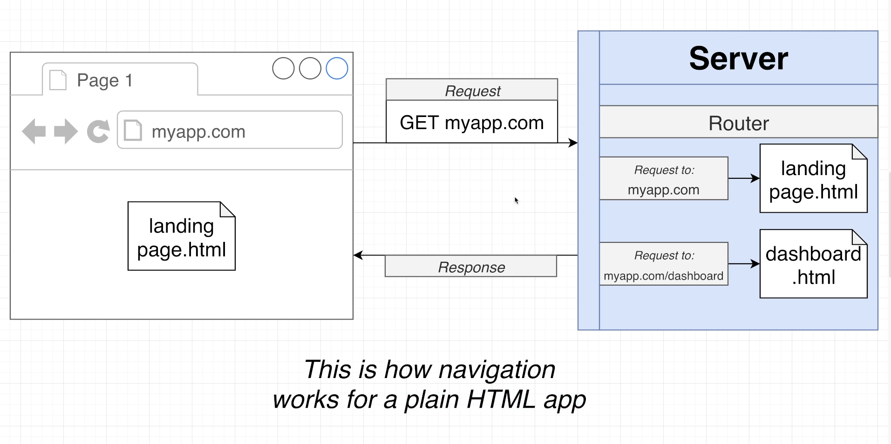
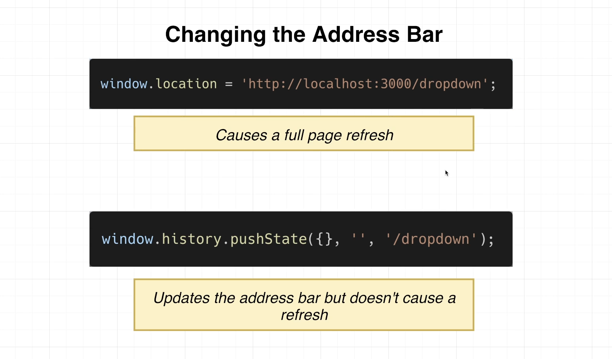
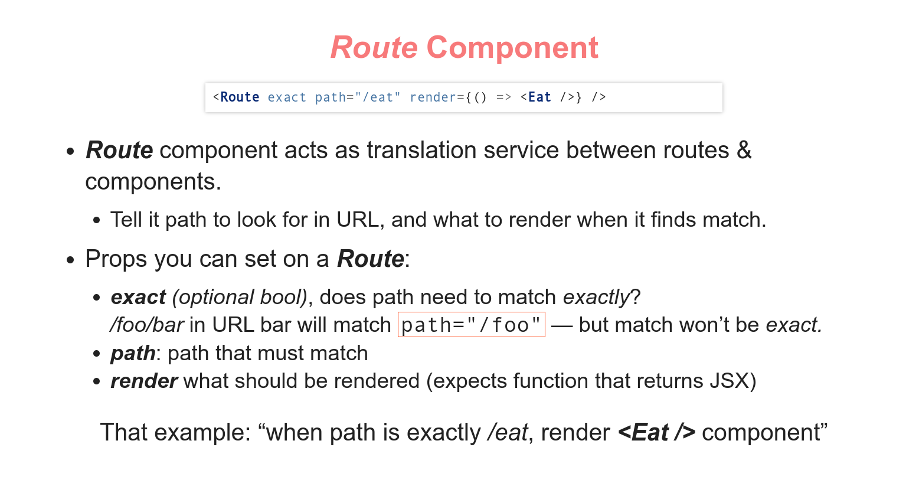

# INDEX

- [INDEX](#index)
  - [Routing](#routing)
    - [Server-Side Routing (Traditional Routing)](#server-side-routing-traditional-routing)
    - [Client Side Routing](#client-side-routing)
  - [Set Up](#set-up)
  - [Router Components](#router-components)
    - [`Route` Component](#route-component)
      - [Nested Routes with `outlet` (Index Pages)](#nested-routes-with-outlet-index-pages)
    - [`Switch` Component](#switch-component)
    - [`Link` component](#link-component)
      - [How does `Link` work](#how-does-link-work)
    - [`NavLink` Component](#navlink-component)
  - [Dynamic Routes (URL Params)](#dynamic-routes-url-params)
    - [`useParams` hook](#useparams-hook)
    - [`useSearchParams` hook](#usesearchparams-hook)
  - [Programmatically navigation](#programmatically-navigation)
    - [`useNavigate()` hook](#usenavigate-hook)
    - [Redirection](#redirection)
  - [Accessing the page's url](#accessing-the-pages-url)
  - [Fetcher](#fetcher)
  - [Protected Routes (Guarding Routes)](#protected-routes-guarding-routes)
    - [Method 1: creating a custom `ProtectedRoute` Route](#method-1-creating-a-custom-protectedroute-route)
    - [Method 2: creating a wrapper auto-navigation component](#method-2-creating-a-wrapper-auto-navigation-component)
  - [Prompt](#prompt)
  - [NEW: React Router with Data Loading (V6.4+)](#new-react-router-with-data-loading-v64)
    - [Defining Routes](#defining-routes)
    - [Fetching Data with React Router Loaders](#fetching-data-with-react-router-loaders)
    - [React router Actions](#react-router-actions)

---

## Routing

> The concept of **Routing**, is how to determine what pages to render based on the URL ( match different URLs to different UI views )
>
> - This enables users to navigate between different applications screens using the browser URL
> - It keeps the UI in-sync with the current browser URL

React Router turns React projects into single-page applications. It does this by providing a number of specialized components that manage the creation of links, manage the app's URL, provide transitions when navigating between different URL locations, and so much more.

### Server-Side Routing (Traditional Routing)

- Server decides what HTML to return based on URL request, and the entire page refreshes
  
- clicking a `<a>` link causes browser to request a new page & replace the entire DOM
  
  - The standard browser behavior when the browser loads a new HTML document is that "all existing javascript code **is dumped** and we will lose access to it"

---

### Client Side Routing

- **Fake CSR**:
  

  - We can actually create something closer to a client-side-routing using conditions and preventing-default-behavior on `<a>` links, and render components based on state condition, But this will not actually be routing, as we won't be able to track **history** (go back and forward...) and other more features
    

- **Real CSR** -> **React Router**

  - Here, all the HTML, Javascript, and CSS is loaded initially, and then the browser only loads the data that is needed for the page (the functionality is handled by javascript)
    

  - Sites that exclusively use client-side routing are **single-page-applications SPA**
    
    
    - It handles mapping between URL bar and the content which the user sees via browser rather than via server
      
    - here, we use Javascript to manipulate the URL bar with a web-api called **History**
      
    - also `pushState` method handles **backward button** in the browser (with maintaining the state and prevent refreshing) using the `popstate` event in `window.history`
  - The best thing is that the javascript environment is no longer being reset with navigation!
  -

- **SSR** vs **CSR**
  

---

## Set Up

- first install it

  ```bash
  npm install react-router-dom@6
  ```

- in `index.js` :

  ```jsx
  import { BrowserRouter } from 'react-router-dom';

  // then wrap the app in a BrowserRouter fragment
  // You may also use different types of router like "hashRouter"

  root.render(
    <React.StrictMode>
      <BrowserRouter>
        <App />
      </BrowserRouter>
    </React.StrictMode>
  );
  ```

- now in `App.js`

  - we now have access to router components and functionalities because the `App` component is wrapped within `<BrowserRouter></BrowserRouter>`

  ```js
  import { Route, Routes } from 'react-router-dom';

  function App() {
    return (
      // rapping the component in a routes and the route specify the endpoint
      <Routes>
        <Route path='/home' element={<Home />} />
        // means that when route matches "/home" -> render the Home component
      </Routes>
    );
  }
  ```

---

## Router Components

### `Route` Component




- **`exact`** matches the exact-full-path **ONLY IN VERSION 5**

  - not needed in v6

- one of its props is the prop responsible for referencing the component for the specified route, and this prop is `render=""` or `component=""`, and there's a difference between them:

  - `component`: When you use `component` prop, the component is **instantiated** per every call of Route#render. It means that, for your component that you pass to `component` prop of `Route`, `constructor`, `componentWillMount`, and `componentDidMount` will be executed every time the route is rendered.

    ```jsx
    // So when you have it like:
    <Route path="/:locale/store" component={Store} />
    // you can think of it as:
    <Route path="/:locale/store">
      <Store />
    </Route>
    ```

  - `render`: if you use `render` prop, the component is **evaluated** on every Route#render. Remember that every component is a function? This function will be executed as is, without any lifecycle methods.

    ```js
    // So when you have it like:
    <Route path="/:locale/store" render={Store} />
    // you can think of it as:
    <Route path="/:locale/store">
      {Store()}
    </Route>
    ```

  - Also, the source code explains it very good:

    ```js
    if (component) return match ? React.createElement(component, props) : null;

    if (render) return match ? render(props) : null;
    ```

  - Also, when you want to pass props to the component use `render` as it accepts a function unlike `component`

---

#### Nested Routes with `outlet` (Index Pages)

if you want nested Routes, we need to identify where the (nested-route corresponding component) will be using the **`<Outlet/>` component**:


- First, we add the nested route in the `parent route` as a `child route`

  ```jsx
  // in `app.js`
  function App() {
    return (
      // now we want to tell the parent component (Home) where we want the react-router-dom to render the nested-matching-element (Shop) --> using "Outlet component" from react-router-dom
      <Routes>
        <Route path='/home' element={<Home />}>
          <Route path='shop' element={<Shop />} />
        </Route>
      </Routes>
    );
  }
  ```

- Then, we add the `<Outlet/>` component in the `parent component` (Home) where we want the nested-matching-element (Shop) to be rendered

  ```jsx
  function Home() {
    // in `Home.jsx`
    return (
      <div>
        <Outlet />
        <h1>this is home page</h1>
      </div>
    );
  }
  ```

- `index` route:

  - It's the default route that will be rendered when the parent route is requested, if no nested route is specified

    ```jsx
    <Route path='/teams' element={<Teams />}>
      // will be automatically in the <Outlet /> for URL: "/teams"
      <Route index element={<TeamsIndex />} />
      // will be automatically in the <Outlet /> for URL: "/teams/:teamId"
      <Route path=':teamId' element={<Team />} />
    </Route>
    ```

---

### `Switch` Component

- `<Switch>` **ONLY IN OLD VERSION 5** -> It's **`<Routes>`** in version 6

- It Renders the first child `<Route>` or `<Redirect>` that matches the location.
- It makes sure that only one component from components with matching routes are displayed (limit only one match from a group of routes)
  - > as routes match partially as well as total match, **`/`** & **`/home`** will be fired when requesting `/home`
- It stops searching once it finds a match -> it displays the first match it finds, so the order is important or you can use **`exact`**

```js
import { Route, Switch } from 'react-router';

<Switch>
  <Route exact path='/'>
    <Home />
  </Route>
  <Route path='/about'>
    <About />
  </Route>
</Switch>;
```

- **Including a 404 route**:

  - You can make use of the order of routes in a `<Switch>` and put the 404 route last

    ```js
    return (
      <Switch>
        <Route exact path='/blog' render={() => <BlogHome />} />
        <Route exact path='/' render={() => <Home />} />
        <Route render={() => <NotFound />} />
      </Switch>
    );
    ```

  - OR: to make a "not found page (404)" make: `path="*"`

---

### `Link` component

- when you want to change the page's URL, we don't use `<a>` as it will make the page **reload**(make a new request)
- Instead we use `<Link>` component from `react-router-dom`
- **Notes**:
  - `<Link>` can be represented as `<a>` in **css**
  - clicking on `<link>` doesn't issue a GET request, as javascript intercepts click and does client-side-routing

```js
import { Link } from 'react-router-dom';

<Link to='/about'>About Us</Link>;
```

#### How does `Link` work


---

### `NavLink` Component

- `<NavLink>` is just like `link`, with one additional feature:

  - If at page that link would go to, the `<a>` gets a CSS class of **`active`**
  - This lets you stylize links to "page you are already at" using the `activeStyle` (in-line) or `activeClassName` props

- You should include an `exact` prop here as well
- It's Very helpful for navigation menus

```jsx
import React, { Component } from 'react';
import { NavLink } from 'react-router-dom';
import './NavBar.css';

class NavBar extends Component {
  render() {
    const activeStyle = {
      fontWeight: 'bold',
      color: 'mediumorchid'
    };
    return (
      <nav>
        <NavLink
          className={{navData => navData.isActive ? 'name_of_the_custom_active_class' : ''}}
          to='/about'
        >
          About Us
        </NavLink>
      </nav>
    );
  }
}
```

---

## Dynamic Routes (URL Params)

The `URL` is a great place to store UI state and an alternative to using `useState` in some situations. For example, if you have a search box that filters a list of items, you can use the `URL` to store the current search term.

- It's an easy way to store `state` in a global place (the URL), which is accessible to all components in the app.
- It's a good way to pass data from one page to another.
- It enables users to **bookmark** and **share** the page with the exact UI it has at that moment to other users.
- Here we use query-parameters `/:param` to pass data to the component
  

  ```jsx
  <Route path='/product/:productId' component={Product} />
  ```

### `useParams` hook

- to access this **param** we use `useParams` hook

  ```jsx
  <Route path='/product/:productId' component={Product} />
  ```

  ```jsx
  // in Product.jsx
  import { useParams } from 'react-router-dom';

  const params = useParams();
  // or const {productId} = useParams()

  console.log(params.productId);
  ```

- **OLD WAY (class components)**: Here we use the `routeProps` and pass it as a prop to the component if you are using `render={()=> <Component/>}`, or just use `component={Component}` without passing anything

  ```jsx
  <Route path='/food/:name' render={routeProps => <Food {...routeProps} />} />
  ```

  

---

### `useSearchParams` hook

- It's used to access the query-parameters in the URL

  ```jsx
  <Link to='/product?search=apple'>Apple</Link>
  ```

  ```jsx
  // in Product.jsx
  import { useSearchParams } from 'react-router-dom';

  const [searchParams, setSearchParams] = useSearchParams();

  console.log(searchParams.get('search'));
  ```

---

## Programmatically navigation

### `useNavigate()` hook

- It's used to navigate to a specific page programmatically

> In the background, this hook are used to get the return value of `useContext(NavigationContext)` which has the data for navigation, and we use the hooks to simplify our code from a lot of importing

```jsx
import { useNavigate } from 'react-router-dom';

const navigate = useNavigate();

// ...in a handler-function
navigate('/home');
```

- To navigate `back` and `forward`:

  ```jsx
  import { useNavigate } from 'react-router-dom';

  const navigate = useNavigate();

  // ...in a handler-function
  navigate(-1); // go back
  navigate(1); // go forward
  ```

- **Version 5** it's done using `useHistory()` hook

  - `history.replace` vs `history.push`:

    - in case of `push` - a new record is added in the history, and user can go back
    - in case of `replace` it deletes the last record and puts the new one. So if you will not use the go back
      - > Usually when redirecting from an invalid url

    ```jsx
    import { useHistory } from 'react-router-dom';

    const history = useHistory();

    // ...in a handler-function
    history.push('/home');

    //-----------------------------//
    // V6
    const navigate = useNavigate();

    // ...in a handler-function
    navigate('/home', { push: true });
    ```

---

### Redirection

In order to redirect to another page, when a certain condition is met, we use `<Navigate>` component

- It's used to redirect to a specific page programmatically
- Not used anymore in **version 6**, as we use `useNavigate()` hook
- Here, when accessing `/login` page, if the user is authenticated, we redirect to `/dashboard` page, else we render the `Login` component

  ```jsx
  <Route path='/login'>
    {isAuthenticated ? <Navigate to='/dashboard' /> : <Login />}
  ```

- In order to maintain the `history stack` when redirecting, we use `replace` prop

  ```jsx
  <Route path='/login'>
    {isAuthenticated ? <Navigate to='/dashboard' replace /> : <Login />}
  ```

  - > Usually when redirecting from an invalid url

---

## Accessing the page's url

It's done using `useLocation()` hook

- usually used to access query-parameters

```js
import { useLocation } from 'react-router-dom';

const location = useLocation();

// for parameters
const queryParams = new URLSearchParameters(location.search);

const something = queryParams.get('wanted_param');
```

---

## Fetcher

It's used to perform HTTP requests to the server without reloading the page (changing the URL)

- It's done using `useFetcher()` hook
- It gives us access to the **state** of the request (`pending`, `success`, `error`)

  ```jsx
  import { useFetcher } from 'react-router-dom';

  export const Product = () => {
    const fetcher = useFetcher();

    const handleDelete = () => {
      fetcher.delete(`/products/${productId}`);
    };

    return (
      <div>
        <button onClick={handleDelete}>Delete</button>
      </div>
      <fetcher.Pending>
      <div>Loading...</div>
    </fetcher.Pending>
    );
  };
  ```

---

## Protected Routes (Guarding Routes)

Protected routes are a way to restrict access to certain parts of your web application based on user authentication or permissions. In this context, a protected route is a route that is only accessible by authenticated users or users with specific permissions.

### Method 1: creating a custom `ProtectedRoute` Route

1. Create custom authentication `context` provider `AuthContext`

   ```jsx
   import { createContext, useContext, useState } from 'react';

   const AuthContext = createContext();

   export const useAuth = () => useContext(AuthContext);

   export const AuthProvider = ({ children }) => {
     const [isAuthenticated, setIsAuthenticated] = useState(false);

     const login = () => setIsAuthenticated(true);
     const logout = () => setIsAuthenticated(false);

     const value = { isAuthenticated, login, logout };

     return <AuthContext.Provider value={value}>{children}</AuthContext.Provider>;
   };
   ```

   - It will be used to provide the authentication state to the whole app (highest level)

2. Create a `ProtectedRoute` component

   ```jsx
   import { Route, Redirect } from 'react-router-dom';
   import { useAuth } from './AuthContext';

   const ProtectedRoute = ({ component: Component, ...rest }) => {
     const { isAuthenticated } = useAuth();

     return (
       <Route
         {...rest}
         render={props => {
           return isAuthenticated ? <Component {...props} /> : <Redirect to='/login' />;
         }}
       />
     );
   };

   export default ProtectedRoute;
   ```

3. Use `ProtectedRoute` in your routing

   ```jsx
   import { BrowserRouter as Router, Switch, Route } from 'react-router-dom';
   import ProtectedRoute from './ProtectedRoute';
   import { AuthProvider } from './AuthContext';

   const App = () => {
     return (
       <Router>
         <AuthProvider>
           <Routes>
             <Route path='/login' component={Login} />
             <ProtectedRoute path='/dashboard' component={Dashboard} />
           </Routes>
         </AuthProvider>
       </Router>
     );
   };

   export default App;
   ```

---

### Method 2: creating a wrapper auto-navigation component

1. Create custom authentication `context` provider `AuthContext`

2. Create a `ProtectedRoute` component

   ```jsx
   import { useAuth } from './AuthContext';

   const ProtectedRoute = ({ children }) => {
     const { isAuthenticated } = useAuth();
     navigate = useNavigate();

     // if not authenticated -> navigate to login page
     useEffect(() => {
       if (!isAuthenticated) {
         navigate('/login');
       }
     }, [isAuthenticated, navigate]);

     return isAuthenticated ? children : null; // to prevent rendering the errors between renders
   };

   export default ProtectedRoute;
   ```

3. Wrap the `ProtectedRoute` component around the components that require authentication

   ```jsx
   import { BrowserRouter as Router, Switch, Route } from 'react-router-dom';
   import ProtectedRoute from './ProtectedRoute';
   import { AuthProvider } from './AuthContext';

   const App = () => {
     return (
       <Router>
         <AuthProvider>
           <Routes>
             <Route path='/login' component={Login} />
             <Route path='/dashboard'>
               <ProtectedRoute>
                 <Dashboard />
               </ProtectedRoute>
             </Route>
           </Routes>
         </AuthProvider>
       </Router>
     );
   };

   export default App;
   ```

---

## Prompt

Used to prompt the user before navigating away from a page. When your application enters a state that should prevent the user from navigating away (like a form is half-filled out), render a `<Prompt>`.

- [Guide](https://v5.reactrouter.com/core/api/Prompt)

---

## NEW: React Router with Data Loading (V6.4+)

From version 6.4, we can use `useRoutes()` hook to load data before rendering the component -> **Fetching data before rendering the component**

> React Router Documentation is best for this topic. So follow it for guidance

### Defining Routes

- It introduced a new way of defining routes in React applications. Instead of using the `<Route>` component, we can now use the `createBrowserRouter()` hook to define routes.

  ```jsx
  // in App.js
  import { createBrowserRouter } from 'react-router-dom';
  import AppLayout from './AppLayout';
  import Home from './Home';
  import Menu from './Menu';

  const router = createBrowserRouter({
    routes: [
      {
        path: '/',
        element: <AppLayout />,
        // in AppLayout.jsx we use <Outlet /> to render the children
        children: [
          {
            path: '/',
            element: <Home />
          },
          {
            path: '/menu',
            element: <Menu />
          }
        ]
      }
    ]
  });

  const App = () => {
    return <RouterProvider router={router}/>>
  };
  ```

- We can also use `useRoutes()` hook to define routes

  ```jsx
  // in App.js
  import { useRoutes } from 'react-router-dom';
  import AppLayout from './AppLayout';
  import Home from './Home';
  import Menu from './Menu';

  const routes = [
    {
      path: '/',
      element: <AppLayout />,
      // in AppLayout.jsx we use <Outlet /> to render the children
      children: [
        {
          path: '/',
          element: <Home />
        },
        {
          path: '/menu',
          element: <Menu />
        }
      ]
    }
  ];

  const App = () => {
    const element = useRoutes(routes);
    return element;
  };
  ```

- Difference between `useRoutes()` and `createBrowserRouter()` is that `useRoutes()` is a hook, and `createBrowserRouter()` is a function used to create a custom router that can be passed to `useRoutes()`

---

### Fetching Data with React Router Loaders

- It changed the way we fetch data in React applications. Instead of fetching data in the component, we can now fetch data in the route.

  - we use `createBrowserRouter` to create a custom router, and pass it to `useRoutes()`
  - in the old version, we followed the approach of:
    - **"Fetch after rendering the component"**
  - Now, we follow the approach of:
    - **"Render after fetching the data"**
    - fetching / side-effects are done in the **router**, and not in the component

- To use `loaders`, we create a `loader-function` that fetches data from an API, then, we provide the `loader-function` to the route, and then that route will fetch the data as soon as we go to that route.

  - Once the data has arrived, we can access it in the component using the `useLoaderData()` hook.
  - in order to access the URL params in the `loader-function`, we can't use `useParams()` hook because it's a hook and can't be used outside a component, so the `loader-function` automatically receives the `{params}` as an argument

  ```jsx
  // in Menu.jsx
  import { useLoaderData } from 'react-router-dom';

  export const Menu = () => {
    const { data } = useLoaderData();
    return <div>{data}</div>;
  };

  export function menuLoader({ params }) {
    return fetch(`https://api.example.com/menu/${params.id}`).then(res => res.json());
  }

  // ---------------------------------- //

  // in App.js
  import { createBrowserRouter } from 'react-router-dom';
  import Home from './Home';
  import { Menu, menuLoader } from './Menu';

  const router = createBrowserRouter({
    routes: [
      {
        path: '/',
        element: <Home />
      },
      {
        path: '/menu',
        element: <Menu />,
        loader: menuLoader // here we pass the loader function
      }
    ]
  });
  ```

- **Loading State**:

  - When accessing the route it will wait until the data is fetched, and then render the component, which may take time, and we want to show a loading state until the data is fetched, so we use the `state` property in the route to specify the loading state -> `useNavigation()` hook will return the `state` property

  ```jsx
  // in Menu.jsx
  import { useNavigation, useLoaderData } from 'react-router-dom';

  export const Menu = () => {
    const navigation = useNavigation();
    const isLoading = navigation.state === 'loading';
    const { data } = useLoaderData();

    if (isLoading) {
      return <div>Loading...</div>;
    }

    return <div>{data}</div>;
  };
  ```

- **Error State**:

  - We can handle error in the component:

    - If the data fetching fails, we want to show an error state, so we use the `state` property in the route to specify the error state -> `useNavigation()` hook will return the `state` property

    ```jsx
    // in Menu.jsx
    import { useNavigation, useLoaderData } from 'react-router-dom';

    export const Menu = () => {
      const navigation = useNavigation();
      const isLoading = navigation.state === 'loading';
      const isError = navigation.state === 'error';
      const { data } = useLoaderData();

      if (isLoading) {
        return <div>Loading...</div>;
      }

      if (isError) {
        return <div>Error!</div>;
      }

      return <div>{data}</div>;
    };
    ```

- Or, we can handle error in the **router**

  - we can pass `errorElement` to the route, and it will be rendered if the data fetching fails

    ```jsx
    // in App.js
    import { createBrowserRouter } from 'react-router-dom';
    import Home from './Home';
    import Error from './Error';

    const router = createBrowserRouter({
      routes: [
        {
          path: '/',
          element: <Home />,
          errorElement: <Error /> // here we pass the error element
        }
      ]
    });
    ```

  - in the `<Error />` component, we can access the `error` using `useRouteError()` hook

    ```jsx
    // in Error.jsx
    import { useRouteError } from 'react-router-dom';

    export const Error = () => {
      const error = useRouteError();
      return <div>{error.message}</div>;
    };
    ```

---

### React router Actions

It's used to send `POST / PUT / DELETE` requests to the server when navigating to a route, and it's done using `action` property in the route

```jsx
// in App.js
import { createBrowserRouter } from 'react-router-dom';
import Home from './Home';
import { CreateOder, createOrderAction } from './CreateOrder';

const router = createBrowserRouter({
  routes: [
    {
      path: '/',
      element: <Home />
    },
    {
      path: '/create-order',
      element: <CreateOrder />,
      action: createOrderAction // here we pass the action function, and whenever there's a form submission, it will send a POST request to the server using the action function
    }
  ]
});

// ---------------------------------- //

// in CreateOrder.jsx
import { useNavigate } from 'react-router-dom';

export const CreateOrder = () => {

  const cart = {
    items: [
      {
        id: 1,
        name: 'Pizza',
        price: 10
      }
    ]
  };

  return (
    // <Form method='post' action='/create-order'>
    {/* or */}
    <Form method='post'>
      <input type='hidden' name='cart' value={JSON.stringify(cart)} />
      <button type='submit'>Create Order</button>
    </Form>
  );
}

export async function createOrderAction({ request }) {
  const formData = await request.formData();
  const data = Object.fromEntries(formData);

  const order = {
    cart: JSON.parse(data.cart)
  };

  await fetch('https://api.example.com/orders', {
    method: 'POST',
    body: JSON.stringify(order)
  });

  // finally redirect to the home page
  return redirect('/');
}
```
