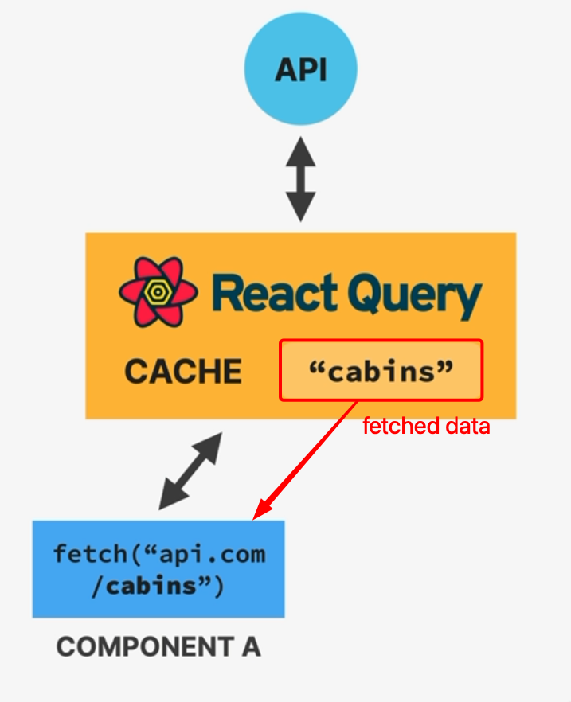
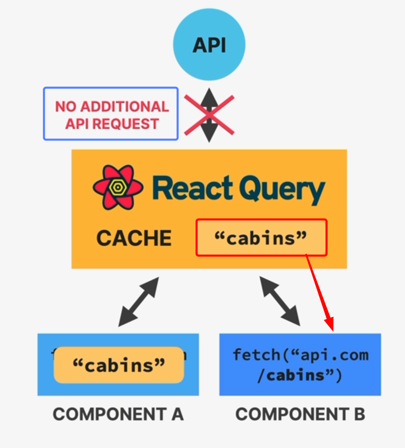
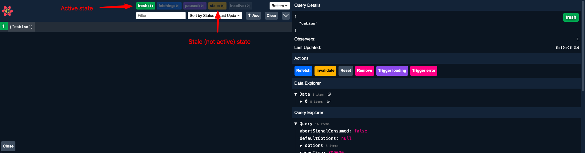

# INDEX

- [INDEX](#index)
  - [React Query (Tanstack Query)](#react-query-tanstack-query)
  - [Setup](#setup)
  - [Fetching Data (Queries)](#fetching-data-queries)
    - [Prefetching Data](#prefetching-data)
  - [Mutating Data (Create, Update, Delete)](#mutating-data-create-update-delete)
  - [React Query Custom Hooks](#react-query-custom-hooks)
  - [React Query DevTools](#react-query-devtools)

---

## React Query (Tanstack Query)

It's a library for managing (remote state) in React. It's a replacement for Redux, MobX, Apollo Client, etc.

> "Remote state" is state that is fetched from a remote server, like a `REST` API or `GraphQL` API.

- It contains many features that allow us to write less code and have a better user experience `UX`.
- All remote data is **cached** in memory by default, so that it can be used again without having to fetch it again in another component.
  
  

- It **automatically** provides:
  - loading & error states
  - re-fetching stale data in the background to keep it synched with the application
- It can Pre-fetch data before it's needed (e.g. when the user clicks on a navigation link)
- It provides easy remote state **mutation**
- Offline support -> It can store data in `localStorage` or `IndexedDB` and synchronize it with the server when the user is back online.

- **Notes**
  - It's actually called `Tanstack Query` because it's part of a larger ecosystem of libraries called `Tanstack` (T stands for TypeScript).
    - it's not only for `React`, it can be used with `Vue` or `Angular` as well.

---

## Setup

After installing the library, we need to wrap our application with the `QueryClientProvider` component.

```jsx
import { QueryClient, QueryClientProvider } from 'react-query';

const queryClient = new QueryClient(); // create a new instance of QueryClient

function App() {
  return (
    <QueryClientProvider client={queryClient}>
      <div className='App'>...</div>
    </QueryClientProvider>
  );
}
```

- we can pass options to the `QueryClient` constructor, like `defaultOptions` for example.

  ```jsx
  const queryClient = new QueryClient({
    defaultOptions: {
      queries: {
        staleTime: 5 * 60 * 1000 // 5 minutes -> how long the data should be considered fresh (up to date)
      }
    }
  });
  ```

- To access the `QueryClient` instance from anywhere in our application, we can use the `useQueryClient` hook.

  ```jsx
  import { useQueryClient } from 'react-query';

  function Component() {
    const queryClient = useQueryClient();
    // ...
  }
  ```

  - it's useful when we want to invalidate a query manually, for example when we want to refetch the data when the user clicks on a button.

---

## Fetching Data (Queries)

- We can fetch data using the `useQuery` hook.

  ```jsx
  import { useQuery } from 'react-query';

  const fetchTodos = async () => {
    const res = await fetch('https://jsonplaceholder.typicode.com/todos');
    return res.json();
  };

  function Component() {
    const { data, isLoading, error } = useQuery('todos', fetchTodos);
    // or
    const { data, isLoading, error } = useQuery({
      queryKey: 'todos',
      queryFn: fetchTodos
    });

    if (isLoading) return <div>Loading...</div>;
    if (error) return <div>Something went wrong...</div>;

    return (
      <div>
        {data.map(todo => (
          <div key={todo.id}>{todo.title}</div>
        ))}
      </div>
    );
  }
  ```

- the first argument is the `queryKey` which is a unique identifier for the query.
  - it can be a `string` or an `array` of `strings`.
  - it's used to cache the data in memory.
- the second argument is the `queryFn` which is a function that returns a `Promise` that resolves to the data we want to fetch.
  - it's called every time the data is needed.
  - it's called in the background to keep the data up to date.
  - it's called when the user clicks on the `refetch` button.
- the `useQuery` hook returns an object with the following properties:

  - `data`: the data returned by the `queryFn`.
  - `isLoading`: a boolean that indicates if the data is being fetched.
  - `error`: an error object if the data fetching failed.
  - `isFetching`: a boolean that indicates if the data is being fetched or refetched.
  - `refetch`: a function that refetches the data.
  - `isSuccess`: a boolean that indicates if the data fetching was successful.
  - `isError`: a boolean that indicates if the data fetching failed.
  - `status`: a string that indicates the status of the query (`loading`, `error`, `success`).
  - `failureCount`: a number that indicates how many times the data fetching failed.
  - `isStale`: a boolean that indicates if the data is stale (not up to date).
  - `canFetchMore`: a boolean that indicates if there is more data to fetch.
  - `remove`: a function that removes the query from the cache.
  - `updateQuery

- **Notes:**
  - When you want React Query to depend on other side effects or variables ( other than the main requested data ), you can use the `queryKey` array to specify the dependencies.

---

### Prefetching Data

- We can use **prefetching** feature to fetch data before it's needed (e.g. when the user clicks on a navigation link).

  ```jsx
  import { useQueryClient } from 'react-query';

  function Component() {
    const queryClient = useQueryClient();

    const handleClick = () => {
      queryClient.prefetchQuery('todos', fetchTodos);
    };

    return (
      <div>
        <button onClick={handleClick}>Prefetch</button>
      </div>
    );
  }
  ```

  - the `prefetchQuery` function takes the same arguments as the `useQuery` hook.
  - it returns a `Promise` that resolves to the data.

- It's commonly used for: **navigation**, **pagination**, **infinite scrolling**, etc.

---

## Mutating Data (Create, Update, Delete)

- We can mutate data using the `useMutation` hook.

  ```jsx
  import { useMutation } from 'react-query';

  const createTodo = async todo => {
    const res = await fetch('https://jsonplaceholder.typicode.com/todos', {
      method: 'POST',
      body: JSON.stringify(todo),
      headers: {
        'Content-type': 'application/json; charset=UTF-8'
      }
    });
    return res.json();
  };

  function Component() {
    const [mutate, { isLoading, error }] = useMutation(createTodo);
    // or
    const [mutate, { isLoading, error }] = useMutation({
      mutationFn: createTodo
    });
    // now, we use the "mutate" function to create a new todo

    const handleSubmit = e => {
      e.preventDefault();
      mutate({ title: 'New todo', completed: false });
    };

    if (isLoading) return <div>Loading...</div>;
    if (error) return <div>Something went wrong...</div>;

    return (
      <div>
        <form onSubmit={handleSubmit}>
          <input type='text' />
          <button type='submit'>Add</button>
        </form>
      </div>
    );
  }
  ```

- the `useMutation` hook returns an array with two elements:

  - the first element is the `mutate` function that we use to mutate the data.
  - the second element is an object with the following properties:
    - `isLoading`: a boolean that indicates if the data is being mutated.
    - `error`: an error object if the data mutation failed.
    - `isSuccess`: a boolean that indicates if the data mutation was successful.
    - `isError`: a boolean that indicates if the data mutation failed.
    - `reset`: a function that resets the mutation state.
    - `status`: a string that indicates the status of the mutation (`loading`, `error`, `success`).
    - `failureCount`: a number that indicates how many times the data mutation failed.
    - `reset`: a function that resets the mutation state.
    - `onSuccess`: a function that is called when the data mutation is successful.
    - `onError`: a function that is called when the data mutation fails.
    - `onSettled`: a function that is called when the data mutation is successful or fails.

- We can perform actions after the data mutation is successful or fails.

  ```jsx
  const [mutate, { isLoading, error }] = useMutation(createTodo, {
    onSuccess: () => {
      // do something
    },
    onError: () => {
      // do something
    }
  });
  ```

  - EX: we can refetch the data after the mutation is successful.

    ```jsx
    const [mutate, { isLoading, error }] = useMutation(createTodo, {
      onSuccess: () => {
        queryClient.invalidateQueries('todos'); // invalidate the query by making the data stale
      }
    });
    ```

---

## React Query Custom Hooks

It's a good practice to create custom hooks for fetching data with `React Query` and use them in our components.

```jsx
// useTodos.js
import { useQuery } from 'react-query';

const fetchTodos = async () => {
  const res = await fetch('https://jsonplaceholder.typicode.com/todos');
  return res.json();
};

export default function useTodos() {
  return useQuery('todos', fetchTodos);
}
```

```jsx
// Component.js
import useTodos from './useTodos';

function Component() {
  const { data, isLoading, error } = useTodos();

  // ... logic
}
```

---

## React Query DevTools


