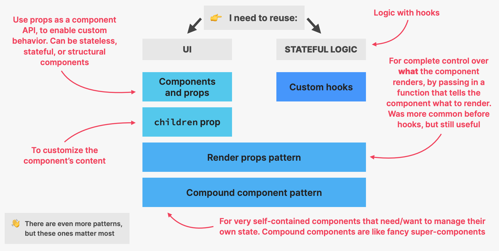
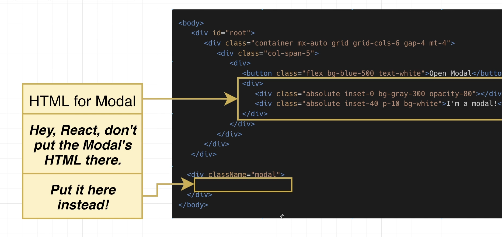
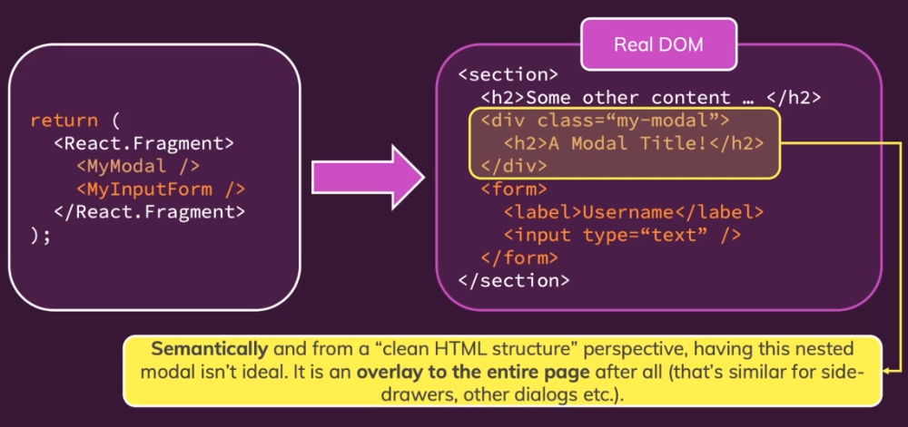
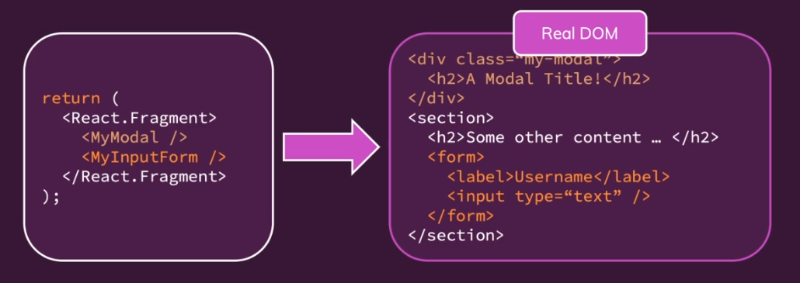
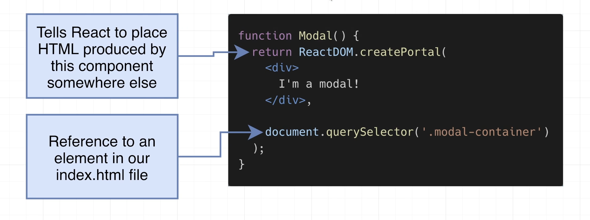

# INDEX

- [INDEX](#index)
  - [Code Reusability](#code-reusability)
  - [Render Props Pattern](#render-props-pattern)
  - [Higher Order Components (HOC)](#higher-order-components-hoc)
  - [Compound Component Pattern (Most Popular 🥇)](#compound-component-pattern-most-popular-)
    - [CCP Examples](#ccp-examples)
  - [Portals](#portals)
    - [Modal notes](#modal-notes)
  - [Best Practices](#best-practices)
  - [Error Boundaries](#error-boundaries)
    - [Error Boundaries in Class Components](#error-boundaries-in-class-components)
    - [Error Boundaries in Functional Components](#error-boundaries-in-functional-components)

---

## Code Reusability

How to re-use code in React


- **Reusing UI**:
  - `components` -> we can reuse components and pass different `props` to them to make them generic and reusable
  - `children` -> we can pass children to components and render them inside the component
- **Reusing Logic**:

  - `HOC` -> Higher Order Components
  - `Hooks` -> Custom Hooks

- **Compound Components**:
  - `Compound Components` -> Components that work together to form a complete UI
  - `Context` -> Context is designed to share data that can be considered “global” for a tree of React components
  - `Render Props` -> The term “render prop” refers to a simple technique for sharing code between React components using a prop whose value is a function

---

## Render Props Pattern

The term “render prop” refers to a simple technique for sharing code between React components using a `prop` whose value is a function **(Pass JSX elements to components through props)**

- Here, we pass a function as a prop (called `render`) to the component and the component calls that function and passes its state to it
- The function then returns the UI that needs to be rendered
- This way, we can reuse the logic and the UI of the component

```jsx
// App.jsx
import React from 'react';

// Title component that renders the function passed to it as a prop
const Title = props => props.render();

function App() {
  return (
    <div className='App'>
      <Title render={() => <h1>Hello World</h1>} />
      <Title render={() => <h1>Hi World</h1>} />
    </div>
  );
}
```

- **Note:**
  - This used to be the main way of sharing stateful logic between components before the introduction of **hooks**, and now it's not used as much except for some complex cases
  - More [here](https://www.patterns.dev/posts/render-props-pattern)

---

## Higher Order Components (HOC)

A higher-order component (HOC) is an advanced technique in React for reusing component logic. HOCs are not part of the React API, per se. They are a pattern that emerges from React’s compositional nature.

- A higher-order component is a function that takes a component and returns a new component which has more functionality **(Enhanse components**)
- It's used to share logic between components by wrapping them in a `HOC` and passing the logic as a prop to the component
- It's almost not used anymore since the introduction of **hooks** and **context**, but it's still used in some cases

```jsx
// App.jsx
import React from 'react';

// HOC that takes a component and returns a new component
function withTitle(WrappedComponent) {
  // The new component that will be returned
  return function () {
    // The logic that will be shared between components
    const title = 'Hello World';

    // The component that will be wrapped
    return <WrappedComponent title={title} />;
  };
}

// Component that will be wrapped
function Title(props) {
  return <h1>{props.title}</h1>;
}

// Wrapping the Title component with the withTitle HOC
const TitleWithHOC = withTitle(Title);

function App() {
  return (
    <div className='App'>
      <TitleWithHOC />
    </div>
  );
}
```

---

## Compound Component Pattern (Most Popular 🥇)

It's a pattern that makes us create set of related components that work together to form a complete UI (achieve common tasks)

- It's done by creating a `parent` component that renders the `children` components and passes them the state and the logic they need to work together to form a complete UI
- the `parent` component will have a shared ( `state` and `context` ) that will be shared between the `children` components
- This way, we can reuse the logic and the UI of the components

- **Steps:**

  1. Create a parent component with a shared `state` and `context`, and create `children` components to help implementing the common task and add them as `properties` to the `parent` component

     ```jsx
     // Counter.jsx
     import { createContext, useContext, useState } from 'react';

     // 1. Create a context
     const CounterContext = createContext();

     // 2. Create parent component
     function Counter({ children }) {
       const [count, setCount] = useState(0);
       const increase = () => setCount(c => c + 1);
       const decrease = () => setCount(c => c - 1);

       return (
         <CounterContext.Provider value={{ count, increase, decrease }}>
           <span>{children}</span>
         </CounterContext.Provider>
       );
     }

     // 3. Create children components to help implementing the common task
     function Count() {
       const { count } = useContext(CounterContext);
       return <span>{count}</span>;
     }

     function Label({ children }) {
       return <span>{children}</span>;
     }

     function Increase({ icon }) {
       const { increase } = useContext(CounterContext);
       return <button onClick={increase}>{icon}</button>;
     }

     function Decrease({ icon }) {
       const { decrease } = useContext(CounterContext);
       return <button onClick={decrease}>{icon}</button>;
     }

     // 4. Add child components as proeprties to parent component
     Counter.Count = Count;
     Counter.Label = Label;
     Counter.Increase = Increase;
     Counter.Decrease = Decrease;

     export default Counter;
     ```

  2. Use the `parent` component and pass the `children` components as children to it

     ```jsx
     // App.jsx
     import React from 'react';
     import Counter from './Counter';

     function App() {
       return (
         <div className='App'>
           <Counter>
             <Counter.Label>Count: </Counter.Label>
             <Counter.Count />
             <Counter.Increase icon='+' />
             <Counter.Decrease icon='-' />
           </Counter>
         </div>
       );
     }

     export default App;
     ```

- **Note:**
  - This pattern is used in many libraries like `react-router` and `react-bootstrap`

---

### CCP Examples

- **Modal** -> // TODO: add example
- **Table** -> // TODO: add example

---

## Portals

Portals provide a first-class way to render children into a DOM node that exists **outside the DOM hierarchy** of the parent component but inside the component tree hierarchy of the React application. (Render elements outside the `parent` component)

- it helps for more `semantic HTML`
- usually with **modals**
- we use it with **modals** as a modal will only work correctly when it doesn't have a CSS-Positioned parent element, so that the parent will be `<body>` element, but Real projects use CSS-positioned-parents and this is solved with **Portals**
  
  - the modal `div` will never have a CSS-Positioned-Parent. so the modal will be positioned relative to the HTML document, and will always fill the entire screen

Implementation:

- without portals 
- with portals 

Portals need 2 things:


- the child is a React element
- (the container): the DOM location(node) to which the portal should be injected

```js
import ReactDOM from 'react-dom';

ReactDOM.createPortal(child, container);
```

### Modal notes

- when showing the modal, We should prevent scrolling in the page, and this can be done with `useEffect` hook:

  ```js
  function Modal({...}){
    useEffect(() => {
      // using tailwind class
      document.body.classList.add('overflow-hidden');

      // cleanup function when closing the modal
      return () => {
        document.body.classList.remove('overflow-hidden');

      }
    }, [])
    return ReactDom.createPortal(...)
  }
  ```

- when you want to make the modal appear where you are currently and not in the beginning of the page, use `position: fixed` instead of `absolute`

---

## Best Practices

- When we have a magic number in our code, we should extract it to a constant outside the component and use it inside the component (So that it can be reused and changed easily)

  ```jsx
  // Bad
  function Component() {
    return <div style={{ width: '100px' }}>Hello World</div>;
  }

  // Good
  const WIDTH = '100px';
  function Component() {
    return <div style={{ width: WIDTH }}>Hello World</div>;
  }
  ```

---

## Error Boundaries

Error Boundaries basically provide some sort of boundaries or checks on errors, They are React components that are used to handle JavaScript errors in their `child component tree`.

- Error boundaries are React components that catch JavaScript errors anywhere in their child component tree, log those errors, and display a fallback UI instead of the component tree that crashed. Error boundaries catch errors during rendering, in lifecycle methods, and in constructors of the whole tree below them.
- Can be only used with `class components`, because they use `lifecycle methods` like `componentDidCatch` and `getDerivedStateFromError`
  - Note: to use it with `functional components`, we use external library called `react-error-boundary`
- Error boundaries work like a JavaScript `catch {} block`, but for components.

### Error Boundaries in Class Components

```jsx
class ErrorBoundary extends React.Component {
  constructor(props) {
    super(props);
    this.state = { hasError: false };
  }

  static getDerivedStateFromError(error) {
    // Update state so the next render will show the fallback UI.
    return { hasError: true };
  }

  componentDidCatch(error, errorInfo) {
    logErrorToMyService(error, errorInfo);
    // You can also log the error to an error reporting service
    // console.error(error, errorInfo)
  }

  render() {
    if (this.state.hasError) {
      // You can render any custom fallback UI
      return <h1>Something went wrong.</h1>;
    }

    return this.props.children;
  }
}

// Then you can use it as a regular component:
<ErrorBoundary>
  <MyWidget />
</ErrorBoundary>;
```

### Error Boundaries in Functional Components

It's done using external library called `react-error-boundary`, this is because functional components don't have `lifecycle methods` like `componentDidCatch` and `getDerivedStateFromError`

```jsx
import { ErrorBoundary } from 'react-error-boundary';

function ErrorFallback({ error, resetErrorBoundary }) {
  return (
    <div role='alert'>
      <p>Something went wrong:</p>
      <pre>{error.message}</pre>
      <button onClick={resetErrorBoundary}>Try again</button>
    </div>
  );
}

function Bomb() {
  throw new Error('💥 CABOOM 💥');
}

// Wrap your entire app in an ErrorBoundary to catch all errors in the app
function App() {
  return (
    <div>
      <ErrorBoundary FallbackComponent={ErrorFallback}>
        <Bomb />
      </ErrorBoundary>
    </div>
  );
}

// or wrap it around the whole main component (index.js)
ReactDOM.createRoot(document.getElementById('root')).render(
  <ErrorBoundary FallbackComponent={ErrorFallback}>
    <App />
  </ErrorBoundary>
);
```

---
