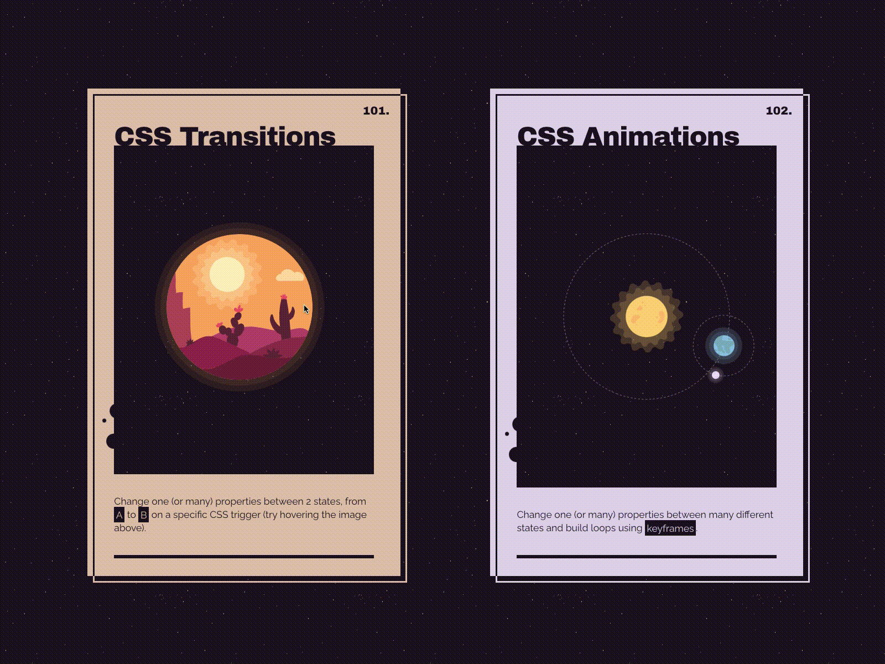

# INDEX

- [INDEX](#index)
  - [Vue](#vue)
    - [How it works?](#how-it-works)
      - [Reactivity and Proxies](#reactivity-and-proxies)
        - [Proxies Summary](#proxies-summary)
      - [Templates Syntax](#templates-syntax)
      - [Virtual DOM](#virtual-dom)
    - [Ways of Using Vue](#ways-of-using-vue)
  - [Instance LifeCycle](#instance-lifecycle)
    - [Lifecycle Hooks](#lifecycle-hooks)
      - [The Creation Hooks](#the-creation-hooks)
      - [The Mounting Hooks](#the-mounting-hooks)
      - [The Updating Hooks](#the-updating-hooks)
      - [The Destroying Hooks](#the-destroying-hooks)
    - [LifeCycle Notes](#lifecycle-notes)
  - [Data](#data)
    - [Interpolation](#interpolation)
    - [Directives](#directives)
      - [Binding data (`v-bind`)](#binding-data-v-bind)
    - [v-model (2 Way Binding)](#v-model-2-way-binding)
      - [2 way binding for elements in a child-component or custom element component](#2-way-binding-for-elements-in-a-child-component-or-custom-element-component)
      - [Modifiers](#modifiers)
      - [Custom Directives](#custom-directives)
    - [Refs](#refs)
      - [Accessing the Refs](#accessing-the-refs)
    - [ref vs v-model](#ref-vs-v-model)
  - [Methods](#methods)
    - [Event Handling (Listening to Events)](#event-handling-listening-to-events)
      - [Accessing Event Argument](#accessing-event-argument)
  - [Computed Properties](#computed-properties)
    - [Computed properties vs methods](#computed-properties-vs-methods)
    - [Filters (old and deprecated)](#filters-old-and-deprecated)
  - [Watchers](#watchers)
    - [Deep Watchers](#deep-watchers)
    - [Eager Watchers](#eager-watchers)
    - [`this.$watch()`](#thiswatch)
    - [Watcher Notes](#watcher-notes)
  - [Styles](#styles)
    - [Dynamic styling](#dynamic-styling)
    - [Scoped styling](#scoped-styling)
  - [Vue Transitions and Animations](#vue-transitions-and-animations)
    - [Vue Transition Classes](#vue-transition-classes)
    - [Nested Transitions and Explicit Transition Durations](#nested-transitions-and-explicit-transition-durations)
    - [TransitionGroup](#transitiongroup)
    - [Transition Performance Considerations](#transition-performance-considerations)
    - [Reusable Transitions](#reusable-transitions)
    - [Transition modes](#transition-modes)
    - [Animating with JavaScript Hooks](#animating-with-javascript-hooks)
  - [Conditional Rendering](#conditional-rendering)
    - [`v-show`](#v-show)
    - [Dynamic Components](#dynamic-components)
      - [`Keep-alive`](#keep-alive)
  - [Rendering Lists (looping)](#rendering-lists-looping)
    - [Maintaining State with `key`](#maintaining-state-with-key)
    - [`v-for` with `v-if`](#v-for-with-v-if)
    - [Array Mutation Methods](#array-mutation-methods)
  - [Components](#components)
    - [Single File Component (SFC)](#single-file-component-sfc)
    - [Component Registration (Global / Local)](#component-registration-global--local)
      - [Global Registration](#global-registration)
      - [Local Registration](#local-registration)
  - [Communicate between Components](#communicate-between-components)
    - [Props](#props)
      - [Mutating Object / Array Props](#mutating-object--array-props)
    - [Component Events (Event emitter)](#component-events-event-emitter)
      - [`model-value` event: using `v-model` with custom components](#model-value-event-using-v-model-with-custom-components)
    - [Provide / Inject (Dependency Injection)](#provide--inject-dependency-injection)
      - [Provide](#provide)
      - [Inject](#inject)
      - [Working with Reactivity in Provide / Inject (Dependency Injection)](#working-with-reactivity-in-provide--inject-dependency-injection)
      - [Working with symbol keys in Provide / Inject (Injection keys)](#working-with-symbol-keys-in-provide--inject-injection-keys)
      - [Employing Provide/Inject Pattern with Composition API](#employing-provideinject-pattern-with-composition-api)
      - [The Interplay Between Provide/Inject and Larger State Management Patterns](#the-interplay-between-provideinject-and-larger-state-management-patterns)
      - [Best Practices and Common Pitfalls with Provide/Inject](#best-practices-and-common-pitfalls-with-provideinject)
      - [Use Cases for Provide/Inject](#use-cases-for-provideinject)
      - [Helpful packages for Provide/Inject](#helpful-packages-for-provideinject)
  - [Slots](#slots)
    - [named-slots](#named-slots)
      - [Dynamic Slot Names](#dynamic-slot-names)
    - [Scoped Slots (slots with props)](#scoped-slots-slots-with-props)
  - [Teleport Components](#teleport-components)
  - [Forms](#forms)
    - [Binding input values](#binding-input-values)
    - [Form Validation](#form-validation)
  - [Modes and Environment Variables](#modes-and-environment-variables)
    - [Modes](#modes)
    - [Environment Variables](#environment-variables)
  - [Performance](#performance)
    - [Loading data](#loading-data)
    - [Code Splitting - Lazy Loading](#code-splitting---lazy-loading)
      - [Webpack Chunks](#webpack-chunks)
  - [Progressive Web App PWA](#progressive-web-app-pwa)
  - [Plugins](#plugins)
    - [Installing a plugin](#installing-a-plugin)
    - [Plugins use cases](#plugins-use-cases)
      - [Provide / Inject with Plugins](#provide--inject-with-plugins)
  - [Notes \& Guidelines](#notes--guidelines)
    - [Vue guidelines and best practices](#vue-guidelines-and-best-practices)
    - [Vue Notes](#vue-notes)

---

## Vue

It's a JavaScript framework for building user interfaces. It builds on top of standard HTML, CSS and JavaScript, and provides a **declarative and component-based programming model** that helps you efficiently develop user interfaces, be it simple or complex.

> **Framework**: is a third-party library that exposes utility-functionalities and a (set of rules) on how to build your Javascript application

- Comparison with other Frameworks:
  - Vue is neutral-Opinionated:
    - Vue has tools-ecosystem like for `routing`, `testing`, ... that are built by the Vue-team, but unlike `Angular`, Vue doesn't force you to use them even thought they're recommended
      
- Advantages of Vue:
  - **clean** -> (separation of concerns)
  - **semantic** -> able to write semantic HTML
  - **declarative**
  - **easy to maintain**
  - **reactive** -> responding to changes in a state
- You should always create an app and specify where the app applies its logic, using `createApp()`:

  - Creates an application instance.

    ```js
    function createApp(rootComponent: Component, rootProps?: object): App
    ```

  - The first argument is the root component. The second optional argument is the props to be passed to the root component.

  ```html
  <script src="https://unpkg.com/vue@3"></script>

  <div id="app">{{ message }}</div>

  <script>
    const { createApp } = Vue;
    const app = createApp(); // instantiation using (construction function)

    app({
      data() {
        return {
          message: 'Hello Vue!'
        };
      }
    });

    // Mounts (inserts) the application instance in a container element (the document).
    app.mount('#app'); // we use ID-selector as every Vue app must be connected to one HTML element

    // we can also mount it to an actual DOM element
    app.mount(document.body.firstChild);
  </script>
  ```

More on the App configuration and methods, like `app.use()`, `app.config()`, `app.component()` -> here: [Application API](https://vuejs.org/api/application.html)

---

### How it works?

#### Reactivity and Proxies

- Javascript in default is not reactive
- Vue has a built-in mechanism to be aware when a `data-property` or a `variable` is changed, so that parts of the app that rely on that variable can be updated, and for that it uses **"Proxies"**
- It uses **Proxy** which uses `set` method to update properties
- > **Proxy**: a figure that can be used to represent the value of something in a calculation (usually by creating a **setter**)

  ```js
  const vm = vue.createApp({
    data() {
      return {
        firstName: 'John'
      };
    }
  });
  ```

  

- **How proxy works?** -> it's for reactivity
  
  
  - It's done using (**track** all properties that are changing) and (**trigger** function that would update new things accordingly)

```js
const data = {
  message: 'Hello!'
};

// this object can set-up "traps" which proxies support
const handler = {
  set(target, key, value) {
    console.log(target); // object details before changing its property
    console.log(key); // object-key that was changed(set)
    console.log(value); // new object-value for the key that was changed
  };
}:

// instantiating the Proxy class with data-object + handler object
const proxy  = new Proxy(data, handler);

// we can now access/set the message from the proxy which will trigger the "set" method
proxy.message = 'Hola';
```

##### Proxies Summary

- what Vue does is: it keeps track of all your data-properties here(the proxy) and whenever such a property changes, it updates the part of your app where that property was used.
- it does that by wrapping your properties with proxies so that it has a chance of finding out when you're setting a new value

---

#### Templates Syntax

- Vue uses an HTML-based template syntax that allows you to declaratively bind the rendered DOM to the underlying Vue component instance's data.
- All Vue templates are syntactically valid HTML that can be parsed by spec-compliant browsers and HTML parsers.
- Under the hood, Vue compiles the templates into highly-optimized JavaScript code. Combined with the reactivity system, Vue can intelligently figure out the minimal number of components to re-render and apply the minimal amount of DOM manipulations when the app state changes.
  

- Templates are optional, you can write `render functions` with optional **JSX** support

---

#### Virtual DOM

It's a javascript object. It's a lightweight copy of the actual DOM, without most of its methods and functionalities, it observes all the changes in the data linked to the DOM and **patch** all these changes and reflect on them one time in the real DOM

- It's faster to perform comparisons and updates on the virtual DOM than it is to perform them on the actual DOM


- This step is done after reactivity and changing values
- It's done in the **memory**

---

### Ways of Using Vue

- Standalone Script (Content Delivery Network (CDN))
  - CDN deliver content from a server closest to the user, this decreases the time it takes for a page to load
- Single-Page Application (`SPA`)
  - Some applications require rich interactivity, deep session depth, and non-trivial stateful logic on the frontend. The best way to build such applications is to use an architecture where Vue not only controls the entire page, but also handles data updates and navigation without having to reload the page. This type of application is typically referred to as a Single-Page Application (SPA).
- Fullstack / SSR
  - Pure client-side SPAs are problematic when the app is sensitive to SEO and time-to-content. This is because the browser will receive a largely empty HTML page, and has to wait until the JavaScript is loaded before rendering anything.
  - This means we can pre-render an entire application into HTML and serve them as static files. This improves site performance and makes deployment a lot simpler since we no longer need to dynamically render pages on each request.

---

## Instance LifeCycle

> Each Vue component instance goes through a series of initialization steps when it's created - for example, it needs to set up data observation, compile the template, mount the instance to the DOM, and update the DOM when data changes. Along the way, it also runs functions called lifecycle hooks, giving users the opportunity to add their own code at specific stages.


### Lifecycle Hooks


#### The Creation Hooks

- `beforeCreate`
  - runs whenever a component is initialized.
  - None of the `data`, `computed` or `methods` are setup during this.
  - > Note that the `setup()` hook of Composition API is called before any **Options API** hooks, even `beforeCreate()`.
- `created`
  - During the created hook, we can access all reactive `data` members and `methods` as part of our component.
  - The DOM is yet to be mounted.

#### The Mounting Hooks

> **These hooks are not called during server-side rendering.**

- `beforeMount`
  - runs before the initial render of the components and after the template or render functions have been compiled.
  - the `$el` property will not be available yet.
- `mounted`
  - we have access to the reactive components, and rendered DOM (via `this.$el` or `vm.$el`).
  - it's a common place for **side-effects** like: fetch data; The `async` requests may take some time to resolve and we don't want to delay component render

#### The Updating Hooks

> **These hooks are not called during server-side rendering.**

- `beforeUpdate`
  - runs after data changes on your component, right before the DOM is patched and re-rendered.
- `updated`
  - runs after data changes on your component and the DOM re-renders.

#### The Destroying Hooks

> **These hooks are not called during server-side rendering.**

- `beforeDestroy`
  - is invoked right before teardown or destroyed. The component completely exists and is totally functional.
- `destroyed`
  - is when everything part of the component has been torn down, or destroyed from existence.
  - This method is useful for all **cleanup** required within the component.

---

### LifeCycle Notes

- when you want to use data in the instance within the `before-..` lifecycle hooks --> for that you **replace `this` with `vm`**

---

## Data

### Interpolation

> - **Data binding**: The task of keeping data synchronized between the two
> - **String interpolation**: is the process of replacing placeholders into string values

- The most basic form of **data binding** is text interpolation using the **"Mustache" syntax** (double curly braces):

  ```html
  <span>Message: {{ msg }}</span>
  ```

- another alternative way is to use `v-text` directive:

  ```html
  <span v-text="msg"></span>
  ```

  - it's not usually used, but we may use it if we only have access to change attributes or something and not able to insert something inside the element

---

### Directives

A directive is a template-token that tells Vue how we want to handle our DOM.P
It's used to tell vue to set the value of an html-attribute


```html
<!-- Examples -->
<p v-if="condition"></p>
<button v-on:click="handleClick">Click Me</button>
<a v-bind:href="varLink">link</a>
```

---

#### Binding data (`v-bind`)

Dynamically bind one or more attributes, or a component prop to an expression (tells `Vue` to set value from something and keep it in sync with the component's property).

- Shorthand: `:` or `.` (when using `.prop` modifier)

```html
<a v-bind:href="varLink">link</a>
<!-- OR -->
<a :href="varLink">link</a>
```

---

### v-model (2 Way Binding)

Vue **v-model** is a directive. It tells Vue that we want to create a two-way data binding (relationship) between a value in our template (usually a **`form input`**, **`textarea`**, and **`select elements`**.) and a value in our `data` properties, so that we can dynamically update values.

- A common use case for using v-model is when designing forms and inputs. We can use it to have our DOM input elements be able to modify the data in our Vue instance.

  - this is called: **ReActivity**

- Different DOM property and event pairs based on the element it is used on:

  - `<input>` with text types and `<textarea>` elements
    - use **value** property and input event
  - `<input type="checkbox">` and `<input type="radio">` -> Single checkbox, boolean value:
    - use **checked** property and **change** event
  - `<select>`
    - use `v-model` on the `<select>` and not the `<option>`
    - use **value** as a prop and **change** as an event.

> **Note:** `v-model` will ignore the initial **`value`**, **`checked`** or **`selected`** attributes found on any form elements. It will always treat the current bound JavaScript state as the source of truth. You should declare the initial value on the JavaScript side, using the data option.

- **NOTE**: to make adjustment on the binded input, use a [modifier](#modifiers) -> EX:
  - `v-model.trim="name"`
  - `v-model.number="rate"` --> now the value will be type `number` and not `string`

```html
<div>
  <input type="text" v-model="value" />
  <p>Value: {{ value }}</p>
</div>

<script>
  export default {
    data() {
      return {
        value: 'Hello World'
      };
    }
  };
</script>
```

Here it's like we used 2 directives one for `input` element:

- `v-bind:value="value"`
- `v-on:input="setValue"`
  - `e.target.value ...`

---

#### 2 way binding for elements in a child-component or custom element component

Here:

- instead of `v-model=""` we use `:model-value=""`

then pass it to an event emitter to the parent component

---

#### Modifiers

Modifiers are special postfixes denoted by a dot, which indicate that a directive should be bound in some special way. For example, the `.prevent` modifier tells the `v-on` directive to call `event.preventDefault()` on the triggered event

```html
<!-- the submit event will no longer reload the page -->
<form @submit.prevent="onSubmit"></form>
```

- It is a very common need to call event.`preventDefault()` or event.`stopPropagation()` inside event handlers.
- also it can be used in keyCodes (keyboard) to specify specific key -> `@keyup.enter`
  Instead we use **Event Modifiers** or **modifiers** for inputs

  ```html
  <!-- the handler will only be called if $event.key is equal to 'PageDown' -->
  <input @keyup.page-down="onPageDown" />
  ```


- `.lazy`: By default, v-model syncs the input with the data after each `input` event (with the exception of IME composition as stated above). You can add the lazy modifier to instead sync after `change` events:

  ```html
  <!-- synced after "change" instead of "input" -->
  <input v-model.lazy="msg" />
  ```

- `.stop`: stops event's propagation

  ```html
  <a @click.stop="doThis"></a>
  ```

- `.exact` Modifier: allows control of the exact combination of system modifiers needed to trigger an event.

  ```html
  <!-- this will fire even if Alt or Shift is also pressed -->
  <button @click.ctrl="onClick">A</button>

  <!-- this will only fire when Ctrl and no other keys are pressed -->
  <button @click.ctrl.exact="onCtrlClick">A</button>
  ```

- Order matters when using modifiers because the relevant code is generated in the same order. Therefore using:
  - `@click.prevent.self` will prevent click's default action on the element itself and its children,
  - while `@click.self.prevent` will only prevent click's default action on the element itself.

---

#### Custom Directives

Custom directives are mainly intended for reusing logic that involves low-level DOM access on plain elements.

- custom directive is defined as an object containing lifecycle hooks similar to those of a component. The hooks receive the element the directive is bound to. Here is an example of a directive that focuses an input when the element is inserted into the DOM by Vue:

  ```js
  <input v-focus />;

  const focus = {
    mounted: el => el.focus()
  };

  export default {
    directives: {
      // enables v-focus in template
      focus
    }
  };
  ```

- It is also common to globally register custom directives at the app level:

  ```js
  const app = createApp({});

  // make v-focus usable in all components
  app.directive('focus', {
    /* ... */
  });
  ```

---

### Refs

While Vue's declarative rendering model abstracts away most of the direct DOM operations for you, there may still be cases where we need **direct access to the underlying DOM elements**. To achieve this, we can use the special `ref` attribute:

```html
<input ref="input" />
```

**ref** is a special attribute, similar to the **key** attribute discussed in the `v-for`. It **allows us to obtain a direct reference to a specific DOM element (Access DOM elements Directly)** or child component instance after it's mounted. This may be useful when you want to, for example, programmatically focus an input on component mount, or initialize a 3rd party library on an element.

#### Accessing the Refs

```html
<script>
  export default {
    mounted() {
      this.$refs.input.focus();
    }
  };
</script>

<template>
  <input ref="input" />
</template>
```

---

### ref vs v-model


- **ref**

  - when you need to access the element from code
  - it changes the DOM and not the vue-instance
  - in ref -> you get the value from input as a **string**

- **v-model**
  - when you need to associate data with the element content
  - in v-model -> you get the value from input as a **its type**

Note from **stackoverflow**:

> Directly accessing component instances/DOM nodes (through refs, in this case) should always be a last resort, because you're explicitly sidestepping the framework and potentially making massive headaches for yourself in the process. That is to say, anything that you can use the framework to do (e.g. using v-model for two-way bindings), you should.

---

## Methods


> Don't use **Arrow-functions** as methods as it will miss-up the binding that vue makes using **"this"** keyword. Instead use ES6-methods

- **computed properties** can never be **asynchronous** as you expect value to be returned from them, UNLIKE **watchers** which are made for async actions without returning anything

---

### Event Handling (Listening to Events)

**`v-on:<event-name>`** directive, which we use its shortcut: **"@"** symbol,

- It's used to **bind events**
- To listen to DOM events and run some JavaScript when they're triggered. The usage would be `v-on:click="handlerFunction"` or with the shortcut, `@click="handlerFunction"`.
- you can have **multiple bindings**:

  ```html
  <div
    v-on="
      mousedown: func1,
      mouseup: func2
    "></div>

  <!-- OR -->
  <div
    @="
      mousedown: func1,
      mouseup: func2
    "></div>
  ```

#### Accessing Event Argument

> When you add event-listener and then point at a function that should be executed (when that event occurs), that function will automatically get one argument, the browser will ensure that this argument is provided, and that will be an **object describing the event that occurred**

To Access event object

- in the element (**inline**) -> `$event`
- in the methods (**external**) -> `event`

> Best Practice: use **$event**

- using `$event` special variable

  ```html
  <!-- we pass "$event as the first argument" -->
  <button @click="warn('Form cannot be submitted yet.', $event)">Submit</button>
  ```

- using inline arrow function

  ```html
  <button @click="(event) => warn('Form cannot be submitted yet.', event)">Submit</button>
  ```

```js
methods: {
  warn(event, message) {
    // now we have access to the native event
    if (event) {
      event.preventDefault() // handle submitting the form manually instead of reloading
    }
    console.log(event.target); // access data about the event
    alert(message)
  }
}
```

- **Note**: when dealing with form and want to prevent default when submitting: it's better to use [Modifiers](#modifiers)

---

## Computed Properties

In-template expressions are very convenient, but they are meant for simple operations. Putting too much logic in your templates can make them bloated and hard to maintain.

- For complex logic that includes reactive data, it is recommended to use a computed property.

> **Notes**:
>
> - Instead of a computed property, we can define the same function as a method. For the end result, the two approaches are indeed exactly the same. However, the difference is that computed properties are cached based on their reactive dependencies. A computed property will only re-evaluate when some of its reactive dependencies have changed.
> - Vue re-execute any method that you're using anywhere in your `HTML` code (between `{{}}` or with the `bind` or with the HTML-on-events) whenever anything on the screen changes(re-render), even if the method is not using the changed-value, as Vue doesn't know if this method change the value or not
> - That's why **methods** aren't the best solution for computing some dynamically calculated value.

- Also for expensive logic we use computed-property as it caches the function so that it won't be created each time **UNLESS THE VARIABLES INSIDE IT CHANGED**

- It's used when you have dependent data (Vue is aware of the dependencies in the `computed property/function`)
  - Use it for outputting data, as it only re calculate tne function if any dependency inside it changed
- it has to `return` a value
- It prevents us from writing **Imperative code**
- It should be side-effect free
  - don't make async requests or mutate the DOM inside a computed property! Think of a computed property as declaratively describing how to derive a value based on other values -
  - its only responsibility should be computing and returning that value
  - we can perform side effects in reaction to state changes with [watchers](#watchers).
- in `HTML`, it's used in `{{}}` or in `v-for` like normal properties and not in the place of **methods**

```js
export default {
  data() {
    return {
      author: {
        name: "John Doe",
        books: [
          "Vue 2 - Advanced Guide",
          "Vue 3 - Basic Guide",
          "Vue 4 - The Mystery",
        ],
      },
    };
  },
  computed: {
    // a computed getter
    publishedBooksMessage() {
      // `this` points to the component instance
      return this.author.books.length > 0 ? "Yes" : "No";
    },
  },
};

<p>Has published books:</p>
// here it's called without ()
<span>{{ publishedBooksMessage }}</span>
```

> **You can use it with dynamic-classes or styles**

---

### Computed properties vs methods


---

### Filters (old and deprecated)

Vue allows you to define filters that can be used to apply common text formatting.

- Filters are usable in two places: **mustache interpolations** and `v-bind` expressions. Filters should be appended to the end of the JavaScript expression, denoted by the **“pipe” ( `|` )** symbol:

  ```html
  <!-- in mustaches -->
  {{ message | capitalize }}

  <!-- in v-bind -->
  <div v-bind:id="rawId | formatId"></div>
  ```


- It's now replaced with **Computed Properties** in Vue3

---

## Watchers

> "Computed properties" allow us to declaratively compute derived values. However, there are cases where we need to perform **"side effects"** (watching something and reacting by changing another thing) in reaction to specific-state changes
>
> - for example, mutating the DOM, or changing another piece of state based on the result of an async operation.

- usually when the computed property depends on more than one thing
- (Good for Asynchronous updates) as when you want to do something when condition happens or promise fulfilled
- Note -> the watcher will be named like the watched property (`data-item` or `computed property`)
- here we don't `return` something as we don't use `watchers` anywhere in our HTML template
- it can take 2 arguments:
  
  1. new value
  2. old value

> With Options API, we can use the **`watch`** option to trigger a function whenever a **reactive property** changes

```js
export default {
  data() {
    return {
      question: "",
      answer: "Questions usually contain a question mark. ;-)",
    };
  },
  watch: {
    // whenever question changes, this function will run
    question(newQuestion, oldQuestion) {
      if (newQuestion.indexOf("?") > -1) {
        this.getAnswer();
      }
    },
  },
  methods: {
    async getAnswer() {
      this.answer = "Thinking...";
      try {
        const res = await fetch("https://yesno.wtf/api");
        this.answer = (await res.json()).answer;
      } catch (error) {
        this.answer = "Error! Could not reach the API. " + error;
      }
    },
  },
};

<p>
  Ask a yes/no question:
  <input v-model="question" />
</p>
<p>{{ answer }}</p>
```

### Deep Watchers

**watch** is shallow by default: the callback will only trigger when the watched property has been assigned a new value - it won't trigger on nested property changes. If you want the callback to fire on all nested mutations, you need to use a **deep watcher**:

```js
export default {
  watch: {
    someObject: {
      handler(newValue, oldValue) {
        // Note: `newValue` will be equal to `oldValue` here on nested mutations
        // as long as the object itself hasn't been replaced.
      },
      deep: true
    }
  }
};
```

### Eager Watchers

**`watch`** is lazy by default: the callback won't be called until the watched source has changed. But in some cases we may want the same callback logic to be run **eagerly**

- We can force a watcher's callback to be executed immediately by declaring it using an object with a handler function and the `immediate: true` option:

```js
export default {
  // ...
  watch: {
    question: {
      handler(newQuestion) {
        // this will be run immediately on component creation.
      },

      // or when route has params and page is being created
      () => this.$route.params,
      // after getting the params, we make a fetch with the params in the payload
      () => {
        this.fetchData()
      },
      // force eager callback execution
      { immediate: true }
    }
  }
  // ...
};
```

### `this.$watch()`

It's also possible to imperatively create watchers using the `$watch()` instance method:

```js
export default {
  created() {
    this.$watch('question', newQuestion => {
      // ...
    });
  }
};
```

- This is useful when you need to **conditionally set up a watcher**, or only watch something in response to user interaction. It also allows you to stop the watcher early.

### Watcher Notes

- If you want to access the **DOM** in a `watcher` callback after Vue has updated it, you need to specify the `flush: 'post'` option:

  ```js
  export default {
    // ...
    watch: {
      key: {
        handler() {},
        flush: 'post'
      }
    }
  };
  ```

- Watchers declared using the `watch` option or the `$watch()` instance method are automatically stopped when the owner component is unmounted, so in most cases you don't need to worry about stopping the watcher yourself.

---

## Styles

### Dynamic styling

here we use

- `v-bind:style` or `:style`
- `v-bind:class` or `:class` --> you can use computed properties with it
- in the style object,
  - you can write the css-property-name in 2 ways:
    1. a normal way but in a single quotes
    2. or in a **camelCase** without quotes (recommended)
  - the css-property-value is always in quotes

```html
<div :style="{borderColor: isSelected ? 'red' : 'blue'}"></div>
<!-- OR -->
<div :style="{'border-color': isSelected ? 'red' : 'blue'}"></div>

<div :class="isActive ? 'active' : ''"></div>
<!-- Or -->
<div :class="{ active: isActive }"></div>
<!-- if you want to use class-name from a variable (Dynamic object property) -->
<div :class="{ new: item.new, [rowClasses[index]]: true }"></div>
```

- To add multiple (`dynamic` + `fixed`) classes together:

  ```html
  <div :class="['fixed-class', { active: isActive }]"></div>
  <!-- OR -->
  <div class="fixed-class" :class="{ active: isActive }"></div>
  ```

> **Note:** It's a good practice to make the dynamic-style-object as a `computed property` to prevent crowding the HTML template

---

### Scoped styling

It's to make the styles **scoped(limited)** to its component

`<style scoped>`

- it's done by giving the elements that has applied styles/selectors you write a (special attributes like: `data-v-9a9f6144`) to ensure that this styling is scoped to that HTML-element markup

  - it append the element with a custom attribute selector (hash), so it's like the selector is this:

    ```css
    /* Normal selector */
    .todo-list {
      /* styles */
    }

    /* Scoped selector */
    .todo-list[data-v-9a9f6144] {
      /* styles */
    }
    ```

  - same for binded-classes

- without it, any style you write in any component will be available for all components in the app and may result in styling conflicts

---

## Vue Transitions and Animations

`<Transition>` is a built-in component: this means it is available in any component's template without having to register it. It can be **used to apply enter and leave animations** on elements or components passed to it via its default slot.

- It works in response to changing state
- `<Transition>`
  - for applying animations when an element or component is entering and leaving the DOM.
- `<TransitionGroup>` for applying animations when an element or component is inserted into, removed from, or moved within a **v-for list**.
- another alternative is to use toggling CSS classes or state-driven animations via style bindings. (**binded-classes with transition styles**):

  ```html
  <div :class="[isShowing ? blurClass : '', bkClass]"></div>
  ```

- Transition vs animation

  
  

---

### Vue Transition Classes

> They focus on when element is **displayed conditionally**

- `<transition>` component:

  - It can be used to apply **enter** and **leave** animations on elements or components passed to it via its default slot. The enter or leave can be triggered by: `v-if`, `v-show`, `dynamic-components`
  - `<Transition>` only supports a **single** element or component as its slot content. If the content is a component, the component must also have only one single root element.
  - EX:

    ```html
    <button @click="show = !show">Toggle</button>
    <Transition>
      <p v-if="show">hello</p>
    </Transition>

    <style>
      /* we will explain what these classes do next! */
      .v-enter-active,
      .v-leave-active {
        transition: opacity 0.5s ease;
      }

      .v-enter-from,
      .v-leave-to {
        opacity: 0;
      }
    </style>
    ```

    

- **How it works:**
  

  1. Vue will automatically sniff whether the target element has CSS transitions or animations applied. If it does, a number of CSS transition classes will be added / removed at appropriate timings.
  2. If there are listeners for JavaScript hooks, these hooks will be called at appropriate timings.
  3. If no CSS transitions / animations are detected and no JavaScript hooks are provided, the DOM operations for insertion and/or removal will be executed on the browser's next animation frame.

- There are six classes applied for enter / leave transitions:

  - `v-enter-from`
  - `v-enter-active`
  - `v-enter-to`
  - `v-leave-from`
  - `v-leave-active`
  - `v-leave-to`

- `v-enter-active` and `v-leave-active` give us the ability to specify different **easing curves** for enter / leave transitions.

> Vue analyzes the css code for these classes and reads the durations of the animations/transitions and will remove the elements from the DOM once that duration is over, with these special-css-classes and the `transition` component, Vue will be able to tell if an animation is happening and how long the animation takes

- You can use **"Named Transitions"** when having multiple different `<transition>` components

  - For a named transition, its transition classes will be prefixed with its name instead of `v`. For example, the applied class for the transition will be `bounce-enter-active` instead of `v-enter-active`.
  - You can mix these classes with **Native CSS animations**

  ```html
  <Transition name="bounce">...</Transition>

  <style>
    .bounce-enter-active {
      animation: bounce-in 0.5s;
    }
    .bounce-leave-active {
      animation: bounce-in 0.5s reverse; /* Note that we use "reverse" as it make sense when leaving */
    }

    @keyframes bounce-in {
      0% {
        transform: scale(0);
      }
      50% {
        transform: scale(1.25);
      }
      100% {
        transform: scale(1);
      }
    }
  </style>
  ```

  - or:
    

---

### Nested Transitions and Explicit Transition Durations

Although the transition classes are only applied to the direct child element in `<Transition>`, we can transition nested elements using nested CSS selectors:

```html
<Transition name="nested">
  <div v-if="show" class="outer">
    <div class="inner">Hello</div>
  </div>
</Transition>

<style>
  /* rules that target nested elements */
  .nested-enter-active .inner,
  .nested-leave-active .inner {
    transition: all 0.3s ease-in-out;
  }

  .nested-enter-from .inner,
  .nested-leave-to .inner {
    transform: translateX(30px);
    opacity: 0;
  }
</style>
```

- We can even add a transition delay to the nested element on enter, which creates a staggered enter animation sequence, using `transition-delay` css property

  - > However, this creates a small issue. By default, the `<Transition>` component attempts to automatically figure out when the transition has finished by listening to the first transitionend or animationend event on the root transition element. With a nested transition, the desired behavior should be waiting until the transitions of all inner elements have finished.
  - In such cases you can specify an explicit transition duration (in milliseconds) using the duration prop on the `<transition>` component. The total duration should match the delay plus transition duration of the inner element:

    ```html
    <Transition :duration="550">...</Transition>
    ```

---

### TransitionGroup

`<Transition-group>` is a built-in component designed for animating the insertion, removal, and order change of elements or components that are rendered in a **list**.

- Difference from `<Transition>`:
  - By default, it doesn't render a wrapper element. But you can specify an element to be rendered with the `tag` prop.
  - Transition modes are not available, because we are no longer alternating between mutually exclusive elements.
  - Elements inside are always required to have a unique `key` attribute.
  - CSS transition classes will be applied to **individual elements** in the list, not to the group / container itself.

```html
<TransitionGroup name="list" tag="ul">
  <li v-for="item in items" :key="item">{{ item }}</li>
</TransitionGroup>

<style>
  .list-enter-active,
  .list-leave-active {
    transition: all 0.5s ease;
  }
  .list-enter-from,
  .list-leave-to {
    opacity: 0;
    transform: translateX(30px);
  }
  /* ensure leaving items are taken out of layout flow so that moving
   animations can be calculated correctly. */
  .list-leave-active {
    position: absolute;
  }
</style>
```

---

### Transition Performance Considerations

You may notice that the animations shown above are mostly using properties like `transform` and `opacity`. These properties are efficient to animate because:

1. They do not affect the **document layout** during the animation, so they do not trigger expensive CSS layout calculation on every animation frame.
2. Most modern browsers can leverage GPU hardware acceleration when animating `transform`.

---

### Reusable Transitions

Transitions can be reused through Vue's component system. To create a reusable transition, we can create a component that wraps the `<Transition>` component and passes down the slot content:

```html
<!-- MyTransition.vue -->

<script>
  // JavaScript hooks logic...
</script>

<template>
  <!-- wrap the built-in Transition component -->
  <Transition name="my-transition" @enter="onEnter" @leave="onLeave">
    <slot></slot>
    <!-- pass down slot content -->
  </Transition>
</template>

<style>
  /*
  Necessary CSS...
  Note: avoid using <style scoped> here since it
  does not apply to slot content.
*/
</style>
```

- Now **MyTransition** can be imported and used just like the built-in version:

  ```html
  <MyTransition>
    <div v-if="show">Hello</div>
  </MyTransition>
  ```

---

### Transition modes

the entering and leaving of **multiple elements** that are **animated at the same time** may conflict, and we may have to make them `position: absolute` to avoid the layout issue when both elements are present in the DOM. in some cases this isn't an option, or simply isn't the desired behavior.

- We may want the leaving element to be animated out first, and for the entering element to only be inserted after the leaving animation has finished.
- we can enable this behavior by passing `<Transition>` a **"mode"** prop:
  - `in-out`-> The current element waits until the new element is done transitioning-in to fire
  - `out-in`-> The current element transitions-out and then the new element transitions-in

```HTML
<Transition mode="out-in">
  <div v-if="condition"></div>
  <div v-else"></div>
</Transition>
```

> `<Transition>` also supports `mode="in-out"`, although it's much less frequently used.

---

### Animating with JavaScript Hooks

- It makes animation more free unlike in `css`, as Javascript allows for more handles than CSS
- It's done using element-life-cycle events-hooks:
  
  - by default the event-handler method takes the element (`el`) as the first argument
- When using JavaScript-only transitions, it is usually a good idea to add the `:css="false"`

```html
<Transition :css="false" @before-enter="onBeforeEnter">
  <!-- ... -->
</Transition>

<script>
  export default {
    // ...
    methods: {
      // called before the element is inserted into the DOM.
      // use this to set the "enter-from" state of the element
      onBeforeEnter(el) {}
    }
  };
</script>
```


- if you will use it, you have to disable **css-binding**:

> The methods are from [GSAP - GreenSock](https://greensock.com/gsap/)

---

## Conditional Rendering


- **`v-if` on `<template>`**

  - Because `v-if` is a directive, it has to be attached to a single element. But what if we want to toggle more than one element? In this case we can use `v-if` on a `<template>` element, which serves as an invisible wrapper. The final rendered result will not include the `<template>` element.

    ```html
    <template v-if="ok">
      <h1>Title</h1>
      <p>Paragraph 1</p>
      <p>Paragraph 2</p>
    </template>
    ```

### `v-show`

- `v-show`

  - The difference is that an element with v-show will always be rendered and remain in the DOM; v-show only toggles the `display` CSS property of the element.
  - Doesn't work with `v-else` directive
  - Doesn't work with `<template></template>` tag
  - Expensive on load
  - Cheap on toggle

- `v-if` vs `v-show`
  

  - `v-if`
    - is "real" conditional rendering because it ensures that event listeners and child components inside the conditional block are properly destroyed and re-created during toggles.
    - is also **lazy**: if the condition is false on initial render, it will not do anything - the conditional block won't be rendered until the condition becomes true for the first time.
  - `v-show`
    - is much simpler - the element is always rendered regardless of initial condition, with CSS-based toggling.

- Which to use?

  - `v-if`: if the element will appear/disappear **occasionally/rarely** from the page (if the condition is unlikely to change at runtime)
  - `v-show`: if the element will **constantly** appear/disappear from the page (toggle something very often)

    - it show/hide elements with **`CSS`**

---

### Dynamic Components

Sometimes, it's useful to dynamically switch between components, like in a **tabbed interface**(tabs):

- it's used with `<component></component>` tag

- instead of using multiple

  ```html
  <comp1>v-if="currentComponent === comp1"</comp1>
  <comp2>v-if="currentComponent === comp2"</comp2>
  <comp3>v-if="currentComponent === comp3"</comp3>
  ```

- use this:

  ```html
  <!-- Component changes when (currentTab property) changes -->
  <component :is="currentComponent"></component>

  <button @click="selected = 'comp1'"></button>
  <button @click="selected = 'comp2'"></button>
  ```

#### `Keep-alive`

When switching between multiple components with `<component :is="...">`, a component will be **unmounted(destroyed)** when it is switched away from. We can force the inactive components to stay "alive" with the built-in `<KeepAlive>` component.

**`KeepAlive` / `keep-alive`** is a built-in component that allows us to conditionally **cache** component instances when dynamically switching between multiple components. which:

1. saves performance of mounting/unmounting
2. keep whatever change we did in the component like wrote text in `input` but didn't finish

```html
<!-- Inactive components will be cached! -->
<KeepAlive>
  <component :is="activeComponent" />
</KeepAlive>
```

`Tabs` example:


---

## Rendering Lists (looping)

```html
<li v-for="goal in goals" :key="goal.id">{{goal.name}}</li>
<li v-for="(goal,i) in goals" :key="goal.id">{{goal.name}} and index is {{i}}</li>
```

- it can also be used with (`objects` and range of numbers) instead of `arrays`

  ```html
  <li v-for="num in 5" :key="num">{{num}}</li>
  ```

- You can also use `of` as the delimiter instead of `in`, so that it is closer to JavaScript's syntax for iterators:

  ```html
  <div v-for="item of items"></div>
  ```

### Maintaining State with `key`

> When Vue is updating a list of elements rendered with `v-for`, by default it uses an **"in-place patch" strategy**. If the order of the data items has changed, instead of moving the DOM elements to match the order of the items, Vue will patch each element in-place and make sure it reflects what should be rendered at that particular index.
>
> - This default mode is efficient, but only suitable when your list render output does not rely on child component state or temporary DOM state (e.g. form input values).
> - To give Vue a hint so that it can track each node's identity, and thus reuse and reorder existing elements, you need to provide a unique **key** attribute for each item:

- **`Key`**: needs to be unique, It's what Vue uses to **track the VDOM changes**
  - The key binding expects primitive values - i.e. `strings` and `numbers`. Do not use **objects** as `v-for` keys.
- when we delete an item from a list(`<li>`) in vue, Vue doesn't re-render the entire list elements, instead it just moves the content of the lists to the first list-DOM-element and other list items after that
  - this way Vue re-uses Dom-elements instead of re-render them for performance
  - so we need to give each list element in a loop a unique **key**

### `v-for` with `v-if`

It's not recommended to use `v-if` and `v-for` on the same element due to implicit precedence.

- When they exist on the same node, `v-if` has a higher priority than `v-for`. That means the `v-if` condition will not have access to variables from the scope of the `v-for`:

  ```html
  <!-- This will throw an error because property "todo" -->
  is not defined on instance.
  <li v-for="todo in todos" v-if="!todo.isComplete">{{ todo.name }}</li>
  ```

- This can be fixed by moving `v-for` to a wrapping `<template>` tag (which is also more explicit):

  ```html
  <template v-for="todo in todos">
    <li v-if="!todo.isComplete">{{ todo.name }}</li>
  </template>
  ```

### Array Mutation Methods

- Vue is able to detect when a reactive array's mutation methods (ex: `.push()`, `.pop()`, `.splice()`) are called and trigger necessary updates.
  - These methods will mutate the original array, which should be avoided in computed getters. Create a copy of the original array before calling these methods:

```js
return numbers.reverse(); // BAD
return [...numbers].reverse(); // GOOD
```

- In comparison, there are also non-mutating methods, e.g. `.filter()`, `.concat()` and `.slice()`, which do not mutate the original array but always return a new array. When working with non-mutating methods, we should replace the old array with the new one
  - > You might think this will cause Vue to throw away the existing DOM and re-render the entire list - luckily, that is not the case. Vue implements some smart heuristics to maximize DOM element reuse, so replacing an array with another array containing overlapping objects is a very efficient operation.

---

## Components

Components allow us to split the UI into independent and reusable pieces, and think about each piece in isolation. It's common for an app to be organized into a tree of nested components


- They're collection of elements that are encapsulated into a group that can be accessed through one single element
- When using a `build` step, we typically define each Vue component in a dedicated file using the `.vue` extension - known as a Single-File Component (**SFC**)

  ```html
  <script>
    export default {
      data() {
        return {
          count: 0
        };
      }
    };
  </script>

  <template>
    <button @click="count++">You clicked me {{ count }} times.</button>
  </template>
  ```

- When not using a `build` step, a Vue component can be defined as a plain JavaScript **object** containing Vue-specific options

  - > you can use named exports to export multiple components from the same file.

  ```js
  export default {
    data() {
      return {
        count: 0
      };
    },
    // not recommended; as it's not supported by code-editors and will be hard to use multi-line template code
    template: `
      <button @click="count++">
        You clicked me {{ count }} times.
      </button>`
  };
  ```

- Using a Component:
  - To use a child component, we need to import it in the parent component, then To expose the imported component to our template, we need to **register** it with the `components` option. The component will then be available as a tag using the key it is registered under.
  - each one maintains its own, separate **state**. That's because each time you use a component, a new **instance** of it is created.
  - we use **PascalCase** names when registering components
    - `<PascalCase />` makes it more obvious that this is a Vue component instead of a native HTML element in templates or a custom web-component
  - Vue supports resolving **kebab-case** tags to components registered using **PascalCase**. This means a component registered as MyComponent can be referenced in the template via both `<MyComponent>` and `<my-component>`.

---

### Single File Component (SFC)

- **SFC** is a defining feature of Vue as a framework, and is the recommended approach for using Vue in the following scenarios:
  - `Single-Page Applications (SPA)`
  - `Static Site Generation (SSG)`
- How It Works
  - Vue `SFC` is a framework-specific file format and must be pre-compiled by `@vue/compiler-sfc` into standard JavaScript and CSS. A compiled SFC is a standard JavaScript (ES) module - which means with proper build setup you can import an SFC like a `module`
  - `<style>` tags inside SFCs are typically injected as native `<style>` tags during development **to support hot updates**. For production they can be extracted and merged into a single CSS file.
- What About Separation of Concerns? - which `HTML`/`CSS`/`JS` were supposed to separate!
  - To answer this question, it is important for us to agree that separation of concerns is not equal to the separation of file types. The ultimate goal of engineering principles is to improve the maintainability of codebase.
  - instead of dividing the codebase into three huge layers that interweave with one another, it makes much more sense to divide them into loosely-coupled components and compose them. Inside a component, its template, logic, and styles are inherently coupled, and collocating them actually makes the component more cohesive and maintainable.

> More info on SFC [here](https://vuejs.org/api/sfc-spec.html)

---

### Component Registration (Global / Local)

A Vue component needs to be "registered" so that Vue knows where to locate its implementation when it is encountered in a template. There are two ways to register components: **global** and **local**.

#### Global Registration

- We can make components available globally in the entire current Vue application without importing each time using the `app.component()` method:

  ```js
  // in main.js
  import { createApp } from 'vue';
  import MyComponent from './App.vue';

  const app = createApp({});

  // arguments: (name-registered-that-will-be-used, the-actual-component)
  app.component(
    // the registered name
    'MyComponent',
    MyComponent
  );
  ```

- The `app.component()` method can be chained:

  ```js
  app
    .component('ComponentA', ComponentA)
    .component('ComponentB', ComponentB)
    .component('ComponentC', ComponentC);
  ```

- this has some downsides:
  - Global registration prevents build systems from removing unused components (a.k.a **"tree-shaking"**). If you globally register a component but end up not using it anywhere in your app, it will still be included in the final bundle.
    - > this may increase your bundle size, so be careful with global components
    - also Vue needs to load them all when the application is loaded initially and the `browser` needs to download the code for all those components initially
  - also this will crowd the `main.js` file with all the registering components code
  - Global registration makes dependency relationships less explicit in large applications. It makes it difficult to locate a child component's implementation from a parent component using it.
  - > To solve this, we register these components locally, where they are used.

#### Local Registration

Local registration scopes the availability of the registered components to the current component only. It makes the dependency relationship more explicit, and is more tree-shaking friendly.

```html
<script>
  import ComponentA from './ComponentA.vue';

  export default {
    // the key will be the registered name of the component, and the value will contain the implementation of the component.
    components: {
      ComponentA
    }
  };
</script>

<template>
  <ComponentA />
</template>
```

> **Note** that locally registered components are not also available in descendant components. In this case, ComponentA will be made available to the current component only, not any of its child or descendant components.

---

## Communicate between Components

[Guide](https://dev.to/sanchithasr/how-to-communicate-between-components-in-vue-js-kjc)

1. Using [Props](#props) (Parent to Child Communication)
2. Using [Events-emitter](#component-events-event-emitter) (Child to Parent Communication)
3. Using [provide/inject](#provide--inject-dependency-injection) (Parent to Child Communication)

---

### Props

> Props always always pass data **Down** from parent to child, as we want a single source of truth of "who owns the state" + we want "one way data-flow"
>
> - this is called: **"props down .. events up"**
> - So this is why we can't modify the prop value in the `child component` as it violate the `"one directional data-flow"` patterns

- You should write props in **camelCase** but if you wrote it in **kebab case** -> Vue will transfer it to camelCase when you use it in the child component
  

- Props are defined in the **child component** using the `props` option in **2 ways** as:

  - an **array** in the simplest form

    ```js
    props: ["title"],
    ```

  - an **object** with multiple properties for each prop (`type`, `required`?, `default`, ..)

    ```js
    props: {
        title: String
        price: {
          type: Number,
          default: 100,
          required:true
          },
      },
    ```

    - usually for **Prop Validation**
      - Components can specify requirements for their props, such as the types you've already seen. If a requirement is not met, Vue will warn you in the browser's JavaScript console.
    - **default value**: if the `default` value is an `object` or `array`; then we need the default-value to be returned from a function

      ```js
      // Object with a default value
          propE: {
            type: Object,
            // Object or array defaults must be returned from
            // a factory function. The function receives the raw
            // props received by the component as the argument.
            default(rawProps) {
              return { message: 'hello' }
            }
          },
      ```

      - default value for props can also be primitive value
      - The **Boolean** absent props will be cast to false. You can change this by setting a default for it — i.e.: default: `undefined` to behave as a non-Boolean prop.

        ```html
        <!-- equivalent of passing :disabled="true" -->
        <MyComponent disabled />

        <!-- equivalent of passing :disabled="false" -->
        <MyComponent />
        ```

    - **Validating props**:

      - inside it you can't access the component's properties as it hasn't been created yet

      ```js
      props: {
        price: {
          type: Number,
          default: 100,
          required:true,
          validator: propValue => {
          return propValue < 1200;
            },
            // or
          validator(propValue) {
          return propValue < 1200;
            }
           }
        },
      ```

- In the **parent component**:

  - if you want to pass a prop of any type other than `string` like **Boolean** -> you must write it with `v-bind:` or `:`

    ```html
    <ButtonCounter :isEnabled="true" />
    ```

    ```html
    <!-- in the child: BlogPost.vue -->
    <script>
      export default {
        props: ['title']
      };
    </script>

    <template>
      <h4>{{ title }}</h4>
    </template>

    <!-- In parent -->
    <BlogPost title="My journey with Vue" />
    <!-- Or using message-property -->
    <BlogPost :title="message" />
    ```

---

#### Mutating Object / Array Props

When objects and arrays are passed as props, while the child component cannot mutate the prop binding, it will be able to mutate the object or array's nested properties. This is because in JavaScript **objects and arrays are passed by reference**, and it is unreasonably expensive for Vue to prevent such mutations.

- The main drawback of such mutations is that it allows the child component to affect parent state in a way that isn't obvious to the parent component, potentially making it more difficult to reason about the data flow in the future. As a best practice, you should avoid such mutations unless the parent and child are tightly coupled by design.
  - In most cases, the child should **emit an event** to let the parent perform the mutation.
  - > or you can avoid mutating state by duplicating the object/array and returning the new one after mutating it without affecting the original one

---

### Component Events (Event emitter)

- A component can emit custom events directly in template expressions (e.g. in a `v-on` handler) using the built-in `$emit` method
  - The `$emit()` method is also available on the component instance as `this.$emit()`
- the first argument to `$emit` is the event-name. The follow-up arguments represent the data that we would like to pass up
- when declaring events emitted from a component, Similar to prop type validation, an emitted event can be **validated** if it is defined with the **object syntax** instead of the array syntax.

- Inline

  ```html
  <button @click="$emit('someEvent')">click me</button>
  ```

- external

  ```js
  // Emitted events can be explicitly declared on the component via the "emits" option
  emits: ['submit'], // You can also use an object of emits instead of an array, which allows us to perform runtime validation of the payload of the emitted events

  methods: {
    submit() {
      this.$emit('methodName_usedIn_parentComponent',emitted_value) //payload
    }
  },
  ```

- To emit event from the **grand-child** component to its **grand-parent** component:

  ```js
  this.$parent.$emit('submit', { somekey: somevalue });
  ```

- in parent component:

  ```html
  <child-component @eventName_usedIn_parentComponent="handling_method" />
  ```

> **Notes**:
>
> - we create an **`emits`** array/object for "documentation", so that when other developer enters the component, he knows that this component emits events.
> - Unlike native DOM events, component emitted events do not **bubble**. You can only listen to the events emitted by a direct child component. If there is a need to communicate between sibling or deeply nested components, use an external event bus

---

#### `model-value` event: using `v-model` with custom components

it's for using the directive `v-model` on custom input components other than the native `input` elements

> By default, `v-model` on a component uses `modelValue` as the prop and `update:modelValue` as the event. We can modify these names passing an argument to `v-model`

- it works by using `v-model` on the custom-component and then it will be applied as a `prop` + `event-emitter` with the name of `"model-view"` automatically

[guide](https://vuejs.org/guide/components/events.html#usage-with-v-model)

> Video 10 - part 14


- **EX:**

  - in child custom component:

    ```html
    <input type="text" :value="modelValue" :placeholder="placeholder" @input="handleInput" />

    <script>
      export default {
        name: 'TextInput',
        props: {
          modelValue: {
            type: String,
            required: true
          }
        },
        emits: ['update:modelValue'],
        methods: {
          handleInput($event) {
            this.$emit('update:modelValue', $event.target.value);
          }
        }
      };
    </script>
    ```

  - in parent component:

    ```html
    <text-input v-model="role" />
    ```

Custom events can also be used to create custom inputs that work with **v-model**.

- For this to actually work though, the `<input>` inside the component must:

  - Bind the value attribute to the **modelValue** prop
  - On input, emit an event with a specific name: **update:modelValue** with the new value

  ```vue
  <!-- CustomInput.vue  (child component) -->
  <script>
  export default {
    props: ['modelValue'],
    emits: ['update:modelValue']
  };
  </script>

  <template>
    <input :value="modelValue" @input="$emit('update:modelValue', $event.target.value)" />
  </template>
  ```

- And now in the parent component we use this:

  ```html
  <!-- in parent component -->
  <!-- instead of this -->
  <CustomInput :modelValue="searchText" @update:modelValue="newValue => searchText = newValue" />

  <!-- use this -->
  <CustomInput v-model="searchText" />
  ```

---

### Provide / Inject (Dependency Injection)

It's a way to provide data to all descendants of a component without having to pass it down through props manually at every level.

> - This feature wasn't available in Vue from the beginning, it was added in Vue **2.2.0**
>
> - It's a topic that sometimes causes confusion for developers that don't have experience with dependency injection. and requires a good understanding of the component tree structure and the relationship between components in order to use it effectively.

- **Prop Drilling**:
  

  - Passing props through multiple nested components can be cumbersome.
  - Intermediate components may not use the prop but must pass it down.
  - Accessing parent data directly (`this.$parent`) creates tight coupling and maintenance issues.
    - It is not recommended because it creates a tight coupling between components and makes the code harder to maintain and test if for example (if you changed the structure of the components, the code will break).

- **Solution**: Provide / Inject
  

  - Parent components provide data to all descendants.
  - Descendants inject dependencies from any ancestor.
  - Avoids issues with `this.$parent` and maintains flexibility if the component structure changes.
  - Different from traditional props/events method (props **down** and events **up**)

- **Usage**:

  - `provide` and `inject` allow an ancestor to serve as a dependency injector for all descendants.
  - Similar to React's Context API but handled automatically by Vue.

#### Provide

It's an option that have a value of **(an object or a function that returns an object)**. The object contains the data that we want to provide to the descendants.

- To provide data to a component's descendants, use the `provide()` function
  - The `provide()` function accepts 2 arguments:
    - The first argument is the key (string or symbol) that will be used to access the provided value in the child components.
    - The second argument is the value that will be provided to the child components. (it can be any type of value including reactive state such as a `refs` or `reactive objects`)
      - Providing reactive values allows the descendant components using the provided value to establish a **reactive connection** to the provider component.

    ```js
    // Vue 2
    export default {
      provide() {
        return { message: 'hello!', name: 'John', age: 30 };
      }
    };

    // Vue 3
    import { provide } from 'vue';
    provide('message', 'hello!');
    provide('name', 'John');
    provide('age', 30);
    ```
  
- The providing happens after the component is created, so when we call the `provide()` function, the component has already been created and the `data`, `computed`, and `methods` properties are available.

- **Provider hierarchy**

  - The provider hierarchy rule states that if the same provider key is used in multiple providers in the dependency tree of a component, then **the provider of the closest parent to the child component will override other providers higher in the hierarchy**.

    ```sh
    ParentComponent # provide('message', 'hello!')
      ├── ChildComponent # provide('message', 'hi!')
          ├── GrandchildComponent # inject('message') // 'hi!'
    ```

- **App-level Provides**:

  - Provide data at the app level to be injected into all descendant components.

    ```js
    import { createApp } from 'vue';
    const app = createApp({});
    app.provide(/* key */ 'message', /* value */ 'hello!');
    ```

  - The use case for app-level provides is when we need to provide a value that can be injected in all descendant components within the application. This is especially useful when writing **plugins** -> [Provide / Inject with Plugins](#provide--inject-with-plugins)

#### Inject

It's an option that accepts either: **(array of strings, object, or a function that returns an object)**, where the keys are the names of the values that we want to inject.

- To inject a provided value in a component, use the `inject` option:

  ```js
  // in the lower component
  export default {
    inject: ['message'],

    created() {
      console.log(this.message); // injected value
    }
  };

  // Or in vue3
  import { inject } from 'vue';
  export default {
    setup() {
      const message = inject('message');
      console.log(message); // injected value
    }
  };
  ```

  - in Vue2 -> The `inject` option accepts:
    - an array of strings, or
    - an object where the keys are the local binding name and the value is either:
      - the key (string or symbol) of the provided value, or
      - an object with the following properties:
        - `from`: the key of the provided value
        - `default`: the default value as a fallback if the provided value is not found
  - in Vue3 -> The `inject` function accepts a single argument, which is the key of the provided value that we want to inject.
  - The injected value can be accessed in the component's `data()`, `computed`, `methods`, and `lifecycle hooks`.
    - The injected value is **reactive** if it is a reactive object or a ref. as it's not unwrapped in the child component, it's still reactive

- The injection happens **synchronously**:

  - in Vue2 -> during the parent component's `beforeCreate` and `created` lifecycle hooks, so it's guaranteed to be available in the child component's `created` hook (in early versions of Vue2, the injected values were only resolved after the child component's `created` hook, which caused some issues when trying to access them in the `props` or `data` options of the child component to be a default prop or a data value)
  - in Vue3 -> during the parent component's `setup` function, with its order of execution

- You can only inject what has been provided on a higher-up level. This basically means, that in a parent component, or an ancestor component.

  - injection must be in a `child-relationship` component to the component that `provide` and can't be between neighbors components

- **Injection default values**

  - If the injected value is not found, Vue will throw a warning in the console. To provide a default value for the injected value, we can pass an object to the `inject` option with the `default` property, and for non-primitive values, we must use a **factory function** to return the default value. (Similar to providing default values for props)
  - the return type of inject will always be **nullable** because there is always a possibility that provide was not called for that injection up the parent tree. That's why we can provide a default value to inject.

    ```js
    // vue 2
    inject: {
      message: {
        default: 'default message'
      },
      // non-primitive value
      messages: {
        default: () => ['first message', 'second message']
      }
    }

    // vue 3
    const message = inject('message', 'default message');
    // non-primitive value
    const messages = inject('messages', () => ['first message', 'second message'], true); // the last argument is to make it reactive
    ```

  - But that’s not good enough, just like props this only works when the value isn’t needed and you can make do with the default value. But in the case of injecting complex context objects that won’t work. You need a way to require the provide call before anyone attempts to use this component. by **throwing an error** if the value is not provided

    ```js
    import { inject } from 'vue';
    import { USER_CART_KEY } from '@/injectionKeys';
    const cart = inject(USER_CART_KEY);
    if (!cart) {
      throw new Error('WHERE IS THE CART INJECTION???');
    }
    // Here is safe to access `cart.items.map`
    cart.items.map(...);
    ```

    - we can create a reusable utility function to make this check for us

      ```js
      import { inject } from 'vue';
      export function useInject(key, fallback = null) {
        const value = inject(key, fallback);
        if (!value) {
          throw new Error(`Could not find injected value with key ${key}`);
        }
        return value;
      }
      ```

      - and then use it in the component

        ```js
        import { useInject } from '@/utils/useInject';
        import { USER_CART_KEY } from '@/injectionKeys';
        const cart = useInject(USER_CART_KEY, 'WHERE IS THE CART INJECTION???');
        ```

- **Aliasing Injected Values** -> We can also alias the injected value by providing an object with the `from` property:

  ```js
  // vue 2
  inject: {
    message: {
      from: 'messageKey'; // Here, 'message' is the local binding name, and 'messageKey' is the key of the provided value
    }
  }

  // vue 3
  const message = inject('messageKey');
  ```

- When to inject:

  - It's similar to "when to use a data store".
  - When you find yourself doing the following:
    - Pass a piece of object data to a lot of deeply nested child components
    - Needing global level read/write access to a piece of data

- **Props vs Injections**
  - Props
    - Props are used to pass data from a parent component to a child component. (direct dependency you need to pass data from parent to child)
    - Used with component that we want to be generic and reusable, by displaying different data passed to it, ex: a `UserCard` component that displays user information
    - Props are reactive, meaning that if the prop value changes in the parent component, the change will be reflected in the child component.
  - Injections
    - Injections are used to provide data to all descendants of a component without having to pass it down through props manually at every level.
    - Used when we have a shared logic or state that needs to be accessed by multiple components in the component tree. ex: `logoutButton` component that needs to access the `user` object and the `logout` method, which both can be encapsulated in a `UserProviderContext` component.
    - Injections are only reactive if the provided value is a reactive object or a ref. This means that if the provided value changes in the parent component, the change will be reflected in the child component.

#### Working with Reactivity in Provide / Inject (Dependency Injection)

> **Dependency Injection** is:
>
> - a design pattern that allows us to inject dependencies into a component from an external source, promoting loose coupling and enhancing code reusability.
>
> - or a design pattern in which classes are not allowed to create dependencies. Rather, they request dependencies from external sources. This design pattern strongly holds that a class should not configure its dependencies statically.
>
> Meaning that when we have a piece of code inside a piece of code, we can inject the dependency from the outside instead of creating it inside the code
> 
>
> 
>
> - When we pass something into the code, we call it **"injection"**
> - This pattern is used to make the code more **testable** and **maintainable** by allowing us to easily swap out dependencies and mock them in tests making components more **reusable** and **flexible** and loosely coupled because the components don't need to know how to create their dependencies
>
>   - By injecting the something as a dependency, we make the injectable component more flexible, reusable, and decoupled from the specific implementation details of the provided logic. It allows us to easily substitute or mock the provided logic during testing, without modifying the component itself.
>
> - it's used using **Higher-Order Components (HOC)** which is a function that takes a component and returns a new component with additional functionality
>
> - It was used a lot with React class components, but with the introduction of hooks, it's not used as much as before, and now context API is used more than dependency injection.

The `provide` and `inject` bindings **are NOT reactive in Vue 2**, but they **are reactive in Vue 3**. This means that if you provide a reactive object or a ref in a parent component, the child component will have a reactive connection to the provided value. To make the injected value reactive in Vue 2, you can use a `ref` or a `computed` property to wrap the value before providing it.

- When a property is injected, Vue automatically treats it as a dependency, and any changes to the provided reactive data will trigger the necessary updates in the consumer components.
- When using reactive provide / inject values, **It's recommended to keep any mutations to reactive state inside of the provider whenever possible**. This is because the reactivity system in Vue is designed to work with the component instance that owns the reactive state.

  - Thus the application will have a unidirectional data flow, where changes to the state are always initiated from a consistent origin, enhancing traceability within Vue’s reactivity system.
  - Under the hood, Vue's **dependency injection system** manages the interplay between provided and injected properties. When a property is injected, Vue automatically treats it as a dependency, and any changes to the provided reactive data will trigger the necessary updates in the consumer components. These relationships are established using the provide and inject options within the setup function or through the methods utilized by the options API.
  - In more dynamic scenarios, providers can pass down not just reactive state but also computed properties or functions, which introduce an extra layer of flexibility and control over the data consumed by descendant components. For instance, a computation of a value based on a prop can be provided and reactively

    ```js
    import { provide, computed } from 'vue';

    export default {
      props: ['value'],
      setup(props) {
        provide(
          'dynamicValue',
          computed(() => props.value * 2)
        );
      }
    };
    ```

  - Through the nuanced interweaving of the provide/inject pattern with Vue.js 3's reactivity system, developers have the capability to construct highly interactive, maintainable UIs. Components become simpler and their interface with the broader application clearer, as they directly access the state they require. Moreover, this architecture minimizes performance overhead and better aligns with the application’s lifecycle. By applying this shared-state technique judiciously, Vue.js 3 allows for efficient and precise component synchronization. -> **This is why someone can use dependency injection in Vue.js**
    - **to also answer the question of why we can't use `Vuex`**:
      - Vuex is a state management library that is designed to manage the state of an entire application. It is not designed to manage the state of individual components. Vuex is best suited for managing global state that needs to be shared across multiple components. If you only need to manage the state of a single component or a few related components, using the provide/inject pattern is a more lightweight and flexible solution.
    - Another question is: **Why not create a store for each component?**:
      - Creating a store for each component would be overkill and would lead to unnecessary complexity. Vuex is designed to manage global state that needs to be shared across multiple components. If you create a store for each component, you would end up with a lot of duplicated state and logic, which would make your application harder to maintain. The provide/inject pattern is a more lightweight and flexible solution for managing the state of individual components or a small group of related components.

- So, when you want to update the data from an injector component, you can:

  - Emit an event from the injector component to the provider component, and let the provider component update the reactive state.
  - Pass a function to the provider component that can be called from the injector component to update the reactive state. (this is the best way ✅)

    - Example in Vue 3

      ```js
      // --------- in the provider component ------------ //
      import { provide, ref } from 'vue';

      const location = ref('North Pole');

      function updateLocation() {
        location.value = 'South Pole';
      }

      provide('location', {
        location,
        updateLocation
      });

      // --------- in the injector component ------------ //
      import { inject } from 'vue';

      const { location, updateLocation } = inject('location');

      updateLocation();
      ```

    - Example in Vue 2

      ```js
      // --------- in the provider component ------------ //
      data() {
        return {
          location: 'North Pole',
        };
      },
      methods: {
        updateLocation() {
          this.location = 'South Pole';
        }
      },

      provide() {
        return {
          location: this.location, // this might not work as expected because the value is not reactive, try this;
          location: ref(this.location), // or:
          location: () => this.location,

          updateLocation: this.updateLocation
        };
      }

      // --------- in the injector component ------------ //
      inject: ['location', 'updateLocation'],

      created() {
        this.updateLocation();
      }
      ```

- **Note**: You can wrap the provided value with `readonly` to prevent the injected component from mutating the value.

  - With `readonly`, the injected component will not be able to mutate the value directly, but it can still call functions that mutate the value.

    ```js
    provide('location', {
      location: readonly(location),
      updateLocation
    });

    // in the injector component
    const { location, updateLocation } = inject('location');

    // This will throw an error because the value is read-only ❌
    location.value = 'South Pole';
    // This will work
    updateLocation();
    ```

  - without `readonly`, the injected component can mutate the value directly

    ```js
    provide('location', {
      location,
      updateLocation
    });

    // in the injector component
    const { location, updateLocation } = inject('location');

    // This will work (side effect -> not recommended) ❌
    location.value = 'South Pole';
    // This will work
    updateLocation();
    ```

#### Working with symbol keys in Provide / Inject (Injection keys)

When we work in a large application, we may want to avoid key name conflicts when using provide / inject. We can use `Symbol` keys to avoid this issue.

> **Symbols** were introduced in ES6, They are unique and immutable data types that can be used as object keys. They are guaranteed to be unique, even if they have the same value. which will **prevent collisions** with other keys.
>
> ```js
> Symbol('foo') === Symbol('foo'); // false
> ```

- In the first example, you’ve seen using a string key is a simple way to declare the injection keys for a dependency. However, there are a few things you should adhere to here.

  - Using inline strings will not scale well, as a single **typo** will either cause the app to run incorrectly or simply crash it.

    ```js
    // ❌ OOps!
    provide('AUTH_USR', ctx);
    ```

  - So do yourself a favor and declare a root `injectionKeys.js` file that contains all the injection keys you use in your app and prevent the usage of inline key values. Then whenever you need them you will have to import them, which ensures that all the developers in your team don’t get a key name wrong and thus will ensure everything is injected/provided correctly.

    ```js
    // injectionKeys.js
    export const AUTH_USER_KEY = 'Authenticated User';
    export const CART_KEY = 'User Cart';
    ```

  - Another problem is when you use more injections, you will have to create more keys and you will need to make sure each has a truly unique value. This can be a non-issue for you but if you have around 100 injections in your app you can fall into that problem easily. That's where `Symbol` keys come in.

- For superior namespacing, we encapsulate providers' identities using Symbol-based keys. This adds an extra layer of protection by reducing the risk of naming conflicts between independent modules or libraries. It is pivotal for library authors to export these symbols in a dedicated file, making it easier for consumers to import and reuse them across their application.

  - This is especially useful when we are working with third-party libraries or plugins that may use the same key names as our application.
  - It's recommended to place the injection key in a separate file so that it can be imported in multiple components.

- **Example**:

  - Vue 2

    ```js
    // --------- keys.js ------------ //
    export const locationKey = Symbol();

    // --------- in the provider component ------------ //
    import { locationKey } from './keys';

    // ...
    provide() {
      return {
        [locationKey]: this.location,
      };
    }
    ```

  - Vue 3

    ```js
    // --------- keys.js ------------ //
    export const locationKey = Symbol();

    // --------- in the provider component ------------ //
    import { provide } from 'vue';
    import { locationKey } from './keys';

    const location = ref('North Pole');
    provide(locationKey, location);

    // --------- in the injector component ------------ //
    import { inject } from 'vue';
    import { locationKey } from './keys';

    const location = inject(locationKey);
    ```

  - Another way would be to use upper-case strings as keys (similar to action types in Vuex) to avoid key name conflicts.

- **Advantages**:
  - The advantage of this approach is that the keys are guaranteed to be unique, thus the consumer components won't accidentally inject the wrong data due to duplicate naming. However, this can introduce a certain level of opaqueness since symbols are not as explicit and searchable as strings are. Symbols also cannot be enumerated over (as in a for…in loop), which can be a disadvantage for debugging purposes.
  - It also makes the code more readable and maintainable, as the keys are defined in a separate file and can be imported in multiple components.
- **Disadvantages**:

  - The main disadvantage of using `Symbol` keys is that they are not human-readable, which can make it difficult to understand the purpose of the key when reading the code.

    > In the realm of performance, memory, and complexity, the differences between symbols and strings are usually negligible in the context of Vue's provide/inject pattern. The main consideration should be readability and maintainability. While symbols furnish a level of protection and namespacing, they can abstract away the nature of what is being provided, leading to a steeper learning curve for new developers on the project.

  - Another disadvantage is that `Symbol` keys are not enumerable, which means that they cannot be accessed using `Object.keys()` or `for...in` loops.
  - also it can make debugging more difficult, as the keys are not easily visible in the code.

#### Employing Provide/Inject Pattern with Composition API

Employing the provide/inject pattern with the Composition API is a powerful way to manage shared state and dependencies across components. By providing reactive state and functions to child components, you can create a more flexible and maintainable architecture for your Vue.js applications.

- This pattern's efficacy shines in complex scenarios, such as providing a function to modify the state encapsulated behind the reactive references. This modularizes state manipulation logic, preserving encapsulation and enhancing readability.

  > **modularizes state manipulation logic**: by providing a function to modify the state encapsulated behind the reactive references. This modularizes state manipulation logic, preserving encapsulation and enhancing readability, meaning that the state is only modified in one place, making it easier to maintain and debug.

  ```js
  // ------------- context.js ------------ //
  import { provide, reactive } from 'vue';

  function useSharedState() {
    const state = reactive({
      message: 'Hello, Vue!',
      count: 0
    });

    function increment() {
      state.count++;
    }

    provide('sharedState', {
      state,
      increment
    });

    return { state, increment };
  }

  // ------------- in the parent component ------------ //
  import { useSharedState } from './context';

  export default {
    setup() {
      useSharedState();
    }
  };

  // ------------- in the child component ------------ //
  import { inject } from 'vue';

  export default {
    setup() {
      const { state, increment } = inject('sharedState');

      return { state, increment };
    }
  };
  ```

- To further optimize this pattern, `computed` properties are introduced to encapsulate derived state, fortifying efficient data consumption. For example, a computed property could provide a filtered list based on some reactive search criteria. Upon injecting, components receive a performant reference that **only recalculates when necessary**.

  ```js
  // ------------- provider component ------------ //
  import { provide, ref, computed } from 'vue';

  function useStateWithComputed() {
      const state = reactive({ searchQuery: '', items: [...] });
      const filteredItems = computed(() =>
          state.items.filter(item =>
              item.name.includes(state.searchQuery)
          )
      );
      provide('searchState', { filteredItems });
  }

  // ------------- consumer component ------------ //
  import { inject } from 'vue';

  export default {
      setup() {
          const { filteredItems } = inject('searchState');
          return { filteredItems };
      }
  };
  ```

- **Notes:**
  - Considerations must, however, be given to the structure and size of the provided state. Excessive or improperly managed reactive state can lead to performance bottlenecks. Hence, judicious sculpting of what to provide and what to maintain locally is paramount, ensuring the correct balance between global state management and local state encapsulation. This pattern, when orchestrated with the precision of a seasoned developer, results in a robust and maintainable structure, bolstering the longevity and scalability of complex Vue.js applications
  - it is very similar to stores but and is also the mechanism that allows you to create your own powerful versions of them. as it allows you to create a store for a specific component or a group of components, and it's more flexible and lightweight than Vuex. and doesn't require explicit store creation or registration as Vuex does.
  - The idea of having “contexts” that other components can access or change is not new. In the React world, “contexts” are more exposed and used frequently than I would say for the Vue world and usually, it is hidden away by lib authors to manage their complexities and caveats.

#### The Interplay Between Provide/Inject and Larger State Management Patterns

- In the Vue.js 3 ecosystem, while `Vuex` and `Pinia` provide comprehensive solutions for managing global state, the provide/inject pattern offers a more focused and nuanced approach. **It acts as an alternative or an adjunct to these state management libraries by allowing for scoped state management**. This enhances performance by reducing the reactivity scope, thus limiting state change updates to the relevant subtree of components instead of the entire application, as can occur with global stores.

  ```js
  // ------------- Example with Vuex ------------ //
  export default {
    name: 'ProviderComponent',
    computed: {
      ...mapState(['sharedState'])
    },
    provide() {
      // Providing sharedState to descendant components
      return { localSharedState: this.sharedState };
    }
  };
  ```

- The provide/inject pattern becomes especially advantageous when isolated state needs to be managed within a specific area of an application. By handling the state locally, this pattern avoids unnecessary notifications and re-renders that may occur with global state management tools, streamlining performance when only a segment of components requires access to particular pieces of state.

  ```js
  // ------------- Example with Provide/Inject ------------ //
  export default {
    name: 'ProviderComponent',
    data() {
      return {
        localState: {
          /* ... */
        }
      };
    },
    provide() {
      // Providing localState to descendants
      return { localState: this.localState };
    }
    // ... descendant components can now inject localState
  };
  ```

- When needing to inject global state or actions into specific areas of a component structure, the provide/inject pattern can seamlessly introduce global dependencies. This enables developers to make pinpointed parts of the global state or certain actions available to a cluster of components without reshaping the overall architecture.

  ```js
  // ------------- Example integrating Vuex with Provide/Inject ------------ //
  export default {
    name: 'ProviderComponent',
    computed: {
      ...mapGetters(['globalStateGetter'])
    },
    provide() {
      // Providing access to global state via getter
      return { globalState: this.globalStateGetter };
    }
    // ... descendant components can then inject globalState
  };
  ```

  - However, it is critical for developers to carefully select the appropriate scenarios for using provide/inject vis-à-vis global state libraries. The indiscriminate fusion of these mechanisms can add complexity and reduce the transparency of the state management system. The design should aim for child components to remain oblivious to whether their state is locally scoped or globally managed.

- Thoughtfully orchestrating the use of the provide/inject pattern with Vue.js 3’s global state management practices promotes a harmonious and coherent state strategy. When applied with precision, this pattern can coexist with global state, allowing the app to scale gracefully while meeting its specific state management needs.

#### Best Practices and Common Pitfalls with Provide/Inject

- Advantages & Caveats

  - Advantages:

    - Improves code reusability
    - Eases the unit testing of applications through mocking/stubbing injected dependencies
    - Reduces boilerplate code because dependencies are initialized by their injector component
    - Decouples component logic
    - Makes it easier to extend the application classes
    - Enhances the configuration of applications

  - Caveats:
    - Dependency injection in Vue does not support constructor injection. This is a major drawback for developers using class-based components because the constructor will not initialize the component class properties
    - Many compile-time errors are pushed to runtime because the injected dependencies are not type-checked
    - With Vue dependency injection, code refactoring can be very tedious because the injected dependencies are not easily discoverable, so it must be well-documented
    - Vue’s dependency injection is not reactive in Vue 2, which can lead to unexpected behavior when the injected dependencies are reactive

- Best practices:
  - **Leveraging Default Values and Fallbacks**:
    - A common oversight when working with the provide/inject pattern is neglecting to define sensible defaults for injected values. This can surface as an issue when a descendant component expects certain data, but the ancestor providing it isn't present or has yet to provide the data. To prevent this pitfall, always provide default values or fallback mechanisms using a factory function or an object with default properties. This ensures that descendant components behave predictably even in the absence of expected data.
  - **Reactivity Awareness**:
    - Injected properties within Vue are not reactive by default. This leads to a prevalent mistake where developers assume that any change in the provided data will propagate to the injectors. If your component logic relies upon reactivity, you must utilize constructions like ref or reactive within the provider to establish a reactive link. Without this, updates to the data would not trigger re-rendering in the components that depend on it, leading to inconsistency in the user interface.
  - **Strategic Employment of Provide/Inject (Avoid overuse)**:
    - A strategic approach to the use of provide and inject can mitigate inflexibility and cognitive load issues. Best practice entails using this pattern sparsely and primarily in scenarios where it simplifies the component hierarchy by removing unnecessary props or events. Resort to provide/inject when you have a clear use case where multiple descendants, often scattered deep within the component tree, rely on common data or functionality. Otherwise, the overuse can result in a confusing mess where it becomes difficult to track the flow of data and the dependencies between components.
  - **Debugging and Traceability**:
    - One of the challenges you might encounter is the traceability of provided/injected data during debugging. Since this pattern abstracts the manual passing of props, it can obfuscate the data's source and understanding the application's flow can become arduous. To maintain the clarity and traceability of your codebase, carefully document the use of provide and inject, clearly stating what is being provided and where it is intended to be injected. Incremental, component-level testing might reveal hidden dependencies that are otherwise difficult to spot in a larger context.
  - **Optimize Performance and Memory Usage**:
    - Developers must stay vigilant about the performance and memory implications of their choices with provide/inject. Although it shields the system from prop drilling, indiscriminate use can introduce unnecessary reactivity and dependency **tracking overhead**. Monitor your app's performance and consider the impact of each injected dependency. In some cases, leaning on global state management or embracing more modular component designs is not only favorable but necessary to maintain a performant application. Therefore, evaluate each case on its own merits, ensuring that the trade-offs you make are consciously aligned with the application’s performance and architecture ideals.
  - **Use vue devtools to debug provide/inject**:
    - Vue Devtools is a powerful tool that can help you debug provide/inject relationships in your Vue application. You can inspect the provide/inject bindings of a component and see which values are being provided and injected. This can help you identify issues with your provide/inject setup and ensure that the correct values are being passed down the component tree.
  - **Document data flow**:
    - When using provide/inject, it's important to document the data flow in your application. This includes documenting which values are provided by which components, and which components are injecting those values.
    - By documenting the data flow, you can ensure that other developers working on the application understand how the data is passed between components and how it is used in different parts of the application.

#### Use Cases for Provide/Inject

- **Theme Configuration**:

  - You can provide global settings, themes, or configuration options at the root level of your Vue.js application and inject them into any component that needs them.

- **User Authentication**:

  - Share user authentication information, such as user details or authentication tokens, with components that require them without passing them down through props.

- **Localization / Internationalization**:

  - Store translation data at the root level and inject it into components that need to display text in different languages.
  - why not use Vuex for this?
    - Vuex is a state management library that is designed to manage the state of an entire application. It is not designed to manage the state of individual components. If you only need to manage the state of a single component or a few related components, using the provide/inject pattern is a more lightweight and flexible solution.

- **API Configuration**:

  - API configuration is another use case for provide/inject. By providing an API object at the root of the application, you can inject it into any component that needs to make API calls. This allows you to easily switch between different API endpoints or authentication tokens by updating the API object at the root level.

    ```js
    // in the provider component
    provide('api', {
      baseUrl: 'https://api.example.com',
      token: '1234'
    });

    // in the consumer component
    const { baseUrl, token } = inject('api');
    ```

- **Dark Mode**:

  - Dark mode is another common use case for provide/inject. By providing a dark mode flag at the root of the application, you can inject it into any component that needs to toggle between light and dark mode. This allows you to easily switch between light and dark mode by updating the dark mode flag at the root level.

- **Websockets**:

  - Websockets are another use case for provide/inject. By providing a websocket object at the root of the application, you can inject it into any component that needs to establish a websocket connection. This allows you to easily manage websocket connections across multiple components by updating the websocket object at the root level.
  - But actually this is not a good use case for provide/inject, because websockets are usually managed at the application level and not at the component level. In this case, it would be better to use a global state management library like Vuex to manage the websocket connection.
  - But in some cases, you may want to manage the websocket connection at the component level, for example if you have a chat component that needs to establish a websocket connection. and you have **translating logic** in the parent component and you want to pass it to the child component, you can use provide/inject in combination with a global state management library like Vuex to manage the websocket connection at the component level.

- **Form validation messages**:

  - If we have a form component that contains multiple smaller components (like input fields, checkboxes, etc.), we can provide the form validation messages at the root level and inject them into the smaller components that need to display the validation messages.
    - This is different from the local validation of each input field, as it's a global validation message resulted by tightly coupling the form fields together. thus, it's better to be provided at the root level.

- **Watching for changes in the parent component**:

  - This is one of the patterns that I see a lot in the Vue.js community. When you have a parent component that needs to watch for changes in its children, you can use either:

    - provide/inject to pass a function from the parent to the children that allows the children to notify the parent when something changes.

      ```js
      // in the parent component
      provide('notifyChange', () => {
        console.log('Something changed in the child component');
      });

      // in the child component
      const notifyChange = inject('notifyChange');
      notifyChange();
      ```

    - use a watcher in the consumer component to watch for changes in the injected value.

      ```js
      // in the parent component
      provide('isProcessingReady', isProcessingReady);

      // in the child component
      const isProcessingReady = inject('isProcessingReady');
      watch(isProcessingReady, (newValue, oldValue) => {
        if (newValue) {
          console.log('Processing is ready');
          // do something when the processing (e.g. decode data or extract zip file) is ready and we have all the data needed ✅
        }
      });
      ```

      - Personally, I like this pattern because it allows you to keep the logic for watching for changes in the parent component, and the child component doesn't need to know about it. It only needs to be notified when something changes (which will be handled by the parent component). I think this was discussed in the "watchers" episode.

- **Library Development**:

  - Library authors use provide/inject all the time to pass complex contextual information around their components and composition functions. But in contrast to props, they can pass those dependencies without you “the consumer” noticing. Meaning they are invisible to you and it abstracts away the pain of forcing you “the consumer” to pass these dependencies around.
    - Ex: [vee-validate](https://vee-validate.logaretm.com/v4/) library passes something called `FormContext` to all of its fields. This allows all input fields to be associated automatically with the form without you having to pass it around every single one.

- **When data is expected to be available, like in compound components**:

  - **Compound components** are components that are designed to be used together (tightly-coupled components), and they often rely on each other to function correctly. In this case, it's better to use provide/inject to pass data between the components, rather than passing the data through props.
    - Here the children components only work inside the parent component, and they are not designed to be used outside the parent component, so it's better to use provide/inject to pass data between the components.
  - Ex: [Vue Formulate](https://vueformulate.com/) is a good example of a library that uses the provide/inject pattern to pass data between the form and its fields.

#### Helpful packages for Provide/Inject

Most of these packages are used to enhance the provide/inject pattern in Vue.js by adding additional features like **reactivity**, type checking, and more.

- [vue-reactive-provide](https://github.com/LinusBorg/vue-reactive-provide)
  - While Vue's native provide implemention is very useful on its own, if you're like me you quickly found that the lack of reactivity limits it in many situations.
  - So, this package provides a simple wrapper around Vue's provide function that makes the provided values reactive.
- [convext](https://github.com/fimion/convext)
  - This package creates mixins for dependency injection in Vue js components. Other ContextAPI attempt to mimic the original functionality. This module attempts to leverage the Provide/Inject api of Vue and creates Mixins so you can quickly add reactive data to your Vue app.

---

## Slots

We have learned that components can accept `props`, which can be JavaScript values of any type. But how about **template content**? In some cases, we may want to pass a template fragment to a child component, and let the child component render the fragment within its own template.

> It allow parent-component to inject (dynamic-HTML-content) that can be received and rendered inside a child component

- The `<slot>` element is a slot outlet that indicates where the parent-provided slot content should be rendered.

  

- Slot content is not just limited to text. It can be any valid template content.
- Slot content has access to the data scope of the **parent component**, because it is defined in the parent.
  - Slot content does not have access to the child component's data.

> **Notes**:
>
> - what is inside the slot will be the default value (**Fallback Content**)
>   
> - the scoped styles will affect the HTML markup in the child component as what in the slots is passed to the child component as a `HTML markup` and the data/properties/methods are not passed, so they won't be accessible in the child component

---

### named-slots

> **IT HAS TO BE ON A `<template>` TAGS**


When a component accepts both a default slot and named slots, all top-level non-`<template>` nodes are implicitly treated as content for the default slot.

```html
<!-- in BaseLayout container -->
<div class="container">
  <header>
    <slot name="header"></slot>
  </header>

  <!-- Fallback (default) Content -->
  <slot></slot>

  <footer>
    <slot name="footer"></slot>
  </footer>
</div>

<!-- Using It -->
<BaseLayout>
  <template #header>
    <h1>Here might be a page title</h1>
  </template>

  <!-- implicit default slot -->
  <main>
    <p>A paragraph for the main content.</p>
    <p>And another one.</p>
  </main>

  <template #footer>
    <p>Here's some contact info</p>
  </template>
</BaseLayout>
```

#### Dynamic Slot Names

```html
<base-layout>
  <template v-slot:[dynamicSlotName]>...</template>

  <!-- with shorthand -->
  <template #[dynamicSlotName]>...</template>
</base-layout>
```

---

### Scoped Slots (slots with props)

It's a way for the child to pass data to a slot when rendering it from the parent component that uses this slot.


- they alow a child component with a `<slot>` to pass data **up** to the parent that renders it

```html
<!-- In Child: MyComponent.vue -->
<div>
  <slot :text="greetingMessage" :count="1"></slot>
</div>

<!-- In parent -->
<MyComponent v-slot="slotProps">{{ slotProps.text }} {{ slotProps.count }}</MyComponent>
```

- we can use any name for the prop object, not just `slotProps`
- we can use destructuring in v-slot:

  ```js
  <MyComponent v-slot='{ text, count }'>
    {{ text }} {{ count }}
  </MyComponent>
  ```

---

## Teleport Components

when using a **modal** try using [Teleport](https://vuejs.org/guide/built-ins/teleport.html)

> `<Teleport>` is a built-in component that allows us to "teleport" a part of a component's template into a DOM node that exists outside the DOM hierarchy of that component.

- With modals, Ideally, we want the modal's button and the modal itself to live within the same component, since they are both related to the open / close state of the modal. But that means the modal will be rendered alongside the button, deeply nested in the application's DOM hierarchy. This can create some tricky issues when positioning the modal via CSS.
- When using this component inside the initial HTML structure, there are a number of potential issues:
  - `position: fixed` only places the element relative to the viewport when no ancestor element has transform, perspective or filter property set.
  - The modal's **z-index** is constrained by its containing elements. If there is another element that overlaps with `<div class="outer">` and has a higher **z-index**, it would cover our modal.
- `<Teleport>` provides a clean way to work around these, by allowing us to break out of the nested DOM structure.

  ```html
  <button @click="open = true">Open Modal</button>

  <!-- The "to" target of <Teleport> expects a CSS selector string or an actual DOM node.  -->
  <Teleport to="body">
    <div v-if="open" class="modal">
      <p>Hello from the modal!</p>
      <button @click="open = false">Close</button>
    </div>
  </Teleport>
  ```

- **Notes:**
  - The teleport "**`to`**" target must be already in the DOM when the `<Teleport>` component is mounted. Ideally, this should be an element outside the entire Vue application. If targeting another element rendered by Vue, you need to make sure that element is mounted before the `<Teleport>`.
  - `<Teleport>` only alters the rendered DOM structure - it does not affect the logical hierarchy of the components. That is to say, if `<Teleport>` contains a component, that component will remain a logical child of the parent component containing the `<Teleport>`. Props passing and event emitting will continue to work the same way.

---

## Forms

### Binding input values

When dealing with forms on the frontend, we often need to sync the state of form input elements with corresponding state in JavaScript. It can be cumbersome to manually wire up value bindings and change event listeners

```html
<!-- instead of this -->
<input :value="text" @input="event => text = event.target.value" />

<!-- we do this -->
<input v-model="text" />
```

- Binding input values with `v-model` -> [v-model-2-way-binding](#v-model-2-way-binding)
- `v-model` will ignore the initial `value`, `checked` or `selected` attributes found on any form elements. It will always treat the current bound JavaScript state as the source of truth. You should declare the initial value on the JavaScript side, using the `data` option.
- when creating initial values for input elements in `data()`

  - number -> `null`
  - string -> `""`
  - dropDown-select (only one selection) -> `"one value from the options"`
  - checkboxes (multiple selections), ex: `radio buttons` -> Array `[]`

    - **Note:** we must also provide a `:value` binding so that we Vue can deal with multiple selections in the array and know what to select/selected

      ```html
      <input
        :id="organization"
        v-model="selectedOrganizations"
        :value="organization"
        type="checkbox" />
      ```

- single checkbox ex: `confirm to terms` -> `true/false`

- to use **buttons** in a form to select value, Use `type="button"` in the element

### Form Validation

- **manually**
  - for this you write conditions for the inputs either when finishing typing/selecting or when submitting the form
  - based on these conditions, you can show/hide different labels/modals and also change styles for input elements (ex: change border & text color to `red`)
  - **Tip**: you can use `.lazy` event modifier with large text area so that you don't annoy user when typing
- [VeeValidate](https://vee-validate.logaretm.com/v4/)
  - [VeeValidate2](https://www.section.io/engineering-education/form-validation-in-vue.js-using-veevalidate/)

---

## Modes and Environment Variables

### Modes

> There are three modes:
>
> - **development** is used by `vue-cli-service serve`
>   - for the developer writing additional code and enable some development features like: `hot-module-reloading(HMR)`
> - **test** is used by `vue-cli-service test:unit`
> - **production** is used by `vue-cli-service build` and `vue-cli-service test:e2e`
>   - for bundling the app into a single `.js` file and deploy the code on a server
>   - here also we can have other optimizations enabled like `speed`, `cache`

### Environment Variables

They help us whenever there's variation in our app that is due to the environment(Mode) that we're running, ex: main url

- we bundle up these kinds of configuration settings in a plain text files, and these files are just a collection of key-value pairs `KEY: VALUE`

  - we can have bunch of text-files in our code-base (one for development and other for production , .. test ).
  - then the `vue-cli` or the task-runner look for the corresponding file or key-value pairs based on the environment(Mode) we're on and load this file and allow that configuration file to store custom information pertaining to that environment, such as a `custom URL`

- `env` file names:

  - `.env` : loaded in all cases (apply to every environment)
  - `.env.local` : loaded in all cases, **ignored by git**
  - `.env.[mode]` : only loaded in specified mode --> ".env.development"
  - `.env.[mode].local` : only loaded in specified mode & **ignored by git**

- **Notes**:

- by default, node provide these properties that indicate the current Mode: `NODE_ENV`

  ```js
  process.env.NODE_ENV !== 'production';
  ```

  - only `NODE_ENV`, `BASE_URL`, and variables that start with **`VUE_APP`** will be statically embedded into the client bundle with `webpack.DefinePlugin`.

    - It is to avoid accidentally exposing a private key on the machine that could have the same name.
    - so don't forget to make the variable name start with `VUE_APP`

    ```sh
    VUE_APP_API_URL=http://localhost:3000
    ```

  - Don't forget to restart serve if it is currently running.

---

## Performance

### Loading data

To make the page loads with the data already loaded:

- instead of loading the data in the **created()** lifeCycle-hook, use -> **beforeRouteEnter()**
- for that you replace **this** with **vm**

---

### Code Splitting - Lazy Loading

> Usually in **router** file

- **Webpack Chunk**: a file that is separate from the bundle can still be loaded into the bundle

This is used to load components only when the page that contain the components is accessed

> **Lazy**: Don't do work(importing) until necessary

```js
// instead of this:
import a1 from '@/components/a1';
import a2 from '@/components/a2';
import b1 from '@/components/b1';
import b2 from '@/components/b2';

// use this:
const a1 = () => import('@/components/a1');
const a2 = () => import('@/components/a2');
const b1 = () => import('@/components/b1');
const b2 = () => import('@/components/b2');
```

#### Webpack Chunks

Same as above + you can group multiple imports in the same file for webpack

```js
const a1 = () => import(/* webpackChunkName: "file1" */ '@/components/a1');
const a2 = () => import(/* webpackChunkName: "file1" */ '@/components/a2');
```

---

## Progressive Web App PWA

[plugin-pwa](https://cli.vuejs.org/core-plugins/pwa.html)

---

## Plugins

Plugins are self-contained code that extract Vue code into their own reusable **modules**

> Typically used to add **app(global)-level functionality** to Vue app.

### Installing a plugin

```sh
vue add <name of the plugin>
```

- A plugin is defined as either an object that exposes an `install()` method, or simply a function that acts as the install function itself.

  - The `install()` function receives the app instance along with additional options passed to `app.use()`, if any:

  ```js
  import { createApp } from 'vue';

  const app = createApp({});

  const myPlugin = {
    install(app, options) {
      // configure the app
    }
  };
  ```

---

### Plugins use cases

common scenarios where plugins are useful include:

- Register one or more global components or custom directives with `app.component()` and `app.directive()`.
- Make a resource injectable throughout the app by calling `app.provide()`. --> [provide / inject](#provide--inject-dependency-injection)
- Add some global instance properties or methods by attaching them to `app.config.globalProperties`.

  - EX: `$translate` function will take a string such as greetings.hello, look inside the user provided configuration and return the translated value.

    ```js
    // plugins/i18n.js
    export default {
      install: (app, options) => {
        // inject a globally available $translate() method
        app.config.globalProperties.$translate = key => {
          // retrieve a nested property in `options`
          // using `key` as the path
          return key.split('.').reduce((o, i) => {
            if (o) return o[i];
          }, options);
        };
      }
    };

    // main.js
    import i18nPlugin from './plugins/i18n';

    app.use(i18nPlugin, {
      greetings: {
        hello: 'Bonjour!'
      }
    });


    // in a component
    export default {
      created() {
        console.log(this.$translate('greetings.hello')); // Bonjour!
      }
    };
    ```

- A library that needs to perform some combination of the above (e.g. **vue-router**).

> More on Plugins here -> [How to build your own VUE PLUGINS](https://www.youtube.com/watch?v=ar1fJECxbyU)

#### Provide / Inject with Plugins

- Plugins can also use `provide` and `inject` to make a value available to all components in the app.

  ```js
  // plugins/myPlugin.js
  export default {
    install(app, options) {
      app.provide('myPlugin', options);
    }
  };

  // main.js
  import myPlugin from './plugins/myPlugin';

  app.use(myPlugin, { someValue: 'Hello!' });

  // in a component
  export default {
    inject: ['myPlugin'],
    created() {
      console.log(this.myPlugin.someValue); // Hello!
    }
  };
  ```

- This allows us to inject the plugin's `options` into any component in the app.

---

## Notes & Guidelines

### Vue guidelines and best practices

- use `kebab case` for event names -> `button-clicked` instead of `buttonClicked`
- use `$_` prefix for private properties/methods in a Vue instance
- use `v-text` instead of (mustache syntax `{{}}`) for text interpolation

  ```html
  <!-- ✅ -->
  <span v-text="message"></span>
  <!-- ❌ -->
  <span>{{ message }}</span>
  ```

- instead of using `v-if` inside a `v-for`, compute a new array of items that should be rendered and use `v-if` on the parent element

  ```html
  <!-- ✅ -->
  <template>
    <ul>
      <li v-for="user in activeUsers" :key="user.id">{{ user.name }}</li>
    </ul>
  </template>

  <script>
    computed: {
      activeUsers() {
        return this.users.filter(user => user.isActive);
      }
    }
  </script>
  ```

  ```html
  <!-- ❌ -->
  <template>
    <ul>
      <li v-for="user in users" :key="user.id" v-if="user.isActive">{{ user.name }}</li>
    </ul>
  </template>
  ```

- Use `computed properties` instead of `methods` for data changes.
  - `Computed properties` will only re-evaluate when needed (if the dependencies are changed) while `methods` will re-evaluate each time regardless
- Using of shorthands:
  - `v-bind:` -> `:`
  - `v-on:` -> `@`
  - `v-slot:` -> `#`
- `data` property should always be a return function to maintain the uniqueness of each component instance

  ```js
  data() {
    return {
      count: 0
    };
  }
  ```

- Always define your props with their types or attribute types if they are nested objects

  ```js
  props: {
    title: String,
    user: {
      type: Object,
      default: () => ({})
    }
  }

  // Or using vueTypes

  import vueTypes from 'vue-types';
  props: {
    title: vueTypes.string.def(''),
    user: vueTypes.shape({
      name: vueTypes.string.isRequired,
      age: vueTypes.number
    }).def({})
  }
  ```

- Do not change incoming `props`, either use `data` or `events`

  - If you need to change the prop value, you should define a local data property and use it instead.

    ```js
    props: {
      title: String
    },
    data() {
      return {
        localTitle: this.title
      };
    },
    // or use computed property
    computed: {
      localTitle() {
        return this.title;
      }
    },
    methods: {
      changeTitle() {
        // this.title = 'New title'; // ❌
        this.localTitle = 'New title'; // ✅
      }
    }
    ```

  - Note that if the prop is an object or an array, you should use a **deep copy** to avoid mutating the original value.

- Don’t use multiple `v-if`’s. Use one `v-if` on a `template` instead of rendering multiple elements each time

  ```html
  <!-- ✅ -->
  <template v-if="isLoading">
    <p>Loading...</p>
    <p>Please wait</p>
    <loading-spinner />
  </template>

  <!-- ❌ -->
  <p v-if="isLoading">Loading...</p>
  <p v-if="isLoading">Please wait</p>
  <loading-spinner v-if="isLoading" />
  ```

  - This is because `v-if` will be re-evaluated each time and it will be a performance issue

- Don’t make API calls in a component. Use the designated `action` instead
  - `actions` are used to handle all the API calls and other asynchronous operations. They are called from the component and then commit the result to the `store`.
- If your `props` number gets too much, consider using `slots` instead.

  ```html
  <!-- ✅ -->
  <MyComponent>
    <template v-slot:header>
      <h1>Here might be a page title</h1>
    </template>

    <p>A paragraph for the main content.</p>
    <p>And another one.</p>

    <template v-slot:footer>
      <p>Here's some contact info</p>
    </template>
  </MyComponent>

  <!-- ❌ -->
  <MyComponent :header="header" :main="main" :footer="footer" />
  ```

---

### Vue Notes

- In Vue apps: Webpack is configured to replace **"@/path"** with **"src/path"**

  - This is done with Webpack `resolve.alias` configuration option and isn't specific to Vue.

    ```js
    // in webpack file
    resolve: {
        extensions: ['.js', '.vue', '.json'],
        alias: {
          ...
          '@': path.resolve('src'),
        }
      },

    // The alias is used as:
    import '@/<path inside src folder>';
    ```

- only `methods` are written as object, but `data` and `lifecycle hooks` are written as `ES6-functions`

- when you want to change a property that is being rendered you should modify it and not create a new property -> to make vue **rerenders** it

  - Ex: array of items: you should use `splice` to remove item instead of using (filter as it will create new array)

- To fix **eslint** error :

  ```js
  // .eslintrc.js
  module.exports = {
    rules: {
      'prettier/prettier': ['error', { endOfLine: 'auto' }],
      'vue/multi-word-component-names': 0
    }
  };
  ```

- in object properties Don't use `function` and use `arrow function` to prevent errors with (**this** keyword)
- In **methods**: don't use `arrow function`

  - this is also in http requests (`.then()`)

- You must mount the app **at last** to be able to use middleware

- **Methods** are functions that can be called as normal JS functions, but **computed properties** will be “re-calculated” anytime some data changes in the component.

- to use multiple classes:

```html
<p :class="["class1","class2","class3"]"></p>
```

- in `jsconfig.json` -> the **src** folder is aliased with `@` symbol

- **Hot Reloading**: is a feature that re-renders the vue app/component when code changes

- **Instances** vs **Components**
  

  - Instances -> Are not reusable (connected to one place in the dom)
  - Components -> reusable

  - Yes, but it's better to use Vuex
  - Vuex state is mutable, hence we can directly create state variables and assign values to them. Redux uses Reducers, which are pure functions that take the previous state and action, and return the next state

- A change to Vue component's data (props or state) isn't immediately reflected in the DOM. Rather, **Vue updates DOM asynchronously**.

  - You can catch the moment when Vue updates DOM using `Vue.nextTick()`
  - A utility for waiting for the **next DOM update flush**.

  ```html
  <script>
    import { nextTick } from 'vue';

    export default {
      data() {
        return {
          count: 0
        };
      },
      methods: {
        async increment() {
          this.count++;

          // DOM not yet updated
          console.log(document.getElementById('counter').textContent); // 0

          await nextTick();
          // DOM is now updated
          console.log(document.getElementById('counter').textContent); // 1
        }
      }
    };
  </script>

  <template>
    <button id="counter" @click="increment">{{ count }}</button>
  </template>
  ```

- `v-once` and `v-pre`:
  

  ```js
  <h1 v-pre>{{ data }}</h1> // outputs -> {{ data }}
  ```

- if you want to access the `data` object, you can use `$data`

  - this is sometimes useful for debugging

- Security Warning

  - Dynamically rendering arbitrary HTML on your website can be very dangerous because it can easily lead to **XSS(cross site scripting)** vulnerabilities. Only use `v-html` on trusted content and never on user-provided content.
