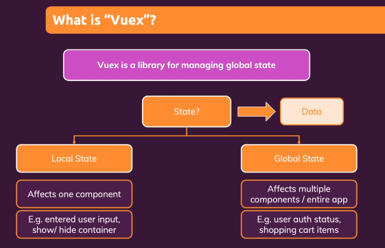
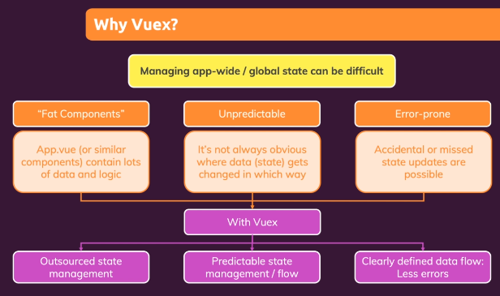
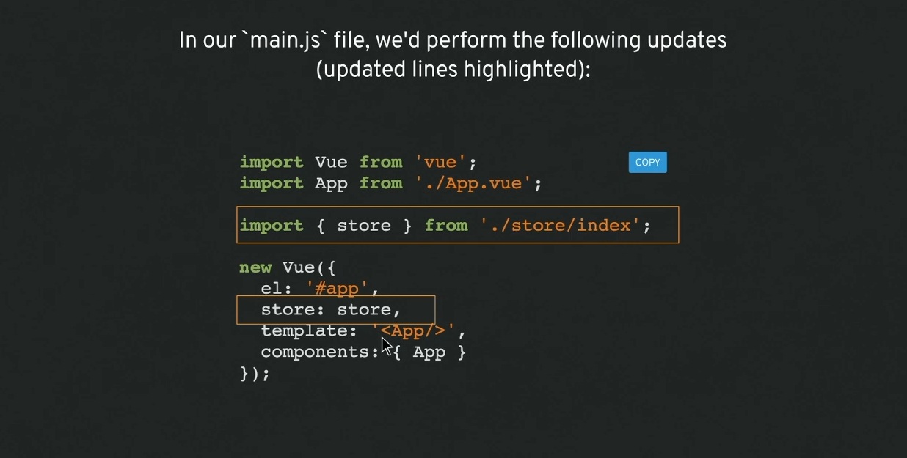
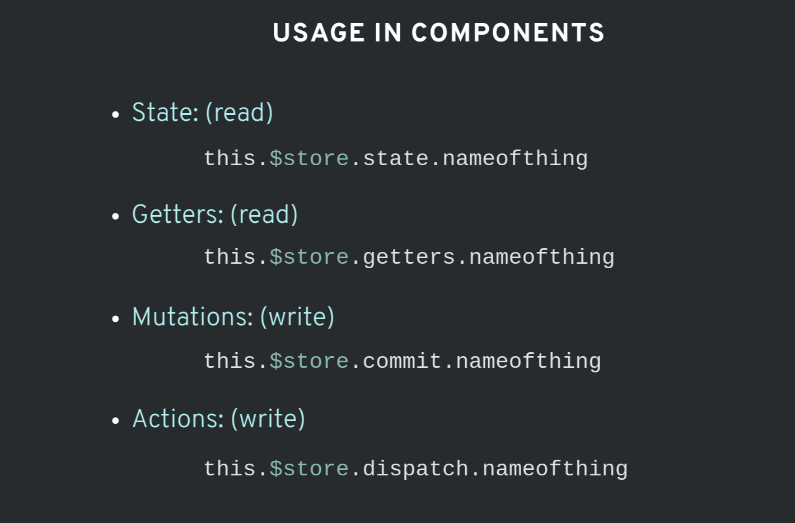
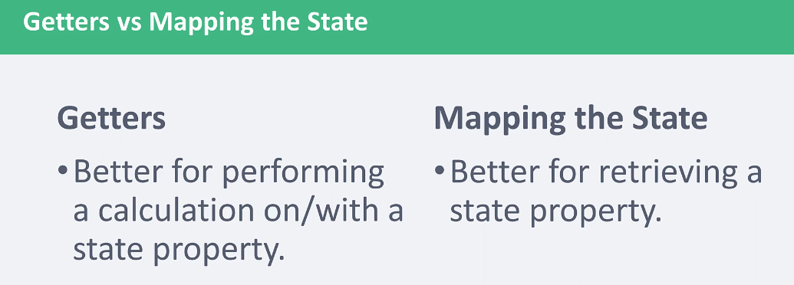

# INDEX

- [INDEX](#index)
  - [Vuex](#vuex)
    - [Application Structure](#application-structure)
    - [Basic Abstract Example](#basic-abstract-example)
    - [Usage in Components](#usage-in-components)
  - [State](#state)
  - [Getting data from the State](#getting-data-from-the-state)
    - [Getting data from the State Directly](#getting-data-from-the-state-directly)
    - [Getters vs mapping](#getters-vs-mapping)
      - [mapping the Store (mapState)](#mapping-the-store-mapstate)
    - [Getters](#getters)
      - [Getters Functions](#getters-functions)
      - [mapGetters](#mapgetters)
  - [Mutations](#mutations)
    - [mapMutation](#mapmutation)
    - [`subscribe` method](#subscribe-method)
  - [Actions](#actions)
    - [mapActions](#mapactions)
  - [Modules](#modules)
  - [Notes](#notes)
    - [Vuex guidelines](#vuex-guidelines)

---

## Vuex

A library for managing global-state in Vue, with rules that ensure that the state can be only mutated in a predictable way.

> Also install plugin for ready and easy configuration

- Vuex is a **state management pattern + library** for Vue.js applications. It serves as a centralized store for (shared data and logic, even shared methods or async) in an application, with rules **ensuring that the state can only be mutated in a predictable fashion**.
  
- it ensures a **unidirectional data flow**, to prevent going with state up&down, this ensures that we truly know who owns the state
- influenced by **Flux Application Architecture**, like with `Redux`
  
- **Why** Vuex?

  - in a complex `SPA`, passing state between many components and especially deeply nested or sibling components, can get complicated quickly, having one centralized place to access your data can help you stay organized
    
    
  - Also, by using it, we no longer need prop-drilling, as the data will be stored in the store's `state` and can be accessed from any component, and will reflect the changes in real-time

- **When** to use Vuex?
  - "You just Know :)"
  - or when you have multiple instances of children/siblings communicating
  - or if I'd like to "see" what all of the state looks like and keep it organized in one place

---

### Application Structure

```sh
├── index.html
├── main.js
├── api
│   └── ... # abstractions for making API requests
├── components
│   ├── App.vue
│   └── ...
└── store
    ├── index.js          # (main store file): where we assemble modules and export the store
    ├── actions.js        # root actions
    ├── mutations.js      # root mutations
    └── modules
        ├── cart.js       # cart module
        └── products.js   # products module
```



---

### Basic Abstract Example

```js
export const store = new Vuex.Store({
  state: {
    counter: 0
  },
  //showing things, not mutating state
  getters: {
    tripleCounter: state => {
      return state.counter * 3;
    }
  },
  //mutating the state
  //mutations are always synchronous
  mutations: {
    //showing passed with payload, represented as num
    increment: (state, num) => {
      state.counter += num;
    }
  },
  //commits the mutation, it's asynchronous
  actions: {
    // showing passed with payload, represented as asynchNum (an object)
    asyncIncrement: ({ commit }, asyncNum) => {
      setTimeout(() => {
        //the asyncNum objects could also just be static amounts
        commit('increment', asyncNum.by);
      }, asyncNum.duration);
    }
  }
});
```

- `namespaced: true` option
  - It ensures that your module is self-contained and reusable; this prevents multiple modules from reacting to the same mutation/action type.

---

### Usage in Components



- You can use shortcuts -> `map<somethingFromStore>` instead like:
  - `mapState`
  - `mapGetters`

---

## State

**State**: is the state of the application. Similar to how we use `data` in the components.

```js
const store = createStore({
  state: {
    todos: [
      { id: 1, text: '...', done: true },
      { id: 2, text: '...', done: false }
    ]
  },
  getters: {
    doneTodos(state) {
      return state.todos.filter(todo => todo.done);
    }
  }
});
```

---

## Getting data from the State

### Getting data from the State Directly

```js
const Counter = {
  template: `<div>{{ count }}</div>`,
  computed: {
    count() {
      return this.$store.state.count;
    }
  }
};
```

---

### Getters vs mapping



- **Getters** -> like mapping over an array in the state and returning something from it (heavy process)

---

#### mapping the Store (mapState)

When a component needs to make use of multiple store state properties or getters, declaring all these computed properties can get repetitive. To deal with this we can make use of the `mapState` helper which **generates computed getter functions for us**, saving us some keystrokes

- mapState
  - it creates component properties that map to Vuex state properties. it's a shortcut to manually define multiple computed properties
  - it's a method that we invoke here and it returns an object of computed properties of each state-property it has (e.g. `a(){}`) so we need to **destructure** that object properties in our `computed` object
- mapGetters
- mapMutation
- mapActions

```js
// in a component
import { mapState } from 'vuex';

export default {
  // ...
  computed: {
    isLoggedIn() {
      return this.$store.state.isLoggedIn;
    },
    // or
    ...mapState({
      isLoggedIn: state => state.isLoggedIn
    }),
    // or
    ...mapState({
      isLoggedIn: 'isLoggedIn'
    }),
    // or
    ...mapState(['isLoggedIn'])
  }
};
```

- `mapState` returns an **object**. How do we use it in combination with other local computed properties? Normally, we'd have to use a utility to merge multiple objects into one so that we can pass the final object to computed. However with the object spread operator, we can greatly simplify the syntax with the **spread operator**:

  ```js
  computed: {
    localComputed () { /* ... */ },
    // mix this into the outer object with the object spread operator
    ...mapState({
      // ...
    })
  }
  ```

- Best Syntax:

```js
export default {
  computed: {
    // mix this into the outer object with the object spread operator
    ...mapState(['count', 'isLoggedIn'])
  }
};
```

---

### Getters

**Getters**: will make values able to show statically in our templates. In other words, **"getters can read the value, but not mutate the state"**.

Instead of accessing the state's data directly, we use **getters** which help in **memory-caching**

> - think of them as computed properties for your state
> - They will only update if the state changes, this will help with the performance of an application
> - caching because they use **closures**

- Getters can invoke other getters
- It's recommended to use **Arrow Functions** to prevent conflict with the `this` keyword in the component when calling the getter: `this.$store.getters`

```js
// It's a replace for this:
computed: {
  doneTodosCount () {
    return this.$store.state.todos.filter(todo => todo.done).length
  }
}

// ------------------------------------------------------------------ //

// we use this:
const store = createStore({
  // state ...
  getters: {
    doneTodos (state) {
      return state.todos.filter(todo => todo.done)
    }
  }
})

// and in the component:
computed: {
  doneTodosCount () {
    return this.$store.getters.doneTodosCount
  }
}
```

---

#### Getters Functions

we can provide additional arguments to a getter by having the getter method return a function. The function can accept whatever arguments we'd like

- **Arguments to a getter method**
  - the first argument is the `state` like normal getters
  - the second argument is an object of all getter methods
- getters can invoke other getters. We can delegate smaller bits of logic to lightweight getter functions. We don't have to use a getter in a component for it to be useful
- when invoking the getter in a component, We pass arguments to it as if we're passing them to the returned function (no need to pass `state` argument)
- Ex:

  ```js
  [FILTERED_JOBS](state, getters) {
      // using helper-getters functions
      return state.jobs
        .filter((job) => getters.INCLUDE_JOB_BY_ORGANIZATION(job));
    },

    // --------- HELPER GETTERS ------------ //
    // a getter that is a function that return value, so that we can use it in other getters
    [INCLUDE_JOB_BY_ORGANIZATION]: (state) => (job) => {
      if (state.selectedOrganizations.length === 0) return true;
      return state.selectedOrganizations.includes(job.organization);
    },
  ```

---

#### mapGetters

```js
import { mapGetters } from 'vuex';

export default {
  // ...
  computed: {
    // mix the getters into computed with object spread operator
    ...mapGetters(['doneTodosCount', 'anotherGetter'])
  }
};
```

---

## Mutations

**Mutations**: will allow us to update the state (from one place (single source of truth) and will make sure that the `state` isn't modified from other place ), but they will always be synchronous. Mutations are the only way to change data in the state in the store.

- Must be **synchronous** when updating the store's state
- in the store-options you can use **strict mode** that prevents mutation of the store's state outside of the mutation

  - it makes vue a lot more strict to make sure that we don't have any place where we are accidentally modifying the store-state outside a mutation
  - **Note:** we should enable it in `development` mode only as strict-mode takes a lot of memory and can slow down the app

  ```js
  const store = createStore({
    state,
    mutations,
    strict: process.env.NODE_ENV !== 'production'
  });
  ```

- Only use it in `development mode` as it reduces performance
- To perform a mutation, use `commit`

  ```js
  this.$store.commit('name of method(mutation) in the mutations', payload - object);
  ```

### mapMutation

It creates component `methods` that map/connect to Vuex-store-mutations, as Vuex invokes the `commit` method on the store with the mutation-name.

You can commit mutations in components with `this.$store.commit('xxx')`, or use the **mapMutations** helper which maps component methods to store.commit calls:

```js
import { mapMutations } from 'vuex';
export default {
  methods: {
    ...mapMutations([
      'increment', // map `this.increment()` to `this.$store.commit('increment')`
      // `mapMutations` also supports payloads:
      'incrementBy' // map `this.incrementBy(amount)` to `this.$store.commit('incrementBy', amount)`
    ])
  }
};
```

---

### `subscribe` method

it make us Subscribe to store mutations. The handler is called after every mutation and receives the mutation descriptor and post-mutation state as arguments.

```js
// subscribe(handler: Function, options?: Object): Function

// this will run on every store-mutation execution
store.subscribe(mutation => {
  // specify which mutation to react to
  if (mutation.type === CLEAR_USER_JOB_FILTER_SELECTIONS) {
    selectedValues.value = []; // reset selected checkboxes on clear-mutation
  }
});
```

---

## Actions

**Actions** will allow us to update the state with mutations ( **asynchronously**), but will use an existing mutation. This can be very helpful if you need to perform a few different mutations at once in a particular order, or reach out to a server.

- **Actions** are methods that commits a mutation + they allow for Async operations
- actions receive **`context`** object as an argument, it's like the `$store` object
  - which can do many things like: `commit mutations`
- **Async** -> as we can make an API call-in the action, then commit the mutation when we receive the data

```js
// in the store
export const actions = {
  FETCH_JOBS: async context => {
    const jobs = await getJobs(); // async operations
    context.commit(RECEIVE_JOBS, jobs); // after the async action completes
  }
};

// in the component
import FETCH_JOBS
// this.$store.dispatch(actionName, payload);
this.$store.dispatch(FETCH_JOBS);
// or directly call the action using the mapActions
```

---

### mapActions

it defines methods on the component that dispatch the appropriat action to the Vuex-store

You can dispatch actions in components with `this.$store.dispatch('xxx')`, or use the **mapActions** helper which maps component methods to store.dispatch calls:

```js
import { mapActions } from 'vuex';

export default {
  methods: {
    ...mapActions([
      'INCREMENT', // map `this.INCREMENT()` to `this.$store.dispatch('INCREMENT')`
      // `mapActions` also supports payloads:
      'INCREMENT_BY' // map `this.INCREMENT_BY(amount)` to `this.$store.dispatch('INCREMENT_BY', amount)`
    ]),

    // or
    ...mapActions({
      increment: 'INCREMENT' // this.increment()
    })
  }
};
```

---

## Modules

it's better to organize code and states in different modules

```js
const moduleA = {
  state: () => ({ ... }),
  mutations: { ... },
  actions: { ... },
  getters: { ... }
}

const moduleB = {
  state: () => ({ ... }),
  mutations: { ... },
  actions: { ... }
}

const store = createStore({
  modules: {
    a: moduleA,
    b: moduleB
  }
})

store.state.a // -> `moduleA`'s state
store.state.b // -> `moduleB`'s state
```

---

## Notes

### Vuex guidelines

- Use a modularized vuex store to manage state separately. Using store modules allows us to lazy-load sub-stores only when they’re needed in a certain component.
- Do not change store state directly, use **mutations** instead

  ```js
  // bad
  state.averageLatencyData = response.data;

  // good
  context.commit(SET_AVERAGE_RESPONSE_TIME, response.data);
  //...
  mutations: {
    [SET_AVERAGE_RESPONSE_TIME](state, data) {
      state.averageLatencyData = data;
    }
  }
  ```

- Use getters to access these state objects outside the store, they can act as reactive computed properties

  ```js
  // bad
  const averageLatencyData = store.state.averageLatencyData;

  // good
  const averageLatencyData = store.getters.averageLatencyData;
  ```

- Register action and mutation names as constants as action/mutation types to avoid typos.

- If you’re using a reusable module, ( a details page, for example) It’s a good idea to set the state as a function, to ensure a new instance of the module each time it’s reused. Each state variable will be reset every time the module is reused.

  ```js
  const MyReusableModule = {
    state: () => ({
      foo: 'bar'
    })
    //...
  };
  ```
