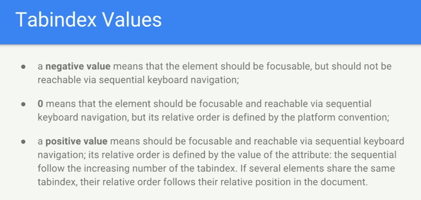
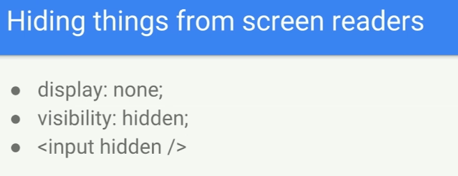
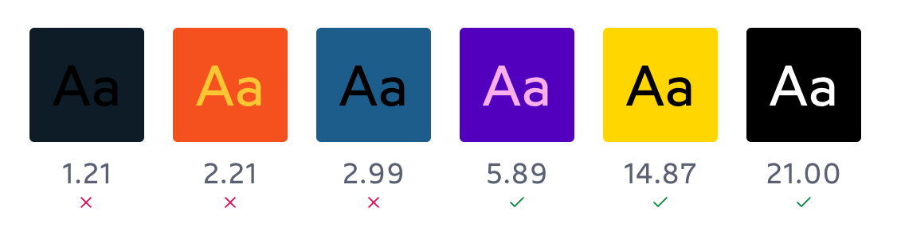
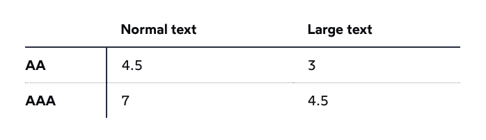
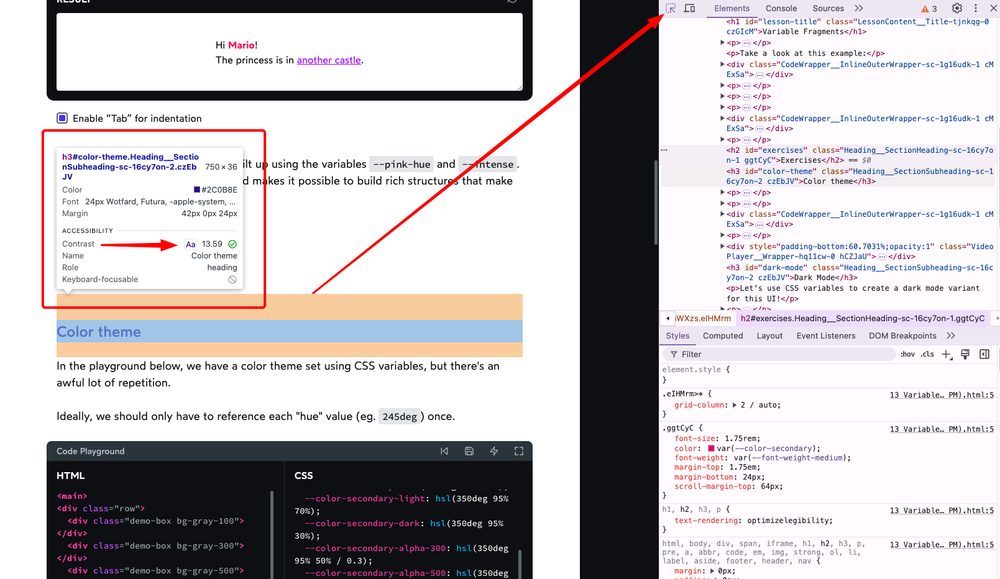
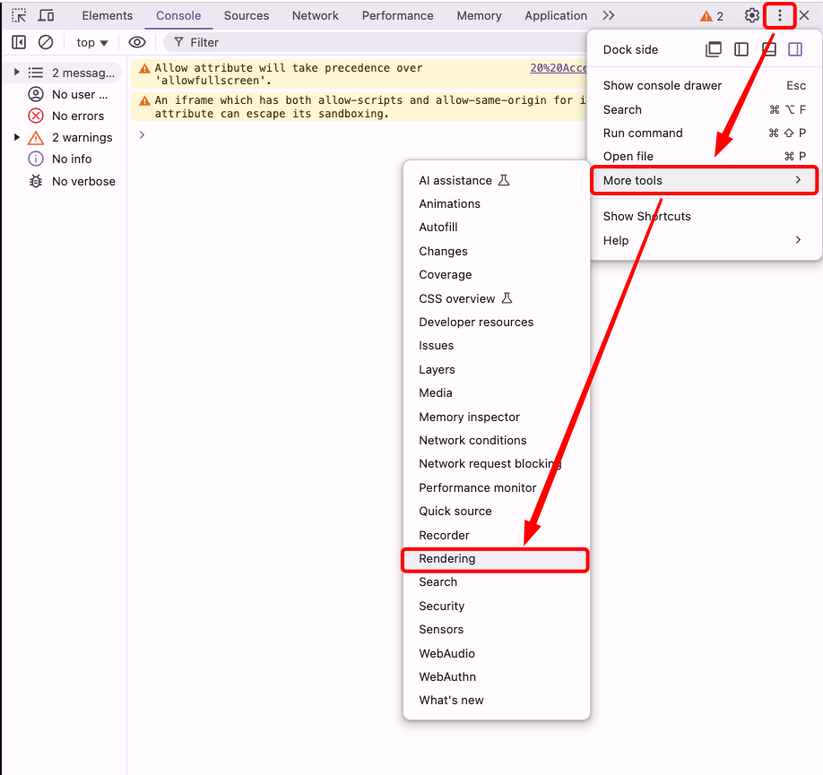
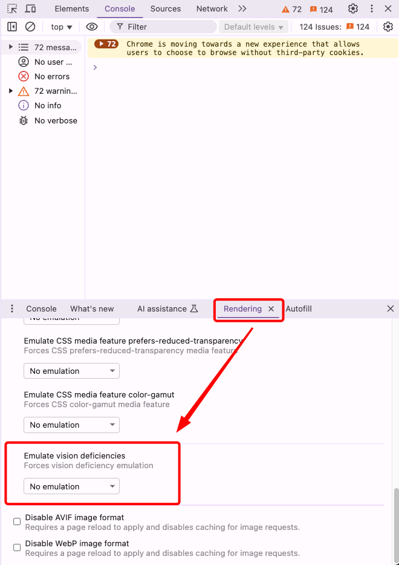
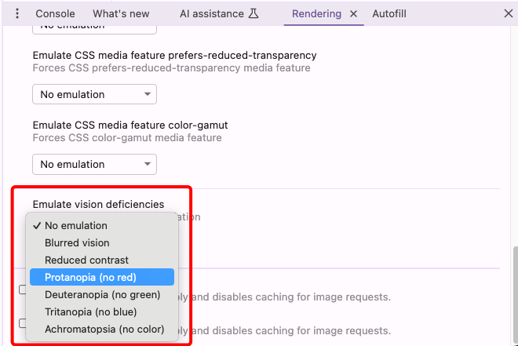

# INDEX

- [INDEX](#index)
  - [Accessibility](#accessibility)
    - [Why Accessibility is Non-Negotiable](#why-accessibility-is-non-negotiable)
    - [Core Principles of Accessibility](#core-principles-of-accessibility)
    - [WCAG Compliance Levels: A, AA, AAA](#wcag-compliance-levels-a-aa-aaa)
  - [Key Accessibility Challenges and Solutions](#key-accessibility-challenges-and-solutions)
  - [ Advanced Accessibility Practices](#advanced-accessibility-practices)
  - [Keyboard Events](#keyboard-events)
    - [`tab` keyboard-key](#tab-keyboard-key)
    - [Keyboard Events Types](#keyboard-events-types)
  - [Screen readers](#screen-readers)
  - [Accessible HTML](#accessible-html)
    - [Labels](#labels)

---

## Accessibility

Accessibility is a cornerstone of modern web development, ensuring digital platforms are inclusive for all users, including those with disabilities.

### Why Accessibility is Non-Negotiable

- **Inclusive Design:** Accessibility empowers users with diverse abilities to interact with your applications seamlessly.
- **Legal and Ethical Imperatives:** Compliance with WCAG, ADA, and Section 508 safeguards against lawsuits and promotes corporate responsibility.
- **Enhanced User Experience:** Accessible designs improve usability for everyone, including users with temporary impairments or situational challenges.
- **Broader Reach:** Accessibility expands your user base, improving engagement and retention.

### Core Principles of Accessibility

- **Perceivable:** Content must be available in ways users can perceive, such as text alternatives for images and captions for videos.
- **Operable:** Interfaces should be navigable using various inputs, including keyboards and assistive technologies.
- **Understandable:** Content should be clear and predictable, avoiding unnecessary complexity.
- **Robust:** Applications must work reliably across different browsers, devices, and assistive tools.

### WCAG Compliance Levels: A, AA, AAA

The Web Content Accessibility Guidelines (WCAG) define three levels of compliance:

- **Level A:** The most basic web accessibility features. For example:
  - providing text alternatives (`alt`) for non-text content.
  - ensuring form fields have associated labels.
- **Level AA:** Deals with the biggest and most common barriers for disabled users. For example:
  - Ensuring sufficient color contrast between text and background **(at least `4.5:1` for text)**
  - Ensuring navigation is consistent across pages.
  - Avoid using color as the sole method to convey information.
- **Level AAA:** The highest and most complex level of web accessibility. For example:
  - Meeting a contrast ratio of at least `7:1` for text.
  - Providing sign language translations for multimedia content.
  - Allowing customization of text spacing without loss of content or functionality.

> For most projects, **Level AA** compliance is considered a reasonable standard. **Level AAA**, while ideal, may not always be feasible due to its stringent requirements.

---

## Key Accessibility Challenges and Solutions

1. Insufficient Text Alternatives

   - **Challenge:** Screen readers struggle with images or videos lacking descriptive alternative text.
   - **Solution:** Use descriptive `alt` attributes and captions.

   - **Example:**

     ```html
     <!-- Bad -->
     

     <!-- Good -->
     
     ```

2. Poor Keyboard Navigation

   - **Challenge:** Users can't rely solely on keyboards to navigate.
   - **Solution:** Ensure all elements are focusable and navigable via keyboard.

   - **Example:**

     ```html
     <!-- Custom clickable element -->
     <div tabindex="0" role="button" onkeydown="handleKeyPress(event)">Custom Button</div>
     ```

3. Inadequate Color Contrast

   - **Challenge:** Low contrast makes content unreadable for visually impaired users.
   - **Solution:** Adhere to WCAG guidelines with a minimum contrast ratio of:

     - **4.5:1 for Level AA**
     - **7:1 for Level AAA**

   - **Example:**

     ```css
     .text {
       color: #333333; /* Dark gray on white background */
       background-color: #ffffff;
       /* Contrast ratio: 12.6:1 (exceeds AA requirements) */
     ```

4. Mismanaged Focus States

   - **Challenge:** Users lose track of their location when navigating.
   - **Solution:** Provide visible focus indicators and ensure logical focus order.

   - **Example:**

     ```css
     button:focus {
       outline: 3px solid #4a90e2;
       outline-offset: 2px;
     }
     ```

5. Non-Accessible Dynamic Content

   - **Challenge:** Dynamic updates can go unnoticed by screen readers.
   - **Solution:** Leverage ARIA live regions to announce content changes appropriately.

   - **Example:**

     ```html
     <div aria-live="polite" id="status"></div>
     <!-- Status updates will be announced when they change -->
     ```

---

##  Advanced Accessibility Practices

---

## Keyboard Events

### `tab` keyboard-key

A keyboard user typically uses the Tab key to navigate through interactive elements on a web `page—links`, `buttons`, `fields` for inputting text, etc. When an item is tabbed to, it has keyboard `focus` and can be activated or manipulated with the keyboard. A sighted keyboard user must be provided with a visual indicator of the element that currently has keyboard focus. Focus indicators are provided automatically by web browsers. **(That's why `focus` styles are important)**

- `tab` -> go forward
- `shift + tab` -> go backwards

Elements that are affected by `tab` are the one which the user interacts with like: `<input>`, `<a>`, `<iframe>`, ..

- elements which are non-interactive are not affected by `tab`
- Any element becomes focusable if it has `tabindex`. The value of the attribute is the order number of the element when Tab (or something like that) is used to switch between them.
  - That is: if we have two elements, the first has `tabindex="1"`, and the second has `tabindex="2"`, then pressing Tab while in the first element – moves the focus into the second one.
- the order of focusing on element using `tab` is called **tab-order**

  - this order is by how elements are presented in the **DOM** and not the order by css-style

- `tabindex` attribute:

  - it makes the element tabbable

    ```html
    <div tabindex="0">W3Schools</div>
    ```

    

  - usually the negative-value is when you want to manage focus by javascript
  - `tabindex="0"` puts an element among those without tabindex.

> `Document.activeElement` -> read-only property of the Document interface returns the Element within the DOM that currently has focus.

---

### Keyboard Events Types

> find what is the number for each keyboard key from here: [keycode.info](https://www.keycode.info)

You can use keyboard events to do stuff

- `keydown`
- `keypress`
- `keyup`


---

## Screen readers

- **Alternative Text**
  

  - By default, when a screen reader encounters an image:
    - if it can't find alt text it will read aloud the file's name.
    - if it finds the alt text empty `alt=""` --> it will skip over the image (useful when you want to hide the image from screen readers)
      - example: if you have multiple star-image for movie-review and we don't want the screen-reader to repeatedly say "star image star image ...", Instead we only add `alt` to the first star-image with value `"star images"` and skip the other images.
  - we don't use `picture of` or `graphic of` in **alt** as the screen reader says it in the beginning by default

- **Hiding elements**
  
  
  - to only show in screen readers you can use class -> `.visuallyhidden`

---

## Accessible HTML

- Some elements have semantic meaning but no special functionality. Examples are:

  - `<aside>`
  - `<footer>`
  - `<header>`

- Other's provide a lot of built-in functionality such as:

  - `<button>`
  - `<input>`
  - `<textarea>`

### Labels

Form fields can be confusing for screen reader users. There are many ways to **label form fields** so the label is read out loud whenever the field has focus.

- HTML labels

  ```html
  <form>
    <label for="first">First Name</label>
    <input id="first" type="text" />
  </form>
  ```

````

- Implicit HTML labels

  - you can do is wrap your inputs with the label tag. This is called **implicit labelling**.

  ```html
  <form>
    <label>
      First Name
      <input id="first" type="text" />
    </label>
  </form>
  ```

Limitations with the `<label>` tag:

- The label tag can only works with "**labelable**" elements. Those include:

  - `<button>`
  - `<input>`
  - `<keygen>`
  - `<meter>`
  - `<output>`
  - `<progress>`
  - `<select>`
  - `<textarea>`

- If you ever need to label an element not on that list, use **aria-label** instead.

  ```html
  <div aria-label="Interactive div">Hello</div>
  ```

---

## Accessible CSS

### Visually Hidden Elements

Sometimes you want to hide an element visually but still have it read out loud by screen readers. This is useful for things like skip links, or for providing additional context to screen reader users.

```css
.visually-hidden {
  position: absolute;
  width: 1px;
  height: 1px;
  padding: 0;
  margin: -1px;
  overflow: hidden;
  clip: rect(0, 0, 0, 0);
  border: 0;
}
```

- It's also common to use this technique with icons, to give screen reader users more context.

  ```jsx
  <button>
    <HelpCircleIcon />
    <span class='visually-hidden'>Visit the help center</span>
  </button>
  ```

- Bootstrap uses class `.sr-only` to only show the element to **screen readers**, what it does is it does every possible way to hide the element from the page like this:

  ```css
  .sr-only {
    position: absolute;
    width: 1px;
    height: 1px;
    padding: 0;
    margin: -1px;
    overflow: hidden;
    clip: rect(0, 0, 0, 0);
    border: 0;
  }
  ```

---

## ARIA Roles

ARIA roles provide **semantic meaning to content**, allowing screen readers and other tools to present and support interaction with object in a way that is consistent with user expectations of that type of object. ARIA roles can be used to describe elements that don't natively exist in HTML or exist but don't yet have full browser support.

You can find more here along with roles to use -> [here in mozilla docs](https://developer.mozilla.org/en-US/docs/Web/Accessibility/ARIA/Roles)

### Live region roles

Live Region roles are used to define elements with **content that will be dynamically changed** ex:(`chat`). Sighted users can see dynamic changes when they are visually noticeable. These roles help low vision and blind users know if content has been updated. Assistive technologies, like screen readers, can be made to announce dynamic content changes:

- `assertive` - will interrupt whatever it's doing to announce.
- `polite` - will announce the live region update when it next idles.
- `off` - will not read the update.

  ```html
  <div aria-live="assertive">Waiting for a ride</div>
  ```

### Aria Label

It's a way to add annotations for screen readers to read out loud. It's useful for elements that don't have a label, like `<div>` or `<span>`. It's also useful for elements that have a label but need additional context.

```html
<button aria-label="Contact support">
  <HelpCircleIcon />
</button>
```

- It's an alternative to [Visually Hidden Elements](#visually-hidden-elements)

---

## Colors

### Color Contrast

- Good contrast is above `4.5:1` for normal text and `3:1` for large text.
  
  

- You can check the color contrast for any two colors using this handy tool: [WebAIM Contrast Checker](https://webaim.org/resources/contrastchecker/).

- To check if the **element's color's contrast ratio** is good for accessibility, you can use the devtools to check the contrast ratio between the text color and the background color. by selecting the element in the inspector and a **tooltip** will appear with the contrast ratio.

  

---

### Browser simulation for color blindness (Emulate vision deficiencies)

- You can simulate how your website looks to people with different types of **color blindness** using the **Chrome DevTools**. To do this, open the DevTools, click on the three dots in the top right corner, go to **More tools**, and then select **Rendering**.

  
  

- You can then select a vision deficiency to simulate.
  

> More here: [Emulate vision deficiencies in DevTools](https://addyosmani.com/blog/emulate-vision-deficiencies-devtools/)

---

## Accessibility Tools

- [WAVE](https://wave.webaim.org/)
  - Web Accessibility Evaluation Tool that helps developers make their web content more accessible.
````
