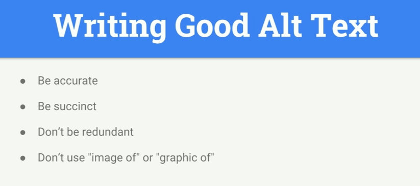

# INDEX

- [INDEX](#index)
  - [Accessibility](#accessibility)
    - [Why Accessibility is Non-Negotiable](#why-accessibility-is-non-negotiable)
    - [Core Principles of Accessibility](#core-principles-of-accessibility)
    - [WCAG Compliance Levels: A, AA, AAA](#wcag-compliance-levels-a-aa-aaa)
      - [Industry-Specific Compliance: Where AAA Compliance is Mandatory](#industry-specific-compliance-where-aaa-compliance-is-mandatory)
    - [Accessibility Resources and Guides](#accessibility-resources-and-guides)
    - [Key Accessibility Challenges and Solutions](#key-accessibility-challenges-and-solutions)
  - [Accessibility main concepts](#accessibility-main-concepts)
    - [Keyboard Events](#keyboard-events)
      - [`tab` keyboard-key](#tab-keyboard-key)
      - [Keyboard Events Types](#keyboard-events-types)
    - [Screen readers](#screen-readers)
    - [Skip Links](#skip-links)
    - [Focus Management](#focus-management)
    - [Landmarks and Page Structure](#landmarks-and-page-structure)
    - [Accessible HTML](#accessible-html)
      - [Labels](#labels)
    - [Accessible Forms](#accessible-forms)
      - [Form Field Labeling](#form-field-labeling)
      - [Required Fields](#required-fields)
      - [Form Instructions and Hints](#form-instructions-and-hints)
      - [Error Handling](#error-handling)
      - [Error Summary](#error-summary)
      - [Grouping Related Fields](#grouping-related-fields)
      - [Autocomplete](#autocomplete)
      - [Form Submission Feedback](#form-submission-feedback)
    - [Accessible Tables](#accessible-tables)
      - [Basic Table Structure](#basic-table-structure)
      - [Complex Tables with Multiple Headers](#complex-tables-with-multiple-headers)
      - [Responsive/Scrollable Tables](#responsivescrollable-tables)
    - [Button vs Link](#button-vs-link)
    - [Accessible CSS](#accessible-css)
      - [Visually Hidden Elements](#visually-hidden-elements)
    - [ARIA Roles](#aria-roles)
      - [Live region roles](#live-region-roles)
      - [Aria Label](#aria-label)
    - [Colors](#colors)
      - [Color Contrast](#color-contrast)
      - [Browser simulation for color blindness (Emulate vision deficiencies)](#browser-simulation-for-color-blindness-emulate-vision-deficiencies)
    - [Accessibility Tools](#accessibility-tools)
  - [Working with Accessibility](#working-with-accessibility)
    - [Advanced Accessibility Practices](#advanced-accessibility-practices)
    - [Accessibility Testing Framework](#accessibility-testing-framework)
    - [Modern Frontend Frameworks: Accessibility Best Practices for React, Vue, and Angular](#modern-frontend-frameworks-accessibility-best-practices-for-react-vue-and-angular)
      - [Accessibility in React](#accessibility-in-react)
      - [Accessibility in Vue](#accessibility-in-vue)
      - [Accessibility in Angular](#accessibility-in-angular)
  - [Building Accessible Web Components](#building-accessible-web-components)
    - [Accessible Tabs Components](#accessible-tabs-components)
    - [Accessible Accordions Components](#accessible-accordions-components)
    - [Accessible Carousels Components](#accessible-carousels-components)
    - [Accessible Modal Components](#accessible-modal-components)
    - [Accessible Dropdown/Menu Components](#accessible-dropdownmenu-components)
    - [Accessible Tooltip Components](#accessible-tooltip-components)
    - [Accessible Date Picker Components](#accessible-date-picker-components)
  - [Handling Accessibility in teams](#handling-accessibility-in-teams)

---

## Accessibility

Accessibility is a cornerstone of modern web development, ensuring digital platforms are inclusive for all users, including those with disabilities.

### Why Accessibility is Non-Negotiable

- **Inclusive Design:** Accessibility empowers users with diverse abilities to interact with your applications seamlessly.
- **Legal and Ethical Imperatives:** Compliance with WCAG, ADA, and Section 508 safeguards against lawsuits and promotes corporate responsibility.
- **Enhanced User Experience:** Accessible designs improve usability for everyone, including users with temporary impairments or situational challenges.
- **Broader Reach:** Accessibility expands your user base, improving engagement and retention.

### Core Principles of Accessibility

- **Perceivable:** Content must be available in ways users can perceive, such as text alternatives for images and captions for videos.
- **Operable:** Interfaces should be navigable using various inputs, including keyboards and assistive technologies.
- **Understandable:** Content should be clear and predictable, avoiding unnecessary complexity.
- **Robust:** Applications must work reliably across different browsers, devices, and assistive tools.

### WCAG Compliance Levels: A, AA, AAA

The Web Content Accessibility Guidelines (WCAG) define three levels of compliance:

- **Level A:** The most basic web accessibility features. For example:
  - providing text alternatives (`alt`) for non-text content.
  - ensuring form fields have associated labels.
- **Level AA:** Deals with the biggest and most common barriers for disabled users. For example:
  - Ensuring sufficient color contrast between text and background **(at least `4.5:1` for text)**
  - Ensuring navigation is consistent across pages.
  - Avoid using color as the sole method to convey information.
- **Level AAA:** The highest and most complex level of web accessibility. For example:
  - Meeting a contrast ratio of at least `7:1` for text.
  - Providing sign language translations for multimedia content.
  - Allowing customization of text spacing without loss of content or functionality.

> For most projects, **Level AA** compliance is considered a reasonable standard. **Level AAA**, while ideal, may not always be feasible due to its stringent requirements.

#### Industry-Specific Compliance: Where AAA Compliance is Mandatory

Certain industries, such as **healthcare, finance, and government**, may require AAA compliance to meet legal and regulatory standards. For example:

- **Healthcare:** Patients with disabilities need access to medical records, appointment scheduling, and telehealth services.
- **Finance:** Users with disabilities need to manage accounts, conduct transactions, and access financial services without barriers.
- **Government:** Government websites must be accessible to all citizens, including those with disabilities.

---

### Accessibility Resources and Guides

- [m3.material.io - Material Design Accessibility Guideline](https://m3.material.io/foundations/designing/overview)
- [Lighting Design System - Accessibility](https://www.lightningdesignsystem.com/2e1ef8501/p/112ac5-accessibility)

---

### Key Accessibility Challenges and Solutions

1. Insufficient Text Alternatives
   - **Challenge:** Screen readers struggle with images or videos lacking descriptive alternative text.
   - **Solution:** Use descriptive `alt` attributes and captions.

   - **Example:**

     ```html
     <!-- Bad -->
     

     <!-- Good -->
     
     ```

2. Poor Keyboard Navigation
   - **Challenge:** Users can't rely solely on keyboards to navigate.
   - **Solution:** Ensure all elements are focusable and navigable via keyboard.

   - **Example:**

     ```html
     <!-- Custom clickable element -->
     <div tabindex="0" role="button" onkeydown="handleKeyPress(event)">Custom Button</div>
     ```

3. Inadequate Color Contrast
   - **Challenge:** Low contrast makes content unreadable for visually impaired users.
   - **Solution:** Adhere to WCAG guidelines with a minimum contrast ratio of:
     - **4.5:1 for Level AA**
     - **7:1 for Level AAA**

   - **Example:**

     ```css
     .text {
       color: #333333; /* Dark gray on white background */
       background-color: #ffffff;
       /* Contrast ratio: 12.6:1 (exceeds AA requirements) */
     ```

4. Mismanaged Focus States
   - **Challenge:** Users lose track of their location when navigating.
   - **Solution:** Provide visible focus indicators and ensure logical focus order.

   - **Example:**

     ```css
     button:focus {
       outline: 3px solid #4a90e2;
       outline-offset: 2px;
     }
     ```

5. Non-Accessible Dynamic Content
   - **Challenge:** Dynamic updates can go unnoticed by screen readers.
   - **Solution:** Leverage ARIA live regions to announce content changes appropriately.

   - **Example:**

     ```html
     <div aria-live="polite" id="status"></div>
     <!-- Status updates will be announced when they change -->
     ```

---

## Accessibility main concepts

### Keyboard Events

#### `tab` keyboard-key

A keyboard user typically uses the Tab key to navigate through interactive elements on a web `page—links`, `buttons`, `fields` for inputting text, etc. When an item is tabbed to, it has keyboard `focus` and can be activated or manipulated with the keyboard. A sighted keyboard user must be provided with a visual indicator of the element that currently has keyboard focus. Focus indicators are provided automatically by web browsers. **(That's why `focus` styles are important)**

- `tab` -> go forward
- `shift + tab` -> go backwards

Elements that are affected by `tab` are the one which the user interacts with like: `<input>`, `<a>`, `<iframe>`, ..

- elements which are non-interactive are not affected by `tab`
- Any element becomes focusable if it has `tabindex`. The value of the attribute is the order number of the element when Tab (or something like that) is used to switch between them.
  - That is: if we have two elements, the first has `tabindex="1"`, and the second has `tabindex="2"`, then pressing Tab while in the first element – moves the focus into the second one.
- the order of focusing on element using `tab` is called **tab-order**
  - this order is by how elements are presented in the **DOM** and not the order by css-style

- `tabindex` attribute:
  - it makes the element tabbable

    ```html
    <div tabindex="0">W3Schools</div>
    ```

    

  - usually the negative-value is when you want to manage focus by javascript
  - `tabindex="0"` puts an element among those without tabindex.

> `Document.activeElement` -> read-only property of the Document interface returns the Element within the DOM that currently has focus.

---

#### Keyboard Events Types

> find what is the number for each keyboard key from here: [keycode.info](https://www.keycode.info)

You can use keyboard events to do stuff

- `keydown`
- `keypress`
- `keyup`


---

### Screen readers

- **Alternative Text**
  
  - By default, when a screen reader encounters an image:
    - if it can't find alt text it will read aloud the file's name.
    - if it finds the alt text empty `alt=""` --> it will skip over the image (useful when you want to hide the image from screen readers)
      - example: if you have multiple star-image for movie-review and we don't want the screen-reader to repeatedly say "star image star image ...", Instead we only add `alt` to the first star-image with value `"star images"` and skip the other images.
  - we don't use `picture of` or `graphic of` in **alt** as the screen reader says it in the beginning by default

- **Hiding elements**
  
  
  - to only show in screen readers you can use class -> `.visuallyhidden`

---

### Skip Links

Skip links allow keyboard users to bypass repetitive content (like navigation) and jump directly to main content. They are essential for keyboard-only users.

- Skip links should:
  - Be the **first focusable element** on the page
  - Be visible when focused (can be visually hidden otherwise)
  - Link to the main content area using an anchor

- Example implementation:

  ```html
  <body>
    <a href="#main-content" class="skip-link">Skip to main content</a>

    <header>
      <nav><!-- Navigation with many links --></nav>
    </header>

    <main id="main-content" tabindex="-1">
      <!-- Main page content -->
    </main>
  </body>
  ```

  ```css
  .skip-link {
    position: absolute;
    top: -40px;
    left: 0;
    padding: 8px 16px;
    background: #000;
    color: #fff;
    text-decoration: none;
    z-index: 1000;
  }

  .skip-link:focus {
    top: 0;
  }
  ```

- Multiple skip links for complex pages:

  ```html
  <div class="skip-links">
    <a href="#main-content">Skip to main content</a>
    <a href="#navigation">Skip to navigation</a>
    <a href="#search">Skip to search</a>
    <a href="#footer">Skip to footer</a>
  </div>
  ```

> **Note**: Adding `tabindex="-1"` to the target element ensures it receives focus programmatically, even if it's not normally focusable.

---

### Focus Management

Focus management is critical for accessible single-page applications (SPAs), modals, and dynamic content. Users must always know where they are on the page.

- **Focus order** should follow a logical reading order (usually left-to-right, top-to-bottom for LTR languages)

- **Focus indicators** must be visible:

  ```css
  /* Never do this without replacement */
  /* :focus { outline: none; } */

  /* Instead, provide custom focus styles */
  :focus {
    outline: 2px solid #005fcc;
    outline-offset: 2px;
  }

  /* Modern approach with :focus-visible */
  :focus {
    outline: none;
  }

  :focus-visible {
    outline: 2px solid #005fcc;
    outline-offset: 2px;
  }
  ```

- **:focus vs :focus-visible**:
  - `:focus` - Applies whenever element receives focus (keyboard or mouse)
  - `:focus-visible` - Only applies when focus should be visible (typically keyboard navigation)
  - Use `:focus-visible` to avoid showing focus rings on mouse clicks while keeping them for keyboard users

- **Focus trapping**: Keep focus within a component (modals, dialogs)

  ```javascript
  function trapFocus(element) {
    const focusableSelectors = [
      'a[href]',
      'button:not([disabled])',
      'input:not([disabled])',
      'select:not([disabled])',
      'textarea:not([disabled])',
      '[tabindex]:not([tabindex="-1"])'
    ].join(', ');

    const focusables = element.querySelectorAll(focusableSelectors);
    const first = focusables[0];
    const last = focusables[focusables.length - 1];

    element.addEventListener('keydown', e => {
      if (e.key !== 'Tab') return;

      if (e.shiftKey && document.activeElement === first) {
        e.preventDefault();
        last.focus();
      } else if (!e.shiftKey && document.activeElement === last) {
        e.preventDefault();
        first.focus();
      }
    });
  }
  ```

- **Roving tabindex**: For composite widgets (toolbars, menus, tab lists), only one item is in the tab order at a time:

  ```html
  <!-- Only the active item has tabindex="0" -->
  <div role="toolbar" aria-label="Text formatting">
    <button tabindex="0" aria-pressed="false">Bold</button>
    <button tabindex="-1" aria-pressed="false">Italic</button>
    <button tabindex="-1" aria-pressed="true">Underline</button>
  </div>
  ```

  ```javascript
  // Arrow keys move focus and update tabindex
  toolbar.addEventListener('keydown', e => {
    const buttons = toolbar.querySelectorAll('button');
    const current = Array.from(buttons).indexOf(document.activeElement);

    if (e.key === 'ArrowRight') {
      buttons[current].tabIndex = -1;
      const next = (current + 1) % buttons.length;
      buttons[next].tabIndex = 0;
      buttons[next].focus();
    }
    // Similar for ArrowLeft
  });
  ```

- **Focus restoration**: After closing dialogs or completing actions, return focus to the trigger:

  ```javascript
  let previousFocus;

  function openDialog() {
    previousFocus = document.activeElement;
    dialog.showModal();
  }

  function closeDialog() {
    dialog.close();
    previousFocus?.focus();
  }
  ```

- **SPA route changes**: Manage focus when content changes:

  ```javascript
  // After route change, focus the main heading or content area
  router.afterEach(() => {
    const mainHeading = document.querySelector('h1');
    if (mainHeading) {
      mainHeading.tabIndex = -1;
      mainHeading.focus();
    }
  });
  ```

---

### Landmarks and Page Structure

HTML5 landmark elements help screen reader users navigate and understand page structure. Each landmark creates a navigation point.

- **Landmark elements and their ARIA equivalents**:

  | HTML Element | ARIA Role              | Purpose                         |
  | ------------ | ---------------------- | ------------------------------- |
  | `<header>`   | `role="banner"`        | Site header (only if top-level) |
  | `<nav>`      | `role="navigation"`    | Navigation links                |
  | `<main>`     | `role="main"`          | Primary content (one per page)  |
  | `<aside>`    | `role="complementary"` | Related content                 |
  | `<footer>`   | `role="contentinfo"`   | Site footer (only if top-level) |
  | `<section>`  | `role="region"`        | Generic section (needs label)   |
  | `<form>`     | `role="form"`          | Form (when labeled)             |
  | `<search>`   | `role="search"`        | Search functionality            |

- **Best practices**:
  - Every page should have exactly **one `<main>`** element
  - Use landmarks to create a clear page outline
  - Label landmarks when multiple of same type exist

  ```html
  <body>
    <header>
      <nav aria-label="Primary">...</nav>
    </header>

    <nav aria-label="Breadcrumb">...</nav>

    <main>
      <h1>Page Title</h1>
      <article>...</article>
    </main>

    <aside aria-label="Related articles">...</aside>

    <footer>
      <nav aria-label="Footer">...</nav>
    </footer>
  </body>
  ```

- **Heading structure**:
  - Use headings (`<h1>` to `<h6>`) to create a document outline
  - **One `<h1>` per page** - should describe the page content
  - **Don't skip levels** - go from `h1` to `h2`, not `h1` to `h3`
  - Headings should be **nested logically**, not chosen for visual styling

  ```html
  <!-- Good heading structure -->
  <h1>Web Accessibility Guide</h1>
  <h2>Introduction</h2>
  <h2>WCAG Guidelines</h2>
  <h3>Level A</h3>
  <h3>Level AA</h3>
  <h3>Level AAA</h3>
  <h2>Testing</h2>
  <h3>Automated Testing</h3>
  <h3>Manual Testing</h3>
  ```

  ```html
  <!-- Bad - skipped heading levels -->
  <h1>Title</h1>
  <h4>Subtitle</h4>
  <!-- Should be h2 -->
  ```

- Screen reader users can:
  - List all headings on a page
  - List all landmarks
  - Jump between landmarks/headings
  - This is why proper structure is crucial!

---

### Accessible HTML

- Some elements have semantic meaning but no special functionality. Examples are:
  - `<aside>`
  - `<footer>`
  - `<header>`

- Other's provide a lot of built-in functionality such as:
  - `<button>`
  - `<input>`
  - `<textarea>`

#### Labels

Form fields can be confusing for screen reader users. There are many ways to **label form fields** so the label is read out loud whenever the field has focus.

- HTML labels

  ```html
  <form>
    <label for="first">First Name</label>
    <input id="first" type="text" />
  </form>
  ```

- Implicit HTML labels
  - you can do is wrap your inputs with the label tag. This is called **implicit labelling**.

  ```html
  <form>
    <label>
      First Name
      <input id="first" type="text" />
    </label>
  </form>
  ```

Limitations with the `<label>` tag:

- The label tag can only works with "**labelable**" elements. Those include:
  - `<button>`
  - `<input>`
  - `<keygen>`
  - `<meter>`
  - `<output>`
  - `<progress>`
  - `<select>`
  - `<textarea>`

- If you ever need to label an element not on that list, use **aria-label** instead.

  ```html
  <div aria-label="Interactive div">Hello</div>
  ```

---

### Accessible Forms

Forms are one of the most critical areas for accessibility. Users with disabilities must be able to understand, complete, and submit forms successfully.

#### Form Field Labeling

Every form control must have an accessible name. There are multiple ways to provide this:

```html
<!-- Method 1: Explicit label with for/id -->
<label for="email">Email Address</label>
<input type="email" id="email" name="email" />

<!-- Method 2: Implicit label (wrapping) -->
<label>
  Email Address
  <input type="email" name="email" />
</label>

<!-- Method 3: aria-label (when visible label not possible) -->
<input type="search" aria-label="Search products" />

<!-- Method 4: aria-labelledby (reference existing text) -->
<span id="billing-label">Billing Address</span>
<input type="text" aria-labelledby="billing-label" />
```

#### Required Fields

Indicate required fields clearly:

```html
<!-- Visual and programmatic indication -->
<label for="name">
  Full Name
  <span aria-hidden="true">*</span>
  <span class="visually-hidden">(required)</span>
</label>
<input type="text" id="name" required aria-required="true" />

<!-- Or use aria-required alone -->
<label for="email">Email</label>
<input type="email" id="email" aria-required="true" />
```

#### Form Instructions and Hints

Provide additional context with `aria-describedby`:

```html
<label for="password">Password</label>
<input type="password" id="password" aria-describedby="password-hint password-requirements" />
<span id="password-hint">Must be at least 8 characters</span>
<ul id="password-requirements">
  <li>One uppercase letter</li>
  <li>One number</li>
  <li>One special character</li>
</ul>
```

#### Error Handling

Accessible error messages should:

- Be associated with the field using `aria-describedby`
- Use `aria-invalid="true"` on invalid fields
- Announce errors to screen readers
- Provide clear instructions for correction

```html
<label for="email">Email</label>
<input type="email" id="email" aria-invalid="true" aria-describedby="email-error" />
<span id="email-error" role="alert">
  Please enter a valid email address (e.g., name@example.com)
</span>
```

#### Error Summary

For forms with multiple errors, provide a summary at the top:

```html
<div role="alert" aria-labelledby="error-summary-title" tabindex="-1" id="error-summary">
  <h2 id="error-summary-title">There are 2 errors in this form</h2>
  <ul>
    <li><a href="#email">Email: Enter a valid email address</a></li>
    <li><a href="#phone">Phone: Enter a valid phone number</a></li>
  </ul>
</div>
```

#### Grouping Related Fields

Use `<fieldset>` and `<legend>` to group related fields:

```html
<fieldset>
  <legend>Shipping Address</legend>

  <label for="street">Street</label>
  <input type="text" id="street" />

  <label for="city">City</label>
  <input type="text" id="city" />

  <label for="zip">ZIP Code</label>
  <input type="text" id="zip" />
</fieldset>

<!-- For radio/checkbox groups -->
<fieldset>
  <legend>Preferred contact method</legend>

  <input type="radio" id="contact-email" name="contact" value="email" />
  <label for="contact-email">Email</label>

  <input type="radio" id="contact-phone" name="contact" value="phone" />
  <label for="contact-phone">Phone</label>

  <input type="radio" id="contact-mail" name="contact" value="mail" />
  <label for="contact-mail">Mail</label>
</fieldset>
```

#### Autocomplete

Use the `autocomplete` attribute to help users fill forms faster:

```html
<label for="name">Full Name</label>
<input type="text" id="name" autocomplete="name" />

<label for="email">Email</label>
<input type="email" id="email" autocomplete="email" />

<label for="tel">Phone</label>
<input type="tel" id="tel" autocomplete="tel" />

<label for="cc-number">Credit Card Number</label>
<input type="text" id="cc-number" autocomplete="cc-number" />
```

Common autocomplete values:

- `name`, `given-name`, `family-name`
- `email`, `tel`
- `address-line1`, `address-line2`, `city`, `postal-code`, `country`
- `cc-number`, `cc-exp`, `cc-csc`
- `username`, `current-password`, `new-password`

#### Form Submission Feedback

Provide clear feedback after form submission:

```html
<!-- Success message -->
<div role="status" aria-live="polite">Your form has been submitted successfully.</div>

<!-- Or use a dialog for important confirmations -->
<div role="alertdialog" aria-labelledby="success-title" aria-describedby="success-desc">
  <h2 id="success-title">Registration Complete</h2>
  <p id="success-desc">You will receive a confirmation email shortly.</p>
  <button>Continue</button>
</div>
```

---

### Accessible Tables

Tables should only be used for tabular data, not for layout. Proper table markup is essential for screen reader users.

#### Basic Table Structure

```html
<table>
  <caption>Monthly Sales Report - Q1 2024</caption>
  <thead>
    <tr>
      <th scope="col">Month</th>
      <th scope="col">Revenue</th>
      <th scope="col">Expenses</th>
      <th scope="col">Profit</th>
    </tr>
  </thead>
  <tbody>
    <tr>
      <th scope="row">January</th>
      <td>$50,000</td>
      <td>$30,000</td>
      <td>$20,000</td>
    </tr>
    <tr>
      <th scope="row">February</th>
      <td>$55,000</td>
      <td>$32,000</td>
      <td>$23,000</td>
    </tr>
  </tbody>
</table>
```

- `<caption>`: Provides a title/description for the table
- `scope="col"`: Header applies to the column
- `scope="row"`: Header applies to the row

#### Complex Tables with Multiple Headers

For tables with multiple levels of headers, use `id` and `headers` attributes:

```html
<table>
  <caption>Sales by Region and Quarter</caption>
  <thead>
    <tr>
      <th id="region">Region</th>
      <th id="q1">Q1</th>
      <th id="q2">Q2</th>
      <th id="q3">Q3</th>
      <th id="q4">Q4</th>
    </tr>
  </thead>
  <tbody>
    <tr>
      <th id="north" headers="region">North</th>
      <td headers="north q1">$10,000</td>
      <td headers="north q2">$12,000</td>
      <td headers="north q3">$15,000</td>
      <td headers="north q4">$18,000</td>
    </tr>
    <tr>
      <th id="south" headers="region">South</th>
      <td headers="south q1">$8,000</td>
      <td headers="south q2">$9,500</td>
      <td headers="south q3">$11,000</td>
      <td headers="south q4">$13,000</td>
    </tr>
  </tbody>
</table>
```

#### Responsive/Scrollable Tables

When tables overflow, ensure they remain accessible:

```html
<div role="region" aria-labelledby="table-caption" tabindex="0">
  <table>
    <caption id="table-caption">User Data</caption>
    <!-- Table content -->
  </table>
</div>
```

```css
[role='region'][tabindex] {
  overflow-x: auto;
}

/* Indicate scrollable area */
[role='region'][tabindex]:focus {
  outline: 2px solid #005fcc;
}
```

---

### Button vs Link

Choosing the correct element is crucial for accessibility. Using the wrong element confuses assistive technology users.

| Use `<button>` when...                | Use `<a>` (link) when...           |
| ------------------------------------- | ---------------------------------- |
| Performing an action (submit, toggle) | Navigating to another page/section |
| Opening a dialog/modal                | Downloading a file                 |
| Triggering JavaScript functionality   | Linking to an external resource    |
| Expanding/collapsing content          | Changing the URL                   |

```html
<!-- Correct: Button for action -->
<button onclick="submitForm()">Submit</button>

<!-- Correct: Link for navigation -->
<a href="/dashboard">Go to Dashboard</a>

<!-- WRONG: Link styled as button for action -->
<a href="#" onclick="submitForm()">Submit</a>

<!-- WRONG: Button for navigation -->
<button onclick="location.href='/dashboard'">Go to Dashboard</button>
```

If you must use a non-semantic element, add proper roles and keyboard handling:

```html
<!-- If you absolutely must use a div as a button -->
<div
  role="button"
  tabindex="0"
  onclick="handleClick()"
  onkeydown="if(event.key === 'Enter' || event.key === ' ') handleClick()">
  Click Me
</div>
```

> **Best Practice**: Always use native `<button>` and `<a>` elements. They come with built-in keyboard support, focus management, and screen reader announcements.

---

### Accessible CSS

#### Visually Hidden Elements

Sometimes you want to hide an element visually but still have it read out loud by screen readers. This is useful for things like skip links, or for providing additional context to screen reader users.

```css
.visually-hidden {
  position: absolute;
  width: 1px;
  height: 1px;
  padding: 0;
  margin: -1px;
  overflow: hidden;
  clip: rect(0, 0, 0, 0);
  border: 0;
}
```

- It's also common to use this technique with icons, to give screen reader users more context.

  ```jsx
  <button>
    <HelpCircleIcon />
    <span class='visually-hidden'>Visit the help center</span>
  </button>
  ```

- Bootstrap uses class `.sr-only` to only show the element to **screen readers**, what it does is it does every possible way to hide the element from the page like this:

  ```css
  .sr-only {
    position: absolute;
    width: 1px;
    height: 1px;
    padding: 0;
    margin: -1px;
    overflow: hidden;
    clip: rect(0, 0, 0, 0);
    border: 0;
  }
  ```

---

### ARIA Roles

ARIA roles provide **semantic meaning to content**, allowing screen readers and other tools to present and support interaction with object in a way that is consistent with user expectations of that type of object. ARIA roles can be used to describe elements that don't natively exist in HTML or exist but don't yet have full browser support.

- Common roles include:
  - `button`
  - `checkbox`
  - `dialog`
  - `navigation`
  - `region`
  - `tab`
  - `tabpanel`
  - `tooltip`
  - `group`
    - It's for grouping related elements together and can be used to provide additional context to screen reader users.

> You can find more here along with roles to use -> [here in mozilla docs](https://developer.mozilla.org/en-US/docs/Web/Accessibility/ARIA/Roles)

#### Live region roles

Live Region roles are used to define elements with **content that will be dynamically changed** ex:(`chat`). Sighted users can see dynamic changes when they are visually noticeable. These roles help low vision and blind users know if content has been updated. Assistive technologies, like screen readers, can be made to announce dynamic content changes:

- `assertive` - will interrupt whatever it's doing to announce.
- `polite` - will announce the live region update when it next idles.
- `off` - will not read the update.

  ```html
  <div aria-live="assertive">Waiting for a ride</div>
  ```

#### Aria Label

It's a way to add annotations for screen readers to read out loud. It's useful for elements that don't have a label, like `<div>` or `<span>`. It's also useful for elements that have a label but need additional context.

```html
<button aria-label="Contact support">
  <HelpCircleIcon />
</button>
```

- It's an alternative to [Visually Hidden Elements](#visually-hidden-elements)

---

### Colors

#### Color Contrast

- Good contrast is above `4.5:1` for normal text and `3:1` for large text.
  
  

- You can check the color contrast for any two colors using this handy tool: [WebAIM Contrast Checker](https://webaim.org/resources/contrastchecker/).

- To check if the **element's color's contrast ratio** is good for accessibility, you can use the devtools to check the contrast ratio between the text color and the background color. by selecting the element in the inspector and a **tooltip** will appear with the contrast ratio.

  

---

#### Browser simulation for color blindness (Emulate vision deficiencies)

- You can simulate how your website looks to people with different types of **color blindness** using the **Chrome DevTools**. To do this, open the DevTools, click on the three dots in the top right corner, go to **More tools**, and then select **Rendering**.

  
  

- You can then select a vision deficiency to simulate.
  

> More here: [Emulate vision deficiencies in DevTools](https://addyosmani.com/blog/emulate-vision-deficiencies-devtools/)

---

### Accessibility Tools

- [WAVE](https://wave.webaim.org/)
  - Web Accessibility Evaluation Tool that helps developers make their web content more accessible.

---

## Working with Accessibility

### Advanced Accessibility Practices

1. **Semantic HTML:** Use meaningful elements such as `<header>, <main>, and <button>` to provide structural clarity.
2. **ARIA Landmarks:** Utilize ARIA roles and landmarks (e.g., `role="navigation"`) to enhance screen reader navigation.
3. **Error Handling:** Design accessible error messages with clear descriptions and suggestions.

   ```html
   <label for="email">Email</label>
   <input id="email" type="email" />
   <span id="error" aria-live="assertive">Invalid email format</span>
   ```

4. **Accessible Animations:** Minimize motion effects that may trigger vestibular disorders and provide a “reduce motion” option.

   ```css
   @media (prefers-reduced-motion: reduce) {
     * {
       animation: none;
       transition: none;
     }
   }
   ```

   - More here: [Animation Accessibility section](../HTML-CSS/5-CSS-Animation.md#animation-accessibility)

5. **Multimedia Accessibility:** Provide captions, transcripts, and audio descriptions for all multimedia content.

---

### Accessibility Testing Framework

Testing for accessibility should combine automated, manual, and user-driven methods to ensure thorough validation:

- **Automated Tools:** Tools like `Lighthouse`, `Axe`, and `WAVE` can quickly identify common issues.
- **Manual Testing:** Navigate with just a keyboard and use screen readers to experience your application as visually impaired users would.
- **User Testing:** Involve users with disabilities in usability testing to uncover real-world challenges.

---

### Modern Frontend Frameworks: Accessibility Best Practices for React, Vue, and Angular

Each modern frontend framework offers unique challenges and solutions for implementing accessibility. Below are best practices tailored to React, Vue, and Angular.

#### Accessibility in React

- React’s component-based architecture makes it powerful, but it requires deliberate accessibility considerations.
  - **Semantic HTML:** Ensure that components use semantic HTML elements to convey meaning and structure.
  - **Leverage React’s Accessibility Features:** Use built-in features like:
    - `aria-*` attributes for dynamic content
    - `React.Fragment` to group elements without adding extra nodes instead of `<div>`
    - `useRef` to manage focus on custom components

  - **Keyboard Navigation & Focus Management:** Implement proper focus management in modals, dialogs, and dynamic content updates.
    - Use `tabIndex` to control the tab order of elements.
    - Manage focus with `useEffect` and `useRef`.
    - Implement skip links for keyboard navigation.

- Example: Managing focus in a react modal

  ```jsx
  import { useEffect, useRef } from 'react';

  const Modal = ({ isOpen, onClose }) => {
    const modalRef = useRef(null);

    useEffect(() => {
      if (isOpen) {
        modalRef.current?.focus();
      }
    }, [isOpen]);

    return isOpen ? (
      <div role='dialog' aria-labelledby='modal-title' tabIndex={-1} ref={modalRef}>
        <h2 id='modal-title'>Accessible Modal</h2>
        <button onClick={onClose}>Close</button>
      </div>
    ) : null;
  };

  export default Modal;
  ```

- Tools:
  - `eslint-plugin-jsx-a11y`: Lints JSX elements for accessibility issues.
  - `react-axe`: Integrates accessibility checks into React applications.

---

#### Accessibility in Vue

- Vue provides reactivity and templates, but it’s easy to overlook accessibility when working with dynamic components.
  - **Use Vue’s Built-in Directives:** Leverage directives like:
    - `v-bind` for dynamic attributes
    - `v-focus` for managing focus
  - **Ensure keyboard operability:** Make sure all interactive elements are keyboard accessible.
  - **Handle dynamic content accessibility:** Use `aria-live` regions to announce updates to dynamic content.

- Example: Keyboard Navigation in a Custom Vue Component

  ```html
  <template>
    <div>
      <button @click="focusNext" @keydown.enter="focusNext" @keydown.space.prevent="focusNext">
        Next
      </button>
      <input type="text" v-focus="isFocused" />
    </div>
  </template>

  <script>
    export default {
      data() {
        return {
          isFocused: false
        };
      },
      methods: {
        focusNext() {
          this.isFocused = true;
        }
      }
    };
  </script>
  ```

- Tools:
  - `Nuxt.js a11y module`: A module for Nuxt.js that helps with accessibility.
  - `vue-axe`: Integrates accessibility checks into Vue applications.

---

#### Accessibility in Angular

- Angular provides built-in tools and best practices for building accessible applications through its `@angular/cdk/a11y` module.
  - **Use Angular CDK A11y Module:** Angular's Component Dev Kit provides utilities for:
    - `FocusTrap`: Traps focus within a component (essential for modals/dialogs)
    - `FocusMonitor`: Tracks focus origin (mouse, keyboard, touch, programmatic)
    - `LiveAnnouncer`: Announces messages to screen readers via ARIA live regions
    - `InteractivityChecker`: Checks if elements are focusable/tabbable
    - `ListKeyManager`: Manages keyboard navigation in lists
  - **Template-Driven Accessibility:** Use Angular's template syntax for dynamic ARIA attributes
  - **Router Accessibility:** Manage focus when navigating between routes

- Example: Using FocusTrap in an Angular Modal

  ```typescript
  import { Component, ViewChild, ElementRef, AfterViewInit } from '@angular/core';
  import { FocusTrap, FocusTrapFactory } from '@angular/cdk/a11y';

  @Component({
    selector: 'app-modal',
    template: `
      <div class="modal-backdrop" *ngIf="isOpen">
        <div
          #modalElement
          role="dialog"
          aria-modal="true"
          aria-labelledby="modal-title"
          class="modal">
          <h2 id="modal-title">{{ title }}</h2>
          <ng-content></ng-content>
          <button (click)="close()">Close</button>
        </div>
      </div>
    `
  })
  export class ModalComponent implements AfterViewInit {
    @ViewChild('modalElement') modalElement: ElementRef;
    isOpen = false;
    title = 'Accessible Modal';
    private focusTrap: FocusTrap;

    constructor(private focusTrapFactory: FocusTrapFactory) {}

    ngAfterViewInit() {
      if (this.modalElement) {
        this.focusTrap = this.focusTrapFactory.create(this.modalElement.nativeElement);
      }
    }

    open() {
      this.isOpen = true;
      setTimeout(() => {
        this.focusTrap.focusInitialElement();
      });
    }

    close() {
      this.isOpen = false;
      this.focusTrap.destroy();
    }
  }
  ```

- Example: Using LiveAnnouncer for Dynamic Content

  ```typescript
  import { Component } from '@angular/core';
  import { LiveAnnouncer } from '@angular/cdk/a11y';

  @Component({
    selector: 'app-notification',
    template: `
      <button (click)="addToCart()">Add to Cart</button>
    `
  })
  export class NotificationComponent {
    constructor(private liveAnnouncer: LiveAnnouncer) {}

    addToCart() {
      // Perform add to cart logic
      this.liveAnnouncer.announce('Item added to cart', 'polite');
    }
  }
  ```

- Example: Managing Focus on Route Changes

  ```typescript
  import { Component } from '@angular/core';
  import { Router, NavigationEnd } from '@angular/router';
  import { filter } from 'rxjs/operators';

  @Component({
    selector: 'app-root',
    template: `
      <a class="skip-link" href="#main-content">Skip to main content</a>
      <app-header></app-header>
      <main id="main-content" #mainContent tabindex="-1">
        <router-outlet></router-outlet>
      </main>
    `
  })
  export class AppComponent {
    @ViewChild('mainContent') mainContent: ElementRef;

    constructor(private router: Router) {
      this.router.events.pipe(filter(event => event instanceof NavigationEnd)).subscribe(() => {
        // Move focus to main content after navigation
        this.mainContent.nativeElement.focus();
      });
    }
  }
  ```

- Example: Dynamic ARIA Attributes in Templates

  ```html
  <button [attr.aria-expanded]="isExpanded" [attr.aria-controls]="panelId" (click)="toggle()">
    {{ isExpanded ? 'Collapse' : 'Expand' }}
  </button>

  <div [id]="panelId" [attr.aria-hidden]="!isExpanded" [hidden]="!isExpanded">
    Panel content here
  </div>
  ```

- Tools:
  - `@angular/cdk/a11y`: Official Angular CDK accessibility module
  - `@angular-eslint/template-accessibility`: ESLint rules for accessibility in Angular templates
  - `ngx-lighthouse`: Integrates Lighthouse audits into Angular builds

---

## Building Accessible Web Components

> For components, accessibility must be a primary consideration during development. This includes ensuring that all users, regardless of ability, can interact with and understand the component. and we shouldn't just use accessibility for native HTML elements but also for custom elements like Web Components.

- Simple vs Complex Components:
  - **Simple Components:**
    - Basic elements with one action, one focus-target, and built-in browser semantics
    - They should adhere to standard accessibility practices, including proper labeling and keyboard navigation.
    - Require minimal **ARIA** usage.
    - Don't need custom focus management.
    - Browser handles most accessibility features for you.
    - like `buttons` or `input` fields
  - **Complex Components:**
    - Components with multiple interactive elements, states, or dynamic content.
    - Require advanced accessibility techniques to ensure usability for all users.
    - Need custom **ARIA** roles and properties.
    - Require explicit focus management.
    - Contain multiple interactive elements (controls)
    - Behavior is not natively supported by browsers. and require custom implementation for accessibility.
    - like `dropdowns`, `tabs`, or `accordions`, `carousels`, `modals`, `filters`, ...

The focus in this section is on **Complex Components**:

- [Tabs](#accessible-tabs-components)
- [Accordions](#accessible-accordions-components)
- [Carousels](#accessible-carousels-components)
- [Modals](#accessible-modal-components)

> You can find more details about the patterns and component here: [WAI-ARIA Authoring Patterns](https://www.w3.org/WAI/ARIA/apg/patterns/)

---

### Accessible Tabs Components

Tabs are a common UI component that allows users to switch between different views or sections of content. To make tabs accessible, we need to ensure that they can be navigated and activated using a keyboard and that screen readers can understand their structure and purpose.

- Tabs structure:
  - `role="tablist"`: Container for the tabs.
  - `role="tab"`: Each individual tab (usually a `button` or `link`).
  - `role="tabpanel"`: The content area associated with each tab.

- Tabs states/values and properties:
  - Each `role="tab"` should have an
    - `aria-selected` attribute to indicate whether it is currently selected (`true` or `false`).
    - `aria-controls` attribute that references the `id` of the corresponding `tabpanel`.
  - The `role="tabpanel"` should have:
    - `arial-labelledby` attribute that references the `id` of the associated tab (the id of the `role="tab"`).
      > Pro-tip 💡: When tabs are visually **arranged vertically**, add `aria-orientation="vertical"` to the `role="tablist"` (wrapper element).
      >
      > This causes screen readers to announce the orientation of the tab list, providing additional context for users.

- Keyboard interaction:
  - `Tab` key: Moves focus to the next focusable element (including tabs).
    > ⚠️DO NOT use `Tab` to switch between tabs, as it moves focus out of the tab list.
    >
    > This is a common issue you will find in many implementations of tabs. Because the correct way to switch between tabs is using the **arrow keys**.
  - `Arrow keys` (Left/Right or Up/Down): Navigate between tabs.
  - `Enter` or `Space`: Activates the focused tab, displaying its associated content.
  - Active tabpanel should have `tabindex="0"` to make it focusable, while inactive tabpanels should have `tabindex="-1"`.

- Example of an accessible tabs component:

  ```html
  <div role="tablist" aria-label="Sample Tabs">
    <button role="tab" id="tab1" aria-selected="true" aria-controls="panel1" tabindex="0">
      Tab 1
    </button>
    <button role="tab" id="tab2" aria-selected="false" aria-controls="panel2" tabindex="-1">
      Tab 2
    </button>
    <button role="tab" id="tab3" aria-selected="false" aria-controls="panel3" tabindex="-1">
      Tab 3
    </button>
  </div>

  <div role="tabpanel" id="panel1" aria-labelledby="tab1" tabindex="0">
    <p>Content for Tab 1</p>
  </div>
  <div role="tabpanel" id="panel2" aria-labelledby="tab2" tabindex="-1" hidden>
    <p>Content for Tab 2</p>
  </div>
  <div role="tabpanel" id="panel3" aria-labelledby="tab3" tabindex="-1" hidden>
    <p>Content for Tab 3</p>
  </div>
  ```

---

### Accessible Accordions Components

Accordions are UI components that allow users to expand and collapse sections of content. To ensure accordions are accessible, we need to implement proper ARIA roles, states, and keyboard interactions.

> Accordions are usually used in: (FAQs, menus, and content sections where space is limited) .

- Accordion structure:
  - **The trigger bars** use both for better semantics, and they have the following roles and attributes:
    - `role="button"`: Each accordion header that can be clicked to expand or collapse the content.
    - `aria-expanded`: Indicates whether the accordion section is expanded (`true`) or collapsed (`false`).
    - `aria-controls`: References the `id` of the associated content panel.
  - **The Content panels** should have:
    - `role="region"` and `aria-labelledby` referencing the header.
    - be fully hidden when collapsed using the `hidden` attribute.
  - If indicator-icons are used, they're hidden from the screen readers using the attribute `aria-hidden="true"`.

- Keyboard interaction:
  - `Tab` key: Moves focus to the next focusable element (including accordion headers).
  - `Enter` or `Space`: Toggles the expanded/collapsed state of the focused accordion header.
  - `Arrow Down` and `Arrow Up`: Navigate between accordion headers.

- Example of an accessible accordion component:

  ```html
  <div>
    <button role="button" aria-expanded="false" aria-controls="panel1" id="accordion1" tabindex="0">
      Accordion 1
    </button>
    <div role="region" id="panel1" aria-labelledby="accordion1" hidden>
      <p>Content for Accordion 1</p>
    </div>

    <button
      role="button"
      aria-expanded="false"
      aria-controls="panel2"
      id="accordion2"
      tabindex="-1">
      Accordion 2
    </button>
    <div role="region" id="panel2" aria-labelledby="accordion2" hidden>
      <p>Content for Accordion 2</p>
    </div>
  </div>
  ```

- Common questions:
  - Can we use `<details>` and `<summary>` for accordions?
    - Yes, these elements provide built-in accessibility features for accordions. However, if you need more control over the behavior or styling, you may choose to implement a custom accordion with ARIA roles and attributes as described above.
    - So, for simple use or legally to be accessible compliant, you can use `<details>` and `<summary>`, but for complex use-cases, custom implementation is preferred (due to issues with some screen readers and lack of styling control).

- Common pitfalls to avoid:
  - Building accordions as if they were tabs.
    - Why? Because tabs and accordions serve different purposes and have different interaction patterns. Tabs are for switching between views, while accordions are for expanding and collapsing content sections.
  - Disabled panels that are still focusable.
    - To handle this, ensure that you add the `aria-disabled="true"` attribute to the accordion header and set `tabindex="-1"` to prevent keyboard focus.
  - Missing `role="button"` on accordion headers.
    - This will prevent screen readers from recognizing the headers as interactive elements.
  - Only one panel opens at a time (if multiple panels can be opened, ensure each panel's state is managed independently).
  - Not updating `aria-expanded` attribute when toggling the accordion state.
  - Failing to hide content panels properly when collapsed.
  - Not providing keyboard navigation for accordion headers.

---

### Accessible Carousels Components

Carousels are UI components that allow users to cycle through a series of content items, such as images or cards. To ensure carousels are accessible, we need to implement proper ARIA roles, states, and keyboard interactions.

> Carousels are tricky and hard to create from scratch, and most likely, you will use a third-party library for that. So make sure to check the accessibility of the library you are using. or at least that the code for it can be modified to make it accessible.

- Auto-rotating or autoplaying carousels can be problematic for accessibility. If you implement an auto-rotating carousel, ensure that users have control over the rotation (e.g., pause, stop, or manual navigation).
  - It can cause motion-sickness for some users.

- Carousel structure:
  - `<section>` element **or** `<div>` with `role="region"`
    - Container for the carousel with an appropriate `aria-label` or `aria-labelledby`.
  - `role="group"`: Wrapper for the carousel items (slides).
    - also it should have `aria-label` describing the carousel. and it can be dynamic using javascript to indicate the current slide position (e.g., "Slide 2 of 5").

      ```js
      carouselGroup.setAttribute('aria-label', `Slide ${currentIndex + 1} of ${totalSlides}`);
      ```

  - Each carousel item should have:
    - `role="group"` and `aria-roledescription="slide"` to indicate its purpose.
    - `aria-hidden="true"` when not visible.
  - Navigation controls (previous/next buttons) should have:
    - `role="button"` and appropriate `aria-labels` (e.g., "Next slide", "Previous slide").
    - Disabled state when at the beginning or end of the carousel.

- Indicators/Dots (if present) should have:
  - `role="tablist"` for the container of the indicators, and organize the slide dot buttons using unordered list `<ul>`.
  - Each slide dot should be marked up as a `<button>`, and have accessible text describing the slide it represents. like `"Go to slide 1"`.
  - Each indicator should have `role="tab"` and `aria-selected` to indicate the current slide.
  - Ensure any icons that are used are hidden from screen readers using `aria-hidden="true"`.
  - Add `aria-current="true"` to the currently active indicator. -> ⚠️ Don't use `aria-selected` on indicators if you are using `aria-current`.
- Keyboard interaction:
  - `Tab` key: Moves focus to the next focusable element (including carousel controls).
  - `Arrow Left` and `Arrow Right`: Navigate between carousel items.
  - `Enter` or `Space`: Activates the focused control (previous/next).

- **⚠️ Important notes only for carousels:**
  - We need to **wrap the entire carousel in a `<section>` or `<div>` with `role="region"`** and an appropriate `aria-label` or `aria-labelledby`, So that screen reader users can understand the purpose of the carousel and where it begins and ends.
    - The `aria-label` must include the word "carousel" to inform users of the component type, Because we don't have a native HTML element for carousels.
  - We need to add **screen-reader-only instructions** on how to interact with the carousel (e.g., "Use the arrow keys to navigate between slides").
    - This can be done using a visually hidden element with instructions.

      ```html
      <p class="visually-hidden">
        This is a carousel. Use the left and right arrow keys to navigate between slides.
      </p>
      ```

  - Don't use `aria-live` regions in carousels, as they can create a confusing experience for screen reader users when slides change automatically.
    - Instead, focus on providing clear navigation controls and instructions.

    > if you don't remember: `aria-live` is used to announce dynamic content updates to screen readers. So using it in carousels can lead to excessive announcements that may overwhelm users.

  - Check the part above where we discuss what should be the `aria-label` of the carousel group to indicate the current slide position.

- Example of an accessible carousel component:

  ```html
  <div role="region" aria-label="Image Carousel">
    <p class="visually-hidden">
      This is a carousel. Use the left and right arrow keys to navigate between slides.
    </p>

    <div role="group">
      <div role="group" aria-roledescription="slide" aria-hidden="false">
        
      </div>
      <div role="group" aria-roledescription="slide" aria-hidden="true">
        
      </div>
      <div role="group" aria-roledescription="slide" aria-hidden="true">
        
      </div>
    </div>

    <button role="button" aria-label="Previous slide" disabled>Previous</button>
    <button role="button" aria-label="Next slide">Next</button>
  </div>
  ```

- Common pitfalls to avoid:
  - Auto-advancing carousels without user control.
    - This can be disorienting for users, especially those using screen readers. Always provide controls to pause or stop the carousel.
  - Missing `aria-hidden` on non-visible slides.
    - Ensure that only the currently visible slide is accessible to screen readers.
  - Inadequate keyboard navigation.
    - Ensure that users can navigate through the carousel using keyboard controls.

---

### Accessible Modal Components

Modals (dialogs) are overlay components that require user interaction before returning to the main content. They present unique accessibility challenges around focus management.

- Modal structure:
  - The wrapper element should have:
    - `role="dialog"` or `role="alertdialog"`: Identifies the modal to assistive technologies
    - `aria-modal="true"`: Indicates that content behind the modal is inert
    - `aria-labelledby`: References the modal's title element
    - `aria-describedby`: References descriptive content (optional)
    - `tabindex="-1"`: Makes the modal focusable
  - The modal content should be contained within the dialog element.

- Focus management requirements:
  - **Focus trap**: Focus must be contained within the modal while open
    - For example when we reach the last focusable element in the modal and press `Tab`, focus should move to the first focusable element in the modal. **and not leave the modal.**
  - **Initial focus**: Move focus to the first focusable element or the modal itself
  - **Return focus**: When closed, return focus to the element that triggered the modal, and visually hide the modal from view (e.g., using `hidden` attribute or CSS `display: none`)

- Keyboard interaction:
  - `Tab`: Cycle through focusable elements within the modal
  - `Shift + Tab`: Reverse cycle through focusable elements
  - `Escape`: Close the modal and return focus to trigger
  - Focus must NOT leave the modal while it's open

- **⚠️ Important notes only for modals:**
  - Note that for accessibility context, we identify modals when:
    - a backdrop is used to obscure the main content behind the modal.
    - looks like a centered window, a docked side-panel, or a full-screen takeover.
      - So note that **Drawers/Side panels** can also be considered modals if they obscure the main content and require user interaction before returning to the main content.
  - If the modal is used for critical information or requires immediate attention, use `role="alertdialog"` instead of `role="dialog"`.

- Example of an accessible modal:

  ```html
  <button id="openModal" onclick="openModal()">Open Settings</button>

  <div
    id="modal"
    role="dialog"
    aria-modal="true"
    aria-labelledby="modal-title"
    aria-describedby="modal-desc"
    tabindex="-1"
    hidden>
    <h2 id="modal-title">Settings</h2>
    <p id="modal-desc">Adjust your preferences below.</p>

    <form>
      <label for="theme">Theme</label>
      <select id="theme">
        <option>Light</option>
        <option>Dark</option>
      </select>

      <button type="submit">Save</button>
      <button type="button" onclick="closeModal()">Cancel</button>
    </form>
  </div>
  ```

  ```javascript
  let previouslyFocused;

  function openModal() {
    previouslyFocused = document.activeElement;
    const modal = document.getElementById('modal');
    modal.hidden = false;
    modal.focus();
    trapFocus(modal);
  }

  function closeModal() {
    const modal = document.getElementById('modal');
    modal.hidden = true;
    previouslyFocused?.focus();
  }

  function trapFocus(element) {
    const focusableElements = element.querySelectorAll(
      'button, [href], input, select, textarea, [tabindex]:not([tabindex="-1"])'
    );
    const firstElement = focusableElements[0];
    const lastElement = focusableElements[focusableElements.length - 1];

    element.addEventListener('keydown', e => {
      if (e.key === 'Escape') {
        closeModal();
        return;
      }

      if (e.key !== 'Tab') return;

      if (e.shiftKey && document.activeElement === firstElement) {
        e.preventDefault();
        lastElement.focus();
      } else if (!e.shiftKey && document.activeElement === lastElement) {
        e.preventDefault();
        firstElement.focus();
      }
    });
  }
  ```

- Common pitfalls to avoid:
  - Not trapping focus within the modal
  - Forgetting to return focus when modal closes
  - Missing `aria-modal="true"` which leaves background content accessible
  - Not handling the `Escape` key to close
  - Auto-focusing the close button instead of the modal content

---

### Accessible Dropdown/Menu Components

Dropdowns and menus allow users to select from a list of options or actions. They require careful attention to keyboard navigation and screen reader announcements.

- Dropdown types:
  - **Navigation menus**: Use `role="menu"` with `role="menuitem"` children
  - **Select-style dropdowns**: Use native `<select>` or `role="listbox"` with `role="option"`
  - **Action menus**: Use `role="menu"` with `role="menuitem"`

- Menu structure:
  - `role="menu"`: Container for menu items
  - `role="menuitem"`: Individual menu options
  - `role="menuitemcheckbox"`: Checkable menu items
  - `role="menuitemradio"`: Radio-style menu items (one selection)
  - `aria-haspopup="true"`: On trigger button, indicates it opens a menu
  - `aria-expanded`: Indicates whether menu is open/closed

- Keyboard interaction:
  - `Enter` or `Space`: Open menu / Select item
  - `Escape`: Close menu, return focus to trigger
  - `Arrow Down`: Move to next item (or open menu if on trigger)
  - `Arrow Up`: Move to previous item
  - `Home`: Move to first item
  - `End`: Move to last item
  - Type-ahead: Typing characters jumps to matching items

- Example of an accessible dropdown menu:

  ```html
  <div class="dropdown">
    <button id="menu-button" aria-haspopup="true" aria-expanded="false" aria-controls="menu-list">
      Actions
      <span aria-hidden="true">▼</span>
    </button>

    <ul id="menu-list" role="menu" aria-labelledby="menu-button" hidden>
      <li role="menuitem" tabindex="-1">Edit</li>
      <li role="menuitem" tabindex="-1">Duplicate</li>
      <li role="separator"></li>
      <li role="menuitem" tabindex="-1">Delete</li>
    </ul>
  </div>
  ```

  ```javascript
  const button = document.getElementById('menu-button');
  const menu = document.getElementById('menu-list');
  const items = menu.querySelectorAll('[role="menuitem"]');
  let currentIndex = 0;

  button.addEventListener('click', toggleMenu);
  button.addEventListener('keydown', e => {
    if (e.key === 'ArrowDown' || e.key === 'Enter' || e.key === ' ') {
      e.preventDefault();
      openMenu();
    }
  });

  function toggleMenu() {
    menu.hidden ? openMenu() : closeMenu();
  }

  function openMenu() {
    menu.hidden = false;
    button.setAttribute('aria-expanded', 'true');
    currentIndex = 0;
    items[currentIndex].focus();
  }

  function closeMenu() {
    menu.hidden = true;
    button.setAttribute('aria-expanded', 'false');
    button.focus();
  }

  menu.addEventListener('keydown', e => {
    switch (e.key) {
      case 'Escape':
        closeMenu();
        break;
      case 'ArrowDown':
        e.preventDefault();
        currentIndex = (currentIndex + 1) % items.length;
        items[currentIndex].focus();
        break;
      case 'ArrowUp':
        e.preventDefault();
        currentIndex = (currentIndex - 1 + items.length) % items.length;
        items[currentIndex].focus();
        break;
      case 'Home':
        e.preventDefault();
        currentIndex = 0;
        items[currentIndex].focus();
        break;
      case 'End':
        e.preventDefault();
        currentIndex = items.length - 1;
        items[currentIndex].focus();
        break;
      case 'Enter':
      case ' ':
        e.preventDefault();
        // Activate the current item
        items[currentIndex].click();
        closeMenu();
        break;
    }
  });
  ```

---

### Accessible Tooltip Components

Tooltips provide additional information about an element when users hover or focus on it. They should enhance, not replace, visible labels.

- Tooltip guidelines:
  - Tooltips should be **supplementary**, not essential for understanding
  - Content should be brief and informative
  - Should appear on both hover AND focus
  - Must be dismissible without moving focus

- Tooltip structure:
  - `role="tooltip"`: Identifies the tooltip element
  - `aria-describedby`: On the trigger, references the tooltip's `id`
  - Tooltip must be in the DOM (not just CSS `content`)

- Keyboard interaction:
  - `Focus`: Shows tooltip
  - `Blur`: Hides tooltip
  - `Escape`: Dismisses tooltip while maintaining focus

- Example of an accessible tooltip:

  ```html
  <button
    aria-describedby="tooltip-1"
    onmouseenter="showTooltip('tooltip-1')"
    onmouseleave="hideTooltip('tooltip-1')"
    onfocus="showTooltip('tooltip-1')"
    onblur="hideTooltip('tooltip-1')">
    Submit
  </button>
  <div id="tooltip-1" role="tooltip" class="tooltip" hidden>
    Submits the form and sends a confirmation email
  </div>

  <style>
    .tooltip {
      position: absolute;
      background: #333;
      color: white;
      padding: 8px 12px;
      border-radius: 4px;
      font-size: 14px;
      max-width: 200px;
    }
  </style>
  ```

  ```javascript
  function showTooltip(id) {
    document.getElementById(id).hidden = false;
  }

  function hideTooltip(id) {
    document.getElementById(id).hidden = true;
  }

  // Global escape handler
  document.addEventListener('keydown', e => {
    if (e.key === 'Escape') {
      document.querySelectorAll('[role="tooltip"]').forEach(t => (t.hidden = true));
    }
  });
  ```

- Tooltip vs Toggletip:
  - **Tooltip**: Appears on hover/focus, used for supplementary info
  - **Toggletip**: Appears on click, used for more detailed help content, stays until dismissed

  ```html
  <!-- Toggletip example -->
  <button
    aria-expanded="false"
    aria-controls="toggletip-1"
    onclick="toggleTooltip(this, 'toggletip-1')">
    <span aria-hidden="true">?</span>
    <span class="visually-hidden">More info about password requirements</span>
  </button>
  <div id="toggletip-1" role="status" hidden>
    Password must be at least 8 characters with one number and one symbol.
  </div>
  ```

---

### Accessible Date Picker Components

Date pickers are complex widgets that require extensive keyboard support and clear announcements.

- Date picker structure:
  - Use `role="grid"` for the calendar grid
  - Each day cell uses `role="gridcell"`
  - `aria-label` on each day with full date (e.g., "January 15, 2024")
  - `aria-selected="true"` on the selected date
  - `aria-current="date"` on today's date

- Keyboard interaction:
  - `Arrow keys`: Navigate between days
  - `Page Up/Down`: Move to previous/next month
  - `Shift + Page Up/Down`: Move to previous/next year
  - `Home`: Move to first day of month
  - `End`: Move to last day of month
  - `Enter` or `Space`: Select the focused date
  - `Escape`: Close picker without selection

- Example structure:

  ```html
  <div class="date-picker">
    <label for="date-input">Select a date</label>
    <input type="text" id="date-input" aria-describedby="date-format" placeholder="MM/DD/YYYY" />
    <span id="date-format" class="visually-hidden">Date format: Month, Day, Year</span>
    <button aria-label="Choose date" aria-expanded="false" aria-controls="calendar">📅</button>

    <div id="calendar" role="dialog" aria-modal="true" aria-label="Choose date" hidden>
      <div class="calendar-header">
        <button aria-label="Previous month">←</button>
        <h2 id="month-year" aria-live="polite">January 2024</h2>
        <button aria-label="Next month">→</button>
      </div>

      <table role="grid" aria-labelledby="month-year">
        <thead>
          <tr>
            <th scope="col" abbr="Sunday">Su</th>
            <th scope="col" abbr="Monday">Mo</th>
            <!-- ... more days ... -->
          </tr>
        </thead>
        <tbody>
          <tr>
            <td>
              <button role="gridcell" tabindex="-1" aria-label="January 1, 2024">1</button>
            </td>
            <!-- ... more cells ... -->
            <td>
              <button
                role="gridcell"
                tabindex="0"
                aria-label="January 15, 2024"
                aria-selected="true">
                15
              </button>
            </td>
          </tr>
        </tbody>
      </table>
    </div>
  </div>
  ```

- Best practices:
  - Always provide a text input alternative for manual date entry
  - Announce month/year changes to screen readers
  - Use `aria-live` for dynamic announcements
  - Consider using native `<input type="date">` when styling requirements allow

---

## Handling Accessibility in teams

- **Accessibility Training:** Regular training sessions for developers, designers, and content creators to stay updated on accessibility best practices.
- **Accessibility Champions:** Designate team members as accessibility champions to advocate for accessibility in projects.
- **Incorporate Accessibility in Design:** Ensure that accessibility is considered during the design phase, not just during development.
- **Code Reviews:** Include accessibility checks in code reviews to catch issues early.
- **User Testing:** Involve users with disabilities in testing to gather feedback and identify real-world accessibility issues.
- **Documentation:** Maintain comprehensive documentation on accessibility standards and practices for the team to reference.
- **Continuous Improvement:** Regularly review and update accessibility practices to adapt to new standards and technologies
