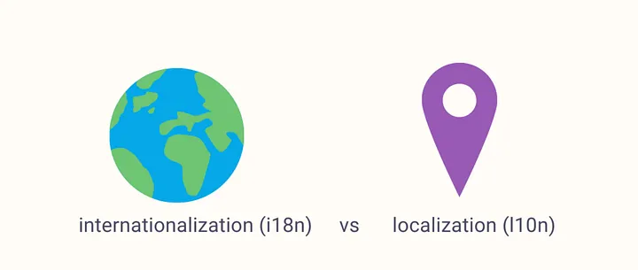

# INDEX

- [INDEX](#index)
  - [Localisation (l10n) \& Internationalisation (i18n)](#localisation-l10n--internationalisation-i18n)
    - [When to use what?](#when-to-use-what)
  - [Localisation in React Applications](#localisation-in-react-applications)
    - [Implementation Steps](#implementation-steps)
  - [Internationalisation Implementation in React](#internationalisation-implementation-in-react)
  - [Advanced Considerations](#advanced-considerations)
    - [Choosing the right library](#choosing-the-right-library)
    - [Performance Optimization](#performance-optimization)
    - [Handling Complex Scenarios](#handling-complex-scenarios)
    - [Testing](#testing)
  - [Common Pitfalls to Avoid](#common-pitfalls-to-avoid)

---

## Localisation (l10n) & Internationalisation (i18n)



In today’s globalised world, creating applications that cater to diverse audiences across different languages, regions, and cultures is no longer optional — it’s a necessity. Localisation (l10n) and Internationalisation (i18n) are crucial processes that ensure your application is accessible, relevant, and user-friendly for a worldwide audience.

- **Localisation (l10n)**: The process of adapting your application for a specific region or language by translating text, modifying content, and ensuring cultural relevance.
- **Internationalisation (i18n)**: The process of designing your application in a way that makes it easy to adapt for various languages and regions without requiring significant changes to the codebase.

### When to use what?

- Use **internationalisation (i18n)**

  - At the start of application development when you want to support multiple locales in the future.
  - To create a scalable and maintainable foundation for multi-language support.

- Use **localisation (l10n)**
  - When you need to adapt your application for a specific region or language.
  - During the later phases of development when specific regional requirements become clear.
  - When launching your application in a new market or geography.

---

## Localisation in React Applications

- Key Features of Localisation in React:
  - Component-Level Localisation: React’s component-based architecture makes it easier to localize UI elements separately.
  - Dynamic Content Updates: React’s state management allows seamless language switching without reloading the application.
  - Integration with Libraries: Libraries like `react-intl` and `react-i18next` provide built-in support for advanced localisation features.

### Implementation Steps

1. **Set Up Your Project**: Ensure your React project is set up with the necessary dependencies for localisation. Install libraries like `react-intl` or `react-i18next`.

2. **Create Language Files**: Organize your translations by creating separate JSON or JavaScript files for each language you want to support. These files should contain key-value pairs for all translatable strings in your application.

   ```json
   // en.json
   {
     "welcome": "Welcome, {{name}}!"
   }


   // fr.json
   {
     "welcome": "Bienvenue, {{name}}!"
   }
   ```

3. **Handling Pluralization and Dynamic Content**: Consider how your application will handle plural forms and dynamic content. Many localisation libraries provide built-in support for pluralization rules and allow you to insert dynamic values into your translations.

   ```json
   {
     "itemCount": "You have {{count}} item(s)."
   }
   ```

   ```jsx
   // in react
   const { t } = useTranslation();
   return <p>{t('itemCount', { count: items.length })}</p>;
   ```

4. **Language Switching**: Implement a way for users to switch languages within your application. This may involve creating a language selector component and updating the application state to reflect the selected language.

   ```jsx
   const changeLanguage = (lang) => {
     i18n.changeLanguage(lang);
   };

   <button onClick={() => changeLanguage('en')}>English</button>
   <button onClick={() => changeLanguage('fr')}>French</button>
   ```

5. **RTL Support**: If your application needs to support right-to-left (RTL) languages like Arabic or Hebrew, ensure that your layout and styles can accommodate this. You may need to adjust CSS properties and use libraries that support RTL out of the box.

   ```html
   <html lang="ar" dir="rtl">
     <!--  -->
   </html>
   ```

   - Or dynamically:

     ```jsx
     const direction = i18n.dir(); // "ltr" or "rtl"
     document.documentElement.dir = direction;
     ```

---

## Internationalisation Implementation in React

- Steps:

  1. Install `i18next` and `react-i18next`:

     ```bash
     npm install i18next react-i18next
     ```

  2. Configure `i18next`:

     ```js
     import i18n from 'i18next';
     import { initReactI18next } from 'react-i18next';

     i18n.use(initReactI18next).init({
       resources: {
         en: {
           translation: {
             welcome: 'Welcome, {{name}}!'
           }
         },
         fr: {
           translation: {
             welcome: 'Bienvenue, {{name}}!'
           }
         }
       },
       lng: 'en', // Default language
       fallbackLng: 'en',
       interpolation: {
         escapeValue: false
       }
     });

     export default i18n;
     ```

  3. Wrap your application with the `I18nextProvider`:

     ```jsx
     import React from 'react';
     import ReactDOM from 'react-dom';
     import { I18nextProvider } from 'react-i18next';
     import App from './App';
     import i18n from './i18n';

     ReactDOM.render(
       <I18nextProvider i18n={i18n}>
         <App />
       </I18nextProvider>,
       document.getElementById('root')
     );
     ```

  4. Use translation hooks in your components:

     ```jsx
     import React from 'react';
     import { useTranslation } from 'react-i18next';

     const MyComponent = () => {
       const { t } = useTranslation();

       return <h1>{t('welcome', { name: 'John' })}</h1>;
     };
     ```

---

## Advanced Considerations

### Choosing the right library

- `react-i18next`:
  - Best for React applications due to its seamless integration.
  - Provides hooks like useTranslation for functional components.
- `react-intl`:
  - Suitable for applications that require advanced formatting options.
  - Supports ICU message syntax for complex translations.
- `Polyglot.js`:
  - Lightweight and simple, ideal for small applications.
- `LinguiJS`:
  - Focuses on developer experience with minimal boilerplate.

### Performance Optimization

- **Lazy Loading**: Implement lazy loading for translations to reduce the initial load time of your application. Load only the necessary language files when needed.

  ```js
  import(`./locales/${locale}.json`).then(translations => {
    i18n.addResourceBundle(locale, 'translation', translations);
  });
  ```

- **CDN Caching**: Host your translation files on a CDN for faster access.
- **Minimizing Bundle Size**: Remove unused locales during the build process using tools like `babel-plugin-i18next-extract`.

### Handling Complex Scenarios

- Gender-Specific Translations:

  ```json
  {
    "welcome": {
      "male": "Welcome, Mr. {{name}}!",
      "female": "Welcome, Ms. {{name}}!"
    }
  }
  ```

- Context-Sensitive Translations: Use context keys to differentiate:

  ```json
  {
    "button": {
      "save": "Save",
      "close": "Close"
    }
  }
  ```

### Testing

- Automated Tests:
  - Unit test translation keys to ensure proper usage.
  - Verify fallback language behavior.
- Manual Testing:
  - Simulate different locales using browser settings.
  - Test edge cases like long translations or missing keys.
- Tools for Testing:
  - `BrowserStack` for cross-browser localization testing.
    - more here: [How to perform Localization Testing](https://www.browserstack.com/guide/localization-testing-on-websites-and-apps)
  - Lighthouse for accessibility audits.

---

## Common Pitfalls to Avoid

1. **Hardcoding Strings:** Always use translation keys and avoid embedding strings in components.
2. **Ignoring RTL Languages:** Test `RTL` layouts early in development.
3. **Overlooking Fallbacks:** Ensure all keys have a default fallback language.
4. **Not Testing Edge Cases:** Test long texts, placeholders, and pluralization thoroughly.
5. **Lack of Documentation:** Maintain clear documentation for translation keys and usage to help onboard new developers easily.

---

[⬆ back to top](#index)
