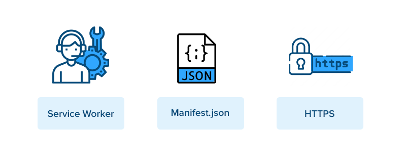
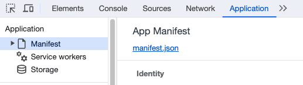
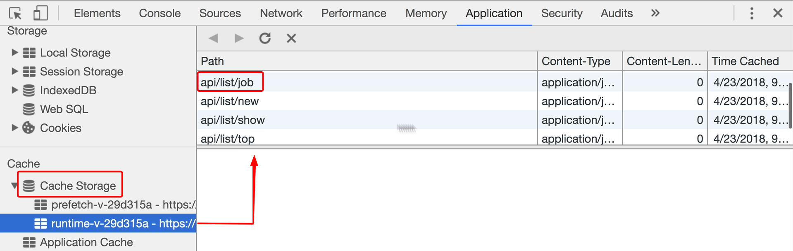

# INDEX

- [INDEX](#index)
  - [Performance](#performance)
  - [Minify / Minimize files](#minify--minimize-files)
    - [Minimize images](#minimize-images)
  - [Critical Render Path](#critical-render-path)
  - [Code Splitting](#code-splitting)
  - [Tree Shaking](#tree-shaking)
  - [Avoid blocking main thread](#avoid-blocking-main-thread)
  - [Avoid memory leaks](#avoid-memory-leaks)
  - [Avoid multiple re-rendering](#avoid-multiple-re-rendering)
  - [Caching](#caching)
  - [Rollup Visualizer](#rollup-visualizer)

---

## Progressive Web Apps PWA

It's a term used to describe a set of features and APIs in the browser that allow us to create a web application that can be installed on the user's device and can work offline.

- Native mobile apps have all its files downloaded to the device and can work offline, By using PWA, we can make our web app work offline and installable on the user's device **(Behave like a native mobile app)**

PWAs are better than the mobile web and offer a much faster, reliable and engaging experience. If implemented well, they offer an integrated/immersive mobile experience


- It's a term used to describe a set of features and APIs in the browser
- Progressive Web Apps are user experiences that have the reach of the web, and are:

  - reliable
  - fast
  - engaging

- **PWA Components:**
  

  1. Manifest
  2. Service Workers
  3. HTTPS

- You can access the PWA components in the browser's `devtools` -> `Application` tab

  

- Guide to install a PWA:
  - [What does it take to be installable?](https://web.dev/install-criteria/)

---

### Manifest

- It defines how the application is displayed to the user and how it gets launched. All **metadata** related to the app is also defined here — starting URL, full and short name, link icons, splash screen and so on.
- It's a `JSON` file that contains the metadata of the app

  ```json
  {
    "name": "My App",
    "short_name": "My App",
    "start_url": "/",
    "display": "standalone",
    "background_color": "#fff",
    "theme_color": "#3f51b5",
    "icons": [
      {
        "src": "images/icons/icon-128x128.png",
        "sizes": "128x128",
        "type": "image/png"
      },
      {
        "src": "images/icons/icon-192x192.png",
        "sizes": "192x192",
        "type": "image/png"
      },
      {
        "src": "images/icons/icon-512x512.png",
        "sizes": "512x512",
        "type": "image/png"
      }
    ]
  }
  ```

- creating manifest -> [making app installable](https://web.dev/install-criteria/)

---

### Service Workers

- It's a **Javascript script file that runs in the background** Asynchronously (separate from our code and can run in a separate thread in the background)
- It acts as a **proxy server** that sits between web applications, the browser, and the network (when available)
  
- It's used for features that don't need a web page or user interaction like:
  - **Offline work mode**
  - **Background syncs**
  - **Push notifications**
  - **Caching**
  - **Storage APIs**
  - **Pre-caching of content**
- As defined on Google developer, a service worker is a script that your browser runs in the background, separate from a web page, opening the door to features that don’t need a web page or user interaction.
- The `service-worker.js` file is created in the `build` phase and it's usually located in the `build` folder
  - it's not created manually as it's a complicated process and it's usually created using `Workbox` library
- Limitations:
  - unable to access the DOM
  - limited browser supports (not an issue anymore)
- It caches the files / data in the browser's `Cache API` to make the app work offline
  
  

#### How to create service worker

- option 1: manually
- option 2: using [Workbox](https://developer.chrome.com/docs/workbox/) which is usually added to PWA plugins
- option 3: in the build phase using `webpack`, `rollup`, `parcel`, etc.

  ```json
  // package.json
  {
    "scripts": {
      "build": "webpack --config webpack.config.js"
      // or
      // "build": "react-scripts build && sw-precache --config=sw-precache-config.js"
    }
  }
  ```

  ```js
  // webpack.config.js
  const { GenerateSW } = require('workbox-webpack-plugin');
  module.exports = {
    // ...
    plugins: [new GenerateSW()]
  };
  ```

---

### HTTPS

- For security and preventing hackers from seeing your requests

---

[⬆ back to top](#index)
