# INDEX

- [INDEX](#index)
  - [Performance](#performance)
    - [Performance Types](#performance-types)
    - [Performance Metrics](#performance-metrics)
    - [The importance of measurement](#the-importance-of-measurement)
    - [Performance Notes](#performance-notes)
  - [JavaScript Performance](#javascript-performance)
    - [The cost of JavaScript](#the-cost-of-javascript)
    - [How to measure JS performance](#how-to-measure-js-performance)
    - [Optimizing the cost of JavaScript](#optimizing-the-cost-of-javascript)
  - [CSS Performance](#css-performance)
  - [Minify / Minimize files](#minify--minimize-files)
    - [Minimize images](#minimize-images)
    - [Font Optimization (minimize font files)](#font-optimization-minimize-font-files)
  - [Critical Render Path](#critical-render-path)
  - [Code Splitting (Lazy Loading)](#code-splitting-lazy-loading)
  - [Tree Shaking](#tree-shaking)
  - [Avoid blocking main thread](#avoid-blocking-main-thread)
  - [Avoid memory leaks](#avoid-memory-leaks)
  - [Avoid multiple re-rendering](#avoid-multiple-re-rendering)
  - [Reducing number of concurrent requests](#reducing-number-of-concurrent-requests)
  - [Caching](#caching)
    - [Why do we need caching?](#why-do-we-need-caching)
    - [HTTP cache (`cache-control` headers)](#http-cache-cache-control-headers)
    - [`content-addressable` storage](#content-addressable-storage)
    - [Application cache](#application-cache)
  - [Rollup Visualizer](#rollup-visualizer)
  - [Web Vitals and Performance Score](#web-vitals-and-performance-score)
    - [Web Vitals](#web-vitals)
    - [LightHouse](#lighthouse)

---

## Performance

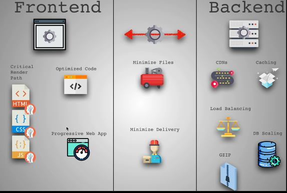

- Why does performance matter?

  - **User experience**: A slow website can lead to a poor user experience, which can lead to a loss of customers.
    - `0.1` second is about the limit for having the user feel that the system is reacting instantaneously, meaning that no special feedback is necessary except to display the result.
    - `1` second is about the limit for the user's flow of thought to stay uninterrupted, even though the user will notice the delay. No special feedback during delays of more than `0.1` but less than `1` second is necessary. But the user loses the feeling of operating directly on the data.
    - `10` seconds is about the limit for keeping the user's attention focused on the dialogue. For longer delays, users will want to perform other tasks while waiting for the computer to finish, so they should be given feedback indicating when the computer expects to finish. Feedback during the delay is especially important if the response time is likely to be highly variable, since users will then not know what to expect.
      
      - Note that the `10` seconds includes the time needed to download the files from the server and to parse and execute the files in the browser (run the application) and to render the files in the browser (paint the application) and to handle the user's interactions with the application (clicks, etc.)
  - **SEO & Revenue**: Google uses the performance of a website as a ranking factor. A slow website can lead to a lower ranking in search results. Research shows that:
    - `1` second delay resulted `11%` fewer page views, and `7%` loss in conversions
    - `2` seconds delay in web page load time increased bounce rate by `103%` (Double the people are leaving the website)
    - `400ms` improvement in performance resulted in `9%` increase in traffic at Yahoo
    - Google found that a `2%` slower page resulted in `2%` fewer searches, which means `2%` fewer ads shown (money lost 📉)
    - `100ms` improvement in performance resulted in `1%` increase in revenue at Amazon
    - `53%` of users will leave a mobile page if it takes longer than `3` seconds to load
    - if you want user to feel like your site is faster than your competitor's, you need to be `20%` faster

- Why not make the website as fast as possible?
  - **Complexity**: our applications are getting more complex and larger
    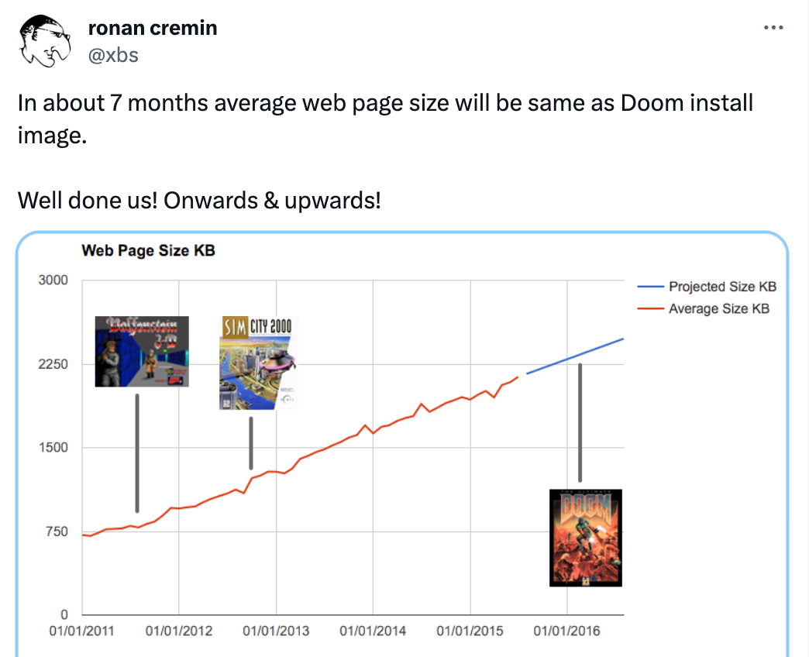
  - `LTE` and `3G` are still the most used networks in the world and they are slow
    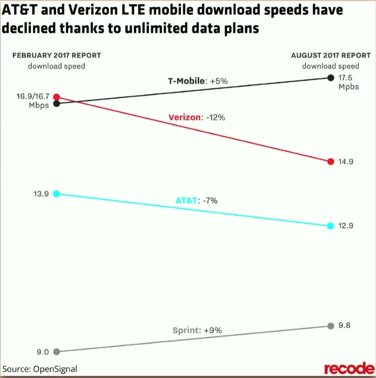
  - **Cost**: It's expensive to make the website as fast as possible because it requires more resources and more time
  - **Trade-offs**: It's not always possible to make the website as fast as possible because of the trade-offs between the performance and the user experience and the cost and the complexity
- Performance needs are different for different applications
  - for `news` website, the most important thing is to load the news quickly (showing content), we can't show loading states here because the user needs to see the news quickly
  - for `game` website, the most important thing is to load the game quickly (showing content), we can show loading states here until the game is loaded because the user needs to play the full game
  - for `gmail`, usually the page is loaded and user will leave it open for a long time, so the most important thing is to handle `memory leaks` and `performance` of the application
  - `Twitter` might care about time to first tweet, but not about time to first interaction
  - So, You should ask yourself: _"What does my product care about? What does my user care about?"_

---

### Performance Types


- **Network load performance**
  - This focuses on getting the files from the server to the client as quickly as possible
  - Shipping less code to the client (minify, minimize, tree shaking, code splitting)
  - Reducing the number of requests (caching, code splitting)
- **Parsing and compiling performance**
  - This focuses on how the browser processes the files once they are downloaded
  - Parsing the `HTML`, `CSS`, `JS` files
  - Compiling the `JS` files
- **Rendering performance**
  - This focuses on how the browser paints the files on the screen and how it handles the user's interactions with the application
  - Critical render path
  - Executing the code & avoiding blocking the main thread
  - Avoiding memory leaks
  - Avoiding blocking the main thread
  - Avoiding multiple re-rendering

---

### Performance Metrics

- Here are some numbers to think about from `RAIL` model
  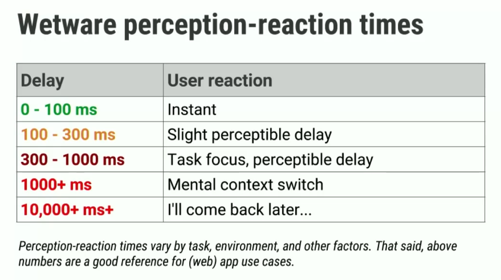
  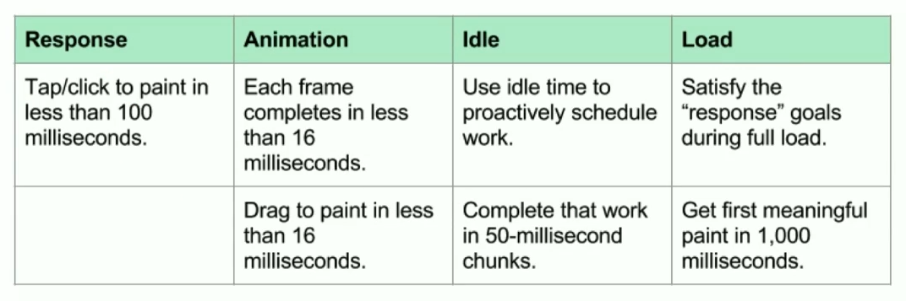
- Don't be obsessed with the numbers, but use them as a guide to make the website as fast as possible, **It's about getting `10%` better, not `100%` better**

---

### The importance of measurement

It's the first step to improve the performance of the website.

> Always measure. Don't tune for speed until you've measured, and even then don't unless one part of the code overwhelms the rest. - Rob Pike

Don't go just blindly applying performance optimizations, you need to measure first to know where the problem is and then apply the optimization to solve the problem

There's a cost to every optimization, so you need to measure to know if the optimization is worth it or not (trade-offs)

- Things to think about while measuring:

  - Are we testing on a fancy computer or a slow phone?
  - Are we simulating less than ideal network conditions?
  - What is our performance budget?
  - Which browsers are we testing on?
    - Different browsers have different performance characteristics (something that you think is fast in one browser might be slow in another browser)

- Tools to measure the performance:
  - `Lighthouse` (Chrome extension)
  - `WebPageTest`
  - `PageSpeed Insights`
  - `Chrome DevTools`
  - `Performance` API

---

### Performance Notes

- **Very important tip**: Make sure you're measuring the performance of the website in **(Production mode)**
  - if you're measuring the performance of the website in **(Development mode)**, you will get different results because the code is not optimized and the files are not minified and the files are not compressed and the files are not cached
  - So, always measure the performance of the website in **(Production mode)** to get the real performance of the website
  - You can use `webpack` to build the website in **(Production mode)** by running `webpack --mode production` or by setting the `mode` property to `production` in the `webpack.config.js` file
- Here's a great site to check the bundle size of libraries: [bundlephobia](https://bundlephobia.com/)
  - Why use it? because the size of the library matters, the smaller the library, the faster the website
  - **It's a good practice to check the bundle size of the libraries before using them in your project**

---

## JavaScript Performance

### The cost of JavaScript

We can't buy faster servers to improve performance of **client-side** applications, so we need to make the client-side applications as fast as possible.

- A lot of time and effort is spent on compressing assets, removing requests, and reducing latency, but what about the cost of the JavaScript itself once the assets are downloaded and the application is running?

  - Sometimes, the `js` files are the most expensive part of the application (parse, compile, execute, etc.)
    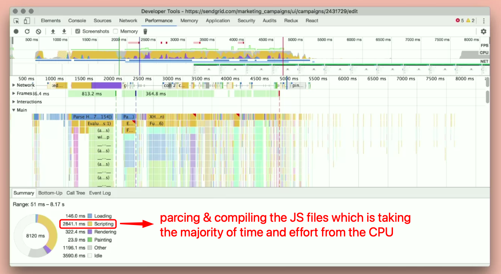
  - That's where the `cost of JavaScript` comes in to play and it's the most important thing to focus on to improve the performance of the client-side applications

- **Okay, so what is happening in the yellow part?**
  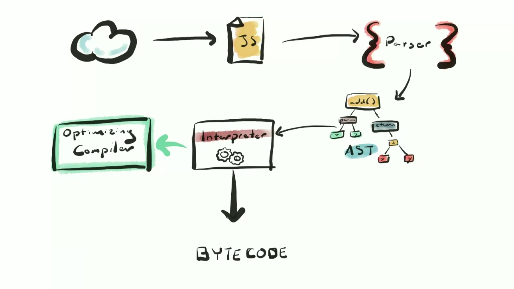

  - **Parse**: The browser has to read the `js` file and convert it into a format it can understand

    - parsing is slow, especially on mobile (as slow as `1MB/s` on mobile)

  - **AST**

    - After parsing, code is turned into an **abstract syntax tree (AST)** and then into bytecode

    > `AST` is a tree representation of the abstract syntactic structure of source code written in a programming language.
    >
    > summary: it's a tree representation of the code that the browser can understand and execute
    > 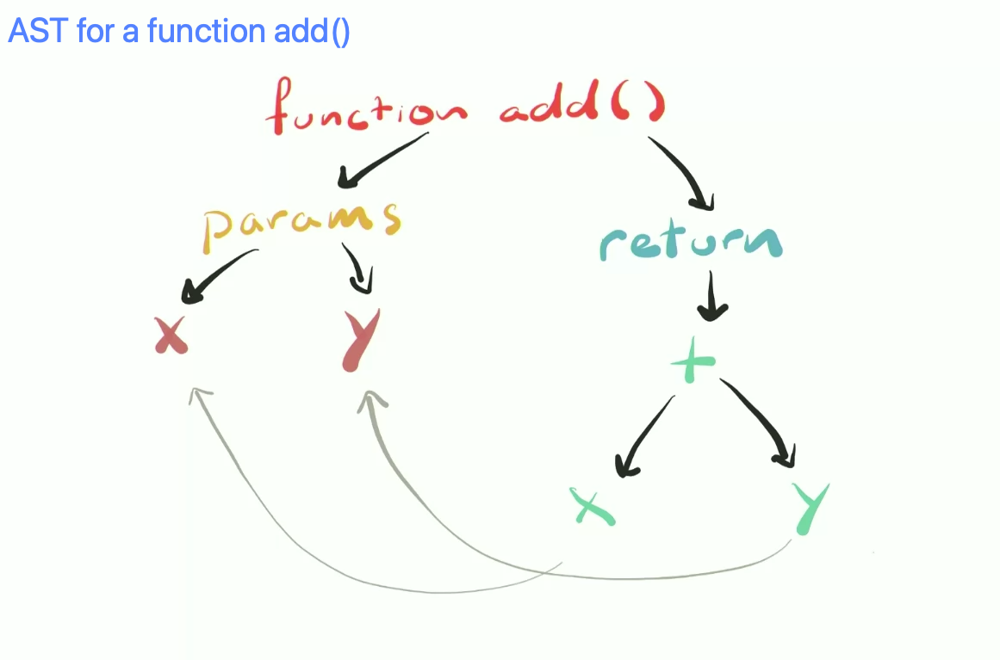

  - **Compile**: The browser has to convert the `js` file into a format that the computer can understand
    - Javascript is a compiled language, but it's also an interpreted language -> (Just in Time `JIT` compilation) meaning that the `js` code is compiled moments before it's executed (it's getting compiled but not by us manually, it's getting compiled by the browser)
      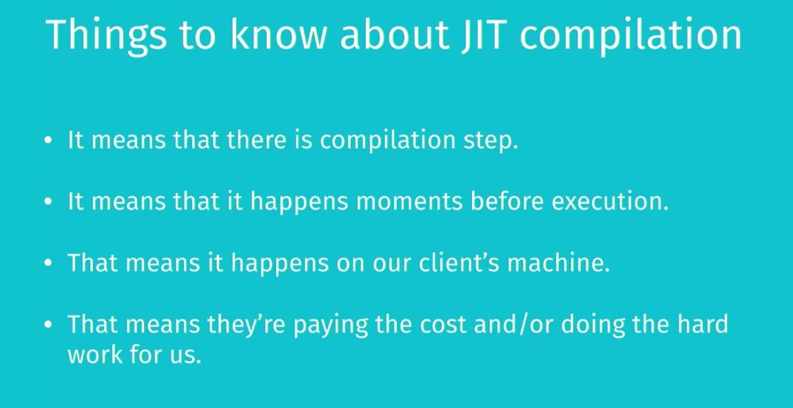
    - There's an `optimization compiler` that optimizes for what is has seen. if it sees something new, it will `de-optimize` and `re-optimize` again
  - **Execute**: The browser has to run the `js` file and execute the code
  - **Memory**: The browser has to allocate memory to store the `js` file and the variables and the objects and the functions and the classes and the modules and the closures and the callbacks and the promises and the async/await and the generators ... etc.

---

### How to measure JS performance

- Using `performance` API

  ```js
  import { performance } from 'perf_hooks';

  let iterations = 1000000;
  const a = 1;
  const b = 2;
  const add = (x, y) => x + y;

  // Setup
  performance.mark('start');
  // Test
  while (iterations--) {
    add(a, b);
  }
  // Teardown
  performance.mark('end');
  performance.measure('My Special Benchmark', 'start', 'end');
  const [measure] = performance.getEntriesByName('My Special Benchmark');
  console.log(measure);
  ```

  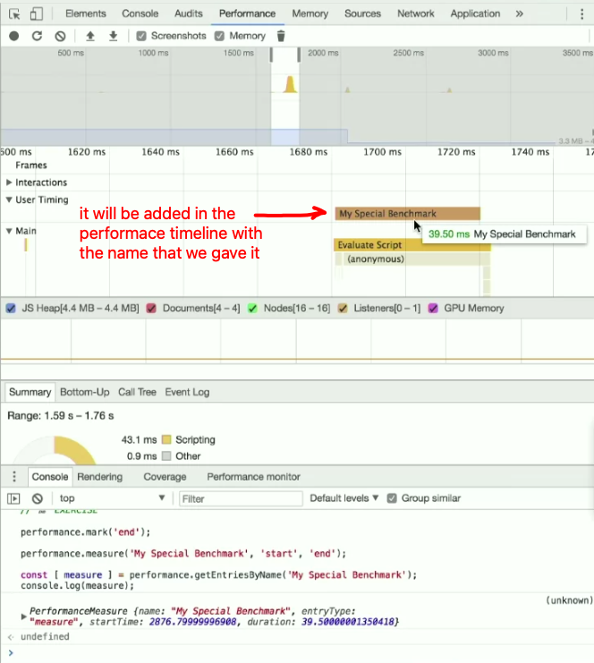

- The native optimization-compiler from the engine (`V8`) that happens behind the scenes is super useful, here's a comparison of the `duration` with & without it:
  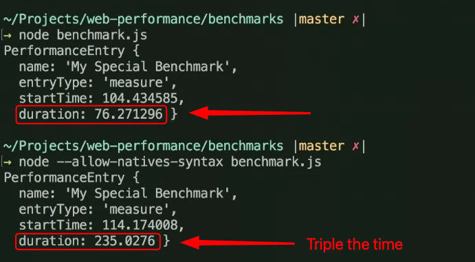

  - It optimizes the code by detecting repeated calls to the same function and inlining the function to avoid the overhead of calling the function

- We can get more insights from the engine about the performance of the code using the `--trace-opt` flag in `node` to see the `V8` engine optimizations and the `--trace-deopt` flag to see the `V8` engine de-optimizations
  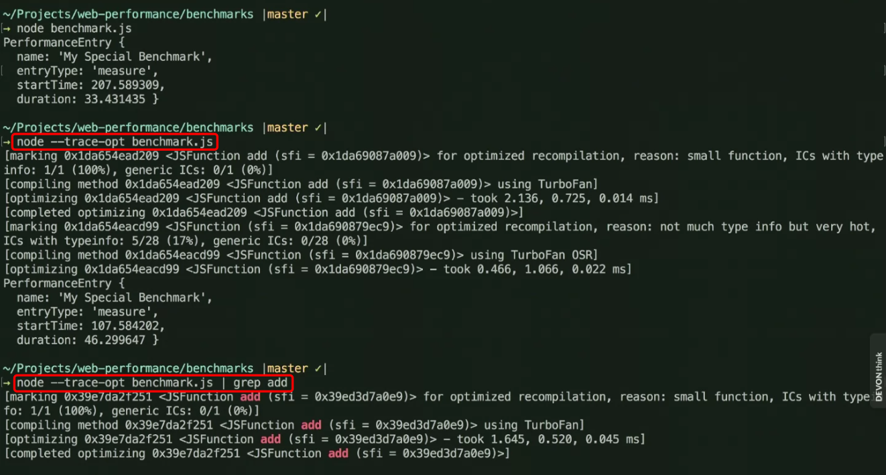

---

### Optimizing the cost of JavaScript

The code you write is not always the code that `V8` executes, as it sometimes re-writes the code for you after it has seen it run. This is called `optimization` and `de-optimization`

So, our job is to write as much readable code as possible, and `V8` job is to optimize it for us

- **Shipping less JS code**

  - When we use `Babel`, it adds a lot of `polyfills` and `shims` to the code to make it work in older browsers (which increases the size of the code), but we don't need all of them in the modern browsers
  - So, we can use `@babel/preset-env` to only include the `polyfills` and `shims` that we need in the code

    ```js
    // .babelrc file
    {
      'presets': [
        [
          '@babel/preset-env',
          {
            'useBuiltIns': 'usage',
            'corejs': 3
          }
        ]
      ]
    }

    // ---------------OR--------------- //
    {
      'presets': [
        [
          'env',
          {
            'targets': {
              'browsers': ['last 2 versions', 'safari >= 7']
              // or: 'browsers': ["> 1%", "last 2 versions", "not ie <= 8"]
            }
          }
      ]
    ]
    }
    ```

- **Parsing**

  - One way to reduce the parsing time is to reduce the size of the `js` file **(have less code to parse)**
  - Another way is to do as much parsing as you need and as little as you can by doing other parsing later **(lazy parsing)** -> Things that you don't need to parse immediately, you can parse them later when you need them
    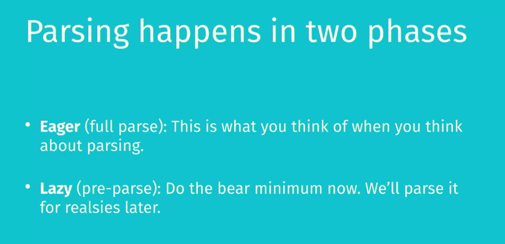
    - You can use libraries & plugins to do lazy parsing like:
      - [optimize-js](https://www.npmjs.com/package/optimize-js)
      - [optimize-js-plugin](https://www.npmjs.com/package/optimize-js-plugin) -> for `webpack`
      - [prepack](https://prepack.io/)
      - [webpack](https://webpack.js.org/)
      - [rollup](https://rollupjs.org/guide/en/)
      - [parcel](https://parceljs.org/)
      - [esbuild](https://esbuild.github.io/)
  - Avoid nested functions
    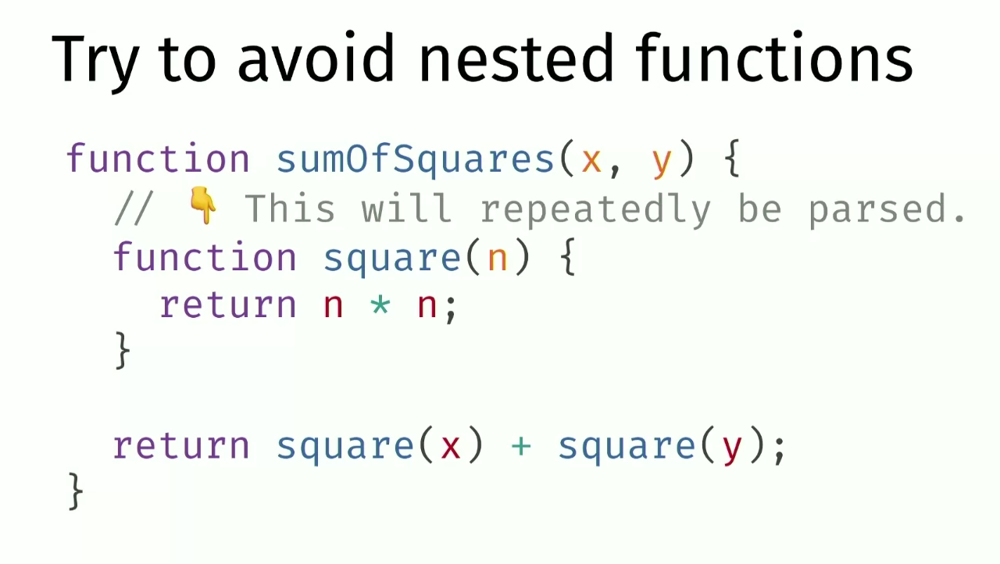
    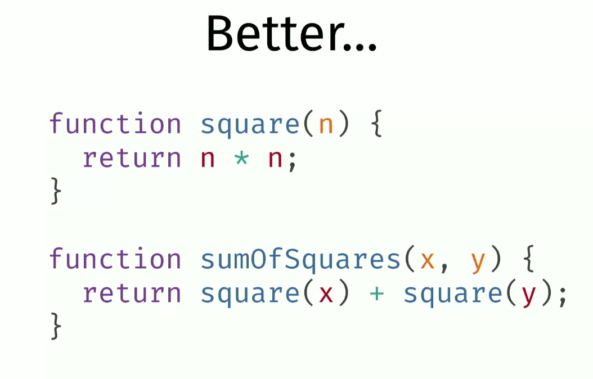

- **Compiling**

  - Optimize objects

    - The `V8` engine has a hidden class mechanism that it uses to optimize the objects in the `js` code
    - It does so by checking if objects have the same `map` using `%HaveSameMap` method to avoid repeating the same map for the same objects and to avoid creating a new map for the same objects, so that functions can be optimized when they are called with the same map (same object structure)

      ```js
      const a = { a: 1 };
      const b = { a: 4 };
      console.log(%HaveSameMap(a, b)); // true

      const c = { a: 1 };
      const d = { b: '4' };
      console.log(%HaveSameMap(c, d)); // false (different maps)
      ```

  - Scoping and Prototypes

    - The `V8` engine uses `hidden classes` to optimize Scoping and Prototypes when looking for properties in the `prototype chain`
    - Takeaways:
      - Initialize your properties at creation time and in the same order
      - Try not to modify them after creation
      - Maybe just use `Typescript` or `Flow` to help you with that (so that you don't have to worry about these things)

  - Function inlining
    - The `V8` engine inlines functions to optimize the code by detecting repeated calls to the same function and inlining the function to avoid the overhead of calling the function

- **Takeaways:**
  - The easiest way to reduce `parse`, `compile`, and `execution` times is to **ship less code**
  - Use `User Timing API` to measure the performance of the `js` code and figure out where the biggest bottlenecks are
  - Consider using a `type system` so that you don't have to worry about most of the things above
  - Consider using tools that can help you with the `js` performance like
    - `webpack`
    - `rollup`
    - `parcel`
    - `esbuild`
    - `prepack`
    - `optimize-js`
    - `optimize-js-plugin`

---

## CSS Performance

To also improve the performance from the `css` side:

- we can reduce complicated specificity and reduce the number of selectors to reduce the time needed to calculate these specificities.

  ```css
  /* BAD ❌ */
  .sidebar > .menu-item:nth-child(4n + 1) {
    color: red;
  }

  /* GOOD ✅ */
  .menu-item {
    color: red;
  }
  ```

- Use simple class-names or `BEM` methodology
- Remove unused `css` using `purgecss` or `uncss` or `purifycss` or `cssnano` libraries

  - Because the browser has to parse and compile and execute the `css` files / rules, and check if the rules are applied to the `DOM` elements or not (which takes time)
  - The less styles you have, the less there is to check.

- [Critical render path](#critical-render-path) for `css` files

  - The browser has to parse and compile and execute the `css` files to build the `CSSOM` tree and then combine the `CSSOM` tree with the `DOM` tree to form the render tree and then compute the layout of each visible element and paint them on the screen

- Avoid **Reflow** by:

  - Change `classes` at the lowest level of the `DOM` tree (not at the top level)
  - Avoid repeatedly modifying `inline styles`

    ```js
    // BAD ❌
    element.style.width = '100px';
    element.style.height = '100px';
    element.style.background = 'red';
    // GOOD ✅
    element.style.cssText = 'width: 100px; height: 100px; background: red;';
    ```

  - Do less work when changing `styles`

    ```js
    const button = document.getElementById('button');
    const boxes = document.querySelectorAll('.box');

    // BAD ❌
    const doubleWidth = el => {
      const width = el.offsetWidth; // calculate the width each time
      el.style.width = `${width * 2}px`;
    };
    button.addEventListener('click', () => {
      boxes.forEach(doubleWidth);
    });

    // GOOD ✅
    button.addEventListener('click', () => {
      const widths = boxes.map(el => el.offsetWidth); // calculate the width once
      boxes.forEach((el, i) => {
        el.style.width = `${widths[i] * 2}px`;
      });
    });
    ```

  - Trade smoothness for speed when animating (use bigger `steps` instead of smaller `steps`)
  - Avoid `table layouts` (they are slow)
  - Batch your `DOM` changes (use `requestAnimationFrame`) -> comes out of the box when using frameworks like `React`

    - It's used to batch the `DOM` changes to avoid multiple re-rendering and to avoid blocking the main thread
    - We use it to tell the browser to do the `DOM` changes in the next frame instead of doing them immediately

      ```js
      // BAD ❌
      const element = document.getElementById('element');
      element.style.width = '100px';
      element.style.height = '100px';
      element.style.background = 'red';

      // GOOD ✅
      const element = document.getElementById('element');
      requestAnimationFrame(() => {
        element.style.width = '100px';
        element.style.height = '100px';
        element.style.background = 'red';
      });
      ```

  - Use libraries like `fastdom` to batch `DOM` changes to avoid multiple re-rendering and to avoid blocking the main thread

    ```js
    // GOOD ✅
    // measure then mutate
    fastdom.measure(() => {
      const height = element.offsetHeight; // measure
      fastdom.mutate(() => {
        element.style.height = `${height * 2}px`; // mutate
      });
    });

    // BAD ❌
    const height = element.offsetHeight; // measure
    element.style.height = `${height * 2}px`; // mutate
    ```

  - Use `debounce` to avoid multiple `resize` events

> Most of these things are handled by the frameworks automatically like `React`, `Vue`, `Angular`, etc. ⚙️

---

## Minify / Minimize files

- `Minify`: It's the process of removing all unnecessary characters from the source code without changing its functionality.
- `Minimize`: It's the process of reducing the size of the file by changing the format of the file.

- **Minify tools**

  - usually done in frameworks automatically to minify the javascript and css files into one file in the build phase to reduce the size/number of the files and the number of requests
  - used in `webpack`, `gulp`, `rollup`, `parcel`, etc.

### Minimize images

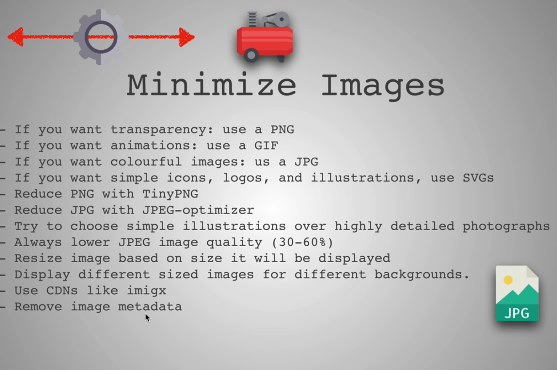

- `imigx`: tool to minimize images and reduce their size and quality + cache them by `CDN`
- Images `metadata` contains information about the image such as the size, the color profile, the number of pixels, etc.
  - This information is not needed for the image to be displayed on the web page. Therefore, it can be removed to reduce the size of the image.
  - Also, it's sometimes removed by the frameworks automatically

---

### Font Optimization (minimize font files)

The font file contains a lot of characters for different languages (which increases the size of the font file) but we don't need all of them in the website.

- You can notice the size difference if you monitored the network tab in the browser while loading the website **from the main source and from the google fonts source**.
  - `Inter` is a critically-acclaimed `sans-serif` font. It's free and open-source. When you download it from its [official website](https://rsms.me/inter/), each `.woff2` font file ranges from `99kb` to `151kb`. When I added 3 font weights to a sample product, it downloaded `427kb` worth of fonts.
  - When I load the same 3 font weights through Google Fonts, it squeezes them all into 1 file that was only `37kb`. A savings of over `90%`!

So, It's good to say that the `Google Fonts` service is doing a lot of optimizations to reduce the size of the font files 🚀

- But what if you want to manually optimize the font files? or want to use google fonts optimization but also serve the font files from your server? That's where the `font subsetting` comes in.

  - **Font subsetting**: It's the process of removing the unused characters from the font file to reduce the size of the font file

    - It's used to reduce the size of the font file by removing the characters that are not used in the website (ex: `Arabic` characters in an `English` website)

    - Google uses "unicode-range subsetting" to serve only the characters that are used on the website, as you will notice that when using font from google fonts, you will use 2 `<link>` tags one for the font file and one for the `css` file, and the `css` file contains the `unicode-range` property to serve only the characters that are used on the website (css file contains the optimization)

      ```css
      @font-face {
        font-family: 'Inter';
        font-style: normal;
        font-weight: 400;
        font-display: swap;
        src: url('inter-latin-400.woff2') format('woff2');
        unicode-range: U+000-5FF; /* if the website uses characters from U+000 to U+5FF, download this font file */
      }
      ```

  - There's a helpful tool, [google-webfonts-helper](https://gwfh.mranftl.com/fonts). It allows you to quickly download optimized fonts from Google Fonts. It seems quite a bit more convenient, though there is a caveat: it doesn't support variable fonts.

> Here's a good article about [font optimization](https://web.dev/articles/reduce-webfont-size), also this [article](https://www.sarasoueidan.com/blog/glyphhanger/) about `glyphhanger` tool to subset fonts.

---

## Critical Render Path

It's how the files are handled after being downloaded from the source

It's a step in the [rendering process in the browser](./Frontend.md#web-browsers) where the browser parses the `HTML` and `CSS` files and builds the DOM and `CSSOM` trees. The browser then combines the DOM and `CSSOM` trees to form the render tree. The render tree is then used to compute the layout of each visible element and paints them on the screen.


- To improve the critical render path, we need to handle the way the browser handles the files downloading process and the way it parses the files

  - Ex: we can use `async` and `defer` attributes in the `script` tag to handle the way the browser handles the files downloading process to prevent blocking the `DOM` tree from being built

    ```html
    <script src="script.js" async></script>
    ```

  - Ex: CSS is considered a **render-blocking resource**. This means that the browser will not render any processed content until the `CSSOM` is constructed.

    - To prevent this, we can use the `preload` attribute in the `link` tag to tell the browser to download the CSS file as soon as possible without blocking the `DOM` tree from being built

      ```html
      <link rel="preload" href="style.css" as="style" />
      ```

    - Another way is to load the stylesheets manually using `JavaScript` to prevent blocking the `DOM` tree from being built

      ```js
      // add this code in the "onload" event listener of the "window" object
      const link = document.createElement('link');
      link.rel = 'stylesheet';
      link.href = 'style.css';
      document.head.appendChild(link);
      ```

- How to measure the performance of the `js` part in the critical render path?

  - We can use the `Performance` API to measure the performance of the `js` part in the critical render path

    ```js
    // add this code in the "onload" event listener of the "window" object
    const t0 = performance.now();
    // code to be measured
    const t1 = performance.now();
    console.log(`Call to doSomething took ${t1 - t0} milliseconds.`);
    ```

  - We can also use the browser `devtools` to measure the performance of the `js` part in the critical render path

    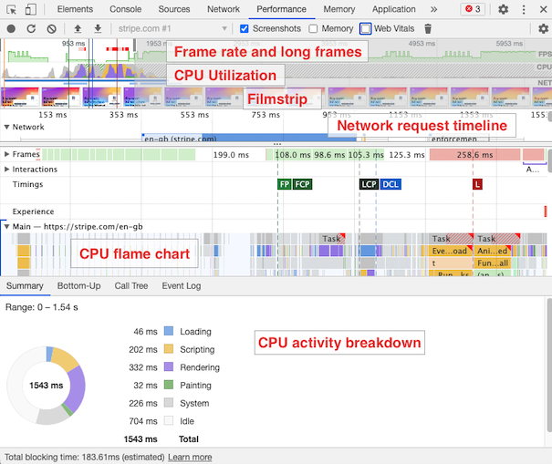

    - The `yellow` part is the `js` scripting part, it includes the **(parsing, compiling, executing)** parts
    - most of this time is from compiling and executing the code
      - for `compiling`, we can use "Ahead of Time `AOT`" compilation to reduce the time needed to compile the code instead of using "Just in Time `JIT`" compilation, like `Angular` does

---

## Code Splitting (Lazy Loading)


It's an optimization technique to improve the performance of the web application by splitting the code into smaller **chunks** to reduce the size of the files and the **number of requests** (avoiding large bundles)

- With code splitting, developers can decide to load whole blocks of JavaScript only in response to some user interaction, like clicks or route changes (or other conditions).
  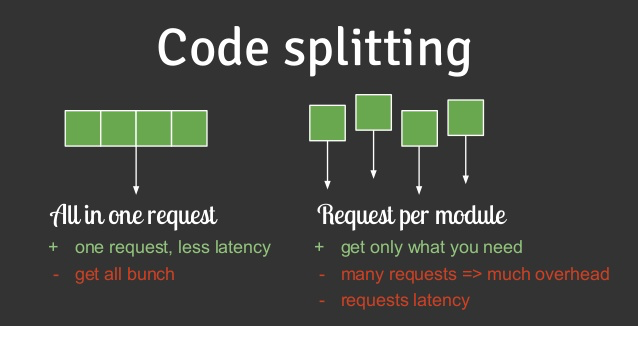
  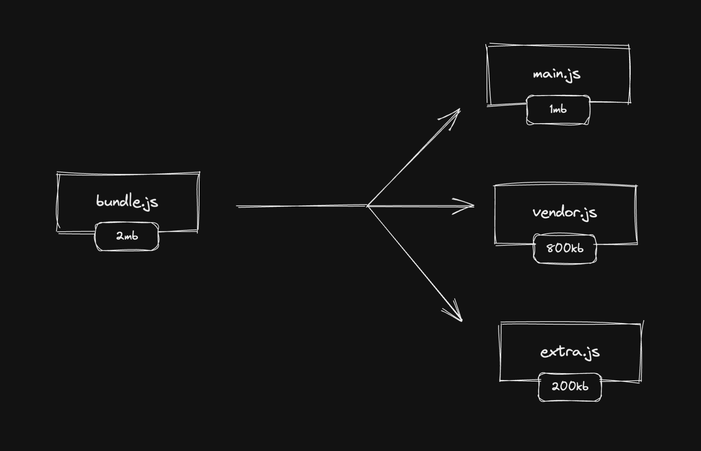

- It's also called **"Progressive bootstrapping"** or **"Lazy loading"**
- It reduces the **execution time** of the code by loading only the required code for the current page instead of loading all the code at once
  > Try to limit the loaded code (lazily or not) to less than `300KB`
- It's done using `webpack`, `rollup`, `parcel`, etc.
  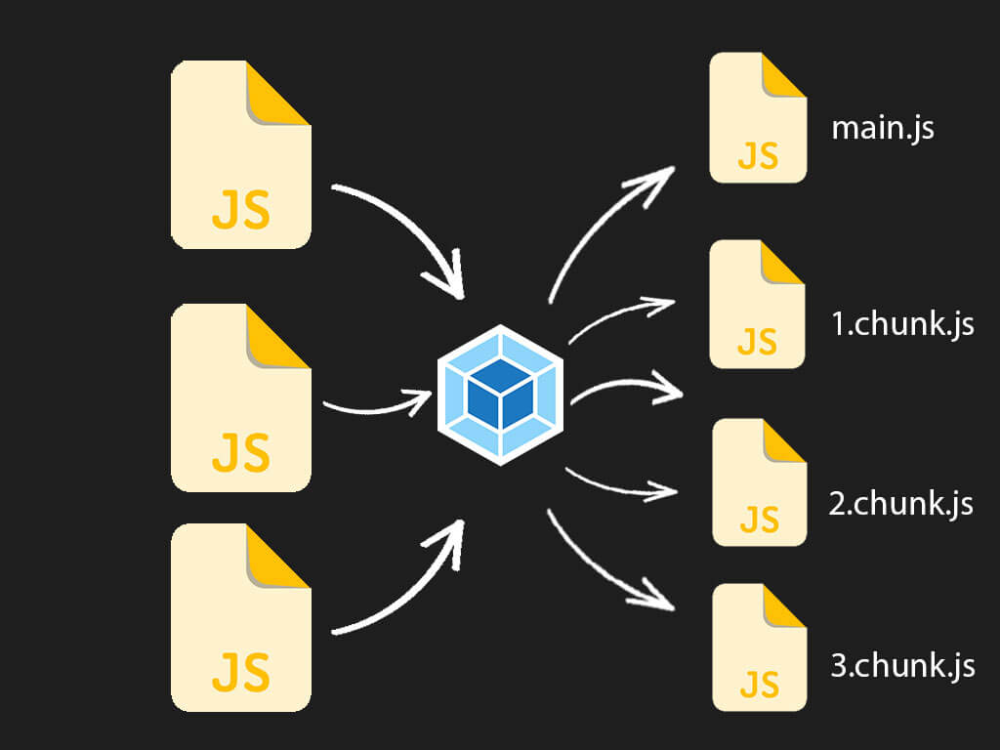
- Types:

  1. **Route-based code splitting**: splitting the code based on the routes
  2. **Component-based code splitting**: splitting the code based on the components
  3. **Dynamic code splitting**: splitting the code based on the user's actions

- There're a lot of libraries and plugins to do code splitting like:
  - `react-loadable` -> it's a higher-order component for loading components with dynamic imports and displaying a loading component while the component is being loaded

> You can analyze the bundle size using `webpack-bundle-analyzer` for `webpack` and `rollup-plugin-visualizer` for `rollup` -> [Rollup Visualizer](#rollup-visualizer)

---

## Tree Shaking

> You can analyze the bundle size using `webpack-bundle-analyzer` for `webpack` and `rollup-plugin-visualizer` for `rollup` -> [Rollup Visualizer](#rollup-visualizer)

---

## Avoid blocking main thread

---

## Avoid memory leaks

---

## Avoid multiple re-rendering

---

## Reducing number of concurrent requests

- **HTTP/2**: It's a major revision of the `HTTP` network protocol used by the `World Wide Web`. It's designed to reduce the latency of web pages by allowing multiple requests and responses to be sent and received at the same time over a single connection.

- But it's not always possible to use `HTTP/2` because it requires `HTTPS` and it's not supported by all browsers
- `HTTP/1.1` has a limit of `6` concurrent requests per domain, so we need to reduce the number of requests to the server to improve the performance of the website
  - because if you have more than `6` requests, the browser will queue the requests and wait for the previous requests to finish before sending the next requests which will increase the time needed to fetch the data from the server

---

## Caching

Caching in client-side applications is the process of storing data in the browser for later use. This data can be fetched from the server or generated by the application itself.

### Why do we need caching?

- It's used to reduce the number of requests to the server and to reduce the time needed to fetch the data from the server

- For example, caching the `js` files downloaded from the server to reduce the number of requests to the server and to reduce the time needed to fetch the `js` files from the server

  - if the bundle changed or updated, the server will send the new bundle and the browser will download it and cache it again. This is called **"cache busting"**
    
    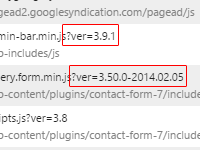

- Also, when serving static `SSR` files, they will have a different **response status codes** based on if it's cached or not

  - `200` -> modified (First time the file is requested)
  - `304` -> not modified (The file is cached)

---

### HTTP cache (`cache-control` headers)

- We will have `ETag` header to check if the file is modified or not -> **`HTTP` cache**
  
- Cashing only affects the "safe" `HTTP` methods like: `GET`, `HEAD`, `OPTIONS`
- Cashing doesn't affect the "unsafe" `HTTP` methods like: `POST`, `PUT`, `DELETE`, `PATCH` **(because they change the state of the server)**

- cache-control headers

  - `no-store`: The response can't be cached, because:
    - The response contains sensitive data
    - The response contains data that changes frequently
  - `no-cache`: The response can be cached, but the client must validate the response with the server before using it
    - We can't use the cached response until we check with the server if the response is still valid (not changed)
  - `max-age`: The response can be cached for a specific amount of time
    - tell the browser not to bother if whatever asset it's asking for is older than a certain amount of time
  - `public`: The response can be cached by any cache
  - `immutable`: The response can be cached for a long time and it won't change

> More, here [HTTP cache](https://web.dev/articles/http-cache)

---

### `content-addressable` storage

- It's a way to cache the files/scripts in the browser using a `content-addressable` storage
- It depend on hashing the files to generate a unique hash for each file and then use this hash as the file name to store the file in the browser

  - ex: `file.js` -> `file-<hash>.js` -> `file-32523jfj3.js`

---

### Application cache

- `storage` in the browser
  - local storage
  - session storage
- `cache`
  - cache storage
  - application cache

---

## Rollup Visualizer

Tool to Visualize and analyze your Rollup bundle to see which modules are taking up space.

- EX: [webpack bundle analyzer](https://www.npmjs.com/package/webpack-bundle-analyzer) for `webpack` and [rollup visualizer](https://www.npmjs.com/package/rollup-plugin-visualizer) for `rollup`
  

  ```js
  // webpack.config.js
  const BundleAnalyzerPlugin = require('webpack-bundle-analyzer').BundleAnalyzerPlugin;

  module.exports = {
    plugins: [new BundleAnalyzerPlugin()]
  };
  ```

  ```sh
  npm run build
  ```

- You can use webpack plugins to reduce the size of the bundle like:
  - `compression-webpack-plugin`
  - `babel-plugin-lodash` (to reduce the size of the lodash library by tree shaking)
  - `gzip-webpack-plugin`

---

## Web Vitals and Performance Score

### Web Vitals

They are a set of metrics that Google uses to measure the performance of a website. They are a subset of the Core Web Vitals, which are a set of metrics that Google uses to measure the performance of a website.

- **Largest Contentful Paint (LCP)**: measures loading performance. To provide a good user experience, LCP should occur within 2.5 seconds of when the page first starts loading.
- **First Input Delay (FID)**: measures interactivity. To provide a good user experience, pages should have a FID of less than 100 milliseconds.
- **Cumulative Layout Shift (CLS)**: measures visual stability. To provide a good user experience, pages should maintain a CLS of less than 0.1.

  - It is a measure of how much movement there is on the page, typically in the first few seconds as the page is loading.
  - The CLS metric measures two things: how many items move, and how significant the shift is. A small icon moving by a few pixels won't be judged as harshly as a big element popping into view and pushing all of the content down.
  - There are two reasons that it's important to optimize for CLS:

    - **Layout shifts** are unpleasant! They're jarring and chaotic, and they can cause you to accidentally click on the wrong thing.
    - Starting in 2021, Google has incorporated CLS into its search ranking algorithm, meaning that focusing on CLS can help improve SEO.

  - How to improve it:
    - [Scroll Optimization in CSS file](../HTML-CSS/2-CSS.md#scroll-optimization)
    - Fixed image sizes
      - Unless you give images a `width` and `height`, the browser won't know their dimensions until the image finishes loading. As a result, images will default to being `0px` wide and `0px` tall, and a big layout shift will occur when the image loads!
      - To prevent this, we need to specify two of the following CSS properties: `width`, `height`, `aspect-ratio`
        - It does mean that you'll need to know the image's intrinsic dimensions before the image loads. This can be tricky if the image is dynamic, but you can solve this by storing the image dimensions in your data model (eg. if blog posts have images, **be sure to store the width and height in the DB, not just the `src`!**).
      - If all else fails, you can always prescribe a fixed size, and use `object-fit: cover` to ensure it doesn't get squashed!
    - Grouped loading
      - If you're loading in a bunch of content at once, try to group it together so that the layout shift is contained to a single area.
      - For example, if you're loading in a bunch of images, try to load them all in a single container, rather than sprinkling them throughout the page.
      - This is a tradeoff; we reduce the number of layout shifts, but it also means that the user won't get to see any images until they've all loaded; on a slow connection, this can make a big difference!
      - In the future, tools like **React Suspense** will help with this problem. For now, you'll need to come up with the right tradeoff for your particular use case.

- **Total Blocking Time (TBT)**: measures responsiveness. To provide a good user experience, pages should have a TBT of less than 300 milliseconds.
- **Time to First Byte (TTFB)**: measures the time from the start of the initial navigation until the browser receives the first byte of the response.

---

### LightHouse

It's a tool to measure the performance of the website and give it a score

- It's a tool that runs a series of audits against a web page, and then generates a report on how well the page did.
- It's available as a Chrome extension, a web page, a Node module, and a Chrome `DevTools` audit.
- It also gives score for the **PWA** components

---

[⬆ back to top](#index)
