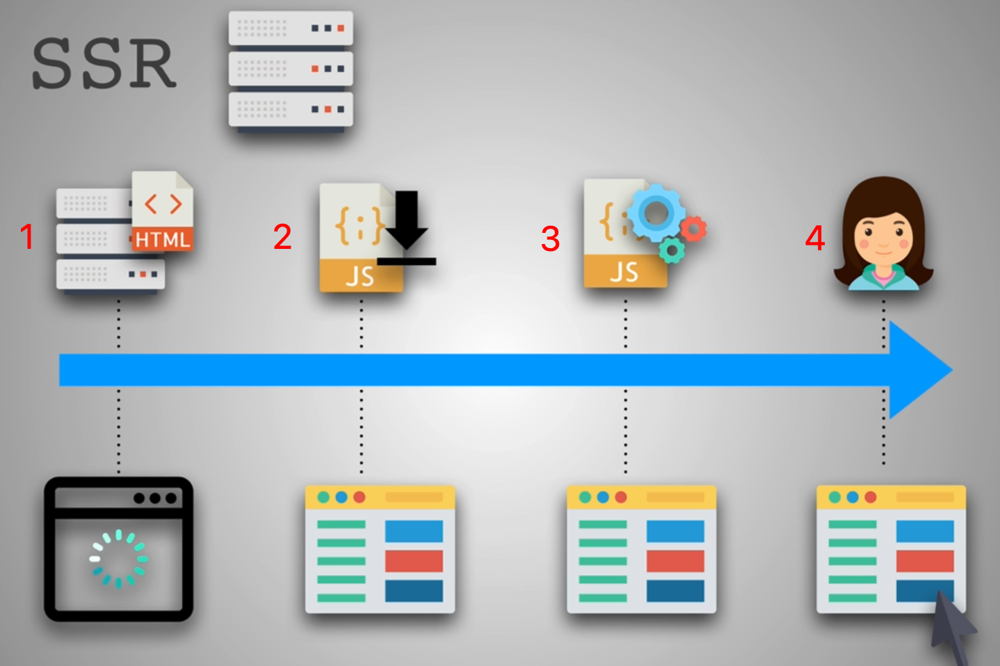
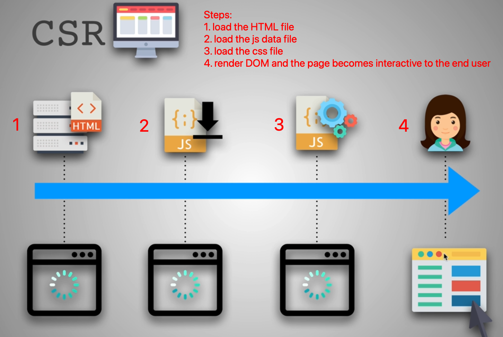

# INDEX

- [INDEX](#index)
  - [SSR vs CSR](#ssr-vs-csr)
    - [SSR: Server Side Rendering](#ssr-server-side-rendering)
    - [CSR: Client Side Rendering](#csr-client-side-rendering)
    - [Progressive Rendering](#progressive-rendering)

---

## SSR vs CSR

### SSR: Server Side Rendering

- The server renders the HTML code and sends it to the client, and the client renders the HTML code and display UI content with little or no activity
  - Once any activity happens, the client sends a request to the server to get the new HTML code and the server renders the HTML code and sends it to the client, and the client renders the HTML code and display UI content with little or no activity
    
    - Here, there's no loading states for the data to be rendered as the server is responsible for rendering the HTML code and sending it to the client, so the end-user will have a better experience as the UI content will be displayed faster even though the data is not rendered yet or the functionality is not working yet
- The browser always asks for the entire HTML page from the server even if only a small part of the page is changed
  > When CSS and Javascript were created and used in the web, the web was designed to be a **document**. So, the browser was designed to ask for the entire HTML page from the server even if only a small part of the page is changed. This is why the server is responsible for rendering the HTML code and sending it to the client
- Ex: `Next.js` framework uses SSR by default, `WordPress`

- Pros

  - Static sites are `SEO` friendly
  - faster initial loading time

- Drawbacks:

  - It's slower than `CSR` as the server is responsible for rendering the HTML code and sending it to the client
  - Full page reloads
  - It's not suitable for applications that need a lot of user interaction
    - Ex: `Facebook` is not using SSR as it needs a lot of user interaction

- if you want to use `SSR` in `React` apps, you need to:
  1. render the view on the server -> `ReactDOMServer.renderToString()`
  2. hydrate the view on the client, which means that the client will take over the rendered HTML code from the server and continue from there by attaching event listeners and so on -> `ReactDOM.hydrate()`
- more [here](../Nextjs/1-Nextjs.md#server-side-rendering-ssr)

---

### CSR: Client Side Rendering

- As the web evolved, the web became more like an **application** than a document. So, the browser was designed to ask for only the data from the server and the client is responsible for rendering the HTML code and displaying the UI content -> **Single Page Application SPA**
- For any activity, the client sends a request to the server to get the data and the server sends the data to the client and the client renders the HTML DOM corresponding to the data and display UI content
  
  - We will have **loading states** for the data to be rendered
  - No need to render the entire HTML page and reload the page
- Pros:
  - Rich interactivity as the client is responsible for rendering the HTML code and displaying the UI content
  - faster than `SSR` as the server is responsible for sending the data only
- Drawbacks:
  - It's not `SEO` friendly as the server sends the HTML code without the data and the search engine can't see the data
    - Ex: `Google` can't see the data in `React` apps
  - longer initial loading time as the client is responsible for rendering the HTML code and displaying the UI content

---

### Progressive Rendering

It's a technique that allows web content to be displayed as soon as possible. It's often achieved by splitting the rendering work and running it in multiple frames or processes.

- It's a solution for the problem of the long initial loading time in `CSR`, as it allows the browser to render the HTML code and display the UI content as soon as possible
- it's based on: **"render as needed"** -> "render as quickly as possible"

---

Search engine optimization is the practice of trying to help your site appear nearer the top of search engine results when people look for the topics that your website covers.

- At the heart of SEO is the idea of working out which terms people are likely to enter into a search engine to find your site and then using these terms in the right places on your site to increase the chances that search engines will show a link to your site in their results.
- SEO is often split into two areas:
  - **on-page techniques**
    - methods you can use on your web pages to improve their rating in search engines.
  - **off-page techniques**
    - Getting other sites to link to you
    - Search engines help determine how to rank your site by looking at the number of other sites that link to yours.
