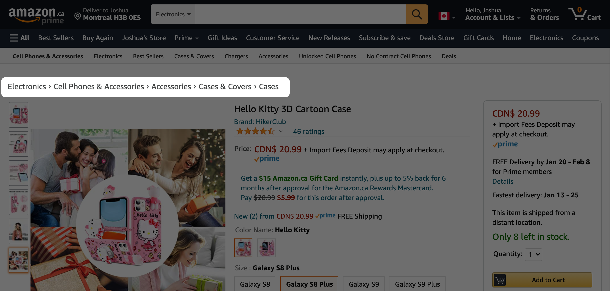
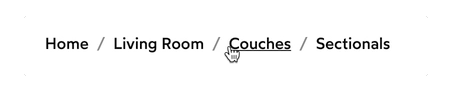
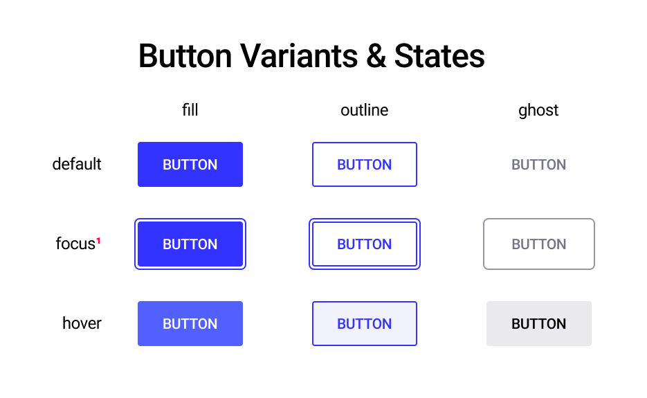
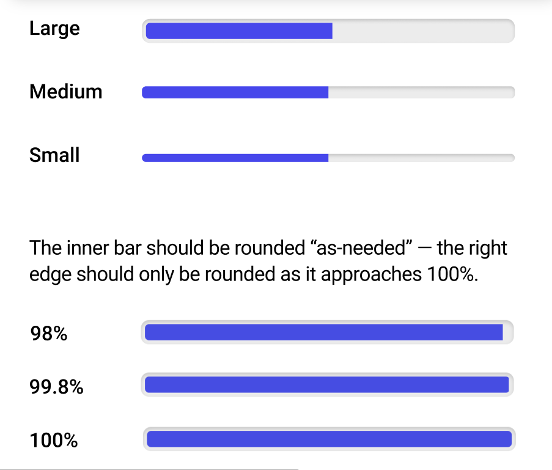
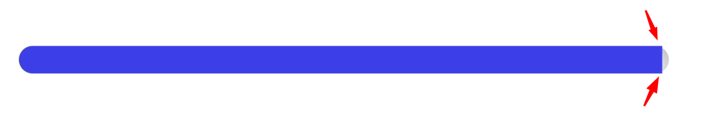
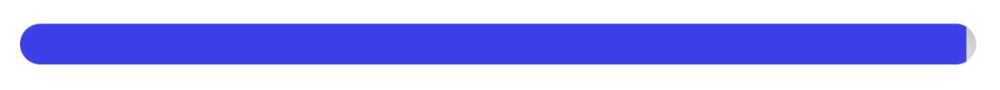
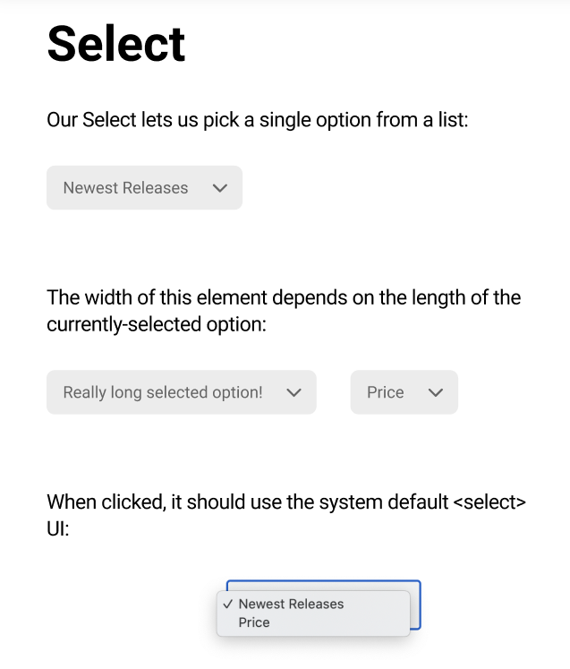

# INDEX

- [INDEX](#index)
  - [UI Components \& Libraries](#ui-components--libraries)
  - [Common components](#common-components)
    - [Breadcrumb](#breadcrumb)
    - [Button](#button)
    - [Progress Bar](#progress-bar)
    - [Select](#select)

---

## UI Components & Libraries

Nowadays, there are many UI components libraries that you can use to build your website faster and with a better design.

- Examples:

  - [Material-UI](https://mui.com/)
  - [Ant Design](https://ant.design/)

- But, there's a problem with these libraries, which is that they're opinionated and you can't customize them as you want or it's hard to do so.
  - This will happen when you have a design that doesn't match the design of the library, which will make you write a lot of custom code to make it work
  - One solution is to use a library that is not opinionated and gives you the ability to customize it as you want
    - Example: [Reach UI](https://reach.tech/) which is a component library that provides only the functionality and you can style it as you want

---

## Common components

Here are some common components (using styled-components) that you can use in your website, or you can use them as a reference to build your own components

### Breadcrumb

A navigation aid that helps users keep track of their location within a website


```jsx
const Breadcrumbs = ({ children }) => {
  return (
    <nav aria-label='Breadcrumb'>
      <BreadcrumbList>{children}</BreadcrumbList>
    </nav>
  );
};
const Crumb = ({ href, isCurrentPage, children }) => {
  return (
    <CrumbWrapper>
      <CrumbLink href={href} aria-current={isCurrentPage ? 'page' : undefined}>
        {children}
      </CrumbLink>
    </CrumbWrapper>
  );
};

// Note that we use <ol> (ordered list) instead of <ul> (unordered list) because the order of the breadcrumbs is important
const BreadcrumbList = styled.ol`
  padding: 0;
  margin: 0;
  list-style-type: none;
`;
const CrumbWrapper = styled.li`
  display: inline;
  --spacing: 12px;
  &:not(:first-of-type) {
    margin-left: var(--spacing);
    &::before {
      content: '/';
      opacity: 0.25;
      margin-right: var(--spacing);
    }
  }
`;
const CrumbLink = styled.a`
  color: inherit;
  text-decoration: none;
  &:hover {
    text-decoration: revert;
  }
`;

// Usage
render(
  <Breadcrumbs>
    <Crumb href='/'>Home</Crumb>
    <Crumb href='/living'>Living Room</Crumb>
    <Crumb href='/living/couch'>Couches</Crumb>
    <Crumb href='/living/couch/sectional' isCurrentPage={true}>
      Sectionals
    </Crumb>
  </Breadcrumbs>
);
```



- **Accordion**: A list of items that can be expanded to show more information

---

### Button

A clickable element that triggers an action when clicked


```jsx
// Button.js 📄

import React from 'react';
import styled from 'styled-components';

const COLORS = {
  primary: 'hsl(240deg 100% 60%)',
  primaryLight: 'hsl(235deg 100% 62%)',
  white: 'hsl(0deg 0% 100%)',
  offwhite: 'hsl(235deg 85% 97%)',
  gray: 'hsl(240deg 10% 50%)',
  transparentGray15: 'hsl(240deg 10% 50% / 0.15)',
  transparentGray75: 'hsl(240deg 10% 50% / 0.75)',
  black: 'hsl(0deg 0% 0%)'
};

const SIZES = {
  small: {
    '--borderRadius': 2 + 'px',
    '--fontSize': 16 / 16 + 'rem',
    '--padding': '6px 12px'
  },
  medium: {
    '--borderRadius': 2 + 'px',
    '--fontSize': 18 / 16 + 'rem',
    '--padding': '14px 20px'
  },
  large: {
    '--borderRadius': 4 + 'px',
    '--fontSize': 21 / 16 + 'rem',
    '--padding': '18px 32px'
  }
};

const Button = ({ variant, size, children }) => {
  const styles = SIZES[size];

  let Component;
  if (variant === 'fill') {
    Component = FillButton;
  } else if (variant === 'outline') {
    Component = OutlineButton;
  } else if (variant === 'ghost') {
    Component = GhostButton;
  } else {
    throw new Error(`Unrecognized Button variant: ${variant}`);
  }

  return <Component style={styles}>{children}</Component>;
};

const ButtonBase = styled.button`
  font-size: var(--fontSize);
  font-family: 'Roboto', sans-serif;
  padding: var(--padding);
  border-radius: var(--borderRadius);
  border: 2px solid transparent;
  text-transform: uppercase;
  cursor: pointer;

  &:focus {
    outline-color: ${COLORS.primary};
    outline-offset: 4px;
  }
`;

const FillButton = styled(ButtonBase)`
  background-color: ${COLORS.primary};
  color: ${COLORS.white};

  &:hover {
    background-color: ${COLORS.primaryLight};
  }
`;
const OutlineButton = styled(ButtonBase)`
  background-color: ${COLORS.white};
  color: ${COLORS.primary};
  border: 2px solid currentColor;

  &:hover {
    background-color: ${COLORS.offwhite};
  }
`;
const GhostButton = styled(ButtonBase)`
  color: ${COLORS.gray};
  background-color: transparent;

  &:focus {
    outline-color: ${COLORS.gray};
  }

  &:hover {
    background: ${COLORS.transparentGray15};
    color: ${COLORS.black};
  }
`;

export default Button;

// ----------------------------------------------

// Usage
render(
  <>
    <Button variant='fill' size='small'>
      Small Button
    </Button>
    <Button variant='outline' size='medium'>
      Medium Button
    </Button>
    <Button variant='ghost' size='large'>
      Large Button
    </Button>
  </>
);
```

---

### Progress Bar

A visual indicator of the progress of an operation


- Actually, HTML has a built-in native progress element that you can use to create a progress bar
  - But, it's not customizable and you can't style it as you want
  - So, you can create your own progress bar using styled-components

```jsx
// ProgressBar.js 📄

import React from 'react';
import styled from 'styled-components';

const STYLES = {
  small: {
    height: 8,
    padding: 0
  },
  medium: {
    height: 12,
    padding: 0
  },
  large: {
    height: 16,
    padding: 4
  }
};

const ProgressBar = ({ value, size }) => {
  const styles = STYLES[size];
  if (!styles) {
    throw new Error(`Unrecognized ProgressBar size: ${size}`);
  }

  return (
    <Wrapper>
      <BarWrapper>
        <Bar
          style={{
            '--width': value + '%',
            '--height': styles.height + 'px',
            '--padding': styles.padding + 'px'
          }}
        />
      </BarWrapper>
    </Wrapper>
  );
};

const Wrapper = styled.div`
  background-color: hsl(240deg 10% 90%);
  box-shadow: inset 0 0 4px hsl(240deg 10% 70%);
  border-radius: 4px;
  padding: var(--padding);
`;

const BarWrapper = styled.div`
  overflow: hidden; // Trim off corners when progress-bar is near full
  border-radius: 4px;
`;

const Bar = styled.div`
  width: var(--width);
  height: var(--height);
  background-color: hsl(240deg 100% 60%);
  border-radius: 4px 0 0 4px; // round the left side of the bar only
`;

export default ProgressBar;

// ----------------------------------------------
// Usage
render(<ProgressBar value={50} size='medium' />);
```

- You might face this issue when value is near the end like `99%` and the bar is not fully filled **(parent is curved but the child is not)**
  
  - Solution: Use `overflow: hidden` on the parent element to hide the overflowing part of the child element
    

---

### Select

A dropdown menu that allows users to choose an option from a list


```jsx
// Select.js 📄

import React from 'react';
import styled from 'styled-components';

import { COLORS } from '../../constants';
import Icon from '../Icon';

// Helper
export function getDisplayedValue(value, children) {
  const childArray = React.Children.toArray(children);
  const selectedChild = childArray.find(
    (child) => child.props.value === value
  );

  return selectedChild.props.children;
}

const Select = ({ id, value, onChange, children }) => {
  const displayedValue = getDisplayedValue(value, children);

  return (
    <Wrapper>
      <NativeSelect id={id} value={value} onChange={onChange}>
        {children}
      </NativeSelect>
      <PresentationalBit>
        {displayedValue}
        <IconWrapper style={{ '--size': 24 + 'px' }}>
          <Icon id="chevron-down" strokeWidth={1} size={24} />
        </IconWrapper>
      </PresentationalBit>
    </Wrapper>
  );
};

const Wrapper = styled.div`
  position: relative;
  width: max-content;
`;

const NativeSelect = styled.select`
  position: absolute;
  top: 0;
  left: 0;
  width: 100%;
  height: 100%;
  opacity: 0;
  /* Allow the select to span the full height in Safari */
  -webkit-appearance: none;
`;

const PresentationalBit = styled.div`
  color: ${COLORS.gray700};
  background-color: ${COLORS.transparentGray15};
  font-size: ${16 / 16}rem;
  padding: 12px 16px;
  padding-right: 52px;
  border-radius: 8px;

  ${NativeSelect}:focus + & {
    outline: 1px dotted #212121;
    outline: 5px auto -webkit-focus-ring-color;
  }

  ${NativeSelect}:hover + & {
    color: ${COLORS.black};
  }
`;

const IconWrapper = styled.div`
  position: absolute;
  top: 0;
  bottom: 0;
  right: 10px;
  margin: auto;
  width: var(--size);
  height: var(--size);
  pointer-events: none;
`;

export default Select;

// ----------------------------------------------
// Usage
render(
  <Select
    options={[
      { value: 'apple', label: 'Apple' },
      { value: 'banana', label: 'Banana' },
      { value: 'cherry', label: 'Cherry' }
    ]}
    value='banana'
    onChange={(e) => console.log(e.target.value)}
  />
);
```