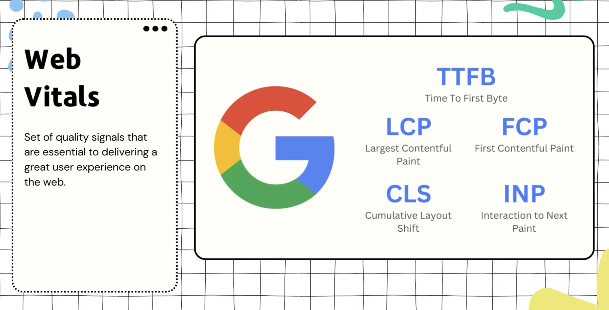
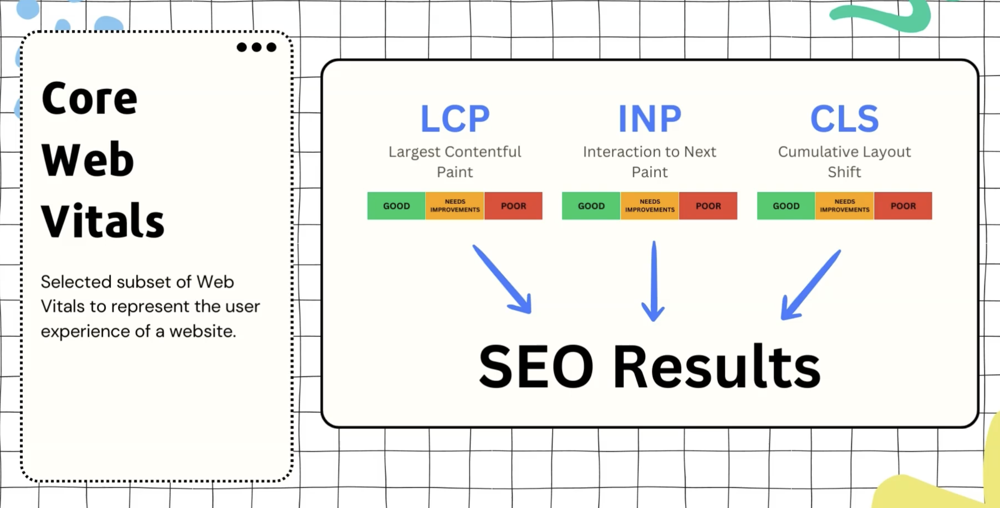
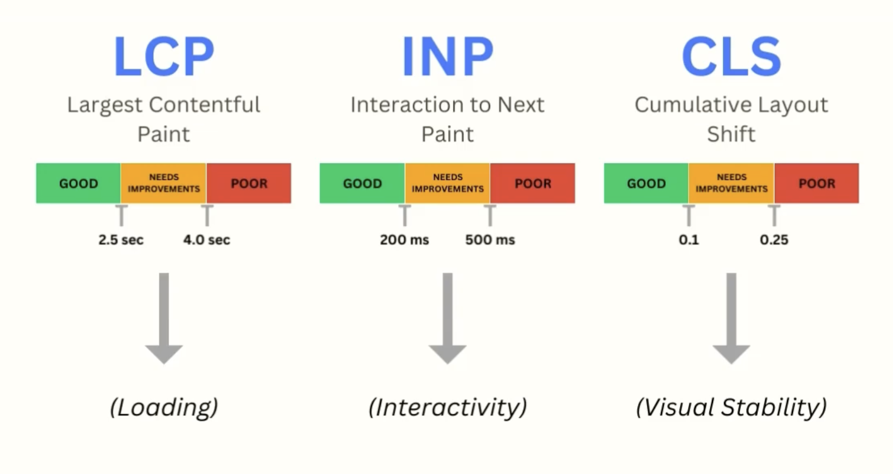
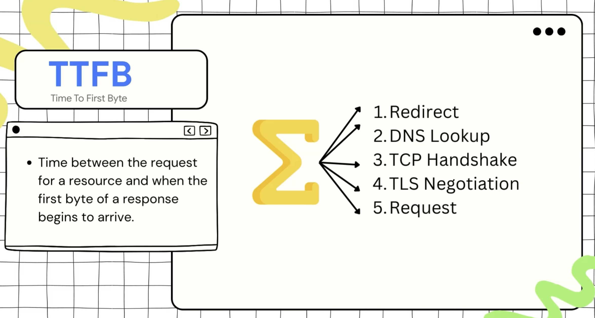

# Web Vitals and Performance Score

- [Web Vitals and Performance Score](#web-vitals-and-performance-score)
  - [Web Vitals](#web-vitals)
  - [Core Web Vitals](#core-web-vitals)
    - [Largest Contentful Paint (LCP)](#largest-contentful-paint-lcp)
    - [Interaction to Next Paint (INP)](#interaction-to-next-paint-inp)
    - [Cumulative Layout Shift (CLS)](#cumulative-layout-shift-cls)
      - [How to improve CLS](#how-to-improve-cls)
  - [Other Important Metrics](#other-important-metrics)
    - [First Contentful Paint (FCP)](#first-contentful-paint-fcp)
    - [Time to Interactive (TTI)](#time-to-interactive-tti)
    - [Total Blocking Time (TBT)](#total-blocking-time-tbt)
    - [Time to First Byte (TTFB)](#time-to-first-byte-ttfb)
    - [First Input Delay (FID) — Deprecated](#first-input-delay-fid--deprecated)

---

## Web Vitals

They are a set of metrics that Google (created 2020) uses to measure the performance of a website. They are used to **measure the user experience of a website (in a deterministic way) and to help developers understand how to improve the performance of their website**.

Each metric focusses on a specific aspect of the user experience, like (loading performance, interactivity, visual stability, etc.).

> Google usually changes/updates the web vitals metrics every year, so it's good to keep an eye on the updates and changes to the web vitals metrics to know how to improve the performance of your website.

---

## Core Web Vitals

They are a subset of the web vitals metrics that are considered the most important for measuring the user experience of a website and Search Engine Optimization (SEO).

> They are used by Google to rank websites in search results and to determine the performance score of a website.
>
> So, now Search Engines like Google don't just care about the content of the website, but also care about the performance of the website and how it affects the user experience.

Google choose these 3 metrics as the core web vitals because they are the most important metrics that affect the user experience of a website as they focus on 3 main aspects of the user experience: **(loading performance, interactivity, visual stability)**, and also gave them specific thresholds to help developers understand how to improve the performance of their website and to provide a good user experience.

---

### Largest Contentful Paint (LCP)

- Measures **loading performance**. To provide a good user experience, LCP should occur within **2.5 seconds** of when the page first starts loading.
- It depends on 2 metrics:
  - [Time to First Byte (TTFB)](#time-to-first-byte-ttfb)
  - **First Contentful Paint (FCP)** and **Time to Interactive (TTI)**

---

### Interaction to Next Paint (INP)

- Measures **interactivity**. To provide a good user experience, pages should have an INP of less than **200 milliseconds**.
- It was introduced in 2023 to replace the **"First Input Delay (FID)"** metric because it provides a more accurate measurement of interactivity by measuring the time from when the user interacts with the page until the next paint after the interaction, rather than just measuring the time from when the user interacts with the page until the browser is able to respond to that interaction (which is what FID measures).
- It depends on 2 metrics: **Time to Interactive (TTI)** and **Total Blocking Time (TBT)**

---

### Cumulative Layout Shift (CLS)

- Measures **visual stability**. To provide a good user experience, pages should maintain a CLS of less than **0.1**.
- It is a measure of how much movement there is on the page, typically in the first few seconds as the page is loading.
- The CLS metric measures two things: how many items move, and how significant the shift is. A small icon moving by a few pixels won't be judged as harshly as a big element popping into view and pushing all of the content down.
- There are two reasons that it's important to optimize for CLS:
  - **Layout shifts** are unpleasant! They're jarring and chaotic, and they can cause you to accidentally click on the wrong thing.
  - Starting in 2021, Google has incorporated CLS into its search ranking algorithm, meaning that focusing on CLS can help improve SEO.

#### How to improve CLS

- [Scroll Optimization in CSS file](../HTML-CSS/2-CSS.md#scroll-optimization)
- **Fixed image sizes**
  - Unless you give images a `width` and `height`, the browser won't know their dimensions until the image finishes loading. As a result, images will default to being `0px` wide and `0px` tall, and a big layout shift will occur when the image loads!
  - To prevent this, we need to specify two of the following CSS properties: `width`, `height`, `aspect-ratio`
    - It does mean that you'll need to know the image's intrinsic dimensions before the image loads. This can be tricky if the image is dynamic, but you can solve this by storing the image dimensions in your data model (eg. if blog posts have images, **be sure to store the width and height in the DB, not just the `src`!**).
  - If all else fails, you can always prescribe a fixed size, and use `object-fit: cover` to ensure it doesn't get squashed!
- **Grouped loading**
  - If you're loading in a bunch of content at once, try to group it together so that the layout shift is contained to a single area.
  - For example, if you're loading in a bunch of images, try to load them all in a single container, rather than sprinkling them throughout the page.
  - This is a tradeoff; we reduce the number of layout shifts, but it also means that the user won't get to see any images until they've all loaded; on a slow connection, this can make a big difference!
  - In the future, tools like **React Suspense** will help with this problem. For now, you'll need to come up with the right tradeoff for your particular use case.

---

## Other Important Metrics

These metrics are not part of the Core Web Vitals, but they are still important for understanding and diagnosing performance issues. Several of them are dependencies of the core metrics (e.g. FCP and TTI feed into LCP, TBT feeds into INP).

---

### First Contentful Paint (FCP)

- Measures the time from when the page starts loading to when **any part of the page's content is rendered on screen** (text, image, SVG, non-white `<canvas>`, etc.).
- It answers the question: **"Has the page started showing anything useful?"**
- FCP is a dependency of **LCP** — LCP can never be faster than FCP because the largest element can only paint after the first content has already painted.
- To provide a good user experience, FCP should occur within **1.8 seconds**.
- How to improve it:
  - Reduce server response time (improve TTFB)
  - Eliminate render-blocking resources (defer non-critical CSS/JS)
  - Minimize critical request depth and size
  - Use SSR or prerendering for initial content
  - Use font `display: swap` or `display: optional` to avoid invisible text during font loading

---

### Time to Interactive (TTI)

- Measures the time from when the page starts loading until it is **fully interactive** — meaning the page has displayed useful content (FCP has fired), event handlers are registered for most visible elements, and the page responds to user interactions within **50 milliseconds**.
- It answers the question: **"When can the user actually start using the page?"**
- TTI is a dependency of both **LCP** and **INP**.
- To provide a good user experience, TTI should be under **3.8 seconds**.
- The difference between FCP and TTI:
  - **FCP** = something is on screen (but might not be interactive yet)
  - **TTI** = the page is reliably responsive to user input
- How to improve it:
  - Minimize main-thread work (reduce JS execution time)
  - Reduce JavaScript payload size (code splitting, tree shaking)
  - Defer or lazy-load non-critical third-party scripts
  - Reduce the number of long tasks (tasks > 50ms that block the main thread)

> **Note:** TTI was removed from Lighthouse 10 as a direct scoring metric, but it remains a useful diagnostic metric for understanding when the page becomes usable.

---

### Total Blocking Time (TBT)

- Measures **responsiveness** by calculating the total amount of time between **FCP** and **TTI** where the main thread was blocked long enough to prevent input responsiveness.
- A task is considered "blocking" if it runs for more than **50ms** on the main thread. TBT sums up the blocking portion (time beyond 50ms) of all long tasks in that window.
  - Example: if a task takes 70ms, it contributes 20ms to TBT (70ms - 50ms threshold = 20ms blocking time).
- It answers the question: **"How much time was the user unable to interact with the page while it was loading?"**
- TBT is a dependency of **INP** — if TBT is high, INP will likely be poor because the main thread is frequently blocked.
- To provide a good user experience, pages should have a TBT of less than **300 milliseconds**.
- How to improve it:
  - Break up long tasks into smaller async chunks (use `requestIdleCallback`, `setTimeout`, or `scheduler.yield()`)
  - Reduce third-party script impact
  - Use web workers for heavy computation
  - Optimize JavaScript execution (avoid unnecessary re-renders, memoize expensive calculations)

---

### Time to First Byte (TTFB)

Measures the time from the start of the initial navigation until the **browser receives the first byte** of the response from the server.

> TTFB is a foundation metric — it affects **every other metric** because nothing can render until the browser starts receiving the HTML.

- It answers the question: **"How fast is the server responding?"**
- To provide a good user experience, TTFB should be under **800 milliseconds**.
- TTFB includes:
  - DNS lookup time
  - TCP connection time
  - TLS negotiation time (for HTTPS)
  - Server processing time
  - Network latency for the first byte to travel back

- **Reasons for a slow TTFB:**
  - Slow server response time (inefficient backend code, slow database queries, Heavy server user-load)
  - Network latency (especially for users far from the server location like located in a different continent/region)
  - Lack of caching (server has to generate the response from scratch every time)
  - Multiple page redirects (each redirect adds additional round-trip time)
    - one example is redirecting from `http://...` to `https://...` — or after renaming of a website like from `twitter.com` to `x.com` — if the old URL is still redirecting to the new URL, it can add significant time to TTFB for users who are still using the old URL.
- **How to improve it:**
  - Use a CDN to serve content closer to users
  - Optimize server-side code and database queries
  - Use HTTP/2 or HTTP/3
  - Implement server-side caching (Redis, Varnish, etc.)
  - Use `103 Early Hints` to let the browser preload resources while the server is still processing

---

### First Input Delay (FID) — Deprecated

- **Deprecated in 2024**, replaced by **INP** as a Core Web Vital.
- Measured the time from when the user **first interacts** with the page (click, tap, key press) to the time the browser is actually able to **begin processing** that event handler.
- The key difference between FID and INP:
  - **FID** only measured the **first** interaction — if the first click was fast but later interactions were slow, FID wouldn't catch it.
  - **INP** measures **all** interactions throughout the page lifecycle and reports the worst (or near-worst) one, giving a much more complete picture of responsiveness.
- FID had a "good" threshold of under **100 milliseconds**.

> FID is documented here because it's still referenced in older articles, Lighthouse reports, and the INP section above. For new projects, focus on **INP** instead.
