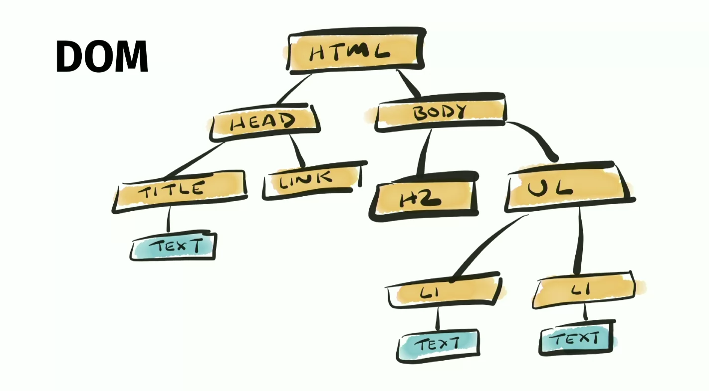
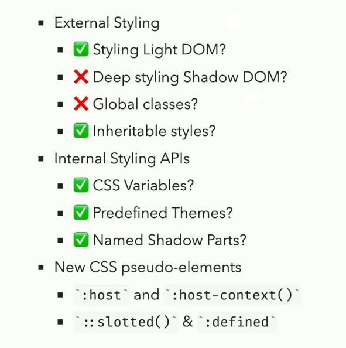

# INDEX

- [INDEX](#index)
  - [Web Dev Fundamentals](#web-dev-fundamentals)
    - [How web development works (High level overview)](#how-web-development-works-high-level-overview)
    - [Static vs Dynamic websites](#static-vs-dynamic-websites)
    - [What happens when we access a web server?](#what-happens-when-we-access-a-web-server)
    - [Building Good Websites](#building-good-websites)
  - [Web Browsers](#web-browsers)
    - [Architecture of web browser](#architecture-of-web-browser)
    - [Roles of Rendering Engine](#roles-of-rendering-engine)
    - [How web pages are built in the browser](#how-web-pages-are-built-in-the-browser)
  - [Web Components](#web-components)
    - [Web Components Core Technologies](#web-components-core-technologies)
    - [Using Web Components](#using-web-components)
      - [Creating custom elements](#creating-custom-elements)
      - [Reusing custom elements (web components) from the web](#reusing-custom-elements-web-components-from-the-web)
    - [Using web components in frameworks](#using-web-components-in-frameworks)
  - [Gulp.js](#gulpjs)
    - [Gulp vs Webpack](#gulp-vs-webpack)
  - [Pug.js](#pugjs)
  - [SEO](#seo)

---

## Web Dev Fundamentals

**Frontend:** The part of the website that users interact with. Everything that you see when you’re navigating around the Internet, from fonts and colors to dropdown menus and sliders. (Browser side)

### How web development works (High level overview)

1. User types a URL in the browser to access a website
2. The browser sends an HTTP `GET` request to the server to get the `HTML` file
3. The server receives the request and prepare all the files needed to render the page (like `HTML`, `CSS`, `JS`, `images`, etc.)
4. The server sends the files to the browser (the `HTML` file is sent firs, then the other files are sent)

   - `HTML`, `CSS`, and `JS` files are sent, because these're the files that the browser needs to render the page
     

5. The browser starts **rendering** the page

   - The `HTML` and `CSS` files are parsed to create the `DOM` and `CSSOM` trees, respectively. These trees are combined to form the `Render Tree`, which is used to calculate and paint the layout. After painting, the browser combines all layers into one and displays it.

---

### Static vs Dynamic websites

- **Static websites** are websites that are served to the browser as they are. They are usually created using `HTML`, `CSS`, and `JS` files and are stored on the server as they are.
  

  - Here, the files are sent to the browser without any processing

- **Dynamic websites** are websites that are dynamically generated on the server. They usually use a database to store the data and the files are generated on the server before sending them to the browser.
  
  - Here, the server processes the files before sending them

---

### What happens when we access a web server?

This is what happens when we access a webpage or accessing a wep API:


1. **URL Access**: User types a URL (e.g., `https://www.google.com/maps`).

   - **DNS Lookup**: Converts domain to server address via ISP (e.g., `https://216.58.211.206:443`).
   - **Port**: Identifies specific service on the server.

2. **TCP/IP Connection**: Established between browser and server.

   - **TCP**: Breaks data into packets for transmission and reassembles them at the destination.
   - **IP**: Routes packets to ensure they reach the destination.

3. **HTTP Request**: Sent by the browser to the server.

   - **HTTP**: Protocol for client-server communication via requests and responses.
   - The request includes the method (e.g., `GET`, `POST`), path, headers and body (only for `POST` requests).

4. **HTTP Response**: Server sends data back to the browser.

   - It includes the status code (e.g., `200 OK`, `404 Not Found`), headers and body.

5. **Request/Response Cycle**: Multiple requests for assets (e.g., `js`, `css`, `img`) are made.
   - Browser makes new HTTP requests for each asset/file
   - Limited simultaneous requests to avoid slowing down the connection.
   - Files are rendered once all assets are received.

---

### Building Good Websites

These're 3 pillars of building good websites:


---

## Web Browsers

> Reference: [How browsers work](https://web.dev/howbrowserswork/)

Web browser is a software application that enables a user to access and display web pages or other online content through its graphical user interface.

### Architecture of web browser


- **User Interface**: This component allows end-users to interact with all visual elements available on the web page. The visual elements include the `address bar`, `home button`, `next button`, and all other elements that fetch and display the web page requested by the end-user.
- **Browser Engine**: It is a core component of every web browser. The browser engine functions as an intermediary or a bridge between the user interface and the rendering engine. It queries and handles the rendering engine as per the inputs received from the user interface.
- **Rendering Engine**: It's responsible for rendering a specific web page requested by the user on their screen. It interprets `HTML` and `XML` documents along with `images` that are styled or formatted using `CSS`, and a final layout is generated, which is displayed on the user interface.
- **Networking**: This component is responsible for managing network calls using standard protocols like `HTTP` or `FTP`. It also looks after security issues associated with internet communication.
- **JavaScript Interpreter**: It's responsible for parsing and executing the JavaScript code embedded in a website.
  - Once the interpreted results are generated, they are forwarded to the rendering engine for displaying on the user interface.
- **UI Backend**: This component uses the user interface methods of the underlying operating system. It is mainly used for drawing basic widgets (windows and combo boxes).
- **Data Storage/Persistence**: It is a persistent layer. A web browser needs to store various types of data locally, for example, `cookies`. As a result, browsers must be compatible with data storage mechanisms such as `WebSQL`, `IndexedDB`, `FileSystem`, etc.

---

### Roles of Rendering Engine


Once a user requests a particular document, the rendering engine starts fetching the content of the requested document. This is done via the networking layer. The rendering engine starts receiving the content of that specific document in chunks of `8 KBs` from the networking layer. After this, the basic flow of the rendering engine begins.

The four basic steps include:

1. The requested HTML page is parsed in chunks, including the external CSS files and in style elements, by the rendering engine. The HTML elements are then converted into DOM nodes to form a “content tree” or “**DOM tree**”
2. Simultaneously, the browser also creates a **render tree**. This tree includes both the styling information as well as the visual instructions that define the order in which the elements will be displayed. The render tree ensures that the content is displayed in the desired order.
3. Further, the render tree goes through the **layout process**. When a render tree is created, the position or size values are not assigned. The entire process of calculating values for evaluating the desired position is called a **layout process**.
   - In this process, every node is assigned the exact coordinates. This ensures that every node appears at an accurate position on the screen.
4. The final step is to **paint** the screen, wherein the render tree is traversed, and the renderer’s `paint()` method is invoked, which paints each node on the screen using the UI backend layer.

> **NOTE**: every browser has its own unique rendering engine. So naturally, every browser has its own way of interpreting web pages on a user’s screen. Here’s where a challenge arises for web developers regarding the cross-browser compatibility of their website.

---

### How web pages are built in the browser


1. The browser sends a `GET` request to the server to get the `HTML` file
   
2. The received `HTML` file is a `text` file that contains the structure of the web page, and the other files are linked to it (like `CSS`, `JS`, `images`, etc.)
   
3. The `HTML` file is parsed by the browser to create the `DOM` tree, which is a **representation of the structure of the web page in a tree-like structure**
   

4. The `CSS` file is parsed by the browser to create the `CSSOM` tree, which is a **representation of the styles of the web page in a tree-like structure**
   
   

5. The `DOM` tree and the `CSSOM` tree are combined to create the `Render Tree`, which is a **representation of the structure of the web page with the styles applied to it**
   

   - it's what is actually shown on the page (`structure` + `rules` on how they should look like)
   - it has a one-to-one mapping with the visible objects on the page
   - Style calculations are done to:
     - figure out the styles that should be applied to each element
     - when there're multiple `rules` that need to be applied to the same element, we need to figure that all out here (the most specific rule is applied)
   - The more complicated your `CSS` selectors are, the more work the browser has to do to figure out what styles to apply to each element, which takes more time (BAD for performance) -> use simple selectors as much as possible or `BEM` methodology

     ```css
     /* BAD ❌ */
     .sidebar > .menu-item:nth-child(4n + 1) {
       color: red;
     }

     /* GOOD ✅ */
     .menu-item {
       color: red;
     }
     ```

6. **Layout (Reflow):** The `Render Tree` is used to calculate the layout of each visible object on the page (where it should be and how big it should be)

   - It's the process of calculating the exact position and size of each element on the page
   - Reflow happens whenever:
     - the geometry of the page changes (like when the window is resized)
     - the geometry of an element changes (like when the size/styles of an element changes or when an element is added/removed from the page)
       - changing the `font`, `content`, `orientation`, `size`, `position`, ... of an element
   - A reflow of an element causes a reflow of all the elements that are affected by it (like its children, siblings, and ancestors)
   - It's a **blocking operation**, which means that the browser can't do anything else while it's happening
   - It consumes a lot of resources (CPU, memory, etc.)
   - It will definitely be noticeable by the user if it happens frequently

   > **It's the most expensive part of the rendering process and one of the main causes of slow DOM scripts specially on devices with low processing power (like mobile devices)**
   >
   > Generally, a `reflow` is followed by a `repaint` (which is also expensive)

7. **Paint:** The layout is used to paint each element on the page

   - After knowing how things should look like and where they should be, Then the browser draws the pixels for each element on the screen
   - Anytime you change something other than the `opacity`, `transform`, or `filter` properties, the browser will have to trigger a **repaint**
   - Triggering a `layout / reflow` will always trigger a `repaint`, but triggering a `repaint` will not always trigger a `layout / reflow`
     
   - When debugging performance, to see if a `repaint` is happening, you can use the `paint flashing` feature in the `DevTools` (it will show you what's being repainted by flashing it).
     
     

8. **Composite:** After painting multiple layers, the browser **combines** them into a single layer and displays it on the screen

9. Now initial render is done and page is displayed to the user 🎉

   - Are we finally done 😮‍💨? No, we're not done yet 🥲

10. **JavaScript:** The `JS` files are parsed and executed to add interactivity to the page

    - It can change all the previous steps (the `DOM` tree, `CSSOM` tree, and `Render Tree`), which means that we might have to redo all the previous steps again after the `JS` is executed 🥲
      
    - This is called **reflow** or **repaint** and it's very expensive
      
    - Does all the steps need to happen again every time a `JS` file is executed? **No**, not all the steps, only the steps that are affected by the `JS` file
      - By focusing on only changing the things that need to be changed, we can avoid redoing all the previous steps, which is good for performance 🚀
      - Read more about it in [What to animate? (Animation Performance)](../HTML-CSS/2-CSS.md#what-to-animate-animation-performance)

    > **"Layout Trashing"** is the term used to describe the situation when the browser has to redo the layout process multiple times in a very short period of time due to javascript changes
    > 
    >
    > 

---

## Web Components

It's a set of web platform APIs that allow you to create new **custom**, **reusable**, **encapsulated** `HTML` tags to use in web pages and web apps.

> More [here](https://htmlwithsuperpowers.netlify.app/)

- It enables us to reuse code without fear of code collisions and conflicts with other code on the page
- This is the main idea behind `React`, `Vue`, `Angular`, etc. frameworks. They are all based on the idea of creating **reusable** `HTML` components
- It's so popular, you may think that you're not using it, but you're using it in every framework you use

  - It's too low level, so it's not used directly and is used through frameworks

- Why?
  - Easy as `HTML`
  - Great reusability
  - No build tools
  - Encapsulated
  - it's native in the browser / web

### Web Components Core Technologies

- It consists of these main technologies:
  

- **Custom Elements**:

  - A set of JavaScript APIs that allow you to define custom elements and their behavior, which can then be used as desired in your user interface.
    
  - it must contain a hyphen `-` in its name, otherwise it will not be recognized as a custom element and will be rendered as a normal `HTML` element
  - This is done by creating a `class` that extends the `HTMLElement` class with the desired behavior and then registering the new element using the `customElements.define()` method
  - Each custom element has also `life cycle hooks` that can be used to add some functionality to the element
    - create, insert, remove, attribute change, etc.

- **Shadow DOM**:

  - Shadow DOM serves for **encapsulation**. It allows a component to have its very own “shadow” DOM tree, that can’t be accidentally accessed from the main document, may have local style rules, and more.
  - It's rendered separately from the main document DOM — and controlling associated functionality.
    
    - `Light DOM` -> html code that we write
    - `Shadow DOM` -> html code that the component writes
  - In this way, you can keep an element's features private, so they can be scripted and styled without the fear of collision with other parts of the document. **(Isolate DOM fragments (`HTML` / `CSS`)from the main document DOM tree)**
  - This is done by creating a `shadowRoot` using the `attachShadow()` method and then adding the desired elements to it

- **HTML Templates**:
  - The `<template>` and `<slot>` elements enable you to write markup templates that are not displayed in the rendered page. These can then be reused multiple times as the basis of a custom element's structure.
    
  - This is done by creating a `<template>` element and adding the desired elements to it
- **Scoped Styles**:
  - scope styles to a block of `HTML`
- **ES Modules**:

  - The ability to use `import` and `export` statements to share functionality between scripts -> (`HTML` imports)
    

---

### Using Web Components

#### Creating custom elements

- Example of creating a custom element: `<my-element>`

  ```js
  class MyElement extends HTMLElement {
    constructor() {
      super();
      // Create a shadow root
      const shadow = this.attachShadow({ mode: 'open' });

      // Create elements
      const wrapper = document.createElement('div');
      wrapper.setAttribute('class', 'wrapper');

      const icon = document.createElement('span');
      icon.setAttribute('class', 'icon');
      icon.setAttribute('tabindex', 0);

      const info = document.createElement('span');
      info.setAttribute('class', 'info');

      // Take attribute content and put it inside the info span
      const text = this.getAttribute('text');
      info.textContent = text;

      // Insert icon
      let imgUrl;
      if (this.hasAttribute('img')) {
        imgUrl = this.getAttribute('img');
      } else {
        imgUrl = 'img/default.png';
      }

      const img = document.createElement('img');
      img.src = imgUrl;
      icon.appendChild(img);

      // Create some CSS to apply to the shadow dom
      const style = document.createElement('style');

      style.textContent = `
        .wrapper {
          position: relative;
        }
        .info {
          font-size: 0.8rem;
          width: 200px;
          display: inline-block;
          border: 1px solid black;
          padding: 10px;
          background: white;
          border-radius: 10px;
          opacity: 0;
          transition: 0.6s all;
          position: absolute;
          bottom: 20px;
          left: 10px;
          z-index: 3;
        }
        img {
          width: 1.2rem;
        }
        .icon:hover + .info, .icon:focus + .info {
          opacity: 1;
        }
      `;

      // Attach the created elements to the shadow dom
      shadow.appendChild(style);
      shadow.appendChild(wrapper);
      wrapper.appendChild(icon);
      wrapper.appendChild(info);
    }
  }

  // Define the new element
  customElements.define('my-element', MyElement);
  // or window.customElements.define('my-element', MyElement);
  ```

  ```html
  <my-element img="img/1.png" text="Hello World!"></my-element>

  <!--  it will be rendered as: -->
  <div class="wrapper">
    <span class="icon" tabindex="0">
      
    </span>
    <span class="info">Hello World!</span>
  </div>
  ```

- Styling custom elements
  

  - Anything in the light DOM will be rendered as normal `HTML` elements, so you can style them as you would normally do
    

  - Anything in the shadow DOM will be rendered as part of the custom element, So we can't style them directly **(because they are not part of the main DOM tree and we didn't directly write them)**
    

    ```html
    <my-element>
      <button>Click me!</button>
    </my-element>
    ```

    ```css
    /* Won't work ❌ */
    my-element button {
      color: red;
    }
    ```

    - The same for classes and ids inside the shadow DOM

  - The solution is:

    - to use `::slotted()` pseudo-element to style the light DOM elements inside the shadow DOM

      ```css
      /* Will work ✅ */
      ::slotted(button) {
        color: red;
      }
      ```

    - or style it inside the shadow DOM when creating the custom element

      ```js
      const style = document.createElement('style');

      style.textContent = `
        ::slotted(button) {
          color: red;
        }
      `;
      ```

---

#### Reusing custom elements (web components) from the web

- `two-up` is a custom element that displays two images side by side

  ```html
  <two-up>
    
    
  </two-up>

  <script type="module" src="https://unpkg.com/two-up-element"></script>
  ```

  

  - The worst case is that the script is not loaded, so the result will be just 2 images, which won't break the page

- `generic-components` is a collection of generic web components that can be used in any project

  

- Other examples of web components:

  - [Awesome Standalones](https://github.com/davatron5000/awesome-standalones)

---

### Using web components in frameworks

Some JS frameworks have the ability to use web components inside them by importing them.

- `React`:

  - [React Web Components](https://reactjs.org/docs/web-components.html)
  - [React Web Components with Hooks](https://www.youtube.com/watch?v=PCWaFLy3VUo)

- `Vue`:

  - [Vue Web Components](https://vuejs.org/v2/guide/components-custom-events.html#Customizing-Component-v-model)
  - [Vue Web Components with Slots](https://www.youtube.com/watch?v=PCWaFLy3VUo)
  - [Vue Web Components with Slots](https://www.youtube.com/watch?v=PCWaFLy3VUo)
  - [Vue Web Components with Slots](https://www.youtube.com/watch?v=PCWaFLy3VUo)

- `Svelte`:

  - [Svelte Web Components](https://svelte.dev/docs#Creating_a_component)
  - [Svelte Web Components with Slots](https://www.youtube.com/watch?v=PCWaFLy3VUo)
  - [Svelte Web Components with Slots](https://www.youtube.com/watch?v=PCWaFLy3VUo)
  - [Svelte Web Components with Slots](https://www.youtube.com/watch?v=PCWaFLy3VUo)

- `Lit`: ✅

  - It's a library for creating web components easily
  - It works well with other frameworks and with TypeScript (because it's written in TypeScript and uses `decorators`)
  - Resources:
    - [Lit](https://lit.dev/)
    - [Lit vs. React: A comparison guide](https://blog.logrocket.com/lit-vs-react-comparison-guide/)
  - Example:

    ```js
    import { LitElement, html, css } from 'lit';
    import { customElement, property, state } from 'lit/decorators.js';

    @customElement('my-element')
    export class MyElement extends LitElement {
      @property({ type: String }) name = 'World';
      @state() count = 0;

      static styles = css`
        p {
          color: green;
        }
      `;

      render() {
        return html`
          <p>Hello, ${this.name}!</p>
          <button @click=${this._onClick} part="button">
            Click Count: ${this.count}
          </button>
        `;
      }

      private _onClick() {
        this.count++;
      }
    }
    ```

    ```html
    <!-- Using it -->
    <my-element name="Lit"></my-element>
    ```

- [Shoelace](https://shoelace.style/)

---

## Gulp.js

A toolkit (**Task Runner**) to automate & enhance your workflow to automate slow, repetitive workflows and compose them into efficient build pipelines.

> It's like creating the **build** folder in frameworks

Example of repeated tasks:

- Sass -> css
- Pug.js-code -> HTML-code
- minify (css, js) files
- compress images for smaller size
- automatic writing of css-prefixes
- legacy code -> ES6 code

---

### Gulp vs Webpack

Webpack is a **bundler** whereas Gulp is a **task runner**

- Simply put, Webpack is such a powerful tool that it can already perform the vast majority of the tasks you’d otherwise do through a task runner. For instance, Webpack already provides options for minification and sourcemap for your bundle. In addition, Webpack can be run as middleware through a custom server called webpack-dev-server, which supports both live reloading and hot reloading


---

## Pug.js

It's a **template engine** designed to render HTML in server-side technologies such as Node.js. Like any JavaScript template engine, `Pug.js` supports writing **reusable** HTML code and rendering dynamic data.

> A template engine is a program which is responsible for compiling a template (that can be written using any one of a number of languages) into HTML. The template engine will normally receive data from an external source, which it will inject into the template it’s compiling.

- It's another way for writing HTML code with ability to write **HTML components**

---

## SEO

Search engine optimization is the practice of trying to help your site appear nearer the top of search engine results when people look for the topics that your website covers.

- At the heart of SEO is the idea of working out which terms people are likely to enter into a search engine to find your site and then using these terms in the right places on your site to increase the chances that search engines will show a link to your site in their results.
- SEO is often split into two areas:
  - **on-page techniques**
    - methods you can use on your web pages to improve their rating in search engines.
  - **off-page techniques**
    - Getting other sites to link to you
    - Search engines help determine how to rank your site by looking at the number of other sites that link to yours.

---
