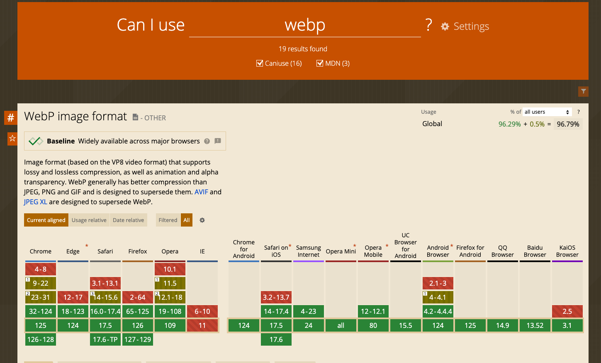
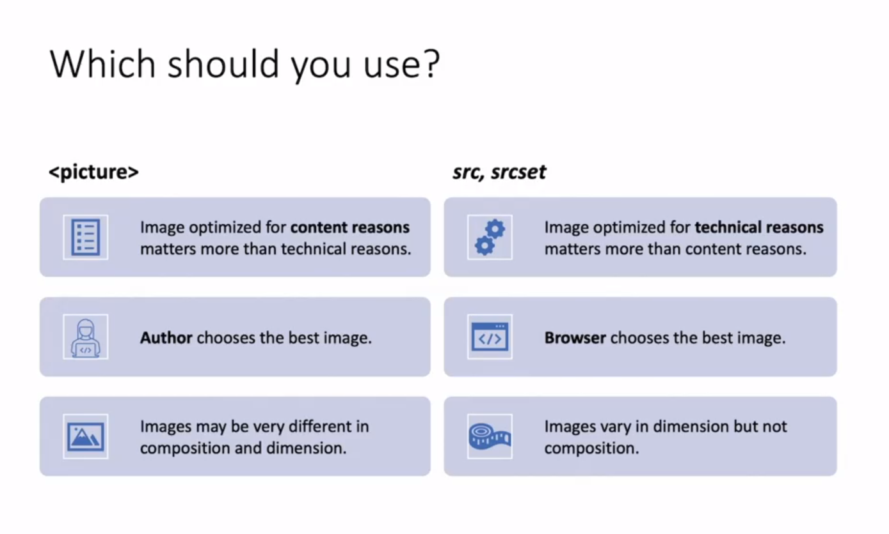

# INDEX

- [INDEX](#index)
  - [HTML](#html)
    - [HTML document structure](#html-document-structure)
    - [HTML Elements](#html-elements)
  - [Semantic HTML](#semantic-html)
    - [Why Semantic?](#why-semantic)
    - [Semantic tags](#semantic-tags)
  - [Forms](#forms)
    - [Form elements (form controls)](#form-elements-form-controls)
    - [Autofill Forms](#autofill-forms)
    - [Form validation](#form-validation)
    - [Input Masking](#input-masking)
    - [How is the Form data is transferred?](#how-is-the-form-data-is-transferred)
    - [Form submission](#form-submission)
  - [images](#images)
    - [Image Formats](#image-formats)
    - [fav-icon (favicon)](#fav-icon-favicon)
      - [Using manifest (Android and iOS)](#using-manifest-android-and-ios)
    - [background img in css](#background-img-in-css)
    - [image size optimization](#image-size-optimization)
    - [`<picture>` Element](#picture-element)
      - [`srcset` and `sizes` attributes](#srcset-and-sizes-attributes)
      - [Background images](#background-images)
      - [Which to use ?](#which-to-use-)
  - [Canvas](#canvas)
  - [Icons](#icons)
    - [How to use icons](#how-to-use-icons)
      - [Icon fonts](#icon-fonts)
      - [SVG icons](#svg-icons)
      - [PNG icons](#png-icons)
      - [CSS sprites](#css-sprites)
    - [icons and SVG resources](#icons-and-svg-resources)
  - [Video](#video)
  - [Tables](#tables)
    - [Table Structure](#table-structure)
    - [Spanning Columns and rows](#spanning-columns-and-rows)
    - [Table Notes](#table-notes)
  - [HTML Escape Characters \& Entities](#html-escape-characters--entities)
  - [DOM (document object model)](#dom-document-object-model)
    - [Metadata](#metadata)
  - [Notes \& Tricks](#notes--tricks)
    - [Notes](#notes)
    - [Tricks](#tricks)

---

## HTML

**HTML** stands for **HyperText Markup Language** and is used to create the structure of a web page. It is the standard markup language for describing the contents and layout of web pages.

> It's not a programming language, it's a **markup language**.

- **HyperText** is a form of text in which documents can refer(link) to other documents and resources
- **markup language** allows you to annotate text, and these annotations provide additional meaning to the contents of a document ("make this text a link, heading, etc...")
  - It converts a plain text to a **structured** text
    
    
- **void(empty) element** is html element with no contents and no closing tag

---

### HTML document structure


We should provide the browser with information about the structure of the document by using `doctype` and `html` tags to **make the browser understand the document structure**.

- Wrong structure ❌

  ```html
  <html>
    <head>
      <title>Document</title>
    </head>
    <body>
      <!-- Content goes here -->
    </body>
  </html>
  ```

  - Here, only the `head` and `body` tags are used, but the `doctype` tag is missing.

- Correct structure ✅

  ```html
  <!DOCTYPE html>
  <html lang="en">
    <head>
      <meta charset="UTF-8" />
      <meta http-equiv="X-UA-Compatible" content="IE=edge" />
      <meta name="viewport" content="width=device-width, initial-scale=1.0" />
      <title>Document</title>
    </head>
    <body>
      <!-- Content goes here -->
    </body>
  </html>
  ```

- **Key Properties**:

  - `<!DOCTYPE html>` -> tells the browser which version of `HTML` the page is using (usually `html 5`, but browsers usually display the page even if it is not included). without it the browser will go to `Quirks mode`

    > "Quirks mode" is a way of rendering web pages used by some browsers. It is typically used to support older web pages that were designed for older browsers. In quirks mode, the browser does not follow the W3C standards for HTML, CSS, or JavaScript. This can cause web pages to display incorrectly.

  - `<html>` -> It's the root element of an HTML page, and it's the container for all other HTML elements.

    - `lang` attribute -> specifies the language of the document

  - `<head>` -> It's a container for **metadata** (data about data) and information is for things that are not visible in the browser window or things that describe the document

  - `<body>` -> It's a container for things that are visible in the browser window

- **Notes:**

  - Always try to use the correct hierarchy of the tags, as it helps the browser to understand the structure of the document.
    - Ex:
      - `h1` should be inside `header` and not inside `section`
      - `h3` should be used only after `h2` and so on...
        
  - What happens if you wrote the content immediately without the `head` or `body` tags?

    - The browser will **still display the content** by adding the missing tags automatically. but it won't work as expected, because the `DOCTYPE` and `html` tags are missing.

---

### HTML Elements

**Element** is a part of a webpage that has a specific purpose or function. Elements can be nested inside other elements.


- **Body element** is for things that are visible in the browser window
- **Attribute** is a piece of data used to describe elements
- **href** : HyperText Reference
- **HTML Entity** is symbols that start with `&` ex: _copyright_[&copy;], _non-breaking space_[&nbsp;]

  - find more here: [html entities](https://www.w3schools.com/html/html_entities.asp)

- Some inline elements to be aware of

  > inline elements in HTML aren't effected by [width/height] properties
  >
  > - Inline elements: **Flow in between surrounding text**

  - `<mark>`
  - `<br>`
  - `<a>`
  - `<button>`
  - ``
  - `<i>` -> old way to make text italic
  - `<span>` -> a generic inline element with no special meaning bug can be used to style a part of the text
  - `<input>`
  - `<sup>` -> superscript
    
  - `<sub>` -> subscript
    

  > `<li>` is a **block element**, so if you want them to be next to each other, you could make them inline
  >
  > - Block-level elements: **start on a new line**

---

## Semantic HTML

A semantic element clearly describes its meaning to both the browser and the developer.

> **Semantic elements = HTML-code (elements) with meaning**


- Examples of non-semantic elements: `<div>` and `<span>`
  - they tell us nothing about their content.
  - Avoid `<span>` and `<div>` elements as much as possible
- Examples of semantic elements: `<form>, <table>`, and `<article>`
  - They behave the same way as non-semantic elements e.g. `<div>`, but they have a **meaning**.

> We shouldn’t use `<h1>` just because of its large text size. The same goes for other HTML elements. HTML should be coded to represent the data that will be populated with and not based on its default style.

---

### Why Semantic?

Why do we need to tell the browser what our HTML elements represent?

- **SEO**

  - For example, keywords enclosed in an `<h1>` tag are given more importance than those enclosed in an `<p>`. By putting your most important keywords higher up in the hierarchy, you’re effectively telling search engines what your page is about and why people searching for those keywords would be interested in your content, hence improving the Search Engine Optimization of your page.
  - That's why you should **use only one** `<h1>` in the html page

- **Accessibility**

  - Because semantic HTML uses elements for their given purpose, it’s easier for both people and machines to read and understand it. Making applications accessible not only ensures equal access for people with disabilities but also benefits people without disabilities by allowing them to customize their experiences. Creating a clear hierarchy for the page allows other tools and devices to properly serve up your content.
    - **EX:** What if instead of using a semantically correct tag for a paragraph like `<p>` we use a `<div>` instead? The reading machine will never understand that it must make a pause before and after the paragraph reading. Therefore, the user experience for that visually impaired person will be deficient.

- **Easy Maintenance**

  - makes it easier to maintain the code and have a well-organized code.

- **Separation markup from style**

  - It's now recommended to use CSS to style your HTML elements instead of using HTML attributes or tags. This is because CSS is easier to maintain and reuse across multiple pages. Semantic HTML makes it easier to style elements with CSS.
  - **EX:**

    - use `<strong>` instead of `<b>` as `<strong>` is semantic and `<b>` is not
      - each one of these 2 tags have different semantic meaning, for example, `<b>` is used to make the text bold, while `<strong>` is used to make the text bold and important.
    - use `<em>` instead of `<i>` as `<em>` is semantic and `<i>` is not. (`em` short for "emphasis", and `i` short for "italic")

---

### Semantic tags

**HTML5** brought with it a new set of semantic tags some of them especially thought to avoid unnecessary use of `<div>` and `<span>`


- `<section>`
  - usually starts with heading element `h2`
  - very useful to split our main content into smaller groups of content.
  - can be nested
- `<section>` and `<article>` are workmates, not relatives.
  - These elements were not conceived to be part of a hierarchy (parent & child elements), in fact, they are made for working together.
  - you can use them one inside another without any problem.
  - You might think that `<article>` is for news articles and `<section>` is for the rest of the content, but that's not the case. `<article>` is for content that can be **independently distributed** or **reused** (like a blog post, a forum post, a comment, a card, etc.), while `<section>` is for grouping content that is **related** to each other.
  - usually they're used in a **cards/skills section**
- `<nav>`
  - It's a container for navigation links, and usually contains **unordered list** element `ul` with `li` elements.
- `<main>`
  - There can be **only one**, one document, one `<main>` element. This semantic element is especially useful for search engine optimization.
  - When web bots get to your page, the `<main>` element will be yelling READ ME! So don't overlook it.
- `<aside>`
  - content related but not a part of the main content (like a sidebar)
  - Use it when you need to label extra content, for example, `newsfeeds`, `commercial offers`, `newsletter form`, etc.
- `<footer>` -> `Credits`, `copyrights`, `sitemaps`, `secondary navbars`, etc.
  - All these types of elements can be grouped inside a `<footer>` tag.
- `<strong>` -> **bold** text (instead of `<b>`)
- `<figure>`

  - useful when it comes to group together an image and its caption.
    
  - its sidekick `<figcaption>` element, which is placed as first or last child of figure element and contains the caption text.

    ```html
    <figure>
      
      <figcaption>Slogan</figcaption>
    </figure>
    ```

  - It can also be used to group a blockquote and its author (this is important for SEO and accessibility, because `<blockquote>` element only takes the quote itself and we want to link the author to the quote)

    ```html
    <figure>
      <blockquote>
        <p>Quote</p>
      </blockquote>
      <figcaption>Author</figcaption>
    </figure>
    ```

- `<iframe>`

  - It is like a little window that has been cut into your page — and in that window you can see **another page**. The term iframe is an abbreviation of **inline frame**.

  - ex: to embed a Google Map into a page.

- `<blockquote>` and `<q>` --> these two elements commonly used for marking up **quotations**

  - Don’t put quotes to `<q>` element, as Quotes are provided by the browser.

- `<address>` element only for contact information

  - or email address, social network account, street address, telephone number, or something you can get in touch with.

  ```html
  <address>
    Contact:
    <a href="https://twitter.com/hail2u_">Kyo Nagashima</a>
  </address>
  ```

- `<time>`

  - used to represent dates and times in a machine-readable format (good for SEO)
  - It can be used to represent the date and time of a blog post, the time of a comment, the time of a scheduled event, etc.

  ```html
  <time datetime="2021-09-01">September 1, 2021</time>
  ```

- `<details>` and `<summary>`
  

  ```html
  <details>
    <summary>Click me</summary>
    <p>Here is some text that is hidden by default.</p>
  </details>
  ```

  - `<details>` element is used to create a disclosure widget in which information is visible only when the widget is toggled into an "open" state.
  - `<summary>` element is used to specify a summary, caption, or legend for the `<details>` element's disclosure box.

  > **💡 We can use them to create an accordion menu, a dropdown menu, or a collapsible list instead of using JavaScript.**

- `role` attribute can be used to also specify the role of the element in the page (specially for **screen readers**)
  - `<header role="banner">`

---

## Forms

`<form>` element is used to:

- group related (form controls) together
- collect user input and send data. The data is most often sent to a server for processing.

  ```html
  <form action="/signup" method="get">
    <!-- Form controls go in here -->
  </form>
  ```

  - this is done by using `action` attribute, which specifies the URL where the form data should be sent.
  - the `method` attribute specifies the HTTP method used to send the data. (default is `GET`)

### Form elements (form controls)

- `<label>` makes the form control accessible to screen readers, and provides a bigger target, since you can tap or click the label to set focus on the control.

  ```html
  <label for="name">Name:</label>
  <input type="text" id="name" name="name" />
  ```

  - `for` attribute is used to link the label to the form control using the `id` attribute of the form control.
    - This is also useful for screen readers, as it helps them understand the relationship between the label and the form control.

- `<input>` element

  ```html
  <input type="text" id="name" name="name" value="John" placeholder="Enter your name" />
  ```

  - `type` attribute to specify the type of control to display.
    

    - Types Notes:

      - input elements with `checkbox` type should have a `label` element associated with them to let the user know what the checkbox is for.
      - In order to make user be able to select only one `radio` button, you should give them the same `name` attribute.

        ```html
        <label for="phone">Call Me</label>
        <input type="radio" name="contact" value="phone" id="phone" />

        <label for="email">Email Me</label>
        <input type="radio" name="contact" value="email" id="email" />
        ```

  - `name` attribute to identify the data the user enters with the control.
    - If you submit the form, this `name` is included in the request with the value.
  - `value` attribute to specify the value of the control (used with controls that have a value, such as `radio button` and `option` elements).
  - `placeholder` attribute to provide a hint to the user about what to enter in the control.

- `<textarea>` element is used to enter multiple lines of text

  ```html
  <textarea cols="30" rows="10"></textarea>
  ```

  - it takes attributes for columns `cols` and rows `rows` to specify the size of the control.

- `<select>` element gives users a list of options to select from

  ```html
  <select name="language">
    <option value="javascript">JavaScript</option>
    <option value="python">Python</option>
  </select>
  ```

  - The browser by default uses the first option in the list if user didn't select an option.
  - `<option>` element is used to define an option in a select list.
    - The content of the element is the value of the option.
    - The `value` attribute is used to specify the value of the option that is sent to the server when the form is submitted.
  - With the `selected` attribute you can pre-select one option.

    ```html
    <option value="javascript" selected>JavaScript</option>
    ```

- `<fieldset>` element is used to group form controls.

  ```html
  <fieldset>
    <legend>What is your favorite web technology</legend>

    <label for="html">HTML</label>
    <input type="radio" name="webfeature" value="html" id="html" />

    <label for="css">CSS</label>
    <input type="radio" name="webfeature" value="css" id="css" />
  </fieldset>
  ```

  - Every `<fieldset>` element requires a `<legend>` element, which is used to describe the group of form controls

- `<button>` element is used to **( submit or reset )** a form.

  ```html
  <!-- submit button -->
  <button type="submit">Submit</button>

  <!-- reset button (resets the form to its initial state) -->
  <button type="reset">Reset</button>

  <!-- button without default behavior -->
  <button type="button">Click me</button>
  ```

  - Every `<button>` element inside a form works as a Submit button by default. Sometimes you don't want this. To disable the default Submit behavior, you can add `type="button"` to the `<button>`. This tells the browser that the `<button>` should not submit the form.

  - You can also use an `<input>` element with type="submit" instead of a `<button>` element. The input looks and behaves just like a `<button>`. Instead of using a `<label>` element to describe the `<input>`, use the value attribute instead.

    ```html
    <input type="submit" value="Submit" />
    ```

---

### Autofill Forms

**Autofill** can help with re-entering data. You enter your address once. From now on, your browser will offer you the option to fill in the same address for other forms automatically.

- It works with the **Password Manager** in your browser. The Password Manager stores your passwords and other data, such as addresses, credit card numbers, and so on.
- Use sensible attribute values
  - Browsers can identify the data type by looking at the **attributes** of a form control.
  - Do you have a field where users should enter their email address? Use email as a value for the name, id, and type attribute. Three hints for the browser that this is an email field.
- It's done using the `autocomplete` attribute

  ```html
  <input type="text" name="name" id="name" autocomplete="name" />
  ```

---

### Form validation

> Why we validate form inputs before sending them to server?
>
> - Reduce the amount of work the server has to do
> - Enables users to see if there are problems with the form faster than if validation were performed on the server.

- The `required` attribute tells the browser that the field is mandatory. The browser also tests if the entered data matches the format of the `type`.
  - if the `type="email"` The email field shown in the example is only valid if it's not empty and if the entered data is a valid email address.
- `minlength` attribute is used to set minimum length of the input **text-value**
  - For **numerical input types** use `min` and `max` to achieve the same result.
- `Pattern` attribute

  - you can define a regular expression as the value.

    ```html
    <!-- Here, only lowercase letters are allowed, and the user has to enter at least two characters, and not more than twenty. -->
    <input required pattern="[a-z]{2,20}" type="text" id="animal" name="animal" />
    ```

- Style invalid form controls

  - You can use the `:invalid` pseudo-class to add styles to invalid form controls. In addition, there is also the `:valid` pseudo-class for styling valid form elements.

    ```css
    input:invalid {
      border: 2px solid red;
    }
    ```

  - > **Note:** In practice :invalid is tricky to work with. Invalid form fields are already marked as :`invalid` before user interaction, which may confuse users. The `:user-invalid` pseudo-class solves this issue, as the styles are only applied after user interaction. Learn more about `:user-invalid`.

- **Note:** You can find more [Constraint validation attributes](https://developer.mozilla.org/en-US/docs/Web/HTML/Constraint_validation) here

---

### Input Masking

**Input masking** is a way to format the input of a form field to make it easier for the user to understand. For example, you can format a phone number field to automatically add the country code and hyphens between the numbers.


- More here [input masking](https://css-tricks.com/input-masking)
- You can use libraries like:
  - [inputmask](https://www.npmjs.com/package/inputmask)
  - [react-input-mask](https://www.npmjs.com/package/react-input-mask)

---

### How is the Form data is transferred?

- Every `<form>` element requires an action attribute. Its value is the **URL** for the page on the server that will receive the information in the form when it is submitted.

  ```html
  <form action="http://www.example.com/subscribe.php" method="get"></form>
  ```

- When a form is submitted (for example, when the user clicks the Submit button), the browser makes a **request**. A script can respond to that request and process the data.
  - **script** (running on the server or the client) is needed to process the form. It may `validate the data`, `save it into a database`, or `do other operations` based on the form data.
- By default, form data is sent as a **GET** request, with the submitted data appended to the URL.
  - If the data is shareable, you can use the GET method. This way the data will be
    - added to your `browser history` as it is included in the URL.
    - `Search forms` often use this. This way you can bookmark a search result page.
- you can instruct the form to use a **POST** request by changing the method attribute.

  - By doing that, The data will not be visible in the URL and can only be accessed from a frontend or backend script.

    ```html
    <form method="post">
      <!-- code -->
    </form>
    ```

  - The data will be encrypted (if you use HTTPS) and only accessible by the backend script that processes the request. The data is not visible in the URL. A common example is a sign-in form.

---

### Form submission

- You can use services like:

  - [formspree.io](https://formspree.io/)

- you can use [netlify](https://docs.netlify.com/forms/setup/?_ga=2.17094910.693790722.1649686633-761975974.1648039605) to manage your forms without `Js` => by inserting `name` attribute to each `input` element and writing this at at the `form` element:

  ```html
  <form class="cta-form" name="sign-up" netlify></form>
  ```

---

## images

`img` element can have these attributes:

- `src` -> source of the image (Required)
- `alt` -> alternative text for the image (Required)
  - Don't forget to add the `alt` attribute, as it will be read by screen readers, instead, use `alt=""` to tell the screen reader to skip it.
- `width` and `height` -> to specify the size of the image
- `srcset` -> to specify multiple versions of the image based on the device's pixel density
  - `srcset="images/fm.jpg 1x, images/fm-2x.jpg 2x"` -> the browser will choose the first image for devices with a pixel density of 1x and the second image for devices with a pixel density of 2x.
- `loading` -> to specify when the image should be loaded
  - `loading="lazy"` -> the image will be loaded when it's about to be displayed on the screen (based on the user's scroll position)
  - `loading="eager"` -> the image will be loaded as soon as possible
- `sizes` -> to specify the size of the image based on the viewport width
  - `sizes="(max-width: 600px) 200px, 50vw"` -> the image will be 200px wide if the viewport is 600px or smaller, and 50% of the viewport width if it's larger than 600px.

### Image Formats

- **JPEG** -> Whenever you have many different colors
  colors
- **JPEG** -> Whenever you have images with few colors or large areas of the same color (flat colors),
  - ex: logos, illustrations and diagrams.
- **GIF or PNG** ->

---

### fav-icon (favicon)

It's a small icon that appears in the browser tab next to the page title. It's also used in bookmarks and in the history of the browser.

- Websites that generate favicon icons:

  - [favicon.io](https://favicon.io/)
  - [favicon-generator.org](https://www.favicon-generator.org/)

- use `fav-icon` for **Browsers** and make sure to resize it to **64px**
- Basic:

  ```html
  <link rel="icon" type="image/x-icon" href="/images/favicon.ico" />
  <!-- or -->
  <link rel="icon" type="image/png" href="/images/favicon.png" />
  ```

#### Using manifest (Android and iOS)

It's a JSON file that tells the browser how to display the website on a mobile device's home screen.

- Aor `apple` --> use resized favicon

  ```html
  <link rel="apple-touch-icon" href="img/favicon-192.png" />
  ```

  - the "apple-touch-icon" is used by iOS devices when you save a website to your home screen.

- For `android` :

  - create `manifest.webmanifest` file which contains this code :

    ```json
    // in webmanifest.json
    {
      "icons": [
        { "src": "img/favicon-192.png", "type": "image/png", "sizes": "192x192" },
        { "src": "img/favicon-512.png", "type": "image/png", "sizes": "512x512" }
      ]
    }
    ```

  - Then, add this to `html` `<head>`

    ```html
    <link rel="manifest" href="manifest.webmanifest" />
    ```

---

### background img in css

- when you use **background img** in css and want it to be `Accessible` in `HTML` to write `alt` for screen readers

  - `role` describes the role of an element in programs that can make use of it, such as screen readers or magnifiers.

  - `aria-label` attribute defines a string value that labels an interactive element.
  - in `HTML` :

    ```html
    <div class="cta-img-box" role="img" aria-label="Woman enjoying food"></div>
    ```

  - in `CSS` :

    ```css
    .cta-img-box {
      background-image: url('../img/eating.jpg');
      background-size: cover;
    }
    ```

---

### image size optimization

- Try to use images with **double the size** of the image on the website (for retina displays), because the browser will automatically scale the image down to the correct size.
  

- why we use the built-in HTML `width` and `height` ?

  - Images often take longer to load than the (HTML and css) code that makes up the rest of the page, therefore, a good idea to specify the size of the image (in html or css) so that the browser can render the rest of the text on the page while **leaving the right amount of space for the image that is still loading** which allows it to render the rest of the page without waiting for the image to download.

  ```html
  
  ```

- if you use the only `width` attribute, then the HTML will automatically calculate the `height` to maintain the original image ratio
- image size matter, as You should save the image at the same width and height it will appear on the website:
  - If the image is smaller than the width or height that you have specified, the image can be distorted and stretched.
  - If the image is larger than the width and height if you have specified, **the image will take longer to display on the page**.
- to reduce size of images => [squoosh](https://squoosh.app/)

  - use the `webp` format for images as it's smaller in size and better in quality
  - but check `compatibility` with browsers **or** use it with `fallback img` and let the browsers choose by itself.
    

    ```html
    <picture>
      <source srcset="images/fm.webp" type="image/webp" />
      
    </picture>
    ```

---

### `<picture>` Element

It's used to provide multiple versions of an image based on different conditions, such as the device's pixel density, viewport width, or image format.

- It contains one or more `<source>` elements, each referring to different image through the `srcset` attribute. This way the browser can choose the image that best fits the current view and/or device.

  - Each `<source>` element has a `media` attribute that defines when the image is the most suitable.

- It's used to Render images conditionally (show one and hide the other)
- **Notes:**

  - Always specify a fallback `` element as the **last child element** of the `<picture>` element.
  - The `` element is used by browsers that do not support the `<picture>` element, or if none of the `<source>` tags match.

- Example:

  ```html
  <picture>
    <!-- browser will choose which src it can display and displays it in the  element below -->
    <source media="(min-width: 650px)" srcset="img_food.jpg" />
    <source media="(min-width: 465px)" srcset="img_car.jpg" />

    <!-- fall-up (default) image (if the previous didn't render) -->
    
  </picture>
  ```

> Also see `<figure>` element [here](#semantic-tags)

---

#### `srcset` and `sizes` attributes

There're new attributes for `` element used to provide several additional source images along with hints to help the browser pick the right one:

- `srcset`
- `sizes`

> - the names and width of images in **Pixels**
> - **sizes** -> represents the hole on the web page

```html


<!-- same as : -->

```

---

#### Background images

for that we use media queries as we put each image in each media

---

#### Which to use ?



---

## Canvas

---

## Icons

### How to use icons

- In order to use icons in your project, you can use:
  - **Icon fonts** (like Font Awesome)
  - **SVG icons**
  - **PNG icons**
  - **CSS sprites**

#### Icon fonts

- **Icon fonts** are fonts that contain symbols and glyphs instead of letters or numbers.
- **Font Awesome** is a popular icon font that contains over 1500 icons.

  ```html
  <!-- Add the Font Awesome CSS file to your project -->
  <link
    rel="stylesheet"
    href="https://cdnjs.cloudflare.com/ajax/libs/font-awesome/5.15.4/css/all.min.css" />

  <!-- Use the <i> element to add an icon -->
  <i class="fas fa-camera"></i>
  ```

---

#### SVG icons

**SVG** icons are vector images that can be scaled to any size without losing quality.

- In order to use SVG icons in your project, you can:

  - **Download** the SVG file and add it to your project using the `<svg>` element

    ```html
    <svg
      xmlns="http://www.w3.org/2000/svg"
      width="16"
      height="16"
      fill="currentColor"
      class="bi bi-camera"
      viewBox="0 0 16 16">
      <path fill-rule="evenodd" d="M8 10a2 2 0 100-4 2 2 0 000 4z" />
      <path
        fill-rule="evenodd"
        d="M15 3h-3.586l-1-1H5.586l-1 1H1v1h1l1 1v7l-1 1H1v1h14v-1h-1l-1-1V5l1-1h1V3zm-3 9H4v-1h8v1z" />
    </svg>
    ```

  - or, **Use** an **icon library** like **Font Awesome** that provides SVG icons (this is the new way to use icons in modern web development)

    ```html
    <i class="fas fa-camera"></i>
    ```

  - or, Use [CSS Sprites](#css-sprites) to display the icon (this is the most common way to use icons in professional web development)

---

#### PNG icons

```html

```

---

#### CSS sprites

**CSS sprites** are a way to reduce the number of HTTP requests made for image resources referenced by your site.

- The old way of using icons was to have multiple images for each icon, which would result in multiple HTTP requests. This can slow down the loading time of your website.
  - Instead of using multiple images, you can use a single image that contains all the icons you need.
- They combine multiple images into a single image file and use CSS to display the desired image.
  

- **CSS sprites** are commonly used for icons.
- How to use CSS sprites:

  - **Step 1**: Create a single image that contains all the icons you need.
    - This can be done using a:
      - Build tool like **Gulp** or **Grunt** or **Webpack**
      - Icon library like [icomoon](https://icomoon.io/), [fontello](http://fontello.com/), or [fontastic](http://fontastic.me/)
  - **Step 2**: Use `<svg>` element with `<use>` element to display the desired icon.

    ```html
    <svg class="icon">
      <use xlink:href="assets/icons-sprites.svg#icon-name"></use>
    </svg>
    ```

    - This will display the icon with the `icon-name` from the `icons-sprites.svg` file.

- Notes:

  - This only works on web servers, not on local files.
  - We use the `sprite` file only in the `HTML` file, not in the `CSS` file (if you want to use it in the `CSS` file, you should use `background-image` property and manually define the position of the icon)

    ```css
    .icon {
      background: url('icons-sprites.svg') -16px -27px;
    }
    ```

---

### icons and SVG resources

- [Hero Icons](https://heroicons.com/) here we use `stroke` or `fill` properties **not** color
- [Ionicons](https://ionic.io/ionicons) here we use `color` property

---

## Video

- The `<video>` element is used to embed video content in a webpage.
- The `<source>` element is used to specify multiple video files for the `<video>` element. The browser will choose the first file it can play.
  - if the browser doesn't support the video format, it will skip to the next one until it finds a format it can play.
- The `controls` attribute adds video controls, like `play`, `pause`, and `volume`.
- The `autoplay` attribute automatically plays the video when the page loads.

- Example:

  ```html
  <video controls autoplay>
    <source src="movie.mp4" type="video/mp4" />
    <source src="movie.ogg" type="video/ogg" />
    Your browser does not support the video tag.
  </video>
  ```

---

## Tables

Tables are used to display data in a grid format. The `<table>` element is used to create a table.

> They're not used commonly in modern web design, because they're not responsive and not accessible. and Nowadays, flexbox and grid are used to create layouts.

### Table Structure

- `<table>` element is used to create a table.
- `<thead>` and `<tbody>` and `<tfoot>` elements are used to group the header, body, and footer content in a table.
  
- `<tr>` element is used to define a row in a table.
  

  - `<th>` element is used to define a header cell in a table.
  - `<td>` element is used to define a data cell in a table.

- In the table row `<tr>`, the first cell can be `<th>` or `<td>`. If it is `<th>`, it will be a header cell, and if it is `<td>`, it will be a data cell.

  ```html
  <tr>
    <th>Month</th>
    <th>Savings</th>
  </tr>
  ```

---

### Spanning Columns and rows

Sometimes you may need the entries in a table to stretch across more than one column or row.

The `colspan` / `rowspan` attribute can be used on a `<th>` or `<td>` element and indicates how many columns / rows that cell should run across.

- To make a cell span multiple columns, use the `colspan` attribute.

  ```html
  <tr>
    <!-- The first cell spans two columns -->
    <th colspan="2">Savings</th>
  </tr>
  ```

---

### Table Notes

- `<td>` stands for **table data cell**
- Part of the reason for having separate `<thead>` and `<tfoot>` elements is so that, if you have a table that is taller than the screen (or, if printed, longer than one page) then the browser can keep the header and footer visible whilst the contents of the table scroll. This is intended to make it easier for users to see which column the data is in.
  - however this functionality is not implemented by default in any current browser.
- **Border collapse Problem**:

  - In tables, when we have cells with borders, the borders of the cells can collapse into each other, making the table look messy.
  - To fix this, you can use the `border-collapse` property in CSS.

    

---

## HTML Escape Characters & Entities

There are some characters that are used in and reserved by HTML code

- These characters are called **"Entities"** and are used to display these characters in the browser and not have them interpreted by the browser as code.
  

- We use **escape characters** to display these characters in the browser and not have them interpreted by the browser as code.
  

  - `<` and `>` are used to mark tags
  - `&` is used to start an entity reference
  - `"` and `'` are used to mark the start and end of attribute values
  - `&lt;` is used to write the less-than symbol
  - `&gt;` is used to write the greater-than symbol
  - `&amp;` is used to write the ampersand symbol
  - `&quot;` is used to write the double-quote symbol
  - `&apos;` is used to write the single-quote symbol
  - `&copy;` is used to write the copy right symbol

- [HTML Entity Reference](https://css-tricks.com/snippets/html/glyphs/)

---

## DOM (document object model)

Here the **Tree structure** is the operation that make html code looks the way it does on the browser(rendered)

> **NOTE**: it is important to check the page in your browser to ensure that the correct symbol shows up. This is because some fonts do not support all of these characters and you might therefore need to specify a different font for these characters in your CSS code.

---

### Metadata

It defines the document `title`, `character set`, `styles`, `scripts`, and other information that helps browsers and search engines understand the document.

```html
<head>
  <meta name="description" content="An Essay on Installation Art" />
  <meta name="keywords" content="installation, art, opinion" />
  <meta name="robots" content="nofollow" />
  <meta http-equiv="author" content="Jon Duckett" />
  <meta http-equiv="pragma" content="no-cache" />
  <meta http-equiv="expires" content="Fri, 04 Apr 2014 23:59:59 GMT" />
</head>
```

- `<meta>` element contains information about that web page (it tells search engines about your page, who created it, ...)

- `<meta charset="UTF-8">`

  - It's used to specify the character encoding for the HTML document (UTF-8 is the most common character encoding for the web).

- `<meta name="viewport">`

  ```html
  <meta name="viewport" content="width=device-width, initial-scale=1" />
  ```

  - The browser's **viewport** is the area of the window in which web content can be seen.
  - Mobile devices often render pages in a virtual viewport wider than the screen, then shrink the result for display. This helps non-mobile-optimized sites look better on narrow screens. For instance, a page might be rendered at `980px` on a `640px` wide mobile screen, then shrunk to fit.
    

  - The basic properties of the `viewport` meta-tag include:
    - `width`: Controls the size of the viewport. It can be set to:
      - a specific number of pixels like `width=600`
      - or to the special value **device-width, which is 100vw, or 100% of the viewport width**.
      - or `Minimum: 1`. `Maximum: 10000`.
    - `height`: same as `width` but for the height of the viewport.
    - `initial-scale`: Controls the zoom level when the page is first loaded.
      - `Minimum: 0.1`
      - `Maximum: 10`
      - `Default:1`
    - `user-scalable`: Controls whether zoom in and zoom out actions are allowed on the page. Valid values: (`0`, `1`, `yes`, `no`).
      - The default is `yes` which means the user can zoom in and out.

---

## Notes & Tricks

### Notes

- `<div>` element allows you to group multiple elements together in one **block-level box**.
- `<span>` element acts like an inline equivalent of the `<div>` element (group inline content).
  - use `<span>` to isolate part of a paragraph **to style it differently**
  - It is used to either:
    - Contain a section of text where there is no other suitable element to differentiate it from its surrounding text
    - Contain a number of inline elements
  - You will usually see that a **class** or **id** attribute is used with `<span>` elements:
    - To explain the purpose of this `<span>` element
    - So that CSS styles can be applied to elements that have specific values for these attributes
- **hero**: is first section of the page that we want the user to focus on (the headline)
- **empty elements**: elements that do not have any words between an opening and closing tag, ex: `<hr/>`
- **Lists**:

  - in `<ol>` element, you can use the attribute `reversed` to reverse the list items
  - Another type of list element is **Description List element (`<dl>`)**
    - consists of a series of 2 matching element (**terms** and their **definitions**) (key-value pairs).
    - `<dl>` element works with pairs of `<dt>` and `<dd>` elements.
  - You can create nested lists by placing a list inside another list (`<ul>`, `<ol>` should be inside `<li>` element)

    ```html
    <ul>
      <li>Item 1</li>
      <li>
        Item 2
        <ul>
          <li>Subitem 1</li>
          <li>Subitem 2</li>
        </ul>
      </li>
      <li>Item 3</li>
    </ul>
    ```

- use `<section>` element instead of `<div>`
- To create a blockqoute, use `<blockquote>` element.

  - The `<blockquote>` element specifies a section that is quoted from another source.
  - Browsers usually indent `<blockquote>` elements.
  - `cite=""` attribute specifies the source of the quotation.
  - Tip: Use `<q>` element to mark up inline quotations.

  ```html
  <blockquote cite="https://www.worldwildlife.org/who/index.html">
    For 50 years, WWF has been protecting the future of nature. The world's leading conservation
    organization, WWF works in 100 countries and is supported by 1.2 million members in the United
    States and close to 5 million globally.
  </blockquote>
  ```

- Button vs Link:
  - Use a `<button>` element when you want to create a button that performs an action in your web page (like submitting a form).
  - Use an `<a>` element when you want to create a link to another (page or website) or to a specific part of the same page.
- To add custom **underline** to element, use `border-bottom` property instead of `text-decoration` property to have more control over the underline.
  - usually to control the space between the text and the underline, use `padding-bottom` property.
- When you want to serve the `HTML` file to the browser, you need to use a **web server**.
  - You can use **VS Code** extension called **Live Server** to serve the file to the browser.
  - Note: that by default the browser will look for a file called `index.html` in the root directory of the server. if it doesn't find it, it will show a list of files in the directory.
    
- Types of `<a>` links:
  - Relative link -> `href="about.html"` -> link to a page in the same directory
  - External link -> `href="https://www.google.com"` -> link to a page on the web
  - Anchor link -> `href="#top"` -> link to a specific part of the same page
  - Empty link -> `href="#"` -> link that doesn't go anywhere
- `<hr/>`
  - It's an element used to create a horizontal rule (a line that separates content).

---

### Tricks

- to make link go to other tab and not the current one, use the **target** attribute : `target="_blank"`
- to check if your HTML syntax is right => [HTML validation](https://validator.w3.org/)
- `&nbsp;` will add more whiteSpace to a line but won't break it. (as HTML is space-collapsing)
- **Lorem ipsum**
  - using `emmet`, you can type `lorem` and it will continue the paragraph
  - you can specify how many characters you want by typing the number after the `lorem` word: ex: `lorem50`
- to link label to input form => use `id='nameofID'` in the `<input>` element,`for='nameofID'` in the `<label>` element
- in `<input>`

  - **radio** => for only one option

    - so we need to make the multiple radio inputs have the same value in the `name` attribute

      ```html
      <input type="radio" name="language" value="javascript" />javascript</input>

      <input type="radio" name="language" value="python" />python</input>

      <input type="radio" name="language" value="c++" />c++</input>
      ```

  - **checkbox** => for one/more options

- in FORM when choosing option or inserting input field => what is sent is what in the **value** attribute
- for progress-bars -> use `<progress>` element with `max` attribute

  ```html
  <progress max="100" value="50">50%</progress>
  ```

---
