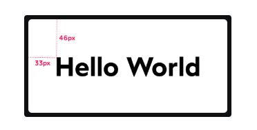
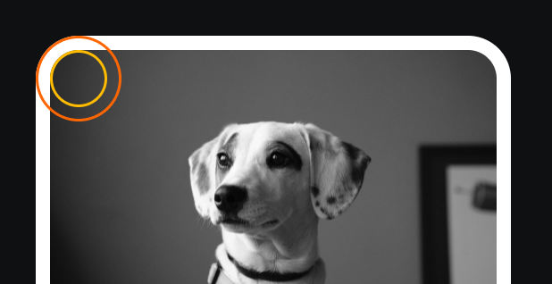
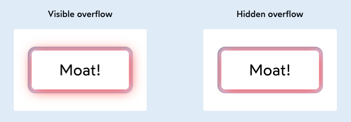
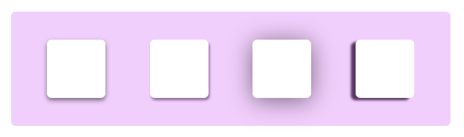
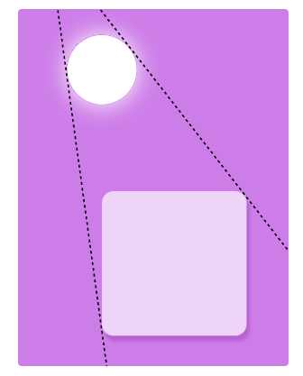
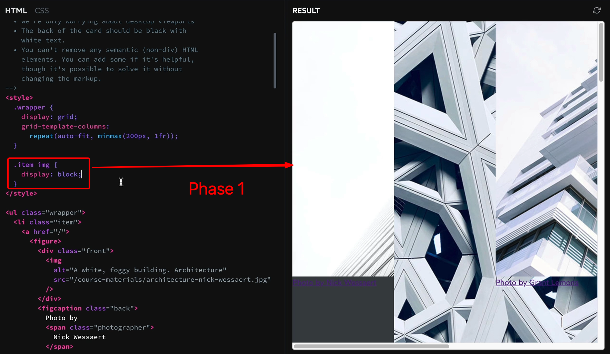
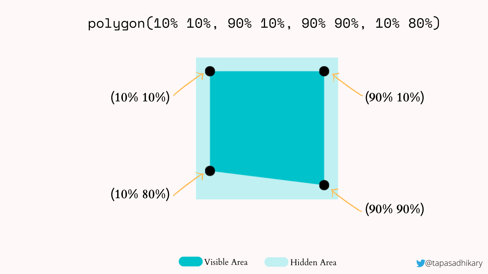
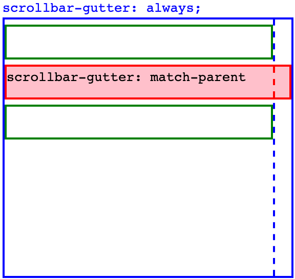

# INDEX

- [INDEX](#index)
  - [Cascading Style Sheets (CSS)](#cascading-style-sheets-css)
    - [Styling Types](#styling-types)
    - [Starter CSS Code (Global Reset / Normalize)](#starter-css-code-global-reset--normalize)
  - [How CSS works](#how-css-works)
    - [What happens when we load a page in the browser?](#what-happens-when-we-load-a-page-in-the-browser)
    - [Visual Formatting Model](#visual-formatting-model)
    - [Inheritance](#inheritance)
  - [Selectors](#selectors)
    - [Selectors Types](#selectors-types)
      - [Combinators](#combinators)
      - [`[attribute]` Selector](#attribute-selector)
      - [Other selectors](#other-selectors)
    - [Pseudo Elements/Classes](#pseudo-elementsclasses)
      - [pseudo classes](#pseudo-classes)
      - [pseudo elements](#pseudo-elements)
    - [Cascade and Specificity](#cascade-and-specificity)
    - [Selectors Notes](#selectors-notes)
  - [Box Model](#box-model)
    - [Box Sizing width \& height calculation (Content)](#box-sizing-width--height-calculation-content)
    - [Padding](#padding)
      - [Optical Alignment](#optical-alignment)
    - [Border](#border)
      - [Border radius](#border-radius)
      - [Nested Border Radiuses](#nested-border-radiuses)
    - [Outline](#outline)
    - [Margin](#margin)
      - [Auto margins](#auto-margins)
      - [Margin Collapse](#margin-collapse)
    - [Box model notes](#box-model-notes)
  - [Colors](#colors)
    - [HSL Colors](#hsl-colors)
    - [Gradients](#gradients)
      - [Linear Gradient](#linear-gradient)
      - [Radial Gradient](#radial-gradient)
      - [Conic Gradient](#conic-gradient)
      - [Animated gradient](#animated-gradient)
    - [Color Notes](#color-notes)
  - [Font \& Text](#font--text)
    - [Text Rendering](#text-rendering)
    - [TypeFaces \& Font Families](#typefaces--font-families)
      - [Font Loading Strategies (`font-display` property)](#font-loading-strategies-font-display-property)
    - [Text Formatting](#text-formatting)
    - [Alignment](#alignment)
    - [Line \& Letter Spacing](#line--letter-spacing)
    - [Text Overflow](#text-overflow)
      - [`overflow` property](#overflow-property)
      - [`overflow-wrap` property](#overflow-wrap-property)
      - [`text-overflow` property](#text-overflow-property)
      - [Multi-line ellipsis (Text Clamping)](#multi-line-ellipsis-text-clamping)
    - [Font \& Text Notes](#font--text-notes)
  - [Units](#units)
    - [Pixels](#pixels)
    - [Percentages](#percentages)
    - [Em \& Rem](#em--rem)
    - [`vh` \& `vw`](#vh--vw)
    - [Keywords](#keywords)
    - [Units Notes](#units-notes)
  - [Shadow](#shadow)
    - [`box-shadow`](#box-shadow)
    - [`text-shadow`](#text-shadow)
    - [`filter: drop-shadow`](#filter-drop-shadow)
    - [Designing Shadows](#designing-shadows)
  - [images](#images)
    - [Fit and Position of Images](#fit-and-position-of-images)
    - [Transforming Images](#transforming-images)
    - [`background` properties (Background Images)](#background-properties-background-images)
    - [CSS Filters (`filter` property)](#css-filters-filter-property)
    - [clip-path](#clip-path)
    - [Masking](#masking)
    - [Images Notes](#images-notes)
  - [Scrolling](#scrolling)
    - [Scrolling using CSS](#scrolling-using-css)
    - [Scrolling using JavaScript](#scrolling-using-javascript)
    - [Scroll Snapping](#scroll-snapping)
    - [Scrollbar Styling](#scrollbar-styling)
    - [Scroll Optimization](#scroll-optimization)
  - [Focusing](#focusing)
    - [Focus Types \& Improvements](#focus-types--improvements)
    - [Keeping track of focus](#keeping-track-of-focus)
  - [Calculations Built in Functions](#calculations-built-in-functions)
    - [`calc()`](#calc)
    - [`clamp()`](#clamp)
    - [`min()` \& `max()`](#min--max)
  - [data attributes](#data-attributes)
  - [Table](#table)
  - [Form](#form)
  - [Modules \& Layers (multiple style sheets)](#modules--layers-multiple-style-sheets)
    - [Modules](#modules)
    - [Layers](#layers)
  - [Browser Support (CSS Vendor Prefixes)](#browser-support-css-vendor-prefixes)
    - [Vendor Prefixes](#vendor-prefixes)
    - [Graceful Degradation](#graceful-degradation)
  - [Notes](#notes)
    - [General Notes](#general-notes)
    - [Questions](#questions)
    - [CSS Resources](#css-resources)

---

## Cascading Style Sheets (CSS)

**CSS** is a language that describes the visual style and layout of the content (HTML) in a web page.

- **CSS** stands the phrase **Cascading Style Sheets**.

  - **"Cascading"** Process of combining different stylesheets and resolving conflicts between different CSS rules and declarations by the browser, when more than one rule applies to a certain element.

    - means that a lower priority style can be overridden by a higher priority style -> [Specificity](#cascade-and-specificity)
    - also the styles are applied in a specific order, so the last style will be applied **(chronological order)**

    > Great article about it [here](https://2019.wattenberger.com/blog/css-cascade)

  - **"Style"** is a set of rules that define how the content of an element should be displayed.
  - **"Sheets"** means that the rules are organized into groups called stylesheets.

- **CSS Rule**: It consists of `properties` and `values` that are applied to HTML elements (`selectors`) to style them.
  

---

### Styling Types

- You don't quite start with a blank canvas; HTML tags do include a few minimal styles. For example, here are the built-in styles for `<a>` tags, in Chrome 86:

  ```css
  a {
    color: -webkit-link;
    cursor: pointer;
    text-decoration: underline;
  }
  ```

  - These styles are part of the **user-agent browser stylesheet** that the browser applies to all web pages by default (each browser has its own default styles).

- But we can override these styles and add our own styles using CSS. and there are 3 ways to add styles to an HTML element:

  - **Inline style**

    - it's a style that is applied directly to the element using the `style` attribute.

      ```html
      <h1 style="color:red;"></h1>
      ```

    - It's a bad practice because:
      - it mixes the content with the style, and it's hard to maintain and update.
      - it only applies to the specific element, and it's not reusable for other elements.

  - **Internal style**

    - it's a style that is applied to the whole page using the `<style>` tag in the `<head>` section.

      

    - It's better than inline style because it's reusable for all elements in the page, but it's not reusable for other pages (other HTML files).

  - **External style**

    - it's a style that is applied to the whole page using an external CSS file.
      

      - `<Link>` tag is not a url link, it's a used for **linking** the HTML file to the CSS file.
      - `rel` attribute is used to specify the **relationship** between the HTML file and the linked file. if we didn't specify it, the browser will assume it's a stylesheet file.

- **Note**:
  - **inline style** has the highest priority, then **internal style**, then **external style**
    
  - when using 3rd party stylesheets, always put your own stylesheet after it, so it can override it.

---

### Starter CSS Code (Global Reset / Normalize)

**CSS Reset** is a set of styles that are have 2 primary jobs: **Remove** any strange default styles that browsers apply to HTML elements to make sure that the code runs the same on all browsers, and **Flatten the CSS** to make it easier to style by removing any default margins, paddings, and other styles that can make it difficult to style.

- **References to use:**

  - [John Smilga CSS Default Starter / Global Styles / Tools](https://github.com/john-smilga/default-starter)

    - read the README.md file for instructions

  - [Josh Comeau: A Modern CSS Reset](https://www.joshwcomeau.com/css/custom-css-reset/)

  - [A (more) Modern CSS Reset](https://piccalil.li/blog/a-more-modern-css-reset/)
  - [CSS Tools: Reset CSS](https://meyerweb.com/eric/tools/css/reset/)

- Notes:

  - When writing normalize css code, use `body` for the properties that are inherited by all elements (like `font` related properties), and use `*` for the properties that are not inherited by all elements (like `box-sizing`).

    ```css
    /* Global Styles */
    html {
      box-sizing: border-box;
      font-size: 10px;
    }

    *,
    *::before,
    *::after {
      box-sizing: inherit;
      margin: 0;
      padding: 0;
    }

    body {
      font-family: 'Arial', sans-serif;
      font-size: 1.6rem;
      line-height: 1.6;
    }
    ```

---

## How CSS works

### What happens when we load a page in the browser?


1. **The browser receives the HTML file and starts to parse it**
   - When parsing the HTML file, it encounters a `<link>` tag with a `rel="stylesheet"` attribute, so it starts to download the CSS file
   - The browser continues parsing the HTML file and builds the **DOM** tree, in parallel with loading the CSS file.
2. **Loading CSS file**

   - The browser parses the CSS file, and builds the **CSSOM** tree.
     - `CSSOM` is the CSS Object Model, which is very similar to the DOM tree, but for CSS. It involves:
       - parsing the CSS file
       - figuring out which CSS rules apply to which elements
       - resolving conflicts **(Cascade)**
       - evaluating final values (`vm` -> `px`)
         

3. **Rendering the page**
   - The `CSSOM` and `DOM` trees are combined into a **render tree**.
   - The render tree is used to compute the layout of each visible element and displays them on the screen.
   - The browser paints the pixels on the screen -> [Visual formatting model](#visual-formatting-model)

---

### Visual Formatting Model

It's the process (Algorithm) of turning the render tree into the actual pixels on the screen after calculating the layout of each element.

- CSS builds its sense of direction based on this system. It has a **block direction (vertical)**, and an **inline direction (horizontal)**.

  - Block direction is like lego blocks: they stack together one on top of the other.
  - Inline direction is like people standing **in-line**; they stand side by side, not one on top of the other.

  > Because not all languages are left-to-right, top-to-bottom, the browser by default uses block (vertical) and inline (horizontal) properties like `margin-block-start` instead of `margin-top`
  >
  > These alternatives are known as **logical properties**.
  >
  > You can learn more about different writing modes in this [wonderful article by Jen Simmons](https://24ways.org/2016/css-writing-modes/).

- It uses an algorithm called [Box Model](#box-model) to determine the size and position of each box to be painted on the screen.
- To do that it takes into account factors like:
  - dimensions of the box -> `box-sizing`
  - box type -> `inline`, `block`, `inline-block`
  - positioning scheme -> `float`, positioning (`absolute`, `relative`)
  - stacking context -> `z-index`
  - viewport size, dimensions of images, etc.

---

### Inheritance

**Inheritance** is a key concept in CSS that allows styles to be passed from parent elements to their children (descendants).

- Inheritance is only applied if no style is defined for the element itself.
- Not all properties are inherited, only some properties that inherit are **typography-related** (like `color`, `font-family`, `font-size`, other text properties).
- Example:

  ```css
  body {
    color: #444444;
  }

  p {
    /* p will inherit the color from the body */
  }
  ```

  

- You can think of it like JavaScript's **prototype chain** where the child element inherits the properties from the parent element.

  ```js
  class Main {
    color = 'black';
  }
  class Paragraph extends Main {
    backgroundColor = 'red';
    color = 'blue';
  }
  class Span extends Paragraph {}
  const s = new Span();
  console.log(s.color); // blue
  ```

  ```html
  <main style="color: black;">
    <p style="color: blue;">
      Hello
      <span>World</span>
      <!-- will inherit the color from the p -->
    </p>
  </main>
  ```

- How inheritance works
  

  - "cascaded value" means that there was a style applied to the element itself

- Notes:

  - styles applied to the `body` element will be inherited by all other elements in the document. if you want to select all elements, **(without inheritance)**, you can use the `*` selector.

    - It has the lowest specificity, so it's easy to override and like a fallback or when overriding default styles.

  - In order to **force inheritance**, you can use the `inherit` keyword to inherit the value from the parent element (Not recommended)

    ```css
    p {
      border: inherit;
    }
    ```

---

## Selectors

Selectors are used to target the HTML elements that we want to style.

### Selectors Types

- There are many types of selectors in CSS, and they can be combined to create complex rules.

  - Based on the type:

    - element -> `p`,`div`,..
    - class -> `.class`
    - id -> `#id`
    - attribute -> `[attribute]`
    - universal -> `*`
      - It's usually used to **reset** the default styles of the browser

  - Based on the relationship:

    - descendant -> `div p`
    - child -> `div > p`
    - adjacent sibling -> `div + p`
    - general sibling -> `div ~ p`

  - Based on the state or position:

    - `:hover`, `:active`, `:focus`, `:visited`, `:checked`, `:disabled`, `:enabled`, `:required`, `:optional`, `:valid`, `:invalid`, `:in-range`, `:out-of-range`, `:placeholder-shown`
    - `:first-child`, `:last-child`, `:nth-child(n)`, `:nth-last-child(n)`, `:nth-of-type(n)`, `:only-child`, `:only-of-type`

  - Based on the content (pseudo-elements):
    - `:empty`, `:not(selector)`, `:has()`, `:where()`, `:is()`

#### Combinators

**Combinators** are used to combine multiple selectors into a single rule. They are used to target elements based on their relationship with other elements.

- Compound selector

  - selects elements based on multiple classes or selectors

    ```css
    /* Selects all elements with both name1 and name2 set within its class attribute */
    .name1.name2 {
      background-color: yellow;
    }

    /* Selects all <p> elements with class="intro", so it's called a class selector */
    p.intro {
      background-color: yellow;
    }
    ```

- Descendant selector

  - selects all elements that are descendants of a specified element (no matter how deep they are nested in the DOM tree)

    ```css
    /* Selects all <p> elements inside <div> elements (parent) even if there are other elements nested between them */
    div p {
      color: red;
    }
    ```

- Child selector (Direct descendant selector)

  - selects all elements that are the direct children of a specified element

    ```css
    /* Selects all <p> elements that are direct children of <div> elements */
    div > p {
      color: red;
    }
    ```

- Adjacent sibling selector
  

  - selects an element that is directly after another specific element (on the same level)

    ```css
    /* Selects the first <p> element that is placed immediately after <div> elements */
    div + p {
      color: red;
    }
    ```

- General sibling selector
  

  - selects all elements that are siblings of a specified element (on the same level, but not necessarily directly after it)

    ```css
    /* Selects every <ul> element that is preceded by a <p> element */
    p ~ ul {
      color: red;
    }
    ```

---

#### `[attribute]` Selector

It selects elements with a specific attribute (whatever its value or a specific attribute value).

- `[]` selector -> Matches a specific attribute (whatever its value)

  - ex: `p[class]`

    ```css
    input[type='email'] {
      background-color: yellow;
    }
    ```

- `[=]` selector -> Matches a specific attribute with a specific value
  - ex: `p[class="dog"]`
- `[~=]` selector -> Matches a specific attribute whose value appears in a space-separated list of words
  - ex: `p[class~="dog"]`
- `[*=]` selector -> Matches a specific attribute whose value contains a specific substring **(anywhere in the value)**

  - ex: `p[attr*"do"]`

    ```css
    a[href*='wiki'] {
      color: red;
    }
    ```

- The `[attribute^=value]` selector matches every element whose attribute value **begins** with a specified value.

  ```css
  div[class^='test-'] {
    background: #ffff00;
  }

  a[href^='https'] {
    color: red;
  }

  /* this will match all links that start with # (anchor links) */
  a[href^='#'] {
    color: green;
  }

  a[href^='https']::before {
    content: '🔒';
  }
  ```

- `[$=]` selector -> Matches a specific attribute whose value **ends** with a specific string

  ```css
  a[href$='.org'] {
    color: red;
  }
  ```

---

#### Other selectors

- `:not(p)` => Selects every element that is not a `<p>` element
- `:nth-child(n)` => [nthmaster](http://nthmaster.com/)
- owl selector `* + *`
  - applies to the elements with is not the first one
    

---

### Pseudo Elements/Classes

They are used to style certain parts of an element or to style an element in a certain state, position, or relationship.

#### pseudo classes

Pseudo classes are used to apply styles to an element based on its current state or position.

- Some pseudo classes used with `<a>`, `<button>` elements:

  - `a:link` => `<a>` that are **unvisited** links with a **`href`** attribute
  - `a:visited` => `<a>` that has been clicked on
  - `a:hover` => `<a>` when we are **hovering**
  - `a:active` => `<a>` when we are **clicking**
  - `a:focus` => `<a>` when we are **tab focusing**

- pseudo classes for **Form elements**

  - `:checked` -> selects every checked `<input type="checkbox">` element
  - `:disabled`
  - `:enabled`
  - `:focus`
  - `:required`
  - `:optional`
  - `:valid`
  - `:invalid`
  - `:in-range`
  - `:out-of-range`
  - `:placeholder-shown` -> selects input elements with a placeholder text (when no value is entered yet)

- pseudo classes for **Child elements & Indexes (where the element is in the DOM tree)**

  - `:root` -> selects the root element of the document

    - used to select the root element of the document (the `html` element)

    - `rem` values will depend on values here
    - used for: general styles & css variables
    - It's a pseudo-class, so it has more specificity than the `html` element selector
    - It includes all elements and pseudo elements in the **DOM** unlike `*` selector

  - `:first-child` -> for the first child of an element **(not the first of a type)**
  - `:last-child` -> for the last child of an element
  - `:nth-child(n)` -> for every `n`th child of an element
  - `:nth-last-child(n)` -> for every `n`th child of an element, counting from the last child
  - `:first-of-type` -> for the first child of a type
  - `:last-of-type` -> for the last child of a type

    - **Note:** it only selects the first/last child of a **element-type**, not the class or id

      ```css
      /* selects the last div element */
      div:last-of-type {
        color: red;
      }

      /* doesn't guarantee that the last div will be red */
      .box:last-of-type {
        color: red;
      }
      ```

  - `:nth-of-type(n)` -> for every `n`th child of a type
  - `:only-child` -> for the only child of an element
  - `:only-of-type` -> for the only child of a type

- pseudo class that handles different **states of an element** -> they are used to style multiple elements that are in a certain state

  - Examples:

    - `:not()` -> selects every element that is not a certain selector
    - `:empty` -> selects every element that has no children
    - `:target` -> selects the current active target element
    - `:has()` -> selects elements that have a specific descendant
    - `:where()` -> selects elements that match a list of selectors
    - `:is()` -> selects elements that match one of the selectors
    - `:selection` -> selects the portion of an (element / text) that is selected by a user

  - They can be combined with other selectors to create complex rules

    ```css
    /* selects every h2 element inside a div or a section */
    div h2,
    section h2 {
      color: red;
    }
    /* the same as the above using :is() */
    :is(div, section) h2 {
      color: red;
    }
    ```

---

#### pseudo elements

They're like [pseudo classes](#pseudo-classes) but they don't target a specific state, Instead, they target a specific part of an element (sub-elements), ex: `placeholder`, `first-letter`, ...

> They're called "pseudo **elements**" because they select and style elements that are not part of the DOM (haven't explicitly been created with HTML tags).

- They create element and insert it `before`/`after` content of an element without inserting it in the HTML.

  - You can create the same effect by creating a new element and styling it, but it's not recommended because it's not semantic and it's not accessible.

    ```html
    <div class="box">Hello</div>

    <style>
      .box::before {
        content: '🔥';
      }
    ```

    ```html
    <!-- Also works! ✅ -->
    <span class="pseudo-element"></span>
    <div class="box">Hello</div>

    <style>
      .pseudo-element {
        content: '🔥';
      }
    ```

- Note that they're not part of the DOM, so:
  - they can't be selected by JavaScript.
  - they aren't accessible by screen readers.
  - they can't be selected by the user when selecting text. **(Super useful when you want to add visual content to the text without affecting the text itself when selecting it)**
- When using it, we must provide a `content` property to it in order to work (even if it's empty string `""`)

  ```css
  div::before {
  content: "";
  width: 100%
  background-color: red;
  }
  /* or */
  div::before {
  content: "sfdsfsdfdsf";
  background-color: red;
  }

  /* This Won't Work ❌ */
  div::before {
  background-color: red;
  }
  ```

- they are inline elements, so you can convert them to `inline-block` to control padding
- you can't add **pseudo elements** like `::before` with `img` element (as it's a content by itself), instead use it on a `div` that contains the `img`
- when you have `pseudo element` like `::before` that has no content, you have 2 choices :

  - `width` / `height` in `px,rem`
  - `width` / `height` in `%` relative to the **parent element**

  - for this we use padding-top/bottom to simulate height
    

    ```css
    /* outer circle */
    .step-img-box::before {
      width: 60%;

      /* this mimics -> "height: 60%;" */
      padding-bottom: 60%;

      background-color: #fdf2e9;
      z-index: -2;
    }
    ```

- You can use `::before` and `::after` to write content after repeated elements like in **tables** or **lists**

  - like unit after the number -> **kg**, **meter**,...
  - like words before number -> **weight:**, **length:**,...

  ```css
  td:nth-of-type(3)::after {
    content: 'kg';
  }
  ```

- **Some use-cases:**

  - adding quotes to `blockquote` element
  - Gradient borders

    - one way is to create a element with `::before` and `::after` and give them `width` and `height` bigger than the element and give them `background` with `gradient` color
      

      ```css
      .box {
        width: 200px;
        height: 200px;
        background-color: #fff;
        position: relative;
      }
      .box::before {
        content: '';
        position: absolute;
        width: 100%;
        height: 100%;
        top: 10px;
        left: 10px;
        background: linear-gradient(to right, #f00, #00f);
        z-index: -1;
      }
      ```

    - another way is to use `box-shadow` with `inset` and `blur-radius` to create gradient border

  - Animating buttons background

    ```css
    .btn::before {
      content: '';
      position: absolute;
      width: 100%;
      height: 100%;
      top: 0;
      left: 0;
      background: linear-gradient(to right, #f00, #00f);
      z-index: -1;
      transition: opacity 0.3s ease-in-out;
      opacity: 0;
    }

    .btn:hover::before {
      opacity: 1;
    }
    ```

  - Create custom form controls like toggle checkbox input element
    

- Notes:
  - sometimes you will find it used with single colon `":"` instead of 2 `"::"`
    - because in **CSS 2** there were no difference between pseudo-classes and pseudo-elements, but in **CSS 3** the `"::"` was introduced
    - Most browsers will still support the single colon syntax for backward compatibility, but it's recommended to use the double colon syntax as some pseudo-elements require it like `::placeholder`.

---

### Cascade and Specificity


- If there are two or more CSS rules that point to the same element, the selector with the highest specificity value will "win", and its style declaration will be applied to that HTML element.
  
  

- How does it work

  - **Calculation**
    

    - Start at `0`
    - add `100` for each ID value
    - add `10` for each class value (or pseudo-class or attribute selector)
    - add `1` for each element selector or pseudo-element.
    - The combinators like `+`, `>`, `~` don't affect the specificity.

    

  - It's similar to Javascript merging objects, where the last object will override the previous one.

    ```css
    p {
      font-weight: bold;
      color: hsl(0deg 0% 10%);
    }
    .introduction {
      color: violet;
    }
    ```

    ```js
    /* In order to calculate the final styles
    const appliedStyles = {
      ...inheritedStyles,
      ...tagStyles,
      ...classStyles,
      ...idStyles,
      ...inlineStyles,
      ...importantStyles
    };
    */

    const tagStyles = {
      fontWeight: 'bold',
      color: 'hsl(0deg 0% 10%)'
    };
    const classStyles = {
      color: 'violet'
    };
    const appliedStyles = {
      ...tagStyles,
      ...classStyles
    };
    ```

- **"Last rule Principle"**

  - It's a rule in CSS where if multiple rules have the same specificity, then the last rule will be applied.
  - So **the placement of the rule is important**

- `!important` keyword

  - It gets a specificity score of **10,000 points**. This is the highest specificity that one individual item can get.
    
  - It's used to override all other styles, but it's not recommended to use it because it makes the code **harder to maintain** and update.
  - if 2 rules have `!important`, then the last one will be applied (the same as the "last rule principle")

- Example:
  
  

- Notes:
  - The universal selector `*` has no specificity and gets `0` points.
  - It's better to depend on specificity rather than the order of the rules to avoid conflicts.
  - Only depend on the order of the rules when you want to override a specific rule. Ex: using 3rd party stylesheets and you want to override some styles by adding your own stylesheet after it.
  - **Keyframes animations have no specificity**, so they can't be overridden by adding `!important` to the styles. Instead, you can use the `animation-name` property to override it.

---

### Selectors Notes

- We shouldn't depend on element-selectors and nested selectors, instead, we should use classes and IDs to style elements.
  - This is because it's easier to maintain and update the styles later on without affecting other elements and the HTML structure.
- `id` should be used for **unique** elements, and `class` for **reusable** elements.
  - In the real world, we usually don't use `id` for styling, instead, we use `class` for everything (to be more flexible and reusable).
  - if you have an `id` that is used twice, **the styles will be applied to all elements with the same `id`**. but it's not recommended to use the same `id` for multiple elements ❌.
- Universal selector (**`*`**) has **no specificity** and gets **0 points** (least specificity so it's like a fallback or when overriding default styles).
- You can apply the same rule to multiple selectors by separating them with a comma `","` **(Grouping selectors)**.

  ```css
  h1,
  h2,
  h3 {
    color: red;
  }
  ```

- Specificity in CSS only concerns selectors, not their associated declarations. **!important** applies to a declaration, so it alone plays no role in specificity.
- more info & examples here [css-specificity](https://www.webfx.com/blog/web-design/css-specificity/)

---

## Box Model

The **CSS Box Model** is a set of rules that describe how elements on a web page are rendered and sized by the browser. It's called a "box model" because every element on a web page is represented as a rectangular box.

- It makes each element in the HTML document a rectangular box that consists of the following parts: (**content**, **padding**, **border**, and **margin**).

  

### Box Sizing width & height calculation (Content)

- The default behavior of calculating the `width` and `height` of an element is to include the content, padding, and border, but not the margin. This is called `content-box` (default value)
  
  
- To include the padding and border in the `width` and `height` of an element, you can use the `box-sizing` property with the value `border-box`.

  ```css
  div {
    box-sizing: border-box;
  }
  ```

  
  

  - The old way has `box-sizing: content-box;` as the default value, but now the default value is `box-sizing: border-box;` in most modern browsers.
  - In order to add it in the reset CSS **(Global Styles)**, you can use:

    ```css
    html {
      box-sizing: border-box;
      font-size: 100%;
    }

    *,
    *::before,
    *::after {
      box-sizing: inherit;
    }

    /* Don't use it on the body because it won't be inherited, Instead use it on the ":root" or "*" */
    ```

- Box model questions:
  
  

  - Interview question: **What is the difference between `box-sizing: content-box;` and `box-sizing: border-box;`?**

    - `content-box` includes only the content of the element in the width and height calculation, while `border-box` includes the content, padding, and border in the width and height calculation. So when you use `border-box`, we want to set the `width` and `height` of the element to include the entire box (border box) not just the content (content box).

---

### Padding

It's the inner space between the content and the border of an element.

- Padding can be set for all directions at once, or it can be specified for individual directions:

  ```css
  .even-padding {
    padding: 20px;
  }
  .asymmetric-padding {
    padding-top: 20px;
    padding-bottom: 40px;
    padding-left: 60px;
    padding-right: 80px;
  }
  /* The same thing, but using ✨ logical properties ✨ */
  .asymmetric-logical-padding {
    padding-block-start: 20px;
    padding-block-end: 40px;
    padding-inline-start: 60px;
    padding-inline-end: 80px;
  }
  ```

- The `padding` shorthand property has a couple tricks up its sleeve. It can be used to set asymmetric padding, in a few different ways.

  ```css
  .two-way-padding {
    /* top/bottom = 10px, right/left = 20px */
    padding: 15px 30px;
  }

  .asymmetric-padding {
    /* top = 10px, right = 20px, bottom = 30px, left = 40px */
    padding: 10px 20px 30px 40px;
  }

  .three-way-padding {
    /* top = 10px, right/left = 20px, bottom = 30px */
    padding: 10px 20px 30px;
  }
  ```

  - This pattern is shared amongst other CSS properties that have shorthand values. like `margin`, `border`, `outline`, `background`, `font`, `list-style`, `animation`, `transition`, `grid`, `flex`

- Note: You will often find usage of **Asymmetric Padding** in elements that contain text, to give more space at the top and bottom of the text. This gives optical illusion that the text is more centered and easier to read. because if we didn't use it, the text will look like it's sticking to the top of the element because of the text's line-height. -> [Optical Alignment](#optical-alignment)

#### Optical Alignment

Let's suppose we have a heading inside a container with `32px` of padding:

```html
<style>
  .card {
    padding: 32px;
    border-radius: 4px;
    background: white;
  }
  h2 {
    font-size: 2rem;
  }
</style>

<article class="card">
  <h2>Hello World</h2>
</article>
```



- This box has even padding, `32px` on each side. But if we actually measure it, we'll discover that the padding is not symmetrical. The space above the text is smaller than the space below it.

  - It's because we're not measuring from the container to the characters themselves. We're measuring to the text selection box:
    

- Instead of aligning things based on the mathematical values, we should align things based on their perceived symmetry. This is known as **optical alignment**.

- To understand why this is an issue, we need to consider how typography is rendered in design software like **Figma**.

  - In design software, text nodes will have a tiny amount of space around them (the reason there's more space along the bottom is for letters that descend, like `j` or `p`).
    
  - This is why our implementation won't quite look right even if we use the exact same values that we see listed in Figma! The numbers can't be trusted, because typography is handled differently between design software and the web.

- So, to fix this issue, we need to adjust the padding values to make the text look more centered. We can do this by using **asymmetric padding** (more padding at the top and bottom than at the sides).

  ```css
  .card {
    padding: 32px 40px;
  }
  ```

> Here's a great blog post about optical alignment and pixel-perfect implementations -> [“Chasing the Pixel-Perfect Dream”](https://www.joshwcomeau.com/css/pixel-perfection/)

---

### Border

It's the line that surrounds the content and padding of an element.

- There are three styles specific to border: (width, style, color)

- They can be combined into a shorthand:

  ```css
  .box {
    border: 3px solid hotpink;
  }
  ```

  - The only required field is `border-style`. Without it, no border will be shown!

    ```css
    .not-good {
      /* 🙅‍♀️ Won't work ❌ – needs a style! */
      border: 2px pink;
    }

    .good {
      /* 🙆‍♀️ Will produce a black, 3px-thick border */
      border: solid;
    }
    ```

- They can also be used with different values for each direction separately.

  ```css
  .box {
    border-left-color: red;
    border-right-color: blue;
  }
  ```

- If we don't specify a border color, it'll use the font's color by default.

  - If you want to specify this behaviour explicitly, it can be done with the special `currentColor` keyword.

    ```css
    .box {
      color: hotpink;
      border: 1px solid currentColor;
      box-shadow: 2px 2px 2px currentColor;
    }
    ```

---

#### Border radius

It's used to create rounded corners for an element.

> It's not actually related to the border, but it's related to the element's corners (the `border-radius` property rounds an element even if it has no border!)

- You can use the shorthand property `border-radius` to set the radius for all corners at once, or you can specify the radius for each corner separately.

  ```css
  .box {
    border-radius: 10px;
  }
  ```

  - If you only specify one value, it will be used for all corners.
  - If you specify two values, the first value will be used for the top-left and bottom-right corners, and the second value will be used for the top-right and bottom-left corners.

- **Radius per corner**

  - You can set the radius for each corner separately by using the `border-top-left-radius`, `border-top-right-radius`, `border-bottom-right-radius`, and `border-bottom-left-radius` properties.

    ```css
    .box {
      bborder-top-left-radius: 20px;
      border-top-right-radius: 60px;
      border-bottom-right-radius: 40px;
      border-bottom-left-radius: 80px;

      /* or using the shorthand */
      border-radius: 20px 60px 40px 80px;

      /* Wrong ❌ -> doesn't work */
      border-left-radius: 10px;
    }
    ```

    

  - Each of these properties accepts two values: the **horizontal radius, and the vertical radius**.

    ```css
    .box {
      border-top-left-radius: 40px 20px;
    }
    ```

    
    

  - This is how the shorthand `border-radius` works under-the-hood. When we pass a value like `32px`, that single value is used `8` times:
    

- **Percentages**

  - You can use percentages to set the radius of the corners relative to the size of the element.

    ```css
    .box {
      border-radius: 50%;
    }
    ```

  - when we use a percentage, **the horizontal radius will be based on the `width`, and the vertical radius will be based on the `height`**.
    

    - Here's how to think about it: the ellipse will be proportional to the element itself. If our element has a width of `300px` and a height of `150px`, it will have an aspect ratio of `2:1`. When we use a single percentage value for border-radius, it produces an ellipse with the same aspect ratio.

  - If you have an element with **square dimensions**, you can create a circle by setting the `border-radius` to `50%`.

    ```css
    .circle {
      width: 100px;
      height: 100px;
      border-radius: 50%;
    }
    ```

    - How it works: by setting the `border-radius` to `50%`, the radius of the corners will be half of the width and height of the element which will make it a circle.
      
    - If the radius is 50%, that means the diameter is 100%. So we wind up with an ellipse that is the same width and height as the element itself. As a result, our shape becomes an ellipse:

- **Shorthand**

  - The `border-radius` property can also be used with the shorthand syntax to set the radius for all corners at once, or you can specify the radius for each corner separately.

  - It can take up to 8 values (first 4 values for the horizontal radius, and the last 4 values for the vertical radius)

    ```css
    .box {
      border-radius: 10px 20px 30px 40px / 50px 60px 70px 80px;
    }
    ```

    

  - If only the first 4 numbers are provided, they're copied over to the last 4:

    ```css
    .box {
      /* These two declarations are equivalent: */
      border-radius: 10% 20% 30% 40%;
      border-radius: 10% 20% 30% 40% / 10% 20% 30% 40%;
    }
    ```

  - And if only a single value is provided, it's copied over to all 8 values:

    ```css
    .box {
      /* These two declarations are equivalent: */
      border-radius: 100px;
      border-radius: 100px 100px 100px 100px / 100px 100px 100px 100px;
    }
    ```

- **Circular Radius**

  - The trick is to pick a very very large value for the radius, so the browser will make the corners as round as possible, and if the value is too large, the browser will make the corners as round as possible, which will make the element a circle.

    ```css
    .circle {
      border-radius: 9999px;
    }
    ```

    

- **Blobby shapes**

  - By using all 8 border-radius values, we can create some pretty nifty blobby shapes!
  - Check out [this neat tool by 9Elements](https://9elements.github.io/fancy-border-radius)
    

---

#### Nested Border Radiuses

- There's a common mistake people make when trying to have a rounded element in a rounded container. They try to set the `border-radius` of the inner element to be the same as the outer element, but it doesn't work as expected.

  ```html
  <style>
    .card {
      border-radius: 16px;
      padding: 8px;
    }
    .avatar {
      border-radius: 16px;
    }
  </style>

  <article class="card">
    
    <h2>Spot</h2>
    <p>Perennial Good Boy. Parlimentary candidate, district 22. Dog park YIMBY.</p>
  </article>
  ```

  

  - The corners don't quite look right, do they? Look at how chunky they are in the middle:
    
  - By using the same border-radius, both corners are being rounded according to their own circles:
    
  - Our corner would look more consistent if the two corners shared the same center point, like tree rings, This way This way, the corners are the same thickness all the way through:
    
    

- **Solution**

  - How do we calculate this? Well, our goal is to figure out the radius of the larger circle. To do that, we'll need to sum up the inner circle's radius as well as any padding or other spacing:
    
    - In this case, the correct outer radius is `24px` (`16px` inner radius + `8px` padding).
  - We can use `calc` and `CSS variables` to do this calculation for us:

    ```html
    <style>
      .card {
        --outer-radius: 24px;
        --padding: 8px;
        border-radius: var(--outer-radius);
        padding: var(--padding);
      }
      .avatar {
        border-radius: calc(var(--outer-radius) - var(--padding) /* 24px - 8px = 16px */);
      }
    </style>

    <article class="card">
      
      <h2>Spot</h2>
      <p>Perennial Good Boy. Parlimentary candidate, district 22. Dog park YIMBY.</p>
    </article>
    ```

    

A lot of developers come up with nested radius values by guessing / trial-and-error. And it's surprisingly hard to come up with the perfect value that way!

Hopefully, this explanation has made the process a bit more intuitive, so you can apply this logic the next time you run into this situation!

---

### Outline

- **outline** is outside of the border (and it may overlap with other elements)
  

- It has 3 properties: (width, style, color)

  ```css
  div {
    outline: 2px solid #fff;
  }
  ```

- Outlines share many of the same properties as borders, but they have a few key differences (**outline vs border**)

  - Outlines don't take up space in the layout, so they won't affect the size or position of the element.
  - Outlines can't have rounded corners **(now it follows the `border-radius` of the element)**
  - Outlines can have an offset, which allows you to move the outline (either inside or outside the element).

- Outlines have a special `outline-offset` property. It allows you to add a bit of a gap between the element and its outline.

  ```css
  div {
    outline: 2px solid #fff;
    outline-offset: 5px;
  }
  ```

  

- we can control the outline color using `outline-color` property

  ```css
  div {
    outline: 2px solid;
    outline-color: #f00;
  }
  ```

- `outline` is an **animated property**
- Notes:

  - **Never** apply `outline: none;` to get rid of the default outline on focus, instead, style it to match your design

    - This is because the outline is important for accessibility, especially for keyboard users.
    - The only exception is if we provide a suitable alternative. For example:

      ```css
      button {
        outline: none;
      }

      button:focus {
        background: navy;
        color: white;
      }
      ```

---

### Margin

It's the space between the border of an element and the surrounding elements.

> It's easy to fall into the trap of thinking that margin is exclusively about changing the selected element's position. Really, though, it's about changing the gap between elements.

- By default, most browsers add a margin to the top of the `<h1>` element. This is why there is a gap between the top of the browser and the box containing the `<h1>` element.

  - That's why we use `* { margin: 0; }` to remove the default margin from all elements when resetting the styles.

- `margin` can be **negative** as it's related to the surrounding elements and not the element itself
- When you want to use the `margin` shorthand for all directions, we used to always specify horizontal & vertical spacing, now there're new css-properties called `margin-inline` and `margin-block`

  - it helps if you only want to specify spacing for one direction only instead of making the other direction equals `zero`
    

    ```css
    /* OLD ❌ */
    margin: 0 20px;
    /* NEW ✅ */
    margin-inline: 20px;

    /* OLD ❌ */
    margin: 20px 0;
    /* NEW ✅ */
    margin-block: 20px;
    ```

#### Auto margins

- It's a trick to **center an element horizontally** by setting the left and right margins to `auto`.
  
- It works by distributing the remaining space equally on both sides of the element. (fill the maximum available space)
  - This only works for **horizontal** margin. Setting top/bottom margin to `auto` is equivalent to setting it to `0px`
  - This only works on **elements with an explicit width**. Block elements will naturally grow to fill the available horizontal space, so we need to give our element a width in order to center it. (Doesn't work with `width: 100%`)

#### Margin Collapse

It's a common issue in CSS when two **vertical margins** are overlapping, they will collapse (combine) into a single margin.

- **Margins only collapse in Flow layout**

  - Margin collapse is unique to [Flow layout](./3-CSS-Layouts.md#flow-layout-block-vs-inline). If you have children inside a `display: flex` parent, those children's margins will never collapse.
  - It doesn't happen with `flexbox`, `grid`, or `inline-block` elements.

- Here, only one of them will be visible to the page which is the larger one and **not** their sum (**The bigger margin wins**)
  

  - This doesn't happen with horizontal margins
  - this is not the same for **padding** as they get added together
    - **So, between sections use padding not margin**

- Margins must be touching in order for them to collapse

- Notes:

  - Nesting doesn't prevent collapsing,
  - Margins can collapse in the same direction

    ```css
    .parent {
      margin-top: 72px;
    }
    .child {
      margin-top: 24px;
    }
    ```

  - More than 2 margins can also collapse
  - For negative margins:
    - The negative margins will share a space, and the size of that space is determined by the most significant negative margin.
    - For mixed margins (positive and negative), they will be summed together.

- How to fix it

  - Add `<br/>` between the elements
    
    
  - Add `padding` to the parent element instead of `margin` to the child element

- **Border collapse** : sets whether table borders should collapse into a single border or be separated as in standard HTML => `border-collapse: separate;`
  

---

### Box model notes

- When selecting an element on the browser, you can see the `box-model` properties of the element in the **developer tools**, and the browsers highlight the element's box model when you hover over it (light-blue for content area, orange for margin)
  
- Many developers believe that `pixels` are bad for accessibility. This is true when it comes to `font-size`, but pixels can be the best unit to use for `padding` (and other box model properties like `margin`/`border`) because they're fixed and don't change with the user's settings.

  - Properly, we don't want our `padding` / `margin` to scale with the `font-size` of the element, so we use `px` for them.
    
    

- By default, elements have initial values for `margin` & `padding`, So at the beginning, we should reset them to `0` to avoid any unexpected behavior.

  ```css
  * {
    margin: 0;
    padding: 0;
  }

  /* This won't work ❌ because `margin` and `padding` are not inherited */
  body {
    margin: 0;
    padding: 0;
  }
  ```

- `auto` value for width/height/margin/padding

  - `margin: auto` -> centers the element horizontally
  - `padding: auto` -> it's invalid and won't work ❌
  - `width / height: auto` -> the width / height of the element will fill the available space (remaining width / height of the parent element)

- You can overwrite values of the `box-model` properties for specific elements like this:

  ```css
  /* ✅ */
  .box {
    padding: 48px;
    padding-bottom: 0;
  }

  /*
    ❌ because `padding-bottom` comes first,
    it will be overwritten by the shorthand.
  */
  .box {
    padding-bottom: 0;
    padding: 48px;
  }
  ```

---

## Colors


- **Color** is a combination of **hue**, **saturation**, and **lightness** (`HSL` is a color model that describes color as a combination of hue, saturation, and lightness values)
  

  - **Hue** is the color itself (0-360) degrees
  - **Saturation** is the intensity of the color (0-100%)
  - **Lightness** is the amount of white or black in the color (0-100%)

- There're many ways to represent colors (most common is **RGB Model**)

  

- **Defining colors in CSS**
  
  - in **RGBA**, `alpha` channel: Defines the opacity as a number between `0.0` (fully transparent) and `1.0` (fully opaque)

---

### HSL Colors

It's a way to specify colors using **hue**, **saturation**, and **lightness** values.


```css
body {
  background-color: hsl(0, 0%, 78%);
}

p {
  /* hsla color property adds a fourth value which represents transparency (a for alpha). */
  background-color: hsla(0, 100%, 100%, 0.5);
}
```

---

### Gradients

The CSS language has a surprisingly deep and sophisticated set of gradient functions:


- we have the ability to specify a **gradient** for the background of a box. The gradient is created using the `background-image` property, and it can be `linear` or `radial` or `conic`.

> you can generate gradients from here [cssgradient.io](https://cssgradient.io/)

#### Linear Gradient

It's a way to create a gradient that changes color smoothly from one color to another.

- It's created using the `linear-gradient()` function, which takes two or more color values as arguments.

  - If we provide two colors to linear-gradient, it will interpolate between them, starting from the top and going down.

    ```css
    div {
      background-image: linear-gradient(red, yellow); /* top to bottom */
    }
    ```

  - You can also specify the direction of the gradient by using the `to` keyword followed by a direction (top, right, bottom, left, or any angle).

    ```css
    div {
      background-image: linear-gradient(to bottom right, red, yellow);
      /* or */
      background-image: linear-gradient(45deg, red, yellow);
    }
    ```

    - Note: Somewhat confusingly, the default angle for gradients is `180deg` (top to bottom). If we set it to `0deg`, the gradient would run from the (bottom to the top).

  - We can pass more than two colors, to create richer gradients:

    ```css
    div {
      background-image: linear-gradient(90deg, deeppink, red, coral, gold, white);
    }
    ```

    

  - Gradients have **"color stops"**, points along the spectrum where the color is fully applied. By default, these colors will be equidistant. You can also specify the position of the color stops by adding a percentage value after the color.

    ```css
    div {
      background-image: linear-gradient(
        to right,
        90deg,
        deeppink,
        red 10%,
        coral 20%,
        gold 30%,
        white
      );
    }
    ```

    

    - We can use color stops to do something pretty neat and unexpected: we can create sharp lines by positioning the stops very close together:

      ```css
      div {
        background-image: linear-gradient(
          90deg,
          deeppink 0%,
          deeppink 9.99%,
          red 10%,
          /* very close to the previous color */ red 19.99%,
          coral 20%,
          /* very close to the previous color */ coral 29.99%,
          gold 30%,
          /* very close to the previous color */ gold 39.99%,
          white 40% /* very close to the previous color */
        );

        /* I believe you can use the same color-stop value (eg. gold 40%, white 40%), but I prefer to separate them by a fraction of a percentage, to make it clear what's going on here. The visual result is the same, so this is purely a semantics concern. */
      }
      ```

      

- **Gradient midpoint**

  - By default, the midpoint of a gradient is at `50%`. You can change this by using the `color hints` to specify the midpoint.

    ```css
    .box.one {
      background-image: linear-gradient(deeppink, 20%, gold);
    }
    .box.two {
      background-image: linear-gradient(deeppink, 80%, gold);
    }
    ```

    

- We can have more than one gradient in the same element (they will be stacked on top of each other)

  ```css
  div {
    background-image: linear-gradient(to right, red 20%, yellow 80%), linear-gradient(to bottom, blue, green);
  }
  ```

- to add **overlay gradient** with one color, you make the linear-gradient with the same value for the 2 gradient colors

  ```css
  div {
    /* background image (with darkening-overlay) */
    background-image: linear-gradient(rgba(34, 34, 34, 0.6), rgba(34, 34, 34, 0.6)), url(hero.jpg);
    /* here, linear-gradient needs to be in rgba() form to show the image */
  }
  ```

  - Here, the linear-gradient is on top of the background-image, which gives an overlay look.

- **Notes:**
  - linear-gradient is a `background-image` property, so it can be applied only with either [background](#background-properties-background-images) or `background-image` properties.
    - `background-color` won't work ❌

---

#### Radial Gradient

It's a way to create a gradient that radiates out from a central point.

- It's created using the `radial-gradient()` function, which takes two or more color values as arguments.

  - If we provide two colors to `radial-gradient`, it will interpolate between them, starting (from the center and going outwards).

    ```css
    div {
      background-image: radial-gradient(red, yellow);
    }
    ```

  - You can also specify the shape of the gradient by using the `circle` or `ellipse` keyword.

    ```css
    div {
      background-image: radial-gradient(circle, red, yellow);
    }
    ```

    - The default shape is `ellipse`, so if you don't specify a shape, it will be an ellipse.

  - We can pass more than two colors, to create richer gradients:

    ```css
    div {
      background-image: radial-gradient(deeppink, red, coral, gold, white);
    }
    ```

    

  - Gradients have **"color stops"**, points along the spectrum where the color is fully applied. By default, these colors will be equidistant. You can also specify the position of the color stops by adding a percentage value after the color.

    ```css
    div {
      background-image: radial-gradient(circle, deeppink, red 10%, coral 20%, gold 30%, white);
    }
    ```

  - We can specify the position of the gradient's center by using the `at` keyword followed by a position.

    ```css
    div {
      background-image: radial-gradient(
        circle at 50% 100%,
        white 0%,
        yellow 10%,
        gold 20%,
        coral 30%,
        skyblue
      );
    }
    ```

    

    - The `at` keyword is followed by two values, which represent the `x` and `y` coordinates of the center of the gradient. These values can be percentages or lengths.
    - It's used as a **trick** to create illusions like a **sun** or light source, and can be linked to the mouse position to create a **follow-the-mouse effect**. Here's an [example on codepen](https://codepen.io/msaetre/pen/JjqPby)

---

#### Conic Gradient

It's the newest member of the gradient family, and it's a way to create a gradient that radiates out from a central point in a circular pattern.


- It's what would happen if you took a straight line with a linear gradient, and formed it into a circle:
  

- It's created using the `conic-gradient()` function, which takes two or more color values as arguments.

  - If we provide two colors to `conic-gradient`, it will interpolate between them, starting from the top and **going clockwise**.

    ```css
    div {
      background-image: conic-gradient(red, yellow);
    }
    ```

  - We can pass more than two colors, to create richer gradients:

    ```css
    div {
      background-image: conic-gradient(deeppink, red, coral, gold, white);
    }
    ```

  - It supports **"color stops"** as well, and you can specify the position of the color stops by adding a percentage value after the color.

    ```css
    div {
      background-image: conic-gradient(white 0%, yellow 10%, gold 20%, coral 30%, skyblue);
    }
    ```

  - We can specify the position of the gradient's center by using the `from` keyword followed by a position.

    ```css
    div {
      background-image: conic-gradient(
        from 0deg,
        white 0%,
        yellow 10%,
        gold 20%,
        coral 30%,
        skyblue
      );
    }
    ```

    - The `from` keyword is followed by a value, which represents the starting angle of the gradient. This value can be in degrees or radians.

- **Smoothing the gradient out**

  - By default, we wind up with a pretty harsh line running vertically through the top half. This is because our start and end colors are so different! Unlike the other gradient functions, we don't get a seamless blended result automatically with conic gradients.
  - If our gradient ends with the same color it started with, we can create a smoother effect:

    ```css
    .box {
      background-image: conic-gradient(
        deeppink,
        coral,
        gold,
        coral,
        deeppink /* <-- same color! */
      );
    }
    ```

    

    - Here's a tool to help you ease gradients to make it smooth: [Easing Gradients](https://larsenwork.com/easing-gradients/)

  - Alternatively, we can make all of the lines harsh, by shifting the color stops to be adjacent.

    ```css
    .box {
      background-image: conic-gradient(
        deeppink 0%,
        deeppink 33.3%,
        gold 33.4%,
        gold 66.6%,
        slateblue 66.7%,
        slateblue 100%
      );
    }
    ```

    

- **Gradient angle and position**

  - Linear gradients are given an angle (eg. `45deg`), and radial gradients are given a position (`circle at 50% 100%`). Conic gradients take both -> `from <angle> at <position>`
  - Examples:

    ```css
    /* 
    First gradient:
      Angle: 90deg
      Horizontal offset: 50%
      Vertical offset: 100%
    */
    .box.first {
      background-image: conic-gradient(from 90deg at 50% 100%, white, yellow, gold, coral, skyblue);
    }

    /*
    Second gradient:
      Angle: 270deg
      Horizontal offset: 100%
      Vertical offset: 25%
    */
    .box.second {
      background-image: conic-gradient(
        from 270deg at 100% 25%,
        white,
        yellow,
        gold,
        coral,
        skyblue
      );
    }
    ```

    

---

#### Animated gradient

---

### Color Notes

- It's a good practice to define colors in a separate file or at the top of the CSS file to make it easier to change them later.

  ```css
  :root {
    --main-color: #087f5b; /* Main color */
    --secondary-color: #343a40; /* accent color */
    --light-color: #f8f9fa; /* light color */
  }
  ```

- `currentcolor` keyword

  - is a keyword that can be used in place of a color value. It will use the current value of the `color` property.

  ```css
  .box {
    color: red;
    border: 2px solid currentColor;
  }
  ```

- If you want colors to adapt with the changing the light/dark mode of the browser, you can:

  - Use `canvas` color instead of `white`

    ```css
    :root {
      color-scheme: light dark;
    }

    body {
      color: canvas;
    }
    ```

  - use the `prefers-color-scheme` media query.

    ```css
    @media (prefers-color-scheme: dark) {
      body {
        background-color: black;
        color: white;
      }
    }
    ```

    

    > **Trick** to test it when developing, instead of changing the browser or the OS settings, you apply this code for `light` mode then after finishing, you change it to `dark` mode

- **Selection Colors**

  - You can style the selected text on the page using the `::selection` pseudo-element.

    ```css
    ::selection {
      background-color: #ffcc00;
      color: black;
    }
    ```

    

  - The `::selection` pseudo-element is global; we cannot use it to target selections on a specific element (eg. `.intro::selection`). Originally, this meant that we could only define a single selection style for the entire page.

    - Fortunately, with CSS variables, we can apply different selection styles to different parts of the page:

      ```css
      :root {
        --selection-bg: #ffcc00;
        --selection-color: black;
      }

      ::selection {
        background-color: var(--selection-bg);
        color: var(--selection-color);
      }

      .intro {
        --selection-bg: #ff0000;
        --selection-color: white;
      }
      ```

- **Color contrast for accessibility**

  - details here in [Accessibility file](./8-Accessibility.md#colors)

- **Color Recourses**
  - [Happy Hues](https://www.happyhues.co/) -> color palettes for your projects

---

## Font & Text

### Text Rendering

- **Kerning**
  

  - is the process of adjusting the spacing **between individual characters** in a proportional font, usually to achieve a visually pleasing result.
  - Browsers use different kerning algorithms, so the text may look different in different browsers.
    - Naturally, the browser doesn't do any kerning for `monospaced` fonts, since those characters need to align neatly into columns.
  - How to control it in CSS -> [Line & Letter Spacing](#line--letter-spacing)

- **Text Rasterization**

  - is the process of converting text from a vector format (like a font file) into a raster format (like pixels on a screen).

  > Modern fonts are vector-based (`ttf`, `otf`, `svg`, `woff/woff2`) rather than bitmap-based, allowing them to scale smoothly to any size. The browser converts these vector instructions into pixels through **rasterization**.

- **Font Smoothing**
  - is the process of anti-aliasing text to make it look smoother on screen.
  - It's controlled by the browser and the operating system, so you can't control it with CSS.

---

### TypeFaces & Font Families

> When choosing a typeface, it is important to understand that a browser will usually only display it if it's installed on that user's computer or if it is available on the web.

- Browsers are supposed to support at least one typeface from each of the groups above which is called a **"font-stack / generic-family"**. For this reason, it is common to add the generic font name after your preferred choice of typefaces (in case the preferred typeface is not available or fails to load).

  ```css
  font-family: Georgia, Times, serif;
  /* Here, "Georgia" is the preferred typeface, "Times" is the backup, and "serif" is the generic font family. */
  ```

  - This acts as a sort of "preference list". We've given the browser a list of fonts we'd like to use, in priority order. Ideally, it'll pick the first one, but if it's not available, it can use the second, or the third, or the fourth.

- `@font-face`

  - It allows you to use a font, even if it is not installed on the computer of the person browsing, by allowing you to specify a path to a copy of the font, which will be downloaded if it is not on the user's machine.

    ```css
    /* Declaring a custom font */
    @font-face {
      font-family: 'ChunkFiveRegular';
      src: url('fonts/chunkfive.eot');
      font-weight: 400;
      font-style: normal;
    }

    h1,
    h2 {
      /* Using the custom font */
      font-family: ChunkFiveRegular, Georgia, serif;
    }
    ```

  - Google also provides open source fonts. Rather than adding the `@font-face` rule to your own style sheet, you link to a CSS file and font files on their servers

    - in the HTML `head`:

      ```html
      <!-- Must be before the styles files -->
      <link rel="stylesheet" href="https://fonts.googleapis.com/css?family=Roboto" />
      ```

    - in the CSS file:

      ```css
      /* Must be at the top of the CSS file */
      @import url('https://fonts.googleapis.com/css?family=Roboto');
      ```

- when importing font-faces from a link, we have 2 methods:

  1. put the `<link>` code in the HTML `head` before the styles files
     - This is faster because the browser will download the font file before the CSS file
  2. use `@import url()`, **but it needs to be the first thing in your css file/s** to work correctly

     - This is useful when you want to use the same css file for multiple projects and you want to keep the font import in the same file

- **Performance trade-offs:** Self-hosted fonts can be faster than Google Fonts because:

  - Google Fonts requires multiple requests:
    1. Request to get the CSS file from `fonts.googleapis.com`
    2. Request to get the font file from `fonts.gstatic.com`
  - These external requests add overhead and block page rendering due to "handshaking" with the server.
  - With self-hosted fonts:

    - CSS can be embedded directly in HTML
    - Font files are served from same domain
    - Fewer requests and less **overhead** of reaching out to external servers
    - save a network request (instead of fetching the stylesheet from Google Fonts, then fetching the font files from Google's CDN), here we fetch the font files directly from our server.

    ```css
    /* Self-hosted font */
    @font-face {
      font-family: 'Roboto';
      src: url('/fonts/roboto.woff2') format('woff2'); /* 👈👈👈  */
      font-weight: 400;
      font-style: normal;
    }
    ```

  > If you're using Next.js 11 or higher, the framework will automatically optimize this for you.
  >
  > Angular v11+ has built-in support for Google Fonts, with configuration for inlining the fonts directly. You can [learn more in the Angular docs](https://angular.io/guide/workspace-config#fonts-optimization-options).

---

#### Font Loading Strategies (`font-display` property)

- When a user visits a website using web fonts for the first time, they need to download the font files. During this download, browsers handle text rendering in two ways:

  1. **FOIT (Flash Of Invisible Text)**

     - Browser hides text until font loads
     - User can't read content while waiting
     - Default behavior in most browsers

  2. **FOUT (Flash Of Unstyled Text)**

     - Browser shows text in fallback font first
     - Switches to web font when loaded
     - Can cause layout shifts

> **Note:** Font loading issues may not be noticeable during development because:
>
> - Fonts download instantly on localhost
> - Browsers cache fonts after first visit
> - The font may already be installed on your machine
> - Fast internet connections mask loading delays
>
> Always test font loading behavior in production with various connection speeds.

- To control this behavior, use the `font-display` property (It's included in our @font-face statement)

  ```css
  @font-face {
    font-family: 'Great Vibes';
    src: url('/fonts/great-vibes.woff2') format('woff2');
    font-weight: 400;
    font-style: normal;
    font-display: swap; /* 👈👈👈 */
  }
  ```

  - When we add the Google Font snippet, it includes a query parameter that sets this property:
    

  - The `font-display` property controls how fonts load through 3 time periods:
    1. **Block**: Text is invisible while waiting for font to load
       - `font-display: block;` -> it priotizes the availability of the font over the speed of loading the page.
       - It should only be used when the font is essential for the user experience (ex: icons, logos, etc.)
    2. **Swap**: Fallback font shows until web font loads and swaps in
       - `font-display: swap;` -> it priotizes the speed of loading the page over the availability of the font.
       - It's the best option for most websites because it provides a good balance between performance and user experience.
       - This is the value that Google Fonts uses. It's a good option, but I think there's a better one for most cases.
    3. **Failure**: If font hasn't loaded by now, fallback font remains
       - `font-display: fallback;` -> it's the preferred value. I use it in all of my projects. It prioritizes a smooth user experience above all else:
       - It features a very-short block period (about `100ms`), and a moderate swap period (about `3s`).
       - On speedy connections, it's likely that the font can be downloaded within the block period, preventing an uncomfortable flash between font families
       - On very slow or intermittent connections, the fallback font is used forever, preventing a random flash between fonts seconds/minutes after the page has loaded.
    4. **Optional**: Font is optional and won't block rendering
       - `font-display: optional;` -> it's the least preferred value. It's not recommended because it doesn't guarantee that the font will be loaded at all. It's only useful for decorative fonts that don't affect the user experience.

---

### Text Formatting

- font properties:

  - `font-weight`: specifies the boldness of the font
    - normal -> `400`
    - bold -> `700`
  - `font-style`: specifies the style of the font
  - `font-variant`: specifies whether or not a text should be displayed in a small-caps font
  - `font`: shorthand property for the font-style, font-variant, font-weight, font-size, line-height, and font-family properties

- `text-transform` property:

  - It is used to change the case of the text.
  - It can have the following values:

    - `uppercase` -> transforms the text to uppercase
    - `lowercase` -> transforms the text to lowercase
    - `capitalize` -> transforms the first character of each word to uppercase
    - `none` -> no transformation

    ```css
    p {
      text-transform: uppercase;
    }
    ```

- `text-decoration` property:

  - It is used to specify the decoration added to text.
  - It can have the following values:

    - `none` -> no decoration
    - `underline` -> underlines the text
    - `overline` -> overlines the text
    - `line-through` -> draws a line through the text
    - `blink` -> makes the text blink
    - `revert` -> reverts to the default decoration **(usually when you want to remove/show the underline of a link when hovering)**

    ```css
    p {
      /*               line   line-style  line-color */
      text-decoration: underline wavy red;

      /* or just */
      text-decoration: underline;
    }
    ```

    - Instead of using the shorthand `text-decoration`, you can use the following properties:

      ```css
      span {
        /* same as text-decoration but with more options */
        text-decoration-line: underline;
        text-decoration-style: wavy;
        text-decoration-color: red;
      }
      ```

- `text-shadow` property -> [text-shadow](#text-shadow)

---

### Alignment

- to indent text, use:
  

  - `text-indent`

    ```css
    div {
      text-align: left;
      text-indent: 6rem;
    }
    ```

  - or select the first letter in the paragraph and give it a margin

    ```css
    p::first-letter {
      margin-left: 1em;
    }
    ```

- `text-align`:

  - It is used to specify the horizontal alignment of text.
  - It can have the following values:

    - `left` -> aligns the text to the left
    - `right` -> aligns the text to the right
    - `center` -> aligns the text to the center
    - `justify` -> aligns the text to both the left and right margins, adding extra space between words as necessary
      - This is useful for paragraphs and other blocks of text where you want the text to be aligned on both sides.
        
        
    - `start` -> aligns the text to the start of the line (useful for languages that are read from right to left)
    - `end` -> aligns the text to the end of the line (useful for languages that are read from right to left)

    ```css
    p {
      text-align: center;
    }
    ```

    - For languages that are read from right to left (like Arabic), the `left` value will align the text to the right, and the `right` value will align the text to the left.

      ```css
      body {
        direction: rtl;
      }
      ```

- `vertical-align`:

  - is a common source of confusion. It is not intended to allow you to vertically align text in the middle of block level elements such as `<p>` and `<div>,` **although** it does have this effect when used with **table cells** (the `<td>` and `<th>` elements).
  - It is more commonly used with inline elements such as `,` `<em>,` or `<strong>` elements. When used with these elements, it performs a task very similar to the HTML align attribute used on the `` element

    ```css
    img {
      vertical-align: middle;
    }
    ```

---

### Line & Letter Spacing

- Line length

  - The ideal line length is between `45` and `75` characters per line.
  - fortunately, CSS has a build-in unit for this: `ch` (character width)

    ```css
    p {
      max-width: 50ch;
    }
    ```

  - Does setting a width of `50ch` for example mean that we'll get an average of `50` characters per line?
    - **No**, because the width of each character is different, so it's just an approximation. It depends on the font and the characters used.

- `line-height`

  - It's a term to control "Leading" (pronounced "ledding")
  - it is a term typographers use for the **vertical space between lines of text**, and doesn't affect the `font-size`
    
  - if we didn't use a unit then it's relevant to the current **font size**

    ```css
    p {
      font-size: 20px;
      line-height: 1.5; /* 30px */
    }
    ```

  - ⚠️ It's acts differently with `JSX` (React)

- `letter/word-spacing`

  - **"Kerning"**
    

    - is the term typographers use for the space between each letter.
    - You can control the space between each letter with:

      - `font-kerning` property, but it's not widely supported, instead, you can use the `letter-spacing` property which acts as a **"kerning multiplier"** (it amplifies or reduces whatever kerning the browser has set for the font).
      - For **custom control**, follow these steps:

        ```html
        <p>
          <span>H</span>
          <span>e</span>
          <span>l</span>
          <span>l</span>
          <span>o</span>
        </p>

        <style>
          p {
            font-size: 20px;
            font-kerning: none;
          }
          span:nth-child(1) {
            letter-spacing: 0.1em;
          }
          span:nth-child(2) {
            letter-spacing: 0.2em;
          }
          span:nth-child(3) {
            letter-spacing: 0.3em;
          }
        </style>
        ```

        1. disable the browser's default kerning by setting `font-kerning: none;`
        2. wrap each letter in a `<span>` element
        3. apply a `letter-spacing` value to the `<span>` elements, picking custom values for each letter

  - When you specify a value for these properties, it should be given in `em`

    ```css
    p {
      letter-spacing: 0.1em;
      word-spacing: 0.2em;
    }
    ```

  - The default gap between words is set by the typeface around `0.25em`
  - We can use negative values to make the letters overlap

    ```css
    p {
      letter-spacing: -0.1em;
    }
    ```

---

### Text Overflow

When text overflows the container, you can control how it behaves using the `overflow` property or by controlling how it wraps when it reaches the end of the container.

- How the browser identify that the text is overflowing the container?

  - The browser identifies overflow by grouping characters into unbreakable "words" (like `"https://www.google.com"`) and looking for "soft wrap opportunities" (like `spaces` or `dashes`) where it can split content onto the next line when it would spill outside the container. **If there are no soft wrap opportunities, the browser will overflow the content.**
  - Note that there're "non-breaking spaces" (`&nbsp;`) that the browser won't break on them (it's like a normal space but it won't break the line)

    ```html
    <p>That sandwich costs $10&nbsp;USD, or you can barter for it.</p>
    ```

  - Adobe has made a CSS proposal to support an alternative text-placement algorithm. They have a JavaScript polyfill you can use today, and the [results are pretty impressive](https://opensource.adobe.com/balance-text/demo/index.html)

#### `overflow` property

- It specifies what should happen if content overflows an element's box.
- Values:
  
  - `visible` -> the text will overflow the container **(Default)**
  - `hidden` -> the text will be hidden
    - Usually used when we want to truncate the text with ellipsis `(...)`
  - `scroll` -> the text will be hidden but a scrollbar will appear
    - Usually used when we are sure that the text will overflow the container, and we want to show the scrollbar from the beginning
  - `auto` -> the text will be hidden but a scrollbar will appear (only if needed)
    - Usually used when we are not sure if the text will overflow the container, and we want to show the scrollbar only if needed
- **Notes**:

  - Why use `overflow: scroll` instead of `overflow: auto`?
    - In most cases, `overflow: auto` is a better choice than `overflow: scroll`, but as with everything, there are tradeoffs involved.
      - Inside an `auto` container, a **layout shift** will occur when the content grows to exceed the available space; the content box shrinks by `~15 pixels`, the width of the scrollbar.
      - This can be a bit jarring, so if you know that a container will need to scroll, using `overflow-y: scroll` can make for a smoother experience.
  - If you set `overflow-x` to `hidden` and `overflow-y` to `visible`, the text will be hidden horizontally but will show a vertical scrollbar as if it has `overflow-y: scroll`.
    - This behavior occurs because the element becomes a scroll container, and its children are confined within its bounds. The `overflow-x: hidden` removes the horizontal scrollbar, while `overflow-y: visible` allows vertical scrolling, but the content is still confined within the container.

#### `overflow-wrap` property

with `overflow-wrap` property, you can control how the text wraps when it reaches the end of the container.

- Values:
  - `overflow-wrap: break-word` -> the text will wrap to the next line if it reaches the end of the container, even if it means breaking a word in half.
    - this declaration gives the browser permission to break after any character
    - Note that the split will happen without any visual indication that the word has been broken, but in **print mode**, the word will be hyphenated with `"-"` (it's also controllable with `hyphens` property)
  - `overflow-wrap: normal` -> the text will wrap to the next line if it reaches the end of the container, but it will not break a word in half.
- It's called `word-wrap` in some browsers (like IE)

#### `text-overflow` property


- `clip` -> the text will be clipped
- `ellipsis` -> the text will be clipped and an ellipsis will be shown to indicate that there is more text

- `text-wrap` property:
  - `normal` -> the text will wrap to the next line
  - `nowrap` -> the text will not wrap to the next line
  - `pre` -> the text will wrap to the next line but will respect the line breaks in the text
  - `pre-wrap` -> the text will wrap to the next line and will respect the line breaks in the text
  - `pre-line` -> the text will wrap to the next line and will respect the line breaks in the text but will collapse multiple spaces into one

#### Multi-line ellipsis (Text Clamping)

If you want to add an ellipsis to a multi-line text, you can use the following trick:

```css
p {
  display: -webkit-box;
  -webkit-line-clamp: 3; /* number of lines to show */
  -webkit-box-orient: vertical;
  overflow: hidden; /* we need to hide the lines that will be clamped off */
}
```

- Notes:
  - Apply this code to the element that contains the text you want to clamp. and not the container of the element.
  - In certain cases, it can be buggy, because the element that we're applying this code is also a `flex` container, so it may not work as expected.
    - To avoid possible issues, always apply line clamping to a paragraph tag that isn't being **stretched** or flexed as part of `flexbox` or `CSS Grid`. We can solve for this by using a wrapper `div`
    - This is because, `clamp` doesn't remove the text, it just hides it, by trying to figure out the height of the text and then hiding the rest of it. and if you specify a bigger height than the text, it might not work as expected.

---

### Font & Text Notes

- You can use the shorthand `font` property to set all the font properties at once.

  ```css
  p {
    /* font-style font-variant font-weight font-size/line-height font-family */
    font: italic bold 20px/30px Georgia, serif;
  }
  ```

- `white-space: no wrap` => this forces it to automatically go to next line when reaching `max-width`
- `text-overflow:ellipsis` => when text passes the `max-width`, it shows this `...`at the `max-width` limit as indication of more text available

- **Viewport Units**: They create layouts that depend on the screen size

  - values from 0 to 100
  - `vh`: height (percent of the screen)
  - `vw`: width (percent of the screen)
  - To get the rest of screen's width/height, you can use the [calc()](#calc)

    ```css
    .banner {
      height: calc(100vh -100px);
    }
    ```

- If you're getting your fonts from a service like [https://fonts.google.com](https://fonts.google.com), note that there may be some tracking of **IP-Addresses** of the users when the `HTML` page is downloaded in the browser
  - to avoid this, you can download the font files locally and refer to it in the `HTML` file
  - more info [here](https://blog.runcloud.io/google-fonts-gdpr/)
- to make text `uppercase / lowercase / capitalize`, you can use `text-transform` property
- **Font Recourses**
  - [Typescale.com](https://typescale.com/) -> allows you to see how different font sizes look together, and modify the scale to fit your design, and then copy the CSS code for the font sizes you want to use in your project 🚀
  - For more fun font use => [Rubik](https://fonts.google.com/specimen/Rubik)

---

## Units

Units are used to specify the size of elements or values of properties in CSS.

- Types of units:
  - Measurements:
    - Relative Units (`em`, `rem`, `%`, `vw`, `vh`)
    - Absolute Units (`px`, `pt`, `in`, `cm`, `mm`)
  - Keywords:
    - `auto`
    - `fit-content`
    - `min-content`
    - `max-content`
- The most popular unit for anything size-related is the pixel (`px`), but there are other units that can be used in CSS.
- How units are converted to pixels:
  

---

### Pixels

- Setting font size in **pixels** is the best way to ensure that the type appears at the size you intended (because percentages and ems are more likely to vary if a user has changed the default size of text in their browser).

- Pixels are nice because they correspond more-or-less with what you see on the screen. It's a unit that many developers get comfortable with.

- Problem with pixels is that they don't scale well with the user's preferences (if the user changes the default font size in the browser settings, the pixel size won't change) -> **Bad for Accessibility**

---

### Percentages

The `percentage %` unit is sometimes a value from the parent and other times it's a value from the element itself.

- For `width`/`height`, It's a way to consume a portion of the available space. (relative to the parent element's size)

  ```css
  div {
    width: 50%;
  }
  ```

- For `font-size`, or text related properties, it's relative to the parent element's font size.

  ```css
  p {
    font-size: 120%;
    line-height: 50%;
  }
  ```

---

### Em & Rem

| `em`                                                                                        | `rem`                                                                        |
| ------------------------------------------------------------------------------------------- | ---------------------------------------------------------------------------- |
| relative to the **font-size** of the element itself (current element)                       | relative to the **font-size** of the root element (`html`)                   |
| if used in the `font-size` property, it's relative to the **parent font-size**              | if used in the `font-size` property, it's relative to the **root font-size** |
| if used in the `length` property, it's relative to the **current font-size within element** | if used in the `length` property, it's relative to the **root font-size**    |


- `em` is not generally recommended for `font-size` ❌ because it can lead to **compounding** of font sizes (if you have nested elements with `em` font sizes, the font size will compound and get larger and larger as you nest more elements)

  ```css
  html {
    font-size: 10px; /* 1rem = 10px */
  }

  body {
    font-size: 1.6rem; /* 16px */
  }

  h1 {
    font-size: 2.4rem; /* 24px */
  }

  p {
    font-size: 1.4rem; /* 14px */
  }
  ```

- `rem` (more recommended ✅) ->
  - It's relative to the (`root` / `html`) element's `font-size`
  - It's used to avoid the **compounding effect** of `em` units
    - It behaves consistently and predictably, like `pixels`, but it respects user preferences when it comes to increasing/decreasing default font sizes.
  - It's easier to manage & maintain as we can refactor the whole design by changing the `font-size` of the `html` element only

---

### `vh` & `vw`

- `vh` -> 1% of the viewport's height
- `vw` -> 1% of the viewport's width

  ```css
  div {
    width: 50vw;
    height: 50vh;
  }
  ```

- They're used to create layouts that depend on the screen size

  - `vh` is useful for creating full-screen sections
  - `vw` is useful for creating layouts that depend on the screen size

- There are also 2 more viewport units: `vmin` and `vmax` (not used as much)

  - `vmin` -> the smaller of `vw` and `vh`
  - `vmax` -> the larger of `vw` and `vh`

---

### Keywords

- `auto` value for width/height

  - `width: auto` -> the width of the element will take the available space of the parent element

- `min-content`

  - `width: min-content` -> the width of the element will be the minimum required to fit the content inside it (it will shrink to the minimum width of the content)
  - Here, we aren't sizing based on the space made available by the parent, we're sizing based on the element's children!
  - It checks for any chance that the content might overflow and makes sure it fits within the parent element (white space between words) forcing the text to wrap to the next line if needed
    

  - Use-cases:
    - With `block` elements, it will shrink to the minimum width of the content
    - `<figure>` element (to make the image and the caption fit together)
      

- `max-content`
  - `width: max-content` -> the width of the element will be the maximum required to fit the content inside it (it will expand to the maximum width of the content)
    
    
  - It's useful when you want to make sure that the element takes up the maximum space required by the content, but no more.
- `fit-content` value for width

  - `width: fit-content` -> the width of the element will be the minimum required to fit the content inside it (But it won't make block elements inline even if the content is small)

---

### Units Notes

- we shouldn't use **Pixels** for font-sizes as if user changed his browser **base font-size** (the default is 16px), then it won't reflect on the page. Instead we use a relative unit that can scale up/down like: `rem` or `em`
- You shouldn't actually set a `px` font size on the `html` tag

  - This will override a user's chosen default font size in their browser settings which will affect using `rem` units
  - Instead use **percentage** instead of `px`

    ```css
    html {
      font-size: 100%;
      /* or */
      font-size: 62.5%; /* Now -> 1rem = 10px */
    }
    ```

- Fun fact: when selecting the `html` tag, `em` and `rem` are the same because they're both relative to the `html` tag
- There are other units like:
  - `vw` and `vh` -> relative to the viewport size
  - `pt` -> point (1/72 of an inch)
  - `in` -> inch (for **print** styles)

---

## Shadow

Shadows imply elevation, and bigger shadows imply more elevation. If we use shadows strategically, we can create the illusion of depth, as if different elements on the page are floating above the background at different levels.

- **Tools of the trade:** There are three main ways to apply shadows in CSS:
  - [`box-shadow`](#box-shadow)
  - [`text-shadow`](#text-shadow)
  - [`filter: drop-shadow`](#filter-drop-shadow)

### `box-shadow`

It' the most common way to apply shadows to elements. It's used to add shadows to the entire box of an element.


- It's based on the box model. When you apply box-shadow to an element, that element's box will cast a simulated shadow behind it.

- The first value is the horizontal offset, the second value is the vertical offset, the third value is the blur radius, and the fourth value is the color of the shadow.

  ```css
  div {
    /*          x-offset  y-offset  blur-radius  color */
    box-shadow: 10px 10px 5px rgba(0, 0, 0, 0.1);
  }
  ```

  - `x-offset`: means in x-direction (horizontal)
  - `y-offset`: means in y-direction (vertical)
  - `blur-radius`: strength of blueness **(Optional)**
    - If omitted, the shadow is a solid line like a border
  - `spread-radius`: expand or grow the radius of the shadow in all directions **(Optional)**

    ```css
    box-shadow: 10px 10px 5px 2px rgba(0, 0, 0, 0.1);
    /*                         ^-- spread-radius */
    ```

    - If omitted, the shadow is the same size as the element
    - If it's a positive value, the shadow will grow and expand by that amount on all sides
    - If it's a negative value, the shadow will shrink and contract
    - It's useful when you want to create a shadow that's larger than the element itself

  - `color`: the color of box-shadow **(Optional)**
    > The color can be any valid color value, but It's recommend to use `hsl`/`hsla`.
    >
    > Using a solid color like `black` produces a very aggressive shadow. We want to be more subtle than that.
  - `inset` to add border from the inside and not outside **(Optional)**

- sometimes it's used instead of `border`, as it doesn't affect the size of the element and doesn't cause shifting of other elements **(because it's not part of the box model)**

  ```css
  .btn:hover {
    box-shadow: 0 2px green;
  }
  ```

- **Shadow Tricks:**

  - Single-Sided Shadows

    - You can create a shadow on only one side of an element by using a negative value for the `blur-radius` and `spread-radius` properties.

      ```css
      .box {
        --blur: 8px;
        --spread: calc(
          var(--blur) * -1
        ); /* negative value to make the shadow appear only on one side */
        --offset: 12px;

        box-shadow: 0px var(--offset) /* x y */ var(--blur) var(--spread) hsl(0deg 0% 0% / 0.2);
      }
      ```

      

  - Inset Shadows

    - You can create an inset shadow by using the `inset` keyword.

      ```css
      .box {
        box-shadow: inset 0 0 0 3px #7cc0e7;
        /* ___________^__________________ */
      }
      ```

      

    - Inset shadows allow us to create the illusion that an element is **lower** than its surrounding environment. This can be a very useful tool!
    - It's sometimes needed to add a `overflow: hidden` to the parent element to hide the part of the inset-shadow that's outside the parent element due to the shadow-radius
      

---

### `text-shadow`

It's used to add shadows to text only.


- Example:

  ```css
  .myClass {
    /*           x   y  blur-radius  color */
    text-shadow: 1px 1px 0px #ff0000;
  }
  ```

- One of the most common use cases for text-shadow is to increase the contrast between light-coloured text and a light background.

- you can add multiple text-shadows to the same element by separating them with a comma `","`

  ```css
  .myClass {
    text-shadow: 1px 1px 0px #ff0000, 2px 2px 0px #0000ff;
  }
  ```

> To generate text-shadow -> [Here](https://html-css-js.com/css/generator/text-shadow/)

---

### `filter: drop-shadow`

As we've now, the `filter` property allows us to access `SVG` filter mechanics from within the CSS language. `drop-shadow` is one of those filters!

- It's used to apply a shadow to an element, but it's more flexible than `box-shadow` because it can be applied to any element, not just boxes.
- `filter` produces a softer, more-blended shadow than `box-shadow`
- In **Photoshop**, when you add a drop shadow to a layer, it applies that shadow to the opaque pixels in the layer. **It doesn't form a rectangle around the layer itself!** This is the same behavior you get with `filter: drop-shadow`
  - if we use filter: drop-shadow on an image that supports transparency (eg. `png`, `gif`, `svg`), the shadow will apply to the non-transparent parts of the image:
    
  - This effect isn't limited to images, either—it works for any DOM node! like circle-shaped elements, text, etc.

> With this sort of superpower, you might be wondering: what's the point of `box-shadow`? Shouldn't we just use `filter: drop-shadow` all the time?
>
> - The answer is: it depends. `box-shadow` is more performant than `filter: drop-shadow`, and it's more widely supported. If you're adding shadows to a lot of elements, you might want to stick with `box-shadow`. But if you need a more flexible shadow that can be applied to any element, `filter: drop-shadow` is the way to go.
>
> - Also, if you want to apply a shadow to an 2 elements that form a shape together, using `box-shadow` will not work as expected, but `filter: drop-shadow` will work perfectly.
>   

- The syntax is similar to `box-shadow`, with the same 4 values: `x-offset`, `y-offset`, `blur-radius`, and `color`. but it's used with the `filter` property

  ```css
  .myClass {
    filter: drop-shadow(2px 2px 2px #ff0000);
  }
  ```

  - The `drop-shadow` filter is a bit more powerful than `box-shadow` because it can be applied to any element, not just boxes.
  - It can be used to create shadows for images, text, and even SVG elements.

---

### Designing Shadows

Many developers, including myself, tend to create shadows haphazardly, adjusting values until they "look good". This results in inconsistent shadows across elements that break the illusion of depth. Instead, shadows should be designed systematically to create a cohesive elevation system.


In the natural world, shadows are cast from a light source. The direction of the shadows depends on the position of the light:


In general, we should decide on a single light source for all elements on the page. It's common for that light source to be above and slightly to the left:


**Here we cover three techniques for designing shadows:**

1. **Positioning & Coordinating**

   - If CSS had a real lighting system, we would specify a position for one or more lights. Sadly, CSS has no such thing. Instead, we shift the shadow around by specifying a horizontal offset and a vertical offset.
   - Ensure all shadows share the same ratio for horizontal and vertical offsets to simulate a consistent light source.
   - Example: If the horizontal offset is `2px`, the vertical offset should be `4px` (double the horizontal offset).

2. **Elevations**

   - Use elevations to create a consistent visual language. As an element rises:
     - Increase the blur radius.
     - Decrease the shadow opacity.
   - Example: Higher elements have larger offsets, blur radii, and lighter shadows.

     > If you're in a well-lit room, press your hand against your desk (or any nearby surface) and slowly lift up. Notice how the shadow changes: it moves further away from your hand (larger offset), it becomes fuzzier (larger blur radius), and it starts to fade away (lower opacity). If you're not able to move your hands, you can use reference objects in the room instead. Compare the different shadows around you.

3. **Layering**

   - Stack multiple shadows with varying offsets and radii for a realistic effect.
   - Example:

     ```css
     .layered-box {
       box-shadow: 0 1px 1px rgba(0, 0, 0, 0.075), 0 2px 2px rgba(0, 0, 0, 0.075),
         0 4px 4px rgba(0, 0, 0, 0.075), 0 8px 8px rgba(0, 0, 0, 0.075),
         0 16px 16px rgba(0, 0, 0, 0.075);
     }
     ```

   - This technique is described in detail in Tobias Ahlin's wonderful blog post, [“Smoother and Sharper Shadows with Layered box-shadow”](https://tobiasahlin.com/blog/layered-smooth-box-shadows/).

   - Philipp Brumm created an **awesome tool** to help generate layered shadows: [shadows.brumm.af](https://shadows.brumm.af/)
     

4. **Color-matched Shadows**

   - Match the shadow color to the element casting it by adjusting `hue`, saturation, and lightness to avoid washed-out grey shadows.

- **Fitting into a design system**

  - When designing shadows, it's important to consider how they fit into a design system. Shadows should be consistent across elements to create a cohesive visual language. This consistency helps users understand the hierarchy of elements on the page.

    ```css
    :root {
      --shadow-elevation-small: 0.5px 1px 1px hsl(var(--shadow-color) / 0.7);
      --shadow-elevation-medium: 1px 2px 2px hsl(var(--shadow-color) / 0.7);
      --shadow-elevation-large: 2px 4px 4px hsl(var(--shadow-color) / 0.7);
    }

    .card {
      --shadow-color: 0deg, 0%, 50%;
      box-shadow: var(--shadow-elevation-medium);
    }
    ```

---

## images

### Fit and Position of Images

The `` tag is a replaced element. The browser replaces it with the actual image, which behaves differently from regular DOM nodes. For example, images can have heights set, unlike most inline elements.

Images have intrinsic sizes. These dimensions come from the image file itself, like a 400 × 300 resolution. This impacts how they interact with layouts.

- Images also have an intrinsic aspect ratio. This means that if we only supply one dimension, either `width` or `height`, the other dimension scales up or down as-needed, to preserve the aspect ratio: (if we set the `width` to `200px`, the `height` will be calculated automatically to preserve the aspect ratio)

  - What happens if we provide both a width and a height? What if it doesn't match the image's natural aspect ratio? By default, **the image will be distorted**, stretching like a sock being pulled over a foot
  - That said, this default behaviour is almost never what we want it to do. A better alternative in most cases is to crop the image, trimming off any excess that can't fit in the specified rectangle.
  - For many years, this was only possible with **background images**. Fortunately, modern CSS includes a couple tools that can help us out in this case. First, let's look at `object-fit`

- `object-fit` property

  - It is used to specify how an `` or `<video>` should be resized to fit its container and to maintain aspect ratio. **(specially when the image is bigger than the container or when resizing the browser window)**
  - This property tells the content to fill the container in a variety of ways; such as "preserve that aspect ratio" or "stretch up and take up as much space as possible".
  - Values:
    
    - `fill` - This is the default value which stretches the image to fit the content box, regardless of its aspect-ratio.
    - `contain` - This value will resize the image to fit the content box, maintaining its aspect ratio, even if it means leaving some empty space.
    - `cover` - This value will resize the image to cover the content box, cropping the image if needed and maintaining its aspect ratio.
    - `none` - This value will not resize the image at all.
    - `scale-down` - This value will compare the difference between `none` and `contain`, and the smaller one will be used.
  - we use it to use images with specified `width`&`height` without distorting them (prevent the image from being stretched or distorted)

    ```css
    img {
      width: 200px;
      height: 300px;
      object-fit: cover;
    }
    ```

- `object-position` property
  
  

  - When using an `object-fit` value like `cover`, the browser will crop our image so that we see the very center of the image, and trim off the edges. But in some cases, we'll want to use a different anchor point.
  - `object-position` lets us specify how the image should be translated or cropped within its available space. It's very similar to `background-position` property.

  - It takes 2 numbers: the first is the horizontal position, and the second is the vertical position. The values can be percentages, lengths, or keywords.

    ```css
    img {
      object-fit: cover;

      object-position: 50% 50%;
      /* or */
      object-position: 45px 10px;
      /* or */
      object-position: right bottom;
    }
    ```

  - Note: you can normally use `object-position` without `object-fit`, but it won't have any effect unless you're using `object-fit: none;`

- `aspect-ratio` property

  - It is used to specify the aspect ratio of an element.
  - It's a new property in CSS that allows you to set the aspect ratio of an element. It's useful when you want to maintain the aspect ratio of an element, like an image or a video, even when the size of the element changes (fluid layout).

  - It's used when we don't want to specify fixed `width` and `height` for the image, but we want to maintain the aspect ratio of the image in fluid layouts where the size of the image changes based on the size of the container.

    ```css
    img {
      width: 100%;
      aspect-ratio: 16 / 9;
    }
    ```

  - Another use-case is when we have multiple images with different sizes and we want to make them have the same aspect ratio.

    ```css
    img {
      width: 100%;
      aspect-ratio: 1 / 1;
    }
    ```

    - Here, we had multiple images with different widths & heights, and when we set the `width` to `100%`, the images had the same width but different heights, so we used `aspect-ratio` to make the images have the same aspect ratio.
      
      
      

    - Another enhancement would be to only apply the `aspect-ratio` property if it's supported by the browser, so we can use the `@supports` rule.
      

---

### Transforming Images

- `transform` property is used to **rotate**, **scale**, **skew**, or **translate** an element.

- `scale` -> to resize the image

  ```css
  img {
    transform: scale(1.5);
  }
  ```

  - Trick to make the image **zoomed-in** when hovering over it

    ```css
    img {
      transition: transform 0.5s;
    }

    img:hover {
      transform: scale(1.5);
    }

    .img-container {
      overflow: hidden; /* To hide the overflowed part which gives the zoom effect */
    }
    ```

---

### `background` properties (Background Images)

The `background` properties are used to set the background for an element, which can be a color, an **image**, or a gradient.

- You can have multiple backgrounds for an element by separating them with a comma `,`

  ```css
  div {
    background: url('img_flwr.gif') no-repeat center center, linear-gradient(
        to right,
        #ff0000,
        #0000ff
      );
  }
  ```

- `background-image`

  - It is used to set the background image of an element.
  - The image is placed on top of the background-color, and its position is relative to the element's padding box.

    ```css
    body {
      background-image: url('img_flwr.gif');
    }
    ```

  - In addition to accepting the URL to an image file, the background-image property also accepts gradients. Here is a neat generator tool: [“Magic Pattern” CSS background patterns](https://www.magicpattern.design/tools/css-backgrounds)

- `background-size`

  - It specifies the size of the background images same as `object-fit` for `` elements
    

  - Values:

    - `contain`
      - Scale the image, while preserving its intrinsic aspect ratio (if any), to the largest size such that both its width and its height can fit inside the background positioning area.
    - `cover`
      - It makes the image cover the whole area of its container without distorting it.
        - We won't see the whole image, but it will cover the whole area (cropping the image)
      - It scales the image, while preserving its intrinsic aspect ratio (if any), to the smallest size such that both its width and its height can completely cover the background positioning area.
    - `auto` : The background image is displayed in its original size.
    - `value` : The first value is the width and the second value is the height of the image.

      ```css
      div {
        background-image: url('img_flower.png');
        background-size: 100px 50px;
        /* or */
        background-size: 100% 50%;
      }
      ```

- `background-repeat`

  - By default, as the element gets bigger, if the background-image is not big enough, it will **repeat** to fill the entire element(box). to control that, you can use `background-repeat` property

    ```css
    body {
      background-image: url('images/header.gif');
      background-repeat: repeat-x;
      /* or: The image is only shown once.
      background-repeat: no-repeat;
      */
    }
    ```

    
    

    - `

- `background-position`

  - When an image is not being repeated, It's likely that the image is (bigger or smaller) than the element, so we can control the position of the image inside the element using `background-position` property
    
  - It specifies where in the element container the background image should be placed.

    

  - This property usually has a pair of values. The first represents the horizontal position and the second represents the vertical.

    - `[top, bottom, left, right, center]`
      - for example, when selecting `top`, it will **align the top of the image with the top of the element**
    - length values from the top-left `20% 70%;`
    - absolute length values `1rem 2rem`

    ```css
    body {
      background-image: url('images/tulip.gif');
      background-repeat: no-repeat;
      background-position: 50% 0%;
      /* or */
      background-position: center top;
    }
    ```

  - Note: If you only specify one value, the second value will default to **center**.

- `background-clip` property

  - It specifies the painting area of the background of an element. meaning that it specifies the area where the background image or color is painted.
  - It's usually used when you have a **border** around the element and you want the background to extend under the border or not.
  - Values:
    

    - `border-box` -> The background extends to the outside edge of the border (but underneath the border in z-order).
    - `padding-box` -> The background extends to the outside edge of the padding.
    - `content-box` -> The background is painted within (clipped to) the content box.

  - Ex: making the background image extend under the border or not

    ```css
    div {
      background-image: url('img_flwr.gif');
      background-repeat: no-repeat;
      background-position: right top;
      background-attachment: fixed;
      background-clip: content-box;
    }
    ```

- `background-attachment`

  - It specifies whether a background image should stay in one position or move as the user scrolls up and down the page (adds a **parallax effect**).
    
  - It can have one of two values:

    - `fixed`
    - `scroll`

    ```css
    body {
      background-image: url('img_tree.png');
      background-repeat: no-repeat;
      background-position: right top;
      background-attachment: fixed;
      /* or */
      /* background-attachment: scroll; */
    }
    ```

- `background` shorthand property

  - The `background` property acts like a **shorthand** for all of the other background properties you have just seen, and also the background-color property

    

    ```css
    body {
      background: url('images/tulip.gif');
      /* or with other options & values */
      background: #ffffff url('images/tulip.gif') no-repeat top right;
    }
    ```

- **Notes**:

  - when you have an empty div that have a `background-image` and want to make it available for screen readers for **SEO** -> add these attributes: [`role`, `aria-label`], ex:

    ```html
    <div class="cta-img-box" role="img" aria-label="Woman enjoying food ></div>
    ```

---

### CSS Filters (`filter` property)

**CSS filters** allow us to leverage the ridiculous power of SVG filters from within CSS, wrapped up in a declarative, straightforward bow.

> If you're not familiar with **SVGs**, it's an image file format that allows us to create vector graphics using an HTML-like syntax
>
> One of the things that make SVGs so powerful is that they have a rich filter API.
>
> ```html
> <svg xmlns="http://www.w3.org/2000/svg">
>   <filter id="drop-shadow">
>     <feGaussianBlur in="SourceAlpha" stdDeviation="5" />
>     <feOffset dx="4" dy="8" result="offsetblur" />
>     <feFlood flood-color="hsl(0deg 0% 0% / 0.2)" />
>     <feComposite in2="offsetblur" operator="in" />
>     <feMerge>
>       <feMergeNode />
>       <feMergeNode in="SourceGraphic" />
>     </feMerge>
>   </filter>
> </svg>
> ```

The filter property will apply an SVG filter to the selected element, but what if we want to blur everything behind the element? That's where the `backdrop-filter` property comes in.

- **`filter` property**

  - The `filter` property in CSS is used to apply visual effects to an element. It can be used to adjust the color, contrast, brightness, and more. (it gives us access to the SVG filters within CSS using much easier syntax)
    

  - **Color Manipulation**

    - make image color **black**

      ```css
      img {
        filter: invert(100%);
        /* or */
        filter: brightness(0);
      }
      ```

    - make image color **grey** =>

      ```css
      img {
        filter: grayscale(100%);
      }
      /* or */
      img {
        filter: brightness(0.5);
      }
      /* or */
      img {
        filter: contrast(0.5) brightness(0.5) saturate(0.5);
      }
      ```

    - boost/lower the **saturation** of the image

      ```css
      img {
        filter: saturate(200%);
        /* or */
        filter: saturate(50%);
      }
      ```

  - **Blur**

    - To blur the image, you can use the `blur` value, it applies a **Gaussian blur** to the input image

      ```css
      img {
        filter: blur(5px);
      }
      ```

    - ⚠️ Blur notes:
      - The `blur` filter will lead to a soft, blurred edge. If you'd prefer a sharper edge, you can add `overflow: hidden` to the parent container
      - Blurring can be a very expensive operation, even with hardware acceleration. Be sure to test your effect on low-end devices before trying this sort of thing!
      - Blurring is cosmetic and doesn't affect the actual image data. It's like putting a piece of frosted glass in front of the image. So for **accessibility**, you will need to use the `aria-hidden` attribute to hide the original image from screen readers.

  - **Hue Rotation**

    - To rotate the `hue` of the image, you can use the `hue-rotate` value, which takes an angle in degrees and shifting the colors of the image/element

      ```css
      img {
        filter: hue-rotate(60deg);
      }
      ```

      

  - **Shadow**

    - more here [`filter: drop-shadow`](#filter-drop-shadow)

  - We can apply multiple filters to the same element by space-separating them

    ```css
    img {
      filter: grayscale(100%) blur(5px) brightness(0.5);
    }
    ```

  - `filter` property can be used with `hover` to make the image change when hovering over it (it can be transitioned to make it smooth)

    ```css
    img {
      filter: grayscale(100%);
      transition: filter 0.5s;
    }

    img:hover {
      filter: grayscale(0%);
    }
    ```

    - It can also be more performant, because filter is hardware-accelerated in browsers (it's faster than changing the color of the image using `background-image`)

  - The color-manipulation filters are often used on images, but they work with any DOM nodes!

- **`backdrop-filter` property**

  - It's used to apply a filter to the area behind an element. It's like a filter applied to the background of the element, but it's applied to the area behind the element.
    
  - We can apply multiple filters to the same element by space-separating them

    ```css
    div {
      backdrop-filter: blur(5px) brightness(0.5);
    }
    ```

---

### clip-path

The `clip-path` property in CSS is used to clip/trim an element to a specific shape or path by specifying a clipping region.

> For a long time, we had to rely on hacky tricks like using **transparent borders** to create shapes in CSS. These days, it's way easier with clip-path.

- It's used to create shapes like **circles**, **ellipses**, **polygons**, and **more**.

  - `circle()`
    
  - `ellipse()`
  - `polygon()` -> most powerful, it takes a list of points to create a custom shape
  - `inset()`
    
    
    
  - `path()` -> to create custom shapes

- It works by controlling each point of the shape `(x, y)` and the `radius` of the shape
  

- Example:

  ```css
  div {
    clip-path: circle(50% at 50% 50%);
    clip-path: polygon(10% 10%, 90% 10%, 90% 90%, 10% 80%);
  }
  ```

- `clip-path` tool => [clippy](https://bennettfeely.com/clippy/)

- Note that a similar result can be done using pseudo elements `::before` & `::after`
  

  ```css
  .box::before {
    content: '';
    position: absolute;
    width: 100%;
    height: 100%;
    top: 0;
    left: 0;
    background: linear-gradient(to right, #f00, #00f);
    z-index: -1;
    transform: skewY(-5deg);
    transform-origin: top left; /* control the anchor point to make the skewing from the top left corner */
  }
  ```

  - if done in a bigger scope like sections backgrounds
    
    - We use pseudo elements to create a **skew** effect on the background, not the element itself **(to prevent skewing the content inside the element)**
      

- **Notes:**

  - `clip-path` can be animated using `transition` or `@keyframes`

    ```css
    div {
      clip-path: polygon(10% 10%, 90% 10%, 90% 90%, 10% 80%);
      transition: clip-path 0.5s;
    }

    div:hover {
      clip-path: polygon(10% 10%, 90% 10%, 90% 90%, 10% 80%);
    }
    ```

    - ⚠️ In order for `transition` to work, **both `polygon` definitions need to have the same number of points**. It works by interpolating each point; in the example above, the first point goes from `(10%, 10%)` to `(90%, 10%)`, the second point goes from `(90%, 10%)` to `(90%, 90%)`, and so on.
    - If you do wish to animate between two elements with a different number of points, you'll need to cheat by adding multiple points in the same spot. For example, here's how to transform a 4-pointed “stop” button into a 3-pointed “play” button:

      ```css
      .triangle {
        clip-path: polygon(0% 0%, 100% 0%, 100% 100%, 0% 100%);
        transition: clip-path 250ms;
        will-change: transform;
      }

      .triangle-wrapper:hover .triangle,
      .triangle-wrapper:focus .triangle {
        clip-path: polygon(0% 0%, 100% 50%, 100% 50%, 0% 100%);
      }
      ```

    - You will notice that it's recommended to use `will-change: transform;` to improve the performance of the animation, but why `transform` not `clip-path`?

      - In Chrome (and possibly other browsers), setting will-change: transform will promote the element to its own layer. Curiously, setting will-change: clip-path doesn't have the same effect. As a result, a larger surface area needs to be painted on each frame.

      > Incidentally, Chrome has signaled that they're [working on implementing hardware acceleration for clip-path](https://developer.chrome.com/blog/hardware-accelerated-animations/).

  - clip-path with shadows

    - if you applied shadow to the element, the shadow will be applied to the whole element, and clipped, so it will not be visible, So you can move the shadow to the parent element or use `::before` pseudo-element to apply the shadow to it
    - We need to use `filter: drop-shadow` because `box-shadow` won't contour the clipped shape, it'll add the shadow to the rectangular box-model container.

    ```css
    .wrapper {
      filter: drop-shadow(1px 2px 4px hsl(0deg 0% 0% / 0.5));
    }
    .triangle {
      clip-path: polygon(0% 100%, 50% 0%, 100% 100%);
    }
    ```

    

---

### Masking

The `mask` property in CSS is used to hide or show parts of an element by masking or clipping the image at specific points.


- `mask-image` -> to specify the image to be used as a mask
- `mask-size` -> to specify the size of the mask image
- `mask-repeat` -> to specify how the mask image should be repeated
- `mask-position` -> to specify the position of the mask image
- `mask-origin` -> to specify the origin of the mask image

```css
div {
  background-color: red;
  width: 200px;
  height: 200px;

  mask-image: url('mask.png');
  mask-size: cover;
  mask-repeat: no-repeat;
}
```

---

### Images Notes

- Usually when using images, it's better to use it inside a wrapper `div` to control the image size and position and to avoid the image to overflow the container
- `img` is an **inline element**, so:
  - it's effected by `text-align`, so you can center it using this, unlike **block elements** where it just center the text inside the element
- If you find that the image is big and missing up the layout, you can wrap it inside a `div` and give it a `width` of `100%` and set a width for the container

  ```html
  <div class="img-container">
    
  </div>
  ```

  ```css
  .img-container {
    width: 250px;
  }

  img {
    width: 100%;
  }
  ```

- if you have an empty space between the image and the bottom-border, This is because the browser treats **inline elements** (`display: inline`) as if the're typography, so it adds a space at the bottom as if it's a letter. (This also happens for `SVG` elements because they're inline elements)
  
  - To fix this, you can:
    - make the image a **block or inline-block** element
    - set the `line-height` of the wrapper to `0`
    - make sure that you're using `box-sizing: border-box;`
  - **⚠️ This behavior happens to all inline elements, not just images (e.g. `<a>`)**
- `img` element can't have `::before` or `::after` pseudo-elements because it's a **replaced element** (it's not a real element in the DOM, it's replaced by the image)
- In order to change color or `svg` image color, you can use `stroke` or `fill` properties

  ```css
  svg {
    color: red; /* Won't work ❌ */
    fill: red; /* Works ✅ */
  }
  ```

- Images with Flexbox:

  - Note that the default value of `align-items` is `stretch`, so the image will stretch to fill the height of the container, which will distort the image. To fix this, you can set `align-items: flex-start;` to make the image keep its original size. or use `min-width: 0;` to allow the image to shrink if needed

    ```css
    .container {
      display: flex;

      align-items: flex-start;
      /* or */
      min-width: 0;
    }
    ```

  - The better solution is to wrap the image inside a `div` and set the `img` to `width: 100%` to make it responsive

    ```html
    <div class="flex-container">
      <div class="img-container">
        
      </div>
    </div>

    <style>
      .flex-container {
        display: flex;
      }

      .img-container {
        width: 250px;
      }

      img {
        width: 100%;
      }
    </style>
    ```

    - You might think that this is not semantic, but it's okay as `div` is meant to "divide" the content, so it's okay to use it for this purpose

---

## Scrolling

To have **smooth scrolling** when clicking on links, you can use: css or javascript

### Scrolling using CSS

- This doesn't work on older versions of **safari Browser**
- It's a simple way to add smooth scrolling to your page
- It's done by adding `scroll-behavior: smooth;` to the `html` element

  ```css
  html {
    scroll-behavior: smooth;
  }
  ```

- Smooth scrolling is disabled by default. The default value for the `scroll-behavior` property `is` auto, which jump-cuts the user to the new location.

- For accessibility, you can add this inside a media query to disable it on devices that don't support it:

  ```css
  @media (prefers-reduced-motion: no-preference) {
    html {
      scroll-behavior: smooth; /* Only enable smooth scrolling if the user hasn't disabled motion */
    }
  }
  ```

  - the fast-scrolling animation is exactly the sort of motion that can be problematic for some people. It can cause dizziness, nausea, or other issues. So, it's a good idea to respect the user's preferences.

> `scroll-behavior` doesn't let us tweak the duration or easing of the scroll animation. It's up to the browser and the operating system.

---

### Scrolling using JavaScript

- This works on all browsers
- It's done by adding an event listener to the links and then using the `scrollIntoView` method to scroll to the section

  ```js
  const allLinks = document.querySelectorAll('a:link'); // get all links that have href attribute

  allLinks.forEach(function (link) {
    link.addEventListener('click', function (e) {
      // 1. prevent default behavior
      e.preventDefault();

      // 2. get the href attribute value
      const href = link.getAttribute('href');

      // 3. Handle the scroll behavior
      if (href === '#')
        // Scroll back to top
        window.scrollTo({
          top: 0,
          behavior: 'smooth' // 👈 smooth scrolling
        });
      if (href !== '#' && href.startsWith('#')) {
        // Scroll to other links (sections with id attribute equal to the href value)
        const sectionEl = document.querySelector(href);
        sectionEl.scrollIntoView({ behavior: 'smooth' }); // 👈
      }
    });
  });
  ```

  - By default the `scrollTo` method will inherit the scroll behavior specified in CSS (`scroll-behavior: smooth / auto;`), but you can override it by passing the `behavior` option

- Another way to do it is by using a **polyfill** for older browsers

  ```html
  <script
    defer
    src="https://unpkg.com/smoothscroll-polyfill@0.4.4/dist/smoothscroll.min.js"></script>
  ```

  - then in JS file, write the same code as above

---

### Scroll Snapping

> This is a **must-read** blog post: [Use CSS Scroll Snap to optimize scrolling and improve user experience!](https://segmentfault.com/a/1190000040824694/en)

Let's suppose that we're implementing a mobile design based around the idea of swiping side-to-side with your thumb:


- **Bad Solution (won't work) ❌**
  - We start by creating a container element with `overflow: auto`, and stuffing it with full-width elements
  - This works, but it's loosey-goosey. With the standard momentum-based scrolling, we're flying all over the place
    

We want to implement scroll snapping, so that when the user stops scrolling, the scroll automatically shifts so that the nearest element is fitted to the screen.

- **Good Solution (using `scroll-snap-type` and `scroll-snap-align` properties) ✅**

  ```html
  <style>
    .wrapper {
      scroll-snap-type: x mandatory;
    }
    .box {
      scroll-snap-align: start;
    }
  </style>
  <div class="wrapper">
    <div class="box one">Item 1</div>
    <div class="box two">Item 2</div>
    <div class="box three">Item 3</div>
    <div class="box four">Item 4</div>
  </div>
  ```

  

- How it works:
  

  - It requires 2 properties:
    - `scroll-snap-type`
    - `scroll-snap-align`
  - We need to use both of them so that we need to tell the browser:
    - which container we want to manages the scroll snapping (ususally the one with `overflow: auto`) -> **scroll snapping container**
    - which elements/children will snap to the container & what part of the them will snap -> **scroll snapping children**

- `scroll-snap-type`

  - controls the direction and precision of the scroll snapping
  - tells the browser to snap to the nearest element in the x-axis when the user stops scrolling
  - it's applied to the **container element** that we want to scroll through
  - values:
    - `mandatory` means that the element will always snap, no matter what. If the element has been scrolled by `49%`, it will snap back to the beginning. If it's `51%`, it'll jump to the next one:
    - `proximity` is more subtle, and it only triggers a snap when the user is near a snap point:

- `scroll-snap-align`
  - controls which part of the child we want to snap
  - tells the browser to snap the start of the element to the start of the container
  - lets us set the snap point for the children. In this case, we chose `start`, since we want the left edge of the element to snap to the left edge of the container.
  - It's applied to the **child elements** that we want to snap to
  - values:
    
    
    - `start` means that the start of the element will snap to the start of the container
    - `center` means that the center of the element will snap to the center of the container
    - `end` means that the end of the element will snap to the end of the container

---

### Scrollbar Styling

The scrollbar is made up of at least 2 components: the thumb and the track:


- Every operating system has its own scrollbar, and this scrollbar will be used for just about all applications. This means that scrollbars aren't usually browser-specific, they're OS-specific.
  

- Note: Scrolling on mobile devices is a bit different. On mobile, there is no visible scrollbar. When you drag the screen, a thumb appears along the right edge, to provide context for where you are on the page.

- **Styling the scrollbar**

  - The scrollbar is a part of the browser's UI, so it's not easy to style it. But there are some properties that can be used to style it in some browsers

  - **Styling the thumb**

    - `::-webkit-scrollbar-thumb` -> to style the thumb of the scrollbar
    - `::-webkit-scrollbar-track` -> to style the track of the scrollbar
    - `::-webkit-scrollbar` -> to style the whole scrollbar

    ```css
    /* Webkit */
    ::-webkit-scrollbar {
      width: 12px;
    }
    ::-webkit-scrollbar-thumb {
      background: #888;
    }
    ::-webkit-scrollbar-track {
      background: #f1f1f1;
    }
    ```

  - **Coloring & Sizing**

    - `scrollbar-width` -> to set the width of the scrollbar
    - `scrollbar-color` -> to set the color of the `thumb` and the `track` (2 values)

    ```css
    /* All browsers */
    html {
      /* or body */
      scrollbar-width: thin;
      scrollbar-color: #888 #f1f1f1;
    }
    ```

  - **Notes:**

    - The browser support for these properties is not great, so it's better to `-webkit-` prefix them

      ```css
      /* Webkit */
      ::-webkit-scrollbar {
        width: 12px;
      }
      ::-webkit-scrollbar-thumb {
        background: #888;
      }
      ::-webkit-scrollbar-track {
        background: #f1f1f1;
      }
      ```

    - We can't use `padding` to increase the space around the thumb, but we can fake it with a `border` that matches the track color.

      ```css
      ::-webkit-scrollbar-thumb {
        background-color: #888;
        border: 3px solid #f1f1f1;
      }
      ```

    - **Mobile scrollbar styles**:
      - we can't tweak the scrollbar styles on **iOS**. Even though the properties are supported in iOS safari, they appear to have no effect.
      - In **Android**, the scrollbar styles work as you'd expect.

---

### Scroll Optimization

- **Scroll margin**

  - It's used to add space around the element when scrolling to it

    ```css
    h2 {
      scroll-margin-top: 100px;
    }
    ```

    

  - It's **useful when you have a fixed header/navbar** and you want to scroll to the element without hiding it behind the navbar
    

- **Avoiding scroll-based layout shifts:** We can optimize **CLS** by using:

  - Using `overflow-y: scroll;` to always show the scrollbar

    ```css
    body {
      overflow-y: scroll;
    }
    ```

    - This CSS property ensures that the page will always have a visible scrollbar, even if the page isn't tall enough to warrant one.
    - This will prevent the layout shift when the scrollbar appears

  - Using `scroll-padding` property to reserve space for the scrollbar

    ```css
    body {
      scroll-padding: 100px; /* reserve space for the scrollbar */
    }
    ```

  - Using `scrollbar-gutter` property to reserve space for the scrollbar

    ```css
    body {
      scrollbar-gutter: stable;
    }
    ```

    
    

    - It will allow us to always make space for the scrollbar, without needing to mess with `overflow`.
    - Learn more in a [detailed blog post by Bramus](https://www.bram.us/2021/07/23/prevent-unwanted-layout-shifts-caused-by-scrollbars-with-the-scrollbar-gutter-css-property/)!

  - Why is this a good thing? When the scrollbar pops into view, it causes a layout shift. Every element on the page shifts a few pixels to the left, to make room for the scrollbar

  > Twitter user Tim Vereecke saw a [massive CLS improvement](https://twitter.com/TimVereecke/status/1239454788116533248) by making this change

---

## Focusing

Some folks navigate exclusively with non-pointer devices, like the keyboard, or a set of paddles, or a sip-and-puff switch.

If you're not pointing and clicking, you need to know which element currently has focus. And that's where **focus indicators** come in!

> **Focus indicators** are visual cues that show which element currently has focus. They're important for keyboard users, but they're also useful for sighted users who are navigating with a mouse.

- At any given moment, exactly one element on the page will be focused.
- There are (at least) two ways to change which element is focused:

  - Hitting the “Tab” key will cycle to the next interactive element
  - Clicking an interactive element will focus it

### Focus Types & Improvements

There're multiple types of focus: `focus`, `focus-visible`, `focus-within`, `focus-ring`


- `:focus`

  - applies to an element when it is focused

- `:focus-visible`

  - Historically, browsers added visual "focus rings" to interactive elements with focus, using styles like:

    ```css
    button:focus {
      outline: 5px auto -webkit-focus-ring-color;
    }
    ```

  - These focus indicators, which vary between browsers and operating systems, are crucial for users navigating without a pointer device. However, designers often removed these outlines for aesthetic reasons, creating accessibility issues.

  - The `:focus-visible` pseudo-class addresses this by applying styles only when the element is focused and the user is using a non-pointer input device (e.g., keyboard). This allows developers to remove default focus styles and reapply them using `:focus-visible`, ensuring focus indicators are shown only to users who need them.

  - Recently, browsers updated their default styles to apply focus indicators to `:focus-visible` instead of `:focus`:

    ```css
    button:focus-visible {
      outline: 5px auto -webkit-focus-ring-color;
    }
    ```

  - **This means default focus rings are hidden for pointer device users, and developers no longer need to manually adjust these styles.**

- `:focus-within`
  

  - It allows you to style a parent element when any of its children are focused:

    ```css
    .parent:focus-within {
      background-color: #f8f8f8;
    }
    ```

  - This is a great way to give users a visual cue when they are interacting with a form or a dropdown menu.
  - **The most common use case for :focus-within is forms**.
    - For example: When a user starts typing in an input field, the form's background color changes to indicate that it's in focus.
  - Here's a great article that compares `:focus-within` with `has(:focus)`: [Enhancing focus visibility - focus-within or has(:focus)?](https://mayashavin.com/articles/focus-within-vs-has-focus)

- `:focus-ring`

  - It's a new pseudo-class that allows you to style the focus ring for all focused elements on the page

    ```css
    :focus-ring {
      outline: 2px solid blue;
    }
    ```

---

### Keeping track of focus

- You can track which element is focused in JavaScript with `document.activeElement`.

  ```js
  document.activeElement; // returns the currently focused element
  ```

- This can be useful for testing focus during interactions (eg. opening/closing modals).

---

## Calculations Built in Functions

### `calc()`

Gives us the ability to **do math in css**, usually used with `width` and `height` properties

- compatible with `length`, `frequency`, `angle`, `time`, `number` and `integer`
- commonly used with mixed units like percentages `%` and `vw` units together

  ```css
  div {
    width: calc(100% - 50px);
  }

  .nav {
    height: 6rem;
  }
  header {
    height: calc(100vh - 6rem); /* 100% of the viewport height - navbar height */
  }
  ```

- **Advantages**

  - can mix different units when performing calculations (not possible in `Sass`)

    ```css
    .thing {
      width: 60%; /* fallback if needed */
      width: calc(100% - 3em);
    }
    ```

  - make math easier to understand

    ```css
    /* instead of this*/
    .column-1-7 {
      width: 14.2857%;
    }

    /* we can do this*/
    .column-1-7 {
      width: calc(100% / 7); /* 1/7th of the available space */
    }
    ```

  - It can be used with css-variables

    ```css
    :root {
      --main-width: 100px;
    }

    div {
      width: calc(var(--main-width) * 2);
    }
    ```

  - Calculating colors and gradients

    ```css
    :root {
      --red-hue: 0deg;
      --intense: 100% 50%;

      --red: hsl(var(--red-hue) var(--intense));
      --orange: hsl(calc(var(--red-hue) + 20deg) var(--intense));
      --pink: hsl(calc(var(--red-hue) - 40deg) var(--intense));
    }
    ```

  - Doing complex and sequence animations

    - Here, we can use `calc()` to calculate the properties of the animation
      

      ```html
      <style>
        html {
          --box-size: 75px;
        }

        @keyframes slowtate {
          from {
            transform: rotate(0deg);
          }
          to {
            transform: rotate(360deg);
          }
        }

        .box {
          width: var(--box-size);
          height: var(--box-size);
          background: linear-gradient(
            calc(135deg - var(--index) * 33deg),
            hsl(calc(275deg + var(--index) * -1deg) 100% 50%),
            hsl(calc(340deg + var(--index) * -10deg) 100% 50%)
          );
          animation: slowtate calc(500ms + var(--index) * 100ms) 2 linear;
        }

        .box:nth-of-type(3n) {
          border-radius: 25%;
        }

        .row {
          display: flex;
          flex-wrap: wrap;
          width: calc(var(--box-size) * 4);
          height: calc(var(--box-size) * 4);
        }

        /*
          Attach a unique index to each box.
          Normally, we would do this in JS.
        */
        .box:nth-of-type(1) {
          --index: 1;
        }
        .box:nth-of-type(2) {
          --index: 2;
        }
        .box:nth-of-type(3) {
          --index: 3;
        }
        .box:nth-of-type(4) {
          --index: 4;
        }
        .box:nth-of-type(5) {
          --index: 5;
        }
        .box:nth-of-type(6) {
          --index: 6;
        }
        .box:nth-of-type(7) {
          --index: 7;
        }
        .box:nth-of-type(8) {
          --index: 8;
        }
        .box:nth-of-type(9) {
          --index: 9;
        }
        .box:nth-of-type(10) {
          --index: 10;
        }
        .box:nth-of-type(11) {
          --index: 11;
        }
        .box:nth-of-type(12) {
          --index: 12;
        }
        .box:nth-of-type(13) {
          --index: 13;
        }
        .box:nth-of-type(14) {
          --index: 14;
        }
        .box:nth-of-type(15) {
          --index: 15;
        }
        .box:nth-of-type(16) {
          --index: 16;
        }
        * {
          box-sizing: border-box;
        }
      </style>

      <div class="row">
        <div class="box"></div>
        <div class="box"></div>
        <div class="box"></div>
        <div class="box"></div>
        <div class="box"></div>
        <div class="box"></div>
        <div class="box"></div>
        <div class="box"></div>
        <div class="box"></div>
        <div class="box"></div>
        <div class="box"></div>
        <div class="box"></div>
        <div class="box"></div>
        <div class="box"></div>
        <div class="box"></div>
        <div class="box"></div>
      </div>
      ```

- Tips when using `calc()`

  - You can use 4 basic operators: `+`, `-`, `*`, `/`
  - **White space** is required on both sides of the `+` and `-` operators, but not required for `*` and `/` operators
  - Division by zero will cause errors

---

### `clamp()`

The `clamp()` CSS function clamps a middle value within a range of values between a defined minimum bound and a maximum bound. The function takes three parameters: a `minimum value`, a `preferred value`, and a `maximum allowed value`.


```css
font-size: clamp(1rem, 2.5vw, 2rem);
```

- It works quite a bit like the trio of `min-width`, `width`, and `max-width`, but it combines it into a single property value. In other words, these two rules are functionally identical:

  ```css
  /* Method 1 */
  .column {
    min-width: 500px;
    width: 65%;
    max-width: 800px;
  }
  /* Method 2 */
  .column {
    width: clamp(500px, 65%, 800px);
  }
  ```

- **It works with other properties!**

  - Historically, we've only been able to limit `width`s and `height`s. There is no `min-padding`/`max-padding` or `min-font-size`/`max-font-size`.
  - The amazing thing about `clamp` is that it's a value, not a property. This means that it can be used with just about any property!

- Common Use-cases:

  - **Responsive Typography**:

    ```css
    font-size: clamp(1rem, 2.5vw, 2rem);
    ```

  - **Responsive Layouts**:

    ```css
    width: clamp(500px, 65%, 800px);
    ```

  - **Responsive Spacing**:

    ```css
    padding: clamp(1rem, 2.5vw, 2rem);
    ```

  - **Responsive Grid/Flex Gap**: (usually in navbar items)

    ```css
    gap: clamp(1rem, 2.5vw, 2rem);
    ```

- `clamp` allows us to specify a lower and upper bound. But what if we only want to limit one end?

  - That's where [min & max](#min--max) come in!

- You can use the [clamp-calculator](https://www.marcbacon.com/tools/clamp-calculator/) to calculate the values

---

### `min()` & `max()`

The `min()` and `max()` CSS functions can be used to set the minimum or maximum value from a list of comma-separated expressions.

```css
width: min(100%, 500px);

/* Instead of */
width: 100%;
min-width: 500px;
```

- Trick: we can use it with `min-width` and `max-width` to have multiple min-widths for different screen sizes and use the smaller/bigger one based on the screen size

  ```css
  .image {
    margin: 0 auto;
    mix-width: min(100%, 500px);
    /* This means that for smaller screens, the image will be 100% of its container, but for larger screens, it will be a maximum of 500px so that it will be centered */
  }
  ```

- **Note:** `min()`, `max()`, and `clamp()` will automatically resolve any `calc-`style equations inside them. This helps to keep the code clean and easy to read.

  ```css
  width: min(100%, calc(100% - 50px)); /* works ✅ */
  width: min(100%, 100% - 50px); /* also works ✅ */
  ```

---

## data attributes

**data attributes** are plain HTML attributes, you can access them from CSS.

- For example to show the parent data on the article you can use generated content in CSS with the `attr()` function:

- HTML :

  ```html
  <article id="electric-cars" data-columns="3" data-index-number="12314" data-parent="cars">
    ...
  </article>
  ```

- CSS

  ```css
  article::before {
    /* use value from data-attribute */
    content: attr(data-parent);
  }

  /* select element based on data-attribute */
  article[data-columns='3'] {
    width: 400px;
  }
  ```

> note: you can't set value of data attribute to **false** (in HTML or Javascript), instead you delete it

---

## Table

- **empty-cells :** If you have empty cells in your table, then you can use the `empty-cells` property to specify whether or not their borders should be shown.

  ```css
  table.one {
    empty-cells: show;
  }
  table.two {
    empty-cells: hide;
  }
  ```

  

- **Gaps Between Cells :** The `border-spacing` property allows you to control the distance between adjacent cells. By default, browsers often leave a small gap between each table cell, so if you want to increase or decrease this space then the `border-spacing` property allows you to control the gap.

  ```css
  table.one {
    border-spacing: 5px 15px;
  }
  table.two {
    border-collapse: collapse;
  }
  ```

  

- You can select the `td` and `th` elements using pseudo-classes like `:first-child`, `:last-child`, `:nth-child()`, `:nth-of-type()`, `:nth-last-child()`, `:nth-last-of-type()`

  ```css
  tr td:nth-child(even) {
    background-color: #f2f2f2;
  }

  td:last-of-type {
    background-color: #f2f2f2;
  }
  ```

---

## Form

- **Note** => in some browsers, `input`, `select`, `placeholder` **don't inherit font properties** from their parent, so you will have to do it manually using `inherit` for the value of the properties.

  ```css
  .cta-form input,
  .cta-form input::placeholder,
  .cta-form select {
    font-family: inherit;
    color: inherit;
  }
  ```

- to select the `input-placeholder` in css we use `pseudo element` --> `input::placeholder`

  ```css
  .cta-form input::placeholder {
    color: #aaa;
  }
  ```

- `:focus` can be used to style the input when it's focused

  ```css
  .cta-form input:focus {
    border: 2px solid #087f5b;
    /* or */
    outline: 2px solid #087f5b;
    /* or */
    box-shadow: 0 0 10px #087f5b; /* this gives you more control like rounded corners using blur-radius */
  }
  ```

- To create custom radio buttons, you can hide the default radio button and style the label to look like a button

  ```html
  <input type="radio" id="radio1" name="radio" />
  <label for="radio1">Radio Button</label>
  ```

  ```css
  input[type='radio'] {
    display: none; /* we hide the default radio button and style the label */
  }

  input[type='radio'] + label {
    padding: 10px 20px;
    background-color: #087f5b;
    color: white;
    border-radius: 5px;
  }

  input[type='radio']:checked + label {
    background-color: #0a9172;
  }
  ```

  - You will notice that the `input` is hidden and the `label` is styled to look like a button. When the `input` is checked, the `label` changes color. (`input` must exist in the same container as the `label` but can be hidden)

---

## Modules & Layers (multiple style sheets)

### Modules

Some web page authors split up their CSS style rules into separate style sheets. For example, they might use one style sheet to control the layout and another to control fonts, colors and so on.

- There are two ways to add multiple style sheets to a page:

  - Your HTML page can link to one style sheet and that stylesheet can use the `@import` rule to import other style sheets.

    ```css
    @import url('tables.css');
    @import url('typography.css');
    body {
      color: #666666;
      background-color: #f8f8f8;
      text-align: center;
    }
    #page {
      width: 600px;
      text-align: left;
      margin-left: auto;
      margin-right: auto;
      border: 1px solid #d6d6d6;
      padding: 20px;
    }
    ```

    - If a styesheet uses the `@import` rule, it should appear before the other rules.

  - In the HTML you can use a separate `<link>` element for each style sheet.

    ```html
    <head>
      <title>Multiple Style Sheets - Link</title>
      <link rel="stylesheet" type="text/css" href="css/site.css" />
      <link rel="stylesheet" type="text/css" href="css/tables.css" />
      <link rel="stylesheet" type="text/css" href="css/typography.css" />
    </head>
    ```

---

### Layers

We can use layers to control the order in which styles are applied to the page. The last layer will override the previous layers.

- The `@layer` rule is a new feature in CSS that allows you to group related styles together in a single layer.
- The `@layer` rule is used to define a new layer in a CSS file.

```css
@layer base {
  body {
    color: #666666;
    background-color: #f8f8f8;
    text-align: center;
  }
  #page {
    width: 600px;
    text-align: left;
    margin-left: auto;
    margin-right: auto;
    border: 1px solid #d6d6d6;
    padding: 20px;
  }
}

@layer components {
  .button {
    background-color: #087f5b;
    color: white;
    padding: 10px 20px;
    border-radius: 5px;
  }

  @media (max-width: 600px) {
    .button {
      padding: 5px 10px;
    }
  }
}

@layer utilities {
  .text-center {
    text-align: center;
  }
}
```

---

## Browser Support (CSS Vendor Prefixes)

They're a way for browser makers to add support for new CSS features before those features are fully supported in all browsers. This may be done during a sort of testing and experimentation period where the browser manufacturer is determining exactly how these new CSS features will be implemented. These prefixes became very popular with the rise of CSS3.

> Browser vendors used to add prefixes to experimental or nonstandard CSS properties and JavaScript APIs, so developers could experiment with new ideas. This, in theory, helped to prevent their experiments from being relied upon and then breaking web developers' code during the standardization process.

- You can check for the browser support from [caniuse.com](https://caniuse.com/)

### Vendor Prefixes

- The most common browser CSS prefixes you will see in older code bases include:

  - `-moz-` (firefox)
  - `-o-` (old pre-WebKit versions of Opera)
  - `-ms-` (Internet Explorer and Microsoft Edge)

> **What is `WebKit` anyway?**
>
> It's a browser rendering engine used by Safari, Chrome, and other browsers. It's known for its speed and efficiency.
>
> - This means that just about every major browser has its roots in the WebKit codebase. This history helps explain why `-webkit` prefixes are supported in many non-Safari browsers!
>
> Nowdays, `WebKit` is used as a prefix for Safari and Chrome browsers, and `Blink` is the new rendering engine for Chrome.

- When adding them, make sure to add the standard property at the end, so that the standard property will override the vendor-prefixed properties.

- Example:

  ```css
  div {
    -webkit-transition: all 4s ease;
    -moz-transition: all 4s ease;
    -ms-transition: all 4s ease;
    -o-transition: all 4s ease;
    transition: all 4s ease;

    /* This will make the transition work in all browsers */
  }
  ```

- **Note**: Nowadays, you don't need to add prefixes manually, because any **CSS Preprocessor** or **Module Bundler** will do it for you. (e.g. `Autoprefixer`, `PostCSS`)

  - You can check if you need to use prefixes for a certain property by checking the browser support for that property
    

- you can check what prefixes you need to apply for certain properties from:
  - [shouldiprefix.com](https://shouldiprefix.com/)
- You can auto prefix your styles using module-bundler or an extension like:
  - [Autoprefixer](https://marketplace.visualstudio.com/items?itemName=mrmlnc.vscode-autoprefixer)

---

### Graceful Degradation

It's the practice of building your web functionality so that it provides a certain level of user experience in more modern browsers, but it will also degrade gracefully to a lower level of user in experience in older browsers.

- It's done using `@supports` rule to check if the browser supports a certain property or not -> it's called **"Feature Query"**
- It's used instead of [vendor prefixes](#vendor-prefixes) when we need to handle the case when the browser doesn't support a certain property (because the design will be broken)

- Example

  ```css
  @supports (display: grid) {
    /* CSS rules for browsers that support grid layout */
    .wrapper {
      display: grid;
      grid-template-columns: 1fr 1fr 1fr;
    }
  }

  @supports not (display: grid) {
    /* CSS rules for browsers that do not support grid layout */
    .wrapper {
      display: flex;
      flex-wrap: wrap;
    }
  }
  ```

---

## Notes

### General Notes

- To create a container for the whole page, we use `<div>` element with `id` attribute and give it a name like `container` or `wrapper` and then we put all the page content inside it. and to give the sections inside it a `max-width` and center them, we use:

  - page's container width:

    ```css
    .container {
      width: 100%;
      max-width: 120rem;
    }
    ```

  - centering the sections inside it:

    ```css
    /* OPTION 1 */
    .section {
      width: 100%;
      margin: 0 auto;
    }

    /* OPTION 2 */
    body {
      display: flex;
      flex-direction: column;
      justify-content: center;
    }
    ```

- to center an inline element on the page:

  ```css
  img.align-center {
    text-align: center;
  }

  /* or */
  img.align-center {
    display: block;
    margin: 0px auto;
  }
  ```

- when creating base styles (**resets**), you may also want to apply it to `::before` and `::after` pseudo-elements

  ```css
  html {
    box-sizing: border-box;
    font-size: 100%;
  }

  *,
  *::before,
  *::after {
    box-sizing: inherit;
  }
  ```

- usually when using compiler and bundling multiple `css`/`sass` files into one `.css` file, you may see file with extension: `.css.map`

  - this file is for mapping the style rules to their files so that it would show in the devtools to ease the debugging process

- inline elements ( `<span>` ) are sensitive to spaces (before & after it) unlike other elements, To avoid this you can:

  1. remove spacing between elements manually by making it very close to its siblings/ancestors

     ```jsx
     <p>
       <span> Foo </span><span> Bar </span>
     </p>

     <ul>
        <li><a href="#">Home</a></li><li><a href="#">About</a></li><li><a href="#">Contact</a></li>
     </ul>
     ```

  2. Set `zero` Font Size on Parent Element

     ```css
     ul {
       padding: 0;
       list-style: none;
       font-size: 0;
     }
     ul li {
       font-size: 16px;
       display: inline-block;
       background: orange;
       padding: 5px 20px;
     }
     ```

- To add custom **underline** to element:

  - use `border-bottom` property instead of `text-decoration` property to have more control over the underline.
    - usually to control the space between the text and the underline, use `padding-bottom` property.
  - Or: use `::after` pseudo-element with `content` property to add the underline.

    - this option is better if you want to have more control over the underline like: `color`, `width`, `z-index`, `position`, `border-radius`, etc.

    ```css
    .underline::after {
      content: '';
      display: block;
      width: 100%;
      height: 2px;
      background-color: #000;
    }
    ```

- when you have a sliding item (animate from right to center like a **sidebar**) => use this :

  ```css
  body,
  html {
    overflow-x: hidden;
  }
  ```

- The `"/"` character is becoming a more common pattern in modern CSS. It isn't about division, it's about separation. The slash allows us to create groups of values.

  - `rgba(0, 0, 0, 0.5)` => `rgb(0, 0, 0) / 0.5`, this is a shorthand for the `rgba` function
  - `font: 1rem/1.5 'Arial', sans-serif;` => `font-size: 1rem; line-height: 1.5; font-family: 'Arial', sans-serif;`
  - `border-radius: 10px / 20px;` => `border-top-left-radius: 10px; border-top-right-radius: 20px; border-bottom-right-radius: 10px; border-bottom-left-radius: 20px;`

- You can have custom bullet points for lists using `list-style-type` property:

  - Approach 1:

    ```css
    ul {
      list-style-type: none;
    }

    li::before {
      content: '🔥';
      margin-right: 10px;
    }
    ```

  - Approach 2:

    ```css
    ul {
      list-style-type: circle;
      list-style-type: '🔥';

      /* or an image / icon */
      list-style-image: url('icon.png');
    }
    ```

  - Approach 3: ([different type for each list item with `@counter-style`](https://devapt.com/customize-css-list-style-type))
    

- When styling `<a>` elements, it's recommended to style them with pseudo-classes in this order:

  1. `:link` -> for unvisited links with `href` attribute
  2. `:hover` -> when the mouse is over the link
  3. `:active` -> when the link is being clicked
  4. `:visited` -> for visited links

  ```css
  a,
  a:link {
    color: #000;
  }

  a:visited {
    color: #666;
  }

  a:hover {
    color: #f00;
  }

  a:active {
    color: #0f0;
  }
  ```

- If you want to create a line with round edges (like a **pill shape**), you can use the `border-radius` property with a value that is half of the height of the element.

  ```css
  .pill {
    height: 50px;
    border-radius: 25px;
  }
  ```

- To create a diagonal line on an element, you can:
  

  - use `::before` or `::after` pseudo-elements with `content` property and rotate it using `transform` property
  - use `clip-path` property with `polygon` function
  - use `linear-gradient` background

    ```css
    .diagonal-line {
      background: linear-gradient(to top right, #fff calc(50% - 1px), black, #fff calc(50% + 1px));

      /* or to be transparent */
      background: linear-gradient(
        to top right,
        transparent calc(50% - 1px),
        black,
        transparent calc(50% + 1px)
      );
    }
    ```

- To have a **video** playing as a background of elements:

  ```html
  <section>
    <div class="content">Content</div>

    <div class="bg-video">
      <video class="bg-video__content" autoplay muted loop>
        <source src="video.mp4" type="video/mp4" />
        <source src="video.webm" type="video/webm" />
        Your browser is not supported!
      </video>
    </div>
  </section>
  ```

  ```css
  section {
    position: relative;
    background-color: rgba(0, 0, 0, 0.5);
  }

  .bg-video {
    /* 1. make the video cover full container and positioned absolutely */
    position: absolute;
    top: 0;
    left: 0;
    height: 100%;
    width: 100%;
    /* 2. make the video go behind the content */
    z-index: -1;
    /* 3. make the video fit the container */
    object-fit: cover;
  }
  ```

- If you have multiple flex items that you want tem to have the same width (space in the container), you can use `flex: 1` for both of them

  ```css
  .container {
    display: flex;
  }

  .item {
    flex: 1;
  }
  ```

  
  

  - Why Use flex: 1 Instead of Just flex-grow: 1?

    - `flex: 1` is a shorthand for `flex-grow: 1`, `flex-shrink: 1`, `flex-basis: 0`
    - `flex-grow: 1` will make the item grow to fill the container, but it won't make the items have the same width.
    - **The Key Trick**: Setting `flex-basis: 0` ensures that items have the same **hypothetical width**. This means the container will have a lot of free space since all items start with a width of `0`. The free space is then distributed equally among the items because `flex-grow: 1` is set for all of them.

  - **Summary:**
    - What `flex: 1` does is that it resets all of the items' widths to `0` and then makes them grow to fill the container equally.

- **Scrollburglars**

  - A scrollburglar is my cute made-up name for a common phenomenon: A webpage has an accidental **horizontal scrollbar** that allows you to scroll by a few pixels. (Usually happens on smaller screens (phones) or when the browser is not maximized)
  - Frustratingly, there isn't a single cause for this phenonenon. They can be triggered by lots of different things. Some examples:

    1. Elements with negative margins that pull content outside the viewport (usually with `!important`).
    2. Absolute positioned elements that extend beyond their container's bounds, explicitly pulled outside of the parent (positioned elements with negative left/right values, elements with negative margin, etc).
    3. Images or other media that are wider than their container
    4. White space in HTML that gets interpreted as actual space, especially with inline-block elements
    5. An element has an explicit width that is too large to fit in the parent container.
    6. A really long word like `“disestablishmentarianism”` forces an element to be too wide for its parent container.

  - When trying to find which reason is causing the issue, you can use **Divide and Conquer** technique:
    1. Remove half of the page's content.
    2. Check if the issue is still there.
    3. If it is, remove half of the remaining content.
    4. If it isn't, add back half of the removed content.
    5. Repeat until you find the culprit.

- When you find that you want to make cards have the same height, or each card to have just enough height to fit the content, you can use `align-items` property both on flexbox and grid layouts.

  ```css
  /* cards have the same height */
  .container {
    display: flex;
    align-items: stretch; /* 👈 */
  }

  /* each card has just enough height to fit the content */
  .container {
    display: flex;
    align-items: flex-start; /* 👈 */
  }
  ```

- **Wildcard (`*`) performance**

  - You may have heard that using the wildcard selector (\*) is bad practice. Some will tell you that it is slow, and can affect the overall performance of your page.
  - Happily, this is not true. It's been debunked again and again. Even in 2009, when computers were slower and browsers were less optimized, this wasn't an issue. Performance concerns around the wildcard selector are a particularly-resilient urban legend.

- `user-select` property

  - It allows us to set an element to be unselectable:

    ```css
    .unselectable {
      user-select: none;
    }
    ```

  - **With great power comes great responsibility.** We should exercise great caution when disabling browser features meant to improve usability! In this case, I feel pretty confident that we are improving the experience, not degrading it, but these properties should be used extremely conservatively.

- `pointer-events` property

  - It allows us to control how an element responds to mouse events:

    ```css
    .no-pointer {
      pointer-events: none;
    }
    ```

  - This is a great way to make an element unclickable, but still allow clicks to pass through to the elements below it (useful for overlays & toasters).
    
    - Here, the toaster-wrapper will ignore clicks without locking anything for the element's desendants (the button below it).

---

### Questions

- What decides which styles are applied to an element?

  - The **Cascade** and **Specificity**.

- why is the `:hover` styles override the normal styles?

  - because by adding the `:hover` selector, you're increasing the specificity of the rule, so it will override the normal styles.

- If you can't use flexbox or grid, how would you make 2 elements be in 2 columns in the container and vertically centered?

  - I would set the width for each row, then use:
    - `display: inline-block;` for the elements and `vertical-align: middle;` for them.
    - Or, `display: table` for the container and `display: table-cell;` for the elements, and `vertical-align: middle;` for them.
    - Or, use `float: left;` for the elements and `margin: auto;` for them.

- As a general rule, elements can't participate in multiple layout modes at once. Either it's using flexbox, or it's using positioned layout. This is ultimately a very good thing, because CSS would be much more complicated if this wasn't true!
  - When there is a conflict between layout modes, **positioned layout always wins**.

---

### CSS Resources

Here are some of the best resources for keeping up with CSS:

- [CSS Tricks](https://css-tricks.com/)
- [Smashing Magazing](https://www.smashingmagazine.com/)
- [Google's Web.dev blog](https://web.dev/blog/)
