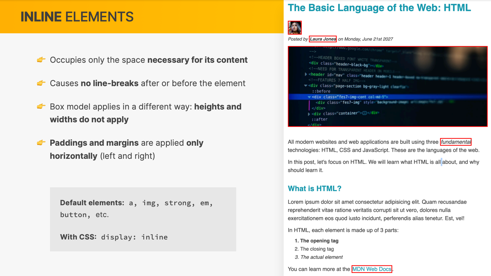
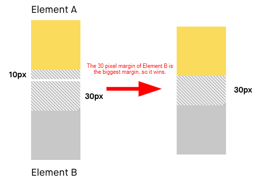
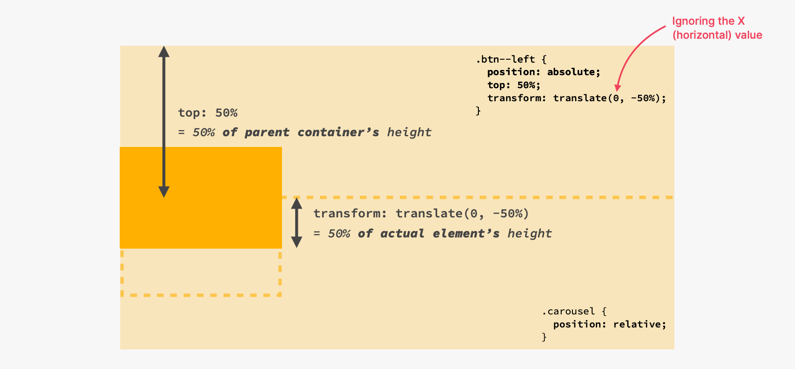
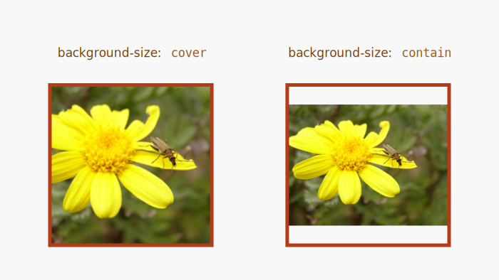
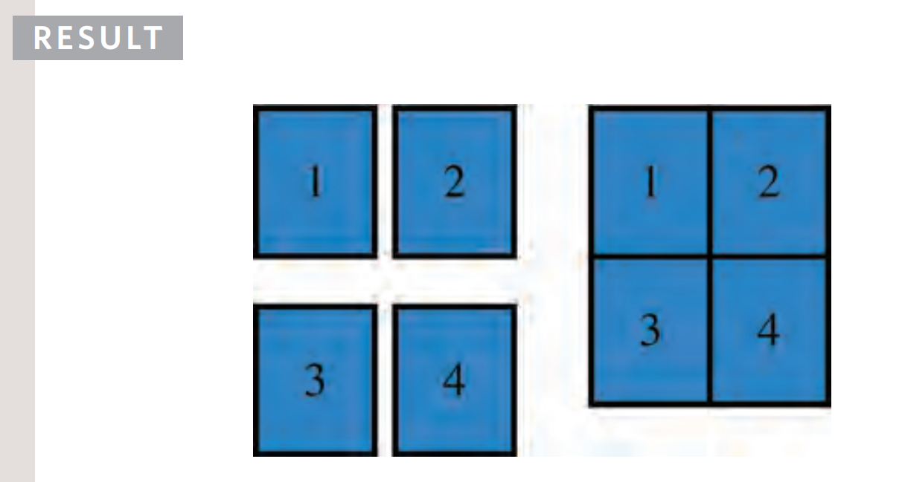
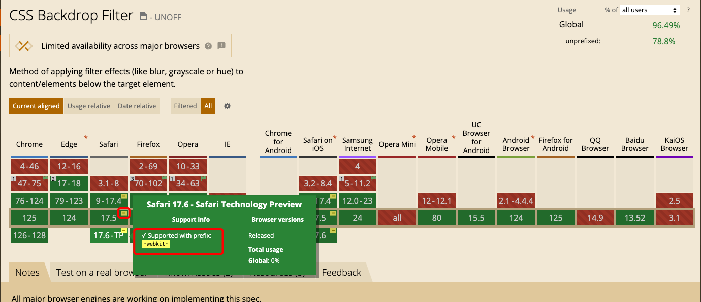

# INDEX

- [INDEX](#index)
  - [Cascading Style Sheets (CSS)](#cascading-style-sheets-css)
    - [Styling Types](#styling-types)
    - [Starter CSS Code (Global Reset / Normalize)](#starter-css-code-global-reset--normalize)
  - [How CSS works](#how-css-works)
    - [Visual Formatting Model](#visual-formatting-model)
  - [Selectors](#selectors)
    - [Selectors Types](#selectors-types)
      - [Combinators](#combinators)
      - [`[attribute]` Selector](#attribute-selector)
      - [Other selectors](#other-selectors)
    - [Pseudo Elements/Classes](#pseudo-elementsclasses)
      - [pseudo classes](#pseudo-classes)
      - [pseudo elements](#pseudo-elements)
    - [Selector specificity (Cascade)](#selector-specificity-cascade)
    - [Selectors Notes](#selectors-notes)
  - [Box Model](#box-model)
    - [Box Sizing (width \& height calculation)](#box-sizing-width--height-calculation)
    - [Padding](#padding)
    - [Border](#border)
    - [Outline](#outline)
    - [Types of boxes (Block vs Inline)](#types-of-boxes-block-vs-inline)
    - [Collapsing-Margins Problem](#collapsing-margins-problem)
    - [How to center an element](#how-to-center-an-element)
    - [Box model notes](#box-model-notes)
  - [Display \& Visibility](#display--visibility)
  - [Colors](#colors)
    - [HSL Colors](#hsl-colors)
    - [Color Notes](#color-notes)
  - [Font \& Text](#font--text)
    - [TypeFaces \& Font Families](#typefaces--font-families)
    - [Text Formatting](#text-formatting)
    - [Alignment](#alignment)
    - [Line \& Letter Spacing](#line--letter-spacing)
    - [Text-Wrap and Overflow](#text-wrap-and-overflow)
    - [Font Notes](#font-notes)
  - [Units](#units)
    - [Pixels](#pixels)
    - [Percentages](#percentages)
    - [Em \& Rem](#em--rem)
    - [Units Notes](#units-notes)
  - [Inheritance](#inheritance)
  - [Shadow](#shadow)
    - [box-shadow](#box-shadow)
    - [text-shadow](#text-shadow)
  - [images](#images)
    - [`object-fit` property](#object-fit-property)
    - [Transforming Images](#transforming-images)
    - [`background-` properties](#background--properties)
      - [`background-image` property](#background-image-property)
        - [Linear Gradient](#linear-gradient)
        - [`background-image` notes](#background-image-notes)
      - [`background-size` property](#background-size-property)
      - [`background-clip` property](#background-clip-property)
      - [`background-attachment` property](#background-attachment-property)
      - [`background` shorthand property](#background-shorthand-property)
    - [image filter](#image-filter)
    - [clip-path](#clip-path)
    - [Images Notes](#images-notes)
  - [Positioning \& Prospective](#positioning--prospective)
    - [`position` property](#position-property)
    - [`z-index`](#z-index)
  - [Calculations Built in Functions](#calculations-built-in-functions)
    - [`calc()`](#calc)
    - [`clamp()`](#clamp)
  - [icons - SVG](#icons---svg)
  - [data attributes](#data-attributes)
  - [Table](#table)
  - [Form](#form)
  - [Browser Support (CSS Vendor Prefixes)](#browser-support-css-vendor-prefixes)
  - [Scrolling](#scrolling)
    - [Scrolling using CSS](#scrolling-using-css)
    - [Scrolling using JavaScript](#scrolling-using-javascript)
  - [Modules (multiple style sheets)](#modules-multiple-style-sheets)
  - [Notes](#notes)

---

## Cascading Style Sheets (CSS)

**CSS** is a language that describes the visual style and layout of the content (HTML) in a web page.

- **CSS** stands the phrase **Cascading Style Sheets**.

  - **"Cascading"** Process of combining different stylesheets and resolving conflicts between different CSS rules and declarations by the browser, when more than one rule applies to a certain element.

    - means that a lower priority style can be overridden by a higher priority style -> [Specificity](#selector-specificity-cascade)
    - also the styles are applied in a specific order, so the last style will be applied **(chronological order)**

    > Great article about it [here](https://2019.wattenberger.com/blog/css-cascade)

  - **"Style"** is a set of rules that define how the content of an element should be displayed.
  - **"Sheets"** means that the rules are organized into groups called stylesheets.

- **CSS Rule**: It consists of `properties` and `values` that are applied to HTML elements (`selectors`) to style them.
  

---

### Styling Types

- You don't quite start with a blank canvas; HTML tags do include a few minimal styles. For example, here are the built-in styles for `<a>` tags, in Chrome 86:

  ```css
  a {
    color: -webkit-link;
    cursor: pointer;
    text-decoration: underline;
  }
  ```

  - These styles are part of the **user-agent stylesheet** that the browser applies to all web pages by default (each browser has its own default styles).

- But we can override these styles and add our own styles using CSS. and there are 3 ways to add styles to an HTML element:

  - **Inline style**

    - it's a style that is applied directly to the element using the `style` attribute.

      ```html
      <h1 style="color:red;"></h1>
      ```

    - It's a bad practice because:
      - it mixes the content with the style, and it's hard to maintain and update.
      - it only applies to the specific element, and it's not reusable for other elements.

  - **Internal style**

    - it's a style that is applied to the whole page using the `<style>` tag in the `<head>` section.

      

    - It's better than inline style because it's reusable for all elements in the page, but it's not reusable for other pages (other HTML files).

  - **External style**

    - it's a style that is applied to the whole page using an external CSS file.
      

      - `<Link>` tag is not a url link, it's a used for **linking** the HTML file to the CSS file.
      - `rel` attribute is used to specify the **relationship** between the HTML file and the linked file. if we didn't specify it, the browser will assume it's a stylesheet file.

- **Note**:
  - **inline style** has the highest priority, then **internal style**, then **external style**
    
  - when using 3rd party stylesheets, always put your own stylesheet after it, so it can override it.

---

### Starter CSS Code (Global Reset / Normalize)

in this repo, you will find source for [CSS Default Starter / Global Styles / Tools](https://github.com/john-smilga/default-starter)

> read the README.md file for instructions

---

## How CSS works

What happens when we load a page in the browser?


1. The browser receives the HTML file and starts to parse it:
   - When parsing the HTML file, it encounters a `<link>` tag with a `rel="stylesheet"` attribute, so it starts to download the CSS file
   - The browser continues parsing the HTML file and builds the **DOM** tree, in parallel with loading the CSS file.
2. Loading CSS file:
   - The browser parses the CSS file, and builds the **CSSOM** tree.
     - `CSSOM` is the CSS Object Model, which is very similar to the DOM tree, but for CSS.
     - it involves:
       - parsing the CSS file
       - figuring out which CSS rules apply to which elements
       - resolving conflicts
       - evaluating final values (`vm` -> `px`)
   - The `CSSOM` and `DOM` trees are combined into a **render tree**.
   - The render tree is used to compute the layout of each visible element and displays them on the screen.
3. Rendering the page:
   - The browser paints the pixels on the screen. **(Visual formatting model)**

---

### Visual Formatting Model

It's the process of turning the render tree into the actual pixels on the screen.

- CSS builds its sense of direction based on this system. It has a **block direction (vertical)**, and an **inline direction (horizontal)**.

  - Block direction is like lego blocks: they stack together one on top of the other.
  - Inline direction is like people standing **in-line**; they stand side by side, not one on top of the other.

  > Because not all languages are left-to-right, top-to-bottom, the browser by default uses block (vertical) and inline (horizontal) properties like `margin-block-start` instead of `margin-top`
  >
  > These alternatives are known as **logical properties**.
  >
  > You can learn more about different writing modes in this [wonderful article by Jen Simmons](https://24ways.org/2016/css-writing-modes/).

- It uses an algorithm called **Box Model** to determine the size and position of each box to be painted on the screen.
- To do that it takes into account factors like:
  - dimensions of the box -> `box-sizing`
  - box type -> `inline`, `block`, `inline-block`
  - positioning scheme -> `float`, `absolute`, `relative`
  - stacking context -> `z-index`
  - viewport size

---

## Selectors

Selectors are used to target the HTML elements that we want to style.

### Selectors Types

- There are many types of selectors in CSS, and they can be combined to create complex rules.

  - Based on the type:

    - element -> `p`,`div`,..
    - class -> `.class`
    - id -> `#id`
    - attribute -> `[attribute]`
    - universal -> `*`

  - Based on the relationship:

    - descendant -> `div p`
    - child -> `div > p`
    - adjacent sibling -> `div + p`
    - general sibling -> `div ~ p`

  - Based on the state or position:

    - `:hover`, `:active`, `:focus`, `:visited`, `:checked`, `:disabled`, `:enabled`, `:required`, `:optional`, `:valid`, `:invalid`, `:in-range`, `:out-of-range`, `:placeholder-shown`
    - `:first-child`, `:last-child`, `:nth-child(n)`, `:nth-last-child(n)`, `:nth-of-type(n)`, `:only-child`, `:only-of-type`

  - Based on the content (pseudo-elements):
    - `:empty`, `:not(selector)`, `:has()`, `:where()`, `:is()`

#### Combinators

**Combinators** are used to combine multiple selectors into a single rule. They are used to target elements based on their relationship with other elements.

- Descendant selector

  - selects all elements that are descendants of a specified element (no matter how deep they are nested in the DOM tree)
  - ex: `div p` -> selects all `<p>` elements inside `<div>` elements

- **Examples:**

  ```css
  /* Selects all elements with both name1 and name2 set within its class attribute */
  .name1.name2 {
    background-color: yellow;
  }

  /* Selects all <p> elements with class="intro" */
  p.intro {
    background-color: yellow;
  }

  /* Selects all <p> elements inside <div> elements (parent) even if there are other elements nested between them */
  div p {
    color: red;
  }

  /* Selects all <p> elements where <div> is a (direct parent) */
  div > p {
    background-color: yellow;
  }

  /* Selects the first <p> element that is placed immediately after <div> elements */
  div + p {
    background-color: yellow;
  }

  /* Selects every <ul> element that is preceded by a <p> element */
  p ~ ul {
    background-color: yellow;
  }
  ```

---

#### `[attribute]` Selector

- `[]` selector -> Matches a specific attribute (whatever its value)

  - ex: `p[class]`

    ```css
    input[type='email'] {
      background-color: yellow;
    }
    ```

- `[=]` selector -> Matches a specific attribute with a specific value
  - ex: `p[class="dog"]`
- `[~=]` selector -> Matches a specific attribute whose value appears in a space-separated list of words
  - ex: `p[class~="dog"]`
- `[*=]` selector -> Matches a specific attribute whose value contains a specific substring

  - ex: `p[attr*"do"]`

    ```css
    a[href*='wiki'] {
      color: red;
    }
    ```

- The `[attribute^=value]` selector matches every element whose attribute value **begins** with a specified value.

  ```css
  div[class^='test-'] {
    background: #ffff00;
  }

  a[href^='https'] {
    color: red;
  }

  /* this will match all links that start with # (anchor links) */
  a[href^='#'] {
    color: green;
  }

  a[href^='https']::before {
    content: '🔒';
  }
  ```

- `[$=]` selector -> Matches a specific attribute whose value **ends** with a specific string

  ```css
  a[href$='.org'] {
    color: red;
  }
  ```

---

#### Other selectors

- `:not(p)` => Selects every element that is not a `<p>` element
- `:nth-child(n)` => [nthmaster](http://nthmaster.com/)
- `owl selector` -> applies to the elements with is not the first one
  

---

### Pseudo Elements/Classes

They are used to style certain parts of an element or to style an element in a certain state, position, or relationship.

#### pseudo classes

Pseudo classes are used to apply styles to an element based on its current state or position.

- Some pseudo classes used with `<a>`, `<button>` elements:

  - `a:link` => `<a>` that are **unvisited** links with a **`href`** attribute
  - `a:visited` => `<a>` that has been clicked on
  - `a:hover` => `<a>` when we are **hovering**
  - `a:active` => `<a>` when we are **clicking**
  - `a:focus` => `<a>` when we are **tab focusing**

- root pseudo class `:root`

  - used to select the root element of the document (the `html` element)

    ```css
    :root {
      --main-color: red;
      font-size: 12px;
    }

    h1 {
      color: var(--main-color);
    }
    p {
      font-size: 1rem; /* 12px because of the root element */
    }
    ```

  - `rem` values will depend on values here
  - used for:
    - general styles
    - css variables

- pseudo classes for **Form elements**

  - `:checked` -> selects every checked `<input type="checkbox">` element
  - `:disabled`
  - `:enabled`
  - `:focus`
  - `:required`
  - `:optional`
  - `:valid`
  - `:invalid`
  - `:in-range`
  - `:out-of-range`
  - `:placeholder-shown`

- pseudo classes for **Child elements & Indexes**

  - `:first-child` -> for the first child of an element **(not the first of a type)**
  - `:last-child` -> for the last child of an element
  - `:nth-child(n)` -> for every `n`th child of an element
  - `:nth-last-child(n)` -> for every `n`th child of an element, counting from the last child
  - `:nth-of-type(n)` -> for every `n`th child of a type
  - `:only-child` -> for the only child of an element
  - `:only-of-type` -> for the only child of a type

- pseudo class that handles different **states of an element**

  - `:not(selector)` -> selects every element that is not a certain selector
  - `:empty` -> selects every element that has no children
  - `:target` -> selects the current active target element
  - `:has()` -> selects elements that have a specific descendant
  - `:where()` -> selects elements that match a list of selectors
  - `:is()` -> selects elements that match one of the selectors

---

#### pseudo elements

They're like [pseudo classes](#pseudo-classes) but they don't target a specific state, Instead, they target a specific part of an element (sub-elements), ex: `placeholder`, `first-letter`, ...

> They're called "pseudo **elements**" because they select and style elements that are not part of the DOM (haven't explicitly been created with HTML tags).

- They create element and insert it `before`/`after` content of an element without inserting it in the HTML.

  - You can create the same effect by creating a new element and styling it, but it's not recommended because it's not semantic and it's not accessible.

    ```html
    <div class="box">Hello</div>

    <style>
      .box::before {
        content: '🔥';
      }
    ```

    ```html
    <!-- Also works! ✅ -->
    <span class="pseudo-element"></span>
    <div class="box">Hello</div>

    <style>
      .pseudo-element {
        content: '🔥';
      }
    ```

- Note that they're not part of the DOM, so:
  - they can't be selected by JavaScript.
  - they aren't accessible by screen readers.
- When using it, we must provide a `content` property to it in order to work (even if it's empty string `""`)

  ```css
  div::before {
  content: "";
  width: 100%
  background-color: red;
  }
  /* or */
  div::before {
  content: "sfdsfsdfdsf";
  background-color: red;
  }

  /* This Won't Work ❌ */
  div::before {
  background-color: red;
  }
  ```

- they are inline elements, so you can convert them to `inline-block` to control padding
- you can't add **pseudo elements** like `::before` with `img` element (as it's a content by itself), instead use it on a `div` that contains the `img`
- when you have `pseudo element` like `::before` that has no content, you have 2 choices :

  - `width` / `height` in `px,rem`
  - `width` / `height` in `%` relative to the **parent element**

  - for this we use padding-top/bottom to simulate height
    

    ```css
    /* outer circle */
    .step-img-box::before {
      width: 60%;

      /* this mimics -> "height: 60%;" */
      padding-bottom: 60%;

      background-color: #fdf2e9;
      z-index: -2;
    }
    ```

- You can use `::before` and `::after` to write content after repeated elements like in **tables** or **lists**

  - like unit after the number -> **kg**, **meter**,...
  - like words before number -> **weight:**, **length:**,...

  ```css
  td:nth-of-type(3)::after {
    content: 'kg';
  }
  ```

- **Some usecases:**

  - adding quotes to `blockquote` element
  - Gradient borders

    - one way is to create a element with `::before` and `::after` and give them `width` and `height` bigger than the element and give them `background` with `gradient` color
      

      ```css
      .box {
        width: 200px;
        height: 200px;
        background-color: #fff;
        position: relative;
      }
      .box::before {
        content: '';
        position: absolute;
        width: 100%;
        height: 100%;
        top: 10px;
        left: 10px;
        background: linear-gradient(to right, #f00, #00f);
        z-index: -1;
      }
      ```

    - another way is to use `box-shadow` with `inset` and `blur-radius` to create gradient border

  - Animating buttons background
    

    ```css
    .btn::before {
      content: '';
      position: absolute;
      width: 100%;
      height: 100%;
      top: 0;
      left: 0;
      background: linear-gradient(to right, #f00, #00f);
      z-index: -1;
      transition: opacity 0.3s ease-in-out;
      opacity: 0;
    }

    .btn:hover::before {
      opacity: 1;
    }
    ```

  - Create custom form controls like toggle checkbox input element
    

---

### Selector specificity (Cascade)

If there are two or more CSS rules that point to the same element, the selector with the highest specificity value will "win", and its style declaration will be applied to that HTML element.


> or with the **"Last rule Principle"** where if multiple elements have the same selector specificity, then only the last selector's styles will be applied. So **the placement of the rule is important**

- **Calculation**
  

  - Start at `0`
  - add `100` for each ID value
  - add `10` for each class value (or pseudo-class or attribute selector)
  - add `1` for each element selector or pseudo-element.

- Example:
  

- It's similar to Javascript merging objects, where the last object will override the previous one.

  ```css
  p {
    font-weight: bold;
    color: hsl(0deg 0% 10%);
  }
  .introduction {
    color: violet;
  }
  ```

  ```js
  /* In order to calculate the final styles
  const appliedStyles = {
    ...inheritedStyles,
    ...tagStyles,
    ...classStyles,
    ...idStyles,
    ...inlineStyles,
    ...importantStyles
  };
  */

  const tagStyles = {
    fontWeight: 'bold',
    color: 'hsl(0deg 0% 10%)'
  };
  const classStyles = {
    color: 'violet'
  };
  const appliedStyles = {
    ...tagStyles,
    ...classStyles
  };
  ```

---

### Selectors Notes

- We shouldn't depend on element-selectors and nested selectors, instead, we should use classes and IDs to style elements.
  - This is because it's easier to maintain and update the styles later on without affecting other elements and the HTML structure.
- `id` should be used for **unique** elements, and `class` for **reusable** elements.
  - In the real world, we usually don't use `id` for styling, instead, we use `class` for everything (to be more flexible and reusable).
  - if you have an `id` that is used twice, **the styles will be applied to all elements with the same `id`**. but it's not recommended to use the same `id` for multiple elements ❌.
- Universal selector (**`*`**) has **no specificity** and gets **0 points** (least specificity so it's like a fallback or when overriding default styles).
- You can apply the same rule to multiple selectors by separating them with a comma.

  ```css
  h1,
  h2,
  h3 {
    color: red;
  }
  ```

- `!important` gets a specificity score of **10,000 points**. This is the highest specificity that one individual item can get.
  

  - if 2 rules have `!important`, then the last one will be applied

- Specificity in CSS only concerns selectors, not their associated declarations. **!important** applies to a declaration, so it alone plays no role in specificity.
- more info & examples here [css-specificity](https://www.webfx.com/blog/web-design/css-specificity/)

---

## Box Model

The **CSS Box Model** is a set of rules that describe how elements on a web page are rendered and sized by the browser.

- It makes each element in the HTML document a rectangular box that consists of the following parts: (**content**, **padding**, **border**, and **margin**).

  

---

### Box Sizing (width & height calculation)

- The default behavior of calculating the `width` and `height` of an element is to include the content, padding, and border, but not the margin. This is called `content-box` (default value)
  
- To include the padding and border in the `width` and `height` of an element, you can use the `box-sizing` property with the value `border-box`.

  ```css
  div {
    box-sizing: border-box;
  }
  ```

  

  - The old way has `box-sizing: content-box;` as the default value, but now the default value is `box-sizing: border-box;` in most modern browsers.
  - In order to add it in the reset CSS **(Global Styles)**, you can use:

    ```css
    *,
    *::before,
    *::after {
      box-sizing: border-box;
    }

    /* Don't use it on the body because it won't be inherited, Instead use it on the ":root" or "*" */
    ```

- Box model questions:
  
  

---

### Padding

It's the inner space between the content and the border of an element.

- Padding can be set for all directions at once, or it can be specified for individual directions:

  ```css
  .even-padding {
    padding: 20px;
  }
  .asymmetric-padding {
    padding-top: 20px;
    padding-bottom: 40px;
    padding-left: 60px;
    padding-right: 80px;
  }
  /* The same thing, but using ✨ logical properties ✨ */
  .asymmetric-logical-padding {
    padding-block-start: 20px;
    padding-block-end: 40px;
    padding-inline-start: 60px;
    padding-inline-end: 80px;
  }
  ```

- The `padding` shorthand property has a couple tricks up its sleeve. It can be used to set asymmetric padding, in a few different ways.

  ```css
  .two-way-padding {
    /* top/bottom = 10px, right/left = 20px */
    padding: 15px 30px;
  }

  .asymmetric-padding {
    /* top = 10px, right = 20px, bottom = 30px, left = 40px */
    padding: 10px 20px 30px 40px;
  }

  .three-way-padding {
    /* top = 10px, right/left = 20px, bottom = 30px */
    padding: 10px 20px 30px;
  }
  ```

  - This pattern is shared amongst other CSS properties that have shorthand values. like `margin`, `border`, `outline`, `background`, `font`, `list-style`, `animation`, `transition`, `grid`, `flex`

---

### Border

It's the line that surrounds the content and padding of an element.

---

### Outline

- **outline** is outside of the border (and it may overlap with other elements)
  
- **outline vs border**:

  - `border` is part of the box-model and `outline` is not
    - this means that `border` takes space of the element size and `outline` doesn't
    - you can think of it as if the `outline` is like a `box-shadow` as it doesn't affect the page-layout at all
  - there is no specified positions for `outline` -> `outline-left` is invalid
  - there's no radius for the `outline`, so with them, we can't have round corners
  - `outline` can have offset which allows us to move the outline (outside or inside)

    

    ```css
    div {
      outline: 2px solid #fff;
      outline-offset: -5px;
    }
    ```

- **Notes:**
  - `outline` is an animated property
  - Please don't add `outline: none;` to get rid of the default outline on focus, instead, style it to match your design (to make it accessible for keyboard users)

---

### Types of boxes (Block vs Inline)

- **Block-level elements**:
  

  - can have `margins`, `padding`, and `borders` ✅

- **Inline elements**:
  

  - can have `margins`, `padding`, and `borders` **only** for (right/left) and doesn't respect `top`/`bottom` margin & padding, and they also don't respect `width`/`height`
    - To make them respect `width`/`height` -> use `display: inline-block;`

- **Inline-block elements**:
  
  - it's a mix between `block` and `inline` elements
  - it looks like an `inline` element but behaves like a `block` element
  - can have `margins`, `padding`, and `borders` ✅

---

### Collapsing-Margins Problem

It's a common issue in CSS when two **vertical margins** are touching each other, they will collapse (combine) into a single margin.

- Here, only one of them will be visible to the page which is the larger one and **not** their sum
  

  - This doesn't happen with horizontal margins
  - this is not the same for **padding** as they get added together
    - **So, between sections use padding not margin**

- **Border collapse** : sets whether table borders should collapse into a single border or be separated as in standard HTML => `border-collapse: separate;` 

---

### How to center an element

To center an element vertically and horizontally in a container, we have these options:

1. Using `margin: auto`:

   ```css
   .container {
     width: 700px;
     margin: 0 auto;
   }
   /* This will center the container horizontally on the page */
   ```

2. using `flexbox`:

   ```css
   .container {
     display: flex;
     justify-content: center;
     align-items: center;
   }
   ```

3. using `position: absolute`:

   ```css
   .container {
     position: relative;
   }
   .element {
     width: 100px;
     height: 100px;
     position: absolute;
     top: 50%;
     left: 50%;
     transform: translate(-50%, -50%);

     /* or (NOT RECOMMENDED ❌) */
     top: calc(50% - 50px); /* 50px is half of the element height */
     left: calc(50% - 50px); /* 50px is half of the element width */
   }
   ```

   
   

4. using `grid`:

   - center a container:

     ```css
     .container {
       display: grid;
       place-items: center;
     }
     ```

   - center a grid-item inside its cell:
     

     ```css
     .grid-item {
       place-self: center;
     }
     ```

---

### Box model notes

- Many developers believe that `pixels` are bad for accessibility. This is true when it comes to `font-size`, but pixels can be the best unit to use for `padding` (and other box model properties like `margin`/`border`) because they're fixed and don't change with the user's settings.

  - Properly, we don't want our `padding` / `margin` to scale with the `font-size` of the element, so we use `px` for them.
    
    

- By default, elements have initial values for `margin` & `padding`, So at the beginning, we should reset them to `0` to avoid any unexpected behavior.

  ```css
  * {
    margin: 0;
    padding: 0;
  }

  /* This won't work ❌ because `margin` and `padding` are not inherited */
  body {
    margin: 0;
    padding: 0;
  }
  ```

- `margin` can be negative as it's related to the surrounding elements and not the element itself
- `margin: auto` trick to center an element horizontally

  - 

- `height: auto` -> the height of the element will take the remaining height of the parent element.
- When you want to use the `margin` shorthand for all directions, we used to always specify horizontal & vertical spacing, now there're new css-properties called `margin-inline` and `margin-block`

  - it helps if you only want to specify spacing for one direction only instead of making the other direction equals `zero`
    

    ```css
    /* OLD ❌ */
    margin: 0 20px;
    /* NEW ✅ */
    margin-inline: 20px;

    /* OLD ❌ */
    margin: 20px 0;
    /* NEW ✅ */
    margin-block: 20px;
    ```

- You can overwrite values of the `box-model` properties for specific elements like this:

  ```css
  /* ✅ */
  .box {
    padding: 48px;
    padding-bottom: 0;
  }

  /*
    ❌ because `padding-bottom` comes first,
    it will be overwritten by the shorthand.
  */
  .box {
    padding-bottom: 0;
    padding: 48px;
  }
  ```

> **THE VISUAL FORMATTING MODEL**: Algorithm that calculates boxes and determines the layout of theses boxes, for each element in the render tree, in order to determine the final layout of the page.

---

## Display & Visibility

| Display                                                                         | Visibility                                                                     |
| ------------------------------------------------------------------------------- | ------------------------------------------------------------------------------ |
| It specifies the display behavior of an element.                                | It specifies whether an element is visible or hidden.                          |
| It's a CSS property that defines the type of box used for an HTML element.      | It's a CSS property that determines whether an element is visible or hidden.   |
| It can have values like `block`, `inline`, `inline-block`, `flex`, `grid`, etc. | It can have values like `visible`, `hidden`, `collapse`, `initial`, `inherit`. |

- `visibility:hidden` => hide the element but reserves it's place (leaves a space where the element would have been)
- `display: none` => remove element from the flow, hide element and collapse its space

  - _note_ => it doesn't work for `animation/transition` (for Javascript usually), instead use (`opacity` or `visibility`):

    ```css
    /* ALL THESE FOR mimicking [display:none;] */

    /* 1) Hide it visually and preserve the space */
    opacity: 0;

    /* 2) Make it unaccessible to mouse and keyboard */
    pointer-events: none;

    /* 3) Hide it from screen readers */
    visibility: hidden;
    /* or */
    opacity: 0;
    ```

- `display: block` --> can be used to make `<a>` element take full width of its container -> for user clicking accessibility
- **inline-block**: `display: inline-block` --> causes a block-level element to flow like an inline element, while retaining other features of a block-level element.
  - doesn't start a new line (like inline element)
  - respects `margin`, `width`, `height` (like block element)

---

## Colors


- **Color** is a combination of **hue**, **saturation**, and **lightness** (`HSL` is a color model that describes color as a combination of hue, saturation, and lightness values)
  

  - **Hue** is the color itself (0-360) degrees
  - **Saturation** is the intensity of the color (0-100%)
  - **Lightness** is the amount of white or black in the color (0-100%)

- There're many ways to represent colors (most common is **RGB Model**)

  

- **Defining colors in CSS**
  
  - in **RGBA**, `alpha` channel: Defines the opacity as a number between `0.0` (fully transparent) and `1.0` (fully opaque)

---

### HSL Colors

It's a way to specify colors using **hue**, **saturation**, and **lightness** values.


```css
body {
  background-color: hsl(0, 0%, 78%);
}

p {
  /* hsla color property adds a fourth value which represents transparency (a for alpha). */
  background-color: hsla(0, 100%, 100%, 0.5);
}
```

---

### Color Notes

- It's a good practice to define colors in a separate file or at the top of the CSS file to make it easier to change them later.

  ```css
  :root {
    --main-color: #087f5b; /* Main color */
    --secondary-color: #343a40; /* accent color */
    --light-color: #f8f9fa; /* light color */
  }
  ```

---

## Font & Text

### TypeFaces & Font Families

> When choosing a typeface, it is important to understand that a browser will usually only display it if it's installed on that user's computer or if it is available on the web.

- Browsers are supposed to support at least one typeface from each of the groups above which is called a **"font-stack / generic-family"**. For this reason, it is common to add the generic font name after your preferred choice of typefaces (in case the preferred typeface is not available or fails to load).

  ```css
  font-family: Georgia, Times, serif;
  /* Here, "Georgia" is the preferred typeface, "Times" is the backup, and "serif" is the generic font family. */
  ```

- `@font-face`

  - It allows you to use a font, even if it is not installed on the computer of the person browsing, by allowing you to specify a path to a copy of the font, which will be downloaded if it is not on the user's machine.

    ```css
    /* Declaring a custom font */
    @font-face {
      font-family: 'ChunkFiveRegular';
      src: url('fonts/chunkfive.eot');
    }

    h1,
    h2 {
      /* Using the custom font */
      font-family: ChunkFiveRegular, Georgia, serif;
    }
    ```

  - Google also provides open source fonts. Rather than adding the `@font-face` rule to your own style sheet, you link to a CSS file and font files on their servers

    - in the HTML `head`:

      ```html
      <link rel="stylesheet" href="https://fonts.googleapis.com/css?family=Roboto" />
      ```

    - in the CSS file:

      ```css
      @import url('https://fonts.googleapis.com/css?family=Roboto');
      ```

- when importing font-faces from a link, we have 2 methods:

  1. put the `<link>` code in the HTML `head` before the styles files
     - This is faster because the browser will download the font file before the CSS file
  2. use `@import url()`, **but it needs to be the first thing in your css file/s** to work correctly

     - This is useful when you want to use the same css file for multiple projects and you want to keep the font import in the same file

---

### Text Formatting

- font properties:

  - `font-weight`: specifies the boldness of the font
    - normal -> `400`
    - bold -> `700`
  - `font-style`: specifies the style of the font
  - `font-variant`: specifies whether or not a text should be displayed in a small-caps font
  - `font`: shorthand property for the font-style, font-variant, font-weight, font-size, line-height, and font-family properties

- `text-transform` property:

  - It is used to change the case of the text.
  - It can have the following values:

    - `uppercase` -> transforms the text to uppercase
    - `lowercase` -> transforms the text to lowercase
    - `capitalize` -> transforms the first character of each word to uppercase
    - `none` -> no transformation

    ```css
    p {
      text-transform: uppercase;
    }
    ```

- `text-decoration` property:

  - It is used to specify the decoration added to text.
  - It can have the following values:

    - `none` -> no decoration
    - `underline` -> underlines the text
    - `overline` -> overlines the text
    - `line-through` -> draws a line through the text
    - `blink` -> makes the text blink

    ```css
    p {
      /*               line   line-style  line-color */
      text-decoration: underline wavy red;

      /* or just */
      text-decoration: underline;
    }
    ```

    - Instead of using the shorthand `text-decoration`, you can use the following properties:

      ```css
      span {
        /* same as text-decoration but with more options */
        text-decoration-line: underline;
        text-decoration-style: wavy;
        text-decoration-color: red;
      }
      ```

- `text-shadow` property -> [text-shadow](#text-shadow)

---

### Alignment

- to indent text, use `text-indent`

  ```css
  div {
    text-align: left;
    text-indent: 6rem;
  }
  ```

- `text-align`:

  - It is used to specify the horizontal alignment of text.
  - It can have the following values:

    - `left` -> aligns the text to the left
    - `right` -> aligns the text to the right
    - `center` -> aligns the text to the center
    - `justify` -> aligns the text to both the left and right margins, adding extra space between words as necessary
    - `start` -> aligns the text to the start of the line (useful for languages that are read from right to left)
    - `end` -> aligns the text to the end of the line (useful for languages that are read from right to left)

    ```css
    p {
      text-align: center;
    }
    ```

    - For languages that are read from right to left (like Arabic), the `left` value will align the text to the right, and the `right` value will align the text to the left.

      ```css
      body {
        direction: rtl;
      }
      ```

- `vertical-align`:

  - is a common source of confusion. It is not intended to allow you to vertically align text in the middle of block level elements such as `<p>` and `<div>,` **although** it does have this effect when used with **table cells** (the `<td>` and `<th>` elements).
  - It is more commonly used with inline elements such as `,` `<em>,` or `<strong>` elements. When used with these elements, it performs a task very similar to the HTML align attribute used on the `` element

    ```css
    img {
      vertical-align: middle;
    }
    ```

---

### Line & Letter Spacing

- `line-height`

  - It's a term to control "Leading" (pronounced "ledding")
  - it is a term typographers use for the **vertical space between lines of text**, and doesn't affect the `font-size`
    
  - if we didn't use a unit then it's relevant to the current **font size**

    ```css
    p {
      font-size: 20px;
      line-height: 1.5; /* 30px */
    }
    ```

  - ⚠️ It's acts differently with `JSX` (React)

- `letter/word-spacing`

  - **"Kerning"** is the term typographers use for the space between each letter. You can control the space between each letter with the letter-spacing property.
    
  - When you specify a value for these properties, it should be given in `em`

    ```css
    p {
      letter-spacing: 0.1em;
      word-spacing: 0.2em;
    }
    ```

  - The default gap between words is set by the typeface around `0.25em`
  - We can use negative values to make the letters overlap

    ```css
    p {
      letter-spacing: -0.1em;
    }
    ```

---

### Text-Wrap and Overflow

When text overflows the container, you can control how it behaves using the `overflow` property or by controlling how it wraps when it reaches the end of the container.

- `overflow` property:
  

  - `visible` -> the text will overflow the container
  - `hidden` -> the text will be hidden
  - `scroll` -> the text will be hidden but a scrollbar will appear
  - `auto` -> the text will be hidden but a scrollbar will appear only if needed

- `text-overflow` property:
  

  - `clip` -> the text will be clipped
  - `ellipsis` -> the text will be clipped and an ellipsis will be shown to indicate that there is more text

- `text-wrap` property:
  - `normal` -> the text will wrap to the next line
  - `nowrap` -> the text will not wrap to the next line
  - `pre` -> the text will wrap to the next line but will respect the line breaks in the text
  - `pre-wrap` -> the text will wrap to the next line and will respect the line breaks in the text
  - `pre-line` -> the text will wrap to the next line and will respect the line breaks in the text but will collapse multiple spaces into one

---

### Font Notes

- You can use the shorthand `font` property to set all the font properties at once.

  ```css
  p {
    /* font-style font-variant font-weight font-size/line-height font-family */
    font: italic bold 20px/30px Georgia, serif;
  }
  ```

- `white-space: no wrap` => this forces it to automatically go to next line when reaching `max-width`
- `text-overflow:ellipsis` => when text passes the `max-width`, it shows this `...`at the `max-width` limit as indication of more text available

- **Viewport Units**: They create layouts that depend on the screen size

  - values from 0 to 100
  - `vh`: height (percent of the screen)
  - `vw`: width (percent of the screen)
  - To get the rest of screen's width/height, you can use the [calc()](#calc)

    ```css
    .banner {
      height: calc(100vh -100px);
    }
    ```

- For more fun font use => [Rubik](https://fonts.google.com/specimen/Rubik)
- For font-size scales -> [type-scale.com](https://type-scale.com/)
- If you're getting your fonts from a service like [https://fonts.google.com](https://fonts.google.com), note that there may be some tracking of **IP-Addresses** of the users when the `HTML` page is downloaded in the browser
  - to avoid this, you can download the font files locally and refer to it in the `HTML` file
  - more info [here](https://blog.runcloud.io/google-fonts-gdpr/)
- to make text `uppercase / lowercase / capitalize`, you can use `text-transform` property

---

## Units

The most popular unit for anything size-related is the pixel (`px`), but there are other units that can be used in CSS.


---

### Pixels

- Setting font size in **pixels** is the best way to ensure that the type appears at the size you intended (because percentages and ems are more likely to vary if a user has changed the default size of text in their browser).

- Pixels are nice because they correspond more-or-less with what you see on the screen. It's a unit that many developers get comfortable with.

- Problem with pixels is that they don't scale well with the user's preferences (if the user changes the default font size in the browser settings, the pixel size won't change) -> **Bad for Accessibility**

---

### Percentages

The `percentage %` unit is often used with width/height, as a way to consume a portion of the available space.

- It's relative to the parent element's size (width/height)

  ```css
  div {
    width: 50%;
  }
  ```

---

### Em & Rem

| `em`                                                                                        | `rem`                                                                        |
| ------------------------------------------------------------------------------------------- | ---------------------------------------------------------------------------- |
| relative to the **font-size** of the element itself (current element)                       | relative to the **font-size** of the root element (`html`)                   |
| if used in the `font-size` property, it's relative to the **parent font-size**              | if used in the `font-size` property, it's relative to the **root font-size** |
| if used in the `length` property, it's relative to the **current font-size within element** | if used in the `length` property, it's relative to the **root font-size**    |


- `em` is not generally recommended for `font-size` ❌ because it can lead to **compounding** of font sizes (if you have nested elements with `em` font sizes, the font size will compound and get larger and larger as you nest more elements)

  ```css
  html {
    font-size: 10px; /* 1rem = 10px */
  }

  body {
    font-size: 1.6rem; /* 16px */
  }

  h1 {
    font-size: 2.4rem; /* 24px */
  }

  p {
    font-size: 1.4rem; /* 14px */
  }
  ```

- `rem` (more recommended ✅) ->
  - It's relative to the (`root` / `html`) element's `font-size`
  - It's used to avoid the **compounding effect** of `em` units
    - It behaves consistently and predictably, like `pixels`, but it respects user preferences when it comes to increasing/decreasing default font sizes.
  - It's easier to manage & maintain as we can refactor the whole design by changing the `font-size` of the `html` element only

---

### Units Notes

- we shouldn't use **Pixels** for font-sizes as if user changed his browser **base font-size** (the default is 16px), then it won't reflect on the page. Instead we use a relative unit that can scale up/down like: `rem` or `em`
- You shouldn't actually set a `px` font size on the `html` tag

  - This will override a user's chosen default font size in their browser settings which will affect using `rem` units
  - Instead use **percentage** instead of `px`

    ```css
    html {
      font-size: 100%;
      /* or */
      font-size: 62.5%; /* Now -> 1rem = 10px */
    }
    ```

- Fun fact: when selecting the `html` tag, `em` and `rem` are the same because they're both relative to the `html` tag
- There are other units like:
  - `vw` and `vh` -> relative to the viewport size
  - `pt` -> point (1/72 of an inch)
  - `in` -> inch (for **print** styles)

---

## Inheritance

**Inheritance** is a key concept in CSS that allows styles to be passed from parent elements to their children (descendants).

- Inheritance is only applied if no style is defined for the element itself.
- Not all properties are inherited, only some properties that inherit are **typography-related** (like `color`, `font-family`, `font-size`, other text properties).
- Example:

  ```css
  body {
    color: #444444;
  }

  p {
    /* p will inherit the color from the body */
  }
  ```

  

- You can think of it like JavaScript's **prototype chain** where the child element inherits the properties from the parent element.

  ```js
  class Main {
    color = 'black';
  }
  class Paragraph extends Main {
    backgroundColor = 'red';
    color = 'blue';
  }
  class Span extends Paragraph {}
  const s = new Span();
  console.log(s.color); // blue
  ```

  ```html
  <main style="color: black;">
    <p style="color: blue;">
      Hello
      <span>World</span>
      <!-- will inherit the color from the p -->
    </p>
  </main>
  ```

- How inheritance works
  

- Notes:

  - styles applied to the `body` element will be inherited by all other elements in the document. if you want to select all elements, **(without inheritance)**, you can use the `*` selector.

    - It has the lowest specificity, so it's easy to override and like a fallback or when overriding default styles.

  - In order to **force inheritance**, you can use the `inherit` keyword to inherit the value from the parent element (Not recommended)

    ```css
    p {
      border: inherit;
    }
    ```

---

## Shadow

- To add shadows to elements, you can use the `box-shadow` property.
- To add shadows to text, you can use the `text-shadow` property.

### box-shadow


The first value is the horizontal offset, the second value is the vertical offset, the third value is the blur radius, and the fourth value is the color of the shadow.

```css
div {
  /*           x-offset  y-offset  blur-radius  color */
  box-shadow: 10px 10px 5px rgba(0, 0, 0, 0.1);
}
```

- `x-offset`: means in x-direction (horizontal)
- `y-offset`: means in y-direction (vertical)
- `blur-radius`: strength of blueness **(Optional)**
  - If omitted, the shadow is a solid line like a border
- `spread-radius`: expand or grow the radius of the shadow in all directions **(Optional)**
- `color`: the color of box-shadow **(Optional)**
- `inset` to add border from the inside and not outside **(Optional)** => ex:

  ```css
  box-shadow: inset 0 0 0 3px ##7cc0e7;
  ```

  

- sometimes it's used instead of border, as it doesn't affect the size of the element and doesn't cause shifting of other elements

  ```css
  .btn:hover {
    box-shadow: 0 2px green;
  }
  ```

---

### text-shadow


- Example:

  ```css
  .myClass {
    /*           x   y  blur-radius  color */
    text-shadow: 1px 1px 0px #ff0000;
  }
  ```

- you can add multiple text-shadows to the same element by separating them with a comma `","`

  ```css
  .myClass {
    text-shadow: 1px 1px 0px #ff0000, 2px 2px 0px #0000ff;
  }
  ```

> To generate text-shadow -> [Here](https://html-css-js.com/css/generator/text-shadow/)

---

## images

### `object-fit` property

It is used to specify how an `` or `<video>` should be resized to fit its container **(specially when the image is bigger than the container or when resizing the browser window)**

- This property tells the content to fill the container in a variety of ways; such as "preserve that aspect ratio" or "stretch up and take up as much space as possible".
  
- we use it to use images with specified `width`&`height` without distorting them

  ```css
  img {
    width: 200px;
    height: 300px;
    object-fit: cover;
  }
  ```

---

### Transforming Images

- `transform` property is used to **rotate**, **scale**, **skew**, or **translate** an element.

- `scale` -> to resize the image

  ```css
  img {
    transform: scale(1.5);
  }
  ```

  - Trick to make the image **zoomed-in** when hovering over it

    ```css
    img {
      transition: transform 0.5s;
    }

    img:hover {
      transform: scale(1.5);
    }

    .img-container {
      overflow: hidden; /* To hide the overflowed part which gives the zoom effect */
    }
    ```

---

### `background-` properties

#### `background-image` property

- **background-repeat**

  - By default, as the element gets bigger, if the background-image is not big enough, it will **repeat** to fill the entire element(box). to control that, you can use `background-repeat` property

    ```css
    body {
      background-image: url('images/header.gif');
      background-repeat: repeat-x;
      /* or: The image is only shown once.
      background-repeat: no-repeat;
      */
    }
    ```

  
  

- **background-position**

  - When an image is not being repeated, It's likely that the image is bigger than the element, so we can control the position of the image inside the element using `background-position` property
    
  - you can use the `background-position` property to specify where in the browser window the background image should be placed.

    

  - This property usually has a pair of values. The first represents the horizontal position and the second represents the vertical. -> ex:

    - `[top,bottom, left, right, center]`
    - length values from the top-left `20% 70%;`
    - absolute length values `1rem 2rem`

    ```css
    body {
      background-image: url('images/tulip.gif');
      background-repeat: no-repeat;
      background-position: 50% 0%;
      /* or */
      background-position: center top;
    }
    ```

    - > Note: If you only specify one value, the second value will default to **center**.

- **background-attachment**

  - the `background-attachment` property specifies whether a background image should stay in one position or move as the user scrolls up and down the page. It can have one of two values:
  - Values:
    - `fixed`
    - `scroll`

---

##### Linear Gradient

- we have the ability to specify a **gradient** for the background of a box. The gradient is created using the `background-image` property:

  - to add **overlay gradient** with one color, you make the linear-gradient with the same value for the 2 gradient colors

  ```css
  div {
    /* background image (with darkening-overlay) */
    background-image: linear-gradient(rgba(34, 34, 34, 0.6), rgba(34, 34, 34, 0.6)), url(hero.jpg);
    /* here, linear-gradient needs to be in rgba() form to show the image */
  }
  ```

  - Here, the linear-gradient is on top of the background-image, which gives an overlay look.

- **RECOMMENDED:** you can generate gradients from here [cssgradient.io](https://cssgradient.io/)
- There's also `radial-gradient` which is a gradient from the center to the outside

---

##### `background-image` notes

- when you have an empty div that have a `background-image` and want to make it available for screen readers for **SEO** -> add these attributes: [`role`, `aria-label`], ex:

  ```html
  <div class="cta-img-box" role="img" aria-label="Woman enjoying food ></div>
  ```

---

#### `background-size` property

- `background-size` property :
  

- `contain` : Scale the image, while preserving its intrinsic aspect ratio (if any), to the largest size such that both its width and its height can fit inside the background positioning area.
- `cover` : Scale the image, while preserving its intrinsic aspect ratio (if any), to the smallest size such that both its width and its height can completely cover the background positioning area.

---

#### `background-clip` property

It specifies the painting area of the background of an element. meaning that it specifies the area where the background image or color is painted.

- Ex: making the background image extend under the border or not

  ```css
  div {
    background-image: url('img_flwr.gif');
    background-repeat: no-repeat;
    background-position: right top;
    background-attachment: fixed;
    background-clip: content-box;
  }
  ```

  

---

#### `background-attachment` property

It specifies whether the background image should scroll or be fixed (will not scroll with the rest of the page)

```css
body {
  background-image: url('img_tree.png');
  background-repeat: no-repeat;
  background-position: right top;
  background-attachment: fixed;
  /* or */
  /* background-attachment: scroll; */
}
```

---

#### `background` shorthand property

The `background` property acts like a **shorthand** for all of the other background properties you have just seen, and also the background-color property


```css
body {
  background: url('images/tulip.gif');
  /* or with other options & values */
  background: #ffffff url('images/tulip.gif') no-repeat top right;
}
```

---

### image filter

The `filter` property in CSS is used to apply visual effects to an element. It can be used to adjust the color, contrast, brightness, and more.


- change color of image from `filter` property

  - make image color **black** => `filter: brightness(0);`
  - make image color **grey** =>

    ```css
    img {
      filter: grayscale(100%);
    }
    /* or */
    img {
      filter: brightness(0.5);
    }
    /* or */
    img {
      filter: contrast(0.5) brightness(0.5) saturate(0.5);
    }
    ```

  - also you can try `filter: greyscale/blur/invert`

---

### clip-path

- `clip-path` tool => [clippy](https://bennettfeely.com/clippy/)
  

- Note that a similar result can be done using pseudo elements `::before` & `::after`
  

  ```css
  .box::before {
    content: '';
    position: absolute;
    width: 100%;
    height: 100%;
    top: 0;
    left: 0;
    background: linear-gradient(to right, #f00, #00f);
    z-index: -1;
    transform: skewY(-5deg);
    transform-origin: top left;
  }
  ```

  - if done in a bigger scope like sections backgrounds, look at colt steel's **"Swipe"** project.

---

### Images Notes

- `img` is an **inline element**, so:
  - it's effected by `text-align`, so you can center it using this, unlike **block elements** where it just center the text inside the element
  - it will have a spacing at the bottom, so you can remove it by setting `display: inline-block`
    
- if you have an empty space between the image and the bottom-border, make the img has the `display: block;` property
  - you can also make sure that you're using `box-sizing: border-box;`
- In order to change color or `svg` image color, you can use `stroke` and `fill` properties

  ```css
  svg {
    fill: red;
  }
  ```

---

## Positioning & Prospective

### `position` property

In CSS, the `position` property is used to control the layout of an element. It has 5 possible values: (`static`, `relative`, `absolute`, `fixed`, `sticky`)


- `static` is the **default value**
- `relative` moves an element in relation to where it would have been in normal flow (relative to its current position).
  - its space is still reserved in the normal flow
- `absolute` relative to nearest parent element with `relative` positioning until we reach the `<body>` element
  
  
- `fixed` relative to **viewport(screen)**, and stays as we're scrolling
- `sticky` toggles between `relative` and `fixed` once the `position` value is met in the viewport, then it sticks

  ```css
  .nav {
    position: sticky;
    top: 0; /* once it reaches the top=0 with the viewport, then it will stick  */
  }
  ```

- when using `absolute` position with `inset: 0`, it makes the element expand to fill the height and width of the closest parent with a **non-static position**

  - **inset**: The inset property in CSS is a shorthand for the four inset properties, `top`, `right`, `bottom` and `left` in one declaration. Just like the four individual properties themselves, inset has no effect on non-positioned (static) elements. In other words, an element must declare an explicit position value before inset properties can take effect.

- **stacking context** --> `z-index` : as if the blocks have been stacked on top of each other on a z axis

---

### `z-index`

It specifies the elevation of an element relative to other elements on the page.


- by default, it's equal to `0`
- if multiple elements have the same `z-index`, then the last one is higher than the others and so on.
  
- it doesn't work on elements with a `position: static;`
- you can't hover on something that have a negative `z-index`

---

## Calculations Built in Functions

### `calc()`

Gives us the ability to do math in css, usually used with `width` and `height` properties

- compatible with `length`, `frequency`, `angle`, `time`, `number` and `integer`
- commonly used with percentages `%` and `vw` units
- make sure there's a space between the operators inside calc

- **Advantages**

  - can mix different units when performing calculations (not possible in `Sass`)

    ```css
    .thing {
      width: 60%; /* fallback if needed */
      width: calc(100% - 3em);
    }
    ```

  - make math easier to understand

    ```css
    /* instead of this*/
    .column-1-7 {
      width: 14.2857%;
    }

    /* we can do this*/
    .column-1-7 {
      width: calc(100% / 7);
    }
    ```

---

### `clamp()`

The `clamp()` CSS function clamps a middle value within a range of values between a defined minimum bound and a maximum bound. The function takes three parameters: a `minimum value`, a `preferred value`, and a `maximum allowed value`.


```css
font-size: clamp(1rem, 2.5vw, 2rem);
```

---

## icons - SVG

- [Hero Icons](https://heroicons.com/) here we use `stroke` or `fill` properties **not** color
- [Ionicons](https://ionic.io/ionicons) here we use `color` property

---

## data attributes

**data attributes** are plain HTML attributes, you can access them from CSS.

- For example to show the parent data on the article you can use generated content in CSS with the `attr()` function:

- HTML :

  ```html
  <article id="electric-cars" data-columns="3" data-index-number="12314" data-parent="cars">
    ...
  </article>
  ```

- CSS

  ```css
  article::before {
    /* use value from data-attribute */
    content: attr(data-parent);
  }

  /* select element based on data-attribute */
  article[data-columns='3'] {
    width: 400px;
  }
  ```

> note: you can't set value of data attribute to **false** (in HTML or Javascript), instead you delete it

---

## Table

- **empty-cells :** If you have empty cells in your table, then you can use the `empty-cells` property to specify whether or not their borders should be shown.

  ```css
  table.one {
    empty-cells: show;
  }
  table.two {
    empty-cells: hide;
  }
  ```

  

- **Gaps Between Cells :** The `border-spacing` property allows you to control the distance between adjacent cells. By default, browsers often leave a small gap between each table cell, so if you want to increase or decrease this space then the `border-spacing` property allows you to control the gap.

  ```css
  table.one {
    border-spacing: 5px 15px;
  }
  table.two {
    border-collapse: collapse;
  }
  ```

  

---

## Form

- **Note** => in some browsers, `input`, `select`, `placeholder` **don't inherit font properties** from their parent, so you will have to do it manually using `inherit` for the value of the properties.

  ```css
  .cta-form input,
  .cta-form input::placeholder,
  .cta-form select {
    font-family: inherit;
    color: inherit;
  }
  ```

- to select the `input-placeholder` in css we use `pseudo element` --> `input::placeholder`

  ```css
  .cta-form input::placeholder {
    color: #aaa;
  }
  ```

- `:focus` can be used to style the input when it's focused

  ```css
  .cta-form input:focus {
    border: 2px solid #087f5b;
    /* or */
    outline: 2px solid #087f5b;
    /* or */
    box-shadow: 0 0 10px #087f5b; /* this gives you more control like rounded corners using blur-radius */
  }
  ```

---

## Browser Support (CSS Vendor Prefixes)

They're a way for browser makers to add support for new CSS features before those features are fully supported in all browsers. This may be done during a sort of testing and experimentation period where the browser manufacturer is determining exactly how these new CSS features will be implemented. These prefixes became very popular with the rise of CSS3.

> Browser vendors used to add prefixes to experimental or nonstandard CSS properties and JavaScript APIs, so developers could experiment with new ideas. This, in theory, helped to prevent their experiments from being relied upon and then breaking web developers' code during the standardization process.

- The most common browser CSS prefixes you will see in older code bases include:

  - `-moz-` (firefox)
  - `-o-` (old pre-WebKit versions of Opera)
  - `-ms-` (Internet Explorer and Microsoft Edge)

- Example:

  ```css
  div {
    -webkit-transition: all 4s ease;
    -moz-transition: all 4s ease;
    -ms-transition: all 4s ease;
    -o-transition: all 4s ease;
    transition: all 4s ease;

    /* This will make the transition work in all browsers */
  }
  ```

- You can check for the browser support from [caniuse.com](https://caniuse.com/)
  - You can check if you need to use prefixes for a certain property by checking the browser support for that property
    
- you can check what prefixes you need to apply for certain properties from [shouldiprefix.com](https://shouldiprefix.com/)
- You can auto prefix your styles using module-bundler or an extension like [Autoprefixer](https://marketplace.visualstudio.com/items?itemName=mrmlnc.vscode-autoprefixer)

---

## Scrolling

To have **smooth scrolling** when clicking on links, you can use: css or javascript

### Scrolling using CSS

- This doesn't work on older versions of **safari Browser**
- It's a simple way to add smooth scrolling to your page
- It's done by adding `scroll-behavior: smooth;` to the `html` element

  ```css
  html {
    scroll-behavior: smooth;
  }
  ```

---

### Scrolling using JavaScript

- This works on all browsers including older versions of **safari Browser**
- It's done by adding an event listener to the links and then using the `scrollIntoView` method to scroll to the section

  ```js
  const allLinks = document.querySelectorAll('a:link');

  allLinks.forEach(function (link) {
    link.addEventListener('click', function (e) {
      // 1. prevent default behavior
      e.preventDefault();

      // 2. get the href attribute value
      const href = link.getAttribute('href');

      // 3. Handle the scroll behavior
      if (href === '#')
        // Scroll back to top
        window.scrollTo({
          top: 0,
          behavior: 'smooth'
        });
      if (href !== '#' && href.startsWith('#')) {
        // Scroll to other links (sections with id attribute equal to the href value)
        const sectionEl = document.querySelector(href);
        sectionEl.scrollIntoView({ behavior: 'smooth' });
      }
    });
  });
  ```

- Another way to do it is by using a **polyfill** for older browsers

  ```html
  <script
    defer
    src="https://unpkg.com/smoothscroll-polyfill@0.4.4/dist/smoothscroll.min.js"
  ></script>
  ```

  - then in JS file, write the same code as above

---

## Modules (multiple style sheets)

Some web page authors split up their CSS style rules into separate style sheets. For example, they might use one style sheet to control the layout and another to control fonts, colors and so on.

There are two ways to add multiple style sheets to a page:

- Your HTML page can link to one style sheet and that stylesheet can use the `@import` rule to import other style sheets.

  ```css
  @import url('tables.css');
  @import url('typography.css');
  body {
    color: #666666;
    background-color: #f8f8f8;
    text-align: center;
  }
  #page {
    width: 600px;
    text-align: left;
    margin-left: auto;
    margin-right: auto;
    border: 1px solid #d6d6d6;
    padding: 20px;
  }
  ```

  - If a styesheet uses the `@import` rule, it should appear before the other rules.

- In the HTML you can use a separate `<link>` element for each style sheet.

  ```html
  <head>
    <title>Multiple Style Sheets - Link</title>
    <link rel="stylesheet" type="text/css" href="css/site.css" />
    <link rel="stylesheet" type="text/css" href="css/tables.css" />
    <link rel="stylesheet" type="text/css" href="css/typography.css" />
  </head>
  ```

---

## Notes

- By default, most browsers add a margin to the top of the `<h1>` element. This is why there is a gap between the top of the browser and the box containing the `<h1>` element.

  - That's why we use `* { margin: 0; }` to remove the default margin

- To create a container for the whole page, we use `<div>` element with `id` attribute and give it a name like `container` or `wrapper` and then we put all the page content inside it. and to give the sections inside it a `max-width` and center them, we use:

  - page's container width:

    ```css
    .container {
      width: 100%;
      max-width: 120rem;
    }
    ```

  - centering the sections inside it:

    ```css
    /* OPTION 1 */
    .section {
      width: 100%;
      margin: 0 auto;
    }

    /* OPTION 2 */
    body {
      display: flex;
      flex-direction: column;
      justify-content: center;
    }
    ```

- to center an inline element on the page:

  ```css
  img.align-center {
    text-align: center;
  }

  /* or */
  img.align-center {
    display: block;
    margin: 0px auto;
  }
  ```

- when creating base styles (**resets**), you may also want to apply it to `::before` and `::after` pseudo-elements

  ```css
  html {
    box-sizing: border-box;
    font-size: 100%;
  }

  *,
  *::before,
  *::after {
    box-sizing: inherit;
  }
  ```

- usually when using compiler and bundling multiple `css`/`sass` files into one `.css` file, you may see file with extension: `.css.map`

  - this file is for mapping the style rules to their files so that it would show in the devtools to ease the debugging process

- when rotating cards **180 degrees** and you want not the back of the card to be visible, we use the `backface-visibility` property:

  ```css
  .card {
    backface-visibility: hidden;
  }
  ```

  
  

- inline elements ( `<span>` ) are sensitive to spaces (before & after it) unlike other elements, To avoid this you can:

  1. remove spacing between elements manually by making it very close to its siblings/ancestors

     ```jsx
     <p>
       <span> Foo </span><span> Bar </span>
     </p>

     <ul>
        <li><a href="#">Home</a></li><li><a href="#">About</a></li><li><a href="#">Contact</a></li>
     </ul>
     ```

  2. Set `zero` Font Size on Parent Element

     ```css
     ul {
       padding: 0;
       list-style: none;
       font-size: 0;
     }
     ul li {
       font-size: 16px;
       display: inline-block;
       background: orange;
       padding: 5px 20px;
     }
     ```

- To add custom **underline** to element:

  - use `border-bottom` property instead of `text-decoration` property to have more control over the underline.
    - usually to control the space between the text and the underline, use `padding-bottom` property.
  - Or: use `::after` pseudo-element with `content` property to add the underline.

    - this option is better if you want to have more control over the underline like: `color`, `width`, `z-index`, `position`, `border-radius`, etc.

    ```css
    .underline::after {
      content: '';
      display: block;
      width: 100%;
      height: 2px;
      background-color: #000;
    }
    ```

- To add `border-radius` to just one side left/right, we need to specify the 2 left/right corners:

  ```css
  /* Correct */
  .box {
    border-top-left-radius: 10px;
    border-bottom-left-radius: 10px;
  }

  /* Wrong */
  .box {
    border-left-radius: 10px;
  }
  ```

- when you have a sliding item (animate from right to center like a **sidebar**) => use this :

  ```css
  body,
  html {
    overflow-x: hidden;
  }
  ```

- The `"/"` character is becoming a more common pattern in modern CSS. It isn't about division, it's about separation. The slash allows us to create groups of values.

  - `rgba(0, 0, 0, 0.5)` => `rgb(0, 0, 0) / 0.5`, this is a shorthand for the `rgba` function
  - `font: 1rem/1.5 'Arial', sans-serif;` => `font-size: 1rem; line-height: 1.5; font-family: 'Arial', sans-serif;`
  - `border-radius: 10px / 20px;` => `border-top-left-radius: 10px; border-top-right-radius: 20px; border-bottom-right-radius: 10px; border-bottom-left-radius: 20px;`

- You can have custom bullet points for lists using `list-style-type` property:

  - Approach 1:

    ```css
    ul {
      list-style-type: none;
    }

    li::before {
      content: '🔥';
      margin-right: 10px;
    }
    ```

  - Approach 2:

    ```css
    ul {
      list-style-type: circle;
      list-style-type: '🔥';

      /* or an image / icon */
      list-style-image: url('icon.png');
    }
    ```

  - Approach 3: ([different type for each list item with `@counter-style`](https://devapt.com/customize-css-list-style-type))
    

- When styling `<a>` elements, it's recommended to style them with pseudo-classes in this order:

  1. `:link`
  2. `:visited`
  3. `:hover`
  4. `:active`

  ```css
  a,
  a:link {
    color: #000;
  }

  a:visited {
    color: #666;
  }

  a:hover {
    color: #f00;
  }

  a:active {
    color: #0f0;
  }
  ```
