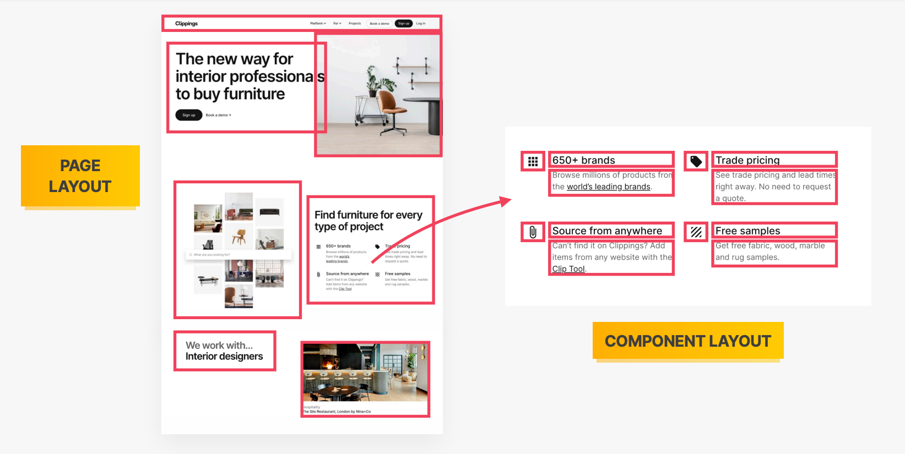
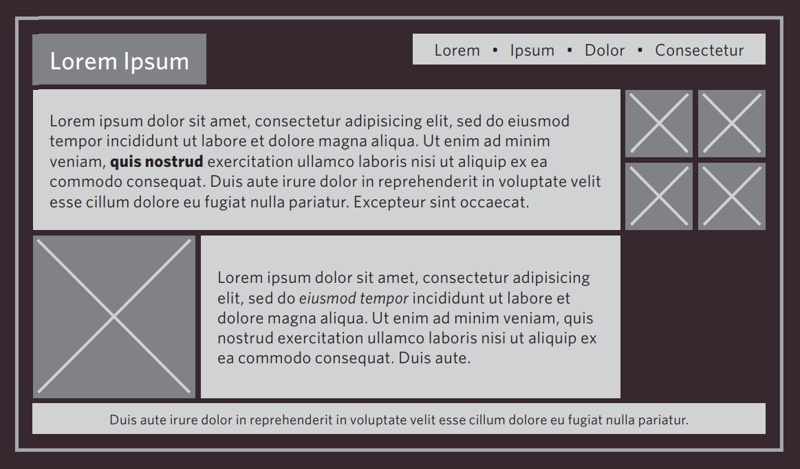
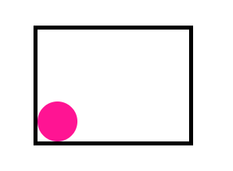
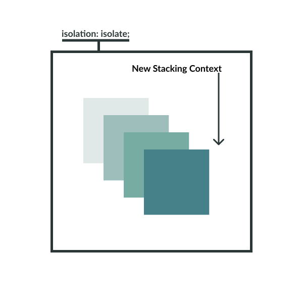
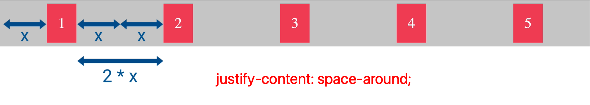
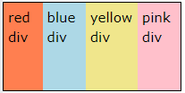
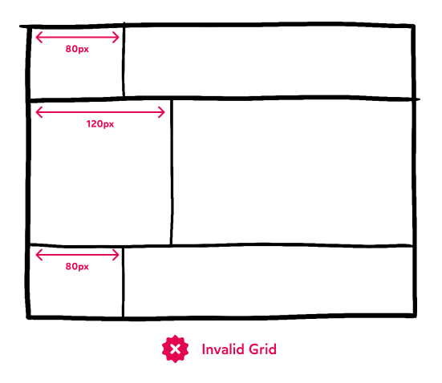
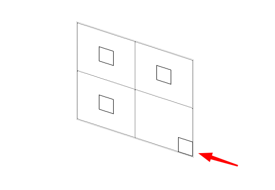

# INDEX

- [INDEX](#index)
  - [LAYOUTS](#layouts)
    - [Box Types (Block vs Inline)](#box-types-block-vs-inline)
  - [Positioning Schemes](#positioning-schemes)
    - [Float](#float)
    - [Positioning \& Prospective](#positioning--prospective)
      - [`position` property](#position-property)
      - [`z-index` (Stacking Context)](#z-index-stacking-context)
  - [Flexbox](#flexbox)
    - [Flex direction](#flex-direction)
    - [Aligning items in the flex container](#aligning-items-in-the-flex-container)
    - [Wrapping (`flex-wrap`)](#wrapping-flex-wrap)
    - [Order](#order)
    - [Grow \& Shrink \& Basis (`flex`)](#grow--shrink--basis-flex)
    - [Gap](#gap)
    - [Flexbox notes](#flexbox-notes)
  - [CSS Grid](#css-grid)
    - [Grid terminology](#grid-terminology)
    - [Grid container](#grid-container)
      - [Display type](#display-type)
      - [Grid template](#grid-template)
      - [Grid Alignment](#grid-alignment)
      - [Grid gap](#grid-gap)
    - [Grid items (Placing Grid items in the container)](#grid-items-placing-grid-items-in-the-container)
      - [Grid Lines (start/end)](#grid-lines-startend)
      - [Grid item Alignment (self-alignment)](#grid-item-alignment-self-alignment)
      - [Grid Areas](#grid-areas)
    - [Sizing Grid columns and rows (`auto` \& `fr` units)](#sizing-grid-columns-and-rows-auto--fr-units)
    - [Fluid Grids \& Functions](#fluid-grids--functions)
    - [Implicit vs Explicit Grids](#implicit-vs-explicit-grids)
    - [Subgrid](#subgrid)
    - [Grid Notes](#grid-notes)
  - [Multi-column layout](#multi-column-layout)

---

## LAYOUTS

Layouts are the way we arrange elements on a page.


- We usually have general layout for the entire page, and then we have specific layouts for each (section / component) of the page.
  

- **Fixed width vs Liquid Layouts**

  - **Fixed width layout** :
    
    - Here, the design doesn't change the size when the viewport changes (like when the user resizes the browser window)
  - **Liquid layout**:

    - Here, the design stretches and contracts as the viewport changes.
    - This is called a **responsive design** (more [here](./3-Responsive-web-design.md))

    - designs stretch and contract as the user increases or decreases the size of their browser window. They tend to use **percentages**.
      

- There're 3 ways of building layouts in CSS:
  

  - [Floats](#float) (old way)
  - [Flexbox](#flexbox) (new way)
  - [Grid](#css-grid) (new way)

---

### Box Types (Block vs Inline)

**Flow layout** is the default layout mode. A plain HTML document, with no CSS applied, uses Flow layout exclusively.

In Flow layout, every element will use a display value of either `inline`, `block`, or `inline-block`. This value governs how the Flow layout algorithm will place the element. The default value depends on the tag; `div` elements are `block` by default, while `spans` are `inline`.


- **Block-level elements**:
  

  - They can be used to create a block of text, or to arrange boxes into a layout.
  - They can have `margins`, `padding`, and `borders` for all directions (top, right, bottom, left) and they respect `width`/`height` properties.

- **Inline elements**:
  

  - They are generally meant to highlight a selection of text.
  - They can have `margins`, `padding`, and `borders` **only** for (right/left) and doesn't respect `top`/`bottom` margin & padding, and they also don't respect `width`/`height`

    > Remember from the [visual formatting model](./2-CSS.md#visual-formatting-model) that CSS has a **block direction (vertical)** and an **inline direction (horizontal)**. Inline elements are laid out in the inline direction, so they don't have a width or height. They only have a width and height if they're converted to block-level elements.

    - To make them respect `width`/`height` -> use `display: inline-block;`

  - They respect space between them in the HTML file, so if you have a space between them in the HTML file, it'll be shown in the browser.
    
    

- **Inline-block elements**:
  - It's an element that internally acts like a block element, but externally acts like an inline element. The parent container will treat it as an inline element, since it's external. But the element itself can be styled like a block.
    - it's a mix between `block` and `inline` elements
    - it looks like an `inline` element but behaves like a `block` element
  - can have `margins`, `padding`, and `borders` ✅
  - it doesn't line-wrap as `inline` elements do ❌
    
  - Note:
    - `inline-block` elements respect the space between the elements in the HTML file (like `inline` elements), so if you have a space between them in the HTML file, it'll be shown in the browser.
    - if you have a container that you want to take only 100% of its content, make it `inline-block`
      
      

---

## Positioning Schemes


### Float

It's a CSS property that allows an element to be pushed to the left or right (removed from the normal document flow), and the other elements will wrap around it.

- `float:left` => means tha the element will be on the left and the elements after it will **flow** around it from its right
  
- `float` is sometimes used to create Multi-Column Layouts

  ```css
  .column1of3,
  .column2of3,
  .column3of3 {
    width: 300px;
    float: left; /* they will be floated to the left one after the other */
    margin: 10px;
  }
  ```

- When element is floating it acts like it's not in the page like `position:absolute`, this means that if the element next to it has `padding` => the `padding` will override the floating element and not start at its end.
  - To fix this, we can also make the next element `float` too or use `clear:both` on the next element
- **Collapsed Height**:
  - If a parent element only contains floated elements, some browsers may render it as zero pixels tall, effectively making it invisible if it doesn't have a noticeable background.
    
    
  - To fix this, we can:
    - use `clear:both` on the parent element
    - use `overflow: auto` on the parent element
- The `clear` property allows you to say that no element (within the same containing element) should touch the left or right-hand or both sides of a box.

  - `clear` has four valid values (**it's like to ignore any floated item from specified direction**):
    - `Both` is most commonly used, which clears floats coming from either direction.
    - `left`
    - `right`
    - `None` is the default (Elements can touch either side)
      
  - we use `clear` property when we want the surrounding element to not be floated around element with a `float` property

    - To clear `float` for the elements next to the (container element that has the floating elements), we can use a class `clearfix` like this --> **clearfix hack**

      - before:
        
      - after:
        

    - Example of `clearfix` class:

      ```scss
      .clearfix::after,
      .clearfix::before {
        content: '';
        clear: both;
        display: table;
      }

      // or if you're using sass, you can make it a mixin
      @mixin clearfix {
        &::after,
        &::before {
          content: '';
          clear: both;
          display: table;
        }
      }

      .container {
        @include clearfix;
      }
      ```

    - There's a new way to clear float --> `display: flow-root`

---

### Positioning & Prospective

**Positioning** is the process of determining the location of an element on the page.

- The difference between it and `margin` (when moving an element) is that `margin` will move the element but it will still take up the space in the normal flow, while `position` will move the element and remove it from the normal flow.

#### `position` property

In CSS, the `position` property is used to control the layout of an element. It has 5 possible values: (`static`, `relative`, `absolute`, `fixed`, `sticky`)


- `static`

  - It's the **default value**
  - It means that the element is positioned according to the normal flow of the document.
  - Here, `top`, `right`, `bottom`, and `left` properties have no effect.

- `relative`

  - It moves an element in relation to where it would have been in normal flow (relative to its current position).
    

    ```css
    .box {
      position: relative;
      top: 20px;
      left: 20px;
    }
    ```

  - its space is still reserved in the normal flow even if it's moved

- `absolute`

  - It makes the position of the element to be relative to nearest parent element with `relative` positioning (its container) until we reach the `<body>` element
    
    
  - It removes the element from the normal flow of the document, so it doesn't take up space in the normal flow.
    - When the browser is laying out elements, it effectively pretends that absolutely-positioned elements don't exist. They're “incorporeal”: you can stick your hand right through them, like a hologram or a ghost.
    - Being able to take elements out-of-flow is super handy. Any time you want an element to be "floating above" the content, like a **tooltip or a dropdown or a modal**, absolute positioning is your friend.
    - It might cause the parent container to collapse (if all its children are absolutely positioned)
  - it can also be used to center an element horizontally and vertically

    ```css
    .box {
      position: absolute;
      top: 0;
      left: 0;
      right: 0;
      bottom: 0;
      width: 200px;
      height: 200px;
      margin: auto;
    }
    ```

    

    - This works because `top: 0; left: 0; right: 0; bottom: 0;` will stretch the element to fill the entire parent container, and `margin: auto;` will try to add equal margins on all sides, which will center the element.

  - How absolute positioning works:

    - When deciding where to place an absolutely-positioned element, it crawls up through the tree, looking for a Positioned ancestor. The first one it finds will provide the containing block. If it doesn't find one, it will use the `<html>` element as the containing block.
    - The containing block is the area in which the absolutely positioned element is positioned. It's like a little window into the world of the document. The absolutely positioned element is positioned within that window.
      
    - The absoluted positioned element ignores the `padding` of the parent element, it sits right up against the edge (`border`) of the parent element (because `padding` is used in the normal flow calculations, and the absolutely positioned element is removed from the normal flow)

  - Normal vs Absolute positioning:
    
    - positioned elements will always render on top of non-positioned ones.
    - What if we set both elements to use relative positioning? In that case, the DOM order wins.

- `fixed`

  - Here, element is removed from the normal flow and positioned relative to the **root container element (viewport)**. (no space is reserved for it in the normal flow)
    
  - The main advantage of fixed-position elements is that they're immune to scrolling.
    - When you scroll the page, the element stays in the same place **(because it's fixed/relative to the viewport)**

- `sticky`

  - It toggles between `relative` and `fixed` once the `position` value is met in the viewport, then it sticks

    ```css
    .nav {
      position: sticky;
      top: 0; /* once it reaches the top=0 with the viewport, then it will stick  */
    }
    ```

  - In addition, you also need to pick at least one edge to stick to (`top`, `left`, `right`, `bottom`). Most commonly, this is done with `top: 0px`.
    

  - It's used for **sticky navigation bars** (when you want the navigation bar to stick to the top of the page when you scroll down)
  - It differs from `fixed` in that:
    - it is only fixed within the its container until a certain point, then it becomes `fixed` to the viewport **(But it stays in its container box)**
      
    - Sticky elements are considered "in-flow", while fixed elements aren’t.
  - Usually used for **sticky headers** or **sticky sidebars** or [**sticky table headers**](https://x.com/chriscoyier/status/1400897989842030593)

- Notes:

  - when using `absolute` position with `inset: 0`, it makes the element expand to fill the height and width of the closest parent with a **non-static position**

    - **inset**: The inset property in CSS is a shorthand for the four inset properties, `top`, `right`, `bottom` and `left` in one declaration. Just like the four individual properties themselves, inset has no effect on non-positioned (static) elements. In other words, an element must declare an explicit position value before inset properties can take effect.

  - A common problem when using `sticky` is that: "There's a thin gap above my sticky header!"

    - If you intend for an element to sit right against the edge of the viewport, you might discover a thin `1px` gap between the element and the edge in Chrome. We can fix this by adding `top: -1` to the sticky element.

      ```css
      .nav {
        position: sticky;
        top: -1px; /* -1px instead of 0px */
      }
      ```

---

#### `z-index` (Stacking Context)

It specifies the elevation of an element relative to other elements on the page.

- **stacking context** --> `z-index`:

  - It's automatically created for each element when it has a position value other than `static` (like `relative`, `absolute`, `fixed`, `sticky`)

  - It's as if the blocks have been stacked on top of each other on the **Z axis**
    

  > **Note:** All the child elements of the parent element will be in the same stacking context as the parent element. meaning that even if the child element has a `z-index` value, it will be compared to the parent element's `z-index` value. and not to the other elements on the page. **(this might cause some issues for modals and dropdowns)**

- by default, it's equal to `auto` which is equal to `0`.
- if multiple elements have the same `z-index`, then the last one is higher than the others and so on.
  
- Notes:

  - you can't hover on something that have a negative `z-index`
  - There's a CSS property called `isolation` that can be used to create a new stacking context for an element, which can be useful when you want to prevent an element from being affected by the `z-index` of its parent element.
    

    ```css
    .parent {
      isolation: isolate;
    }
    ```

- Notes:

  - ⚠️ `z-index` only works on positioned elements (elements with a `position` value other than `static`)
  - the **Flexbox** algorithm also supports z-index. If our element is being laid out with Flexbox, it uses z-index as if it was rendered with Positioned layout.
    - The same thing is true for **CSS Grid**; a child in Grid layout can use z-index without setting position: relative.

---

## Flexbox

It is a layout method for laying out (distributing) items in a single dimension, either as a row or a column.


- It allows us to distribute space dynamically across elements of an unknown size, **hence the term "flex"**.

- Terminology:
  

  - **Flex Container**: The parent element that contains the flex items.
  - **Flex Items**: The children of the flex container.
  - **Main Axis**: The primary axis along which the flex items are laid out.
  - **Cross Axis**: The axis perpendicular to the main axis.

- List of all the properties that can be used on the flex container & flex items:
  

> Good reference -> [Flexbox30](https://www.samanthaming.com/flexbox30/)

---

### Flex direction

You can use the `flex-direction` property to specify the direction in which the flex items are displayed.

- `flex-direction: row;` => default
  - means that the items are laid out horizontally, from **left-to-right**
    
  - `flex-direction: row-reverse;`
    - means that the items are laid out horizontally, from **right-to-left**
- `flex-direction: column;`

  - means that the items are laid out vertically, from **top-to-bottom**
    

- `flex-direction: column-reverse;` -> means that the items are laid out vertically, from **bottom-to-top**
  

- `flex-direction: row-reverse;` -> useful when you want to align the items from left to right, which is needed for some languages like Arabic

  

  - If we want to flip the order of children without changing their alignment, we can do so with justify-content:

    ```css
    .flex-container {
      display: flex;
      flex-direction: row-reverse;
      justify-content: flex-end;
    }
    ```

> **Note**: Visual order only!
>
> When we change the order of flex children using `row-reverse` or `column-reverse`, it only affects the visual presentation. Keyboard and screen reader users will still navigate items in the original DOM order. This can be beneficial, but be mindful not to inadvertently worsen accessibility.

---

### Aligning items in the flex container

- `justify-content`

  - It aligns the flex items along the **main axis**, and it's used to align the items in the flex container when there is extra space in the container.
    

  - `space-around` vs `space-between` spacing
    
    
    
    

- `align-items`

  - It aligns the items inside a flex container along the **cross axis**.
    - `flex-direction: row` => aligns the items vertically
      
      - `baseline` -> aligns the items to the baseline of the container which is the line where the text sits
        
        
      - If you want to center nav items in a navbar, but you want the items words to be aligned to baseline, you can wrap the items in a `div` or `ul` and apply `align-items: center` to the flex container and `align-items: baseline` to the `div` or `ul` that wraps the items.
        
    - `flex-direction: column` => aligns the items horizontally
      
  - default value -> `align-items: stretch;` => stretch the items to fill the container **(if the items have a height, then it will be ignored)**
  - when to use `align-items: baseline;` ?
    - usually in **Navbar**, where we have a **logo** and you want the navbar links to be aligned with the logo
  - **Trick:** When working with **navbars**, you can use:
    - `align-items: baseline;` to align the items to the baseline of the container (usually the logo and the nav links) -> on desktop size
    - `align-items: center;` to center the items (logo & icons) vertically -> on mobile size

- `align-content`

  - It aligns the lines of items along the **cross axis** (when there are multiple lines of flex items)
    
  - It has no effect when there is only one line of flex items. So use it when you have multiple rows/columns in your flex-container

    - So the flex items need to be wrapped in order to see the effect of `align-content`

      ```css
      .flex-container {
        display: flex;
        flex-wrap: wrap; /* Required: wrap the items to have multiple lines */
        align-content: space-between;
      }
      ```

- `align-self`

  - It allows the default alignment (or the one specified by align-items) to be overridden for **individual flex items**.
    
  - `auto` => default
  - `stretch` => stretch the items to fill the container **(if the items have a height, then it will be ignored)**
  - `center` => center the items vertically
  - `baseline` => align the items to the baseline of the container (usually used in **Navbar**)
  - Ex: align the first nav item to the right
    
    - Notice here that by using `align-self: center;` on an item, it's instead of centering all the items, it centers only the item that has the `align-self` property, so it's a replacement for `align-items` but for a single item

  > ⚠️ Note: we don't have `justify-self` in flexbox, because it's not needed. We can use `flex-grow`, `flex-shrink`, and `flex-basis` to control the alignment of the items along the main axis.

- Content vs Items:

  - `align-content` is used to align the lines of items along the cross-axis (when there are multiple lines of flex items)
  - `align-items` is used to align the items inside a flex container along the cross-axis.

---

### Wrapping (`flex-wrap`)

It defines whether the flex items are forced in a single line (default) or can be flowed into multiple lines (**wrapped into new line**). If set to multiple lines (when there's not enough space & overflow happens), it also defines the `cross-axis` which determines the direction new lines are stacked in.

> The `cross axis` is the axis perpendicular to the main axis.

**Note**: the wrapping happens when the item shrinks to its (width/basis) and not the minimum-content-size of the item (which is the handled by `flex-shrink`)

- `nowrap` (default)
  - single-line(doesn't make flex go(wrap) into a new line) which may cause the container to **overflow** if couldn't squeeze and fit the flex-items
    
  - It means that when the end of line is reached, make the items smaller to fit the line together
- `wrap`
  - multi-lines, direction is defined by `flex-direction`
    
  - It means that when the end of line is reached, make the items keep their `width/height` and go to the next line
    - if `flex-direction: row` => the items will go to next row vertically
    - if `flex-direction: column` => the items will go to next column horizontally
- `wrap-reverse`
  - multi-lines, opposite to direction defined by `flex-direction` (here, the wrapping happens above the main axis, not below it)
    

---

### Order

By default, all flex-items have `order: 0`, and are laid out in the order they appear in the HTML markup. You can use the `order` property to change this ordering.


```css
.item {
  order: 0; /* default */
  order: 1; /* move the item to the end */
  order: -1; /* move the item to the beginning */
}
```

- It works like `z-index` but in the **main axis** (a child with `order: 2` will show up after a child with `order: 1` but before a child with `order: 5`)

- Why do we need to use `order` ?

  - It is useful when you want to change the order of the items in the source code, but you don't want to change the HTML structure
  - **Accessability**: with **screen-readers**, it is important to have the correct order in the source code so that the screen-reader can read the content in the correct order, So we can set the items order in the source code as we want the screen-reader to read it, and then use `order` to change the order of the items visually
  - Example:

    - if you have a **table of contents** in a blog post, you might want to have the table of contents at the start (left) of the post, but you want it to appear at the end (right) of the post visually, so you can use `order` to change the order of the items visually
      
    - Solution:

      ```html
      <style>
        .container {
          display: flex;
          flex-direction: row-reverse;
        }
      </style>

      <div class="container">
        <div class="toc">Table of Contents</div>
        <div class="content">Main Content</div>
      </div>
      ```

    - Another solution abviously is to change the `tabindex` of the items in the source code, but it's not recommended because it's not a good practice to change the `tabindex` of the items

---

### Grow & Shrink & Basis (`flex`)

In Flexbox, `width` and `height` properties are not hard rules (mostly ignored), they are just **suggestions** (and it will be changed for some situations). The `flex` property is a shorthand property that sets the `flex-grow`, `flex-shrink`, and `flex-basis` properties.

- `flex-grow`

  - Determines how much of the available space inside the flex container the item should take up.

    ```css
    .item {
      flex-grow: 0; /* default -> item is not allowed to grow */
      flex-grow: 1; /* item is allowed to take up all the extra available space */
      flex-grow: 2; /* item should take twice as much space as the other flex elements */
    }
    ```

    

  - It represents the item's share of the container's empty space, not the item's own size. **(relative to the other flex items in the container)**
    

  - It won't have any effect if there's no extra space in the container (if the container is full)

- `flex-shrink`

  - it determines how much the flex item will shrink relative to the rest of the flex items in the flex container **(when there isn't enough space on the row/column)**.

    ```css
    .container {
      display: flex;
      width: 400px;
    }
    .item {
      width: 200px; /* we have 3 items, so the total width is 600px (biggest than the container width) */
    }

    .item {
      flex-shrink: 0; /* item is not allowed to shrink */
      flex-shrink: 1; /* default -> item is allowed to shrink */
      flex-shrink: 2; /* item is allowed to shrink twice (faster) as much as the other flex elements */
    }
    ```

    

  - Notes
    - It won't have any effect if there's enough space in the container (the container has extra space)
    - the shrink value won't matter when we reach the minimum width of the item-content, as the item can't shrink anymore.
    - Whenever you need to have an element takes `1/3` or `1/4` of the space, you can:
      - Option 1: use `flex-grow: 1` for all the items and `flex-basis: 0` for the item you want to take `1/3` or `1/4` of the space
      - Option 2: use `flex: 1` for the item you want to take `1/3` or `1/4` of the space and `flex: 2` for the other items (if you have 2 items)

- `flex-basis`

  - It sets the initial main size of a flex item unless `width`/`height` is set first.
    
    - It acts like `width` for flex-items if the direction is `row` or `height` if the direction is `column` **(it's agnostic to the main axis direction)**
  - use it instead of `width` for flex-items if the direction is `row` or `height` if the direction is `column`

    ```css
    .flex-item {
      flex-basis: auto; /* default -> based on the width/height of the content */
      flex-basis: 100px; /* fixed size */
      flex-basis: 50%; /* percentage */
    }
    ```

  - it's recommended to ues `percentages %` and not `pixel` units for `flex-basis` to make the layout responsive

  - it doesn't work ❌ if:

    - `flex-grow` is set to `0`
    - `flex-shrink` is set to `0`

  - **It wins over `width` and `height` properties** if they are set together

    ```css
    .item {
      width: 200px;
      flex-basis: 100px; /* the item will have a width of 100px ✅ */
    }
    ```

  - **Trick:** How to control number of flex items in the row of the flex container:

    ```css
    /* Flex Container */
    .cards-container {
      display: flex;
      flex-wrap: wrap;
      justify-content: space-between;
    }

    /* 2 Flex Items */
    .card {
      flex: 0 0 calc(50% - 2rem);
      /* the 2rem for the gap between flex items */
    }
    /* 3 Flex Items (in a @media query) */
    .card {
      flex: 0 0 calc(33.33% - 2rem);
      /* the 2rem for the gap between flex items */
    }
    ```

  - Notes:

    - **Important Gotcha**: Always watch out when using the `flex` shorthand property with `width` or `height` properties, as the `flex` property will override the `width` or `height` properties. (because it has `flex-basis` in it which overrides the `width`/`height` properties)

      ```css
      /* This item will have a width of 0px */
      .item {
        width: 200px;
        flex: 1; /* means flex: 1 1 0; -> so the flex-basis will be 0 and the width will be ignored */
      }
      ```

- `flex` shorthand property

  - It is a shorthand property used to specify the components of a flexible length (`flex-grow`, `flex-shrink` and `flex-basis`) in a short form.

    ```css
    .item {
      /* flex-grow: 1; flex-shrink: 1; flex-basis: 0%; */
      flex: 1, 1, 0%;
    }
    ```

  - If used with only one value, it will be applied to `flex-grow` and the other values will be set to their default values (`flex-shrink: 1; flex-basis: 0%`)

    ```css
    .item {
      flex: 1;
    }
    ```

- **Takeaways**

  - There are two important sizes when dealing with Flexbox: Minimum content size (smallest without overflow) and hypothetical size (suggested size).
  - Width/Height in Flexbox: Sets hypothetical size, not guaranteed.
  - `flex-basis`: Acts like width/height but takes priority.
  - `flex-grow`: Expands to fill excess space.
  - `flex-shrink`: Reduces size if container is too small, but not below minimum content size.

---

### Gap

It's a new feature in CSS that allows you to add space between flex items in a flex container.

```css
.flex-container {
  display: flex;
  gap: 5px;
  /* or */
  gap: 5px 3px;
  /* or */
  column-gap: 5px;
  row-gap: 3px;
}

/* Old way (useful if there's no browser support) */
.flex-item {
  margin: 5px;
}
```

---

### Flexbox notes

- usually `margin-right: auto` is used with the last flex item to push it to the right side of the flex container (usually in **navbar**)
- flex containers act as a **Block element**, so note this when you apply `display: flex` to a small item in order to center its contents
- `display: flex` vs `display: inline-flex`
  - The difference between `display: flex` and `display: inline-flex` is that the former will make the flex container a block-level element, while the latter will make it an inline-level element.
- `flex-start` vs `left`:
  - `flex-start` is used to align the items to the start of the **main axis**
  - `left` is used to align the items to the **left side** of the container.

---

## CSS Grid

It's a new layout system in CSS that allows you to create a grid of columns and rows to place content into. It's a two-dimensional layout system, meaning that it can lay out items in rows and columns simultaneously.


> Ultimate Guide to css grid ->
>
> - [complete-guide-grid](https://css-tricks.com/snippets/css/complete-guide-grid/)
> - [grid-item-placement](https://mastery.games/post/grid-item-placement/)

### Grid terminology

It consists of a **Grid container** and **Grid items (Cells)**


- **Grid lines**: These are horizontal and vertical lines dividing the grid into rows and columns. The numbers represent lines.
  

  - Every row needs to have the same number of columns (and vice-versa). We can't have a grid where the first row has 1 column, the second row has 2 columns. **But** how is this not possible as most of the websites have different number of columns in each row?
    - The answer is that this is done by combining multiple cells into one cell using `grid-template-areas` property or `grid-column` and `grid-row` properties.
  - CSS Grid is fundamentally different from the DOM, because the structure happens exclusively in CSS. There are no DOM nodes that represent the rows or columns in CSS Grid. Instead, **the rows and columns are invisible markers**, tools that our HTML elements can use to position themselves.
    - **Rows and columns are like the lines painted on the ground in parking lots**. Drivers can use these lines to align their vehicles, but really they're just symbols. It's up to the driver to decide how to use them.

- **Grid cells**: These are the spaces between the grid lines. They are the smallest unit of the grid that can hold an item. The gaps between the cells are called **gutters**.

  - They must be symmetrical (same size) in the grid, as css grid doesn't support zig-zag rows/columns. Every cell in the same row/column needs to have the same height/width.
    
    
    
  - A grid-child can choose to span multiple rows and columns, but it must always produce a **rectangle**. No **tetrominoes** allowed like this:
    
    

- **Old Grid System (960 pixel grid)**

  - Before CSS Grid, web developers used a grid system like the 960 grid system to create layouts. It's a layout system that divides the page into **12 or 16** columns.
    
  - Each column has a width of `60 pixels`, with a `10 pixel` margin on each side.
  - Each column has a margin set to 10 pixels, which creates a a gap of **20 pixels** between each column and 10 pixels to the left and right-hand sides of the page.

  - Many CSS frameworks like **Bootstrap** and **Foundation** are based on this grid system, they provide a set of classes that you can use to create layouts.

- In CSS Grid, there's no such thing as a "primary axis" or a "cross axis". The concept doesn't exist.

  - Instead, CSS Grid has **rows and columns**. The rows are always arranged along the "block" axis. In English and other horizontal languages, this is the vertical axis. Rows are always stacked one on top of the other. Columns are always arranged along the "inline" axis (horizontally).

  - When we change `grid-auto-flow` from `row` to `column`, we're not fundamentally changing the orientation of our grid; everything stays the same, except for the fact that our grid will have multiple columns instead of multiple rows.
    
    

    ```css
    .container {
      display: grid;
      grid-auto-flow: column; /* Now the remaining items will be placed in new columns */
    }
    ```

- **Grid vs Flexbox**

  - Flexbox is a **one-dimensional** layout system, meaning that it can lay out items in rows or columns, but not both at the same time -> (Row or Column)
  - Grid is a **two-dimensional** layout system, meaning that it can lay out items in rows and columns simultaneously -> (Row and Column)

- **Grid Construction**

  

  - It consists of two main parts:

    - **Grid container**: The parent element that contains the grid items.
    - **Grid items**: The children of the grid container.

---

### Grid container

#### Display type

- `display: grid;` => creates a grid container, this container will be a `block`-level element
- `display: inline-grid;` => creates a grid container, this container will be an `inline`-level element

---

#### Grid template

- `grid-template-columns`
  - defines the columns of the grid
  - defines the individual widths of each column
- `grid-template-rows` => defines the rows of the grid
  - It's common to only define the columns and let the rows be created implicitly
- `grid-template-areas` => setup the layout of the grid in a(visually-friendly way) by referencing the names of the grid areas which are specified with the `grid-area` property
  

  - It requires defining the (alias / name) of the cells in the grid, then assign the name to each element according to where you want it to be shown on the grid

    ```css
    .header {
      grid-area: header;
    }
    .sidebar {
      grid-area: sidebar;
    }
    .main {
      grid-area: main;
    }
    .footer {
      grid-area: footer;
    }
    ```

  - **⚠️ Note:** before using `grid-template-area`, you need to define the rows and columns of the grid using `grid-template-columns` and `grid-template-rows`

- `grid-template` => shorthand property that defines both the columns and the rows of the grid

  ```css
  .container {
    display: grid;
    grid-template-rows: 200px 200px 200px;
    grid-template-columns: 100px 100px 100px;

    /* ---------------------- OR ---------------------- */

    /* grid-template-rows / grid-template-columns values */
    grid-template: 200px 200px 200px / 100px 100px 100px;
  }
  ```

- When you have more rows than explicitly defined in the `grid-template-rows`, the grid will create **implicit rows** to accommodate the content. but they will have a height of `auto` (the height of the content inside them)

  - To control the height of the **implicit rows**, you can use the `grid-auto-rows` property

    ```css
    .container {
      display: grid;
      grid-template-rows: 200px 200px; /* the height of the explicit rows */
      grid-auto-rows: 100px; /* the height of the implicit rows */
    }
    ```

  - Same is applied for the columns using `grid-auto-columns`

---

#### Grid Alignment

- **Aligning the grid itself in the container (to the grid structure, changing the columns/rows)**

  - `justify-content` => aligns the grid along the row axis **(aligning columns)**
    
  - `align-content` => aligns the grid along the column axis
    
  - `place-content` => **shorthand** for `justify-content` and `align-content`

- **Aligning grid items in the tracks (to child elements, without affecting the grid structure)**

  - `justify-items` => aligns the grid items along the row axis **(aligning columns)**
    
    - default value -> `stretch` => stretch the items to fill the container
    - You may think that this will violate one of our core principles: _"columns aren't supposed to change their width across different rows! A column should be a consistent width, for the entire length of the grid"_.
      
      - But this is not the case, because the `stretch` value only stretches the items to fill the container, but it doesn't change the width of the columns. **(So: The columns are actually full-width! But the items within the column have been shrunk down and centered.)**
        
  - `align-items` => aligns the grid items along the column axis
    
  - `place-items` => **shorthand** for `justify-items` and `align-items`

- **Notes:**

  - Difference between `justify-content` and `justify-items`:

    - `justify-content` applies to the grid structure, changing the columns.
    - `justify-items` applies to the child elements, without affecting the shape of the grid.
    - Values
      

  - Note that the `-content` alignment only works when there's extra space in the grid container, while the `-items` alignment works all the time.
    - if the grid container is smaller than the content, the `-content` alignment will have no effect, but the `-items` alignment will still work.

---

#### Grid gap

- `gap` is a shorthand for `row-gap` and `column-gap`
- It was called `grid-gap` before, but it was changed to `gap` in the new version of CSS Grid
- We can also use `row-gap` and `column-gap` separately

  ```css
  .container {
    display: grid;
    gap: 16px;
    /* or */
    row-gap: 16px;
    column-gap: 16px;
  }
  ```

  

---

### Grid items (Placing Grid items in the container)

- By default, a grid-item will take up one grid cell in the grid container following the source order in the HTML markup.
- You can use different properties to position the grid items in the grid container.

#### Grid Lines (start/end)

It's used to position the grid items using values to specify which grid lines the item should start and end on.


- In order to manually place the grid items in the grid container, you can use the following properties that specify the grid lines that the grid item should start and end on:

  ```css
  .item {
    grid-column-start: 1; /* Specifies on which column-line to start the grid item */
    grid-column-end: 3; /* Specifies on which column-line to end the grid item */
    grid-row-start: 1; /* Specifies on which row-line to start the grid item */
    grid-row-end: 3; /* Specifies on which row-line to end the grid item */

    /* or using shorthand properties ✅ */
    grid-column: 1/3; /* start on column 1 and end on start of column 3 */
    grid-row: 1/3;

    /* or using `span` */
    grid-column: 2 / span 2; /* start on column 2 and span 2 columns */
    grid-row: 1 / span 2; /* start on row 1 and span 2 rows */
    grid-row: 2; /* (ONE VALUE) start on row 2 and end on the last row */

    /* or using `-1` */
    grid-column: 1 / -1; /* start on column 1 and end on the last column */
    grid-row: -3/ -1; /* start on the 3rd row from the end and end on the last row */
  }
  ```

  - `grid-column` => shorthand for `grid-column-start` and `grid-column-end`
  - `grid-row` => shorthand for `grid-row-start` and `grid-row-end`

- `span` keyword is used to specify the number of columns/rows that the grid item should span.

  ```css
  .cell-1 {
    grid-column: 2 / span 2; /* span 2 columns */
    grid-row: 1 / span 2; /* span 2 rows */
  }
  ```

- We can also name the grid lines and use the names to place the grid items (💡 this can be useful when changing the grid layout in media queries)

  ```css
  .container {
    display: grid;
    grid-template-columns: [start] 100px [main] 1fr [end];
    grid-template-rows: [top] 100px [main] 1fr [bottom];
  }

  .item {
    grid-column: start / end;
    grid-row: top / bottom;
  }
  ```

- **Notes:**

  - we can use negative values for row/column to point to the end of the explicit grid (not the implicit grid), it's also a future-proof way to span the grid items to the end of the grid container if we decide to add more columns/rows in the future

    ```css
    .cell-4 {
      grid-column: 1/-1; /* start on column 1 and end on the last column */
      grid-row: 3/-1; /* start on row 3 and end on the last row of the explicit grid */
    }
    ```

  - If you provided `grid-column-start` or `grid-row-start` without `grid-column-end` or `grid-row-end`, the item will span **only one cell**
  - If you provided `grid-column-end` or `grid-row-end` without `grid-column-start` or `grid-row-start`, the item will span **all the cells** from the start to the end
  - If you provided `grid-column` or `grid-row` with only **one value**, the item will span to the end of the grid in that direction

---

#### Grid item Alignment (self-alignment)

> In Flexbox, `align-items` is used on the parent to control the cross-axis position for all of the elements. But we also have `align-self`, which allows a specific child to overrule it.
>
> In CSS Grid, `align-self` works pretty much the same way. We apply it to specific grid children, and it changes their vertical position within the grid cell. We also have `justify-self`, which changes a particular element's horizontal position, within the grid cell

- `justify-self` => aligns the grid item along the row axis
  
  
- `align-self` => aligns the grid item along the column axis
- `place-self` => shorthand for `justify-self` and `align-self`
  

---

#### Grid Areas

`grid-area` property is used to assign a grid item to a grid area, or to create a named grid area.

- `grid-area` is a shorthand property that sets all of the following properties in a single declaration: `grid-row-start`, `grid-column-start`, `grid-row-end`, and `grid-column-end`.

  ```css
  .item {
    grid-area: 1 / 1 / 2 / 3;
    /* same as */
    grid-row-start: 1;
    grid-column-start: 1;
    grid-row-end: 2;
    grid-column-end: 3;
  }
  ```

- it specifies a grid item's size and location in a grid layout

  - `grid-area: 2 / 1 / span 2 / span 3;` => start on row 2 column 1, and span 2 rows and 3 columns

- It's also used with `grid-template-areas` to name the grid areas

  

  - if there is a column you want it to be empty => use `"."` instead of the area name

    ```css
    .container {
      display: grid;
      grid-template-areas:
        'header header header'
        'sidebar . main'
        'footer footer footer';
    }

    .header {
      grid-area: header;
    }
    ```

---

### Sizing Grid columns and rows (`auto` & `fr` units)

- `fr`

  - It stands for (**fraction** of the available space) of the grid-container and used to specify the size of the columns and rows in the grid by dividing the available space into fractions (instead of using `px` or `%`)
    

  - If we have multiple columns with `fr` unit, the space will be divided equally between them or based on the value of the `fr` unit
    

  - Examples

    ```css
    /* useful when you don't want to calculate the width-percentages of the columns/rows manually */
    .container {
      display: grid;
      grid-template-columns: 1fr 1fr;
      /* same as */
      grid-template-columns: 50% 50%;

      grid-template-rows: 2fr 1fr 1fr;
      /* same as */
      grid-template-rows: 50% 25% 25%;
    }
    ```

  - It's similar to the `flex-grow` property in **Flexbox**

  - it makes the cells responsive as they take the remaining space available relative to the current viewport size
  - It's used when we want our columns to grow and shrink based on the available space in the grid container, unlike percentage `%` which is based on the viewport size (fixed size)
    - Example of percentage `%` vs `fr`:
      
      
  - beats `auto`, when they are together (as `auto` will take the required space available for its content)
    
    - `auto` will take only its width and `fr` will take all remaining space left

- `auto`

  - is greedy (take the required space available for its content + the remaining space)
    - for example, if we have a grid container with 2 columns, and the first column has a width of `200px` and the second column has a width of `auto`, the second column will take the remaining space available in the grid container.
      
  - it makes the cell responsive as it takes the remaining space
  - it's the default behavior in **implicit grids**

- `min-content`

  - It's a keyword that specifies the smallest size a grid item can be while still fitting its content.

    ```css
    .container {
      display: grid;
      grid-template-columns: min-content 1fr; /* the first column will be at least the size of its content */
    }
    ```

  - It's similar to `auto` but with a minimum size limit

- `max-content`

  - It's a keyword that specifies the largest size a grid item can be while still fitting its content.

    ```css
    .container {
      display: grid;
      grid-template-columns: max-content 1fr; /* the first column will be at most the size of its content (the size of the longest word in the column-cells) */
    }
    ```

---

### Fluid Grids & Functions

They're used to create responsive grids that adapt to the size of the viewport and wrapping columns into new rows when needed.

> They're used in the `grid-template-columns` and `grid-template-rows` properties

- `auto-fill` & `auto-fit`

  > They are used to create responsive grids that adapt to the size of the viewport and wrapping columns into new rows when needed.
  >
  > - They are used as a replacement for explicitly define **the size of the grid container and number of columns in the grid**, by trying to fit as many columns as possible in the available space.
  > - Here, we don't define the grid container size (number of columns / rows), but we define the size of the columns and the number of columns will be created based on the available space.
  > - Use them when you don't know the size of page or the number of items that will occupy the grid but you know the width of columns.
  > - They can be used as the first argument in the `repeat()` function to create a responsive grid layout.

  - `auto-fill`

    - Generates as many columns as possible, even if they are empty (as long as there's space available).
    - Keeps the available space reserved without altering the grid items' width.

      ```css
      .container {
        display: grid;
        grid-template-columns: repeat(auto-fill, minmax(250px, 1fr));
      }
      ```

      

    - Ex:

      - If the container is `450px` wide, we can fit exactly 3 columns at `150px`, and there's no leftover space.
      - If the container is `480px` wide, we can still only fit 3 columns, but there's `30p`x of leftover space. Each column gets `10px` wider, so that we have 3 columns that are `160px` wide, perfectly filling the `480px`-wide container.
      - If the container is `600px` wide, we can fit 4 columns at `150px`, and there's no leftover space.

        > Note: This is a slight oversimplification. The real algorithm subtracts additional space like `gap` or `padding` from the calculations, and supports having different columns of different proportions. But this is the basic idea!

  - `auto-fit`

    - Expands the grid items to fill the available space.
    - Might lead to grid items being too wide, especially when they are fewer than expected.

      ```css
      .container {
        display: grid;
        grid-template-columns: repeat(auto-fit, minmax(250px, 1fr));
      }
      ```

      

  - Difference between them:
    

    - Let's suppose that we're rendering a dynamic list of data. We might have 20 items, or 40 items, or 2 items.

      - In this particular case, we only have 2 items, but they're rendered in a very-wide grid. Let's say we have space for 6 columns
      - What should happen? Should we create 4 additional empty columns, so that our 2 items stay approximately the same size as they would be if we had 20 items? Or should we create 2 super-wide columns that span the entire area?
      - This is the fundamental difference between auto-fill (lots of empty columns) and auto-fit (stretched ultra-wide columns).

    - People almost always use auto-fill. since it ensures consistency in my grid no matter how many items I have. But if you want to make sure the elements span 100% of the available space, auto-fit has you covered.

    - `auto-fill`
      - will keep the available space reserved without altering the grid items width.
      - generates as many columns as possible, even if they are empty **(as long as there's space available)**
    - `auto-fit` keyword will expand the grid items to fill the available space.

      - That being said, using `auto-fit` might lead to grid items being too wide, especially when they are less than expected. Consider the following example.

        ```css
        .wrapper {
          display: grid;
          grid-template-columns: repeat(auto-fit, minmax(250px, 1fr));
          grid-gap: 1rem;
        }
        ```

        

        - Most of the time, such behavior isn't needed, so using `auto-fill` is better.

          ```css
          .wrapper {
            display: grid;
            grid-template-columns: repeat(auto-fill, minmax(250px, 1fr));
            grid-gap: 1rem;
          }
          ```

          

- Another ways to make Grid responsive:

  - The **responsive** way

    - We can always use a media query to change the number of columns in the grid (grid structure) based on the viewport size.

      ```css
      @media (max-width: 600px) {
        .container {
          grid-template-columns: 1fr; /* when the viewport is smaller, we stick with one column */
        }
      }
      ```

  - The **fluid** ways

    - Use combination of (`vh`, `vw`, `%`) units for the grid container size with `minmax()` function for the columns/rows and `auto-fill` or `auto-fit` for the number of columns/rows

      ```css
      .container {
        display: grid;
        grid-template-columns: repeat(auto-fill, minmax(min(400px, 100%), 1fr));
      }
      ```

      - Here's a breakdown of the code:

        - `minmax(min(400px, 100%), 1fr)` => the column width will be at least `400px` and at most `100%` of the viewport width.

          - 100% refers to the .grid element's width. If we're viewing this on a large monitor, .grid might be `800px` wide, so 100% resolves to `800px`.
          - `min()` picks the smaller of the two values, so on a large monitor, `400px` is returned from this expression. **(We used it to handle the case when the viewport is smaller than `400px` to prevent the grid from overflowing)**
          - On a smaller screen, however, 100% might only be `250px`. In this case, 100% is returned, since it's smaller than the alternative `400px` option.

        - `repeat(auto-fill, ...)` => the grid will create as many columns as possible, even if they are empty, as long as there's space available.

    - Set a fixed width / height for the grid, and use `fr` for the columns / rows

      ```css
      .container {
        display: grid;
        grid-template-columns: 1fr 1fr 1fr 1fr;
      }
      ```

- `minmax()`

  - it lets you define a minimum and maximum size (range) for column width or row height
    
    

  - It's used to prevent grid cells from getting too **small** / **big**
  - It's common to set the `min` as fixed value and the `max` as (`fr` or `auto` or percentage `%`) to ensure that the track expands and takes up the available space (make the grid responsive)

    ```css
    .container {
      display: grid;
      grid-template-columns: minmax(100px, 1fr) 1fr;
      /* the first column will be at least 100px and at most 1fr */
    }
    ```

- `repeat()`

  - It lets you repeat the same value multiple times in a `grid-template-columns` or `grid-template-rows` declaration to prevent you from writing out the same value over and over again.

    ```css
    .container {
      display: grid;
      grid-template-columns: repeat(3, 1fr);
      /* same as */
      grid-template-columns: 1fr 1fr 1fr;
    }
    ```

- `fit-content()`

  - It lets you define the size of a grid track based on the size of its content.

    - It's useful when you want to make a grid cell as big as its content, but not bigger than a certain value.

    ```css
    .container {
      display: grid;
      grid-template-columns: repeat(3, fit-content(100px)); /* 3 columns with at most 100px */
    }
    ```

  - It's similar to `auto` but with a maximum size limit

---

### Implicit vs Explicit Grids


- **Explicit Grid**: The grid that you define using both `grid-template-columns` and `grid-template-rows` with explicit values.

  ```css
  .container {
    display: grid;
    grid-template-columns: 100px 150px 200px;
    grid-template-rows: 50px 50px;
  }
  ```

  - But what will happen if the grid has `7` items and you defined the grid with (`3` columns and `2` rows) ?

    - The grid will create **implicit rows** to accommodate the content, but they will have a height of `auto` (the height of the content inside them or the explicit height of the items)
    - so the browser creates a 4th row and squeezes it in. It doesn't cause an overflow, it just means that there's less available space for the other elements.
    - To control the height of the **implicit rows**, you can use the `grid-auto-rows` property

    ```css
    /* control the height of the implicit rows */
    .container {
      display: grid;
      grid-template-columns: 100px 150px 200px;
      grid-template-rows: 50px 50px;
      grid-auto-rows: 100px; /* the height of the implicit rows */
    }
    ```

- **Implicit Grid**: The grid that is created automatically to accommodate the content when there are more items than the number of columns/rows defined in the explicit grid.

  - By default, it creates 1 new row for each element. if our grid parent has 3 children, we'll wind up with a **1x3** grid with 3 rows (auto height) and 1 column (auto width).
  - Implicit grids want to fill the available space. Notice that the elements stretch across the horizontal space like block-level elements in Flow.

---

### Subgrid

It's a feature that allows you to create a grid within a grid. It's used to create a nested grid layout where the child grid inherits the tracks of the parent grid.

- For example: let's say that we have a list of items, and we want each list item to be assigned to our CSS Grid:

  ```html
  <div class="grid">
    <header>Header</header>
    <aside>Sidebar</aside>
    <ul>
      <li>First Item</li>
      <li>Second Item</li>
    </ul>
  </div>
  ```

  - Our 3 grid children will be `header`, `aside`, and `ul`. In the 1st version of CSS Grid, the `li` elements can't participate in the grid, since they're grandchildren, not children, of the grid container.

  - CSS Grid v2 introduces subgrid, a keyword that allows us to let grandchildren access the grid structure.

---

### Grid Notes

- For tricky designs, always consider using more columns like `6` or `12` to make the layout more flexible and easier to manage.

- To center a Grid-container, you can use these 2 options:

  ```css
  .grid-container {
    display: grid;
    /* option 1 */
    align-items: center;
    justify-content: center;

    /* option 2 */
    place-items: center;
  }
  ```

- it's preferred to use `fr` over the percent unit `%`, using the `%` unit for columns/rows in addition to `gap` with px values would result mismatch calculations

  ```css
  .container {
    display: grid;
    /* correct */
    grid-template-columns: 1fr 1fr;
    /* wrong */
    grid-template-columns: 50% 50%;

    grid-gap: 50px 100px;
  }
  ```

- overlapping grid items

  - CSS-Grid allows cells to overlap with each other if you specify the same grid lines for the start and end of the grid item.

  - This is common when we have images stacked on top of each other, or when we want to create a layout where some items overlap with each other.
    
    
  - Example

    ```css
    .item-1 {
      grid-column: 1 / 3;
      grid-row: 1 / 3;
    }
    .item-2 {
      grid-column: 2 / 4;
      grid-row: 2 / 4;
    }
    ```

    - Here, the `item-1` and `item-2` will overlap with each other on the column 2 and row 2.
    - It's useful when you want to create a layout where some items overlap with each other.
      
      

- Question: when should you use flexbox and when should you use CSS Grid?

  - Use **Flexbox** when you want to create a layout in one dimension (either a row or a column). ex: **Navbar** with a logo and links
  - Use **CSS Grid** when you want to create a layout in two dimensions (both rows and columns). ex: **Main layout** of the page with a header, sidebar, main content, and footer (boxes or sections)

- If you want to apply grid in an old browser, you can use:

  - a **fallback** layout using Flexbox or other layout techniques -> [Graceful Degradation](./2-CSS.md#graceful-degradation)
  - [tricks here](https://css-tricks.com/css-grid-in-ie-debunking-common-ie-grid-misconceptions/)

- When we position an element, either using `grid-area` or `grid-column`/`grid-row`, its DOM order doesn't matter. At least, it doesn't matter visually. But when it comes to keyboard navigation, the DOM order still calls the shots.

- Good grid recourses:
  - [The A to Z Guide of CSS Grid: From Fundamentals to Advanced Techniques](https://www.atatus.com/blog/css-grid/)

---

## Multi-column layout

This layout is used to divide the content of an element into multiple columns. It's useful when you want to create a **newspaper**-like layout.

- `column-count` property:
  

  - It specifies the number of columns an element should be divided into.
  - It can have the following values:

    - `auto` -> the browser will determine the number of columns
    - `2` -> the element will be divided into two columns
    - `3` -> the element will be divided into three columns

    ```css
    p {
      column-count: 3;
      column-gap: 20px;
    }
    ```

    

- It's not only used for text, but also for images and other elements.

  ```html
  <ul>
    <li></li>
    <li></li>
    <li></li>
    <li></li>
    <li></li>
    <li></li>
  </ul>

  <style>
    ul {
      column-count: 3;
      column-gap: 20px;
    }

    img {
      width: 100%;
      margin-bottom: 20px;
    }
  </style>
  ```

  
