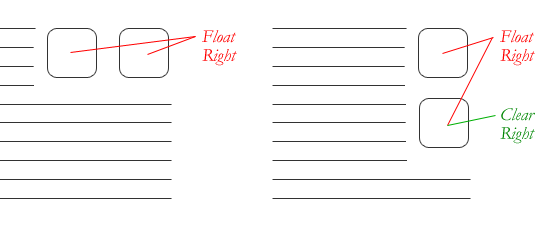
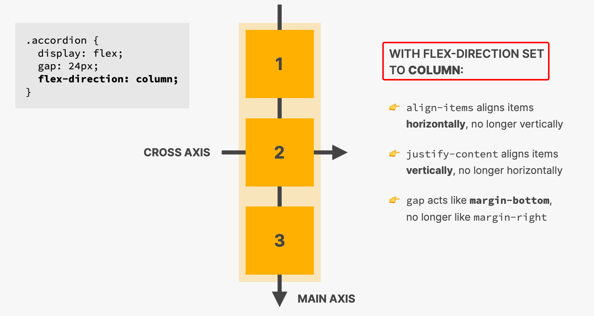

# INDEX

- [INDEX](#index)
  - [LAYOUTS](#layouts)
  - [Float](#float)
  - [Flexbox](#flexbox)
    - [Flex direction](#flex-direction)
    - [Aligning items in the flex container](#aligning-items-in-the-flex-container)
    - [Wrapping](#wrapping)
    - [Order](#order)
    - [`flex` property (`flex-grow`, `flex-shrink`, `flex-basis`)](#flex-property-flex-grow-flex-shrink-flex-basis)
    - [Gap](#gap)
    - [Flexbox notes](#flexbox-notes)
  - [Grid](#grid)
    - [Aligning items in the grid (Rows \& Columns)](#aligning-items-in-the-grid-rows--columns)
      - [Grid container](#grid-container)
      - [Grid items (Placing Grid items in the container)](#grid-items-placing-grid-items-in-the-container)
      - [Grid gap](#grid-gap)
      - [Grid Lines (start/end)](#grid-lines-startend)
      - [Grid Areas](#grid-areas)
    - [Sizing Grid columns and rows (`auto` \& `fr` units)](#sizing-grid-columns-and-rows-auto--fr-units)
    - [Grid functions](#grid-functions)
    - [`auto-fill` vs `auto-fit`](#auto-fill-vs-auto-fit)
    - [Grid notes](#grid-notes)

---

## LAYOUTS

Layouts are the way we arrange elements on a page.


- We usually have general layout for the entire page, and then we have specific layouts for each (section / component) of the page.
  

- **Fixed width vs Liquid Layouts**

  - **Fixed width layout** :
    
    - Here, the design doesn't change the size when the viewport changes (like when the user resizes the browser window)
  - **Liquid layout**:

    - Here, the design stretches and contracts as the viewport changes.
    - This is called a **responsive design** (more [here](./3-Responsive-web-design.md))

    - designs stretch and contract as the user increases or decreases the size of their browser window. They tend to use **percentages**.
      

- There're 3 ways of building layouts in CSS:
  

  - [Floats](#float) (old way)
  - [Flexbox](#flexbox) (new way)
  - [Grid](#grid) (new way)

---

## Float

It's a CSS property that allows an element to be pushed to the left or right, allowing other elements to wrap around it.

- `float:left` => means tha the element will be on the left and the elements after it will **flow** around it from its right
  
- `float` is sometimes used to create Multi-Column Layouts

  ```css
  .column1of3,
  .column2of3,
  .column3of3 {
    width: 300px;
    float: left; /* they will be floated to the left one after the other */
    margin: 10px;
  }
  ```

- When element is floating it acts like it's not in the page like `position:absolute`, this means that if the element next to it has `padding` => the `padding` will override the floating element and not start at its end.
  - To fix this, we can also make the next element `float` too or use `clear:both` on the next element
- **Collapsed Height**:
  - If a parent element only contains floated elements, some browsers may render it as zero pixels tall, effectively making it invisible if it doesn't have a noticeable background.
    
    
  - To fix this, we can:
    - use `clear:both` on the parent element
    - use `overflow: auto` on the parent element
- The `clear` property allows you to say that no element (within the same containing element) should touch the left or right-hand or both sides of a box.

  - `clear` has four valid values (**it's like to ignore any floated item from specified direction**):
    - `Both` is most commonly used, which clears floats coming from either direction.
    - `left`
    - `right`
    - `None` is the default (Elements can touch either side)
      
  - we use `clear` property when we want the surrounding element to not be floated around element with a `float` property
  - Tricks:

    - To clear `float` for the elements next to the (container element that has the floating elements), we can use a class `clearfix` like this --> **clearfix hack**

      ```css
      .clearfix::after,
      .clearfix::before {
        content: '';
        clear: both;
        display: table;
      }
      ```

      - before:
        
      - after:
        

    - There's a new way to clear float --> `display: flow-root`

---

## Flexbox

It is a layout mode that provides a more efficient way to lay out, align and distribute space among items in a container, even when their size is unknown and/or dynamic.


- Terminology:
  

  - **Flex Container**: The parent element that contains the flex items.
  - **Flex Items**: The children of the flex container.
  - **Main Axis**: The primary axis along which the flex items are laid out.
  - **Cross Axis**: The axis perpendicular to the main axis.

- List of all the properties that can be used on the flex container & flex items:
  

> Good reference -> [Flexbox30](https://www.samanthaming.com/flexbox30/)

---

### Flex direction

You can use the `flex-direction` property to specify the direction in which the flex items are displayed.

- `flex-direction: row;` => default
  - means that the items are laid out horizontally, from **left-to-right**
    
  - `flex-direction: row-reverse;`
    - means that the items are laid out horizontally, from **right-to-left**
- `flex-direction: column;`
  - means that the items are laid out vertically, from **top-to-bottom**
    
  - `flex-direction: column-reverse;`
    - means that the items are laid out vertically, from **bottom-to-top**

---

### Aligning items in the flex container

- `justify-content`

  - It aligns the flex items along the **main axis**, and it's used to align the items in the flex container when there is extra space in the container.
    

  - `space-around` vs `space-between` spacing
    

- `align-items`

  - It aligns the items inside a flex container along the **cross axis**.
    
  - default value -> `align-items: stretch;` => stretch the items to fill the container **(if the items have a height, then it will be ignored)**
  - when to use `align-items: baseline;` ?
    - usually in **Navbar**, where we have a **logo** and you want the navbar links to be aligned with the logo

- `align-content`

  - It aligns the lines of items along the **cross axis**
    
  - It has no effect when there is only one line of flex items. Use it when you have multiple rows/columns in your flex-container

  - It controls the spacing between lines of flex items along the **cross axis** between the rows/columns (based on the `flex-direction`)
  - It is for multi line flexible boxes. It has no effect when items are in a single line. It aligns the whole structure according to its value.

    - So the flex items need to be wrapped in order to see the effect of `align-content`

      ```css
      .flex-container {
        display: flex;
        flex-wrap: wrap; /* Required: wrap the items */
        align-content: space-between;
      }
      ```

- `align-self`

  - It allows the default alignment (or the one specified by align-items) to be overridden for **individual flex items**.
    
  - `align-self: auto;` => default
  - `align-self: stretch;` => stretch the items to fill the container **(if the items have a height, then it will be ignored)**
  - `align-self: center;` => center the items vertically
  - `align-self: baseline;` => align the items to the baseline of the container (usually used in **Navbar**)

---

### Wrapping

It defines whether the flex items are forced in a single line (default) or can be flowed into multiple lines (**wrapped into new line**). If set to multiple lines, it also defines the `cross-axis` which determines the direction new lines are stacked in.

> The `cross axis` is the axis perpendicular to the main axis.

- **nowrap**: (default) single-line(doesn't make flex go(wrap) into a new line) which may cause the container to overflow if couldn't squeeze and fit the flex-items
  
  - It means that when the end of line is reached, make the items smaller to fit the line together
- **wrap**: multi-lines, direction is defined by `flex-direction`
  
  - It means that when the end of line is reached, make the items keep their `width/height` and go to next line
    - if `flex-direction: row` => the items will go to next row vertically
    - if `flex-direction: column` => the items will go to next column horizontally
- **wrap-reverse**: multi-lines, opposite to direction defined by `flex-direction`
  

---

### Order

By default, all children have `order: 0`, and are laid out in the order they appear in the source code. You can use the `order` property to change this ordering.


```css
.item {
  order: 0; /* default */
  order: 1; /* move the item to the end */
  order: -1; /* move the item to the beginning */
}
```

- Why do we need to use `order` ?
  - It is useful when you want to change the order of the items in the source code, but you don't want to change the HTML structure
  - **Accessability**: with **screen-readers**, it is important to have the correct order in the source code so that the screen-reader can read the content in the correct order
    - so we can set the items order in the source code as we want the screen-reader to read it, and then use `order` to change the order of the items visually

---

### `flex` property (`flex-grow`, `flex-shrink`, `flex-basis`)

It is used to specify the components of a flexible length (`flex-grow`, `flex-shrink` and `flex-basis`) in a short form.

```css
.item {
  /* flex-grow: 1; flex-shrink: 1; flex-basis: 0%; */
  flex: 1, 1, 0%;
}
```

- `flex-grow`

  - Determines how much of the available space inside the flex container the item should take up.

    ```css
    .item {
      flex-grow: 0; /* default -> item is not allowed to grow */
      flex-grow: 1; /* item is allowed to take up all the extra available space */
      flex-grow: 2; /* item should take twice as much space as the other flex elements */
    }
    ```

    

  - It represents the item's share of the container's empty space, not the item's own size. **(relative to the other flex items in the container)**
    

- `flex-shrink`

  - it determines how much the flex item will shrink relative to the rest of the flex items in the flex container **(when there isn't enough space on the row/column)**.

    ```css
    .item {
      flex-shrink: 0; /* item is not allowed to shrink */
      flex-shrink: 1; /* default -> item is allowed to shrink */
      flex-shrink: 2; /* item is allowed to shrink twice (faster) as much as the other flex elements */
    }
    ```

    

- `flex-basis`

  - It sets the initial main size of a flex item unless `width`/`height` is set first.
    
  - use it instead of `width` for **flex-items** if the direction is `row` or `height` if the direction is `column`

    ```css
    .flex-item {
      flex-basis: auto; /* default */
      flex-basis: 100px; /* fixed size */
      flex-basis: 50%; /* percentage */
    }
    ```

  - it's recommended to ues `percentages %` and not `pixel` units

  - How to control number of flex items in the row of the flex container:

    ```css
    /* Flex Container */
    .cards-container {
      display: flex;
      flex-wrap: wrap;
      justify-content: space-between;
    }

    /* 2 Flex Items */
    .card {
      flex: 0 0 calc(50% - 2rem);
      /* the 2rem for the gap between flex items */
    }
    /* 3 Flex Items (in a @media query) */
    .card {
      flex: 0 0 calc(33.33% - 2rem);
      /* the 2rem for the gap between flex items */
    }
    ```

  - it doesn't work ❌ if:
    - `flex-grow` is set to `0`
    - `flex-shrink` is set to `0`
    - `width`/`height` are already set

---

### Gap

It's a new feature in CSS that allows you to add space between flex items in a flex container.

```css
.flex-container {
  display: flex;
  gap: 5px;
  /* or */
  gap: 5px 3px;
  /* or */
  column-gap: 5px;
  row-gap: 3px;
}

/* Old way (useful if there's no browser support) */
.flex-item {
  margin: 5px;
}
```

---

### Flexbox notes

- usually `margin-right: auto` is used with the last flex item to push it to the right side of the flex container (usually in **navbar**)
- flex containers act as a **Block element**, so note this when you apply `display: flex` to a small item in order to center its contents
- `display: flex` vs `display: inline-flex`
  - The difference between `display: flex` and `display: inline-flex` is that the former will make the flex container a block-level element, while the latter will make it an inline-level element.

---

## Grid

It's a new layout system in CSS that allows you to create a grid of columns and rows to place content into. It's a two-dimensional layout system, meaning that it can lay out items in rows and columns simultaneously.


> Ultimate Guide to css grid ->
>
> - [complete-guide-grid](https://css-tricks.com/snippets/css/complete-guide-grid/)
> - [grid-item-placement](https://mastery.games/post/grid-item-placement/)

- **Grid terminology**

  - It consists of a **Grid container** and **Grid items**.
    
  - **Grid lines**: These are horizontal and vertical lines dividing the grid into rows and columns. The numbers represent lines.
    
  - **Grid cells**: These are the spaces between the grid lines. They are the smallest unit of the grid that can hold an item. The gaps between the cells are called **gutters**.

- **Old Grid System (960 pixel grid)**

  - Before CSS Grid, web developers used a grid system like the 960 grid system to create layouts. It's a layout system that divides the page into 12 or 16 columns.
    
  - Each column has a width of `60 pixels`, with a `10 pixel` margin on each side.
  - Each column has a margin set to 10 pixels, which creates a a gap of **20 pixels** between each column and 10 pixels to the left and right-hand sides of the page.

  - Many CSS frameworks like **Bootstrap** and **Foundation** are based on this grid system, they provide a set of classes that you can use to create layouts.

- **Grid vs Flexbox**

  - Flexbox is a **one-dimensional** layout system, meaning that it can lay out items in rows or columns, but not both at the same time. On the other hand, Grid is a **two-dimensional** layout system, meaning that it can lay out items in rows and columns simultaneously.

---

### Aligning items in the grid (Rows & Columns)


- **Display type**

  - `display: grid;` => creates a grid container, this container will be a `block`-level element
  - `display: inline-grid;` => creates a grid container, this container will be an `inline`-level element

#### Grid container

- `grid-template-columns` => defines the columns of the grid
- `grid-template-rows` => defines the rows of the grid
  - It's common to only define the columns and let the rows be created implicitly
- `grid-template-areas` => defines a grid template by referencing the names of the grid areas which are specified with the `grid-area` property
  

  - It requires defining the (alias / name) of the cells in the grid, then assign the name to each element according to where you want it to be shown on the grid

    ```css
    .header {
      grid-area: header;
    }
    .sidebar {
      grid-area: sidebar;
    }
    .main {
      grid-area: main;
    }
    .footer {
      grid-area: footer;
    }
    ```

  - **⚠️ Note:** before using `grid-template-area`, you need to define the rows and columns of the grid using `grid-template-columns` and `grid-template-rows`

- `grid-template` => shorthand that defines both the columns and the rows of the grid

  ```css
  .container {
    display: grid;
    grid-template-rows: 200px 200px 200px;
    grid-template-columns: 100px 100px 100px;

    /* ---------------------- OR ---------------------- */

    /* grid-template-rows / grid-template-columns values */
    grid-template: 200px 200px 200px / 100px 100px 100px;
  }
  ```

- `justify-items` => aligns the grid items along the row axis
- `align-items` => aligns the grid items along the column axis
- `place-items` => shorthand for `justify-items` and `align-items`
- `justify-content` => aligns the grid tracks within the grid container along the row axis
- `align-content` => aligns the grid tracks within the grid container along the column axis.

  > Difference between `justify-content` and `justify-items`:
  >
  > - `justify-content` is used to align the **grid tracks within the grid container**
  > - `justify-items` is used to align the **grid items within the row axis**

---

#### Grid items (Placing Grid items in the container)

- By default, a grid-item will take up one grid cell.
  

- In order to manually place the grid items in the grid container, you can use the following properties:

  ```css
  .item {
    grid-column-start: 1;
    grid-column-end: 3;
    grid-row-start: 1;
    grid-row-end: 3;

    /* or */
    grid-column: 1/3; /* start on column 1 and end on start of column 3 */
    grid-row: 1/3;

    /* or using `span` */
    grid-column: 2 / span 2; /* start on column 2 and span 2 columns */
    grid-row: 1 / span 2; /* start on row 1 and span 2 rows */
    grid-row: 2; /* (ONE VALUE) start on row 2 and end on the last row */

    /* or using `-1` */
    grid-column: 1 / -1; /* start on column 1 and end on the last column */
    grid-row: -3/ -1; /* start on the 3rd row from the end and end on the last row */
  }
  ```

  - `grid-column-start` => specifies on which column-line to start the grid item
  - `grid-column-end` => specifies on which column-line to end the grid item
  - `grid-row-start` => specifies on which row-line to start the grid item
  - `grid-row-end` => specifies on which row-line to end the grid item
  - `grid-column` => shorthand for `grid-column-start` and `grid-column-end`
  - `grid-row` => shorthand for `grid-row-start` and `grid-row-end`

- `grid-area` => shorthand for `grid-row-start`, `grid-column-start`, `grid-row-end`, and `grid-column-end`
- `justify-self` => aligns the grid item along the row axis
- `align-self` => aligns the grid item along the column axis
- `place-self` => shorthand for `justify-self` and `align-self`

- overlapping grid items: Grid allows cells to overlap with each other
  

---

#### Grid gap

- `gap` is a shorthand for `row-gap` and `column-gap`
- It was called `grid-gap` before, but it was changed to `gap` in the new version of CSS Grid
- We can also use `row-gap` and `column-gap` separately

  ```css
  .container {
    display: grid;
    gap: 20px;
    /* or */
    row-gap: 20px;
    column-gap: 30px;
  }
  ```

---

#### Grid Lines (start/end)

It's used to position the grid items using values to specify which grid lines the item should start and end on.


```css
.cell-1 {
  grid-column-start: 1;
  grid-column-end: 3;
  grid-row-start: 1;
  grid-row-end: 3;

  /* or */
  grid-column: 1/3;
  grid-row: 1/3;

  /* if provided with one value, it will be the end value */
  grid-column: 1; /* grid-column-end: 1; */
}
```

- we can use negative values for row/column:

  ```css
  .cell-4 {
    grid-column: 1/-1; /* start on column 1 and end on the last column */
  }
  ```

- `span` keyword is used to specify the number of columns/rows that the grid item should span

  ```css
  .cell-1 {
    grid-column: 2 / span 2; /* span 2 columns */
    grid-row: 1 / span 2; /* span 2 rows */
  }
  ```

---

#### Grid Areas

`grid-area` property is used to assign a grid item to a grid area, or to create a named grid area.

- `grid-area` is a shorthand property that sets all of the following properties in a single declaration: `grid-row-start`, `grid-column-start`, `grid-row-end`, and `grid-column-end`.

  ```css
  .item {
    grid-area: 1 / 1 / 2 / 3;
    /* same as */
    grid-row-start: 1;
    grid-column-start: 1;
    grid-row-end: 2;
    grid-column-end: 3;
  }
  ```

- it specifies a grid item's size and location in a grid layout

  - `grid-area: 2 / 1 / span 2 / span 3;` => start on row 2 column 1, and span 2 rows and 3 columns

- It's also used with `grid-template-areas` to name the grid areas

  

  - if there is a column you want it to be empty => use `"."` instead of the area name

    ```css
    .container {
      display: grid;
      grid-template-areas:
        'header header header'
        'sidebar . main'
        'footer footer footer';
    }
    ```

---

### Sizing Grid columns and rows (`auto` & `fr` units)

- `fr` -> stands for **fraction** of the available space of the grid container

  - It's used to specify the size of the columns and rows in the grid by dividing the available space into fractions
    
  - It's similar to the `flex-grow` property in **Flexbox**

  - useful when you don't want to calculate the width-percentages of the columns/rows manually.

    ```css
    .container {
      display: grid;
      grid-template-columns: 1fr 1fr;
      /* same as */
      grid-template-columns: 50% 50%;

      grid-template-rows: 2fr 1fr 1fr;
      /* same as */
      grid-template-rows: 50% 25% 25%;
    }
    ```

  - it makes the cells responsive as they take the remaining space available relative to the current viewport size
  - beats `auto`, when they are together (as `auto` will take the required space available for its content)
  - `auto` will take just it's width and `fr` will take all remaining space left

    ```css
    grid-template-columns: auto 1fr auto;
    ```

- `auto`

  - is greedy (take the required space available for its content)
    - for example, if we have a grid container with 2 columns, and the first column has a width of `auto`, then the first column will take the width of its content, and the second column will take the remaining space.
  - it makes the cell responsive as it takes the remaining space
  - it's the default behavior in implicit grids

---

### Grid functions

- `minmax()`

  
  

  - it lets you define a minimum and maximum size (range) for column width or row height

    - convenient way to set the `min` as fixed value and the `max` as `fr` or percentage

  - `minmax()` can’t handle responsive design by itself. We need to handle that by ourselves
  - It's used to prevent grid cells from getting too **small** / **big**
  - It can be used instead of `px` or `fr`
  - note: using a `1fr` as the max value will ensure that the track expands and takes up the available space

- `repeat()`

  - It lets you repeat the same value multiple times in a `grid-template-columns` or `grid-template-rows` declaration to prevent you from writing out the same value over and over again.

    ```css
    .container {
      display: grid;
      grid-template-columns: repeat(3, 1fr);
      /* same as */
      grid-template-columns: 1fr 1fr 1fr;
    }
    ```

- `fit-content()`

  - It lets you define the size of a grid track based on the size of its content.

    - It's useful when you want to make a grid cell as big as its content, but not bigger than a certain value.

    ```css
    .container {
      display: grid;
      grid-template-columns: repeat(3, fit-content(100px)); /* 3 columns with at most 100px */
    }
    ```

---

### `auto-fill` vs `auto-fit`

When using CSS grid `minmax()` function, it's important to decide between using the `auto-fit` or `auto-fill` keywords. When used incorrectly, it can lead to unexpected results.

- When using `minmax()` function, the `auto-fit` keyword will expand the grid items to fill the available space. While `auto-fill` will keep the available space reserved without altering the grid items width.
  

  - That being said, using `auto-fit` might lead to grid items being too wide, especially when they are less than expected. Consider the following example.

    ```css
    .wrapper {
      display: grid;
      grid-template-columns: repeat(auto-fit, minmax(250px, 1fr));
      grid-gap: 1rem;
    }
    ```

    

  - Most of the time, such behavior isn't needed, so using `auto-fill` is better.

    ```css
    .wrapper {
      display: grid;
      grid-template-columns: repeat(auto-fill, minmax(250px, 1fr));
      grid-gap: 1rem;
    }
    ```

    

- if you don't know the size of page or the number of items that will occupy the grid but you know the width of columns, you can use the `auto-fill` for this:

  ```css
  grid-template-column: repeat(auto-fill, minmax(200px, 1fr));
  ```


---

### Grid notes

- To center a Grid-container, you can use these 2 options:

  ```css
  .grid-container {
    display: grid;
    /* option 1 */
    align-items: center;
    justify-content: center;

    /* option 2 */
    place-items: center;
  }
  ```

- **Implicit vs Explicit Grids**

  - **Explicit Grid**: The grid that you define using `grid-template-columns` and `grid-template-rows` with explicit values.

    ```css
    .container {
      display: grid;
      grid-template-columns: 100px 150px 200px;
    }
    ```

  - **Implicit Grid**: The grid that is created with `fr`, `auto`, or `minmax()` functions.

    ```css
    .container {
      display: grid;
      grid-template-columns: 1fr 1fr;
    }
    ```

- it's preferred to use `fr` over the percent unit `%`, using the `%` unit for columns/rows in addition to `gap` with px values would result mismatch calculations

  ```css
  .container {
    display: grid;
    /* correct */
    grid-template-columns: 1fr 1fr;
    /* wrong */
    grid-template-columns: 50% 50%;

    grid-gap: 50px 100px;
  }
  ```
