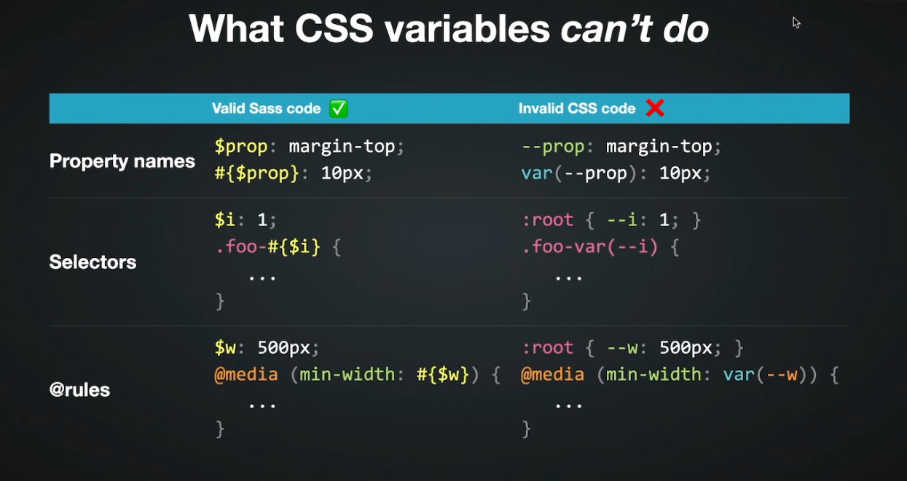
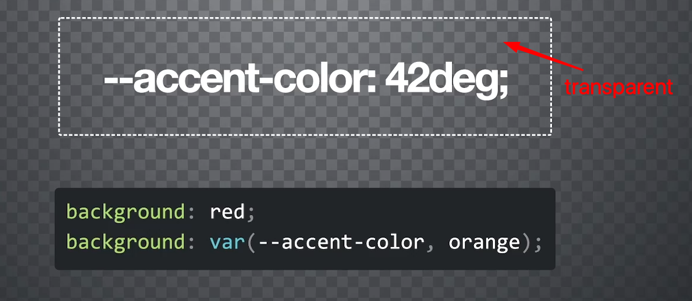
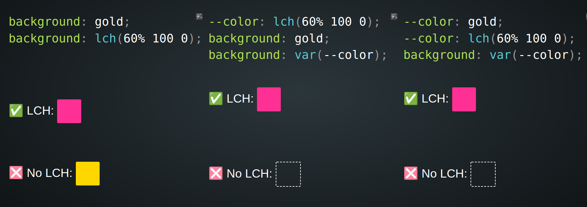
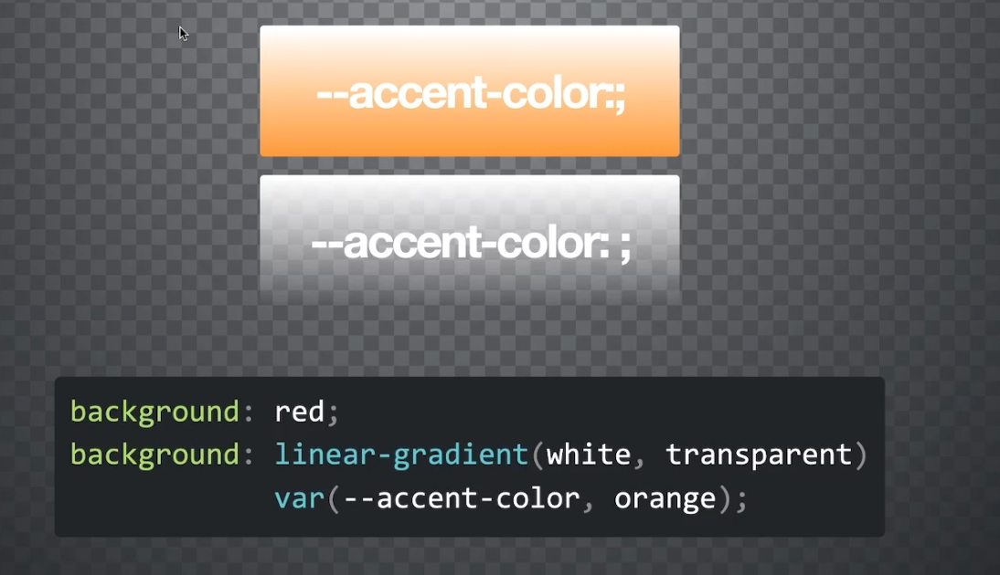
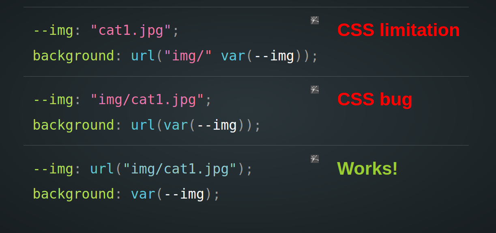
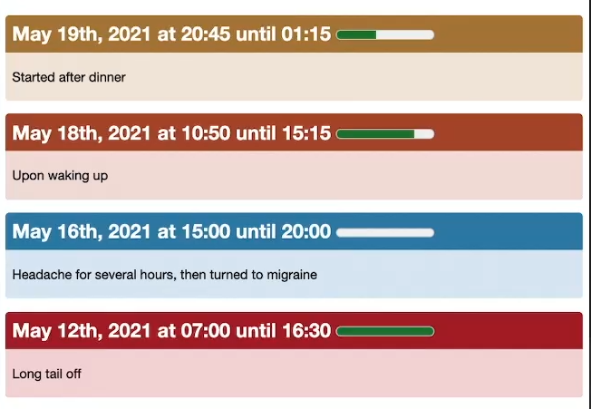

# INDEX

- [INDEX](#index)
  - [CSS Variables (custom properties)](#css-variables-custom-properties)
    - [How to use it](#how-to-use-it)
  - [Scope](#scope)
  - [Fallbacks](#fallbacks)
  - [Variables inheritance](#variables-inheritance)
  - [Invalid At Computed Values Time (IACVT)](#invalid-at-computed-values-time-iacvt)
    - [Fallbacks IACVT](#fallbacks-iacvt)
    - [Cycle IACVT](#cycle-iacvt)
    - [Unsupported value IACVT](#unsupported-value-iacvt)
    - [Space Toggles Hack](#space-toggles-hack)
  - [variables token: Number, string, images](#variables-token-number-string-images)
  - [Css variables with Javascript](#css-variables-with-javascript)
  - [Common Use Cases](#common-use-cases)
  - [Working with Browsers that don't support CSS variables](#working-with-browsers-that-dont-support-css-variables)

---

## CSS Variables (custom properties)

They let us define variables in CSS that can be reused throughout the stylesheet.

- they're also called **custom properties**

  - they're called like that as they act as css-properties where they're `inherited` and they `cascade` (override based on specificity)

- It enables us to abstract values and work with them in a more dynamic way like `props` in `React`

  ```html
  <div style="--primary: red"></div>
  ```

  ```css
  div {
    color: var(--primary);
  }
  ```

  - It's different than writing inline style directly, as it make the code **abstract and maintainable**

- Difference between **CSS variables** and **Sass variables**:

  

---

### How to use it

- **Declaring** them is usually in the `:root` selector **(global scope)** or in the element itself **(local scope)**

  ```css
  :root {
    --primary: blue;
  }
  ```

  - because the `:root` pseudo-class represents the root `<html>` element and is identical to the selector `html`, except that **its specificity is higher** (because `:root` is a `pseudo-class` selector and `html` is a `type` selector)
    - We do this so that the variable is available everywhere in the stylesheet **(Global scope)**
    - We can use them because they're **inherited** from the `root` element

- **Using** css variables is done by using the `var()` function:

  ```css
  .box {
    background-color: var(--primary);
  }
  ```

---

## Scope

Rules of **scope** like in Javascript also applies in css variables, but:

- `Sass` variables are scoped on `{}` blocks (**block-scoped**) (**lexical-scoped**)
- `CSS` variables are scoped on elements (**element(local)-scoped**) (**dynamic-scoped**)

  - this is great if you want the variable-value to only be applied in this element and elements inside it (its descendant elements) only
  - also it's great if you want to **override** the variable-value in a specific element and its descendant elements only

    - we can do this by:

      - declaring the variable in the element itself

        ```css
        div {
          --primary: red;
        }
        ```

      - or declaring it in the inlined-style of the element

        ```html
        <div style="--primary: red"></div>
        ```

      - or declaring it using javascript

        ```js
        document.documentElement.style.setProperty('--primary', 'red');
        ```

```css
/* global scope */
:root {
  --main-bg-color: coral;
}

/* local scope */
#div1 {
  --main-bg-color: coral;
  background-color: var(--main-bg-color);
}
```

---

## Fallbacks

It's a way to provide a default value for the variable **if it's not defined**, but if it's invalid, the browser will set the value to `unset` which is equivalent to `initial` and use the fallback value

- when using the variable, We can use a **Fall-back variable/ value** after a **comma** (`,`) and you can make many fallbacks => ex:

  ```css
  div {
    color:var(--primary, orange)

    /* to request the fallback value manually -> use (initial) */
    color: initial
  }
  ```

- Another way:

  ```css
  @property --primary {
    syntax: '<color>'; /* Type of the value (optional) */
    inherits: true;
    initial-value: orange;
  }
  ```

- **DRY** fallback strategies:

  - use the variable in the fallback value

    ```css
    div {
      --color-initial: black;
      color: var(--color, var(--color-initial));
    }
    ```

  - Pseudo-private properties

    ```css
    div {
      --__color: var(--color, black);
      color: var(--__color);
    }
    ```

  - Using `@property`

    ```css
    @property --color {
      syntax: '<color>';
      inherits: true;
      initial-value: black;
    }

    div {
      color: var(--color);
    }
    ```

---

## Variables inheritance

- css variables are **inherited** from the parent element if it's declared in the parent element to the (`classes` / `pseudo-elements` / `pseudo-classes` / `IDs`) in the same element

  ```css
  button {
    --color: red;
    color: var(--color);
  }

  button:hover {
    background: black;
    color: var(--color); /* red -> inherited */
  }

  button.pink {
    border-color: #f06;
    color: var(--color); /* red -> inherited */
  }

  button.pink:hover {
    background: #f06;
    color: var(--color); /* red -> inherited */
  }
  ```

- you can disable **inheritance** by:

  - setting the property to `initial` on `*` selector:

    ```css
    :root {
      --corner-size: 2em;
    }

    * {
      --corner-size: initial;
    }

    p {
      border-radius: var(--corner-size); /* Won't be inherited */
    }

    p .text {
      --corner-size: inherit; /* Will be inherited */
    }
    ```

  - Or **register property** using: `@property`:

    - `@property` allows us to register our `properties` / `variables` and control how they behave, but watch out for **browser support**

    ```css
    @property --corner-size {
      syntax: '*';
      inherits: false;
      initial-value: 2em;
    }
    ```

---

## Invalid At Computed Values Time (IACVT)

**IACVT**: it's when calling the variable result in error (due to empty value or wrong value or unsupported value by browser), so the value will be set to `unset` which is equivalent to `initial`


> **Parse time**: CSS is read and converted to CSSOM; **computed value**: relative units resolved to `px`; **used value**: final values for painting, % widths resolved to `px`.

### Fallbacks IACVT

```css
/* Ex: */
div {
  background: red;
  --accent-color: 42deg; /* not a valid color */
  background: var(--accent-color, orange);
  /* result will be (color-transparent) */

  /* or */
  background: red;
  background: var(
    --accent-color,
    42deg
  ); /* no value for --accent-color variable, and 42deg is not a valid color for the fallback */
}
```



- This is because the `--accent-color` variable is not a valid color, so the browser will set the value to `unset` which is equivalent to `initial` which is equivalent to `transparent`.
  - It didn't fallback to `orange` because the variable is not a valid color
  - It also didn't use the `initial` value of the property (`red`) because it was overridden by the variable to `unset`

---

### Cycle IACVT

- When we have a cycle in the variable-value, the browser will set the value to `unset` which is equivalent to `initial`

  ```css
  div {
    --primary-color: var(--secondary-color);
    --secondary-color: var(--primary-color);
  }
  ```

  - Here, the browser will set the value of `--primary-color` to `unset` which is equivalent to `initial` because it's dependent on `--secondary-color` which is dependent on `--primary-color`, and the cycle will continue forever

    - **Note**: the browser will not throw an error, it will just set the value to `unset` which is equivalent to `initial`

---

### Unsupported value IACVT

- Example for **IACVT** with `lch` color function, which may not be supported by some browsers
  

---

### Space Toggles Hack

- **Space Toggles Hack**: it's a way to toggle between two values using a space character
  
- For no space in the variable-value:
  - Color will be `orange` (indicating no value for --color)
- For space in the variable-value:

  - Color will be `unset` (`transparent`) (indicating error for --color) because the space character is not a valid color
  - The space character is used to toggle between the two values

---

## variables token: Number, string, images

In css variables, you can make the variable contains a number, a string, or an image, but if you tried to mix them, it will not work (it works with SASS variables though!)

```css
:root {
  /* works ✅ */
  --height: 100vh;
  height: var(--height);

  /* Doesn't work ❌ */
  --height: 100;
  height: var(--height) vh;

  /* Fix (works) ✅ */
  --height-scale: 100;
  --height: calc(var(--height-scale) * 1vh);
}
```

- **Tokens** are the values that can be used in the variable, and they can't contain parts of tokens

- You can make the variable contains the following:
  

  - the opening part of a css function, ex: `linear-gradient(`

    ```css
    html {
    --type: "linear-gradient(";
    background: var(--type) white, black );
    color: red;
    }
    ```

  - a number without a unit like `--p: 65;`

    ```css
    calc(var(--p) * 100vw);
    ```

    - use variables for pure-data like `65`, not css-values like `65%`

    - this way you can use the number for any css-value with any unit unlike if you made the variable with css-value
      - but watch out for numbers as string or integers as here we don't have **type-coercion**

  - image string
    

---

## Css variables with Javascript

- One of the main difference between the **old sass variables** and the **new css custom properties** is that in custom-properties, you can use `Javascript` to change the variables values after the compilation and the loading in the browser which will enable more dynamic styling

- You can **get / set** css-variable-value of an element in javascript by having the variable declared in the root before, then change it's value locally in the element styles:

  ```js
  // Get variable from inline style
  element.style.getPropertyValue('--foo');

  // Get variable from wherever
  getComputedStyle(element).getPropertyValue('--foo');

  // Set variable on inline style
  element.style.setProperty('--foo', 38 + 4);

  // --------------------------------------------------- //

  // or change it in the root element
  let root = document.documentElement;

  document.addEventListener('pointermove', evt => {
    let x = evt.clientX / innerWidth;
    let y = evt.clientY / innerHeight;
    root.style.setProperty('--mouse-x', x);
    root.style.setProperty('--mouse-y', y);
  });
  ```

---

## Common Use Cases

- CSS Reset variables

  ```css
  :root {
    /* 1. colors */
    --primary: #333;
    --secondary: #f06;

    /* 2. font */
    --font: 'Arial', sans-serif;

    /* 3. spacing */
    --padding: 1em;
    --margin: 1em;
    --max-width: 1200px;

    /* 4. border-radius */
    --radius: 5px;

    /* 5. box-shadow */
    --shadow: 0 2px 5px rgba(0, 0, 0, 0.1);

    /* 6. transition */
    --transition: 0.3s ease all;
  }
  ```

- Responsive design

  ```css
  body {
    font-size: calc(90% * var(--font-size-scale));
  }

  @media (min-width: 800px) {
    :root {
      --font-size-scale: 1.2;
    }
  }
  ```

- Color Control

  - We can use css variables to control the color intensity to create dynamic palettes

    ```css
    article {
      --hue: calc(50 - var(--intensity) * 10);
      --color: hsl(var(--hue, 200) 70% 40%);
      background: var(--color);
    }
    ```

    ```html
    <article style="--intensity: 1">yellow</article>
    <article style="--intensity: 2">brown</article>
    <article>default blue</article>
    <article style="--intensity: 3">red</article>
    ```

    

---

## Working with Browsers that don't support CSS variables

- We can't depend on **fallbacks** for browsers that don't support css variables (doesn't support `var()` function), so we can:

  - use **postcss** to convert the css variables to static values
  - Or, use `@supports` to check if the browser supports css variables or not

    ```css
    .box {
      background: red;
      color: blue;
    }

    @supports (--css: variables) {
      .box {
        background: var(--primary);
        color: var(--secondary);
      }
    }
    ```
