# INDEX

- [INDEX](#index)
  - [Transforms (`transform` property)](#transforms-transform-property)
    - [Transform Functions](#transform-functions)
  - [Transition](#transition)
    - [Animating(transitioning) background issue](#animatingtransitioning-background-issue)
  - [CSS Animation (Keyframe Animation)](#css-animation-keyframe-animation)
    - [Animation properties](#animation-properties)
    - [Animation Keyframes Points](#animation-keyframes-points)
    - [Animation choreograph](#animation-choreograph)
    - [Dynamic Animation Updates with Javascript](#dynamic-animation-updates-with-javascript)
    - [data state animation](#data-state-animation)
    - [Animation Notes](#animation-notes)
  - [Transition vs Animation](#transition-vs-animation)
  - [Animation Performance](#animation-performance)
    - [The pixel pipeline](#the-pixel-pipeline)
    - [What to animate?](#what-to-animate)
    - [Hardware Acceleration](#hardware-acceleration)
  - [Designing Animations](#designing-animations)
    - [Action-Driven Animation](#action-driven-animation)
      - [Modal Animation (Open - Close)](#modal-animation-open---close)
      - [Button Animation (Hover - Depress - Release)](#button-animation-hover---depress---release)
    - [Orchestration](#orchestration)
  - [Animation Accessibility](#animation-accessibility)
    - [Accessing in CSS](#accessing-in-css)
    - [Accessing in JavaScript](#accessing-in-javascript)
    - [Accessing in React](#accessing-in-react)
  - [Animation Examples](#animation-examples)
    - [Loading spinner](#loading-spinner)
    - [Converting hamburger-menu icon to close icon](#converting-hamburger-menu-icon-to-close-icon)
    - [Photo card flip](#photo-card-flip)
  - [Animation Libraries](#animation-libraries)
  - [Notes](#notes)

---

## Transforms (`transform` property)

It allows us to change a specified element in some way. It comes with a grab-bag of different transform functions that allow us to move and contort our elements in many different ways.

- It's the best way to change element properties when animating elements in CSS, because it's more efficient as it doesn't trigger layout or paint

### Transform Functions

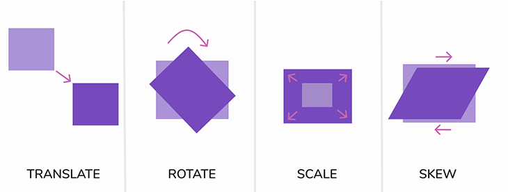

- `translate()` -> it moves the element from its current position
  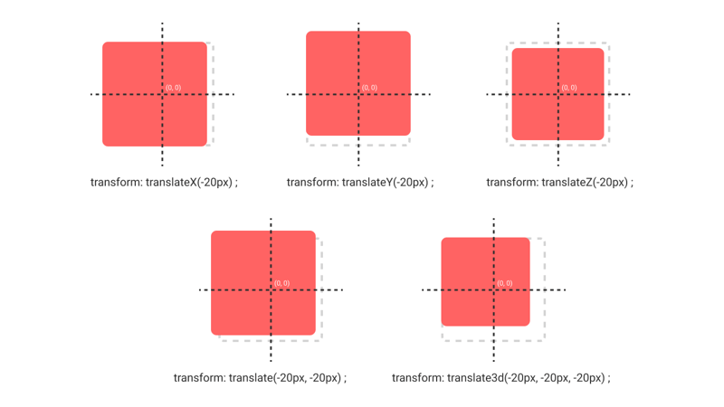

  - We can use it to shift an item along in either axis: `x` moves side to side, `y` moves up and down. **Positive values** move down and to the right. **Negative values** move up and to the left.

  > Critically, the item's in-flow position doesn't change. As far as our layout algorithms are concerned, from Flow to Flexbox to Grid, this property has no effect.
  >
  > For example: If we have 3 flex items next to each other aligned using Flexbox. When we apply a `transform` to the middle child, the Flexbox algorithm doesn't notice, and keeps the other children in the same place. This is similar to how `top` / `left` / `right` / `bottom` work in **positioned layout**, with relatively-positioned elements.

  - Powerfull thing: When we use a **percentage value** in translate, that percentage refers to the element's own size, instead of the available space in the parent container.
    - Setting transform: `translateY(-100%)` moves the box up by its exact height, no matter what that height is, to the pixel.
    - We can also use the magic of `calc()` to do more complex things. For example, `transform: translateY(calc(-100% - 10px))` moves the box up by its height, plus `10` pixels.

- `scale()` -> it scales the element (grow or shrink)
  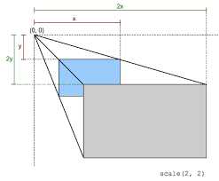

  - `scale` uses a **unitless value** that represents a multiple, similar to `line-height`.
    - `scale(2)` means that the element should be `2x` as big as it would normally be.
  - We can also pass multiple values, to scale the x and y axis independently: `scale(2, 0.5)` would make the element twice as wide and half as tall.
  - What is the difference between `width` and `scale`?
    - `width` changes the size of the element, but it doesn't change the text size inside it and it affects the layout of the page.
      - Because it affects the layout, it can trigger a reflow, which is expensive.
    - `scale` changes the size of the element and everything inside it, including text size, and it doesn't affect the layout of the page.
      - Because it doesn't affect the layout, it's much cheaper. That's why it's the best way to animate elements in CSS.
  - **Note:** This is an advanced technique, But know that it's possible to use scale to increase an element's size without distorting its children. Libraries like [Framer Motion](https://www.framer.com/motion/) take advantage of this fact to build highly-performant animations without stretching or squashing.

- `rotate()` -> it rotates the element
  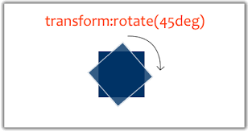

  - We typically use the `deg` unit for rotation, short for degrees. But there's another handy unit we can use, one which might be easier to reason about: `turn`.
    - `1turn` is a full rotation, `0.5turn` is a half rotation, and so on.
    - `rotate(0.5turn)` is the same as `rotate(180deg)`.

- `skew()` -> it skews the element along the X and Y-axis
  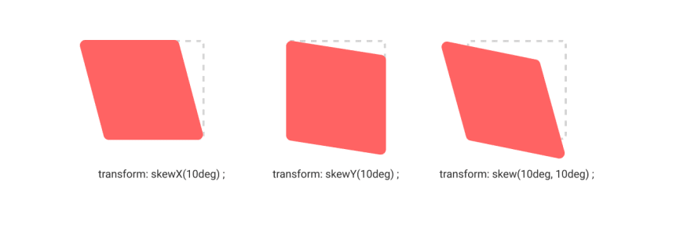

  - It uses the `deg` unit, just like `rotate`.
  - `skew(30deg, 20deg)` would skew the element 30 degrees along the x-axis and 20 degrees along the y-axis.

- `transform-origin` -> it changes the origin of the transform
  

  - The `transform-origin` property allows us to change the point around which the element is transformed.
  - It acts as a **pivot point**.
  - By default, the origin is the center of the element.
  - We can use keywords like `top`, `bottom`, `left`, `right`, `center`, or we can use a length value like `50px`, `10%`, etc.
  - We can also use a combination of keywords and length values, like `top right`, `center bottom`, etc.
  - **Note:** The `transform-origin` property is a shorthand for `transform-origin-x` and `transform-origin-y`. If you only specify one value, it will be used for both x and y.

- `perspective` -> it changes the perspective of the 3D element

  ```css
  .box {
    transform: perspective(100px) rotateY(45deg);
  }
  ```

  - It's used to give a 3D effect to the element.
  - It's more common to use the `perspective` property on the parent element, not the child element. and use it instead of the `perspective` function in the `transform` property.
    - Example here: [Rotating elements (3D perspective)](./2-CSS.md#rotating-elements-3d-perspective)

- `transform-style` -> it defines how nested elements are (rendered and positioned) in 3D space

  - This property allows us to opt in to a genuine 3D engine. We can do cool stuff not possible with `z-index`:

    ```css
    .box {
      transform-style: preserve-3d;
    }
    ```

  - values:
    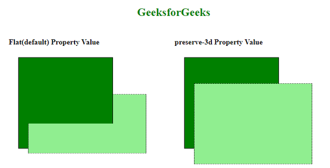
    - `flat` -> default -> it's like 2D, it doesn't render the nested elements in 3D space
    - `preserve-3d` -> it renders the nested elements in 3D space
  - When we apply `transform-style: preserve-3d`, we create a **3D rendering context**. This is similar in philosophy to a stacking context.
    - When we create a 3D rendering context, we allow all descendants to be positioned in 3D space. They'll grow bigger as they approach the user. They'll be allowed to intersect, like the shapes above.
    - Like stacking contexts, the context will apply all the way down the tree, not just to direct children.

- **Notes**:

  - Combining multiple operations

    ```css
    .box {
      transform: translateX(50px) rotate(45deg) scale(1.5);
    }
    ```

    - `transform` is a shorthand property that combines multiple transform functions into one.
    - The order of the functions in the `transform` property matters. The functions are applied in the order they're written.
      - The transform functions are applied from **right to left**, like composition in functional programming.
      - (rotating then scaling) is different from (scaling then rotating).
    - We can use multiple transform functions in the same `transform` property, separated by spaces.

  - The `transform` property is a shorthand for `transform-function`, `transform-origin`, and `transform-style`.
  - **Gotcha**: `transform` doesn't work with **inline elements** in Flow layout.
    - You need to change the display property to `inline-block` or `block` to make it work.

> To generate 3D transform -> [CSS 3D Transform Generator](https://www.cssportal.com/css-3d-transform-generator/)

---

## Transition

`transition` property is used to animate the changes in css properties **over time**

- It works by applying the changes in the css properties over a period of time

- The `transition` shorthand property consists of multiple properties:
  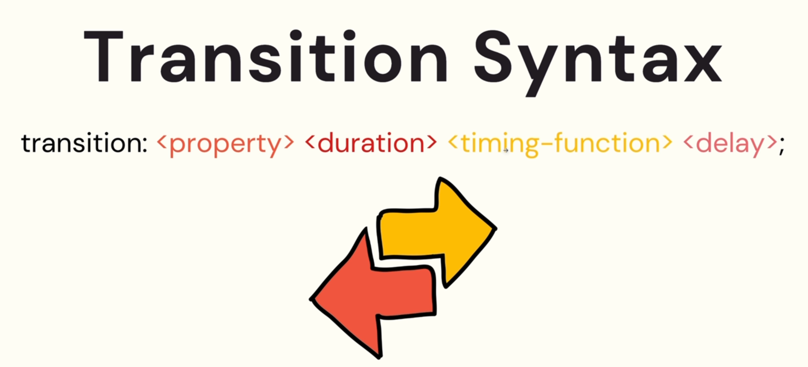

  - Only 2 properties are **required**: `property` and `duration`

- Here're the properties for `transition` separately:

  - `transition-property` -> it's the css-properties that will be animated
  - `transition-duration` -> it's the time the transition takes

    - must specify the unit (`s`), even it's zero seconds

  - `transition-timing-function` -> it's how the transition takes place **(rate of change)**
    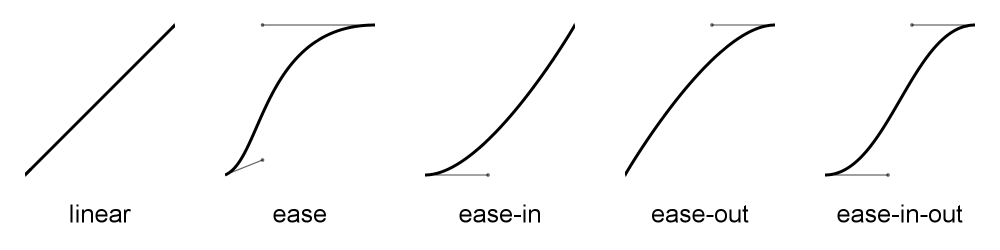

    - `linear` = same speed start to end
      - is rarely the best choice — after all, pretty much nothing in the real world moves this way. Good animations mimic the natural world, so we should pick something more organic!
    - `ease` - **default** = slow start, fast, slow end
      - It's similar to `ease-in-out`, but it's a bit more extreme.
      - is a great option in most cases. Unless you're specifically going for a different effect, ease makes a lot of sense. That's why it's the default.
    - `ease-in` = slow start
      - It's most commonly used when something is leaving the screen (eg. a modal disappearing). It produces the effect that something is moving away from the user, and then slows down as it disappears.
    - `ease-out` = slow end
      - It's most commonly used when something is entering from off-screen (eg. a modal appearing). It produces the effect that something came hustling in from far away, and settles in front of the user.
    - `ease-in-out` = slow start, fast, slow end
      - It's a combination of `ease-in` and `ease-out`.
      - It's most commonly used when something is moving across the screen. It produces the effect that something is moving towards the user, then speeds up as it passes by, and then slows down as it leaves. (eg. element fading in and out over and over)

  - `transition-delay` -> it's the time before the transition starts (postponing the transition)

    - must specify the unit (`s`), even it's zero seconds
    - It's recommended to use it separately from the `transition` shorthand property, because it's not used frequently and it's more readable when it's separated

- If you have multiple different properties and want to make their transition different, you can:

  - Declare each on in the block where it happens

    ```css
    button {
      opacity: 0.5;
    }

    button:active {
      transition-duration: 0.5;
      opacity: 1;
    }
    ```

  - Or, declare multiple values in the `transition-property` separated by comma

    ```css
    button {
      transition-property: background-color, border-radius;
      transition-duration: 4s, 2s;
    }
    ```

- If you plan on animating multiple properties, you can pass it a comma-separated list:

  ```css
  button {
    transition: background-color 1s, border-radius 2s;
  }
  ```

- **Notes:**

  - `transition-property` takes a special value: `all`. When `all` is specified, any CSS property that changes will be transitioned. It can be tempting to use this value, as it saves us a good chunk of typing if we're animating multiple properties, but **It's not recommended**.
    - This is because it can lead to unexpected behavior. If you add a new property to the element, it will be transitioned as well, which might not be what you want.
    - At some point in the future, you (or someone on your team) will change this CSS. You might add a new declaration that you don't want to transition. It's better to be specific, and avoid any unintended animations. (Animation is like salt: too much of it spoils the dish.)
  - Custom timing function curve

    - You can create your own timing function curve using `cubic-bezier` function

      ```css
      button {
        transition: background-color 1s cubic-bezier(0.17, 0.67, 0.83, 0.67);
      }
      ```

    - You can use online tools to generate the cubic-bezier curve, like [cubic-bezier.com](https://cubic-bezier.com/)
      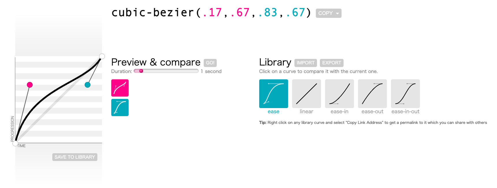
    - You can also pick from this [extended set of timing functions](https://easings.net/). Though beware: a few of the more outlandish options won't work in CSS.
      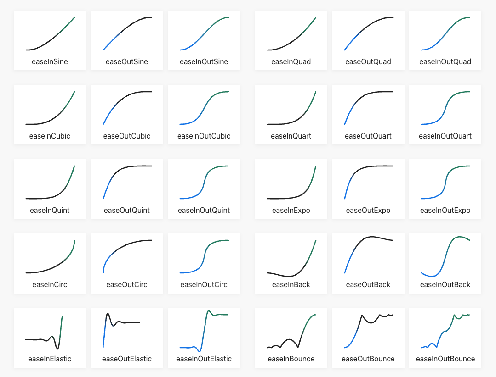

  - Common `transition-delay` issue:

    - Have you ever tried to mouse over a nested navigation menu, only to have it close before you get there?
      
    - As a JS developer, you can probably work out why this happens: the dropdown only stays open while being hovered! As we move the mouse diagonally to select a child, our cursor dips out of bounds, and the menu closes.

    - The solution is to add a delay to the transition, so that the menu doesn't close immediately when the cursor leaves the parent. This gives the user a chance to move their cursor to the child menu.

      ```css
      .dropdown {
        opacity: 0;
        transition: opacity 400ms;
        transition-delay: 300ms;
      }
      .dropdown-wrapper:hover .dropdown {
        opacity: 1;
        transition: opacity 100ms;
        transition-delay: 0ms;
      }
      ```

    - This way, the dropdown will stay open for 300ms after the cursor leaves the parent, giving the user a chance to move their cursor to the child menu.

  - **"Doom flicker" issue**

    - It's a common animation bug where an element stutters up and down quickly in an unintentional, unpleasant way:
      
    - The issue is that the `transition` property is applied to the element when it's first rendered, and then removed when the element is removed from the DOM. This causes the element to animate back to its original state before it's removed.
    - To solve this problem, we separate the trigger from the effect. We listen for hovers on the parent `<button>`, but apply the transformation to a child element. This ensures that the hover target won't move out from under the cursor.

      ```html
      <!-- Before ❌ -->
      <style>
        .btn {
          width: 100px;
          height: 100px;
          border: none;
          border-radius: 50%;
          background: slateblue;
          color: white;
          font-size: 20px;
          font-weight: 500;
          line-height: 1;
          transition: transform 250ms;
        }

        .btn:hover {
          transform: translateY(-10px);
        }
      </style>

      <button class="btn">Hello World</button>

      <!-- After ✅ -->
      <style>
        .btn {
          width: 100px;
          height: 100px;
          border: none;
          background: transparent;
          padding: 0;
        }

        .btn:hover .btn-contents {
          // 👈 apply the transform to the content when the wrapper is hovered
          transform: translateY(-10px);
        }

        .btn-contents {
          display: grid;
          place-content: center;
          height: 100%;
          border-radius: 50%;
          background: slateblue;
          color: white;
          font-size: 20px;
          font-weight: 500;
          line-height: 1;
          transition: transform 250ms;
        }
      </style>

      <button class="btn">
        <span class="btn-contents">Hello World</span>
      </button>
      ```

      - This works because hover states bubble up, just like `mouseEnter` events in JavaScript. When we hover over `.btn-contents`, we're also hovering over all of its ancestors (`.btn`, `body`, etc).

---

### Animating(transitioning) background issue

- You can't use `background` with `transition` property, so if you want to animate the background you can either:

  - use `background-color` or `background-image` instead.

  - use `box-shadow` with `inset` instead:

    ```css
    button {
      transition: 1s;
    }

    button:hover {
      box-shadow: 0 0 0 2em red inset;
    }
    ```

---

## CSS Animation (Keyframe Animation)

**CSS keyframe animations** are declared using the `@keyframes` at-rule. We can specify a transition from one set of CSS declarations to another

- Applying animation to an element is done by 2 steps:

  1. Define the animation with a name -> `@keyframes`

     - `keyframes` is a rule which allows you to **define an animation sequence** with multiple steps

     ```css
     @keyframes move {
       from {
         transform: translateX(20px);
       }
       to {
         transform: translateX(100px);
       }
     }
     ```

  2. Apply the animation -> `animation-name` and properties

     ```css
     div {
       animation-name: move;
       animation-duration: 10s;
       animation-iteration-count: 3;

       /* or using the shorthand */
       animation: move 10s infinite;
     }
     ```

- The browser will interpolate the declarations within our `from` and `to` blocks, over the duration specified. This happens immediately, as soon as the property is set.

- Keyframe animations are meant to be general and reusable. We can apply them to specific selectors with the animation property and not just one element.

### Animation properties

`animation` property consists of multiple properties:

- `animation-name`
- `animation-duration`
- `animation-delay`
  - It's the time before the animation starts (for each iteration)
- `animation-iteration-count`

  - It's the number of times the animation will run

    - `1` -> it will run once
    - `2` -> it will run twice
    - `n` -> it will run `n` times
    - `infinite` -> it will run forever (common for loading-state animations)

      > Note that for loading-spinners, we want to use a `linear` timing function, so that the spinner doesn't speed up or slow down as it spins.

- `animation-direction`
  - It's the direction of the animation, it controls the order of the keyframes (from start to end)
    - `normal` -> default -> from `0%` to `100%`
    - `reverse` -> from `100%` to `0%` **(Backwards)**
    - `alternate` -> from `0%` to `100%` then from `100%` to `0%`
    - `alternate-reverse` -> from `100%` to `0%` then from `0%` to `100%`
- `animation-timing-function`

  - It's how the animation takes place (rate of change)
    

    - `ease` - default = slow start, fast, slow end
    - `linear` = same speed start to end
    - `ease-in` = slow start
    - `ease-out` = slow end
    - `ease-in-out` = slow start, fast, slow end

- `animation-fill-mode`

  - it's what happens when the animation finishes or before it starts (before the first iteration)
    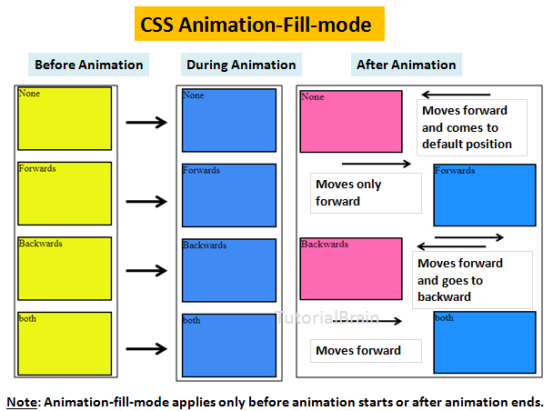

    - `none` -> default -> go to initial state (`0%`) before start and go to final state (`100%`) after finish
      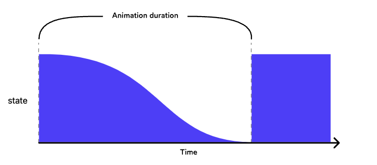
      - Technically it doesn't go to the `0%` state, it just doesn't apply the styles from the keyframes and goes to the initial state (the state before the animation)
    - `forwards` -> **stick to final state (100%)** after finish (moving forward)
      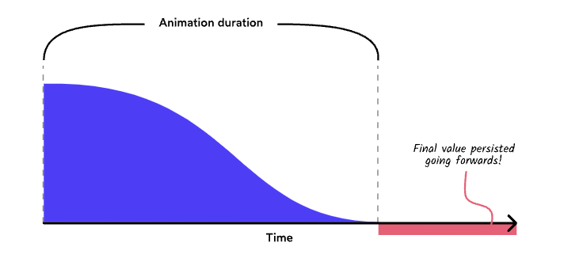
    - `backwards` -> default -> go to initial state (`0%`) after finish (moving backward)
      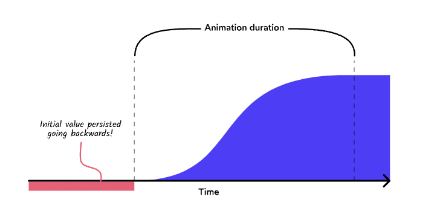

      - It's to copy all of the declarations in the `from` block and apply them to the element ASAP, before the animation has started.
      - Useful when we have `animation-delay` and we want to apply the styles before the animation starts

    - `both` -> `forwards` + `backwards` -> **stick to final state (100%)** + go to initial state (`0%`) after finish
      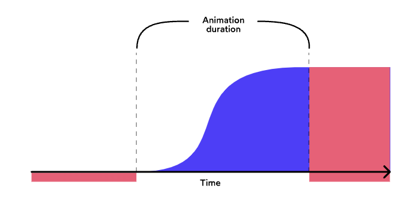
      - What if we want to persist the animation `forwards` and `backwards`? We can use a third value, both, which persists in both directions
      - Useful when we want to apply the styles before the animation starts and after it finishes (e.g. delay and persist the final state)

- `animation-play-state`
  - it's to pause and resume the animation
    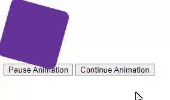
    - `paused` -> pause the animation
    - `running` -> resume the animation

---

### Animation Keyframes Points

They're used to define the animation states and the time between them (the animation steps)
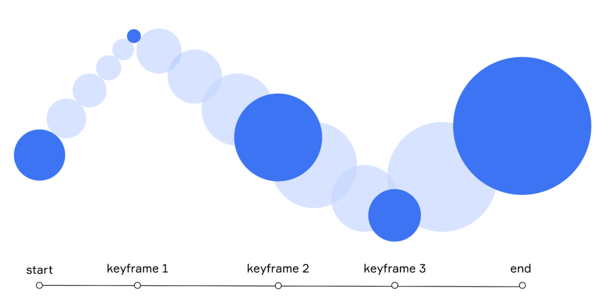

- `keyframes` are different from `transition` as they're not just the start and end points, but they're the steps between them

- `keyframes` can be defined in **percentage `%`** or by `from` and `to`:

  ```css
  div {
    animation-name: move;
    animation-duration: 10s;
    animation-iteration-count: 3;

    /* or using the shorthand */
    animation: move 10s infinite;
  }

  @keyframes move {
    0% {
      transform: translateX(20px);
    }
    50% {
      transform: translateX(100px);
      background: red;
    }
    75% {
      transform: translateX(-200px);
      background: yellow;
    }
    100% {
      transform: translateX(20px);
      background: green;
    }
  }

  /* or when we have one start point and one end point */

  @keyframes move {
    from {
      transform: translateX(20px);
    }
    to {
      transform: translateX(100px);
      background: red;
    }
  }
  ```

- If you have multiple keyframes steps that have the same properties, you can combine them using comma (`,`):

  ```css
  @keyframes move {
    0%,
    100% {
      transform: translateX(20px);
    }
    50% {
      transform: translateX(100px);
    }
  }
  ```

- **Alternating animations**

  - It's when you want to animate an element **back and forth** between two states
  - It can be done using 2 approaches:

    1. Using odd number of keyframes (minimum 3 keyframes)

       ```css
       @keyframes move {
         0% {
           transform: scale(1);
         }
         50% {
           transform: scale(1.5);
         }
         100% {
           transform: scale(1);
         }
       }
       ```

    2. Using `alternate` value in `animation-direction` property

       ```css
       div {
         animation: move 2s infinite alternate;
       }

       @keyframes move {
         0% {
           transform: scale(1);
         }
         100% {
           transform: scale(1.5);
         }
       }
       ```

---

### Animation choreograph

it's to use the `nth-child` selector and **CSS variables** to choreograph animations between multiple elements.

```scss
.balls-container {
  --duration: 1s;
  animation: move-right var(--duration) both;

  &:nth-child(2) {
    animation-delay: calc(var(--duration) - 0.1s);
  }
  &:nth-child(3) {
    animation-delay: calc(var(--duration) * 2 - 0.1s * 2);
  }
}
```

---

### Dynamic Animation Updates with Javascript

So far, all of the examples we've seen involve an animation running right on page load (or after a prescribed delay).

That's not quite the right way to think about it though. There's no rule that says that animations need to happen immediately! We can start and stop them whenever we want, and even change their properties on the fly.

- It's more accurate to say that the animation will start as soon as a valid animation is wired up, using the `animation` property. Using JavaScript, we can add that property dynamically, at any point in time:

  ```html
  <style>
    .box {
      width: 100px;
      height: 100px;
      background: red;
      animation: move 2s infinite;
    }

    @keyframes move {
      0% {
        transform: translateX(0);
      }
      100% {
        transform: translateX(100px);
      }
    }
  </style>

  <div class="box"></div>

  <script>
    const box = document.querySelector('.box');
    box.addEventListener('click', () => {
      box.style.animation = 'undefined'; // stop the animation
      box.style.animation = 'move 2s infinite'; // start / restart the animation
    });
  </script>
  ```

  - When the page loads, the `animation` property is set to `undefined`, and so nothing happens. When the user clicks the box, the `animation` property is set to `move 2s infinite`, and the animation starts.
  - To stop the animation, we set the `animation` property to `undefined`. This is a bit of a hack, but it works. The browser will stop the animation immediately, and the element will revert back to its default CSS.

- Notes:
  - When we remove the `animation` property, all of the CSS in the from and to blocks evaporates immediately. The element will revert back to its default CSS.
    - This is known as an **“interruption”**. `@keyframes` animations don't handle interruptions well.
    - There is a tool that can help in certain situations, though: `animation-play-state`. This property can pause and resume animations, and it has [excelent browser support](https://caniuse.com/?search=animation-play-state).

---

### data state animation

You can use `data-state` attribute to define state and make css values established based on current data-state

- you change data.state in Javascript which then reflects in the `data-state` HTML attribute, then define which css property will be shown

```css
.container[data-state='success'] {
  animation: slide-up 1s both;
}
```

---

### Animation Notes

- The **timing function** applies to each step. We don't get a single ease for the entire animation
- `animation-fill-mode` applies to the first iteration of the animation, not the last. If you want the final state to stick, you need to use `forwards` or `both`.
- Note that when using the `animation-direction` property with `alternate` or `alternate-reverse`, these things will happen:
  - The animation will be done in **half the time** because it's going from `0%` to `100%` then from `100%` to `0%`, and the time is shared between them
  - the `animation-fill-mode` property will apply to both the forwards and backwards animations.
- `animation` shorthand property can be used to define all the animation properties in one line

  ```css
  div {
    /* animation: name duration timing-function delay iteration-count direction fill-mode play-state; */
    animation: move 10s infinite;
  }
  ```

  - Here's a piece of good news, as well: the order doesn't matter. For the most part, you can toss these properties in any order you want.

    ```css
    .box {
      /* This works: */
      animation: grow-and-shrink 2000ms ease-in-out infinite alternate;
      /* This also works! */
      animation: grow-and-shrink alternate infinite 2000ms ease-in-out;
    }
    ```

    - This works because different properties accept different values; `alternate`, for example, isn't a valid `timing-function` or `iteration-count`, so the browser can deduce that you mean to assign it to `animation-direction`.
    - There is an exception: `animation-delay` property needs to come after the `duration`, since both properties take the same value type (milliseconds/seconds).

      - For that reason, It's prefered to exclude delay from the shorthand:

        ```css
        .box {
          animation: grow-and-shrink 2000ms ease-in-out infinite alternate;
          animation-delay: 500ms;
        }
        ```

- We can access scoped CSS-Variables defined in the selector -> inside the `@keyframes` block

  ```css
  @keyframes move {
    0% {
      transform: translateX(var(--start));
    }
    100% {
      transform: translateX(var(--end));
    }
  }

  .circle {
    --start: 0;
    --end: 100px;
    animation: move 2s infinite;
  }
  ```

  - This is because the `@keyframes` block is a child of the selector (where the animation is used), and so it can access the CSS variables defined in the selector.

---

## Transition vs Animation

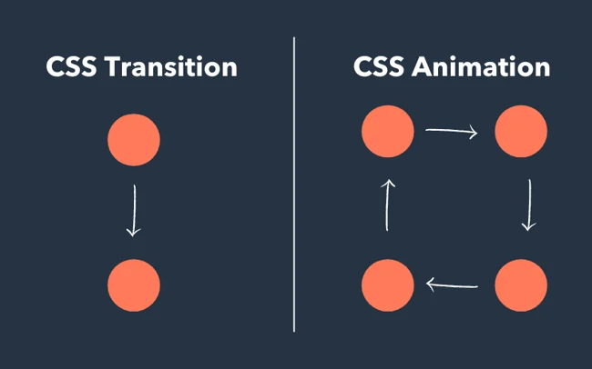

The main differences between `transition` and `animation`:

| Transition                                              | Animation                                |
| ------------------------------------------------------- | ---------------------------------------- |
| Simple animations between 2 states (like hover effects) | Complex animations with multiple states  |
| Changes happen between start and end state              | Can define multiple steps with keyframes |
| Can't be reused easily                                  | Can be reused across different elements  |

Key points:

- `transition` is best for state changes (like hover effects)
- `animation` is better for:
  - Looping animations
  - Multi-step animations
  - Animations that can be paused
  - Animations that start when page loads

Choose `transition` for simple state changes, and `animation` for more complex, repeating, or automatic animations.

---

## Animation Performance

Performance is important when is comes to animation, Sluggish animations can ruin an otherwise good user experience.

The tolerances are also really tight. In order for our brain to perceive motion as fluid and believable, it needs to run at **60 frames per second**: this leaves us with only ~16 milliseconds to update each frame!

### The pixel pipeline

Animation in an expensive process of CPU/GPU and specially on CPU, and it's related to how the browser-rendering-engine works:
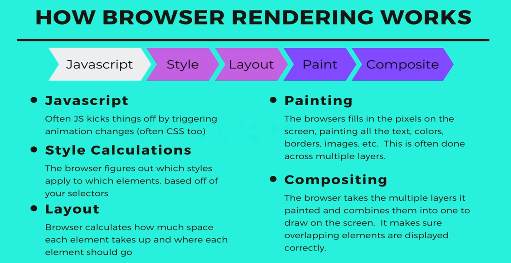

- If we want to update the colors of the pixels on our screen, there's a pipeline of possible steps (pixel pipeline):

  1. **Recalculate styles**

     - it figures out which CSS rules apply to which elements
     - it's the most expensive step, because it requires the browser to recalculate the layout of the page

  2. **Layout**

     - it figures out where things are on the screen

  3. **Paint**

     - once we know where everything is, we can start painting them. This is the process of figuring out which color every pixel should be (“rasterization”), and filling it in.
     - it fills in the pixels

  4. **Composite**

     - it blends all the layers together to create the final version of the page
     - it's the cheapest and most desirable for high pressure points in an app's lifecycle, like `animations` or `scrolling`
     - It lets the browser re-use the work done in previous frames.
       - It was invented to help with scroll performance. In the early days of the web, the entire page had to be repainted on every frame when the user scrolled. This was slow and miserable, so the smart folks who work on browsers found a way to skip the paint process, and instead slide the page's content up or down when the user scrolls.
       - Compositing is lightning-quick because it doesn't have to do many calculations. It's all about transforming the stuff it has already calculated (sliding it around, rotating it, etc).

- Different CSS properties will trigger different steps in the pixel pipeline. If we animate an element's `height`, we'll need to recalculate the layout, since an item shrinking might mean that its siblings scoot up to fill the space.

Here are some guidelines (CSS triggers):

- **Composite** ✅ -> It's for blending things together like with: `transform`, `opacity`

  - If you change a property that requires neither layout nor paint, and the browser jumps to just do compositing.
  - This final version is the cheapest and most desirable for high pressure points in an app's lifecycle, like `animations` or `scrolling`.
    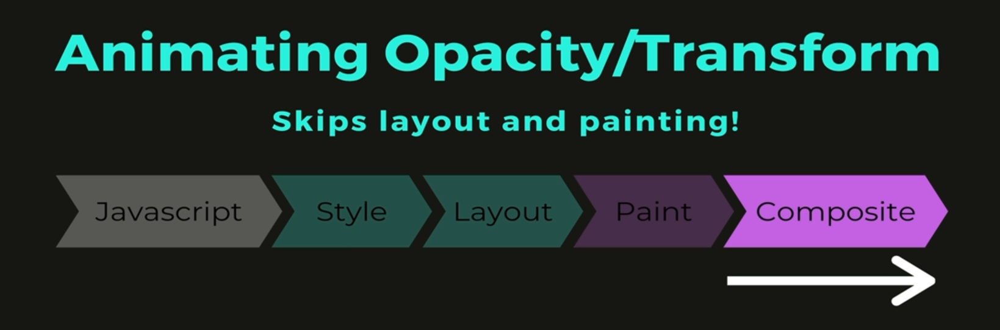

  > You can find more here: [Stick to Compositor](https://web.dev/stick-to-compositor-only-properties-and-manage-layer-count/)

- **Painting** 🤞 -> `color`, `background`
  - browser skips layout, but it will still do paint.
    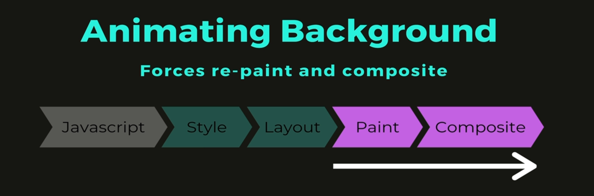
  - it's not too expensive for rendering
- **Layouts** ❌ -> one that changes an element’s geometry, like its `height`, `width`, `left`, `right`, `margin`, `padding` etc (**things that trigger layouts**)
  - the browser will have to check all the other elements and “reflow” the page. Any affected areas will need to be repainted
    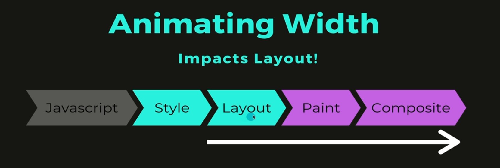
  - it's very costly because it forces the browser to recalculate the layout of the page, **So try to avoid it as much as possible**
    - instead use `transform: translate()`

---

### What to animate?

Based on their performance impact on the pixel pipeline, here are the CSS properties grouped by their operation type:

**Composite Operations (Best Performance)** ✅

- `transform` -> `translate`, `rotate`, `scale`, `skew`
- `opacity`

**Paint Operations (Medium Performance)** 🤞

- `border-radius`
- `background`
- `color` -> changing the color will never affect the layout as it doesn't change the element's position on the page
- `box-shadow`

**Layout Operations (Worst Performance)** ❌

- `width`/`height`
- `position`
- `margin`/`padding`

> **Pro tip**: For optimal animation performance, stick to composite operations (`transform` and `opacity`) whenever possible.

**Does that mean that you can only ever animate `transform` and `opacity`?**

- Personally, I think we can be a little bit more flexible than that. Not all repaints / layout-recalculations are created equal! For example, tweaking the height of an absolutely-positioned element tends to be quicker, since there's no chance that it will cause siblings to be shifted.

---

### Hardware Acceleration

Depending on your browser and OS, you may occasionally notice a curious stutter on certain animations, **This happens because of a hand-off between the computer's CPU and GPU**.

- When we animate an element using `transform` and `opacity`, the browser will sometimes try to optimize this animation. Instead of rasterizing the pixels on every frame, it transfers everything to the **GPU** as a texture.
  - **GPUs** are very good at doing these kinds of texture-based transformations, and as a result, we get a very slick, very performant animation. This is known as **“hardware acceleration”**.
- Here's the problem: **GPUs** and **CPUs** render things slightly differently. When the **CPU** hands it to the **GPU**, and vice versa, you get a snap of things shifting slightly.
- We can fix this problem by adding the following CSS property:

  ```css
  .box {
    will-change: transform;
  }
  ```

  - `will-change` is a CSS property that lets the browser know that an element is likely to change in the future. This allows the browser to prepare for the change, and optimize the animation.
  - In practice, what this means is that the browser will let the GPU handle this element all the time. No more handing-off between CPU and GPU, no more telltale “snapping into place”.

- **Tradeoffs**
  - Nothing in life comes free, and hardware acceleration is no exception. By delegating an element's rendering to the GPU, it'll consume more video memory, a resource that can be limited, especially on lower-end mobile devices.
    - This isn't as big a deal as it used to be — There're some testing on a Xiaomi Redmi 7A, a popular budget smartphone in India, and it seems to hold up just fine. Just don't broadly apply `will-change` to elements that won't move. Be intentional about where you use it.
- **But when to use `will-change`?**
  - It's best to use `will-change` when you know that an element is going to change in the future. If you're animating an element on hover, for example, you can add `will-change: transform` to the hover state.
  - When you're animating properties that aren't `transform` or `opacity`, you can use `will-change` to hint to the browser that it should prepare for the change.
  - It's not a magic bullet, and it's not a property that you should apply to every element on your page. It's a tool to be used judiciously, and with care.

---

## Designing Animations

### Action-Driven Animation

#### Modal Animation (Open - Close)

- For opening and closing a modal, we usually have different settings for each state:

  - **Opening**:
    - enter duration -> `500ms`
    - enter timing function -> `ease-out`
  - **Closing**:
    - exit duration -> `300ms`
    - exit timing function -> `ease-in`

But how can we have multiple settings for the same animation?

- If the animation is based on a pseudo-selector like `:hover`, we can do it by using different `transition` values:

  ```html
  <style>
    .button {
      /* Exit animations */
      transition: transform 500ms;
    }
    .button:hover {
      transform: scale(1.1);

      /* Enter animation */
      transition: transform 150ms;
    }
  </style>

  <button class="button">Hello World</button>
  ```

  - When the mouse is resting atop the element, the :hover declarations apply, and so the enter animation will be given `transition: transform 150ms`. The moment the mouse leaves the element, though, it falls back to the default `transition: transform 500ms`, and uses that transition for the exit animation.

- If the animation is based on a class or action (keyframes animation), then we can **use Javascript to change the duration dynamically**:

  ```jsx
  const ENTER_DURATION = '500ms';
  const EXIT_DURATION = '250ms';
  const ENTER_EASE = 'ease-out';
  const EXIT_EASE = 'ease-in';
  function Modal({ isOpen, children }) {
    return (
      <Wrapper
        style={{
          '--transition-duration': isOpen ? ENTER_DURATION : EXIT_DURATION,
          '--timing-function': isOpen ? ENTER_EASE : EXIT_EASE
        }}>
        <DialogContent>{children}</DialogContent>
      </Wrapper>
    );
  }
  const Wrapper = styled(DialogOverlay)`
    transition: transform var(--transition-duration) var(--timing-function);
  `;
  ```

---

#### Button Animation (Hover - Depress - Release)

> Full details here: [Building a Magical 3D Button](https://www.joshwcomeau.com/animation/3d-button/)

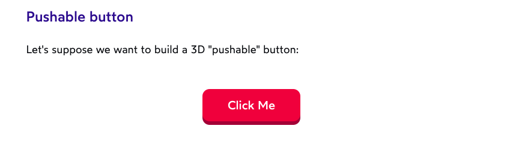

- When I see this effect implemented online, I typically see people use `borders` or `box-shadows`. These implementations are fine for static buttons, but if we want to animate it, we'll have a much smoother effect if we stick with transforms.

💡 Instead, we'll separate the button into 2 layers: a light-colored front, and a dark-colored back. The front layer will move up and down.

- Below, we've implemented the broad strokes of this effect, but with no transitions! Update the code so that there are distinct, action-based animations for the following 3 actions:

  - Hovering
  - Clicking
  - Leaving (moving the mouse away from the button)

- CSS Solution

  ```html
  <style>
    .front {
      transform: translateY(-4px);
      transition: transform 500ms;
    }
    .pushable:hover .front {
      transform: translateY(-6px);
      transition: transform 250ms;
    }
    .pushable:active .front {
      transform: translateY(-2px);
      transition: transform 50ms;
    }
  </style>
  <button class="pushable">
    <span class="front">Push me</span>
  </button>
  ```

- Also JavaScript can help with true action-driven animation. Here's a quick sketch showing how I'd solve this problem in React:

  ```jsx
  function Button({ children }) {
    /*
    We track 4 actions:
      • "hovering", the user is mousing over the button
      • "depressed", the user is pressing down on it
      • "released", the user has released the button
      • "exited", the user has moused away
    */
    const [mostRecentAction, setMostRecentAction] = React.useState(null);
    /* Calculate the right styles based on the action */
    let styles = {};
    if (mostRecentAction === 'hovering') {
      styles = {
        transform: 'translateY(-6px)',
        transition: 'transform 250ms'
      };
    } else if (mostRecentAction === 'depressed') {
      styles = {
        transform: 'translateY(-2px)',
        transition: 'transform 50ms'
      };
    } else if (mostRecentAction === 'released') {
      styles = {
        transform: 'translateY(-6px)',
        transition: 'transform 200ms'
      };
    } else {
      // The default value
      // Used initially, before any actions have occurred, and also
      // when exiting.
      styles = {
        transform: 'translateY(-4px)',
        transition: 'transform 500ms'
      };
    }
    return (
      <button
        style={styles}
        // Set the action based on the JS event:
        onMouseEnter={() => setMostRecentAction('hovering')}
        onMouseDown={() => setMostRecentAction('depressed')}
        onMouseUp={() => setMostRecentAction('released')}
        onMouseLeave={() => setMostRecentAction('exited')}>
        {children}
      </button>
    );
  }
  ```

---

### Orchestration

> **Orchestration** is the art of coordinating multiple animations to create a cohesive, delightful experience.

In [Action-Driven Animation section](#action-driven-animation), we saw how we can improve a modal animation by differentiating between enter and exit actions. **We can improve that animation even more by sequencing it**.

- Example: Modal Animation

  - every modal contains multiple different elements, We can vastly improve the modal's animation by orchestrating the different elements, as Instead of everything happening all at once, the individual elements are staggered:
    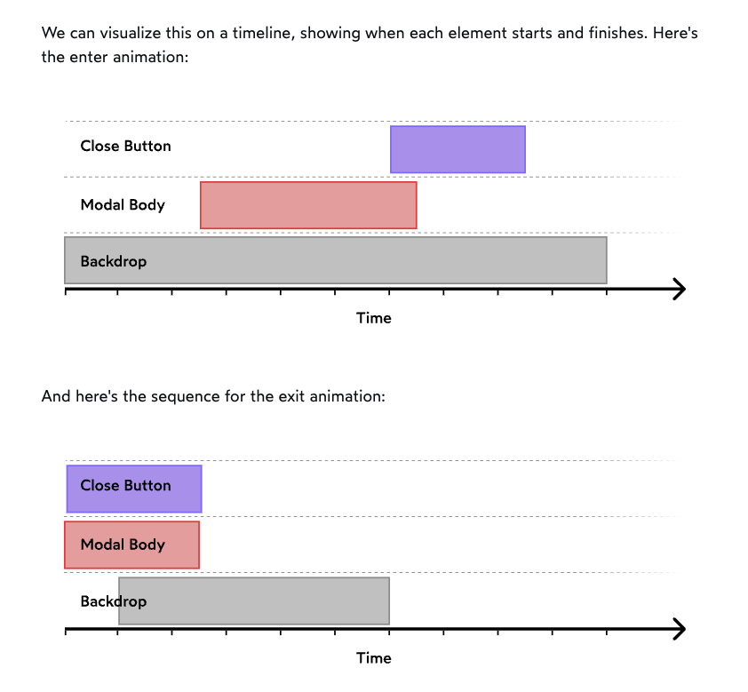

    - The backdrop starts fading in right away, and lasts a long time (`1000ms`).
    - The modal waits for `250ms`, and then slides in over `400ms`
    - The close button is now hidden by default, and is given its own unique transition. It starts animating after `600ms`, and lasts `250ms`.

  - It may seem like overkill, but this level of attention-to-detail is key for creating next-level animations. This is the secret sauce.

  - Here's a high-level sketch of our sequenced modal animation, using React:

    ```jsx
    function Modal({ isOpen, handleDismiss, children }) {
      return (
        <Wrapper>
          <Backdrop
            style={{
              opacity: isOpen ? 0.75 : 0,
              transition: 'opacity',
              transitionDuration: isOpen ? '1000ms' : '500ms',
              transitionDelay: isOpen ? '0ms' : '100ms',
              transitionTimingFunction: isOpen ? 'ease-out' : 'ease-in'
            }}
            onClick={handleDismiss}
          />
          <DialogContent
            style={{
              transform: isOpen ? 'translateY(0vh)' : 'translateY(100vh)',
              transition: 'transform',
              transitionDuration: isOpen ? '400ms' : '250ms',
              transitionDelay: isOpen ? '250ms' : '0ms',
              transitionTimingFunction: isOpen ? 'ease-out' : 'ease-in'
            }}>
            <ButtonWrapper>
              <CloseButton
                onClick={handleDismiss}
                style={{
                  opacity: isOpen ? 1 : 0,
                  transform: isOpen ? 'translateY(0)' : 'translateY(25%)',
                  transition: 'opacity, transform',
                  transitionDuration: '250ms',
                  transitionDelay: isOpen ? '600ms' : '0ms'
                }}
              />
            </ButtonWrapper>
            {children}
          </DialogContent>
        </Wrapper>
      );
    }
    ```

- **The `transitionEnd` event**

  - Another way to manage orchestration is to use the `transitionEnd` event.

    ```js
    element.addEventListener('onTransitionEnd', () => {
      // Whenever a transition completes on the target element,
      // this function will be called.
    });
    ```

  - Instead of fiddling with delays, we instruct one animation to start the moment another one ends. This can clean up our code, and make it easier to reason about the relationship between elements.
  - EX:

    ```js
    element.addEventListener('transitionend', () => {
      // When the backdrop finishes fading in, we'll start sliding in the modal
      modal.style.transform = 'translateY(0)';
    });
    ```

---

## Animation Accessibility

**Motion can be disorienting for some users**, and can even trigger motion sickness. It's important to provide a way for users to opt-out of animations.

- Modern operating systems offer a remedy for this: users can opt out of animations. The setting is meant primarily for the OS, but websites and web applications can now access that value and use it in our CSS and JS. It's our job to check and respect that value.

> **Vestibular disorders** are a group of conditions that can cause dizziness, vertigo, and nausea due to the way the brain processes information from the inner ear. Motion on a screen can trigger these symptoms, so it's important to provide a way for users to opt-out of animations.
>
> Usually these symptoms are triggered by animations that have a lot of **motion**, or that move quickly. and usually not triggered by **subtle animations** like fades or slow transitions.

- Opting out of animations

  - For a few years now, operating systems have been letting users request a motion-free experience, typically within the Accessibility settings:
    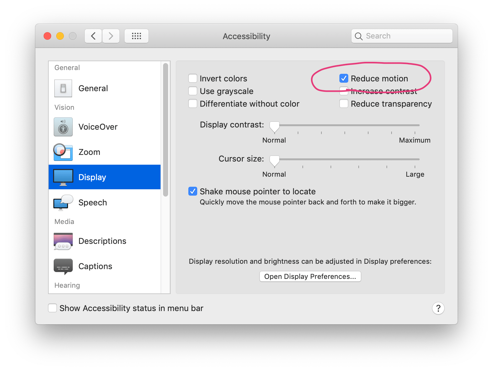

  - Happily, this setting now exists in all mainstream operating systems, including desktop (MacOS 10.12+, Windows 7+, Linux) and mobile (iOS, Android 9+). You can google _"reduce animations [operating system]"_ to find the specific instructions for your device.
  - Apple added a media query that Safari could use to hook into this setting: `prefers-reduced-motion`. In the years since, other browsers and operating systems have followed suit. Today, [browser support is very good](https://caniuse.com/?search=prefers-reduced-motion).

---

### Accessing in CSS

```css
.fancy-box {
  width: 100px;
  height: 100px;
  transform: scale(1);
  transition: transform 300ms;
}
.fancy-box:hover {
  transform: scale(1.2);
}
@media (prefers-reduced-motion: reduce) {
  .fancy-box {
    transition: none;
  }
}
```

- This media query is a game-changer. It lets us write CSS that respects the user's preference, and it's supported in all modern browsers.
- If they've ticked the "reduce animations" checkbox, `prefers-reduced-motion` will be set to `reduce`. The CSS rules in that media query will apply, disabling the transition on our .fancy-box selector.
- This might not work for older browsers, and there's another approach for this, which is to only apply animation when the user has no preference:

  ```css
  /* ...other styles */

  @media (prefers-reduced-motion: no-preference) {
    .fancy-box {
      transition: transform 300ms;
    }
  }
  ```

  - This way, we're only applying the transition when the user has no preference. If they've opted out of animations, the transition will be disabled.

### Accessing in JavaScript

- The media query shown above works great for animations that take place entirely from within CSS (eg. transitions, keyframe animations). However, there are many types of animations that cannot be done entirely through CSS like:

  - Animations using spring physics.
  - Animations involving the cursor coordinates, scroll position, or other “environment” factors.
  - HTML5 Canvas animations.
  - Certain kinds of SVG animations.

- Fortunately, we can access the value of the media query from within JS. Here's a snippet:

  ```js
  function getPrefersReducedMotion() {
    const mediaQueryList = window.matchMedia('(prefers-reduced-motion: no-preference)');
    const prefersReducedMotion = !mediaQueryList.matches;
    return prefersReducedMotion;
  }

  // ------------- or -------------

  if (window.matchMedia('(prefers-reduced-motion: reduce)').matches) {
    // Turn off animations
  }
  ```

  - This function will return true if the user prefers reduced motion (has ticked the "reduce motion" checkbox), or they're using an older browser and we don't know what their true preference is. If it returns false, it means the user has no preference, and we should enable our animations.

- We can also use event listeners to update this value when it changes:

  ```js
  const mediaQueryList = window.matchMedia('(prefers-reduced-motion: no-preference)');
  const listener = event => {
    const getPrefersReducedMotion = getPrefersReducedMotion();
  };
  mediaQueryList.addListener(listener);
  // Later:
  mediaQueryList.removeListener(listener);
  ```

  - This listener will fire when the user toggles the "Reduce motion" checkbox in their operating system.

### Accessing in React

If you want to use this value in your React applications, you can create a custom hook based on this JS logic.

> There are some caveats, especially around server-side rendering. There's a blog post on this topic, [“Accessible Animations in React”](https://joshwcomeau.com/react/prefers-reduced-motion/#the-hook). Check it out if you need to support SSR.

- In React, we can use the `useMedia` hook to access the value of the media query:

  ```jsx
  import { useMedia } from 'react-use';

  function MyComponent() {
    const prefersReducedMotion = useMedia('(prefers-reduced-motion: reduce)');
    return <div>{prefersReducedMotion ? 'Reduced motion' : 'Normal motion'}</div>;
  }
  ```

  - This hook will return `true` if the user prefers reduced motion, and `false` otherwise.

---

## Animation Examples

### Loading spinner

```css
.spinner {
  width: 50px;
  height: 50px;
  border: 5px solid #f3f3f3;
  border-top: 5px solid #3498db;
  border-radius: 50%;
  animation: spin 2s linear infinite;
}
```

### Converting hamburger-menu icon to close icon


- [Codepen example 1 (transition)](https://codepen.io/designcouch/pen/ExvwPY)
- [Codepen example 2](https://codepen.io/Danilo06/pen/PoNNvGm)
- To do it with pure CSS, use `input[type=checkbox]` to toggle the state

  ```html
  <input type="checkbox" id="menu" />
  <label for="menu">
    <div>1</div>
    <div>2</div>
    <div>3</div>
  </label>
  ```

  ```css
  input[type='checkbox'] {
    display: none;
  }

  label {
    display: block;
    width: 50px;
    height: 50px;
    background: #333;
    position: relative;
    cursor: pointer;
  }

  label div {
    width: 30px;
    height: 5px;
    background: #fff;
    position: absolute;
    left: 10px;
    transition: 0.5s;
  }

  input[type='checkbox']:checked + label div:nth-child(1) {
    transform: rotate(45deg);
    top: 22px;
  }
  ```

---

### Photo card flip

> Read this first for reference: [Rotating elements (3D perspective)](./2-CSS.md#rotating-elements-3d-perspective)


- Markup:

  ```html
  <!--
    Acceptance criteria:
  
    • The # of columns should be variable (at least
      200px each)
    • The max width for the grid should be 650px
    • We're only worrying about desktop viewports
    • The back of the card should be black with
      white text.
    • You can't remove any semantic (non-div) HTML
      elements. You can add some if it's helpful,
      though it's possible to solve it without
      changing the markup.
  -->

  <ul class="wrapper">
    <li class="item">
      <a href="/">
        <figure>
          <div class="front">
            
          </div>
          <figcaption class="back">
            Photo by
            <span class="photographer">Nick Wessaert</span>
          </figcaption>
        </figure>
      </a>
    </li>
    <li class="item">
      <a href="/">
        <figure>
          <div class="front">
            
          </div>
          <figcaption class="back">
            Photo by
            <span class="photographer">Alvaro Pinot</span>
          </figcaption>
        </figure>
      </a>
    </li>
    <li class="item">
      <a href="/">
        <figure>
          <div class="front">
            
          </div>
          <figcaption class="back">
            Photo by
            <span class="photographer">Grant Lemons</span>
          </figcaption>
        </figure>
      </a>
    </li>
    <li class="item">
      <a href="/">
        <figure>
          <div class="front">
            
          </div>
          <figcaption class="back">
            Photo by
            <span class="photographer">Julien Moreau</span>
          </figcaption>
        </figure>
      </a>
    </li>
    <li class="item">
      <a href="/">
        <figure>
          <div class="front">
            
          </div>
          <figcaption class="back">
            Photo by
            <span class="photographer">Christian Perner</span>
          </figcaption>
        </figure>
      </a>
    </li>
    <li class="item">
      <a href="/">
        <figure>
          <div class="front">
            
          </div>
          <figcaption class="back">
            Photo by
            <span class="photographer">Joel Filipe</span>
          </figcaption>
        </figure>
      </a>
    </li>
    <li class="item">
      <a href="/">
        <figure>
          <div class="front">
            
          </div>
          <figcaption class="back">
            Photo by
            <span class="photographer">Hugo Sousa</span>
          </figcaption>
        </figure>
      </a>
    </li>
    <li class="item">
      <a href="/">
        <figure>
          <div class="front">
            
          </div>
          <figcaption class="back">
            Photo by
            <span class="photographer">Joel Filipe</span>
          </figcaption>
        </figure>
      </a>
    </li>
    <li class="item">
      <a href="/">
        <figure>
          <div class="front">
            
          </div>
          <figcaption class="back">
            Photo by
            <span class="photographer">Mitchell Luo</span>
          </figcaption>
        </figure>
      </a>
    </li>
  </ul>
  ```

- Styling

  ```css
  .wrapper {
    display: grid;
    grid-template-columns: repeat(auto-fit, minmax(200px, 1fr));
    max-width: 650px;
    gap: 16px;
    padding: 16px 0;
    margin: 0 auto;
    perspective: 1000px;
  }
  .item img {
    display: block;
    width: 100%;
    height: 200px;
    object-fit: cover;
  }
  .front,
  .back {
    will-change: transform;
    backface-visibility: hidden;
    /* Vendor prefix for Safari */
    -webkit-backface-visibility: hidden;
  }
  .back {
    position: absolute;
    top: 0;
    left: 0;
    width: 100%;
    height: 100%;
    display: flex;
    flex-direction: column;
    justify-content: center;
    align-items: center;
    background-color: white;
    color: black;
    transform: rotateY(-180deg);
  }
  .item figure {
    position: relative;
  }
  .item a:hover .front,
  .item a:focus .front {
    transform: rotateY(180deg);
  }
  .item a:hover .back,
  .item a:focus .back {
    transform: rotateY(0deg);
  }
  @supports (aspect-ratio: 1 / 1) {
    .item img {
      height: revert;
      aspect-ratio: 1 / 1;
    }
  }
  @media (prefers-reduced-motion: no-preference) {
    .item a:hover .front,
    .item a:focus .front {
      transition: transform 400ms;
    }
    .item a:hover .back,
    .item a:focus .back {
      transition: transform 400ms;
    }
    .front,
    .back {
      transition: transform 800ms 150ms;
    }
    .back {
      background-color: black;
      color: white;
    }
  }
  ```

---

## Animation Libraries

Instead of re-inventing the wheel, you can use libraries to animate elements:

- [Animate.css](https://animate.style/)
- [Hover.css](https://ianlunn.github.io/Hover/)
- [Magic Animations](https://www.minimamente.com/project/magic/)
- [Bounce.js](http://bouncejs.com/)
- [Anime.js](https://animejs.com/)
- [GreenSock Animation Platform (GSAP)](https://greensock.com/gsap/) -> it's the most powerful and flexible animation library
  - Here's an entire notes file for it: [FE-Animation](../General/FE-Animaiton.md#gsap)
- [React Spring](https://www.react-spring.dev/)

---

## Notes

- Don't use hover or any effect without using `transition` property
- **Question:** what will happen if you use `transition` property inside the `:hover` body?

  ```css
  button {
    background-color: red;
  }

  button:hover {
    transition: background-color 1s;
    background-color: blue;
  }
  ```

````

- it will make the transition happen when the mouse enters the element and **not** when it leaves it

- instead of writing different final state in `100%`, you can call it any name and use `to <name>`
- to see animation for an element in **DevTools** -> **ctrl + shift + p** and type **animation**
- **Interview question**: "What if you add the `transition` in the `:hover` body instead of the normal body?"
  - it will work but it's not recommended as it will make the transition happen when the mouse leaves the element and not when it enters it
- `transform` is more efficient than `position` for animation
- to change anchor point of element => `transform-origin`, find more [here](https://developer.mozilla.org/en-US/docs/Web/CSS/transform-origin)

  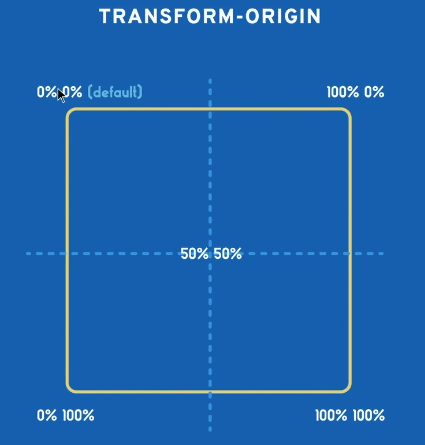
  

- to disable animation (some users prefer no animation), we can use this media-query:

  ```css
  /*
    If the user has expressed their preference for
    reduced motion, then don't use animations on buttons.
  */
  @media (prefers-reduced-motion: reduce) {
    button {
      animation: none;
    }
    /* or */
    * {
      animation-duration: 0s !important;
      transition-duration: 0s !important;
    }
  }
  ```

---
````
