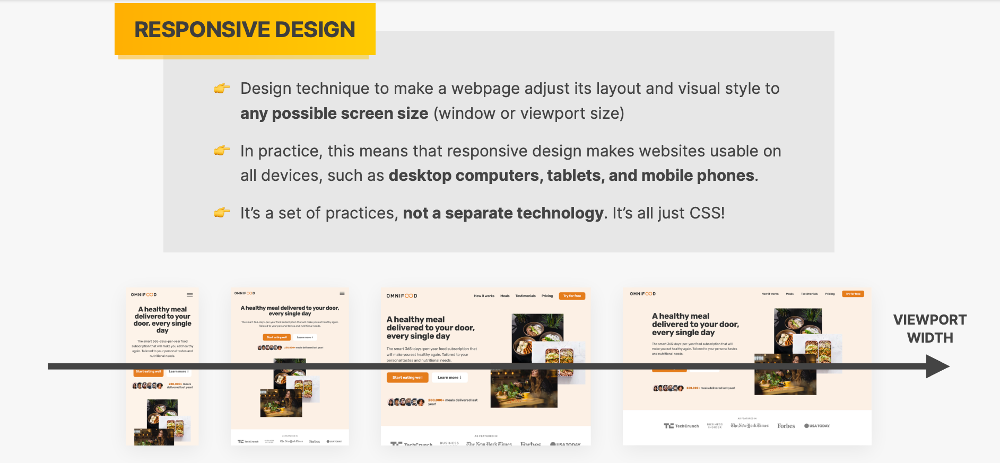
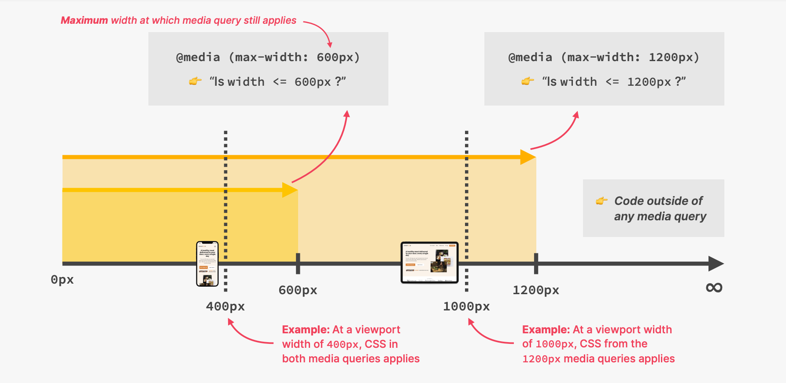
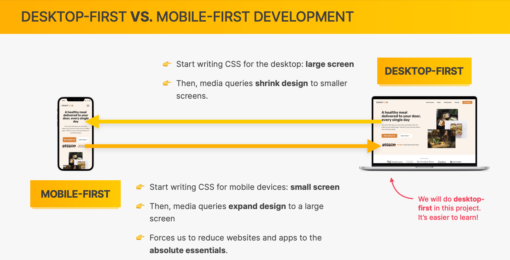
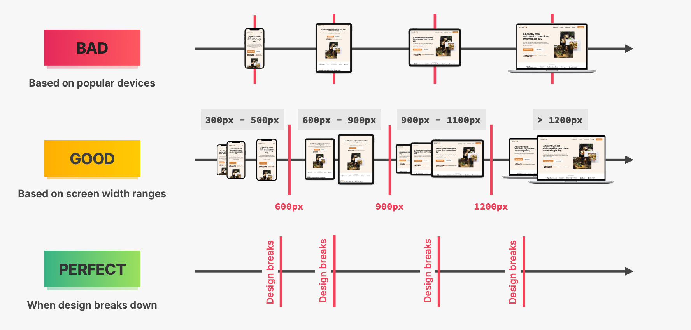
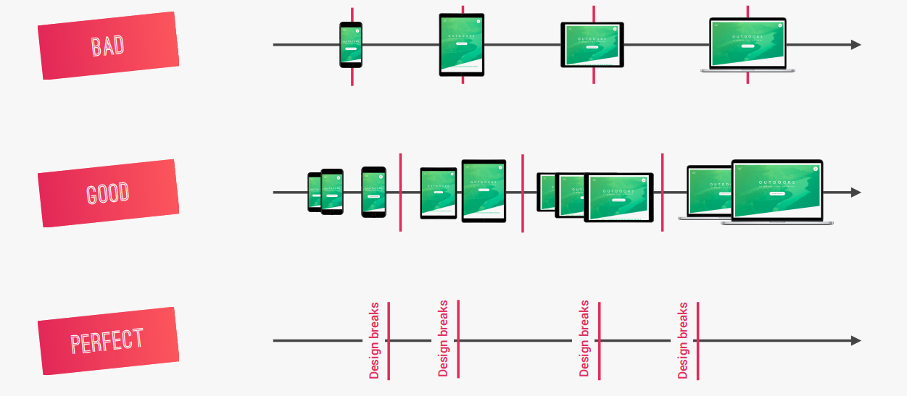

# INDEX

- [INDEX](#index)
  - [Responsive Web Design (RWD)](#responsive-web-design-rwd)
    - [Responsive Web Design vs Adaptive Design](#responsive-web-design-vs-adaptive-design)
  - [Media Queries](#media-queries)
    - [Anatomy of a media query](#anatomy-of-a-media-query)
    - [Media Query Notes](#media-query-notes)
  - [Break points](#break-points)
    - [Why mobile-first?](#why-mobile-first)
  - [Responsive (Fluid) Layouts](#responsive-fluid-layouts)
  - [Responsive Typography](#responsive-typography)
  - [Responsive Images](#responsive-images)
  - [Testing Responsive](#testing-responsive)
  - [Tips](#tips)

---

## Responsive Web Design (RWD)

It's an approach to web design that makes web pages render well on a variety of devices and window or screen sizes by responding to the user's behavior and environment based on screen size, platform, and orientation.



> Important Reference: [Responsive Web Design Fundamentals](https://web.dev/learn/design/)

- It consists of 4 key elements:

  - **Fluid layouts**

    - To allow webpage to adapt to the current viewport width
    - Use (`%` or `vw` or `vh`) units instead of fixed `px` units (to adapt to the screen size of the user's device)
    - Use `max-width` and `min-width` in the layout itself instead of `width` to make it more responsive

  - **Responsive units**

    - Use `em` or `rem` units instead of `px` units for spacing, length, font-size, etc.
    - To make it easy to scale the size of the text and other elements on the page in one place

    - Trick: Set `1rem` to `10px` to make it easier to convert `px` to `rem` and `em` units

      ```css
      html {
        font-size: 62.5%; /* 1rem = 10px */
      }
      ```

  - **Flexible images**

    - By default, images are not responsive, so we need to make them responsive by:
      - Using `%` for image dimensions or `max-width` to make them responsive

  - **Media queries**
    - They bring responsive sites to life
    - They allow us to specify different styles for different devices and different screen sizes and viewport widths **(Breakpoints)**
    - they allow us to specify different styles for different devices and different screen sizes.

- **IMPORTANT:**

  - Before anything make sure that you write this in the `head` of your HTML file:

    ```html
    <meta name="viewport" content="width=device-width, initial-scale=1.0" />
    ```

  - Because without this `meta`, responsive web design won't work on physical mobile devices as their browser will **zoom the page out** by default until it fits the screen, and by writing this line of code we make sure that it will fit their screen width
    
    - Mobile devices often render pages in a virtual viewport wider than the screen, then shrink the result for display. This helps non-mobile-optimized sites look better on narrow screens.

---

### Responsive Web Design vs Adaptive Design

The difference between `responsive design` and `adaptive design` is that:

- `responsive design` adapts the rendering of a single page version. In contrast, `adaptive design` delivers multiple completely different versions of the same page.
  

- With `responsive design`, users will access the same basic file through their browser, regardless of device, but `CSS` code will control the layout and render it differently based on screen size. With `adaptive design`, there is a script that checks for the screen size, and then accesses the template designed for that device.

  ```html
  <!-- Adaptive design -->
  <link rel="stylesheet" media="screen and (min-width: 960px)" href="css/desktop.css" />
  <link
    rel="stylesheet"
    media="screen and (min-width: 768px) and (max-width: 959px)"
    href="css/tablet.css"
  />
  <link rel="stylesheet" media="screen and (max-width: 767px)" href="css/mobile.css" />
  ```

  ```css
  /* Responsive design */
  /* In the same CSS file */
  @media (min-width: 960px) {
    /* styles here */
  }
  @media (min-width: 768px) and (max-width: 959px) {
    /* styles here */
  }
  ```

---

## Media Queries

They allow us to specify different styles for different devices and different screen sizes.


- They're tools for **overriding styles** based on the device's characteristics, such as screen size, orientation, and resolution.

### Anatomy of a media query

You can think of it as an `if` statement in programming, where the styles inside the media query will only be applied if the condition is true.

```scss
// JavaScript
if (condition) {
  // styles here
}

// CSS
@media (condition) {
  /* styles here */
}
```

- `@media` keyword
- `only` keyword is used to prevent old browsers that don't support media queries from applying the styles inside it. Otherwise, older browser will apply the styles in general (not just for the specified screen size media query)

  ```css
  @media only and (max-width: 600px) {
    /* styles here */
  }
  ```

- `screen` keyword is used to specify that the styles inside the media query will only be applied for screens and not for printers or other devices

  ```css
  @media only screen and (max-width: 600px) {
    /* styles here */
  }
  ```

- Examples of media queries:

  ```css
  @media (max-width: 600px) {
    /* styles here apply for screens with width <= 600px */
  }

  @media (min-width: 600px) {
    /* styles here apply for screens with width >= 600px */
  }

  @media (min-width: 600px) and (max-width: 900px) {
    /* styles here apply for screens with width >= 600px and <= 900px */
  }

  @media (width: 600px) {
    /* styles here apply for screens with width = 600px */
  }

  @media (orientation: portrait) {
    /* styles here apply for screens with portrait orientation */
  }
  ```

---

### Media Query Notes

- `max-width` vs `min-width`
  - `max-width` -> to add styles on smaller screens (mobile-first)
  - `min-width` -> to add styles on larger screens (desktop-first)
- The syntax of media queries is similar to the syntax of CSS rules, but not all CSS properties can be used in media queries.

  ```css
  /* This is a valid media query ✅ */
  @media (max-width: 600px) {
    /* styles here */
  }

  /* This is an invalid media query ❌ */
  @media (font-size: 32px) {
    /* styles here */
  }
  ```

- there's a value of `landscape / portrait` instead of `max-width` for **media queries**
- `media value` -> `600px` is the default
- `rem` and `em` do NOT depend on html font-size in **media queries**! Instead, `1rem = 1em = 16px` => **so use `em`**

  ```css
  /* BELOW 1344px -> (1344px / 16px = 84em) */
  @media (max-width: 84em) {
    /* Don't use 84rem here */
    .hero {
      max-width: 120rem; /* it's ok to use (rem) inside it as normal */
    }
  }
  ```

- **TRICK**: instead of using `min-width` in media-query, to specify the width of a container or a grid, we can use the `min()` function

  ```css
  .el {
    width: min(1000px, 100%);
    /* this will choose between the minimum of these 2 values 1000px or the 100% width of the screen */

    /*OR: width: min(1000px, 100% - margin_width-left&right); */
  }
  ```

---

## Break points

- Desktop-first vs Mobile-first
  

  - Desktop-first -> `max-width`
  - Mobile-first -> `min-width`

- Strategies for selecting breakpoints
  

we do breaks when **design breaks**


- Don't use device-specific break points, instead use **content-specific** break points

  - this is because there's more devices now than ever and it's impossible to target all of them, so we target the content instead.

  - **Note**: we can use `px` in media queries because we're targeting specific devices, but it's better to use `em` or `rem` instead

### Why mobile-first?

Mobile-first is the best approach for responsive web design because it's easier to add more styles to an element as the screen gets bigger than to remove styles from an element as the screen gets smaller.

- we use it because it's easier to add more styles to an element as the screen gets bigger than to remove styles from an element as the screen gets smaller.
  - This means adding **more complexity** to the CSS code as the screen gets bigger, and **less complexity** as the screen gets smaller.
- It's better to add complexity than to remove it, because it's easier to add than to remove and it would prevent us from having to use `!important` to override styles and multiple conflicting media queries.

---

## Responsive (Fluid) Layouts

---

## Responsive Typography

- Ensure it doesn't get cut off or overflow the viewport as you move through breakpoints.
- Consider how all the types of your text relate to each other as they scale and aim to maintain a good aesthetic balance between headlines, body paragraphs, and functional text, such as within buttons.
- Using relative units like `em` or `rem` units allows your text to scale responsively.

---

## Responsive Images

Use responsive images to ensure that images scale in resolution with your site to avoid slowing loading time with overly large files.

- Images also need to scale with your layout as visual elements.

  ```css
  img {
    max-width: 100%;
    height: auto;
  }
  ```

  - The problem with this approach is that every user has to download the **full-sized image**, even on mobile.

- To fix the issue of downloading the full-sized-image, We can serve different versions scaled for different devices using the `srcset` attribute.

  ```html
  
  ```

  - `src` attribute is used to specify the default image.
  - `srcset` attribute is used to specify different versions of the same image for different screen sizes and resolutions.

    - `300w` and `1000w` are the **width descriptors**. They are used to specify the width of the image in pixels.
    - it selects the image with the closest width to the user's device width.

  - `srcset` attribute is used to specify different versions of the same image for different screen sizes and resolutions.
  - `300w` and `1000w` are the **width descriptors**. They are used to specify the width of the image in pixels.
  - The browser will then choose the best image for the user's device and screen size.
  - **Note**: the browser will only download the image that it needs, so it will download the small image for small screens and the large image for large screens.

---

## Testing Responsive

- Chrome DevTools

  - Toggle device toolbar
  - Responsive Design Mode
  - Device Mode

- [Responsive Design Checker](https://search.google.com/test/mobile-friendly)

---

## Tips

- For responsive design, use viewport-relative units like `vh` or `vw` or font-relative units like `em` or `rem`. This will scale with changes in device or typography size and preserve your site’s functionality no matter how your layout flexes.

- Instead of using `min-width` in media-query, to specify the width of a container or a grid, we can use the `min()` function

  ```css
  .el {
    width: min(1000px, 100%);
    /* this will choose between the minimum of these 2 values 1000px or the 100% width of the screen */
  }
  ```

- To make layouts width more responsive instead of always modifying it in the `@media`, use `max-width` and `min-width` in the layout itself instead of `width`

  ```css
  .el {
    /* this will make the layout width responsive until it reaches 1000px then it will stop growing */
    width: 100%;
    /* this will make the layout width responsive until it reaches 1000px then it will stop growing */
    max-width: 1000px;
  }
  ```

- use media queries to add complexity to the CSS code as the screen gets bigger, and less complexity as the screen gets smaller -> **mobile-first**
