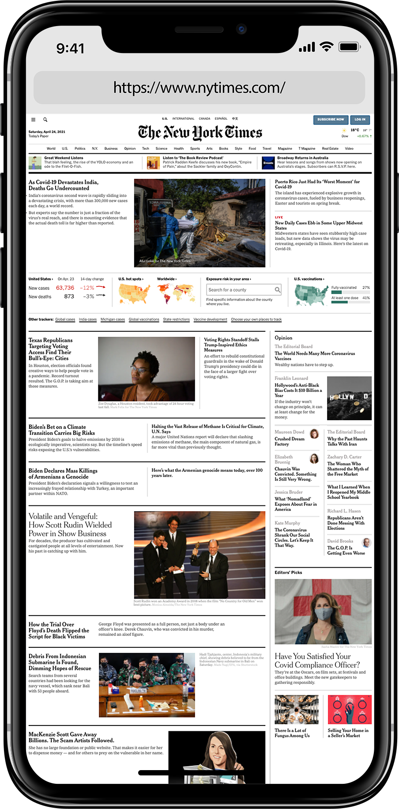
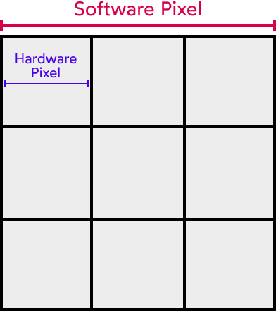
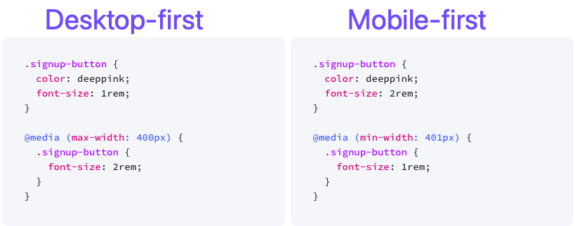
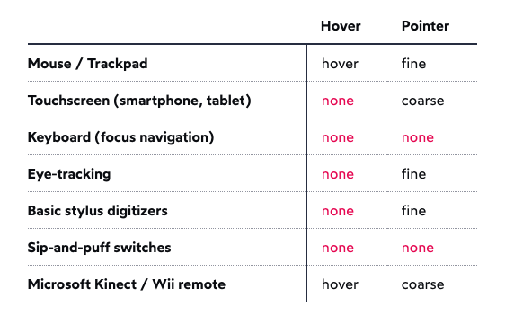
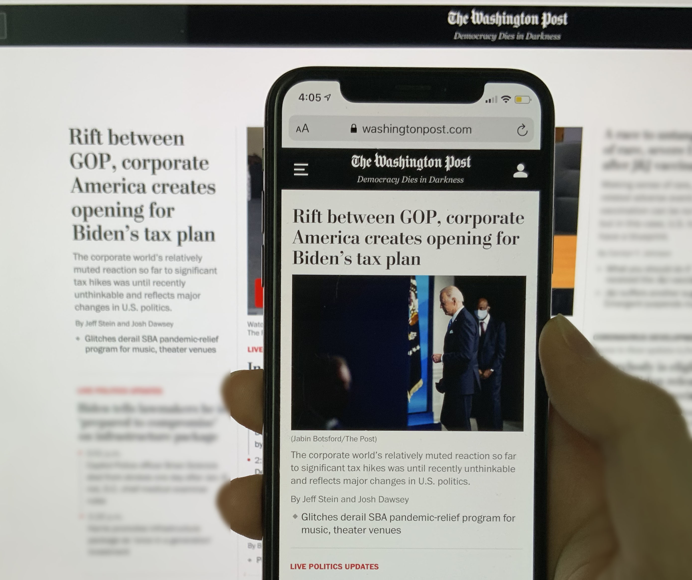
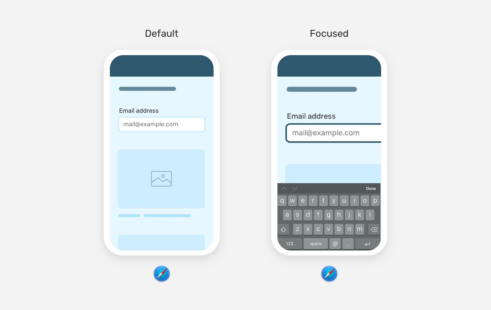
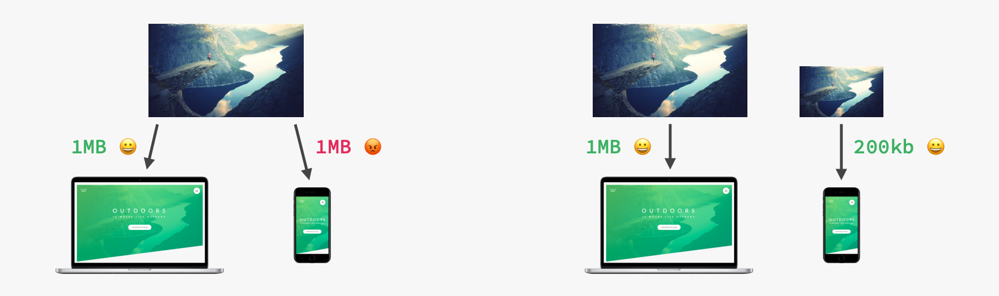
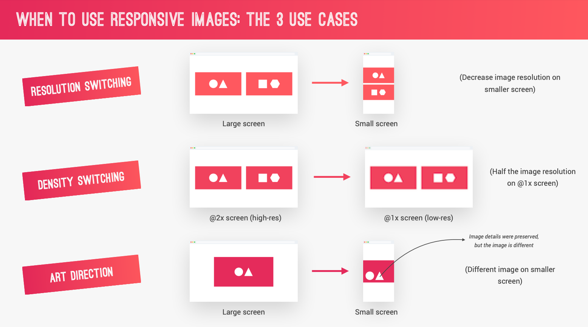
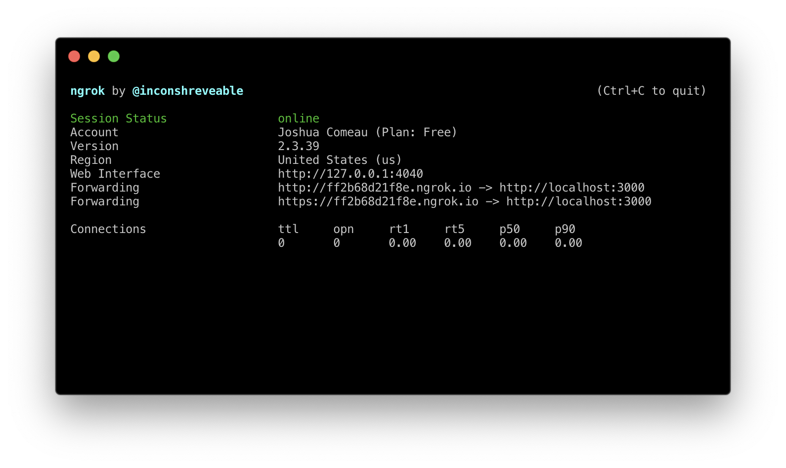

# INDEX

- [INDEX](#index)
  - [Responsive User Interface Design](#responsive-user-interface-design)
    - [working with mobile devices](#working-with-mobile-devices)
  - [Responsive Web Design (RWD)](#responsive-web-design-rwd)
    - [The magical `meta` tag](#the-magical-meta-tag)
    - [Responsive Web Design vs Adaptive Design](#responsive-web-design-vs-adaptive-design)
  - [Media Queries](#media-queries)
    - [Anatomy of a media query](#anatomy-of-a-media-query)
    - [Breakpoints (Mobile-first / Desktop-first)](#breakpoints-mobile-first--desktop-first)
    - [Interaction Media Features](#interaction-media-features)
    - [Preference-based media queries](#preference-based-media-queries)
    - [Media Query Notes](#media-query-notes)
  - [(Responsive vs Fluid) Layouts](#responsive-vs-fluid-layouts)
  - [Responsive Typography](#responsive-typography)
    - [Scaling text based on the viewport](#scaling-text-based-on-the-viewport)
  - [Responsive Images](#responsive-images)
    - [When and how to use responsive images](#when-and-how-to-use-responsive-images)
    - [Common Techniques for Responsive Images](#common-techniques-for-responsive-images)
  - [Testing Responsive Designs](#testing-responsive-designs)
    - [Chrome DevTools](#chrome-devtools)
    - [Local development flows (Accessing localhost from other devices)](#local-development-flows-accessing-localhost-from-other-devices)
    - [Remote debugging](#remote-debugging)
  - [Tips](#tips)

---

## Responsive User Interface Design

- One of the trickiest things about building user interfaces is that they have to support such a wide range of possible experiences. Think about all of the things that differ from one user to another:

  - **Screen size**: From tiny smartwatches to huge desktop monitors
    - In the past, the screen size was standardized (ex: 500px) but now it's not the case anymore because of the wide range of devices, so the design should be flexible and adapt to the user's device.
  - **Device type**: Desktop, laptop, tablet, phone, etc.
  - **Input method**: Touch, mouse, keyboard, voice, etc.
  - **User preference and settings**: dark/light mode, high-contrast mode, reduced motion, etc.
  - **User zoom level / Font size**: Some users need to zoom in to read text, or have a larger default font size set in their browser
  - **Network speed**: Some users are on fast Wi-Fi, some are on slow 3G, and some are on no network at all

In order to help us build flexible and resilient interfaces that meet these challenges, CSS has become a very powerful language. This where **Media Queries & fluid layouts** come in.

- In the old days, The known practice was **"adaptive design"** where the server would serve different HTML files depending on the user-agent (device) and the CSS would be different for each device. But now, we use **"responsive design"** where the server serves the same HTML file to all devices and the CSS is the same for all devices, but it's written in a way that it adapts to the user's device.
  - **Responsive design** is the idea that all clients will receive identical HTML files from the server, but those HTML files will be flexible, and will display differently on different devices. Using CSS, we can tweak the layout to work across many different form factors.
  - **Adaptive design** was much more work than responsive design, since we had to create multiple versions of the site from scratch. But it was significantly less complex; figuring out how to get a single HTML file to look good across all devices is no small task!

---

### working with mobile devices

- **Mobile Quirks**

  - Nowadays, just about every phone comes with a "High DPI" display. **DPI stands for "Dots Per Inch"**, and it refers to the pixel density. Apple has branded this the "Retina display", but the same technology is used on Android phones.

    - The iPhone 12 has a native resolution of `2532×1170` pixels—for context, this is more than most large desktop monitors! If we take that resolution literally, and try to render a website, it'll be completely illegible:
      
    - Mobile devices have a “device pixel ratio”. This can be accessed in JavaScript with the following statement:

      ```js
      console.log(window.devicePixelRatio);
      ```

      - This number is the ratio between the physical LED pixels on the device, and the "theoretical" pixels we use in CSS.

    - For example, the number `3` on the phone, means that a `10px` length will actually be `30px` long, meaning that each software pixel actually corresponds to `9` hardware pixels. This is why we need to use `rem` and `em` units instead of `px` units in responsive design.
      

---

## Responsive Web Design (RWD)

It's the art of making websites work across multiple devices and screen sizes by making the layout and experience **responds** to the user's device and behavior.


> Important Reference: [Responsive Web Design Fundamentals](https://web.dev/learn/design/)

- It consists of 4 key elements:

  - **Fluid layouts**

    - To allow webpage to adapt to the current viewport width
    - Use (`%` or `vw` or `vh`) units instead of fixed `px` units (to adapt to the screen size of the user's device)
    - Use `max-width` and `min-width` in the layout itself instead of `width` to make it more responsive

  - **Responsive units**

    - Use `em` or `rem` units instead of `px` units for spacing, length, font-size, etc.
    - To make it easy to scale the size of the text and other elements on the page in one place

    - Trick: Set `1rem` to `10px` to make it easier to convert `px` to `rem` and `em` units

      ```css
      html {
        font-size: 62.5%; /* 1rem = 10px */
      }
      ```

  - **Flexible images**

    - By default, images are not responsive, so we need to make them responsive by:
      - Using `%` for image dimensions or `max-width` to make them responsive

  - **Media queries**
    - They bring responsive sites to life
    - They allow us to specify different styles for different devices and different screen sizes and viewport widths **(Breakpoints)**
    - they allow us to specify different styles for different devices and different screen sizes.

---

### The magical `meta` tag

- To make sure that our pages render correctly on mobile, it's imperative that we add the following meta tag to our HTML (in the `<head>` section):

  ```html
  <meta name="viewport" content="width=device-width, initial-scale=1.0" />
  ```

- Purpose: Originally invented by Apple, now widely adopted, to control browser optimizations for mobile devices.
  - Early mobile browsers rendered websites as if on a 980px desktop screen, then scaled down to fit smaller screens. This is no longer desired.
- Key Attributes:

  - `width=device-width`: Sets the viewport width to match the device's width
  - `initial-scale=1`: Starts at 1x zoom.

- Importance: Without this tag, responsive web design won't work properly on mobile devices, as browsers will zoom out pages by default to fit the screen.

  

  - Mobile devices often render pages in a virtual viewport wider than the screen, then shrink the result for display. This helps non-mobile-optimized sites look better on narrow screens.

---

### Responsive Web Design vs Adaptive Design

The difference between `responsive design` and `adaptive design` is that:

- `responsive design` adapts the rendering of a single page version. In contrast, `adaptive design` delivers multiple completely different versions of the same page.
  

- With `responsive design`, users will access the same basic file through their browser, regardless of device, but `CSS` code will control the layout and render it differently based on screen size. With `adaptive design`, there is a script that checks for the screen size, and then accesses the template designed for that device.

  ```html
  <!-- Adaptive design -->
  <link rel="stylesheet" media="screen and (min-width: 960px)" href="css/desktop.css" />
  <link
    rel="stylesheet"
    media="screen and (min-width: 768px) and (max-width: 959px)"
    href="css/tablet.css" />
  <link rel="stylesheet" media="screen and (max-width: 767px)" href="css/mobile.css" />
  ```

  ```css
  /* Responsive design */
  /* In the same CSS file */
  @media (min-width: 960px) {
    /* styles here */
  }
  @media (min-width: 768px) and (max-width: 959px) {
    /* styles here */
  }
  ```

---

## Media Queries

They allow us to specify different styles that are only applied at certain screen sizes or viewport widths.


> When it comes to building responsive interfaces, the media query is the primary tool in our toolbox.

- They're tools for **overriding styles** based on the device's characteristics, such as screen size, orientation, and resolution.
- What will happen if we're in a width that is shared between 2 media queries? The browser will apply the styles of the last media query that matches the screen size.

  - This is because **media queries don't add any importance or specificity to the CSS**, they just add conditions to the CSS. So the last condition that matches the screen size will be applied.
  - That's why the order of media queries is important, and it's better to put the default styles first and then override them with the media queries.

    - mobile-first order: `min-width` -> `max-width`

      ```css
      /* Default styles */
      .el {
        width: 100%;
      }
      /* Mobile styles */
      @media (min-width: 600px) {
        .el {
          width: 50%;
        }
      }
      /* Tablet styles */
      @media (min-width: 900px) {
        .el {
          width: 33.33%;
        }
      }
      ```

    - desktop-first order: `max-width` -> `min-width`

      ```css
      /* Desktop styles */
      @media (max-width: 900px) {
        .el {
          width: 33.33%;
        }
      }
      /* Tablet styles */
      @media (max-width: 600px) {
        .el {
          width: 50%;
        }
      }
      /* Default styles */
      .el {
        width: 100%;
      }
      ```

### Anatomy of a media query

You can think of it as an `if` statement in programming, where the styles inside the media query will only be applied if the condition is true.

```scss
// JavaScript
if (condition) {
  // styles here
}

// CSS
@media (condition) {
  /* styles here */
}

// Example
@media only screen and (max-width: 600px) {
  /* styles here */
}
```

- `@media` keyword
  - It initiates a media query block, and tells the browser that the styles inside the media query will only be applied if the condition is true.
- `only` keyword

  - It's used to prevent old browsers that don't support media queries from applying the styles inside it. Otherwise, older browser will apply the styles in general (not just for the specified screen size media query)

- `screen` keyword

  - It's a "media type" used to specify that the styles inside the media query will only be applied for screens and not for printers or other devices
  - **Note:** specifying `screen` has become less common in recent years, as browsers have chosen more-sensible defaults when it comes to printing.

- Boolean logic in media queries

  - `and` keyword

    - It's used to combine multiple conditions in a media query. All conditions must be true for the styles inside the media query to be applied.
    - Also if we want to specify that any of the conditions can be met, we can use the `,` (comma) instead of (using `or`, or repeating the same styles in multiple media queries)

      ```css
      @media (min-width: 600px), (max-width: 900px) {
        /* styles here apply for screens with width >= 600px or <= 900px */
      }
      ```

  - `or` keyword

    - It's used to combine multiple conditions in a media query. At least one condition must be true for the styles inside the media query to be applied.

  - `not` keyword

    - It's used to negate a condition in a media query. The styles inside the media query will only be applied if the condition is false.

- Examples of media queries:

  ```css
  @media (max-width: 600px) {
    /* styles here apply for screens with width <= 600px */
  }

  @media (min-width: 600px) {
    /* styles here apply for screens with width >= 600px */
  }

  @media (min-width: 600px) and (max-width: 900px) {
    /* styles here apply for screens with width >= 600px and <= 900px */
  }

  @media (max-width: 900px) or (min-width: 1200px) {
    /* styles here apply for screens with width <= 900px or >= 1200px and not in between */
  }

  @media not (max-width: 600px) {
    /* styles here apply for screens with width > 600px (similar to min-width: 601px) -> (Not commonly used) */
  }

  @media (width: 600px) {
    /* styles here apply for screens with width = 600px (Not commonly used) */
  }

  @media (orientation: portrait) {
    /* styles here apply for screens with portrait orientation (height > width) */
  }
  ```

- In Media queries level 4, there're multiple new features (but not supported in all browsers yet) like:

  ```css
  @media (width >= 600px) {
    /* styles here apply for screens with width >= 600px */
  }
  ```

---

### Breakpoints (Mobile-first / Desktop-first)

A breakpoint is a specific viewport width that lets us segment all devices into a small set of possible experiences. For example, we might set a breakpoint at `500px`. Any device under `500px` will be put in the same bucket, and can be styled separately. This ensures a consistent experience; someone on a `375px`-wide phone will share the same layout as someone on a `414px`-wide phone.

- Desktop-first vs Mobile-first
  
  

  - Desktop-first -> `max-width`
  - Mobile-first -> `min-width`

- Strategies for selecting breakpoints
  

- we add break-points when **design breaks**
  

- Don't use device-specific break points, instead use **content-specific** break points

  - this is because there's more devices now than ever and it's impossible to target all of them, so we target the content instead.

  - **Note**: we can use `px` in media queries because we're targeting specific devices, but it's better to use `em` or `rem` instead
    - `rem`-based viewport scale with the user's chosen default font size. As the font size gets bigger, the breakpoints slide up the scale.

- **Why mobile-first?**

  - Mobile-first is the best approach for responsive web design because it's easier to add more styles to an element as the screen gets bigger than to remove styles from an element as the screen gets smaller.

  - we use it because it's easier to add more styles to an element as the screen gets bigger than to remove styles from an element as the screen gets smaller.
    - This means adding **more complexity** to the CSS code as the screen gets bigger, and **less complexity** as the screen gets smaller.
  - It's better to add complexity than to remove it, because it's easier to add than to remove and it would prevent us from having to use `!important` to override styles and multiple conflicting media queries.

- ⚠️ Don't mix mobile-first and desktop-first in the same project, it will make the code harder to maintain and understand.

---

### Interaction Media Features

This is a relatively new addition to the Media Queries specification. They're called “Interaction Media Features”. They allow us to apply styles based on which input mechanism the user is using.

- There're other types of media features that can be used in media queries to target different devices and user interactions:

  - **Hover**:

    - It's used to target devices that have a pointing device (like a mouse) and can hover over elements.

      ```css
      @media (hover: hover) {
        /* styles here apply for devices that have a pointing device */
      }
      ```

  - **Pointer**:

    - It's used to target devices that have a pointing device (like a mouse) and can hover over elements.

      ```css
      @media (pointer: fine) {
        /* styles here apply for devices that have a fine pointing device (like a mouse) */
      }
      ```

  - What's the difference between "hover" and "pointer"? They actually refer to two distinct capabilities. hover is the ability for a device to move the cursor without also triggering a click/tap on the element underneath; a mouse can do this, but your finger or a stylus can't. pointer refers to the level of control the user has over the position of the cursor.
    
    - A "fine" pointer like a mouse or trackpad means that the user can be very precise with their clicks. Using our fingers on a touchscreen, though, is "coarse": we can't be anywhere near as precise.
    - Somewhat magically, browsers are able to infer which input device you're using! This is a dynamic query: if you switch from using a mouse to using a keyboard (for navigation, not for typing), the values for hover and pointer will update dynamically.

- Example:

  ```css
  @media (hover: hover) and (pointer: fine) {
    button:hover {
      text-decoration: underline;
    }
  }
  ```

---

### Preference-based media queries

Another feature of media queries is that they can "hook in" and access user preferences. This allows us to tailor our styles based on the user's personal preferences and needs.

- For example, we can detect whether the user prefers **light mode or dark mode** with this media query:

  ```css
  @media (prefers-color-scheme: dark) {
    /* styles here apply for users who prefer dark mode */
  }
  ```

  > **Trick** to test it when developing, instead of changing the browser or the OS settings, you apply this code for `light` mode then after finishing, you change it to `dark` mode

- Another example is to detect whether the user prefers **reduced motion** (like animations) with this media query:

  ```css
  @media (prefers-reduced-motion: reduce) {
    /* styles here apply for users who prefer reduced motion */
  }
  ```

- We can also detect the **orientation** of the user's device (portrait or landscape) with this media query:

  ```css
  @media (orientation: portrait) {
    /* styles here apply for screens with portrait orientation */
  }
  ```

---

### Media Query Notes

- `max-width` vs `min-width`
  - `max-width` -> to add styles on smaller screens (mobile-first)
  - `min-width` -> to add styles on larger screens (desktop-first)
- The syntax of media queries is similar to the syntax of CSS rules, but not all CSS properties can be used in media queries.

  ```css
  /* This is a valid media query ✅ */
  @media (max-width: 600px) {
    /* styles here */
  }

  /* This is an invalid media query ❌ */
  @media (font-size: 32px) {
    /* styles here */
  }
  ```

- there's a value of `landscape / portrait` instead of `max-width` for **media queries**
- `media value` -> `600px` is the default
- `rem` and `em` do NOT depend on html font-size in **media queries**! Instead, `1rem = 1em = 16px` => **so use `em`**

  ```css
  /* BELOW 1344px -> (1344px / 16px = 84em) */
  @media (max-width: 84em) {
    /* Don't use 84rem here */
    .hero {
      max-width: 120rem; /* it's ok to use (rem) inside it as normal */
    }
  }
  ```

- You can use different types of "media types" in media queries, such as (`screen`, `print`, `speech`, etc) to have different styles for different devices (ex: removing adds and unnecessary content when printing)

  ```css
  @media screen and (max-width: 600px) {
    /* styles here apply for screens with width <= 600px */
  }

  @media print {
    /* styles here apply for printed pages */
  }
  ```

- **TRICK**: instead of using `min-width` in media-query, to specify the width of a container or a grid, we can use the `min()` function

  ```css
  .el {
    width: min(1000px, 100%);
    /* this will choose between the minimum of these 2 values 1000px or the 100% width of the screen */

    /*OR: width: min(1000px, 100% - margin_width-left&right); */
  }
  ```

- `@media` block has higher specificity than the normal CSS block, so it will override the normal CSS block

  ```css
  .el {
    width: 100%;
  }

  @media (min-width: 600px) {
    .el {
      width: 50%;
    }
  }
  ```

  - In this example, the width of `.el` will be `50%` when the screen width is `>= 600px`, and `100%` otherwise.

---

## (Responsive vs Fluid) Layouts

- **Responsive Layouts**: They change based on the size of the screen. They use media queries to change the layout of the page based on the screen size.

  - They're the most common type of layout used in responsive web design.
  - They use media queries to change the layout of the page based on the screen size.
  - They're more complex than fluid layouts, but they're more flexible and can adapt to a wider range of screen sizes.

  ```html
  <div class="container">
    <div class="sidebar">Sidebar</div>
    <div class="content">Content</div>
  </div>

  <style>
    .container {
      display: flex;
    }

    .sidebar {
      flex: 1;
    }

    .content {
      flex: 1;
    }

    @media (max-width: 600px) {
      .container {
        flex-direction: column;
      }
    }
  </style>
  ```

- **Fluid Layouts**: They use (relative units like `%` or `vw` **or** flexbox or grid techniques) to make the layout of the page flexible and adapt to the size of the screen.

  - If we use relative units like `%` or `vw` for the width of the elements, the layout will be fluid and will adapt to the size of the screen.

    ```css
    .el {
      width: 100%;
    }
    ```

  - If we use flexbox or grid techniques, the layout will be fluid and will adapt to the size of the elements and whether they're displayed in a row or a column or should they wrap or not.

    ```html
    <div class="container">
      <div class="sidebar">Sidebar</div>
      <div class="content">Content</div>
    </div>

    <style>
      .container {
        display: flex;
        flex-wrap: wrap;
      }

      .sidebar {
        flex: 1;
        min-width: 200px; /* or flex-basis: 200px; */
      }

      .content {
        flex: 1;
        min-width: 300px; /* or flex-basis: 300px; */
      }
    </style>
    ```

    - Here, because we're using `flex-wrap: wrap`, the elements will wrap to the next line if they don't fit in the same line, and because we're using `min-width` or `flex-basis`, the elements will have a minimum width of `200px` and `300px` respectively. and when they reach the minimum width, they'll wrap to the next line.

  - This is usually the best approach for building responsive web designs **because this approach is specific to the container and not the screen size**, so it's more flexible and can adapt to a wider range of screen sizes and in placement on the page.

---

## Responsive Typography

- **Question**: Should text get bigger or smaller on mobile compared to desktop?

  - You might think that it should shrink for narrow screens, or that it should grow to be more readable. But the answer is: **it depends on the type of text**.
  - For **body text**, it should stay the same size across all devices.

    - We generally want our body text to be at least `16px`. Anything less and users will need to hold the phone uncomfortably close to their face, or do a bunch of pinch-and-zooming.
    - Here's a photo of a phone up in front of a desktop display showing the same website:
      

  - For **headlines**, they can be smaller on mobile than on desktop.

    - Mobile devices are very narrow, and they can't fit that many characters per line. Large headings feel awkward

  - For **form fields**, they already have small default sizes, so they should be bigger on mobile than on desktop.
    - IOS will zoom in on form fields when they're focused if they're less than `16px`, so it's better to make them bigger than that.
      

- Ensure it doesn't get cut off or overflow the viewport as you move through breakpoints.
- Consider how all the types of your text relate to each other as they scale and aim to maintain a good aesthetic balance between headlines, body paragraphs, and functional text, such as within buttons.
- **Font Size Units**

  - We don't want to use the `px` unit when it comes to typography. This is because browsers let users pick a default font size, but that won't work if we use "absolute" units like pixels. Instead, we should use `em` or `rem` units (which are relative to the user's default font size).
  - By doing so, we can easily scale the size of the text and other elements on the page in one place.

    ```css
    html {
      font-size: 62.5%; /* 1rem = 10px */
      font-size: 100%; /* 1rem = 16px */
      font-size: 125%; /* 1rem = 20px */
    }
    ```

### Scaling text based on the viewport

- Option 1: Using `vw` units

  - `vw` units are based on the width of the viewport, so the font size will be relative to the viewport width.

    ```css
    h1 {
      font-size: 5vw;
    }
    ```

  - We can also take advantage of the `clamp()` function to set a minimum and maximum font size.

    ```css
    h1 {
      font-size: clamp(2rem, 5vw, 3rem); /* 2rem <= 5vw <= 3rem */
    }
    ```

- Option 2: Using media queries

  - We can use media queries to set different font sizes for different screen sizes.

    ```css
    h1 {
      font-size: 2.5rem;
    }
    @media (max-width: 550px) {
      h1 {
        font-size: 1.75rem;
      }
    }
    ```

---

## Responsive Images

The goal of responsive images is to serve the right images to the right screen sizes and resolutions to avoid slowing down your site with overly large files **(web performance)**

> modern screens come in all sorts of configurations and densities. A new iPhone has a 3-to-1 ratio between hardware and software pixels. These are known as "high-DPI" displays.
>
> If we render an image at its native size, it's going to be fuzzy on a high-DPI display. To keep things crisp, we need to serve different images depending on the screen's pixel ratio.

- We use responsive images to ensure that images scale in resolution with your site to avoid slowing loading time with overly large files.
  
  - When exporting assets from the design tool, it's common to export 2 or 3 versions of the image. The ratio is generally included in the filename, like this:
    - `mountain.jpg` (300 x 300)
    - `mountain@2x.jpg` (600 x 600)
    - `mountain@3x.jpg` (900 x 900)

### When and how to use responsive images

- Images also need to scale with your layout as visual elements.

  ```css
  img {
    max-width: 100%;
    height: auto;
  }
  ```

  - The problem with this approach is that every user has to download the **full-sized image**, even on mobile.

- To fix the issue of downloading the full-sized-image, We can serve different versions scaled for different devices using the `srcset` attribute on the `img` element, or by using the `picture` and `source` elements.

  - the browser will only download the image that it needs, so it will download the small image for small screens and the large image for large screens.

---

### Common Techniques for Responsive Images



- **Resolution switching**

  - to serve the **same image** with different resolutions (different versions) to different devices
  - it's done by using the `srcset` attribute

    ```html
    
    ```

    - the first image is for small screens and the second image is for large screens (`300w` and `1000w` are the **width descriptors** They are used to specify the width of the image in pixels).
    - it selects the image with the closest width to the user's device width.
    - `sizes` attribute is used to specify the width of the image in the layout. It's used to help the browser choose the best image for the user's device and screen size.
    - `src` attribute is used as a fallback for browsers that don't support the `srcset` attribute.

- **Density switching**

  - to serve the **same image** and control the pixel density of the image that the browser will download
  - it's done by using the `srcset` attribute

    ```html
    
    ```

    - the first image is for low-density screens and the second image is for high-density screens (`1x` and `2x` are the **pixel-density descriptors**)
    - the browser will then choose the best image for the user's device and screen size.
      - high resolution screens have a higher pixel density, so they need a higher resolution image to look sharp -> `2x`
      - low resolution screens have a lower pixel density, so they need a lower resolution image to look sharp -> `1x`

  - Another way of dowing this is by using `min-resolution` in media-query (usually for `background-image` property)

    ```css
    .el {
      background-image: url('img/logo-small.png');
    }

    @media (min-resolution: 192dpi) {
      .el {
        background-image: url('img/logo-large.png');
      }
    }
    ```

- **Art direction**

  - to serve **different images** with different aspect ratios to different devices
  - it's done by using `picture` and `source` elements

    ```html
    <picture>
      <source media="(max-width: 600px)" srcset="img/logo-small.png" />
      <source media="(min-width: 601px)" srcset="img/logo.png" />
      
    </picture>
    ```

    - `media` attribute is used to specify the condition for the image to be displayed
    - the first image is for small screens and the second image is for large screens
    - the browser will then choose the best image for the user's device and screen size.
    - `img` element is used as a fallback for browsers that don't support the `picture` element.

> If you use a meta-framework like **Gatsby** or **Next**, there's some good news: these tools come with battle-tested Image components that implement all the hard stuff for you: [next/image](https://nextjs.org/docs/api-reference/next/image), [gatsby-image](https://www.gatsbyjs.com/plugins/gatsby-image/)
>
> - They create high-res variants and apply them automatically
> - They automatically generate and use next-gen image formats like `.webp` and `.avif`, gracefully falling back to `jpg`/`png` on unsupported browsers.
> - They implement **lazy-loading**, and some of them even support special effects, like embedding an SVG outline into the page whilst the image loads
>
> Unfortunately, to accomplish these goals, the framework needs to integrate with your build system, which is why you won't find these features built straight into **React** or **Vue**.

---

## Testing Responsive Designs

### Chrome DevTools

- Toggle device toolbar
- Responsive Design Mode
- Device Mode

- [Responsive Design Checker](https://search.google.com/test/mobile-friendly)

---

### Local development flows (Accessing localhost from other devices)

The best way to test responsive design is to test it on real devices, but it's not always possible, so we can use the following methods to test it on other devices:

- **Localhost**: To access localhost from other devices, we can use the following methods:

  - Using [ngrok](https://ngrok.com/): It's a tool that creates a secure tunnel to your localhost, so you can access your localhost from other devices.

    - ngrok is software that you run on your development machine. It will burrow through your firewall and router and make a specified port publicly-available. It provides a randomly-generated URL that you can visit on your phone, which'll forward you to your localhost server.
    - You can install ngrok via NPM. Follow the “Global Install” instructions: [ngrok on NPM](https://www.npmjs.com/package/ngrok#global-install)
    - Once it's set up, you ought to be able to open a terminal and run:

      ```bash
      ngrok http 3000 # replace the number 3000 with the port number of your localhost server
      ```

    - You should see output like this: where the "Forwarding" field shows us a URL we can visit on our phone to see our localhost server.
      

---

### Remote debugging

Being able to view our development server on our phone is neat, but it's only half the battle: what happens if we want to inspect it, to figure out which CSS is being applied?

**Remote debugging** is the process of using our desktop developer tools to inspect a browser tab running on our mobile device.

- Android: The most up-to-date instructions will be found in this article: [Remote Debug Android Devices](https://developer.chrome.com/docs/devtools/remote-debugging/).

---

## Tips

- For responsive design, use viewport-relative units like `vh` or `vw` or font-relative units like `em` or `rem`. This will scale with changes in device or typography size and preserve your site’s functionality no matter how your layout flexes.

- Instead of using `min-width` in media-query, to specify the width of a container or a grid, we can use the `min()` function

  ```css
  .el {
    width: min(1000px, 100%);
    /* this will choose between the minimum of these 2 values 1000px or the 100% width of the screen */
  }
  ```

- To make layouts width more responsive instead of always modifying it in the `@media`, use `max-width` and `min-width` in the layout itself instead of `width`

  ```css
  .el {
    /* this will make the layout width responsive until it reaches 1000px then it will stop growing */
    width: 100%;
    /* this will make the layout width responsive until it reaches 1000px then it will stop growing */
    max-width: 1000px;
  }
  ```

- use media queries to add complexity to the CSS code as the screen gets bigger, and less complexity as the screen gets smaller -> **mobile-first**
