# INDEX

- [INDEX](#index)
  - [Tricks and Techniques](#tricks-and-techniques)
    - [Display vs Visibility](#display-vs-visibility)
    - [How to center an element](#how-to-center-an-element)
      - [Centering a text](#centering-a-text)
    - [Customizable font-size calculation](#customizable-font-size-calculation)
    - [Custom Audio Player](#custom-audio-player)
    - [Double Border Corners](#double-border-corners)
    - [Rotating elements (3D perspective)](#rotating-elements-3d-perspective)
    - [Hamburger menu that opens navbar from the right as a growing circle](#hamburger-menu-that-opens-navbar-from-the-right-as-a-growing-circle)
    - [Floating Cursor Animation](#floating-cursor-animation)
    - [Chat Messages](#chat-messages)
    - [Facebook-style layout](#facebook-style-layout)
    - [Spacer Component Trick](#spacer-component-trick)
    - [Scrollable part of a container](#scrollable-part-of-a-container)
    - [Tracking the scrollbar width](#tracking-the-scrollbar-width)
    - [Filler Technique](#filler-technique)
    - [Book Design](#book-design)
    - [Grid shapes](#grid-shapes)
    - [Full Bleed Layout](#full-bleed-layout)
    - [Specialty story grid (news website)](#specialty-story-grid-news-website)
    - [Color-rotated emoji (Changing the color of an emoji)](#color-rotated-emoji-changing-the-color-of-an-emoji)
    - [Blurred glow](#blurred-glow)
    - [Gradient shapes](#gradient-shapes)
    - [Trophy display](#trophy-display)
    - [Increasing target sizes](#increasing-target-sizes)
    - [Rising nav link](#rising-nav-link)
    - [Floating Tooltip](#floating-tooltip)

---

## Tricks and Techniques

### Display vs Visibility

| Display                                                                         | Visibility                                                                     |
| ------------------------------------------------------------------------------- | ------------------------------------------------------------------------------ |
| It specifies the display behavior of an element.                                | It specifies whether an element is visible or hidden.                          |
| It's a CSS property that defines the type of box used for an HTML element.      | It's a CSS property that determines whether an element is visible or hidden.   |
| It can have values like `block`, `inline`, `inline-block`, `flex`, `grid`, etc. | It can have values like `visible`, `hidden`, `collapse`, `initial`, `inherit`. |

- (`visibility:hidden` or `opacity: 0`) => hide the element but preserves it's place (leaves a space where the element would have been)
- `display: none` => remove element from the flow, hide element and collapse its space

  - _note_ => it doesn't work for `animation/transition` (for Javascript usually), instead use (`opacity` or `visibility`):

    ```css
    /* ALL THESE FOR mimicking [display:none;] */

    /* 1) Hide it visually and preserve the space */
    opacity: 0;

    /* 2) Make it unaccessible to mouse and keyboard */
    pointer-events: none;

    /* 3) Hide it from screen readers */
    visibility: hidden;
    /* or */
    opacity: 0;
    ```

- `display: block` --> can be used to make `<a>` element take full width of its container -> for user clicking accessibility
- **inline-block**: `display: inline-block` --> causes a block-level element to flow like an inline element, while retaining other features of a block-level element.
  - doesn't start a new line (like inline element)
  - respects `margin`, `width`, `height` (like block element)

---

### How to center an element

To center an element vertically and horizontally in a container, we have these options:

1. If the element is `inline`, you can use `text-align: center` on the parent element

   ```css
   .container {
     text-align: center;
   }
   .element {
     display: inline;
   }
   ```

   - This will center the element horizontally in the container
   - To center it vertically, you can use `vertical-align: middle` on the element if it's

2. Using `margin: auto`:

   ```css
   .container {
     width: 700px;
     margin: 0 auto;
   }
   /* This will center the container horizontally on the page */
   ```

3. using `position: absolute`:

   ```css
   .container {
     position: relative;
   }
   .element {
     width: 100px;
     height: 100px;
     position: absolute;
     top: 50%;
     left: 50%;
     transform: translate(-50%, -50%);

     /* or (NOT RECOMMENDED ❌) */
     top: calc(50% - 50px); /* 50px is half of the element height */
     left: calc(50% - 50px); /* 50px is half of the element width */
   }
   ```

   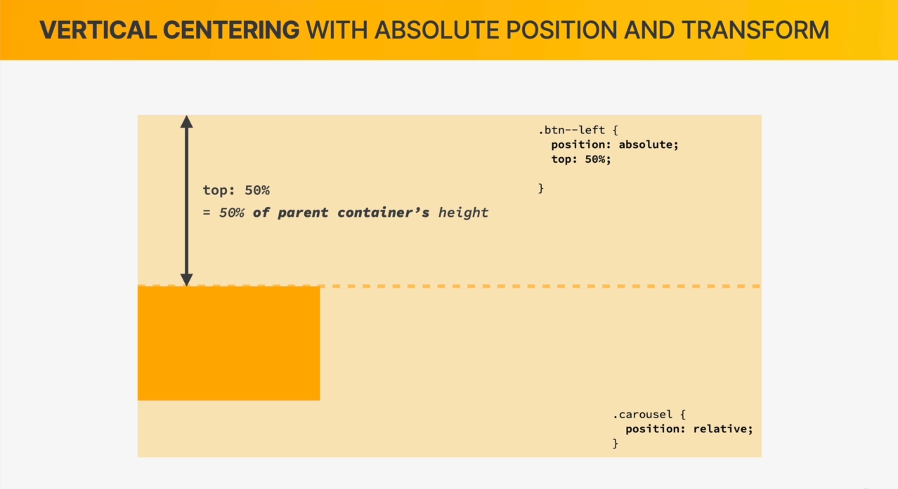
   

4. using `flexbox`:

   ```css
   .container {
     display: flex;
     min-height: 100vh; /* to make the container full height */
     flex-direction: column;
     justify-content: center;
     align-items: center;
   }
   ```

5. using `grid`:

   - center a container:

     ```css
     .container {
       display: grid;

       place-content: center; /* or place-items: center; */
       /* or */
       justify-content: center;
       align-content: center;
     }
     ```

   - center a grid-item inside its cell:
     

     ```css
     .grid-item {
       place-self: center;
     }
     ```

#### Centering a text

There's a difference between `text-align: center` and centering using flexbox or grid:

```html
<!-- Using text-align -->
<div class="with-text-align">
  <p>
    It is advisable to drain golfing land much more thoroughly and efficiently than ordinary farm
    land, but, on the other hand, by exercising a little thought it can be done much more cheaply.
    For the purpose of golf it is not only unnecessary to drain as deeply as is customary for
    agricultural purposes, but it is much cheaper and more satisfactory to adopt a system of shallow
    drains.
  </p>
</div>

<hr />

<!-- Using a Flex column -->
<div class="with-flexbox">
  <p>
    It is advisable to drain golfing land much more thoroughly and efficiently than ordinary farm
    land, but, on the other hand, by exercising a little thought it can be done much more cheaply.
    For the purpose of golf it is not only unnecessary to drain as deeply as is customary for
    agricultural purposes, but it is much cheaper and more satisfactory to adopt a system of shallow
    drains.
  </p>
</div>

<style>
  .with-text-align {
    text-align: center;
  }

  .with-flexbox {
    display: flex;
    flex-direction: column;
    align-items: center;
  }

  p {
    max-width: 50ch;
    padding: 1rem;
  }
</style>
```

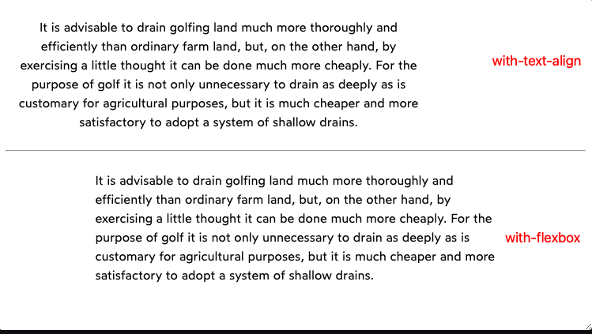

- What's going on here?
  - Well, `text-align: center` moves all of the individual characters to the middle of each line, the way you'd expect centering to work in a rich text editor.
  - `align-items`, though, is more about layout alignment. It positions the paragraph as a block. It doesn't affect the individual characters within that block.

---

### Customizable font-size calculation

```css
:red {
  --base-size: 1rem;
  --scale: 1.25;
  --h5: calc(var(--base-size) * var(--scale)); /* 1.25rem */
  --h4: calc(var(--h5) * var(--scale)); /* 1.5rem */
  --h3: calc(var(--h4) * var(--scale)); /* 2rem */
  --h2: calc(var(--h3) * var(--scale)); /* 2.5rem */
  --h1: calc(var(--h2) * var(--scale)); /* 3rem */
  --small: calc(var(--base-size) / var(--scale)); /* 0.8rem */
}

/* Usage */
h1 {
  font-size: var(--h1);
}
```

---

### Custom Audio Player

- [Let’s Create a Custom Audio Player](https://css-tricks.com/lets-create-a-custom-audio-player/)
- [Frontend Masters - Custom Audio Player](https://codepen.io/jen4web/pen/OJBjYVy)

---

### Double Border Corners

Double borders on just the corner of some boxes may seem impossible to start with. However, there are [several possible solutions](https://stackoverflow.com/questions/14387690/how-can-i-show-only-corner-borders) to this issue.

- The idea here is to create a double border effect by using a `::before` and `::after` pseudo-elements both for the container and the first element inside it.
- Then we use `border-width` to control which sides you want to show based on what corner you want to apply the effect to.

- Example:
  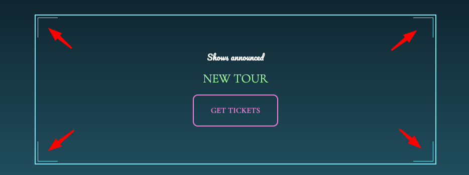

  ```css
  .container {
    position: relative;
    border: 2px solid #000;
  }

  .container::before,
  .container::after,
  .container > :first-child::before,
  .container > :first-child::after {
    content: '';
    position: absolute;
    width: 40px;
    height: 40px;
    border-color: #000;
    border-style: solid;
  }

  /* now for each box, display it in its location and display the border on only 2 sides */
  .container::before {
    top: 0;
    left: 0;
    border-width: 2px 0 0 2px;
  }
  .container::after {
    top: 0;
    right: 0;
    border-width: 2px 2px 0 0;
  }
  .container > :first-child::before {
    bottom: 0;
    left: 0;
    border-width: 0 0 2px 2px;
  }
  .container > :first-child::after {
    bottom: 0;
    right: 0;
    border-width: 0 2px 2px 0;
  }
  ```

---

### Rotating elements (3D perspective)

- when using 3d animation / transform => use `perspective` property on the parent element

  ```css
  .card {
    perspective: 1000px; /* 3d effect */
  }

  .card:hover {
    transform: rotateY(180deg);
  }
  ```

  - it's used to give the 3d effect to the child elements (the lower the value, the more the 3d effect)
    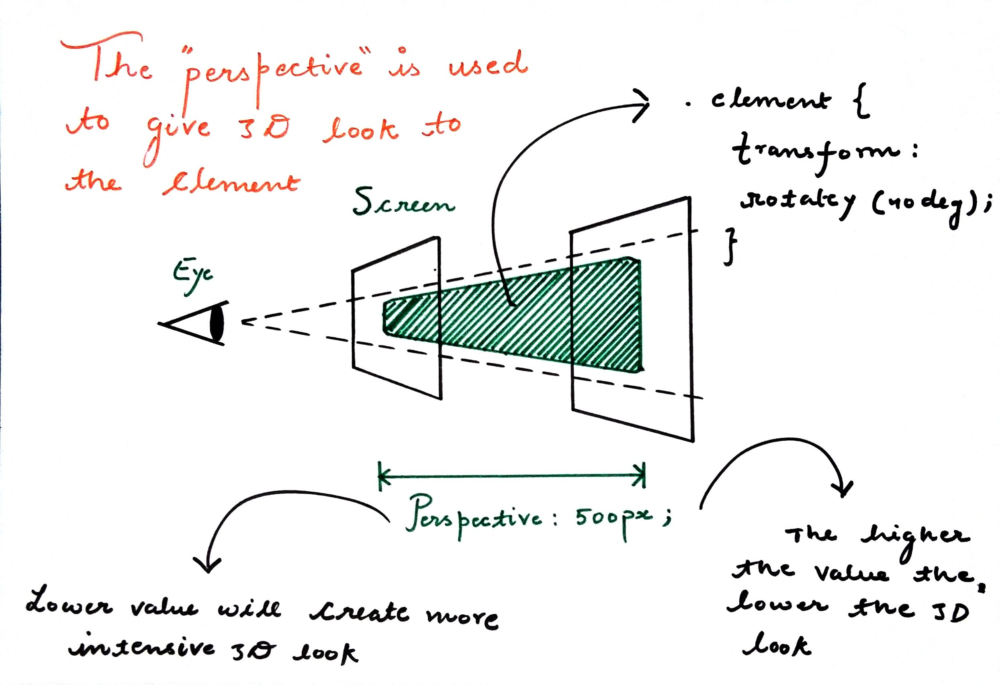
  - If the user is right next to the screen, small changes in position will appear huge. Imagine spinning a card that's only a few inches from your face. If the user is further away, though, that same motion will appear smaller and more subtle.

- when rotating cards **180 degrees** and you want not the back of the card to be visible, we use the `backface-visibility` property:

  ```css
  .card {
    backface-visibility: hidden;
  }

  .card:hover {
    transform: rotateY(180deg);
  }
  ```

  
  

- Example

  ```html
  <style>
    .card-wrapper {
      perspective: 500px; /* 3d effect */
    }
    .card {
      position: relative;
      display: block;
    }
    .front,
    .back {
      width: 200px;
      height: 200px;
      background: white;
      border-radius: 8px;
      display: flex;
      justify-content: center;
      align-items: center;
      transition: transform 400ms;
      will-change: transform;
      backface-visibility: hidden; /* To hide the back of the card */
      /* Vendor prefix for Safari */
      -webkit-backface-visibility: hidden;
    }
    .back {
      position: absolute; /* To make it appear behind the front */
      top: 0;
      left: 0;
      transform: rotateY(
        -180deg
      ); /* To make it appear behind the front as it will be hidden because of backface-visibility */
    }
    .card:hover .front,
    .card:focus .front {
      transform: rotateY(180deg);
    }
    .card:hover .back,
    .card:focus .back {
      transform: rotateY(0deg);
    }
  </style>

  <div class="card-wrapper">
    <a href="/" class="card">
      <div class="front">
        <p>Hello World</p>
      </div>
      <div class="back">
        <p>This is the back</p>
      </div>
    </a>
  </div>
  ```

- Another example: [Folding the DOM](https://www.joshwcomeau.com/react/folding-the-dom/)

---

### Hamburger menu that opens navbar from the right as a growing circle

- The trick here is to use `clip-path` property to create a circle that grows from the center of the button to cover the whole screen

```css
.nav-bar {
  position: fixed;
  top: 0;
  left: 0;
  width: 100%;
  height: 100%;
  background: white;
  display: flex;
  justify-content: space-around;
  align-items: center;
  z-index: 1;
  opacity: 1;
  clip-path: circle(50px at 100% -10%); /* Masking the content of the nav-bar to be a circle */
  -webkit-clip-path: circle(50px at 100% -10%);
}
```

---

### Floating Cursor Animation

- The idea here is to create a floating cursor that follows the mouse movement on the page
- It's just a simple div with a background color that follows the mouse movement using `mousemove` event

- Floating Cursor when moving the mouse

  ```html
  <!-- Down in the end of the body -->
  <div class="cursor"></div>
  ```

  - Approach 1: using absolute positioning

    ```css
    .cursor {
      width: 3rem;
      height: 3rem;
      border: 2px solid white;
      border-radius: 50%;
      position: absolute;
      transform: translate(-50%, -50%);
      pointer-events: none;
      transition: all 0.5s ease-in-out;
      transition-property: background, transform;
      transform-origin: 75% 75%;
    }
    ```

    ```js
    function cursor(e) {
      let mouse = document.querySelector('.cursor');
      mouse.style.top = e.pageY + 'px';
      mouse.style.left = e.pageX + 'px';
    }

    window.addEventListener('mousemove', cursor);
    ```

  - Approach 2: using (fixed positioning & `transform` property)

    ```css
    .cursor {
      position: fixed;
      top: 0;
      left: 0;
      width: 30px;
      height: 30px;
      opacity: 1;
      background: rgba(0, 0, 0, 0.2);
      border: 1px solid transparent;
      transition: width 0.3s cubic-bezier(0.3, 0, 0.3, 1), height 0.3s cubic-bezier(0.3, 0, 0.3, 1),
        background 0.3s cubic-bezier(0.3, 0, 0.3, 1), margin 0.3s cubic-bezier(0.3, 0, 0.3, 1),
        opacity 0.7s cubic-bezier(0.3, 0, 0.3, 1);
      -webkit-transition: width 0.3s cubic-bezier(0.3, 0, 0.3, 1), height 0.3s cubic-bezier(0.3, 0, 0.3, 1),
        background 0.3s cubic-bezier(0.3, 0, 0.3, 1), margin 0.3s cubic-bezier(0.3, 0, 0.3, 1),
        opacity 0.7s cubic-bezier(0.3, 0, 0.3, 1);
      z-index: 999;
      pointer-events: none;
      border-radius: 100%;
      -moz-border-radius: 100%;
      -webkit-border-radius: 100%;
      -khtml-border-radius: 100%;
    }
    ```

    ```js
    function cursor(e) {
      let mouse = document.querySelector('.cursor');
      mouse.style.transform = `translate(${e.pageX}px, ${e.pageY}px)`;
    }

    window.addEventListener('mousemove', cursor);
    ```

- Growing Cursor when hovering over an element

  - The idea here is to create a circle that grows from the center of the button to cover the whole button

  ```css
  .cursor {
    width: 3rem;
    height: 3rem;
    border: 2px solid white;
    border-radius: 50%;
    position: absolute;
    transform: translate(-50%, -50%);
    pointer-events: none;
    transition: all 0.5s ease-in-out;
    transition-property: background, transform;
    transform-origin: 75% 75%;
  }
  .cursor.nav-active {
    background: rgb(86, 124, 228);
    transform: scale(3);
  }
  .cursor.explore-active {
    background: white;
    transform: scale(3);
  }
  .cursor-text {
    position: absolute;
    top: 50%;
    left: 50%;
    font-size: 0.5rem;
    transform: translate(-50%, -50%);
  }
  ```

  ```js
  let mouse = document.querySelector('.cursor');
  let mouseTxt = mouse.querySelector('span');

  function activeCursor(e) {
    const item = e.target;

    // If the item is a link, the cursor will be a pointer
    if (item.id === 'logo' || item.classList.contains('burger')) {
      mouse.classList.add('nav-active');
    } else {
      mouse.classList.remove('nav-active');
    }

    // If the item is an explore link, the cursor will be a circle
    if (item.classList.contains('explore')) {
      mouse.classList.add('explore-active');
      mouseTxt.innerText = 'Tap';
      gsap.to('.title-swipe', 1, { y: '0%' });
    } else {
      mouse.classList.remove('explore-active');
      mouseTxt.innerText = '';
      gsap.to('.title-swipe', 1, { y: '100%' });
    }
  }

  // Event Listeners
  window.addEventListener('mouseover', activeCursor);
  ```

- Notes:
  - It's important to set `pointer-events: none;` to prevent the cursor from blocking the mouse events on the page (like clicking on items)

---

### Chat Messages

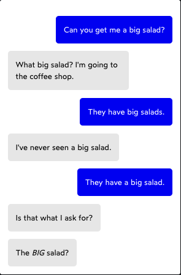

- The idea here is to create a chat interface with messages that have different styles based on the sender or the receiver
- Also we can move the messages container to the bottom of the page so that it feels like a real chat interface

```html
<style>
  ol {
    display: flex;
    flex-direction: column;
    justify-content: flex-end;
  }
  .message.sent {
    align-self: flex-end;
  }
</style>

<body>
  <ol>
    <li class="message sent">Can you get me a big salad?</li>
    <li class="message received">What big salad? I'm going to the coffee shop.</li>
  </ol>
</body>
```

---

### Facebook-style layout

On their desktop application, Facebook has a 3-column layout. There're some added borders so we can see how the columns flex:

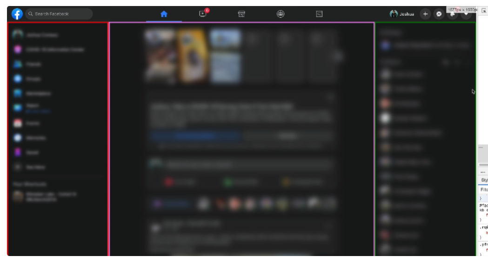

- It's a 3 column layout, and below a certain threshold, the left-hand navigation disappears. It's interesting how things scale, though!
- When shrinking the screen below `1100px`:

  - the left-hand navigation disappears
  - the right-hand sidebar starts to shrink before reaching a minimum width
  - the center column appears to not shrink at all, as if it has more priority than the right-hand sidebar (until the right-hand sidebar reaches its minimum width, then they both shrink together)

- Solution:

  ```html
  <style>
    .wrapper {
      display: flex;
    }
    nav,
    aside.contacts {
      min-width: 150px;
      max-width: 250px;
      flex-shrink: 9999999; /* This will make the element shrink more than the other elements */
      flex-basis: 250px;
    }
    main {
      flex: 1;
      flex-basis: 500px;
      /* Here it doesn't have `flex-shrink` property, meaning it has the default value of 1, so it will shrink 1 px for each 9999999 px shrunk by the other elements */
    }
  </style>

  <div class="wrapper">
    <nav></nav>
    <main></main>
    <aside class="contacts"></aside>
  </div>
  ```

---

### Spacer Component Trick

It's a common pattern to use a spacer component to add space between elements. This is especially useful when you want to add space between elements that are not direct siblings outside of the selector's styles to prevent overriding other styles.

```jsx
/* Spacer Component */
const Spacer = ({ size }) => {
  return <div style={{ height: size }} />;
};

/* Usage */
<div>
  <h1>Heading</h1>
  <Spacer size='20px' />
  <p>Paragraph</p>
</div>;
```

The above is a vertical-spacer component. You can also create a horizontal-spacer component by changing the `height` to `width`.

---

### Scrollable part of a container

- The idea here is to create a scrollable part of a container that has a fixed height and a scrollbar and when we scroll (as the part B is overflowing), the part A will stay fixed and visible

- Starter code

  ```html
  <style>
    section {
      display: flex;
      gap: 32px;
      border: 3px solid hotpink;
    }

    .col {
      flex: 1;
      padding: 16px;
    }
  </style>

  <section>
    <div class="col">
      <h1>Growing Column</h1>
      <p>
        This column will grow very tall indeed, whilst the adjacent one will be clamped to whatever
        height this one rests at!
      </p>
      <p>
        Lorem Ipsum is simply dummy text of the printing and typesetting industry. Lorem Ipsum has
        been the industry's standard dummy text ever since the 1500s, when an unknown printer took a
        galley of type and scrambled it to make a type specimen book.
      </p>
    </div>

    <div class="col">
      <p>Here is a list of all the letters in the English language:</p>
      <ol>
        <li>Item A</li>
        <li>Item B</li>
        <li>Item C</li>
        <li>Item D</li>
        <li>Item E</li>
        <li>Item F</li>
        <li>Item G</li>
        <li>Item H</li>
        <li>Item I</li>
        <li>Item J</li>
        <li>Item K</li>
        <li>Item L</li>
        <li>Item M</li>
        <li>Item N</li>
        <li>Item O</li>
        <li>Item P</li>
        <li>Item Q</li>
        <li>Item R</li>
        <li>Item S</li>
        <li>Item T</li>
        <li>Item U</li>
        <li>Item V</li>
        <li>Item W</li>
        <li>Item X</li>
        <li>Item Y</li>
        <li>Item Z</li>
      </ol>
    </div>
  </section>
  ```

- Expected output & constraints:
  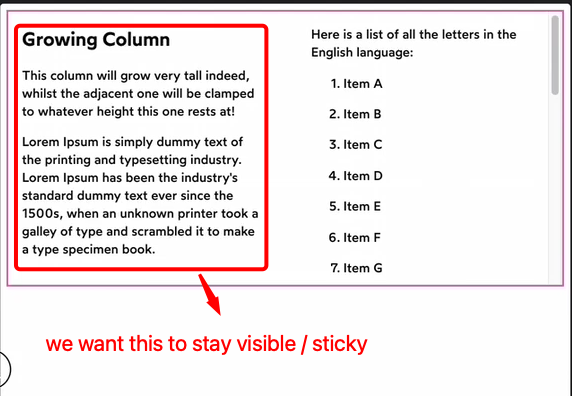

  - Two equal width columns
  - The container should be the height of the first column.
  - The second column should scroll vertically, since it won't fit in the shorter container.

- Solution:

  ```css
  section {
    display: flex;
    gap: 32px;
    border: 3px solid hotpink;
    overflow: hidden; /* new ✅ */
  }

  .col:first-of-type {
    position: sticky; /* new ✅ */
    top: 0; /* new ✅ */
  }

  .col:last-of-type {
    height: 0; /* new ✅ */
    /* This will make the second column scrollable */
  }
  ```

---

### Tracking the scrollbar width

When you have a scrollbar on the page, it can affect the layout of the page or cover some of the content. You can track the scrollbar width using JavaScript and then adjust the layout accordingly.

```js
const scrollbarWidth = window.innerWidth - document.documentElement.clientWidth;

// window.innerWidth --> width of the window including the scrollbar
// document.documentElement.clientWidth --> width of the document excluding the scrollbar
```

- Here's an example: Let's say our window is `500px` wide, and our scrollbar is taking up `20px`. `window.innerWidth` will be `500`, and `clientWidth` will be `480`. By subtracting, we get the difference of `20`. If there is no scrollbar, or the scrollbar is a non-blocking overlay, `scrollbarWidth` will be `0`, since our two width values will be identical.

  - Now that we know how wide the scrollbar is, we can assign it to a CSS variable:

  ```js
  document.documentElement.style.setProperty('--scrollbar-width', scrollbarWidth + 'px');
  // By attaching this CSS variable to the documentElement, we make it globally available (it's the same thing as targeting html in CSS).

  // Now, in our CSS, we can use this variable to adjust our layout:
  ```

  ```css
  .wrapper {
    width: calc(100% - var(--scrollbar-width));
  }
  ```

  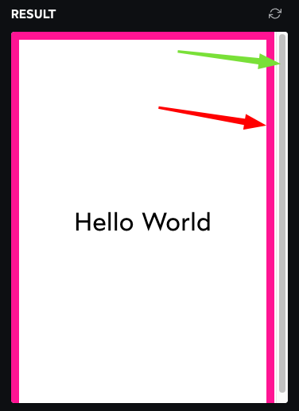

---

### Filler Technique

It's a technique that is used for some designs where you need to have an element centered in the middle of the container that has 2 elements and we want the design to be like if the container has 3 elements.

- The idea here is to create a filler element that takes up the remaining space in the container and pushes the centered element to the middle of the container. This way the element that we want to center will be squished to the middle of the container by its left from the filler element and by its right from the other element.
- The idea here that we need to apply `flex: 1;` to the filler element and the other elements will take the space they need.

- Example:

  ```html
  <div class="overlay">
    <div class="container">
      <div class="filler"></div>

      <div class="nav"></div>
        <a href="#">Sale</a>
        <a href="#">New Releases</a>
        <a href="#">Men</a>
        <a href="#">Women</a>
        <a href="#">Kids</a>
        <a href="#">Collections</a>
      </div>

      <div class="footer">
        <a href="/terms">Terms and Conditions</a>
          <a href="/privacy">Privacy Policy</a>
          <a href="/contact">Contact Us</a>
      </div>
    </div>
  </div>

  <style>
    .overlay {
      position: fixed;
      top: 0;
      left: 0;
      width: 100%;
      height: 100%;
      background-color: rgba(0, 0, 0, 0.5);
      display: flex;
      justify-content: flex-end;
    }

    .container {
      width: 300px;
      height: 100%;
      background-color: white;
      display: flex;
      flex-direction: column;
    }

    .nav {
      display: flex;
      flex-direction: column;
      gap: 16px;
    }

    .filler {
      flex: 1;
    }

    .footer {
      display: flex;
      flex-direction: column;
      justify-content: flex-end;
      flex: 1;
    }
  ```

  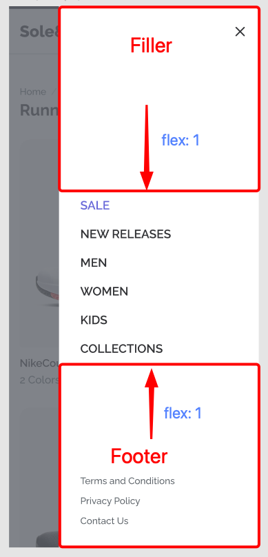

---

### Book Design

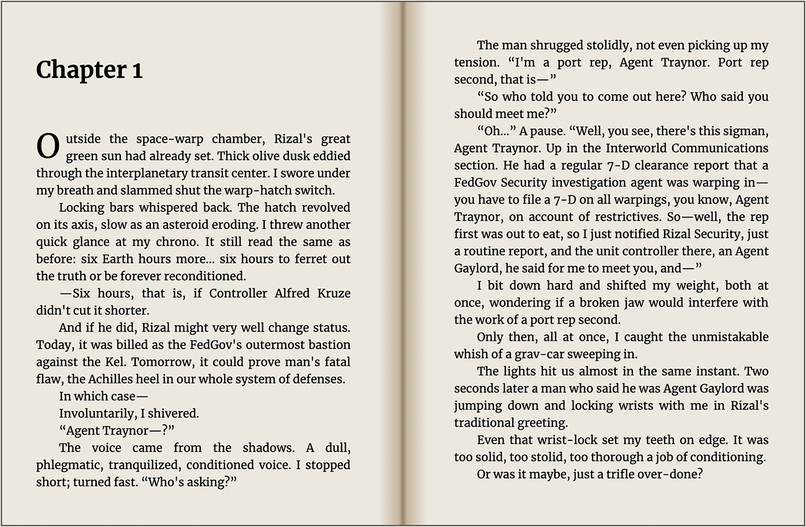

```html
<main class="wrapper">
  <h2>Chapter 1</h2>
  <p>
    Outside the space-warp chamber, Rizal's great green sun had already set. Thick olive dusk eddied
    through the interplanetary transit center. I swore under my breath and slammed shut the
    warp-hatch switch.
  </p>
  <p>
    Locking bars whispered back. The hatch revolved on its axis, slow as an asteroid eroding. I
    threw another quick glance at my chrono. It still read the same as before: six Earth hours more…
    six hours to ferret out the truth or be forever reconditioned.
  </p>
  <p>—Six hours, that is, if Controller Alfred Kruze didn't cut it shorter.</p>
  <p>
    And if he did, Rizal might very well change status. Today, it was billed as the FedGov's
    outermost bastion against the Kel. Tomorrow, it could prove man's fatal flaw, the Achilles heel
    in our whole system of defenses.
  </p>
  <p>In which case—</p>
  <p>Involuntarily, I shivered.</p>
  <p>“Agent Traynor—?”</p>
  <p>
    The voice came from the shadows. A dull, phlegmatic, tranquilized, conditioned voice. I stopped
    short; turned fast. “Who's asking?”
  </p>
  <p>
    The man shrugged stolidly, not even picking up my tension. “I'm a port rep, Agent Traynor. Port
    rep second, that is—”
  </p>

  <p>“So who told you to come out here? Who said you should meet me?”</p>
  <p>
    “Oh…” A pause. “Well, you see, there's this sigman, Agent Traynor. Up in the Interworld
    Communications section. He had a regular 7-D clearance report that a FedGov Security
    investigation agent was warping in—you have to file a 7-D on all warpings, you know, Agent
    Traynor, on account of restrictives. So—well, the rep first was out to eat, so I just notified
    Rizal Security, just a routine report, and the unit controller there, an Agent Gaylord, he said
    for me to meet you, and—”
  </p>
  <p>
    I bit down hard and shifted my weight, both at once, wondering if a broken jaw would interfere
    with the work of a port rep second.
  </p>
  <p>Only then, all at once, I caught the unmistakable whish of a grav-car sweeping in.</p>
  <p>
    The lights hit us almost in the same instant. Two seconds later a man who said he was Agent
    Gaylord was jumping down and locking wrists with me in Rizal's traditional greeting.
  </p>
  <p>
    Even that wrist-lock set my teeth on edge. It was too solid, too stolid, too thorough a job of
    conditioning.
  </p>
  <p>Or was it maybe, just a trifle over-done?</p>
</main>
```

```css
.wrapper {
  column-count: 2;
  column-gap: 150px;
  max-width: 64rem;
  margin: 32px auto;
  border: 2px solid hsl(35deg 10% 40%);
  padding: 50px;
  background: linear-gradient(
    to right,
    hsl(35deg, 30%, 90%),
    hsl(35deg, 30%, 90%) 47%,
    hsl(35deg, 30%, 70%) 49.5%,
    hsl(35deg, 20%, 50%) 50%,
    hsl(35deg, 30%, 70%) 50.5%,
    hsl(35deg, 30%, 90%) 53%,
    hsl(35deg, 30%, 90%)
  );
}
h2 {
  font-size: 2rem;
  margin-bottom: 2em;
}
p {
  text-align: justify;
}
p:first-of-type:first-letter {
  font-size: 3em;
  float: left;
  line-height: 1em;
  margin-right: 0.2em;
}
p:not(:first-of-type) {
  text-indent: 2em;
}
* {
  font-family: 'Merriweather', serif;
}
```

---

### Grid shapes

- "stairs" layout using CSS Grid:
  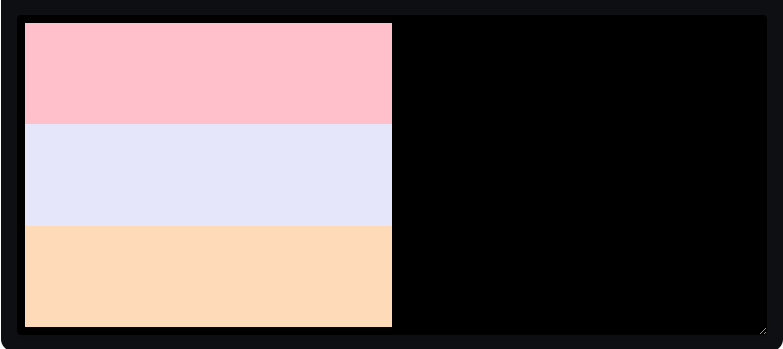
  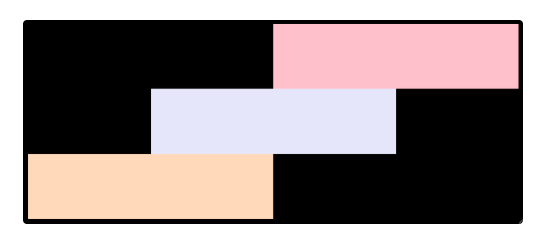

  ```html
  <div class="wrapper">
    <div class="box one"></div>
    <div class="box two"></div>
    <div class="box three"></div>
  </div>

  <style>
    .wrapper {
      display: grid;
      grid-template-rows: repeat(3, 1fr);
      min-height: 100%;
      justify-items: center; /* center the items horizontally on the grid row */
    }
    .box {
      width: 50%;
    }
    .box.one {
      background-color: pink;
      justify-self: end; /* align the item to the end of the grid row */
    }
    .box.two {
      background-color: lavender;
    }
    .box.three {
      background-color: peachpuff;
      justify-self: start; /* align the item to the start of the grid row */
    }
    html,
    body {
      height: 100%;
    }
  </style>
  ```

- Broken rectangles
  

  - The idea is that all rectangles are the same size, but they are broken in the middle to create a unique layout.
    
  - You might think that you need to use a lot of grid columns and rows to achieve this layout, but you can do it with just one row and 2 columns (one for the left side and one for the right side).
  - We also need to store the desired full width of the shape in a CSS variable (`--rect-width`)

  ```html
  <div class="wrapper">
    <div class="box one"></div>
    <div class="box two"></div>
    <div class="box three"></div>
    <div class="box four"></div>
    <div class="box five"></div>
    <div class="box six"></div>
  </div>
  ```

  - phase 1:
    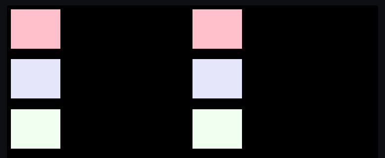

    ```css
    .wrapper {
      --rect-width: 100px;
      display: grid;
      grid-template-columns: repeat(2, 1fr);
      min-height: 100%;
    }

    .box {
      width: var(--rect-width);
      height: 80px;
    }

    .box.one {
      background-color: pink;
    }
    .box.two {
      background-color: pink;
    }
    .box.three {
      background-color: lavender;
    }
    .box.four {
      background-color: lavender;
    }
    .box.five {
      background-color: honeydew;
    }
    .box.six {
      background-color: honeydew;
    }

    html,
    body {
      height: 100%;
    }
    ```

  - phase 2: move the odd boxes to the end of the grid row, then add a gap between the boxes, and finally, adjust the width of the boxes to create the broken rectangles

    ```css
    .wrapper {
      --rect-width: 100px;
      display: grid;
      grid-template-columns: repeat(2, 1fr);
      align-content: center; /* center the items vertically on the grid row */
      gap: 4px; /* add a gap between the grid items */
      min-height: 100%;
    }
    .box:nth-of-type(odd) {
      justify-self: end; /* align the odd items to the end of the grid row */
    }
    .box {
      width: var(--rect-width);
      height: 80px;
    }
    .box.one {
      background-color: pink;
      width: calc(var(--rect-width) * 0.25); /* adjust the width of the first box */
    }
    .box.two {
      background-color: pink;
      width: calc(var(--rect-width) * 0.75); /* adjust the width of the second box */
    }
    .box.three {
      background-color: lavender;
      width: calc(var(--rect-width) * 0.5); /* adjust the width of the third box */
    }
    .box.four {
      background-color: lavender;
      width: calc(var(--rect-width) * 0.5); /* adjust the width of the fourth box */
    }
    .box.five {
      background-color: honeydew;
      width: calc(var(--rect-width) * 0.75); /* adjust the width of the fifth box */
    }
    .box.six {
      background-color: honeydew;
      width: calc(var(--rect-width) * 0.25); /* adjust the width of the sixth box */
    }
    html,
    body {
      height: 100%;
    }
    ```

---

### Full Bleed Layout

A common blog layout involves a single, centered column of text, with images that either span the full width of the column or are centered within it. This is known as a full-bleed layout.

- **Type 1:** images are centered within the column
  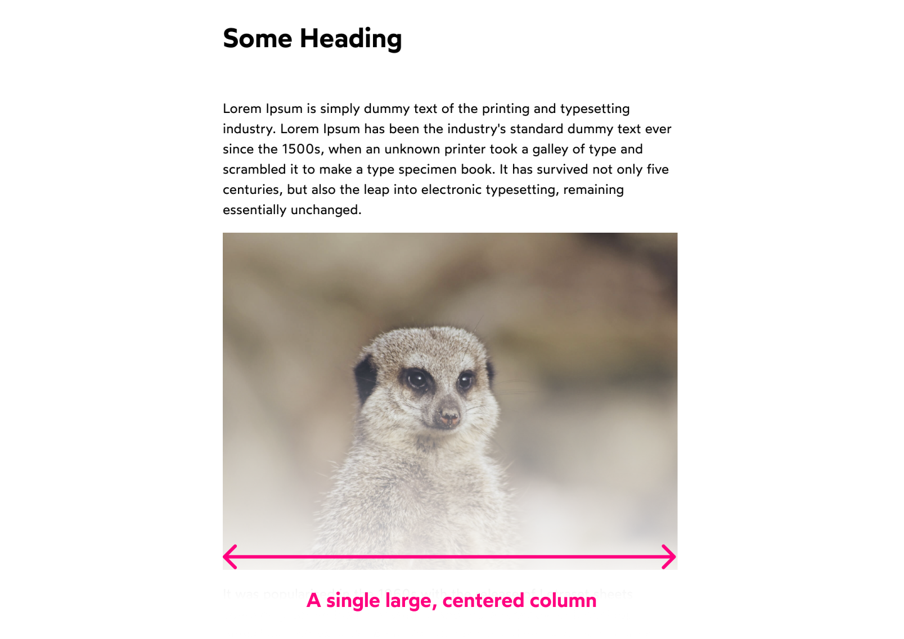

  ```html
  <style>
    .max-width-wrapper {
      max-width: 30ch; /* 30 characters wide, or whatever you prefer */
      padding: 32px;
      margin-left: auto;
      margin-right: auto;
    }
  </style>

  <div class="max-width-wrapper">
    <h1>Some Heading</h1>
    <p>
      Lorem Ipsum is simply dummy text of the printing and typesetting industry. Lorem Ipsum has
      been the industry's standard dummy text ever since the 1500s, when an unknown printer took a
      galley of type and scrambled it to make a type specimen book. It has survived not only five
      centuries, but also the leap into electronic typesetting, remaining essentially unchanged.
    </p>
    
    <p>
      It was popularised in the 1960s with the release of Letraset sheets containing Lorem Ipsum
      passages, and more recently with desktop publishing software like Aldus PageMaker including
      versions of Lorem Ipsum.
    </p>
  </div>
  ```

  - Using a `max-width` wrapper is a solid approach, but it does lock us in; every in-flow child will be constrained by that container. That's where **type 2** comes in.

- **Type 2:** images span the full width of the column
  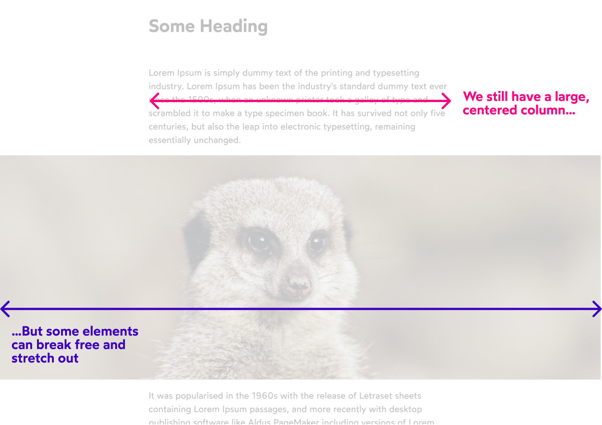

  > Having an element stretch from edge to edge is known as a **"full-bleed" element**, a term borrowed from the publishing world when magazine ads would be printed right to the edge of the page.

  - Fortunately, **CSS Grid** offers a very clever solution to this problem.

  ```html
  <style>
    .wrapper {
      display: grid;
      grid-template-columns:
        1fr
        min(30ch, 100%)
        1fr;
    }
    .wrapper > * {
      grid-column: 2;
    }
    .full-bleed {
      grid-column: 1 / -1;
    }

    .meerkat {
      display: block;
      width: 100%;
      height: 300px;
      object-fit: cover;
    }
  </style>

  <main class="wrapper">
    <h1>Some Heading</h1>
    <p>
      Lorem Ipsum is simply dummy text of the printing and typesetting industry. Lorem Ipsum has
      been the industry's standard dummy text ever since the 1500s, when an unknown printer took a
      galley of type and scrambled it to make a type specimen book. It has survived not only five
      centuries, but also the leap into electronic typesetting, remaining essentially unchanged.
    </p>
    <div class="full-bleed">
      
    </div>
    <p>
      It was popularised in the 1960s with the release of Letraset sheets containing Lorem Ipsum
      passages, and more recently with desktop publishing software like Aldus PageMaker including
      versions of Lorem Ipsum.
    </p>
  </main>
  ```

  - Grid construction:
    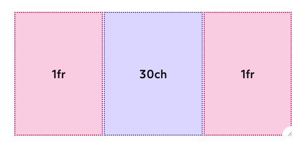

    - We have 3 explicit columns: the first and last are `1fr` wide, and the middle column is `min(30ch, 100%)` wide.
    - the `ch` unit is equal to the width of the 0 character, in the current font. Let's assume that in the current situation, our 0 character is `15px` wide. This means that our `30ch` value translates to `450px`.
    - `450px` is too wide to fit on many mobile displays. That's why we have that min() function. It clamps this value so that it never grows above 100% of the available space. On a `375px`-wide phone, our center column will be `375px` wide, not 450px.
    - Our two side columns will share whatever space remains. Like auto margins, this is a clever way to make sure the middle column is centered.

  - Column assignment
    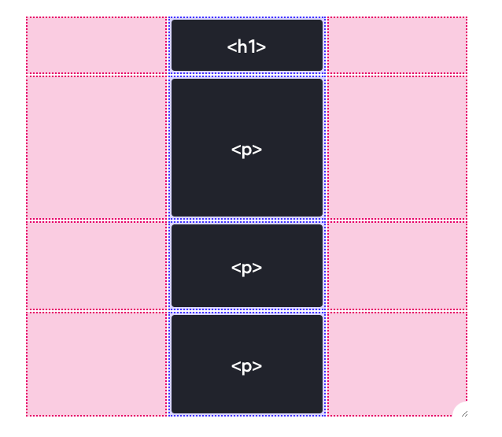

    - As we start adding children to this grid, they'll be assigned into the first available cell. This doesn't work for us: we want all of our content to be assigned to that middle column by default, That's where this CSS comes in:

      ```css
      .wrapper > * {
        grid-column: 2; /* every direct child of .wrapper will be assigned to the second column */
      }
      ```

  - Full-bleed children
    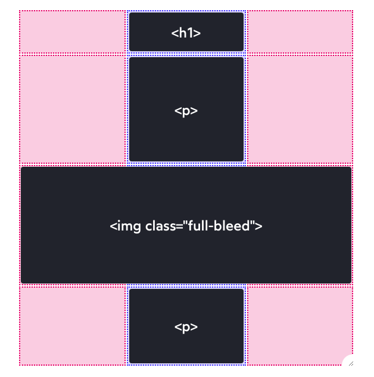

    - The `full-bleed` class is a simple way to make an element span the full width of the grid. It's a common pattern in CSS Grid to use a class like this to target full-bleed elements.

      ```css
      .full-bleed {
        grid-column: 1 / -1; /* span from the first column to the last column */
      }
      ```

    - This can lead to some very tall images, on very wide screens, so it's better to combine it with a fixed `height` and `object-fit`:

      ```css
      .meerkat {
        display: block;
        width: 100%;
        height: 300px;
        object-fit: cover;
      }
      ```

  - Adding gutters (for small screens)
    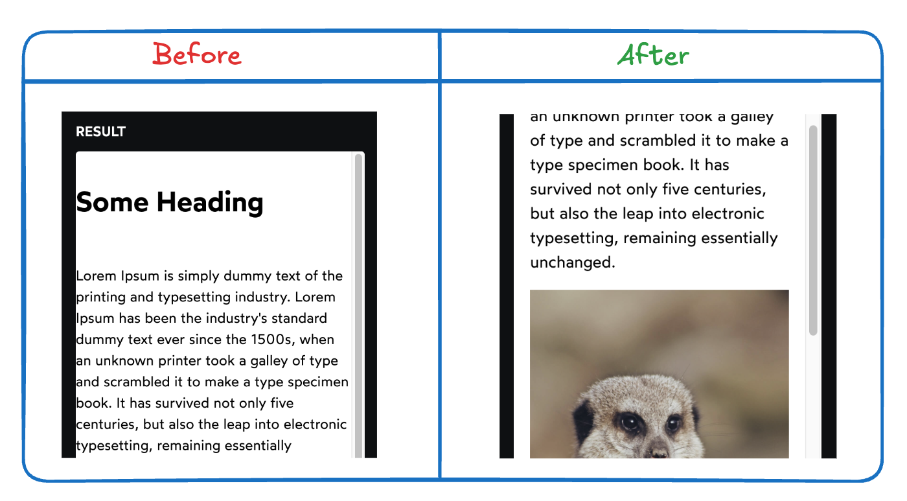

    - We can add `padding` to create some space between the text and the image. This is a great way to add some breathing room to the layout.

      ```css
      .wrapper {
        display: grid;
        grid-template-columns:
          1fr
          min(30ch, 100%)
          1fr;
        padding: 0 16px; /*  add padding to the grid container */
      }
      ```

    - Note: this will create a problem for the "full-bleed" element, as it will not be full-bleed anymore. To fix this, we need to use "negative margin" to make the full-bleed element span the full width of the grid container:

      ```css
      .full-bleed {
        grid-column: 1 / -1; /* span from the first column to the last column */
        margin-left: -16px; /* add negative margin to the left */
        margin-right: -16px; /* add negative margin to the right */
      }
      ```

      - So, Our container has 16px of padding, but our full-bleed children will undo that, using the negative margin trick

---

### Specialty story grid (news website)

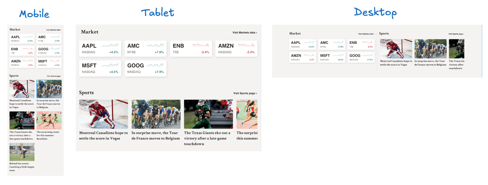

```jsx
import React from 'react';
import styled from 'styled-components/macro';

import { MARKET_DATA, SPORTS_STORIES } from '../../data';

import { QUERIES } from '../../constants';

import MarketCard from '../MarketCard';
import SectionTitle from '../SectionTitle';
import MiniStory from '../MiniStory';

const SpecialtyStoryGrid = () => {
  return (
    <Wrapper>
      <MarketsSection>
        <SectionTitle
          cornerLink={{
            href: '/markets',
            content: 'Visit Markets data »'
          }}>
          Markets
        </SectionTitle>
        <MarketCards>
          {MARKET_DATA.map(data => (
            <MarketCard key={data.tickerSymbol} {...data} />
          ))}
        </MarketCards>
      </MarketsSection>
      <SportsSection>
        <SectionTitle
          cornerLink={{
            href: '/sports',
            content: 'Visit Sports page »'
          }}>
          Sports
        </SectionTitle>
        <SportsStories>
          {SPORTS_STORIES.map(data => (
            <SportsStoryWrapper key={data.id}>
              <MiniStory {...data} />
            </SportsStoryWrapper>
          ))}
        </SportsStories>
      </SportsSection>
    </Wrapper>
  );
};

const Wrapper = styled.div`
  display: grid;
  gap: 48px;

  @media ${QUERIES.tabletAndUp} {
    gap: 64px;
    grid-template-columns: minmax(0px, auto);
  }
  @media ${QUERIES.laptopAndUp} {
    gap: 0px;
    grid-template-columns: 1fr minmax(0px, 1fr);
  }
`;

const MarketsSection = styled.section`
  @media ${QUERIES.laptopAndUp} {
    padding-right: 16px;
    margin-right: 16px;
    border-right: 1px solid var(--color-gray-300);
  }
`;

const MarketCards = styled.div`
  display: grid;
  grid-template-columns: repeat(auto-fill, minmax(165px, 1fr));
  gap: 16px;
`;

const SportsSection = styled.section``;

const SportsStories = styled.div`
  display: grid;
  grid-template-columns: repeat(auto-fill, minmax(165px, 1fr));
  gap: 16px;

  @media ${QUERIES.tabletAndUp} {
    display: flex;
    grid-template-columns: revert;
    overflow: auto;
  }
`;

const SportsStoryWrapper = styled.div`
  min-width: 220px;
`;

export default SpecialtyStoryGrid;
```

- Here, the trick is using `auto-fill` in the `grid-template-columns` property to create a flexible grid that will automatically add as many columns as it can fit in the container. This is a great way to create a responsive grid that will adapt to the available space.
- Also, Handling overflow on the `SportsStories` container is a great way to make sure that the grid will be scrollable on smaller screens. This is a common pattern for responsive grids that need to adapt to different screen sizes.

---

### Color-rotated emoji (Changing the color of an emoji)

Google engineer Surma recently [shared a neat discovery](https://twitter.com/DasSurma/status/1420831971828195328) — The `hue-rotate` filter can be used to change the colors of emoji!

```html
<style>
  span[role='img'] {
    font-size: 2em;
  }
  .rotated {
    filter: hue-rotate(160deg);
  }
</style>

<p>
  <span role="img" aria-label="star">⭐</span>
  <span class="rotated" role="img" aria-label="star">⭐</span>
</p>
```

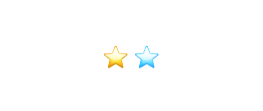

- Here, the `hue-rotate` filter is applied to the `.rotated` class, which changes the color of the emoji. This is a great way to add some visual interest to your designs and make your emoji stand out.

---

### Blurred glow

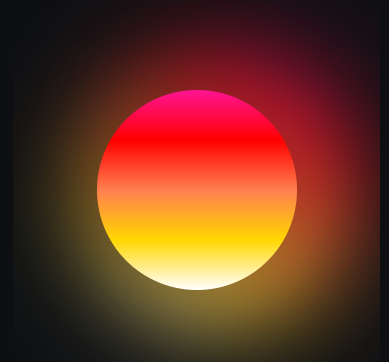

It's a trick to create a blurred glow effect around an element using CSS filters instead of using `box-shadow` or `outline` properties.

- The great thing here is that the glow will have the same color as the element itself, which is a nice touch. and not possible with `box-shadow` or `outline` properties.

- Here's an example of the element without the glow effect:

  ```html
  <div class="wrapper">
    <div class="gradient regular"></div>
  </div>
  ```

  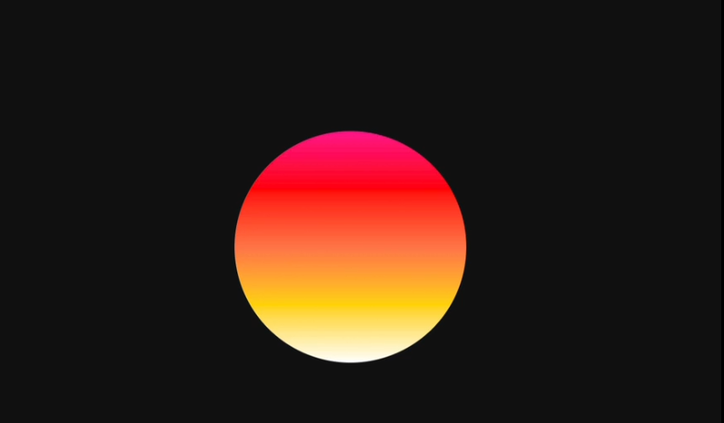

- And here's the final result with the glow effect:

  ```html
  <style>
    body {
      overflow: hidden;
    }
    .wrapper {
      position: relative;
    }
    .gradient {
      position: relative;
      width: 200px;
      height: 200px;
      border-radius: 50%;
      background-image: linear-gradient(deeppink, red, coral, gold, white);
    }
    .blurry {
      position: absolute;
      filter: blur(40px); /* add a blur effect */
      transform: scale(1.3) translateX(10%) rotate(30deg);
    }
    .regular {
      filter: drop-shadow(0px 0px 25px hsl(0deg 0% 0% / 0.3));
    }
  </style>

  <div class="wrapper">
    <div class="gradient blurry"></div>
    <!-- this is the blurred glow -->
    <div class="gradient regular"></div>
  </div>
  ```

  

---

### Gradient shapes

- **Edge glow** is a technique to create a glowing effect around the edges of an element. This is a great way to add some visual interest to your designs and make your elements stand out.

  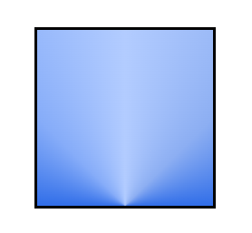

  ```css
  .box {
    width: 200px;
    height: 200px;
    border: 3px solid;
    background-image: conic-gradient(
      from 90deg at 50% 100%,
      hsl(220deg 80% 55%) 50%,
      hsl(220deg 90% 75%) 62.5%,
      hsl(220deg 100% 85%) 75%,
      hsl(220deg 80% 75%) 87.5%,
      hsl(220deg 80% 55%) 100%
    );
  }
  ```

  - It uses [Conic Gradient](#conic-gradient) to create a gradient that goes around the edges of the element.
  - Here's the strategy: we push the gradient down so that we only see the top half of it. Then, we control the colors from `50%` to `100%`:
    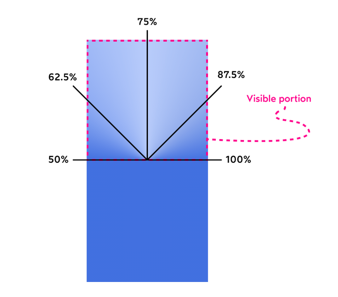

- **Metal knob** We can simulate a brushed metal aesthetic with a bunch of greyscale colors:

  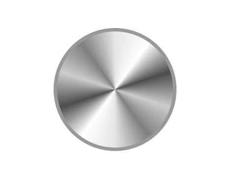

  ```css
  .knob {
    width: 200px;
    height: 200px;
    border-radius: 50%;
    border: 6px solid hsl(0deg 0% 60%);
    background-image: conic-gradient(
      hsl(0deg 0% 90%),
      hsl(0deg 0% 100%),
      hsl(0deg 0% 30%),
      hsl(0deg 0% 80%),
      hsl(0deg 0% 50%),
      hsl(0deg 0% 90%),
      hsl(0deg 0% 100%),
      hsl(0deg 0% 30%),
      hsl(0deg 0% 80%),
      hsl(0deg 0% 50%),
      hsl(0deg 0% 90%)
    );
  }
  ```

  - It uses [Radial Gradient](#radial-gradient) to create a gradient that goes from the center to the edges of the element.
  - Here's the strategy

- **Overlapping shapes**

  - For example, with `linear-gradient`, we can create these overlapping triangles:

    

    ```css
    html {
      --blue-bg: hsl(230deg 40% 20%);
      --blue-darker: hsl(230deg 40% 24%);
      --blue-dark: hsl(230deg 40% 28%);
    }
    .linear-slopes {
      background: linear-gradient(
          calc(180deg - 20deg),
          transparent 0%,
          transparent 49.99%,
          var(--blue-dark) 50%,
          var(--blue-dark) 100%
        ), linear-gradient(calc(180deg + 20deg), transparent 0%, transparent 49.99%, var(
              --blue-darker
            ) 50%, var(--blue-darker) 100%);
    }
    ```

  - We can use `radial-gradient` to create overlapping circles:
    

    ```css
    html {
      --blue-bg: hsl(230deg 40% 20%);
      --blue-darker: hsl(230deg 40% 24%);
      --blue-dark: hsl(230deg 40% 28%);
    }

    .radial-slopes {
      background: radial-gradient(
          circle at 100% 120%,
          var(--blue-dark) 0%,
          var(--blue-dark) 49.99%,
          transparent 50%,
          transparent 100%
        ), radial-gradient(circle at 20% 100%, var(--blue-darker) 0%, var(--blue-darker) 49.99%, transparent
            50%, transparent 100%);
    }
    ```

---

### Trophy display

[Conic gradients](#conic-gradient) can be used to create a glow / spotlight effect.


```html
<style>
  html {
    --dark-gold: hsl(34deg 90% 45%);
    --gold: hsl(44deg 80% 70%);
    --light-gold: hsl(44deg 100% 85%);
  }
  .wrapper {
    position: relative;
    height: 325px;
    max-width: 550px;
    display: flex;
    justify-content: center;
    margin: auto;
    background-color: var(--gold);
    border-radius: 10000px 10000px 1000px 1000px; /* create a rounded rectangle by choosing very large values */
    background-image: conic-gradient(
      from 90deg at 50% 100%,
      var(--dark-gold) 50%,
      var(--gold) 62.5%,
      var(--light-gold) 75%,
      var(--gold) 87.5%,
      var(--dark-gold) 100%
    );
  }
  .trophy {
    transform-origin: center bottom;
    transform: scale(1.4) translateY(16px); /* scale the trophy and move it down */
  }
</style>

<div class="wrapper">
  
</div>
```

- We have 2 items: **rounded-background & the trophy-shape**

  - **rounded-background**:
    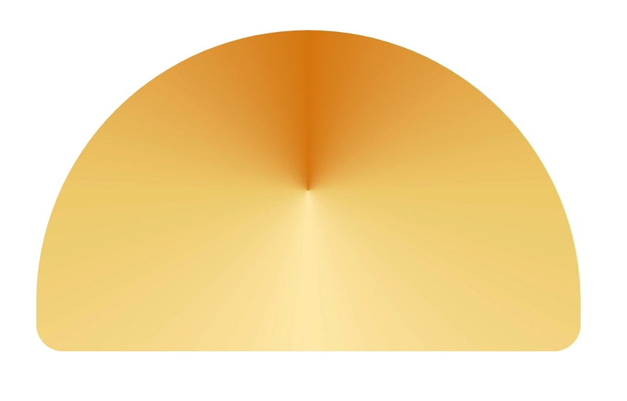

    - We use a `conic-gradient` to create a gradient that goes around the edges of the element.
    - we use `50% 100%` to push the gradient down so that we only see the top half of it. and `50%` for the golden color to be in the middle.
      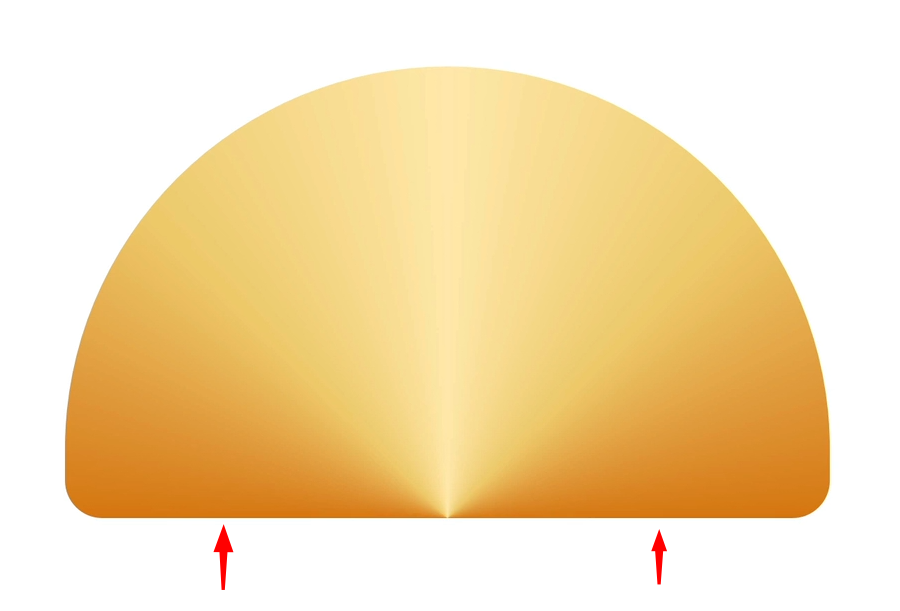
    - We use a `border-radius` to create a rounded rectangle. and we use very large values to make it look like a rounded rectangle.

  - **trophy-shape**:
    - from the code, we see that the light is not coming out from the trophy, but it's coming from the background. and the trophy is just a shape that is affected by the light.

---

### Increasing target sizes

It's hard to be precise with a coarse pointer. Given that **mobile users typically use a touchscreen with a finger**, we need to ensure that our interactive elements have a large tappable area.

> Apple recommends a minimum tap target size of **44 pixels by 44 pixels**. This is a minimum, though; it's better to overshoot this target.

- Here's a little trade secret, though: this doesn't mean that we have to make everything visually bigger.
- Instead, we can use `pseudo-element` that extends outwards in every direction, so if we have a `32px` button, we can add `8px` in every direction so that the **tap target size** is `48px`:

  ```html
  <style>
    button {
      position: relative;
      height: 32px;
    }

    button::after {
      --tap-increment: -8px; /* negative value to make it extends outwards */
      content: '';
      position: absolute;
      top: var(--tap-increment);
      left: var(--tap-increment);
      right: var(--tap-increment);
      bottom: var(--tap-increment);
    }
  </style>

  <button>Push me</button>
  ```

  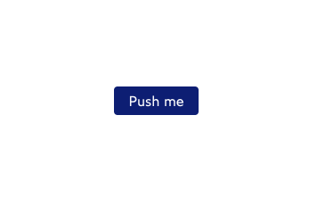
  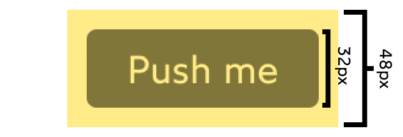

- Here's a hack to [Automatically calculating tap targets](https://codepen.io/third774/pen/XWgXZRY)

---

### Rising nav link

It's an effect that makes the link rise up when hovered over. This is a great way to add some visual interest to your designs and make your links stand out.

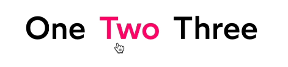

It appears as if the new color is filling the link from the bottom up.

There're multiple approaches, here's 2 examples:

- Using apsolute positioning:

  ```html
  <style>
    .nav-link {
      position: relative;
      color: hsl(0deg 0% 0%);
      text-decoration: none;
      transition: color 0.3s;
    }

    .nav-link::before {
      content: '';
      position: absolute;
      bottom: 0;
      left: 0;
      right: 0;
      height: 0;
      background-color: hsl(0deg 0% 0%);
      transition: height 0.3s;
    }

    .nav-link:hover {
      color: hsl(0deg 0% 100%);
    }

    .nav-link:hover::before {
      height: 100%;
    }
  </style>

  <a href="#" class="nav-link">Home</a>
  ```

- Using `clip-path`

  ```html
  <style>
    .nav-link {
      position: relative;
      color: hsl(0deg 0% 0%);
      text-decoration: none;
      transition: color 0.3s;
    }

    .nav-link::before {
      content: '';
      position: absolute;
      bottom: 0;
      left: 0;
      right: 0;
      height: 100%;
      background-color: hsl(0deg 0% 0%);
      clip-path: inset(100% 0 0 0); /* hide the element */
      transition: clip-path 0.3s;
      /* or transition: transform 0.3s; */
    }

    .nav-link:hover {
      color: hsl(0deg 0% 100%);
    }

    .nav-link:hover::before {
      clip-path: inset(0 0 0 0); /* show the element */
    }
  </style>

  <a href="#" class="nav-link">Home</a>
  ```

---

### Floating Tooltip

The main idea is to create a floating tooltip that appears when you hover over an element. This is a great way to add some visual interest to your designs and make your elements stand out.

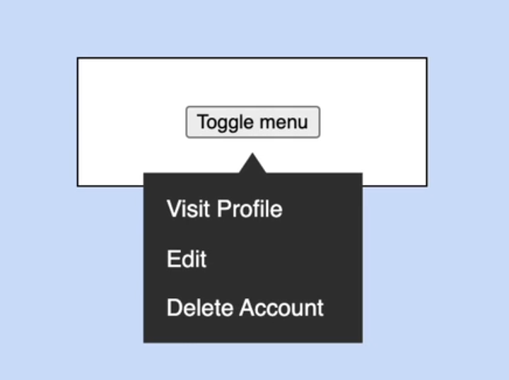
It's done by using `position: absolute` and `transform: translate` properties.

- Also we might need to create a tip that points to the element that triggered the tooltip. This can be done by using a `::before` pseudo-element.

  ```html
  <style>
    .tooltip {
      position: relative;
      display: inline-block;
      cursor: help;
    }

    .tooltip::before {
      content: attr(data-tooltip);
      position: absolute;
      bottom: calc(100% + 8px);
      left: 50%;
      transform: translateX(-50%);
      padding: 8px;
      background-color: hsl(0deg 0% 0%);
      color: hsl(0deg 0% 100%);
      border-radius: 4px;
      opacity: 0;
      transition: opacity 0.3s;
    }

    .tooltip:hover::before {
      opacity: 1;
    }
  </style>

  <span class="tooltip" data-tooltip="This is a tooltip">Hover over me</span>
  ```

By default implementing a tooltip from scratch can be a bit tricky, but with this technique, we can create a tooltip that appears when you hover over an element.

It's recommended not to create it from scratch, but to use a library like [Tippy.js](https://atomiks.github.io/tippyjs/) or [Tooltip.js](https://popper.js.org/docs/v2/). 

Or you can copy the source code of the tooltip from libraries like [Reach UI](https://reach.tech/listbox/)