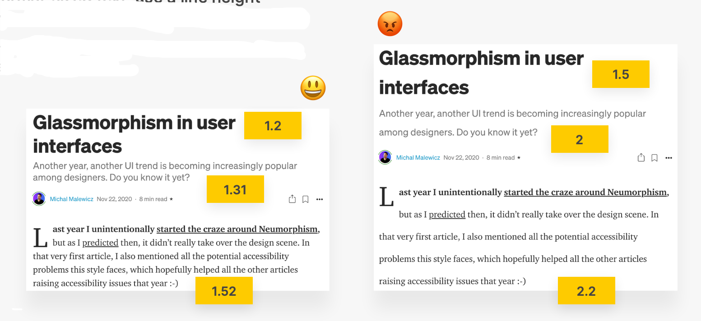
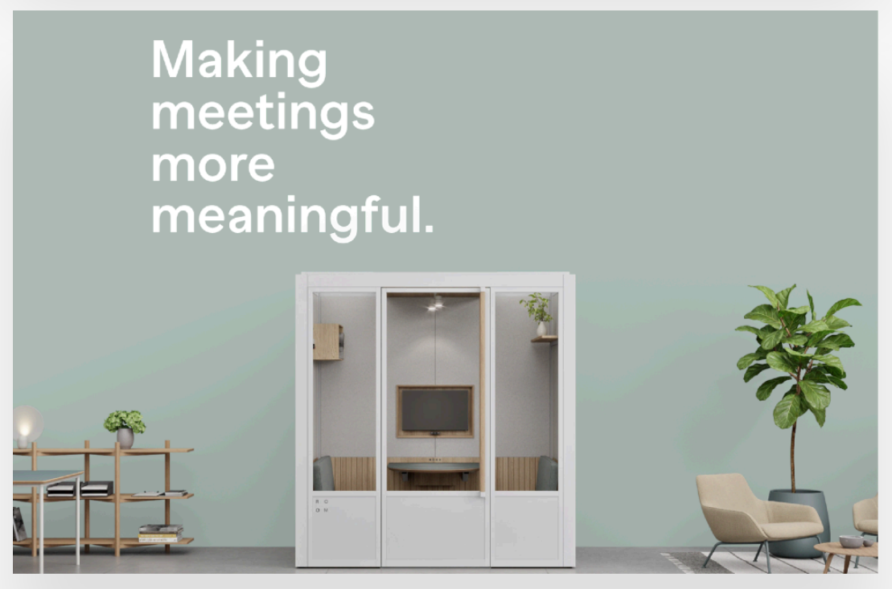
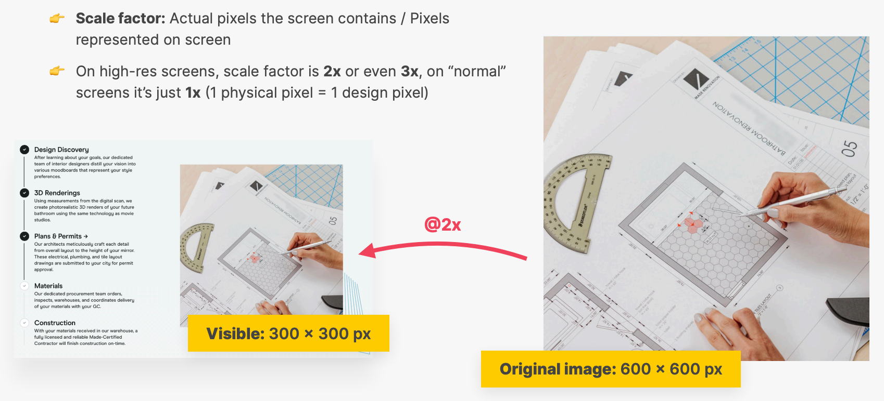
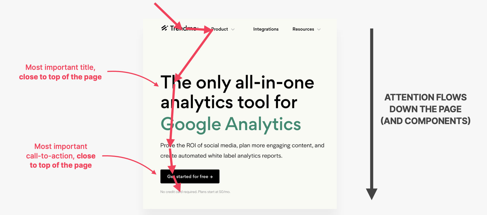
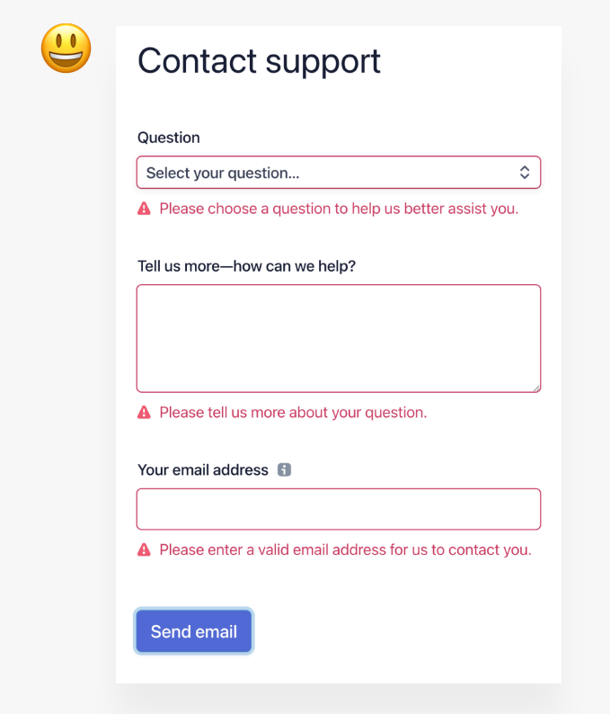
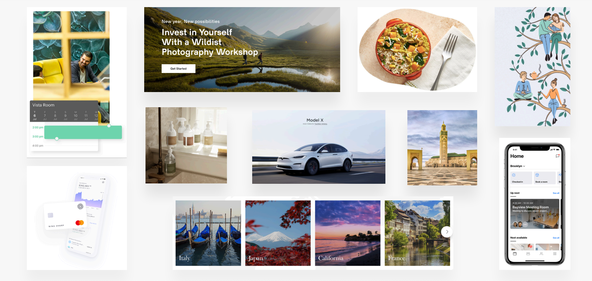
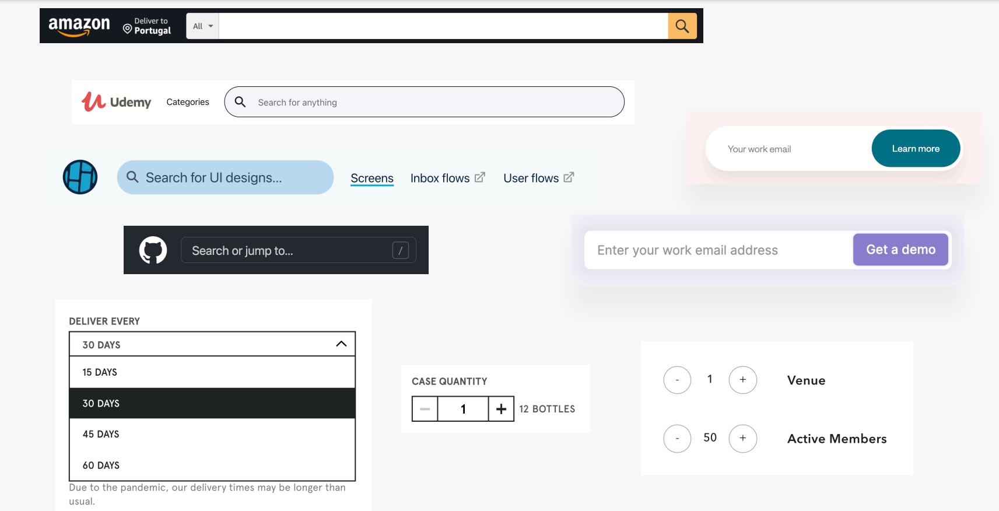
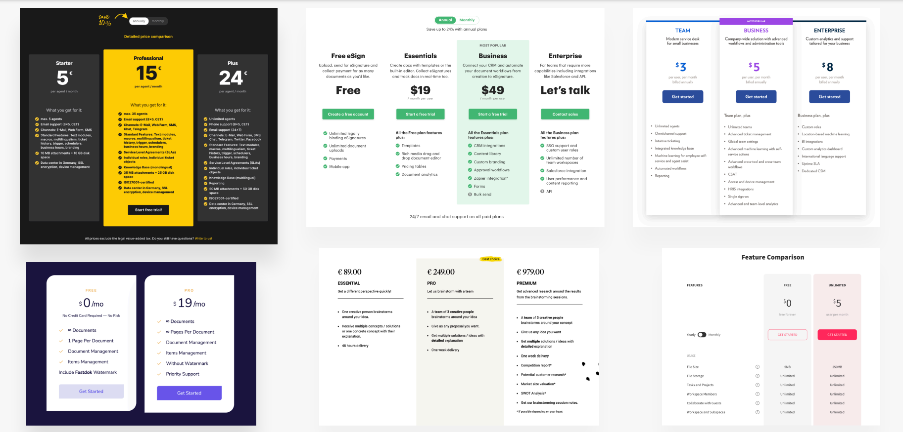
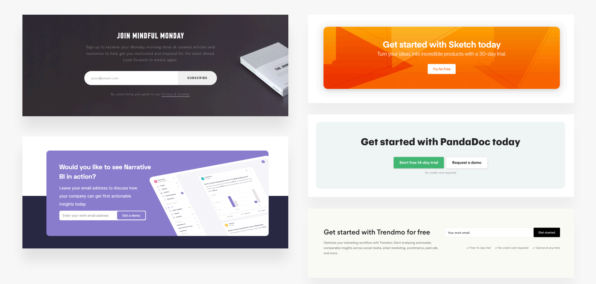

# INDEX

- [INDEX](#index)
  - [Web Design](#web-design)
    - [Typography](#typography)
      - [Typeface](#typeface)
      - [Font](#font)
    - [Color](#color)
      - [Choosing the right color](#choosing-the-right-color)
      - [Establishing Color System](#establishing-color-system)
      - [When and How to use colors](#when-and-how-to-use-colors)
      - [Colors and Typography](#colors-and-typography)
    - [Images](#images)
      - [How to use images well](#how-to-use-images-well)
      - [Handling text on images](#handling-text-on-images)
      - [Images techniques](#images-techniques)
    - [Icons](#icons)
      - [Using Good Icons](#using-good-icons)
      - [When To Use Icons](#when-to-use-icons)
      - [Use Icons Well](#use-icons-well)
    - [Shadows](#shadows)
      - [Use Shadows Well](#use-shadows-well)
      - [User Shadows In The Right Situation](#user-shadows-in-the-right-situation)
    - [Border-radius](#border-radius)
    - [Whitespace](#whitespace)
      - [Why Use Whitespace](#why-use-whitespace)
      - [Where To Use Whitespace](#where-to-use-whitespace)
      - [How Much Whitespace (Guidelines)](#how-much-whitespace-guidelines)
    - [Visual Hierarchy](#visual-hierarchy)
      - [Visual Hierarchy Fundamentals](#visual-hierarchy-fundamentals)
  - [Website Personalities](#website-personalities)
    - [Types Of Website Personalities](#types-of-website-personalities)
    - [Website Personalities Framework](#website-personalities-framework)
  - [User Experience (UX)](#user-experience-ux)
    - [UI \& UX](#ui--ux)
    - [UX Rules For Usability](#ux-rules-for-usability)
  - [Components And Layout Patterns](#components-and-layout-patterns)
    - [Elements Pattern](#elements-pattern)
    - [Components Pattern](#components-pattern)
    - [Sections Pattern](#sections-pattern)
    - [Layout Patterns](#layout-patterns)
  - [Design Inspiration](#design-inspiration)

---

## Web Design

It is the process of creating websites. It encompasses several different aspects, including webpage layout, content production, and graphic design.

- Why is Web Design Important?
  

- Web Design Ingredients
  - Typography
  - Color
  - Images / Illustrations
  - Icons
  - Shadows
  - Border-radius
  - White Space
  - Visual Hierarchy
  - User Experience
  - Components / Layouts

---

### Typography

It is the art and technique of arranging type to make written language **readable** and **appealing** when displayed. The arrangement of type involves selecting typefaces, point sizes, line lengths, line-spacing, and letter-spacing, and adjusting the space between pairs of letters.

#### Typeface

- It's a set of one or more fonts that share common design features.
- It's also known as a font family.

- **Serif**
  

  - It has small lines at the ends of characters.
  - It's used for long texts.
  - It's more traditional and formal.
  - Good Examples:
    

- **Sans-Serif**
  

  - It doesn't have small lines at the ends of characters.
  - It's used for short texts.
  - It's more modern and informal.
  - Good Examples:
    

---

#### Font

- It's a specific size, weight, and style of a typeface.

- It includes:

  - Regular
  - Italic
  - Bold
  - Bold Italic

- **Font sizes:**

  - When choosing font-sizes, **limit choices!**, Use a "[type scale tool](https://typescale.com/)" to help you choose the right font sizes.
  - Use font size between `16px` and `32px` for normal text.
  - Use font size `20px` for long texts (like articles).
  - Use font size `50px+` and bold `600+` for headings.

- **Font weights:**

  - Don't use font weights under `400` for any text.
  - Use `400` for normal text.
  - Use `600` for bold text.
  - Use `700` for headings.

- **Lines:**

  - Don't use more than `75` characters per line.
    
    - fortunately, CSS has a build-in unit for this: `ch` (character width)
  - For normal text, use `1.5` line-height.
  - For headings, use `2` line-height.

  > The smaller the font size, the bigger the line-height.
  > 

- **Letter-spacing:**

  - Decrease letter-spacing for headings if it looks unnatural. (This will come with experience)
    

- **Case:**

  - Experiment with all caps for short titles. Make them small and bold and increase letter-spacing
    

- **Alignment:**

  - Use left alignment for long texts. **(Don't center long texts)**
    
  - Use center alignment for short texts.
  - Use right alignment for short texts.

---

### Color

#### Choosing the right color

- Make the main color match your website’s personality: colors convey meaning!
  

- Use a good **color tone**! Don’t choose a random tone or CSS named colors.
  
  

---

#### Establishing Color System

**Tool:** [Open color](https://yeun.github.io/open-color/)

- You will always need at least 2 types of colors in your **color palette**: (main color & grey color)
  
  
- With more experience, you can add more colors: **accent colors** (use a tool)
- For diversity, create lighter and darker “versions” **(tints and shades)**
  

---

#### When and How to use colors

- Use your **main color** to draw attention to the most important elements on the page
  

- Use colors to add interesting `accents` or make entire components or sections stand out
  

- Use your color strategically in images and illustrations
  

---

#### Colors and Typography

- On dark-colored backgrounds, use light-colored text (tint of the background color)
  
- Text should not be completely black, Lighten it a bit
  
- Don’t make text too light! Use a tool to check contrast between text and background colors (Accessibility ♿️)
  
  - Contrast ratio needs to be at least `4.5:1` for normal text and `3:1` for large text (`18px+`)
  - You can use:
    - the built-in color contrast checker in Chrome DevTools
      
    - Online Tools:
      - [WCAG Color Contrast Checker](https://venngage.com/tools/color-contrast-checker)
      - [Coolors](https://coolors.co/contrast-checker/112a46-acc8e5)

---

### Images

- There're 3 types of images:

  - **product photos:** show the product in detail (with screenshots of the product)
    
  - **Storytelling photos:** show the product in use (convey the message of the product)
    
  - **Illustrations:** show the product in a creative way (abstract way of story-telling)
    
    
  - **Patterns:** add texture to the website (usually in the background of the website)
    
    
    - They're small shapes or images that are repeated in a grid to create a larger image.
    - They make the website more interesting and visually appealing.

#### How to use images well

- Use images to support your website’s message and story. So only use relevant images!

  - Good
    
  - Bad
    

- Prefer original images. If not possible, use original-looking stock images (not generic ones!)

  - Free sources:
    - [Unsplash](https://unsplash.com/)
    - [Pexels](https://www.pexels.com/)
    - [Pixabay](https://pixabay.com/)
    - [Freepik](https://www.freepik.com/)
    - [DrawKit](https://www.drawkit.io/)
    - [Undraw](https://undraw.co/)

- Try to show real people to trigger user’s emotions (for more engagement)
  

- If necessary, crop images to fit your message, but don’t crop too much!
  

- Experiment combining photos, illustrations and patterns, but don’t overdo it!
  

---

#### Handling text on images

- Make images darker to make text more readable
  

- Position text into neutral image areas
  

- Use text shadows to make text more readable, or put it in a box
  

---

#### Images techniques

- To account for high-res screens, make image dimensions 2x as big as their displayed size
  
  

- Compress images for a lower file size and better performance
  

  - Tools:
    - [TinyPNG](https://tinypng.com/)
    - [Squoosh](https://squoosh.app/)

- When using multiple images side-by-side, make sure they have the exact same dimensions

---

### Icons

**Icons** are small, simple images that represent an action or idea.

#### Using Good Icons

- Use a **good icon pack**, there're tons of free and paid icon packs

  - Tools:
    - [Phosphor icons](https://phosphoricons.com/)
    - [ionicons](https://ionic.io/ionicons)
    - [ICONS8](https://icons8.com/)

- Use only one icon pack. Don’t mix icons from different icon packs
  

- Use `SVG` icons or icon fonts. Don’t use bitmap image formats (`.jpg` and `.png`)!
  

- Adjust to website personality! Roundness, weight and filled/outlined depend on typography

---

#### When To Use Icons

- Use icons to provide visual assistance to text
  

- Use icons associated with actions, and label them (unless no space or icon is 100% clear)
  

- Use icons as bullet points
  

---

#### Use Icons Well

- To keep icons neutral, use same color as text. To draw more attention, use different color
  

- Don’t confuse your users: icons need to make sense and fit the text or action!
  

- Don't make icons larger than what they were designed for. If needed, enclose them in a shape
  

---

### Shadows

Shadow creates depth (3D): the more shadow, the further away from the interface the element is.

#### Use Shadows Well

- You don’t have to use shadows! Only use them if it makes sense for the website personality
  

- Use shadows in small doses: don’t add shadows to every element!
  

- Go light on shadows, don’t make them too dark!
  

---

#### User Shadows In The Right Situation

- Use **small shadows** for smaller elements that should stand out (to draw attention), e.g. buttons
- Use **medium-sized shadows** for larger areas that should stand out a bit more, e.g. cards
- Use **large shadows** for elements that should really float above the interface, e.g. modals
- Experiment with changing shadows on mouse interaction (click and hover effects)
  
- Experiment with glows (colored shadows) for more futuristic designs
  

---

### Border-radius

- Use border-radius to increase the playfulness and fun of the design, to make it less serious
  

- Typefaces have a certain roundness: make sure that border-radius matches that roundness!
  

- Use border-radius on **buttons**, **images**, around **icons**, **standout sections** and other elements

---

### Whitespace

It's the space between elements in a design. It's also called "negative space".

#### Why Use Whitespace

- The right amount of whitespace makes designs look clean, modern and polished
- Whitespace communicates how different pieces of information are related to one another
- Whitespace implies invisible relationships between the elements of a layout

---

#### Where To Use Whitespace

- Use **tons of** whitespace between sections
  
  
- Use **a lot of** whitespace between groups of elements
  
- Use whitespace between elements
  

---

#### How Much Whitespace (Guidelines)

- The more some elements (or groups of elements) belong together, the closer they should be!
  
- Start with a lot of whitespace, maybe even too much! Then remove whitespace from there
  
- Match other design choices. If you have big text or big icons, you need more whitespace
- Try a hard rule, such as using multiples of 16px for all spacing
  

---

### Visual Hierarchy

It's the arrangement or presentation of elements in a way that implies importance **(which elements of the design are the most important)**

- It's about drawing attention to these important elements (path for users to guide them through the page)
- It uses a combination of different design principles, such as (typography, color, and layout) to establish a meaningful visual hierarchy on the page

#### Visual Hierarchy Fundamentals

- Position important elements **closer to the top the page**, where they get more attention
  
- Use images mindfully, as they draw **a lot of attention** (larger images get more attention)
  
- Whitespace creates separation, so use whitespace strategically to emphasize elements
  
- For text elements, use **font size, font weight, color, and whitespace** to convey importance
  
  

  - You can also de-emphasize less important text, like labels or secondary/additional information
    

- Emphasize an important component using **background color, shadow, or border** (or multiple)
  

- Try emphasizing some component A over component B **by de-emphasizing** component B
  
- What components to emphasize?
  
  - Testimonials
  - Call to action buttons
  - Highlighted features
  - Preview cards
  - Forms
  - Pricing tables
  - Important (rows / columns) in tables

---

## Website Personalities

### Types Of Website Personalities

- **Serious / Elegant**
  

  - It's used for luxury brands, law firms, and financial institutions.
  - It uses:
    - Thin serif typefaces
    - Gold, black, and white colors
    - High-quality images
    - Simple icons

- **Minimalist / Simple**
  

  - It's used for tech companies, startups, and design agencies.
  - It uses:
    - Small or medium sans-serif black text and lines
    - few images and icons

- **Plain / Natural**
  

  - It's used for big corporations, non-profits, and educational institutions.
  - It uses:
    - Neutral and small typefaces
    - Very structured layouts (grids)

- **Bold / Confident**
  

  - It's used for sports teams, entertainment companies, and fashion brands.
  - It uses:
    - Large and bold typefaces
    - Bright and contrasting colors
    - High-quality images

- **Calm / Peaceful**
  

  - It's used for wellness centers, yoga studios, and meditation apps.
  - It uses:
    - Soft and rounded typefaces
    - Pastel colors
    - Matching images and illustrations to the color palette

- **Startup / Creative**
  

  - It's used for creative agencies, startups, and design studios.
  - It uses:
    - Medium sans-serif typefaces
    - Light-gray text and backgrounds
    - Rounded edges and corners

- **Playful / Fun**
  
  - It's used for children's brands, toy stores, and game developers.
  - It uses:
    - Bright and contrasting colors
    - Hand-drawn icons or illustrations
    - Fun language
    - Fun and colorful images and illustrations

---

### Website Personalities Framework

- Serious / Elegant
  
- Minimalist / Simple
  
- Plain / Natural
  
- Bold / Confident
  
- Calm / Peaceful
  
- Startup / Creative
  
- Playful / Fun
  

You can mix and match these elements to create a unique website personality

---

## User Experience (UX)

### UI & UX

- **UI** is graphical interface (making the interface beautiful)
  

- **UX** is the experience of the user with the interface (making the interface easy to use)
  

  - Every website or application has a **goal** (what the user should do) this goal should align with the **buiness goal** (what the business wants the user to do)
    
    

---

### UX Rules For Usability

- Don’t design complicated layouts. Don’t reinvent the wheel. **Use patterns that users know**
- Make your call-to-action the **most prominent element**, and make the **text descriptive**
  
- Use **blue text** and **underlined text** only for **links**!
  
- Animations should have a purpose and be fast: between `200ms` and `500ms`
- In **forms**:
  - Align labels and fields in a **single vertical line**, to make the form easier to scan
    
  - Offer users **good feedback** for all actions: form errors, form success, etc. [web apps]
    
- Use a descriptive, keyword-focused headline on your main page. Don’t be vague or fancy!
- Only include relevant information, efficiently! Cut out fluff and make the content 100% clear
- Use simple words! Avoid technical jargon and “smart-sounding” words
- Break up long text with **sub-headings, images, block quotes, bullet points**, etc.
  

---

## Components And Layout Patterns

- Steps:
  1. Use common elements and components to convey your website’s information
  2. Combine components into layouts using common layout patterns
  3. Assemble different layout areas into a complete, final page

### Elements Pattern

- **Text**
  
- **Buttons**
  
- **Images**
  
- **Input Fields**
  
- **Tags** (for filtering and categorizing content)
  

---

### Components Pattern

- **Breadcrumbs**
  
- **Pagination**
  
- **Alert and Status Bars**
  
- **Statistics** (for showing numbers and data)
  
- **Gallery** (for showing multiple images)
  
- **Feature Boxes** (for showing features of a product)
  
- **Preview and Profile Cards** (for showing a preview of a product or a profile with CTA)
  
  
- **Accordions** (for showing and hiding content in a list)
  
- **Tabs** (for showing different content in a tabbed interface)
  
- **Carousels / Sliders** (for showing multiple images in a carousel)
  
- **Customer Testimonials** (for showing customer reviews)
  
- **Customer Logos** (for showing logos of customers to build trust towards the product or the brand)
  
- **Featured-in Logos** (for showing logos of companies that featured the product)
  
- **Steps / Guide** (for showing a step-by-step process or guide)
  
  
- **Forms** (for collecting user data)
  
  
- **Tables** (for showing data in a table)
  
- **Pricing Tables** (for showing different pricing options)
  
- **Modals** (for showing a popup with additional information)
  
- **Tooltips** (for showing additional information on hover)

---

### Sections Pattern

- **Navigation**
  - Here, we have navigation bar at the top of the page, and when the user clicks or hovers over one of the menu-items, a dropdown menu appears.
    
    
    
- **Hero**
  - It's the first section of the website, it's the first thing the user sees when they land on the website.
    
    
    
    - It usually contains a heading, a subheading, a call-to-action button, and an image or a video.
    - It's used to grab the user's attention and to make them want to scroll down and explore the rest of the website.
    - It's usually full-width and has a lot of whitespace
    - It has 2 popular types:
      - text on one side and an image on the other side
      - text on top and an image on the bottom (in the center)
- **Footer**
  - It's the last section of the website, it usually contains links to other pages, contact information, and social media links **(Site Map of the website)**
    
    
- **Call To Action**
  - It's a section at the end of the page that contains a call-to-action button to encourage the user to take action.
    
- **Feature Row**
  - It's a small section that describes a feature of the product or the service. (called "Row", because it consists of an image on one side and some text on the other side creating a "Row")
    

---

### Layout Patterns

It's the way you arrange the components on the page. Here're some popular layout patterns:

- **Row Of Boxes/Cards**
  
- **Grid Of Boxes/Cards**
  
- **Mix Of Row And Grid**
  
- **Z-Pattern**
  - Here, we alternate between text and images to create a Z-pattern.
    
  - It's popular because our eyes naturally follow this pattern (look at opposite corners of the screen)
- **F-Pattern**
  - Here, the configuration of the rows doesn't alternate between text and images, it's more like a straight line.
    
- **Single Column**
  
- **Sidebar**
  
- **Multi-Column / Magazine**
  
- **Asymmetrical / Experimental**
  

---

## Design Inspiration

Here're good resources for design inspiration:

- [Land Book](http://land-book.com/)
- [One Page Love](https://onepagelove.com/inspiration)
- [Awwwards](https://www.awwwards.com/websites/)
- [Screelane](https://screlane.com/)
- [Dribbble](https://dribbble.com/)
