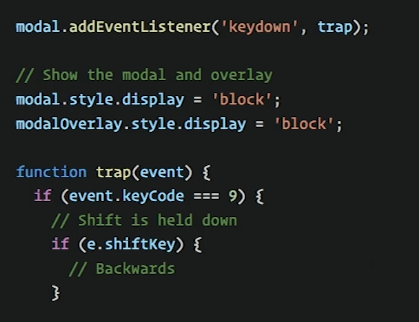
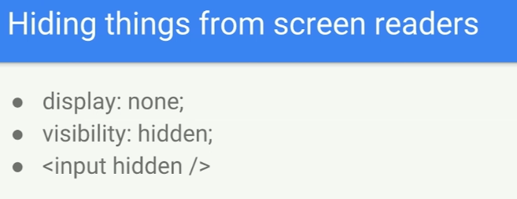
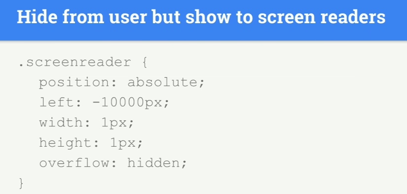

# INDEX

- [INDEX](#index)
  - [Accessibility](#accessibility)
  - [`tab` keyboard-key](#tab-keyboard-key)
  - [Keyboard Events](#keyboard-events)
  - [Screen readers](#screen-readers)
  - [Accessible HTML](#accessible-html)
    - [Labels](#labels)
  - [ARIA Roles](#aria-roles)
    - [Live region roles](#live-region-roles)

---

## Accessibility

---

## `tab` keyboard-key

A keyboard user typically uses the Tab key to navigate through interactive elements on a web `page—links`, `buttons`, `fields` for inputting text, etc. When an item is tabbed to, it has keyboard `focus` and can be activated or manipulated with the keyboard. A sighted keyboard user must be provided with a visual indicator of the element that currently has keyboard focus. Focus indicators are provided automatically by web browsers. **(That's why `focus` styles are important)**

- `tab` -> go forward
- `shift + tab` -> go backwards

Elements that are affected by `tab` are the one which the user interacts with like: `<input>`, `<a>`, `<iframe>`, ..

- elements which are non-interactive are not affected by `tab`
- Any element becomes focusable if it has `tabindex`. The value of the attribute is the order number of the element when Tab (or something like that) is used to switch between them.
  - That is: if we have two elements, the first has `tabindex="1"`, and the second has `tabindex="2"`, then pressing Tab while in the first element – moves the focus into the second one.
- the order of focusing on element using `tab` is called **tab-order**

  - this order is by how elements are presented in the **DOM** and not the order by css-style

- `tabindex` attribute:

  - it makes the element tabbable

    ```html
    <div tabindex="0">W3Schools</div>
    ```

    

  - usually the negative-value is when you want to manage focus by javascript
  - `tabindex="0"` puts an element among those without tabindex.

> `Document.activeElement` -> read-only property of the Document interface returns the Element within the DOM that currently has focus.

---

## Keyboard Events

> find what is the number for each keyboard key from here: [keycode.info](https://www.keycode.info)

You can use keyboard events to do stuff

- `keydown`
- `keypress`
- `keyup`



---

## Screen readers

- **Alternative Text**
  

  - By default, when a screen reader encounters an image:
    - if it can't find alt text it will read aloud the file's name.
    - if it finds the alt text empty `alt=""` --> it will skip over the image (useful when you want to hide the image from screen readers)
  - we don't use `picture of` or `graphic of` in **alt** as the screen reader says it in the beginning by default

- **Hiding elements**
  
  
  - to only show in screen readers you can use class -> `.visuallyhidden`

---

## Accessible HTML

- Some elements have semantic meaning but no special functionality. Examples are:

  - `<aside>`
  - `<footer>`
  - `<header>`

- Other's provide a lot of built-in functionality such as:

  - `<button>`
  - `<input>`
  - `<textarea>`

### Labels

Form fields can be confusing for screen reader users. There are many ways to **label form fields** so the label is read out loud whenever the field has focus.

- HTML labels

  ```html
  <form>
    <label for="first">First Name</label>
    <input id="first" type="text" />
  </form>
  ```

- Implicit HTML labels

  - you can do is wrap your inputs with the label tag. This is called **implicit labelling**.

  ```html
  <form>
    <label>
      First Name
      <input id="first" type="text" />
    </label>
  </form>
  ```

Limitations with the `<label>` tag:

- The label tag can only works with "**labelable**" elements. Those include:

  - `<button>`
  - `<input>`
  - `<keygen>`
  - `<meter>`
  - `<output>`
  - `<progress>`
  - `<select>`
  - `<textarea>`

- If you ever need to label an element not on that list, use **aria-label** instead.

  ```html
  <div aria-label="Interactive div">Hello</div>
  ```

---

## ARIA Roles

ARIA roles provide **semantic meaning to content**, allowing screen readers and other tools to present and support interaction with object in a way that is consistent with user expectations of that type of object. ARIA roles can be used to describe elements that don't natively exist in HTML or exist but don't yet have full browser support.

You can find more here along with roles to use -> [here](https://developer.mozilla.org/en-US/docs/Web/Accessibility/ARIA/Roles)

> Bootstrap uses class `.sr-only` to only show the element to **screen readers**, what it does is it does every possible way to hide the element from the page like this:

```css
.sr-only {
  position: absolute;
  width: 1px;
  height: 1px;
  padding: 0;
  margin: -1px;
  overflow: hidden;
  clip: rect(0, 0, 0, 0);
  border: 0;
}
```

### Live region roles

Live Region roles are used to define elements with **content that will be dynamically changed** ex:(`chat`). Sighted users can see dynamic changes when they are visually noticeable. These roles help low vision and blind users know if content has been updated. Assistive technologies, like screen readers, can be made to announce dynamic content changes:

- `assertive` - will interrupt whatever it's doing to announce.
- `polite` - will announce the live region update when it next idles.
- `off` - will not read the update.

  ```html
  <div aria-live="assertive">Waiting for a ride</div>
  ```

---
