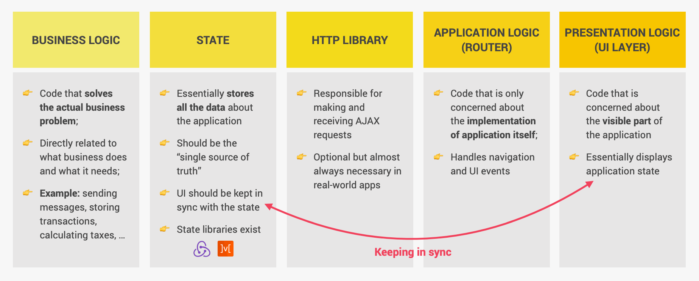
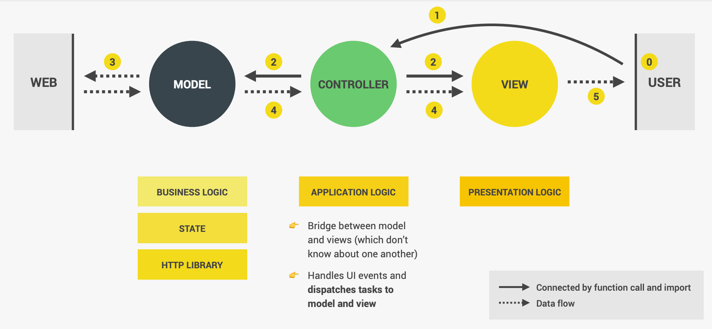
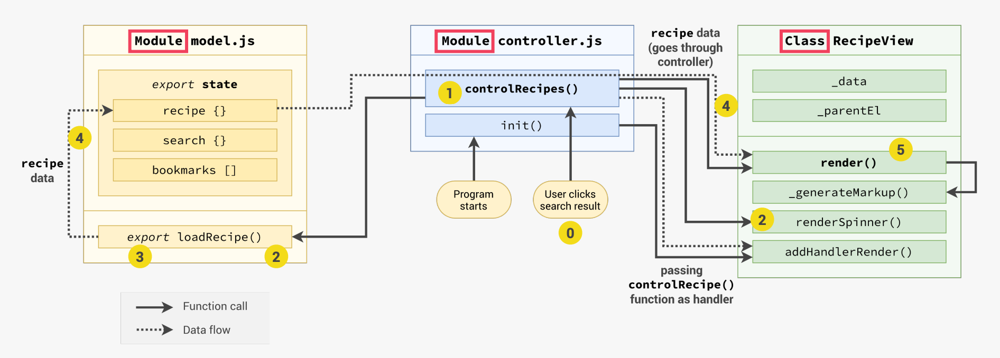
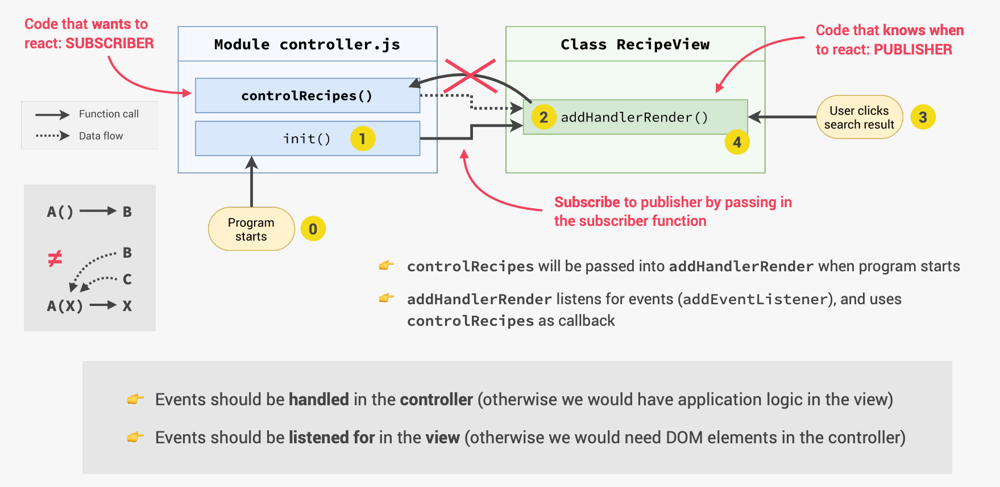
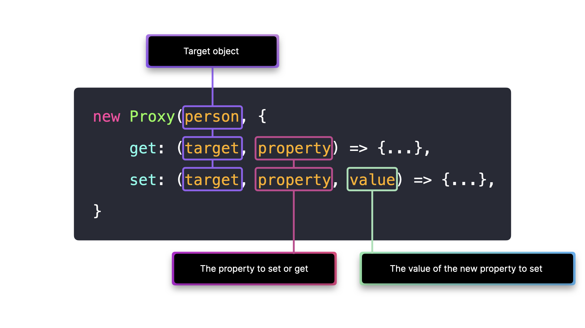

# INDEX

- [INDEX](#index)
  - [Notes](#notes)
  - [JavaScript Design (Architecture) Patterns](#javascript-design-architecture-patterns)
    - [MVC](#mvc)
      - [Models](#models)
      - [Views](#views)
      - [Controllers](#controllers)
      - [event handling using **Publish Subscribe Pattern**](#event-handling-using-publish-subscribe-pattern)
  - [SOLID in Javascript](#solid-in-javascript)
    - [Single Responsibility Principle (SRP)](#single-responsibility-principle-srp)
    - [Open-Closed Principle (OCP)](#open-closed-principle-ocp)
    - [Liskov Substitution Principle (LSP)](#liskov-substitution-principle-lsp)
    - [Interface Segregation Principle (ISP)](#interface-segregation-principle-isp)
    - [Dependency Inversion Principle (DIP)](#dependency-inversion-principle-dip)
  - [Javascript Common Design Patterns](#javascript-common-design-patterns)
    - [Module Pattern](#module-pattern)
    - [Singleton Pattern](#singleton-pattern)
    - [Observer Pattern](#observer-pattern)
    - [Registery Pattern](#registery-pattern)
    - [MIXIN Pattern](#mixin-pattern)
    - [Proxy Pattern](#proxy-pattern)

---

## Notes

- `config.js` : here we put all **constant variables** that :
  - will help configure the application
  - variables that are responsible for defining important data
- `helpers.js` : contains all functions that we use over and over in the application

---

## JavaScript Design (Architecture) Patterns

- [reference](https://www.patterns.dev/posts/classic-design-patterns/)
- Components of any architecture
  

### MVC

`MVC` is an architectural design pattern that encourages improved application organization through a separation of concerns. It enforces the isolation of business data (Models) from user interfaces (Views), with a third component (Controllers) traditionally managing logic and user-input.



- Example
  
  - Usually the `model` and `controller` are **modules** that are imported in the `view`, and the `view` is a **class** that is instantiated in the `controller` and the `controller` is instantiated in the `app.js` file

> Also check the [MVC section in node.js](../../Backend/Node.js/2-Express.md#mvc-architecture-in-express-app)

#### Models

- Models manage the data for an application. They are concerned with neither the user-interface nor presentation layers but instead represent unique forms of data that an application may require.
- work with data (e.g. save, fetch)

#### Views

- Views are a visual representation of models that present a filtered view of their current state. Whilst Smalltalk views are about painting and maintaining a bitmap, JavaScript views are about building and maintaining a DOM element.

#### Controllers

- Controllers are an intermediary between models and views which are classically responsible for updating the model when the user manipulates the view.
- it also includes **Routes**

#### event handling using **Publish Subscribe Pattern**

The Publisher/Subscriber pattern, or “PubSub” for short, is a pattern that allows us to create modules that can communicate with each other without `depending directly` on each other.

This is because for example, if we want to handle an event in the `view` and do something in the `controller`, we can't do it directly because the `view` doesn't know that the `controller` exists. So, we use the `PubSub` pattern to handle this.

- usually it's used to listen to events on the `view` and do the action that is in the `controller` within `init()` function
  

  - you can use this name-format for these functions : `addHandlerSearch`,`addHandlerAddBookmark`

  - **explain** :

    - the `view` is **imported** in the `controller`
    - the `view` doesn't even know that the `controller` exists
    - I want to use something(callback-function) in the `controller` as an argument in the `view`
    - so, I subscribe to a publisher(event-listener that need the argument) in the `view` by passing something from the subscriber(callback-function in the `controller`) in it
    - but the publisher won't have access to the subscriber `until` it's importer in the controller which is already done in **1st step**
    - this means that : **as soon as the publisher publishes an event => the subscriber will get called(notified)**

  - **example** :

    ```js
    // view.js
    class View {
      _parentElement = document.querySelector('.bookmarks__list');
      _data;
      addHandlerRender(handler) {
        window.addEventListener('load', handler);
      }
      addHandlerSearch(handler) {
        this._parentElement.addEventListener('click', function (e) {
          const btn = e.target.closest('.btn--search');
          if (!btn) return;
          handler();
        });
      }
    }

    // -----------------------------------------------------------

    // controller.js
    import View from './view.js';
    class Controller {
      _view = new View();
      init() {
        this._view.addHandlerRender(this._loadBookmarks.bind(this));
        this._view.addHandlerSearch(this._controlSearchResults.bind(this));
      }
    }
    ```

---

## SOLID in Javascript

> [Reference on the design-patterns file](../../Computer%20Science/OOP/2-Design-patterns.md#solid-principles)

- In JavaScript, we can use the `SOLID` principles to write better code and make it more maintainable and scalable.
- Here, we will have multiple examples of how we can use these principles in JavaScript.

### Single Responsibility Principle (SRP)

A class should have only one reason to change. meaning that a class should have only one job or responsibility.

- Example of User class

  ```js
  // Inviolation of SRP ❌
  class User {
    constructor(username, password) {
      this.username = username;
      this.password = password;
    }

    authenticate(inputPassword) {
      return inputPassword === this.password;
    }

    save() {
      // save the user to the database
      db.saveUser(this);
    }
  }

  const user = new User('john_doe', 'password');
  if (user.authenticate('password')) {
    user.save();
  }

  // ----------------------------------------------------------- //

  // Following SRP ✅
  class User {
    // This class now only handles user stuff
    constructor(username, password) {
      this.username = username;
      this.password = password;
    }

    authenticate(inputPassword) {
      return inputPassword === this.password;
    }
  }

  class UserDB {
    // This class now only handles database stuff
    static save(user) {
      const db = getDBConnection();
      db.saveUser(user);
    }
  }

  const user = new User('john_doe', 'password');
  if (user.authenticate('password')) {
    UserDB.save(user);
  }
  ```

  - Now, the `User` class is only responsible for handling user-related stuff, and the `UserDB` class is only responsible for handling database-related stuff. **Each class now has only one reason to change**.
  - You might think that, _"This is a lot of work for a simple class"_. But, when the application grows, this will make it easier to maintain and scale.

---

### Open-Closed Principle (OCP)

Objects or entities should be open for extension but closed for modification. meaning that a class should be easily extendable without modifying the class itself.

- Example of `Shape` class

  ```js
  // Starter Code
  class Shape {
    constructor(width, height) {
      this.width = width;
      this.height = height;
    }

    area() {
      return this.width * this.height;
    }
  }

  const shape = new Shape(10, 20);

  // Now, we want to add a new shape, a circle, we have to modify the Shape class or extend it

  // ----------------------------------------------------------- //

  // Inviolation of OCP ❌ -> Modifying the Shape class
  class Shape {
    constructor(type, width, height) {
      this.type = type;
      this.width = width;
      this.height = height;
    }

    area() {
      if (this.type === 'rectangle') {
        return this.width * this.height;
      } else if (this.type === 'circle') {
        return Math.PI * this.width * this.width;
      }
    }
  }

  const rectangle = new Shape('rectangle', 10, 20);
  console.log(rectangle.area());
  const circle = new Shape('circle', 10, 20);
  console.log(circle.area());

  // ----------------------------------------------------------- //

  // Following OCP ✅ -> Extending the Shape class
  class Shape {
    // ...
  }

  class Rectangle extends Shape {
    constructor(width, height) {
      super();
      this.width = width;
      this.height = height;
    }

    area() {
      return this.width * this.height;
    }
  }

  class Circle extends Shape {
    constructor(radius) {
      super();
      this.radius = radius;
    }

    area() {
      return Math.PI * this.radius * this.radius;
    }
  }

  const rectangle = new Rectangle(10, 20);
  console.log(rectangle.area());
  const circle = new Circle(10);
  console.log(circle.area());
  ```

  - Now, we can easily add new shapes without modifying the `Shape` class. We can just extend the `Shape` class and create a new class for the new shape.
  - This way, the `Shape` class is closed for modification but open for extension.

---

### Liskov Substitution Principle (LSP)

Objects of a superclass should be able to be replaced with objects of a subclass without affecting the behavior of the program. Meaning that a child class should be able to do everything the parent class can do.

- Example

  ```js
  // Inviolation of LSP ❌
  Class Bird {
    fly() {
      console.log('I can fly');
    }
  }

  Class Penguin extends Bird {
    fly() {
      throw new Error('I cannot fly');
    }
  }

  const genericBird = new Bird();
  console.log(genericBird.fly()); // I can fly
  const penguin = new Penguin();
  console.log(penguin.fly()); // Error: I cannot fly --> This is a problem ❌

  // ----------------------------------------------------------- //

  // Following LSP ✅
  Class Bird {
    // ... logic without fly()
  }

  Class FlyingBird extends Bird {
    fly() {
      console.log('I can fly');
    }
  }

  Class Penguin extends Bird {
    // ... logic without fly()
  }

  const genericBird = new FlyingBird();
  const duck = new FlyingBird();
  ```

  - We had a problem with the `Penguin` class because it was a subclass of `Bird` but it couldn't do everything the `Bird` class could do. So, we created a new class `FlyingBird` that has the `fly()` method and made the `Penguin` class a subclass of `Bird` instead of `FlyingBird`.
  - Now, the `Penguin` class can do everything the `Bird` class can do.
  - This way, we can replace objects of a superclass with objects of a subclass without affecting the behavior of the program.

---

### Interface Segregation Principle (ISP)

A class should not be forced to implement interfaces it does not use. Meaning that a class should not have to implement methods it does not need.

- **Note** : In JavaScript, we don't have `interfaces` like in other languages. But, we can still follow this principle by creating separate classes for different functionalities.

  - Also this principle will be more helpful in **TypeScript** because it has `interfaces`

- Example

  ```js
  // Inviolation of ISP ❌
  class Worker {
    work() {
      console.log('I am working');
    }

    eat() {
      console.log('I am eating');
    }

    sleep() {
      console.log('I am sleeping');
    }
  }

  function manageWorker(worker) {
    worker.work();
    worker.eat();
  }
  // Note that the `sleep()` method is not used in the `manageWorker()` function

  // ----------------------------------------------------------- //

  // Following ISP ✅
  class Worker {
    work() {
      console.log('I am working');
    }
  }

  class Eater {
    eat() {
      console.log('I am eating');
    }
  }

  class Sleeper {
    sleep() {
      console.log('I am sleeping');
    }
  }

  function manageWorker(worker) {
    worker.work();
    Eater.eat();
  }
  // Now, we have separate classes for different functionalities and we can use them as needed
  ```

  - Now, we have separate classes for different functionalities and we can use them as needed.
  - If the `manageWorker` function was using an interface in TypeScript, we could have passed the `Worker` class to the function and it would have worked fine. but it would be better to separate the classes for different functionalities and pass their instances to the function as needed.

---

### Dependency Inversion Principle (DIP)

High-level modules (main application logic) should not depend on low-level modules (like specific tools or libraries). Both should depend on abstractions (interfaces or generic ideas).

- Example of building an application where users can sign-in. Initially, users sign-in using a username and password. But in the future, you might want to allow sign-in using a emain, phone number, etc.

  ```js
  // Inviolation of DIP ❌
  // If you tightly couple the main application logic with the specific sign-in method, every time you want to introduce a new sign-in method, you will have to rewrite the main application logic.
  class UsernamePasswordAuth {
    authenticate(username, password) {
      // authenticate using username and password
    }
  }

  class App {
    constructor() {
      this.auth = new UsernamePasswordAuth();
    }

    signIn(username, password) {
      this.auth.authenticate(username, password);
    }
  }

  // to add a new sign-in method, you will have to rewrite the main application logic

  // ----------------------------------------------------------- //

  // Following DIP ✅
  // We can create an abstract `AuthMethod` class that has an `authenticate` method. Then, we can create specific sign-in methods that extend the `AuthMethod` class.

  class AuthMethod {
    authenticate() {
      throw new Error('authenticate method not implemented, and should be overridden');
    }
  }

  class UsernamePasswordAuth extends AuthMethod {
    authenticate(username, password) {
      // authenticate using username and password
    }
  }

  class EmailAuth extends AuthMethod {
    authenticate(email, password) {
      // authenticate using email and password
    }
  }

  class App {
    constructor(auth) {
      this.auth = auth;
    }

    signIn() {
      this.auth.authenticate();
    }
  }

  const usernamePasswordAuth = new UsernamePasswordAuth();
  const app = new App(usernamePasswordAuth);
  app.signIn();
  ```

  - Now, the main application logic is **not tightly coupled** with the specific sign-in method. We can easily add new sign-in methods by creating a new class that extends the `AuthMethod` class and passing it to the `App` class. instead of depending on the specific sign-in method inside the `App` class.

---

## Javascript Common Design Patterns

### Module Pattern

It ensures private and public encapsulation in Javascript protecting the global scope from pollution and naming conflicts.

- The Module pattern is used to mimic the concept of classes (since JavaScript doesn't have classes) so that we can use public/private methods and variables.
- It uses an **IIFE** and **Closure** to achieve this.
  - inside it, we create a private scope and **return an object** that represents the module.
  - Closure allows the module to have access to the private variables and functions even after the IIFE has executed.
- Example

  ```js
  const module = (function () {
    // private variables and functions
    const privateVar
    const privateFunc = () => {}

    // public variables and functions
    return {
      publicVar: 'I am public',
      publicFunc1: () => {}
      publicFunc2: () => { privateFunc() } // calling the private function
    }
  })()

  console.log(module.publicVar) // I am public ✅
  module.publicFunc1() // ✅
  module.publicFunc2() // ✅

  // console.log(module.privateVar) // undefined ❌
  // module.privateFunc() // Error ❌
  ```

- Notes:
  - **jQuery** uses the "Module Pattern" to protect internal details and reveal only the publiv API.
  - **RequireJS** is an open-source library that manages module-loading and dependencies, implementing a variation of the "Module Pattern".
  - This pattern is used in **React** to create components. but not commonly used in Vanilla JS anymore because of the introduction of **ES6 Modules**.

---

### Singleton Pattern

It ensures that a class has only one instance and provides a global point of access to it.

- It's used when we want to have only one instance of a class. For example, a logger class, a configuration class, etc.
- It uses a **static method** to create an instance of the class if it doesn't exist, and return the instance if it does.

> It's called **Singleton** because it's a single instance of a class. and sometimes it's called **Singleton Factory** because it's a factory that creates a single instance of a class.

- Examples

  - **Example 1**:

    ```js
    class Singleton {
      static instance = null;

      constructor() {
        if (Singleton.instance) {
          return Singleton.instance;
        }
        Singleton.instance = this;
      }
    }

    const instance1 = new Singleton();
    const instance2 = new Singleton();

    console.log(instance1 === instance2); // true
    ```

  - **Example 2**: Database connection

    ```js
    class Database {
      static instance = null;

      constructor() {
        if (Database.instance) {
          return Database.instance;
        }

        this.connection = this.connect(); // create a connection to the database
        Database.instance = this;
      }

      connect() {
        console.log('Connected to the database');
        return {
          connection: "I'm the DB connection object"
        };
      }

      // ... other methods related to the database
    }

    const db1 = new Database();
    const db2 = new Database();
    console.log(db1 === db2); // true
    ```

- **Use Cases**:
  - It's commonly used to manage **global state** in an application. by sharing the same instance of the class across the application.
    - EX: **Redux** uses the Singleton pattern to create a single store that holds the state of the application.
  - Commonly used in **Angular** to create **services** that are shared across the application.
  - Used to create **Database connections** in **Node.js** applications. so that we don't have to create a new connection every time we need to interact with the database.
  - Used with **logging classes** to log messages to a single file or console.
  - `Node.js` module system caches the module after the first time it's loaded. so that calling the same module multiple times will return the same instance of the module and won't re-create it and will return the cached instance. so, it's a Singleton pattern.

---

### Observer Pattern

It's a behavioral design pattern that defines a one-to-many dependency between objects so that when one object changes state, all its dependents are notified and updated automatically.

- It enables a subscription model where objects **(Observers)** can subscribe to an event and get notified when the event occurs **(subject)**.

- Example:

  ```js
  class Subject {
    constructor() {
      this.observers = [];
    }

    subscribe(observer) {
      this.observers.push(observer);
    }

    unsubscribe(observer) {
      this.observers = this.observers.filter(obs => obs !== observer);
    }

    notify() {
      this.observers.forEach(observer => observer.update());
    }
  }

  class Observer {
    update() {
      console.log('I am updated');
    }
  }

  const subject = new Subject();
  const observer1 = new Observer();
  const observer2 = new Observer();

  subject.subscribe(observer1);
  subject.subscribe(observer2);

  subject.notify(); // "I am updated" x2 -> because we have 2 observers
  ```

- **Use Cases**:

  - **DOM Event Handling** in the browser. where we can subscribe to events like `click`, `scroll`, etc.
  - **Model-View-Controller (MVC)** architecture. where the view subscribes to the model and gets notified when the model changes.
  - **PubSub** pattern. where we can publish events and subscribe to them.
  - **Vue.js** uses the Observer pattern to update the view when the model changes. by re-rendering the view when the data changes.

- Usually, you won't implement the Observer pattern from scratch. you will use a library like **RxJS** to handle the Observer pattern for you.

---

### Registery Pattern

It's used to store and retrieve instances of classes (objects). It's like a **global store** that holds instances of classes (objects).

- It's like a central place to manage the objects in the application and access them from anywhere in the application (without passing them around).
- This is done by providing a **key-value** store where we can store instances of classes and retrieve them using a key.
- Because objects (classes instances) are **reference types**, we can store them in the registry and access them from anywhere in the application. and will have the same data even if modified.

- Example:

  ```js
  class Registry {
    static instances = {};

    static register(key, instance) {
      Registry.instances[key] = instance;
    }

    static get(key) {
      return Registry.instances[key];
    }
  }

  class User {
    constructor(name) {
      this.name = name;
    }
  }

  const user1 = new User('John');
  const user2 = new User('Doe');

  Registry.register('user1', user1);
  Registry.register('user2', user2);

  const user1FromRegistry = Registry.get('user1');
  console.log(user1FromRegistry); // User { name: 'John' }
  ```

- **Use Cases**:

  - **Managing different modules & plugins** in an application. where we can register the modules and plugins in the registry and access them from anywhere in the application.
  - **Managing WebSockets Channels/Rooms** in a chat application. where we can register the channels in the registry and access them from anywhere in the application.
  - It's not commonly used in modern applications because it's considered an **anti-pattern**. because it creates **global state** in the application which can lead to **side-effects** and **bugs**.

---

### MIXIN Pattern

It's a design pattern that allows objects to inherit behaviors and properties from multiple sources. It's like **multiple inheritance** in classes.

- It's used to **mix** objects together to create a new object that has the properties and behaviors of the mixed objects.
  - It's used to **extend** the functionality of an object by adding new properties and methods to it.
- It's used to **share** common functionality between objects without using classes and inheritance.

- Example:

  ```js
  const canEat = {
    eat() {
      console.log('I can eat');
    }
  };

  const canWalk = {
    walk() {
      console.log('I can walk');
    }
  };

  const canSwim = {
    swim() {
      console.log('I can swim');
    }
  };

  const personMixin = Object.assign({}, canEat, canWalk);
  person.eat(); // I can eat
  person.walk(); // I can walk

  const fishMixin = Object.assign({}, canEat, canSwim);
  fish.eat(); // I can eat
  fish.swim(); // I can swim
  ```

- **Use Cases**:
  - **React Hooks** use the Mixin pattern to share common functionality between components. by creating custom hooks that can be used in multiple components.
  - **Vue.js Mixins** are used to share common functionality between components. by creating mixins that can be used in multiple components.
  - **Express Middleware** is a Mixin pattern. where we can create middleware functions that can be used in multiple routes.

---

### Proxy Pattern

It's a structural design pattern that provides a surrogate or placeholder for another object to control access to it.

- It's used to **control** access to an object. by creating a proxy object that acts as an intermediary between the client and the real object.
  - It acts as a **Middleman** that controls access to the real object.
  - It's used to add **extra functionality** to the real object without changing its code.
- The keyword `Proxy` is used in JavaScript to create a proxy object. It takes two arguments:
  

  - the `target` object -> that the proxy controls access to.
  - the `handler` object -> that contains the methods that control access to the target object (retrieve, set, delete, etc.).
    - You can find the list of all the methods that the handler object can have in the [MDN Proxy documentation](https://developer.mozilla.org/en-US/docs/Web/JavaScript/Reference/Global_Objects/Proxy).

- Example:

  ```js
  const cat = {
    name: 'Fluffy',
    age: 2,
    breed: 'Persian'
  };

  const catProxy = new Proxy(cat, {
    get(target, property) {
      if (property === 'age') {
        return `${target[property]} years old`;
      } else {
        return target[property];
      }
    }
  });
  // Now, we can access the cat object through the catProxy object but with extra functionality (age is in years)

  console.log(cat.name); // Fluffy
  console.log(cat.age); // 2

  console.log(catProxy.name); // Fluffy
  console.log(catProxy.age); // 2 years old -> extra functionality ⚒️
  ```

- **Use Cases**:
  - **Validation** -> to validate the data before setting it in the object.
  - **Logging** -> to log the data that is being accessed or modified in the object.
  - **Caching** -> to cache the data that is being accessed in the object.
  - **Security** -> to add security checks before accessing or modifying the data in the object.
  - **Virtual Proxies** -> to create a placeholder for an expensive object and load it only when needed.
  - **Data Binding** -> to bind the data in the object to the UI and update the UI when the data changes. (used in **Vue.js** and **React**).
