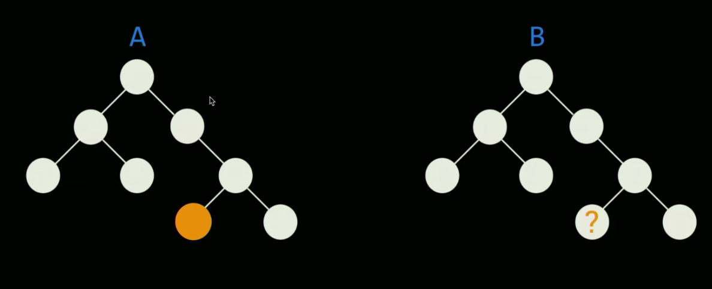
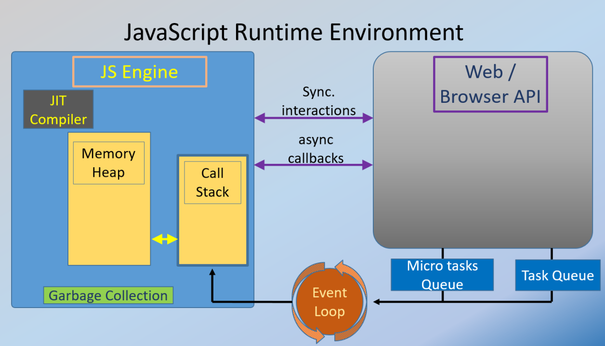

# INDEX

- [INDEX](#index)
  - [`this` keyword](#this-keyword)
  - [Functions](#functions)
  - [Interview Questions](#interview-questions)
    - [What is a program? and how does javascript work in that context?](#what-is-a-program-and-how-does-javascript-work-in-that-context)
    - [What are `call()` and `apply()`?](#what-are-call-and-apply)
    - [How can you tell if an image element is loaded on a page?](#how-can-you-tell-if-an-image-element-is-loaded-on-a-page)
    - [What is event delegation?](#what-is-event-delegation)
    - [How can we optimize the performance when adding styles to an element using JavaScript?](#how-can-we-optimize-the-performance-when-adding-styles-to-an-element-using-javascript)
    - [What is a worker? and when would you use one?](#what-is-a-worker-and-when-would-you-use-one)
    - [Can you implement a `bind()` function? (How to change scope)](#can-you-implement-a-bind-function-how-to-change-scope)
    - [What is "Debounce" and "Throttle"?](#what-is-debounce-and-throttle)
    - [We have 2 identical `DOM` trees, `A` and `B`. For `DOM` tree `A` we have the `location` of an element. Create a function to find that element in `DOM` tree `B`](#we-have-2-identical-dom-trees-a-and-b-for-dom-tree-a-we-have-the-location-of-an-element-create-a-function-to-find-that-element-in-dom-tree-b)
    - [Create a function that moves an element **(Rendering Performance)**](#create-a-function-that-moves-an-element-rendering-performance)
    - [Given this function, how can you convert it into a `Promise` ?](#given-this-function-how-can-you-convert-it-into-a-promise-)
    - [what does double brackets mean in properties, ex: `[[prototype]]`?](#what-does-double-brackets-mean-in-properties-ex-prototype)
    - [How to get the last element in the array in multiple ways?](#how-to-get-the-last-element-in-the-array-in-multiple-ways)
    - [What will happen if you used `forEach` on a `Set`?](#what-will-happen-if-you-used-foreach-on-a-set)
    - [Why do we get these results?](#why-do-we-get-these-results)
    - [Why we don't use asthmatic comparison with strings?](#why-we-dont-use-asthmatic-comparison-with-strings)
    - [How do you return multiple things from a function?](#how-do-you-return-multiple-things-from-a-function)
    - [How to deep copy an object?](#how-to-deep-copy-an-object)
    - [How to check if a value is a number?](#how-to-check-if-a-value-is-a-number)
    - [What is a closure?](#what-is-a-closure)
    - [What is the difference between classical and prototypal inheritance?](#what-is-the-difference-between-classical-and-prototypal-inheritance)
    - [How is it possible to call methods on functions?](#how-is-it-possible-to-call-methods-on-functions)
    - [Exercise: Refactor a function for improved readability](#exercise-refactor-a-function-for-improved-readability)
    - [Implement a timeout handler for requests (so that the request doesn't hang forever)](#implement-a-timeout-handler-for-requests-so-that-the-request-doesnt-hang-forever)
    - [Implement TODO list using vanilla JavaScript](#implement-todo-list-using-vanilla-javascript)
    - [What is the difference between these 2 promises?](#what-is-the-difference-between-these-2-promises)
    - [Why do we need to have event-loop that runs JavaScript code asynchronously?](#why-do-we-need-to-have-event-loop-that-runs-javascript-code-asynchronously)
    - [What will happen if you stored an array in the local storage?](#what-will-happen-if-you-stored-an-array-in-the-local-storage)
    - [What is "Hidden Classes" ?](#what-is-hidden-classes-)
    - [What is Javascript Runtime? and is it different from the engine?](#what-is-javascript-runtime-and-is-it-different-from-the-engine)
    - [What is the difference between "context" and "scope" in JavaScript?](#what-is-the-difference-between-context-and-scope-in-javascript)
    - [Hoising questions](#hoising-questions)
    - [(var vs let vs const) in loops](#var-vs-let-vs-const-in-loops)
    - [What is the difference between Composition and Inheritance?](#what-is-the-difference-between-composition-and-inheritance)
    - [Explain the difference between functional programming and OOP programming](#explain-the-difference-between-functional-programming-and-oop-programming)
    - [What is the expected output of this code?](#what-is-the-expected-output-of-this-code)

---

## `this` keyword

- **Question 1:** A dynamically evaluated method call can lose `this`.

  ```js
  let user = {
    name: 'John',
    hi() {
      alert(this.name);
    },
    bye() {
      alert('Bye');
    }
  };

  user.hi(); // works

  // now let's call user.hi or user.bye depending on the name
  (user.name == 'John' ? user.hi : user.bye)(); // Error!
  ```

  - Explanation:
    - Looking closely, we may notice two operations in `obj.method()` statement:
      1. First, the dot `'.'` retrieves the property `obj.method`.
         - the dot `'.'` returns not a function, but **a value of the special `Reference Type`**.
      2. Then parentheses `()` execute it.
         - When parentheses `()` are called on the `Reference Type`, they receive the full information about the object and its method, and can set the right **`this`**.
         - Any other operation like assignment `user.hi` discards the reference type as a whole, takes the value of `user.hi` (a `function`) and passes it on. So any further operation “loses” **`this`**.
  - Solution:
    - we can use `func.bind()`

- **Question 2:** What will happen in these both cases?

  ```js
  const user = {
    name: 'John',
    hi() {
      console.log(`Hi, ${this.name}!`);
    }
  };

  const hiFromObj = user.hi;
  hiFromObj(); // 'Hi, !'

  // -----------------------------------------------

  class Cat {
    constructor(name) {
      this.name = name;
    }
    hi() {
      console.log(`Meow, ${this.name}!`);
    }
  }

  const hiFromClass = new Cat('Tom').hi;
  hiFromClass(); // Error!
  ```

  - Why are we getting empty string in the first case?, and an error in the second case?
    - In the first case, `hiFromObj` is a reference to the `user.hi` method, but when it's called, it's called without an object before the dot, so `this` is not bound to `user` anymore. and `this` refers to the global object (in non-strict mode) or `undefined` (in strict mode). and here `this.name` is `undefined` because we're in "non-strict" mode.
    - But in the second case, we get an error because `hiFromClass` is a reference to the `hi` method of the `Cat` class, and classes run in "strict" mode by default. So, `this` is `undefined` in the `hi` method, and `this.name` throws an error because `undefined` doesn't have a `name` property.
  - **So the main difference is that in the first case, `this` is `undefined` because we're in "non-strict" mode, while in the second case, `this` is `undefined` because we're in "strict" mode.**

- **Question 3:** How can we fix this

  ```js
  class Cat {
    constructor(name) {
      this.name = name;
    }
    superGreet() {
      // 1. direct logging
      console.log(`Meow, ${this.name}!`); // Meow, Tom! ✅

      // 2. using timer
      setTimeout(function () {
        console.log(`Meow, ${this.name}!`); // Meow, undefined! ❌
      }, 1000);
    }
  }
  ```

  - Solution:

    - We can either use an **arrow function** instead of a regular function, because arrow functions don't have their own `this`, they inherit it from the surrounding context. **or** we can use `bind()` method to bind the `this` context to the function.

      ```js
      superGreet() {
        setTimeout(() => {
          console.log(`Meow, ${this.name}!`); // Meow, Tom! ✅
        }, 1000);

        // or
        setTimeout(function () {
          console.log(`Meow, ${this.name}!`); // Meow, Tom! ✅
        }.bind(this), 1000);
      }
      ```

---

## Functions

- JavaScript does not auto-insert a semicolon before a bracket `()`

  ```js
  let user = {
    name: 'John',
    go: function () {
      alert(this.name);
    }
  }(user.go)(); // error!
  ```

  - Explanation:

    - The error appears because a **semicolon** is missing after `user = {...}`.
    - JavaScript does not auto-insert a semicolon before a bracket `(user.go)()`, so it reads the code like:

      ```js
      let user = { go:... }(user.go)()
      ```

  - Solution:

    - If we insert the semicolon, all is fine:

      ```js
      let user = {
        name: 'John',
        go: function () {
          alert(this.name);
        }
      };

      user.go(); // John
      ```

- How to skip parameters when calling functions:

  ```js
  function myfunc(x, y = 2, z = 6) {}
  // use (undefined) when calling it
  myfunc(5, undefined, 17);
  ```

  - only one `rest parameter` is allowed in one function and it must be the last parameter.

- What is **"inline caching"**?

  - Inline caching is a technique used by JavaScript **engines** to **optimize property-access on objects**. It works by storing the property lookup in a cache, so that subsequent lookups on the same object can be resolved more quickly.

  - EX:

    ```js
    function findUser(user) {
      return `Found ${user.name}`;
    }

    const userData = { name: 'Alice' };

    findUser(userData); // Found Alice
    ```

    - In this example, the engine will cache the property lookup for `user.name` on the `userData` object, so that subsequent calls to `findUser` with the same object will be resolved more quickly.
    - if this findUser(user) is called multiple times, then it will be optimized (inline cached) to just be 'Found Alice' without looking up the object again.

  - It's part of the **"Profiling"** and "Optimizing" process in JavaScript engines.
    > More [here](https://mathiasbynens.be/notes/shapes-ics)

---

## Interview Questions

**Reference** -> [Front End Interview Handbook](https://www.frontendinterviewhandbook.com/)

### What is a program? and how does javascript work in that context?

- **program**

  - is a set of instructions that tells a computer what to do. It's a sequence of steps that are executed, and it usually do the following:
    - Allocate memory.
    - Parse and execute scripts (read and run the code line by line).

- **JavaScript**
  - is a high-level, interpreted programming language that is used to make web pages interactive. It is executed by the browser's JavaScript engine, which reads and executes the code line by line. JavaScript can be embedded directly into HTML pages or included as separate files.
  - It uses the `memory heap` to store variables and function calls.
  - It uses the `call stack` to keep track of function calls and
  - It uses the `event loop` to handle asynchronous operations.

---

### What are `call()` and `apply()`?

- **short answer:** They're ways of changing scope of `this` inside a function.

- **detailed answer:**
  - `call()` and `apply()` are predefined JavaScript methods.
  - Both methods can be used to invoke a function, and both methods must have the owner object as first parameter.
  - `call()` takes series of function arguments separately.
  - `apply()` takes the function arguments in an array.

### How can you tell if an image element is loaded on a page?

- Use the `complete` property of the image element.

  ```js
  if (document.getElementById('myImg').complete) {
    // do something
  }
  ```

### What is event delegation?

- It is a technique involving adding event listeners to a parent element instead of adding them multiple times to the descendant elements.

### How can we optimize the performance when adding styles to an element using JavaScript?

- First, here's the wrong approach: ❌

  ```js
  const element = document.getElementById('myElement');
  element.style.color = 'red';
  element.style.fontSize = '16px';
  element.style.backgroundColor = 'yellow';
  ```

  - This will trigger a reflow for each style change, which can be inefficient.

- Correct approaches: ✅

  - Use the `classList` property to add, remove, or toggle CSS classes on an element. instead of directly manipulating the `style` property. This is because changing the `classList` property triggers a reflow only once, while changing the `style` property triggers a reflow every time it's changed.

    ```js
    const element = document.getElementById('myElement');
    element.classList.add('myClass');
    element.classList.remove('myClass');
    element.classList.toggle('myClass');
    ```

  - Use the `style` property to change multiple styles at once by setting the `cssText` property. This is more efficient than changing each style individually.

    ```js
    element.style.cssText = 'color: red; font-size: 16px; background-color: yellow;';
    ```

  - Use the `requestAnimationFrame()` method to batch style changes and avoid layout thrashing. This method tells the browser that you wish to perform an animation and requests that the browser calls a specified function to update an animation before the next repaint.

    ```js
    requestAnimationFrame(() => {
      element.style.color = 'red';
      element.style.fontSize = '16px';
      element.style.backgroundColor = 'yellow';
    });
    ```

### What is a worker? and when would you use one?

- A worker is a JavaScript process that runs in the background independently of other scripts and without affecting the performance of the page.
- You can use workers to perform tasks such as:
  - Simulating user interaction by generating events and performing DOM manipulation.
  - Calculating data without blocking the UI.
  - Parsing large JSON files.
  - Generating images.
  - Implementing an infinite scroll.
- When to use a worker:
  - When you need to perform a complex task that doesn't need to be executed immediately.
  - When you need to perform a CPU-intensive task without blocking the UI.
  - When you need to perform a series of tasks that can be executed in parallel.

### Can you implement a `bind()` function? (How to change scope)

```js
Function.prototype.bind = function (scope) {
  const fn = this; // "this" is the function that will be bound
  return function () {
    return fn.call(scope); // "scope" is the object to bind to
  };
};

// Using it
const myBoundFunction = myFunction.bind(myObject);
```

- Follow up: How can you handle argument in your solution?

  ```js
  Function.prototype.bind = function (scope) {
    const fn = this;
    return function () {
      return fn.apply(scope, [...arguments]);
    };
  };
  ```

---

### What is "Debounce" and "Throttle"?

**Debounce** and **Throttle** are techniques to control how many times we allow a function to be executed over time (rate of execution of a function over time).

- They are particularly useful in scenarios where a (function / event-handler) is called frequently, such as during user input or scrolling.

- **Debounce**

  - Debounce ensures that a function is only called only after a certain amount of time has passed since the last function call.
    - It waits for a specified amount of time after the last function call before executing the function.
  - This is useful for scenarios like search bars, where you want to wait until the user has finished typing before making a search request.

  ```js
  // Debounce
  function debounce(fn, delay) {
    let timeoutId;
    return function (...args) {
      clearTimeout(timeoutId); // Clear the previous timeout to avoid multiple calls
      timeoutId = setTimeout(() => fn.apply(this, args), delay); // Set a new timeout
    };
  }

  // usage
  const debouncedFn = debounce(name => console.log('debounced', name), 300); // partial application
  debouncedFn('Alice');
  ```

  - What will happen if we did the debounce without clearing the timeout?
    - If we don't clear the timeout, the function will be called multiple times after the delay has passed. which will defeat the purpose of debounce.

- **Throttle**

  - Throttle ensures that a function is called at most one time within a specified time interval (duration).
    - It executes the function at regular intervals, **ignoring calls that happen in between**.
  - This is useful for scenarios like scroll events, where you want to limit the number of times a function is called as the user scrolls.
  - The idea here is to **set a flag that indicates whether the function can be called or not, and then reset the flag after a certain amount of time has passed**.

  ```js
  // Throttle
  function throttle(fn, time) {
    let called = false;
    return function () {
      if (!called) {
        called = true;
        setTimeout(() => {
          fn.apply(this, arguments);
          called = false;
        }, time);
      }
    };
  }
  ```

  > Note that usually the `throttle` function in libraries use more complex logic to handle edge cases (like recursion) and ensure that the function is called at regular intervals.

- Follow-up: where these techniques are used in real FE applications?
  - **Debounce** is used in `search` bars, so that the search function is not called every time the user types a letter, but only after the user stops typing for a certain amount of time.
  - **Throttle** is used in `scroll` events, so that the function is not called every time the user scrolls, but only after a certain amount of time has passed.

---

### We have 2 identical `DOM` trees, `A` and `B`. For `DOM` tree `A` we have the `location` of an element. Create a function to find that element in `DOM` tree `B`



- This is a **Reverse-Back** algorithm, meaning that we start from the element we want to find, and we traverse the DOM tree **upwards** to the root. Then, we traverse the DOM tree **downwards** to the element we want to find in the other DOM tree.

  ```js
  function reversePath(element, root) {
    const path = []; // path to the element from the root
    let pointer = element;

    // 1. Traverse the DOM tree Upwards to the root
    while (pointer.parentNode) {
      // get the index of the current node in the parent
      const index = [...pointer.parentNode.children].indexOf(pointer);
      path.push(index);
      pointer = pointer.parentNode;
    }

    // 2. Traverse the DOM tree Downwards to the element we want to find
    pointer = root;
    // now, path has the indexes from the target node to the root
    while (path.length) {
      pointer = pointer.children[path.pop()];
    }
    return pointer;
  }
  ```

### Create a function that moves an element **(Rendering Performance)**

- Hint: usually here, the interviewer wants to see if you know about `requestAnimationFrame()`, which is a method that tells the browser that you wish to perform an animation and requests that the browser calls a specified function to update an animation before the next **repaint**.

  ```js
  function moveElement(element, duration, distance) {
    const start = performance.now(); // get the start time

    function move(currentTime) {
      const elapsed = currentTime - start; // get the time since the animation started
      const progress = elapsed / duration; // calculate how far along the animation is (ratio of the elapsed time to the total duration)
      const amountToMove = progress * distance; // calculate how far we should move the element

      // move the element
      element.style.transform = `translateX(${amountToMove}px)`;

      // stop the animation after the specified duration
      if (amountToMove < distance) {
        requestAnimationFrame(move); // call the function again to repeat the animation loop
      }
    }
    requestAnimationFrame(move);
  }
  ```

  - trick: usually how the `easing` in animation happens is from changing of the `amountToMove` in the `move()` function.

### Given this function, how can you convert it into a `Promise` ?

```js
// input
function getData(callback) {
  setTimeout(() => callback('data'), 1000);
}

// Solution
function getData() {
  return new Promise(resolve => {
    setTimeout(() => resolve('data'), 1000);
  });
}
```

- Can you trigger a `Sleep` in Javascript?

  - No, you can't. JavaScript is a single-threaded language, meaning that only one task can be executed at a time. If you block the thread, the browser UI will be blocked as well, and the user won't be able to interact with the page.
  - one trick is to make a function sleeps and not the main thread

    - To do so use `await` in `async` function with a `timeout` function

      ```js
      function sleep(ms) {
        return new Promise(resolve => setTimeout(resolve, ms));
        // we use a promise to make the function asynchronous and wait for the specified amount of time before resolving it
      }

      async function demo() {
        console.log('Taking a break...');
        await sleep(2000);
        console.log('Two seconds later, showing sleep in a loop...');
      }
      ```

    - funny fact: this is similar to `promisify()` function in `node.js`

### what does double brackets mean in properties, ex: `[[prototype]]`?

- These are **internal properties** that are not accessible directly from the code, but only indirectly through other internal mechanisms.

### How to get the last element in the array in multiple ways?

```js
const arr = [1, 2, 3, 4, 5];

// 1. using length
const lastElement = arr[arr.length - 1];

// 2. using slice
const lastElement = arr.slice(-1)[0];

// 3. using at
const lastElement = arr.at(-1);

// 4. using pop
const lastElement = arr.pop();
```

- Difference between `at` and indexing:

  - `at` method can be used for method-chaining, while indexing cannot.
  - `at` method can be used to access elements from the end of the array by using negative indices.

    ```js
    const arr = [1, 2, 3, 4, 5];

    arr[arr.length - 1]; // 5
    // or
    arr.at(-1); // 5 ✅
    ```

### What will happen if you used `forEach` on a `Set`?

- `forEach` will iterate over the values of the `Set`. where the `index`/`key` will be the same as the `value`.

  ```js
  const set = new Set(['a', 'b', 'c']);
  set.forEach((value, key) => console.log(value, key));
  // a a
  // b b
  // c c
  ```

### Why do we get these results?

```js
let arr = [1, 2, 3, 4];

0 in arr; // true
4 in arr; // false
```

- it's because `in` operator checks if the `index` / `key` is in the array or not, not the value.
- So, `0` is a valid index, but `4` is not.

### Why we don't use asthmatic comparison with strings?

```js
'x' > 'a'; // true
'X' > 'a'; // false -> capital letters are always less than lowercase letters
```

- because the comparison is done by comparing the `Unicode` values of the characters using the `charCodeAt()` method.

  ```js
  'x'.charCodeAt(0); // 120
  'X'.charCodeAt(0); // 88
  'a'.charCodeAt(0); // 97
  // 97 < 88 < 120
  ```

### How do you return multiple things from a function?

- You can return (one `array` or one `object`) with multiple values inside it.

  ```js
  function foo() {
    return [1, 2, 3];
  }

  function bar() {
    return { a: 1, b: 2, c: 3 };
  }
  ```

- Some languages like `Go` allow you to return multiple values from a function, but JavaScript doesn't support that.

### How to deep copy an object?

> This is usually used when you want to create a copy of an object (that contains nested objects) without modifying the original object.

1. You can use `JSON.parse()` and `JSON.stringify()` to deep copy an object.

   ```js
   const obj = { a: 1, b: { c: 2 } };
   const deepCopy = JSON.parse(JSON.stringify(obj));
   ```

   - But, this method has some limitations:
     - ⚠️ It won't store the `prototype` of the object. **(which is important for objects created with `new` keyword or with objects instantiated from a class)**
     - It will not work with functions, `undefined`, or `symbol` properties.
     - It will not work with circular references (an object that references itself).

2. You can use a `for...in` loop to iterate over the properties of the object and copy them to a new object using recursion to make sure nested objects are also deep copied.

   ```js
   function deepCopy(obj) {
     const result = {};
     for (const key in obj) {
       if (typeof obj[key] === 'object') {
         result[key] = deepCopy(obj[key]);
       } else {
         result[key] = obj[key];
       }
     }
     return result;
   }
   ```

3. You can use `Object.assign()` to copy the properties of the object to a new object. **(but it will be shallow copy, not deep copy)**

   ```js
   const obj = { a: 1, b: { c: 2 } };
   const deepCopy = Object.assign({}, obj);
   ```

4. You can use the `spread` operator to copy the properties of the object to a new object.

   ```js
   const obj = { a: 1, b: { c: 2 } };
   const deepCopy = { ...obj };
   ```

   - But it will be shallow copy, not deep copy.

5. You can use `lodash` library to deep copy an object -> `cloneDeep()` method.

   ```js
   const _ = require('lodash');
   const obj = { a: 1, b: { c: 2 } };
   const deepCopy = _.cloneDeep(obj);
   ```

### How to check if a value is a number?

- You can use the `typeof` operator to check if a value is a number.

  ```js
  typeof 42; // 'number'
  typeof NaN; // 'number'
  typeof Infinity; // 'number'
  ```

- Or, you can use the `Number.isNaN()` method with `parseInt()` to check if a value is a number.

  ```js
  Number.isNaN(42); // false
  Number.isNaN(NaN); // true
  Number.isNaN(Infinity); // false

  // usually with input from the user we use parseInt()
  Number.isNaN(parseInt('42')); // false
  ```

### What is a closure?

- A closure is the combination of a function and the lexical environment within which that function was declared. This environment consists of any local variables that were in-scope at the time the closure was created.

  ```js
  function outer() {
    const name = 'John';
    function inner() {
      console.log(name);
    }
    return inner;
  }

  const innerFunction = outer();
  innerFunction(); // 'John'
  ```

  - In this example, the `inner` function has access to the `name` variable from the `outer` function, even after the `outer` function has finished executing. This is because the `inner` function forms a closure over the `name` variable.
  - Closures are commonly used to give objects data privacy, to create factory functions, and to create callback functions.
  - Closures can also be used to create partial functions and currying in functional programming.

### What is the difference between classical and prototypal inheritance?

The difference between classical and prototypal inheritance is how objects inherit properties and methods from other objects.

- in **classical inheritance**, objects inherit from classes, and classes inherit from other classes. This is the inheritance model used in class-based languages like Java, C++, and Python.

  ```js
  class Animal {
    constructor(name) {
      this.name = name;
    }
    speak() {
      console.log(`${this.name} makes a noise`);
    }
  }

  class Dog extends Animal {
    speak() {
      console.log(`${this.name} barks`);
    }
  }

  const dog = new Dog('Rex');
  dog.speak(); // 'Rex barks'
  ```

- in **prototypal inheritance**, objects inherit directly from other objects. This is the inheritance model used in prototype-based languages like JavaScript.

  ```js
  const animal = {
    speak() {
      console.log(`${this.name} makes a noise`);
    }
  };

  const dog = Object.create(animal);
  dog.name = 'Rex';
  dog.speak(); // 'Rex makes a noise'
  ```

  - In JavaScript, objects inherit from other objects through the prototype chain. Each object has a prototype object, which acts as a template for the object. When a property or method is accessed on an object, JavaScript looks for it on the object itself, and if it's not found, it looks for it on the object's prototype, and so on up the prototype chain.
  - Prototypal inheritance is more flexible than classical inheritance because objects can inherit from multiple prototypes, and objects can be created dynamically at runtime.

### How is it possible to call methods on functions?

- because functions are objects in JavaScript, they can have properties and methods in the `prototype` object.

### Exercise: Refactor a function for improved readability

- Let’s imagine you found this function below in a very large production codebase. It’s in use in many places. The codebase is well-tested and all of the tests are passing. However, many folks have complained that they don’t understand what this function is doing and they’d like you to refactor it for improved readability. Could you please explain your thought process behind your refactor and share both the process and outcome? We will evaluate your response for clarity, accuracy, and thoroughness. Please limit the time you spend on this to 30 minutes and be sure to select "reply all" when responding.

  ```js
  function sort(a, ...rest) {
    const check = Array.isArray;
    if (typeof a === 'string') {
      var arr = a.split(',');
      arr.sort(...rest);
      return arr;
    } else if (a === undefined) {
      return [];
    } else if (a === null) {
      return [];
    } else if (check(a)) {
      // Original array is not modified.
      let cpy = a.slice();
      cpy.sort(...rest);
      return cpy;
    }
  }
  ```

- Solution:

  - **Step 1:** Identify the purpose of the function and its input/output.
    - The function `sort` takes an array `a` and optional arguments `rest` and sorts the array based on the optional arguments.
    - The function first checks if the input `a` is a string, and if so, it splits the string into an array and sorts it.
    - The function returns the sorted array or an empty array if the input is `undefined`, `null`, or not an array.
  - **Step 2:** Refactor the function for improved readability.

    - Rename the function to `sortArrayOrString` to better reflect its purpose.
    - Use more descriptive variable names and remove unnecessary checks.
    - Simplify the logic and remove redundant code by using early returns and logical operators.
    - Add comments to explain the purpose of each section of the code.
    - Handle the case where the input is not a sortable (string or an array) by throwing an error.

    ```js
    function sortArrayOrString(data, ...rest) {
      // Early return if data is undefined or null
      if (data === undefined || data === null) {
        return [];
      }

      // Check if data is a string or an array
      const isString = typeof data === 'string';
      const isArray = Array.isArray(data);

      // Throw an error if data is not a string or an array
      if (!isString && !isArray) {
        throw new Error('data must be a string or an array');
      }

      // prepare the array to be sorted based on the data type
      const arr = isString ? data.split(',') : data.slice();

      // Sort the array based on the optional arguments
      arr.sort(...rest);

      return arr;
    }

    // or with changing the argument name from input to a discriptive name like value or sortable
    ```

  - **Step 3:** Test the refactored function with different inputs to ensure it works as expected.

    ```js
    console.log(sortArrayOrString([3, 1, 2])); // [1, 2, 3]
    console.log(sortArrayOrString('3,1,2')); // ['1', '2', '3']
    console.log(sortArrayOrString([100, 2, 36, 7])); // [100, 2, 36, 7]
    console.log(sortArrayOrString([100, 2, 36, 7], (a, b) => a - b)); // [2, 7, 36, 100]

    console.log(sortArrayOrString(undefined)); // []
    console.log(sortArrayOrString(null)); // []
    console.log(sortArrayOrString({})); // Error: Input must be a string or an array
    console.log(sortArrayOrString(123)); // Error: Input must be a string or an array
    ```

---

### Implement a timeout handler for requests (so that the request doesn't hang forever)

We can use a promise that will be rejected after a certain amount of time if the request doesn't complete., and then use `Promise.race()` to wrap this timeout and the original request promise.

```js
function timeout(ms) {
  return new Promise((_, reject) => {
    setTimeout(() => {
      reject(new Error('Request timed out'));
    }, ms);
  });
}

const getJson = async url => {
  try {
    const res = await Promise.race([fetch(url), timeout(5000)]);
    const data = await res.json();

    if (!res.ok) throw new Error(data.message);
    return data;
  } catch (error) {
    console.error(error);
  }
};
```

---

### Implement TODO list using vanilla JavaScript

```html
<body>
  <input type="text" id="todoInput" placeholder="Enter a new todo" />
  <button onclick="addTodo()">Add</button>
  <br />
  <h2>
    Number of todos:
    <span id="todoCount">0</span>
  </h2>
  <ul id="todoList"></ul>

  <script>
    const todoInput = document.getElementById('todoInput');
    const todoList = document.getElementById('todoList');
    const todoCount = document.getElementById('todoCount');

    function addTodo() {
      const todoText = todoInput.value.trim();
      if (todoText) {
        const todoItem = document.createElement('li');
        todoItem.textContent = todoText;
        todoList.appendChild(todoItem);
        todoInput.value = '';
        updateTodoCount();
      }
    }

    function updateTodoCount() {
      todoCount.textContent = todoList.children.length;
    }

    // Handling deleting elements
    todoList.addEventListener('click', e => {
      e.stopPropagation(); // prevent event bubbling
      if (e.target.tagName === 'LI') {
        e.target.remove();
        updateTodoCount();
      }
    });
  </script>
</body>
```

---

### What is the difference between these 2 promises?

```js
// 1
async function getUser() {
  const result = fetch('https://api.github.com/users/username');
  console.log(result); // Promise {<pending>}
}

// 2
async function getUser() {
  const result = await fetch('https://api.github.com/users/username');
  console.log(result); // Response {ok: true, ...}
}
```

- The difference between the two promises is that the first one doesn't wait for the `fetch` request to complete before logging the result, while the second one does.

  - In the first function, the `fetch` request is initiated, but the function continues to execute without waiting for the request to complete. So, when `console.log(result)` is called, the `fetch` request is still pending, and `result` is a `Promise` object in the pending state.
    - Don't think that `result` will be `undefined` because `fetch` returns a promise, and the promise is an object that represents the eventual completion (or failure) of an asynchronous operation and its resulting value.
  - In the second function, the `await` keyword is used to pause the execution of the function until the `fetch` request is complete. So, when `console.log(result)` is called, the `fetch` request has completed, and `result` is a `Response` object with the data from the request.

---

### Why do we need to have event-loop that runs JavaScript code asynchronously?

- In other synchronous languages (Ex: Ruby), if the code runs synchronously, it will block the execution of the code until it's finished. This can be allowed in server-side languages
- **but in the browser, it will block the UI and make the page unresponsive**.
- That's why we need to have an event loop that runs JavaScript code asynchronously, so that the UI can remain responsive while the code is executing.

---

### What will happen if you stored an array in the local storage?

- The array will be converted to a string using the `toString()` method before being stored in the local storage.

  ```js
  const arr = [1, 2, 3];
  localStorage.setItem('myArray', arr);
  console.log(localStorage.getItem('myArray')); // '1,2,3'
  ```

- The correct way to store an array in the local storage is to use `JSON.stringify()` to convert the array to a JSON string before storing it, and then use `JSON.parse()` to convert it back to an array when retrieving it.

  ```js
  const arr = [1, 2, 3];
  localStorage.setItem('myArray', JSON.stringify(arr));
  console.log(JSON.parse(localStorage.getItem('myArray'))); // [1, 2, 3]
  ```

---

### What is "Hidden Classes" ?

**Hidden Classes** are a concept used by JavaScript engines to optimize the performance of objects and their properties.

- When an object is created, the JavaScript engine assigns it a hidden class that defines the object's structure and properties. The hidden class is used to optimize property access and method calls on the object.
- When an object's structure changes (e.g., properties are added or removed), the hidden class is updated to reflect the new structure. If multiple objects have the same structure, they will share the same hidden class, which improves performance by reducing memory usage and speeding up property access.
- By using hidden classes, JavaScript engines can optimize property access and method calls by storing information about the object's structure and properties in a more efficient way.

- Example

  ```js
  function Animal(x, y) {
    this.x = x;
    this.y = y;
  }

  const obj1 = new Animal(1, 2);
  const obj2 = new Animal(3, 4);

  obj1.a = 30;
  obj1.b = 100;
  obj2.b = 30;
  obj2.a = 100;

  delete obj1.x = 30;
  ```

  - By setting these values in a different order than they were instantiated, we are making the compiler slower because of hidden classes.
  - Hidden classes are what the compiler uses under the hood to say that these 2 objects have the same properties.
  - If values are introduced in a different order than it was set up in, the compiler can get confused and think they don't have a shared hidden class, they are 2 different things, and will slow down the computation.
  - Also, the reason the `delete` keyword shouldn't be used is because it would change the hidden class.

---

### What is Javascript Runtime? and is it different from the engine?

**JavaScript Runtime** is the environment in which JavaScript code is executed. It consists of the JavaScript engine, the Web APIs, the Event Loop, the Callback Queue, and the Microtask Queue.

- Each browser has its own version of JavaScript **Runtime** with a set of **Web API's**, methods that developers can access from the `window` object.

- **JavaScript Engine** is the core component of the JavaScript runtime that executes JavaScript code. It consists of two main components: the Memory Heap and the Call Stack.
- So in summary, the JavaScript Engine is a part of the JavaScript Runtime. and the JavaScript Runtime is the environment in which JavaScript code is executed.
  

- There're different runtimes for JavaScript like:
  - **Node.js Runtime**: used for running JavaScript code outside the browser, on the server-side.
  - **Browser Runtime**: used for running JavaScript code in the browser.

---

### What is the difference between "context" and "scope" in JavaScript?

- **Scope** refers to the visibility and accessibility of variables in a particular part of the code during runtime. It determines the lifetime of variables and the rules for resolving variable names during execution.
- **Context** refers to the value of `this` within a function. It indicates which object is currently executing the function, allowing access to that object's properties and methods. The context can change depending on how a function is called.

---

### Hoising questions

1. **What will be the result of this code?**

   ```js
   // variable declaration gets hoisted as undefined
   var favoriteFood = 'grapes';

   // function expression gets hoisted as undefined
   var foodThoughts = function () {
     // new execution context created favoriteFood = undefined
     console.log(`Original favorite food: ${favoriteFood}`);

     // variable declaration gets hoisted as undefined
     var favoriteFood = 'sushi';

     console.log(`New favorite food: ${favoriteFood}`);
   };

   foodThoughts();
   ```

   - The result will be `undefined` and `sushi`, I bet that you thought it would be `grapes` and `sushi` but here's why:
     - As told before: **hoisting happens in every execution context**, so when the `foodThoughts` function is called, a new execution context is created, and the `favoriteFood` variable is hoisted to the top of the function and initialized as `undefined`.
     - So `favoriteFood` inside the function gets overwritten by the `undefined` value, and that's why the result is `undefined` and `sushi`.

---

### (var vs let vs const) in loops

1. **What will be the result of this code?**

   ```js
   for (var i = 0; i < 3; i++) {
     setTimeout(() => console.log(i), 1);
   }
   ```

   - The result will be `3`, `3`, `3`.
   - This is because the `var` keyword does not have **block scope**, so the `i` variable is hoisted to the top of the function scope and shared across all iterations (blocks) of the loop.
   - By the time the `setTimeout` function is executed, the loop has already finished, and the value of `i` is `3` globally.

2. **What will be the result of this code?**

   ```js
   for (let i = 0; i < 3; i++) {
     setTimeout(() => console.log(i), 1);
   }
   ```

   - The result will be `0`, `1`, `2`.
   - This is because the `let` keyword has **block scope**, so the `i` variable is scoped to each iteration of the loop and maintains its value for each iteration.
   - When the `setTimeout` function is executed, it captures the value of `i` at the time of the iteration.

3. **Can we fix the `var` weird loop behavior with other ways?**

   - Yes, we can fix the `var` weird loop behavior by using an **IIFE (Immediately Invoked Function Expression)** to create a new scope for each iteration of the loop.

     ```js
     for (var i = 0; i < 3; i++) {
       (function (i) {
         setTimeout(() => console.log(i), 1);
       })(i);
     }
     ```

     - This way, the `i` variable is scoped to each iteration of the loop, and the value of `i` is captured correctly by the `setTimeout` function.
     - This is because of **closure**, which allows the inner function to access the `i` variable from the outer function's scope, even after the outer function (IIFE) has finished executing.

---

### What is the difference between Composition and Inheritance?

It's more of a functional vs OOP question, but here's an answer:

**Composition** is combining smaller piecies to create something bigger, **Inheritance** is a super-class that is extended to smaller pieces with more functionalities

---

### Explain the difference between functional programming and OOP programming

- **Functional Programming** is a programming paradigm that treats computation as the evaluation of mathematical functions and avoids changing state and mutable data. It emphasizes the use of pure functions, higher-order functions, and immutability.

  - Functional programming is more declarative, meaning that it focuses on what to do rather than how to do it.
  - Functional programming is more suitable for parallel processing and concurrency because it avoids side effects and mutable state.
  - Example: `map`, `filter`, `reduce` methods in JavaScript.

- **Object-Oriented Programming (OOP)** is a programming paradigm that uses objects to represent data and methods to manipulate that data. It emphasizes the use of classes, inheritance, encapsulation, and polymorphism.

  - OOP is more imperative, meaning that it focuses on how to do things step by step.
  - OOP is more suitable for modeling real-world entities and relationships because it allows for encapsulation and abstraction.
  - Example: `class`, `constructor`, `this` keyword in JavaScript.

---

### What is the expected output of this code?

```js
const arr = ['a', 'b', 'c', 'd', 'e'];

arr.splice(arr.indexOf('z'), 1); // remove 'z' from the array

console.log(arr); // ['a', 'b', 'c', 'd']
```

We will see that the `arr` will be `['a', 'b', 'c', 'd']` and not `['a', 'b', 'c', 'd', 'e']` because the `splice()` method will remove the element at the specified index (which `z` is not in the array, so it will return `-1`), and since the index is `-1`, **it will remove the last element of the array**.
