# INDEX

- [INDEX](#index)
  - [Object Oriented Paradigm](#object-oriented-paradigm)
    - [OOP Principles](#oop-principles)
  - [Object](#object)
    - [Object / Accessor properties](#object--accessor-properties)
      - [Smarter getters/setters](#smarter-getterssetters)
  - [Prototypes (OOP in Javascript)](#prototypes-oop-in-javascript)
    - [Why we do this?](#why-we-do-this)
    - [Functions Prototype](#functions-prototype)
    - [Native (Default) Prototypes](#native-default-prototypes)
  - [Constructor Function](#constructor-function)
    - [The "`new`" keyword](#the-new-keyword)
    - [Constructor function methods](#constructor-function-methods)
  - [`object.create()`](#objectcreate)
  - [ES6 Classes](#es6-classes)
    - [Getters \& Setters](#getters--setters)
  - [Class Inheritance (Sub-Classing)](#class-inheritance-sub-classing)
    - [Using `Constructor / Factory Function` (OLD)](#using-constructor--factory-function-old)
    - [Using `new` keyword (OLD)](#using-new-keyword-old)
    - [Using `ES6 Classes` (NEW)](#using-es6-classes-new)
    - [Mixins](#mixins)
  - [Class Fields](#class-fields)
    - [Static Methods and Properties](#static-methods-and-properties)
      - [Static Methods](#static-methods)
      - [Static Properties](#static-properties)
    - [Encapsulation (Private and protected properties and methods)](#encapsulation-private-and-protected-properties-and-methods)
  - [Method Chaining](#method-chaining)
  - [Notes](#notes)

---

## Object Oriented Paradigm

> The word **Paradigm** means an approach to to something in an organized way with clear structure

- **OOP Paradigm** is a replacement of "procedural paradigm" by making each different thing in an object and then using it as a whole.
  - This paradigm is developed to organize the code and make it:
    - More readable and maintainable (Solution to "Spaghetti Code")
    - Easy to add features and functionality
    - Performant and scalable (efficient in memory)
  - By doing this, we **organize** our code to prevent complexity and to make it more readable and maintainable -> **By encapsulating the data and the methods that work on the data into a single unit called an object**.
- In `OOP`, objects are self-contained pieces/blocks of code and data.

  - Objects are the building blocks of `OOP` applications and they interact with one another.
  - Objects store functions with their associated data (properties).
  - Interactions happen through public interfaces that are exposed by the objects.

### OOP Principles

- In order to design an `OOP` application using `classes`, we need to follow these 4 principles:

  - **Abstraction**
    - ignore or hide details that don't matter, allowing us to get an overview perspective of the thing we're implementing, instead of messing with details that don't really matter to our implementation.
      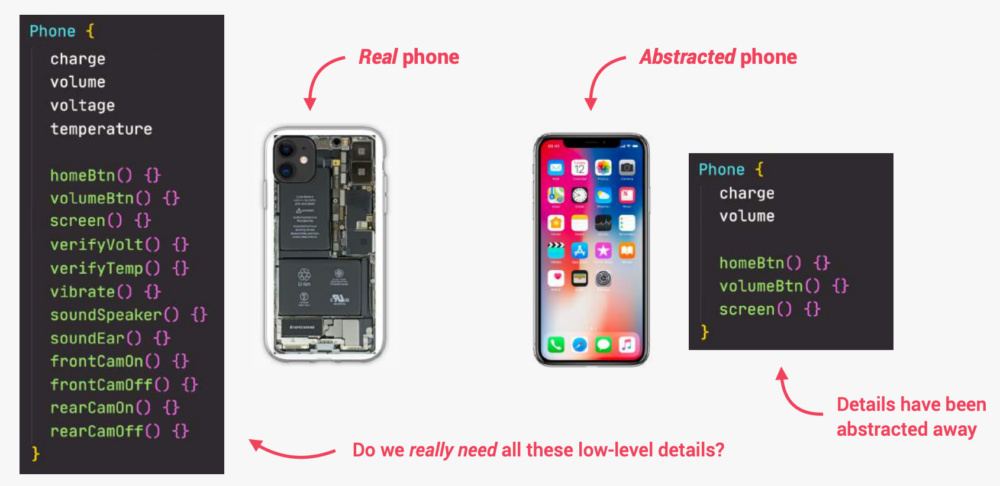
  - **Encapsulation**
    - keep some properties and methods `private` inside the class, so that they are not accessible from outside the class. Other code can only access what we expose in the public interface (API).
      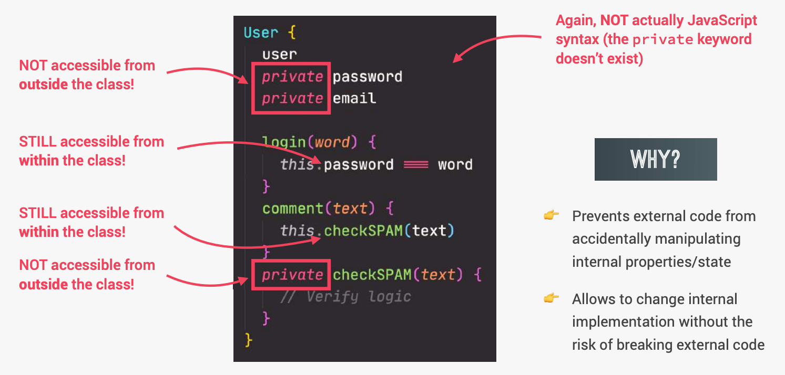
  - **Inheritance**
    - make all properties and methods of a certain class available to a child class, forming a hierarchical relationship between classes. This allows us to reuse common logic and to model real-world relationships.
      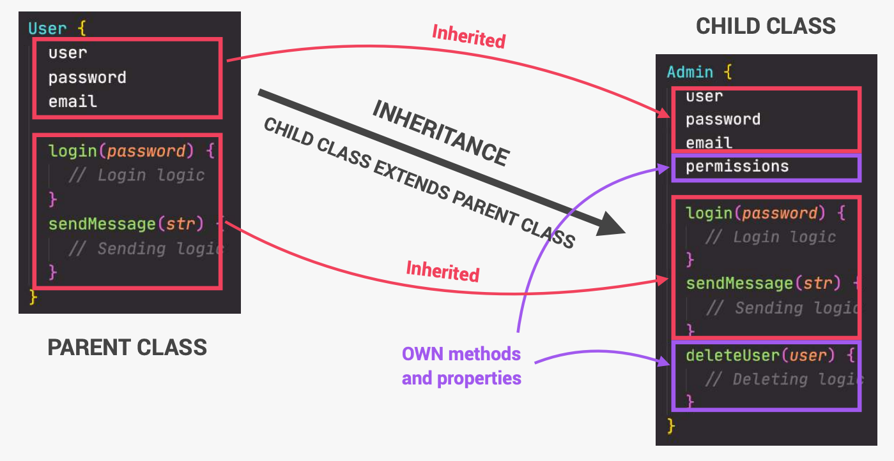
  - **Polymorphism**
    - a child class can **overwrite** a method it inherited from a parent class.
      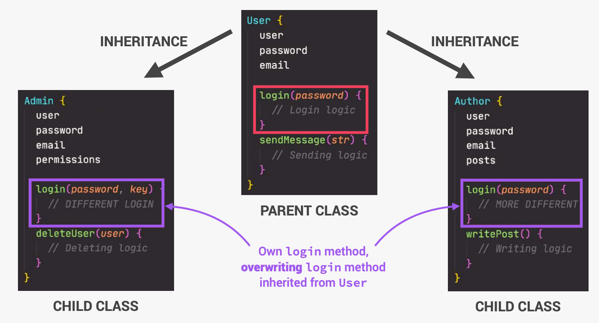

- Javascript object oriented way is very different from other OOP languages as in the background javascript is actually **faking** the implementation as **Javascript is a prototypal-language and not object-oriented-language**

---

## Object

### Object / Accessor properties

- objects can store properties. object property is actually a more flexible and powerful thing than just a `key-value` pairs.

  - **Object properties**, besides a value, have three special attributes (so-called `“flags”`):

    - `writable` – if `true`, the value can be changed, otherwise it’s read-only.
    - `enumerable` – if `true`, then listed in loops, otherwise not listed.

      - we can set `enumerable:false`. Then it won’t appear in a for..in loop,

      ```js
      let user = {
        name: 'John',
        toString() {
          return this.name;
        }
      };

      Object.defineProperty(user, 'toString', {
        enumerable: false
      });

      // Now our toString disappears:
      for (let key in user) alert(key); // name
      ```

    - `configurable` – if `true`, the property can be deleted and these attributes can be modified, otherwise not.

      > Please note: `configurable: false` prevents changes of property flags and its deletion, while allowing to change its value.

    - The method `Object.getOwnPropertyDescriptor` allows to query the full information about a property.

      ```js
      let descriptor = Object.getOwnPropertyDescriptor(obj, propertyName);
      ```

  - **Accessor properties** are represented by `“getter”` and `“setter”` methods. In an object literal they are denoted by get and set:

    ```js
    let obj = {
      get propName() {
        // getter, the code executed on getting obj.propName
      },

      set propName(value) {
        // setter, the code executed on setting obj.propName = value
      }
    };

    // -------------------------------------------------

    let user = {
      name: 'John',
      surname: 'Smith',

      get fullName() {
        return `${this.name} ${this.surname}`;
      },

      set fullName(value) {
        [this.name, this.surname] = value.split(' ');
      }
    };

    // set fullName is executed with the given value.
    user.fullName = 'Alice Cooper';

    alert(user.fullName); // Alice Cooper
    ```

#### Smarter getters/setters

`Getters`/`setters` can be used as wrappers over “real” property values to **gain more control** over operations with them.

- Why using getters/setters ?
  - Perform operations on the attribute before setting the attribute or returning it
  - check the value before setting the attribute or returning it
- One of the great uses of **accessors** is that they allow to take control over a “regular” data property at any moment by replacing it with a `getter` and a `setter` and tweak its behavior.

```js
let user = {
  get name() {
    return this._name;
  },

  set name(value) {
    if (value.length < 4) {
      alert('Name is too short, need at least 4 characters');
      return;
    }
    this._name = value; // The name is stored in _name property, and the access is done via getter and setter.
  }
};

user.name = 'Pete';
alert(user.name); // Pete

user.name = ''; // Name is too short...
```

---

## Prototypes (OOP in Javascript)

Each object has a `prototype`, which contains **methods** and **properties** that are **shared** among all instances of that object.

- `Objects` are linked to a `prototype` object -> "Prototypal Inheritance / Delegation"
  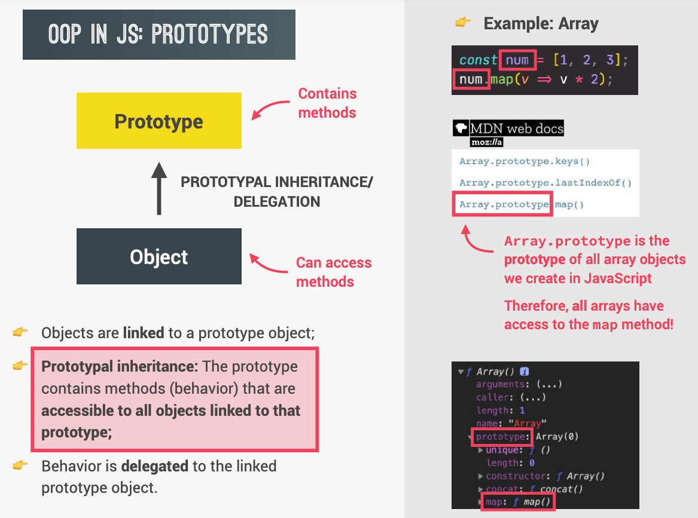
  
- Ways to implement `prototypal inheritance` in Javascript:

  - `Constructor Functions`
  - `ES6 Classes`
  - `Object.create()`

- In JavaScript, each (`constructor-function`/`class`) has a special hidden property `[[Prototype]]` that is shared by every instance of the `constructor`/`class`, that is either `null` or references another object. That object is called “a prototype”

  - The property `[[Prototype]]` is internal and hidden, but there are many ways to set it:

    - One of them is to use the special name `__proto__`, which is a "setter" for the `[[prototype]]` object

      ```js
      rabbit.__proto__ = animal; // sets rabbit.[[Prototype]] = animal
      ```

- **Notes**

  - The value of `__proto__` can be either an `object` or `null`. Other types are ignored.
  - `__proto__` is a historical **getter**/**setter** for `[[Prototype]]`
  - The `__proto__` property is a bit outdated. It exists for historical reasons, modern JavaScript suggests that we should use `Object.getPrototypeOf`/`Object.setPrototypeOf` functions instead that `get`/`set` the prototype.

    - `Object.getPrototypeOf(obj)` – returns the `[[Prototype]]` of `obj`.
    - `Object.setPrototypeOf(obj, proto)` – sets the `[[Prototype]]` of `obj` to `proto`.

  - `__proto__` actually is invisible in javascript, it's added by the browser to make it easier to access the prototype of an object (debugging).
    - That's one of the reasons why when we want to add things to the prototype of an object, we don't use `__proto__` instead we use `Object.getPrototypeOf`/`Object.setPrototypeOf` functions.
  - The `for..in` loop iterates over both its own and its inherited properties. All other key/value-getting methods only operate on the object itself.

- **`"this"` is not affected by prototypes at all**.

  - No matter where the method is found: in an object or its prototype. In a method call, `this` is always the object before the dot.
  - so, when the inheriting objects run the inherited methods, they will modify only their own states, not the state of the big object.

---

### Why we do this?

why we do this instead of declaring the function with the class properties each time we instantiate a new class (object) ?

- because we don't want to create the same function that have same functionality each time for each object -> (Bad Performance)
- instead we move all these methods (functions) to a parent object so that it won't be created each time (**Bundle all common functions together + Make a Bond to that object by a hidden property -> `__proto__`**)
  - `__proto__` hidden property is added in the background using the **"new"** keyword that points to the **prototype** object-property in the parent class

---

### Functions Prototype

- Every function has the "`prototype`" property even if we don’t supply it.
- The default "`prototype`" is an object with the only property `constructor` that points back to the function itself.

  ```js
  function Rabbit() {}

  /* default prototype
  Rabbit.prototype = { constructor: Rabbit };
  */

  // Adding properties to the prototype (functions)
  function jump() {
    alert(`${this.name} jumps!`);
  }

  Rabbit.prototype.jump = jump; // now all rabbits can jump
  ```

---

### Native (Default) Prototypes

- Javascript uses the `__proto__` reference to give `objects`, `functions` and `arrays` a bunch of bonus functionality. as all things in javascript are objects, and all objects by default have `__proto__` property that points to the `prototype` of the `constructor function` that created them.
  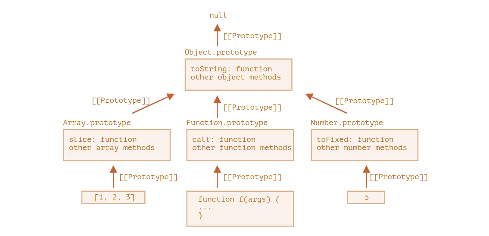

  ```js
  let arr = [1, 2, 3];

  arr.slice(1); // [2, 3] -> Where is this method coming from?
  // it inherits from Array.prototype?

  arr.toString(); // "1,2,3" -> Where is this method coming from?
  // it inherits from Array.prototype, doesn't find it there, then checks Object.prototype, where it's found.
  ```

- Other built-in prototypes:

  ```js
  let arr = [1, 2, 3];

  // it inherits from Array.prototype?
  alert(arr.__proto__ === Array.prototype); // true

  // then from Object.prototype?
  alert(arr.__proto__.__proto__ === Object.prototype); // true

  // and null on the top.
  alert(arr.__proto__.__proto__.__proto__); // null

  // notes
  alert(Array.prototype.__proto__ === Object.prototype); // true
  alert(Array.prototype.isPrototypeOf(Array)); // false
  ```

  

> - In modern programming, there is only one case where modifying **native prototypes** is approved. That’s **polyfilling**.
>   - Polyfilling is a term for making a substitute for a method that exists in the JavaScript specification, but is not yet supported by a particular JavaScript engine.

---

## Constructor Function

That's the main purpose of constructors – to implement reusable object creation code.

- Usually, constructors do not have a `return` statement. Their task is to write all necessary stuff into `this`, and it automatically becomes the result. But if there is a `return` statement, then:

  - If `return` is called with an object, then the object is returned instead of `this`.
  - If `return` is called with a primitive, it’s ignored.

  ```js
  function BigUser() {
    this.name = 'John';
    return { name: 'Godzilla' }; // <-- returns this object
  }

  alert(new BigUser().name); // Godzilla, got that object
  ```

- Note that when defining a function in javascript, it's both a function and an object at the same time. **(function + object) combo**

  - So, we can add properties to the function itself.
  - This is the most important part of the `constructor function` because we can add methods to the `prototype` of the `constructor function` and then all objects created from that `constructor function` will inherit those methods.

---

### The "`new`" keyword

It's a keyword that automates the hard work (process of creating an object and linking it to the `prototype` of the `constructor function`).

- When a function is executed with **`new`** keyword, it does the following steps:

  - Creating a new empty object and assigning it to `this` keyword.
  - creating a new hidden property `__proto__` and setting it to the `prototype` property of the `constructor function`.
  - The function body executes. Usually it modifies `this`, adds new properties to it.
  - The value of `this` is returned. (The new object is returned)
  - All is that is possible because (functions in JS are both **function & objects combo**)
    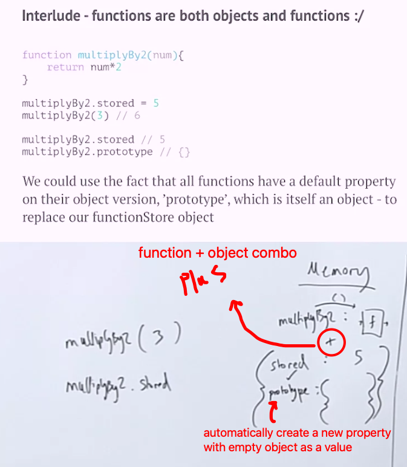
    - That's why we can use the "dot notation" to add properties to the function (constructor function) and also to the object created from it.

- So, the `new` keyword behind the scenes does all the prototype stuff for us.

  ```js
  // OLD
  function userCreator(name) {
    const newUser = object.create(userFunctionStore);
    newUser.name = name;
    return newUser;
  }

  const userFunctionStore = {
    sayHello: function () {
      console.log('Hello!');
    }
  };

  const user1 = userCreator('Phil');
  user1.sayHello();

  // ---------------------------------------------------------------

  // NEW
  function User(name) {
    this.name = name;
  }

  User.prototype.sayHello = function () {
    console.log('Hello!');
  };

  const user1 = new User('Phil');
  user1.sayHello();

  // the `new` keyword does the following:
  // 1. create a new function + an empty object with the hidden property (prototype)
  // 2. assign the new object to the (`this`) keyword
  // 3. sets the `__proto__` of the new object to the prototype of the function
  // 4. return the new object
  ```

- Example
  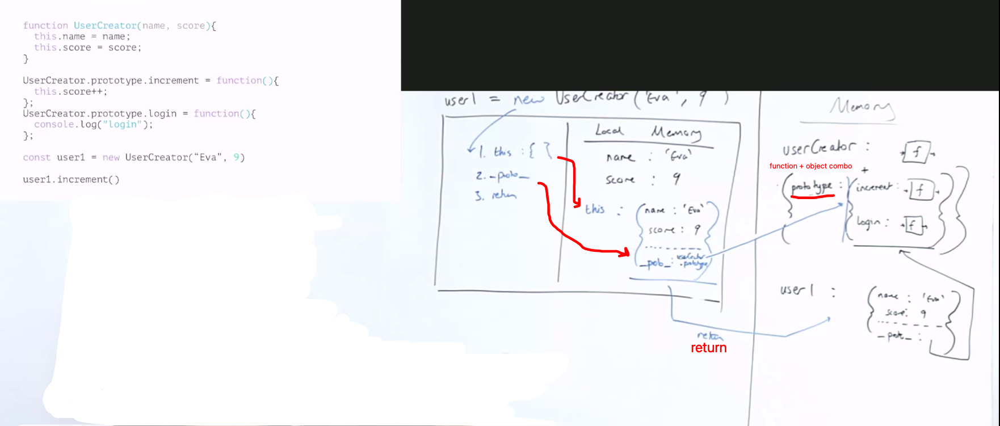

  - So, when the `increment()` method is called, these steps will happen:
    1. we will check if `increment()` method exists on the `user1` object, if not then we will look up the `__proto__` chain to find the method. which leads us to the `prototype` of the `User` constructor function.
    2. Then if found, the method will be executed with a new "execution context" and the `this` keyword will point to the `user1` object.
    3. Now inside the `increment()` method, `this` keyword will point to the `user1` object. So, the `this.score = user1.score` will be incremented by `1`.
  - That is why we may find problems with `this` keyword in the `prototype` methods if we create the method using the `arrow function` because the `this` keyword will point to the `window` object instead of the object that we want to modify.

- We use `new` keyword also when we want to create a new instance of a class, because classes are just syntactic sugar for `constructor functions`

  ```js
  class User {
    constructor(name) {
      this.name = name;
    }
  }

  let user = new User('John');
  ```

- **NOTES**:

  - other built in objects like arrays have the hidden `__proto__` property
  - Here are the things that you should/shouldn't use the `new` keyword with:
    - **Use** it with `constructor functions` (classes) that you want to create an instance of an object from (type of object)
      - `Object()`, `Array()`, `Date()`, `Function()`, `Promise()`, `RegExp()`, `Error()`, `Map()`, `Set()`
    - **Don't use** it with things that you don't want to become an object-type instead of primitive-type
      - `Number()`, `String()`, `Boolean()`
  - The major difference from other ways we’ve seen is that **the function is created literally from a string**; For example, we can receive a new function from a server and then execute it:

    - It is used in very specific cases, like when we receive code from a server, or to dynamically compile a function from a template, in complex web-applications.

---

### Constructor function methods

- **You should never create a method inside of a constructor function**.
  - That's because imagine we were gonna create a hundred of instants using this constructor function, Then what would happen, is that each of these objects would carry around this function here. So we would essentially create a hundred copies of this function. This is bad for performance
- instead use `prototypal inheritance`

  ```js
  function Person(firstName, birthYear) {
    // Instance properties
    this.firstName = firstName;
    this.birthYear = birthYear;

    // Never do this ❌
    this.calcAge = function () {
      console.log(2037 - this.birthYear);
    };
  }

  // Instead use: prototypal inheritance ✅
  Person.prototype.calcAge = function () {
    console.log(2037 - this.birthYear);
  };

  const jonas = new Person('Jonas', 1991);
  jonas.calcAge(); // 46
  ```

- **IMPORTANT:** Avoiding duplication with Prototype

  - Here, notice that it says that you shouldn't create a method inside of a constructor function, but instead you should use `prototypal inheritance` to add methods to the prototype of the constructor function.

    - **Why?** because if we create a method inside of a constructor function, then that method will be attached to each object that we create using that constructor function. So, if we create a hundred objects using that constructor function, then we would essentially create a hundred copies of that method in memory. This is bad for performance.

  - Instead, we should use `prototypal inheritance` to add methods to the prototype of the constructor function. This way, all objects created using that constructor function will inherit the method from the `prototype`. So, we only have one copy of the method that is shared among all objects created using that constructor function.
    - summary: store the `calcAge` function in just one object and have the interpreter (if it doesn't find the function on `jonas` object) look up the `prototype chain` to find the function.

---

## `object.create()`

It's another way to create objects in JS, it's a bit more modern than using `new` keyword with `constructor functions`.

- It works by passing in an object that will be the `prototype` of the new object that we create.
- So, It enables us to create `prototypes` from other objects.

```js
const PersonProto = {
  init(name, birthYear) {
    this.name = name;
    this.birthYear = birthYear;
  }

  calcAge() {
    console.log(2037 - this.birthYear);
  },
};

// ------------- using object.create ------------- //

// method-1
// make (PersonProto) to be the prototype of (steven)
const steven = Object.create(PersonProto);
steven.name = 'Steven';
steven.birthYear = 2002;
steven.calcAge();

// method-2
const sarah = Object.create(PersonProto);
sarah.init('Sarah', 1979);
sarah.calcAge();
```

- Difference between `object.create()` and `new` keyword with constructor functions:

  - `object.create()` builds an object that inherits directly from the one that we passed into the first argument.
  - `new` keyword with constructor functions, its created object inherits from the constructor's `prototype` property.

> `Object.create()` is the least used way to create objects in JS.

---

## ES6 Classes

> In object-oriented programming, a `class` is an extensible program-code-template for creating objects, providing initial values for state (member variables) and implementations of behavior (member functions or methods).

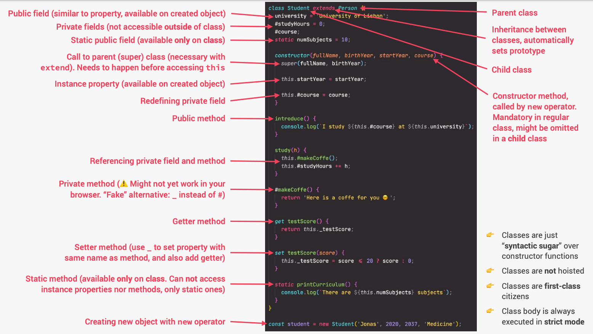

- The problem with the previous way of creating objects using `constructor functions` is that we're writing our shared methods separately from the constructor function, and then we're manually adding them to the prototype of the constructor function. Other languages let us do this all in one place, and that's what `classes` in JavaScript are all about.
  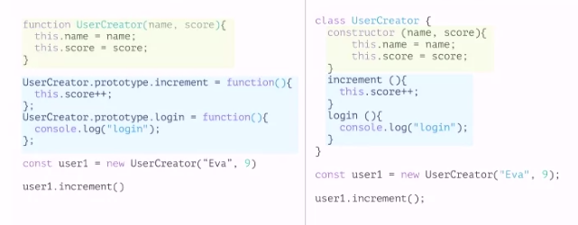
  - Both are the same under the hood, but the `class` syntax is just a more modern and cleaner way to work with `prototypal inheritance` in JavaScript.
- ES6 classes are just a new way to write `constructor functions` and `prototypal inheritance` in JavaScript. **(Syntactic sugar)**

  - **class** automatically creates a **(function + object) combo** like `constructor function` does

    - the object created will have the methods added to the **automatically** created `prototype` object of the class, instead of manually adding the methods to the `prototype` object
      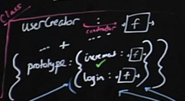

    ```js
    // Class Expression
    // (unnamed)
    let User = class {
      sayHi() {
        alert('Hello');
      }
    };
    new User().sayHi(); // Hello

    // (named)
    let User = class MyClass {
      sayHi() {
        alert(MyClass); // MyClass name is visible only inside the class
      }
    };
    new User().sayHi(); // works, shows MyClass definition
    alert(MyClass); // error, MyClass name isn't visible outside of the class

    // --------------------------------------------------------------- //

    // Class declaration
    class User {
      sayHi() {
        alert('Hello');
      }
    }
    ```

- in the code below, What `class User {...}` construct really does is:

  ```js
  class User {
    constructor(name) {
      this.name = name;
    }
    sayHi() {
      alert(this.name);
    }
  }
  ```

  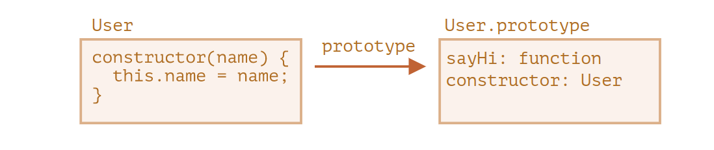

  1. Creates a function named `PersonCl`, that becomes the result of the class declaration. The function code is taken from the constructor method (assumed empty if we don’t write such method).
  2. Stores class methods, such as sayHi, in **`User.prototype`**.

- **Notes:**

  - There're no **classes** in Javascript, this is just **syntactic sugar**

    - Sometimes people say that class is a “syntactic sugar” (syntax that is designed to make things easier to read, but doesn’t introduce anything new), because we could actually declare the same thing without using the class keyword at all
    - actually, It's "Not just a syntactic sugar"

      - a function created by `class` is labelled by a special internal property `[[IsClassConstructor]]: true`. So it’s not entirely the same as creating it manually.

        - The language checks for that property in a variety of places. For example, unlike a regular function, it must be called with `new` keyword:

          ```js
          class User {
            constructor() {}
          }

          alert(typeof User); // function
          User(); // Error: Class constructor User cannot be invoked without 'new'
          ```

    - Class methods are non-enumerable. A class definition sets `enumerable` flag to `false` for all methods in the "prototype".
      - That’s good, because if we `for..in` over an object, we usually don’t want its class methods.
    - Classes always **use strict**. All code inside the class construct is automatically in strict mode.

  - In JavaScript, a `class` is a kind of (has `type` equal to) **function**.
  - There're no commas between class methods
  - Classes are NOT hoisted
    - Even if we declare a class using a `class` declaration, a `class` is **NOT** hoisted, unlike `functions`
  - Classes are first-class citizens
    - means that we can pass them into functions and also return them from functions
  - Classes are executed in `strict mode`
  - You can use **Computed methods names `[…]`**

    ```js
    class User {
      ['say' + 'Hi']() {
        alert('Hello');
      }
    }

    new User().sayHi();
    ```

---

### Getters & Setters

They're special kind of methods that are used to `get` and `set` values of properties inside of an object, they're used as a `property` but they're actually a `method`

They're used to add an extra layer of security to our data, and to do some extra things behind the scenes when we try to get or set a property.

- `getter` :

  - show a method as a property
  - get value out of an object by writing a property instead of writing a method

    ```js
    class PersonCl {
      constructor(fullName, birthYear) {
        this.fullName = fullName;
        this.birthYear = birthYear;
      }
      // ...
      get age() {
        return 2037 - this.birthYear;
      }
    }

    const jessica = new PersonCl('Jessica Davis', 1996);
    console.log(jessica.age); // 41
    ```

- `setter` :

  - used to change existing property
  - define a property by setting it to a value instead of calling a method.

    ```js
    class PersonCl {
      constructor(fullName, birthYear) {
        this.fullName = fullName;
        this.birthYear = birthYear;
      }
      // ...
      set fullName(name) {
        if (name.includes(' ')) this._fullName = name;
        else alert(`${name} is not a full name!`);
      }
    }

    const jessica = new PersonCl('Jessica Davis', 1996);
    jessica.fullName = 'Jess Davis';
    console.log(jessica); // PersonCl {fullName: "Jess Davis", birthYear: 1996}
    ```

  - if you have a setter for a property that is already defined in the constructor, then you need to create basically a new property with the `underscore ( _ )` in front of it.

---

## Class Inheritance (Sub-Classing)

### Using `Constructor / Factory Function` (OLD)

Here, inherence works by using the parent's factory function inside the child's factory function. and then linking the prototypes manually.

- parent factory function

  ```js
  // Parent
  const UserCreator = function (name, score) {
    const newUser = Object.create(userFunction);
    newUser.name = name;
    newUser.score = score;
    return newUser;
  };
  const userFunction = {
    sayName: function () {
      console.log("I'm " + this.name);
    },
    increment: function () {
      this.score++;
    }
  };

  const user1 = UserCreator('Phil', 5);
  user1.sayName(); // My name is Phil
  ```

  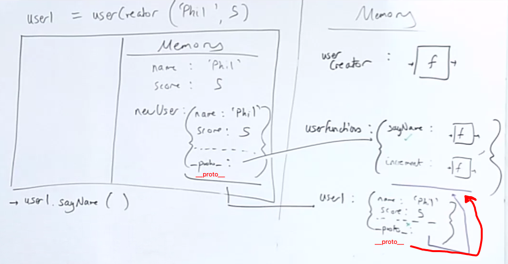

- child factory function

  ```js
  // Child
  const PaidUserCreator = function (paidName, paidScore, accountBalance) {
    // 1. use the parent factory function
    const newPaidUser = UserCreator(paidName, paidScore);
    // 2. set the prototype of the new object to the parent object
    Object.setPrototypeOf(newPaidUser, paidUserFunction);
    // 3. add new properties to the new object
    newPaidUser.accountBalance = accountBalance;
    return newPaidUser;
  };
  paidUserFunction = {
    increaseBalance: function () {
      this.accountBalance++;
    }
  };
  Object.setPrototypeOf(paidUserFunction, userFunction); // Linking prototypes (manually)

  const paidUser1 = paidUserCreator('Alyssa', 8, 25);
  paidUser1.increaseBalance(); // 26 (from paidUserFunction)
  paidUser1.sayName(); // I'm Alyssa (from userFunctionStore)
  ```

  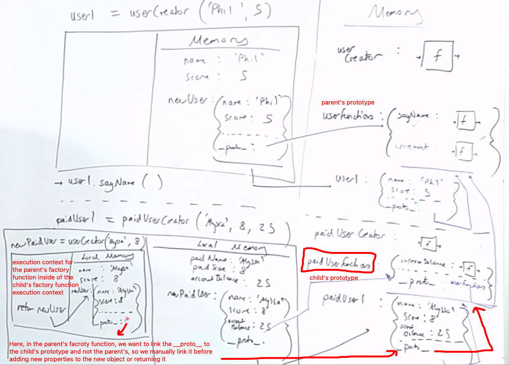

- Steps:

  1. use the parent factory function
  2. set the prototype of the new object to the parent object before adding new properties to the new object or returning it.
  3. add new properties to the new object
  4. return the new object
  5. Linking prototypes (manually) by using `Object.setPrototypeOf()` for the child object's prototype to the parent object's prototype. So that now the child object will inherit the methods from the parent object if it doesn't find the method on itself.
  6. Now, the child object will inherit the methods from the parent object.

- These steps and images show how sub-classing works in JavaScript under the hood (low-level). which might be asked in a technical interview. **"Tell me how sub-classing works in JavaScript under the hood?"**
- This way of sub-classing is not used anymore, instead we use `ES6 classes` to do the same thing.

---

### Using `new` keyword (OLD)

Here, inheritance works by using the `call` or `apply` methods to call the `Parent` constructor function with the `this` keyword set to the `Child` object.

- We use `new` keyword to create a new object from the `Parent` constructor function and then we use `call` method to call the `Parent` constructor function with the `this` keyword set to the `Child` object.

- Parent constructor function

  ```js
  const userCreator = function (name, score) {
    this.name = name;
    this.score = score;
  };
  userCreator.prototype.sayName = function () {
    console.log("I'm " + this.name);
  };
  userCreator.prototype.increment = function () {
    this.score++;
  };

  const user1 = new userCreator('Phil', 5);
  user1.sayName(); // I'm Phil
  ```

  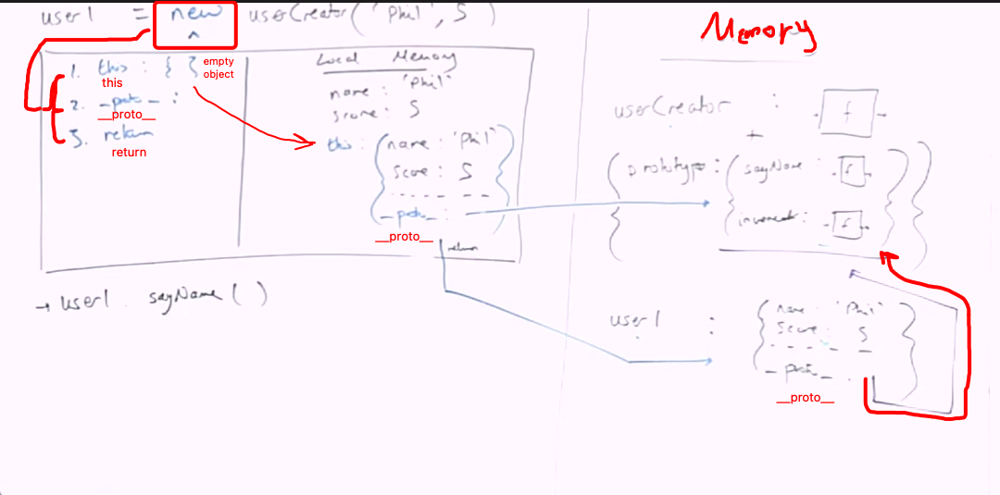

- Child constructor function

  ```js
  const paidUserCreator = function (paidName, paidScore, accountBalance) {
    userCreator.call(this, paidName, paidScore);
    this.accountBalance = accountBalance;
  };
  paidUserCreator.prototype = Object.create(userCreator.prototype);
  paidUserCreator.prototype.increaseBalance = function () {
    this.accountBalance++;
  };

  const paidUser1 = new paidUserCreator('Alyssa', 8, 25);
  paidUser1.increaseBalance(); // 26
  paidUser1.sayName(); // I'm Alyssa
  ```

  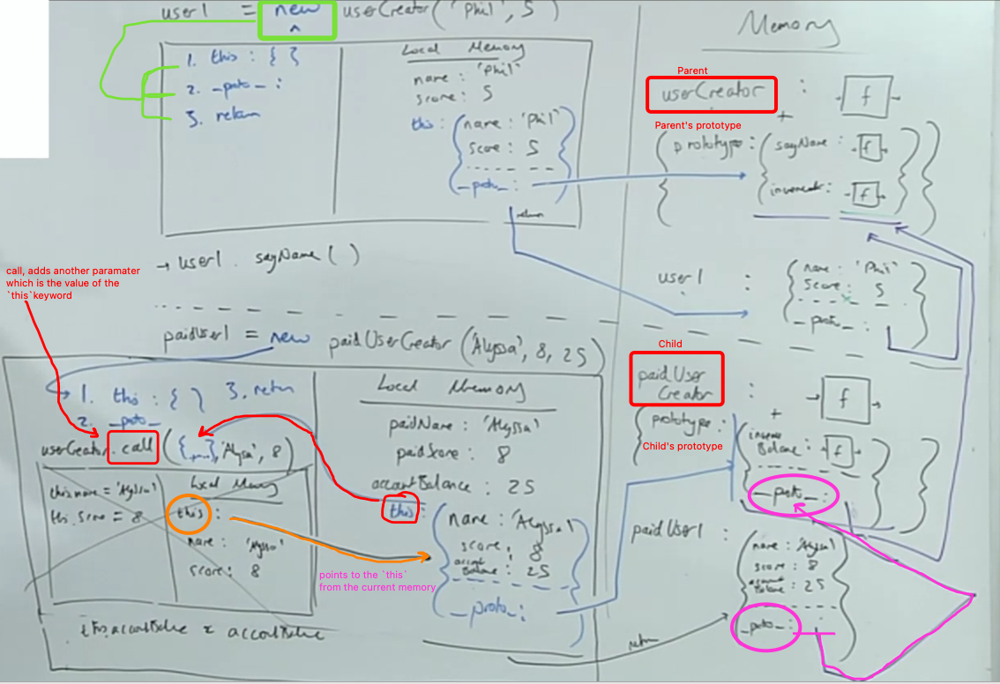

- **Notes:**

  - We use `Object.create()` to manually set the prototype of the `Parent` object to the `Child` prototype.
    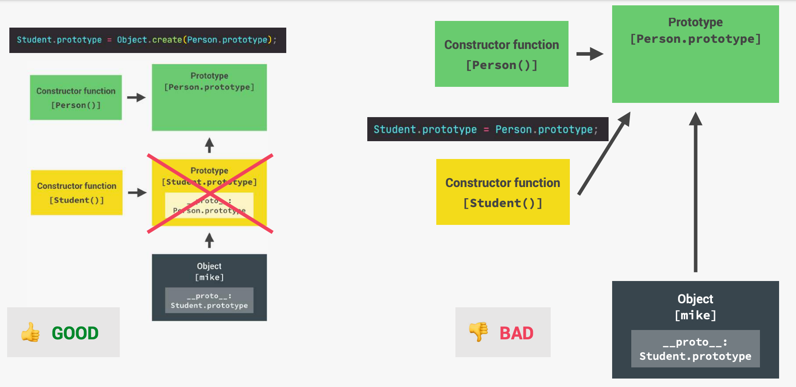
  - Here, inheritance works by using the `call` method to call the `Person` constructor function with the `this` keyword set to the `Student` object.

    > Remember that `call` and `apply` allow us to manually control what the `this` keyword is in any function.

    ```js
    const Student = function (firstName, birthYear, course) {
      Person.call(this, firstName, birthYear);
      // here we are not using the (new) word and we are using (Person) as a normal function and not a class

      this.course = course;
    };

    // Linking prototypes
    Student.prototype = Object.create(Person.prototype);
    // here we use (Object.create) because we want to set the prototype "MANUALLY"

    Student.prototype.introduce = function () {
      console.log(`My name is ${this.firstName} and I study ${this.course}`);
    };
    ```

  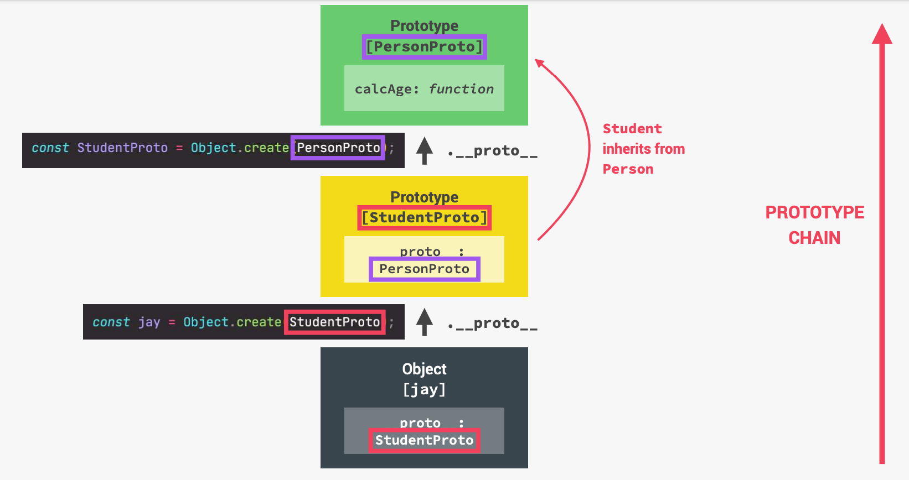

  ```js
  const PersonProto = {
      calcAge() {
        console.log(2037 - this.birthYear);
      }
      init(firstName, birthYear) {
        this.firstName = firstName;
        this.birthYear = birthYear;
      },
    }

  // 1. set the __proto__ of the subClass from the __proto__ of the superClass
  const StudentProto = Object.create(PersonProto);

  // 2. add init properties to the subClass
  StudentProto.init = function (firstName, birthYearcourse) {
    PersonProto.init.call(this, firstName, birthYear);
    this.course = course;
    };

  // 3. create an instance of the subClass using the baseClass
  const steven = Object.create(StudentProto);
  steven.init('Jay', 2010, 'Computer Science');
  ```

---

### Using `ES6 Classes` (NEW)

Here, inheritance works by using the `extends` keyword to set the `__proto__` property of the `Student` class to the `Person` class.

- Parent class

  ```js
  // Parent
  class UserCreator {
    constructor(name, score) {
      this.name = name;
      this.score = score;
    }
    sayName() {
      console.log("I'm " + this.name);
    }
    increment() {
      this.score++;
    }
  }

  const user1 = new UserCreator('Phil', 4);
  ```

  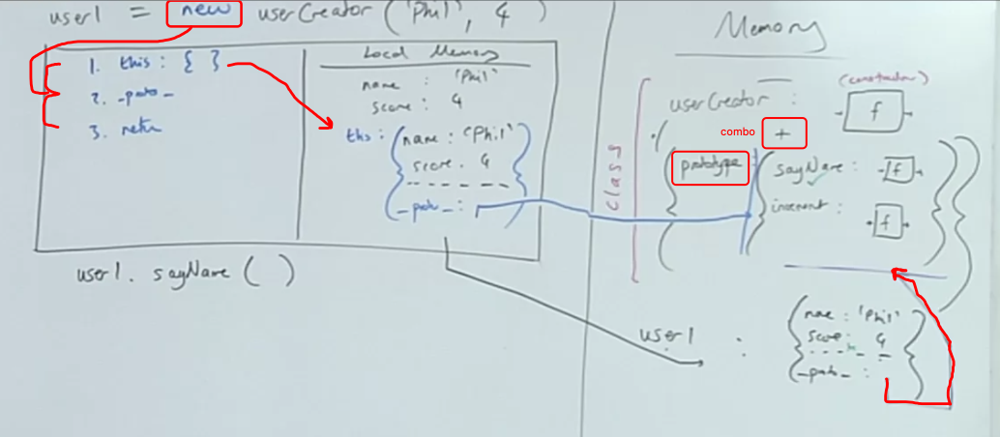

- Child class

  ```js
  class PaidUserCreator extends UserCreator {
    constructor(paidName, paidScore, accountBalance) {
      super(paidName, paidScore); // call the parent constructor function (must be called first ⚠️)
      this.accountBalance = accountBalance;
    }
    increaseBalance() {
      this.accountBalance++;
    }
  }

  const paidUser1 = new PaidUserCreator('Alyssa', 8, 25);
  paidUser1.increaseBalance(); // 26
  paidUser1.sayName(); // I'm Alyssa
  ```

  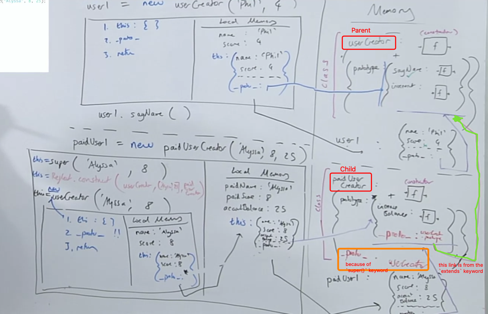

  - Good luck understanding the image 😅

- **Notes:**

  - We do something in our method, but call the parent method before/after it or in the process. Classes provide the "`super`" keyword for that.

    - `super.method(...)` to call a parent method.
    - `super(...)` to call a parent constructor (inside our constructor only).

    - `super()` -> creates a hidden property `__proto__` to the object but here `__proto__` won't point to `prototype` of the parent object, instead it will point to the **object creator constructor function of the parent class**
      - then the result (return value) from the `object creator constructor function` will be put in the created `this` property

  - Note that we use the `new` keyword to create a new object from the `Parent` constructor function and then we use `extends` keyword to set the `__proto__` property of the `Child` class to the `Parent` class.

    - The `extends` keyword is used to create a class as a child of another class.
    - `prototypes` are automatically inherited with the `extends` word.

---

### Mixins

In JavaScript we can only inherit from a single object. There can be only one `[[Prototype]]` for an object. And a class may extend only one other class. But sometimes that feels limiting. For instance, we have a class `StreetSweeper` and a class `Bicycle`, and want to make their mix: a `StreetSweepingBicycle`. There’s a concept that can help here, called **“mixins”**.

> a mixin is a class containing methods that can be used by other classes without a need to inherit from it. In other words, a mixin provides methods that implement a certain behavior, but we do not use it alone, we use it to add the behavior to other classes.

```js
// mixin
let sayHiMixin = {
  sayHi() {
    alert(`Hello ${this.name}`);
  },
  sayBye() {
    alert(`Bye ${this.name}`);
  }
};

// usage:
class User {
  constructor(name) {
    this.name = name;
  }
}

// copy the methods
Object.assign(User.prototype, sayHiMixin);

// now User can say hi
new User('Dude').sayHi(); // Hello Dude!
```

- Mixins can make use of inheritance inside themselves:

  ```js
  let sayMixin = {
    say(phrase) {
      alert(phrase);
    }
  };

  let sayHiMixin = {
    __proto__: sayMixin, // (or we could use Object.setPrototypeOf to set the prototype here)

    sayHi() {
      // call parent method
      super.say(`Hello ${this.name}`); // (*)
    },
    sayBye() {
      super.say(`Bye ${this.name}`); // (*)
    }
  };

  class User {
    constructor(name) {
      this.name = name;
    }
  }

  // copy the methods
  Object.assign(User.prototype, sayHiMixin);

  // now User can say hi
  new User('Dude').sayHi(); // Hello Dude!
  ```

---

## Class Fields

> Class fields are a recent addition to the language (Old browsers may need a polyfill).

- Previously, our classes only had methods and “Class fields” is a syntax that allows to add any properties.

  ```js
  class User {
    name = 'John';

    sayHi() {
      alert(`Hello, ${this.name}!`);
    }
  }

  new User().sayHi(); // Hello, John!

  alert(user.name); // John
  // class fields are set on individual objects, not User.prototype
  alert(User.prototype.name); // undefined
  ```

---

### Static Methods and Properties

#### Static Methods

- `static methods` are not available for instances
  - Usually, static methods are used to implement functions that belong to the class as a whole, but not to any particular object of it.
- It can be used as a "factory method" (a factory is an object for creating other objects (instantiate instance of the class); formally, it is a function or method that returns objects of a varying prototype or class from some method call, which is assumed to be "new" ):

  ```js
  class Article {
    constructor(title, date) {
      this.title = title;
      this.date = date;
    }

    static createTodays() {
      // remember, this = Article
      return new this("Today's digest", new Date());
    }
  }

  let article = Article.createTodays();

  alert(article.title); // Today's digest
  ```

#### Static Properties

- Static properties are also possible, they look like regular class properties, but prepended by static

  ```js
  class Article {
    static publisher = 'Ilya Kantor';
  }

  alert(Article.publisher); // Ilya Kantor
  ```

- Static properties are inherited using prototypes.
  - But built-in classes are an exception. They don’t inherit statics from each other.
  - For example, both `Array` and `Date` inherit from `Object`, so their instances have methods from `Object.prototype`. But `Array.[[Prototype]]` does not reference Object, so there’s no, for instance, `Array.keys()` (or `Date.keys()`) static method.

---

### Encapsulation (Private and protected properties and methods)

It's a methodology used for **hiding information**. It is based on the concept that object properties should not be exposed publicly to the outside world. Implementing Encapsulation in JavaScript prevents access to the variables by adding public entities inside an object, which the callers can use to achieve specific results.

- In JavaScript, there are two types of object fields (properties and methods):

  - `Public`: accessible from anywhere. They comprise the external interface. Until now we were only using public properties and methods.
  - `Private`: accessible only from inside the class. These are for the internal interface.

- we use it to prevent the user from seeing specific properties or changing them
- so we make these properties accessible from methods and not directly
- `Protected` properties are usually prefixed with an underscore `_` and Here we used getter/setter syntax:

  ```js
  class CoffeeMachine {
    _waterAmount = 0; // protected property

    setWaterAmount(value) {
      if (value < 0) value = 0;
      this._waterAmount = value;
    }

    getWaterAmount() {
      return this._waterAmount;
    }
  }

  const coffeeMachine = new CoffeeMachine();
  coffeeMachine.setWaterAmount(100);
  alert(coffeeMachine.getWaterAmount()); // 100
  ```

- the new `Private` fields syntax `#`: is a recent addition to the language. Not supported in JavaScript engines, or supported partially yet, requires **polyfilling**.

  - Privates should start with `#`. They are only accessible from inside the class.
  - Unlike protected ones (with `_`), private fields are enforced by the language itself. That’s a good thing.

  ```js
  class CoffeeMachine {
    #waterLimit = 200; // private property

    #fixWaterAmount(value) {
      if (value < 0) return 0;
      if (value > this.#waterLimit) return this.#waterLimit;
    }

    setWaterAmount(value) {
      this.#waterLimit = this.#fixWaterAmount(value);
    }
  }

  let coffeeMachine = new CoffeeMachine();

  // can't access privates from outside of the class
  coffeeMachine.#fixWaterAmount(123); // Error
  coffeeMachine.#waterLimit = 1000; // Error
  ```

  - `Private` fields do not conflict with `public` ones. We can have both private `#waterAmount` and public `waterAmount` fields at the same time.

```js
// Encapsulation: Protected Properties and Methods
// 1) Public fields
// 2) Private fields
// 3) Public methods
// 4) Private methods
// (there is also the static version)

class Account {
  // 1) Public fields
  locale = navigator.language;

  // 2) Private fields
  #movements = []; // or _movements
  #pin; // we define it like this without a value as its value will be set in the constructor

  constructor(owner, currency, pin) {
    this.owner = owner;
    this.currency = currency;
    this.#pin = pin;

    // another way of Protected property (using (_) before property's name)
    // this._movements = [];
    // another way of Public property
    // this.locale = navigator.language;
  }

  // 3) Public methods

  // Public interface
  getMovements() {
    return this.#movements;
  }

  deposit(val) {
    this.#movements.push(val); // that's how we modify a private property (through a public method)
    return this;
  }

  withdraw(val) {
    this.deposit(-val);
    return this;
  }

  // 4) Private methods
  // #approveLoan(val) {
  _approveLoan(val) {
    return true;
  }
}
```

---

## Method Chaining

- Method chaining is the mechanism of calling a method on another method of the same object. This ensures a cleaner and readable code.
- Method chaining uses `this` keyword in the object's class to access its methods. When a method returns `this`, it simply returns an instance of the object in which it is returned. in another word, to chain methods together :

```js
class Account {
  deposit(val) {
    this.movements.push(val);
    return this;
  }
  withdraw(val) {
    this.deposit(-val);
    return this;
  }
}

const account1 = new Account('Jonas', 'EUR', 1111, []);
account1.deposit(250).withdraw(140);
```

---

## Notes

- We can create objects using functions, but that’s an old-school and frowned-upon way of making objects. Here're some of the reasons:

  - the object methods are created anew for each object. In the code above we create greet twice, and they do the same thing, but occupy different memory. It’s inefficient. Plus in order to modify or remove a method, we need to find all its occurrences in the code and fix them.

    - The main issue is that if we have many functions, then all of them are stored in memory. That’s not good. Because functions may be big, and we may need only one of them at a time.
    - That's where the [protoType chain](#prototypes-oop-in-javascript) comes in handy, as it allows us to create a function once (in memory), and then inherit it in other objects -> which is done using `Object.create()`

      ```js
      function User(name) {
        const user = Object.create(sayHi); // (functions) is the prototype object and we use (Object.create) to set the prototype manually
        user.name = name;
      }

      function sayHi() {
        alert(this.name);
      }

      new User('John').sayHi(); // John
      ```

  - Another problem with functions is that they use the `[[Environment]]` property to store the outer lexical environment reference. That’s needed to access outer variables. But here we don’t need it at all.

- if you want a class method to be automatically called when an instance of the class is created, then you should put this method in the constructor function

  ```js
  class User {
    constructor(name) {
      this.name = name;
      this.sayHi(); // automatically called
    }

    sayHi() {
      alert(this.name);
    }
  }

  new User('John'); // John
  ```

- in old syntax if we didn't use the word **"new"**, then **this** keyword will point to the `window` object
- Is it possible to create functions `A` and `B` so that `new A() == new B()`?

  - Yes, it’s possible. If a function returns an object then `new` returns it instead of `this`.

  ```js
  let obj = {};

  function A() {
    return obj;
  }
  function B() {
    return obj;
  }

  alert(new A() == new B()); // true
  ```

- Values `null` and `undefined` have no object wrappers (are not Objects like other types)
- the `prototypal` nature of JavaScript means that when an object can't find a property in itself, it will look up the `prototype` chain to see if the property is defined on the object's `prototype`. If it can't find the property in the `prototype` either, it will look up the `prototype` chain again, until it reaches the end of the `prototype` chain. If it still can't find the property, it will return `undefined`.
