# INDEX

- [INDEX](#index)
  - [Browser environment, specs](#browser-environment-specs)
  - [Document Object Model (DOM)](#document-object-model-dom)
    - [Object Model](#object-model)
    - [Steps for creating an element](#steps-for-creating-an-element)
    - [`insertAdjacentHTML()`](#insertadjacenthtml)
    - [DOM collections: (`HTMLCollection` vs `NodeList`)](#dom-collections-htmlcollection-vs-nodelist)
    - [Node.cloneNode()](#nodeclonenode)
    - [DOM Traversing](#dom-traversing)
    - [Searching: `getElement(s)By*`, `querySelector*`](#searching-getelementsby-queryselector)
  - [Node properties: type, tag and contents](#node-properties-type-tag-and-contents)
    - [`innerHTML` vs `innerText`](#innerhtml-vs-innertext)
    - [HTML attributes](#html-attributes)
      - [Property-attribute synchronization](#property-attribute-synchronization)
      - [Creating connection with non-standard attributes](#creating-connection-with-non-standard-attributes)
        - [`data-` Attributes](#data--attributes)
  - [Styles and classes](#styles-and-classes)
    - [Element Style](#element-style)
    - [Element Classes](#element-classes)
  - [Element/Window size and scrolling](#elementwindow-size-and-scrolling)
    - [Geometry Properties (element size)](#geometry-properties-element-size)
    - [Window sizes](#window-sizes)
    - [Coordinates of Elements](#coordinates-of-elements)
    - [Scrolling](#scrolling)
    - [Intersection observer](#intersection-observer)
      - [Examples of using the Intersection Observer API](#examples-of-using-the-intersection-observer-api)
  - [Virtual DOM](#virtual-dom)
    - [methods to compare nodes](#methods-to-compare-nodes)
    - [steps](#steps)
  - [Events](#events)
    - [Event Handling / Binding](#event-handling--binding)
    - [The `Event` object](#the-event-object)
    - [Event Propagation (Bubbling and capturing)](#event-propagation-bubbling-and-capturing)
      - [Event Bubbling](#event-bubbling)
      - [Event Capturing](#event-capturing)
      - [Event Delegation](#event-delegation)
        - [`data` attribute with Event Delegation](#data-attribute-with-event-delegation)
    - [Browser Default Actions](#browser-default-actions)
      - [Preventing browser actions](#preventing-browser-actions)
    - [Dispatching custom events](#dispatching-custom-events)
      - [Event constructor](#event-constructor)
    - [UI Events](#ui-events)
    - [Events Notes](#events-notes)
  - [HTML page script loading and lifecycle](#html-page-script-loading-and-lifecycle)
    - [Loading scripts: `async`, `defer`](#loading-scripts-async-defer)
      - [`defer`](#defer)
      - [`async`](#async)
    - [Comparison of `async` and `defer`](#comparison-of-async-and-defer)
    - [Page lifecycle: DOMContentLoaded, load, beforeunload, unload](#page-lifecycle-domcontentloaded-load-beforeunload-unload)

---

## Browser environment, specs

The JavaScript language was initially created for **web browsers**. Since then, it has evolved into a language with many uses and platforms. Each of the different platforms provides platform-specific functionality. The JavaScript specification calls that a **host environment**.

> **host environment :** provides its own objects and functions in addition to the language core.
>
> - Web browsers give a means to control web pages.
> - Node.js provides server-side features, and so on.

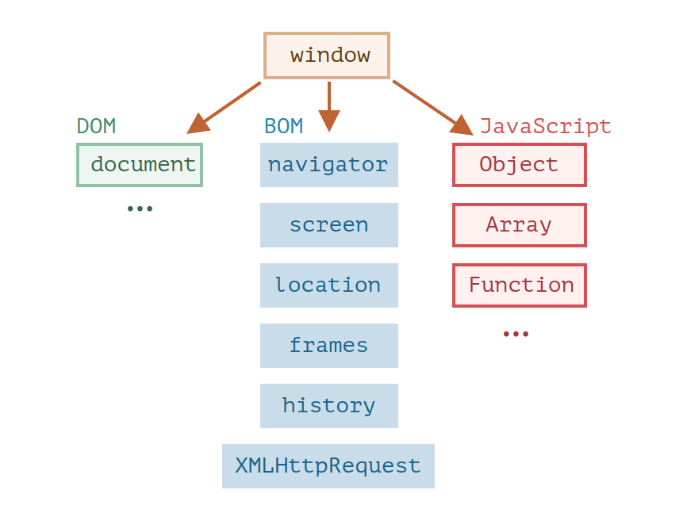

- There’s a “root” object called **window**. It has two roles:

  1. First, it is a `global object` for JavaScript code.

     ```js
     function sayHi() {
       alert('Hello');
     }

     // global functions are methods of the global object:
     window.sayHi();
     // same as
     sayHi();
     ```

  2. Second, it represents the “browser window” and provides methods to control it.

     ```js
     alert(window.innerHeight); // inner window height
     ```

---

## Document Object Model (DOM)

> The Document Object Model represents all page content as objects that can be modified.
>
> - The **document** object is the main “entry point” to the page. We can change or create anything on the page using it.

- `Dom` is not a part of `javascript` language, it is a part of `browser` environment -> `Web API`

### Object Model

is a group of objects, each of which represent related things from the real world. Together they form a model of something larger.

- **BOM (Browser Object Model)**: contains objects that represent the current `browser window` or `tab`. It contains objects that model things like `browser history` and the `device's screen`.
  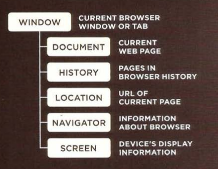

  - `window object` is treated as the default object if nothing is specified. ex: `alert()` is used instead of `window.alert()`

    - this is as if a property or a method is not found, javascript looks it up in the `window` object:
      - ex:
        - `document` property in `document.getElementBy...` instead of `window.document.getElementBy...`
        - `console.log()` method instead of `window.console.log()`

    ```js
    let gLet = 5;
    alert(window.gLet); // undefined (doesn't become a property of the global object)
    ```

    ```js
    // make current user information global, to let all scripts access it
    window.currentUser = {
      name: 'John'
    };

    // somewhere else in code
    alert(currentUser.name); // John

    // or, if we have a local variable with the name "currentUser"
    // get it from window explicitly (safe!)
    alert(window.currentUser.name); // John
    ```

- **DOCUMENT OBJECT MODEL**:

  - It's an interface that allows Javascript to interact with the HTML content of a webpage in browsers.
    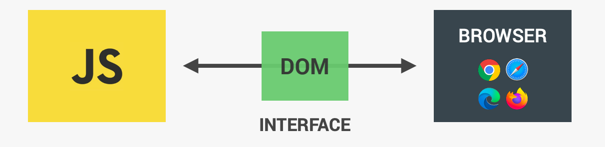
  - It's a structured representation of an HTML document. Allowing javascript to **access**, **manipulate** and **delete** HTML elements; set **styles**, **attributes**; **listen** and **respond** to events.
    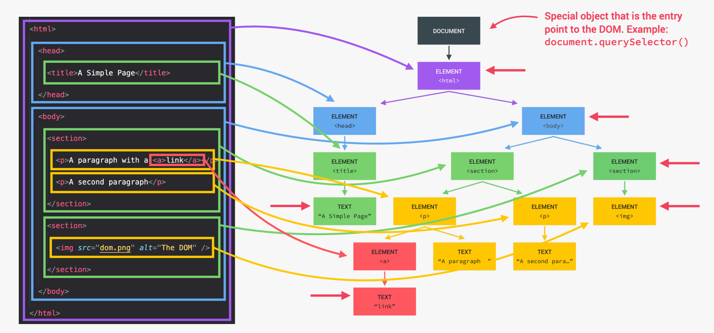
  - uses objects to create a representation of the current page. It creates a new object for each element (and each individual section of text) within the page.
    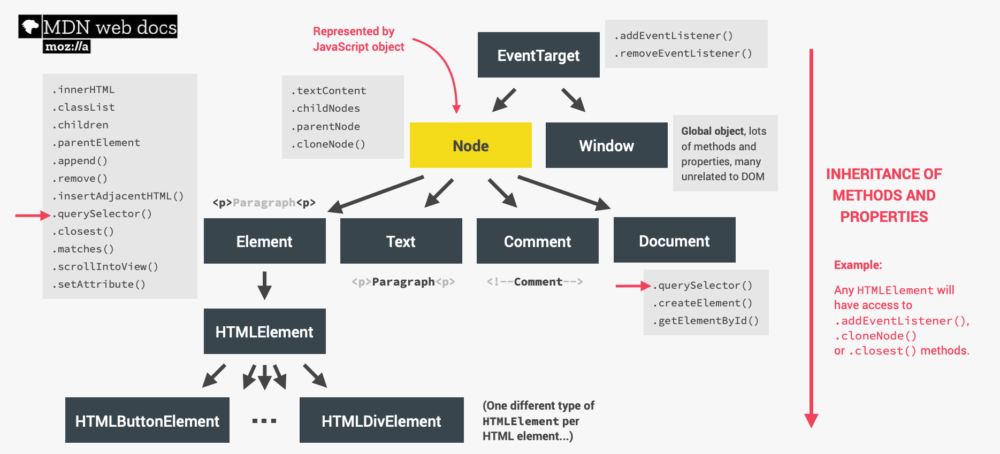

  - specifies how browsers should create a model of an HTML page and how JavaScript can access and update the contents of a web page while it is in the browser window.
  - The DOM is not a part of HTML or Javascript, It's a part of the **WEB APIs**, and it contains lots of methods and properties that we can use to interact with the DOM tree.
    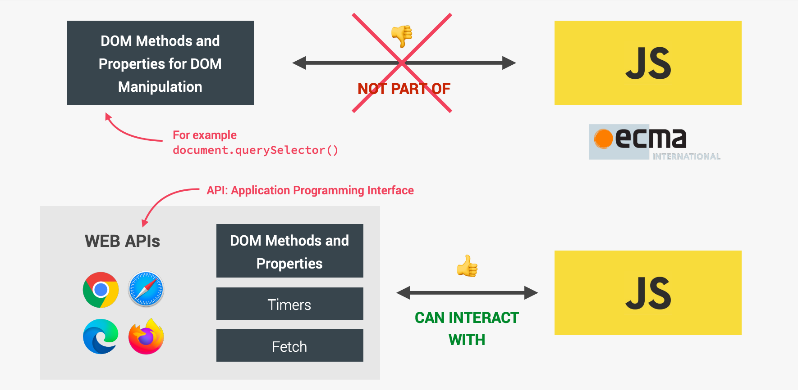
  - The DOM is called an object model because the model (the DOM tree) is made of objects.

    - All these objects are accessible using JavaScript, and we can use them to modify the page.
    - The topmost tree nodes are available directly as `document` properties:
    - For example:
      - `<html>` = `document.documentElement`
      - `<body>` = `document.body`
      - `<head>` = `document.head`
    - In the DOM-world, `null` means “doesn’t exist” or “no such node”.

  - **Autocorrection:**

    - If the browser encounters malformed HTML, it automatically corrects it when making the DOM.
    - For instance, the top tag is always `<html>`. Even if it doesn’t exist in the document, it will exist in the DOM, because the browser will create it. The same goes for `<body>`.

  - **Node Types:**

    - Tags become element nodes and form the structure of the DOM tree.
    - There are 12 node types. In practice we usually work with 4 of them:
      - `document` – the “entry point” into DOM.
      - `element nodes` – HTML-tags, the tree building blocks.
      - `text nodes` – contain text.
      - `comments` – sometimes we can put information there, it won’t be shown, but JS can read it from the DOM.
        - If we have a comment-node, labeled as `#comment`, between two text nodes. We may think – why is a comment added to the DOM? It doesn’t affect the visual representation in any way. But there’s a rule -> **"if something’s in HTML, then it also must be in the DOM tree"**.

  - > The DOM an Application Programming Interface (**API**). User interfaces let humans interact with programs; APls let programs (and scripts) talk to each other. The DOM states what your script can "ask the browser about the current page, and how to tell the browser to update what is being shown to the user

- **GLOBAL JAVASCRIPT OBJECTS**: represent things that the JavaScript language needs to create a model of. For example, there is an object that deals only with dates and times.

  - The names of the global objects usually start with a capital letter, e.g., `String`, `Date`, `Math` objects

  - allows us to make `javascript` interact with the browser by creating a model of the page and stores it **in memory**
  - `DOM-Tree` is generated from HTML document which we can interact with

  > WEB BROWSERS ARE PROGRAMS BUILT USING OBJECTS (**window-object** , **document-object**)
  > 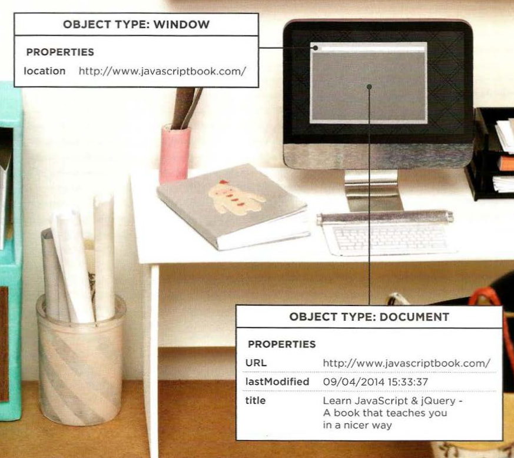
  >
  > - The browser represents each window or tab using a window object. The location property of the window object will tell you the URL of the current page.
  > - The current web page loaded into each window is modelled using a document object.

---

### Steps for creating an element

**DOM manipulation**: refers to using a set of methods and properties to access, create, and update elements and text nodes. (If you have to make a lot of changes to the content of a page, it is slower than `innerHTML`. )

- when we store elements in variables, we're really storing the **location** of the element in the DOM tree in the variable, the properties and methods of that element node work on the variable
  - this saves the browser from looking through the DOM tree to find the same element again. this is known as **caching the selection**

```javascript
//------------------------Create element------------------------//
const element = document.createElement('.div');
message.classList.add('cookie-message');
// or
message.className = 'cookie-message';

//----------------------------Content----------------------------//
message.textContent = 'We use cookied for improved functionality and analytics.';
// or
message.innerHTML =
  'We use cookied for improved functionality and analytics. <button class="btn btn--close-cookie">Got it!</button>';

//---------------inserting element in the document---------------//
header.append(message); // inside the element (will be a its child)
// or
header.insertAdjacentHTML('beforeend', message);
// or
header.before(message); // before the element (will be a sibling not a child)

//--------------Removing element from the document--------------//
message.remove();
```

- Notes:

  - if you inserted a text-node with `<` or `>` like:

    ```html
    <div id="div"></div>
    <script>
      div.before('<p>Hello</p>', document.createElement('hr'));
    </script>
    ```

  - then the text is inserted “as text”, not “as HTML”, with proper escaping of characters such as `<`, `>`. So the final HTML is:

    ```js
    &lt;p&gt;Hello&lt;/p&gt;
    <hr />
    <div id="div"></div>
    ```

  - if we want to move an element to another place – there’s no need to remove it from the old one.

    - All insertion methods automatically remove the node from the old place.

      ```html
      <div id="first">First</div>
      <div id="second">Second</div>
      <script>
        // no need to call remove
        second.after(first); // take #second and after it insert #first
      </script>
      ```

---

### `insertAdjacentHTML()`

- parses a piece of HTML-string and inserts the resulting nodes into the DOM tree at a specified position same manner as `elem.innerHTML`

  ```js
  // elem.insertAdjacentHTML(where, htmlEl);
  listEl.insertAdjacentHTML('afterbegin', '<li>HTML</li>');
  ```

  

---

### DOM collections: (`HTMLCollection` vs `NodeList`)

- Both interfaces are collections of DOM nodes. They differ in the methods they provide and in the type of nodes they can contain.
  | HTMLCollection | NodeList |
  | ------------------------------------------------------------------------ | ---------------------------------------------------------- |
  | supposed to only contain Element nodes | can contain any node type ( including text nodes ) |
  | HTMLCollection items can be accessed by their `name`, `id`, or `index number`. | NodeList items can only be accessed by their `index number`. |
  | HTMLCollection is always a **live collection**, when your script updates the page, the NodeList is updated at the same time. | NodeList is most often a **static collection**, If the script changes the content of the page, the NodeList is not updated to reflect those changes |
  | `getElementsByClassName()` `getElementsByTagName()` `children` | `querySelectorAll()` `childNodes` |

- **Notes:**

  - It’s iterable -> we can use `for..of` to iterate over it

    - Don’t use `for..in` to loop over collections, as it iterates over all enumerable properties. And collections have some “extra” rarely used properties that we usually do not want to get

  - For **NodeLists**, some Array methods won’t work, because it’s not an array

    - We can use `Array.from` to create a “real” array from the collection, if we want array methods:

      ```js
      alert(Array.from(document.body.childNodes).filter(=> ...)); // function
      ```

  - DOM collections are read-only
    - We can’t replace a child by something else by assigning `childNodes[i] = ....`

---

### Node.cloneNode()

- The `cloneNode()` method creates a copy of a node, and returns the clone.
- The `cloneNode()` method clones all attributes and their values.
- Set the `deep` parameter to `true` if you also want to clone descendants (children).

```javascript
let p = document.getElementById('para1');
let p_prime = p.cloneNode(true);
```

---

### DOM Traversing

It's a way to navigate between elements in the DOM tree based on their relationship to each other.

- Traversing the DOM can be difficult because some browsers add a **text node** whenever they come across **whitespace** between elements.
  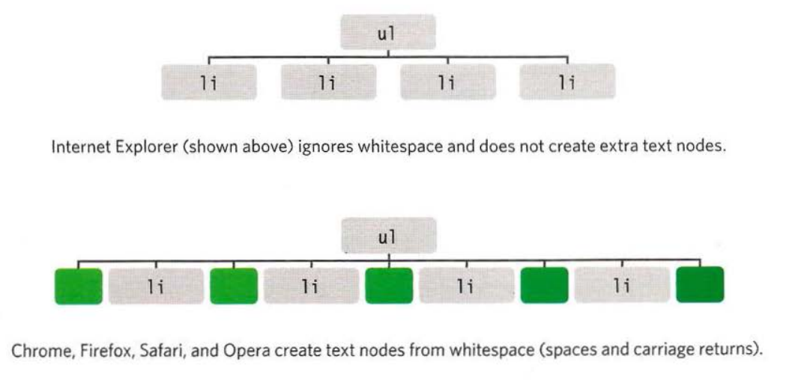

- **Siblings and the parent**

  ```js
  // parent of <body> is <html>
  alert(document.body.parentNode === document.documentElement); // true

  // after <head> goes <body>
  alert(document.head.nextSibling); // HTMLBodyElement

  // before <body> goes <head>
  alert(document.body.previousSibling); // HTMLHeadElement
  ```

- **Element-only navigation**

  - Standard properties include all nodes (text, element, comment).

  - navigation links that only take element nodes into account:

    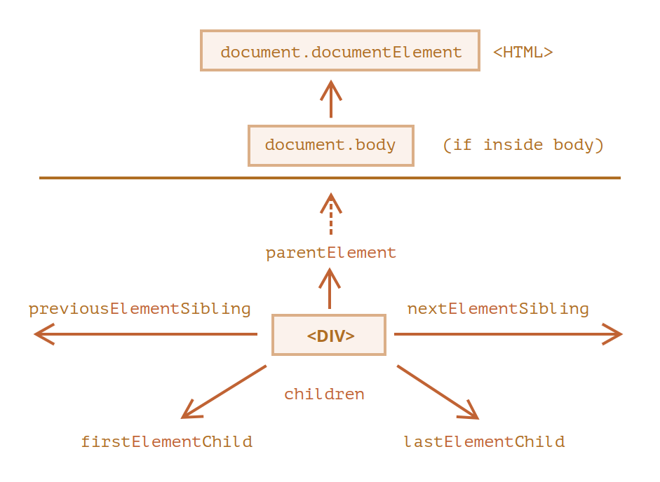

- **Closest parent**

  - The `closest` method looks up the DOM tree and returns the first element that matches the selector.
  - It's instead of going up the tree multiple times with `parentNode`.

    ```html
    <div id="elem">
      <div class="page">
        <div class="content">
          <div class="button">Click me</div>
        </div>
      </div>
    </div>

    <script>
      let elem = document.getElementById('elem');
      let button = elem.querySelector('.button');

      // the closest ancestor that has class "page"
      let page = button.closest('.page');
      alert(page.className); // page
    </script>
    ```

---

### Searching: `getElement(s)By*`, `querySelector*`

There are many methods to search for nodes in the DOM tree: by their `id`, `tag`, `class`, etc.

- **Methods**:
  

  - `document.getElementById(id)`: Returns the element with the specified `id`.
    - The `id` must be unique.
  - `document.getElementsByTagName(name)`: Returns a `NodeList` of elements with the specified tag name.
  - `document.getElementsByClassName(name)`: Returns a `NodeList` of elements with the specified class name.
  - `document.getElementsByName(name)`: Returns a `NodeList` of elements with the specified name attribute.
  - `document.querySelector(selectors)`: Returns the first element matching the specified CSS selector(s).
  - `document.querySelectorAll(selectors)`: Returns a static `NodeList` of elements matching the specified CSS selector(s).

- **Notes**:
  - The "`s`" letter is absent in `getElementById` because it returns a single element. Methods like `getElementsByTagName` return collections, hence the "`s`".
  - `elem.matches(css)`: Checks if `elem` matches the given CSS selector.
  - `elem.closest(css)`: Finds the nearest ancestor (including `elem` itself) matching the given CSS selector.

---

## Node properties: type, tag and contents

Different DOM nodes may have different properties. For instance, an element node corresponding to tag `<a>` has link-related properties, and the one corresponding to `<input>` has input-related properties and so on. Text nodes are not the same as element nodes. But there are also common properties and methods between all of them, because all classes of DOM nodes form a single hierarchy.

- For DOM elements
  - `console.log(elem)`: shows the element DOM tree
  - `console.log(elem)`: shows the element as a DOM object, good to explore its properties.
  - For instance, if the tag is `<body id="page">`, then the DOM object has `body.id="page"`.

### `innerHTML` vs `innerText`

- `innerHTML`

  - allows to get the HTML inside the element as a string.
  - only valid for element nodes.
    - Other node types, such as text nodes, have their counterpart: `nodeValue` and `data` properties.
  - lets you work with HTML rich text (in HTML format) and doesn't automatically encode and decode text and doesn't apply `css` related to the text (if a word was hidden by css then it won't be included in the innerHTML).
  - "`innerHTML+=`" does a full overwrite

    ```js
    elem.innerHTML += "...";
    // is a shorter way to write:
    elem.innerHTML = elem.innerHTML + ".
    ```

  - > **Scripts don’t execute:** If `innerHTML` inserts a `<script>` tag into the document – it becomes a part of HTML, but doesn’t execute.

- `outerHTML`

  - contains the full HTML of the element. That’s like (innerHTML plus the element itself).
  - unlike `innerHTML`, writing to `outerHTML` does not change the element. Instead, it replaces it in the DOM.

    ```html
    <div>Hello, world!</div>

    <script>
      let div = document.querySelector('div');
      // replace div.outerHTML with <p>...</p>
      div.outerHTML = '<p>A new element</p>'; // here is what happens:
      /*
       1. div was removed from the document.
       2. Another piece of HTML <p>A new element</p> was inserted in its place.
       3. div still has its old value. The new HTML wasn’t saved to any variable.
      */

      alert(div.outerHTML); // <div>Hello, world!</div> (**)
    </script>
    ```

- `innerText` retrieves and sets the content of the tag as plain text with applying `css`
- `textContent` provides access to the text inside the element: only text, **minus all `<tags>`**.
  - In most cases, we expect the text from a user, and want to treat it as text. We don’t want unexpected HTML in our site. An assignment to `textContent` does exactly that.

---

### HTML attributes

In HTML tags may have attributes. The browser recognizes **standard attributes** and creates DOM properties from them.

- when an element has `id` or another **standard attribute**, the corresponding property gets created. But that doesn’t happen if the attribute is **non-standard**.

  - if an attribute is **non-standard**, there won’t be a DOM-property for it.

  ```html
  <body id="test" class="container" something="non-standard">
    <script>
      // standard attribute yields a property
      alert(document.body.id); // test ✅
      alert(document.body.className); // container ✅

      // non-standard attribute does not yield a property
      alert(document.body.something); // undefined ❌
    </script>
  </body>
  ```

- All attributes (standard and non-standard) are accessible by using the following methods:

  - `elem.hasAttribute(name)`
  - `elem.getAttribute(name)`

    ```html
    <body something="non-standard">
      <script>
        alert(document.body.getAttribute('something')); // non-standard
      </script>
    </body>
    ```

  - `elem.setAttribute(name, value)`
  - `elem.removeAttribute(name)`
  - `elem.attributes` : a collection of objects that belong to a built-in Attr class, with name and value properties.

- HTML attributes have the following features:
  - Their name is case-insensitive (`id` is same as `ID` or `Id`).
  - Their values are always strings.
- Note:

  - **Attributes** – is what’s written in HTML.
  - **Properties** – is what’s in DOM objects.

- to get a non standard Attribute :

  - Before you work with an attribute, it is good practice to check whether it exists. This will save resources if the attribute cannot be found. -> `.hasAttribute()`

  ```js
  const designer = logo.getAttribute('designer'); // returns the value of the "designer" attribute,
  // also you can set an Attribute
  logo.setAttribute('company', 'Bankist'); //(attribute_name,value)
  ```

- Difference between getting an attribute through `getAttribute` and `element.attribute`:

  - `src` attribute

    - `element.src` returns the full URL, while `element.getAttribute('src')` returns the URL as it was written in the HTML.

      ```html
      

      <script>
        let logo = document.getElementById('logo');
        alert(logo.src); // full URL -> http://127.0.0.1:5500/images/logo.png
        alert(logo.getAttribute('src')); // relative URL -> images/logo.png
      </script>
      ```

  - `href` attribute

    - `element.href` returns the full URL, while `element.getAttribute('href')` returns the URL as it was written in the HTML.

      ```html
      <a href="#" id="link">link</a>

      <script>
        let link = document.getElementById('link');
        alert(link.href); // full URL -> http://example.com/#
        alert(link.getAttribute('href')); // relative URL -> #
      </script>
      ```

#### Property-attribute synchronization

When a standard attribute changes, the corresponding property is auto-updated, and (with some exceptions) vice versa.

- for example, `id` is auto updated

  ```js
  let input = document.querySelector('input');

  // attribute => property
  input.setAttribute('id', 'id');
  alert(input.id); // id (updated)

  // property => attribute
  input.id = 'newId';
  alert(input.getAttribute('id')); // newId (updated)
  ```

- But there are exclusions, for instance `input.value` synchronizes only from `attribute → property`, but not back:

  ```js
  let input = document.querySelector('input');

  // attribute => property
  input.setAttribute('value', 'text');
  alert(input.value); // text

  // NOT property => attribute
  input.value = 'newValue';
  alert(input.getAttribute('value')); // text (not updated!)
  ```

---

#### Creating connection with non-standard attributes

Sometimes `non-standard` attributes are used to pass custom data from HTML to JavaScript, or to “mark” HTML-elements for JavaScript.

- Also they can be used to style an element.

  ```html
  <style>
    /* styles rely on the custom attribute "order-state" */
    .order[order-state='new'] {
      color: green;
    }

    .order[order-state='pending'] {
      color: blue;
    }

    .order[order-state='canceled'] {
      color: red;
    }
  </style>

  <div class="order" order-state="new">A new order.</div>
  <div class="order" order-state="pending">A pending order.</div>
  <div class="order" order-state="canceled">A canceled order.</div>
  ```

##### `data-` Attributes

It's a standard way to store custom data in HTML, and it's a good practice to use `data-*` attributes for custom data.

- All attributes starting with `data-` are reserved for programmers’ use. They are available in the `dataset` property.

  ```html
  <body data-about="Elephants">
    <script>
      alert(document.body.dataset.about); // Elephants
    </script>
  </body>
  ```

  - MultiWord attributes like `data-order-state` become **camel-cased**: `dataset.orderState`.

---

## Styles and classes

### Element Style

The property `elem.style` is an **object** that corresponds to what’s written in the "`style`" attribute **(inline styles)**.

- **Reading style values:**

  - `elem.style` only reflects **inline styles**, not CSS classes.

    ```js
    alert(document.body.style.color); // ⚠️ empty, even if color is set in CSS through a class
    ```

  - Use `getComputedStyle()` to read/change styles based on computed values.

    ```js
    let computedStyle = getComputedStyle(document.body);
    alert(computedStyle.marginTop); // 5px
    ```

  - For multi-word property the `camelCase` is used:

    ```js
    background-color  => elem.style.backgroundColor
    z-index           => elem.style.zIndex
    ```

  - **Computed vs. Resolved values:**
    - `Computed style`: Value after CSS rules and inheritance (e.g., `height: 1em`).
    - `Resolved style`: Final applied value with fixed units (e.g., `height: 20px`).
  - `getComputedStyle` returns resolved values, usually in `px` for geometry.

- **Writing style values:**

  - `elem.style.property = value` : to change a style, assign a new value to a property.

    ```js
    document.body.style.backgroundColor = 'red';
    document.body.style.width = '100px'; // string with units
    ```

  - To change a **(CSS variable value)** in the `:root` element, use the `documentElement` as the target, and `setProperty` method to change the value:

    ```js
    document.documentElement.style.setProperty('--color-primary', 'orangered');
    ```

  - `cssText` property

    - This property is rarely used, because such assignment removes all existing styles: it does not add, but replaces them.

    ```js
    // we can set special style flags like "important" here
    element.style.cssText = `
      color: red !important;
      background-color: yellow;
      width: 100px;
      text-align: center;
    `;
    // or using (setAttribute)
    element.setAttribute('style', 'color:red; height:50px; ...');
    ```

---

### Element Classes

In javascript, classes are represented by the `classList` object. It provides methods to add, remove and toggle classes. or a `cl

- `className`

  - `className` was introduced because `class` was a reserved word in JavaScript.
  - `elem.className` corresponds to the `class` attribute.

    ```html
    <body class="main page">
      <script>
        alert(document.body.className); // main page
      </script>
    </body>
    ```

  - Assigning to `elem.className` replaces all classes.

- `classList`:

  - It's a special object to manage classes.

    ```html
    <body class="main page">
      <script>
        document.body.classList.add('article');
        alert(document.body.className); // main page article
      </script>
    </body>
    ```

  - Methods of `classList`:

    - `add/remove("class")`: Adds/removes a class.
    - `toggle("class")`: Adds
      if absent, removes if present.
    - `contains("class")`: Checks for a class, returns `true`/`false`.

  - Iterable: Use `for..of` to list all classes.

    ```html
    <body class="main page">
      <script>
        for (let name of document.body.classList) {
          alert(name); // main, page
        }
      </script>
    </body>
    ```

---

## Element/Window size and scrolling

### Geometry Properties (element size)

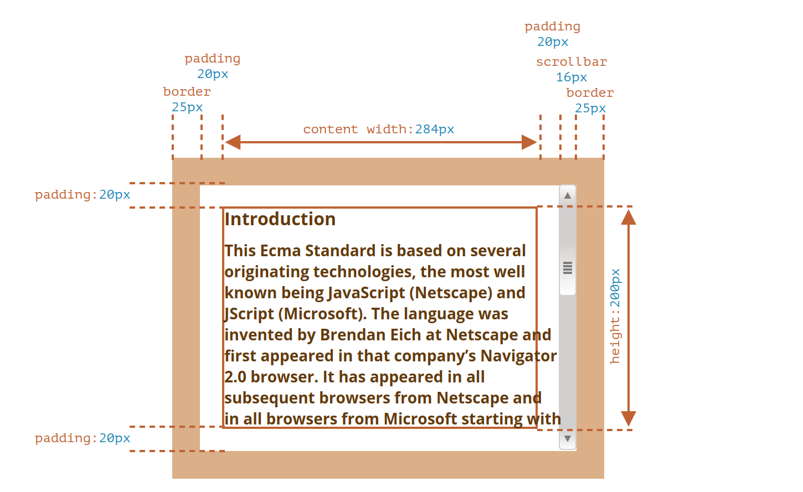
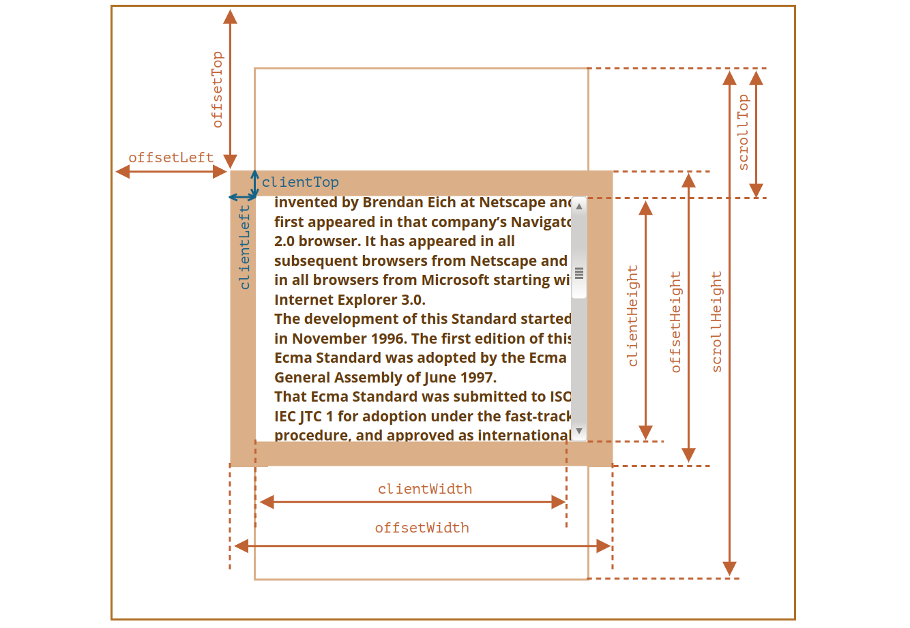

- **offsetParent**

  - Properties `offsetLeft`/`offsetTop` provide x/y coordinates relative to `offsetParent` upper-left corner

    ```html
    <main style="position: relative" id="main">
      <article>
        <div id="example" style="position: absolute; left: 180px; top: 180px">...</div>
      </article>
    </main>
    <script>
      alert(example.offsetParent.id); // main
      alert(example.offsetLeft); // 180 (note: a number, not a string "180px")
      alert(example.offsetTop); // 180
    </script>
    ```

  - There are several occasions when `offsetParent` is `null`:
    - For not shown elements (`display:none` or not in the document).
    - For `<body>` and `<html>`
    - For elements with `position:fixed`

- Geometry properties are `zero`/`null` for elements that are not displayed

  ```js
  function isHidden(elem) {
    return !elem.offsetWidth && !elem.offsetHeight;
  }
  ```

- **clientWidth/Height**

  - These properties provide the size of the area **inside** the element borders. They include the content width together with paddings, but without the scrollbar
    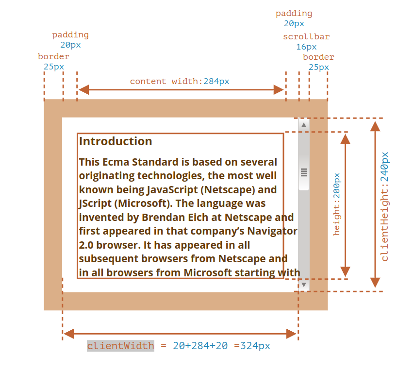
    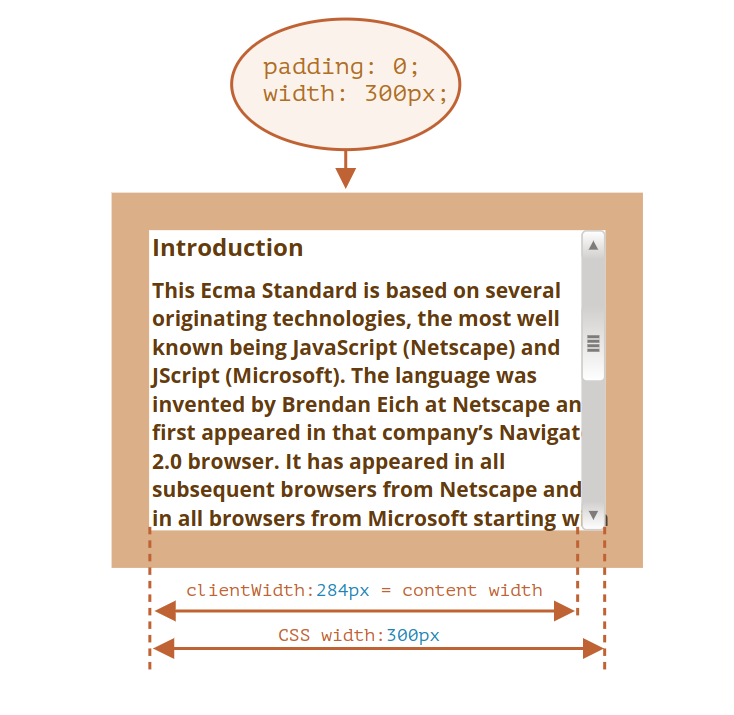

- **scrollWidth/Height**

  - These properties are like clientWidth/clientHeight, but they also include the scrolled out (hidden) parts
    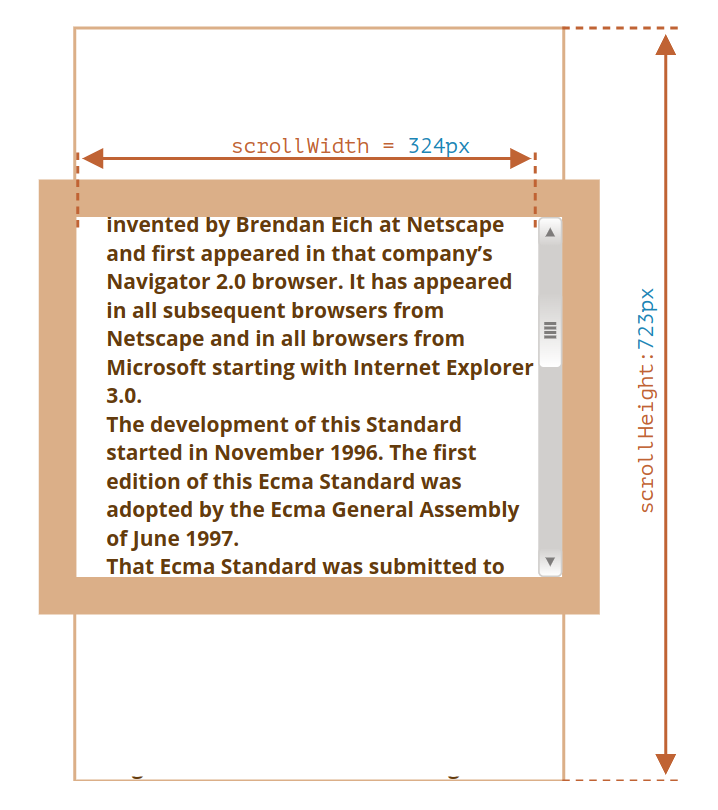
  - We can use these properties to expand the element wide to its full width/height.

    ```js
    // expand the element to the full content height
    element.style.height = `${element.scrollHeight}px`;
    ```

- **scrollLeft/scrollTop**

  - Properties `scrollLeft`/`scrollTop` are the `width`/`height` of the hidden, scrolled out part of the element.
    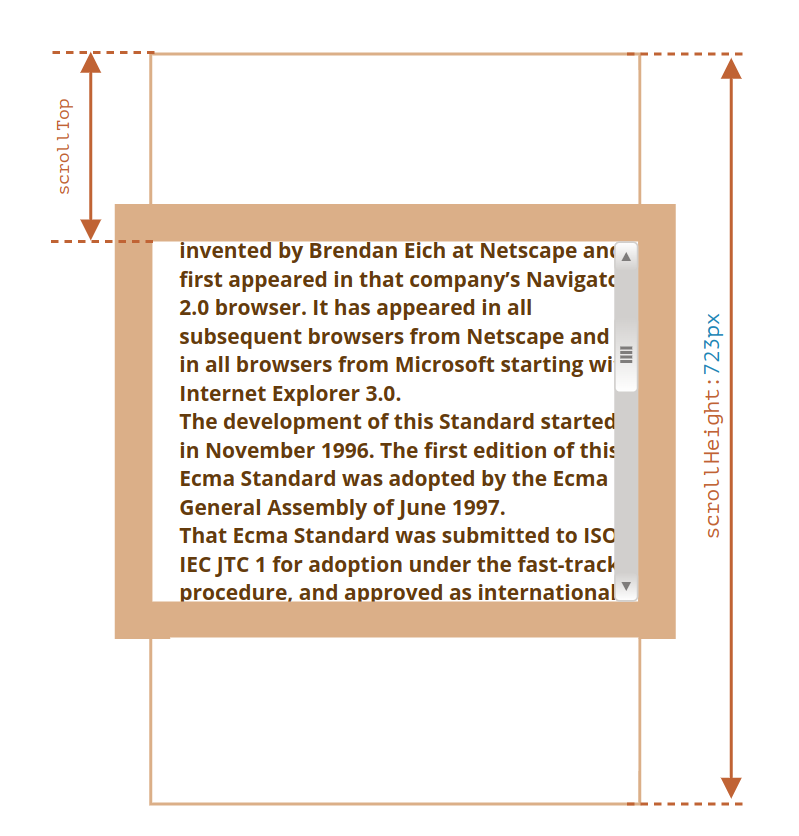
    - In other words, `scrollTop` is “how much is scrolled up”.
  - `scrollLeft`/`scrollTop` can be modified
  - to get size of the bottom scroll:

    ```js
    let scrollBottom = elem.scrollHeight - elem.scrollTop - elem.clientHeight;
    ```

> Note: **Don’t take width/height from CSS**
>
> - as we know. we can read CSS-height and width using `getComputedStyle`. So why not to read the width of an element with `getComputedStyle`?
> - Why should we use geometry properties instead? There are two reasons:
>   - First, CSS width/height depend on another property: **box-sizing** that defines “what is” CSS width and height. A change in box-sizing for CSS purposes may break such JavaScript.
>   - Second, CSS width/height may be **'auto'**, for instance for an inline element:
>   - third, a **scrollbar**. Sometimes the code that works fine without a scrollbar becomes buggy with it, because a scrollbar takes the space from the content in some browsers. So the real width available for the content is less than CSS width. And `clientWidth`/`clientHeight` take that into account.
>     - But with `getComputedStyle(elem).width` the situation is different. Some browsers (e.g. **Chrome**) return the real inner width, minus the scrollbar, and some of them (e.g. **Firefox**) – CSS width (ignore the scrollbar).
>       - That’s because Firefox returns the CSS width and other browsers return the “real” width.
>     - Such cross-browser differences is the reason not to use `getComputedStyle`, but rather rely on **geometry properties**.

---

### Window sizes

- We use the root document element `document.documentElement`, that corresponds to the `<html>` tag to:
  - find the width and height of the browser window
  - get the full width and height of the document
  - scroll the page using JavaScript
- **clientWidth/clientHeight**
  - To get window width and height
    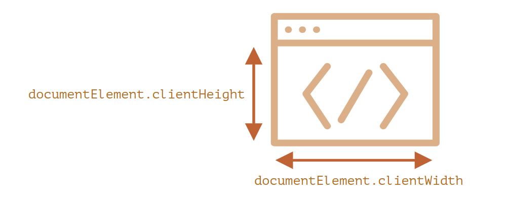
  - If there exists a scrollbar, and it occupies some space, `clientWidth`/`clientHeight` provide the width/height without it (subtract it). In other words, they return the width/height of the visible part of the document, available for the content.
    - > unlike **`window.innerWidth/innerHeight`** which includes the scrollbar.
  - In most cases, we need the available window width in order to draw or position something within scrollbars (if there are any), so we should use **`documentElement.clientHeight/clientWidth`**.
- **Width/height of the document**

  - as the root document element is `document.documentElement`, and it encloses all the content
  - To reliably obtain the full document height, we should take the maximum of these properties:

    ```js
    let scrollHeight = Math.max(
      document.body.scrollHeight,
      document.documentElement.scrollHeight,
      document.body.offsetHeight,
      document.documentElement.offsetHeight,
      document.body.clientHeight,
      document.documentElement.clientHeight
    );

    alert('Full document height, with scrolled out part: ' + scrollHeight);
    ```

- **Get the current scroll**

  - For document scroll, `document.documentElement.scrollLeft/scrollTop` works in most browsers, except older
  - but the scroll is available in the special properties, **`window.pageXOffset/pageYOffset`**:

    ```js
    alert('Current scroll from the top: ' + window.pageYOffset);
    alert('Current scroll from the left: ' + window.pageXOffset);
    ```

  - Also available as `window` properties `scrollX` and `scrollY`
    - `window.pageXOffset` is an alias of `window.scrollX`
    - `window.pageYOffset` is an alias of `window.scrollY`

---

### Coordinates of Elements

- **Coordinate Systems**:
  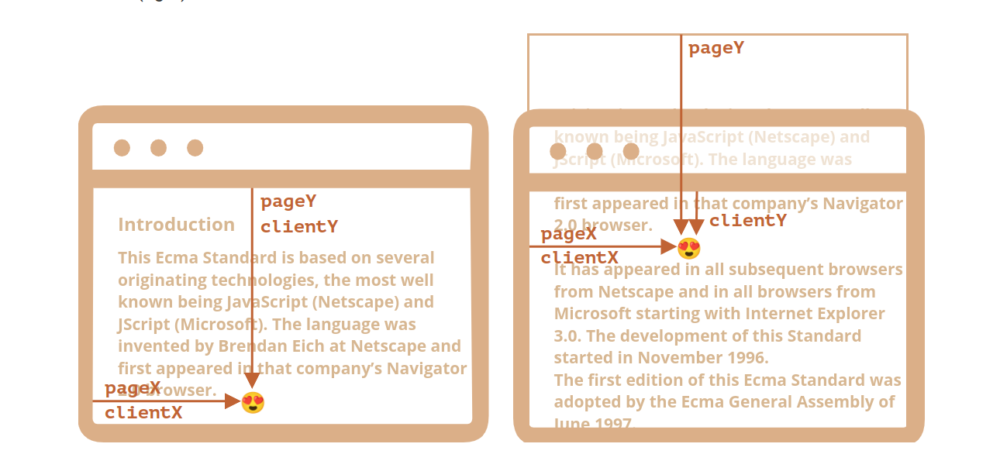

  1. **Window-relative** (`clientX`/`clientY`): From the window's top/left edge.
  2. **Document-relative** (`pageX`/`pageY`): From the document's top/left edge.

- **Element Coordinates: `getBoundingClientRect`**:
  - `elem.getBoundingClientRect()`: Returns the coordinates of the element's bounding rectangle relative to the browser's `window` as a `DOMRect` object.
  - Main properties: [`x`, `y`, `width`, `height`, `top`, `bottom`, `left`, `right`].
    - Window-relative coordinates change with scrolling.
    - Coordinates can be decimal fractions or negative.

---

### Scrolling

> **Note**: Ensure the DOM is fully built before scrolling with JavaScript.

- **OLD WAY**: Use `scrollTop`/`scrollLeft` or:

  - `scrollBy(x,y)`: Scrolls relative to current position.
  - `scrollTo(pageX,pageY)`: Scrolls to absolute coordinates.

    ```js
    window.scrollBy(0, 10); // scroll down by 10px
    window.scrollTo(0, 10); // scroll to the 10th pixel from the top
    ```

  - `scrollTo` with options:

    ```js
    window.scrollTo({ top: 10, left: 0, behavior: 'smooth' }); // smooth scroll with animation
    ```

- **NEW WAY**: `scrollIntoView`

  - `elem.scrollIntoView(top)`: Scrolls to make element visible.

    - `top=true` (default): Aligns element with the window top.
    - `top=false`: Aligns element with the window bottom.

    ```js
    elem.scrollIntoView(true); // scroll to make elem visible at the top
    ```

  - Prefer `scrollIntoView` for ease and user-friendliness instead of calculating coordinates in `scrollBy`/`scrollTo`.

    ```js
    document.querySelector('.section--1').scrollIntoView({ behavior: 'smooth' });
    ```

- **Forbid Scrolling**

  - To make the document unscrollable:

    ```js
    document.body.style.overflow = 'hidden'; // prevent scrolling
    document.body.style.overflow = ''; // enable scrolling
    ```

  - ⚠️ Note: To avoid content jump when scrollbar disappears, add padding to `document.body`.

---

### Intersection observer

It's a browser API that allows you to **detect when an element is visible in the viewport**. It's useful for lazy loading images, infinite scrolling, and more.

> [More Info](https://blog.arnellebalane.com/the-intersection-observer-api-d441be0b088d)

- It allows for **observing changes to how much of a `target` element’s area intersects with that of another element or the `viewport`**.
  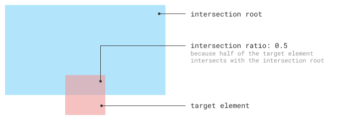

- **Use Cases**: Lazy-loading, infinite scrolling.
- **Efficient**: Replaces the `scroll` event on `window`.

- By default, the Intersection Observer API uses the **viewport** as the **intersection root**, and only executes the callback when the target element enters and exits the viewport.
  
- A `threshold` is a value in which the Intersection Observer will execute the callback function whenever the intersection ratio reaches that value (the percentage of the target element that is visible in the intersection root).
  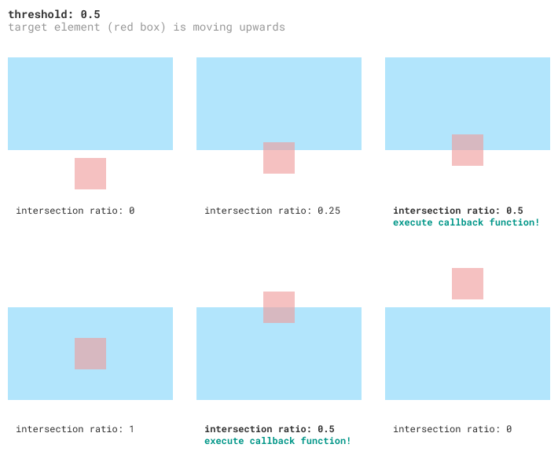
  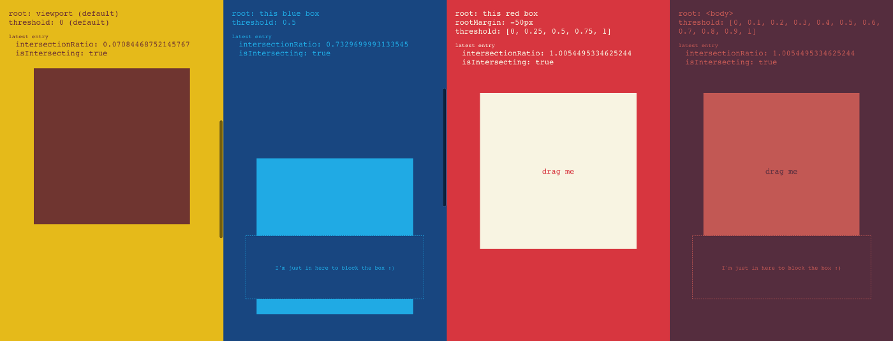

  - It is also possible to set multiple threshold values by passing an array of threshold values in the `options` object.

  ```js
  const options = {
    threshold: [0, 0.25, 0.5, 0.75, 1]
  };
  const observer = new IntersectionObserver(handlerFunction, options);
  // executes the callback function when the target element enters/exits the intersection root (i.e. intersection ratio of 0), then again when its intersection ratio crosses 0.25, then 0.5, etc.
  ```

- **Creating an Intersection Observer**:

  ```js
  const observer = new IntersectionObserver(function (changes, observer) {
    // do something with the changes   });
  });

  // Use the observer to observe a target element
  observer.observe(targetElement);
  ```

- The `callback function`, when executed, is automatically passed with:
  - array of `entries`, which are objects that contain information about the intersection between the target element and the intersection root.
  - the `observer` object itself. which can be used to unobserve the target element.
- it is possible to adjust the intersection root’s rectangle by setting `root margin`

---

#### Examples of using the Intersection Observer API

- **Sticky navigation**:

  ```js
  const nav = document.querySelector('.nav'); // selecting the nav element that we want to make sticky
  const navHeight = nav.getBoundingClientRect().height; // to get the exact height without hard-coding it (instead of writing "-90px")

  // callback function
  const stickyNavHandler = function (entries) {
    const [entry] = entries; // destructuring : same as entry =  entries[0]

    // if the entry is not intersecting (i.e. the target element is not visible in the viewport), make the nav sticky, otherwise remove the sticky class
    if (!entry.isIntersecting) nav.classList.add('sticky');
    else nav.classList.remove('sticky');
  };

  const headerObserver = new IntersectionObserver(stickyNavHandler, {
    root: null, // as we are observing the viewport
    threshold: 0, // from intersection ratio
    rootMargin: `-${navHeight}px` //(instead of writing "-90px")
  });

  headerObserver.observe(header);
  ```

- **Lazy Loading Images**

  ```js
  const imgTargets = document.querySelectorAll('img[data-src]');

  const loadImg = function (entries, observer) {
    const [entry] = entries;

    if (!entry.isIntersecting) return; // exit the function if the entry is not intersecting

    // Replace src with data-src
    entry.target.src = entry.target.dataset.src;

    // Remove the blur effect when the new high-resolution image is loaded
    entry.target.addEventListener('load', function () {
      entry.target.classList.remove('lazy-img'); // class that applies a blur effect to the image
    });

    // stop observing the target element
    observer.unobserve(entry.target);
  };

  const imgObserver = new IntersectionObserver(loadImg, {
    root: null, // as we are observing the viewport
    threshold: 0, // from intersection ratio
    rootMargin: '200px' // to load the image 200px before it appears in the viewport
  });

  imgTargets.forEach(img => imgObserver.observe(img));
  ```

- **Reveal Sections on Scroll**

  ```js
  const revealSection = function (entries, observer) {
    const [entry] = entries;

    if (!entry.isIntersecting) return; // exit the function if the entry is not intersecting

    entry.target.classList.remove('section--hidden');

    // stop observing the target element
    observer.unobserve(entry.target);
  };

  const sectionObserver = new IntersectionObserver(revealSection, {
    root: null, // as we are observing the viewport
    threshold: 0.15 // from intersection ratio
  });

  allSections.forEach(function (section) {
    sectionObserver.observe(section);
    section.classList.add('section--hidden');
  });
  ```

- **Infinite Scrolling**

  ```js
  const loadMore = function (entries) {
    const [entry] = entries;

    if (!entry.isIntersecting) return; // exit the function if the entry is not intersecting

    // Load more content
    loadMoreContent();

    // stop observing the target element
    observer.unobserve(entry.target);
  };

  const observer = new IntersectionObserver(loadMore, {
    root: null, // as we are observing the viewport
    threshold: 0, // from intersection ratio
    rootMargin: '200px' // to load more content 200px before the user reaches the bottom of the page
  });

  observer.observe(document.querySelector('.sentinel'));
  ```

---

- The `virtual DOM` is a tree based on JavaScript objects created with `React` that resembles a DOM tree. Each time you need to change something in the DOM, `React` employs a different algorithm that exclusively re-renders the DOM nodes that have changed. Meaning, `React` allows developers to write code as if the entire page is rendered on each change while in the underhood `React` ONLY renders sub-components that have actually changed.

## Virtual DOM

The Virtual DOM is an in-memory representation of the Real DOM. It is a lightweight JavaScript object that acts as a `copy` of the Real DOM.

- The `Virtual DOM` is a tree of JavaScript objects created with `React` that resembles a DOM tree.
- `React` re-renders only the DOM nodes that have changed, optimizing performance.
- Developers can write code as if the entire page is re-rendered on each change.
- The Virtual DOM abstracts real DOM operations.

### methods to compare nodes

- to compare the (content) of the 2 nodes

  ```js
  node1.isEqualNode(node2); // true/false
  ```

- checking the value (**for textNodes nodes that contains only text and not elements like `<em> or <li>`**) => [nodeValue](https://developer.mozilla.org/en-US/docs/Web/API/Node/nodeValue) is empty or not

  ```js
  node1.firstChild?.nodeValue.trim() !== '';
  ```

> **NOTE**:
> 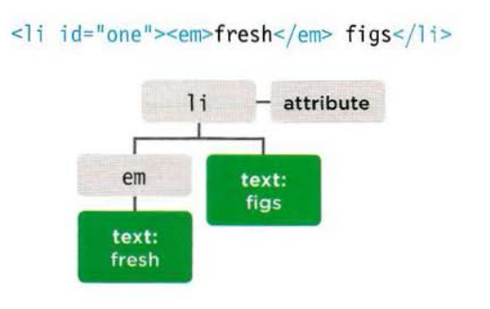
>
> - In order to use **nodeValue** property, you must be on a text node, not the element that contains the text.
> - The **textContent** property allows you to collect or update just the text that is in the containing element (and its children).

### steps

```js
// (1) create a copy of the document(DOM)
let newDOM = document.createRange();
// (2) convert the string(newMarkup) to a real-DOM-object
newDOM = newDOM.createContextualFragment(newMarkup);
// 1,2 in one step =>
const newDOM = document.createRange().createContextualFragment(newMarkup);
// now newDOM is like a big object of (virtual-DOM) that lives in memory NOT tha page

// (5) selecting all elements that lives in our virtual-DOM and converting it to an array so that we can compare it with the real-DOM
const newElements = Array.from(newDOM.querySelectorAll('*'));

// (6) selecting all elements that lives in our real-DOM and converting it to an array so that we can compare it with the virtual-DOM
const curElements = Array.from(this._parentElement.querySelectorAll('*'));

// (7) looping over the 2 arrays at the same time so that we can compare them
newElements.forEach((newEl, i) => {
  const curEl = curElements[i];

  // (8) Updates changed TEXT
  if (
    // comparing the (content) of the 2 nodes
    !newEl.isEqualNode(curEl) &&
    newEl.firstChild?.nodeValue.trim() !== ''
  ) {
    // change the part that differ in the virtual-DOM
    curEl.textContent = newEl.textContent;
  }

  // (9) Updates changed Attributes
  if (!newEl.isEqualNode(curEl))
    Array.from(newEl.attributes).forEach(attr => curEl.setAttribute(attr.name, attr.value));
});
```

---

## Events

Events signal that something has happened. All DOM nodes generate such signals.

- **DOM Events**:
  - **Mouse**: `click`, `contextmenu`, `mouseover`, `mouseout`, `mousedown`, `mouseup`, `mousemove`
  - **Keyboard**: `keydown`, `keyup`
  - **Form**: `submit`, `focus`
  - **Document**: `DOMContentLoaded`
  - **CSS**: `transitionend`

### Event Handling / Binding

- **Binding events** -> 3 ways to assign handlers:

  - **HTML Event Handlers (Bad Practice ❌)**

    ```html
    <input type="button" id="button" onclick="sayThanks()" />
    ```

    - Add parentheses `()` for the handler method
    - Browser creates a handler function from the attribute content:

      ```js
      button.onclick = function (event) {
        sayThanks(); // attribute content
      };
      ```

    - Notes:
      - Not recommended: mixes HTML and JavaScript.
      - HTML attribute names are case-insensitive: `onclick`, `ONCLICK`, `onClick`.
      - Avoid `setAttribute()` for handlers; it converts functions to strings.

  - **DOM Property Event Handlers (❌)**

    - Only one function per event.
    - Assign handler without parentheses.
    - Use `elem.onclick` (case-sensitive).

      ```js
      el.onblur = checkUsername; // no parentheses
      ```

  - **`addEventListener` ✅**

    - Syntax:

      ```js
      // element.addEventListener(event, handler, [options]);
      // element.removeEventListener(event, handler, [options]);

      // Examples
      button.addEventListener('click', () => alert('Thanks!'));
      button.removeEventListener('click', () => alert('Thanks!'), { once: true }); // remove after trigger
      ```

      - `options`: An additional optional object with properties:

        - `once`: Auto-removes after trigger.
        - `capture`: Event phase (bubbling/capturing).
        - `passive`: Prevents preventDefault.

      - Notes:

        - It's the only way that supports multiple functions per event.

          ```js
          ['click', 'load'].forEach(event => window.addEventListener(event, callback_function));
          ```

        - It's the only way that supports removing an event listener.

- `this` in callbacks:

  - if callback function is a regular function, `this` refers to the element that the event listener was attached to.
  - if callback function is an arrow function, `this` refers to the window object. So we can use `event.currentTarget` instead of `this` or use `.bind(this)`.

- Removing Event Listeners:

  - It's important to remove event listeners when they are no longer needed to prevent memory leaks.
  - Must pass the exact same function.

    ```js
    function handler() {
      alert('Thanks!');
    }
    element.addEventListener('click', handler);
    element.removeEventListener('click', handler);
    ```

- `addEventListener()` vs `onclick()`

  | Feature                   | `addEventListener`                  | `onclick`                |
  | ------------------------- | ----------------------------------- | ------------------------ |
  | Multiple events           | Yes                                 | No                       |
  | Event propagation control | Yes (third argument)                | No                       |
  | Placement                 | Only in `<script>` or external JS   | Can be an HTML attribute |
  | Browser compatibility     | Not in older IE (use `attachEvent`) | Works in all browsers    |
  | Multiple actions          | Yes                                 | No                       |
  | Non-existent elements     | Yes (e.g., `event.target`)          | No                       |

---

### The `Event` object

When an event occurs, the `event` object tells you information about the event, and the element it happened upon.

- The `event` object is passed to any function that is the event handler or listener as an argument
  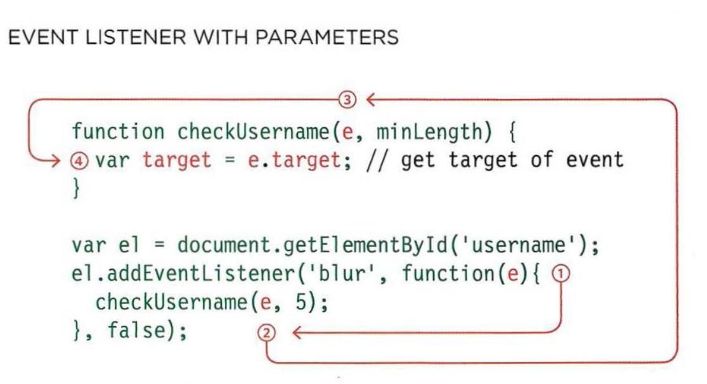

- Key Properties:
  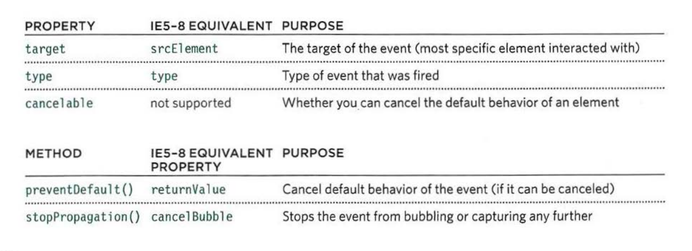

  - `event.currentTarget`: Element that handled the event (same as this in non-arrow functions).
  - `event.target`: Element that triggered the event.
  - `event.key`: Key pressed (for keyboard events).
  - `event.clientX`, `event.clientY`: Coordinates of the click in the viewport.

- `event.target` vs (`this` | `event.currentTarget`):

  - `event.target`: Element that **initiated** the event, unchanged through bubbling.

    ```js
    navEl.addEventListener('click', function (e) {
      console.log(e.target); // Clicked element
      console.log(e.currentTarget); // navEl
    });
    ```

  - `this` or `event.currentTarget`: Element with the currently running handler.

    ```js
    form.onclick = function (e) {
      console.log(this === e.currentTarget); // true
      console.log(e.currentTarget); // <form>
      console.log(e.target); // Clicked element inside the form
    };
    ```

    - unless the handler is an arrow function, or its `this` is bound to something else, then we can get the element from `event.currentTarget`

      ```js
      elem.addEventListener('click', event => {
        alert(this === event.currentTarget); // false
        alert(this); // Window (or whatever this is)
      });
      ```

- To pass arguments to an event handler, we can:

  - Use a wrapper function.

    ```js
    elem.addEventListener('click', function (e) {
      handler(e, arg1, arg2);
    });
    ```

  - Use `bind` method.

    ```js
    elem.addEventListener('click', handler.bind(null, arg1, arg2));
    ```

- **Prevent Default Action**:

---

### Event Propagation (Bubbling and capturing)

It's the process of event flow from the root element to the target element and back.

> `"Propagation"` means jumping from one element to another, visiting parents and ancestors.

- HTML elements nest. Hovering or clicking a link also affects its parent elements.

- The standard DOM Events describes 3 phases of event propagation:

  1. Capturing phase – the event goes down to the element.
  2. Target phase – the event reached the target element.
  3. Bubbling phase – the event bubbles up from the element.
     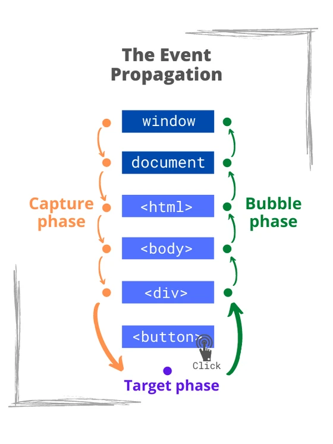

- Events flow in two directions: [Bubbling](#event-bubbling) & [Capturing](#event-capturing).
  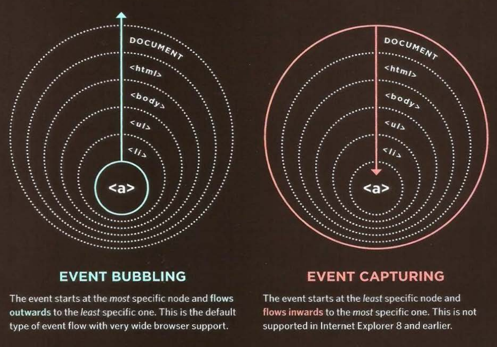

#### Event Bubbling

- Events trigger handlers on the target element, then bubble up to ancestors.

  - Most events bubble, but some like `focus` do not.

- Example: Clicking `<p>` alerts `"p"`, then `"div"`, then `"form"`.

  ```html
  <form onclick="alert('form')">
    <div onclick="alert('div')">
      <p onclick="alert('p')">P</p>
    </div>
  </form>
  ```

- **Stopping Bubbling**

  - A bubbling event goes from the target element up, calling all handlers on the path. Any handler can stop this with **`event.stopPropagation()`**.

    ```js
    elem.addEventListener('click', function (e) {
      e.stopPropagation(); // stops bubbling
    });
    ```

  - `event.stopPropagation()`: Stops the event from moving up, but other handlers on the current element will run.
  - `event.stopImmediatePropagation()`: Stops bubbling and prevents handlers on the current element from running.

  - When not to stop bubbling:

    - Nested menus: Submenus handle clicks and stop propagation to prevent outer menu triggers.
    - Analytics: Track user clicks across the window using `document.addEventListener('click', ...)`.

---

#### Event Capturing

> It is not commonly used in real code, but sometimes can be useful.

It's the opposite of bubbling. The event goes down to the element, then triggers handlers on the way up.

- the final parameter in the `addEventListener()` method lets you choose the direction to trigger events

  - `true` -> capturing phase
  - `false` -> bubbling phase (default value)

  ```js
  elem.addEventListener(..., {capture: true})
  // or, just "true" is an alias to {capture: true}
  elem.addEventListener(..., true)
  ```

---

#### Event Delegation

It's a technique to add a single event listener to a parent element to handle all events that happen inside it instead of multiple listeners to child elements.

> Creating event listeners for a lot of elements can slow down a page, but event flow allows you to listen for an event on a parent element.

- It's like that we are **delegating** the job of the event listener to a parent of the elements. because the event bubbles up to the parent element.

- **Advantages**:

  - Simplifies initialization and saves memory.
  - Improves performance with fewer event listeners.
  - Less code for adding/removing elements.
  - Easy DOM modifications.

- **Limitations**:

  - Requires bubbling events.
  - May add CPU load due to container-level handling.

- **Steps**:

  1. Add event listener to common parent.
  2. Use `e.target` to find the event origin (where it happened).
  3. Use `.closest(element)` to prevent wrong selection.
     - it returns the nearest ancestor that matches the selector.

  ```js
  // Event Delegation ✅
  tabsContainer.addEventListener('click', function (e) {
    const clickedElement = e.target.closest('.operations__tab');
    if (!clickedElement) return; // early return if clicked on other element

    // handle the event if the clicked element is the one we are looking for
    // ...
  });

  // It's instead of adding event listeners to each tab element ❌
  const tabs = document.querySelectorAll('.operations__tab');
  tabs.forEach(tab => {
    tab.addEventListener('click', function () {
      // handle the event
      // ...
    });
  });
  ```

##### `data` attribute with Event Delegation

You can use the `data-` attribute to distinguish the element with a category in order to do specific things for each category:

```html
Counter:
<input type="button" value="1" data-counter />
One more counter:
<input type="button" value="2" data-counter />

<script>
  document.addEventListener('click', function (event) {
    if (event.target.dataset.counter != undefined) {
      // if the attribute exists...increment the value on each click
      event.target.value++;
    }
  });
</script>
```

> **Note:** For **document**-level handlers – always `document.addEventListener` not `document.on<event>`, because the latter will cause conflicts: new handlers overwrite old ones.

---

### Browser Default Actions

Many events automatically lead to certain actions performed by the browser.

- ex:
  - A click on a link – initiates navigation to its URL.
  - A click on a form submit button – initiates its submission to the server.
  - Pressing a mouse button over a text and moving it – selects the text.

#### Preventing browser actions

There are two ways to tell the browser we don’t want it to act:

1. The main way is to use the `event` object. There’s a method `event.preventDefault()`.

   ```html
   <!-- Prevent going to href link -->
   <a href="/" onclick="event.preventDefault()">here</a>
   ```

2. If the handler is assigned using `on<event>` (not by `addEventListener`), then returning `false` also works the same.

   - The value returned by an event handler is usually ignored.

   - The only exception is `return false` from a handler assigned using `on<event>`.

   ```html
   <a href="/" onclick="return false">Click here</a>
   ```

   ```js
   // or
   menu.onclick = function (event) {
     if (event.target.nodeName != 'A') return;

     let href = event.target.getAttribute('href');
     alert(href); // ...can be loading from the server, UI generation etc

     return false; // prevent browser action (don't go to the URL)
   };
   ```

- Certain events flow one into another. If we prevent the first event, there will be no second.
  - For instance, `mousedown` on an `<input>` field leads to focusing in it, and the focus event. If we prevent the `mousedown` event, there’s no focus.
- when using event propagation and want to do a `event.preventDefault()` on multiple levels, you can first check if the event was already prevented using the property `defaultPrevented`

  ```html
  <p>Right-click for the document menu (added a check for event.defaultPrevented)</p>
  <button id="elem">Right-click for the button menu</button>

  <script>
    elem.oncontextmenu = function (event) {
      event.preventDefault();
      alert('Button context menu');
    };

    document.oncontextmenu = function (event) {
      if (event.defaultPrevented) return;

      event.preventDefault();
      alert('Document context menu');
    };
  </script>
  ```

- **Note:** The `“passive”` handler option
  - The optional `passive: true` option of `addEventListener` signals the browser that the handler is not going to call `preventDefault()`
  - Why might that be needed?
    - There are some events like **touchmove** on mobile devices (when the user moves their finger across the screen), that cause scrolling by default, but that scrolling can be prevented using `preventDefault()` in the handler.
    - So when the browser detects such event, it has first to process all handlers, and then if `preventDefault` is not called anywhere, it can proceed with scrolling. That may cause unnecessary **delays** and “jitters” in the UI.
    - The `passive: true` options tells the browser that the handler is not going to cancel scrolling. Then browser scrolls immediately providing a maximally fluent experience, and the event is handled by the way.

---

### Dispatching custom events

We can generate not only completely new events, that we invent for our own purposes, but also built-in ones, such as `click`, `mousedown` etc. That may be helpful for automated testing.

#### Event constructor

```js
let event = new Event(type[, options]);
```

- Arguments:
  - `type` – event type, a string like "click" or our own like "my-event".
  - `options` – the object with two optional properties:
    - `bubbles`: true/false – if true, then the event bubbles.
    - `cancelable`: true/false – if true, then the “default action” may be prevented.
  - By default both are false: {bubbles: false, cancelable: false}.
- After an event object is created, we should “run” it on an element using the call `elem.dispatchEvent(event)`

> The property **`event.isTrusted`** is true for events that come from real user actions and false for script-generated events.

- **Notes:**
  - We should use `addEventListener` for our custom events, because `on<event>` only exists for built-in events, `document.onhello` doesn’t work.
  - Must set `bubbles:true`, otherwise the event won’t bubble up.

---

### UI Events

- Here’s a short list of classes for UI Events:
  - **`UIEvent`**
  - **`FocusEvent`**
  - **`MouseEvent`**
  - **`WheelEvent`**
  - **`KeyboardEvent`**
  - **`CustomEvent`**
- We should use them instead of `new Event` if we want to create such events. For instance, `new MouseEvent("click")`
- they cover most important user interface events and how to work with them.

More reference and info about (mouse events, drag & drop, pointer events, keyboard, scrolling event) here [javascript.info/event-details](https://javascript.info/event-details)

---

### Events Notes

- The `mousedown` and `mouseup` events separate out the press and release of a mouse button. They are commonly used for adding **drag and drop functionality**, or to add controls in game development.
- the **event** object can tell you where the cursor was positioned when an event was triggered
  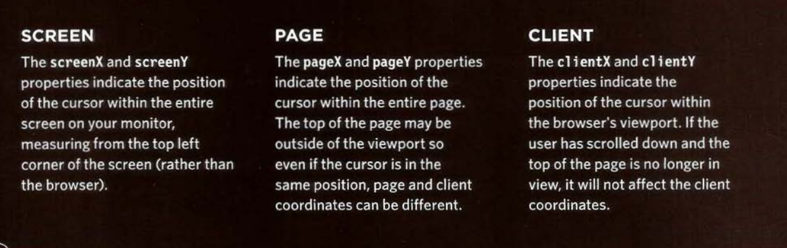
  

---

## HTML page script loading and lifecycle

### Loading scripts: `async`, `defer`

Scripts are often heavier than HTML, causing delays in DOM building. When the browser encounters a `<script>` tag, it must execute it immediately, blocking further DOM processing.

- **Issues**:

  - Scripts can't see DOM elements below them.
  - Bulky scripts at the top block page content and DOM building.

    ```html
    <p>...content before script...</p>

    <script src="https://javascript.info/article/script-async-defer/long.js?speed=1"></script>

    <!-- This isn't visible until the script loads -->
    <p>...content after script...</p>
    ```

  - **Workaround**: Place scripts at the bottom to avoid blocking content.

    ```html
    <body>
      <!-- ...all content is above the script... -->

      <script src="https://javascript.info/article/script-async-defer/long.js?speed=1"></script>
    </body>
    ```

- Placing the script at the bottom isn't perfect as the script starts downloading only after the full HTML is loaded, causing delays on slow connections. - Solution: Use `defer` and `async` attributes to load scripts without blocking.

- `async` and `defer`
  - They're boolean attributes influencing how the scripts are fetched (loaded) and executed.
    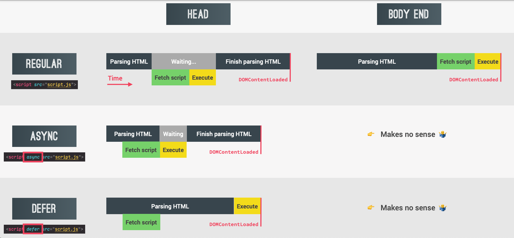

#### `defer`

The `defer` attribute allows the browser to continue processing HTML and building the DOM while the script loads in the background.

- **Key Points**:

  - Scripts with `defer` never block the page.
  - They execute when the DOM is ready, before `DOMContentLoaded`.
  - Deferred scripts maintain their order.

    ```html
    <script defer src="long.js"></script>
    <script defer src="small.js"></script>
    ```

    - the `defer` attribute, besides telling the browser “not to block”, ensures that the relative order is kept. So even though `small.js` loads first, it still waits and runs after `long.js` executes.
      > That is important for cases when we need to load a JavaScript library and then a script that depends on it.

- Notes:

  - The `defer` attribute is only for external scripts
  - The `defer` attribute is ignored if the `<script>` tag has no `src`.

---

#### `async`

The `async` attribute makes scripts non-blocking and independent.

- **Behavior**:

  - Scripts load and run **independently** (load in the background and run when ready).
  - The browser doesn’t block the page on `async` scripts.
  - Other scripts and `DOMContentLoaded` don't wait for `async` scripts.
  - `async` scripts don't wait for each other or the DOM.

  ```html
  <p>...content before scripts...</p>
  <script>
    document.addEventListener('DOMContentLoaded', () => alert('DOM ready!'));
  </script>
  <script async src="long.js"></script>
  <script async src="small.js"></script>
  <p>...content after scripts...</p>
  ```

  - Steps:
    1. Page content shows immediately; `async` doesn't block it.
    2. `DOMContentLoaded` can occur before or after `async`.
    3. Scripts run in the order they load, not their sequence in HTML.

- **Use Cases:**

  - Ideal for independent third-party scripts (e.g., ads, analytics). **(where the relative execution order doesn't matter)**.

    ```html
    <script async src="https://google-analytics.com/analytics.js"></script>
    ```

- **Dynamic scripts**

  - Default to `async`, but can be changed to `defer` by setting `script.async = false`.

    ```js
    let script = document.createElement('script');
    script.src = '/article/script-async-defer/long.js';
    document.body.append(script); // The script starts loading as soon as it’s appended to the document
    ```

---

### Comparison of `async` and `defer`

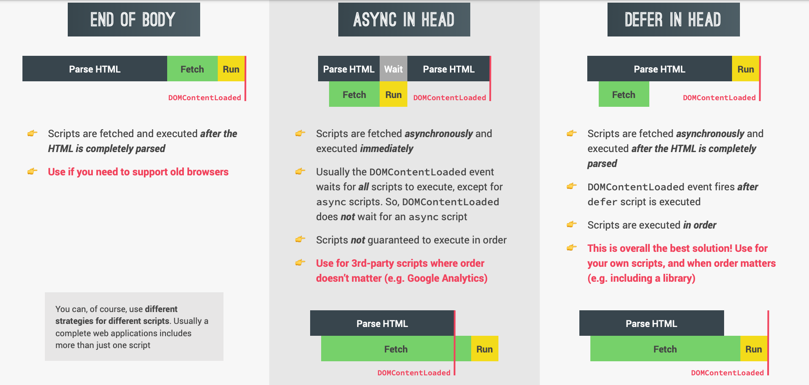

---

### Page lifecycle: DOMContentLoaded, load, beforeunload, unload

The lifecycle of an HTML page has three important events:

- `DOMContentLoaded`

  - Fires on the `document` when **(HTML & External JS scripts)** is fully loaded and the DOM tree is built, but external resources may not be loaded.
    - `<script>` tags block `DOMContentLoaded` unless they have `async` or are dynamically created.
    - External CSS stylesheets don't block `DOMContentLoaded`, but scripts after stylesheets wait for them to load.
  - Handlers can access and initialize the DOM.

    ```html
    <script>
      document.addEventListener('DOMContentLoaded', () => {
        alert('DOM is ready');

        // can access DOM
        let elem = document.getElementById('elem'); // elem exists ✅
      });
    </script>
    ```

- `load`

  - Fires on the `window` when the entire page, including all resources (images, styles etc), is fully loaded.
    - so styles are applied, image sizes are known etc.
  - Handlers can access fully loaded resources.

  ```html
  <script>
    window.onload = function () {
      // can also use window.addEventListener('load', (event) => {
      alert('Page loaded');

      // image is loaded at this time
      alert(`Image size: ${img.offsetWidth}x${img.offsetHeight}`);
    };
  </script>

  
  ```

- `beforeunload` / `unload`

  - Fires on the `window` when the user is leaving the page.
  - `beforeunload`: Check if the user saved changes and confirm leaving.

    - `event.preventDefault()` doesn't work in `beforeunload` to prevent the user from leaving the page.

  - `unload`: Perform cleanup or send data to the server.

- Notes:

  - We can see how much time it took to load the page by:

    - Measuring the time between `DOMContentLoaded` and `load` events.

      ```js
      let start = Date.now();

      document.addEventListener('DOMContentLoaded', () => {
        alert(`Loaded in ${Date.now() - start}ms`);
      });
      ```

    - Or, in the network tab of the browser's developer tools.
      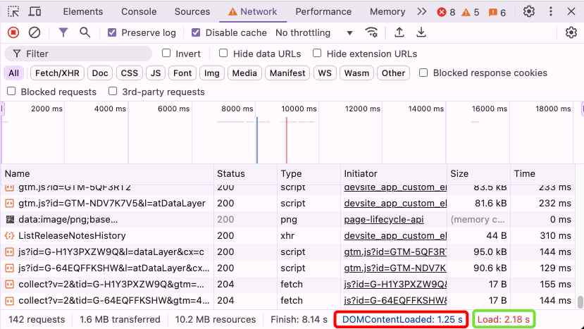

---
