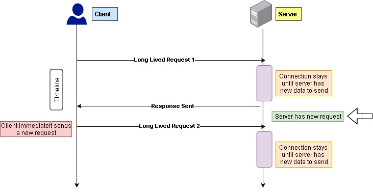

# INDEX

- [INDEX](#index)
  - [Asynchronous JavaScript](#asynchronous-javascript)
    - [Is JavaScript `synchronous` or `asynchronous` ?](#is-javascript-synchronous-or-asynchronous-)
  - [How Asynchronous code works in JavaScript](#how-asynchronous-code-works-in-javascript)
    - [Event Loop](#event-loop)
    - [Macrotasks and Microtasks queues](#macrotasks-and-microtasks-queues)
  - [Callbacks: How to do something after something else](#callbacks-how-to-do-something-after-something-else)
  - [Scheduling: setTimeout and setInterval](#scheduling-settimeout-and-setinterval)
    - [`setTimeout()`](#settimeout)
    - [Canceling with `clearTimeout()`](#canceling-with-cleartimeout)
    - [`setInterval()`](#setinterval)
    - [Garbage collection and setInterval/setTimeout callback](#garbage-collection-and-setintervalsettimeout-callback)
  - [Building a Promise](#building-a-promise)
    - [creating a promise](#creating-a-promise)
  - [consume promise : (Old Way)](#consume-promise--old-way)
    - [AJAX Call : `XMLHttpRequest`](#ajax-call--xmlhttprequest)
    - [Callback Hell (Callback in callback)](#callback-hell-callback-in-callback)
  - [Promises](#promises)
    - [consume promise : (Modern Way) `fetch()`](#consume-promise--modern-way-fetch)
    - [How `fetch()` works behind the scenes](#how-fetch-works-behind-the-scenes)
    - [Consumers: `then`, `catch`](#consumers-then-catch)
    - [Cleanup: `finally` method](#cleanup-finally-method)
  - [consume promises](#consume-promises)
    - [Promisification (promisify)](#promisification-promisify)
    - [Consuming Promises with `async / await` (Modern Way 🚀)](#consuming-promises-with-async--await-modern-way-)
  - [Error Handling](#error-handling)
    - [Handling uncaught error](#handling-uncaught-error)
    - [Handling Rejected Promises (2 ways)](#handling-rejected-promises-2-ways)
      - [1. Pass a second callback function in `.then()` method](#1-pass-a-second-callback-function-in-then-method)
      - [2. using `.catch()` at the end of the promise chain](#2-using-catch-at-the-end-of-the-promise-chain)
    - [Handling custom errors when fetching](#handling-custom-errors-when-fetching)
    - [Error Handling With try...catch (modern way)](#error-handling-with-trycatch-modern-way)
      - [try…catch…finally](#trycatchfinally)
    - [Global Error Handling (Global catch)](#global-error-handling-global-catch)
  - [Promise Chaining: (Sequence vs Parallel) Promises](#promise-chaining-sequence-vs-parallel-promises)
    - [Sequence promises](#sequence-promises)
    - [Parallel promises (Promise Combinators)](#parallel-promises-promise-combinators)
      - [`Promise.all()`](#promiseall)
      - [`Promise.allSettled()`](#promiseallsettled)
      - [`Promise.race()`](#promiserace)
      - [`Promise.any()`](#promiseany)
      - [Promise.`resolve`/`reject`](#promiseresolvereject)
  - [Axios](#axios)
    - [Global Axios Defaults](#global-axios-defaults)
    - [Custom Axios Instance](#custom-axios-instance)
  - [Network Requests](#network-requests)
    - [Fetch](#fetch)
      - [Fetch: Abort (Canceling request)](#fetch-abort-canceling-request)
      - [Fetch: Cross-Origin Requests](#fetch-cross-origin-requests)
      - [Fetch API in depth](#fetch-api-in-depth)
    - [Long Polling vs WebSockets](#long-polling-vs-websockets)
      - [Long Polling](#long-polling)
      - [WebSocket](#websocket)
  - [Microtasks](#microtasks)
    - [Microtasks queue](#microtasks-queue)
  - [Working with data from other servers (Proxy)](#working-with-data-from-other-servers-proxy)
  - [Notes](#notes)

---

## Asynchronous JavaScript

- **"Synchronous"** means that things happen one at a time. When you call a function that performs a long-running action, it returns only when the action has finished and it can return the result.
  

- **"Asynchronous"** means that things can happen independently of the main program flow (not happening at the same time). `Asynchronous` code is executed after a task that runs in the `background` finishes.
  

### Is JavaScript `synchronous` or `asynchronous` ?

JavaScript is always `synchronous` & `single-threaded`, and it has no Asynchronous ability

- **But** when `javascript` runs on certain environments like **browser** or **node.js** --> it allows us to write `asynchronous functionality` like `setTimeOut()` which is not from `javascript` but it's from `window / global` object in the **browser** or in **Node.js**
- so **Javascript has no timer**, as the timer-function is **Web-browser feature**

> So, Javascript can behave in asynchronous way, but it doesn't do this out of the box as we have to manipulate it to be this way

---

## How Asynchronous code works in JavaScript

**Concurrency model** and the **event loop** are the most important concepts in `javascript` and they are part of the **browser** not `javascript`

> **Concurrency model** is how javascript engine handles multiple tasks happening at the same time and how it decides which piece of code to run next.
> 

All this happens in the javascript engine which is part of the browser (javascript runtime)


### Event Loop

Mainly its job is to always check "is the call stack empty?". If it is, then it checks the **callback queue** and **microtasks queue** and executes the oldest task (the task that is waiting the longest time to be executed) and then goes back to check the call stack again.


- The general algorithm of the engine:

  1. While there are tasks: execute them, starting with the oldest task.
  2. `microtasks` queue has higher priority than `callback` queue. (meaning that `microtasks` will be executed even if there are tasks in the `callback` queue)
  3. Sleep until a task appears, then go to **1**.

- **Event Loop Tick**:

  - Each time the event loop makes a round (takes a task from the queue and executes it), it’s called a “tick”.
  - A “tick” is the completion of a single task from the queue.

- The event loop does the **orchestration** of the code execution in the browser.

- Example
  
  
  
  
  
  
  

- Notes
  - **DOM Events**: These are not asynchronous but use asynchronous callbacks to handle events.
  - **Rendering**: Occurs only after the current task completes, regardless of its duration. Long tasks can cause the browser to become unresponsive, leading to alerts like "Page Unresponsive."
    - so changes to the DOM are painted only after the task is complete.
  - **Timers**: They may not execute exactly on time due to CPU load. After the specified delay, timers enter the callback queue and execute once the call stack is clear.

---

### Macrotasks and Microtasks queues

- **Microtasks** come solely from our code. They are usually created by promises: an execution of `.then`/`catch`/`finally` handler becomes a microtask (more [here](./05-ASYNC.md#microtasks)). Microtasks are used “under the cover” of `await` as well, as it’s another form of promise handling.

- **Immediately after every macrotask, the engine executes all tasks from microtask queue, prior to running any other macrotasks or rendering or anything else.**

  - All microtasks are completed before any other event handling or rendering or any other macrotask takes place.

  ```js
  setTimeout(() => alert('timeout')); // 3 -> because it’s a macrotask.

  Promise.resolve().then(() => alert('promise')); // 2 ->  because .then passes through the microtask queue, and runs after the current code.

  alert('code'); // 1 -> it’s a regular synchronous call.
  ```

- If we’d like to execute a function asynchronously (after the current code), but before changes are rendered or new events handled, we can schedule it with `queueMicrotask` function.

  ```js
  let i = 0;
  function count() {
    // do a piece of the heavy job (*)
    do {
      i++;
      progress.innerHTML = i;
    } while (i % 1e3 != 0);

    if (i < 1e6) {
      queueMicrotask(count);
    }
  }
  ```

- **Web Workers**
  - For long heavy calculations that shouldn’t block the event loop, we can use Web Workers.
  - That’s a way to run code in another, parallel thread.
  - Web Workers can exchange messages with the main process, but they have their own variables, and their own event loop.
  - Web Workers do not have access to DOM, so they are useful, mainly, for calculations, to use multiple CPU cores simultaneously.

---

## Callbacks: How to do something after something else

As Javascript runs synchronously, it can't do multiple things at the same time, but it can do things in a certain order, and this is where `callbacks` come in.

- let's say that we have a `loginUser` function that logs the user and sends the `userEmail` and `userPassword` to the server to check if the user exists or not, and then it returns a `callback` function that will be executed after the server responds.

  ```js
  // --------------------------------- Won't work ❌ --------------------------------- //
  function loginUser(userEmail, userPassword) {
    setTimeout(() => {
      console.log('User logged in');
      return { userEmail };
    }, 2000);
  }

  const user = loginUser('test@test.com', 123456);
  console.log(user); // undefined
  // after 2 seconds, it will log "User logged in"

  // --------------------------------- Will work ✅ --------------------------------- //
  function loginUser(userEmail, userPassword, callback) {
    setTimeout(() => {
      console.log('User logged in');
      callback({ userEmail });
    }, 2000);
  }

  loginUser('test@test.com', 123456, user => {
    console.log(user);
  });
  // after 2 seconds, it will log "User logged in" and then log the user object
  ```

So, `callbacks` are functions that are passed as arguments to other functions and are executed after the completion of the task.

---

## Scheduling: setTimeout and setInterval

- Methods:

- `setTimeout`: Runs a function once after a delay.
- `setInterval`: Repeats a function at specified intervals.
- Note: JavaScript timers are a **web-browser feature** not a javascript feature.

### `setTimeout()`

```js
// syntax
let timerId = setTimeout(func|code, [delay], [arg1], [arg2], ...)
```

- **Notes:**

  - To pass `arguments` into the function, we can add them after the `delay`. These arguments will be passed into the function when it is run.

    ```js
    function sayHi(phrase, who) {
      alert(phrase + ', ' + who);
    }
    setTimeout(sayHi, 1000, 'Hello', 'John'); // Hello, John
    ```

  - If the first argument is a **string**, then JavaScript creates a function from it. But it's not recommended ❌.

    ```js
    setTimeout("alert('Hello')", 1000); // This will work
    ```

- Pass a function reference and not a function call:

  ```js
  // wrong! ❌
  setTimeout(sayHi(), 1000);

  // correct ✅
  setTimeout(sayHi, 1000);
  ```

  - `setTimeout` expects a function reference. `sayHi()` runs the function immediately, passing its result (`undefined`) to `setTimeout`.

- **Time continues during `alert`**

  - Browsers keep the internal timer running during `alert`/`confirm`/`prompt`.
  - `alert` blocks synchronous operations, not asynchronous ones.

---

### Canceling with `clearTimeout()`

Use the `timerId` from `setTimeout` to cancel:

```js
let timerId = setTimeout(...);
clearTimeout(timerId);
```

---

### `setInterval()`

You can do intervals using `setInterval()` or with **nested setTimeOut()**:

```js
/** instead of "setInterval":
let timerId = setInterval(() => alert('tick'), 2000);
*/

let timerId = setTimeout(function tick() {
  alert('tick');
  timerId = setTimeout(tick, 2000); // (*)
}, 2000);
// The setTimeout above schedules the next call right at the end of the current one (*).
```

- The **nested setTimeout** is a more flexible method than `setInterval`. This way the next call may be scheduled differently, depending on the results of the current one.

  - For instance, we need to write a service that sends a request to the server every 5 seconds asking for data, but in case the server is overloaded, it should increase the interval to 10, 20, 40 seconds…

    ```js
    let delay = 5000;

    let timerId = setTimeout(function request() {
      ...send request...

      if (request failed due to server overload) {
        // increase the interval to the next run
        delay *= 2;
      }

      timerId = setTimeout(request, delay);

    }, delay);
    ```

- Nested `setTimeout` allows to set the delay between the executions more precisely than `setInterval`.

  - `setInterval`

    ```js
    // setInterval
    let i = 1;
    setInterval(function () {
      func(i++);
    }, 100);
    ```

    

    - The real delay between func calls for setInterval is less than in the code!. because the time taken by func's execution “consumes” a part of the interval.
    - It is possible that func's execution turns out to be longer than we expected and takes more than `100ms`.
    - In this case the engine waits for func to complete, then checks the scheduler and if the time is up, runs it again immediately.

  - nested `setTimeout`

  ```js
  let i = 1;
  setTimeout(function run() {
    func(i++);
    setTimeout(run, 100);
  }, 100);
  ```

  

  - The nested `setTimeout` guarantees the fixed delay (here `100ms`).
    - That’s because a new call is planned at the end of the previous one.

---

### Garbage collection and setInterval/setTimeout callback

When a function is passed in `setInterval`/`setTimeout`, an internal **reference** is created to it and saved in the scheduler. It prevents the function from being garbage collected, even if there are no other references to it.

```js
// the function stays in memory until the scheduler calls it
setTimeout(function() {...}, 100);
```

> For **setInterval** the function stays in memory until **clearInterval** is called.

There’s a side effect. A function references the outer lexical environment, so, while it lives, outer variables live too. They may take much more memory than the function itself. So when we don’t need the scheduled function anymore, it’s better to cancel it, even if it’s very small.

---

## Building a Promise

- when you create a new promise you put an `execution function` which takes `2` callback functions `(resolve, reject)` as parameters
  - what is returned from `(resolve, reject)` functions will be the fulfilled / rejected value that we handle them using `.then() / .catch()`

### creating a promise

```javascript
// creating the promise
const lotteryPromise = new Promise(function (resolve, reject) {
  console.log('Lotter draw is happening 🔮');
  setTimeout(function () {
    if (Math.random() >= 0.5) {
      resolve('You WIN 💰');
    } else {
      reject(new Error('You lost your money 💩'));
    }
  }, 2000);
});

// using the promise
lotteryPromise.then(res => console.log(res)).catch(err => console.error(err));
```

---

## consume promise : (Old Way)

### AJAX Call : `XMLHttpRequest`

**AJAX (Asynchronous JavaScript And XML)** allows us to communicate with remote web servers in an **asynchronous way**. This means that we can make requests to the server without having to reload the page.


- It's a technique for loading data into part of a page without having to refresh the entire page. The data is often sent in a format called JavaScript Object Notation `JSON`.

> It's for **HTTP** requests (communicating between client and server)

- Partial page loading improves user experience by updating specific sections without requiring the entire page to load. This has led to the rise of **single page web applications** with software-like functionality in a browser.
- Historically, **AJAX** was an acronym for the technologies used in asynchronous requests like this. It stood for **Asynchronous JavaScript And XML**. Since then, technologies have moved on and the term **Ajax** is now used to refer to a group of technologies that offer asynchronous functionality in the browser.
- **Data formats:** Servers typically send back `HTML`, `XML`(which the browser turns into `HTML`), or `JSON`

  - Browsers only let Ajax load `HTML` and `XML` from the **same domain name** as the rest of the page,
    - but `JSON` can be called from any domain **(JSON-P/CORS)**
  - **XML** -> The tags in an `XML` file should describe the data they contain. As a result, even if you have never seen the code to the left. you can see that the data describes information about several events. The `<events>` element contains several individual events. Each individual event is represented in its own `<event>` element.
  - **JSON** :

    - When `JSON` data is sent from a server to a web browser, it is transmitted as a **string**.
    - When it reaches the browser, your script must then convert the string into a JavaScript object. This is known as **deserializing an object**.
      - This is done using the `parse()` method of a built-in object called `JSON`. This is a global object, so you can use it without creating an instance of it first.
    - The JSON object also has a method called `stringify()`, which converts objects into a string using `JSON` notation so it can be sent from the browser back to a server. This is also known as serializing an object.

  - The data returned are in form of **Array of Objects**, each object represents a country with its properties.

> To create an Ajax request, browsers use the `XMLHttpRequest` object.
> When the server responds to the browser's request, the same `XMLHttpRequest` object will process the result.
>
> 1. Create an instance of the `XMLHttpRequest` object
> 2. Use its `open()` method to specify the URL of the server-side script you want to access
> 3. Use its `send()` method to send the request to the server
> 4. As soon as the server responds, the `onload` event fires and the code in the event handler runs. The response from the server is stored in the `responseText` property of the `XMLHttpRequest` object.

```js
const request = new XMLHttpRequest();
request.open('GET', 'https://restcountries.eu/rest/v2/name/usa');
request.send(); // sends the prepared request to the server

// we add eventListener on it for when it (loads)
request.addEventListener('load', function () {
  const [data] = JSON.parse(this.responseText); // "this" refers to the request object
});
```

> More info about `xmlhttprequest` [here](https://javascript.info/xmlhttprequest)

---

### Callback Hell (Callback in callback)

It's when you have a lot of nested callbacks to execute asynchronous code in a certain order/sequence, which makes the code hard to read and maintain (hard to debug).

> **"Callback-based" style of asynchronous programming**. A function that does something asynchronously should provide a callback argument where we put the function to run after it’s complete.

- Deeply nested callbacks make code hard to manage (**Pyramid of Doom**).
- Occurs with all asynchronous tasks, not just AJAX calls.

- Examples

  - Callback hell using `xmlHttpRequest`

    ```js
    const request = new XMLHttpRequest();
    request.open('GET', `https://restcountries.eu/rest/v2/name/Usa`);
    request.send();

    request.addEventListener('load', function () {
      const [data] = JSON.parse(this.responseText);
      console.log(data);

      // Get neighbor country (2)
      const [neighbor] = data.borders;
      if (!neighbor) return;

      // AJAX call country 2
      const request2 = new XMLHttpRequest();
      request2.open('GET', `https://restcountries.eu/rest/v2/alpha/${neighbor}`);
      request2.send();

      request2.addEventListener('load', function () {
        const data2 = JSON.parse(this.responseText);
        console.log(data2);

        // Get neighbor country (3)
        // ...
      });
    });
    ```

  - Callback hell using `setTimeout`

    ```js
    setTimeout(() => {
      console.log('1 second passed');
      setTimeout(() => {
        console.log('2 seconds passed');
        setTimeout(() => {
          console.log('3 second passed');
          setTimeout(() => {
            console.log('4 second passed');
          }, 1000);
        }, 1000);
      }, 1000);
    }, 1000);
    ```

---

## Promises

**Promise**: An object representing the future result of an asynchronous operation (failure or success).

- Avoids callback hell by chaining `then()` and handling errors with `catch()` instead of passing callbacks to asynchronous functions like `xmlHttpRequest`.

- **Executor Function**
  

  - Runs automatically when a new Promise is created (passed to the `Promise` constructor).
  - Contains 2 parameters: `resolve` and `reject` which are callback-functions that control the fate of the promise.
    - `resolve(value)` on success.
    - `reject(error)` on failure.
      - it's internally the same as `throw new Error()`

- **Promise Object**

  - The promise object returned by the new Promise constructor has these internal properties:
  - `state`: Initially `pending`, then `fulfilled` or `rejected`.
  - `result`: Initially `undefined`, then changes to `value` or `error`.

- **Syntax**

  ```js
  let promise = new Promise(function (resolve, reject) {
    // executor (the producing code, "singer")
  });
  ```

  
  

- Notes

  - The executor should call only one `resolve` or one `reject`. Any state change is final.

    ```js
    // The executor should call only one resolve or one reject. Any state change is final.
    let promise = new Promise(function (resolve, reject) {
      resolve('done');

      reject(new Error('…')); // ignored
      setTimeout(() => resolve('…')); // ignored
    });
    ```

---

### consume promise : (Modern Way) `fetch()`

It's a modern way to do `AJAX` calls, but it's not part of `javascript` but it's a **browser API** that we can use in `javascript` to make `AJAX` calls.

- In frontend programming, promises are often used for network requests. and we use the `fetch()` method to load the information from the server.
- returns a `promise` that resolves to the`Response to that request, whether it is successful or not using the`then()`method. or rejects with an error using the`catch()` method.

  ```js
  // GET request Example
  fetch(`https://restcountries.eu/rest/v2/name/Egypt`)
    .then(response => response.json())
    .then(data => {
      console.log(data);
    })
    .catch(err => console.error(err));

  // POST request Example
  fetch(`https://restcountries.eu/rest/v2/name/Egypt`, {
    method: 'POST',
    headers: {
      'Content-Type': 'application/json'
    },
    body: JSON.stringify({ name: 'Egypt' })
  })
    .then(response => response.json())
    .then(data => {
      console.log(data);
    })
    .catch(err => console.error(err));
  ```

  - For `POST` requests, we must specify the `method` and the `headers` in the `fetch()` method. the `Content-Type` header is required for `POST` requests to specify the type of data being sent.

---

### How `fetch()` works behind the scenes

- `fetch()` is a **modern** way to do `AJAX` calls, but it's not part of `javascript` but it's a **browser API** that we can use in `javascript` to make `AJAX` calls
- when calling `fetch()` it returns a `promise` that we can use to handle the `response` of the `AJAX` call, so the value expected from `fetch()` is a `promise` with 2 properties:

  - `state` : which is initially `pending` and then changes to `fulfilled` or `rejected`
  - `result` : which is initially `undefined` and then changes to `value` or `error`

- after the `state` property changes to `fulfilled` or `rejected` the `result` property will change to `value` or `error` respectively and passed to the `then()` method as the parameter of the `callback` function

  - `then()` method takes 2 callback functions as parameters
    - the first one is for the `fulfilled` value
    - the second one is for the `rejected` value

  ```js
  fetch(`https://restcountries.eu/rest/v2/name/Egypt`)
    .then(response => response.json())
    .then(data => {
      console.log(data);
    });
  ```

- Fetch can take a second parameter, an object with options. The most common option is `method`, which can be `GET`, `POST`, `PUT`, `DELETE`, etc.

  ```js
  fetch(`https://restcountries.eu/rest/v2/name/Egypt`, {
    method: 'POST',
    headers: {
      'Content-Type': 'application/json'
    },
    body: JSON.stringify({ name: 'Egypt' })
  })
    .then(response => response.json())
    .then(data => {
      console.log(data);
    });
  ```

---

### Consumers: `then`, `catch`

A Promise object serves as a link between the executor (the “producing code”) and the consuming functions, which will receive the result or error. Consuming functions can be registered (subscribed) using the methods `.then` and `.catch`.

- `.then`

  - it takes 2 callback functions as parameters
    - the first one is for the `fulfilled` value
    - the second one is for the `rejected` value -> Optional

  ```js
  promise.then(
    function (result) {
      /* handle a successful result */
    },
    function (error) {
      /* handle an error */
    }
  );

  // -----------------------------------------------
  let promise = new Promise(function (resolve, reject) {
    setTimeout(() => resolve('done!'), 1000);
  });

  // resolve runs the first function in .then
  promise.then(
    result => alert(result), // shows "done!" after 1 second
    error => alert(error) // doesn't run
  );
  ```

  - There's a limitation in the second parameter of `.then()` method, that it can only handle any rejection that happens in the `executor function` (the `producing code`), but if there's an error in the `then()` method itself, it won't be handled by the second parameter of `.then()`. **To fix this, we can use the `.catch()` method**.

    ```js
    fetch(`https://restcountries.eu/rest/v2/name/Egypt`)
      .then(
        response => response.json(),
        error => console.error(error)
      )
      .then(data => {
        console.log(data);
        Promise.reject(new Error('💥')); // This won't be handled in the function above
      });
    ```

- `.catch`

  - This a replacement for the second parameter of `.then(null, f)`. that is chained to the end of the promise call.

  - If we’re interested only in errors, then we can use `null` as the first argument: `.then(null, errorHandlingFunction)`. Or we can use `.catch(errorHandlingFunction)`, which is exactly the same:

  ```js
  let promise = new Promise((resolve, reject) => {
    setTimeout(() => reject(new Error('Whoops!')), 1000);
  });

  // .catch(f) is the same as promise.then(null, f)
  promise.catch(alert); // shows "Error: Whoops!" after 1 second
  ```

- **Notes**

  - Are these code fragments equal? In other words, do they behave the same way in any circumstances, for any handler functions?

    ```js
    promise.then(f1).catch(f2); // 1
    promise.then(f1, f2); // 2
    ```

    - answer is **NO**, The difference is that:

      - in `1`: if an error happens in `f1`, then it is handled by `.catch`
      - in `2`: .then passes results/errors to the next `.then`/`catch`. So in the first example, there’s a `catch` below, and in the second one there isn’t, so the error is unhandled.

        - so it should be:

          ```js
          promise.then(f1).then(null, f2);
          ```

  - Why do we use `.json()` method in the `fetch()` method?

    - The `response` object returned by `fetch()` is a **stream**. To extract the `JSON` body content from the response, we use the `json()` method, **which also returns a `promise`** that resolves with the result of parsing the body text as `JSON`.

      ```js
      fetch(`https://restcountries.eu/rest/v2/name/Egypt`)
        .then(response => response.json())
        .then(data => {
          console.log(data);
        });
      ```

  - To avoid **callback hell**, we can chain multiple `.then()` methods instead of nesting them.

    ```js
    // BAD ❌
    fetch(`https://restcountries.eu/rest/v2/name/Egypt`)
      .then(response => response.json())
      .then(data => {
        fetch(`https://restcountries.eu/rest/v2/name/${data[0].borders[0]}`)
          .then(response => response.json())
          .then(data => {
            console.log(data);
          });
      });

    // GOOD ✅
    fetch(`https://restcountries.eu/rest/v2/name/Egypt`)
      .then(response => response.json())
      .then(data => {
        return fetch(`https://restcountries.eu/rest/v2/name/${data[0].borders[0]}`); // return the promise to handle it in the next `.then()`
      })
      .then(response => response.json())
      .then(data => {
        console.log(data);
      });
    ```

  - How different is error handling between `fetch()` and `axios`?

    - `fetch()`

      - Doesn't reject the promise if the response code is `404` or `500`, or if `response.ok` is `false`. It only rejects the promise if there's a network error.
      - So, we need to check `response.ok` and throw an error if it's `false`.

        ```js
        fetch(`https://restcountries.eu/rest/v2/name/Egypt`)
          .then(response => {
            if (!response.ok) throw new Error(`Country not found (${response.status})`);
            return response.json();
          })
          .then(data => {
            console.log(data);
          })
          .catch(err => console.error(err.message));
        ```

    - `axios`

      - Rejects the promise automatically if the response code is `404` or `500`, or if `response.ok` is `false`.
      - So, we don't need to manually check errors.

        ```js
        axios
          .get(`https://restcountries.eu/rest/v2/name/Egypt`)
          .then(response => {
            console.log(response.data);
            // no need to check response.ok or to return response.json()
          })
          .catch(err => console.error(err.message));
        ```

---

### Cleanup: `finally` method

Just like there’s a finally clause in a regular `try {...} catch {...}`, there’s finally in promises.

- The idea of `finally` is to set up a handler for performing cleanup/finalizing after the previous operations are complete.
- used for something that happens no matter the promise is `fulfilled` or `rejected`

```javascript
// after then & catch
.finally(() => { // any function
       countriesContainer.style.opacity = 1;
       });
```

- **Notes:**

  - A `finally` handler doesn’t get the outcome of the previous handler (it has no arguments). This outcome is passed through instead, to the next suitable handler.
  - A `finally` handler “passes through” the result or error to the next suitable handler. For instance, here the result is passed through `finally` to `then`:

    ```js
    new Promise((resolve, reject) => {
      setTimeout(() => resolve('value'), 2000);
    })
      .finally(() => alert('Promise ready')) // triggers first
      .then(result => alert(result)); // <-- .then shows "value"
    ```

  - A `finally` handler also shouldn’t `return` anything. If it does, the returned value is silently ignored.
    - The only exception to this rule is when a `finally` handler throws an error. Then this error goes to the next handler, instead of any previous outcome.

---

## consume promises

### Promisification (promisify)

“Promisification” is a long word for a simple transformation. It’s the conversion of a function that accepts a `callback` into a function that returns a `promise`.

```js
const promisified = function () {
  return new Promise((resolve, reject) => {
    // logic that uses a callback
  });
};
```

- Such transformations are often required in real-life, as many functions and libraries are callback-based. But promises are more convenient, so it makes sense to promisify them.
- For instance, we have `loadScript(src, callback)`:

  ```js
  // with callbacks
  function loadScript(src, callback) {
    let script = document.createElement('script');
    script.src = src;

    script.onload = () => callback(null, script);
    script.onerror = () => callback(new Error(`Script load error for ${src}`));

    document.head.append(script);
  }
  // usage:
  loadScript('path/script.js', (err, script) => {...})

  // -------------------------------------------------------------- //

  // with promisification
  function promisify(f) {
    return function (...args) { // return a wrapper-function (*)
      return new Promise((resolve, reject) => {
        function callback(err, result) { // our custom callback for f (**)
          if (err) {
            reject(err);
          } else {
            resolve(result);
          }
        }

        args.push(callback); // append our custom callback to the end of f arguments

        f.call(this, ...args); // call the original function
      });
    };
  }
  // usage:
  let loadScriptPromise = promisify(loadScript);
  loadScriptPromise(...).then(...);
  ```

- Examples

  - To be able to use `.then` with timer-based functions, we can promisify them:

    ```js
    function wait(ms) {
      return new Promise(resolve => setTimeout(resolve, ms));
    }

    wait(2000).then(() => console.log('2 seconds passed'));
    ```

  - promisify creating an image

    ```js
    const imgContainer = document.querySelector('.images');

    const createImage = function (imgPath) {
      return new Promise(function (resolve, reject) {
        const img = document.createElement('img');
        img.src = imgPath;

        img.addEventListener('load', function () {
          imgContainer.append(img);
          resolve(img); // Marking the promise as fulfilled
        });

        img.addEventListener('error', function () {
          reject(new Error('Image not found')); // Marking the promise as rejected
        });
      });
    };

    let currentImg;
    createImage('img/img-1.jpg')
      .then(img => {
        currentImg = img;
        console.log('Image 1 loaded');
        return wait(2);
      })
      .then(() => {
        currentImg.style.display = 'none';
        return createImage('img/img-2.jpg');
      })
      .then(img => {
        currentImg = img;
        console.log('Image 2 loaded');
        return wait(2);
      })
      .then(() => {
        currentImg.style.display = 'none';
      })
      .catch(err => console.error(err));
    ```

> **Note**: Promisification is a great approach, especially when you use async/await, but not a total replacement for callbacks.

---

### Consuming Promises with `async / await` (Modern Way 🚀)

They make us able to write `asynchronous code` that looks like `synchronous code`.


- By using the word `async` before a function, you convert it to an `asynchronous function`

  - which will keep running in the background while performing the code inside of it, than when it's done => **it returns a `promise`**
  - Other values are wrapped in a resolved promise automatically.
  - It returns a promise, and we could explicitly return a promise, which would be the same.

  ```js
  async function f() {
    return 1;
  }
  f().then(alert); // 1

  // same as
  async function f() {
    return Promise.resolve(1);
  }
  f().then(alert); // 1
  ```

- the word `await` awaits the `result` of the promise (stops code-execution of the function until the promise is settled (fulfilled)) and give us the ability to store the fulfilled value in a variable without `then()/callbacks` 👌

  ```js
  // works only inside async functions
  let value = await promise;
  ```

  - `await` literally suspends the function execution until the promise settles, and then resumes it with the promise result. That doesn’t cost any CPU resources, because the JavaScript engine can do other jobs in the meantime: execute other scripts, handle events, etc.
  - If we try to use `await` in a `non-async` function, there would be a syntax error
  - In the case of an error, the control jumps to the `catch` block.

- Inside an async function you can use the `await` keyword before a call to a function that returns a promise. This makes the code wait at that point until the promise is `settled`, at which point the fulfilled value of the promise is treated as a return value, or the rejected value is thrown.
- This enables you to write code that uses asynchronous functions but looks like synchronous code.

```javascript
function resolveAfter2Seconds() {
  return new Promise(resolve => {
    setTimeout(() => {
      resolve('resolved');
    }, 2000);
  });
}

async function asyncCall() {
  console.log('calling...');
  const result = await resolveAfter2Seconds();
  console.log(result); // "resolved"
  // this is the same as
  resolveAfter2Seconds().then(res => console.log(result));
}

asyncCall(); // this returns a promise that we can handle it using .then() or .catch()
```

- The return value of an `async function` is always a `promise`, even if you don't return a promise explicitly.

  ```js
  async function f() {
    return Promise.resolve(1);
  }

  f(); // Promise {<pending>} ⚠️
  f().then(alert); // 1
  await f(); // 1
  ```

  - It's important to understand why calling `f()` returns a **pending promise**. because the `async` function always returns a promise, and the value of the promise is what the `async` function returns.

- If we try to use `await` **in / without** a `non-async` function, there would be a `syntax error`,so => use `IIFE`

  ```javascript
  (async function () {
    try {
      const result = await resolveAfter2Seconds();
      console.log(result); // "resolved"
    } catch (err) {
      console.error(`2: ${err.message} 💥`);
    }
  })();
  ```

- Using `async/await` with `fetch()`

  ```javascript
  async function getCountryData(country) {
    try {
      const response = await fetch(`https://restcountries.eu/rest/v2/name/${country}`);
      const [data] = await response.json();
      console.log(data);
    } catch (err) {
      console.error(err);
    }
  }

  getCountryData('Egypt');
  ```

- **Notes**

  - `await` only works in `modules` and `async functions`, because it requires `block scoping`. So we need to specify `type="module"` in the `<script>` tag.
  - Starting from ES2020, **top-level `await`** is supported in modules.
    It's a way to use `await` at the top level of a module without wrapping it in an `async function`.

    ```js
    // 📁 main.js
    let response = await fetch(
      'https://api.github.com/repos/javascript-tutorial/en.javascript.info/commits'
    );

    let commits = await response.json();
    ```

    - Note that this blocks the module execution until the promise is settled, so it’s not recommended to use it in the main thread, because it may freeze the page.

---

## Error Handling

### Handling uncaught error

- this is usually used to customize the `error message`
  - what we write in `Error()` must be a string, so we use `template literals`

```js
// Throwing Errors Manually (as it may not consider it an error if (response) isn't "ok")
if (!response.ok) throw new Error(`error is : (${response.status})`);
```

---

### Handling Rejected Promises (2 ways)

#### 1. Pass a second callback function in `.then()` method

- this second callback function will be executed when promise is `rejected`

  ```javascript
  fetch(`https://restcountries.eu/rest/v2/name/Egypt`)
    .then(
      response => {
        if (!response.ok) throw new Error(`Country not found (${response.status})`);

        return response.json();
      },
      err => alert(err.message) // Here we handle the error
    )
    .then(
      data => {
        console.log(data);
      },
      err => alert(err.message) // Here we handle the error
    );
  ```

- problem is that you will have to do it in every `.then()` method which is a pain, instead we use the second way

---

#### 2. using `.catch()` at the end of the promise chain

- This is done when we want to handle all errors in one place, and not in every `.then()` method
- the `.catch()` methods catches any `error` that occurs anywhere in the `promise-chain`

  ```javascript
  fetch(`https://restcountries.eu/rest/v2/name/Egypt`)
    .then(response => {
      // Throwing Errors Manually
      if (!response.ok) throw new Error(`Country not found (${response.status})`);

      return response.json();
    })
    .then(data => {
      console.log(data);
    })
    .catch(err => {
      console.error(`${err} 💥💥💥`);
    });
  ```

- there’s an "implicit(hidden) `try..catch`" around the executer-function code. So all **synchronous** errors are handled.

  - But if the error is generated not while the executor is running, but later (e.g. Asynchronously). then the promise can’t handle it.

    ```js
    new Promise(function (resolve, reject) {
      setTimeout(() => {
        throw new Error('Whoops!');
      }, 1000);
    }).catch(alert); // this won't trigger
    ```

---

### Handling custom errors when fetching

By default, the `fetch()` API doesn't consider `HTTP` status codes in the `4xx` or `5xx` range to be errors. Instead it considers these status codes to be indicative of a successful request

- if you're using normal `fetch`, then you will have to check (the request status for many cases and various status-codes), depending on them you will throw an error to go to the catch block other wise it won't know that there's an error

  - or we can check for the `res.ok` value

  ```js
  fetch(url)
    .then(res => {
      if (res.status >= 200 && res.status <= 299) {
        return res.json();
      } else {
        // response error
        throw new Error('404 error');
      }
    })
    .catch(err => {
      console.log(err);
    });
  ```

- Or if you are using **Axios**, then this is handled automatically for different status-codes and situations

---

### Error Handling With try...catch (modern way)

`try...catch` can only handle errors that occur in valid code. Such errors are called **“runtime errors”** or, sometimes, **“exceptions”**.

- If a promise resolves normally, then `await promise` returns the result. But in the case of a `rejection`, it throws the error, just as if there were a throw statement at that line.

  ```javascript
  async function f() {
    await Promise.reject(new Error('Whoops!'));
  }

  // …is the same as this:

  async function f() {
    throw new Error('Whoops!');
  }
  ```

- We can catch that error using `try..catch`, the same way as a regular `throw`

  ```javascript
  async function f() {
    try {
      let response = await fetch('/no-user-here');
      let user = await response.json();
    } catch (err) {
      // catches errors both in fetch and response.json
      alert(err);
      console.error(`Error is : ${err.message} 💥`);
    }
  }

  f();
  ```

- to specify what error-type you want to handle in the `catch` block, we can use **"re-throwing technique**:

  ```js
  function readData() {
    let json = '{ "age": 30 }';

    try {
      blabla(); // error!
    } catch (err) {
      if (!(err instanceof SyntaxError)) {
        throw err; // rethrow (don't know how to deal with it)
      }
      // else
      alert('JSON Error: ' + err.message);
    }
  }

  try {
    readData();
  } catch (err) {
    alert('External catch got: ' + err); // caught it!
  }
  ```

- `try...catch` works synchronously

  - If an exception happens in “scheduled” code, like in `setTimeout`, then `try...catch` won’t catch it:

    ```js
    try {
      setTimeout(function () {
        noSuchVariable; // script will die here
      }, 1000);
    } catch (err) {
      alert("won't work");
    }
    ```

  - That’s because the function itself is executed later, when the engine has already left the try...catch construct.

- If we don’t have `try..catch`, then the promise generated by the call of the **async function** `f()` becomes rejected. We can append `.catch` to handle it:

  ```js
  async function f() {
    let response = await fetch('http://no-such-url');
  }
  // f() becomes a rejected promise
  f().catch(alert); // TypeError: failed to fetch // (*)
  ```

- Optional `“catch”` binding, (recent addition).

  - If we don’t need `error` details, `catch` may omit it:

    ```js
    try {
      // ...
    } catch {
      // <-- without (err)
      // ...
    }
    ```

#### try…catch…finally

- If it exists, it runs in all cases:

  - after `try`, if there were no errors,
  - after `catch`, if there were errors.

```js
try {
  //  ... try to execute the code ...
} catch (err) {
  //  ... handle errors ...
} finally {
  //  ... execute always ...
}
```

---

### Global Error Handling (Global catch)

Let’s imagine we’ve got a fatal error outside of `try...catch`, and the script died. Like a programming error or some other terrible thing.

- in the **browser** we can assign a function to the special **`window.onerror`** property, that will run in case of an uncaught error.
- The is not a part of the core JavaScript, as it works on the Browser engine.

```js
window.onerror = function (message, url, line, col, error) {
  // message: Error message
  // url: URL of the script where error happened.
  // line, col: Line and column numbers where error happened.
  // error: Error object
};

// ex:
window.onerror = function (message, url, line, col, error) {
  alert(`${message}\n At ${line}:${col} of ${url}`);
};
```

- The role of the global handler `window.onerror` is usually not to recover the script execution – that’s probably impossible in case of programming errors, but to send the error message to developers.

> What happens when a regular error occurs and is not caught by **try..catch**? The script dies with a message in the console. A similar thing happens with unhandled promise rejections.
>
> - The JavaScript engine tracks such rejections and generates a global error in that case.
> - In the browser we can catch such errors using the event **"unhandledrejection"** event
> - In any case we should have the "unhandledrejection" event handler (for browsers, and analogs for other environments) to track unhandled errors and inform the user (and probably our server) about them, so that our app never “just dies”.
>
> ```js
> // EX:
> let promise = Promise.reject(new Error('Promise Failed!'));
> setTimeout(() => promise.catch(err => alert('caught')), 1000);
>
> // Error: Promise Failed!
> window.addEventListener('unhandledrejection', event => alert > event.reason);
> ```

---

## Promise Chaining: (Sequence vs Parallel) Promises

### Sequence promises

They depend on each other in their order as if one failed, then all fail as well


```javascript
const get3Countries = async function (c1, c2, c3) {
  try {
    const [data1] = await getJSON(`https://restcountries.com/v3.1/name/${c1}`);
    const [data2] = await getJSON(`https://restcountries.com/v3.1/name/${c2}`);
    const [data3] = await getJSON(`https://restcountries.com/v3.1/name/${c3}`);
    console.log([data1.capital[0], data2.capital[0], data3.capital[0]]);
  } catch (err) {
    console.error(err);
  }
};
get3Countries('portugal', 'canada', 'tanzania');

// --------------------------------------------------------------- //

// Another example
const wait = seconds => {
  return new Promise(resolve => setTimeout(resolve, seconds * 1000));
};

wait(1)
  .then(() => {
    console.log('1 second passed');
    return wait(1);
  })
  .then(() => {
    console.log('2 seconds passed');
    return wait(1);
  })
  .then(() => {
    console.log('3 seconds passed');
  });
```

- **Notes:**

  - We should only use this approach when the promises / requests depend on each other, and the order is important.
  - This causes a problem, because the requests are made one after the other, so it's not efficient, because we are waiting for the first request to finish before starting the second one, and so on. **This is called `waterfall effect`**.
    - To solve this problem, we can use [`Promise.all`](#promiseall) to make the requests in parallel.

---

### Parallel promises (Promise Combinators)

There are 6 static methods in the `Promise` class. They are used to deal with multiple promises at once **(in parallel)**.

- [Promise.all](#promiseall)
- [Promise.allSettled](#promiseallsettled)
- [Promise.race](#promiserace)
- [Promise.any](#promiseany)
- [Promise.resolve/reject](#promiseresolvereject)

> These are called **"Promise combinators"** because they combine multiple promises into one.

#### `Promise.all()`

- It takes an **iterable** (usually, an array of `promises`) and returns a new `promise` that resolves when all listed promises are resolved, and returns **array of their results becomes its result (in the same order)**. Also it run all the promises **in parallel**.

  ```js
  Promise.all([
    new Promise(resolve => setTimeout(() => resolve(1), 3000)), // 1
    new Promise(resolve => setTimeout(() => resolve(2), 2000)), // 2
    new Promise(resolve => setTimeout(() => resolve(3), 1000)) // 3
  ]).then(data => console.log(data)); // [1, 2, 3]
  ```

  - > Note that the order of the resulting array members is the same as in its source promises. Even though the first promise takes the longest time to resolve, it’s still first in the array of results.

- It waits for all promises to resolve and not just the first one to resolve, and then it returns an array of the results of the promises.

- takes an iterable (`array`) of promises as an input, and returns a single Promise that resolves to an `array` of the results of the input promises which you can use array methods like `map()` on it, **but** notice that in `map()` it returns array of `promises and not values`, so we should use `promise.all()` again on this array to get the values

  ```js
  let urls = [
    'https://api.github.com/users/iliakan',
    'https://api.github.com/users/remy',
    'https://api.github.com/users/jeresig'
  ];

  // map every url to the promise of the fetch
  let requests = urls.map(url => fetch(url));

  // Promise.all waits until all jobs are resolved
  Promise.all(requests).then(responses =>
    responses.forEach(response => alert(`${response.url}: ${response.status}`))
  );
  ```

- If any of the promises is rejected, all will be rejected, and the first rejection will be passed into `catch`.

  ```js
  Promise.all([
    new Promise((resolve, reject) => setTimeout(() => resolve(1), 1000)),
    new Promise((resolve, reject) => setTimeout(() => reject(new Error('Whoops!')), 2000)),
    new Promise((resolve, reject) => setTimeout(() => resolve(3), 3000))
  ])
    .then(data => console.log(data))
    .catch(err => console.error(err.message)); // Whoops!
  ```

  > if one promise fails, the others will still continue to execute, but `Promise.all` won’t watch them anymore. They will probably settle, but their results will be ignored.
  >
  > `Promise.all` does nothing to cancel them, as there’s no concept of “cancellation” in promises.

- `Promise.all(iterable)` allows non-promise “regular” values in iterable

  - Normally, Promise.all(...) accepts an iterable (in most cases an array) of promises. But if any of those objects is not a promise, it’s passed to the resulting array “as is”.

    ```js
    Promise.all([
      new Promise((resolve, reject) => {
        setTimeout(() => resolve(1), 1000);
      }),
      2,
      3
    ]).then(alert); // 1, 2, 3
    ```

- `async`/`await` works well with `Promise.all`

  ```js
  // wait for the array of results
  let results = await Promise.all([
    fetch(url1),
    fetch(url2),
    ...
  ]);
  ```

---

#### `Promise.allSettled()`

- It waits for all promises to settle, regardless of the result. The resulting array has:

  - `{status:"fulfilled", value:result}` for successful responses,
  - `{status:"rejected", reason:error}` for errors.

- returns a promise that resolves after all of the given promises have either fulfilled or rejected, with an array of objects that each describes the outcome of each promise.
- It's different from `Promise.all` in that `Promise.allSettled` waits for all promises to settle **(even if some of them reject)**, and returns an array of objects that each describes the outcome of each promise. Unlike `Promise.all` that will reject immediately if any of the promises are rejected.
- It is typically used when you have multiple asynchronous tasks that are not dependent on one another to complete successfully, or you'd always like to know the result of each promise.

```javascript
let urls = [
  'https://api.github.com/users/iliakan',
  'https://api.github.com/users/remy',
  'https://no-such-url'
];

Promise.allSettled(urls.map(url => fetch(url))).then(results => {
  // (*)
  alert(results);
  /*
    [
      {status: 'fulfilled', value: ...response...},
      {status: 'fulfilled', value: ...response...},
      {status: 'rejected', reason: ...error object...}
    ]
    */
  results.forEach((result, num) => {
    if (result.status == 'fulfilled') {
      alert(`${urls[num]}: ${result.value.status}`);
    }
    if (result.status == 'rejected') {
      alert(`${urls[num]}: ${result.reason}`);
    }
  });
});
```

---

#### `Promise.race()`

Similar to `Promise.all`, but waits only for the first settled promise and gets its result (or error).

- returns a promise that **fulfills or rejects** as soon as one of the promises in an iterable fulfills or rejects, with the value or reason from that promise.
- When the first promise settles (either resolves or rejects), the fullfilled value of the promise will be the fullfilled value of the first promise to settle.

```javascript
const promise1 = new Promise((resolve, reject) => {
  setTimeout(resolve, 500, 'one');
});

const promise2 = new Promise((resolve, reject) => {
  setTimeout(resolve, 100, 'two');
});

Promise.race([promise1, promise2]).then(value => {
  console.log(value);
  // Both resolve, but promise2 is faster
});
// expected output: "two"
```

- When to use it?
  - When you want to run multiple promises in parallel and take the result of the first one. e.g. slow network requests, and you want to show the result of the first request that comes back.

---

#### `Promise.any()`

Similar to `Promise.all`, but waits only for the **first fulfilled** promise and gets its result and ignores the rejected promises (even if the rejected promise is the fastest one).

- takes an iterable of Promise objects. It returns a single promise that resolves as soon as **any of the promises in the iterable fulfills**

```javascript
const promise1 = Promise.reject(0); // the fastest but isn't resolved :(
const promise2 = new Promise(resolve => setTimeout(resolve, 100, 'quick'));
const promise3 = new Promise(resolve => setTimeout(resolve, 500, 'slow'));
const promiseArr = [promise1, promise2, promise3];

Promise.any(promiseArr).then(value => console.log(value));
// expected output: "quick"
```

---

#### Promise.`resolve`/`reject`

Methods `Promise.resolve` and `Promise.reject` are rarely needed in modern code, because `async/await` syntax

- `Promise.resolve(value)` creates a resolved promise with the result value.

  ```js
  // same as:
  let promise = new Promise(resolve => resolve(value));
  ```

  - The method is used for compatibility, when a function is expected to return a promise.

- `Promise.reject(error)` creates a rejected promise with error.

  ```js
  // same as:
  let promise = new Promise((resolve, reject) => reject(error));
  ```

```javascript
// immediately resolve /reject a promise using thees methods from (promise) object
Promise.resolve('abc').then(x => console.log(x));
Promise.reject(new Error('Problem!')).catch(x => console.error(x)
```

---

## Axios

- Axios is a promise-based HTTP client for the browser and node.js. It is a very popular library for making HTTP requests in JavaScript.
  - On the server-side, it uses the native node.js `http` module.
  - On the client-side (browser), it uses the `XMLHttpRequest` object.
- **Features:**
  - Supports the Promise API
  - Intercept request and response
  - Transform request and response data
  - Cancel requests
  - Automatic transforms for **JSON** data
  - Client-side support for protecting against `XSRF`

### Global Axios Defaults

You can set default values for the Axios instance using the `axios.defaults` object.

```js
axios.defaults.baseURL = 'https://api.example.com';
// or axios.defaults.baseURL =  process.env.BASE_URL + '/api/web/'
axios.defaults.headers.common['Accept'] = 'application/json';
axios.defaults.headers.post['Content-Type'] = 'application/x-www-form-urlencoded';
axios.defaults.headers.common['Authorization'] = AUTH_TOKEN;
```

---

### Custom Axios Instance

You can create a custom instance of axios with a custom config. This is useful for creating different instances for different environment configurations, such as an instance for communicating with an API while another for communicating with a static file server.

```js
const authFetch = axios.create({
  baseURL: 'https://api.example.com',
  headers: {
    Authorization: AUTH_TOKEN
  }
});

// using it:
const response = await authFetch.get('/users');
```

- Example of axios configuration file:

  ```js
  // api.js
  import axios from 'axios';

  // Create an Axios instance with a base URL
  const api = axios.create({
    baseURL: process.env.API_DOMAIN + '/api/'
  });

  // Request interceptor to add authorization headers
  api.interceptors.request.use(config => {
    const token = localStorage.getItem('auth_token');
    const email = localStorage.getItem('user_email');

    if (token && email) {
      config.headers.Authorization = `Token token="${token}" , email="${email}"`;
    }

    return config;
  });

  // Response interceptor to handle errors
  api.interceptors.response.use(
    response => response,
    error => {
      if (error.response && error.response.status === 401) {
        // If unauthorized, clear local storage and redirect to login
        clearLocalStorage();
        location.pathname = '/login';
      } else if (error.response && error.response.status === 440) {
        // If session expired, redirect to session-expired page
        location.pathname = '/session-expired';
      }

      return Promise.reject(error);
    }
  );

  // Clear local storage except for protected keys
  function clearLocalStorage() {
    const protectedKeys = ['onboarding_active'];

    let savedValues = {};
    protectedKeys.forEach(key => {
      savedValues[key] = localStorage.getItem(key);
    });

    localStorage.clear();

    // Restore protected keys
    Object.keys(savedValues).forEach(key => {
      localStorage.setItem(key, savedValues[key]);
    });
  }

  export default api;
  ```

---

## Network Requests

### Fetch

JavaScript can send network requests to the server and load new information whenever it’s needed, and all of that without reloading the page!

The `fetch()` method is modern and versatile, It’s not supported by old browsers (can be polyfilled), but very well supported among the modern ones.

```js
// Syntax
let promise = fetch(url, [options]);
// - options – optional parameters: method, headers etc.
```

- Without `options`, this is a simple `GET` request, downloading the contents of the url.

- **fetch()**: doesn't have Execution context like other functions as it's a "facade" function (not from JavaScript)
- The browser starts the request right away and returns a promise that the calling code should use to get the result.

  - **fetch()**: returns a **promise object** which has 3 properties:
    
    - `value` --> at first it's empty (`undefined`)
    - `onFulfilled` --> it's an **array** that has the code (functions) that will Javascript run when `value` property gets filled
    - `onRejection` --> it's an **array** that has the code (functions) that will Javascript run when error occurs
  - At this stage we can check **HTTP** `status`, to see whether it is successful or not, check headers. We can see HTTP-status in response properties:

    - `status` – HTTP status code, e.g. `200`
    - `ok` – boolean, true if the HTTP status code is `200-299`.

    ```js
    let response = await fetch(url);

    if (response.ok) {
      // if HTTP-status is 200-299
      // get the response body (the method explained below)
      let json = await response.json(); // parse the response as JSON
    } else {
      alert('HTTP-Error: ' + response.status);
    }
    ```

- Benefits of `promises`
  - We no longer need to rely on events and callbacks passed into asynchronous functions to handle asynchronous results
  - Instead of nesting callbacks, we can chain promises for a
    sequence of asynchronous operations: escaping `callback-hell`
- **Notes:**
  - whatever we `return` from a `promise` will be the `fulfilled` value of that promise (which will be used in the `.then()` method), that's why `arrow-functions` are usually used with promises.
  - **json()** is a method available on all response objects that are coming from `fetch()` function (in `__proto__` of the response object), It reads the remote data and parses it as JSON
    - also `.json()` returns a new promise => so we have to return it
  - in XHR, we use the `JSON.parse()` method with the response, but in `fetch()`, we use `.json()` method on the returned `data`
- explanation code :

  ```javascript
  fetch(`https://restcountries.eu/rest/v2/name/Egypt`)
    .then(response => {
      console.log(response); // promise object
      if (!response.ok) throw new Error(`Country not found (${response.status})`);
      return response.json();
    })
    .then(data => {
      // the data we want
      //  do what you want with data object in this function
    });
  ```

---

#### Fetch: Abort (Canceling request)

As we know, `fetch` returns a promise. And JavaScript generally has no concept of “aborting” a promise. So how can we cancel an ongoing `fetch`? E.g. if the user actions on our site indicate that the `fetch` isn’t needed any more.

There’s a special built-in object for such purposes: **`AbortController`**. It can be used to abort not only `fetch`, but other asynchronous tasks as well.

- The **AbortController** object

  - It has a single method `abort()`, And a single property `signal` that allows to set event listeners on it.

    ```js
    let controller = new AbortController();
    let signal = controller.signal;

    // The party that performs a cancelable operation
    // gets the "signal" object
    // and sets the listener to trigger when controller.abort() is called
    signal.addEventListener('abort', () => alert('abort!'));

    // The other party, that cancels (at any point later):
    controller.abort(); // abort!

    // The event triggers and signal.aborted becomes true
    alert(signal.aborted); // true
    ```

- Using with `fetch`

  - To be able to cancel `fetch`, pass the `signal` property of an AbortController as a `fetch` option
  - When a `fetch` is aborted, its promise rejects with an error `AbortError`, so we should handle it, e.g. in `try..catch`.

  ```js
  // abort in 1 second
  let controller = new AbortController();
  setTimeout(() => controller.abort(), 1000);

  try {
    let response = await fetch('/article/fetch-abort/demo/hang', {
      signal: controller.signal
    });
  } catch (err) {
    if (err.name == 'AbortError') {
      // handle abort()
      alert('Aborted!');
    } else {
      throw err;
    }
  }
  ```

- `AbortController` is scalable. It allows to cancel multiple fetches at once.
- `Axios` has a built-in `cancelToken` feature that allows you to cancel a request via a cancel `token`.

---

#### Fetch: Cross-Origin Requests

Cross-origin requests – those sent to another domain (even a subdomain) or protocol or port – require special headers from the remote side. That policy is called **"CORS": Cross-Origin Resource Sharing**.

> when networking methods appeared in browser javascript, At first, cross-origin requests were forbidden. But as a result of long discussions, cross-origin requests were allowed, but with any new capabilities requiring an explicit allowance by the server, expressed in special headers.

- If a request is cross-origin, the browser always adds the `Origin` header to it.

  - For instance, if we request `https://anywhere.com/request` from `https://javascript.info/page`, the headers will look like:

    ```js
    GET /request
    Host: anywhere.com
    Origin: https://javascript.info
    ...
    ```

  - the Origin header contains exactly the origin (domain/protocol/port), without a path.

- The browser plays the role of a trusted mediator here:
  1. It ensures that the correct Origin is sent with a cross-origin request.
  2. It checks for permitting `Access-Control-Allow-Origin` in the response, if it exists, then JavaScript is allowed to access the response, otherwise it fails with an error.
     
- If the server agrees to serve the requests, then it should respond with empty body, status `200` and headers:

  - `Access-Control-Allow-Origin` must be either `*` or the requesting origin, such as `https://javascript.info`, to allow it.
  - `Access-Control-Allow-Methods` must have the allowed method.
  - `Access-Control-Allow-Headers` must have a list of allowed headers.
  - Additionally, the header **`Access-Control-Max-Age`** may specify a number of seconds to cache the permissions. So the browser won’t have to send a preflight for subsequent requests that satisfy given permissions.

  

---

#### Fetch API in depth

- It's an API from the browser and not javascript language

For more details on it, here: [javascript.info/fetch-api](https://javascript.info/fetch-api)

---

### Long Polling vs WebSockets

#### Long Polling

Long polling is the simplest way of having persistent connection with server, that doesn’t use any specific protocol like WebSocket or Server Sent Events.

- **Regular Polling**:

  - It's the simplest way to get new information from the server is periodic polling. That is, regular requests to the server:
    - “Hello, I’m here, do you have any information for me?”. For example, once every 10 seconds.
    - In response, the server first takes a notice to itself that the client is online, and second – sends a packet of messages it got till that moment.
  - Downsides:
    1. Messages are passed with a delay up to 10 seconds (between requests)
    2. Even if there are no messages, the server is bombed with requests every 10 seconds, even if the user switched somewhere else or is asleep. That’s quite a load to handle, speaking performance-wise.

- **Long polling**:

  - much better way to poll the server, also very easy to implement, and delivers messages without delays.
  - The flow:
    
    1. A request is sent to the server.
    2. The server doesn’t close the connection until it has a message to send.
    3. When a message appears – the server responds to the request with it.
    4. The browser makes a new request immediately.
  - If the connection is lost, because of, say, a network error, the browser immediately sends a new request.
    
  - A sketch of client-side subscribe function that makes long requests:

    ```js
    async function subscribe() {
      let response = await fetch('/subscribe');

      if (response.status == 502) {
        // Status 502 is a connection timeout error,
        // may happen when the connection was pending for too long,
        // and the remote server or a proxy closed it
        // let's reconnect
        await subscribe();
      } else if (response.status != 200) {
        // An error - let's show it
        showMessage(response.statusText);
        // Reconnect in one second
        await new Promise(resolve => setTimeout(resolve, 1000));
        await subscribe();
      } else {
        // Get and show the message
        let message = await response.text();
        showMessage(message);
        // Call subscribe() again to get the next message
        await subscribe();
      }
    }

    subscribe();
    ```

  - Long polling works great in situations when messages are rare.
    - If messages come very often, another method is preferred, such as **Websocket** or Server Sent Events.

---

#### WebSocket

The WebSocket protocol, provides a way to exchange data between browser and server via a **persistent connection**. The data can be passed in both directions as "packets", without breaking the connection and the need of additional HTTP-requests.

- WebSocket is especially great for services that require continuous data exchange, e.g. online games, real-time trading systems and so on.
- To open a websocket connection, we need to create new WebSocket using the special protocol **`ws`** in the url:

  ```js
  let socket = new WebSocket('ws://javascript.info');
  ```

  - There’s also encrypted `wss://` protocol. It’s like `HTTPS` for websockets.

- Once the socket is created, we should listen to events on it. There are totally 4 events:

  - `open` – connection established
  - `message` – data received
  - `error` – websocket error
  - `close` – connection closed

> More detailed info here [javascript.info/websocket](https://javascript.info/websocket)

---

## Microtasks

> Don't mix this with the Macrotasks, find more here [Macrotasks and Microtasks](./00-JS_Advanced_concepts.md#macrotasks-and-microtasks)

- Promise handlers `.then`/`.catch`/`.finally` are always **Asynchronous**.

  - Even when a Promise is immediately resolved

  ```js
  let promise = Promise.resolve();
  promise.then(() => alert('promise done!'));
  alert('code finished'); // this alert shows first
  ```

### Microtasks queue

Asynchronous tasks need proper management. For that, the **ECMA** standard specifies an internal queue `PromiseJobs`, more often referred to as the “microtask queue” (V8 term).

- The queue is first-in-first-out **(FIFO)**: tasks enqueued first are run first.
- Execution of a task is initiated only when nothing else is running.
- Or, to put it more simply, when a promise is ready, its `.then`/`catch`/`finally` handlers are put into the queue; they are not executed yet. When the JavaScript engine becomes free from the current code, it takes a task from the queue and executes it.

> - Remember the **"unhandledrejection"** event from (Error handling with promises)? Now we can see exactly how JavaScript finds out that there was an unhandled rejection:
> - **An “unhandled rejection” occurs when a promise error is not handled at the end of the microtask queue.**

---

## Working with data from other servers (Proxy)

**Ajax** works smoothly with data from your own server but - for security reasons - browsers do not load Ajax responses from other domains (known as **cross-domain requests**). There are three common workarounds:

- **PROXY** file on the web server
  - The first way to load data from a remote server is to create a file on your server that collects the data from the remote server (using a server-side language such as `ASP.net`, `PHP`, `NodeJS`, or `Ruby`). The other pages on your site then request the data from the file on your server (which in turn gets it from the remote server). This is called a **proxy**, because it acts on behalf of the other page.
- **JSONP** (JSON with padding)
  - involves adding a `<script>` element into the page, which loads the JSON data from another server. This works because there are no restrictions on the source of script in a `<script>` element.
- **CROSS-ORIGIN RESOURCE SHARING (CORS)**
  - involves adding extra information to the **HTTP headers** to let the browser and server know that they should be communicating with each other.

---

## Notes

- if you are using hosted version of an Api => don't forget to put `defer` in the `<script>` part of it in the HTML `<head>`
- in `event loop` :
  - `callback functions` that are coming from **promises** go to **microTasks queue** not the `callback queue`.
  - **microTasks queue** has priority over **callback queue** in `event loop`
- Setting img `src` is a **synchronous** operation, but the browser loads it **asynchronously**.

  ```js
  let img = document.createElement('img');
  img.src = 'https://en.js.cx/clipart/train.gif'; // synchronous

  // The browser must wait until the image is downloaded and shown to continue doing any operations on it.
  img.classList.add('promise-img'); // asynchronous
  document.body.append(img); // asynchronous
  ```

  - So, we use `onload` event to make sure that the image is loaded and then we can do other operations on it.

    ```js
    let img = document.createElement('img');
    img.src = 'https://en.js.cx/clipart/train.gif';

    img.onload = () => {
      img.classList.add('promise-img');
      document.body.append(img);
    };
    ```

- Promises, web-api, the callback & microTasks queue, and event-loop are all part of the **browser** not `javascript` and enable us to write `asynchronous` code in `javascript` (non-blocking applications)

- `addEventListener` and `callback functions` don't make the code asynchronous, it just adds the event to the `event-loop` and waits for the `event` to happen.

- setting the `src` of an image is an **asynchronous** operation, but the browser loads it **asynchronously** (it doesn't block the code) as the browser downloads the image in the background.

  - Once the image has finished downloading, the browser will fire the `load` event on the image, and then the `onload` event handler will be called.

    ```js
    const img = document.querySelector('.img');
    img.src = 'image.jpg';

    img.onload = () => {
      console.log('image loaded');
    };
    // OR
    img.addEventListener('load', () => {
      console.log('image loaded');
    });
    ```
