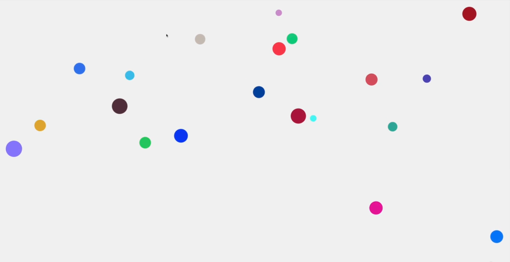
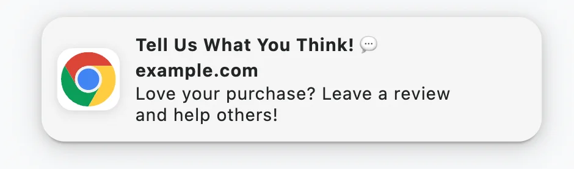
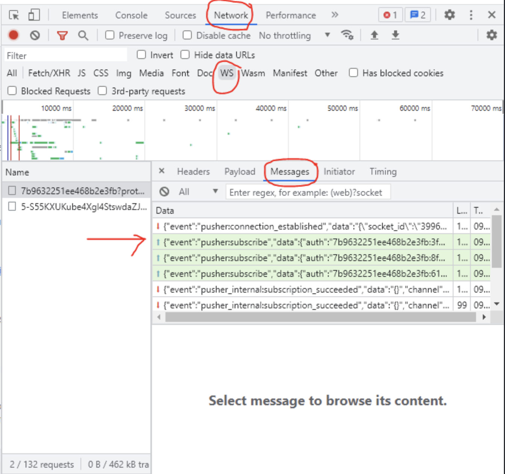

# INDEX

- [INDEX](#index)
  - [API](#api)
  - [HTML5 APIs](#html5-apis)
  - [Storing Data in the Browser](#storing-data-in-the-browser)
    - [Cookies](#cookies)
    - [LocalStorage \& SessionStorage](#localstorage--sessionstorage)
      - [LocalStorage](#localstorage)
      - [Session storage](#session-storage)
      - [Storage event](#storage-event)
    - [IndexedDB](#indexeddb)
  - [History API](#history-api)
    - [History Object](#history-object)
  - [Location API (Routing \& Navigation)](#location-api-routing--navigation)
    - [Barba.js (Routing Library)](#barbajs-routing-library)
  - [Intersection observer API](#intersection-observer-api)
    - [Examples of using the Intersection Observer API](#examples-of-using-the-intersection-observer-api)
  - [MediaStream API](#mediastream-api)
  - [Geolocation API](#geolocation-api)
  - [Performance API](#performance-api)
  - [Web Audio API](#web-audio-api)
  - [Canvas API](#canvas-api)
  - [Notifications API](#notifications-api)
  - [WebSockets API](#websockets-api)
    - [Realtime updates techniques](#realtime-updates-techniques)
      - [Client Pull (Short/Long Polling)](#client-pull-shortlong-polling)
      - [Server Push (WebSockets)](#server-push-websockets)
      - [Server Push (Server Send Events)](#server-push-server-send-events)
    - [Websocket (Pusher) Services](#websocket-pusher-services)
      - [pusher.com debug console](#pushercom-debug-console)
  - [Third-party APIs](#third-party-apis)
    - [Leaflet API](#leaflet-api)
      - [installation](#installation)
      - [code](#code)
    - [Public APIs for free](#public-apis-for-free)
  - [Notes](#notes)

---

## API

**API** stands for Application Programming Interface. It is a set of rules that allows one piece of software application to talk to another. It defines the methods for communication between different software components.

or, it's a piece of software that can be used by another piece of software, in order to allow applications to talk to each other.

- There're many types of APIs in web development, such as:

  - **DOM API**: to manipulate the DOM.
  - **Fetch API**: to make network requests.
  - **Web Storage API**: to store data in the browser.
  - **Online APIs**: to interact with online services.
    - It's an application running on a server, that receives requests for data, and sends data back as a response.

- **Endpoints**: are the locations (URL) where APIs can send and receive data.

  - Request: is the data sent to the API.
  - Response: is the data sent back from the API.

- **API data format**

  - `XML`
    - stands for "eXtensible Markup Language". It's a markup language that defines a set of rules for encoding documents in a format that is both human-readable and machine-readable.
    - it's a lightweight, text-based **format** that is used to store and transport data.
    - It's not used as much as it used to be. ❌
  - `JSON`

    - stands for "JavaScript Object Notation". It's a lightweight data-interchange format that is easy for humans to read and write, and easy for machines to parse and generate.
    - It's the most popular data format used in APIs. ✅
    - JSON is ideal for data exchange between JavaScript clients and servers in any language (e.g., Ruby, PHP, Java).

      - **No Comments**: JSON does not support comments. Use [JSON5](http://json5.org/) for features like comments and unquoted keys.
      - **Key Concepts**:
        - **Serialize**: Convert objects to JSON.
        - **Deserialize**: Convert JSON to objects.

    - JSON Methods

      - `JSON.stringify`: Converts objects to JSON.

        - Syntax: `JSON.stringify(value, replacer, space)`
        - Parameters:
          - `value`: The object to convert.
          - `replacer`: Optional function to transform values.
          - `space`: Optional spaces for indentation.

      - `JSON.parse`: Converts JSON back to an object.

        - Syntax: `JSON.parse(str, reviver)`
        - Parameters:
          - `str`: The JSON string to parse.
          - `reviver`: Optional function to transform values.

        ```js
        let str = '{"title":"Conference","date":"2017-11-30T12:00:00.000Z"}';
        let meetup = JSON.parse(str, (key, value) => (key === 'date' ? new Date(value) : value));
        ```

---

## HTML5 APIs

a set of APls define that describe how to interact with features of web browsers.

- each of the HTML5 APIs focuses on one or more objects that browsers implement to deliver specific functionality

| API            | Description                                                         |
| -------------- | ------------------------------------------------------------------- | -------------- |
| geolocation    | How to tell where the user is located                               |
| local Storage  | Store information in the browser (even when user closes tab/window) | sessionStorage |
| sessionStorage | Store information in the browser while a **tab/window** is open     |
| history        | How to access items from the browser's history                      |

---

## Storing Data in the Browser

### Cookies

Cookies are strings of data that are stored in the browser. They are a part of the HTTP protocol,

- Cookies are usually set by a web-server using the response `Set-Cookie` HTTP-header. Then, the browser automatically **adds them to (almost) every request to the same domain** using the Cookie HTTP-header.
- One of the most widespread use cases is **authentication**:

  1. Upon sign in, the server uses the Set-Cookie HTTP-header in the response to set a cookie with a unique “session identifier”.
  2. Next time when the request is sent to the same domain, the browser sends the cookie over the net using the Cookie HTTP-header. **So the server knows who made the request**.

- We can also access cookies from the browser, using `document.cookie` property.

- Writing to `document.cookie`:

  - A write operation to `document.cookie` updates only cookies mentioned in it, but doesn’t touch other cookies.

    - That’s because the `document.cookie=...` operation does not overwrite all cookies. It only sets the mentioned cookie

    ```js
    document.cookie = 'user=John'; // update only cookie named 'user'
    ```

- Technically, name and value can have any characters. To keep the valid formatting, **They must be encoded** -> they should be escaped using a built-in **encodeURIComponent** function:

  ```js
  // special characters (spaces), need encoding
  let name = 'my name';
  let value = 'John Smith';

  // encodes the cookie as my%20name=John%20Smith
  document.cookie = encodeURIComponent(name) + '=' + encodeURIComponent(value);

  alert(document.cookie); // ...; my%20name=John%20Smith
  ```

- One cookie may not exceed `4KB` in size. The number of cookies allowed on a domain is around `20+` (varies by browser).

- **Cookies Options:**

  - Cookies have several options, many of them are important and should be set. The options are listed after `key=value`, delimited by `;`, like this:

    ```js
    document.cookie = 'user=John; path=/; expires=Tue, 19 Jan 2038 03:14:07 GMT';
    ```

  - some options:

    - `path=/`, by default current path, makes the cookie visible only under that path.

    - domain=site.com`, by default a cookie is visible on the current domain only. If the domain is set explicitly, the cookie becomes visible on subdomains -> (We can’t set any domain)

      ```js
      // if we set a cookie at site.com website...
      document.cookie = 'user=John';

      // ...we won't see it at forum.site.com
      alert(document.cookie); // no user
      ```

    - `expires` or `max-age`, sets the cookie expiration time. Without them the cookie dies when the browser is closed.
    - `secure` makes the cookie **HTTPS**-only.
    - `samesite` forbids the browser to send the cookie with requests coming from outside the site. This helps to prevent XSRF attacks.

- **Cookies Notes**:
  - Third-party cookies may be forbidden by the browser, e.g. Safari does that by default.

---

### LocalStorage & SessionStorage

Web storage objects `localStorage` and `sessionStorage` allow to save **key/value pairs** in the browser.

- Persistence:

  - The data stored in `localStorage` persists even after the browser is closed and reopened. (persists across sessions)
  - `sessionStorage` is similar to `localStorage`; the difference is that while data stored in `localStorage` has no expiration time, data stored in `sessionStorage` gets cleared when the page session ends. A page session lasts as long as the browser is open, and survives over page reloads and restores.
    - works for single session (tab/window). even if the tabs opened from the same page, they have different `sessionStorage` **(different sessions)**.
    - it persists across page reloads, but not browser restarts.

> What’s interesting about them is that the data survives a page refresh (for `sessionStorage`) and even a full browser restart (for `localStorage`).

- We already have `cookies`. Why additional objects?
  - Unlike cookies, web storage objects are not sent to server with each request. Because of that, we can store much more. Most modern browsers allow at least 5 megabytes of data (or more) and have settings to configure that.
  - Also unlike cookies, the server can’t manipulate storage objects via `HTTP` headers. Everything’s done in JavaScript.
  - The storage is bound to the origin (domain/protocol/port triplet). That is, different protocols or subdomains infer different storage objects, they can’t access data from each other.
- Both storage objects provide the same methods and properties:

  - `setItem(key, value)` – store key/value pair.
  - `getItem(key)` – get the value by key.
  - `removeItem(key)` – remove the key with its value.
  - `clear()` – delete everything.
  - `key(index)` – get the key on a given position.
  - `length` – the number of stored items.

---

#### LocalStorage

- The `localStorage` read-only property of the `window` interface allows you to access a `Storage` object for the Document's origin; the stored data is saved across browser sessions.
  
  - "Document's origin" means the( protocol, hostname, and port number) of the document (page) that loaded the script. This is the same rule as for `cookies`.
- The main features of localStorage are:

  - Shared between all tabs and windows from the same origin.
  - The data does not expire. It remains after the browser restart and even OS reboot.

- Object-like access

  - We can also use a plain object way of getting/setting keys, like this:

    ```js
    // set key
    localStorage.test = 2;

    // get key
    alert(localStorage.test); // 2

    // remove key
    delete localStorage.test;
    ```

  - That’s allowed for historical reasons, and mostly works, but generally not recommended, because:
    1. If the key is user-generated, it can be anything, like `length` or `toString`, or another built-in method of localStorage. In that case getItem/setItem work fine, while object-like access fails
    2. There’s a storage event, it triggers when we modify the data. That event does not happen for object-like access. We’ll see that later in this chapter.

- The keys and the values stored with localStorage are always in the `UTF-16 DOMString format`, which uses two bytes per character. As with objects, integer keys are automatically converted to strings.

  - > **Both key and value must be strings**

    - > If they were any other type, like a number, or an object, they would get converted to a string automatically:

  - We can use JSON to store objects though: So to store the data structure correctly in localStorage, store it as a **JSON-strings** with `JSON.stringify()`

    ```js
    localStorage.setItem('user', JSON.stringify({ name: 'John' }));

    // sometime later
    let user = JSON.parse(localStorage.user);
    alert(user.name); // John
    ```

    - if you pass an array to the localStorage, it will be stored as a string, so you need to parse it back to an array when you get it back.

      ```js
      const workouts = ['running', 'swimming', 'cycling'];
      localStorage.setItem('workouts', workouts);
      const data = localStorage.getItem('workouts'); // "running,swimming,cycling" -> not an array ❌
      ```

- localStorage is `Blocking`, so it can slow down the app
- _note_ : when you `get` items from `localStorage`, they lose the `prototype Chain` they had
- **1oca1Storage** is best suited to information that:
  - Only changes at set intervals (such as timetables / price lists), which can be helpful to store offline.
  - The user might want to come back and use again (such as saving preferences / settings).

```javascript
// ---------------add data item to localStorage //object--------------- //
localStorage.setItem('myCat', 'Tom');

// ---------------reading the localStorage item--------------- //
const cat = localStorage.getItem('myCat');

// ---------------Number of items stored--------------- //
const itemsNum = localStorage.length;

// ---------------removing the localStorage item--------------- //
localStorage.removeItem('myCat');

// ---------------removing all the localStorage //items--------------- //
localStorage.clear();

/////////////////////////////////////////////////
// if value is not a string (here (workouts) is an array) => convert it using ( JSON.stringify() )
localStorage.setItem('workouts', JSON.stringify(workouts));
// then to read the item => use ( JSON.parse() )
const data = JSON.parse(localStorage.getItem('workouts'));
```

- **What should & shouldn't be stored in localStorage?**

  - **Should**:
    - User preferences.
    - Analytics & Ad tracking.
    - User data that is needed across sessions.
    - User data that is needed across different tabs.
    - User data that is needed offline.
  - **Shouldn't**:
    - Sensitive data (passwords, credit card information, etc).
      - why? because it's not secure, it's not encrypted, and it's accessible by JavaScript using XSS attacks.
    - Large amounts of data (localStorage is limited to 5MB).
    - Data that needs to be kept up-to-date (localStorage is static).

---

#### Session storage

The `sessionStorage` object is used much less often than `localStorage`

- Properties and methods are the same, but it’s much more limited:

  - The `sessionStorage` exists only within the current browser tab.

    - Another tab with the same page will have a different storage.
    - But it is shared between `iframes` in the same tab (assuming they come from the same origin).

  - The data survives page refresh, but not closing/opening the tab.
    - That’s exactly because `sessionStorage` is bound not only to the origin, but also to the browser tab. For that reason, sessionStorage is used sparingly.

- **sessionStorage** is more suited to information that:

  - Form data that is only needed for a single session
  - Changes frequently (each time the user visits the site - such as whether they are logged in or location data).
  - Is personal and should not be viewed by other users of the device.
  - `JWTs` are often stored in sessionStorage.

---

#### Storage event

- When the data gets updated in `localStorage` or `sessionStorage`, `storage` event triggers, with properties:

  - `key` – the key that was changed (`null` if `.clear()` is called).
  - `oldValue` – the old value (`null` if the key is newly added).
  - newValue – the new value (`null` if the key is removed).
  - url – the url of the document **where the update happened**.
  - storageArea – either `localStorage` or `sessionStorage` object where the update happened.

> **Note:** The important thing is: the event triggers on all window objects where the storage is accessible, except the one that caused it.

```js
// triggers on updates made to the same storage from other documents
window.onstorage = event => {
  // can also use window.addEventListener('storage', event => {
  if (event.key != 'now') return;
  alert(event.key + ':' + event.newValue + ' at ' + event.url);
};

localStorage.setItem('now', Date.now());
```

- **Syncing tabs with `storage` event**:

  - The `storage` event is triggered when a storage area (`localStorage` or `sessionStorage`) has been modified in the context of another document.

    - This is common if you have multiple tabs open (of the same website) and one of them modifies the storage and reflects the changes in the other tabs.
    - This event is triggered on the `window` whenever `localStorage` is modified in another tab.

    ```js
    window.addEventListener('storage', event => {
      if (event.key === 'workouts') {
        // the modified key in the storage
        console.log('Workouts have been updated');
      }
    });
    ```

  - **Note**: The `storage` event is only triggered when a different document changes the storage. It is not triggered when the same document that made the change calls `setItem()`.

---

### IndexedDB

IndexedDB is a database that is built into a browser, much more powerful than `localStorage`.

- It allows to store and retrieve objects that are indexed with a key; it supports transactions for reliability, and can store much larger amounts of data.
- It's **Asynchronous**. so it doesn't block the main thread. and as a drawback it doesn't support `promises` and heavily relies on `callbacks`.

  - It depends on callbacks, so it’s a bit more complex to use than `localStorage`. But it’s much more powerful.
  - There're libraries that wrap `IndexedDB` in promises, like [idb](https://github.com/jakearchibald/idb).

- **Features**:
  - Stores almost any kind of values by keys, multiple key types.
  - Supports transactions for reliability.
  - Supports key range queries, indexes.
  - Can store much bigger volumes of data than localStorage (**Gigabytes** or more) as it's stored on the client-side (not on the server).
  - Supports versioning schemas, so you can update the database structure without losing the old data.
- When to use it:

  - When you need to store a lot of data.
  - When you need to store big data, as you can't store big strings in `localStorage`.

    ```js
    // localStorage
    localStorage.setItem('big', new Array(1000000).fill('x').join(''));
    // Uncaught DOMException: Failed to execute 'setItem' on 'Storage': Setting the value of 'big' exceeded the quota.
    ```

  - That power is usually excessive for traditional client-server apps. IndexedDB is intended for **offline apps**, to be combined with **ServiceWorkers** and other technologies.

- It's more complex than `localStorage`, a it requires these steps:

  1. Open a database with a `name` and a `version`.
  2. Create an object store in the database.
  3. Start a transaction and make a request to do some database operation, like adding or retrieving data.
  4. Wait until the operation is done.
  5. Do something with the results (if any).

- Example:

  ```js
  let db;

  const request = indexedDB.open('myDatabase', 1); // open a database with a name and a version

  // create an object store in the database
  request.onupgradeneeded = event => {
    db = event.target.result;
    const objectStore = db.createObjectStore('users', { keyPath: 'username' });
    // create an index for the object store
    objectStore.createIndex('name', 'name', { unique: false });
    objectStore.createIndex('email', 'email', { unique: true });
  };

  // add a new record to the users object store
  request.onsuccess = event => {
    db = event.target.result;
    const transaction = db.transaction(['users'], 'readwrite');
    const objectStore = transaction.objectStore('users');
    const request = objectStore.add({
      username: 'JohnDoe',
      name: 'John',
      email: 'john@test.com'
    });
  };

  request.onerror = event => {
    console.log('error: ', event.target.error);
  };

  // do something with the results (if any)
  request.oncomplete = event => {
    console.log('Success: ', event);
  };
  ```

  - The code above creates a database named `myDatabase` with a single object store named `users`. The object store has a key path of `username` and two indexes, `name` and `email`.
  - The code then adds a new record to the `users` object store.

- The `indexedDB` object is available in all modern browsers, except for Internet Explorer.

> More info here [javascript.info/indexeddb](https://javascript.info/indexeddb)

---

## History API

If you move from one page to another, the browser's history remembers which pages you visited. But Ajax applications do not load new pages, so they can use the hi story API to update the location bar and history.

- Because the history object is a child of the window object, you can use its name directly in the script; you can write `history. pushState()`, you do not need to write `window.history.pushState()`.

  ```js
  history.pushState(state, title, url);
  ```

### History Object

The HTML5 history API describes the functionality of the history object in modern web browsers. It lets you access and update the browser history (but only for pages the user visited on your site).


---

## Location API (Routing & Navigation)

The Location interface represents the location (URL) of the object it is linked to. Changes done on it are reflected on the object it relates to. Both the Document and Window interface have such a linked Location, accessible via Document.location and Window.location respectively.

- The `window.location` object can be used to get the current page address (URL) and to redirect the browser to a new page.

  ```js
  // get the current page URL
  console.log(window.location.href);
  // redirect the browser to a new page
  window.location.href = 'https://www.google.com';
  ```

---

### Barba.js (Routing Library)

- [Barba.js](https://barba.js.org/) is a small (`7kb` minified) and easy-to-use library that helps you create fluid and smooth transitions between your website's pages.
- It makes your website run like a SPA (Single Page Application) and help reduce the delay between your pages, minimize browser HTTP requests and enhance your user’s web experience.

- Resources:
  - [Video Tutorial](https://www.youtube.com/watch?v=aMucZErEdZg)

---

## Intersection observer API

It's a browser API that allows you to **detect when an element is visible (overlapping / intercepting) in the viewport**. It's useful for lazy loading images, infinite scrolling, and more.

> [More Info](https://blog.arnellebalane.com/the-intersection-observer-api-d441be0b088d)

- It allows for **observing changes to how much of a `target` element’s area intersects with that of another element or the `viewport`**.
  

  - This is a replacement for the old way of doing this with the `scroll` event where you would listen for the scroll event and then check if an element is in the viewport (which is not efficient performance-wise).

- **Use Cases**:
  - Lazy-loading.
  - infinite scrolling.
- **Efficient**: Replaces the `scroll` event on `window`.

- By default, the Intersection Observer API uses the **viewport** as the **intersection root**, and only executes the callback when the target element enters and exits the viewport.
  
- It takes 2 parameters:

  - A `callback function` that is executed whenever the intersection between the target element and the intersection root changes.

    - It takes 2 parameters:

      - An array of `entries` that contain information about the intersection between the target element and the intersection root. **Why?** Because the Intersection Observer can observe multiple target elements at once.

        ```js
        const handlerFunction = function (entries) {
          entries.forEach(entry => {
            // do something with the entry
          });
        };

        const observer = new IntersectionObserver(handlerFunction, options);

        // Observing multiple target elements at the same time, not just one
        observer.observe(targetElement1);
        observer.observe(targetElement2);
        observer.observe(targetElement3);
        ```

  - An `options` object that specifies the configuration of the Intersection Observer.

    - A `threshold` is a value in which the Intersection Observer will execute the callback function whenever the intersection ratio reaches that value (the percentage of the target element that is visible in the intersection root).
      
      

      - It is also possible to set multiple threshold values by passing an array of threshold values in the `options` object.

      ```js
      const options = {
        threshold: [0, 0.25, 0.5, 0.75, 1] // execute the callback function when the target element is at least 0%, 25%, 50%, 75%, and 100% visible in the viewport
      };
      const observer = new IntersectionObserver(handlerFunction, options);
      // executes the callback function when the target element enters/exits the intersection root (i.e. intersection ratio of 0), then again when its intersection ratio crosses 0.25, then 0.5, etc.
      ```

- **Creating an Intersection Observer**:

  ```js
  const observer = new IntersectionObserver(
    function (entries, observer) {
      entries.forEach(entry => {
        if (!entry.isIntersecting) return;
        // do something with the entry if it is intersecting
      });
    },
    {
      // options of the observer
      threshold: 0.1 // execute the callback function when the target element is at least 10% visible in the viewport, the default is 0
    }
  );

  // Use the observer to observe a target element
  observer.observe(targetElement);
  ```

- The `callback function`, when executed, is automatically passed with:
  - array of `entries`, which are objects that contain information about the intersection between the target element and the intersection root.
  - the `observer` object itself. which can be used to unobserve the target element.
- it is possible to adjust the intersection root’s rectangle by setting `root margin`

---

### Examples of using the Intersection Observer API

- **Sticky navigation**:

  ```js
  const nav = document.querySelector('.nav'); // selecting the nav element that we want to make sticky
  const navHeight = nav.getBoundingClientRect().height; // to get the exact height without hard-coding it (instead of writing "-90px")

  // callback function
  const stickyNavHandler = function (entries) {
    const [entry] = entries; // destructuring : same as entry =  entries[0]

    // if the entry is not intersecting (i.e. the target element is not visible in the viewport), make the nav sticky, otherwise remove the sticky class
    if (!entry.isIntersecting) nav.classList.add('sticky');
    else nav.classList.remove('sticky');
  };

  const headerObserver = new IntersectionObserver(stickyNavHandler, {
    root: null, // as we are observing the viewport
    threshold: 0, // from intersection ratio
    rootMargin: `-${navHeight}px` //(instead of writing "-90px")
  });

  headerObserver.observe(header);
  ```

- **Lazy Loading Images**

  ```html
  
  ```

  ```js
  const imgTargets = document.querySelectorAll('img[data-src]');

  const loadImg = function (entries, observer) {
    const [entry] = entries;

    if (!entry.isIntersecting) return; // exit the function if the entry is not intersecting

    // Replace src with data-src
    entry.target.src = entry.target.dataset.src;

    // Remove the blur effect when the new high-resolution image is loaded
    entry.target.addEventListener('load', function () {
      entry.target.classList.remove('lazy-img'); // class that applies a blur effect to the image
    });

    // stop observing the target element
    observer.unobserve(entry.target);
  };

  const imgObserver = new IntersectionObserver(loadImg, {
    root: null, // as we are observing the viewport
    threshold: 0, // from intersection ratio
    rootMargin: '200px' // to load the image 200px before it appears in the viewport
  });

  imgTargets.forEach(img => imgObserver.observe(img));
  ```

- **Reveal Sections on Scroll**

  ```js
  const revealSection = function (entries, observer) {
    const [entry] = entries;

    if (!entry.isIntersecting) return; // exit the function if the entry is not intersecting

    entry.target.classList.remove('section--hidden');

    // stop observing the target element
    observer.unobserve(entry.target);
  };

  const sectionObserver = new IntersectionObserver(revealSection, {
    root: null, // as we are observing the viewport
    threshold: 0.15 // from intersection ratio
  });

  allSections.forEach(function (section) {
    sectionObserver.observe(section);
    section.classList.add('section--hidden');
  });
  ```

- **Infinite Scrolling**

  ```js
  const loadMore = function (entries) {
    const [entry] = entries;

    if (!entry.isIntersecting) return; // exit the function if the entry is not intersecting

    // Load more content
    loadMoreContent();

    // stop observing the target element
    observer.unobserve(entry.target);
  };

  const observer = new IntersectionObserver(loadMore, {
    root: null, // as we are observing the viewport
    threshold: 0, // from intersection ratio
    rootMargin: '200px' // to load more content 200px before the user reaches the bottom of the page
  });

  observer.observe(document.querySelector('.sentinel'));
  ```

- **Calculating Ad view time**

  ```js
  const adObserver = new IntersectionObserver(
    function (entries, observer) {
      entries.forEach(entry => {
        if (entry.isIntersecting) {
          // start the timer when the ad is visible
          adVisibleStartTime = Date.now();
        } else {
          // stop the timer when the ad is not visible
          const adVisibleEndTime = Date.now();
          const adVisibleTime = adVisibleEndTime - adVisibleStartTime;
          console.log(`Ad was visible for ${adVisibleTime}ms`);
          adVisibleStartTime = null; // reset the start time
        }
      });
    },
    {
      root: null, // as we are observing the viewport
      threshold: 0.5 // execute the callback function when the target element is at least 50% visible in the viewport
    }
  );

  adObserver.observe(adElement);
  ```

---

## MediaStream API

The `MediaStream API` provides support for streaming media data. It allows you to access the user's camera and microphone, and to get the stream of data from them.

```js
const constraints = {
  video: true, // to get the video stream
  audio: true // to get the audio stream
};

function successCallback(stream) {
  const video = document.querySelector('video');
  video.srcObject = stream;
  video.onloadedmetadata = function (e) {
    video.play();
  };
}

function errorCallback(err) {
  console.log('The following error occurred: ' + err);
}

navigator.mediaDevices.getUserMedia(constraints).then(successCallback).catch(errorCallback);
```

---

## Geolocation API

It's a web API that allows web applications to access the user's geographical location information.

- [Documentation](https://developer.mozilla.org/en-US/docs/Web/API/Geolocation_API/Using_the_Geolocation_API#examples)
- **Installation**: Native API, available in the browser as part of the global `navigator` object.
- **Purpose**: Allows web apps to access user location with permission for privacy.
- **Usage**:
  - `Geolocation.getCurrentPosition()`: Gets the current location.
  - `Geolocation.watchPosition()`: Calls a handler whenever the device's position changes.
- **Arguments**:

  - **Mandatory** `success callback`: Executes with `GeolocationPosition` object on success.
  - **Optional** `error callback`: Executes with `GeolocationPositionError` object on failure.
  - **Optional** `options` object for position retrieval settings.

- There's 2 main methods to get the user's location:

  - `getCurrentPosition()`:
    - gets the current position of the device.
  - `watchPosition()`:
    - gets the current position of the device and continues to watch for changes in the position (useful for real-time tracking like in **maps**).

- Example:

  ```js
  // getCurrentPosition{successFunction, failFunction)
  navigator.geolocation.getCurrentPosition(
    function (position) {
      console.log(position);

      const { latitude } = position.coords;
      const { longitude } = position.coords;
      // console.log(`https://www.google.pt/maps/@${latitude},${longitude}`);
    },
    function () {
      alert('Could not get your position');
    }
  );
  ```

- if you need to check browser support for the Geolocation API, you can use the following code:

  ```js
  // check if geolocation is available in the "navigator" object
  if ('geolocation' in navigator) {
    console.log('Geolocation is available');
  } else {
    console.log('Geolocation is not available');
  }
  ```

---

## Performance API

It's a web API that provides access to performance-related information for the current page. It allows web developers to measure the performance of their applications.

- Common use cases include:

  - **Measuring page load time**.
  - **Measuring resource load times (images, scripts, etc.)**.
  - **Measuring network performance**.
  - **Measuring rendering performance**.
  - **Measuring user interactions**.

- Methods:

  - `performance.mark()`: Adds a timestamp to the browser's performance timeline with the given name.
  - `performance.measure()`: Measures the time between two marks.
  - `performance.getEntries()`: Returns a list of performance entries.
  - `performance.getEntriesByName()`: Returns a list of performance entries with the given name.
  - `performance.getEntriesByType()`: Returns a list of performance entries with the given type.
  - `performance.now()`: Returns a high-resolution timestamp.
  - `performance.timing`: Provides timing information for the page load.
  - `performance.navigation`: Provides information about the navigation of the page.
  - `performance.memory`: Provides memory usage information.
  - `performance.clearMarks()`: Removes all marks with the given name.
  - `performance.clearMeasures()`: Removes all measures with the given name.
  - `performance.clearResourceTimings()`: Removes all resource timings.

- Measuring time is done by marking the start and end of an operation, then measuring the time between the two marks. Then you can get the performance entries to see the results.

  - usually the `performance.entries` are stored in an array of objects, each object represents a performance entry (like a mark or a measure).
  - or you can directly get the specific entry by its name using `performance.getEntriesByName('name')`.

- if you want to get data about a specific type of performance entry (like resource timings), you can use `performance.getEntriesByType('type')`.

  ```js
  // get all performance entries
  const resourcesEntries = performance.getEntriesByType('resource');
  console.log(resourcesEntries);
  // [
  // image resource entry
  //  {
  //    "name": "https://www.google.com/pagead/1p-user-list/962985656/?backend=innertube&cname=1&cver=2_20250103&data=backend%3Dinnertube%3Bcname%3D1%3Bcver%3D2_20250103%3Bptype%3Df_view_s%3Bsubscribed%3D1%3Btype%3Dview%3Butuid%3DDGuaewBqmqF5buNPnoT1Bg%3Butvid%3DenktD6bvWU4&is_vtc=0&ptype=f_view_s&random=957460933&utuid=DGuaewBqmqF5buNPnoT1Bg",
  //    "entryType": "resource",
  //    "startTime": 524288,
  //    "duration": 331.9000000000233,
  //    "initiatorType": "img",
  //    "deliveryType": "",
  //    "nextHopProtocol": "h3",
  //    "renderBlockingStatus": "non-blocking",
  //    "workerStart": 524288,
  //    "redirectStart": 524288,
  //    "redirectEnd": 524439.7000000001,
  //    "fetchStart": 524440.3,
  //    "domainLookupStart": 524440.3,
  //    "domainLookupEnd": 524493.6,
  //    "connectStart": 524493.6,
  //    "secureConnectionStart": 524493.8,
  //    "connectEnd": 524565.1,
  //    "requestStart": 524494,
  //    "responseStart": 524619.7000000001,
  //    "firstInterimResponseStart": 0,
  //    "responseEnd": 524619.9,
  //    "transferSize": 342,
  //    "encodedBodySize": 42,
  //    "decodedBodySize": 42,
  //    "responseStatus": 0,
  //    "serverTiming": []
  //  },
  //  // fetch resource entry
  //  {
  //    "name": "https://www.youtube.com/ptracking?html5=1&video_id=enktD6bvWU4&cpn=R0pzYPkJt6rla_2L&ei=3R96Z_nOK7TpxN8Poa266AQ&ptk=youtube_single&oid=41xZnyx3Bp4j5fKrhDEjfw&ptchn=DGuaewBqmqF5buNPnoT1Bg&pltype=content",
  //    "entryType": "resource",
  //    "startTime": 524286.9,
  //    "duration": 91.30000000004657,
  //    "initiatorType": "fetch",
  //    "deliveryType": "",
  //    "nextHopProtocol": "h3",
  //    "renderBlockingStatus": "non-blocking",
  //    "workerStart": 524286.9,
  //    "redirectStart": 0,
  //    "redirectEnd": 0,
  //    "fetchStart": 524287,
  //    "domainLookupStart": 524287,
  //    "domainLookupEnd": 524287,
  //    "connectStart": 524287,
  //    "secureConnectionStart": 524287,
  //    "connectEnd": 524287,
  //    "requestStart": 524287.9,
  //    "responseStart": 524378.1,
  //    "firstInterimResponseStart": 0,
  //    "responseEnd": 524378.2000000001,
  //    "transferSize": 300,
  //    "encodedBodySize": 0,
  //    "decodedBodySize": 0,
  //    "responseStatus": 204,
  //    "serverTiming": []
  //  }
  //]
  ```

  - There're a lot of types to check for, like `navigation`, `paint`, `resource`, `element`, `longtask`, etc.
  - Each type has a lot of types, like `fetch`, `xmlhttprequest`, `img`, `script`, `css`, etc.

- **Examples:**

  - Measuring page load time

    ```js
    // mark the start of the page load
    performance.mark('start');

    // ... logic to load the page, ex: fetching data, rendering elements, etc.

    // mark the end of the page load
    performance.mark('end');

    // measure the time between the start and end marks
    performance.measure('page load time', 'start', 'end');

    // get the performance entries
    const entries = performance.getEntries();
    console.log(entries);
    ```

  - Measure heavy operations

    ```js
    function heavyOperation() {
      for (let i = 0; i < 1000000; i++) {
        // do something heavy
      }
    }

    // mark the start of the operation
    performance.mark('start-operation');

    // ... heavy operation
    heavyOperation();

    // mark the end of the operation
    performance.mark('end-operation');

    // measure the time between the start and end marks
    performance.measure('operation time', 'start-operation', 'end-operation');

    // get the performance entries
    const entries = performance.getEntries();
    console.log(entries);
    ```

---

## Web Audio API

It's a high-level JavaScript API for processing and synthesizing audio in web applications. It provides a way to create and manipulate sounds directly in the browser.

- [Documentation](https://developer.mozilla.org/en-US/docs/Web/API/Web_Audio_API)
- **Installation**: Native API, available in the browser as part of the global `AudioContext` object.
- **Purpose**: Allows web apps to create, manipulate, and play audio.
- **Usage**:

  - Create an `AudioContext` object.
  - Create audio sources (like `OscillatorNode` or `MediaElementAudioSourceNode`).
  - Connect audio nodes together to create an audio graph.
  - Play audio using the `start()` method.

- **Example**:

  ```js
  // create an AudioContext object
  const audioContext = new AudioContext();

  // create an OscillatorNode object
  const oscillator = audioContext.createOscillator();

  // set the frequency & type of the oscillator
  oscillator.frequency.value = 440;
  oscillator.type = 'sine';

  // connect the oscillator to the destination (speakers)
  oscillator.connect(audioContext.destination);

  // start the oscillator
  oscillator.start();

  // stop the oscillator after 3 seconds
  setTimeout(() => {
    oscillator.stop();
  }, 3000);
  ```

  - The `OscillatorNode` object represents a periodic waveform, like a sine wave, square wave, etc.
  - The `connect()` method connects the oscillator to the destination (speakers).
  - The `start()` method starts the oscillator.
  - The `stop()` method stops the oscillator.
  - The `frequency` property sets the frequency of the oscillator.
  - The `type` property sets the type of the oscillator (sine, square, sawtooth, triangle).

---

## Canvas API

It's a web API that allows you to draw graphics and animations on a web page using JavaScript. It provides a way to create and manipulate images, shapes, and text directly in the browser.

- **Installation**: Native API, available in the browser as part of the global `CanvasRenderingContext2D` object.
- Why?
  - It's a replacement of manually creating divs and styling them with CSS. and instead, you can draw shapes, images, and text directly on the canvas.
  - It's also very performant because it uses the GPU to render the graphics. so compared to the DOM and CSS animations, **it's much faster 🚀**.
  - We can do more complex and creative things with the canvas API, like creating games, animations, data visualizations, etc. and also create animations and effects that are not possible with CSS.
- Most of the charts and graphs libraries use the Canvas API to draw the charts.
- **Usage**:

  - Create a `canvas` element in the HTML.
  - Get the `CanvasRenderingContext2D` object from the canvas element.
  - Use the `CanvasRenderingContext2D` object to draw shapes, images, and text on the canvas.
  - It's a common naming convention to use `ctx` for the `CanvasRenderingContext2D` object.

- **Examples**:

  - Drawing a rectangle on the canvas:

    ```html
    <!-- This is an element that can be selected using JavaScript and CSS -->
    <canvas id="myCanvas" width="200" height="100"></canvas>
    ```

    ```js
    // get the canvas element
    const canvas = document.getElementById('myCanvas');
    // get the CanvasRenderingContext2D object
    const ctx = canvas.getContext('2d');
    // draw a rectangle on the canvas
    ctx.fillStyle = 'red';
    ctx.fillRect(10, 10, 50, 50); // x, y, width, height
    ```

  - Drawing a "L" shape on the canvas:

    ```js
    // get the canvas element
    const canvas = document.getElementById('myCanvas');
    // get the CanvasRenderingContext2D object
    const ctx = canvas.getContext('2d');
    // draw a "L" shape on the canvas
    ctx.fillStyle = 'blue';

    // Option 1: draw 2 rectangles to form the "L" shape (one vertical and one horizontal)
    ctx.fillRect(10, 10, 50, 100); // x, y, width, height
    ctx.fillRect(60, 60, 50, 50); // x, y, width, height

    // Option 2: draw a single rectangle with a hole in the middle
    ctx.fillRect(10, 10, 100, 100); // x, y, width, height
    ctx.clearRect(60, 60, 50, 50); // x, y, width, height
    ```

  - Building bouncing balls animation:
    

    ```html
    <canvas id="myCanvas" width="800" height="600"></canvas>
    ```

    ```js
    const canvas = document.getElementById('myCanvas');
    canvas.width = window.innerWidth;
    canvas.height = window.innerHeight;
    const balls = [];
    const ctx = canvas.getContext('2d');

    class Ball {
      constructor(x, y) {
        this.x = x;
        this.y = y;
        this.dx = Math.random() * 4 - 2; // velocity on x-axis
        this.dy = Math.random() * 4 - 2; // velocity on y-axis
        this.size = Math.random() * 30 + 10;
        this.color = Ball.getRandomColor();
      }

      static getRandomColor() {
        const letters = '0123456789ABCDEF';
        let color = '#';
        for (let i = 0; i < 6; i++) {
          color += letters[Math.floor(Math.random() * 16)];
        }
        return color;
      }

      draw() {
        ctx.beginPath();
        ctx.fillStyle = this.color;
        ctx.arc(this.x, this.y, this.size, 0, Math.PI * 2);
        ctx.fill();
      }

      update() {
        // update the position of the ball based on its velocity
        this.x += this.dx;
        this.y += this.dy;

        // check if the ball hits the walls of the canvas
        if (this.x + this.size > canvas.width || this.x - this.size < 0) {
          this.dx *= -1;
        }
        if (this.y + this.size > canvas.height || this.y - this.size < 0) {
          this.dy *= -1;
        }

        // Re-draw the ball after updating its position
        this.draw();
      }
    }

    function animateBalls() {
      // 1. Clear the canvas to remove the previous frame
      ctx.clearRect(0, 0, canvas.width, canvas.height);
      // 2. Update and draw each ball
      balls.forEach(ball => ball.update());
      // 3. Request the next frame to create an animation loop
      requestAnimationFrame(animateBalls); // recursively call the function to create an animation loop (60fps)
    }

    // create new balls on click
    canvas.addEventListener('click', e => {
      const x = e.clientX;
      const y = e.clientY;
      const ball = new Ball(x, y, 2, 2, 30, 'blue');
      balls.push(ball);
    });

    animateBalls();
    ```

- You can find great canvas examples in [CodePen](https://codepen.io/), [CodeSandbox](https://codesandbox.io/), and [Dribbble](https://dribbble.com/).

---

## Notifications API

It's a web API that allows web applications to display system notifications to the user. It provides a way to show notifications outside the browser window.

- Use cases:

  - **Real-time notifications**: Like new messages, friend requests, etc.
  - **Reminder notifications**: Like calendar events, to-do lists, etc.
  - **Error notifications**: Like form validation errors, network errors, etc.

- **Installation**: Native API, available in the browser as part of the global `Notification` object.
- **Usage**:

  - Check if the browser supports the Notifications API.
    
  - Request permission to show notifications.
  - Create a new notification using the `new Notification()` constructor with the title and options.
    
  - Optional: you can also control what to do when the notification is clicked using the `onclick` event or listen for the `click` event on the `notification` object.

- **Methods**:

  - `Notification.requestPermission()`: Requests permission to show notifications.
  - `new Notification(title, options)`: Creates a new notification with the given title and options.
  - `notification.close()`: Closes the notification.

- **Example**:

  ```js
  // check if the browser supports the Notifications API
  if ('Notification' in window) {
    console.log('Notifications are supported');
  } else {
    console.log('Notifications are not supported');
  }

  async function showNotificaiton() {
    // request permission to show notifications
    const permission = await Notification.requestPermission();
    if (permission === 'granted') {
      // create a new notification
      const notification = new Notification('New message', {
        body: 'You have a new message from John Doe',
        icon: 'https://example.com/icon.png'
      });

      // close the notification after 5 seconds
      setTimeout(() => {
        notification.close();
      }, 5000);
    }
  }

  // show a notification when the button is clicked
  const button = document.getElementById('show-notification');
  button.addEventListener('click', showNotificaiton);
  ```

- **Notes:**
  - We don't have much control over the appearance of the notification, it depends on the browser and the operating system. But if you want more control over the appearance of the notification, You can use a **web worker** because it can run in the background and show notifications even when the browser is closed.
  - Note that this is different from toast notifications, which are usually shown inside the web app itself. The Notifications API shows system-level notifications that appear outside the browser window.
    - for toast notifications, you can use a library like [Toastify](https://apvarun.github.io/toastify-js/)

---

## WebSockets API

It's a web API that provides 2-way communication channels over a single `TCP` connection. It allows you to send and receive messages between the client and server in real-time.

- It's **persistent, bidirectional, and low-latency** communication.
- It's a native API, available in the browser as part of the global `WebSocket` object.
- Use cases:

  - Real-time chat applications.
  - Real-time notifications.
  - Multiplayer games.
  - Collaborative editing tools.
  - Real-time data visualization.

- Steps to create a WebSocket connection (client-server communication):

  - Client Side

    1. Create a new `WebSocket` object with the URL of the WebSocket server.
       - url must start with `ws://` or `wss://` for secure connections.
    2. Listen for the `open`, `message`, `close`, and `error` events on the WebSocket object.
    3. Send messages to the server using the `send()` method.
    4. Close the connection using the `close()` method.

    ```js
    // create a new WebSocket connection
    const socket = new WebSocket('ws://localhost:3000');
    // listen for the open event
    socket.addEventListener('open', () => {
      console.log('WebSocket connection is open');
      // send a message to the server
      socket.send('Hello from the client');
    });
    // listen for the message event
    socket.addEventListener('message', event => {
      console.log('Message from the server:', event.data);
    });
    // listen for the close event
    socket.addEventListener('close', () => {
      console.log('WebSocket connection is closed');
    });
    // listen for the error event
    socket.addEventListener('error', event => {
      console.log('WebSocket error:', event);
    });
    ```

  - Server Side

    1. Create a WebSocket server using a library like `ws` in Node.js.
    2. Listen for the `connection`, `message`, and `close` events on the WebSocket server.
    3. Send messages to the client using the `send()` method.
    4. Close the connection using the `close()` method.

    ```js
    const WebSocket = require('ws');
    const wss = new WebSocket.Server({ port: 3000 });

    wss.on('connection', ws => {
      console.log('WebSocket connection is open');
      ws.send('Hello from the server');

      ws.on('message', message => {
        console.log('Message from the client:', message);
      });

      ws.on('close', () => {
        console.log('WebSocket connection is closed');
      });
    });
    ```

---

### Realtime updates techniques

If we are working on a real-time application like a **chat app** or **stocks-app**, so getting the real-time updates is very important, In this case, we have multiple options as follows:

#### Client Pull (Short/Long Polling)

**Polling** is a technique by which the client continuously asks the server for new data and checks if anything has changed.

In the polling, we have two approaches:

- **First one is the Short-Polling**

  

  1. Client requests the server
  2. Server can respond either with an empty object or with the data object
  3. After the client receives the response from the server, it will wait for a couple of seconds and then repeat the above process.

  - **Challenges**: Making repeated requests wastes the resources because:
    - New connection must be established & HTTP header must be passed
    - Query for the new data must be performed & Response for the query must be generated and delivered
    - Connection must be terminated & Resources must be cleaned

- **Second one is the Long-Polling**

  

  1. Client requests the server
  2. Server can respond in two ways:

  - If it has any new data, it can respond right away.
  - If it doesn't have anything new data, it will keep that connection open until it receives new data, and then it will respond with updated data.

  - **NOTE**: To avoid connection timeout, Long-Polling set a limit for the maximum duration after which the server will respond anyway even if it has nothing to send. After that, the client can start a new request
  - both of them are HTTP requests (XHR)

---

#### Server Push (WebSockets)

WebSocket API is a cutting-edge technology that allows a **two-way interactive communication session** to be established between a user's browser and a server.

You can use this API to send messages to a server and receive **event-driven responses** instead of polling the server for a response like what we see in the Client Pull.


---

#### Server Push (Server Send Events)

**SSE** is a server push technology that allows a client to get automatic updates from a server through an HTTP connection, and it describes how servers can start sending data to clients once an initial client connection has been established.


---

### Websocket (Pusher) Services

- For SPA dashboards, we don't have the ability to reload the page to get the latest updates from the server, so `websockets` help us in receiving updates from the backend without reloading or implementing `server-poll` requests.
  - This enables us to send any updated or services in the server to the client(dashboard) without refreshing the page or sending requests to check for any data change
- **Areas where we use Pusher in dashboards**:
  - item data updated (status, assignee, title, etc..)
  - top navbar notifications update
  - messages/chats notifications
  - onboarding checklist component (to update checklist progress)
- `Event` content is sent from the **Pusher** in `JSON` format, and the `event` object has 3 parts:
  - channel name
  - data
  - event -> we can send more than one event in the same channel



> each event is related to a **channel** e.g. chats channel

---

#### pusher.com debug console

In development or testing, in order to debug pusher without waiting for backend to establish the channel, use [pusher.com](https://pusher.com/) to mock any channel connection

> The account that we have is only for **development** and testing, it's not for production so don't worry about the data you send

- You will find development instances inside it
- Go to `App Keys` and make sure to match 2 things with each other:

  - `key` displayed in the page
  - `key` in the **console** in the `dashboard`
  - Add the `keys` in the `env` file

    ```env
    PUSHER_APP_KEY=your-app-key
    ```

- Go to `Debug console` section to see the live events on the channel

---

## Third-party APIs

### Leaflet API

- [documentation](https://leafletjs.com/SlavaUkraini/)
- it's a library for mobile-friendly interactive `maps`

#### installation

- go to [download](https://leafletjs.com/SlavaUkraini/download.html) page and choose to ues hosted version or `NPM`
- go to [tutorial](https://leafletjs.com/SlavaUkraini/examples.html) page and follow the steps

#### code

```html
<div id="map-element"></div>
```

```js
// map from (L) object
map = L.map('map-element').setView(coords, zoomLevel);
// setView method takes 2 parameters :
// 1. coords => array of [latitude, longitude]
// 2. zoomLevel => number of how much to set the zoom of the view

L.tileLayer('https://{s}.tile.openstreetmap.fr/hot/{z}/{x}/{y}.png', {
  attribution:
    '&copy; <a href="https://www.openstreetmap.org/copyright">OpenStreetMap</a> contributors'
}).addTo(map);
// the href can be change for different looks of the map

// see (marker) on the documentation

// Handling clicks on map
map.on('click', callbackFunction);
```

---

### Public APIs for free

- [puplic-Api repo](https://github.com/public-apis/public-apis)

---

## Notes

- if you are using hosted version of an Api => don't forget to put `defer` in the `<script>` part of it in the HTML `<head>`
- **API key** is a set of letters and numbers that uniquely identify you to the application so the owners of the site can track how much you use the API and what you use it for.

---
