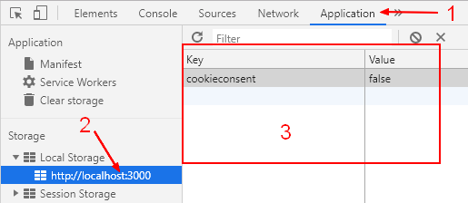

# INDEX

- [INDEX](#index)
  - [API](#api)
  - [HTML5 APIs](#html5-apis)
  - [Storing Data in the Browser](#storing-data-in-the-browser)
    - [Cookies](#cookies)
    - [LocalStorage \& SessionStorage](#localstorage--sessionstorage)
      - [LocalStorage](#localstorage)
      - [Session storage](#session-storage)
      - [Storage event](#storage-event)
    - [IndexedDB](#indexeddb)
  - [History API](#history-api)
    - [History Object](#history-object)
  - [Location API (Routing \& Navigation)](#location-api-routing--navigation)
    - [Barba.js (Routing Library)](#barbajs-routing-library)
  - [Third-party APIs](#third-party-apis)
    - [Geolocation API](#geolocation-api)
    - [Leaflet API](#leaflet-api)
      - [installation](#installation)
      - [code](#code)
    - [Public APIs for free](#public-apis-for-free)
  - [Notes](#notes)

---

## API

**API** stands for Application Programming Interface. It is a set of rules that allows one piece of software application to talk to another. It defines the methods for communication between different software components.

or, it's a piece of software that can be used by another piece of software, in order to allow applications to talk to each other.

- There're many types of APIs in web development, such as:

  - **DOM API**: to manipulate the DOM.
  - **Fetch API**: to make network requests.
  - **Web Storage API**: to store data in the browser.
  - **Online APIs**: to interact with online services.
    - It's an application running on a server, that receives requests for data, and sends data back as a response.

- **Endpoints**: are the locations (URL) where APIs can send and receive data.

  - Request: is the data sent to the API.
  - Response: is the data sent back from the API.

- **API data format**

  - `XML`
    - stands for "eXtensible Markup Language". It's a markup language that defines a set of rules for encoding documents in a format that is both human-readable and machine-readable.
    - It's not used as much as it used to be. ❌
  - `JSON`

    - stands for "JavaScript Object Notation". It's a lightweight data-interchange format that is easy for humans to read and write, and easy for machines to parse and generate.
    - It's the most popular data format used in APIs. ✅
    - JSON is ideal for data exchange between JavaScript clients and servers in any language (e.g., Ruby, PHP, Java).

      - **No Comments**: JSON does not support comments. Use [JSON5](http://json5.org/) for features like comments and unquoted keys.
      - **Key Concepts**:
        - **Serialize**: Convert objects to JSON.
        - **Deserialize**: Convert JSON to objects.

    - JSON Methods

      - `JSON.stringify`: Converts objects to JSON.

        - Syntax: `JSON.stringify(value, replacer, space)`
        - Parameters:
          - `value`: The object to convert.
          - `replacer`: Optional function to transform values.
          - `space`: Optional spaces for indentation.

      - `JSON.parse`: Converts JSON back to an object.

        - Syntax: `JSON.parse(str, reviver)`
        - Parameters:
          - `str`: The JSON string to parse.
          - `reviver`: Optional function to transform values.

        ```js
        let str = '{"title":"Conference","date":"2017-11-30T12:00:00.000Z"}';
        let meetup = JSON.parse(str, (key, value) => (key === 'date' ? new Date(value) : value));
        ```

---

## HTML5 APIs

a set of APls define that describe how to interact with features of web browsers.

- each of the HTML5 APIs focuses on one or more objects that browsers implement to deliver specific functionality

| API            | Description                                                         |
| -------------- | ------------------------------------------------------------------- | -------------- |
| geolocation    | How to tell where the user is located                               |
| local Storage  | Store information in the browser (even when user closes tab/window) | sessionStorage |
| sessionStorage | Store information in the browser while a **tab/window** is open     |
| history        | How to access items from the browser's history                      |

---

## Storing Data in the Browser

### Cookies

Cookies are strings of data that are stored in the browser. They are a part of the HTTP protocol,

- Cookies are usually set by a web-server using the response `Set-Cookie` HTTP-header. Then, the browser automatically **adds them to (almost) every request to the same domain** using the Cookie HTTP-header.
- One of the most widespread use cases is **authentication**:

  1. Upon sign in, the server uses the Set-Cookie HTTP-header in the response to set a cookie with a unique “session identifier”.
  2. Next time when the request is sent to the same domain, the browser sends the cookie over the net using the Cookie HTTP-header. **So the server knows who made the request**.

- We can also access cookies from the browser, using `document.cookie` property.

- Writing to `document.cookie`:

  - A write operation to `document.cookie` updates only cookies mentioned in it, but doesn’t touch other cookies.

    - That’s because the `document.cookie=...` operation does not overwrite all cookies. It only sets the mentioned cookie

    ```js
    document.cookie = 'user=John'; // update only cookie named 'user'
    ```

- Technically, name and value can have any characters. To keep the valid formatting, **They must be encoded** -> they should be escaped using a built-in **encodeURIComponent** function:

  ```js
  // special characters (spaces), need encoding
  let name = 'my name';
  let value = 'John Smith';

  // encodes the cookie as my%20name=John%20Smith
  document.cookie = encodeURIComponent(name) + '=' + encodeURIComponent(value);

  alert(document.cookie); // ...; my%20name=John%20Smith
  ```

- One cookie may not exceed `4KB` in size. The number of cookies allowed on a domain is around `20+` (varies by browser).

- **Cookies Options:**

  - Cookies have several options, many of them are important and should be set. The options are listed after `key=value`, delimited by `;`, like this:

    ```js
    document.cookie = 'user=John; path=/; expires=Tue, 19 Jan 2038 03:14:07 GMT';
    ```

  - some options:

    - `path=/`, by default current path, makes the cookie visible only under that path.

    - domain=site.com`, by default a cookie is visible on the current domain only. If the domain is set explicitly, the cookie becomes visible on subdomains -> (We can’t set any domain)

      ```js
      // if we set a cookie at site.com website...
      document.cookie = 'user=John';

      // ...we won't see it at forum.site.com
      alert(document.cookie); // no user
      ```

    - `expires` or `max-age`, sets the cookie expiration time. Without them the cookie dies when the browser is closed.
    - `secure` makes the cookie **HTTPS**-only.
    - `samesite` forbids the browser to send the cookie with requests coming from outside the site. This helps to prevent XSRF attacks.

- **Cookies Notes**:
  - Third-party cookies may be forbidden by the browser, e.g. Safari does that by default.

---

### LocalStorage & SessionStorage

Web storage objects `localStorage` and `sessionStorage` allow to save key/value pairs in the browser.

- Persistence:

  - The data stored in `localStorage` persists even after the browser is closed and reopened.
  - `sessionStorage` is similar to `localStorage`; the difference is that while data stored in `localStorage` has no expiration time, data stored in `sessionStorage` gets cleared when the page session ends. A page session lasts as long as the browser is open, and survives over page reloads and restores.

> What’s interesting about them is that the data survives a page refresh (for `sessionStorage`) and even a full browser restart (for `localStorage`).

- We already have `cookies`. Why additional objects?
  - Unlike cookies, web storage objects are not sent to server with each request. Because of that, we can store much more. Most modern browsers allow at least 5 megabytes of data (or more) and have settings to configure that.
  - Also unlike cookies, the server can’t manipulate storage objects via `HTTP` headers. Everything’s done in JavaScript.
  - The storage is bound to the origin (domain/protocol/port triplet). That is, different protocols or subdomains infer different storage objects, they can’t access data from each other.
- Both storage objects provide the same methods and properties:

  - `setItem(key, value)` – store key/value pair.
  - `getItem(key)` – get the value by key.
  - `removeItem(key)` – remove the key with its value.
  - `clear()` – delete everything.
  - `key(index)` – get the key on a given position.
  - `length` – the number of stored items.

---

#### LocalStorage

- The `localStorage` read-only property of the `window` interface allows you to access a `Storage` object for the Document's origin; the stored data is saved across browser sessions. 
- The main features of localStorage are:

  - Shared between all tabs and windows from the same origin.
  - The data does not expire. It remains after the browser restart and even OS reboot.

- Object-like access

  - We can also use a plain object way of getting/setting keys, like this:

    ```js
    // set key
    localStorage.test = 2;

    // get key
    alert(localStorage.test); // 2

    // remove key
    delete localStorage.test;
    ```

  - That’s allowed for historical reasons, and mostly works, but generally not recommended, because:
    1. If the key is user-generated, it can be anything, like `length` or `toString`, or another built-in method of localStorage. In that case getItem/setItem work fine, while object-like access fails
    2. There’s a storage event, it triggers when we modify the data. That event does not happen for object-like access. We’ll see that later in this chapter.

- The keys and the values stored with localStorage are always in the `UTF-16 DOMString format`, which uses two bytes per character. As with objects, integer keys are automatically converted to strings.

  - > **Both key and value must be strings**

    - > If they were any other type, like a number, or an object, they would get converted to a string automatically:

  - We can use JSON to store objects though: So to store the data structure correctly in localStorage, store it as a **JSON-strings** with `JSON.stringify()`

    ```js
    localStorage.setItem('user', JSON.stringify({ name: 'John' }));

    // sometime later
    let user = JSON.parse(localStorage.user);
    alert(user.name); // John
    ```

    - if you pass an array to the localStorage, it will be stored as a string, so you need to parse it back to an array when you get it back.

      ```js
      const workouts = ['running', 'swimming', 'cycling'];
      localStorage.setItem('workouts', workouts);
      const data = localStorage.getItem('workouts'); // "running,swimming,cycling" -> not an array ❌
      ```

- localStorage is `Blocking`, so it can slow down the app
- _note_ : when you `get` items from `localStorage`, they lose the `prototype Chain` they had
- **1oca1Storage** is best suited to information that:
  - Only changes at set intervals (such as timetables / price lists), which can be helpful to store offline.
  - The user might want to come back and use again (such as saving preferences / settings).

```javascript
// ---------------add data item to localStorage //object--------------- //
localStorage.setItem('myCat', 'Tom');

// ---------------reading the localStorage item--------------- //
const cat = localStorage.getItem('myCat');

// ---------------Number of items stored--------------- //
const itemsNum = localStorage.length;

// ---------------removing the localStorage item--------------- //
localStorage.removeItem('myCat');

// ---------------removing all the localStorage //items--------------- //
localStorage.clear();

/////////////////////////////////////////////////
// if value is not a string (here (workouts) is an array) => convert it using ( JSON.stringify() )
localStorage.setItem('workouts', JSON.stringify(workouts));
// then to read the item => use ( JSON.parse() )
const data = JSON.parse(localStorage.getItem('workouts'));
```

---

#### Session storage

The `sessionStorage` object is used much less often than `localStorage`

- Properties and methods are the same, but it’s much more limited:

  - The `sessionStorage` exists only within the current browser tab.

    - Another tab with the same page will have a different storage.
    - But it is shared between `iframes` in the same tab (assuming they come from the same origin).

  - The data survives page refresh, but not closing/opening the tab.
    - That’s exactly because `sessionStorage` is bound not only to the origin, but also to the browser tab. For that reason, sessionStorage is used sparingly.

- **sessionStorage** is more suited to information that:

  - Changes frequently (each time the user visits the site - such as whether they are logged in or location data).
  - Is personal and should not be viewed by other users of the device.
  - `JWTs` are often stored in sessionStorage.

---

#### Storage event

- When the data gets updated in `localStorage` or `sessionStorage`, `storage` event triggers, with properties:

  - `key` – the key that was changed (`null` if `.clear()` is called).
  - `oldValue` – the old value (`null` if the key is newly added).
  - newValue – the new value (`null` if the key is removed).
  - url – the url of the document **where the update happened**.
  - storageArea – either `localStorage` or `sessionStorage` object where the update happened.

> **Note:** The important thing is: the event triggers on all window objects where the storage is accessible, except the one that caused it.

```js
// triggers on updates made to the same storage from other documents
window.onstorage = event => {
  // can also use window.addEventListener('storage', event => {
  if (event.key != 'now') return;
  alert(event.key + ':' + event.newValue + ' at ' + event.url);
};

localStorage.setItem('now', Date.now());
```

---

### IndexedDB

IndexedDB is a database that is built into a browser, much more powerful than `localStorage`.

- features:
  - Stores almost any kind of values by keys, multiple key types.
  - Supports transactions for reliability.
  - Supports key range queries, indexes.
  - Can store much bigger volumes of data than localStorage.
- That power is usually excessive for traditional client-server apps. IndexedDB is intended for **offline apps**, to be combined with **ServiceWorkers** and other technologies.

> More info here [javascript.info/indexeddb](https://javascript.info/indexeddb)

---

## History API

If you move from one page to another, the browser's history remembers which pages you visited. But Ajax applications do not load new pages, so they can use the hi story API to update the location bar and history.

- Because the history object is a child of the window object, you can use its name directly in the script; you can write `history. pushState()`, you do not need to write `window.history.pushState()`.

  ```js
  history.pushState(state, title, url);
  ```

### History Object

The HTML5 history API describes the functionality of the history object in modern web browsers. It lets you access and update the browser history (but only for pages the user visited on your site).


---

## Location API (Routing & Navigation)

The Location interface represents the location (URL) of the object it is linked to. Changes done on it are reflected on the object it relates to. Both the Document and Window interface have such a linked Location, accessible via Document.location and Window.location respectively.

- The `window.location` object can be used to get the current page address (URL) and to redirect the browser to a new page.

  ```js
  // get the current page URL
  console.log(window.location.href);
  // redirect the browser to a new page
  window.location.href = 'https://www.google.com';
  ```

---

### Barba.js (Routing Library)

- [Barba.js](https://barba.js.org/) is a small (`7kb` minified) and easy-to-use library that helps you create fluid and smooth transitions between your website's pages.
- It makes your website run like a SPA (Single Page Application) and help reduce the delay between your pages, minimize browser HTTP requests and enhance your user’s web experience.

- Resources:
  - [Video Tutorial](https://www.youtube.com/watch?v=aMucZErEdZg)

---

## Third-party APIs

### Geolocation API

- [Documentation](https://developer.mozilla.org/en-US/docs/Web/API/Geolocation_API/Using_the_Geolocation_API#examples)
- **Installation**: Native API, available in the browser as part of the global `navigator` object.
- **Purpose**: Allows web apps to access user location with permission for privacy.
- **Usage**:
  - `Geolocation.getCurrentPosition()`: Gets the current location.
  - `Geolocation.watchPosition()`: Calls a handler whenever the device's position changes.
- **Arguments**:
  - **Mandatory** `success callback`: Executes with `GeolocationPosition` object on success.
  - **Optional** `error callback`: Executes with `GeolocationPositionError` object on failure.
  - **Optional** `options` object for position retrieval settings.

```js
// getCurrentPosition{success, fail)

navigator.geolocation.getCurrentPosition(
  function (position) {
    console.log(position);

    const { latitude } = position.coords;
    const { longitude } = position.coords;
    // console.log(`https://www.google.pt/maps/@${latitude},${longitude}`);
  },
  function () {
    alert('Could not get your position');
  }
);
```

---

### Leaflet API

- [documentation](https://leafletjs.com/SlavaUkraini/)
- it's a library for mobile-friendly interactive `maps`

#### installation

- go to [download](https://leafletjs.com/SlavaUkraini/download.html) page and choose to ues hosted version or `NPM`
- go to [tutorial](https://leafletjs.com/SlavaUkraini/examples.html) page and follow the steps

#### code

```html
<div id="map-element"></div>
```

```js
// map from (L) object
map = L.map('map-element').setView(coords, zoomLevel);
// setView method takes 2 parameters :
// 1. coords => array of [latitude, longitude]
// 2. zoomLevel => number of how much to set the zoom of the view

L.tileLayer('https://{s}.tile.openstreetmap.fr/hot/{z}/{x}/{y}.png', {
  attribution:
    '&copy; <a href="https://www.openstreetmap.org/copyright">OpenStreetMap</a> contributors'
}).addTo(map);
// the href can be change for different looks of the map

// see (marker) on the documentation

// Handling clicks on map
map.on('click', callbackFunction);
```

---

### Public APIs for free

- [puplic-Api repo](https://github.com/public-apis/public-apis)

---

## Notes

- if you are using hosted version of an Api => don't forget to put `defer` in the `<script>` part of it in the HTML `<head>`
- **API key** is a set of letters and numbers that uniquely identify you to the application so the owners of the site can track how much you use the API and what you use it for.

---
