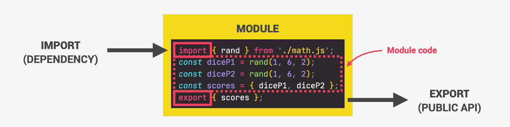
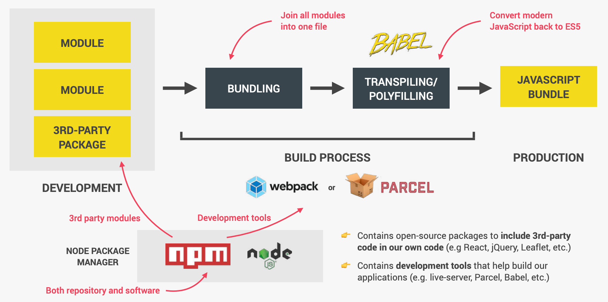
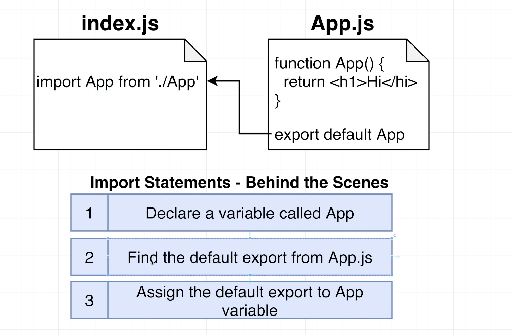
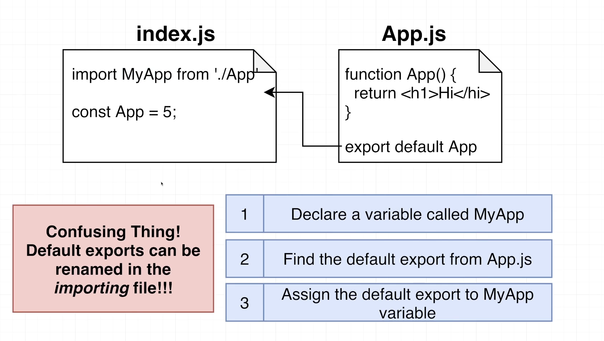
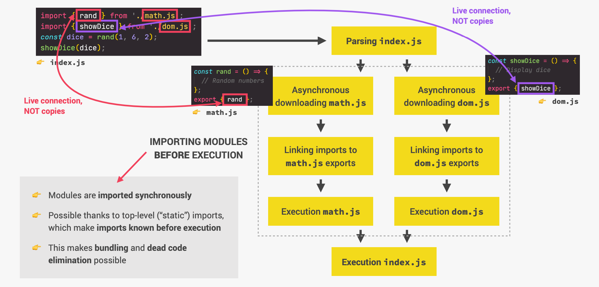

# INDEX

- [INDEX](#index)
  - [Notes](#notes)
  - [Modular pattern](#modular-pattern)
    - [Revealing modular pattern](#revealing-modular-pattern)
  - [Modules](#modules)
    - [Module Features](#module-features)
    - [Module scripts](#module-scripts)
  - [Exporting \& Importing code](#exporting--importing-code)
    - [Exporting](#exporting)
      - [Named Exports (Zero or more exports per module)](#named-exports-zero-or-more-exports-per-module)
      - [Default Exports (One per module)](#default-exports-one-per-module)
    - [Importing](#importing)
    - [Re-exporting](#re-exporting)
      - [Re-exporting the default export](#re-exporting-the-default-export)

---

## Notes

As our program grows bigger, it may contain many lines of code. Instead of putting everything in a single file, you can use `modules` to separate codes in separate files as per their functionality. This makes our code organized and easier to maintain.

- `Module` is a file that contains code to perform a specific task. A module may contain variables, functions, classes etc.
- As of `ES2022`, `Top-level await` is supported in modules. This means that we can use `await` at the top level of a module without any wrapper function with `async` keyword.
  - Note that this will only work if the module is loaded as an `ES module` (using `import` or `type="module"`).
  - also, note that this will block the execution of the module until the promise is resolved. (not recommended ❌)
    - one use of it is to await the return of a promise from a function in the module. so that the module will be loaded only after the promise is resolved and we won't need to use `.then()` in the main script.

---

## Modular pattern

The module pattern is a special Design pattern in which we use IFFI (Immediately invoked function expression), and we return an object. Inside of that object, we can have functions as well as variables.

> note that the thing that make this possible (reaching what the IIFE-function returns after it was self-invoked) is => `closures`

- Private methods or functions are members of given entity than can be seen only within said entity. Public ones can be accessed from the outside of given entity.

  ```js
  // IIFE
  const Formatter = (function () {
    const log = message => console.log(`[${Date.now()}] Logger: ${message}`);
  })();

  // using it
  Formatter.log('Hello');
  ```

- Why use it?

  - avoid polluting the global namespace.
  - expose an interface to the outside world.
  - avoid naming collisions.
  - encapsulate code.

- Problems:

  - order of dependencies is important and can be hard to manage.
  - it can be hard to read and understand.
  - it can be hard to test private methods.

- Solution: `CommonJS` and `ES6 modules` are better solutions for managing dependencies.

  > `CommonJS` is one of the reasons that made `Node.js` popular. It allows us to use `require` and `module.exports` to import and export modules.
  >
  > Actually, NPM is just a way to share `CommonJS` modules.

### Revealing modular pattern

It's a variation of the module pattern where we simply define all of our functions and variables in the private scope and return an anonymous object with pointers to the private functionality we wished to reveal as public.

- This pattern allows us to reveal certain variables and methods returned in an object literal.

  ```js
  const myRevealingModule = (function () {
    let private;
    let publicVar = 'I am public';

    let publicFunction = () => {
      privateVar++;
      return privateFunction();
    };

    let privateFunction = () => {
      console.log('I am private');
    };

    return {
      publicVar,
      publicFunction
    };
  })();

  // using it
  myRevealingModule.publicFunction(); // I am private ✅
  console.log(myRevealingModule.publicVar); // I am public ✅
  console.log(myRevealingModule.privateVar); // undefined ❌
  ```

- This is possible because of the `closures` in JavaScript.

---

## Modules

> Read the history first here -> [Modules & Bundlers](../DEV/Modules%20%26%20Bundlers.md#modules)

Modules split a large codebase into smaller files that can be loaded on demand.

- It gives us the ability to:

  - split our code into multiple files, each with a specific purpose, and then import them into the main file.
  - import/export functionality between files.

- **Module**: A reusable piece of code (file) that encapsulates implementation details.
- **Directives**:
  

  - `export`: Labels variables/functions to be accessible outside the module.
  - `import`: Imports functionality from other modules.

- Browsers don't support modules, so we must do a **"Build Process"** after writing our code to convert it to a format that browsers.
  

  1. **Bundling**: Combine modules into a single file (e.g., `Webpack`, `Parcel`).
  2. **Transpiling**: Convert code to an older JavaScript version that all browsers understand (e.g., `Babel`).
     - ex: `arrow functions` to `normal functions` **(which is syntax)**
  3. **Polyfilling**: Add code to support older browsers (e.g., `Babel`).
     - ex: `Promise` to `callback functions` **(which is not syntax but a feature)**

- **Usage**:

  - Use `<script type="module">` to tell the browser to treat the script as a module.

    ```html
    <script type="module" defer src="script.js"></script>
    ```

    - The browser automatically fetches and evaluates the imported module (and its imports if needed), and then runs the script.

  - We must use **HTTP(s)**, not local files (`file://`), due to `CORS` restrictions.

    - Use a local web server (e.g., "live server") to simulate a real server with `http`.
    - Browsers add an `Origin` header to requests; servers must respond with `Access-Control-Allow-Origin`.
    - **Summary**: Modules must be served from the same origin (domain, protocol, port).

---

### Module Features

- **Why modules?**

  - **Compose** software from independent modules.
  - **Isolate** components.
  - **Abstract** low-level code.
  - **Organize** and **re-use** code.

- Always **“use strict”**
- Module-level scope: Each module has its own top-level scope.
  - Variables and functions from a module are not seen in other scripts/modules.
- Module code is **evaluated only once**, even if imported multiple times.

  ```js
  // 📁 alert.js
  alert("Module is evaluated!");

  // Import the same module from different files

  // 📁 1.js
  import `./alert.js`; // Alerts: "Module is evaluated!" ✅

  // 📁 2.js
  import `./alert.js`; // Doesn't alert anything ❌
  ```

- In a module, **“this”** is `undefined`

  - In non-module scripts, **`this`** refers to the `window` object, but in modules, it’s `undefined`. (because modules are in **strict mode** by default)

    ```html
    <script>
      alert(this); // window
    </script>

    <script type="module">
      alert(this); // undefined
    </script>
    ```

- **ES6 Modules vs Scripts**

  | Comparison            | ES6 Modules              | Scripts        |
  | --------------------- | ------------------------ | -------------- |
  | **Scope**             | Module-level scope       | Global scope   |
  | **Strict Mode**       | Strict mode by default   | No strict mode |
  | `this`                | `undefined`              | `window`       |
  | **Hoisting**          | No hoisting              | Hoisting       |
  | **Imports & Exports** | ✅                       | ❌             |
  | **HTML linking**      | `<script type="module">` | `<script>`     |
  | **File downloading**  | Asynchronous             | Synchronous    |

---

### Module scripts

- Module scripts are deferred

  - downloading external module scripts `<script type="module" src="...">` doesn’t block HTML processing, they load in parallel with other resources.
  - module scripts wait until the HTML document is fully ready (even if they are tiny and load faster than HTML), and then run.
  - relative order of scripts is maintained: scripts that go first in the document, execute first.

- **Async** works on inline scripts

  - For non-module scripts, the `async` attribute only works on external scripts. Async scripts run immediately when ready, independently of other scripts or the HTML document.
  - in this example, It performs the `import (fetches ./analytics.js)` and runs when ready, even if the HTML document is not finished yet, or if other scripts are still pending.

    ```html
    <!-- all dependencies are fetched (analytics.js), and the script runs -->
    <!-- doesn't wait for the document or other <script> tags -->
    <script async type="module">
      import { counter } from './analytics.js';

      counter.count();
    </script>
    ```

- **External scripts:** External scripts that have type="module" are different in two aspects:

  1. External scripts with the same src run only once:

     ```html
     <!-- the script my.js is fetched and executed only once -->
     <script type="module" src="my.js"></script>
     <script type="module" src="my.js"></script>
     ```

  2. External scripts that are fetched from another origin (e.g. another site) require **CORS** headers

     - In other words, if a module script is fetched from another origin, the remote server must supply a header **Access-Control-Allow-Origin** allowing the fetch.
     - That ensures better security by default.

     ```html
     <!-- another-site.com must supply Access-Control-Allow-Origin -->
     <!-- otherwise, the script won't execute -->
     <script type="module" src="http://another-site.com/their.js"></script>
     ```

---

## Exporting & Importing code

JavaScript initially lacked a code `import` feature due to its limited browser-based functionality. Organizing JavaScript code across multiple files required loading each file with globally shared variables. In 2009, the `CommonJS` project introduced modules to enable code `import`/`export` in JavaScript, bringing it in line with other programming languages. `Node.js` is a popular implementation of `CommonJS` modules.

- Example
  
  

### Exporting

- The `export` statement is used when creating JavaScript modules to export live bindings to functions, objects, or primitive values from the module so they can be used by other programs with the import statement.
- Exported modules are in `strict mode` whether you declare them as such or not.
- exports must happen in top-level code (global scope)

There are two types of exports

1. **Named Exports**
2. **Default Exports**

#### Named Exports (Zero or more exports per module)

- Single import statement can get both `default` + `named` exports
- Named exports can't be renamed when imported
- note that `export` before a class or a function does not make it a function expression. It’s still a function declaration, albeit exported.
- Most JavaScript style guides don’t recommend semicolons after function and class declarations.

```js
// Exporting individual features
export let name1, name2, …, nameN; // also var, const
export let name1 = …, name2 = …, …, nameN; // also var, const
export function functionName(){...}
export class ClassName {...}

// multiple exports with Renaming exports
const totalPrice = 237;
const totalQuantity = 23;
export { totalPrice, totalQuantity as tq };

// Exporting destructured assignments with renaming
export const { name1, name2: bar } = obj;
// or
const { name1, name2 as bar } = obj;
```

#### Default Exports (One per module)

They're used with Modules that declare a single entity, e.g. a module `user.js` exports only `class User`.

- Used when the module exports a single value, which can be a function, object, or primitive.
- Naturally, that requires a lot of files, as everything wants its own module, but that’s not a problem at all. Actually, code navigation becomes easier if files are well-named and structured into folders.
- There may be only one export default per file. And then `import` it without curly braces
- here we don't export `declaration` or `variables` but we export `values` or `(expressions that already return values)`

  ```javascript
  // 📁 user.js
  export default class User {
    // just add "default"
    constructor(name) {
      this.name = name;
    }
  }
  ```

- Technically, we may have both default and named exports in a single module, but in practice people usually don’t mix them. A module has either named exports or the default one.

  - Here’s how to import the default export along with a named one:

    ```js
    // 📁 main.js
    import { default as User, sayHi } from './user.js';

    new User('John');
    ```

- Notes

  - Exporting must happen at the top level of the module.

    ```js
    // This won't work ❌
    if (true) {
      export function sayHi() {
        console.log('Hello!');
      }
    }

    // Instead, export at the top level
    export function sayHi() {
      console.log('Hello!');
    }
    ```

---

### Importing

- **How ES6 modules are imported**
  

  - **Synchronous**: Modules load fully before evaluation, allowing for better optimization and dead code elimination.

    - This means that the file that the imported module code **will be executed before** the importing file code.

    - This makes bundling and dead code elimination (tree shaking) possible.

    ```js
    // 📁 module.js
    console.log('Module is evaluated');

    // ------------------------------

    // 📁 main.js
    import './module.js';
    console.log('Main is evaluated');

    // Result:
    // Module is evaluated
    // Main is evaluated
    ```

- **Live Connections**: "Imports" are bindings, not copies. Changes in the module reflect immediately in the import.

  ```js
  // 📁 user.js
  export let user = {
    name: 'John',
    age: 30
  };

  export function changeName() {
    user.name = 'Pete';
  }

  // ------------------------------

  // 📁 main.js
  import { user, changeName } from './user.js';

  console.log(user.name); // John
  changeName();
  console.log(user.name); // Pete -> changed by the function in the imported module and reflected in the main module
  ```

- Explicit Imports:

  - Importing everything from a module is not recommended. It’s better to explicitly list what to import.
  - Use `import { sayHi } from './say.js'` for clarity and shorter names.
  - Provides a better overview of code structure, aiding support and refactoring.

- Don’t be afraid to import too much

  - Modern Tools: Tools like **webpack** optimize and remove unused imports

- **Imports Types**:

  1. **Default Imports**: Importing the default export from a module.

     ```js
     import defaultExport from 'module-name';
     // here we can name it whatever we want as it was exported without a name, But it's recommended to use the same name as the exported one
     ```

     - The issue is that different names for the same import can cause inconsistency.
     - To avoid that, Match import names to file names for consistency. or use named exports instead.

  2. **Named Imports**: Importing specific exports from a module.

     ```js
     import { export1, export2 } from 'module-name';
     import { export1 as alias1 } from 'module-name'; // alias for export1
     ```

     - It's preferred for large libraries like `lodash` and `reactDom` to reduce size, So you only import what you need from them.

  3. **Mixed Imports**: Importing both default and named exports from a module.

     ```js
     import defaultExport, { export1, export2 } from 'module-name';
     ```

     - This is not recommended, as it can lead to confusion.
     - It's done by importing the default export first, then importing the named exports.

  4. **Namespace Imports**: Importing all exports from a module as an object.

     ```js
     import * as name from 'module-name';

     // usage
     console.log(name.getFormattedName('john', 'doe'));
     ```

     - This is useful when you want to import everything from a module and access it through a single object.

  5. **Side effects Imports**: Importing a module for its side effects only.

     - This runs the module's global code, but doesn't actually import any values.
     - you can do this with importing **css files** into javascript files

     ```js
     import 'module-name'; // runs the module's global code
     ```

  6. **Dynamic Imports**: Importing a module dynamically.

     ```js
     import('./module-name').then(module => {
       // Do something with the module.
       module.loadPageInto(main);
     });

     // or using "await" keyword
     let module = await import('./module-name');
     ```

     - This is useful when you want to load a module conditionally or on demand.
     - It returns a promise that resolves to the module object.
     - It's not recommended to use `await` at the top level of a module, as it blocks the execution of the module until the promise is resolved.

- Notes

  - **Avoid Bare Modules**

    - Always use a relative or absolute URL in the `import` statement.

      ```js
      import { sayHi } from './sayHi.js'; // OK ✅
      import { sayHi } from 'sayHi'; // Error ❌
      ```

  - Omitting the file extension is allowed, but not recommended.

    - It’s better to include the file extension for clarity. But some formatters and linters may remove it.

      ```js
      import { sayHi } from './sayHi.js'; // OK ✅
      import { sayHi } from './sayHi'; // Also OK ✅
      ```

  - The variables imported from a module are **Read-Only**.

    - They can be changed in the module, but not in the importing script.

      ```js
      // 📁 user.js
      export let user = 'John';

      // 📁 main.js
      import { user } from './user.js';
      user = 'Pete'; // Error ❌: Cannot assign to read only property 'user' of object '#<Object>'
      ```

---

### Re-exporting

“Re-export” syntax `export ... from ...` allows to import things and immediately export them (possibly under another name), like this:

```js
export { sayHi } from './say.js'; // re-export sayHi

export { default as User } from './user.js'; // re-export default
```

- Why would that be needed?

  - Imagine, we’re writing a “package”: a folder with a lot of modules, with some of the functionality exported outside, and many modules are just “helpers”, for internal use in other package modules.
  - We’d like to expose the package functionality via a single entry point.

    - In other words, a person who would like to use our package, should import only from the “main file” `auth/index.js`.

      ```js
      import { login, logout } from 'auth/index.js';
      //The “main file”, auth/index.js exports all the functionality that we’d like to provide in our package.
      ```

  - The idea is that outsiders, other programmers who use our package, should not meddle with its internal structure, search for files inside our package folder. We export only what’s necessary in auth/index.js and keep the rest hidden from prying eyes.

    ```js
    // 📁 auth/index.js

    // import login/logout and immediately export them
    import { login, logout } from './helpers.js';
    export { login, logout };

    // import default as User and export it
    import User from './user.js';
    export { User };
    ```

  - The syntax `export ... from ...` is just a shorter notation for such `import`-`export`:

    ```js
    // 📁 auth/index.js
    // re-export login/logout
    export { login, logout } from './helpers.js';

    // re-export the default export as User
    export { default as User } from './user.js';
    ```

#### Re-exporting the default export

The default export needs separate handling when re-exporting.

- We can come across two problems with it:

  1. `export User from './user.js'` won’t work. That would lead to a syntax error.

     - To re-export the default export, we have to write

       ```js
       export {default as User}
       ```

  2. `export * from './user.js'` re-exports only named exports, but ignores the default one.

  - If we’d like to re-export both named and default exports, then two statements are needed:

  ```js
  export * from './user.js'; // to re-export named exports
  export { default } from './user.js'; // to re-export the default export
  ```

> Such oddities of re-exporting a default export are one of the reasons why some developers don’t like default exports and prefer named ones.

---
