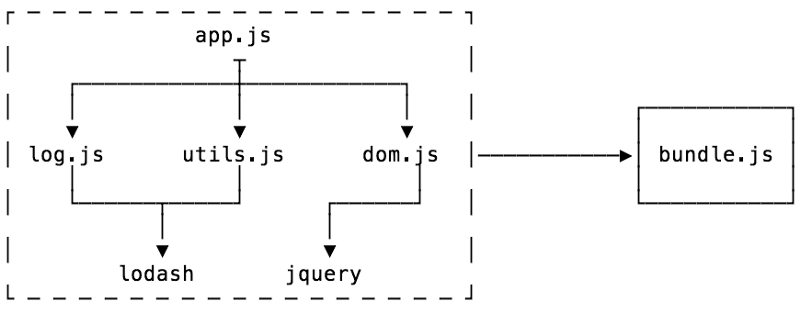
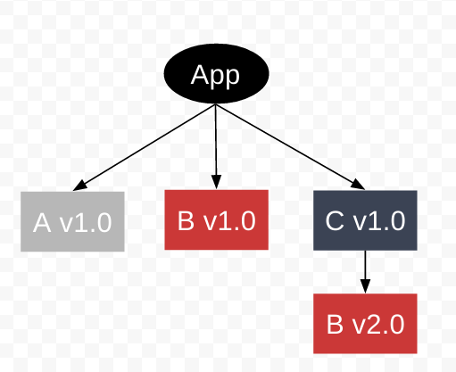
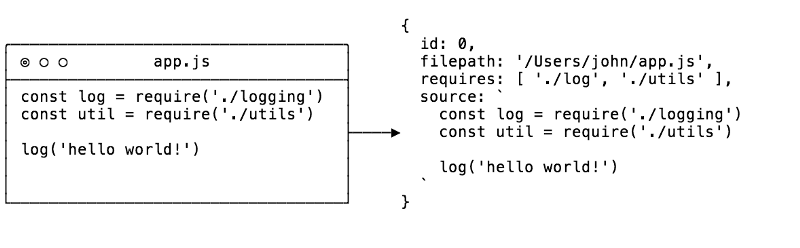
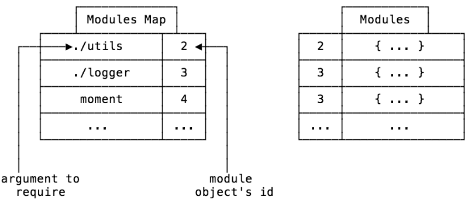
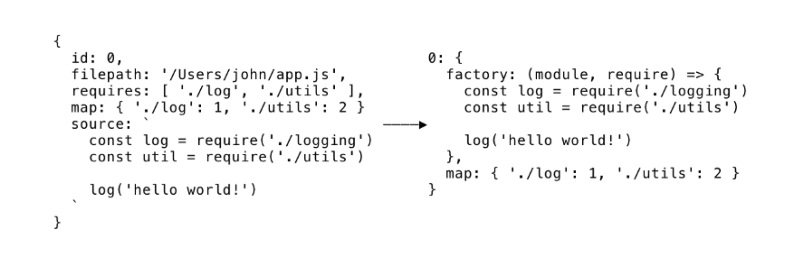

# INDEX

- [INDEX](#index)
  - [Module Bundler](#module-bundler)
    - [History](#history)
    - [Modern JavaScript Module Bundlers](#modern-javascript-module-bundlers)
    - [Stages of a bundler](#stages-of-a-bundler)
      - [Module Representation](#module-representation)
      - [Module Map](#module-map)
      - [Dependency Resolution](#dependency-resolution)
      - [Packing](#packing)
  - [Babel (`transpiling` \& `Polyfilling`)](#babel-transpiling--polyfilling)
    - [Transpiling code for new language features](#transpiling-code-for-new-language-features)
      - [Configuring Webpack to use Babel](#configuring-webpack-to-use-babel)
    - [Polyfilling](#polyfilling)

---

## Module Bundler

It's a tool that takes pieces of javascript and their dependencies and bundles them into a single file, usually for use in the browser.

- It's an optimization technique you can use to reduce the number of **server requests** for JavaScript files. Bundling accomplishes this by merging multiple JavaScript files together into one file to reduce the number of page requests.

### History

Most programming languages provide a way to import code from one file into another. JavaScript wasn’t originally designed with this feature, because JavaScript was designed to only run in the browser, with no access to the file system of the client’s computer (for security reasons). So for the longest time, organizing JavaScript code in multiple files required you to load each file with variables shared globally.

In 2009, a project named `CommonJS` was started with the goal of specifying an ecosystem for JavaScript outside the browser. A big part of CommonJS was its specification for modules, which would finally allow JavaScript to import and export code across files like most programming languages, without resorting to global variables. The most well-known of implementation of `CommonJS` modules is `node.js`.

- `node.js` is a JavaScript runtime designed to run on the server. Here’s what the earlier example would look like using `node.js` modules. Instead of loading all of `moment.min.js` with an `HTML` script tag, you can load it directly in the JavaScript file as follows:

  ```js
  // index.js
  const moment = require('moment');

  const rightNow = moment().format('MMMM Do YYYY, h:mm:ss a');
  console.log(rightNow);
  ```

- This is how module loading works in `node.js`, which is a server-side JavaScript runtime. However, this module syntax doesn’t work in the browser, because the browser doesn’t have access to the file system to load modules. **This is where a module bundler comes in**

---

### Modern JavaScript Module Bundlers

**Javascript Module bundler:** is a tool that gets around the problem with a build step (which has access to the file system) to create a final output that is browser compatible (which doesn’t need access to the file system)

- we need a module bundler to find all require statements (which is invalid browser JavaScript syntax) and replace them with the actual contents of each required file. The final result is a single bundled JavaScript file (with no `require` statements)
- It usually starts with an **entry file**, and from there it bundles up all of the code needed for that entry file.
  

- Here are some huge advantages to this workflow:

  - We are no longer loading external scripts via global variables. Any new JavaScript libraries will be added using `require` statements in the JavaScript, as opposed to adding new `<script>` tags in the `HTML`.
  - Having a single JavaScript bundle file is often better for performance. And now that we added a `build` step, there are some other powerful features we can add to our development workflow!

> The most popular module bundler was [Browserify](https://browserify.org/), Around 2015, [webpack](https://webpack.js.org/) eventually became the more widely used module bundler (fueled by the popularity of the **React** frontend framework, which took full advantage of webpack’s various features).

---

### Stages of a bundler

There are two main stages of a bundler:

1. Dependency resolution
2. Packing

- Starting from an **entry point** (such as `app.js`), the goal of **dependency resolution** is to look for all of the dependencies of your code (other pieces of code that it needs to function) and construct a graph (called a **dependency graph**).
  
- Once this is done, you can then **pack** or convert your dependency graph into a single file that the application can use.

---

#### Module Representation

The graph structure gets built up through recursively checking for dependencies within each file.

- We are going to need 4 things for Module Representation:
  1. The name and an identifier of the file
  2. Where the file came from (in the file system)
  3. The code in the file
  4. What dependencies that file needs
- In JavaScript, the easiest way to represent such a set of data would be an **object**.
- in the `createModuleObject` function, the notable part is the call to a function called `detective`.
  - `Detective` is a library that can “find all calls to `require()` no matter how deeply nested”, and using it means we can avoid doing our own AST traversal!



---

#### Module Map

When you import modules in Node, you can do relative imports, like `require('./utils')`. So when your code calls this, how does the bundler know what is the right `./utils` file when everything is packaged?

That is the problem the **module map** solves.

- Our module object has a unique `id` key which will be our ‘source of truth’. So when we are doing our dependency resolution, for each module, we will keep a list of the names of what is being required along with their `id`. This way, we can get the correct module at run-time.
  - This also means that we can store all of the modules in a non-nested object, using the `id` as a key.



---

#### Dependency Resolution

> What is meant by ‘**resolve dependencies’**?
>
> - In `Node` there is a thing called the `require.resolve`, and it’s how Node figures out where the file that you are requiring is. This is because we can import relatively or from a `node_modules` folder.

- there’s an npm module named `resolve` which implements this algorithm for us. We just have to pass in the dependency and base URL arguments, and it will do all the hard work for us.
- At the end of the function, we are left with an array named **modules** which will contain module objects for every module/dependency in our project.

Now that we have that, we can move on to the final step: **packing**!

---

#### Packing

In the browser, there is no such thing as modules (kind of). But this means that there is no `require()` function, and no `module.exports()`. So even though we have all of our dependencies, we currently have no way to use them as modules.

- This is where `Module Factory Function` play its rule
- **Module Factory Function**:

  - A factory function is a function (that’s not a constructor) which returns an object. It is a pattern from `object oriented programming`, and one of its uses is to do `encapsulation` and `dependency injection`.
  - Using a factory function, we can both inject our own `require()` function and `module.exports()` object that can be used in our bundled code and give the module its own scope.

- **Packing Process**

  - First up is `modulesSource`. Here, we are going through each of the modules and transforming them into a string of sources.
    
    - Now it’s a little hard to read, but you can see that the **source is encapsulated**. We are providing `modules` and `require` using the factory function as mentioned.
    - We are also including the modules map that we constructed during the [Dependency Resolution](#dependency-resolution).
  - The next string of code is an **IIFE**, which means that when you run that code in the browser (or anywhere else), the function will run immediately. IIFE is another pattern for encapsulating scope, and is used here so we don’t pollute the global scope with our require and modules.
  - After this, we are defining a `module object` that the module can populate, and passing both functions into the factory, after which we return `module.exports`.
  - Lastly, we call `require(0)` to require the module with an id of `0`, which is our entry file.

---

## Babel (`transpiling` & `Polyfilling`)

How to make our modern code work on older engines that don’t understand recent features yet? -> There are two tools for that:

### Transpiling code for new language features

**Transpiling** code means converting the code in one language to code in another similar language. This is an important part of frontend development — since browsers are slow to add new features, new languages were created with experimental features that transpile to browser compatible languages.

**Transpilers** : special piece of software that translates source code to another source code. It can parse (“read and understand”) modern code and rewrite it using older syntax constructs, so that it’ll also work in outdated engines.

- **Babel** is not a new language but a transpiler that transpiles next generation JavaScript with features not yet available to all browsers (ES2015 and beyond) to older more compatible JavaScript (ES5).
- **Typescript** is a language that is essentially identical to next generation JavaScript, but also adds optional static typing. Many people choose to use babel because it’s closest to vanilla JavaScript.

```js
// before running the transpiler
height = height ?? 100;

// after running the transpiler
height = height !== undefined && height !== null ? height : 100;
```

- Usually, a developer runs the transpiler on their own computer, and then deploys the transpiled code to the server.
- **Babel** is one of the most prominent transpilers out there.

#### Configuring Webpack to use Babel

Modern project build systems, such as **webpack**, provide a means to run a transpiler automatically on every code change, so it’s very easy to integrate into the development process.

- We can configure webpack to use babel-loader by editing the webpack.`config.js` file as follows:

```js
// webpack.config.js
module.exports = {
  mode: 'development',
  entry: './index.js',
  output: {
    filename: 'main.js',
    publicPath: 'dist'
  },
  module: {
    rules: [
      {
        test: /\.js$/,
        exclude: /node_modules/,
        /* we’re telling webpack to look for any .js files (excluding ones in the node_modules folder) 
        and apply babel transpilation using babel-loader with the @babel/preset-env preset.
        */
        use: {
          loader: 'babel-loader',
          options: {
            presets: ['@babel/preset-env']
          }
        }
      }
    ]
  }
};
```

---

### Polyfilling

**Polyfills** : is a piece of code (usually JavaScript on the Web) used to provide modern **functionality** on older browsers that do not natively support it.

- New language features may include not only syntax constructs and operators, but also built-in **functions**. As we’re talking about new functions, not syntax changes, there’s no need to transpile anything here. We just need to declare the missing function.
- For example, `Math.trunc(n)` is a function that “cuts off” the decimal part of a number, e.g `Math.trunc(1.23)` returns 1.

  ```js
  if (!Math.trunc) {
    // if no such function

    Math.trunc = function (number) {
      // Math.ceil and Math.floor exist even in ancient JavaScript engines
      // they are covered later in the tutorial
      return number < 0 ? Math.ceil(number) : Math.floor(number);
    };
  }
  ```

- `Babel` is a JavaScript `transcompiler` that is mainly used to convert ECMAScript 2015+ (ES6+) code into a backwards compatible version of JavaScript that can be run by older JavaScript engines. Babel is a popular tool for using the newest features of the JavaScript programming language.

  - `Babel` can just convert normal `syntax` like `arrow funtion` to `function expression/declaration`, **but** it can't convert new ES6 features like `class`,`promise`, so we use => `polyfilling`.

- `polyfill` is a piece of code (usually JavaScript on the Web) used to provide modern functionality on older browsers that do not natively support it.

  - for it we use a library : `core-js`, `regenerator-runtime`

    ```javascript
    // in js file
    import 'core-js/stable';

    // Polifilling async functions
    import 'regenerator-runtime/runtime';

    // if they are not installed automatically, install them manually
    ```

---
