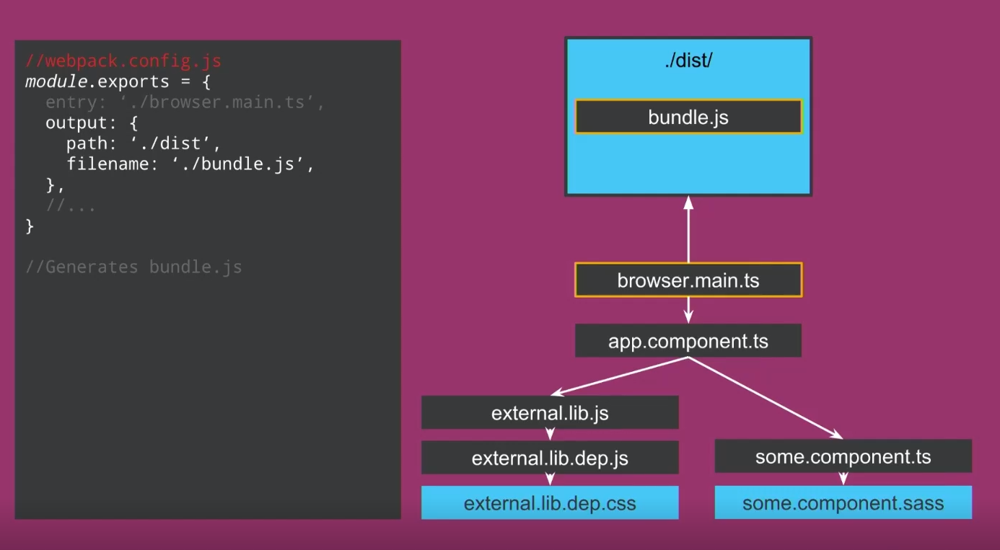
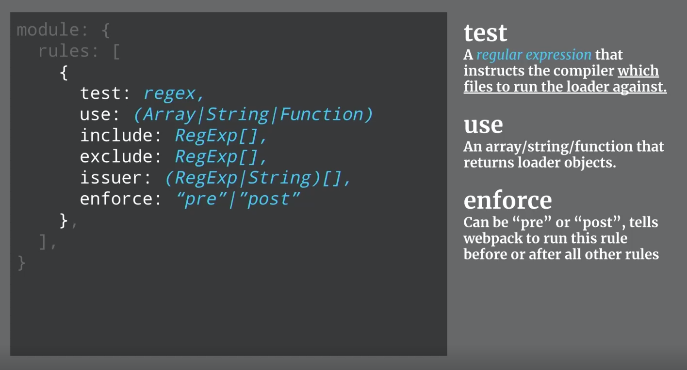
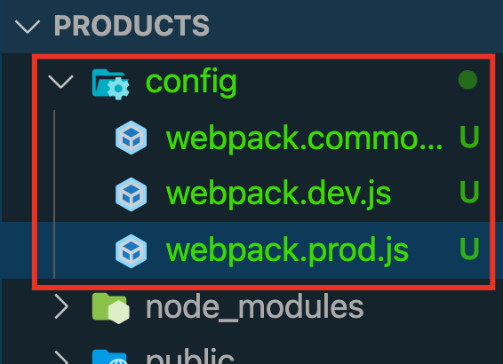

# INDEX

- [INDEX](#index)
  - [Module Bundler](#module-bundler)
    - [History](#history)
    - [Modern JavaScript Module Bundlers](#modern-javascript-module-bundlers)
  - [Webpack](#webpack)
    - [Why Webpack](#why-webpack)
    - [Entry and Output](#entry-and-output)
    - [Loaders](#loaders)
      - [How loaders work](#how-loaders-work)
      - [Plugins](#plugins)
    - [Installation and Configuration](#installation-and-configuration)
    - [Webpack different modes (Splitting Dev \& Production)](#webpack-different-modes-splitting-dev--production)
      - [For Development](#for-development)
      - [webpack-dev-server](#webpack-dev-server)
      - [For Production](#for-production)
    - [Webpack Notes](#webpack-notes)
  - [Vite](#vite)
    - [Why Vite](#why-vite)
      - [The Problems](#the-problems)
        - [Slow Server Start](#slow-server-start)
        - [Slow Updates](#slow-updates)
    - [Bundle-based vs Native-ESM-based Dev server](#bundle-based-vs-native-esm-based-dev-server)
      - [Bundle-based Dev Server](#bundle-based-dev-server)
      - [Native-ESM-based Dev Server](#native-esm-based-dev-server)
    - [Why Bundle for Production](#why-bundle-for-production)
    - [Why Not Bundle with esbuild?](#why-not-bundle-with-esbuild)
    - [Browser Support](#browser-support)
  - [esbuild](#esbuild)
  - [Difference between Vite and Webpack](#difference-between-vite-and-webpack)

---

## Module Bundler

### History

Most programming languages provide a way to import code from one file into another. JavaScript wasn’t originally designed with this feature, because JavaScript was designed to only run in the browser, with no access to the file system of the client’s computer (for security reasons). So for the longest time, organizing JavaScript code in multiple files required you to load each file with variables shared globally.

In 2009, a project named `CommonJS` was started with the goal of specifying an ecosystem for JavaScript outside the browser. A big part of CommonJS was its specification for modules, which would finally allow JavaScript to import and export code across files like most programming languages, without resorting to global variables. The most well-known of implementation of `CommonJS` modules is node.js.

- node.js is a JavaScript runtime designed to run on the server. Here’s what the earlier example would look like using `node.js` modules. Instead of loading all of `moment.min.js` with an `HTML` script tag, you can load it directly in the JavaScript file as follows:

  ```js
  // index.js
  const moment = require('moment');

  const rightNow = moment().format('MMMM Do YYYY, h:mm:ss a');
  console.log(rightNow);
  ```

- This is how module loading works in `node.js`, which is a server-side JavaScript runtime. However, this module syntax doesn’t work in the browser, because the browser doesn’t have access to the file system to load modules. This is where a module bundler comes in

---

### Modern JavaScript Module Bundlers

**Javascript Module bundler:** is a tool that gets around the problem with a build step (which has access to the file system) to create a final output that is browser compatible (which doesn’t need access to the file system)

- we need a module bundler to find all require statements (which is invalid browser JavaScript syntax) and replace them with the actual contents of each required file. The final result is a single bundled JavaScript file (with no `require` statements)!
- Here are some huge advantages to this workflow:

  - We are no longer loading external scripts via global variables. Any new JavaScript libraries will be added using `require` statements in the JavaScript, as opposed to adding new `<script>` tags in the `HTML`.
  - Having a single JavaScript bundle file is often better for performance. And now that we added a `build` step, there are some other powerful features we can add to our development workflow!

- The most popular module bundler was [Browserify](https://browserify.org/), Around 2015, [webpack](https://webpack.js.org/) eventually became the more widely used module bundler (fueled by the popularity of the **React** frontend framework, which took full advantage of webpack’s various features).

---

## Webpack

It's a **module bundler** that lets you write any module format (mixed bunch of different assets/files **of different types**), compiles them for working in the **browser**.


> When we want to bundle files, we have to balance 2 concerns
>
> - Each script requires new HTTP request. this can lead to bottleneck (very slow website) if number of requests is a lot
> - Writing code in one single massive Javascript file is a nightmare!
>
> So, We want as few files as possible in the browser that have to load, but we also want as many files as we want when we're actually developing apps. And what is where **webpack** comes in

There're 2 main things webpack does:

1. it bundles our code/assets together
2. it manages dependencies (modules)

- supports static Async bundling
- The most performant way to ship Javascript

> some people say that the problem of webpack is "that there isn't one way to do things" , and that is exactly why we have webpack in the web where everything is different as if every web application was created the same way, we wouldn't even need webpack but this is not the case

---

### Why Webpack

when you use different Javascript files that depend on each other, before we used to add multiple `<script>` tags to our `index.html` file with the correct order; Ex:

```html
<body>
  <!-- code -->
  <script src="./src/app/alert.service.js"></script>
  <script src="./src/app/utils/inputs-are-valid.js"></script>
  <script src="./src/app/utils/parse-inputs.js"></script>
  <!-- app.js must be the last one so that the other files are loaded already -->
  <script src="./src/app/app.js"></script>
</body>
```

- This will become tedious with managing more and more files and dependencies
- so we import files using ES6 imports/exports and then import the top level into an **entry file** that runs our code and webpack uses this file to create the **main javascript file** in the `dist` folder to be used in the `<script>` tag in the `index.html` file
- so we tell webpack how files are dependent on each other using `imports`/`exports`, and Webpack takes care of the rest making sure that everything is **loaded** in a valid order

---

### Entry and Output

- **Entry**: the first Javascript file to load to "kick-off" your app

  - Webpack uses this as the starting point

  

- **Output**: tells webpack where and how to distribute bundles (compilations)
  

- **Cache Busting**:
  

  - When a static file (like `main-output.js` file) gets cached it can be stored for very long periods of time before it ends up expiring. This can be an annoyance in the event that you make an update to a site (use new output js file that contains new or updated logic)
    - however, since the cached version of the file is **stored in your visitors' browsers**, they may be unable to see the changes made.
    - This is due to the fact that a visitor's browser will locally store a cached copy of your static assets given that your website is configured to leverage browser caching.
      
  - Cache busting solves the browser caching issue by using a **unique file version identifier** to tell the browser that a new version of the file is available. Therefore the browser doesn't retrieve the old file from cache but rather makes a request to the origin server for the new file.
  - Cache busting is useful because it **allows your visitors to receive the most recently updated files without having to perform a hard refresh or clear their browser cache**. From a developer's point of view, using cache busting is beneficial so that the latest changes can be pushed out and become available to everyone immediately.
  - > So to summaries: **we bust outdated caches**
  - How to do it in webpack:

    ```js
    // webpack.config.js

    module.exports = {
      output: {
        path: '/dist',
        filename: 'bundle.[contentHash].js' // will be called like bundle.e883ce503b831d4dde09.js
      }
    };
    ```

  - You may think that this will cause another problem: **"How the html file is going to know what js file name it needs to use in the `<script>` tag ?"**
    - the answer is that now we won't be adding the `<script>` tag in the `html` file manually like we did; instead we will make Webpack build our `HTML` file and put it in the `dist` folder using [Plugins](#plugins) -> [HtmlWebpackPlugin](https://webpack.js.org/plugins/html-webpack-plugin/)

---

### Loaders

webpack by default bundles Javascript files, so when we want to bundle **non-javascript-files**, we use **loaders**

> **Loaders**: are the transformations that are applied on the source code of a module. They allow you to **pre-process** files as you `import` or `load` them. Thus, loaders are kind of like (**tasks** in other build tools) and provide a powerful way to handle frontend build steps, or like (allowing you to `import` css files directly from your Javascript modules).
>
> Loaders can transform files from a different language like:
>
> - Typescript to Javascript
> - inline images to data URLs

**Loaders**: tells webpack how to interpret and translate files (on a per-file basis) before adding to the `dependency-graph`

- here, we define **rules** on how we want to treat:
  - (**files that are not Javascript**) or files that match what's in the loaders
  - `use` to apply(use) the specified loader to the matching files
    - we can add loaders to the `use` key as an array with loaders name
    - or we can use an object to add options to the loader
- they're also javascript **modules** (functions) that takes the `source file` and return it in a `modifies state`
- you can find built-in loaders [here](https://webpack.js.org/loaders/)

- Example for using loaders for css files

  ```js
  // webpack.config.js

  module.exports = {
    // as we said; It's a module
    module: {
      rules: [
        {
          test: /\.css$/i, // REGEX expression: if we used a file ends with ".css" in a javascript file
          use: ['style-loader', 'css-loader'] // use these loaders
          // here we need these 2 loaders (with the right order) to work together, as:
          // css-loader : translate CSS to Javascript
          // style-loader : take the translated Javascript and injects it to the DOM
        }
      ]
    }
  };
  ```

- Example for using loaders for images files and **"src" attributes** in the `` tags in html files
  - it uses the [html-loader](https://webpack.js.org/loaders/html-loader/)
- Example for using loaders with `options` key:

  ```js
  module.exports = {
    module: {
      rules: [
        {
          test: /\.(png|jpe?g|gif)$/i,
          loader: 'file-loader',
          options: {
            name: '[name].[hash].[ext]', // change the output image file name as you like
            outputPath: 'imgs'
          }
        }
      ]
    }
  };
  ```

  

---

#### How loaders work

- if webpack comes across something that matches one of the regular-expressions in the rule sets, then it applies (uses) the corresponding `node-module` to transform files while creating the `dependency-graph`
- This is a **per file process** and it doesn't happen in bulks

  

- There're different kinds of features that help you filter/include/exclude/ignore/.. when you want to transform files
  
  

- **Chaining Loaders**:

  - loaders execute from **right to left**
    
    
    
    

    ```js
    // it's like calling multiple functions:
    style(css(less()));
    ```

---

#### Plugins

They're instances of **Objects** with `apply` property (collection of rules), and they allow you to **hook into** the entire compilation lifecycle of events (the build process).

They add additional functionality to Compilations(optimized bundled modules). More powerful w/ more access to CompilerAPI. Does everything else you’d ever want to in webpack.

> - They work on a **bundle-level** and not file-level
>
> - A plugin is an ES5 ‘class’ which implements an apply function.
> - any built-it plugin begins with `webpack.` -> `new webpack.pluginName()`

- **How to use Plugins**:

  1. install the plugin
  2. `require()` plugin from `node_modules` into config.
  3. add **new instance** of plugin to plugins key in config object.
  4. provide additional info (data) for arguments

  ```js
  // require() from node_modules or webpack or local file
  var BellOnBundlerErrorPlugin = require(‘bell-on-error’);
  var webpack = require(‘webpack’);

  module.exports = {
    //...
    plugins: [
  new BellOnBundlerErrorPlugin(),

  // Just a few of the built in plugins
  new webpack.optimize.CommonsChunkPlugin(‘vendors’),
  new webpack.optimize.UglifyJsPlugin()
    ]
    //...
  }
  ```

---

### Installation and Configuration

```bash
# installation
npm install webpack webpack-cli webpack-dev-server --save-dev
```

How to use it ? -> three ways to use Webpack: `Webpack config`, `Webpack CLI`, and `Node API`

- **webpack.config.js**

  - It's afile with an exported object; yes, it's a module too!!!
  - it needs **entry(input)**, and **output**
  - without it, it will use default **vendors**(entry-file) (`.src/index.js`)
    - and if we have both it will load both -> (**Multiple Entrypoints**)

  ```js
  module.exports = {
    entry: {
      main: './src/main.browser.ts'
      vendor: './src/vendors.ts',
    },
    output: {
      filename: 'main.js',
      path: 'dist/'
    }
  };
  ```

  - now when you run webpack, you pass to it the config parameter:

    ```sh
    webpack --config webpack.config.js
    ```

- **Webpack CLI**

  ```sh
  webpack <entry.js> <result.js> --colors --progress

  webpack-dev-server --port=9000
  ```

- **Node API**

  ```js
  var webpack = require('webpack');

  // returns a Compiler instance
  webpack(
    {
      // configuration object here!
    },
    function (err, stats) {
      // …
      // compilerCallback
      console.error(err);
    }
  );
  ```

---

### Webpack different modes (Splitting Dev & Production)



- Usually we have 2 modes (`development`, `production`), so we usually have 3 files:

  - `webpack.common.js` : this will have the common configuration between dev and prod
  - `webpack.dev.js` : this will have the development configuration
  - `webpack.prod.js` : this will have the production configurations

- To merge all these files; we will `require` a merge function from `webpack-merge`. This merge function will allow us to merge configurations from different files

  ```js
  const { merge } = require('webpack-merge');
  ```

- Now, to merge both files (`dev + common` or `prod + common`), we add the following syntax to the end of the file:

  ```js
  module.exports = merge(commonConfig, devConfig);
  ```

> You can find more here: [Webpack for Common, Development, and Production](https://www.linkedin.com/pulse/webpack-common-development-production-rany-elhousieny-phd%25E1%25B4%25AC%25E1%25B4%25AE%25E1%25B4%25B0/) and here: [Webpack Documentation](https://webpack.js.org/guides/production/)

---

#### For Development

when you are in development mode, webpack does this:

- run the webpack tool that was installed in the `node_modules` folder, start with the `index.js` file, find any `require()` statements, and replace them with the appropriate code to create a single output file (which by default is **dist/main.js**).

  - The `--mode=development` argument is to keep the JavaScript readable for developers, as opposed to a minified output with the argument `--mode=production`.

  ```sh
  ./node_modules/.bin/webpack index.js --mode=development
  ```

- Note that we’ll need to run the webpack command each time we change `index.js`. This is tedious, Webpack can read options from a config file in the root directory of the project named webpack.`config.js`

  - create `webpack.config.js` file that contains this :

  ```js
  // webpack.config.js
  const path = require('path');

  module.exports = {
    mode: 'development', // here we specify the mode
    entry: './index.js',
    output: {
      filename: 'main.js',
      publicPath: 'dist'
    }
  };
  ```

  - Now each time we change `index.js`, we can run webpack with the command:

    ```sh
    ./node_modules/.bin/webpack
    ```

- and to use it with a task-runner, in `package.json` add this script :

  ```json
  // (--progress) option to show the percent progress
  "scripts": {
    "build": "webpack --progress --mode=production",
    "watch": "webpack --progress --watch"
    },
  ```

---

#### webpack-dev-server

You can also use **webpack-dev-server**, a separate tool which provides a simple web server with live reloading. To install it as a development dependency:

```sh
npm install webpack-dev-server --save-dev
```

```json
// package.json
"scripts": {
  "build": "webpack --progress -p",
  "watch": "webpack --progress --watch",
  "serve": "webpack-dev-server --open" // Here (starts the server + Opens the web page for us)
  },
```

> **Note:** Each time you make changes to `.config` file, you need to restart the server

- How it works:
  - it creates a live server based on (**webpack-dev-middleware** + **Express**), and saves the bundle in memory
  - it creates a **webSocket** to compare the bundle in memory and send a notification if the bundle changed
  - read more online...

---

#### For Production

- in `package.json` add this script :

  ```json
  "scripts": {
    "start": "webpack-dev-server",
    "build": "webpack --config webpack.config.prod.js"
    },
  ```

- install `clean-webpack-plugin` package to clean the `dist` folder whenever we **rebuild** the project

```bash
npm i --save-dev clean-webpack-plugin
```

- For `Production` --> create `webpack.config.prod.js` file that contains this :

  ```js
  const path = require('path');
  const CleanPlugin = require('clean-webpack-plugin');

  module.exports = {
    mode: 'production',
    entry: './src/app.ts',
    output: {
      filename: 'bundle.js',
      path: path.resolve(__dirname, 'dist')
    },
    devtool: 'none',
    plugins: [new CleanPlugin.CleanWebpackPlugin()]
  };
  ```

- Try to use commonJS imports and exports(default & named)

  - on example is in the `config` file where the config object is exporting using commonJS exports

    ```js
    module.exports = {
      // configs
    };
    ```

- try to only import what you're using instead of general imports or importing the entire file/library; as webpack bundles leverages this information to only bundle these information
  - This is called **Tree Shaking**
    - > (only use the things that we're accessing and get rid of anything else) which can prune out individual blocks of code (e.g. class, functions) that aren’t actually ever referenced.
      > [tree shaking video](https://media.slid.es/videos/75854/SElQtz0d/cleanshot_2020-09-17_at_07.mp4)
  - as it removes unused things
- if you saw the resulted bundled `.js` file, you would find that modules are treated as **IIFE** or **Array of IIFE's** to control scope.
  - this is sometimes called -> **"webpackBootstrap"**
- usually objects in resulted file are frozen (to prevent modifying it), so they use `getters` to get data
- in `production mode`, output files will be minified unlike in `development mode`

---

### Webpack Notes

- **Loaders**: process files that aren't Javascript (ex: `sass` to `css`) using rules
  - loaders are combined in the `use` array in the `rules`
- **Plugins**: tap into the entire compilation of the bundler lifecycle

- **Extract CSS & Minify HTML/CSS/JS**

  - In **production**, with the use of normal loaders for css like ['style-loader'](https://webpack.js.org/loaders/style-loader/), we find that the css is loaded(injected) into the internal `<styles>` tag in the `html` file (DOM) **(After it's loaded)**, which may cause (**flash of content**) due to the loading of the html file and displaying it before we inject the css in it which will display the page at first without styles
  - to avoid this behavior, we use a plugin called ["mini-css-extract-plugin"](https://www.npmjs.com/package/mini-css-extract-plugin), which will create external `css` file and add it to the `<link>` tag in our `html` file during the compilation process
  - > note that it's normal to use the `"style-loader"` in development mede, so we add it to the `webpack.dev.js` file and remove it from `webpack.prod.js`

- We don't minify in development mode, we do it only in production

---

## Vite

> Fun fact: It's a french word meaning **"Fast / Quick"**

It's a build tool (module bundler) that aims to provide a faster and leaner development experience for modern web projects. It consists of two major parts:

1. A **dev server** that provides rich feature enhancements over `native ES modules`, for example extremely fast `Hot Module Replacement (HMR)`.
2. A **build command** that bundles your code with `Rollup`, pre-configured to output highly optimized static assets for production.

in summary, Vite tries to let the browser do more work for us

### Why Vite


#### The Problems

- Before ES modules were available in browsers, developers had no native mechanism for authoring JavaScript in a **modularized** fashion. This is why we are all familiar with the concept of **"bundling"**: using tools that `crawl`, `process` and `concatenate` our source modules into files that can run in the browser.
- Over time we have seen tools like `webpack`, `Rollup` and `Parcel`, which greatly improved the development experience for frontend developers.
- It is not uncommon for large scale projects to contain thousands of modules. We are starting to hit a performance bottleneck for JavaScript based tooling: it can often take an unreasonably long wait (sometimes up to minutes!) to spin up a dev server, and even with `Hot Module Replacement (HMR)`, file edits can take a couple of seconds to be reflected in the browser.

Vite aims to address these issues by leveraging new advancements in the ecosystem: the availability of native **ES modules in the browser**, and the rise of **JavaScript tools written in compile-to-native languages**

---

##### Slow Server Start

- When cold-starting the dev server, a bundler-based build setup has to eagerly crawl and build your entire application before it can be served.
- Vite improves the dev server start time by first dividing the modules in an application into two categories: **dependencies** and **source code**.
  - **dependencies**: are mostly plain JavaScript that do not change often during development. Dependencies may also be shipped in various module formats (e.g. `ESM` or `CommonJS`).
    - **Vite** pre-bundles dependencies using [esbuild](https://esbuild.github.io/). `esbuild` is written in `Go` and pre-bundles dependencies **10-100x** faster than JavaScript-based bundlers.
  - **Source code**: often contains non-plain JavaScript that needs transforming (e.g. `JSX`, `CSS` or `Vue/Svelte components`), and **will be edited very often**. - Also, not all `source code` needs to be loaded at the same time (e.g. with **route-based code-splitting**). - Vite serves `source code` over [native ESM](https://developer.mozilla.org/en-US/docs/Web/JavaScript/Guide/Modules). This is essentially letting the browser take over part of the job of a bundler: **Vite only needs to transform and serve source code on demand, as the browser requests it**. - This means that Code behind conditional dynamic `imports` is only processed if actually used on the current screen.

---

##### Slow Updates

- When a file is edited in a bundler-based build setup, it is inefficient to rebuild the whole bundle for obvious reasons: the **update speed will degrade linearly with the size of the app**.
- In some bundlers, the dev server runs the bundling in memory so that it only needs to invalidate part of its module graph when a file changes (like in `Virtual DOM`), but it still needs to re-construct the entire bundle and reload the web page.
- Reconstructing the bundle can be expensive, and reloading the page blows away the current `state` of the application. This is why some bundlers support `Hot Module Replacement (HMR)`: **"allowing a module to "hot replace" itself without affecting the rest of the page"**. This greatly improves DX - however, in practice we've found that even HMR update speed deteriorates significantly as the size of the application grows.
  - In Vite, `HMR` is performed over `native ESM`. When a file is edited, Vite only needs to precisely invalidate the chain between the edited module and its closest HMR boundary (most of the time only the module itself), making HMR updates consistently fast regardless of the size of your application.
- Vite also leverages **HTTP headers** to speed up full page reloads (again, let the browser do more work for us): source code module requests are made conditional via `304 Not Modified`, and dependency module requests are strongly cached via `Cache-Control: max-age=31536000`,immutable so they don't hit the server again once cached.

---

### Bundle-based vs Native-ESM-based Dev server

#### Bundle-based Dev Server


1. bundles all your code/files (`entry-file`, `routes`, `modules`) into a single bundle
2. this single bundle will be served into a server, so that the browser can download this specific bundle (every time you make a development change)

#### Native-ESM-based Dev Server


1. At first, we have the server ready for us (the start point)
2. Vite only provide the server with the `entry file`, ex: `index.js`
3. (Optional) -> you can do now `bundle-splitting`, `dynamic-imports`, `lazy-loading`,....
4. as now most of the browsers supports `ESM modules` (`import`/`export` instead of common.js), so we use it for only loads what we need
   - The server takes care of loading the files we want to run separately on every single request (only loads the routes that it needs)

---

### Why Bundle for Production

- Even though `native ESM` is now widely supported, shipping unbundled ESM in production is still inefficient (even with `HTTP/2`) due to the additional network round trips caused by nested imports.
- To get the optimal loading performance in production, it is still better to bundle your code with `tree-shaking`, `lazy-loading` and `common chunk splitting` (for better caching).

---

### Why Not Bundle with esbuild?

- While `esbuild` is extremely fast and is already a very capable bundler for libraries, some of the important features needed for bundling applications are still work in progress - in particular `code-splitting` and `CSS handling`.
- For the time being, **Rollup** is more mature and flexible in these regards.

---

### Browser Support

- The default build targets browsers that support `native ES Modules`, `native ESM dynamic import`, and `import.meta`.
- Legacy browsers can be supported via the official [@vitejs/plugin-legacy](https://github.com/vitejs/vite/tree/main/packages/plugin-legacy)

---

## esbuild

It's an extremely fast JavaScript bundler

It's written in **Go** Language, this is ok as you may use whatever language other than Javascript for **Tooling**. but the language on the web is still Javascript

---

## Difference between Vite and Webpack

- while debugging in **devTools**, you will find that:
  - Webpack has one js file with its custom configuration, the problem is it may be difficult to read and understand
  - Vite on the other hand, requests all the used files as they are in your local files, so they are very easy to read and debug
- Webpack has more custom configuration as it's more mature
