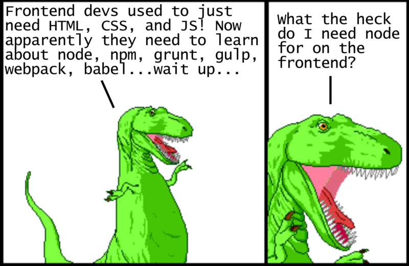
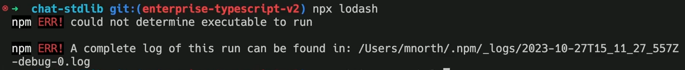
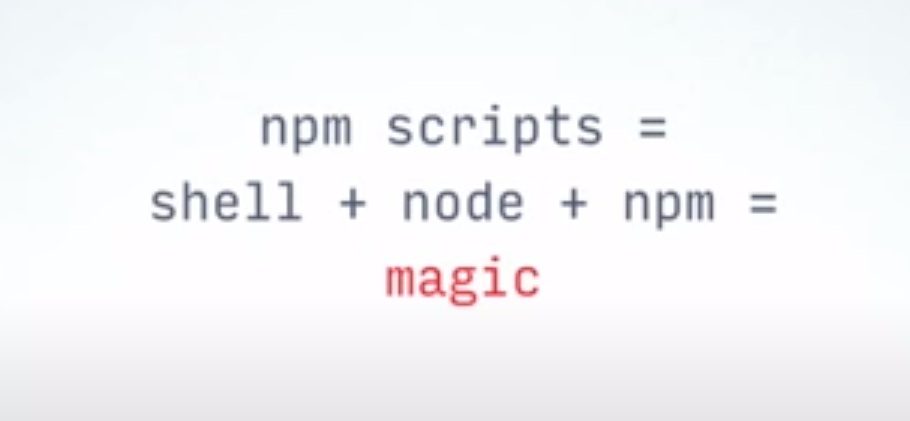
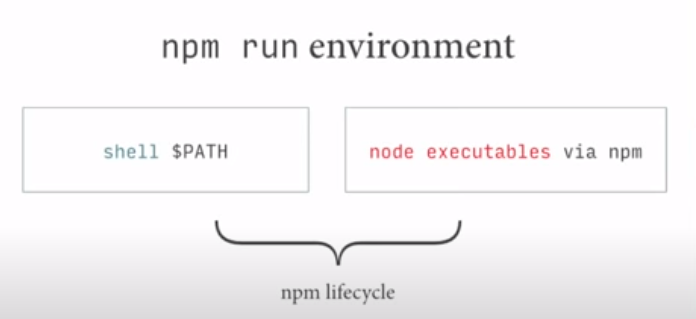
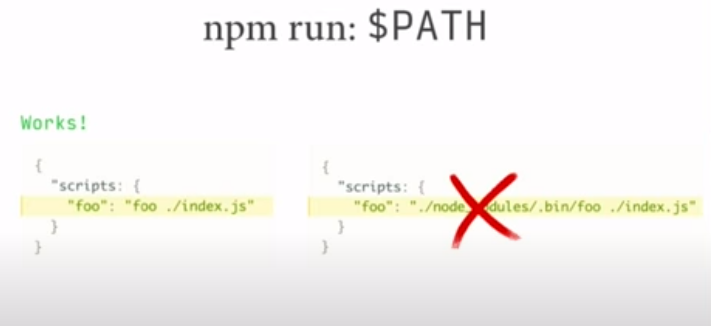

# INDEX

- [INDEX](#index)
  - [Old vs Modern Javascript with Package managers](#old-vs-modern-javascript-with-package-managers)
    - [Using javascript the old way](#using-javascript-the-old-way)
  - [Package managers (Javascript the modern way)](#package-managers-javascript-the-modern-way)
    - [NPM](#npm)
    - [Yarn](#yarn)
    - [Package manager Notes](#package-manager-notes)
  - [npm scripts](#npm-scripts)
    - [Chaining commands](#chaining-commands)
    - [Pre \& Post Scripts](#pre--post-scripts)
  - [Build Tools](#build-tools)
    - [Build Tools Steps](#build-tools-steps)
  - [Deployment](#deployment)
    - [CI/CD](#cicd)
      - [CI/CD using netlify](#cicd-using-netlify)

---

## Old vs Modern Javascript with Package managers



- in old javascript development when we wanted to include a library, we needed to download its `.js` file and include it before our main `.js` file in the `html` file
  - The good thing was that it was easy enough to understand. The bad thing was that it was annoying to find and download new versions of libraries every time they would update.
- Starting around 2010, several competing JavaScript package managers (`npm`, `yarn`) emerged to help automate the process of downloading and upgrading libraries from a central repository
  - Note that `npm` was originally a package manager made specifically for `node.js`, a JavaScript runtime designed to run on the **server**, not the frontend (in the browser).
  - Using package managers generally involves using a command line, which in the past was never required as a frontend dev

---

### Using javascript the old way

- We used to use javascript in the browser by including the `.js` file in the `html` file, which involves manually downloading and linking files.

  ```html
  <!-- index.html -->
  <!DOCTYPE html>
  <html lang="en">
    <head>
      <title>Old JavaScript</title>
    </head>
    <body>
      <h1>Hello from HTML</h1>
      <script src="index.js"></script>
    </body>
  </html>
  ```

- The script refers to a separate javascript file in the same directory called `index.js`:

  ```js
  // index.js
  console.log('Hello from JavaScript');
  ```

- If you needed to use a third-party library, you would have to download the library `js` files and include it in the HTML file before your main script:
  - We can add `moment` library by downloading the `moment.min.js` file and including it in the `html` file as follows:

    ```html
    <!-- index.html -->
    <!DOCTYPE html>
    <html lang="en">
      <head>
        <title>Old JavaScript</title>
      </head>
      <body>
        <h1>Hello from HTML</h1>
        <script src="moment.min.js"></script>
        <script src="index.js"></script>
      </body>
    </html>
    ```

  - Now `moment.min.js` gets loaded before `index.js`, so we can use it in `index.js`:

    ```js
    // index.js
    console.log('Hello from JavaScript');
    console.log(moment().startOf('day').fromNow());
    ```

This is how we used to use javascript in the browser, The good thing that it was easy enough to understand. The bad thing was that it was annoying to find and download new versions of libraries every time they would update. But it's not the case anymore. Now we use `npm` to download and manage our packages.

---

## Package managers (Javascript the modern way)

Starting around 2010, several competing JavaScript package managers emerged to help automate the process of downloading and upgrading libraries from a central repository. `Bower` was arguably the most popular in `2013`, but eventually was overtaken by `npm` around `2015`. (It’s worth noting that starting around late `2016`, `yarn` has picked up a lot of traction as an alternative to npm’s interface, but it still uses `npm` packages under the hood.)

- Popular package managers:
  - `npm` (Node Package Manager)
    - It was originally a package manager made specifically for `node.js`, a JavaScript runtime designed to run on the **server**, not the frontend (in the browser).
  - `yarn` (Facebook’s package manager)
  - `pnpm` (a fast, disk space efficient package manager)

---

### NPM

It's a simple command-line tool that automates the process of downloading and installing packages from the **NPM Registry**. It also helps manage dependencies and versioning.

- `npm init`
  - generate a new file named `package.json` This is a configuration file that npm uses to save all project information.
    - it can be described as a manifest of your project that includes the packages and applications it depends on, information about its unique source control, and specific metadata like the project's name, description, and author.
    - it is always structured in the `JSON` format, which allows it to be easily read as metadata and parsed by machines.
  - > You can use `npm init --yes` to Instantly Initialize a Project
- `package.json` file
  - It's a simple JSON file that contains metadata about your project and its dependencies defining the packages required for your project to run.
- `npm install package-name`
  - This command does two things:
    1. first, it downloads all the package-code from the **NPM Registry** into a folder called `node_modules`.
    2. Second, it automatically modifies the `package.json` file to keep track of the package as a project dependency.

> This is useful later when sharing a project with others — instead of sharing the `node_modules` folder (which can get very large), you only need to share the `package.json` file and other developers can install the required packages automatically with the command `npm install`

- now to use the library/package, we have 2 choices:
  1. **Use the `.js` file in the `node_modules/package_name` directory (not recommended ❌)**
     - This means we can link to the npm downloaded version of the package in the `index.html` file as follows:

     ```html
     <script src="node_modules/package_name.js"></script>
     <script src="node_modules/moment/min/moment.min.js"></script>
     <script src="index.js"></script>
     ```

     - So the good thing is that we can now use npm to download and update our packages through the command line. The bad thing is right now we’re digging through the `node_modules` folder to find the location of each package and manually including it in our `HTML` ile. That’s pretty inconvenient
     - Instead we can use a way to automate that process, which is the second option.

  2. **Using a JavaScript module bundler (webpack) (recommended ✅)**
     - using `node.js` modules. Instead of loading all of `package_name.js` with an HTML script tag, you can load it directly in the JavaScript file as follow:

       ```js
       // index.js
       var moment = require('moment');

       // rest of the main code
       ```

     - This is all great for `node.js`, but if we tried to use the above code in the browser, we get an error saying _"`require` is not defined"_. The browser doesn’t have access to the file system, which means loading modules in this way is very tricky — loading files has to be done dynamically, either synchronously (which slows down execution) or asynchronously (which can have timing issues).
     - This is where a **module bundler** comes in. we need a module bundler to find all require statements (which is invalid browser JavaScript syntax) and replace them with the actual contents of each required file. The final result is a single bundled JavaScript file (with no require statements)!
     - For example, we can use `webpack`’s **dist/main.js** output, we are going to use it instead of `index.js` in the browser, as it contains invalid require statements. This would be reflected in the `index.html` file as follows:

       ```html
       <script src="dist/main.js"></script>
       ```

- `npx`
  - It's useful when you're running npm package that has some sort of executable script (or command line interface) that you want to run without having to install it globally.
  - It's a tool that comes with npm `5.2+` and higher. It allows you to run a command (from the package in `node_modules/.bin`) without having to install it globally.
  - It's useful for running packages that you don't want to install globally, or for running a package that you only need once.
  - If a package doesn't have a `bin` property in its `package.json`, then `npx` will give an error.
    
  - Ex:

    ```sh
    npx create-react-app my-app # initialize a react app

    npx tsc example.ts # run typescript compiler
    ```

    - Here this is equivalent to running this:

      ```sh
      npm install -g create-react-app # global install
      create-react-app my-app # initialize a react app
      ```

---

### Yarn

[Different commands](https://classic.yarnpkg.com/lang/en/docs/cli/run/#toc-yarn-run-script)

---

### Package manager Notes

- **dependencies**: this saves it as a dependency for your application, which means it’s a package that you need in order for your code to run
  - it's also done with the optional `--save` argument or `-S`
- **devDependency**: this saves it as a development dependency, which means it’s a package that you need in your development environment but not on your production server
  - It's done with the `-dev` argument or `-D`
  - You can also use the optional `--save-dev` argument or `-D`
- When a package has a version starts with **`^`**, this means that we tell tha package manager to install **the latest version**
- `Bundling` with `parcel` creates a `script` not a `module`, so in html we shouldn't write `type="module"` in `<script>`
- if you're using `windows`, don't write scripts with **single quotation** as it won't work, so you'll have to use **double quotation**
- You may notice that the `node_modules` folder contains other folders (packages) than what we installed. This is because **each package may have its own dependencies**, so they are all installed in the `node_modules` folder.
- **Symantics Versioning**: is a standard for versioning packages. It has three parts: `major.minor.patch`.
  - For example, `1.2.3` is a `SemVer` version. The `major` version is incremented when there are breaking changes, the `minor` version is incremented when there are new features, and the `patch` version is incremented when there are bug fixes.
  - More here -> [semantic-versioning](../Node.js//1-Node.md#semantic-versioning)
- **Volta**
  - It's a hassle-free javascript tool manager. It allows you to install and manage different versions of Node.js, npm, yarn, and other tools.
  - It allows you to install and manage different versions of Node.js, npm, yarn, and other tools.
  - This is useful for ensuring that your project works with the same version of Node.js and other tools across different machines and environments.
  - It also allows you to create a `volta.json` file that specifies the version of Node.js and other tools that your project uses.

---

## npm scripts

It is a tool that automates different parts of the build process (Triggering Build Workflow). For frontend development, tasks include `minifying code`, `optimizing images`, `running tests`, etc.

> npm allows you to add the scripts property in package.json, where you can define aliases for terminal commands. For example, instead of typing the long command `ng serve --app restclient --proxy-config proxy-conf.json`, you can define a start command in the scripts section of package.json as follows:
>
> ```json
> "scripts": {
>   "start": "ng serve --app restclient --proxy-config proxy-conf.json"
> }
> ```

- The `"scripts"` property of your `package.json` file supports a number of built-in scripts and their preset life cycle events as well as arbitrary scripts. These all can be executed by running `npm run-script <stage>` or `npm run <stage>` for short.
- Pre and post commands with matching names will be run for those as well (e.g. `premyscript`, `myscript`, `postmyscript`). Scripts from dependencies can be run with `npm explore <pkg> -- npm run <stage>`.

> In 2013, [Grunt](https://gruntjs.com/) was the most popular frontend task runner, with [Gulp](https://gulpjs.com/) (more about Gulp in [FrontEnd.md file](../Internet/FrontEnd.md)) following shortly after. Both rely on plugins that wrap other command line tools. Nowadays the most popular choice seems to be using the scripting capabilities built into the **npm package manager** itself, which doesn’t use plugins but instead works with other command line tools directly.

it's the `entries` in the `scripts` field of the `package.json` file. The scripts field holds an object where you can specify various commands and scripts that you want to expose.

>  > 
>
> - **shell/bash**: it's good at:
>   - file i/o
>   - chaining tasks
>   - running tasks in series/parallel>
> - **node**: we can replace shell commands with node-implementations, like
>   - `bash` -> `node`
>   - `cat` -> `catw`
>   - `mkdir` -> `mkdirp`
>   - `rm` -> `rimraf`
>   - `&` -> `npm-run-all -parallel`
>
> This is achievable because most packages come with shell commands

- This is very useful when we have repetitive tasks and we have to automate them.

- how it work -> there is a folder called `.bin`, in `node_modules`. this folder contains **binary-executables** for each installed module/package, which we can run using scripts

- [reference](https://docs.npmjs.com/cli/v8/using-npm/scripts)

- in `package.json` :

  ```json
  // you may have to remove the ("main" line) above "scripts" in the file or replace it with "default"
  {
    "default": "index.html",

    "scripts": {
      "start": "parcel index.html",
      "build": "parcel build index.html --dist-dir ./dist"
    }
  }
  ```

> Note that the scripts in `package.json` can run webpack without having to specify the full path `./node_modules/.bin/parcel`, since `node.js` knows the location of each npm module path
> 

- These can be executed using the following command :

  ```bash
  # npm run <script-name>

  npm run start
  # or
  npm start

  # run this after finishing development and removed (dist, modules) folders and you are ready for deployment
  npm run build
  ```

### Chaining commands

- when you want to chain commands for a script like "go to folder then run `npm start`", you can use the `&&` or the `--prefix` option:

  ```sh
  cd client && npm start
  # or
  npm start --prefix client
  ```

- **`&` vs `&&`**
  - `&`: do the second command in the background and don't wait for the first one to finish
    - this is useful for commands with servers as servers stay working and don't finish
  - `&&`: do the second command after the first one finishes

### Pre & Post Scripts

To create "**pre**" or "**post**" scripts for any scripts defined in the "scripts" section of the `package.json`, simply create another script with a matching name and add "`pre`" or "`post`" to the beginning of them.

- They're also called **npm lifehooks commands**:

  ```json
  {
    "scripts": {
      "precompress": "{{ executes BEFORE the `compress` script }}",
      "compress": "{{ run command to compress files }}",
      "postcompress": "{{ executes AFTER `compress` script }}"
    }
  }
  ```

---

## Build Tools

In `2013`, `Grunt` was the most popular frontend task runner, with `Gulp` following shortly after. Both rely on plugins that wrap other command line tools.

Nowadays the most popular choice seems to be using the scripting capabilities built into the npm package manager itself, which doesn’t use plugins but instead works with other command line tools directly.

- One of the benefits of using bundlers – they give more control over how modules are resolved, allowing bare modules and much more, like CSS/HTML modules.

### Build Tools Steps

1. Take a “main” module, the one intended to be put in `<script type="module">` in HTML.
2. Analyze its dependencies: imports and then imports of imports etc.
3. Build a single file with all modules (or multiple files, that’s tunable), replacing native `import` calls with bundler functions, so that it works. “Special” module types like HTML/CSS modules are also supported.
4. In the process, other transformations and optimizations may be applied:
   - Unreachable code removed.
   - Unused exports removed (“tree-shaking”).
   - Development-specific statements like `console` and `debugger` removed.
   - Modern, bleeding-edge JavaScript syntax may be transformed to older one with similar functionality using **Babel**.
   - The resulting file is minified (spaces removed, variables replaced with shorter names, etc).

> If we use bundle tools, then as scripts are bundled together into a single file (or few files), import/export statements inside those scripts are replaced by special bundler functions. So the resulting “bundled” script does not contain any import/export, it doesn’t require type="module", and we can put it into a regular script:
>
> ```html
> <!-- Assuming we got bundle.js from a tool like Webpack -->
> <script src="bundle.js"></script>
> ```

You can find more in depth here -> [Modules & Bundlers](../DEV/Modules%20%26%20Bundlers.md)

---

## Deployment

- the `dist` folder is the one that will be moved in the deployment-service like [netlify](https://www.netlify.com/)

### CI/CD


[reference](https://resources.github.com/ci-cd)

#### CI/CD using netlify

- first :
  - deploy the `dist` folder in [netlify](https://www.netlify.com/)
  - you pushed the project files **(wirhout `dist` folder)** into a repository in github
- second :
  - in the project settings in `netlify` go to CI/CD
  - link the github repo of the project
- third :
  - in `netlify => build settings` : write the same build script used in `package.json` file
  - In publish-directory => write : `dist`
