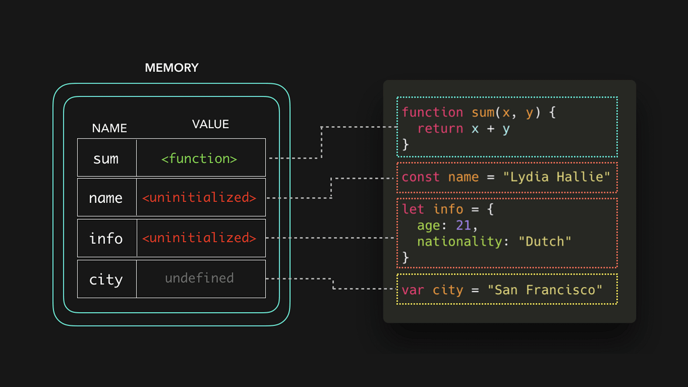

# INDEX

- [INDEX](#index)
  - [Compiled vs Interpreted Language](#compiled-vs-interpreted-language)
    - [Compiled Language](#compiled-language)
    - [Interpreted Language](#interpreted-language)
  - [JavaScript Engine](#javascript-engine)
    - [How the engine works ?](#how-the-engine-works-)
    - [call-stack \& Memory-heap](#call-stack--memory-heap)
  - [Types](#types)
    - [Primitive Types vs Reference Types](#primitive-types-vs-reference-types)
    - [`null` vs `undefined`](#null-vs-undefined)
    - [Strict vs Loose Equality (`===` \& `==`)](#strict-vs-loose-equality---)
    - [Type Conversion](#type-conversion)
    - [Type Coercion](#type-coercion)
  - [Execution context](#execution-context)
    - [Scope](#scope)
      - [Lexical scope](#lexical-scope)
    - [Hoisting](#hoisting)
    - [`this` keyword in functions (execution context)](#this-keyword-in-functions-execution-context)
  - [Functional Programming](#functional-programming)
    - [currying \& partial Application](#currying--partial-application)
      - [Currying](#currying)
      - [Partial Application](#partial-application)
    - [Closure](#closure)
      - [Function returning Functions](#function-returning-functions)
      - [Closure Benefits](#closure-benefits)
    - [Pure Functions](#pure-functions)
    - [Decorators](#decorators)
      - [Using “func.call” for the context](#using-funccall-for-the-context)
    - [Iteration vs. Recursion](#iteration-vs-recursion)
    - [Recursion \& performance](#recursion--performance)
    - [First class functions and Higher order functions](#first-class-functions-and-higher-order-functions)
      - [Examples of higher order functions (`call`, `apply`, `bind`)](#examples-of-higher-order-functions-call-apply-bind)
    - [Referential Transparency](#referential-transparency)
    - [Composition](#composition)
    - [Functional Decoration](#functional-decoration)
  - [Generators](#generators)
    - [Generator Methods](#generator-methods)
    - [Generators are Iterable](#generators-are-iterable)
    - [Generators in Async Code](#generators-in-async-code)
  - [JS : The weird parts](#js--the-weird-parts)
    - [Numbers](#numbers)
  - [Miscellaneous](#miscellaneous)
    - [Mutation observer](#mutation-observer)
    - [Selection and Range](#selection-and-range)
  - [Notes](#notes)

---

## Compiled vs Interpreted Language


### Compiled Language

- Language is written and compiled to machine code inside of an application
- Errors are detected during compiling
- The code won’t compile until it’s error-free
- it `optimizes` the code as it **cashes** any repeated function.
  - if it say `add(2,3)` function it caches its result (5) and uses it if it found the same function-call again --> **improves performance**
- Examples: C, C++, Erlang, Go

### Interpreted Language

- The interpreter translates and runs code **one statement at a time**
  - each line of code is translated to machine-code one-by-one as the script is run.
  - the interpreter always looks for **variables** and **function declarations** before going through each section of a script, line-by-line.
- Errors found when the code is run
- Interpreter starts running the code quickly
- Interpreted code runs more slowly
- it's more fit to `javascript` as JS runs on the browser

> Node.js Is an Interpreter

---

## JavaScript Engine

The JavaScript engine is a program or an interpreter that reads and executes the JavaScript code. The most popular JavaScript engines is **V8** which is used in **Google Chrome** and **Node.js**.

- javascript uses best of (**Interpreted** & **Compiled**) languages ---> **Jit Compiler**

  
  

- is `javascript` an interpreted language ?
  - yes **initially**, but it evolved to use compilers as well based on the implementation, as the code is compiled to machine code first then it's executed by the engine with optimizations to the initial compiled code

### How the engine works ?

1. The engine (embedded if it’s a browser) reads (**“parses”**) the script.
2. Then it converts (**“compiles”**) the script to machine code.
3. And then the machine code runs, pretty fast.

> the browser's **Console** is a live interpreter of the javascript engine

### call-stack & Memory-heap

**Heap**: a much larger part of the memory that stores everything allocated dynamically, that allows a faster code execution, and protects it from corruption and makes the execution faster.

- Memory-heap: boxes which store datatypes -->error-> `memory leak`:

  - usually when you have values that has place in memory but not used
  - also common in **event listeners** which are always listening(waiting) for an event

- call-stack -->error-> `stack overflow`: usually from **recursion**
  - always the first thing in it is the **global execution context** (Top-level Code / variable declared outside a function)
    

> **global execution context** consists of 2 things:
>
> - storing variables / function in **memory** (global state)
> - performing functions execution in the **thread of execution (call stack)** where each function gets its own **mini execution context**

---

## Types

### Primitive Types vs Reference Types

- Javascript has 2 main types of values
  

- `reference-type` are stored in the `Heap` as we don't know how big its size would be so it's like if the `Heap` has unlimited storage unlike `call stack` which has a limited size (`4-8MB`)
  

- Types:

  1. **primitive values** : they are the most basic data types in the language. They are **immutable** (cannot be changed) and **copied by value** (when assigning or passing).
     - There are 7 primitive types
       
  2. **reference values** : they are more complex data types. They are **mutable** (can be changed), **copied by reference** (when assigning or passing).
     - There are 3 types of objects: `object`, `function`, `array`.

- **Memory allocation** for `primitive` vs `reference` types:
  

  - There's a difference in how memory is allocated for `primitive` and `reference` types. In the case of `primitive` types, the value is stored directly in the memory location, while in the case of `reference` types, the memory location stores a reference to the actual value in the `heap`.

---

### `null` vs `undefined`

To remember the difference, use the song "I want it that way"


- **`null` vs `undefined`**
  
  - `null`: is you set it to **empty** intentionally, (a variable with no value - it may have had one at some point, but no longer has a value)
    - developer sets the value
  - `undefined`: is you set it to **empty** unintentionally, (a variable that should have a value assigned to it, but doesn't yet, , or hasn't been created yet)
    - javascript can't find value for it
    - it's empty because it:
      - variable without value:
        - **has not been set**
        - **Doesn't currently have a value**.
      - missing function arguments
      - missing object properties
- or `null` is empty on purpose, while `undefined` is still empty.
- `undefined` means a variable has been declared but **has not yet been assigned a value**
- `null` is an assignment value. It can be assigned to a variable as a representation of **no value**.

- Notes:

  ```js
  typeof null; // object (a bug in JS)
  ```

---

### Strict vs Loose Equality (`===` & `==`)

The difference is that `==` will do **type coercion** before comparing, whereas `===` will not do any type coercion (it will only return `true` if both values and types are the same).

- Because of [Type coercion](#type-coercion), the strict equality operators `===` and `!==` result in fewer unexpected values than `==` and `!=` do.
- if `===` would always be equivalent to `==` in your code, using it everywhere sends a wrong semantic signal : **protecting myself since I don't know'trust the types**

- How "Double equal" works:

  - If the types differ, try to convert them to the same type by using coercion to:

    - convert to previous type (if possible) then compare -> `[] -> "" -> 0 -> false`
    - that's why it's not recommended to use `==` with `true / false` as it will convert it to `1 / 0` and compare it with the other value

    ```js
    [] == true;
    // to
    '' == 1;
    // to
    0 == 1;
    // to
    false;
    ```

> **Note:** It's a myth that `===` is slower than `==` in modern browsers.
>
> - Some argue that using `===` everywhere implies a lack of understanding or trust in your code's types.
>
> - Clear and obvious types lead to better code. Use `==` when types are known, otherwise use `===`.

---

### Type Conversion

**Explicit Type Conversion (Type Casting)**: is when data type is converted by the programmer using type casting.

- Here are some examples of explicit type conversion:

  - `Number()`, `String()`, `Boolean()`
  - `parseInt()`, `parseFloat()`
  - `toString()`, `toFixed()`
  - `JSON.stringify()`, `JSON.parse()`

- When the conversion fails, the result is `NaN` (Not a Number).

  ```js
  Number('123'); // 123
  Number('hello'); // NaN
  ```

- **Truthy & Falsy values:**

  - **Falsy values**: `false`, `0`, `""`, `null`, `undefined`, `NaN`
  - **Truthy values**: `true`, `1`, `"hello"`, `[]`, `{}`, `function(){}`

  ```js
  Boolean(0); // false
  Boolean(''); // false
  Boolean('0'); // true -> because it's a string (any string that is not empty is true)
  Boolean(1); // true
  Boolean({}); // true
  ```

---

### Type Coercion

**Type coercion** is the process of implicitly converting value from one type to another.

> **Implicit vs Explicit**
>
> 
>
> - **type coercion** is implicit whereas **type conversion** can be either implicit or explicit


- **Truthy & Falsy values:**

  ```js
  if (0) {
    // this code will not run
  }
  ```

- **Operator overloading:** `+` vs `-` :

  

  - `-` : if one of the operands is not a number, it tries to convert it to a number and subtracts it
  - `+` : if one of the operands is a string, it converts the other operand to a string and concatenates them

- convert string to number using :

  - `unary` operator
    - it's a `+` or `-` before the string number => `console.log(+"565")`
    - it's a `!` before something => `console.log(! (x > 4) )`
  - `parseint()` or `parsefloat()` => `parseint(100Ahmed)` = 100

- `string to boolean`: 

  - `Boolean("0");` --> **true**

- **Coercion Corner Cases**

  ```js
  1 < 2; // true
  2 < 3; // true
  1 < 2 < 3; // true (1 < 2 = true => true < 3 => 1 < 3 = true)

  3 > 2; // true
  2 > 1; // true
  3 > 2 > 1; // false (3 > 2 = true => true > 1 => 1 > 1 = false)

  { x: 1 } == { x: 1 }; // false
  { x: 1 } === { x: 1 }; // false
  ```

---

## Execution context

It's the environment in which javascript code is executed, it stores all the necessary info for some code to be executed.


- Each function has its own Execution context, and it's created when the function is called. and all execution contexts together make the **call stack**.
  

  - The default execution context is the **global execution context** which is created when the script is loaded (top-level)

- It consists of these parts:
  

  - Local **Thread of execution** -> code that is being executed
  - Local **Memory** -> `local variables`, `arguments passed to the function`
  - **Scope chain** -> where the function was written
  - **`this`** keyword -> how the function was called (not in `arrow functions`)

- Example
  

---

### Scope

It's the environment in which a variable is declared and accessible.

- Types of scopes:

  1. **Global scope**: Variables declared outside functions, accessible anywhere.
  2. **Function scope**: Variables declared inside a function, accessible only within.
  3. **Block scope (ES6)**: Variables declared inside a block, accessible only within.
     - `let` or `const` inside a block, accessible only within. But `var` is accessible outside the block.
     - `functions` are also `block-scoped` in `strict mode`, otherwise they are `function-scoped`.

- Types of variables based on scope:

  - **Local variables**: Created and removed within a function, no naming conflicts between functions.
  - **Global variables**: Persist in memory while the page is loaded, higher memory usage, risk of naming conflicts.

- **Scope chain**: The order the interpreter searches for variables, from innermost to global scope.
  

  - Scope chain has nothing to do with the order of function calls in the code.
    
    - Here, even though the `third()` function is called in the `second()` function's body, it won't have access to the `first()` function's variables, because it's not in the `scope chain` of the `third()` function.

- **Scope Variables** are properties of a special internal object.

  - Accessing a variable means accessing a property of this object.

- Variables defined outside a function are accessible inside functions defined after them even if they are called before the function definition.
  

  - This is called a **Backpack** or **Persistent Lexical Scope Referenced Data (PLSRD)**.
  - Each function execution gets its own Backpack.

- **Dynamic scope** does not exist in JavaScript.

> **Note**: (if not in strict mode) -> if variable is assign a value but never declared in a scope or block -> it automatically gets declared in the global scope

- if function is declared in a local scope, it can't be accessed outside:

  ```js
  let phrase = 'Hello';

  if (true) {
    let user = 'John';

    function sayHi() {
      alert(`${phrase}, ${user}`);
    }
  }

  sayHi(); // The result is an error.
  // The function sayHi is declared inside the if, so it only lives inside it. There is no sayHi outside.
  ```

- The global object has a universal name -> `globalThis`.
  - ( `window` object ) -> In the browser
  - ( `global` object ) -> In Node.js

---

#### Lexical scope

It's the scope that is defined at the time of writing the code, and it doesn't change when the code is executed.

- It's where the function was **defined** (Functions are linked to the object they were defined within)
- Lexical Environment has two parts:
  1. **Environment Record**: Stores local variables.
  2. **Outer Reference**: Points to the outer lexical environment.

---

### Hoisting

It's a JavaScript mechanism where variables and function declarations are moved to the top of their containing scope before code execution.

- It makes some types of variables accessible/usable in the code before they are actually declared.

- It's to make space in memory for a variable to be able to:

  - Call functions before they have been declared
  - Assign a value to a variable that has not yet been declared

- **variables and functions** within each execution context are created before they are executed.
  

  - `var` hoisting: usually bad, as **with `var`, you can access declaration, but not the value**

    ```js
    console.log(name); // undefined
    var name = 'John';
    ```

  - `function` hoisting: actually pretty useful --> **must be a function declaration**

    ```js
    display(); // "hello world" ✅
    function display() {
      console.log('hello world');
    }

    display2(); // ReferenceError: Cannot access 'display2' before initialization ❌
    let display2 = function () {
      console.log('hello world');
    };
    ```

  - `let / const` hoisting:

    - it gets **hoisted but not initialized** (it's not assigned a value) -> so you can't access it before the initialization -> `TDZ (Temporal Dead Zone) Error`
      

      - Javascript knows that the variable is declared but not initialized, so it throws an error, if the variable wasn't declared, it would have thrown a `ReferenceError (not defined)`

- **How hoisting works ?**

  - Before the code is executed, code is scanned for variable declarations, and for each variable, a new property is created in the variable environment object and added to the memory
    

- Why Hoisting is useful ?

  - Using functions before actual declaration
  - `var` hoisting can be useful in some cases, but it's usually better to use `let` or `const` instead.

- **Temporal Dead Zone (TDZ)**

  - It's the time between the variable creation and initialization, where you can't access the variable.
  - It only happens with `let` and `const` variables, not with `var` variables. because `var` is initialized with `undefined` by default.
    

  - Why TDZ is useful ?

    - It helps to catch errors in the code, as it throws an error if you try to access a variable before it's initialized.

---

### `this` keyword in functions (execution context)

It's a special variable that is created for every execution context (every function), which takes the value of (points to) the “owner” of the function in which the `this` keyword is used.

- It's not static. It depends on **how the function is called**, and its value is only assigned when the function is called.
  

- **Arrow functions**:

  - Lexical `this`: Defined by where it was written, not called.
  - No `this`: Taken from the outer scope (global scope, `window` object).
  - Object methods: Still point to the global object.
  - **Avoid using arrow functions as methods inside objects**: `this` will refer to the upper scope, usually the global object.

- **Normal functions**:

  - `this` refers to the caller (dynamic scope).
  - `this` is `undefined` if called globally if in strict mode, otherwise it points to the global `window` object.

- **Notes**

  - When chaining multiple methods (functions) that uses `this` keyword, you can return `this` at the end to make it chainable.

    ```js
    let ladder = {
      step: 0,
      up() {
        this.step++;
        return this; // return the object itself to be able to chain the methods
      },
      down() {
        this.step--;
        return this;
      },
      showStep() {
        alert(this.step);
        return this;
      }
    };

    ladder.up().up().down().showStep().down().showStep(); // shows 1 then 0
    ```

  - When you want to write a function inside object method, (use `arrow function` or use `self` reference variable ) to avoid `this` confusion.

    ```js
    let user = {
      name: 'John',
      sayHi_1() {
        let func = () => alert(this.name); ✅
        func();
      },
      sayHi_2() {
        function func() {
          alert(this.name); // Error ❌: Cannot read property 'name' of undefined
        }
        func();
      },
      sayHi_3() {
        const self = this; // use self reference variable
        function normal2() {
          alert(self.name); ✅
        }
        normal2();
      },
    };

    user.sayHi_1(); // John
    user.sayHi_2(); // Error, because `this` is undefined
    user.sayHi_3(); // John
    ```

  - without `strict mode`, `this` will point to the global object => `window`

---

## Functional Programming

- Functional programming is about **Verbs** (actions)

  - it's like a black box that takes something in and returns something out
  - it depends on **Tiny functions**: Save every single line (or few lines) as its own function
  - **Recombine/compose** Build up our application by using these small blocks of self-contained code combining them up line-by-line by referring to their human-readable name

    ```js
    // Todo list
    pipe(
      getPlayerName,
      getFirstName,
      properCase,
      addUserLabel,
      createUserTemplate
    )([{ name: 'Abdelrahman', score: 3 }]);
    ```

  - the result that we will get a code that is:
    - Easier to add features
    - More readable
    - Easier to debug

- object oriented programming is about **pronouns** (objects and things) -> "keep state to yourself and send/receive messages"

**functions :**

- Reduce the potential impact of any given line to maybe 10 other lines (inside the function)
- structure our code into individual pieces where almost every single line is **self-contained**
- **No consequences** except on that line Each function’s only ‘consequence’ is to have its result given to specifically the next line of code (‘function call’) and not to any other lines

---

### currying & partial Application


> These 2 concepts use **Closures**

#### Currying

It's the process of converting a function that takes multiple arguments into a function that takes them one at a time.

- Currying allows us to easily get `partials`, which are functions that already have some of the parameters of the original function using `closures`.

```js
function curry(f) {
  // curry(f) does the currying transform
  return function (a) {
    return function (b) {
      return f(a, b);
    };
  };
}

// usage
function sum(a, b) {
  return a + b;
}

let curriedSum = curry(sum);

alert(curriedSum(1)(2)); // 3
```

- **Notes:**
  - The currying requires the function to have a fixed number of arguments.
  - A function that uses rest parameters, such as `f(...args)`, can’t be curried this way.

#### Partial Application

It's the process of applying a function to **some/part of** its arguments. The partially applied function gets returned for later use

> see it's use in [`bind` section](#examples-of-higher-order-functions-call-apply-bind)

- it's creating a new outer-function that calls our multi-argument function with the argument, and the multi-argument function stored conveniently in the **Backpack**

  ```js
  const multiply = (a, b) => a * b;

  function prefillFunction(fn, prefilledValue) {
    const inner = liveInput => {
      const output = fn(liveInput, prefilledValue);
      return output;
    };
    return inner;
  }
  const multiplyBy2 = prefillFunction(multiply, 2);
  const result = multiplyBy2(5);
  ```

- **we can also use `bind()` for "`this`"**:

  ```js
  // Syntax
  let bound = func.bind(context, [arg1], [arg2], ...);

  // EX:
  function mul(a, b) {
    return a * b;
  }

  let double = mul.bind(null, 2);

  alert( double(3) ); // = mul(2, 3) = 6
  alert( double(4) ); // = mul(2, 4) = 8
  ```

  - Please note that we actually don’t use `"this"` here. But `bind` requires it, so we must put in something like `null`.
  - The call to `mul.bind(null, 2)` **creates a new function** `double` that passes calls to `mul`, fixing `mull` as the context and `2` as the first argument. Further arguments are passed “as is”.

- **Going partial without context ("`this`")**

  - What if we’d like to fix some arguments, but not the context `this`? For example, for an object method.
    - The native `bind()` does not allow that. We can’t just omit the context and jump to arguments.
  - Fortunately, a function `partial()` for binding only arguments can be easily implemented:

  ```js
  function partial(func, ...argsBound) {
    return function (...args) {
      return func.call(this, ...argsBound, ...args);
    };
  }

  // Usage:
  let user = {
    firstName: 'John',
    say(time, phrase) {
      alert(`[${time}] ${this.firstName}: ${phrase}!`);
    }
  };

  // add a partial method with fixed time
  user.sayNow = partial(user.say, new Date().getHours() + ':' + new Date().getMinutes());

  user.sayNow('Hello'); // [10:00] John: Hello!
  ```

  - Also there’s a ready [`_.partial`](https://lodash.com/docs#partial) implementation from **lodash** library.

- **Why do we usually make a partial function?**

  - The benefit is that we can create an independent function with a readable name (`double`, `triple`). We can use it and not provide the first argument every time as it’s fixed with `bind`.
  - In other cases, **partial application** is useful when we have a very generic function and want a less universal variant of it for convenience.
    - For instance, we have a function `send(from, to, text)`. Then, inside a user object we may want to use a partial variant of it: `sendTo(to, text)` that sends from the current user.

---

### Closure

A closure allows a function to remember variables from its creation context, even after the outer function has returned.

- It's a closed-over **(variable environment)** of the execution context in which the function was created, even after that execution context is gone.

  - **Function's `[[Environment]]` property**:

    - References the Lexical Environment (in the scope chain) where the function was created.
    - functions created with `new Function()` always references the global Lexical Environment, not the outer one, preventing access to outer variables.
    - **Benefit**: Access outer function's scope from an inner function, even after the outer function has returned.

- How does it work ?

  - When a function is created, it keeps a reference to its outer lexical environment (where it was created), even if the outer function has finished executing.
    - The function keeps a reference to its outer lexical environment in a hidden property `[[Environment]]`.
  - Then, the function is returned and assigned to a variable. The variable becomes a function reference that keeps the reference to the outer lexical environment.
    - It's done by **returning a function from another function**
  - When the function is called, it uses the outer lexical environment to access the variables. (even if the outer function has finished executing)
  - Steps:
    
    
    

  - EX:

    ```js
    function makeCounter() {
      let count = 0;
      return function () {
        return count++;
      };
    }

    // using it
    let counter = makeCounter();
    // now, counter() gives the next number each time it is called
    // `count` variable is in the "backpack" of the counter function (in [[Environment]] property)
    counter(); // 0
    counter(); // 1
    ```


- **Notes:**

  - One of the biggest examples of closures are:

    - **timers**

      ```js
      function sayHi() {
        let phrase = 'Hello';
        setTimeout(function () {
          alert(phrase);
        }, 1000);
      }

      sayHi(); // Hello after 1 second
      // it remembers the phrase variable even after the function has finished and was popped off the call stack
      ```

    - **event listeners**

      ```js
      (function () {
        let count = 0;
        document.getElementById('button').addEventListener('click', function () {
          alert(count++); // we can access count variable even after the IIFE function has finished executing
        });
      })();
      ```

  - When on an interview, a frontend developer gets a question about “what’s a closure?”, a valid answer would be a definition of the closure and an explanation that all functions in JavaScript are closures, and maybe a few more words about technical details: the **`[[Environment]]`** property and how Lexical Environments work (Where the function was created, not where it was called).
  - We can't manually create closures, they are a natural part of the language that happens automatically when a function is created.
    - Because we can't access the `[[Environment]]` property directly, but it's there in the engine internals.
  - To manually read the variables in the closure of a function:

    ```js
    function g() {
      let b = 777;
      return function () {
        alert(value);
      };
    }

    let f = g(); // while g() is called, the value is remembered
    console.dir(f); // look at the [[Scopes]] property
    ```

    

---

#### Function returning Functions

this is a form of **Closure**, as in this example:

- most importantly -> `generatedFunc` **doesn't have any connection to** `createFunction`, as:
  - here `generatedFunc` is not equal to `createFunction` function
  - but it's equal to "what `createFunction` function has returned **when it was created(ran)**"
- Please note that if `f()` is called many times, and resulting functions are saved, then all corresponding Lexical Environment objects will also be retained in memory. In the code below, all 3 of them:.

  ```js
  function f() {
    let value = Math.random(); // 0.838
    return function () {
      return value;
    };
  }

  // 3 functions in array, every one of them links to Lexical Environment (same random value)
  let arr = [f(), f(), f()]; // [0.838, 0.838, 0.838]
  ```

#### Closure Benefits

- It's usually memory-efficient as it caches the values inside its block-scoped (where it was called) **(its local memory (like Backpack) + the returned value from the function)** in case that it was called again, this will be in the hidden property called `__scope__`.
  - > all functions have the hidden property named `[[Environment]]` > 
  - actually the **Backpack** doesn't contain "all" the local memory of the function, but it contains only the values/variables that will be used in the function body and will get rid of other unused things in the local memory using **garbage collection**
    
    - A Lexical Environment object dies (garbage collected) when it becomes **unreachable** (just like any other object). In other words, it exists only while there’s at least one nested function referencing it.
      - But in practice, JavaScript engines try to optimize that. They analyze variable usage and if it’s obvious from the code that an outer variable is not used – it is removed.
    - this is the main concept behind **iterator function**, where it persists a function called **returnNextElement**, which has:
      1. Our underlying array itself
      2. The position we are currently at in our ‘stream’ of elements
      3. The ability to return the next element
  - > So **iterators** turn our data into ‘streams’ of actual values we can access one after another.
  - > JavaScript’s built in iterators are actually objects with a **next()** method that when called returns the next element from the ‘stream’/ flow
- Encapsulation: prevent unwanted access to inner variables/functions

---

### Pure Functions

**Pure function**: Function **without side effects (predictable)**. Does not depend on external variables. Given the same inputs, always **returns** the same outputs


- pure function **must** return something
- **side-effects**: are about MODIFICATION and doesn't count if we created new item
  - usually it's anything that the function does other that returning a value

---

### Decorators

**Decorator** is a wrapper around a function that alters its behavior. The main job is still carried out by the function.

- Ex: create a wrapper-function around another function (Pure function) to cache its (behavior or the return-value) for multiple use

  - here: The result of `cachingDecorator(func)` is a "wrapp"r”: function(x) that “wraps” the call of func(x) into caching logic:

    ```js
    function slow(x) {
      // there can be a heavy CPU-intensive job here
      alert(`Called with ${x}`);
      return x;
    }

    function cachingDecorator(func) {
      let cache = new Map();

      return function (x) {
        if (cache.has(x)) {
          // if there's such key in cache
          return cache.get(x); // read the result from it
        }

        let result = func(x); // otherwise call func

        cache.set(x, result); // and cache (remember) the result
        return result;
      };
    }

    slow = cachingDecorator(slow);

    alert(slow(1)); // slow(1) is cached and the result returned
    alert('Again: ' + slow(1)); // slow(1) result returned from cache
    ```

  - there are several benefits of using a separate `cachingDecorator()` instead of altering the code of `slow()` itself:
    1. The `cachingDecorator()` is reusable. We can apply it to another function.
    2. The caching logic is separate, it did not increase the complexity of `slow()` itself (if there was any).
    3. We can combine multiple decorators if needed.

#### Using “func.call” for the context

The caching decorator mentioned above is not suited to work with **object methods**. The reason is that the **wrapper** calls the original function as `func(x)`. And, when called like that, the function gets `this = undefined`.

- To solve this, we need to do one of the followings

  - using the built-in function method **func.call(context, …args)** that allows to call a function explicitly setting **this** keyword.
    - It runs func providing the first argument as `this`, and the next as the arguments.

---

### Iteration vs. Recursion

In **functional programming**, we avoid `mutable state`, and therefore avoid `iterative loops` using for or while. As an alternative to iteration, we use **recursion** to break down the problem into smaller ones.

> **Recursion**: is a programming pattern that is useful in situations when a task can be naturally split into several tasks of the same kind, but simpler. Or when a task can be simplified into an easy action plus a simpler variant of the same task.
>
> - When a function solves a task, in the process it can call many other functions. A partial case of this is when a function calls itself. That’s called **recursion**.

A recursive function has two parts:

- `Base case`: condition(s) under which the function returns an output without making a recursive call
- `Recursive case`: condition(s) under which the function calls itself to return the output

Difference between iteration and recursion:

- A recursive solution is usually shorter than an iterative one.
- **Recursion**: has one problem, in typical JavaScript implementations, it’s about three times slower than the looping version. Running through a simple loop is generally cheaper than calling a function multiple times.
- Any recursion can be rewritten as a loop. The loop variant usually can be made more effective.
  - But sometimes the rewrite is non-trivial, especially when a function uses different recursive subcalls depending on conditions and merges their results or when the branching is more intricate. And the optimization may be unneeded and totally not worth the efforts.
- A recursive solution is usually shorter than an iterative one.

---

### Recursion & performance

recursion sometimes take long time as it calls multiple functions at the same time which occupies the **call stack**

- one solution is to use **memoization (caching)**

  - A loop-based algorithm is more memory-saving.
  - The iterative solution uses a single context (place in memory which is the iteration index) changing `i` and result in the process. Its memory requirements are small, fixed and do not depend on `n`.

- another solution is to use **tail call optimization**
  - **Note**: not all JavaScript engines implements **tail calls**
- The maximal recursion depth is limited by JavaScript engine. We can rely on it being `10000`, some engines allow more, but `100000` is probably out of limit for the majority of them.
- **Recursive structures**: A recursive (recursively-defined) data structure is a structure that replicates itself in parts.
  - For examples: `HTML` and `XML documents`.
    - `HTML-tag` may contain a list of: [`Text pieces`, `HTML comments`, `other HTML tags`]

---

### First class functions and Higher order functions


- **First-class objects**: Functions are values that can:

  - Be assigned to variables
  - Be passed as arguments
  - Be returned from functions (enables **closures**)

- **Higher Order Functions**: Functions that accept or return other functions (e.g., `map`, `filter`, `reduce`, `sort`, `forEach`).
  - Benefits: More readable, easier to debug, and makes code DRY.
  - Allows chaining functions by passing the output of one as the input to another.
- Core of **functional** and **asynchronous programming**: Passing functions as arguments is key, even with `promises` or `async/await`.

---

#### Examples of higher order functions (`call`, `apply`, `bind`)

`call`, `apply`, `bind` are higher order functions **used to set the `this` keyword and arguments of a (function / method) manually**.


> More [Here](https://javascript.plainenglish.io/quick-guide-to-call-apply-and-bind-methods-in-javascript-5c00cd856cfa)

- `call`

  - Invokes a function with a specified `this` context.

  ```js
  let human = { name: 'Ahmed' };
  function sayName(greeting) {
    console.log(greeting + ' ' + this.name);
  }
  sayName.call(human, 'Hi!'); // Outputs Hi! Ahmed
  ```

- `apply`

  - Similar to `call`, but takes arguments as an **array**.

    ```js
    let human = { name: ‘Ahmed’ }
    function sayName(greeting, city) {
      console.log(greeting + ' ' + this.name + ' from ' + city)
    }
    sayName.apply(human, ['Hi', 'Cairo']) // Outputs Hi! Ahmed from Cairo
    ```

  - it's not used in modern javascript because we can instead use `spread operator (...)` with `call()`

    ```js
    sayName.call(human, ...['Hi', 'Cairo']);
    // instead of
    sayName.apply(human, ['Hi', 'Cairo']);
    ```

- `bind`

  - Returns a new function with `this` bounded to a specified context.
  - Used for later use, not immediate invocation.
  - Takes arguments like `call`.
  - Doesn't call the function, useful in `eventListeners`.
  - Allows setting arguments for reuse.

    ```js
    let human = { name: 'Ahmed' };
    function sayName(greeting, city) {
      console.log(greeting + ' ' + this.name + ' from ' + city);
    }

    let greet = sayName.bind(human);
    greet('Hi!', 'Cairo'); // Outputs Hi! Ahmed from Cairo
    ```

- **Notes:**

  - These functions are accessible from `Function.prototype`.

  - There're other higher order functions like (`map`, `filter`, `reduce`, `sort`, `forEach`).
  - You can use these methods with functions that don't have a `this` keyword used inside them. by passing `null` or `undefined` as the first argument.

    ```js
    function sayHello(name) {
      console.log('Hello' + name);
    }

    sayHello.call(null, 'Ahmed'); // Hello Ahmed
    ```

  - We can call these methods with **arrow functions** but they will not work as expected because arrow functions don't have their own `this` keyword.
  - We can call these methods with part of the arguments, this is called **partial application**.

    ```js
    function multiply(a, b) {
      return a * b;
    }

    let multiplyByTwo = multiply.bind(this, 2);
    // now we don't need to write the first argument each time as it's now "pre-set"

    multiplyByTwo(4); // Outputs 8
    multiplyByTwo(5); // Outputs 10
    ```

---

### Referential Transparency

- **Referential Transparency**: emphasizes that an expression (or function) in a JavaScript program may be replaced by its **value / returned value** or any other variable having the same value without changing the result of the program. As a result, methods should always return the same value for the given argument without any side effects
- it's like **(I can replace the function-call with its returned-output and it’s the same)**


---

### Composition

It is the **combination of two functions into one**, that when applied, returns the result of the chained functions **(using reduction of the result value)**.

> In functional Programming, Composition **takes the place of inheritance in OOP**.
>
> Note that **"composition"** in OOP is different from **"composition"** in functional programming. More here [composition in OOP](../../Computer%20Science/OOP/1-OOP.md#i---inheritance)

- Chaining with dots relies on JavaScript prototype feature - functions return arrays which have access to all the high-order-function (map, filter, reduce), but if I want to chain functions that just return a regular output:

  ```js
  const multiplyBy2 = x => x * 2;
  const add3 = x => x + 3;
  const divideBy5 = x => x / 5;
  const initialResult = multiplyBy2(11);
  const nextStep = add3(initialResult);
  const finalStep = divideBy5(nextStep);
  console.log('finalStep', finalStep);
  ```

  - **But that’s risky, people can overwrite**

- Composition is a fancy term which means "combining pure functions to build more complicated ones" (make complex programs out of simple functions).


```js
let compose = (fn1, fn2) => fn2(fn1);
```

**Function composition:**

- **Easier to add features** -> This is the essential aspect of functional javascript - being able to list of our units of code by name and have them run one by one as independent, self-contained pieces
- **More readable** -> `reduce` is often wrapped in compose to say ‘combine up’ the functions to run our data through them one by one. The style is ‘point free’
- **Easier to debug** -> I know exactly the line of code my bug is in - it’s got a label!

---

### Functional Decoration

we can convert functions more easily to make them suit our task Without writing a new function from scratch, it will appear as we edit the function's body, but in reality **we're creating new wrapper outer function and using its Backpack that contains our function we saved** --> **it's using closure to supercharge our functions**

- here we want to edit the function `multiplyBy2()` to only run once

  ```js
  const oncify = convertMe => {
    let counter = 0;
    const inner = input => {
      if (counter === 0) {
        const output = convertMe(input);
        counter++;
        return output;
      }
      return 'Sorry';
    };
    return inner;
  };
  const multiplyBy2 = num => num * 2;
  const oncifiedMultiplyBy2 = oncify(multiplyBy2);
  oncifiedMultiplyBy2(10); // 20
  oncifiedMultiplyBy2(7); // Sorry
  ```

---

## Generators

They differ from Regular functions which return only single value (or nothing). **Generators** can return (`“yield”`) multiple values, one after another, on-demand. They work great with iterables, allowing to create data streams with ease.

> **Generators Summary:**
>
> - When we define a generator, when we call `.next()` method on it => it will execute the code until it reaches the first **`yield` statement**, then it will return the value of the `yield` statement and stop the execution of the function. When we call `.next()` again, it will continue the execution of the function until it reaches the next `yield` statement, then it will return the value of the `yield` statement and stop the execution of the function. And so on.
> - If in the next time we call `.next()` and passing on a value as a parameter to the `.next()` method, this value will be the result of the `yield` statement. So, the value of the `yield` statement will be replaced by the value that we passed to the `.next()` method.
> - if we kept calling `.next()` method, it will keep executing the code until it reaches the end of the function, then it will return an object with the value of `done` property set to `true` and the value of the `value` property will be the value that we passed to the `.next()` method in the last time. -> **`{ done: true, value: 10 }`**

- Once we start thinking of our data as flows (where we can pick of an element one-by-one) we can rethink how we produce those flows - JavaScript now lets us produce the flows using a function
- the Generator function allows us to exit and renter the execution-context of function manually, unlike iterators which this happens dynamically
- To create a generator, we need a special syntax construct: `function*`, so-called **“generator function”**.

- Generator functions behave differently from regular ones. When such function is called, it doesn’t run its code. Instead it returns a special object, called **“generator object”**, to manage the execution.

  ```js
  function* generateSequence() {
    yield 1;
    yield 2;
    return 3;
  }

  // "generator function" creates "generator object"
  let generator = generateSequence(); // The function code execution hasn’t started yet
  alert(generator); // [object Generator]
  ```

> **Note:** `function* f(…)` or `function *f(…)`?
>
> - Both syntaxes are correct. But usually the first syntax is preferred
> - we usually use the second syntax in object/class ES6 methods

### Generator Methods

- The main method of a generator is `next()`. When called, it runs the execution until the nearest `yield <value>` statement (value can be omitted, then it’s `undefined`). Then the function execution pauses, and the yielded value is returned to the outer code.

  - The result of `next()` is always an object with two properties:
    

    - `value`: the yielded value.
    - `done`: `true` if the function code has finished, otherwise `false`.
      - When the generator is done. We should see it from `done: true` and `value: undefined`, and New calls to `generator.next()` don’t make sense any more. If we do them, they return the same object: `{done: true}`.

    ```js
    function* generateSequence() {
      yield 1;
      yield 2;
      return 3;
    }

    let generator = generateSequence();

    let one = generator.next();

    alert(JSON.stringify(one)); // {value: 1, done: false}
    ```

  - **"yield" is a two-way street**: That’s because `yield` is a two-way street: it not only returns the result to the outside, but also can pass the value inside the generator.

    - when we pass a value to the `next()` method, it will be evaluated as the yielded value and we will continue the function until we find another yield

    ```js
    function* createFlow() {
      const num = 10;
      const newNum = yield num;
      yield 5 + newNum;
      yield 6;
    }
    const returnNextElement = createFlow(); // The function code execution hasn’t started yet
    const element1 = returnNextElement.next(); // 10
    const element2 = returnNextElement.next(2); // 7
    ```

- `generator.return(value)`

  - it finishes the generator execution and return the given value.

    ```js
    function* gen() {
      yield 1;
      yield 2;
      yield 3;
    }

    const g = gen();

    g.next(); // { value: 1, done: false }
    g.return('foo'); // { value: "foo", done: true }
    g.next(); // { value: undefined, done: true }
    ```

  - Often we don’t use it, as most of time we want to get all returning values, but it can be useful when we want to stop generator in a specific condition.

### Generators are Iterable

- Iterables are objects that implement the `Symbol.iterator` method, and we can use `ES6` features on them like **`for..of` loop and spread operator `...`**

  ```js
  function* generateSequence() {
    yield 1;
    yield 2;
    return 3;
  }

  let generator = generateSequence();

  for (let value of generator) {
    alert(value); // 1, then 2
  }
  ```

  - `object` is not iterable by default, that's why we can't use `for..of` loop on it, but we can make it iterable by adding the `Symbol.iterator` method to it

  - **Note**: the example above shows `1`, then `2`, and that’s all. It doesn’t show `3`!
    - It’s because `for..of` iteration ignores the last value, when `done: true`. So, if we want all results to be shown by `for..of`, we must return them with `yield`

- As generators are iterable, we can call all related functionality, e.g. the **spread syntax `...`**:

  ```js
  function* generateSequence() {
    yield 1;
    yield 2;
    yield 3;
  }

  let sequence = [0, ...generateSequence()];
  alert(sequence); // 0, 1, 2, 3
  ```

### Generators in Async Code

- `returnNextElement` is a special object (a **generator object**) that when its `next` method is run starts (or continues) running createFlow **execution-context** until it hits `yield` and returns out the value being yielded **without continuing the function**

  - We end up with a ‘stream’/flow of values that we can get one-by-one by running `returnNextElement.next()`
  - And most importantly, for the first time we get to pause (‘suspend’) a function being run and then return to it by calling `returnNextElement.next()`

- This is actually what happens behind the scene in **Asynchronous javascript**, as we want to:

  1. Initiate a task that takes a long time (e.g. requesting data from the server)
  2. Move on to more synchronous regular code in the meantime
  3. Run some functionality once the requested data has come back

  ```js
  function doWhenDataReceived(value) {
    returnNextElement.next(value);
  }
  function* createFlow() {
    const data = yield fetch('http://twitter.com/will/tweets/1');
    console.log(data);
  }
  const returnNextElement = createFlow();
  const futureData = returnNextElement.next();
  futureData.value.then(doWhenDataReceived);
  ```

  - Explanation of the code above:
    

- **Async/await** simplifies all this and finally fixes the inversion of control problem of callbacks

  - as it automatically triggers the function on the promise-resolution **(this functionality is still added to the micro-task queue though)**

  ```js
  async function createFlow() {
    console.log('Me first');
    const data = await fetch('https://twitter.com/will/tweets/1');
    console.log(data);
  }
  createFlow();
  console.log('Me second');
  ```

---

## JS : The weird parts

### Numbers

- **NaN**:

  - `typeof NaN` = `Number` --> as it's **invalid number**
  - example of `NaN` -> **division on strings** -> `"apple" / 3`
  - `Nan === NaN` --> **false**
  - `alert(isNaN("str"))` --> **true**
    - behind the scenes, `isNaN()` converts its argument to a number, so `isNaN("str")` converts `"str"` to a number and then checks the result for being `NaN`, which is `true`.

- **BigInt**:

  - `BigInt` is a special numeric type that provides support for integers of arbitrary length.
  - BigInt can mostly be used like a regular number,

    - All operations on `bigints` return `bigints`.
    - it ends with `n` -> `1234567890123456789012345678901234567890n;`
    - for example:

      ```js
      alert(1n + 2n); // 3
      alert(5n + 2n); // 2 (not 2.5)
      ```

    - We can’t mix `bigints` and regular numbers:

      ```js
      alert(1n + 2); // Error: Cannot mix BigInt and other types
      ```

      - to do so, we can explicitly convert them if needed: using either `BigInt()` or `Number()` constructors

    - The unary plus is not supported on bigints

      ```js
      alert(+25n); // error
      ```

  - **Polyfills**
    - Polyfilling bigints is tricky. The reason is that many JavaScript operators, such as `+`, `-` and so on behave differently with bigints compared to regular numbers.
    - we can use the polyfill proposed by the developers of [JSBI library](https://github.com/GoogleChromeLabs/jsbi).

---

## Miscellaneous

### Mutation observer

**MutationObserver** is a built-in object that observes a DOM element and fires a callback when it detects a change.

```js
// First, we create an observer with a callback-function:
let observer = new MutationObserver(callback);
// And then attach it to a DOM node:
observer.observe(node, config);
```

- `config` is an object with boolean options “what kind of changes to react on”:
  - `childList` – changes in the direct children of node
  - `subtree` – in all descendants of node
  - `attributes` – attributes of node
  - `attributeOldValue` – if `true`, pass both the old and the new value of attribute to callback (see below), otherwise only the new one (needs attributes option),
  - `attributeFilter` – an array of attribute names, to observe only selected ones.
  - `characterData` – whether to observe node.data (text content),
  - `characterDataOldValue` – if true, pass both the old and the new value of node.data to callback (see below), otherwise only the new one (needs characterData option).

```html
<div contenteditable id="elem">
  Click and
  <b>edit</b>
  , please
</div>

<script>
  let observer = new MutationObserver(mutationRecords => {
    console.log(mutationRecords); // console.log(the changes)
  });

  // observe everything except attributes
  observer.observe(elem, {
    childList: true, // observe direct children
    subtree: true, // and lower descendants too
    characterDataOldValue: true // pass old data to callback
  });
</script>
```

- UseCases"
  - Using `MutationObserver`, we can detect when the unwanted element appears in our DOM and remove it. ex: third-party script that contains useful functionality, but also does something unwanted, e.g. shows ads `<div class="ads">Unwanted ads</div>`.
  - There are other situations when a third-party script adds something into our document, and we’d like to detect, when it happens, to adapt our page, dynamically resize something etc.

---

### Selection and Range

It's an advance topic and you can find it here [Selection and Range](https://javascript.info/selection-range) if needed

---

## Notes

- `console` is not built in js, but it's from the `webApi`
- The saying that: "Everything in JavaScript is an object" is not true. There are 8 basic data types in JavaScript. They are `Boolean`, `Null`, `Undefined`, `Number`, `BigInt`, `String`, `Symbol`, and `Object`.
  - some of them may have object-like features, but they are not objects. An object is a collection of key-value pairs. And the value can be accessed by using the key of the object.
- **Statements Vs Expressions** :
  - `Expression`: it's a piece of code that produces a value and expected to be used in places where values are expected
    - Ex: `5+4` or `Ternary Operator` or `short circuiting` and then you can use it in a `${}`
  - `Statements`: it's a piece of code that does something and doesn't produce a value
    - Ex: `if` statement or `for` loop
- **Strict mode**:
  - `"use strict"` enables secure coding by enforcing stricter parsing and error handling.
  - Place `"use strict"` at the top of your scripts to enable it.
  - Benefits:
    1. Forbids certain operations.
    2. Throws errors for bad syntax instead of failing silently.
    - Example: Mistyping a variable name throws an error instead of creating a global variable.
  - **Usage**:
    - Modern JavaScript classes and modules enable strict mode automatically, so explicit `"use strict"` is often unnecessary.
- `Refactoring the code` : means the process of restructuring code without changing or adding to its external behavior and functionality.
- in `DOM` => `:root` element is called `document.documentElement`
- to make anything `immutable` : `Object.freeze(obj)`

  - it **only** freezes the first level of an object (not a `deep-freeze`)

  ```js
  Object.freeze({
    jonas: 1500,
    matilda: 100
  });

  Object.freeze([
    { value: 250, description: 'Sold old TV 📺', user: 'jonas' },
    { value: -45, description: 'Groceries 🥑', user: 'jonas' }
  ]);

  // or anything because everything is an "object"
  ```

- if you used **const** in a `for loop` -> `for ( i = 0; i < 3; i++) {}` you will get error, as you won't be able to re-assign `i`

- There is a widespread practice to use constants (named using capital letters and underscores) as aliases for difficult-to-remember values that are known prior to execution.

  ```js
  const COLOR_ORANGE = '#FF7F00';
  ```

- short-circuiting ->

  ```js
  alert(alert(1) && alert(2)); // undefined
  // as alert doesn't return anything (returns undefined)
  ```

- **How is every thing is an Object ?** --> If one would want to do something with a primitive, like a `string` or a `number`. It would be great to access them using **methods**.

  - The language allows access to **methods** and **properties** of `strings`, `numbers`, `booleans` and `symbols`.
  - In order for that to work, a special “**object wrapper**” that provides the extra functionality is created, and then is destroyed.
  - you can also create this wrapper-object using constructor like `new`, but it's highly unrecommended. Things will go crazy in several places.

    ```js
    alert(typeof 0); // "number"
    alert(typeof new Number(0)); // "object"!

    let zero = new Number(0);
    if (zero) {
      // zero is true, because it's an object
      alert('zero is truthy!?!');
    }
    ```

  - On the other hand, using the same functions `String`/`Number`/`Boolean` without `new` is totally fine and useful thing. They convert a value to the corresponding type: to a string, a number, or a boolean (primitive).

    ```js
    let num = Number('123'); // convert a string to number
    ```

  - The special primitives `null` and `undefined` are exceptions. They have no corresponding “wrapper objects” and provide no methods. In a sense, they are “the most primitive”.

- **NO JAVASCRIPT**

  - If you have an `accordion menu`, `tabbed panels`, and `responsive slider` all hide some of their content by default. This content would be inaccessible to **visitors that do not have JavaScript enabled** if we didn't provide alternative styling.
  - One way to solve this is by adding a class attribute whose value is **"no-js"** to the opening `<html>` tag. This class is then removed by JavaScript (using the `replace()` method of the String object)
  - if JavaScript is enabled. The **"no-js"** class can then be used to provide styles targeted to visitors who do not have JavaScript enabled.

  ```html
  <!DOCTYPE html>
  <html class="no-js"></html>
  ```

  ```js
  var elDocument = document.documentElement;
  elDocument.className = elDocument.className.replace(/(^|\s)no-js(\s|$)/, '$1');
  ```

- **polyfills**

  - We use the **global object** to test for support of modern language features.

    - If there’s none (say, we’re in an old browser), we can create “polyfills”: add functions that are not supported by the environment, but exist in the modern standard.

  ```js
  // For instance, test if a built-in Promise object exists (it doesn’t in really old browsers):
  if (!window.Promise) {
    alert('Your browser is really old!');
    window.Promise = ... // custom implementation of the modern language feature
  }
  ```

- In JavaScript, **functions are objects**.

  - Function objects contain some useable properties; For instance, a function’s name is accessible as the `“name”` property:

    ```js
    function sayHi() {
      alert('Hi');
    }

    alert(sayHi.name); // sayHi
    ```

  - the name-assigning logic is smart. It also assigns the correct name to a function even if it’s created without one, and then immediately assigned:

    ```js
    let sayHi = function () {
      alert('Hi');
    };

    alert(sayHi.name); // sayHi (there's a name!)
    ```

  - **The “length” property**

    - built-in property `“length”` that returns the number of function parameters, for instance:

    ```js
    function f1(a) {}
    function f2(a, b) {}
    function many(a, b, ...more) {}

    alert(f1.length); // 1
    alert(f2.length); // 2
    alert(many.length); // 2
    ```

    > - The length property is sometimes used for introspection in functions that operate on other functions.
    > - For instance, in the code below the ask function accepts a question to ask and an arbitrary number of handler functions to call. Once a user provides their answer, the function calls the handlers. We can pass two kinds of handlers:
    > - A zero-argument function, which is only called when the user gives a positive answer.
    > - A function with arguments, which is called in either case and returns an answer.

- **eval()** built-in function

  - it allows to execute a string of code.

  ```js
  let code = 'alert("Hello")';
  eval(code); // Hello
  ```

- pre-increment `++i` vs post-increment `i++`

  - `++i` => first increment then return
  - `i++` => first return then increment
