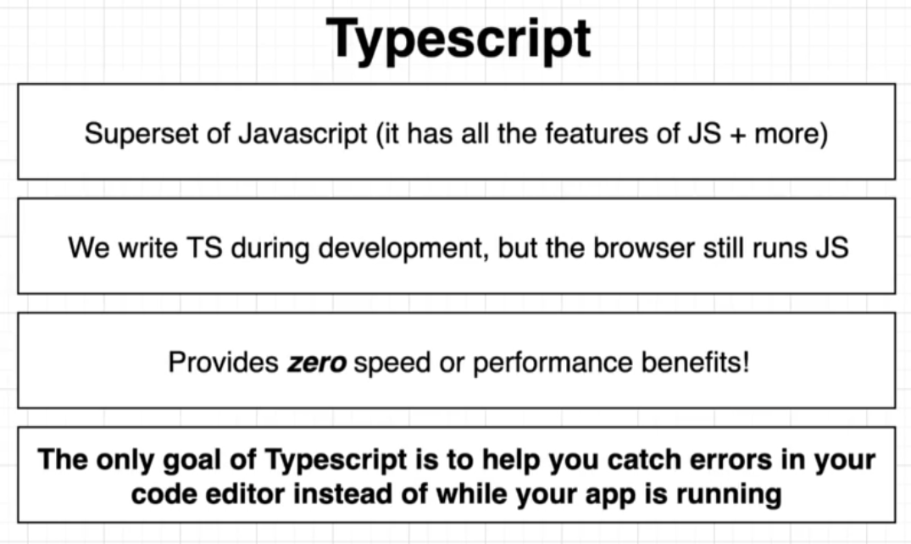
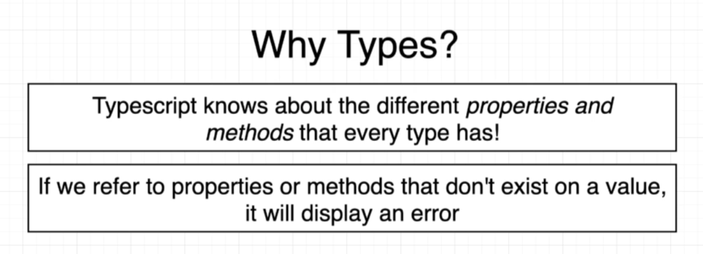

# INDEX

- [INDEX](#index)
  - [TypeScript](#typescript)
    - [why use Typescript](#why-use-typescript)
    - [Installation and Configuration](#installation-and-configuration)
  - [Typing](#typing)
    - [Statically vs dynamically typed](#statically-vs-dynamically-typed)
    - [Strongly vs weakly typed](#strongly-vs-weakly-typed)
    - [Implicit Typing and Explicit Typing](#implicit-typing-and-explicit-typing)
  - [Type annotations vs Type inference](#type-annotations-vs-type-inference)
    - [When to use type annotations ?](#when-to-use-type-annotations-)

---

## TypeScript

**TypeScript** is a **static and strongly typed** superset of JavaScript that have more features than JavaScript, and it's compiled to JavaScript.




- It only exists in **development** then it's compiled to javascript
  - Thus, it doesn't provide any performance optimization
  - it only helps us during the compilation process (adds extra sanity check / step)

### why use Typescript

- It helps us find errors before the code runs & analyzes our code as we type by using **type annotations**

- it makes sure that we're using the correct properties or methods on our objects and other types
  

  ```ts
  const sentence = 'This is a sentence';

  sentence.includes('is'); // ✅
  sentence.contains('is'); // ❌ -> Property/Method 'contains' does not exist on type 'string'.
  ```

- Types allow other engineers to understand what values are flowing around our codebase
- It has the potential to move some kinds of errors from **runtime** (users) to **compile time** , ex:
  - Values that are potentially absent (`null` or `undefined`)
- It serves as the foundation for a great code authoring experience
  - `Example`: in-editor autocomplete

---

### Installation and Configuration

[TS-Dev 📄](./6-TS-Dev.md)

---

## Typing


### Statically vs dynamically typed

- `Statically-typed` do type checking **before runtime** (at **compile-time**) (types don't change at runtime)

  - this detects errors in our code without running it.
  - Benefits:
    - self-documenting when reading the code on what values to expect
    - better error checking

  ```ts
  let message: string = 'hello';
  message = 123456; // ❌ Error: Type 'number' is not assignable to type 'string'.
  ```

- `dynamically-typed` do type-checking at **runtime** as there exist data types, but variables are not bound to any of them. (types change at runtime)

  ```js
  let message = 'hello';
  message = 123456; // ✅ No error
  ```

---

### Strongly vs weakly typed

- `Weakly-typed` languages make conversions between unrelated types implicitly
- `Strongly-typed` languages don't allow implicit conversions between unrelated types.

- JavaScript is `Weakly-Typed`.

  - it allows for `type coercion`
  - This means that types are assigned by the interpreter based on the data and makes an educated guess when the code's intention is ambiguous. This can lead to unintended results.

```js
let x = 21; // type assigned as int at runtime.
let y = x + 'dot';
// This code will run without any error. As Javascript is a weakly-typed language, it allows implicit conversion between unrelated types.
```

---

### Implicit Typing and Explicit Typing

- `Implicit Typing`

  - TypeScript will automatically assume types of objects if the object is not typed.

  ```js
  const myNum = 3; // TypeScript implicitly types myNum as a number based on the variable
  ```

- `Explicit Typing`

  - The developer does explicit typing. The developer explicitly applies a type to the object.

  ```js
  let myVar: number = 3; // myVar has been explicitly typed as a number
  ```

---

## Type annotations vs Type inference

**Type** is an easy way to refer to the different `properties` + `functions` that a `value` has (value is anything that can be assigned to a variable)

- We don't always need to write the type for each variable, as we can depend on **"Type Inference"**
  
  

- **Type annotations vs Type inference**
  

  - **Type annotations** -> code we add to tell Typescript what type of value a variable will refer to (what type of value it will hold)
    - used when the value-initialization and the variable-declaration are on the same line
  - **Type inference** -> Typescript tries to figure out what type of value a variable refers to
    - used when the value-initialization and the variable-declaration are on different lines

### When to use type annotations ?

- Function that returns the `any` type

  - when we don't know what the return type of a function is, we should use type-annotation. For example `JSON.parse()` function returns `any` type, so we should use type-annotation to tell TS what type we expect to get back from it
    

    ```ts
    const json = '{"x": 10, "y": 20}';
    const coordinates = JSON.parse(json); // type: any
    console.log(coordinates); // {x: 10, y: 20}

    // ----------------------------------------------

    const json = '{"x": 10, "y": 20}';
    const coordinates: { x: number; y: number } = JSON.parse(json); // type: {x: number, y: number}
    ```

- When you declare a variable separately from initializing it (declare variable in one line and initialize it later) **(delayed initialization)**

  ```ts
  let apples; // type: any ❌
  let apples = 5; // now, the type is inferred to be number ✅

  // ----------------------------------------------

  let foundLetter; // declaring it, will be type "any"
  ['a', 'b', 'c'].forEach(letter => {
    if (letter === 'a') {
      foundLetter = 'a'; // initializing it as a string
    }
  });

  // instead use this: ✅
  let foundLetter: string;
  // ...
  ```

- When we want a variable to have a type that can't be inferred

  - Usually with `union` / `or` types, because type inference doesn't will do its job but won't understand our intention

    ```ts
    const numbers = [-10, -1, 12];
    let numberAboveZero: boolean | number = false; // type: boolean | number

    numbers.forEach(number => {
      if (number > 0) {
        numberAboveZero = number; // type: number
      }
    });
    ```

---
