# INDEX

- [INDEX](#index)
  - [TypeScript](#typescript)
    - [why use Typescript](#why-use-typescript)
  - [Typing](#typing)
    - [Statically vs dynamically typed](#statically-vs-dynamically-typed)
    - [Strongly vs weakly typed](#strongly-vs-weakly-typed)
    - [Implicit Typing and Explicit Typing](#implicit-typing-and-explicit-typing)
  - [Type annotations vs Type inference](#type-annotations-vs-type-inference)
    - [When to use type annotations ?](#when-to-use-type-annotations-)
  - [Type Assertions / Type Casting](#type-assertions--type-casting)
  - [Generics](#generics)
    - [Generics Constraints](#generics-constraints)
    - [Advanced generic constraints](#advanced-generic-constraints)
  - [Type Guard (Narrowing)](#type-guard-narrowing)
    - [`typeof` type guard](#typeof-type-guard)
    - [Truthiness guard](#truthiness-guard)
    - [Equality Narrowing `===`](#equality-narrowing-)
    - [`in` operator narrowing](#in-operator-narrowing)
    - [`instanceof` Narrowing](#instanceof-narrowing)
    - [Type Predicates](#type-predicates)
    - [Discriminated Unions](#discriminated-unions)
    - [Exhaustiveness Checks with Never](#exhaustiveness-checks-with-never)
  - [Decorators](#decorators)
    - [How to use Decorators](#how-to-use-decorators)
    - [Decorator Factories](#decorator-factories)
    - [Decorator Composition](#decorator-composition)
    - [Class Decorator](#class-decorator)
  - [Namespace](#namespace)

---

## TypeScript

**TypeScript** is a **static and strongly typed** superset of JavaScript. When we're done with our TypeScript code, it compiles to JavaScript.

> It's just: Javascript with types

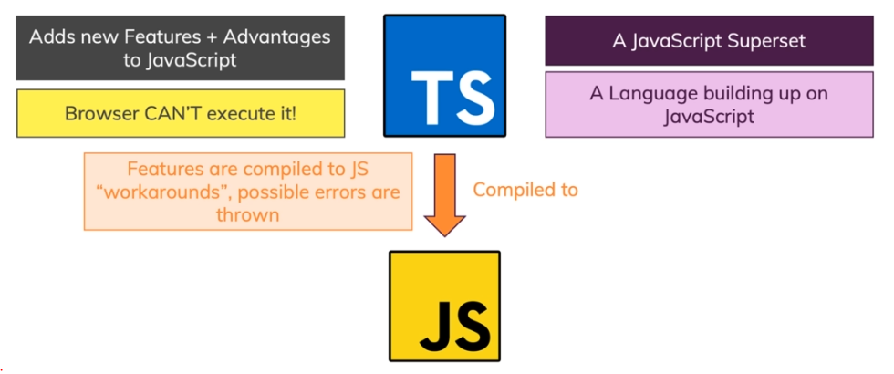

- It only exists in **development** then it's compiled to javascript
  - Thus, it doesn't provide any performance optimization

### why use Typescript

- It helps us find errors before the code runs & analyzes our code as we type by using **type annotations**
- Types allow other engineers to understand what values are flowing around our codebase
- It has the potential to move some kinds of errors from **runtime** (users) to **compile time** , ex:
  - Values that are potentially absent (`null` or `undefined`)
- It serves as the foundation for a great code authoring experience
  - `Example`: in-editor autocomplete

---

## Typing

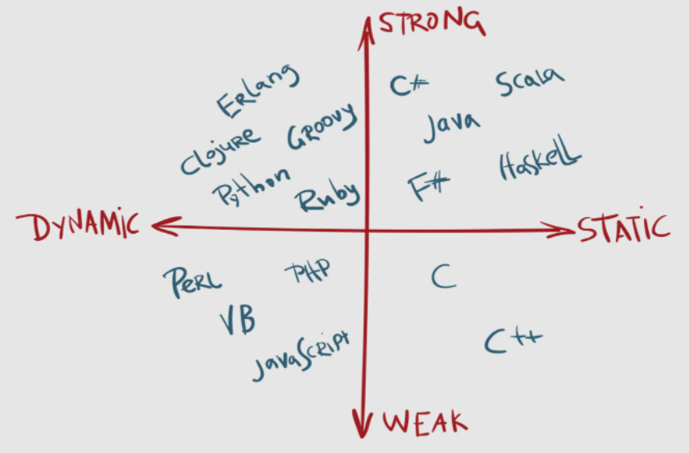

### Statically vs dynamically typed

- `Statically-typed` do type checking **before runtime** (at **compile-time**)
  - this detects errors in our code without running it.
- `dynamically-typed` do type-checking at **runtime** as there exist data types, but variables are not bound to any of them.

  ```js
  // no error
  let message = 'hello';
  message = 123456;
  ```

---

### Strongly vs weakly typed

- `Weakly-typed` languages make conversions between unrelated types implicitly
- `Strongly-typed` languages don't allow implicit conversions between unrelated types.

- JavaScript is `Weakly-Typed`.

  - it allows for `type coercion`
  - This means that types are assigned by the interpreter based on the data and makes an educated guess when the code's intention is ambiguous. This can lead to unintended results.

```js
let x = 21; // type assigned as int at runtime.
let y = x + 'dot';
// This code will run without any error. As Javascript is a weakly-typed language, it allows implicit conversion between unrelated types.
```

---

### Implicit Typing and Explicit Typing

- `Implicit Typing`

  - TypeScript will automatically assume types of objects if the object is not typed.

  ```js
  const myNum = 3; // TypeScript implicitly types myNum as a number based on the variable
  ```

- `Explicit Typing`

  - The developer does explicit typing. The developer explicitly applies a type to the object.

  ```js
  let myVar: number = 3; // myVar has been explicitly typed as a number
  ```

---

## Type annotations vs Type inference

**Type** is an easy way to refer to the different `properties` + `functions` that a `value` has (value is anything that can be assigned to a variable)

- We don't always need to write the type for each variable, as we can depend on **"Type Inference"**
  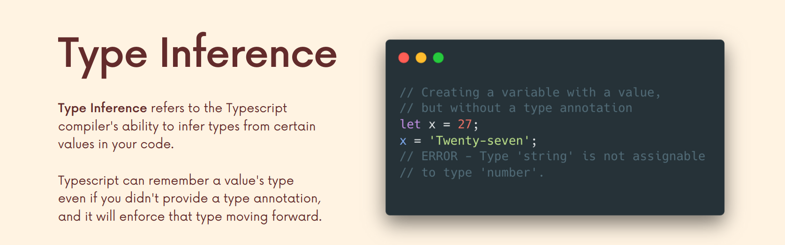
  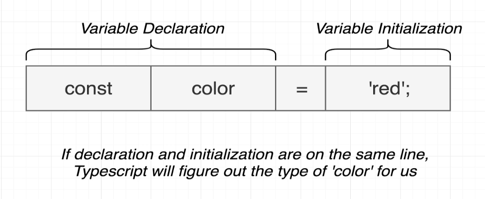

- **Type annotations vs Type inference**
  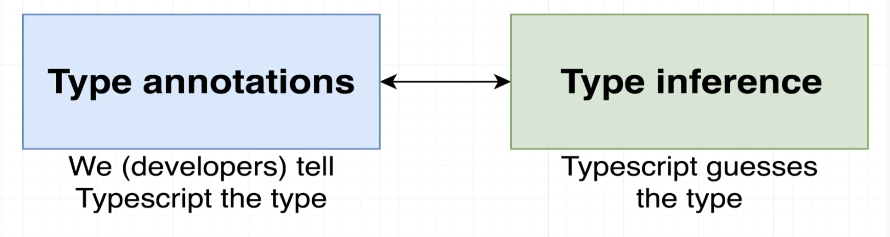

  - **Type annotations** -> code we add to tell Typescript what type of value a variable will refer to (what type of value it will hold)
  - **Type inference** -> Typescript tries to figure out what type of value a variable refers to

### When to use type annotations ?

- Function that returns the `any` type

  - when we don't know what the return type of a function is, we should use type-annotation. For example `JSON.parse()` function returns `any` type, so we should use type-annotation to tell TS what type we expect to get back from it
    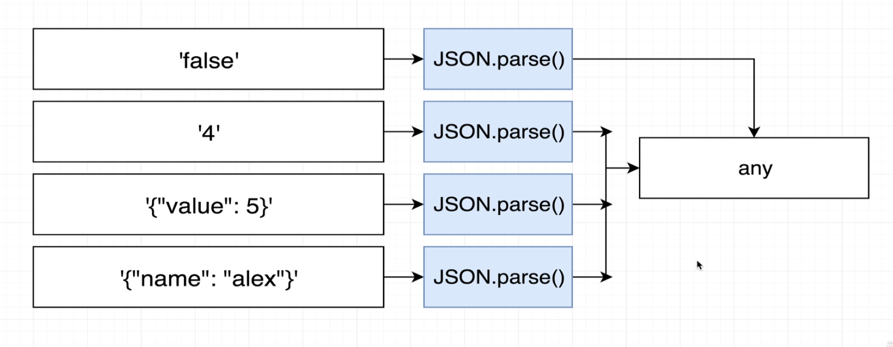

    ```ts
    const json = '{"x": 10, "y": 20}';
    const coordinates = JSON.parse(json); // type: any
    console.log(coordinates); // {x: 10, y: 20}

    // ----------------------------------------------

    const json = '{"x": 10, "y": 20}';
    const coordinates: { x: number; y: number } = JSON.parse(json); // type: {x: number, y: number}
    ```

- When you declare a variable separately from initializing it (declare variable in one line and initialize it later) **(delayed initialization)**

  ```ts
  let apples; // type: any ❌
  let apples = 5; // now, the type is inferred to be number ✅

  // ----------------------------------------------

  let foundLetter; // declaring it, will be type "any"
  ['a', 'b', 'c'].forEach(letter => {
    if (letter === 'a') {
      foundLetter = 'a'; // initializing it as a string
    }
  });

  // instead use this: ✅
  let foundLetter: string;
  // ...
  ```

- When we want a variable to have a type that can't be inferred

  - Usually with `union` / `or` types, because type inference doesn't will do its job but won't understand our intention

    ```ts
    const numbers = [-10, -1, 12];
    let numberAboveZero: boolean | number = false; // type: boolean | number

    numbers.forEach(number => {
      if (number > 0) {
        numberAboveZero = number; // type: number
      }
    });
    ```

---

## Type Assertions / Type Casting

> Sometimes you might have more specific information about a value's type, and you want to make sure that Typescript knows it too.

**Type Assertions** are used to tell TypeScript: (that even though TypeScript thinks it should be one type, it is actually a different type **that you want**). Common to see when a type is unknown

- It's a way to override typescript main behavior
- Usually used with `unknown` or `union` or `enum` types

> Generally, using type coercion (as Type), is a way of telling TypeScript "I know what I'm doing, so just trust me this has this type", so you generally should avoid it and let the type checker and type inference do its thing.

- Type assertions helps you to force types when you are not in control of them.
  Typecasting refers to `type conversions`

- **How to use Type Assertion?**

  - There are two ways to do type assertions
    - `as` --> `let length: number = (lengthField as string);`
    - `Bracket` syntax --> `let length: number = (<string>lengthField);`
      - **Note:** it doesn't work with JSX/TSX, to fix this we add a trailing comma: `const getEl = <T,>(list: T[]):T => {}`

- Example

  ```ts
  const myFunc = (student: unknown): string => {
    newStudent = student as string;
    return newStudent;
  };

  let mystery: unknown = 'Hello World';
  const numChars = (mystery as string).length;
  //or
  const numChars = (<string>mystery).length;
  ```

---

## Generics

A generic is a way to write a function that is reusable across different types, by using **type parameters**

> "generic" means **not specific** (we don't know this type but we will know it as soon as we invoke the function)

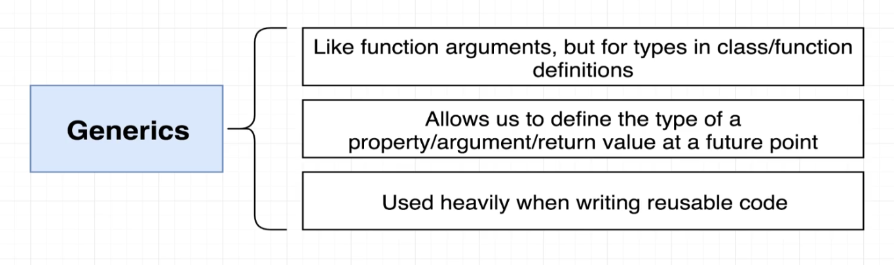

- They allow us to define reusable functions and classes that work with multiple types rather than a single type

  - Functions may return different values, depending on the arguments you pass them.

- why not just use `any` type?

  - `any` is an escape hatch. It turns off type checking for the variable so that you can do your thing without errors
    - It sort of defeats the purpose of Typescript and types
  - It's an anti-pattern(not recommended) in typescript
  - `any` allows for any type to go in, and any type to come out.
  - Using a `generic` means a number goes in and a number comes out or a string goes in and a string comes out.
  - `Generics` introduce the `Type Variable`
    - Rather than being a variable that accepts values, it's a variable that accepts types and is denoted with angle brackets myFunc`<T>`
    - it help us write more reusable and generic functions

- It's similar to how arguments work in functions for reusability

  ```ts
  // bad ❌
  const addOne = (a: number): number => {
    return a + 1;
  };
  const addTwo = (a: number): number => {
    return a + 2;
  };

  // good ✅
  const add = (a: number, b: number): number => {
    return a + b;
  };
  ```

  - Here, we can pass any type of number and it will work
  - We can do the same with generics, as **it customizes the type of the function to whatever we pass in**

- Example 1️⃣

  ```ts
  // Typed Function that deals only with numbers
  const getItem = (arr: number[]): number => {
    return arr[1];
  };
  // we can work around it and use union type like this:
  const getItem = (arr: (number | string)[]): number | string => {
    return arr[1];
  };

  // --------------------------------------------------------------

  // Using Generics
  const getItem = <T>(arr: T[]): T => {
    return arr[1];
  };
  // calling it
  getItem([1, 2, 3]); // ✅ -> because of type inference (TS knows that we are passing a number array)
  getItem<number>([1, 2, 3]); // ✅
  getItem<string>(['1', '2', '3']); // ✅
  ```

  - In the first function, we have a function that takes in a number array and outputs the second number of the array. But what if we don't want to work with numbers? What if we want to work with strings? Well, we would need to create a second function. Or, we can use a generic, and whatever type we use when we call the function will translate to its return as well.

- Example 2️⃣

  ```ts
  // function takes object that contains certain type(T) and another object that contains certain type(U)
  function merge<T extends object, U extends object>(objA: T, objB: U) {
    return Object.assign(objA, objB);
  }
  // "extends" here is a (Type Constraint)

  // here first obj contains type(string) and the second obj contains type(number)
  const mergedObj = merge({ name: 'Max', hobbies: ['Sports'] }, { age: 30 });
  console.log(mergedObj);
  ```

- Example 3️⃣

  ```ts
  // Generic Class
  class DataStorage<T> {
    data: T[] = [];

    // also we can use it with methods
    addItem(item: T) {
      this.data.push(item);
    }
  }

  const textStorage = new DataStorage<string>();
  ```

- **Generics Notes:**

  - When calling a generic function, we don't need to specify the generic-type when invoking it (because of type inference), but in some cases like with DOM elements we might need to
  - DOM query selector methods are generic function, and that's why we can use generic type with them

    ```ts
    const input = document.querySelector<HTMLInputElement>('todo-input')!;
    ```

  - generics can be used with multiple types:

    ```ts
    function merge<T, U>(obj1: T, obj2: U) {
      return { ...obj1, ...obj2 };
    }
    ```

  - A default type can be defined on a generic parameter as follows:

    ```ts
    <T = DefaultType>
    ```

---

### Generics Constraints

- Generic functions can operate on types with known properties, like `.length` for arrays. However, the compiler can't confirm that all types have these properties, leading to warnings.

  ```ts
  function logLength<T>(arg: T): T {
    console.log(arg.length);
    return arg;
  }

  logLength(235); // ❌ Property 'length' does not exist on type 'number'.
  ```

- We want to restrict the function to types that have a `.length` property. This requirement is a constraint on the type.

  - To do so, we’ll extend an interface that has the `length` property like `array`, then we'll use this `interface` and the extends keyword to denote our constraint:

    ```ts
    function logLength<T extends Array>(arg: T): T {
      console.log(arg.length); // Now we know it has a ".length" property, so no more error
      return arg;
    }

    logLength(235); // ❌ Property 'length' does not exist on type 'number'.
    logLength([1, 2, 3]); // ✅
    ```

---

### Advanced generic constraints

We can use `keyof` operator to constrain a generic to only accept keys of a certain type
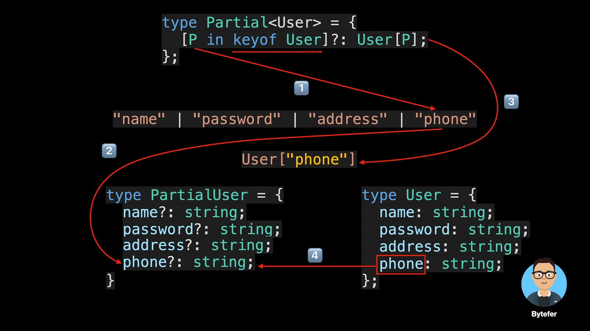

> It depends on [Literal type](./2-TS-Types.md#literal-type)

- For example:

  ```ts
  function getProperty<T, K extends keyof T>(obj: T, key: K): T[K] {
    return obj[key];
  }

  let user = {
    id: 1,
    name: 'test',
    age: 20
  };

  getProperty(user, 'id'); // ✅
  getProperty(user, 'name'); // ✅
  getProperty(user, 'age'); // ✅
  getProperty(user, 'm'); // ❌ Argument of type '"m"' is not assignable to parameter of type '"id" | "name" | "age"'.
  ```

- This is done instead of explicitly defining the type of the key

  ```ts
  // BAD ❌
  function getProperty(obj: any, key: string): string | number {
    return obj[key];
  }
  ```

---

## Type Guard (Narrowing)

- **Type Guard** : protects us from doing something unless we check the type first

- **Type Narrowing:** is doing a type check before working with a value, It's done using:

  - [`typeof` type guard](#typeof-type-guard)
  - [truthiness guard](#truthiness-guard)
  - [Equality type guard `===`](#equality-narrowing-)
  - [`in` operator narrowing](#in-operator-narrowing)
  - [`instanceof` Narrowing](#instanceof-narrowing)

- Better approach is to create interfaces for each type and use them in the type-guard by checking one of the methods above

  ```ts
  interface NumbersCollection {
    data: number[];
    add: (number: number) => void;
  }
  interface StringCollection {
    data: string[];
    add: (string: string) => void;
  }

  function printCollection(collection: NumbersCollection | StringCollection) {
    if (collection instanceof NumbersCollection) {
      collection.add(1);
    } else {
      collection.add('1');
    }
  }

  // instead of this: ❌
  function printCollection(collection: number[] | string[]) {
    if (typeof collection === 'number') {
      collection.push(1);
    } else {
      collection.push('1');
    }
  }
  ```

---

### `typeof` type guard

- it control the flow of code using the type of something
- this process is called **Narrowing**, as it narrows our choice with the type-guard condition
- usually used with [unknown type](./2-TS-Types.md#unknown----type-guard) or [Union Types](./2-TS-Types.md#union-types)
  - since they allow for multiple types for a value, It's good to check what came through before working with it.
- **Note:** difference between `typeof` and `instanceof` is that `typeof` is used with primitive types and `instanceof` is used with (objects or classes)
  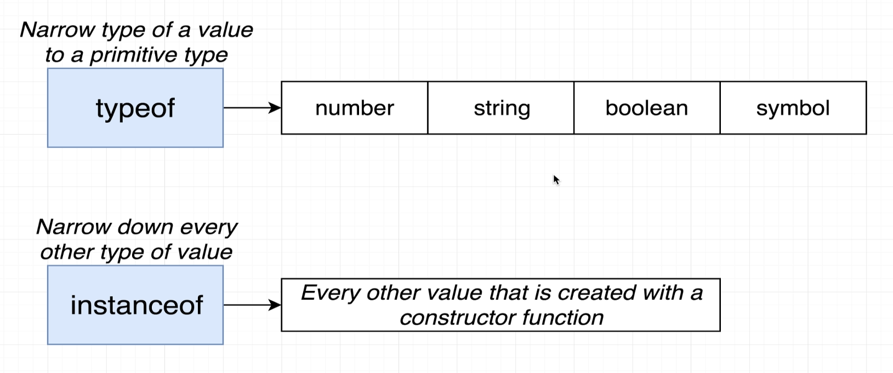

```ts
function calculateTax(price: number | string, tax: number) {
  if (typeof price === 'string') {
    price = parseFloat(price.replace('$', ''));
  }
  return price * tax;
}
```

---

### Truthiness guard

It's checking a value for being truthy or falsy before working with it

- this is helpful in avoiding errors when values might be `null` or `undefined`

```ts
function printLetters(word: string | null) {
  if (!word) {
    console.log('No word was provided');
  } else {
    word.forEach(letter => console.log(letter));
  }
}
```

---

### Equality Narrowing `===`

It involves comparing types to each other before doing certain operations with values

```ts
function someFunc(x: string | boolean, y: string | number) {
  if (x === y) {
    // x and y are strings in this case
    x.toUpperCase();
    y.toUpperCase();
  } else {
    console.log(x);
    console.log(y);
  }
}
```

---

### `in` operator narrowing

Javascript's `in` operator helps check if a certain property exists in an object. This means it can be used to check if a value exists in an object (according to its type-alias) before working with it

```ts
type Cat = { meow: () => void };
type Dog = { bark: () => void };

const talk = (creature: Cat | Dog) => {
  if ('meow' in creature) {
    console.log(creature.meow());
  } else {
    console.log(creature.bark());
  }
};
```

---

### `instanceof` Narrowing

It's a javascript operator that allows us to check if one thing is an instance of another. This can help us narrow types when working with things like **classes**

```ts
const printFullDate = (date: date | string) => {
  if (date instanceof Date) {
    return date.toUTCString();
  } else {
    return new Date(date).toUTCString();
  }
};
```

---

### Type Predicates

Typescript allows us to write custom functions that can narrow the type of a value. These functions have a very special **return type** called a **type predicate**

- A predicate takes the name -> **`parameterName + is + Type`**

```ts
// if the return value is true, then it must be "Cat"
function isCat(pet: Cat | Dog): pet is Dog {
  return (pet as Cat).meow !== undefined;
}

if (isCat(pet)) {
  pet.meow();
} else {
  pet.bark();
}
```

---

### Discriminated Unions

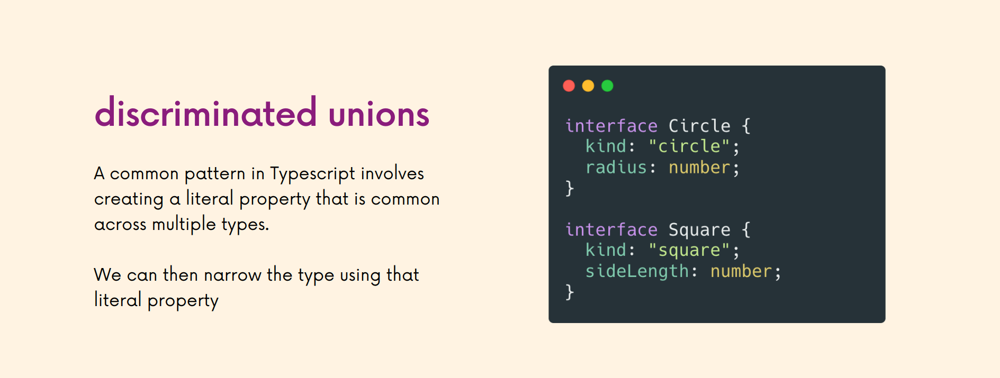

The concept here is that we add a **"discriminant"** which is just a property that all our types will have in common, and it will be of type: `literal-type` and by convention, It's called `kind`

---

### Exhaustiveness Checks with Never

It's the default thing to do when all the type-narrowing checks are all passed and this is the last check, and it's like: "we should never make it here, if we handled all cases correctly"

---

## Decorators

Decorators are functions that can be used to modify the behavior of classes, methods, and properties at runtime.

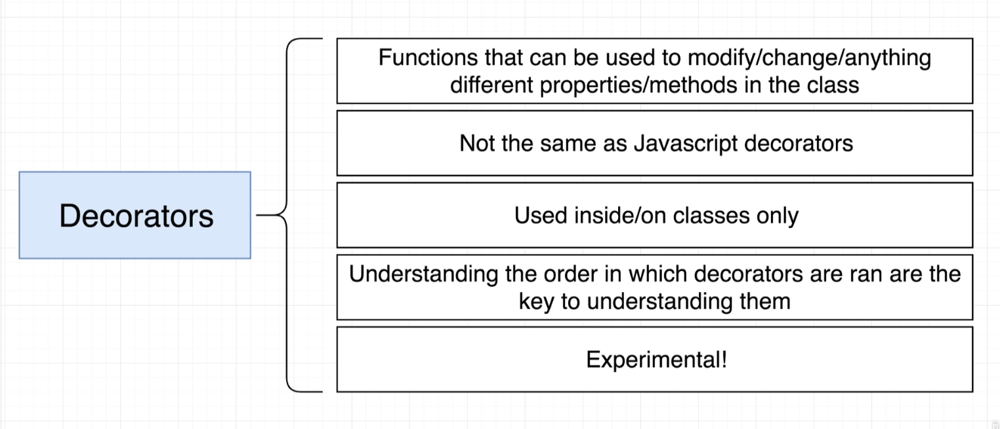

- When you apply a decorator to a class or a class member, you are actually calling a function that is going to receive details of what is being decorated, and the decorator implementation will then be able to transform the code dynamically, adding extra functionality, and reducing boilerplate code.
- They are a way to have **"Meta Programming"** in TypeScript, which is a programming technique that enables the programmer to create code that uses other code from the application itself as data.
- It's based on the concept of **Prototype** in JavaScript
  - A prototype is a blueprint of an object. It encapsulates the properties and methods that are common to all instances of the object.
  - When you create an object from a prototype, the object inherits all the properties and methods from the prototype.
  - In JavaScript, every object has a prototype, and the prototype is also an object.

---

### How to use Decorators

- Decorators are experimental, and they are not part of the ECMAScript standard yet, **To enable experimental support for decorators**, you must enable the `experimentalDecorators` compiler option either on the command line or in your tsconfig.json

  ```bash
  # command line
  tsc --target ES5 --experimentalDecorators
  ```

  ```json
  // tsconfig.json:
  {
    "compilerOptions": {
      "target": "ES5",
      "experimentalDecorators": true
    }
  }
  ```

- How to use it on a property, method, accessor
  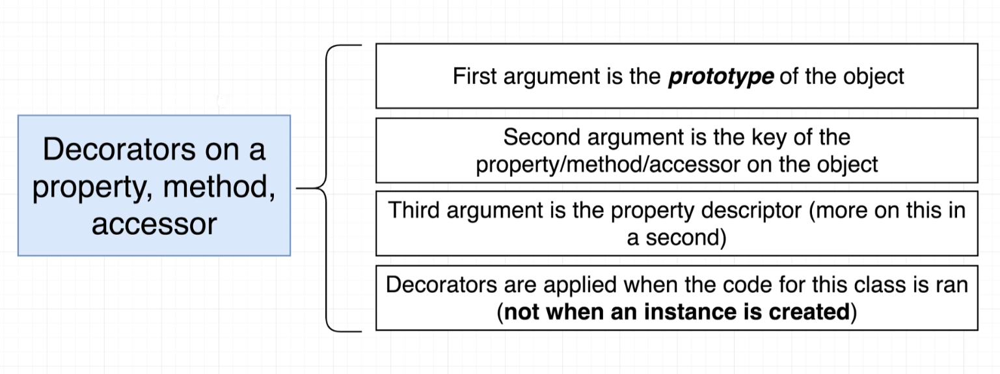

- Example:

  ```ts
  class Boat {
    color: string = 'red';

    get formattedColor(): string {
      return `This boat color is ${this.color}`;
    }

    @testDecorator
    pilot(): void {
      console.log('swish');
    }
  }

  function testDecorator(target: any, key: string): void {
    console.log('Target:', target);
    console.log('Key:', key);
  }
  ```

- The decorator function is called **only one time** when the class is defined, not when it's instantiated
- The decorator function receives multiple arguments:
  - 1st argument -> `target`: the prototype of the object
  - 2nd argument -> `key`: the name of the property/method/accessor that we are decorating
  - 3rd argument -> `descriptor`: an object that contains the property descriptor of the member
- From this we can see that we now will have access to the `prototype` of the object, and the `descriptor` of the member that we are decorating, which enables us to modify the object's behavior at runtime.

- **Property descriptor** is an object that contains the property descriptor of the member
  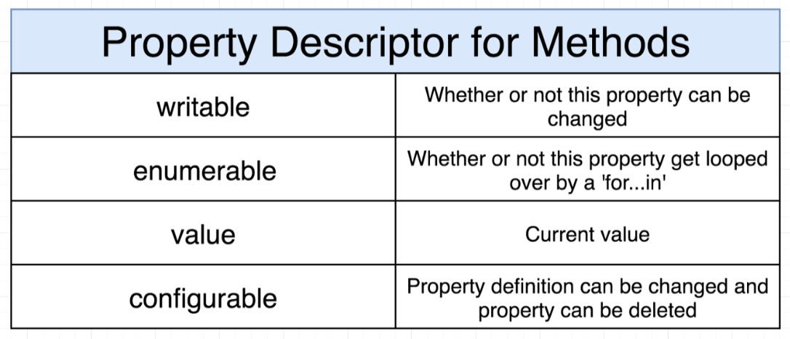

  - It's the key way that we can modify the behavior of the object inside the decorator function

    ```ts
    function testDecorator(target: any, key: string, desc: PropertyDescriptor): void {
      const method = desc.value;
      desc.value = function () {
        console.log('BEFORE METHOD');
        method();
        console.log('AFTER METHOD');
      };
    }
    // Here, we are overriding the method with a new function that will log "BEFORE METHOD" before calling the original method, and then log "AFTER METHOD" after calling the original method.
    ```

  - So, It's like intercepting the method call and adding extra functionality to it.

- **Notes:**

  - In order to access any primitive type, we need to use `target.constructor` instead of `target`, this is because the prototype only contains the methods definitions and not the class properties. Instead, the **constructor** contains the class properties.

    ```ts
    function testDecorator(target: any, key: string): void {
      console.log(target.color); // undefined ❌
      console.log(target.constructor.color); // red ✅
    }
    ```

---

### Decorator Factories

Decorator factories are functions that return decorator functions and they are used to configure decorators.

- It's used when we want to pass arguments to the decorator function, and we can't do that directly because the decorator function is called only one time when the class is defined, not when it's instantiated.

- Example:

  ```ts
  function testDecoratorFactory(color: string) {
    return function (target: any, key: string, desc: PropertyDescriptor): void {
      const method = desc.value;
      desc.value = function () {
        console.log(`BEFORE METHOD: ${color}`);
        method();
        console.log('AFTER METHOD');
      };
    };
  }

  class Boat {
    color: string = 'red';

    get formattedColor(): string {
      return `This boat color is ${this.color}`;
    }

    @testDecoratorFactory('blue')
    pilot(): void {
      console.log('swish');
    }
  }
  ```

  - Here, we are passing the color as an argument to the decorator factory function, and then we are returning the decorator function that will be called when the class is defined.
  - So, the decorator factory function is called when the class is defined, and the decorator function is called when the method is called.

---

### Decorator Composition

Decorator Composition is an important concept as it allows us to use multiple decorators on a single class member or declarations. The evaluation of these compositions is similar to the function composition that we will see in our mathematics class `(i.e (f ∘ g)(x) is equivalent to f(g(x)))`.

- the expression for each decorator will be evaluated from `top to bottom`
- the results are called from `bottom to top`

```ts
function outer() {
  console.log('Outer: expression');
  return function (target: any, propertyKey: string, descriptor: PropertyDescriptor) {
    console.log('Outer: result');
  };
}

function inner() {
  console.log('Inner: expression');
  return function (target: any, propertyKey: string, descriptor: PropertyDescriptor) {
    console.log('Inner: result');
  };
}

class DecoratorComposition {
  @outer()
  @inner()
  run() {}
}
const decoratorComposition = new DecoratorComposition();
decoratorComposition.run();
// resu;ts:
// Outer: expression
// Inner: expression
// Inner: result
// Outer: result
```

---

### Class Decorator

Class Decorator is very similar to inheriting from another class.

- Decorators are functions that accepts functions as a parameter as it's applied to functions or classes

```ts
const classDecorator = (target: Function) => {
  // do something with your class
};

@classDecorator
class Rocket {}
```

```ts
// ---------Using Decorator--------- //
function BankCard(constructor: Function) {
  constructor.prototype.cardId = Math.floor(Math.random() * 1000);
}

@BankCard
class HSBCBankCard {
  name: string;
  constructor(name: string) {
    this.name = name;
  }
}

// ---------Using class extends--------- //
class BankCard {
  cardId: number;
  constructor() {
    this.cardId = Math.floor(Math.random() * 1000);
  }
}

class HSBCBankCard extends BankCard {
  name: string;
  constructor(name: string) {
    super();
    this.name = name;
  }
}
```

---

## Namespace

Typescript has its own module-format called "namespaces" which is pre-dates the ES-Modules standard

- It's somehow deprecated, as the majority of the features in namespaces exists in ES-Modules now

---
