# INDEX

- [INDEX](#index)
  - [any](#any)
  - [Array](#array)
  - [Tuple](#tuple)
  - [Enum](#enum)
  - [Objects](#objects)
    - [Object destructuring](#object-destructuring)
    - [Object Excess Properties Checking](#object-excess-properties-checking)
  - [unknown -- (type guard)](#unknown----type-guard)
  - [`this` keyword types](#this-keyword-types)
  - [Type Aliases (`type`)](#type-aliases-type)
    - [`readonly` Modifier](#readonly-modifier)
    - [Literal type](#literal-type)
  - [Interfaces](#interfaces)
    - [When to use Interfaces](#when-to-use-interfaces)
    - [interface vs type](#interface-vs-type)
  - [Union \& Intersection Types](#union--intersection-types)
    - [Union types](#union-types)
    - [Intersection types](#intersection-types)
  - [Literal Types](#literal-types)
    - [String Literal Types](#string-literal-types)
  - [Partial Type](#partial-type)
  - [Function](#function)
    - [function type](#function-type)
    - [function interface](#function-interface)
    - [`void`](#void)
    - [`never`](#never)
  - [Classes](#classes)
    - [Class Access Modifiers](#class-access-modifiers)
    - [Class Fields](#class-fields)
    - [Using Interfaces with classes](#using-interfaces-with-classes)
    - [Abstract Classes](#abstract-classes)
      - [Interfaces vs Abstract Classes](#interfaces-vs-abstract-classes)
    - [Class Composition in Typescript](#class-composition-in-typescript)
  - [Promises](#promises)

---

## any

- It's the most flexible type in Typescript, It allows you to assign any type to that variable
- It means that TS has no idea what this is, and can't check anything about it
- It's used when you don't know what the type of the variable will be
- Avoid using it as much as possible, as it defeats the purpose of using Typescript

---

## Array

```ts
let arr: string[]; // array of strings
// or :
let arr: Array<string>;

let arr2: (string | number)[]; // array of strings or numbers
```

- For multi-dimension array like a Matrix, use `number[][]`

- **Note:** These array types only allow data of that one type inside them, to use multiple options for types inside array -> Don't use `any` type, Instead use Union types

  ```ts
  const arr: (number | string)[] = [1, 2, 3, '22'];

  // ⚠️ this is different from (array of all strings or all numbers):
  const arr: number[] | string[] = [1, 2, 3];
  const arr: number[] | string[] = ['1', '2', '3'];
  ```

---

## Tuple

It's an array-like structure where each element represent some property of a record.

- It's an array of fixed lengths and ordered with specific types (every element in the array represents some property of a record) and the order of the types in the array is important as it's used to describe the structure of the array.

> It's a special type exclusive to Typescript (doesn't exist in Javascript)

- When you know exactly what data will be in the array with a **fixed length** and their **type-order**, and you will not be adding to the array or modifying the type for any value

  ```ts
  let myTuple: [string, number, string];

  myTuple = ['cat', 7, 'dog']; // ✅
  myTuple = ['cat', 'dog', 'dog']; // ❌

  // it's actually like representing an object as an array
  obj = {
    name: 'cat',
    age: 7,
    type: 'dog'
  };
  tuple = ['cat', 7, 'dog'];
  ```

- It's different from `array` with different types, as it's used to represent a record with specific types and **order**, while `array` with different types is used to represent a list of values with different types

  ```ts
  let myTuple: [string, number, string];

  myTuple = ['cat', 7, 'dog']; // ✅
  myTuple = ['cat', 'dog', 'dog']; // ❌

  let myArray = ['cat', 7, 'dog']; // will be inferred as (string | number)[]
  ```

- Note that you can write a tuple with same types, but it's not recommended as it's not clear what each element represents

  ```ts
  let myTuple: [string, string, string];

  myTuple = ['cat', 'dog', 'dog']; // ✅
  myTuple = ['cat', 7, 'dog']; // ❌

  // It's not same as string[] ⚠️
  ```

- **Gautcha (limitation of Tuples):** The way tuples are designed by Typescript, They don't actually prevent you from pushing or popping elements from the tuple **after creation** and doesn't raise errors as it assumes that the method won't change the array-structure

---

## Enum

It allows us to define a **set of named constants**. We can give these constants numeric or string values

> It stand for "Enumeration" which is a set of named constants

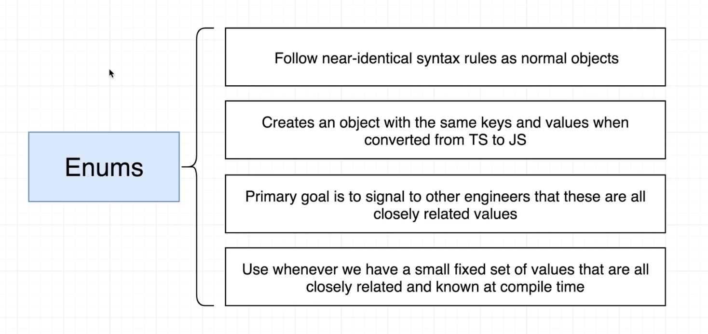

- It's used an enum when you have a constant set of values that will not be changed.

  - It's to **prevent misspelling** of values or make code more readable
    - like action-constants in `Vuex`, `redux`
  - it's like `Object.freeze` and [literal types](#literal-types) for objects

- `enum` is **only** used to provide other engineers with a more understandable way to refer to a set of related values, and there're no other benefits to using it

- Example

  ```ts
  enum Colors {
    // here we add the list of values we want to include (by convention, written in uppercase)
    RED = 'red',
    WHITE = 'white',
    BLUE = 'blue'
  }

  console.log(Colors.RED); // red

  // ----------------------------------------------------------------

  // example for using Enum for readability
  enum MatchResult {
    HOME_WIN = 'H',
    AWAY_WIN = 'A',
    DRAW = 'D'
  }

  team1 = {
    name: 'Real Madrid',
    score: 2,
    result: 'H'
  };

  console.log(team1.result === MatchResult.HOME_WIN); // Readable and clear ✅
  // instead of:
  console.log(team1.result === 'H'); // Not clear and can be misspelled ❌
  ```

- If not given a values to the constants, Behind the scenes, It assigns labels to numbers (starts at `0`)

  ```ts
  enum OrderStatus {
    PENDING, // 0
    SHIPPED, // 1
    DELIVERED, // 2
    RETURNED // 3
  }

  console.log(OrderStatus.DELIVERED); // 2
  ```

- **Should you use enums?**
  - Some say that enums don't have any benefits and that it can be replaced with object of values, and they have a valid point, and some say that it's useful for autocomplete
  - When to use it:
    - When you have a small set of values that are all closely related and known at compile time, and when you want to make your code more readable and prevent misspelling
    - When you are sure that the values will not change in the future
    - ex: days of the week, months of the year, primary colors, etc
  - When not to use it:
    - When you have a large set of values that are not closely related and not known at compile time
    - When you want to use it for autocomplete, as it's not recommended to use it for that
    - ex: set of movie categories on Netflix
      - because movie categories change all the time, and it's not known at compile time

---

## Objects

Objects can be typed by declaring what the object should look like in the annotation

```ts
// not good and hard to read
let student: { name: string; age: number; enrolled: boolean } = {
  name: 'Maria',
  age: 10,
  enrolled: true
  // instead we use interfaces
};
```

- note that --> in object type we use semicolon (`;`) but in value section we use comma (`,`)
- you can also use [type-aliases--(type)](#type-aliases-type)

### Object destructuring

When using object destructuring, write the annotated type after the destructuring, and not combined with the object

```ts
const { name, age }: { name: string; age: number } = student;
```

### Object Excess Properties Checking

**Excess property checking** is when Typescript checks your object to ensure that it doesn’t contain any extra properties on top of what is defined in the type annotation for the object.

Typescript doesn’t always check for excess properties in an object. Understanding when Typescript will check for excess properties is crucial as it helps you know what to expect from Typescript under different conditions.

- If we created a new variable and typed it as `Person`, any excess properties in the object will be checked, and Typescript will throw an error.

  ```ts
  type Person {
    firstName: string;
    lastName: string;
  }

  const x: Person = {
    firstName: "John",
    lastName: "Doe",
    age: 13, // ERROR -> 'age' is doesn't exist in type 'Person'
  }
  ```

- But, there are some situations where Typescript will remain silent when excess properties are available in an object:

  1. The first situation is when you introduce an object with the excess fields and assign it to a variable typed as `Person`.

     ```ts
     const x = {
       firstName: 'John',
       lastName: 'Doe',
       age: 13
     };

     const y: Person = x; // No Error
     ```

     - In this case, Typescript won’t check for excess properties as type Person is a subset of the type inferred for variable x, which is inferred to include all properties in Person plus age. This is known as **"duck-typing or structural typing"**, which I will look at later.
       - > "If it walks like a duck and it quacks like a duck, then it must be a duck"

  2. The second situation, when you use an assertion, this doesn’t trigger excess property checking in Typescript.

     ```ts
     const x = {
       firstName: 'John',
       lastName: 'Doe',
       age: 13
     } as Person; // No ERROR
     ```

     - Generally, using **type coercion** (as Type), is a way of telling TypeScript "I know what I'm doing, so just trust me this has this type", so you generally should avoid it and let the type checker and type inference do its thing.

> To recap, excess property checking is only triggered when we define object literals with a type annotation and not in other cases. So, why do we have it? It can be very useful for catching wrong typos and wrong property names. This means it’s very limited in scope and understanding when Typescript will check for excess properties and when it will not is essential for building a better mental model for understanding and using Typescript.

---

## unknown -- (type guard)

- Requires a `type check` (**type guard**)
  - > **type guard**: technique for guarding against certain operations unless we validate that we have the correct type for it.
- used when the type of the thing being typed is `unknown`. Used heavily for `type assertion`
- `unknown` is recommended over `any` because it provides **safer typing** — you have to use type assertion or narrowing to a specific type if you want to perform operations on unknown.
  - `any` -> can be used for `console.log()` content

```ts
let userInput: unknown;
let userName: string;

userInput = 5;
userInput = 'Max';

// type assertion or (Type Guard)
if (typeof userInput === 'string') {
  userName = userInput; // 'Max'
}
```

---

## `this` keyword types

- Sometimes we have a free-standing function that has a strong opinion around what `this` will end up being, at the time it is invoked.
- For example, if we had a DOM event listener for a button:

  ```html
  <button onClick="myClickHandler">Click Me!</button>
  ```

- We could define myClickHandler as follows:

  ```ts
  function myClickHandler(event: Event) {
    this.disabled = true;
    // 'this' implicitly has type 'any' because it does not have a type annotation.
  }

  myClickHandler(new Event('click')); // seems ok
  ```

- TypeScript isn’t happy with us. Despite the fact that we know that this will be element that fired the event, the compiler doesn’t seem to be happy with us using it in this way.

  - To address the problem, we need to give this function a `this` **type**

  ```ts
  function myClickHandler(this: HTMLButtonElement, event: Event) {
    this.disabled = true;

    // (property) HTMLButtonElement.disabled: boolean
  }

  myClickHandler(new Event('click')); // seems no longer ok
  ```

---

## Type Aliases (`type`)

Type aliases can be used to "create" your own types. Instead of writing out object-types in an annotation, we can declare them separately in a **type alias** to a (possibly complex) object type.

- It allows us to make our code more readable and to reuse the types elsewhere in our code
- Type aliases do not create a new type; they rename a type. Therefore, you can use it to type an object and give it a descriptive name.
- It's usually used for complex types like `union` & `tuple` types, or as a preference for cleaner code
- it's same as `interface`, but with some [differences](#interface-vs-type)

- once a type alias is created, it can't be added to.

```ts
type User = { name: string; age: number };
const u1: User = { name: 'Max', age: 30 }; // this works!

// another ex

function greet(user: { name: string; age: number }) {
  console.log('Hi, I am ' + user.name);
}
// to this :
type User = { name: string; age: number };

function greet(user: User) {
  console.log('Hi, I am ' + user.name);
}
```

### `readonly` Modifier

TypeScript provides the `readonly` modifier that allows you to mark the properties of a (class or object) **immutable**.

- The assignment to a readonly property can only occur in one of two places:

  - In the property declaration.
  - In the constructor of the same class.

- Class example

  ```ts
  class Person {
    readonly birthDate: Date;

    constructor(birthDate: Date) {
      this.birthDate = birthDate;
    }
  }

  const person = new Person(new Date(1990, 12, 25));
  person.birthDate = new Date(1991, 12, 25); // Compile error
  ```

- Object example

  ```ts
  type Person = {
    name: string
    readonly birthDate: Date;
  };

  const John: Person = {
    name: 'John',
    birthDate; new Date(1990, 12, 25)
  };
  person.birthDate = new Date(1991, 12, 25); // Compile error
  ```

> the equivalent in variables is to use `const`

### Literal type

- It's a type that represents a single value, rather than a range of values, which is the case with `number` or `string` types
- It's used to narrow down the possible values that a variable can hold

```ts
type userAttribute = 'id' | 'name' | 'age';

let user = {
  id: 1,
  name: 'John',
  age: 30
};

function getUserAttribute(attribute: userAttribute) {
  return user[attribute];
}
// instead of
function getUserAttribute(attribute: number | string) {
  return user[attribute];
}
```

---

## Interfaces

They serve almost the same purpose as [Type Aliases](#type-aliases-type) (with a slightly different syntax)

- it's a **blueprint** for `object's items`

  - you create an abstract class as an `interface` for creating classes. With TypeScript, interfaces are simply used as the blueprint for the shape of something.

- Use `PascalCase` for naming `interfaces`.

- EX:

  ```ts
  interface Student {
    name: string;
    age: number;
    gender?: string; // (?) means that it's optional
    enrolled: boolean;
  }
  let newStudent: Student = { name: 'Maria', age: 10, enrolled: true };
  ```

- The interface doesn't have to have all the types of the object, but it should have at least the required ones **(any additional properties are ignored)**

  ```ts
  interface Student {
    name: string;
    age: number;
  }

  let newStudent: Student = { name: 'Maria', age: 10 }; // ✅
  let newStudent: Student = { name: 'Maria', age: 10, enrolled: true }; // ✅ because enrolled is optional
  let newStudent: Student = { name: 'Maria', enrolled: true }; // ❌ because age is required
  ```

> we can use class instead with all its properties are '?' as classes are implemented in javascript unlike interfaces which is in Typescript and needs to be transpiled to Javascript

---

### When to use Interfaces

- Interfaces can be used to create reusable types that describe the shapes of objects/functions that have common properties that are interfaced with `interfaces`, **So, it makes us write generic code that can be re-used with different objects**.

  - Usually used with `functions` which accept arguments that are typed with `interfaces`
    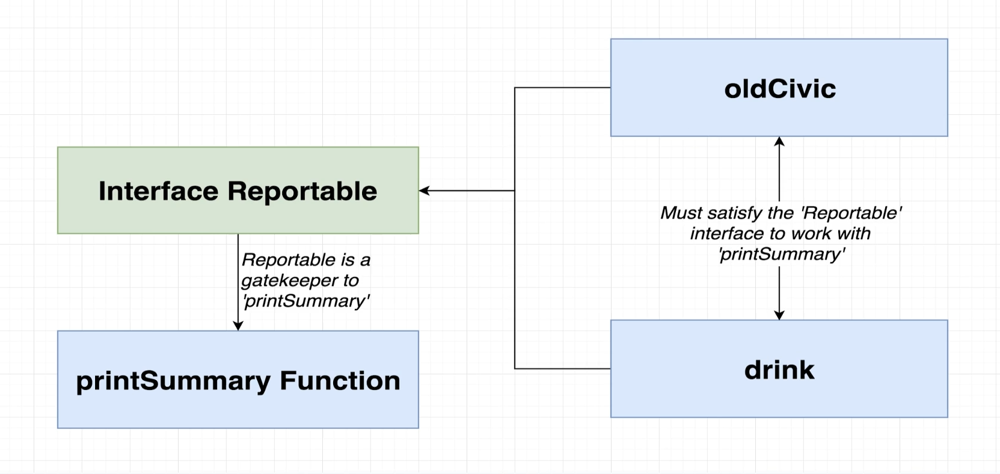
    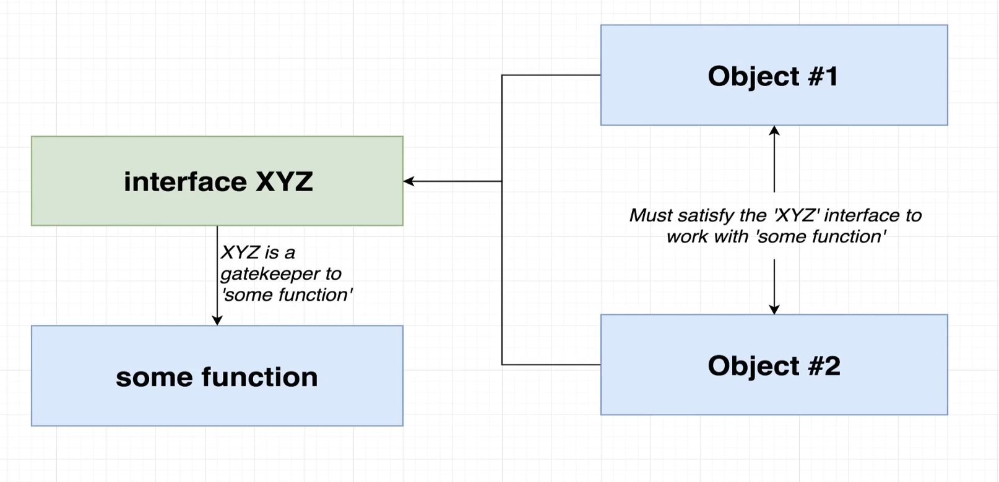

- Restricting access (following [Dependency Inversion Principle](../Software%20Engineering/2-Design-patterns.md#d---dependency-inversion-principle-dip) design pattern)

  - It's used to restrict access to certain properties of an object and to prevent tight coupling between objects by replacing them with `interface` that has the required properties

  ```ts
  // ❌ tight coupling (would be hard to re-use the function with other objects)
  interface Person {
    name: string;
    age: number;
  }
  function greet(person: Person) {
    console.log('Hi, I am ' + person.name);
  }

  greet({ name: 'Max', age: 30 });
  greet({ name: 'Anna', gender: 'female' }); // ❌ because it doesn't fulfill the interface

  // --------------------------------------------------

  // ✅ loose coupling (can be re-used with other objects that fulfill the interface)
  interface Named {
    readonly name: string;
  }

  interface Aged {
    readonly age: number;
  }

  function greet(person: Named) {
    console.log('Hi, I am ' + person.name);
  }

  greet({ name: 'Max', age: 30 });
  greet({ name: 'Anna', gender: 'female' }); // will also work because it fulfills the interface
  ```

---

### interface vs type

types & interfaces used to be more different when typescript first came out, but over time their overlap is significantly greater now and they became very similar

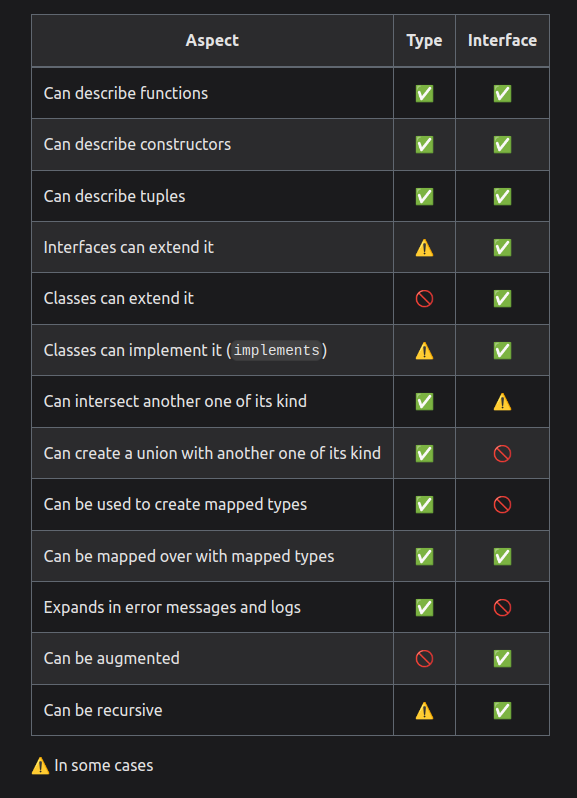

- types & interfaces share some behaviors like:

  - **Extending**
    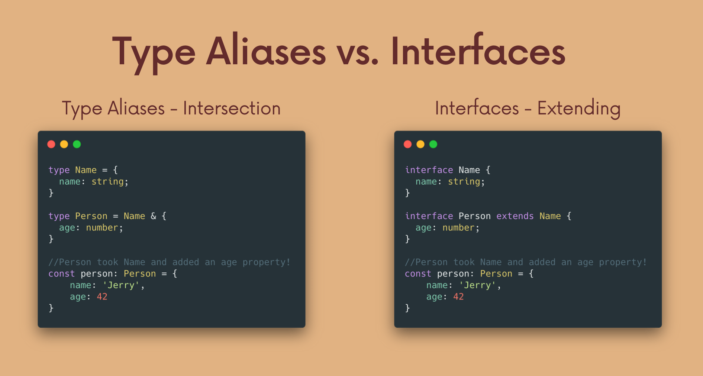
    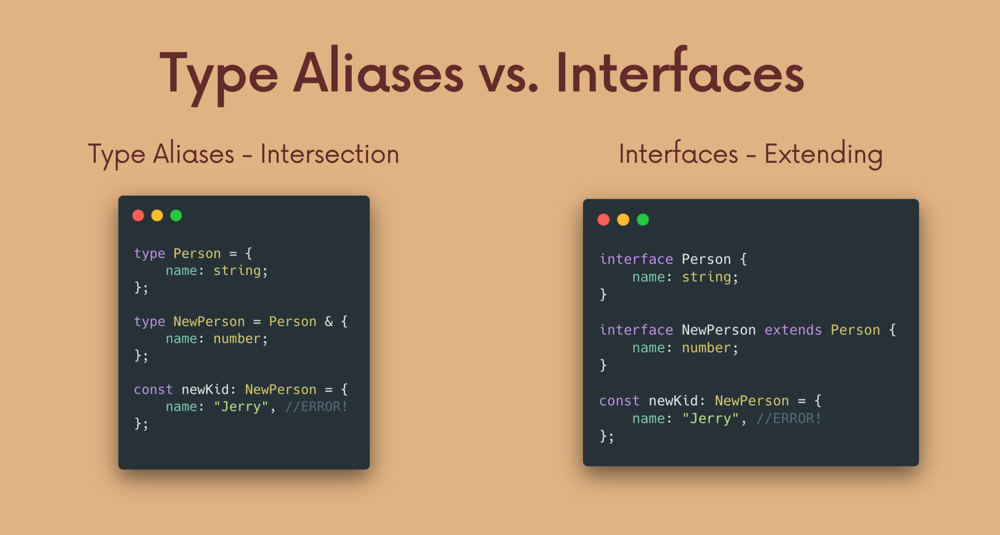
    - interfaces are **extendable** from other interfaces like classes
      - you can extend interfaces/classes using the word -> `implements`
    - `type-aliases` can be sort of extendable using [Intersection](#intersection-types)

- They differ in some behaviors:

  - Interfaces can only describe the shape of an object and can't be used as a literal-type, where `type-aliases` can describe any type (`object-type`, `function-type`, `union-type`, ...)

    ```ts
    type Pet = Dog | Cat // ✅
    interface Pet {Dog | Cat} // ❌
    ```

  - **Re-opening Adding new properties**
    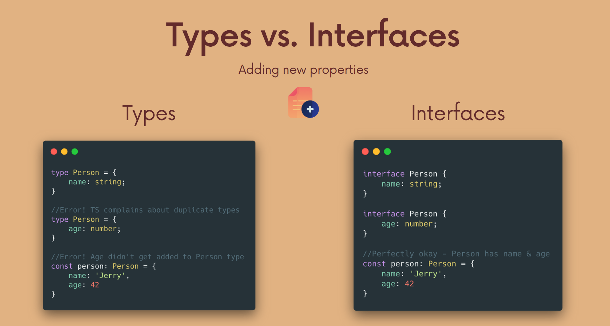
    - with `interface`, we can **re-open** and add new properties to the `interface` after we've already described it, which gives an error with `type`

- You can add how a **method** in an object will be using `interface` and not using `type`

---

## Union & Intersection Types

### Union types

A union type has a very specific technical definition that comes from set theory, but it’s completely fine to think of it as **OR** for types.

- used when more than one type can be used
- we can create a union-type by using the **pipe character `|`** to separate the types we want to include
- you shouldn't use it with type `any`, as it's like multiplying by `zero` as it will equal that the type will be `any` (`zero`)

```ts
let studentPhone: number | string;
studentPhone = '(555) 555 - 5555';
studentPhone = 5555555555;
```

- There's a downside that if we will perform an operation for a specific type like `.replace()` for string type, on a union type, we will get an error:

  ```ts
  function calculateTax(price: number | string, tax: number) {
    price.replace('$', ''); // ERROR, as it might be number
    return price * tax;
  }
  ```

  - To fix this, we use [Type Guard (Narrowing)](./1-TypeScript.md#type-guard-narrowing)

---

### Intersection types

It's for having multiple types and combining them with `&`

```ts
type Circle = {
  radius: number;
};
type Colorful = {
  color: string;
};

type ColorfulCircle = Circle & Colorful;
```

- This is quite different than what we saw with union types — this is quite literally a `Circle` and `Colorful` combined together, and we have access to everything immediately.

---

## Literal Types

The main idea here is that we provide **type & value** for the variable, usually using **const**

```ts
// We're making a guarantee that this variable
// helloWorld will never change, by using const.

// So, TypeScript sets the type to be "Hello World", not string
const helloWorld = 'Hello World';

// On the other hand, a let can change, and so the compiler declares it a string
let hiWorld = 'Hi World';
```

- On it's own, It's not super helpful, but combined with union-types, and it can have very fine-tuned type options for Typescript to enforce

### String Literal Types

- A `literal` is a more concrete sub-type of a collective type. What this means is that "Hello World" is a string, but a string is not "Hello World" inside the type system.

  ```ts
  let zero: 0 = 0;
  zero = 2; // ERROR
  ```

- usually used with `union-types`

  ```ts
  type DayOfWeek = 'Monday' | 'Tuesday' | 'Wednesday';

  let today: DayOfWeek = 'Monday';
  let today: DayOfWeek = 'Friday'; // ERROR
  ```

- There are **three** sets of literal types available in TypeScript today: `strings`, `numbers`, and `booleans`, by using literal types you can allow an exact value which a string, number, or boolean must have.
- ex :

- using it with animations:

  ```ts
  type Easing = 'ease-in' | 'ease-out' | 'ease-in-out';

  class UIElement {
    animate(dx: number, dy: number, easing: Easing) {
      if (easing === 'ease-in') {
        // ...
      } else if (easing === 'ease-out') {
      } else if (easing === 'ease-in-out') {
      } else {
        // It's possible that someone could reach this
        // by ignoring your types though.
      }
    }
  }

  let button = new UIElement();
  button.animate(0, 0, 'ease-in');
  button.animate(0, 0, 'uneasy');
  ```

- it can also be for any other type like `number` or `boolean`

  ```ts
  animate(dx: 10, dy: number, easing: Easing)
  ```

---

## Partial Type

The Partial Type accepts a generic argument (type argument). it creates a new type where all the properties of the original type are **optional**.

The partial type is simple to use as it only requires to pass a type **T** where **T** can be any object type regardless of whether it is a defined type.

> It generates a new type based on the input type/object/interface **with all the property-keys being optional**

```ts
Partial<MyType>;
Partial<MyInterface>;
Partial<{}>;
```

```ts
// no need to update all the property keys to be optional
interface Blog {
  id: string;
  title: string;
  slug: string;
  categories: string[];
  tags: string[];
  featureImageUrl?: string;
  content: string;
}

// Partial<Blog> generates a new type based on Blog with all the property
// keys being optional
const draft: Partial<Blog> = {
  title: 'What kind of title should I type?'
};
```

---

## Function

We can specify the type of function parameters in a function definition which allows Typescript to enforce the types for the values being passed into the function

- if you have a default value for a parameter, we add the default value after the annotation:

  ```ts
  (person: string = 'John') => {};
  ```

### function type

- it's when you want a variable to be a function with specific conditions

  ```ts
  function add(n1: number, n2: number): number {
    return n1 + n2;
  }
  ```

- When using object argument with destructuring, write the annotated type after the destructuring, and not combined with the object

  ```ts
  const add = ({ n1, n2 }: { n1: number; n2: number }) => {
    return n1 + n2;
  };
  ```

  - Or, you can use `type-alias` to make it more readable

    ```ts
    type AddFn = (a: number, b: number) => number;
    const add: AddFn = (n1, n2) => n1 + n2;

    // Example of type alias of a general function type
    type callback = () => void; // This is not an empty function, it's type alias referring to the use of a function
    ```

- Note that type inference works for functions as well, but it only works for the return value, not for the parameters

  ```ts
  function add(n1: number, n2: number) {
    return n1 + n2;
  }
  // it's same as
  function add(n1: number, n2: number): number {
    return n1 + n2;
  }
  ```

  > It's recommended to always annotate the return type of a function, even if it's not required, to always ensure that the function returns the **correct & intended type**

### function interface

- it's when you want to create a function type and use it in multiple places

  ```ts
  interface TwoNumberMathFunc {
    (a: number, b: number): number;
  }

  const upperCaseFormatter: TwoNumberMathFunc = function (a, b) {
    return a * b;
  };
  // or with arrow function
  const upperCaseFormatter: TwoNumberMathFunc = (a, b) => a * b;
  ```

---

### `void`

- It's a `return` type when the function returns **nothing** (or expected to return nothing)
  - or means that the function's return value **should be ignored**
- Typescript can **infer** this type fairly well and we don't have to **annotate** it, but sometimes it may want you to annotate a function with a `void` return explicitly

  ```ts
  function printResult(num: number): void {
    console.log('Result: ' + num);
  }
  ```

---

### `never`

It presents values that never occur. It's used to annotate a function that always throws an exception or a function that never finishes executing.

- used as a return type when the function will never return anything **as it crashes due to an error**, such as with functions that throw errors or infinite loops
  - as when it's reached, it means that something that wasn't supposed to be reached (returned), was actually reached due to error in code

```ts
function generateError(message: string, code: number): never {
  throw { message: message, errorCode: code };
  // or
  // while (true) {}
}
```

- **Don't confuse it with `void`**:
  - `void` -> returns `undefined` or `null` which is technically still a type of value
  - `never` -> function doesn't even finish executing, so it never returns

> It's a form of **bottom types**, which are types that describes no possible values allowed by the system

---

## Classes

Classes are **templates / blueprint** for creating objects in Javascript. They contain a few different important pieces which allow for creation and extension of customized objects

- In Typescript, The big difference being that the class-properties are typed, as are the parameters and return types for our constructor and methods.

  - The class properties are typed before the constructor

    ```ts
    class Player {
      first: string; // only for typing, we're still responsible for initializing the properties in the constructor
      last: string; // only for typing, we're still responsible for initializing the properties in the constructor
      constructor(first, last) {
        this.first = first;
        this.last = last;
      }
    }

    function printPlayer(player: Player) {
      console.log(player.first + ' ' + player.last);
    }
    let player = new Player('John', 'Doe');
    // Notice that "Player" acts as both a (type and a Class) ⚠️
    ```

### Class Access Modifiers

used to declare how accessible a variable should be from outside the class (They're only available in Typescript and not in Javascript)

- **Modifiers:**
  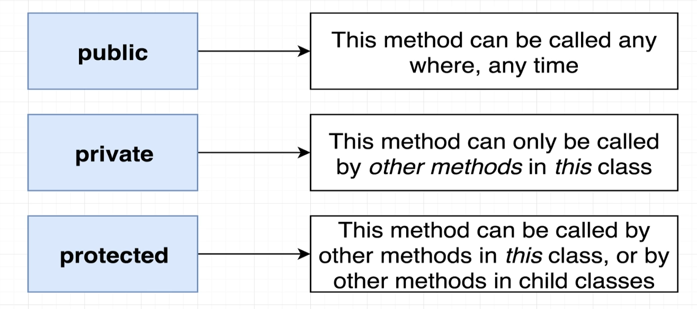

  - `public` : default for all class properties, not necessary to use
    - it can be used for "clarity" for other developers to know that this property is public
  - `private` : private properties can only be accessed and modified from the class itself.
    - it's like the `#` in **ES2015**, but the difference is that
      - if the private property is used with `private` modifier, it will only show warning for typescript but the javascript will run it normally
      - if the private property is used with (javascript native `#` modifier), it will show errors on runtime
  - `protected` : protected properties can be accessed by the class itself **and child classes** but not outside.
  - `readonly`: [readonly modifier](#readonly-modifier)

- Example:

  ```ts
  class Student {
    protected studentGrade: number;
    private studentId: number;
    public constructor(grade: number, id: number) {
      this.studentGrade = grade;
      this.studentId = id;
    }

    id() {
      return this.studentId;
    }
  }

  // Subclass
  class Graduate extends Student {
    studentMajor: string; // public by default
    public constructor(grade: number, id: number, major: string) {
      super(grade, id);
      this.studentId = id; // TypeScript Error: Property 'studentId' is private and only accessible within class 'Student'.
      this.studentGrade = grade; // Accessible because parent is protected
      this.studentMajor = major;
    }
  }

  // Class Instance
  const myStudent = new Graduate(3, 1234, 'computer science');

  console.log(myStudent.id()); //  prints 1234
  myStudent.studentId = 1235; // TypeScript Error: Property 'studentId' is private and only accessible within class 'Student'.
  console.log(myStudent.id()); // prints 1235
  ```

- you can also use these access modifiers in the constructor function instead of writing them many times

  ```ts
  class Department {
    // private id: string; // not needed
    // private name: string; // not needed
    private employees: string[] = [];

    constructor(private id: string, public name: string) {
      // this.id = id; // not needed
      // this.name = n; // not needed
    }
  }
  ```

- **Notes:**

  - You can't modify the access modifiers of the parent class in the child class

    ```ts
    class Parent {
      private id: string;
    }

    class Child extends Parent {
      public id: string; // ERROR ❌
    }
    ```

  - The access modifiers are not used for protective or security reasons, but rather to help us write better code (by telling other developers what they can and can't do with the class) and to help us catch errors early on.

---

### Class Fields

They're used to define properties in the class without having to define them in the constructor (new feature in ES2015)

```ts
// Option 1
class Person {
  name: string;
  age: number;

  constructor(name: string, age: number) {
    this.name = name;
    this.age = age;
  }
}

// -------------------------------------------------------

// Option 2 -> using `public` modifier ✅
class Person {
  constructor(public name: string, public age: number) {}
}
```

---

### Using Interfaces with classes

- it uses the word `implements`
- a `class` can **implement** multiple `interfaces`
- it ensures that a class follows the guideline of the interface even if we have repeated code (**repeating the type stuff**)
- in the code below, we want `Person` class to be `Greetable`

```ts
interface Greetable {
  name: string;
  age?: number; // optional parameter/property

  greet(phrase: string): void;
}

class Person implements Greetable {
  name: string;
  age = 30;

  constructor(n: string) {
    this.name = n;
  }

  greet(phrase: string) {
    console.log(phrase + ' ' + this.name);
  }
}
```

---

### Abstract Classes

Abstract classes are mainly for **inheritance** where other classes may derive from them. **We cannot create an instance of an abstract class**.
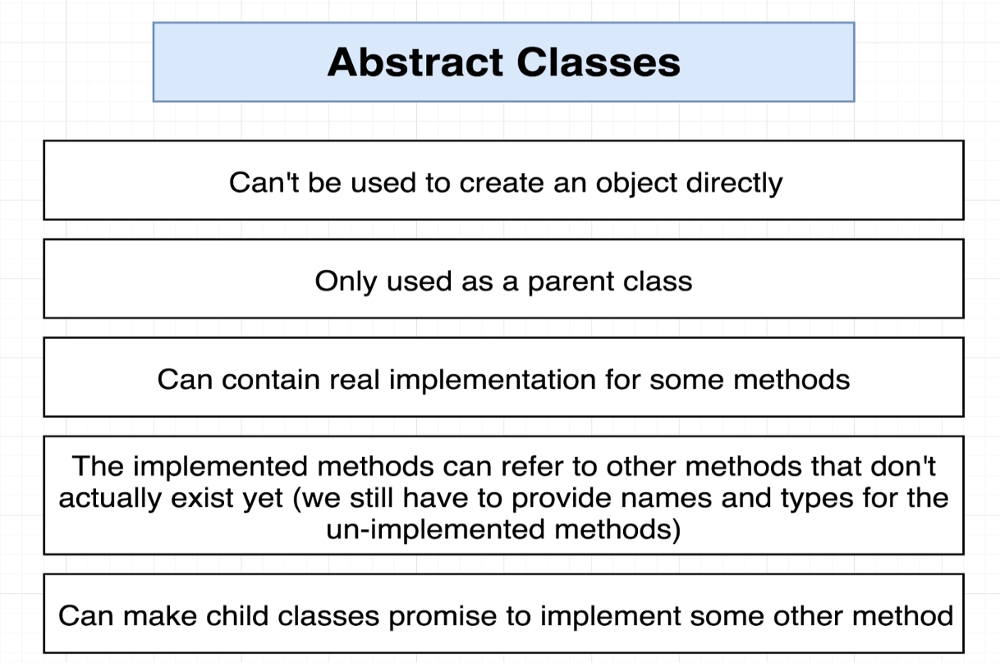

- You can't create an instance of an abstract class
- It's used to define a pattern (methods) that must be implemented by a child class
  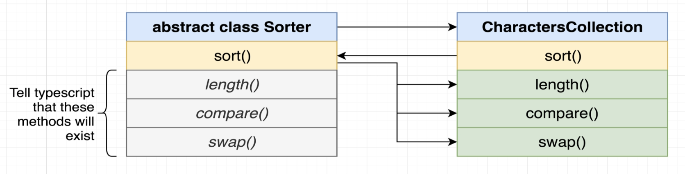

  - An abstract class typically includes one or more abstract methods or property declarations. The class which extends the abstract class must define all the abstract methods.

  - Usually the parent class may contain a method that uses properties that exist only in the child class, so we use `abstract` to tell Typescript that this method will be implemented in the child class

    ```ts
    abstract class Sorter {
      // Methods that will be implemented in the child class
      abstract compare(leftIndex: number, rightIndex: number): boolean;
      abstract swap(leftIndex: number, rightIndex: number): void;
      abstract length: number;

      // Method that will be inherited to the child class
      sort(): void {
        const { length } = this;

        for (let i = 0; i < length; i++) {
          for (let j = 0; j < length - i - 1; j++) {
            if (this.compare(j, j + 1)) {
              this.swap(j, j + 1);
            }
          }
        }
      }
    }

    class NumbersCollection extends Sorter {
      constructor(public data: number[]) {
        super();
      }

      get length(): number {
        return this.data.length;
      }

      compare(leftIndex: number, rightIndex: number): boolean {
        return this.data[leftIndex] > this.data[rightIndex];
      }

      swap(leftIndex: number, rightIndex: number): void {
        const leftHand = this.data[leftIndex];
        this.data[leftIndex] = this.data[rightIndex];
        this.data[rightIndex] = leftHand;
      }
    }

    const numbersCollection = new NumbersCollection([50, 3, -5, 0]);
    numbersCollection.sort(); // [ -5, 0, 3, 50 ]
    ```

- Abstract class example:

  ```ts
  abstract class APerson {
    abstract getName(): string;
  }

  class Person extends APerson {
    getName(): string {
      return 'john doe';
    }
  }

  const res = new Person();
  console.log(res.getName());
  ```

#### Interfaces vs Abstract Classes

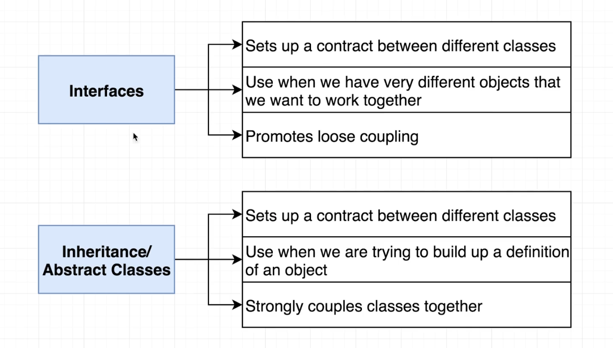

- **Abstract classes** are mainly for **inheritance** where other classes may derive from them. **We cannot create an instance of an abstract class**.
- **Interfaces** are used to define a **contract**. Any class or struct that implements that contract must provide an implementation of the members defined in the interface.

---

### Class Composition in Typescript

- This is a clean way to compose classes together to create more complex objects

  ```ts
  // Good way to compose classes together ✅
  class User {
    static fromData(data: UserProps): User {
      return new User(
        new Attributes<UserProps>(data),
        new Eventing(),
        new ApiSync<UserProps>(rootUrl)
      );
    }
  }

  const user = User.fromData({ id: 1, name: 'John', age: 30 });

  // -------------------------------------------------------

  // Bad way to compose classes together ❌
  class User {
    constructor(
      private attributes: Attributes<UserProps>,
      private events: Eventing,
      private sync: Sync<UserProps>
    ) {
      this.attributes = attributes;
      this.events = events;
      this.sync = sync;
    }
  }

  const user = new User(
    new Attributes<UserProps>(data),
    new Eventing(),
    new ApiSync<UserProps>(rootUrl)
  );
  ```

---

## Promises

- Promises in TypeScript take advantage of `generics`. This means we can explicitly state what type of Promise should be returned.

  ```ts
  // this async fun has a promise but doesn't return something
  const myFunc = async (): Promise<void> => {
    // do stuff
  };
  ```

---
