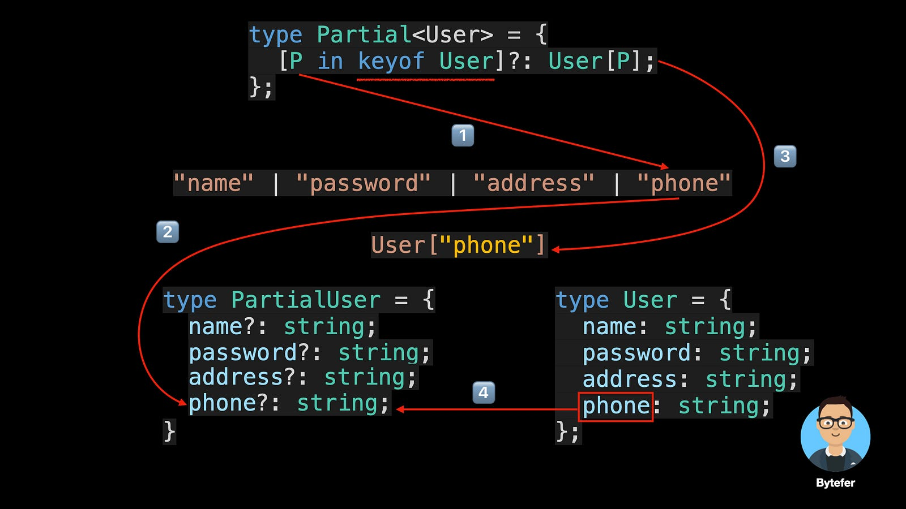
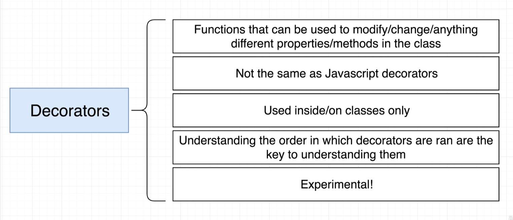
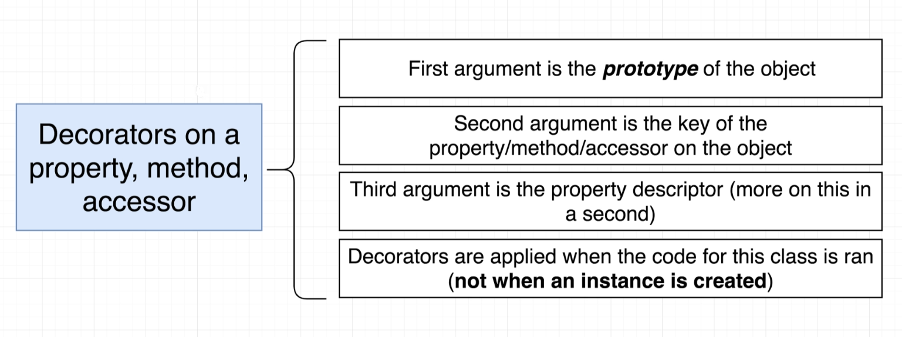
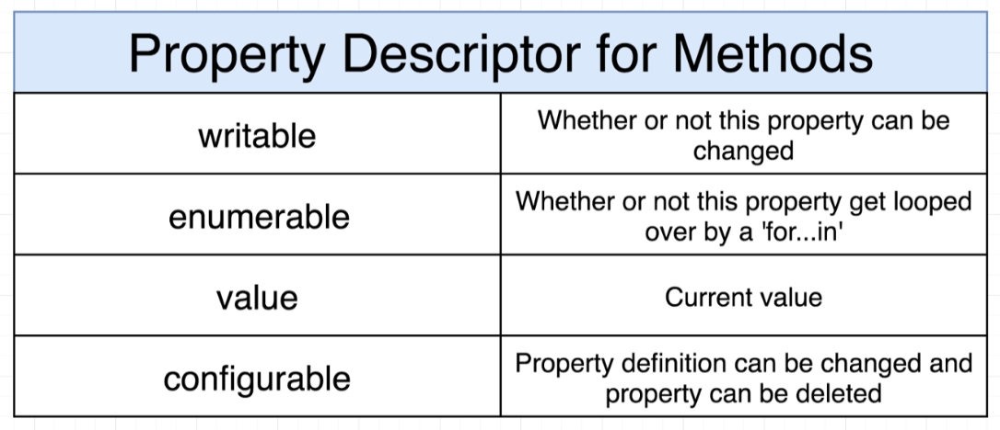

# INDEX

- [INDEX](#index)
  - [Type Assertions / Type Casting](#type-assertions--type-casting)
  - [Combining Types (Union \& Intersection Types)](#combining-types-union--intersection-types)
    - [Union types](#union-types)
    - [Intersection types](#intersection-types)
    - [Extending Interfaces](#extending-interfaces)
  - [Generics](#generics)
    - [Generics Constraints](#generics-constraints)
      - [Normal Type Constraint](#normal-type-constraint)
      - [Advanced Type Constraint](#advanced-type-constraint)
    - [Generic Utility types](#generic-utility-types)
      - [Partial Type](#partial-type)
      - [Readonly Type](#readonly-type)
  - [Type Guard (Narrowing)](#type-guard-narrowing)
    - [`typeof` type guard](#typeof-type-guard)
    - [Truthiness guard](#truthiness-guard)
    - [Equality Narrowing `===`](#equality-narrowing-)
    - [`in` operator narrowing](#in-operator-narrowing)
    - [`instanceof` Narrowing](#instanceof-narrowing)
    - [Type Predicates](#type-predicates)
    - [Discriminated Unions (literal types Narrowing)](#discriminated-unions-literal-types-narrowing)
    - [Declaration Merging](#declaration-merging)
    - [Exhaustiveness Checks with `never`](#exhaustiveness-checks-with-never)
  - [Key Operators \& Utility Types](#key-operators--utility-types)
    - [Built-in Operators](#built-in-operators)
    - [Built-in Utility Types](#built-in-utility-types)
  - [Decorators](#decorators)
    - [How to use Decorators](#how-to-use-decorators)
    - [Decorator Factories (factory decorator)](#decorator-factories-factory-decorator)
    - [Decorator Composition](#decorator-composition)
    - [Class Decorator](#class-decorator)
    - [Decorator Examples and Use-cases](#decorator-examples-and-use-cases)
      - [Validation Decorators](#validation-decorators)
      - [Decorator Libraries](#decorator-libraries)
  - [Namespace](#namespace)
    - [Problem with namespaces and alternative](#problem-with-namespaces-and-alternative)

---

## Type Assertions / Type Casting

> Sometimes you might have more specific information about a value's type, and you want to make sure that Typescript knows it too.

**Type Assertions** are used to tell TypeScript: (that even though TypeScript thinks it should be one type, it is actually a different type **that you want**). Common to see when a type is unknown

- It's a way to override typescript main behavior
- Usually used with `unknown` or `union` or `enum` types

> Generally, using type coercion (as Type), is a way of telling TypeScript "I know what I'm doing, so just trust me this has this type", so you generally should avoid it and let the type checker and type inference do its thing.

- Type assertions helps you to force types when you are not in control of them.
  Typecasting refers to `type conversions`

- **How to use Type Assertion?**

  - There are two ways to do type assertions
    - `as` --> `let length: number = (lengthField as string);`
    - `Bracket` syntax --> `let length: number = (<string>lengthField);`
      - **Note:** it doesn't work with JSX/TSX, to fix this we add a trailing comma: `const getEl = <T,>(list: T[]):T => {}`

- Example

  ```ts
  const myFunc = (student: unknown): string => {
    newStudent = student as string;
    return newStudent;
  };

  let mystery: unknown = 'Hello World';
  const numChars = (mystery as string).length; // < Note how we use the `as` keyword here in the inline code normally
  //or
  const numChars = (<string>mystery).length;
  ```

---

## Combining Types (Union & Intersection Types)

### Union types

It's a type that can be one of several types, and it allows you to define a variable that can hold values of different types. (think of it as a "logical OR")

- used when more than one type can be used
- we can create a union-type by using the **pipe character (`|`)** to separate the types we want to include
- It's commonly used with [Type Guard](./1-TypeScript.md#type-guard-narrowing) to narrow down the type of a variable

- Notes:

  - you shouldn't use it with type `any`, as it's like multiplying by `zero` as it will equal that the type will be `any` (`zero`)

  ```ts
  let studentPhone: number | string;
  studentPhone = '(555) 555 - 5555';
  studentPhone = 5555555555;
  ```

  - There's a downside that if we will perform an operation for a specific type like `.replace()` for string type, on a union type, we will get an error:

    ```ts
    function calculateTax(price: number | string, tax: number) {
      price.replace('$', ''); // ERROR, as it might be number
      return price * tax;
    }
    ```

    - To fix this, we use [Type Guard](./1-TypeScript.md#type-guard-narrowing)

---

### Intersection types

It's a type that combines multiple types into one, and it allows you to create a new type that **has all the properties** of the combined types. (think of it as a "logical AND")

- It's for having multiple types and combining them with (`&`)

```ts
type Circle = {
  radius: number;
};
type Colorful = {
  color: string;
};

type ColorfulCircle = Circle & Colorful;
```

- This is quite different than what we saw with union types — this is quite literally a `Circle` and `Colorful` combined together, and we have access to everything immediately.

---

### Extending Interfaces

- You can extend interfaces using the `extends` keyword, which allows you to create a new interface that inherits properties from one or more existing interfaces

- Object example

  ```ts
  interface Person {
    name: string;
    age: number;
  }

  interface Student extends Person {
    enrolled: boolean;
  }

  let newStudent: Student = { name: 'Maria', age: 10, enrolled: true };
  ```

- Class example

  ```ts
  interface Named {
    name: string;
  }

  interface Greetable extends Named {
    greet(phrase: string): void;
  }

  class Person implements Greetable {
    name: string;
    age: number;

    constructor(name: string, age: number) {
      this.name = name;
      this.age = age;
    }

    greet(phrase: string) {
      console.log(phrase + ' ' + this.name);
    }
  }

  // Now we can use the Greetable interface to create a new object that has the same properties as Person
  ```

---

## Generics

A generic is a way to write a function that is reusable across different types, by using **type parameters**

They give us flexibility to write functions that can work with any type, without having to specify the type in advance.

> "generic" means **not specific** (we don't know this type but we will know it as soon as we invoke the function)


- They allow us to define reusable functions and classes that work with multiple types rather than a single type

  - Functions may return different values, depending on the arguments you pass them.

> **why not just use `any` type?**
>
> - `any` is an escape hatch. It turns off type checking for the variable so that you can do your thing without errors
>   - It sort of defeats the purpose of Typescript and types
> - It's an anti-pattern(not recommended) in typescript
> - `any` allows for any type to go in, and any type to come out.
> - Using a `generic` means a number goes in and a number comes out or a string goes in and a string comes out.
> - `Generics` introduce the `Type Variable`
>   - Rather than being a variable that accepts values, it's a variable that accepts types and is denoted with angle brackets myFunc`<T>`
>   - it help us write more reusable and generic functions

- It's similar to how arguments work in functions for reusability

  We can do the same with generics, as **it customizes the type of the function to whatever we pass in**

- It takes 2 arguments: `T` and `U` (or any other name), and they are just placeholders for the types that we will pass in when we call the function

  

  ```ts
  function myFunc<T, U>(arg1: T, arg2: U): [T, U] {
    return [arg1, arg2];
  }

  const result = myFunc<number, string>(1, 'hello'); // [1, 'hello']
  const result = myFunc(1, 'hello'); // [1, 'hello'] (Type Inference, so no need to specify the types if we are passing them in)
  ```

  - The values of `T` and `U` **are determined when we call the function**, and they can be any type (string, number, object, etc.)

- **Examples**

  - Example 1️⃣: **Generic Function**

    ```ts
    // Typed Function that deals only with numbers ❌
    const getItem = (arr: number[]): number => {
      return arr[1];
    };
    // we can work around it and use union type like this (But still not optimal ❌)
    const getItem = (arr: (number | string)[]): number | string => {
      return arr[1];
    };

    // --------------------------------------------------------------

    // Using Generics ✅
    const getItem = <T>(arr: T[]): T => {
      return arr[1];
    };
    // calling it
    getItem([1, 2, 3]); // ✅ -> because of type inference (TS knows that we are passing a number array)
    getItem<number>([1, 2, 3]); // ✅
    getItem<string>(['1', '2', '3']); // ✅
    ```

    - In the first function, we have a function that takes in a number array and outputs the second number of the array. But what if we don't want to work with numbers? What if we want to work with strings? Well, we would need to create a second function. Or, we can use a generic, and whatever type we use when we call the function will translate to its return as well.

  - Example 2️⃣: **Promises**

    ```ts
    // Here (<string>) is a generic type that specifies the type of data that the promise will resolve to
    const promise = new Promise<string>((resolve, reject) => {
      setTimeout(() => {
        resolve('Done!');
      }, 2000);
    });

    promise.then(data => {
      console.log(data.split(' ')); // ✅
    });
    ```

  - Example 3️⃣: **Generic Class**

    ```ts
    class DataStorage<T> {
      data: T[] = [];

      // also we can use it with methods
      addItem(item: T) {
        this.data.push(item);
      }
    }

    const textStorage = new DataStorage<string>();
    textStorage.addItem('Max');

    const numberStorage = new DataStorage<number>();
    numberStorage.addItem(10);
    ```

- **Generics Notes:**

  - When calling a generic function, we don't need to specify the generic-type when invoking it (because of type inference), but in some cases like with DOM elements we might need to
  - DOM query selector methods are generic function, and that's why we can use generic type with them

    ```ts
    const input = document.querySelector<HTMLInputElement>('todo-input')!;
    ```

    - `!` is used to tell TS that this element will always exist in the DOM, and will never be `null` (to avoid `null`-checking)

  - generics can be used with multiple types:

    ```ts
    function merge<T, U>(obj1: T, obj2: U) {
      return { ...obj1, ...obj2 };
    }
    ```

  - A default type can be defined on a generic parameter as follows:

    ```ts
    <T = DefaultType>
    ```

---

### Generics Constraints

#### Normal Type Constraint

- Generic functions can operate on types with known properties, like `.length` for arrays. However, the compiler can't confirm that all types have these properties, leading to warnings.

- Example

  - Sometimes we want to restrict the type of the generic to a certain type, like `object` or `array` or `string` or `number`, etc.
  - We can do this by using the `extends` keyword

    ```ts
    interface Lengthy {
      length: number;
    }

    function printLength<T extends Lengthy>(arg: T): T {
      console.log(arg.length); // Now we know it has a ".length" property, so no more error
      return arg;
    }

    printLength(235); // ❌ Property 'length' does not exist on type 'number'.
    printLength('Hello'); // ✅
    printLength([1, 2, 3]); // ✅
    ```

- We want to restrict the function to types that have a `.length` property. This requirement is a constraint on the type.

  - To do so, we’ll extend an interface that has the `length` property like `array`, then we'll use this `interface` and the extends keyword to denote our constraint:

    ```ts
    function logLength<T extends Array>(arg: T): T {
      console.log(arg.length); // Now we know it has a ".length" property, so no more error
      return arg;
    }

    logLength(235); // ❌ Property 'length' does not exist on type 'number'.
    logLength([1, 2, 3]); // ✅
    ```

---

#### Advanced Type Constraint

We can use `keyof` operator to constrain a generic to only accept keys of a certain type


> It depends on [Literal type](./2-TS-Types.md#literal-type)

- For example:

  ```ts
  function getProperty<T, K extends keyof T>(obj: T, key: K): T[K] {
    return obj[key];
  }

  let user = {
    id: 1,
    name: 'test',
    age: 20
  };

  getProperty(user, 'id'); // ✅
  getProperty(user, 'name'); // ✅
  getProperty(user, 'age'); // ✅
  getProperty(user, 'role'); // ❌ Argument of type "role" is not assignable to parameter of type '"id" | "name" | "age"'.
  ```

  - This is done instead of explicitly defining the type of the key

    ```ts
    // BAD ❌
    function getProperty(obj: any, key: string): string | number {
      return obj[key];
    }
    ```

---

### Generic Utility types

These are built-in types that are provided by TypeScript to help us work with generics more easily. They are very useful when we want to create new types based on existing ones.

- They are used to create new types based on existing ones, and they are very useful when we want to create new types based on existing ones.

#### Partial Type

The `Partial` Type accepts a generic argument (type argument). it creates a new type where all the properties of the original type are **optional**.

The `partial` type is simple to use as it only requires to pass a type **`T`** where **`T`** can be any object type regardless of whether it is a defined type.

> It generates a new type based on the input type/object/interface **with all the property-keys being optional**

```ts
Partial<MyType>;
Partial<MyInterface>;
Partial<{}>;
```

```ts
// no need to update all the property keys to be optional
interface Blog {
  id: string;
  title: string;
  slug: string;
  categories: string[];
  tags: string[];
  featureImageUrl?: string;
  content: string;
}
// It will be the same as if we put `?` for all the properties in the Blog interface

// Partial<Blog> generates a new type based on Blog with all the property
// keys being optional
const draft: Partial<Blog> = {
  title: 'What kind of title should I type?'
};
```

#### Readonly Type

The `Readonly` Type accepts a generic argument (type argument). it creates a new type where all the properties of the original type are **readonly** and can't be changed.

```ts
// Readonly<MyType>;
//Readonly<MyInterface>;

const names: Readonly<string[]> = ['John', 'Doe'];

names.push('Jane'); // ❌ Property 'push' does not exist on type 'readonly string[]'.
names[0] = 'Jane'; // ❌ Index signature in type 'readonly string[]' only permits reading
console.log(names); // ✅ ['John', 'Doe']
```

- Note:

  - this can be done by using `as const` keyword, but this is a better approach

    ```ts
    const names = ['John', 'Doe'] as const;
    names.push('Jane'); // ❌ Property 'push' does not exist on type 'readonly ["John", "Doe"]'.

    // ---------------------------------------------

    // or object
    const person = {
      name: 'John',
      age: 20
    } as const;

    person.name = 'Jane'; // ❌ Cannot assign to 'name' because it is a read-only property.
    ```

  - Another way to do this is by using `Object.freeze()`, **but this is a runtime check**, and it will not be type-checked

    ```ts
    const person = Object.freeze({
      name: 'John',
      age: 20
    });

    person.name = 'Jane'; // ❌ Cannot assign to 'name' because it is a read-only property.
    ```

---

## Type Guard (Narrowing)

- **Type Guard** : protects us from doing something unless we check the type first

  - It's used to utilize the flexibility of using [Union Types](./2-TS-Types.md#union-types) in a safe way

- **Type Narrowing:** is doing a type check before working with a value, It's done using:

  - [`typeof` type guard](#typeof-type-guard)
  - [truthiness guard](#truthiness-guard)
  - [Equality type guard `===`](#equality-narrowing-)
  - [`in` operator narrowing](#in-operator-narrowing)
  - [`instanceof` Narrowing](#instanceof-narrowing)
  - [type predicates](#type-predicates)
  - [discriminated unions](#discriminated-unions-literal-types-narrowing)
  - [exhaustiveness checks with `never`](#exhaustiveness-checks-with-never)

- Better approach is to create interfaces for each type and use them in the type-guard by checking one of the methods above

  ```ts
  interface NumbersCollection {
    data: number[];
    add: (number: number) => void;
  }
  interface StringCollection {
    data: string[];
    add: (string: string) => void;
  }

  function printCollection(collection: NumbersCollection | StringCollection) {
    if (collection instanceof NumbersCollection) {
      collection.add(1);
    } else {
      collection.add('1');
    }
  }

  // instead of this: ❌
  function printCollection(collection: number[] | string[]) {
    if (typeof collection === 'number') {
      collection.push(1);
    } else {
      collection.push('1');
    }
  }
  ```

---

### `typeof` type guard

- it control the flow of code using the type of something
- this process is called **Narrowing**, as it narrows our choice with the type-guard condition
- usually used with [unknown type](./2-TS-Types.md#unknown----type-guard) or [Union Types](./2-TS-Types.md#union-types)
  - since they allow for multiple types for a value, It's good to check what came through before working with it.
- **Note:** difference between `typeof` and `instanceof` is that `typeof` is used with primitive types and `instanceof` is used with (objects or classes)
  

```ts
function calculateTax(price: number | string, tax: number) {
  if (typeof price === 'string') {
    price = parseFloat(price.replace('$', ''));
  }
  return price * tax;
}
```

---

### Truthiness guard

It's checking a value for being truthy or falsy before working with it

- this is helpful in avoiding errors when values might be `null` or `undefined`

```ts
function printLetters(word: string | null) {
  if (!word) {
    console.log('No word was provided');
  } else {
    word.forEach(letter => console.log(letter));
  }
}
```

---

### Equality Narrowing `===`

It involves comparing types to each other before doing certain operations with values

```ts
function someFunc(x: string | boolean, y: string | number) {
  if (x === y) {
    // x and y are strings in this case
    x.toUpperCase();
    y.toUpperCase();
  } else {
    console.log(x);
    console.log(y);
  }
}
```

---

### `in` operator narrowing

Javascript's `in` operator helps check if a certain property exists in an object. This means it can be used to check if a value exists in an object (according to its type-alias) before working with it

```ts
// EX 1
type Employee = { name: string; age: number };
type Manager = { name: string; age: number; role: string };

const printEmployee = (employee: Employee | Manager) => {
  if ('role' in employee) {
    console.log(`Manager: ${employee.name}, ${employee.age}, ${employee.role}`);
  } else {
    console.log(`Employee: ${employee.name}, ${employee.age}`);
  }
};

// ----------------------------------------------------

// EX 2
type Cat = { meow: () => void };
type Dog = { bark: () => void };

const talk = (creature: Cat | Dog) => {
  if ('meow' in creature) {
    console.log(creature.meow());
  } else {
    console.log(creature.bark());
  }
};
```

---

### `instanceof` Narrowing

It's a javascript operator that allows us to check if one thing is an instance of another. This can help us narrow types when working with things like **classes**

```ts
const printFullDate = (date: date | string) => {
  if (date instanceof Date) {
    return date.toUTCString();
  } else {
    return new Date(date).toUTCString();
  }
};
```

---

### Type Predicates

Typescript allows us to write custom functions that can narrow the type of a value. These functions have a very special **return type** called a **type predicate**

- A predicate takes the name -> **`parameterName + is + Type`**

```ts
// if the return value is true, then it must be "Cat"
function isCat(pet: Cat | Dog): pet is Dog {
  return (pet as Cat).meow !== undefined;
}

if (isCat(pet)) {
  pet.meow();
} else {
  pet.bark();
}
```

---

### Discriminated Unions (literal types Narrowing)

It's a way to create a union type that has a common property that can be used to distinguish between the different types in the union. (this property is called a **discriminant** and will be of type: `literal-type`)


- The concept here is that we add a **"discriminant"** which is just a property that all our types will have in common, and it will be of type: `literal-type` and by convention, It's called `kind`, or `type` or `typeName`, or any other name that makes sense to us.

```ts
type Circle = {
  type: 'circle'; // discriminant
  radius: number;
};
type Square = {
  type: 'square'; // discriminant
  sideLength: number;
};

const getArea = (shape: Circle | Square): number => {
  switch (shape.type) {
    case 'circle':
      return Math.PI * shape.radius ** 2;
    case 'square':
      return shape.sideLength ** 2;
    default:
      const _exhaustiveCheck: never = shape; // exhaustive check
      return _exhaustiveCheck;
  }
};
```

---

### Declaration Merging

TypeScript can merge multiple declarations with the same name into one. Useful for enhancing or extending existing types, especially with libraries or global objects.

- Common Mergeable Types:

  - `Interfaces` → Members get combined.
  - `Namespaces` → Combine and organize code.
  - `Functions` + `Namespaces` → Allows static properties on functions.

- Use Cases:

  - Extending existing types
  - Add props to global or third-party interfaces
  - Extend existing modules (module augmentation)
  - Combine function logic with extra metadata (via `namespace`)

- Example: (Function + Namespace Merge)

  ```ts
  // greet is a value (function)
  function greet(name: string): string {
    return `Hello, ${name}`;
  }

  // Merge namespace with function (greet is a namespace)
  namespace greet {
    export const version = '1.0.0';
    export function shout(name: string) {
      return greet(name).toUpperCase();
    }
  }

  console.log(greet('John')); // Hello, John
  console.log(greet.version); // 1.0.0
  console.log(greet.shout('John')); // HELLO, JOHN
  ```

  - This allows the greet function to also carry metadata or helpers via the merged namespace.

- Example: (Class as both a value and a type)

  ```ts
  class Person {
    name?: string;
    age?: number;
    static createBaby(name: string) {
      return {
        name,
        age: 0
      };
    }
  }

  // 1. Using it as a value
  const person = Person.createBaby('John');

  // 2. Using it as a type
  const person2: Person = {
    name: 'John',
    age: 10
  };
  ```

---

### Exhaustiveness Checks with `never`

It's the default thing to do when all the type-narrowing checks are all passed and this is the last check, and it's like: "we should never make it here, if we handled all cases correctly"

---

## Key Operators & Utility Types

### Built-in Operators

- `as` (type assertion)

  - it tells the compiler to treat a value as a specific type, overriding its inferred type.

    ```ts
    let value: unknown = 'Hello';
    const str = value as string;
    ```

  - When to use it:
    - when you're certain about the type of the value but TypeScript can't infer it. **(be careful as incorrect usage can lead to runtime errors)**
    - when you want to narrow down the type of a value to a more specific type.
    - when dealing with dynamic data sources (e.g. data from **APIs**)

- `satisfies` (type satisfier)

  - it was introduced in TypeScript `4.9` and allows you to assert that a value satisfies a specific type but retains any extra fields or information.

    ```ts
    type User = {
      id: number;
      username: string;
      role: 'admin' | 'user' | 'guest';
    };

    const adminUser = {
      id: 1,
      username: 'admin',
      role: 'admin',
      extraField: 'extraValue' // 👈
    } satisfies User; // 👈 Here we assert that adminUser satisfies the User type
    ```

  - When to use it:
    - useful when you want type safety with some flexibility, allowing extra fields that aren’t part of the defined type.
    - better than `as` for preserving extra fields.

- `keyof` (key operator)

  - It returns a union type of the keys of an object type.

    ```ts
    type User = {
      id: number;
      name: string;
      age: number;
    };

    type UserKeys = keyof User; // "id" | "name" | "age"
    ```

  - We can use `keyof` operator to constrain a generic to only accept keys of a certain type
    

    ```ts
    function getProperty<T, K extends keyof T>(obj: T, key: K): T[K] {
      return obj[key];
    }

    let user = {
      id: 1,
      name: 'test',
      age: 20
    };

    getProperty(user, 'id'); // ✅
    getProperty(user, 'name'); // ✅
    getProperty(user, 'age'); // ✅
    getProperty(user, 'role'); // ❌ Argument of type "role" is not assignable to parameter of type '"id" | "name" | "age"'.
    ```

    - This is done instead of explicitly defining the type of the key

      ```ts
      // BAD ❌
      function getProperty(obj: any, key: string): string | number {
        return obj[key];
      }
      ```

  > It depends on [Literal type](./2-TS-Types.md#literal-type)

  - When to use it:
    - When you need to dynamically access or iterate over the keys of an object type while maintaining type safety.
    - when creating (utility-types or generics) that operate on the keys of an object type.

- `typeof` (Type Query)

  - It allows you to get the type of a variable or property at compile time.

    ```ts
    const user = {
      id: 1,
      name: 'John Doe'
    };

    type User = typeof user; // { id: number; name: string; }
    ```

  - When to use it:
    - When you need to get the type of a variable or property at compile time.
    - When you want to reuse the shape of an object across multiple places in your code.

- `in` (Mapped type operator)

  - It's' used inside mapped types to iterate over a union of keys, making it easier to create variations of existing types.

    ```ts
    type User = {
      id: number;
      name: string;
      age: number;
    };

    type UserReadOnly = {
      readonly [K in keyof User]: User[K];
      // Now all properties are readonly
    };

    type UserOptional = {
      [K in keyof User]?: User[K];
      // Now all properties are optional
    };
    ```

- `extends` (Type constraint)

  - It's used to constrain a generic type to a specific shape or set of properties.

    ```ts
    function printName<T extends { name: string }>(arg: T): void {
      console.log(arg.name);
    }

    printName({ name: 'John', age: 30 }); // ✅
    printName({ age: 30 }); // ❌ Argument of type '{ age: number; }' is not assignable to parameter of type '{ name: string; }'.
    ```

- `infer` (Type Inference in conditional types)

  - It's used to infer a type within a conditional type.

    ```ts
    type ReturnType<T> = T extends (...args: any[]) => infer R ? R : never;

    type MyFunction = (a: number, b: string) => boolean;

    type MyReturnType = ReturnType<MyFunction>; // boolean
    ```

- `is` (Type Guard/Predicate)

  - It's used to create a user-defined type guard.

    ```ts
    function isString(value: any): value is string {
      return typeof value === 'string';
    }

    const input: unknown = 'Hello';

    if (isString(input)) {
      console.log(input.toUpperCase()); // ✅
    }
    ```

  - It's used to create custom type-guards that help narrow down types within conditional blocks.

- `?` (Optional property modifier)

  - It allows you to mark a property as optional in an object type.

    ```ts
    type User = {
      id: number;
      name: string;
      age?: number;
    };
    ```

  - When to use it:
    - when defining object types where certain properties are not required, giving flexibility in how objects can be structured.

- `!` (Non-null assertion operator)

  - It allows you to assert that a value is not null or undefined **bypassing typescript strict `null` checks**

    ```ts
    function processValue(value: string | null | undefined) {
      const processed = value!.trim();
      // Now TypeScript knows 'processed' is a string
    }
    ```

- `readonly` (Modifier)

  - It allows you to mark a property as read-only in an object type, ensuring that the property cannot be reassigned or modified.

    ```ts
    type User = {
      id: number;
      name: string;
      age: number;
      readonly email: string;
    };
    ```

  - When to use it:
    - When you want to prevent a property from being modified after it's been set.
    - When you want to create immutable objects.

---

### Built-in Utility Types

- `Pick<T, K>`

  - Constructs a type by picking the set of properties `K` from `T`.

    ```ts
    type User = {
      id: number;
      name: string;
      age: number;
    };

    type UserName = Pick<User, 'name'>; // { name: string }
    ```

  - Use it when you want to create a type by selecting only certain properties from an existing type.

- `Omit<T, K>`

  - Constructs a type by omitting the set of properties `K` from `T`.

    ```ts
    type User = {
      id: number;
      name: string;
      age: number;
    };

    type UserWithoutAge = Omit<User, 'age'>; // { id: number; name: string; }
    ```

  - It's the opposite of `Pick<T, K>`.

- `Partial<T>`

  - Makes all properties in a type **optional**.

    ```ts
    type User = {
      id: number;
      name: string;
      age: number;
    };

    type PartialUser = Partial<User>; // { id?: number; name?: string; age?: number; }
    ```

  - It's used to make types more flexible and easier to work with, especially in scenarios where you want to allow partial updates to an object.

- `ReturnType<T>`

  - Extracts the return type of a function type.

    ```ts
    function createUser(name: string, age: number) {
      return {
        id: Date.now(),
        name,
        age
      };
    }

    type User = ReturnType<typeof createUser>;

    const user: User = {
      id: 1,
      name: 'John Doe',
      age: 30
    };
    ```

  - It's used when you need to reuse the return type of a function elsewhere in your code.

---

## Decorators

Decorators are functions that can be used to modify the behavior of classes, methods, and properties at runtime.

They provide extra functionality to classes and methods, and they are a way to add metadata to classes and methods.




- **Decorators run when the class is defined**, not when it's instantiated or when a method is called
- When you apply a decorator to a class or a class member, you are actually calling a function that is going to receive details of what is being decorated, and the decorator implementation will then be able to transform the code dynamically, adding extra functionality, and reducing boilerplate code.
- They are a way to have **"Meta Programming"** in TypeScript, which is a programming technique that enables the programmer to create code that uses other code from the application itself as data.
- It's based on the concept of **Prototype** in JavaScript
  - A prototype is a blueprint of an object. It encapsulates the properties and methods that are common to all instances of the object.
  - When you create an object from a prototype, the object inherits all the properties and methods from the prototype.
  - In JavaScript, every object has a prototype, and the prototype is also an object.

---

### How to use Decorators

- Decorators are **experimental**, and they are not part of the ECMAScript standard yet, **To enable experimental support for decorators**, you must enable the `experimentalDecorators` compiler option either on the command line or in your tsconfig.json

  ```sh
  # command line
  tsc --target ES5 --experimentalDecorators
  ```

  ```json
  // tsconfig.json:
  {
    "compilerOptions": {
      "target": "ES5",
      "experimentalDecorators": true
    }
  }
  ```

- How to use it on a property, method, accessor
  
  - It takes 3 arguments:
    - `target`: the prototype of the object (or the constructor function if it's a class decorator)
    - `key`: the name of the property/method/accessor that we are decorating
    - `descriptor` **(optional)**: an object that contains the property descriptor of the member
- Note that decorators can be applied to (classes, properties, methods, accessors, parameters), not just classes because they are just functions that are called with different arguments depending on what they are decorating.

- Example:

  ```ts
  function LoggerDecorator(target: any, key: string): void {
    console.log('Target:', target);
    console.log('Key:', key);
  }

  class Boat {
    color: string = 'red';

    get formattedColor(): string {
      return `This boat color is ${this.color}`;
    }

    @LoggerDecorator
    pilot(): void {
      console.log('swish');
    }
  }

  const boat = new Boat();
  console.log(boat.formattedColor); // This boat color is red

  boat.pilot();
  // output:
  // Target: Boat { color: 'red' }
  // Key: pilot
  // swish
  ```

- The decorator function is called **only one time** when the class is defined, not when it's instantiated
- The decorator function receives multiple arguments:
  - 1st argument -> `target`: the prototype of the object
  - 2nd argument -> `key`: the name of the property/method/accessor that we are decorating
  - 3rd argument -> `descriptor`: an object that contains the property descriptor of the member
- From this we can see that we now will have access to the `prototype` of the object, and the `descriptor` of the member that we are decorating, which enables us to modify the object's behavior at runtime.

- **Property descriptor** is an object that contains the property descriptor of the member
  

  - It's the key way that we can modify the behavior of the object inside the decorator function

    ```ts
    function testDecorator(target: any, key: string, desc: PropertyDescriptor): void {
      const method = desc.value;
      desc.value = function () {
        console.log('BEFORE METHOD');
        method();
        console.log('AFTER METHOD');
      };
    }
    // Here, we are overriding the method with a new function that will log "BEFORE METHOD" before calling the original method, and then log "AFTER METHOD" after calling the original method.
    ```

  - So, It's like intercepting the method call and adding extra functionality to it.

- **Notes:**

  - In order to access any primitive type, we need to use `target.constructor` instead of `target`, this is because the prototype only contains the methods definitions and not the class properties. Instead, the **constructor** contains the class properties.

    ```ts
    function testDecorator(target: any, key: string): void {
      console.log(target.color); // undefined ❌
      console.log(target.constructor.color); // red ✅
    }
    ```

---

### Decorator Factories (factory decorator)

Decorator factories are functions that **return decorator functions** and they are used to configure decorators.

- It's used **when we want to pass arguments to the decorator function**, and we can't do that directly because the decorator function is called only one time when the class is defined, not when it's instantiated.

- Example:

  ```ts
  function testDecoratorFactory(color: string) {
    return function (target: any, key: string, desc: PropertyDescriptor): void {
      const method = desc.value;
      desc.value = function () {
        console.log(`BEFORE METHOD: ${color}`);
        method();
        console.log('AFTER METHOD');
      };
    };
  }

  class Boat {
    color: string = 'red';

    get formattedColor(): string {
      return `This boat color is ${this.color}`;
    }

    @testDecoratorFactory('blue')
    pilot(): void {
      console.log('swish');
    }
  }
  ```

  - Here, we are passing the color as an argument to the decorator factory function, and then we are returning the decorator function that will be called when the class is defined.
  - So, the decorator factory function is called when the class is defined, and the decorator function is called when the method is called.

- Example of a constructor function that inserts elements into the DOM

  ```ts
  function WithTemplate(template: string, hookId: string) {
    return function (constructor: any) {
      const hookEl = document.getElementById(hookId)!;
      const p = new constructor();
      const templateEl = document.createElement('template');
      templateEl.innerHTML = template;
      hookEl.append(templateEl.content);
    };
  }

  @WithTemplate('<h1>My Person</h1>', 'app')
  class Person {
    name: string = 'Max';

    constructor() {
      console.log('Creating person object...');
    }
  }
  const person = new Person();
  ```

  - This similar to Angular's `@Component` decorator, where we can pass a template and a hookId to the decorator factory function, and it will create a new element in the DOM with the template and append it to the element with the hookId.

---

### Decorator Composition

Decorator Composition is an important concept as it allows us to use multiple decorators on a single class member or declarations. The evaluation of these compositions is similar to the function composition that we will see in our mathematics class `(i.e (f ∘ g)(x) is equivalent to f(g(x)))`.

- the expression for each decorator will be evaluated from `top to bottom`
- the results are called from `bottom to top`

```ts
function outer() {
  console.log('Outer: expression');
  return function (target: any, propertyKey: string, descriptor: PropertyDescriptor) {
    console.log('Outer: result');
  };
}

function inner() {
  console.log('Inner: expression');
  return function (target: any, propertyKey: string, descriptor: PropertyDescriptor) {
    console.log('Inner: result');
  };
}

class DecoratorComposition {
  @outer()
  @inner()
  run() {}
}
const decoratorComposition = new DecoratorComposition();
decoratorComposition.run();
// results:
// Outer: expression
// Inner: expression
// Inner: result
// Outer: result
```

---

### Class Decorator

Class Decorator is very similar to inheriting from another class.

- Decorators are functions that accepts functions as a parameter as it's applied to classes or class properties or methods
- **Note:** Class decorators are only called **once when the class is defined**, not when it's instantiated or when a method is called or when a property is accessed

- Class decorator example

  ```ts
  const classDecorator = (target: Function) => {
    // do something with your class
  };

  @classDecorator
  class Rocket {}
  ```

  ```ts
  // ---------Using Decorator--------- //
  function BankCard(constructor: Function) {
    constructor.prototype.cardId = Math.floor(Math.random() * 1000);
  }

  @BankCard
  class HSBCBankCard {
    name: string;
    constructor(name: string) {
      this.name = name;
    }
  }

  // ---------Using class extends--------- //
  class BankCard {
    cardId: number;
    constructor() {
      this.cardId = Math.floor(Math.random() * 1000);
    }
  }

  class HSBCBankCard extends BankCard {
    name: string;
    constructor(name: string) {
      super();
      this.name = name;
    }
  }
  ```

- class property decorator example

  ```ts
  function Log(target: any, propertyName: string) {
    // this is done when the class is defined, not when it's instantiated, and not when property is accessed
    console.log('Property decorator!');
    console.log(target, propertyName);
  }

  class Person {
    @Log
    name: string = 'Max';
  }
  ```

---

### Decorator Examples and Use-cases

#### Validation Decorators

- validate creating a class instance with required properties

  ```ts
  function required(target: any, key: string) {
    let value = target[key];
    const getter = () => value;
    const setter = (newValue: any) => {
      if (!newValue) {
        throw new Error(`Property ${key} is required`);
      }
      value = newValue;
    };

    // Modify the property descriptor to use the getter and setter
    Object.defineProperty(target, key, { get: getter, set: setter });
  }

  class User {
    @required
    name: string;

    constructor(name: string) {
      this.name = name;
    }
  }

  const user = new User('Max'); // ✅
  const user2 = new User(''); // ❌ Error: Property name is required
  ```

  - Now if we try to create a new instance of the `User` class without providing a name, it will throw an error.
  - This is because decorators are executed when the class is defined, not when it's instantiated. so if we try to create a new instance of the `User` class without providing a name, it will throw an error and won't allow us to create the instance.

- validate the input of a method or a class property

  ```ts
  function validate(target: any, key: string, descriptor: PropertyDescriptor) {
    const method = descriptor.value;
    descriptor.value = function (...args: any[]) {
      if (args[0] < 0) {
        throw new Error('Negative value not allowed!');
      }
      return method.apply(this, args);
    };
  }

  class BankAccount {
    balance: number = 0;

    @validate
    deposit(amount: number) {
      this.balance += amount;
    }
  }

  const account = new BankAccount();
  account.deposit(100); // ✅
  account.deposit(-100); // ❌ Error: Negative value not allowed!
  ```

---

#### Decorator Libraries

- All of the above examples are just to show you how decorators can be used to validate the input of a class or a method, and how they can be used to modify the behavior of a class or a method at runtime.
- **But in real life, you would use libraries to do this kind of validation like:**
  - [`class-validator`](https://github.com/typestack/class-validator)
- Also there're libraries that provide decorators & methods for transforming class instances into plain objects and vice versa, and they also provide methods to validate the input of a class or a method like:
  - [`class-transformer`](https://github.com/typestack/class-transformer)
- Also there's [`NestJS`](https://nestjs.com/) which is a framework for building server-side applications with TypeScript, and it uses decorators extensively to define routes, middleware, and other features. It also uses decorators to define validation rules for class properties and methods.
- And also there's [Angular](https://angular.io/) which is a framework for building client-side applications with TypeScript, and it uses decorators extensively to define components, directives, and other features. It also uses decorators to define validation rules for class properties and methods.

---

## Namespace

Typescript has its own **module**-format called "namespaces" which is pre-dates the ES-Modules standard

> It's somehow deprecated, as the majority of the features in namespaces exists in ES-Modules now

- It's a way to group related code together and avoid naming conflicts between different parts of the codebase, and it's a way to organize code into logical units.
- It's important to use `namespace` to do the following:

  - enable `"outFile"` option in `tsconfig.json` to concatenate all the files into one file
  - use `/// <reference path="file.ts" />` to include the namespace in the file
  - Avoid naming conflicts between different parts of the codebase
  - Organize code into logical units
  - Group related code together

- Example

  ```ts
  // file: math.ts 📄
  namespace MathUtils {
    export function add(x: number, y: number): number {
      return x + y;
    }

    export function subtract(x: number, y: number): number {
      return x - y;
    }
  }

  // file: main.ts 📄
  /// <reference path="math.ts" />

  const result = MathUtils.add(1, 2); // 3
  ```

  - `/// <reference path="math.ts" />`
    - It's not a comment, it's a directive that tells TypeScript to include the file in the compilation process
    - is used to include the namespace in the file, and it tells TypeScript to include the file in the compilation process.

---

### Problem with namespaces and alternative

Namespaces are not recommended for use in modern TypeScript code, as they are not part of the **ES-Modules** standard and can lead to issues with code organization and maintainability.

- common issues with namespaces:

  - They can lead to naming conflicts between different parts of the codebase
  - They can make it difficult to organize code into logical units
  - They can make it difficult to understand the relationships between different parts of the codebase
  - Code can still compile without errors, even if some imports are missing, which can lead to runtime errors

- Instead of using namespaces, it's recommended to use **ES-Modules** and import/export syntax to organize code into logical units and avoid naming conflicts.

- To work with ES-Modules, Don't forget to:

  1. enable the `module` option in `tsconfig.json` to use ES-Modules

     ```json
     {
       "compilerOptions": {
         "module": "ESNext" // or "ES6"
       }
     }
     ```

  2. use `type="module"` in the html file to load the module

     ```html
     <script type="module" src="main.js"></script>
     ```

---
