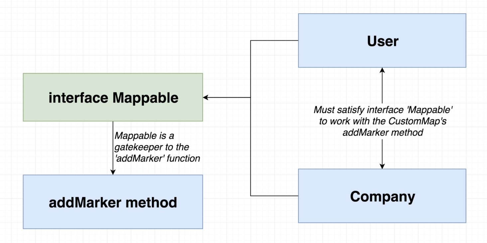

# INDEX

- [INDEX](#index)
  - [Create generic function interfaces](#create-generic-function-interfaces)

---

## Create generic function interfaces

- When creating interfaces for functions, Don't create a new interface for each function signature, instead use a generic interface
- This is done by making the function arguments types indicate the functionality needed for the argument, and not the exact type of the argument
  - Example: object argument should have a property called `id` of type `string`, instead of the argument being of type `User`

```ts
// GOOD ✅
interface Callable {
  id: string;
  name: string;
}

function call(callable: Callable) {
  console.log(`Calling ${callable.name} with id ${callable.id}`);
}

// ----------------------------------------------

// BAD ❌
interface CompanyUser {
  id: string;
  name: string;
  companyType: string;
  // ...
}

function callCompanyUser(companyUser: CompanyUser) {
  console.log(`Calling ${companyUser.name} with id ${companyUser.id}`);
}

// ----------------------------------------------

// Also BAD ❌
interface PersonalUser {
  id: string;
  name: string;
  age: number;
  // ...
}
interface CompanyUser {
  id: string;
  name: string;
  companyType: string;
  // ...
}

function call(callable: PersonalUser | CompanyUser) {
  console.log(`Calling ${callable.name} with id ${callable.id}`);
}
```

- Diagram example for `addMarker` function that takes an argument of type `Mappable` that has a `location` property of type `Location` and a `markerContent` property of type `string`
  

  ```ts
  interface Mappable {
    location: {
      lat: number;
      lng: number;
    };
  }

  function addMarker(mappable: Mappable): void {
    new google.maps.Marker({
      map: map,
      position: {
        lat: mappable.location.lat,
        lng: mappable.location.lng
      }
    });
  }

  const user = {
    name: 'John',
    location: {
      lat: 0,
      lng: 0
    }
  };

  addMarker(user); // ✅ because user has a location property that satisfies the Mappable interface
  ```

- So, Instead of making the function/method try to accommodate different types of arguments, make the argument types indicate the functionality needed for the argument (accommodate for the function needs)
- Note: You can also use `implements` to make a class satisfy an interface by asking Typescript to help us satisfy the interface

  ```ts
  class User implements Mappable {
    name: string;
    location: {
      lat: number;
      lng: number;
    };

    constructor() {
      this.name = 'John';
      this.location = {
        lat: 0,
        lng: 0
      };
    }
  }
  // Now User class satisfies the Mappable interface
  ```
