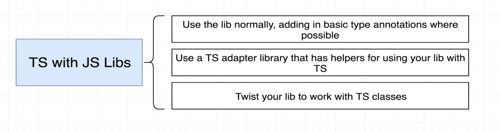
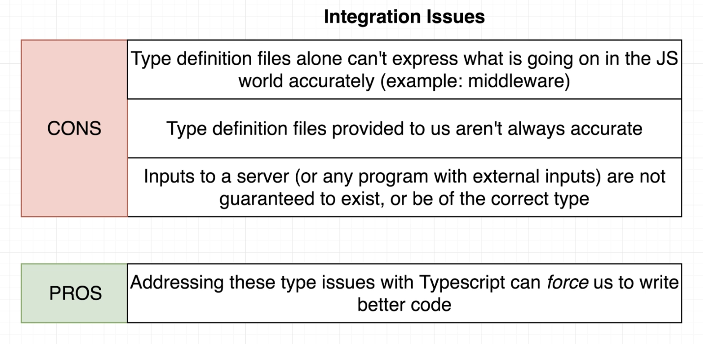
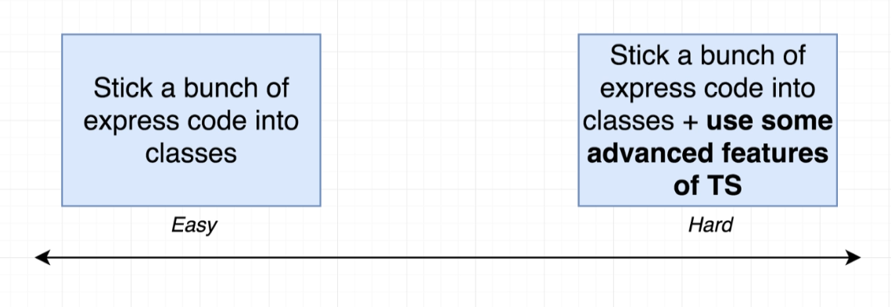
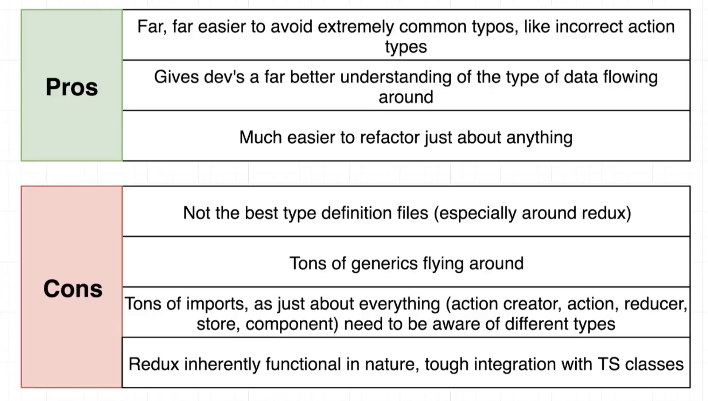

# INDEX

- [INDEX](#index)
  - [Installing \& Configuration](#installing--configuration)
    - [Installation](#installation)
    - [Compiling](#compiling)
      - [Compiling one TS file](#compiling-one-ts-file)
      - [Compiling entire project with all its files](#compiling-entire-project-with-all-its-files)
      - [Configuring the TS compiler (`tsconfig.json`)](#configuring-the-ts-compiler-tsconfigjson)
      - [Compiling using bundlers (webpack, parcel, rollup)](#compiling-using-bundlers-webpack-parcel-rollup)
    - [Type Declarations](#type-declarations)
  - [Bundling Typescript Project](#bundling-typescript-project)
    - [Node.js](#nodejs)
    - [Webpack](#webpack)
      - [For Development](#for-development)
        - [Source Maps](#source-maps)
      - [For Production](#for-production)
  - [Type Declaration Files](#type-declaration-files)
    - [Importing specific types from a library](#importing-specific-types-from-a-library)
  - [Using Typescript with JS Libraries and projects](#using-typescript-with-js-libraries-and-projects)
    - [TS with Express](#ts-with-express)
      - [Solution 1: Adding type annotation when needed in Express](#solution-1-adding-type-annotation-when-needed-in-express)
      - [Solution 3: Twist Express library to work with TS classes](#solution-3-twist-express-library-to-work-with-ts-classes)
    - [TS with React](#ts-with-react)

---

## Installing & Configuration

### Installation

- [reference](https://classroom.udacity.com/nanodegrees/nd0067-fwd-t3/parts/cd0292/modules/c0ad589b-67b3-4791-931f-9b0fa8ac0ed3/lessons/f92490de-12fb-4c61-a74a-3889a4727954/concepts/061049c2-7fdf-4d69-868b-e51c64c7ceef)

```bash
npm i typescript --save-dev  # save to devDependencies

npm i --save-dev ts-node  # to run typescript files directly without compiling them

npm i --save-dev @types/node  # type definitions
```

---

### Compiling

**Typescript doesn't run in the browser**. We only use the language in our code-editor for development. Typescript only exists for the benefit of the developer.

- **Compiler:** is a piece of software that converts Typescript to Javascript so that it runs in the browser

#### Compiling one TS file

- `tsc` -> **TypeScript Compiler** is the command used to compile `typescript` to `javascript`

- It's the way to run in using `node.js`

  ```sh
  tsc app.ts
  ```

  - It creates a new file called `app.js` that contains the compiled code

- in `html` file -> always use the `.js` file and not the `.ts` file

- `watch mode` : like live-server

  ```sh
  tsc app.ts --watch   # or --w
  # this will create a new file called app.js
  ```

---

#### Compiling entire project with all its files

- To use TypeScript, you need to add a script to your `package.json` file to `compile` TypeScript to JavaScript. This is generally called your "`build`" script

  - this command will `transpile` TypeScript to JavaScript

  ```json
  "scripts": {
      "build": "npx tsc"
    },
  ```

- Add the default TypeScript configuration file with the configurations for the project (how and where to compile the files) -> `tsconfig.json`

  ```sh
  npx tsc --init # this will create a `tsconfig.json` file with default configurations
  ```

- Run this command to compile the project

  ```bash
  tsc  # this will tell TS to convert all (.ts) files to (.js)
  # or
  tsc --watch
  # or using the "build" script above
  npm run build
  ```

---

#### Configuring the TS compiler (`tsconfig.json`)

- `tsconfig.json` -> This config file is also where you can tell TypeScript how strict it should be while checking your code and what to ignore. If you're moving a project to TypeScript, you can gracefully integrate TS by working with the settings in this config file.

- Helpful configurations to note for in `tsconfig.json`

  ```json
  {
    "compilerOptions": {
      "target": "es5", // which level of JS-support to target
      "module": "commonjs",
      "lib": ["ES2018", "DOM"],
      "outDir": "./build", // destination folder will have JS files
      "rootDir": "./src", // just include src folder that has TS files
      "strict": true,
      "noImplicitAny": true //  TypeScript will issue an error whenever it would have inferred (any)
    },
    "exclude": ["node_modules", "tests"]
  }
  ```

  - `target` - sets what version of JS TypeScript will be transpiled to (and include compatible library declarations).
  - `module` - sets what module system will be used when transpiling
    - specify what module code is generated when dealing with modules(multiple files with `import`/`export`)
    - best -> `"ES6"`
  - Node.js uses the common.js module system by default
  - `lib` - It's a set of bundled library-declaration files that describe the target runtime environment
    - Used to state what libraries your code is using. In this case, `ES2018` and the `DOM API`
  - `outDir` - where you want your src code to output to. Often named build, prod, or server (when using it server-side)
  - `strict` - enable strict type-checking options
  - `noImplicitAny` - disallow the "any" type (covered in TypeScript Basics)
  - specifying which file to compile:
    - `files`: list all files you want to compile to `js` or use (`include` & `exclude`)
    - `exclude`: files or directories to exclude in compiling
  - for `Debugging` --> use `"sourceMap": true`

- **Notes for configuration:**
  - `strictNullChecks` - When you enable this option, TypeScript will start to complain about variables that might be `null` or `undefined`.
    - it's common with `HTML` elements, more [here](./3-TS-DOM.md#dealing-with-null-non-null-assertion-operator)

---

#### Compiling using bundlers (webpack, parcel, rollup)

Here, the bundler will do the compiling for us using the script in the main HTML file

```html
<script src="src/app.ts"></script>

<!-- Will be compiled to -->

<script src="dist/bundle.js"></script>
```

- webpack -> is a bundler that can be used to compile TypeScript to JavaScript and use the javascript file in the `html` file instead of the `TS` file

  ```bash
  npm i --save-dev webpack webpack-cli webpack-dev-server typescript ts-loader

  npm run webpack-dev-server
  ```

- parcel

  ```bash
  npm i --save-dev parcel-bundler

  parcel index.html
  ```

---

### Type Declarations

They are special files that end with `.d.ts` instead of `.ts`

- in `.d.ts` files, we find no implementation details, no code that is ever going to be run as javascript (no output), Instead we find files that only contain type information declarations of types which Typescript can use for our code
- example for them is the types files for the libraries where all the type-declarations are
- it's useful when working with 3rd party libraries code

  - if a library doesn't have type-declaration files like `lodash`, we can install the corresponding `@types` package externally

    ```sh
    npm i --save-dev @types/lodash
    ```

    - the `@type` is from a github repo -> [DefinitelyTyped](https://github.com/DefinitelyTyped/DefinitelyTyped)

---

## Bundling Typescript Project

### Node.js

- install `ts-node` & `nodemon` & `concurrently` packages

  ```bash
  npm i --save-dev ts-node nodemon concurrently
  ```

- configure `tsconfig.json` file

  ```json
  {
    "compilerOptions": {
      // ...
      "outDir": "build", // destination folder will have JS files
      "rootDir": "src" // just include src folder that has TS file (index.ts file)
    }
  }
  ```

- in `package.json` add this script :

  ```json
  "scripts": {
    "start:build": "tsc -w", // to compile TS files
    "start:run": "nodemon build/index.js", // to run the compiled JS files
    "start": "concurrently npm:start:*" // concurrently run all the scripts that start with "start:"
    },
  ```

---

### Webpack

```bash
npm install webpack webpack-cli webpack-dev-server typescript ts-loader --save-dev
```

#### For Development

- in `package.json` add this script :

  ```json
  "scripts": {
    "start": "webpack-dev-server",
    "build": "webpack"
    },
  ```

- For `development` --> create `webpack.config.js` file that contains this :

  ```js
  const path = require('path');

  module.exports = {
    mode: 'development',
    entry: './src/app.ts',
    output: {
      filename: 'bundle.js',
      path: path.resolve(__dirname, 'dist'),
      publicPath: 'dist'
    },

    // this part is for Adding TypeScript Support with the ts-loader Package

    devtool: 'inline-source-map',
    module: {
      rules: [
        {
          test: /\.tsx?$/, // regular expression
          use: 'ts-loader',
          exclude: /node_modules/
        }
      ]
    },
    resolve: {
      extensions: ['.ts', '.tsx', '.js']
    }
  };
  ```

---

##### Source Maps

Source Maps take the minified bundle and map it backwards to its pre-built state so that we can see where the actual code is coming from that makes up the bundle, in case we want to debug it

Guide [here](https://webpack.js.org/guides/typescript/#source-maps)

---

#### For Production

- in `package.json` add this script :

  ```json
  "scripts": {
    "start": "webpack-dev-server",
    "build": "webpack --config webpack.config.prod.js"
    },
  ```

- install `clean-webpack-plugin` package to clean the `dist` folder whenever we **rebuild** the project

```bash
npm i --save-dev clean-webpack-plugin
```

- For `Production` --> create `webpack.config.prod.js` file that contains this :

  ```js
  const path = require('path');
  const CleanPlugin = require('clean-webpack-plugin');

  module.exports = {
    mode: 'production',
    entry: './src/app.ts',
    output: {
      filename: 'bundle.js',
      path: path.resolve(__dirname, 'dist')
    },
    devtool: 'none',
    module: {
      rules: [
        {
          test: /\.ts$/,
          use: 'ts-loader',
          exclude: /node_modules/
        }
      ]
    },
    resolve: {
      extensions: ['.ts', '.js']
    },
    plugins: [new CleanPlugin.CleanWebpackPlugin()]
  };
  ```

---

## Type Declaration Files

To be able to work with JS libraries in TS, we need to have a **"Type Declaration File"** for that library. This file will contain all the type information for the library, so that TypeScript can understand what the library is doing.

- It's like an adapter layer between Typescript code that we write and the JS library that we want to use
  

- Note that this is not required for all libraries, as some libraries already have type declaration files, and some don't need them at all.

  - If you see this error: `Cannot find module 'lodash' or its corresponding type declarations.` then you need to install the type declaration file for that library

- It tells the Typescript compiler about all the types that exist in the library (methods, properties, etc)
- Type definition files have the extension `.d.ts`
- if a library doesn't have type-declaration files like `lodash`, we can install the corresponding `@types` package externally

  ```sh
  npm i --save-dev @types/lodash
  ```

- the `@type` is from a github repo -> [DefinitelyTyped](https://github.com/DefinitelyTyped/DefinitelyTyped)

- **Notes:**

  - When using `node.js` with `typescript`, we might need to install the type declaration file for `node.js` itself, as it doesn't come with one by default, specially if we are importing node's core libraries like `fs` or `path`.

    ```sh
    npm i --save-dev @types/node
    ```

---

### Importing specific types from a library

- We can import specific types from a library instead of importing the whole library

  ```ts
  import axios, { AxiosResponse, AxiosPromise } from 'axios';

  const url = 'https://jsonplaceholder.typicode.com/todos/1';

  axios.get(url).then((response: AxiosResponse) => {
    // ...
  });

  function fetchTodos(): AxiosPromise {
    return axios.get(url);
  }
  ```

---

## Using Typescript with JS Libraries and projects

Typescript has a distinct **OOP** style, so it's not always easy to use it with JS libraries that are not written in OOP style

- **Example:** `Express` library is written in a functional style, so it's not easy to use it with Typescript

- **Solutions:**
  

  - Solution 2, depends on whether the library/framework has an adapter library/framework written already or not

    - For example `Express` has an adapter library called [ts-express-decorators](https://www.npmjs.com/package/ts-express-decorators) that we can use to use `Express` with `Typescript`
    - Another example is `React` which has an adapter library called [React TypeScript Cheatsheet](https://react-typescript-cheatsheet.netlify.app/docs/basic/setup) that we can use to use `React` with `Typescript`

  - Solution 3 is the hardest and most time consuming, but it's the best solution as it gives us the most control over the library/framework.

    - [TS with Express](#ts-with-express)
    - [TS with React](#ts-with-react)

- TS integration **(solution 3)** issues:
  

---

### TS with Express

- More here: [Express with Typescript](../../Backend/Node.js/5-Node-Typescript.md#express-with-typescript)

#### Solution 1: Adding type annotation when needed in Express

- Simple type annotation with the help of type declaration file

  ```ts
  import express, { Request, Response } from 'express';

  const app = express();

  app.get('/', (req: Request, res: Response) => {
    res.send('Hello World!');
  });
  ```

- The issue with integrating TS and express usually comes from using `Middlewares`

  - Because usually middlewares are implemented in javascript, and then Typescript won't be able to know the type of properties that might get (added / removed / modified) to/from the express library through the middlewares
  - Even sometimes the type definition files may have types because they're assuming that we're using specific middlewares, which may cause errors and problems if we didn't follow the assumption and didn't use these middlewares, for example:

    ```ts
    // The Request interface has a "body" type with type "any" in the declaration file, even though it won't have the "body" property if we didn't use the "bodyparser" middleware

    app.use(bodyParser.urlencoded({ extended: true }));
    // ...
    app.post('/', (req: Request, res: Response) => {
      const { email, password } = req.body; // HERE

      res.send(email + password);
    });
    ```

- The issue with that the type definition isn't always accurate also in this example:

  ```ts
  // The Request interface has a "body" type with type "any" in the declaration file, So, we won't be able to check if the "body" object contains the correct properties or not (email, password)

  app.post('/', (req: Request, res: Response) => {
    const { email, password } = req.body; // HERE
    // TS gives no error, even if the "body" object doesn't contain the "email" or "password" properties, or contains them in different keys like ("mail", "pass")

    res.send(email.toLowerCase()); // Assuming that "email" is a string, TS won't give an error if it's not a string
  });
  ```

  - A bad solution to this problem is to modify the type declaration file to make the type of the "body" property to be an object with the correct properties, but this is a bad solution because we're modifying the type declaration file which is a 3rd party file, and we shouldn't modify it ❌
  - A better solution is to create custom types that extend the original types from the type declaration file, and then use these custom types instead of the original types

    ```ts
    // Create a custom type that extends the original type from the type declaration file
    interface RequestWithBody extends Request {
      body: { [key: string]: string | undefined }; // { email: string, password: string }
    }

    // Use the custom type instead of the original type
    app.post('/', (req: RequestWithBody, res: Response) => {
      const { email, password } = req.body; // HERE
      // TS gives an error if the "body" object doesn't contain the "email" or "password" properties, or contains them in different keys like ("mail", "pass")

      res.send(email.toLowerCase()); // TS gives an error if "email" is not a string

      // OR use a type guard to check if the "body" object contains the correct properties or not
      if (email) {
        res.send(email.toLowerCase());
      } else {
        res.send('Email is required');
      }
    });
    ```

- Note:

  - Some middlewares type declaration files might be written in a good way that doesn't cause any problems, like the `cookie-session` middleware, as it actually extends the `Request` interface and adds the `session` property and other properties to it, so we don't need to create a custom type for it

    ```ts
    // cookie-session type declaration file
    declare namespace Express {
      interface Request extends CookieSessionInterfaces.CookieSessionRequest {}
    }
    // ...
    declare namespace CookieSessionInterfaces {
      interface CookieSessionRequest {
        session?: any;
        [propertyName: string]: any; // out of the box
      }
    }
    ```

---

#### Solution 3: Twist Express library to work with TS classes

Here, we want to make express (which is mostly written in a functional way) to work with classes (which is the OOP way that TS uses)

- 2 ways:
  

  - The easy way just adds an outer layer of code that uses express in a functional way, and then we use this outer layer in our classes

    ```ts
    class Server {
      private app: express.Application;

      constructor() {
        this.app = express();
        this.app.use(bodyParser.urlencoded({ extended: true }));
        this.app.use(router);
      }
      // ...
      start(): void {
        this.app.listen(3000, () => {
          console.log('Listening on port 3000');
        });
      }
    }
    ```

    - This is not recommended because we're adding an extra layer of code that we don't need, and will make the developer experience worse

  - The hard way is to modify the express library itself to work with classes, and then we use the modified express library in our classes
    - This is the best solution, but it's hard and time consuming, and we need to be very familiar with the express library code
    - If done correctly it will significantly enhance the developer experience and make it easier to work with express
    - It usually involves using [Decorators](./1-TypeScript.md#decorators) to modify the express library code

---

### TS with React



- More here: [Typescript with React](../../Frontend/Frameworks/React/10-React-Typescript.md)
