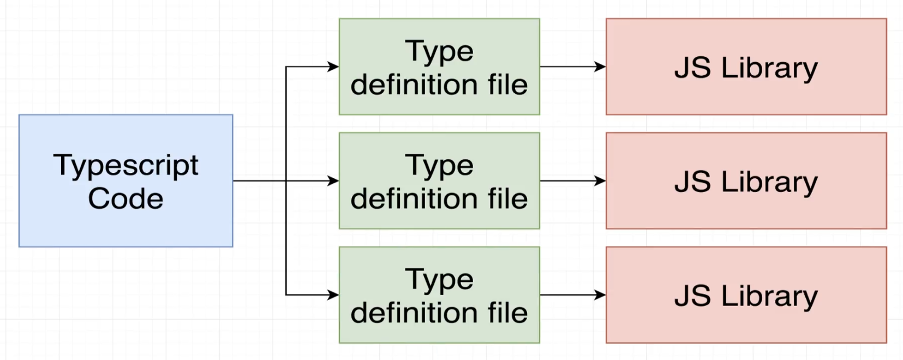

# INDEX

- [INDEX](#index)
  - [Bundling Typescript Project](#bundling-typescript-project)
    - [Node.js](#nodejs)
    - [Webpack](#webpack)
      - [For Development](#for-development)
        - [Source Maps](#source-maps)
      - [For Production](#for-production)
  - [Using JS libraries with TypeScript (Type Declaration Files)](#using-js-libraries-with-typescript-type-declaration-files)

---

## Bundling Typescript Project

### Node.js

- install `ts-node` & `nodemon` & `concurrently` packages

  ```bash
  npm i --save-dev ts-node nodemon concurrently
  ```

- configure `tsconfig.json` file

  ```json
  {
    "compilerOptions": {
      // ...
      "outDir": "build", // destination folder will have JS files
      "rootDir": "src" // just include src folder that has TS file (index.ts file)
    }
  }
  ```

- in `package.json` add this script :

  ```json
  "scripts": {
    "start:build": "tsc -w", // to compile TS files
    "start:run": "nodemon build/index.js", // to run the compiled JS files
    "start": "concurrently npm:start:*" // concurrently run all the scripts that start with "start:"
    },
  ```

---

### Webpack

```bash
npm install webpack webpack-cli webpack-dev-server typescript ts-loader --save-dev
```

#### For Development

- in `package.json` add this script :

  ```json
  "scripts": {
    "start": "webpack-dev-server",
    "build": "webpack"
    },
  ```

- For `development` --> create `webpack.config.js` file that contains this :

  ```js
  const path = require('path');

  module.exports = {
    mode: 'development',
    entry: './src/app.ts',
    output: {
      filename: 'bundle.js',
      path: path.resolve(__dirname, 'dist'),
      publicPath: 'dist'
    },

    // this part is for Adding TypeScript Support with the ts-loader Package

    devtool: 'inline-source-map',
    module: {
      rules: [
        {
          test: /\.tsx?$/, // regular expression
          use: 'ts-loader',
          exclude: /node_modules/
        }
      ]
    },
    resolve: {
      extensions: ['.ts', '.tsx', '.js']
    }
  };
  ```

---

##### Source Maps

Source Maps take the minified bundle and map it backwards to its pre-built state so that we can see where the actual code is coming from that makes up the bundle, in case we want to debug it

Guide [here](https://webpack.js.org/guides/typescript/#source-maps)

---

#### For Production

- in `package.json` add this script :

  ```json
  "scripts": {
    "start": "webpack-dev-server",
    "build": "webpack --config webpack.config.prod.js"
    },
  ```

- install `clean-webpack-plugin` package to clean the `dist` folder whenever we **rebuild** the project

```bash
npm i --save-dev clean-webpack-plugin
```

- For `Production` --> create `webpack.config.prod.js` file that contains this :

  ```js
  const path = require('path');
  const CleanPlugin = require('clean-webpack-plugin');

  module.exports = {
    mode: 'production',
    entry: './src/app.ts',
    output: {
      filename: 'bundle.js',
      path: path.resolve(__dirname, 'dist')
    },
    devtool: 'none',
    module: {
      rules: [
        {
          test: /\.ts$/,
          use: 'ts-loader',
          exclude: /node_modules/
        }
      ]
    },
    resolve: {
      extensions: ['.ts', '.js']
    },
    plugins: [new CleanPlugin.CleanWebpackPlugin()]
  };
  ```

---

## Using JS libraries with TypeScript (Type Declaration Files)

To be able to work with JS libraries in TS, we need to have a **"Type Declaration File"** for that library. This file will contain all the type information for the library, so that TypeScript can understand what the library is doing.

- It's like an adapter layer between Typescript code that we write and the JS library that we want to use
  

- Note that this is not required for all libraries, as some libraries already have type declaration files, and some don't need them at all.

  - If you see this error: `Cannot find module 'lodash' or its corresponding type declarations.` then you need to install the type declaration file for that library

- It tells the Typescript compiler about all the types that exist in the library (methods, properties, etc)
- Type definition files have the extension `.d.ts`
- if a library doesn't have type-declaration files like `lodash`, we can install the corresponding `@types` package externally

  ```sh
  npm i --save-dev @types/lodash
  ```

- the `@type` is from a github repo -> [DefinitelyTyped](https://github.com/DefinitelyTyped/DefinitelyTyped)

- **Notes:**

  - When using `node.js` with `typescript`, we might need to install the type declaration file for `node.js` itself, as it doesn't come with one by default, specially if we are importing node's core libraries like `fs` or `path`.

    ```sh
    npm i --save-dev @types/node
    ```
