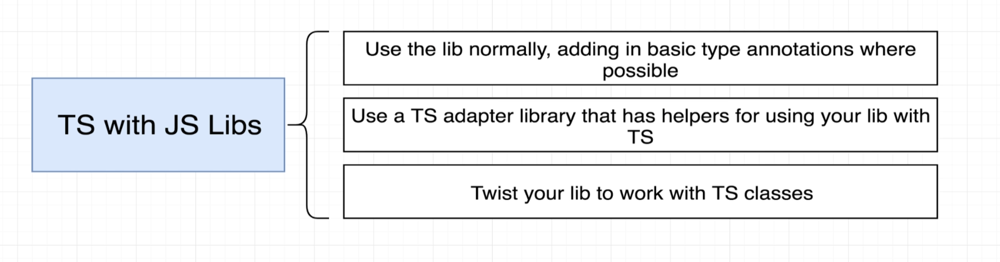
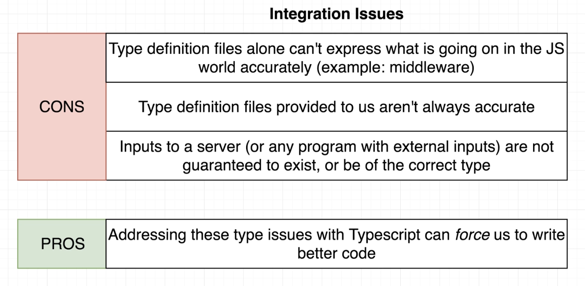

# INDEX

- [INDEX](#index)
  - [Installing \& Configuration](#installing--configuration)
    - [Installation](#installation)
    - [Compiling](#compiling)
      - [Compiling one TS file](#compiling-one-ts-file)
      - [Compiling entire project with all its files](#compiling-entire-project-with-all-its-files)
      - [Configuring the TS compiler (`tsconfig.json`)](#configuring-the-ts-compiler-tsconfigjson)
      - [Compiling using bundlers (webpack, parcel, rollup)](#compiling-using-bundlers-webpack-parcel-rollup)
    - [Type Declarations](#type-declarations)
  - [Bundling Typescript Project](#bundling-typescript-project)
    - [Node.js](#nodejs)
    - [Webpack](#webpack)
      - [For Development](#for-development)
        - [Source Maps](#source-maps)
      - [For Production](#for-production)
  - [Using Typescript with JS Libraries and projects](#using-typescript-with-js-libraries-and-projects)
    - [Type Declaration Files](#type-declaration-files)
      - [Importing specific types from a library](#importing-specific-types-from-a-library)
    - [TS with Express](#ts-with-express)
    - [TS with Webpack](#ts-with-webpack)
    - [TS with React](#ts-with-react)

---

## Installing & Configuration

### Installation

- [reference](https://classroom.udacity.com/nanodegrees/nd0067-fwd-t3/parts/cd0292/modules/c0ad589b-67b3-4791-931f-9b0fa8ac0ed3/lessons/f92490de-12fb-4c61-a74a-3889a4727954/concepts/061049c2-7fdf-4d69-868b-e51c64c7ceef)

```bash
npm i typescript --save-dev  # save to devDependencies

npm i --save-dev ts-node  # to run typescript files directly without compiling them

npm i --save-dev @types/node  # type definitions
```

---

### Compiling

**Typescript doesn't run in the browser**. We only use the language in our code-editor for development. Typescript only exists for the benefit of the developer.

- **Compiler:** is a piece of software that converts Typescript to Javascript so that it runs in the browser

#### Compiling one TS file

- `tsc` -> **TypeScript Compiler** is the command used to compile `typescript` to `javascript`

- It's the way to run in using `node.js`

  ```sh
  tsc app.ts
  ```

  - It creates a new file called `app.js` that contains the compiled code

- in `html` file -> always use the `.js` file and not the `.ts` file

- `watch mode` : like live-server

  ```sh
  tsc app.ts --watch   # or --w
  # this will create a new file called app.js
  ```

---

#### Compiling entire project with all its files

Usually, we don't compile one file at a time, we compile the entire project, so we need to set up the project to compile all the files at once

- **Steps**

  1. Add a script to your `package.json` file to `compile` TypeScript to JavaScript. This is generally called your "`build`" script

     ```json
     "scripts": {
         "build": "npx tsc" // transpile TypeScript to JavaScript
         // or "build": "yarn tsc" if you have yarn installed
       },
     ```

  2. Add the default TypeScript configuration file with the configurations for the project (how and where to compile the files) -> `tsconfig.json`

     ```sh
     npx tsc --init # this will create a `tsconfig.json` file with default configurations
     ```

     - the created `tsconfig.json` file will have the default configurations for the project -> [more here](#configuring-the-ts-compiler-tsconfigjson)

  3. Run this command to compile the project

     ```sh
     tsc  # this will tell TS to convert all (.ts) files to (.js)
     # or
     tsc --watch
     # or using the "build" script above
     npm run build
     ```

---

#### Configuring the TS compiler (`tsconfig.json`)

- `tsconfig.json` -> This config file is also where you can tell TypeScript how strict it should be while checking your code and what to ignore. If you're moving a project to TypeScript, you can gracefully integrate TS by working with the settings in this config file.

- Helpful configurations to note for in `tsconfig.json`

  ```json
  {
    "compilerOptions": {
      "target": "es5", // which level of JS-support to target
      "module": "commonjs",
      "lib": ["ES2018", "DOM"],
      "outDir": "./build", // destination folder will have JS files
      "rootDir": "./src", // just include src folder that has TS files
      "strict": true,
      "noImplicitAny": true //  TypeScript will issue an error whenever it would have inferred (any)
    },
    "exclude": [
      "node_modules", // Default exclude node_modules folder
      "**/*.spec.ts" // exclude all test files
    ]
  }
  ```

  - `target`
    - sets what version of JS TypeScript will be transpiled to (and include compatible library declarations).
  - `module`
    - sets what **module-file-system** will be used when transpiling
    - specify what module code is generated when dealing with modules(multiple files with `import`/`export`)
    - best -> `"ES6"`
    - Node.js uses the `common.js` module system by default
  - `lib`
    - It's a set of bundled library-declaration files that describe the target runtime environment
    - By default it's commented out, and uses the default libraries that come with the TypeScript compiler (like `DOM`, `ES5`, `ES6`, `...`)
    - Used to state what libraries your code is using. In this case, `ES2018` and the `DOM API`
      - It's why typescript doesn't complain when using `document` or `window` objects (`document.getElementById()`, `window.addEventListener()`)
  - `rootDir`
    - where your code is located that will be compiled (usually named `src`)
  - `outDir`
    - where you want your code to output to. Often named `build`, `dist`, `prod`, or `server` (when using it server-side)
  - `strict`
    - enable strict type-checking options, for example:
      - making sure that you're not using a variable before it's defined
  - `noImplicitAny`
    - disallow the "any" type (covered in TypeScript Basics)
  - specifying which file to compile:
    - `files`: list all files you want to compile to `js` or use (`include` & `exclude`)
    - `include`: files or directories to include in compiling **(Note that if you use `include`, you have to include all the files you want to compile)** -> so it's not usually used
    - `exclude`: files or directories to exclude in compiling
  - `sourceMap`

    - generate corresponding `.map` files for debugging
    - it's useful for **debugging**, as it allows you to see the original TypeScript code in the browser's developer tools
      
    - Note that source maps are only loaded if developer tools are opened. If you load a page without dev tools opened, there is no http request for source maps. **So, it doesn't affect the performance of the page.**

    - it's not needed in production, so it's usually turned off
    - for `Production` --> use `"sourceMap": false`

  - `types`
    - specify which type declaration files to include in the compilation
    - it's useful when using 3rd party libraries that you don't want to include all the type declaration files in your application (it will make the application larger), ex: `jest` might not be needed in production
  - `declaration`
    - generate corresponding `.d.ts` files for debugging
    - it's useful when you want to use the compiled code in another project, as it allows you to see the types of the variables and functions in the compiled code
  - `composite`
    - enable project references, which **allows you to use multiple `tsconfig.json` files in your project**
    - it's useful when you want to split your project into multiple parts, each with its own `tsconfig.json` file

- **Notes for configuration:**
  - `strictNullChecks`
    - When you enable this option, TypeScript will start to complain about variables that might be `null` or `undefined`.
    - it's common with `HTML` elements, more [here](./3-TS-DOM.md#dealing-with-null-non-null-assertion-operator)

---

#### Compiling using bundlers (webpack, parcel, rollup)

Here, the bundler will do the compiling for us using the script in the main HTML file

```html
<script src="src/app.ts"></script>

<!-- Will be compiled to -->

<script src="dist/bundle.js"></script>
```

- webpack -> is a bundler that can be used to compile TypeScript to JavaScript and use the javascript file in the `html` file instead of the `TS` file

  ```bash
  npm i --save-dev webpack webpack-cli webpack-dev-server typescript ts-loader

  npm run webpack-dev-server
  ```

- parcel

  ```bash
  npm i --save-dev parcel-bundler

  parcel index.html
  ```

---

### Type Declarations

They are special files that end with `.d.ts` instead of `.ts`

- in `.d.ts` files, we find no implementation details, no code that is ever going to be run as javascript (no output), Instead we find files that only contain type information declarations of types which Typescript can use for our code
- example for them is the types files for the libraries where all the type-declarations are
- it's useful when working with 3rd party libraries code

  - if a library doesn't have type-declaration files like `lodash`, we can install the corresponding `@types` package externally

    ```sh
    npm i --save-dev @types/lodash
    ```

    - the `@type` is from a github repo -> [DefinitelyTyped](https://github.com/DefinitelyTyped/DefinitelyTyped)

---

## Bundling Typescript Project

### Node.js

- install `ts-node` & `nodemon` & `concurrently` packages

  ```bash
  npm i --save-dev ts-node nodemon concurrently
  ```

- configure `tsconfig.json` file

  ```json
  {
    "compilerOptions": {
      // ...
      "outDir": "build", // destination folder will have JS files
      "rootDir": "src" // just include src folder that has TS file (index.ts file)
    }
  }
  ```

- in `package.json` add this script :

  ```json
  "scripts": {
    "start:build": "tsc -w", // to compile TS files
    "start:run": "nodemon build/index.js", // to run the compiled JS files
    "start": "concurrently npm:start:*" // concurrently run all the scripts that start with "start:"
    },
  ```

---

### Webpack

```bash
npm install webpack webpack-cli webpack-dev-server typescript ts-loader --save-dev
```

#### For Development

- in `package.json` add this script :

  ```json
  "scripts": {
    "start": "webpack-dev-server",
    "build": "webpack"
    },
  ```

- For `development` --> create `webpack.config.js` file that contains this :

  ```js
  const path = require('path');

  module.exports = {
    mode: 'development',
    entry: './src/app.ts',
    output: {
      filename: 'bundle.js',
      path: path.resolve(__dirname, 'dist'),
      publicPath: 'dist'
    },

    // this part is for Adding TypeScript Support with the ts-loader Package

    devtool: 'inline-source-map',
    module: {
      rules: [
        {
          test: /\.tsx?$/, // regular expression
          use: 'ts-loader',
          exclude: /node_modules/
        }
      ]
    },
    resolve: {
      extensions: ['.ts', '.tsx', '.js']
    }
  };
  ```

---

##### Source Maps

Source Maps take the minified bundle and map it backwards to its pre-built state so that we can see where the actual code is coming from that makes up the bundle, in case we want to debug it

Guide [here](https://webpack.js.org/guides/typescript/#source-maps)

---

#### For Production

- in `package.json` add this script :

  ```json
  "scripts": {
    "start": "webpack-dev-server",
    "build": "webpack --config webpack.config.prod.js"
    },
  ```

- install `clean-webpack-plugin` package to clean the `dist` folder whenever we **rebuild** the project

```bash
npm i --save-dev clean-webpack-plugin
```

- For `Production` --> create `webpack.config.prod.js` file that contains this :

  ```js
  const path = require('path');
  const CleanPlugin = require('clean-webpack-plugin');

  module.exports = {
    mode: 'production',
    entry: './src/app.ts',
    output: {
      filename: 'bundle.js',
      path: path.resolve(__dirname, 'dist')
    },
    devtool: 'none',
    module: {
      rules: [
        {
          test: /\.ts$/,
          use: 'ts-loader',
          exclude: /node_modules/
        }
      ]
    },
    resolve: {
      extensions: ['.ts', '.js']
    },
    plugins: [new CleanPlugin.CleanWebpackPlugin()]
  };
  ```

---

## Using Typescript with JS Libraries and projects

Typescript has a distinct **OOP** style, so it's not always easy to use it with JS libraries that are not written in OOP style

- **Example:** `Express` library is written in a functional style, so it's not easy to use it with Typescript

- **Solutions:**
  

  - Solution 1 is the easiest and fastest solution, but it's not the best solution as it doesn't give us the most control over the library/framework.

    - We just add type annotations when needed in the code, and then we use the library/framework as it is

  - Solution 2, depends on whether the library/framework has an adapter library/framework written already or not

    - For example `Express` has an adapter library called [ts-express-decorators](https://www.npmjs.com/package/ts-express-decorators) that we can use to use `Express` with `Typescript`
    - Another example is `React` which has an adapter library called [React TypeScript Cheatsheet](https://react-typescript-cheatsheet.netlify.app/docs/basic/setup) that we can use to use `React` with `Typescript`

  - Solution 3 is the hardest and most time consuming, but it's the best solution as it gives us the most control over the library/framework.

    - [TS with Express](#ts-with-express)
    - [TS with React](#ts-with-react)

- TS integration **(solution 3)** issues:
  

---

### Type Declaration Files

> They're a way to tell Typescript about the types of a library that is written in JavaScript, so that Typescript can understand it and give us type checking and autocompletion for that library.

To be able to work with JS libraries in TS, we need to have a **"Type Declaration File"** for that library. This file will contain all the type information for the library, so that TypeScript can understand what the library is doing.

- It's like an adapter layer between Typescript code that we write and the JS library that we want to use
  

- Note that this is not required for all libraries, as some libraries already have type declaration files, and some don't need them at all.

  - Example of a library that supports type declaration files is `axios`. (here's example of its files in `node_modules` folder)

    

  - If you see this error: `Cannot find module 'lodash' or its corresponding type declarations.` then you need to install the type declaration file for that library

- It tells the Typescript compiler about all the types that exist in the library (methods, properties, etc)
- Type definition files have the extension `.d.ts`
- if a library doesn't have type-declaration files like `lodash`, we can install the corresponding `@types` package externally

  ```sh
  npm i --save-dev @types/lodash
  ```

- the `@type` is from a github repo -> [DefinitelyTyped](https://github.com/DefinitelyTyped/DefinitelyTyped)

  - It's a community-driven project that provides type definitions for popular JavaScript libraries that don't have their own type definitions.

- **Notes:**

  - When using `node.js` with `typescript`, we might need to install the type declaration file for `node.js` itself, as it doesn't come with one by default, specially if we are importing node's core libraries like `fs` or `path`.

    ```sh
    npm i --save-dev @types/node
    ```

  - Modern versions of `yarn` uses a plugin called `@yarnpkg/plugin-typescript` that automatically installs the type declaration files for the libraries that we install, so we don't need to install them manually.

    ```sh
    # when you run:
    yarn add eslint # for example
    # it will automatically install the type declaration file for eslint
    ```

    ```json
    // package.json 📄
    {
      "devDependencies": {
        // You will find this added:
        "@types/eslint": "^8",
        "eslint": "^8"
        // ...
      }
    }
    ```

---

#### Importing specific types from a library

- We can import specific types from a library instead of importing the whole library

  ```ts
  import axios, { AxiosResponse, AxiosPromise } from 'axios';

  const url = 'https://jsonplaceholder.typicode.com/todos/1';

  axios.get(url).then((response: AxiosResponse) => {
    // ...
  });

  function fetchTodos(): AxiosPromise {
    return axios.get(url);
  }
  ```

---

### TS with Express

[TS with Express](../../Backend/Node.js/5-Node-Typescript.md#ts-with-express)

---

### TS with Webpack

When using `webpack` with `typescript`, we need to install the `ts-loader` package to be able to use typescript with webpack

```bash
npm i --save-dev ts-loader
```

> It's a package that tells webpack how to handle typescript files and how to compile them to javascript

- Then we need to add the `ts-loader` to the `webpack.config.js` file

```js
// webpack.config.js 📄

module.exports = {
  // 1. Set the entry and output points for the project
  entry: './src/app.ts',
  output: {
    filename: 'bundle.js',
    path: path.resolve(__dirname, 'dist') // output folder for the compiled files
  },
  // 2. Add rules for the module to handle typescript files using ts-loader
  module: {
    rules: [
      {
        test: /\.tsx?$/, // regular expression
        use: 'ts-loader',
        exclude: /node_modules/
      } // ts-loader will handle all the .ts and .tsx files
    ]
  },
  // 3. Add the resolve property to tell webpack which file extensions to resolve
  resolve: {
    extensions: ['.ts', '.tsx', '.js']
  }
};
```

---

### TS with React


- More here: [Typescript with React](../../Frontend/Frameworks/React/10-React-Typescript.md)
