## INDEX

- [INDEX](#index)
- [Git](#git)
  - [advantages of distributed version control](#advantages-of-distributed-version-control)
- [Diff](#diff)
- [commit message](#commit-message)
  - [Writing a commit message guidelines](#writing-a-commit-message-guidelines)
  - [Hash values (SHA-1)](#hash-values-sha-1)
  - [The HEAD pointer](#the-head-pointer)
- [Branches](#branches)
  - [commands](#commands)
  - [Git stash](#git-stash)
  - [Recommended stash commands:](#recommended-stash-commands)
  - [Merging](#merging)
    - [Fast Forward Merge](#fast-forward-merge)
    - [Types](#types)
  - [notes](#notes)
- [Git rebase](#git-rebase)
  - [Merge vs Rebase](#merge-vs-rebase)
  - [Interactive Rebase : Squash Commits](#interactive-rebase--squash-commits)
  - [Force Pushing](#force-pushing)
- [Git Three Trees (Git workflow)](#git-three-trees-git-workflow)
- [Git commands Notes](#git-commands-notes)
- [Modifying commits](#modifying-commits)
  - [Amend: Changing The Last Commit](#amend-changing-the-last-commit)
  - [Undo changes](#undo-changes)
    - [Going to any previous commit (Time Traveling)](#going-to-any-previous-commit-time-traveling)
    - [Undo change in working directory](#undo-change-in-working-directory)
  - [Resetting Commits](#resetting-commits)
    - [removing commits](#removing-commits)
  - [Reverting A Commit](#reverting-a-commit)
  - [Deleting Data Summary](#deleting-data-summary)
- [Git add](#git-add)
- [Git Tag](#git-tag)
- [Ignore files](#ignore-files)
  - [How to Ignore empty directories](#how-to-ignore-empty-directories)
- [Push](#push)
  - [Pushing code explicitly](#pushing-code-explicitly)

---

## Git

Git is software that keeps track of changes that you make to files and directories. And it's especially good at keeping track of text changes.

- Git is referred to as a version control system or **VCS**
- they're also called source code management tools or **SCM**
- Git is **distributed version control**. Different users each maintain their own repositories instead of working from a central repository, and the changes are stored as sets or patches, and we're focused on tracking `changes`, not the versions of the documents.
- Git does not use **small** tracking files throughout a repository -- everything is contained within the .git directory in the top-level directory of the repository.
- Git does not use small tracking files throughout a repository -- everything is contained within the .git directory in the top-level directory of the repository.

### advantages of distributed version control

- no need to communicate with a central server
- faster
- no network access required
- no single failure point as (Everyone can keep working. They've each got their own repository)

---

## Diff

> **git diff**: lists all the changes in the working directory that are not staged

- `git diff HEAD` compares the changes in the (working directory & staged area) to the last commit
- `git diff --staged` compares the changes in the staged files to the committed versions.

---

## commit message

**commit** is a snapshot or checkpoint in your local repo

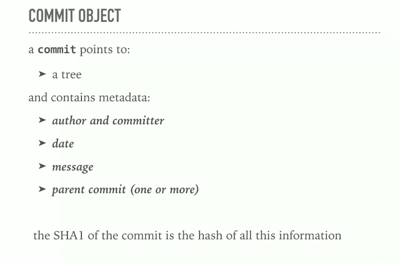
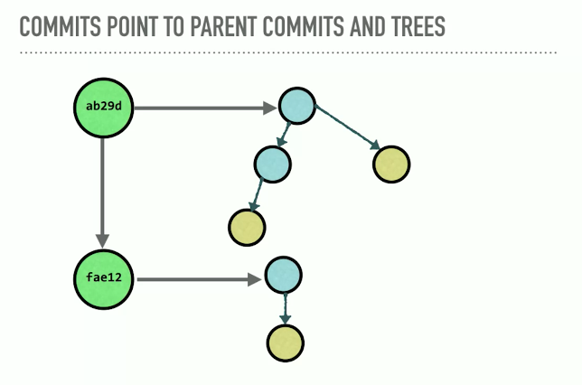

### Writing a commit message guidelines

- write a short single line summary of what the changes are (less than 50 characters).
- optionally followed by a blank line and a more complete description
- keep each line to less than 72 characters
- write your commit messages in present tense, not past tense, as the commit message is meant to label the changes. It's a label for what's inside.
- clear and descriptive (explain what it does not why/how)
- develop shorthand for your organization ex `"[css,js]"`, `"bugfix"`,`"#38405"` as issue number

### Hash values (SHA-1)

- it's an ID number for each commit to reach each commit
- Each hash value is not only unique, it's directly tied to the **contents** that are inside of it.
  - that's why it's called **content addressable source system**
- The algorithm that Git uses is the **SHA-1 hash** algorithm.
- why can't we change commits?
  - because changing the data about the commit will have a new **SHA1 hash**
  - and even if the files don't change, the created date will

### The HEAD pointer

**It's a pointer to the latest commit on the Branch**


> It's the place where we left off in our repository with what we've committed.

- The main difference between the **hat**`^` and the **tilda**`~` is when a commit is created from a merge. A merge commit has two parents. With a merge commit, the `^` reference is used to indicate the first parent of the commit while `^2` indicates the second parent. The first parent is the branch you were on when you ran git merge while the second parent is the branch that was merged in.


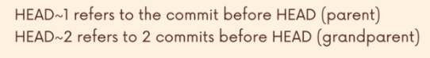

---

## Branches

A branch is a pin pointed arrow to a commit. When you first create a repository, the default branch you will commit too is the master branch.After you make commits, they will point forward on to the last commit you made on that master branch.


### commands

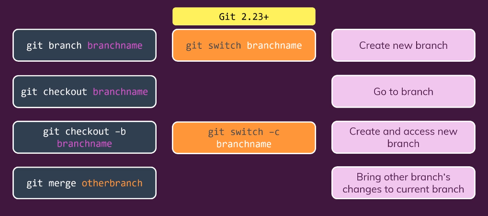

- list available branches

  ```bash
    git branch
    # HEAD indicates wht branch is active
  ```

- Leaving the Master Branch

  ```bash
  # create a new branch called : "nathan"
  git branch nathan

  # Switched to the branch "nathan"
  git checkout nathan
  git switch nathan

  # or in one line
  git checkout -b nathan # create a branch and switch to it all in one command
  git switch -c nathan # create a branch and switch to it all in one command
  ```

- Go to previous branch

  ```bash
  git checkout -
  ```

---

### Git stash


**Why ?**

- when you are on a branch and do some new work, but don't make any commits, then you want to switch back to another branch:
  - The changes come with you to the destination branch, or git won't let you switch before committing first

**git stash** temporarily shelves (or stashes) changes you've made to your working copy so you can work on something else, and then come back and re-apply them later on.

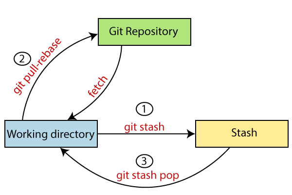
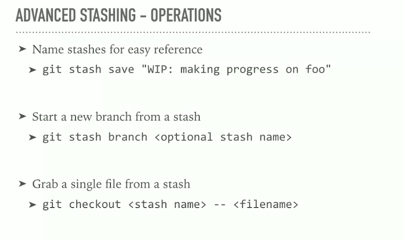
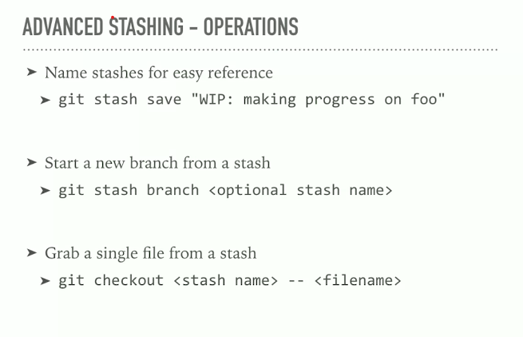
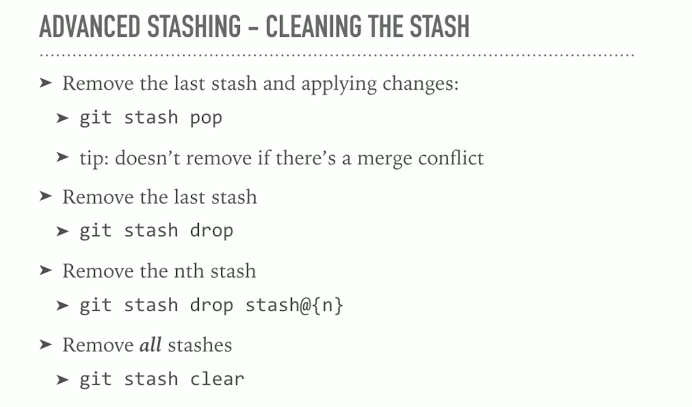

---

### Recommended stash commands:

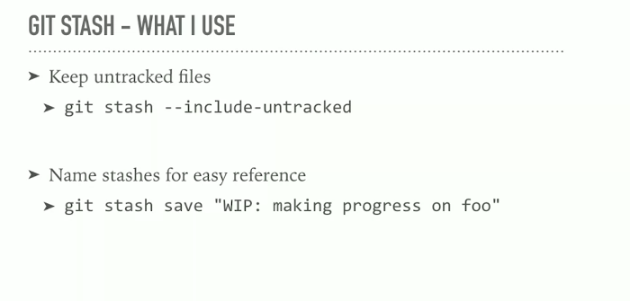

---

### Merging

**Merge commits** are unique against other commits in the fact that they **have two parent commits**.

- When creating a merge commit Git will attempt to auto magically merge the separate histories for you.
- If Git encounters a piece of data that is changed in both histories it will be unable to automatically combine them.
  - This scenario is a version control conflict and Git will need user intervention to continue.

---

#### Fast Forward Merge

A fast-forward merge can occur when there is a linear path from the current branch tip to the target branch. (didn't do changes(commits) in **master** until merging)

- in this case there won't be a **merge-commit** in the **log**

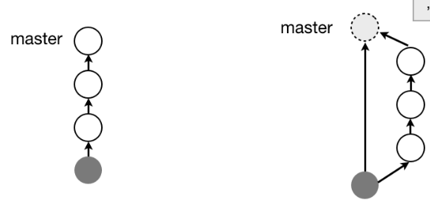

> sometimes you want to prevent this in order to know what branch(feature) caused a bug
> 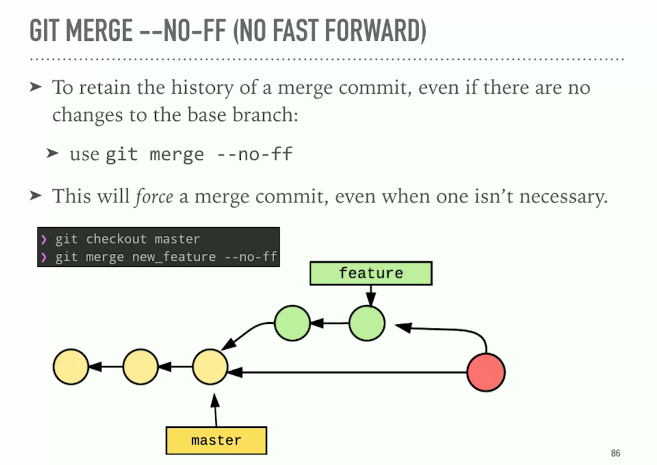

---

#### Types

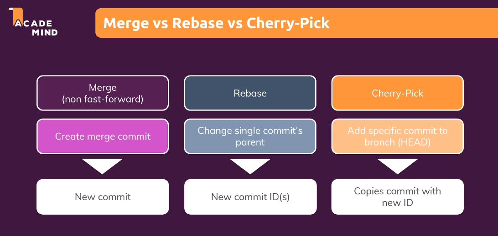


- Once you have committed the changes and pushed to your branch, you can checkout to the master and `merge`.
- making a merge makes a commit.
- The main difference between the `^` and the `~` is when a commit is created from a merge. A merge commit has two parents. With a merge commit, the `^` reference is used to indicate the first parent of the commit while `^2` indicates the second parent. The first parent is the branch you were on when you ran git merge while the second parent is the branch that was merged in.

```bash
git checkout master
# Switched to branch 'master'
# then :
git merge "nathan"
```

**merge conflict** -> occurs when Git isn't sure which line(s) you want to use from the branches that are being merged.

- Create Git Branch At commit Location

  ```bash
  git branch nathan 42a69f
  # create the nathan branch and have it point to the commit with SHA 42a69f
  ```

- Delete A Branch

  ```bash
  git branch -d nathan
  ```

- See All Branches At Once **Graphically**

  ```bash
  git log --oneline --decorate --graph --all
  ```

  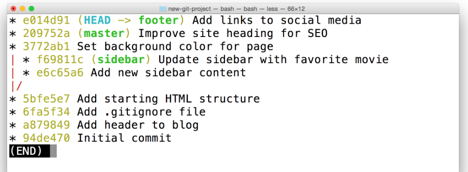

### notes

- You can't delete a branch that you are currently on, so you have to switch to another branch first.

---

## Git rebase

> **Rebasing**: it's used in 2 ways:
>
> - as an alternative to merging
> - as a cleanup too
>
> It's like we're **rewriting history** or **changing the base of the branch** and having more **linear structure** > 

- The problem:
  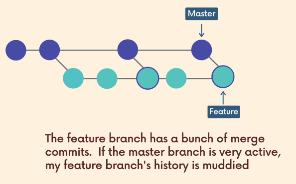
  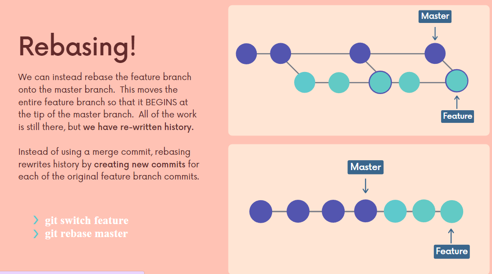

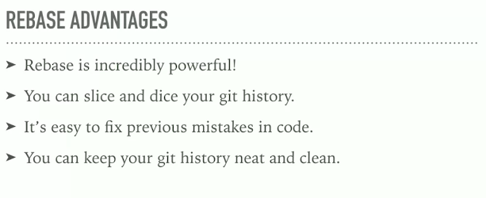
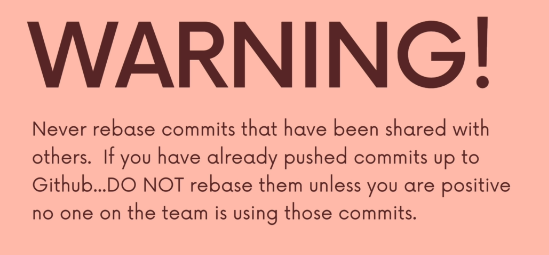

---

### Merge vs Rebase

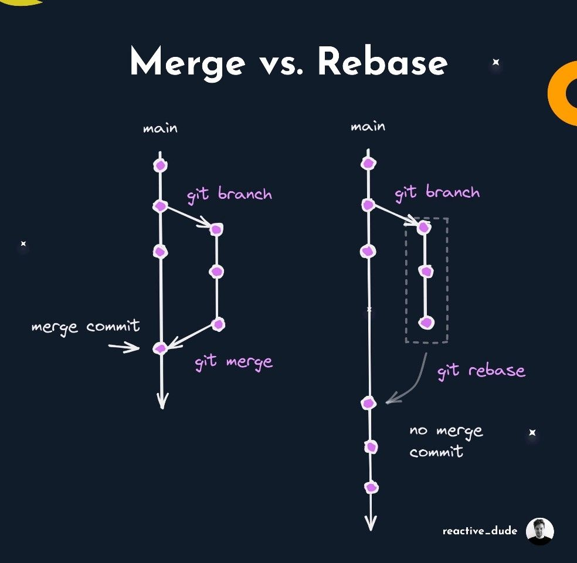
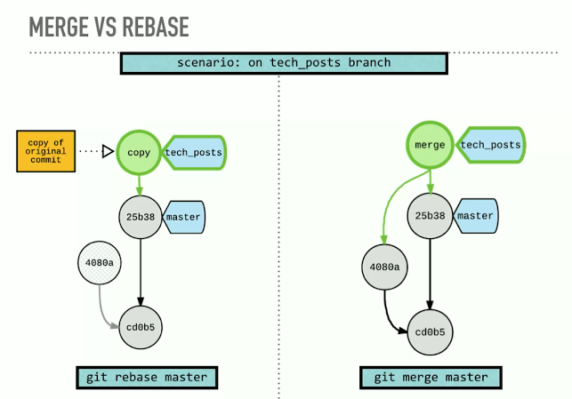

---

### Interactive Rebase : Squash Commits


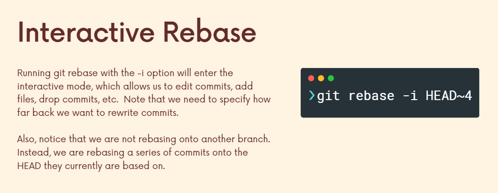

To squash commits together, we use the extremely powerful `git rebase` command.

- telling Git to use `HEAD~3` as the base where all of the other commits (`HEAD~2`, `HEAD~1`, and `HEAD`) will connect to.
  ```bash
  # move commits to have a new base
  git rebase -i HEAD~3
  ```
- The `-i` in the command stands for "interactive".

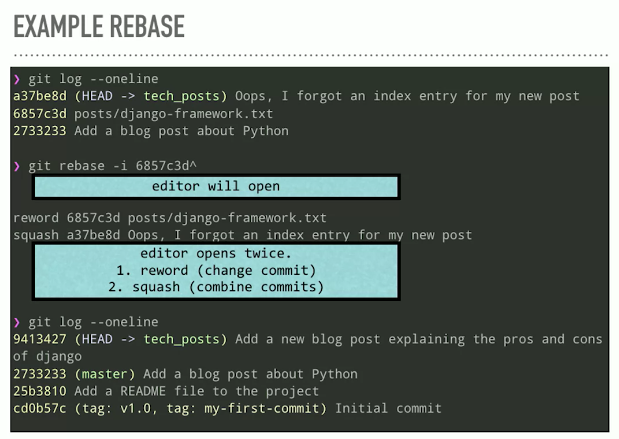

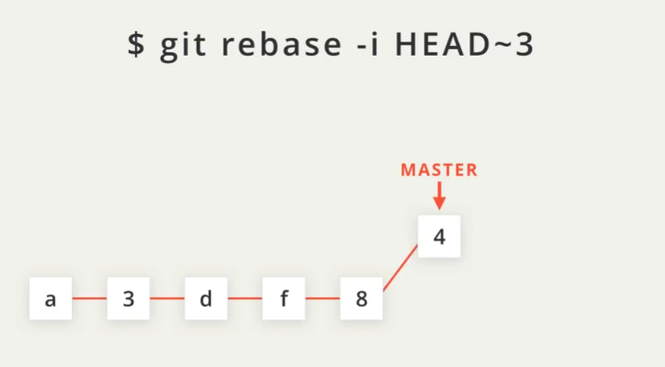
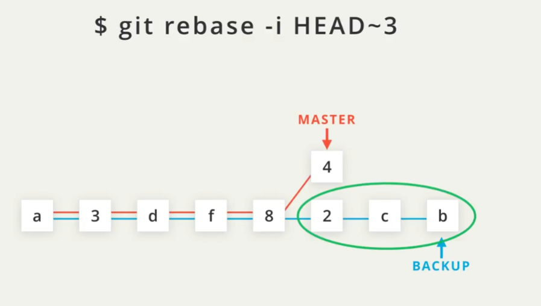

- note: create a `backup branch` before rebasing, so that it's easy to return to your previous state. If you're happy with the rebase, then you can just delete the backup branch!

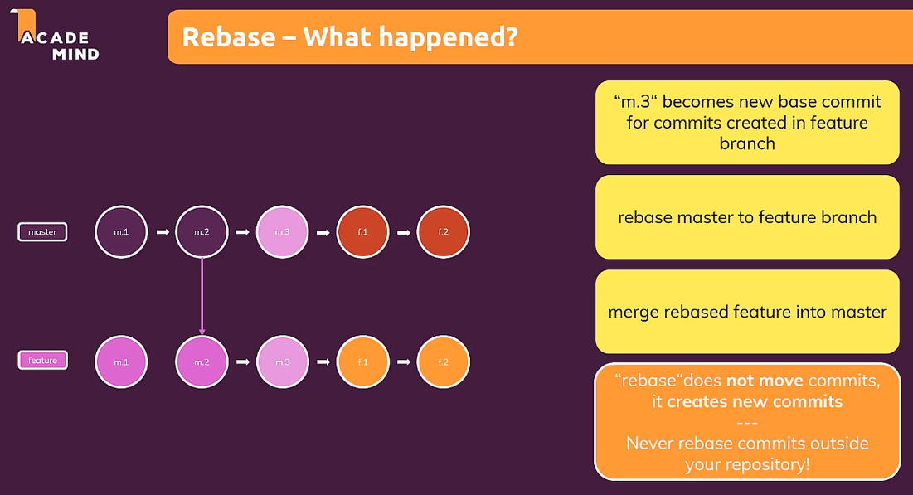

---

### Force Pushing

Using `git rebase` creates a new commit with a new SHA. When you try using `git push` to send this commit up to GitHub, GitHub knew that accepting the push would erase the three separate commits, so it rejected it. So you have to force push the commits through using `git push -f`

---

## Git Three Trees (Git workflow)

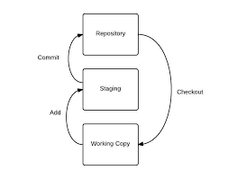
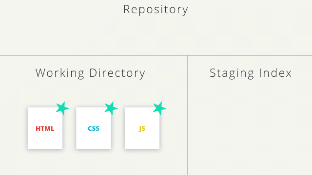

- **working directory**, which contains changes that may not be tracked by Git yet

  - In the working directory, the user can create new files or change existing files that do not yet exist in either the staging index or the repository, and **no Git command is required to do so**.

- **staging index**, which contains changes that we're about to commit into the repository

  - `git add` : move from working to staging index
  - `git rm --cached` : remove from staging index

- **repository**, and that's what's actually being tracked by Git. The changes that Git has, and that it's going to hold onto and keep track of.

---

## Git commands Notes

- moving a file and **renaming** a file are the same thing. Because moving a file to a new file path, is a way of renaming it So we're actually going to use "move" as the way to rename it. So "`git mv"` for short, that's "git + move" and we move the "second_file.txt" to be "secondary_file.txt".

- always make atomic commits
- **Compare commits** :

  ```bash
  git diff 1c16945..9dcff6ef6
  # here we tell git not to show me what's in a commit, but compare two different versions, and show me what changed between them
  ```

  - `git show` => display info(content of commit) about a **one** given commit(most recent one)

- Undo working directory changes

  - `git checkout -- <name of file in the working directory that is un-staged>`

- **Files**:
  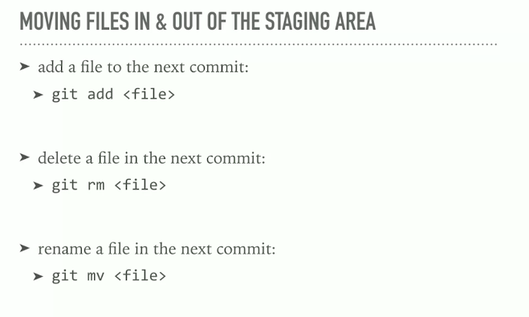

---

## Modifying commits

### Amend: Changing The Last Commit

- **Amend** means It's taking what's in the last commit, bringing it down, adding your new stuff to it, and recommitting it, and generating a new SHA in the process.

  - used if you forgot to add files to a commit or you want to re-write the commit-message

  
  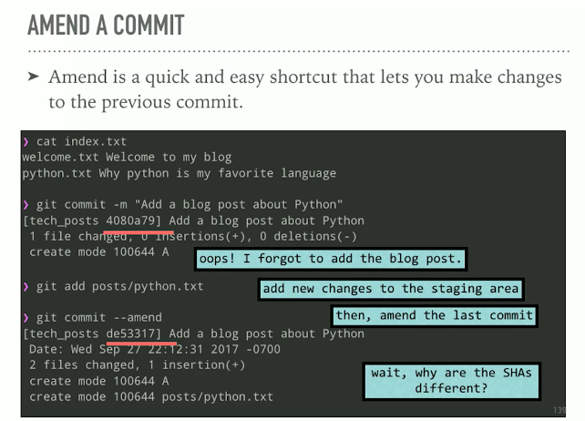
  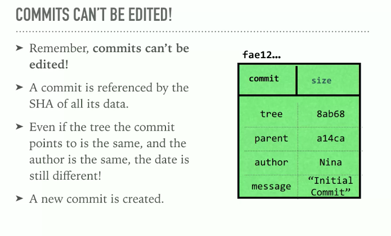

```bash
# first add or remove files to/from staging area, then run:
git commit --amend # --amend flag, you can alter the most-recent commit.
```

---

### Undo changes

#### Going to any previous commit (Time Traveling)

```sh
# Here we go to new brach (Detached head) with the specified commit
git checkout <SHA-of-commit-to-go-to>
```

> **Note**: Don't forget for create new branch from the **Detached head** and if you want you can merge it to your main branch
>  >  > 

- To go back to the normal head: use `git switch <(main/master) or the name of the branch>`

---

#### Undo change in working directory

```sh
# remove changes (from working directory)
git checkout <name of the file or . or -A>
# Or using the new command (restore)
git restore <name of the file or . or -A>
```

```sh
# remove staged changes (from staging area to working directory)
git restore --staged <name of the file or . or -A>
```

```sh
# remove untracked changes(files) (from working directory)
git clean .
```

---

### Resetting Commits

- `Resetting` **erases commits! and changes history**

  - so Don't do it in public repo

- `--hard` : get rid of the commit **and** the changes done to the files.
- `--soft` : get rid of the commit **but** not to modify the files in the working directory
- `--mixed` will take the changes made in the specified commit and move them to the working directory.

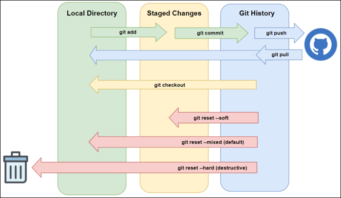

#### removing commits

```bash
git reset --hard <the previous-commit-SHA you want to go to>

git reset --hard HEAD       # (removing HEAD)

git reset --hard HEAD^      # (removing the commit before HEAD)

git reset --hard HEAD~1     # (equivalent to "^")

git reset --hard HEAD~2     # (removing two commits before HEAD)

###################################################################

git log
# to quit seeing commits => `Q` key

# then select the id(SHA) you want wo go to
git reset --hard <SHA>

# or
# The last commit will be removed from your Git history.
git reset --soft HEAD~1  # go back ONE commit
```

- going between commits is **dangerous** so we use `branches`

---

### Reverting A Commit


- When you tell Git to revert a specific commit, Git takes the changes that were made in commit and does the exact opposite of them.
- `Reverting` **creates a new commit** that reverts or undo a previous commit.

```bash
git revert <SHA-of-commit-to-revert-to>
```

---

### Deleting Data Summary

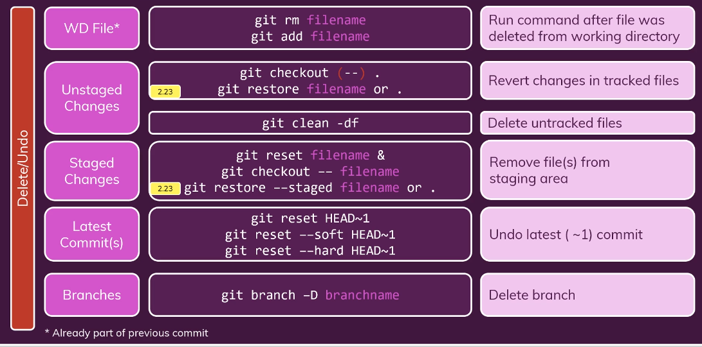

---

## Git add

- `git add`

  - `*` => all items in the folder
  - `.` => remaining items in the folder

- patching files to select what to add (usefull in debugging)

  ```bash
  git add --patch <filename> # (or -p for short) partial add
  git add --p <filename> # (or -p for short) partial add
  ```

- To list the staged files

  ```sh
  git ls-files
  ```

---

## Git Tag

Usually for **versioning**
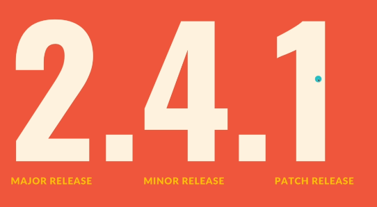

```bash
git tag -a v1.0 # tag the most recent commit
# "-a" flag tells Git to create an annotated tag(flag).

# Adding A Tag To A Past Commit
git tag -a v1.0 a87984

# Deleting A Tag To A Past Commit
git tag -d v1.0

git tag # display all tags that are in the repository.

git log --decorate # The log output displays the newly created tag.
# ex : commit 6fa5f34790808d9f4dccd0fa8fdbc40760102d6e (HEAD -> master, tag: v1.0)
# or:
git log --oneline --decorate

```

---

## Ignore files

- it only applied the rules to **untracked** files, files that are already being tracked are not ignored.

  - to ignore already tracked files:

    ```bash
    # first we remove it from staging area git
    rm --cached <file>
    # then commit the changes
    # Now the ignoring will work
    ```

[This github repo for all recommended casses](<[https://link](https://github.com/github/gitignore)>)

### How to Ignore empty directories

- git by default doesn't track empty directories so we have to put a file in the empty directory >> `.gitkeep`

---

## Push

| GIT Push                                                                                                         | GIT Push origin                                                              |
| ---------------------------------------------------------------------------------------------------------------- | ---------------------------------------------------------------------------- |
| The remote repository is the origin                                                                              | The remote repository is not defined                                         |
| We assume that remote repository is already defined and The work is implicitly pushed into the remote repository | In this, it has to be specified explicitly to be pushed into the repository. |
| only for one repository                                                                                          | It can be used with single as well as multiple repositories                  |

---

### Pushing code explicitly

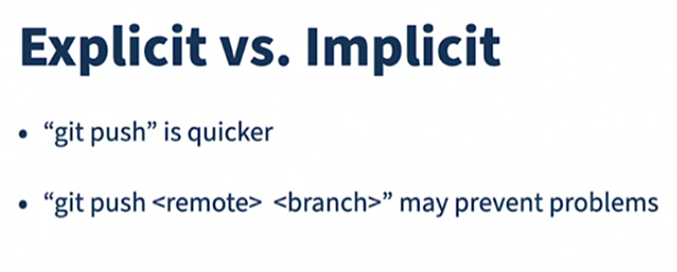

- when you `push` -> **Always** specify `where` you push

---
