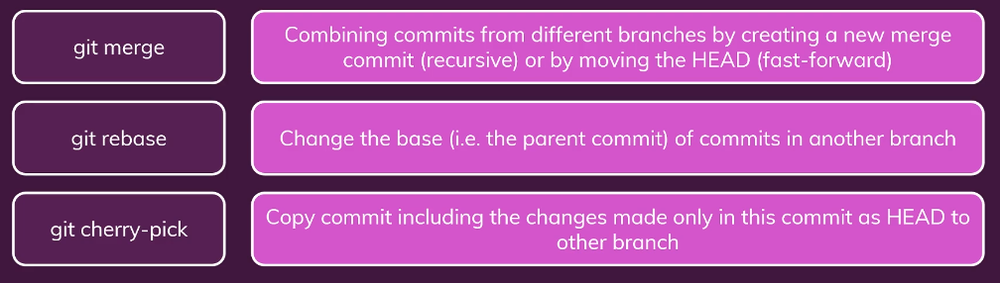
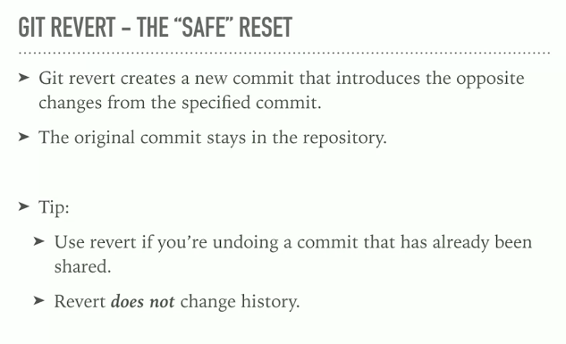
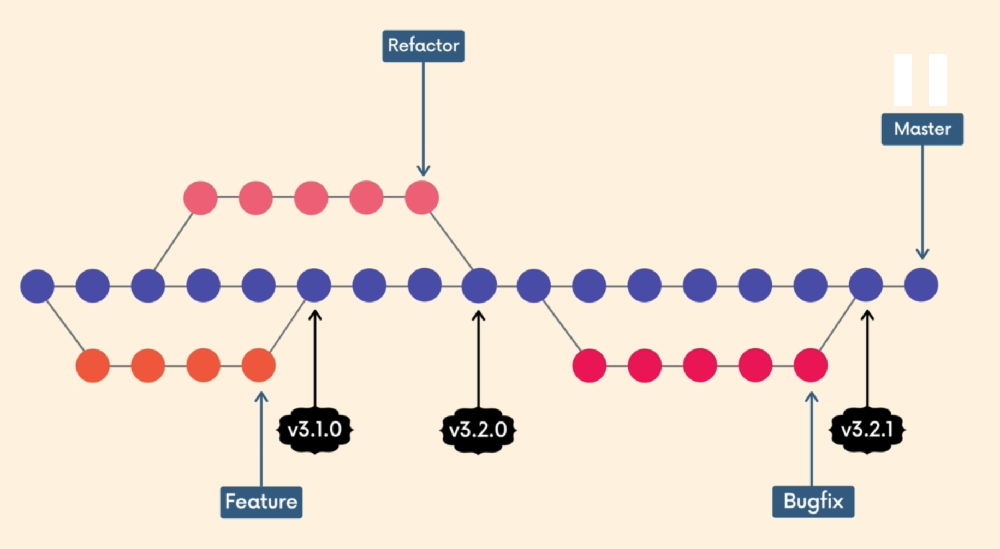
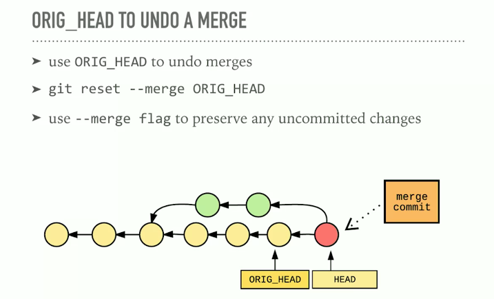

# INDEX

- [INDEX](#index)
  - [Git](#git)
    - [Advantages of distributed version control](#advantages-of-distributed-version-control)
  - [Git Architecture: Three Trees (Git workflow)](#git-architecture-three-trees-git-workflow)
  - [Diff](#diff)
    - [Compare changes across branches](#compare-changes-across-branches)
    - [Compare changes across commits](#compare-changes-across-commits)
  - [commit message](#commit-message)
    - [Writing a commit message guidelines](#writing-a-commit-message-guidelines)
    - [Hash values (SHA-1)](#hash-values-sha-1)
    - [The HEAD pointer](#the-head-pointer)
      - [Referencing commits (`^` , `~`)](#referencing-commits---)
    - [Commit metadata](#commit-metadata)
  - [Branches](#branches)
    - [commands](#commands)
    - [Git stash](#git-stash)
    - [Recommended stash commands](#recommended-stash-commands)
    - [Advance stashing](#advance-stashing)
    - [Merging](#merging)
      - [Fast Forward Merge](#fast-forward-merge)
      - [Types](#types)
    - [Useful notes](#useful-notes)
  - [Rebase](#rebase)
    - [Rebasing with backup for extra safety](#rebasing-with-backup-for-extra-safety)
    - [Merge vs Rebase](#merge-vs-rebase)
    - [Interactive Rebase](#interactive-rebase)
    - [Force Pushing](#force-pushing)
  - [Git commands Notes](#git-commands-notes)
  - [Modifying commits](#modifying-commits)
    - [Amend: Changing The Last Commit](#amend-changing-the-last-commit)
    - [Undo changes](#undo-changes)
      - [Going to any previous commit (Time Traveling)](#going-to-any-previous-commit-time-traveling)
      - [Undo change in working directory](#undo-change-in-working-directory)
    - [Resetting Commits](#resetting-commits)
      - [removing commits](#removing-commits)
    - [Reverting A Commit](#reverting-a-commit)
    - [Deleting Data Summary](#deleting-data-summary)
  - [Git add](#git-add)
  - [Git Tag](#git-tag)
  - [Ignore files](#ignore-files)
    - [How to Ignore empty directories](#how-to-ignore-empty-directories)
  - [Reflogs](#reflogs)
    - [Reflog commands](#reflog-commands)
  - [Git behind the scenes](#git-behind-the-scenes)
    - [Refs Folder](#refs-folder)
    - [heads folder](#heads-folder)
    - [Objects Folder (Git Object)](#objects-folder-git-object)
      - [Blobs](#blobs)
      - [Trees](#trees)
  - [Useful Notes](#useful-notes-1)
    - [Danger Zone](#danger-zone)
      - [Local Destructive Operations](#local-destructive-operations)
      - [Remote Destructive Operations (rewriting history)](#remote-destructive-operations-rewriting-history)
    - [Recover lost work](#recover-lost-work)

---

## Git

Git is software that keeps track of changes that you make to files and directories. And it's especially good at keeping track of text changes.

> Git cheatsheet: [link](https://cs.fyi/guide/git-cheatsheet)

- Git is referred to as a version control system or **VCS**
- they're also called source code management tools or **SCM**
- Git is **distributed version control**. Different users each maintain their own repositories instead of working from a central repository, and the changes are stored as sets or patches, and we're focused on tracking `changes`, not the versions of the documents.
- At its core, Git is like a **key-value store**
  - key -> Hash of the data (SHA-1)
  - value -> Data
- Git does not use **small** tracking files throughout a repository -- everything is contained within the `.git` directory in the top-level directory of the repository.
- Git does not use small tracking files throughout a repository -- everything is contained within the .git directory in the top-level directory of the repository.
  - it does so by taking snapshot of the entire file at each step/stage

### Advantages of distributed version control

- no need to communicate with a central server
- Encourages collaboration and discipline
- allow for "Archive versions" and managing historical data
- no network access required
- no single failure point as (Everyone can keep working. They've each got their own repository) + we can recover from accidental deletions

---

## Git Architecture: Three Trees (Git workflow)

- Requirements for the Architecture:
  - Track everything (title, content, metadata, ....)
    - & must not change the content of tracked files
  - OS independent
  - Unique ID (each git-object has unique id)
  - Track History


- **working directory**, which contains changes that may not be tracked by Git yet

  - In the working directory, the user can create new files or change existing files that do not yet exist in either the staging index(area) or the repository, and **no Git command is required to do so**.

- **staging index(area)**, which contains changes that we're about to commit into the repository

  - > **NOTE:** a clean staging area isn't actually empty, as it actually contains the exact copy of the latest commit

  - `git add` : move from working to staging index
  - `git rm --cached` : remove from staging index

- **repository**, and that's what's actually being tracked by Git. The changes that Git has, and that it's going to hold onto and keep track of.

---

## Diff

- `git diff` lists all the changes in the working directory **that are not staged for the next commit** (shows only different between the working-tree and the index(staging)-tree --> **unstaged changes**).
- `git diff HEAD` compares the changes in the (working directory & staged area) to the last commit
- `git diff --staged` compares the changes in the **staged index** to the **committed versions (the repo)**.

The results showing the difference between the different versions of the file are called --> **Chunks**


### Compare changes across branches

- `git diff branch1..branch2` will list the changes between the tips of branch1 and branch2

### Compare changes across commits

- `git diff commit1-hash..commit2-hash` will list the changes between the tips of commit1 and commit2

---

## commit message

**commit** is a code-snapshot or checkpoint in your local repo


---

### Writing a commit message guidelines

- write a short single line summary of what the changes are (less than 50 characters).
- optionally followed by a blank line and a more complete description
- keep each line to less than 72 characters
- write your commit messages in present tense, not past tense, as the commit message is meant to label the changes. It's a label for what's inside.
- clear and descriptive (explain what it does not why/how)
- develop shorthand for your organization ex `"[css,js]"`, `"bugfix"`,`"#38405"` as issue number

---

### Hash values (SHA-1)

- it's an ID number for each commit to reach each commit
- Each hash value is not only unique, it's directly tied to the **contents** that are inside of it.
  - that's why it's called **content addressable source system** (as we use the content to generate the key)
    
- The algorithm (hashing function) that Git uses is the **Secure Hash Algorithm (SHA-1)**.
  - it generates **40 digits hexadecimal numbers**
  - the value should always be the same if the given input is the same
- why can't we change commits?
  - because changing the data about the commit will have a new **SHA-1 hash**
  - and even if the files don't change, the created date will

---

### The HEAD pointer

> **It's a pointer to the latest commit on the current Branch**
>
> - it usually points at the name of the current branch
> - it can point at a commit too --> (**detached HEAD**)


> It's the place where we left off in our repository with what we've committed.

---

#### Referencing commits (`^` , `~`)

- The main difference between the **hat**`^` and the **tilda**`~` is:
  - when a commit is created from a merge. A merge commit has two parents.
  - With a merge commit, the `^` reference is used to indicate the first parent of the commit while `^2` indicates the second parent.
  - The first parent is the branch you were on when you ran `git merge` while the second parent is the branch that was merged in.


> if you don't specify a number when using `tilde ~` -> it uses **1** by default

---

### Commit metadata

To get the content of the commit object:

```sh
git cat-file -p <SHA or first 5 characters>
```


---

## Branches

> a **Branch** is just a **pointer** to a particular **commit**

A branch is a pin pointed arrow to a commit. When you first create a repository, the default branch you will commit too is the master branch.After you make commits, they will point forward on to the last commit you made on that master branch.


### commands


- list available branches

  ```bash
  git branch
  # HEAD indicates wht branch is active
  ```

- Leaving the Master Branch

  ```bash
  # create a new branch called : "nathan"
  git branch nathan

  # Switched to the branch "nathan"
  git checkout nathan
  git switch nathan

  # or in one line
  git checkout -b nathan # create a branch and switch to it all in one command
  git switch -c nathan # create a branch and switch to it all in one command
  ```

- Go to previous branch

  ```bash
  git checkout -
  ```

- Delete branch

  ```bash
  git branch -d <branch-name>

  # to force delete the branch (usually when it's not fully-merged)
  git branch -D <branch-name>
  ```

- Rename branch (you have to be on that branch)

  ```bash
  git branch -m <oldname> <newname> # Any Branch
  git branch -m <newname> # Current Branch

  # to force delete the branch (usually when it's not fully-merged)
  git branch -D <branch-name>
  ```

---

### Git stash


**Why ?**

- when you are on a branch and make some changes, but don't make any commits, then you want to switch back to another branch:
  - The changes will come with you to the destination branch, or git won't let you switch before committing first **(if there's a conflict between the 2 branches)**

**git stash**:

- helps you save changes that **you are not yet ready to commit**, you can stash changes and then come back to them later
- temporarily shelves (or stashes) all uncommitted changes you've made to your working copy so you can work on something else, and then come back and re-apply them later on.


---

### Recommended stash commands


```sh
git stash # same as `git stash save
git stash pop # get what is in the stash

git stash apply # to apply whatever is stashed without removing it from the stash
```

---

### Advance stashing


```sh
git stash list # to view all stashes (in order of their stashing)
git stash apply stash@{2} # apply the stash with index 2 in the stash-list
```


---

### Merging

**Merge commits** are unique against other commits in the fact that **they have two parent commits**.


- When creating a merge commit Git will attempt to auto magically merge the separate histories for you.
- If Git encounters a piece of data that is changed in both histories it will be unable to automatically combine them.
  - This scenario is a version control conflict and Git will need user intervention to continue.

---

#### Fast Forward Merge

A fast-forward merge can occur when there is a linear path from the current branch tip to the target branch. (didn't do changes(commits) in **master** until merging)

- here when we merge, all we do is **catch up to the same commit**
- in this case there won't be a **merge-commit** in the **log**


> **NOTE**: sometimes you want to prevent this in order to know what branch(feature) caused a bug (specially when merging pull request manually and not on github)
>
> - for this we use :
>
>   ```sh
>   git merge --no-ff <branchName>
>   ```
>
> 

---

#### Types




- Once you have committed the changes and pushed to your branch, you can checkout to the master and `merge`.
- making a merge makes a commit.
- The main difference between the `^` and the `~` is when a commit is created from a merge. A merge commit has two parents. With a merge commit, the `^` reference is used to indicate the first parent of the commit while `^2` indicates the second parent. The first parent is the branch you were on when you ran git merge while the second parent is the branch that was merged in.

```bash
git checkout master
# Switched to branch 'master'
# then :
git merge "nathan"
```

**merge conflict** -> occurs when Git isn't sure which line(s) you want to use from the branches that are being merged.

- Create Git Branch At commit Location

  ```bash
  git branch nathan 42a69f
  # create the nathan branch and have it point to the commit with SHA 42a69f
  ```

- Delete A Branch

  ```bash
  git branch -d nathan
  ```

- See All Branches At Once **Graphically**

  ```bash
  git log --oneline --decorate --graph --all
  ```

  

### Useful notes

- You can't delete a branch that you are currently on, so you have to switch to another branch first.

---

## Rebase

> **Rebasing**: it's used in 2 ways:
>
> - as an alternative to merging
> - as a cleanup tool ([Interactive Rebase](#interactive-rebase))
>
> It's like we're **rewriting history** or **changing the base of the branch** and having more **linear structure** > 

- The problem:
  


- when having conflict when rebasing:

  - follow instructions

  ```sh
  # 1. fix conflict in the editor

  # 2. add conflict files
  git add <conflict files>

  # 3. continue rebasing
  git rebase --continue


  # or to abort rebasing
  git rebase --abort
  ```


---

### Rebasing with backup for extra safety

sometimes you want to rebase, but you're afraid that you will miss something up, no worries you can try this method:


---

### Merge vs Rebase

- Merge takes all the changes in one branch and merges them into another branch in one commit.
- Rebase says I want the point at which I branched to move to a new starting point


---

### Interactive Rebase

Sometimes we want to `rewrite`, `delete`, `rename`, or `record` commits (before sharing them). We can do this using `git rebase`

- here, instead on rebasing to a branch, we rebase to a specific series of commits **(in the same branch)** after we do adjustments to some commits
  - we can specify how far we want to go back using:
    - `SHA` of the commit
    - `HEAD` reference


- after writing the command, the editor will open with options next to the commits:
  
  

To squash commits together, we use the extremely powerful `git rebase` command.

- telling Git to use `HEAD~3` as the base where all of the other commits (`HEAD~2`, `HEAD~1`, and `HEAD`) will connect to.

  ```bash
  # move commits to have a new base
  git rebase -i HEAD~3
  ```

- The `-i` in the command stands for "interactive".


- note: create a `backup branch` before rebasing, so that it's easy to return to your previous state. If you're happy with the rebase, then you can just delete the backup branch!


---

### Force Pushing

Using `git rebase` creates a new commit with a new SHA. When you try using `git push` to send this commit up to GitHub, GitHub knew that accepting the push would erase the three separate commits, so it rejected it. So you have to force push the commits through using:

```sh
git push -f
```

---

## Git commands Notes

- when command has `--staged`, it do something between (staging-area and the repo) or between the (staging-area and the working tree)

- moving a file and **renaming** a file are the same thing. Because moving a file to a new file path, is a way of renaming it So we're actually going to use "move" as the way to rename it. So "`git mv"` for short, that's "git + move" and we move the "second_file.txt" to be "secondary_file.txt".

- always make **atomic commits**
  - means that a commit should focus on a single thing
  - this makes it much easier to undo changes later on, and makes your code easier to review.
- **Compare commits** :

  ```bash
  git diff 1c16945..9dcff6ef6
  # here we tell git not to show me what's in a commit, but compare two different versions, and show me what changed between them
  ```

- `git show` => display info(content of commit) about a **one** given commit(most recent one)

  ```sh
  git show <commit> # show commit and contents
  git show <commit>:<file> # look at file from another commit
  ```

- Undo working directory changes

  - `git checkout -- <name of file in the working directory that is un-staged>`

- **Files**:
  

---

## Modifying commits

### Amend: Changing The Last Commit

- **Amend** means It's taking what's in the last commit, bringing it down, adding your new stuff to it, and recommitting it, and generating a new SHA in the process.

  - used if you forgot to add files to a commit or you want to re-write the commit-message

  
  
  
  

```bash
# first add or remove files to/from staging area, then run:
git commit --amend # --amend flag, you can alter the most-recent commit.
```

---

### Undo changes

#### Going to any previous commit (Time Traveling)

```sh
# Here we go to new brach (Detached head) with the specified commit
git checkout <SHA-of-commit-to-go-to>
```

- you will get this message: **"You are in detached HEAD state"**
  - this is because **HEAD** points to **Current-branch reference** and not a specific commit, so when we make **HEAD** point to a specific commit, we become in a **"detached HEAD state (without a branch reference)"**


> **Note**: Don't forget for create new branch from the **Detached head** and if you want you can merge it to your main branch


- To go back to the normal head: use `git switch <(main/master) or the name of the branch>`

> **dangling commits** -> are those commits that no longer be referenced in git (don't point to a branch), they will be garbage collected
>
> - example: when you make a commit from a `detached-HEAD`

---

#### Undo change in working directory

- Discard changes (**from working directory**), this revert the file/s back to whatever it was when you last committed

  ```sh
  git checkout HEAD <file or -A>
  # or
  git checkout <-- file or -A>
  # or using the new command (restore)
  git restore <file or -A>
  ```

- discard staged changes (un-stage changes ) **from staging area to working directory**

  ```sh
  git restore --staged <file or -A>
  ```

- remove untracked changes(files) (from working directory)

  ```sh
  git clean .
  ```

---

### Resetting Commits

- `Resetting` **erases commits! and changes history**

  - it actually moves the branch **HEAD-pointer** backwards, eliminating commits
  - so Don't do it in public repo

- `--hard` : get rid of the commit **and** the changes done to the files.
- `--soft` : get rid of the commit **but** not to modify the files in the working directory
- `--mixed` will take the changes made in the specified commit and move them to the working directory.


#### removing commits

```bash
# go back to a previous commit and remove the commits up to the specified SHA
git reset --hard <the previous-commit-SHA you want to go to>

git reset --hard HEAD       # (removing HEAD)

git reset --hard HEAD^      # (removing the commit before HEAD)

git reset --hard HEAD~1     # (equivalent to "^")

git reset --hard HEAD~2     # (removing two commits before HEAD) (going backward 2 steps)

###################################################################

git log
# to quit seeing commits => `Q` key

# then select the id(SHA) you want wo go to
git reset --hard <SHA>

# or
# The last commit will be removed from your Git history.
git reset --soft HEAD~1  # go back ONE commit
```

- going between commits is **dangerous** so we use `branches`

---

### Reverting A Commit



```bash
git revert <SHA-of-commit-to-revert-to>
```

- When you tell Git to revert a specific commit, Git takes the changes that were made in commit and does the exact opposite of them.
- `Reverting` **creates a new commit** that reverts or undo a previous commit.
- why use it instead of `Reset` ?
  - it comes to **collaboration**, as if you want to reserve some commits that other people already have on their machines, you should use `revert`

---

### Deleting Data Summary


---

## Git add

- `git add`

  - `*` => all items in the folder
  - `.` => remaining items in the folder

- **Partial adding**: It's **patching** files to select what to add (useful in debugging)

  ```bash
  git add --patch <filename> # (or -p for short) partial add
  git add --p <filename> # (or -p for short) partial add
  ```

- To list the staged files

  ```sh
  git ls-files
  ```

---

## Git Tag

Tags are pointers that refer to particular points in Git-history, we can mark a particular moment in time with a tag, Tags are most often used to **mark version releases** in projects.

- a tag always refers to the same commit, **It's just a label for a commit**
  
- **Annotated tags:** points to a commit, but stores additional information (`author`, `message` `date`)

**Semantic Versioning**: it outlines a standardized versioning system for software releases, it provides a consistent way for developers to give meaning to their software releases (how big of a change is this releas e?)


```bash
git tag # show all tags that are in the repository.

git tag -a v1.0 # tag the most recent commit
# "-a" flag tells Git to create an annotated tag(flag).

# Adding A Tag To A Past Commit
git tag -a v1.0 a87984
# to replace tags from other commit --> `-f` to force it

# Deleting A Tag To A Past Commit
git tag -d v1.0

git log --decorate # The log output displays the newly created tag.
# ex : commit 6fa5f34790808d9f4dccd0fa8fdbc40760102d6e (HEAD -> master, tag: v1.0)
# or:
git log --oneline --decorate
```

- **Pushing Tags**:

  - by default, `git push` command doesn't transfer tags to remote servers. if you have a lot of tags that you want to push up, you can use the `--tags` option to the command

  ```sh
  git push --tags
  ```

---

## Ignore files

- it only applied the rules to **untracked** files, files that are already being tracked are not ignored.

  - to ignore already tracked files:

    ```bash
    # first we remove it from staging area git
    rm --cached <file>
    # then commit the changes
    # Now the ignoring will work
    ```

[This github repo for all recommended casses](<[https://link](https://github.com/github/gitignore)>)

### How to Ignore empty directories

- git by default doesn't track empty directories so we have to put a file in the empty directory >> `.gitkeep`

---

## Reflogs

Git keeps a record of when the tips of branches and other references were updated in the repo. We can view and update these **reference logs** using the `git reflog` command

> This will be in **logs/refs** folder in `.git` folder

- in `heads` folder, you will find logs with each time we changed the **HEAD** of the branch (as we make more commits)
- Git only keeps **reflogs** on your **local activity**, they're not shared with collaborators remotely
  - reflogs also expire each 90 days

### Reflog commands

```sh
# show the log of a specific reference (it defaults to HEAD)
git reflog show <branch name>
```

- things that you can't find with `git log` may be found with `git reflog`

- passing `reflog` references
  

  ```sh
  git checkout HEAD@{2} # 2 moves ago
  ```

- **IMPORTANT NOTE** -> one of the advantages is that we can use **reflog entries** to access commits (**removed commits**) that seem lost (reset) and are not appearing in `git log`

  - > it's useful when you go back to a commit in the past using `reset` or any command and you want to see all commits so that you can do a fast-forward as now `git log` won't show the commit that we reset from

  ```sh
  git reflog show master # look for that commit and copy its SHA-1
  git reset --hard <SHA of the commit> # will make the tip of your branch (the HEAD of the branch) to that commit
  ```

---

## Git behind the scenes

This is inside `.git` directory

### Refs Folder

- inside of it there's **heads** directory that contains one file per branch in the repository, each file
  - is named after a branch
  - contains the hash of the commit at the tip of the branch
- there'a also **tags** and **remotes** directories

### heads folder

It's a text file that keeps track of where **HEAD** points.

- if it contains `ref/heads/master` this means that **HEAD** is pointing to the master branch

  - to know which branch the head is pointing at:

    ```sh
    cat .git/HEAD # ref: refs/heads/master
    ```

- in detached HEAD, the HEAD file contains a commit hash instead of a branch-reference

### Objects Folder (Git Object)

it contains all the repo files, this is where Git stores the backups of (files, commits) in repo

- the files are compressed and encrypted so that won't look like much! (**Hashed**)

#### Blobs


- Where are blobs stored?
  

- They're objects for tracked files where Git stores Data
- They're **binary large objects**, they're the object type that Git uses to store the contents of files in a given repository,
  - they just store the contents of a file

#### Trees


- It's an object for tracked folders
- a tree contains pointers (using SHA-1) to
  - blobs
  - other trees
  - and metadata (type of pointer (blob/tree)), filename, mode
    

---

## Useful Notes

> Git knows the history, by reading the parent in the tree/blob file and traversing backwards (linked list)

### Danger Zone

#### Local Destructive Operations


#### Remote Destructive Operations (rewriting history)


---

### Recover lost work


- undo a merge:
  

- finding commits that aren't referenced anymore:
  
