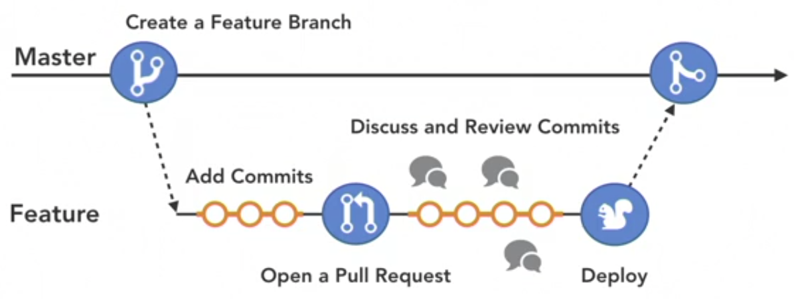
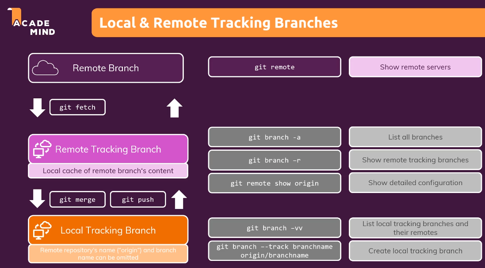
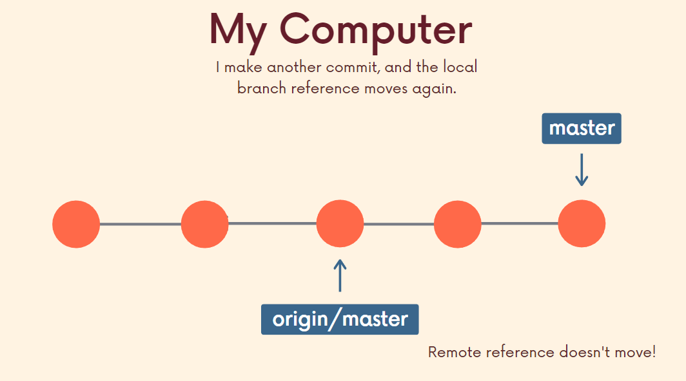
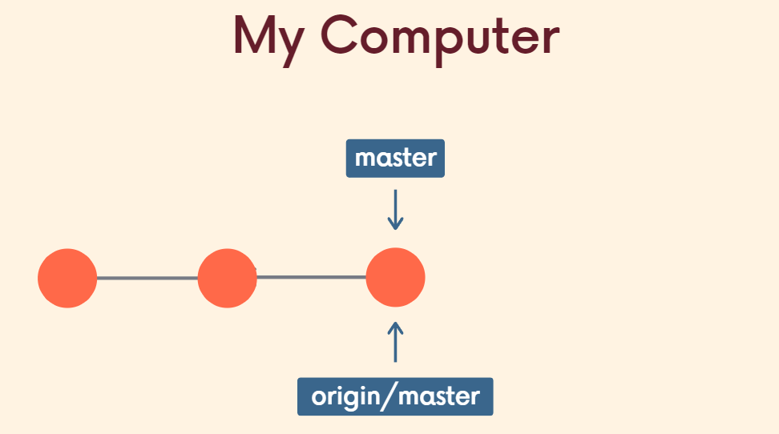
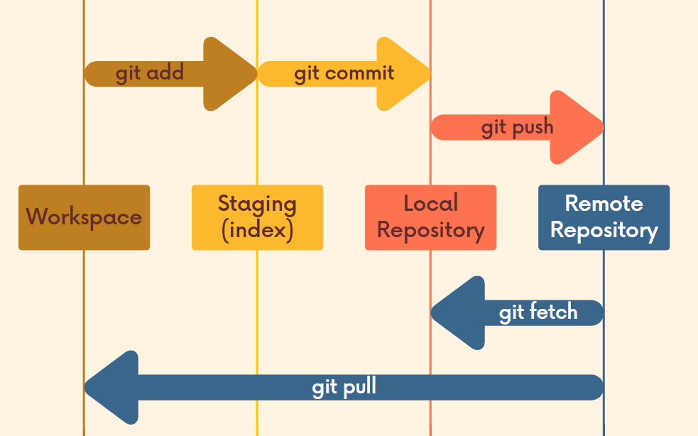
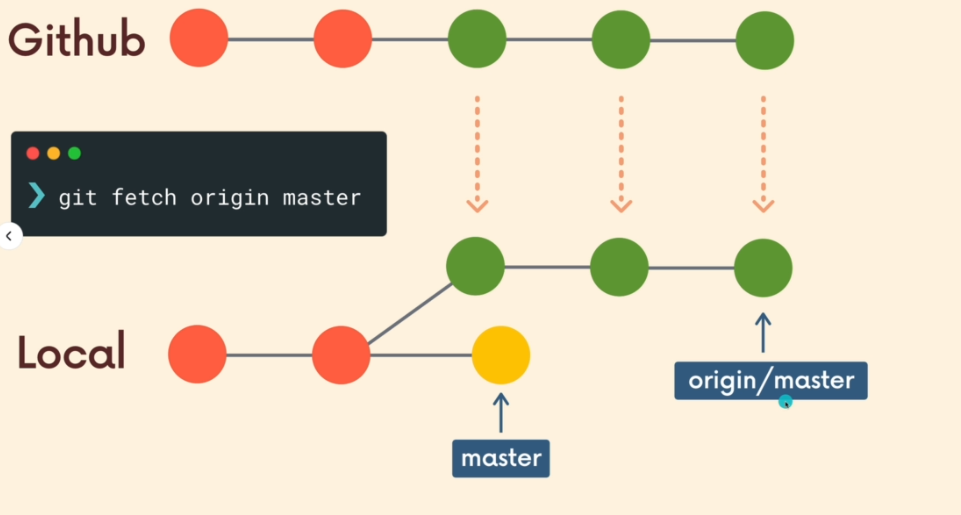
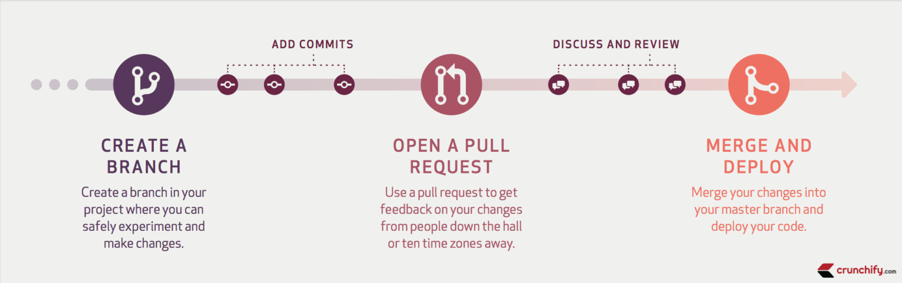

## INDEX

- [INDEX](#index)
- [configuration](#configuration)
- [Github workflow](#github-workflow)
- [Working With Remotes](#working-with-remotes)
  - [Sending Commits](#sending-commits)
  - [Pulling Changes](#pulling-changes)
    - [`Git pull`](#git-pull)
    - [`Git fetch`](#git-fetch)
  - [Forking a Repository](#forking-a-repository)
- [Pull Request](#pull-request)
  - [Staying In Sync With A Remote Repository](#staying-in-sync-with-a-remote-repository)
    - [Include Upstream Changes](#include-upstream-changes)
- [Notes](#notes)

---

## configuration

```bash
git config --global user.name "user"
git config --global user.email "user@example.com"
```

---

## Github workflow



---

## Working With Remotes

- the word `origin` is just the default name that's used when you git clone a remote repository for the first time.

- `git remote` command is used to create and manage remote repositories.
- `git remote add` is used to add a connection to a new remote repository.

- `git remote -v` displays both the shortname and the URL.

- command to create a connection from my local repository to the remote repository in github

  ```sh
  git remote add origin https://github.com/richardkalehoff/RichardsFantasticProject.git
  ```



---

### Sending Commits

- The `git push` command takes:

  - the shortname of the remote repository you want to send commits to
  - the name of the branch that has the commits you want to send

```bash
# send commits from a local repository to a remote repository.
git push <remote-shortname> <branch>
# or
git push origin master
```

- `origin/master` is called a tracking branch.
  - So the tracking branch origin/master is telling us that the remote origin has a master branch that points to commit 9b7d28f (and includes all of the commits before 9b7d28f).

---

### Pulling Changes

> 
> So, I have to use **git (pull or push)** to make them catch-up like this:
> 

---



#### `Git pull`

```bash
# retrieve the commits from the master branch on the origin remote repository.
git pull origin master
```

#### `Git fetch`



Git fetch is used to retrieve commits from a remote repository's branch but **it does not automatically merge the local branch with the remote tracking branch after those commits have been received**.

```bash
# retrieve the commits from the master branch on the origin remote repository.
git fetch origin master
```

- You can think of `git fetch` as half of a `git pull`. The other half of `git pull` is the merging aspect.

---

### Forking a Repository

In version control terminology if you `fork` a repository that means you duplicate it. Typically you fork a repository that belongs to someone else. So you make an identical copy of their repository and that duplicate copy now belongs to you.

- This concept of "forking" is also different from "cloning".

  - When you clone a repository, you get an identical copy of the repository. But cloning happens on your local machine and you clone a remote repository.
  - When you fork a repository, a new duplicate copy of the remote repository is created. This new copy is also a remote repository, but it now belongs to you.

- Forking is an action that's done on a hosting service, like GitHub.

---

## Pull Request

A pull request is a request to the original or source repository's maintainer to include changes in their project that you made in your fork of their project. **You are requesting that they pull in changes you've made**.



---

### Staying In Sync With A Remote Repository

When working with a project that you've forked. The original project's maintainer will continue adding changes to their project. You'll want to keep your fork of their project in sync with theirs so that you can include any changes they make.


#### Include Upstream Changes


- To stay up to date and get commits from a source repository into your forked repository on GitHub you need to:

  - get the cloneable URL of the source repository

  - create a new remote with the `git remote add` command

    - use the shortname `upstream` to point to the source repository

  - fetch the new `upstream` remote

  - merge the `upstream`'s branch into a local branch

  - push the newly updated local branch to your origin repo

---

## Notes

- `Assign yourself`

  - When you’re assigned to an issue or pull request, it tells repository visitors and contributors that you'll be facilitating the conversation or task

- in `Github desktop` you can select things to commit instead of making all the changes in one commit
  - to do this : `Highlight the lines you want`
